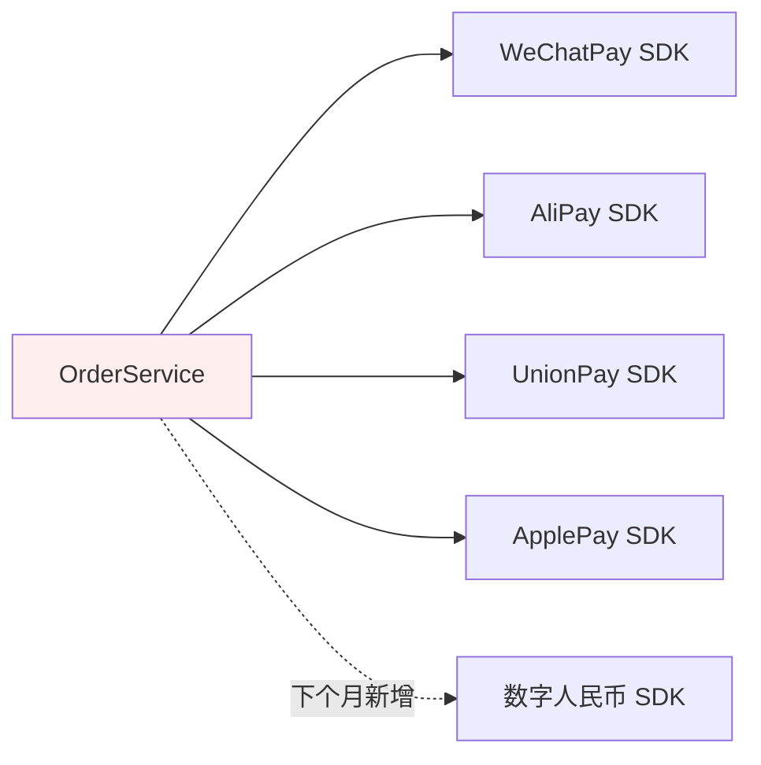
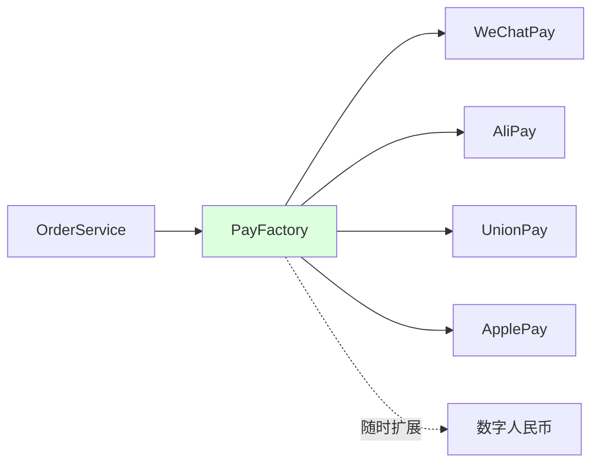
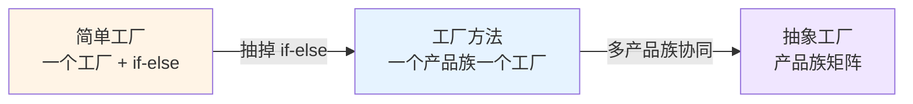
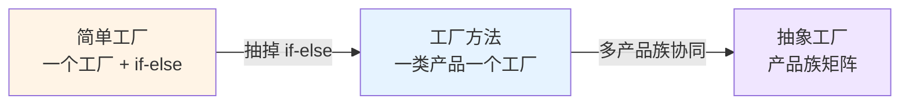
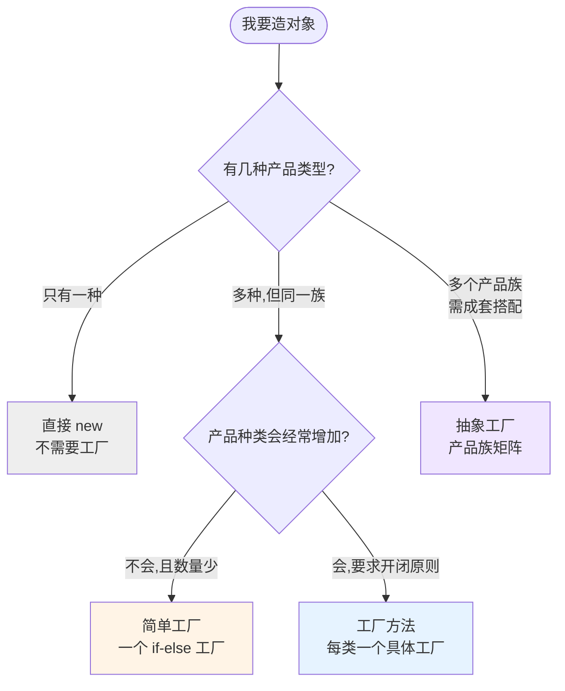
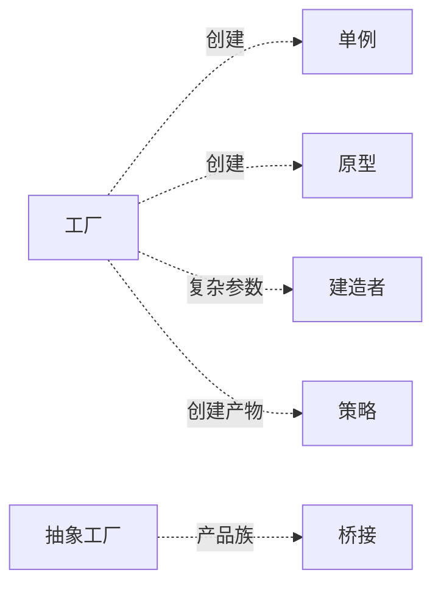

# 第三卷第2章：工厂模式设计思想

> **📚 本篇渐进学习节奏（建议按顺序食用）**
>
> 1. **第 01 节 · 案例引入** — 看一段"凌晨支付事故"的真实代码，先感受痛
> 2. **第 02 节 · 模式总览** — 工厂三件套的演化路线图（简单 → 方法 → 抽象）
> 3. **第 03 节 · 简单工厂** — 把 if-else 抽出来，享受第一波红利
> 4. **第 04 节 · 工厂方法** — 简单工厂的开闭原则被打脸，进化为多态工厂
> 5. **第 05 节 · 抽象工厂** — 当产品"成族出现",工厂方法也救不了
> 6. **第 06 节 · 总结决策** — 三种工厂如何选？什么时候反而不该用？
>
> 阅读到任何一节卡壳，直接跳回上一节复盘场景；本篇代码均可直接运行。

#### 目录介绍
- [01.案例引入与思考](#01案例引入与思考)
    - [1.1 痛点场景](#11-痛点场景)
    - [1.2 它哪里不舒服](#12-它哪里不舒服)
    - [1.3 引出本篇主角](#13-引出本篇主角)
- [02.工厂模式设计](#02工厂模式设计)
    - [2.1 工厂模式类型](#21-工厂模式类型)
    - [2.2 工厂模式思考](#22-工厂模式思考)
    - [2.3 思考一个题目](#23-思考一个题目)
- [03.简单工厂介绍](#03简单工厂介绍)
    - [3.1 简单工厂背景](#31-简单工厂背景)
    - [3.2 简单工厂定义](#32-简单工厂定义)
    - [3.3 简单工厂结构](#33-简单工厂结构)
    - [3.4 简单工厂案例](#34-简单工厂案例)
    - [3.5 简单工厂分析](#35-简单工厂分析)
    - [3.6 简单工厂场景](#36-简单工厂场景)
    - [3.7 简单工厂不足](#37-简单工厂不足)
- [04.工厂方法介绍](#04工厂方法介绍)
    - [4.1 工厂方法背景](#41-工厂方法背景)
    - [4.2 工厂方法定义](#42-工厂方法定义)
    - [4.3 工厂方法结构](#43-工厂方法结构)
    - [4.4 工厂方法案例](#44-工厂方法案例)
    - [4.5 工厂方法分析](#45-工厂方法分析)
    - [4.6 工厂方法场景](#46-工厂方法场景)
    - [4.7 工厂方法不足](#47-工厂方法不足)
- [05.抽象工厂介绍](#05抽象工厂介绍)
    - [5.1 抽象工厂背景](#51-抽象工厂背景)
    - [5.2 抽象工厂定义](#52-抽象工厂定义)
    - [5.3 抽象工厂结构](#53-抽象工厂结构)
    - [5.4 抽象工厂案例](#54-抽象工厂案例)
    - [5.5 抽象工厂分析](#55-抽象工厂分析)
    - [5.6 抽象工厂场景](#56-抽象工厂场景)
    - [5.7 抽象工厂不足](#57-抽象工厂不足)
- [06.工厂模式总结](#06工厂模式总结)
    - [6.1 工厂设计总结](#61-工厂设计总结)
    - [6.2 如何选择](#62-如何选择)
    - [6.3 模式联动与边界](#63-模式联动与边界)


## 01.案例引入与思考

> **本篇主线**：日常开发中最常见的"对象创建分支爆炸"

### 1.1 痛点场景

> **🔥 模拟事故复盘 · 双 11 凌晨 0:47**
>
> 大促首小时，运营紧急通知："Apple Pay 渠道密钥 30 分钟前过期了，必须立即接入苹果新发的 V2 SDK！"
> 接手的同事打开 `OrderService.pay()`，往里塞了第 5 个 `else if`，连带把"WeChatPay 用了 3 年的旧构造方式"一起改了。
> 1 分钟后灰度上线 — **微信支付雪崩，订单全量失败**。
> 排查发现：他在改 ApplePay 分支时，无意中把上面 WeChatPay 的 `setMchId` 顺序挪了一下，触发了 SDK 内部一个隐藏校验。
>
> **事故根因不在 ApplePay，而在"创建逻辑塞在业务类里，改一个动全身"。**

代码长这样（事故现场原貌）：

```java
public class OrderService {
    public void pay(String type, BigDecimal money) {
        if ("wechat".equals(type)) {
            WeChatPay pay = new WeChatPay();
            pay.setAppId("wx123");
            pay.setMchId("...");
            pay.connect();
            pay.charge(money);
        } else if ("alipay".equals(type)) {
            AliPay pay = new AliPay();
            pay.setAppId("ali123");
            pay.setPrivateKey("...");
            pay.connect();
            pay.charge(money);
        } else if ("unionpay".equals(type)) {
            // ... 又是 5 行初始化
        } else if ("applepay".equals(type)) {
            // ... 又是 5 行初始化
        }
    }
}
```

画一张依赖图，瞬间就能看出问题：



业务类被 4+ 个三方 SDK 紧紧绑死，每加一个就要回来改它 — 而**这里改一行，可能错在十米之外**。

### 1.2 它哪里不舒服

- ❌ **业务方背了创建逻辑**：`OrderService` 本来只关心"下单 + 调用支付"，结果把 4 种支付的 SDK 初始化、密钥、连接全揽下来了；
- ❌ **改一个就影响全员**：明天接入"数字人民币"，必须翻进 `OrderService` 加 `else if`，违反开闭原则；
- ❌ **测试灾难**：想测下单流程，必须把 4 个三方 SDK 一起 Mock，单元测试瞬间膨胀；
- ❌ **SDK 升级风险扩散**：`WeChatPay` 构造参数变了，所有写过 `new WeChatPay()` 的地方都要改。

> 这类 "**根据条件选择不同对象**、**对象创建过程复杂**、**调用方不该关心怎么造**" 的场景，正是工厂模式的主战场。

### 1.3 引出本篇主角

> **工厂模式的核心思想**：把"new 谁、怎么 new"这件事从业务里抽离，封装到一个专门的工厂里。调用方只说"我要哪一类"，剩下的留给工厂。



工厂模式不是一个模式，而是三件套——**简单工厂、工厂方法、抽象工厂**，它们沿着"灵活度↑ / 复杂度↑"的轴一步步演化。本篇按这条演化路径讲清楚每一步在解决什么、付出什么。



---

## 02.工厂模式设计

工厂模式不是一个模式，而是**三件套**——简单工厂、工厂方法、抽象工厂——沿着"灵活度↑ / 复杂度↑"的轴一步步演化：



> **阅读策略**：本篇用一个"咖啡店点餐系统"从头贯穿到尾。03-05 节每节回答同一个问题——"产品种类/产品族一变，上一节的方案哪个墙角被踢破了？"顺着这个演化逻辑读，比直接看定义高效 10 倍。


## 03.简单工厂介绍

### 3.1 简单工厂背景

**探索问题**：上一节 1.1 的支付案例里，`OrderService` 上背了 4 个 SDK 初始化。于是我们问一个问题："能不能把 *创建* 这件事抽走，剩下的谁都不管？"

考虑一个更抽象的场景：一个软件系统可以提供多个外观不同的按钮（如圆形按钮、矩形按钮、菱形按钮等），这些按钮都源自同一个基类，不同的子类修改了部分属性从而可以呈现不同外观。

调用方不想记住具体类名，只想传一个参数、拿一个按钮。这就是 "简单工厂" 要解决的原型场景——**这个工厂本质上是一张 "参数 → 实例" 的查找表**。

### 3.2 简单工厂定义

简单工厂模式(Simple Factory Pattern)：又称为静态工厂方法(Static Factory Method)模式，它属于类创建型模式。在简单工厂模式中，可以根据参数的不同返回不同类的实例。简单工厂模式专门定义一个类来负责创建其他类的实例，被创建的实例通常都具有共同的父类。

### 3.3 简单工厂结构

简单工厂模式包含如下角色：

1. Factory：工厂角色 。工厂角色负责实现创建所有实例的内部逻辑
2. Product：抽象产品角色 。抽象产品角色是所创建的所有对象的父类，负责描述所有实例所共有的公共接口
3. ConcreteProduct：具体产品角色 。具体产品角色是创建目标，所有创建的对象都充当这个角色的某个具体类的实例。


### 3.4 简单工厂案例

回到 1.1 的支付事故——`OrderService` 里有 4 个 if-else。先看"咖啡"这个更干净的案例：

```java
// 抽象产品：咖啡
public abstract class Coffee {
    public abstract String getName();
    public void addMilk()  { System.out.println("加奶..."); }
    public void addSugar() { System.out.println("加糖..."); }
}

// 具体产品
public class AmericanCoffee extends Coffee {
    public String getName() { return "美式咖啡"; }
}
public class LatteCoffee extends Coffee {
    public String getName() { return "拿铁咖啡"; }
}

// 工厂：参数驱动创建
public class SimpleFactory {
    public Coffee createCoffee(String type) {
        if ("american".equals(type)) return new AmericanCoffee();
        if ("latte".equals(type))    return new LatteCoffee();
        throw new RuntimeException("没有这种咖啡！");
    }
}

// 调用方：不知道自己拿的是哪个子类
CoffeeStore store = new CoffeeStore();
Coffee coffee = store.orderCoffee("american");   // 多态，工厂里已完成选择
```

**核心收益**：`CoffeeStore` 不再 `import` 任何具体咖啡类——它只认识 `Coffee` 和 `SimpleFactory`。新增一种咖啡，只改工厂里的 if-else，调用方一行不动。

> 回到支付事故现场：`OrderService` 从 60+ 行 if-else 变成"拿工厂、调 charge" 3 行，改 ApplePay 不再误伤 WeChatPay。

### 3.5 简单工厂分析

**为什么这么设计**：把"选择哪个子类"从调用方身上拿走，集中到工厂。后果有三：创建与使用独立变化（SRP）、调用方只依赖抽象（DIP）、创建逻辑单点维护。

**付出了什么代价**：工厂类变成了 if-else 集中营。加新产品 → 改工厂类 → 违反开闭原则。简单工厂是"可读性 × 可维护性"的权衡——产品种类少且稳定时最香。

### 3.6 简单工厂场景

1. 工厂负责创建的对象**种类少**——工厂逻辑不会过于复杂；
2. 调用方**无需关心创建细节**——只传参数，不记类名。

经典应用：`java.text.DateFormat.getInstance()`、`KeyGenerator.getInstance("DESede")`。

### 3.7 简单工厂不足

简单工厂的 if-else 在产品种类膨胀后会变成"Hard Code 坟场"——每加一种新咖啡就要进工厂类改代码，而这正是开闭原则的大忌。下一节工厂方法就是来解决这个问题的。


## 04.工厂方法介绍

### 4.1 工厂方法背景

**上一节的问题**：简单工厂被开闭原则挡在门外——加一种咖啡必须改 if-else。有没有办法"加新产品只加类不改旧代码"？

**核心思路**：把 if-else 拆成多态——一个产品一个工厂子类，调用方面向抽象工厂接口。本质是把"编译期分支选择"转化为"运行期多态调度"，天然满足开闭原则。

### 4.2 工厂方法定义

定义一个创建对象的抽象接口，让子类决定实例化哪个具体产品——将产品类的实例化延迟到工厂子类中完成。

### 4.3 工厂方法结构

| 角色 | 职责 |
|:---|:---|
| Product（抽象产品） | 定义产品规范 |
| ConcreteProduct（具体产品） | 实现抽象产品，与具体工厂一一对应 |
| Factory（抽象工厂） | 声明创建产品的接口 |
| ConcreteFactory（具体工厂） | 实现抽象工厂，返回具体产品 |

### 4.4 工厂方法案例

产品类代码和简单工厂完全一样，无需改动。新增的是工厂体系：

```java
// 抽象工厂接口
public interface CoffeeFactory {
    Coffee createCoffee();
}

// 具体工厂——每个产品一个工厂
public class LatteCoffeeFactory implements CoffeeFactory {
    public Coffee createCoffee() { return new LatteCoffee(); }
}
public class AmericanCoffeeFactory implements CoffeeFactory {
    public Coffee createCoffee() { return new AmericanCoffee(); }
}

// CoffeeStore 依赖抽象工厂
public class CoffeeStore {
    private CoffeeFactory coffeeFactory;
    public void setCoffeeFactory(CoffeeFactory f) { this.coffeeFactory = f; }
    public Coffee orderCoffee() {
        Coffee coffee = coffeeFactory.createCoffee();
        coffee.addMilk(); coffee.addSugar();
        return coffee;
    }
}

// 新增摩卡咖啡——加两个类，原有代码一行不动
public class MochaCoffee extends Coffee {
    public String getName() { return "摩卡咖啡"; }
}
public class MochaCoffeeFactory implements CoffeeFactory {
    public Coffee createCoffee() { return new MochaCoffee(); }
}
```

### 4.5 工厂方法分析

相比简单工厂，工厂方法用"一个产品一个工厂"的代价换来了开闭原则。但这也付出了两个代价：

1. **类成对增长**：添加一种产品同时要加一个工厂类——产品多了，IDE 搜 `*Factory` 翻好几屏；
2. **抽象层增加阅读成本**：调用方要理解"抽象产品 + 抽象工厂 + 运行期多态"三层间接关系。

**🚨 反面踩坑**：某跨境电商接了 30 个国家支付渠道，严格按工厂方法写了 30 个 `XxxPayment` + 30 个 `XxxPaymentFactory` → 60 个类，新人直接劝退。

> **选型口诀**：产品 3~8 种、变动频繁 → 工厂方法；产品三五种、三年不变 → 简单工厂甚至直接 new。


## 05.抽象工厂介绍

### 5.1 抽象工厂背景

**上一节的遗留问题**：工厂方法只处理"一类产品"。当咖啡店不仅卖咖啡、还要卖配套的甜点，而且**不能"乱搭"**——意大利风味不能上美式甜点——工厂方法就散架了。

**关键概念——产品族**：一组必须"成套出现、不可混搭"的产品。拿铁 + 提拉米苏是一族，美式咖啡 + 抹茶慕斯是另一族。

### 5.2 抽象工厂定义

提供一个创建**一系列相关或相互依赖对象**的接口，无需指定具体类。一个具体工厂绑定一个产品族，工厂内多个方法分别创建族内不同等级的产品。

### 5.3 抽象工厂结构

| 角色 | 职责 |
|:---|:---|
| AbstractFactory | 声明创建一族产品的多个方法 |
| ConcreteFactory | 实现一族产品的全部创建方法 |
| AbstractProduct | 定义一族中每个产品等级规范（多组） |
| ConcreteProduct | 具体产品，归某个具体工厂创建 |

### 5.4 抽象工厂案例

```java
// 两个产品族：咖啡 + 甜点 捆绑为一个"套餐"
public interface DessertFactory {
    Coffee createCoffee();
    Dessert createDessert();
}

// 意大利风味：拿铁 + 提拉米苏
public class ItalyDessertFactory implements DessertFactory {
    public Coffee createCoffee()   { return new LatteCoffee(); }
    public Dessert createDessert() { return new Tiramisu(); }
}

// 美式风味：美式咖啡 + 抹茶慕斯
public class AmericanDessertFactory implements DessertFactory {
    public Coffee createCoffee()   { return new AmericanCoffee(); }
    public Dessert createDessert() { return new MatchaMousse(); }
}
```

> 选一个工厂 = 锁定一个产品族。`ItalyDessertFactory` 绝对不可能产出抹茶慕斯——"乱搭"被编译期杜绝了。

### 5.5 抽象工厂分析

**最大收益**：一个具体工厂锁定一个产品族，调用方拿到工厂后，后续所有产品来自同一族。

**核心代价**：开闭原则是**单向倾斜**的——加"产品族"（开新店）只加新工厂、不改旧代码 ✅；加"产品种类"（所有店加奶茶）抽象接口 + 所有工厂全得改 ❌。

**🚨 反面踩坑**：产品经理要求所有店上线奶茶 → `DessertFactory` 加 `createTea()` → 所有具体工厂被迫改。半年后又加"咖啡杯"、"包装袋"，接口膨胀成 8 个方法。

> **判断口诀**：业务横向扩张（多店、多主题）→ 抽象工厂；业务纵向加菜（新增产品种类）→ 别用抽象工厂，回退到工厂方法 + DI 容器。

### 5.6 抽象工厂场景

1. 系统中有多于一个产品族，且每次只使用一族；
2. 同族产品必须一起使用，不允许混搭；
3. 产品族结构相对稳定，但具体组合会扩展。

## 06.工厂模式总结

### 6.1 三种工厂速览

三种工厂的演化逻辑，本质是产品复杂度的三层递进：

| 维度 | 简单工厂 | 工厂方法 | 抽象工厂 |
|:---|:---|:---|:---|
| **核心问题** | if-else 散在业务里 | 加新产品要改工厂类 | 多产品必须成套搭配 |
| **解决方法** | 集中 if-else 到工厂 | 多态：一个产品一个工厂 | 一族产品一个工厂 |
| **开闭原则** | ❌ 加产品改工厂 | ✅ 加产品只加类 | ⚠️ 单向（加族易/加种类难） |
| **类数量** | 最少（1 工厂 + N 产品） | 较多（N 工厂 + N 产品） | 中等（M 族 × 工厂） |
| **典型信号** | 3~8 种产品，稳定不变 | 产品种类频繁增加 | 产品总"成族出现"且不能混搭 |


### 6.2 如何选择

一张图决策：



### 6.3 模式联动与边界



| 模式 | 关系 | 一句话区别 |
|------|------|----------|
| 单例 | 互补 | 工厂常被实现为单例；产物本身也常是单例 |
| 建造者 | 易混 | 工厂关注"造哪个"，建造者关注"分步骤怎么造一个复杂的" |
| 原型 | 替代 | 创建成本极高时，用原型 clone 比工厂 new 更便宜 |
| 策略 | 配合 | 工厂返回的产物常常是某种 Strategy 实现 |
| 抽象工厂 vs 工厂方法 | 同族进阶 | 工厂方法管"一类产品"，抽象工厂管"一族产品" |

**🔍 真实开源代码中的工厂模式**

模式不是 PPT 里的概念，下面这些都是你天天 import 却没意识到的工厂：

| 模式 | 出处 | 代码片段 | 它在解决什么 |
|------|------|---------|-----------|
| 简单工厂 | `java.text.DateFormat#getInstance()` | `DateFormat df = DateFormat.getInstance();` | 调用方不关心是 `SimpleDateFormat` 还是别的 |
| 简单工厂 | `javax.crypto.KeyGenerator#getInstance("AES")` | 传字符串拿密钥生成器 | 算法可插拔 |
| 工厂方法 | `java.util.Calendar#getInstance()` | 根据 Locale 返回 `GregorianCalendar` 或 `BuddhistCalendar` | 不同地区不同子类，调用方无感 |
| 工厂方法 | `java.util.concurrent.ThreadFactory` | 自定义线程命名/优先级 | JUC 线程池让你自己决定怎么造线程 |
| 抽象工厂 | `javax.xml.parsers.DocumentBuilderFactory` | XML 解析器一族（DOM/SAX/StAX） | 同族解析器一起切换 |
| 抽象工厂 | Spring `BeanFactory` / `ApplicationContext` | `ctx.getBean("xxx")` | 整个容器就是一个超级抽象工厂 |
| 工厂方法 + SPI | `java.sql.DriverManager#getConnection()` | 不同数据库厂商各自实现 `Driver` | 零代码切换 MySQL / PG / Oracle |

> **学习建议**：本篇看完，强烈建议翻一眼 `Calendar.getInstance()` 的源码（10 来行）—— 你会发现工厂方法 + 简单工厂混用，比教科书还典型。

**⚠️ 什么时候不该用**

- **只有一个具体类、未来也不会增加**：直接 `new` 比工厂清晰；
- **创建过程极其简单**（一行 `new` 搞定）：包一层工厂只是噪声；
- **抽象工厂的产品族不稳定**：每加一个新产品要改所有具体工厂，扩展性反而比工厂方法差；
- **DI 容器已托管**：Spring/Guice 已经是工业级工厂，自己再写一层是多余。

> 一句话：**当 `new` 出现在 if-else 里，就是工厂模式的信号**；当一组对象总是搭配出现，就是抽象工厂的信号。

**💭 思考题**

1. 简单工厂的 `if-else` 看起来违反开闭原则，是不是必须改成工厂方法才"合规"？什么场景下简单工厂反而更好？
2. Spring 里的 `BeanFactory` 是哪一种工厂？为什么它能脱离类继承体系实现"抽象工厂"的效果？
3. 如果支付渠道有 30 种，且每加一种都要写一个工厂类，类爆炸该怎么收？（提示：反射 + 配置 + 工厂注册表）

> 上一篇 [01.单例](01.单例模式设计思想.md) → 本篇 → [03.建造者](03.建造者模式设计思想.md)：当一个对象的"参数"开始失控（10 个可选字段、强校验、互斥组合），工厂也救不了，建造者登场。

