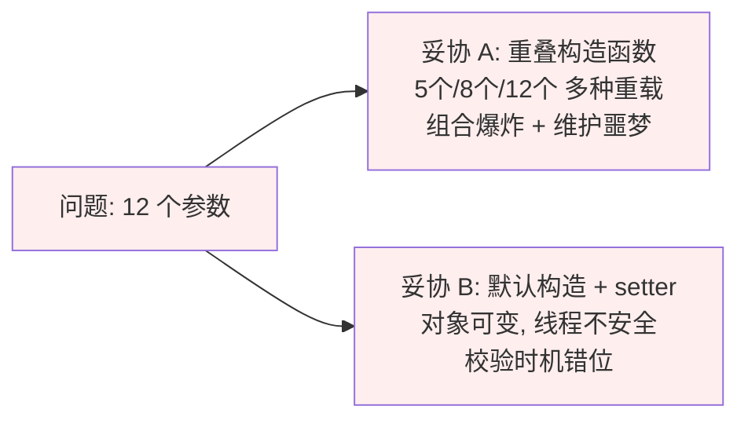
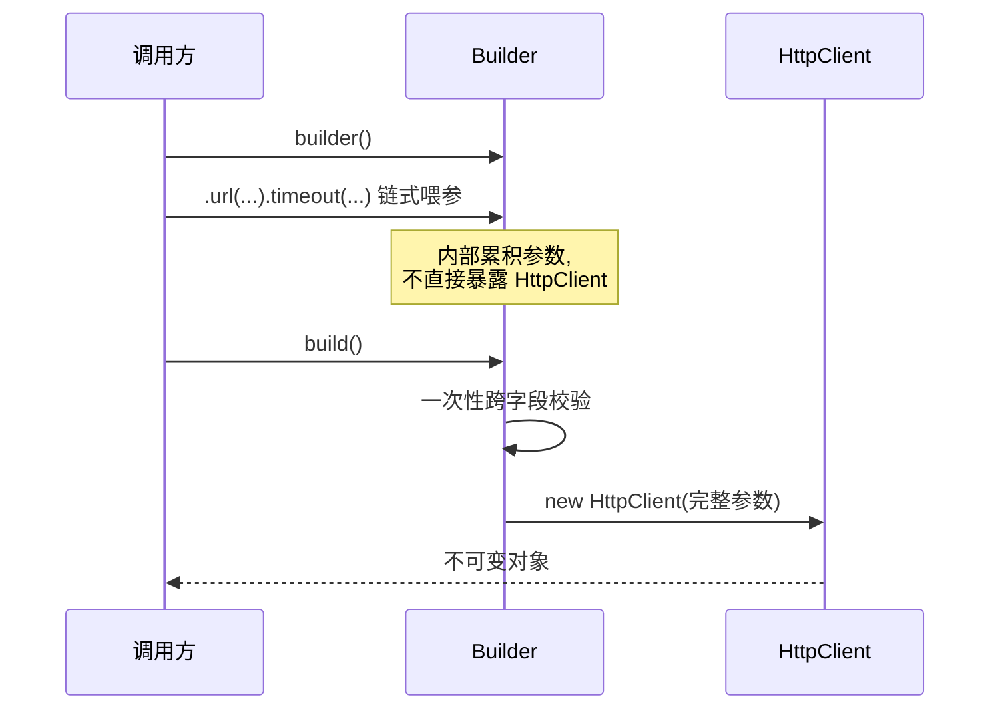
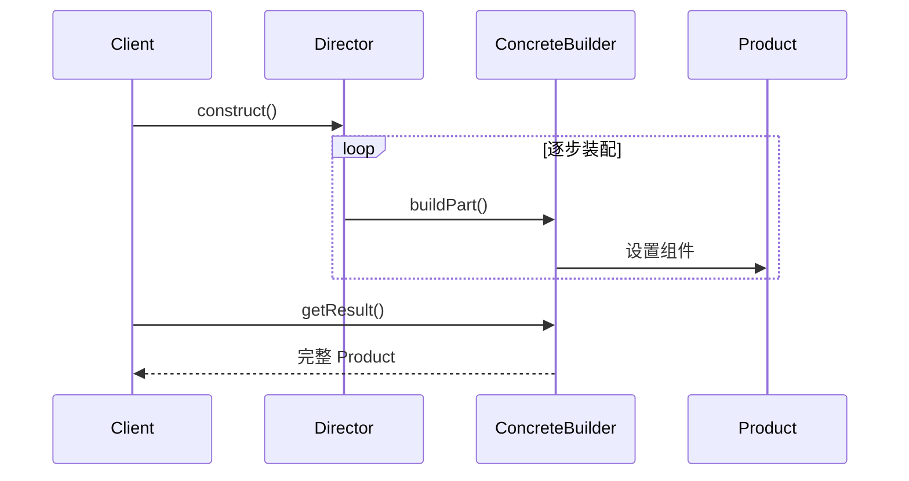
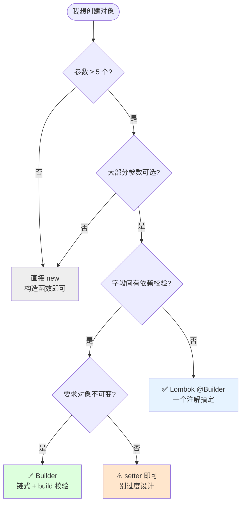
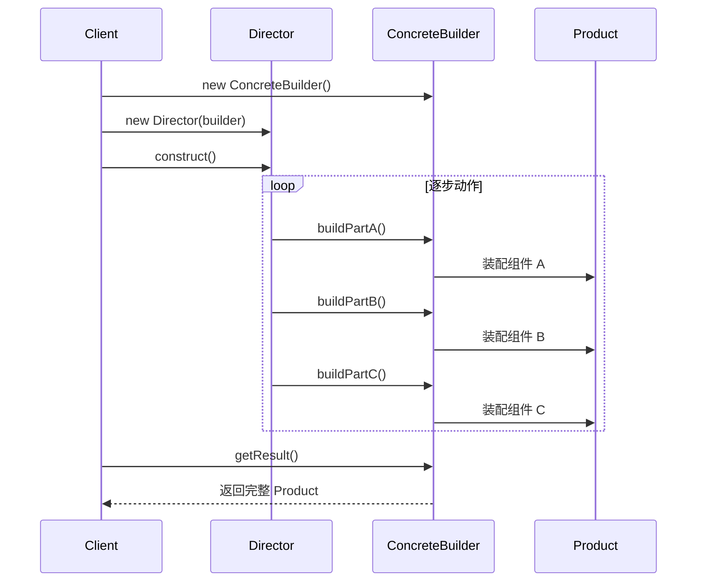
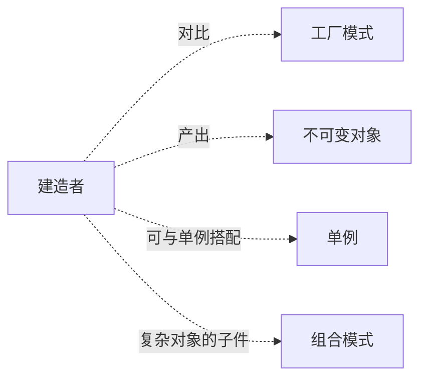

# 第三卷第3章：建造者模式设计思想

> **📚 本篇渐进学习节奏（建议按顺序食用）**
>
> 1. **第 01 节 · 案例引入** — 一段"12 参构造函数 + setter 漏调用"的线上事故
> 2. **第 02 节 · 直觉探索** — 重载构造/setter 两种方案为什么全翻了车
> 3. **第 03 节 · 模式基础** — 从失败中提炼标准骨架、定义与场景
> 4. **第 04 节 · 模式结构** — 四角色 + 时序图 + 三步演化
> 5. **第 05 节 · 盖房子实战** — 普通 vs Builder 方式对比
> 6. **第 06 节 · 效果对比** — 改造前后数据说话
> 7. **第 07 节 · 踩坑拓展** — Builder 用错的三种事故 + 和工厂区别
> 8. **第 08 节 · 总结决策** — 沉淀表 + 决策树 + 开源实例
>
> 阅读到任何一节卡壳，直接跳回上一节复盘场景；本篇代码均可直接运行。

#### 目录介绍
- [01.案例引入与思考](#01案例引入与思考)
    - [1.1 痛点场景](#11-痛点场景)
    - [1.2 它哪里不舒服](#12-它哪里不舒服)
    - [1.3 引出本篇主角](#13-引出本篇主角)
- [02.直觉方案探索](#02直觉方案探索)
    - [2.1 尝试重叠构造函数](#21-尝试重叠构造函数)
    - [2.2 尝试无参构造加setter](#22-尝试无参构造加setter)
    - [2.3 需求清单收敛](#23-两次失败之后需求清单收敛)
- [03.建造者模式基础](#03建造者模式基础)
    - [3.1 标准骨架](#31-从失败中提炼的标准骨架)
    - [3.2 建造者模式定义](#32-建造者模式定义)
    - [3.3 典型使用场景](#33-典型使用场景)
- [04.建造者模式结构](#04建造者模式结构)
    - [4.1 四个角色与职责](#41-四个角色与职责)
    - [4.2 时序图](#42-时序图)
    - [4.3 三步演化](#43-资源池三步演化)
- [05.盖房子实战对比](#05盖房子实战对比)
    - [5.1 普通方式](#51-普通方式流程与产品耦合)
    - [5.2 Builder方式](#52-builder方式产品与流程分离)
- [06.用前用后效果对比](#06用前用后效果对比)
    - [6.1 可读性与事故防御](#61-可读性与事故防御)
    - [6.2 核心收益](#62-核心收益)
- [07.反面踩坑与拓展](#07反面踩坑与拓展)
    - [7.1 Builder用错的三种事故](#71-builder用错的三种典型事故)
    - [7.2 建造者可以简化吗](#72-建造者可以简化吗)
    - [7.3 和工厂模式区别](#73-和工厂模式区别)
- [08.总结与延伸](#08总结与延伸)
    - [8.1 演化逻辑沉淀](#81-演化逻辑沉淀)
    - [8.2 决策树](#82-决策树)
    - [8.3 开源实例](#83-真实开源代码中的建造者)
    - [8.4 思考题](#84-思考题)


## 01.案例引入与思考

> **本篇主线**：日常开发中最常见的"构造参数失控"

### 1.1 痛点场景

> **🔥 模拟事故复盘 · 周五下午 17:42 上线**
>
> 团队封装的 `HttpClient` 已经迭代到 12 个构造参数。新人接手后，老人交接代码时按 "老一套" 写法 `new HttpClient(...)`，复制了一份隔壁项目的初始化代码，把第 6 个参数 `true`（启用 gzip）和第 7 个参数 `3`（重试次数）顺序对换。
> 编译通过、单测通过、灰度通过 — **晚上 22:00 全量后大盘 QPS 雪崩**：所有请求带着错误的 Accept-Encoding，被 CDN 一律返回 500。
> 排查耗时 47 分钟，回滚 11 分钟，事故定级 P2。
>
> **事故根因不在新人，而在那个 12 参的构造函数本身就是一个炸弹。**

事故现场代码长这样：

```java
HttpClient client = new HttpClient(
    "https://api.com",  // url
    5000,               // 连接超时
    10000,              // 读取超时
    null,               // 代理 host
    0,                  // 代理 port
    true,               // 是否启用 gzip
    3,                  // 重试次数
    "Bearer xxx",       // 认证头
    null,               // 自定义 header
    "UTF-8",            // 编码
    false,              // 是否走 HTTPS 校验
    null                // 拦截器列表
);
```

调用方根本看不出第 5 个参数 `0` 是端口、第 6 个 `true` 是开启 gzip。一旦把 `true` 和 `3` 写反——**编译通过、运行炸裂**，IDE 一行警告都不会给你。

### 1.2 它哪里不舒服

- ❌ **可读性归零**：调用现场只有一串字面量，需要跳到构造函数定义才知道每个参数是干嘛的；
- ❌ **可选参数地狱**：12 个里只有 3 个必填，其余 9 个常常传 `null` 或 `0`，语义混乱；
- ❌ **参数顺序错位**：相同类型的参数（多个 String、多个 int）调换位置编译器都不会警告；
- ❌ **校验放不下**：想做"如果启用 HTTPS 校验，就必须提供证书路径"这种**跨字段校验**，构造函数里一坨 if 写得很丑；
- ❌ **不可变性破坏**：为了规避构造爆炸，常退化成 `new HttpClient()` + 一堆 `setXxx()`，对象失去不可变性，多线程立即出问题。

两种"妥协方案"对比一下，全是雷区：



### 1.3 引出本篇主角

> **建造者模式（Builder）的核心思想**：把"对象的构造过程"从"对象本身"剥离出来，让调用方用**链式、命名、分步骤**的方式喂参数，最后在 `build()` 里一次性校验并产出一个**不可变**对象。

```java
HttpClient client = HttpClient.builder()
    .url("https://api.com")
    .connectTimeout(5000)
    .readTimeout(10000)
    .gzip(true)
    .retry(3)
    .auth("Bearer xxx")
    .build();   // 此处统一校验
```

代码瞬间从天书变成了说明文。**回到事故现场**：如果当初是 Builder 写法，新人把 `.gzip(true)` 和 `.retry(3)` 写反 — 编译器立即报错（类型不匹配），事故根本写不出来。


本篇会一步步带你看清"为什么需要 Builder、和工厂/setter 的真正区别、它的代价是什么"。

---

## 02.直觉方案探索

> **为什么要学这一节**：直接给你 Builder 标准答案是很容易的——但建造者不是凭空发明的。它是在"构造参数爆炸"和"setter 不可变"两个死胡同里撞了无数次墙之后才收敛出来的。

### 2.1 尝试：重叠构造函数（Telescoping Constructor）

**【新人方案①：多写几个构造函数重载】**

回到 01 节那场事故后，第一反应是"我把必填+可选参数分开，写 3 个构造函数"：

```java
// 方案 A：3 个构造函数重载，覆盖"仅 url / url+超时 / 全参数"
public HttpClient(String url) { this(url, 5000, 10000, ...); }
public HttpClient(String url, int conn, int read) { ... }
public HttpClient(String url, int conn, int read, boolean gzip, int retry, ...) { ... }
```

**🧪 跑一下，看会出什么问题**

```java
// 参数少时还行——但 12 个参数里只有 3 个必填，剩下的可选组合 = 2^9 种：
// ❌ 不可能为每种组合写一个构造函数 → 最终只有"最少参数"和"全参数"两个极端版本
// ❌ 调用方被迫传一堆 null/0："我只要 url 和 gzip，但必须走全参构造器"
new HttpClient("url", 5000, 10000, null, 0, true, 3, null, null, "UTF-8", false, null);
//                                        ^^^^  ^^^  ^^^                      ^^^^  ^^^^
//                                        全是 null 和 0，顺序还不能错
```

**❌ 失败原因**：可选参数越多，构造函数重载越趋近"全参 + 写死默认值"。同类型参数（int timeout vs int retry）顺序调换编译器零警告——这就是 01 节那场事故的根因。

**💡 反思**：我们需要一种**按名传参**的能力——调用方只填自己需要的字段，不关心顺序。

### 2.2 尝试：无参构造 + setter

**【新人方案②：先 new，再 set】**

既然构造函数搞不定，那就回到 JavaBean 模式：

```java
// 方案 B：默认构造 + set 方法链
HttpClient client = new HttpClient();
client.setUrl("https://api.com");
client.setConnectTimeout(5000);
client.setGzip(true);
client.setRetry(3);
```

**🧪 跑一下，会发现两个隐藏问题**

```java
// 问题 1：对象有"中间状态"——setUrl 之后、setTimeout 之前，client 已经可以被使用
// 问题 2：对象可变——多线程下，线程 A setUrl 到一半，线程 B 已经拿着旧 url 发请求了
client.setUrl("https://api.com");
doSomething(client);  // 💣 client 此时还有 3 个字段没设完
client.setTimeout(5000);  // 💣 晚了，doSomething 已经拿缺字段的对象跑完了
```

**❌ 失败原因**：对象从 `new` 到最后一个 `set` 之间有"半成品窗口期"。多线程下这是并发 bug 的温床。此外，**跨字段校验无处安放**——"如果启用 HTTPS 校验就必须设置证书路径"这个约束，放在哪个 setter 里都不对。

**💡 反思**：我们既要"按名传参的便利"，又要"对象一旦创建就不可变"的安全性。这两个需求在构造函数和 setter 模式下是矛盾的——Builder 正是为了同时满足两者。

### 2.3 两次失败之后——需求清单收敛

| 必须满足 | 来自哪一次失败 |
|---------|-------------|
| ① 按名传参、不用记顺序 | 2.1 重载构造函数失败 |
| ② 所有字段填完后才产出对象（无中间状态） | 2.2 setter 半成品窗口期失败 |
| ③ 对象不可变——创建后无法被外部修改 | 2.2 setter 多线程不安全失败 |
| ④ 跨字段校验能在创建前集中执行 | 1.2 真事故 + 2.2 setter 校验无处放 |
| ⑤ 可选参数有合理默认值、不必显式传 null | 2.1 被迫传 null 失败 |


## 03.建造者模式基础

### 3.1 从失败中提炼的标准骨架

上面五条约束翻译成代码，就是 Builder 模式的灵魂骨骼：

```java
public class HttpClient {
    private final String url;           // ① final → 不可变
    private final int connectTimeout;

    private HttpClient(Builder b) {     // ③ 私有构造，只能由 Builder 调
        this.url = b.url;
        this.connectTimeout = b.connectTimeout;
        // ④ 此处可做跨字段校验
    }

    public static Builder builder() { return new Builder(); }

    public static class Builder {
        private String url;
        private int connectTimeout = 5000;  // ⑤ 默认值

        public Builder url(String v)    { this.url = v; return this; }      // ① 链式按名传参
        public Builder connectTimeout(int v) { this.connectTimeout = v; return this; }

        public HttpClient build() {     // ② 一次 build() 产出不可变对象
            if (url == null) throw new IllegalStateException("url is required");
            return new HttpClient(this);
        }
    }
}
```

**三句话记住**：内嵌 Builder → 链式 setter → `build()` 产出。差异只在要不要 Director、要不要抽象 Builder——这就是 06 节要讲的变体。


### 3.2 建造者模式定义

将一个复杂对象的构建与它的表示分离，使得同样的构建过程可以创建不同的表示。**关键：分步骤构建 + 最终一次性产出不可变对象。**

### 3.3 典型使用场景

- **构造参数 ≥ 5 个、且大部分可选**：HttpClient、OkHttpClient、各种 PoolConfig
- **字段间有依赖关系**：maxIdle ≤ maxTotal、启用 HTTPS → 必须提供证书路径
- **要求对象不可变**：发布后不能再被意外修改，多线程安全
- **构建步骤有序**：SQL AST 构建、HTML/XML 文档生成

> **反面提醒**：参数 ≤ 4 个且全必填 → 直接构造函数更清晰。Builder 不是"永远优先"的选择。


## 04.建造者模式结构

### 4.1 四个角色与职责

| 角色 | 职责 |
|:---|:---|
| Product（产品） | 最终要构建的复杂对象（不可变） |
| Builder（抽象建造者） | 声明构建步骤的接口 |
| ConcreteBuilder（具体建造者） | 实现步骤、持有中间状态、`build()` 产出 |
| Director（指挥者） | 封装构建流程顺序（可选，06 节会讲何时省略） |

### 4.2 时序图



### 4.3 🧪 ResourcePoolConfig 三步演化

回到建筑者最经典的载体——资源池配置。从构造器→setter→Builder 三步演化：

```java
// 阶段 1：构造函数——4 个参数还好，但配置项会膨胀
new ResourcePoolConfig("pool", 16, 8, 0);  // 第三个是 maxIdle 还是 minIdle？

// 阶段 2：setter——解决了可读性，但对象可变
ResourcePoolConfig c = new ResourcePoolConfig("pool");
c.setMaxTotal(16); c.setMaxIdle(8);  // 此时 maxTotal=16、maxIdle=8，minIdle 还是默认值 0——跨字段校验无处安放

// 阶段 3：Builder——链式 + 不可变 + build() 一次性校验
ResourcePoolConfig c = new ResourcePoolConfig.Builder()
    .setName("pool")
    .setMaxTotal(16)
    .setMaxIdle(8)
    .setMinIdle(2)
    .build();  // 此处校验 maxIdle ≤ maxTotal、minIdle ≤ maxIdle
```


## 05.盖房子实战对比

### 5.1 普通方式：流程与产品耦合

```java
// 普通方式：build() 流程和产品定义混在同一个类里
public abstract class AbstractHouse {
    public abstract void buildBasic();
    public abstract void buildWalls();
    public abstract void roofed();
    public void build() {           // 流程写死在抽象类里
        buildBasic();
        buildWalls();
        roofed();
    }
}
// "盖别墅"只能加子类，流程变不了
```

### 5.2 Builder 方式：产品与流程分离

```java
// Builder 方式：Director 管流程，Builder 管拼装——各自独立变化
HouseDirector director = new HouseDirector(new CommonHouseBuilder());
House commonHouse = director.constructHouse();    // 普通房

director.setHouseBuilder(new HighBuildingBuilder());
House highBuilding = director.constructHouse();   // 高楼——只换了 Builder
```

**📊 对比结论**：

| 维度 | 普通方式 | Builder 方式 |
|:---|:---|:---|
| 产品与流程 | 耦合：`build()` 流程混在产品类里 | 分离：`Director` 管流程，`Builder` 管拼装 |
| 增加"别墅"类型 | 新增子类，重写 3 个方法 | 新增 `VillaBuilder`，Director 不动 |
| 变化顺序（先封顶后砌墙？） | 改所有子类的 `build()` | 只改 Director |
| 调用方可读性 | `new HighBuilding().build()` | `director.constructHouse()` |
| 产出是否可变 | 子类状态可变，不安全 | `buildHouse()` 返回后可设计为不可变 |

> 一句话：普通方式在"一件事不变"时代码更短；Builder 在"流程与产品都可能独立变化"时胜出。


## 06.用前用后效果对比

> **为什么单独留一节做对比**：用 01 节的事故做基准，量化 Builder 到底省了什么。

### 6.1 可读性与事故防御

```java
// ❌ 事故现场：12 参构造函数，第 5 个是端口、第 6 个是 gzip
new HttpClient("url", 5000, 10000, null, 0, true, 3, "Bearer xxx", null, "UTF-8", false, null);

// ✅ Builder：每个参数都有名字，顺序无关
HttpClient.builder()
    .url("https://api.com")
    .connectTimeout(5000).readTimeout(10000)
    .gzip(true).retry(3).auth("Bearer xxx")
    .build();   // 如果 gzip(true) 和 retry(3) 写反→编译期类型不匹配，直接报错
```

**📊 事故防御对比**：

| 事故场景 | 构造函数 | Builder |
|:---|:---|:---|
| 两个 int 参数顺序写反 | ❌ 编译通过，运行期炸裂 | ✅ 编译期报错（类型不匹配） |
| 忘记传必填 url | ❌ 编译通过，运行期 NPE | ✅ `build()` 里检查抛异常 |
| 启用 HTTPS 但没设证书 | ❌ 运行到握手才报错 | ✅ `build()` 里跨字段校验拦截 |

### 6.2 核心收益

**🔑 核心收益**：Builder 把"构造参数爆炸 + setter 不可变"这个矛盾一次性解决——链式按名传参 + `build()` 统一校验 + 产出不可变对象。**三者缺其一，都只是花哨的 setter 集合。** 这就是为什么 OkHttp、Spring、Guava、Lombok 不约而同选了这一种写法。


## 07.反面踩坑与拓展

### 7.1 🚨 Builder 用错的三种典型事故

**坑 1：忘了调 `build()`，直接拿 Builder 当 Product 用**

```java
HttpClient.Builder b = HttpClient.builder().url("...").retry(3);
b.send();  // ❌ Builder 上根本没有 send()——有人误给 Builder 加了同名方法
```

**正解**：Builder 只暴露 setter + `build()`，绝不添加业务方法。

**坑 2：复用同一个 Builder 实例，造出两个互相影响的对象**

```java
HttpClient.Builder b = HttpClient.builder().url("https://a.com");
HttpClient a = b.build();
b.headers().clear();  // 💥 如果 build() 里没拷贝集合，a 的 headers 也被清空了！
```

**正解**：`build()` 里必须**深拷贝**所有集合字段：`new ArrayList<>(b.headers)`。

**坑 3：跨字段校验漏写，Builder 价值归零**

```java
// ❌ build() 只做了字段级非空校验
// 结果：HTTPS 校验=true 但证书路径=null，直到握手才抛 SSLException
```

**正解**：`build()` 是 Builder 的灵魂——**所有跨字段约束（互斥/依赖/范围）必须在这里集中校验**。

### 7.2 建造者可以简化吗

当不需要"同一流程、不同产品"时，可以逐步省略角色：

1. **省略抽象 Builder**：只有一个具体的 `HttpClient.Builder`，不需要 `AbstractBuilder` 接口
2. **省略 Director**：构建步骤简单，由 Client 直接链式调用 Builder 的 setter
3. **Lombok `@Builder`**：一个注解生成全部样板代码——但**跨字段校验仍需要手动写 `build()` 方法**

### 7.3 和工厂模式区别

| 维度 | 工厂模式 | 建造者模式 |
|:---|:---|:---|
| 关注点 | 造哪个（多种类型选一个） | 怎么造（一种类型分步骤构建） |
| 产物 | 同一父类的不同子类 | 同一类的不同配置 |
| 构建方式 | 参数驱动一次产出 | 链式分步 + `build()` 终局 |
| 典型信号 | `if (type)` / `switch` → 选子类 | 构造函数 ≥ 5 参 / setter 满天飞 |


## 08.总结与延伸

### 8.1 演化逻辑沉淀

| 阶段 | 学到了什么 |
|:---|:---|
| **01 HttpClient 事故** | 12 参构造函数 = 定时炸弹——顺序依赖、编译期无保护 |
| **02 两次失败** | 重载构造搞不定可选参数，setter 破坏了不可变性 |
| **03 标准骨架** | 内嵌 Builder → 链式 setter → `build()` 校验——三句话就够 |
| **04 结构与时序** | Director 封装流程顺序、Builder 封装拼装细节 |
| **05 盖房子对比** | 流程与产品解耦——改顺序只改 Director、加类型只加 Builder |
| **06 效果对比** | 事故防御：顺序写错→编译报错、字段忘记→build() 拦截 |
| **07 踩坑拓展** | 忘调 build()、引用泄漏、跨字段校验漏写——Builder 正确打开方式 |

**🔑 一句话核心**：

> 当"参数多 + 大部分可选 + 字段间有约束 + 想要不可变"四个条件同时出现，Builder 才是最佳时机。**否则它只是一层多余的脚手架。**

### 8.2 决策树



### 8.3 真实开源代码中的建造者

| 出处 | 代码片段 | 形态 |
|:---|:---|:---|
| JDK `StringBuilder` | `sb.append(a).append(b).toString()` | 经典 Builder，产出不可变 String |
| OkHttp `Request.Builder` | `.url(...).header(...).build()` | 链式 Builder，无 Director/无抽象 Builder |
| Spring `UriComponentsBuilder` | `.scheme("https").host("...").build()` | 链式 + 不可变 |
| Lombok `@Builder` | 一个注解省 50 行样板代码 | 编译期生成，`build()` 需手写跨字段校验 |
| Guava `ImmutableList.builder()` | `.add(1).add(2).build()` | 产出真正不可变集合 |

### 8.4 思考题

1. Lombok 的 `@Builder` 能做"跨字段校验"吗？为什么？
2. `StringBuilder` / `StringBuffer` 算不算建造者模式？它和 GoF 定义的 Builder 有什么本质区别？
3. 链式调用一定要用 Builder 吗？在原对象上直接 `return this` 实现 Fluent API，它和 Builder 的边界在哪？

> 上一篇 [02.工厂](02.工厂模式设计思想.md) → 本篇 → [04.原型](04.原型模式设计思想.md)：当造一个对象太贵、而你又想要"一个差不多但小改的"，工厂和建造者都嫌慢，原型上场。


## 04.建造者模式分析
### 4.1 建造者模式结构图
建造者模式包含如下角色：

1. Builder：抽象建造者
2. ConcreteBuilder：具体建造者
3. Director：指挥者
4. Product：产品角色

**为什么需要 Director**：调用方不想记住"先 buildBasic、后 buildWalls、最后 roofed"这个顺序，于是抽出 Director 封装"装配流程"。Builder 专注怎么造，Director 专注运行顺序。如果流程固定、不需变体，Director 的价值会减弱（6.1 会提出可以省略）。


### 4.2 建造者模式时序图
建造者模式时序图如下所示：




## 05.建造者案例实践
### 5.1 盖房子案例开发
例如，让我们考虑如何创建一个House（房屋）对象。

为了建造一个简单的房子，您需要建造四堵墙和一层地板，安装一扇门，安装一对窗户，并建造一座屋顶。但是，如果您想要一个更大、更明亮的房子，带有后院和其他设施（如供暖系统、管道和电气布线）呢？

最简单的解决方案是扩展基类House并创建一组子类来涵盖所有参数的组合。

但是，最终您将得到相当数量的子类。任何新的参数，如门廊风格，都将需要进一步扩展这个层次结构。[建造者模式](https://yccoding.com/zh/design/creational/03.%E5%BB%BA%E9%80%A0%E8%80%85%E6%A8%A1%E5%BC%8F%E8%AE%BE%E8%AE%A1%E6%80%9D%E6%83%B3.html)允许您逐步构建复杂的对象。


### 5.2 普通方式盖房子
使用普通方式盖房子，代码如下所示：

```java
public class BuilderHouse {

    public static void main(String[] args) {
        CommonHouse commonHouse = new CommonHouse();
        commonHouse.build();
        HeightBuilding heightBuilding = new HeightBuilding();
        heightBuilding.build();
    }

    public static abstract class AbstractHouse {

        /**
         * 打地基
         */
        public abstract void buildBasic();

        /**
         * 砌墙
         */
        public abstract void buildWalls();

        /**
         * 封顶
         */
        public abstract void roofed();

        public void build() {
            buildBasic();
            buildWalls();
            roofed();
        }

    }

    public static class CommonHouse extends AbstractHouse {

        @Override
        public void buildBasic() {
            System.out.println(" 普通房子打地基 ");
        }

        @Override
        public void buildWalls() {
            System.out.println(" 普通房子砌墙 ");
        }

        @Override
        public void roofed() {
            System.out.println(" 普通房子封顶 ");
        }

    }

    public static class HeightBuilding extends AbstractHouse {

        @Override
        public void buildBasic() {
            System.out.println(" 高楼打地基 ");
        }

        @Override
        public void buildWalls() {
            System.out.println(" 高楼房子砌墙 ");
        }

        @Override
        public void roofed() {
            System.out.println(" 高楼房子封顶 ");
        }
    }
}
```

分析

1. 优点：比较好理解，简单易操作
2. 缺点：程序结构过于简单，没有设计缓存层对象，程序的扩展和维护不好。这种设计方案，把产品(即:房子) 和 创建产品的过程(即:建房子流程) 封装在一起，耦合性增强了
3. 改进：使用建造者模式，将产品和产品建造过程解耦


### 5.3 构造者优化盖房子
使用构建者模式实现房子的构建
```java
private void test() {
    ///盖普通房子
    //准备创建房子的指挥者
    HouseDirector houseDirector = new HouseDirector(new CommonHouse());
    //完成盖房子，返回产品(普通房子)
    House commonHouse = houseDirector.constructHouse();
    System.out.println("普通房子：" + commonHouse.toString());
    ///盖高楼
    //重置建造者，改成修高楼
    houseDirector.setHouseBuilder(new HighBuilding());
    //完成盖房子，返回产品(高楼)
    House highBuilding = houseDirector.constructHouse();
    System.out.println("高楼：" + highBuilding.toString());
}

/**
 * 产品->Product
 */
public class House {
    private String basic;
    private String wall;
    private String roofed;

    public String getBasic() {
        return basic;
    }

    public void setBasic(String basic) {
        this.basic = basic;
    }

    public String getWall() {
        return wall;
    }

    public void setWall(String wall) {
        this.wall = wall;
    }

    public String getRoofed() {
        return roofed;
    }

    public void setRoofed(String roofed) {
        this.roofed = roofed;
    }

    public House(String basic, String wall, String roofed) {
        this.basic = basic;
        this.wall = wall;
        this.roofed = roofed;
    }

    public House() {
    }

    @Override
    public String toString() {
        return "House{" +
                "basic='" + basic + '\'' +
                ", wall='" + wall + '\'' +
                ", roofed='" + roofed + '\'' +
                '}';
    }
}

/**
 * 抽象的建造者
 */
public abstract class HouseBuilder {
    /**
     * 组合House
     */
    protected House house = new House();

    //-------------------------将建造的流程写好--------------------------

    /**
     * 打地基
     */
    public abstract void buildBasic();

    /**
     * 砌墙
     */
    public abstract void buildWalls();

    /**
     * 封顶
     */
    public abstract void roofed();

    /**
     * 建造好房子后将产品(房子) 返回
     *
     * @return
     */
    public House buildHouse() {
        return house;
    }
}


/**
 * 具体建造者
 */
public class CommonHouse extends HouseBuilder {

    @Override
    public void buildBasic() {
        System.out.println("普通房子打地基5米 ");
        super.house.setBasic("地基5米");
    }

    @Override
    public void buildWalls() {
        System.out.println("普通房子砌墙10cm ");
        super.house.setWall("墙10cm");
    }

    @Override
    public void roofed() {
        System.out.println("普通房子屋顶 ");
        super.house.setRoofed("普通房子屋顶");
    }

}

/**
 * 具体建造者
 */
public class HighBuilding extends HouseBuilder {

    @Override
    public void buildBasic() {
        System.out.println("高楼的打地基100米 ");
        super.house.setBasic("地基100米");
    }

    @Override
    public void buildWalls() {
        System.out.println("高楼的砌墙20cm ");
        super.house.setWall("墙20cm");
    }

    @Override
    public void roofed() {
        System.out.println("高楼的透明屋顶 ");
        super.house.setRoofed("透明屋顶");
    }
}


/**
 * 指挥者，调用制作方法，返回产品
 */
public class HouseDirector {
    /**
     * 聚合
     */
    HouseBuilder houseBuilder = null;

    /**
     * 方式一：构造器传入 houseBuilder
     *
     * @param houseBuilder
     */
    public HouseDirector(HouseBuilder houseBuilder) {
        this.houseBuilder = houseBuilder;
    }

    /**
     * 方式二：通过setter 传入 houseBuilder
     *
     * @param houseBuilder
     */
    public void setHouseBuilder(HouseBuilder houseBuilder) {
        this.houseBuilder = houseBuilder;
    }

    /**
     * 指挥者统一管理建造房子的流程
     *
     * @return
     */
    public House constructHouse() {
        houseBuilder.buildBasic();
        houseBuilder.buildWalls();
        houseBuilder.roofed();
        return houseBuilder.buildHouse();
    }
}
```

**🎯 盖房子两种写法的对比**

同一个"盖一栋高楼"的需求，两种写法在维护性上的区别：

| 维度 | 5.2 普通方式（AbstractHouse 子类） | 5.3 Builder 方式 |
|------|-----------|----------|
| 产品与流程 | 耦合：`build()` 流程和产品定义混在类里 | 分离：`Director` 管流程，`Builder` 管拼装 |
| 增加"别墅"类型 | 新增一个子类，重写 3 个方法 | 新增一个 `VillaBuilder`，不动 Director |
| 变化顺序（先封顶后砌墙？） | 要改所有子类的 `build()` | 只改 Director，建造者不动 |
| 调用方可读性 | `new HighBuilding().build()` | `director.constructHouse()` 语义更明确 |
| 多线程安全 | 子类状态可变，不安全 | 产出 Product 不可变，天然安全 |

> 一句话：**普通方式在"一件事不变"时代码更短；Builder 在"流程与产品都可能变"时胜出。**


## 06.建造者模式拓展
### 6.1 建造者能简化吗

**为什么要简化**：4 个角色全上阵是为了"同一流程、不同实现"。但实际业务中，很多场景只是"参数多、需要链式"，背水一整套会显得过重。于是产生了两种逐步变体：

1. **省略抽象建造者角色**：如果系统中只需要一个具体建造者的话，可以省略掉抽象建造者。指挥者直接面向具体建造者；
2. **省略指挥者角色**：在具体建造者只有一个的情况下，如果抽象建造者角色已经被省略掉，那么还可以省略指挥者角色，让 Builder 角色扮演指挥者与建造者双重角色。上节的 1.3 调用示例 `HttpClient.builder().url(...).build()` 就是这种"双重却退"后的经典形态，Lombok `@Builder` 生成的代码也是同一货色。


### 6.2 和工厂模式区别
实际上，工厂模式是用来创建不同但是相关类型的对象（继承同一父类或者接口的一组子类），由给定的参数来决定创建哪种类型的对象。

建造者模式是用来创建一种类型的复杂对象。通过设置不同的可选参数，"定制化"地创建不同的对象。

网上有一个经典的例子很好地解释了两者的区别。

顾客走进一家餐馆点餐，我们利用[工厂模式](http://localhost:8080/zh/design/creational/02.%E5%B7%A5%E5%8E%82%E6%A8%A1%E5%BC%8F%E8%AE%BE%E8%AE%A1%E6%80%9D%E6%83%B3.html)，根据用户不同的选择，来制作不同的食物，比如披萨、汉堡、沙拉。对于披萨来说，用户又有各种配料可以定制，比如奶酪、西红柿、起司，我们通过建造者模式根据用户选择的不同配料来制作披萨。

也不要太学院派，非得把[工厂模式](http://localhost:8080/zh/design/creational/02.%E5%B7%A5%E5%8E%82%E6%A8%A1%E5%BC%8F%E8%AE%BE%E8%AE%A1%E6%80%9D%E6%83%B3.html)、[建造者模式](https://yccoding.com/zh/design/creational/03.%E5%BB%BA%E9%80%A0%E8%80%85%E6%A8%A1%E5%BC%8F%E8%AE%BE%E8%AE%A1%E6%80%9D%E6%83%B3.html)分得那么清楚，我们需要知道的是，每个模式为什么这么设计，能解决什么问题。只有了解了这些最本质的东西，我们才能不生搬硬套，才能灵活应用，甚至可以混用各种模式创造出新的模式，来解决特定场景的问题。


## 07.建造者优缺点分析
### 7.1 优点有哪些
建造者优点分析

1. 在建造者模式中， 客户端不必知道产品内部组成的细节，将产品本身与产品的创建过程解耦，使得相同的创建过程可以创建不同的产品对象。
2. 每一个具体建造者都相对独立，而与其他的具体建造者无关，因此可以很方便地替换具体建造者或增加新的具体建造者， 用户使用不同的具体建造者即可得到不同的产品对象 。
3. 可以更加精细地控制产品的创建过程 。将复杂产品的创建步骤分解在不同的方法中，使得创建过程更加清晰，也更方便使用程序来控制创建过程。
4. 增加新的具体建造者无须修改原有类库的代码，指挥者类针对抽象建造者类编程，系统扩展方便，符合"开闭原则"。


### 7.2 不足的点分析
建造者缺点分析

1. [建造者模式](https://yccoding.com/zh/design/creational/03.%E5%BB%BA%E9%80%A0%E8%80%85%E6%A8%A1%E5%BC%8F%E8%AE%BE%E8%AE%A1%E6%80%9D%E6%83%B3.html)所创建的产品一般具有较多的共同点，其组成部分相似，如果产品之间的差异性很大，则不适合使用建造者模式，因此其使用范围受到一定的限制。
2. 如果产品的内部变化复杂，可能会导致需要定义很多具体建造者类来实现这种变化，导致系统变得很庞大。

**🚨 反面踩坑实录 · Builder 用错的三种典型姿势**

看似无脑的 Builder，真上手后照样能踩进坑里：

**坑 1：忘了调 `build()`，直接拿 Builder 当 Product 用**
```java
// 这段代码编译通过,但运行期 NPE
HttpClient.Builder builder = HttpClient.builder().url("...").retry(3);
builder.send();   // ❌ Builder 上没有 send 方法,但同事给 Builder 加了同名方法,触发逻辑分裂
```
某次重构把 "工具方法" 误加到 Builder 而非 HttpClient 上，导致部分调用方直接在 Builder 上发请求，绕过了 build() 的统一校验。**根因：Builder 暴露给外部的方法面太宽，应当只保留 setter + build()**。

**坑 2：复用同一个 Builder 实例，造出两个"互相影响"的对象**
```java
HttpClient.Builder b = HttpClient.builder().url("https://a.com");
HttpClient a = b.build();           // url=a.com
HttpClient c = b.url("https://b.com").build();   // url=b.com — 这没问题
// 但如果 build() 里 new 出的 Product 持有的是 Builder 内部 List 的同一引用...
b.headers().clear();   // 💥 a 的 headers 也被清空了!
```
**根因：build() 里若直接把 Builder 的可变集合赋给 Product，会泄漏可变状态**。正确做法是 `new ArrayList<>(builder.headers)` 拷贝一份。

**坑 3：跨字段校验漏写，Builder 的最大价值反而没用上**
```java
public HttpClient build() {
    // ❌ 只做了字段级校验,没做跨字段校验
    return new HttpClient(url, timeout, ...);
}
// 结果上线后发现:启用了 HTTPS 校验(verifySsl=true) 但没设置证书路径(certPath=null) — 
// 直到第一次握手才抛 SSLException,问题被推迟到了运行期。
```
**正解**：`build()` 是 Builder 的灵魂，**所有跨字段约束（互斥/依赖/范围）必须在这里集中校验**，否则你只是写了个花哨的 setter 集合。

> 这三个坑都不是 Builder 模式本身的问题，而是"用了 Builder 但没用对"。Builder 的价值 = **链式可读性 + 不可变性 + 一次性校验**，三者缺一不可。


## 08.构造者模式总结
### 8.1 该模式总结
**Builder模式有几个好处：**

1. Builder的setter函数可以包含安全检查，可以确保构建过程的安全，有效。
2. Builder的setter函数是具名函数，有意义，相对于构造函数的一长串函数列表，更容易阅读维护。
3. 可以利用单个Builder对象构建多个对象，Builder的参数可以在创建对象的时候利用setter函数进行调整

**当然Builder模式也有缺点：**

1. 更多的代码，需要Builder这样的内部类
2. 增加了类创建的运行时开销，但是当一个类参数很多的时候，Builder模式带来的好处要远胜于其缺点。


### 8.2 模式联动与边界



| 模式 | 关系 | 一句话区别 |
|------|------|----------|
| 工厂 | 易混 | 工厂关注"造哪个"（多种类型选一个），建造者关注"分步骤造一个复杂的" |
| 原型 | 替代 | 当对象"几乎一样、只改个别字段"时，原型 clone 比 Builder 链式重建更便宜 |
| 单例 | 配合 | Builder 自身可以做成线程安全的单例，重复使用 |
| 组合 | 协作 | 建造者常用来构造一棵树（XML/UI/AST），步骤就是"逐节点拼装" |

**🔍 真实开源代码中的建造者模式**

Builder 模式可能是 23 种里你**最常用却最不知道**的一个 — 几乎所有现代 Java 库都在用：

| 模式形态 | 出处 | 代码片段 | 它在解决什么 |
|---------|------|---------|-----------|
| 经典 Builder | `StringBuilder` / `StringBuffer` | `sb.append(a).append(b).toString()` | 字符串"分步骤构建"，最终 `toString()` 出不可变 String |
| 链式 Builder | OkHttp `Request.Builder` | `new Request.Builder().url(...).header(...).build()` | HTTP 请求 12+ 字段，全部链式喂参 |
| 链式 Builder | OkHttp `OkHttpClient.Builder` | `.connectTimeout(...).addInterceptor(...).build()` | 客户端配置项几十个，且需不可变 |
| 链式 Builder | Spring `UriComponentsBuilder` | `.scheme("https").host("...").path("...").build()` | URL 拼装的可读性救星 |
| 注解生成 | Lombok `@Builder` | 一个注解生成完整 Builder 类 | 把样板代码彻底干掉 |
| GoF 经典四角色 | `java.lang.StringBuilder` 内部 + JDK 文档生成器 (Doclet) | 含 Director | 标准教科书形态，但实战较少见 |
| 链式 + 不可变 | Guava `ImmutableList.builder()` | `.add(1).add(2).build()` | 产出真正不可变集合 |
| 链式 + 终结校验 | `java.util.stream.Stream.Builder` | `.add().add().build()` | 流式 API 的入口构造 |

> **学习建议**：本篇看完，强烈推荐打开 OkHttp 的 [`Request.Builder`](https://github.com/square/okhttp) 源码瞄一眼 — 你会发现它和 GoF 教科书定义有 **3 处典型简化**（无 Director / 无抽象 Builder / Builder 即 inner class），这就是 6.1 节讲的"双重却退"在工业级代码里的真实形态。

**⚠️ 什么时候不该用**

- **参数 ≤ 4 个、且都是必填**：构造函数 + 命名参数已经够清晰，Builder 是过度设计；
- **对象本身就是可变的**：Builder 的最大价值是**不可变性 + 一次性校验**，如果你后面还会到处 `setXxx`，等于白搭；
- **构造步骤无序、无依赖**：如果字段之间无任何约束，纯命名参数（Kotlin/Python）或 Lombok `@Builder` 已经足够，不必手写；
- **调用频次极低**：Builder 引入了一个伴生类的成本，一年才造一次的对象，直接 `new` 配注释更轻量。

> 一句话：**当"参数多 + 大部分可选 + 字段间有约束 + 想要不可变"四个条件同时出现，才是 Builder 的最佳时机**。否则它就是一层多余的脚手架。

**💭 思考题**

1. Lombok 的 `@Builder` 帮你省了几十行模板代码，但它能做"跨字段校验"吗？为什么？
2. StringBuilder / StringBuffer 算不算建造者模式？它和 GoF 定义的 Builder 有什么本质区别？
3. 链式调用一定要用 Builder 吗？能否在原对象上直接 `return this` 实现链式（Fluent API），它和 Builder 的边界在哪？

> 上一篇 [02.工厂](02.工厂模式设计思想.md) → 本篇 → [04.原型](04.原型模式设计思想.md)：当造一个对象太贵、而你又想要"一个差不多但小改的"，工厂和建造者都嫌慢，原型上场。

