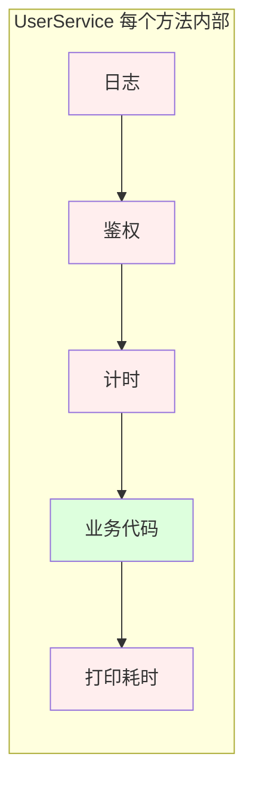
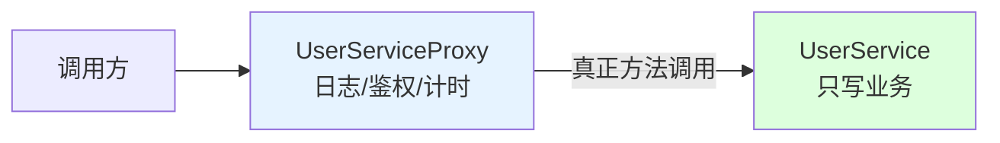
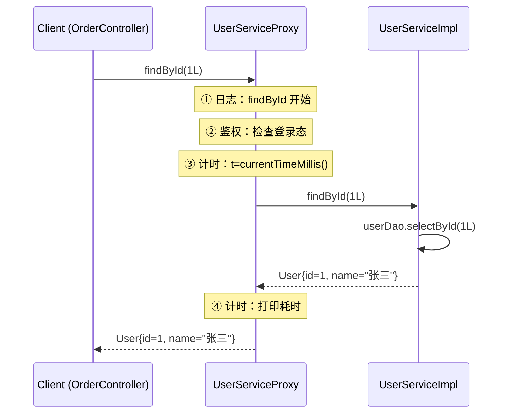
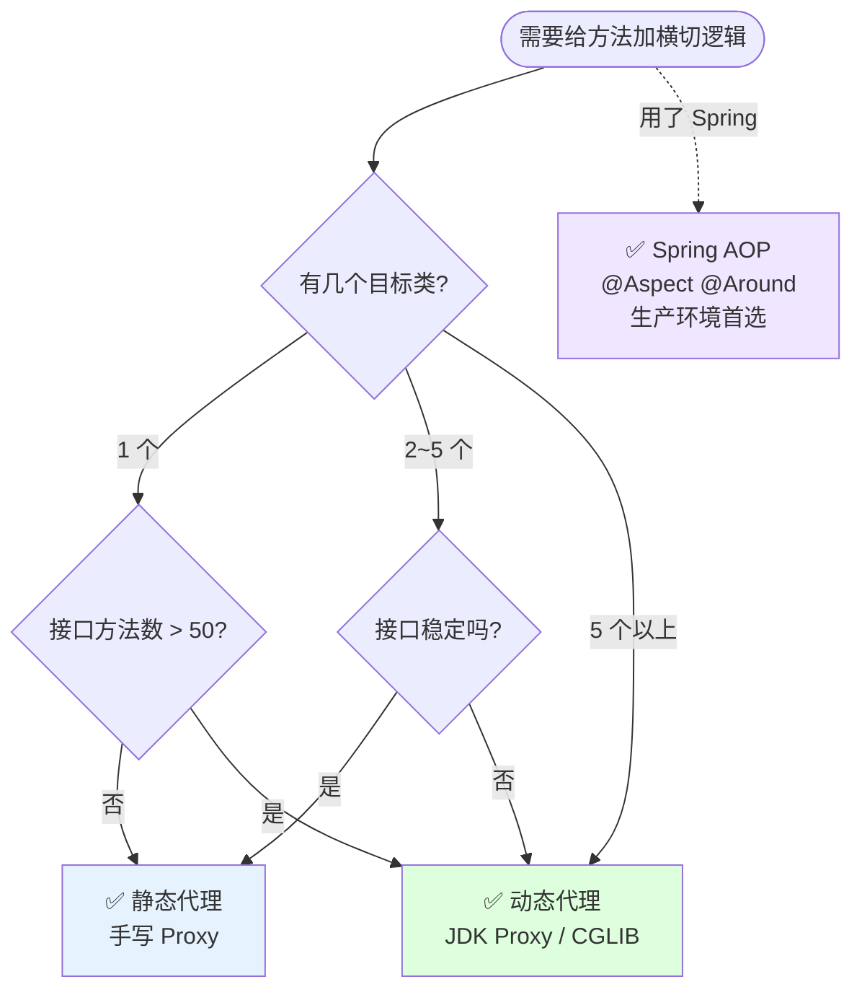
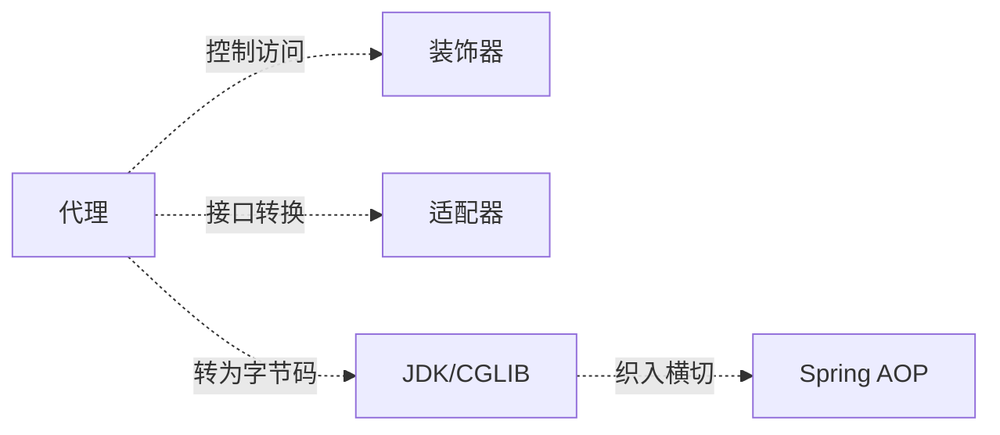

# 第三卷第5章：静态代理设计模式

> **📚 本篇渐进学习节奏（建议按顺序食用）**
>
> 1. **第 01 节 · 案例引入** — 一场"日志/鉴权/计时"安全审计事故
> 2. **第 02 节 · 直觉探索** — 逐方法复制粘贴/抽工具类，为什么全翻了车
> 3. **第 03 节 · 模式基础** — 从失败诉求中提炼同接口+持目标+前后增强
> 4. **第 04 节 · 模式结构** — 三角色+时序图+生活类比
> 5. **第 05 节 · 效果对比** — 200 处改动→20 个 Proxy，数据说话
> 6. **第 06 节 · 反面踩坑** — 4种经典翻车+替代方案
> 7. **第 07 节 · 决策选型** — 静态 vs 动态代理选型决策树
> 8. **第 08 节 · 总结延伸** — 沉淀+联动+开源+思考题
>
> 阅读到任何一节卡壳，直接跳回上一节复盘场景；本篇代码均可直接运行。

#### 目录介绍
- [01.案例引入与思考](#01案例引入与思考)
    - [1.1 痛点场景](#11-痛点场景)
    - [1.2 它哪里不舒服](#12-它哪里不舒服)
    - [1.3 引出本篇主角](#13-引出本篇主角)
- [02.直觉方案探索](#02直觉方案探索)
    - [2.1 尝试逐方法复制粘贴](#21-尝试逐方法复制粘贴三件套)
    - [2.2 尝试抽到工具类方法](#22-尝试抽到工具类方法)
    - [2.3 需求清单收敛](#23-两次失败之后需求清单收敛)
- [03.代理模式基础](#03代理模式基础)
    - [3.1 从失败中提炼的标准骨架](#31-从失败中提炼的标准骨架)
    - [3.2 静态代理定义](#32-静态代理定义)
    - [3.3 典型使用场景](#33-典型使用场景)
- [04.代理模式结构](#04代理模式结构)
    - [4.1 三角色与职责](#41-三角色与职责)
    - [4.2 时序图](#42-时序图)
    - [4.3 生活类比](#43-生活类比)
- [05.用前用后效果对比](#05用前用后效果对比)
    - [5.1 改造前后对比](#51-改造前后对比)
    - [5.2 邮件代理案例](#52-邮件代理案例)
    - [5.3 核心收益](#53-核心收益)
- [06.反面踩坑实录](#06反面踩坑实录)
    - [6.1 没实现接口失去多态](#61-没实现接口失去多态)
    - [6.2 拦截顺序写反](#62-拦截顺序写反)
    - [6.3 上帝代理类](#63-把所有功能塞一个代理)
    - [6.4 Proxy内hardcode目标](#64-proxy内hardcode目标)
- [07.决策树与选型](#07决策树与选型)
    - [7.1 静态vs动态决策图](#71-静态代理-vs-动态代理-决策)
    - [7.2 选型清单速查](#72-选型清单速查)
- [08.总结与延伸](#08总结与延伸)
    - [8.1 演化逻辑沉淀](#81-演化逻辑沉淀)
    - [8.2 模式联动边界](#82-模式联动边界)
    - [8.3 真实开源代码中的代理](#83-真实开源代码中的代理)
    - [8.4 思考题](#84-思考题)


## 01.案例引入与思考

> **本篇主线**：日常开发中最常见的"横切关注点散落在每个业务方法里"

### 1.1 痛点场景

> **🔥 模拟事故复盘 · 周一上午 10:00 安全审计组突袭**
>
> 公司年度安全审计，要求所有用户敏感操作必须有"操作日志 + 登录态校验 + 耗时监控"三件套，72 小时内全量补齐，否则下架整改。
> 后端组打开 IDE 一看 — 50+ 个 Service、200+ 个方法，**每个方法的开头都要加一段三明治代码**。组长拍板"全员加班手工补"，结果周二凌晨 3 点：
>
> - 张三在 `OrderService.update` 里把 `t = currentTimeMillis()` 写成了 `t = 0`，**所有订单接口耗时显示为天文数字**，监控告警炸群；
> - 李四在 `PayService.refund` 里漏了一行 `if (!isLogin())` 校验，**未登录用户能直接退款**，被红队渗透组当场抓包；
> - 王五好不容易写完，第二天产品又改需求："日志格式要从 println 换成 SLF4J + JSON" — 200 个方法**全部得再改一遍**。
>
> 这场"三件套补丁战"暴露了一个本质问题：**横切关注点（cross-cutting concerns）和业务代码物理耦合**，一旦数量上去了，靠人工复制粘贴必然翻车。

写一个用户服务，每个方法都要在进入前打日志、检查登录态，离开时计时：

```java
public class UserService {
    public User findById(Long id) {
        System.out.println("[LOG] findById 开始, id=" + id);
        if (!SessionHolder.isLogin()) throw new AuthException();
        long t = System.currentTimeMillis();
        // —— 真正的业务 —— 
        User u = userDao.selectById(id);
        // —— 业务结束 ——
        System.out.println("[LOG] 耗时: " + (System.currentTimeMillis() - t));
        return u;
    }

    public void update(User u) {
        System.out.println("[LOG] update 开始");
        if (!SessionHolder.isLogin()) throw new AuthException();
        long t = System.currentTimeMillis();
        userDao.updateById(u);
        System.out.println("[LOG] 耗时: " + (System.currentTimeMillis() - t));
    }
    // 还有 delete/list/count/... 每个方法都是同样的三段式
}
```

画一张结构图，问题一目了然——横切逻辑和业务逻辑死死缠在一起：



### 1.2 它哪里不舒服

- ❌ **横切关注点侵入业务代码**：日志、鉴权、计时本来和"查用户"毫无关系，却硬塞进业务方法；
- ❌ **复制粘贴灾难**：每个方法都要写一遍这三段式，一个项目几十个 Service 方法 = 几百行重复样板；
- ❌ **改一处动全身**：哪天要把日志换成 SLF4J、或者鉴权规则升级——每个方法都要改；
- ❌ **测试困难**：想单测业务逻辑，却被日志/鉴权牵连，Mock 一大堆；
- ❌ **职责不清**：`UserService` 本该只关心"用户数据"，现在却身兼"日志员 + 门卫 + 计时员"三职。

### 1.3 引出本篇主角

> **代理模式（Proxy）的核心思想**：为目标对象提供一个"替身"，调用方接触到的只是替身。替身把"真正的调用"转发给目标，并在前后加上横切逻辑——业务代码因此保持干净。



代理模式又分 **静态代理** 和 **动态代理**——本篇先把静态代理讲透（手工写一个代理类），为下一篇的动态代理（JDK/CGLIB 自动生成代理）打好基础。

**回到事故现场**：如果周一接到审计需求时，团队里有人说"先不要动 50 个 Service，给每个 Service 配一个 Proxy 类，三件套全写在 Proxy 里" — 那么张三、李四、王五的事故就根本不会发生，因为业务代码一行没动，所有横切逻辑改起来只需要改 Proxy 这一层。

---

## 02.直觉方案探索

> **为什么要学这一节**：代理不是凭空发明的——它是开发者在"复制粘贴横切逻辑"和"抽工具类"两条死路上撞了无数次之后才收敛出来的。

### 2.1 尝试：逐方法复制粘贴"三件套"

**【新人方案①：每个方法开头加日志+鉴权+计时】**

回到 01 节那场事故后，第一反应是"我挨个方法加不就行了"——结果就是事故现场那段代码。换一个更典型的 Service 看：

```java
// 方案 A：逐方法手写三段式
public class OrderService {
    public Order create(Order o) {
        System.out.println("[LOG] create");             // ①日志
        if (!isLogin()) throw new AuthException();       // ②鉴权
        long t = System.currentTimeMillis();             // ③计时
        Order r = orderDao.insert(o);
        System.out.println("[LOG] 耗时:" + (System.currentTimeMillis() - t));
        return r;
    }
    // update/delete/cancel/list... 20 个方法,每个都要写一遍
}
```

**🧪 跑一下，看会出什么问题**

```java
// 问题 1：漏写——20个方法里漏 1 个=线上 P1
// 问题 2：改格式——日志要从 println 改成 SLF4J → 20 个方法全改
// 问题 3：认错人——张三把计时变量写成 t=0 → 所有方法耗时天文数字
// 问题 4：审查难——reviewer 要跳过日志/鉴权/计时才找到业务逻辑
```

**❌ 失败原因**：横切逻辑与业务代码物理耦合在一个方法体里——复制黏贴 = 人肉同步 = 必然翻车。

**💡 反思**：我们需要一种"横切逻辑写在单独一处、对所有方法自动生效"的机制。

### 2.2 尝试：抽到工具类方法

**【新人方案②：LogHelper.logStart() / AuthHelper.check() / TimerHelper.start()】**

```java
// 方案 B：把三段式各封装成静态工具方法
public class OrderService {
    public Order create(Order o) {
        LogHelper.logStart("create");                   // 少写了几行
        AuthHelper.check();
        long t = TimerHelper.start();
        Order r = orderDao.insert(o);
        LogHelper.logEnd("create", TimerHelper.elapsed(t));
        return r;
    }
}
```

**🧪 跑一下，会发现隐藏问题**

```java
// 问题 1：每改一处增强规则→所有调用点重编译
// 问题 2：新人还是会漏——LogHelper 帮忙少写了，但"先鉴权后计时"的顺序靠人记
// 问题 3：业务方法仍然被四行横切代码包裹→可读性没有本质改善
```

**❌ 失败原因**：工具类只压缩了每个方法的"横切代码量"，但没有改变"横切逻辑和业务逻辑在同一个方法体里"这个耦合事实。

**💡 反思**：我们需要"横切与业务物理隔离"——业务方法里一行横切代码都不要有。办法只有一个：**在调用方和真实对象之间插入一个中间层，全权负责横切**——这就是代理。

### 2.3 两次失败之后——需求清单收敛

| 必须满足 | 来自哪一次失败 |
|:---|:---|
| ① 横切逻辑与业务代码物理隔离 | 2.1 复制粘贴失败 |
| ② 一处修改、全量生效 | 2.1 改日志格式要改 20 处失败 |
| ③ 编译期保证"不漏写" | 2.2 工具类缩减但漏写风险仍在失败 |
| ④ 调用方无感知——业务代码一行横切都没有 | 1.2 真实事故 |


## 03.代理模式基础

### 3.1 从失败中提炼的标准骨架

上面四条约束翻译成代码，就是静态代理的标准写法——**代理与目标实现同一接口**：

```java
// ① Subject：代理和目标共同实现的接口
public interface UserService {
    User findById(Long id);
    void update(User u);
}

// ② RealSubject：纯粹的业<br/>务逻辑——一行横切代码都没有
public class UserServiceImpl implements UserService {
    public User findById(Long id) { return userDao.selectById(id); }   // ④ 干净的
    public void update(User u)     { userDao.updateById(u); }
}

// ③ Proxy：横切逻辑全在这——日志+鉴权+计时
public class UserServiceProxy implements UserService {
    private final UserService target;                  // 持有目标引用
    public UserServiceProxy(UserService target) { this.target = target; }

    @Override
    public User findById(Long id) {
        log("findById");                               // ① 日志② 鉴权③ 计时
        if (!isLogin()) throw new AuthException();
        long t = System.currentTimeMillis();
        User u = target.findById(id);                  // 调真正的业务
        log("耗时:" + (System.currentTimeMillis() - t));
        return u;
    }
}

// ③ 编译期保证：接口新增方法→Proxy 必须实现→编译报错,不会漏
```

**三句话记住**：同接口 → 持目标 → 前后加横切。调用方面向接口，完全不知道拿到的到底是 `UserServiceImpl` 还是 `UserServiceProxy`。

### 3.2 静态代理定义

为目标对象提供一个"替身"（Proxy），代理控制对目标对象的访问，并在调用目标方法前后附加额外操作。**本质：横切关注点的物理隔离器。**

### 3.3 典型使用场景

- **非功能性需求统一收口**：日志、鉴权、限流、事务——原本 200 个方法各写一套，代理一处搞定；
- **保护目标对象**：`Collections.unmodifiableList()` 就是一个 Proxy——禁止修改底层 List；
- **延迟初始化（Virtual Proxy）**：目标对象昂贵（图片加载 200ms），Proxy 先占位，真调用时才创建；
- **远程调用屏蔽**：RPC 客户端拿到的接口实例其实是 Proxy——方法调用被序列化成网络请求。

### 3.4 🧪 回到事故现场：用代理改造审计需求

把 01 节那场"安全审计事故"的代码用代理模式完整改造——把 200 处分散的横切逻辑，收敛到 20 个 Proxy 类：

```java
// ① 接口——不变
public interface UserService {
    User findById(Long id);
    void update(User u);
    void delete(Long id);
    List<User> list(String keyword);
}

// ② RealSubject——干干净净，只写业务
public class UserServiceImpl implements UserService {
    public User findById(Long id) { return userDao.selectById(id); }
    public void update(User u)     { userDao.updateById(u); }
    public void delete(Long id)    { userDao.deleteById(id); }
    public List<User> list(String kw) { return userDao.search(kw); }
}

// ③ Proxy——横切三件套全收进来
public class UserServiceProxy implements UserService {
    private final UserService target;     // 持有目标引用
    public UserServiceProxy(UserService target) { this.target = target; }

    @Override
    public User findById(Long id) {
        long t = System.currentTimeMillis();               // ③计时
        if (!SessionHolder.isLogin()) throw new AuthException();  // ②鉴权
        System.out.println("[LOG] findById id=" + id);     // ①日志
        User u = target.findById(id);                      // → 转发业务
        System.out.println("[LOG] 耗时：" + (System.currentTimeMillis() - t) + "ms");
        return u;
    }
    // update/delete/list 同理——每个方法的 Proxy 都一样"先计时→鉴权→日志→转发"
}

// ④ 调用方：完全感知不到 Proxy 的存在
UserService service = new UserServiceProxy(new UserServiceImpl());
User user = service.findById(1L);  // 横切三件套自动生效
```

**关键变化**：`UserServiceImpl` 里一行横切代码都没有——增/删/改/查 4 个方法全是纯业务。改日志格式、新增鉴权规则，只改 `UserServiceProxy` 一处。**这就是代理的核心价值：业务代码与横切逻辑的物理隔离。**


## 04.代理模式结构

### 4.1 三角色与职责

| 角色 | 职责 | 对应 UserService 案例 |
|:---|:---|:---|
| Subject（抽象主题） | 定义代理和目标的共同接口 | `UserService` 接口 |
| RealSubject（真实主题） | 纯粹的业务逻辑实现 | `UserServiceImpl` |
| Proxy（代理） | 持有目标、横切增强、转发调用 | `UserServiceProxy` |

**关键约束**：Proxy 和 RealSubject 必须实现同一接口——这是代理能"无侵入替换"的根本原因。调用方拿着 `UserService` 接口，完全感知不到自己是拿到了 Real 还是 Proxy。

### 4.2 🧪 时序图：一次 findById 调用的完整路径



> 这个时序图解释了代理的核心价值：**Client 看不到 RealSubject 的存在，也看不到 Proxy 内部的横切逻辑——它只知道"调了接口拿结果"。**

### 4.3 生活类比

- **中介租房**：房客不直接找房东，中介统一受理、加价后转交给房东——中介 = Proxy。客户感知不到房东有没有换人、房子有没有涨价，接口一致。
- **代售点买车票**：你在代售点买票，代售点把请求转给火车站——代售点 = Proxy。**代售点能买不能退，火车站能买能退 → 代理可以裁剪目标提供的接口**。
- **VPN 翻墙**：你的请求 → VPN → 目标服务器 → VPN → 你——VPN = Proxy。屏蔽了真实 IP、网络路径，调用方完全不知道底层细节。


## 05.用前用后效果对比

> **为什么单独留一节做对比**：用 01 节的审计事故做基准，量化代理模式到底省了什么。

### 5.1 改造前后对比

回到那场"安全审计组突袭、72 小时补三件套"的事故现场。假设公司有 20 个 Service（用户/订单/支付/库存/……）、每个 Service 平均 10 个方法：

```java
// ❌ 事故现场：横切三件套散落在每个业务方法里
public class UserService {
    public User findById(Long id) {
        log("findById"); if (!isLogin()) throw...; long t = ...;  // 3行横切
        User u = userDao.selectById(id);                           // 1行业务
        log("耗时:..."); return u;
    }
    // update/delete/cancel/list... 10 个方法,每个都要写一遍
}
// 💥 200 个方法,一处改日志格式→200 处改; 漏写 1 处 = 线上 P1

// ✅ 代理改造：业务方法一行横切代码都没有
public class UserServiceImpl implements UserService {
    public User findById(Long id) { return userDao.selectById(id); }
}
// 三件套全在 UserServiceProxy 里——改格式改一处,所有方法自动受益
```

**📊 改造效果量化**：

| 指标 | 事故现场 | 静态代理 |
|:---|:---|:---|
| 改动文件数 | 20 个 Service × 10 方法 = **200 处** | 20 个 Proxy = **20 处** |
| 切换日志 println→SLF4J | 200 处挨个改 | 改 Proxy 一处 |
| 新增鉴权规则 | 200 处全补 | 改 Proxy 一处 |
| 漏写横切逻辑 | ⚠️ 必然发生 | ✅ 编译期保证不可能 |
| Code Review 聚焦 | 审核人必须跳过横切才看到业务 | 业务/横切物理隔离,diff 一目了然 |

### 5.2 邮件代理案例——降低耦合

```java
// ❌ 不改 RealMailSender——加一个 Proxy 就搞定日志
interface MailSender { void sendMail(String to, String msg); }

class RealMailSender implements MailSender {
    public void sendMail(String to, String msg) { /* 只发邮件——纯粹 */ }
}

class MailSenderProxy implements MailSender {
    private final RealMailSender target = new RealMailSender();
    public void sendMail(String to, String msg) {
        System.out.println("[LOG] sending mail to " + to);  // 横切：日志
        target.sendMail(to, msg);                            // 转发：业务
    }
}

// 调用方无感：注入 Proxy 还是 Real，行为一致
MailSender sender = new MailSenderProxy();
sender.sendMail("alice@example.com", "Hello!");
```

> **设计收益**：RealMailSender 的代码一行没动——加日志、鉴权、限流全在 Proxy 里。这就是"对修改关闭、对扩展开放"（OCP 原则）的经典落地。

### 5.3 图片加载案例——保护/延迟代理

```java
// ❌ 虚拟代理：图片文件昂贵（从磁盘加载 200ms），只在第一次 display() 时才真正创建
interface Image { void display(); }

class RealImage implements Image {
    public RealImage(String filename) { loadFromDisk(); }  // 构造函数里加载
    public void display() { /* 渲染 */ }
}

class ImageProxy implements Image {
    private RealImage realImage;
    private final String filename;
    public ImageProxy(String filename) { this.filename = filename; }
    public void display() {
        if (realImage == null) realImage = new RealImage(filename);  // 延迟初始化
        realImage.display();
    }
}
// 调用方创建 ImageProxy 只要 1μs——实际加载推迟到 display() 调用
```

### 5.4 代理链式组合实战

当需要叠加多种横切时，写多个小 Proxy 链式组合——每个只做一件事：

```java
// 拆成 3 个独立 Proxy
class AuthProxy implements UserService {
    private final UserService target;
    public AuthProxy(UserService target) { this.target = target; }
    public User findById(Long id) {
        if (!isLogin()) throw new AuthException();
        return target.findById(id);
    }
    public void update(User u) { /* 同 */ }
    public void delete(Long id) { /* 同 */ }
    public List<User> list(String kw) { /* 同 */ }
}

class LogProxy implements UserService {
    private final UserService target;
    public LogProxy(UserService target) { this.target = target; }
    public User findById(Long id) {
        log.info("findById {}", id);
        return target.findById(id);
    }
    public void update(User u) { /* 同 */ }
    public void delete(Long id) { /* 同 */ }
    public List<User> list(String kw) { /* 同 */ }
}

class TimerProxy implements UserService {
    private final UserService target;
    public TimerProxy(UserService target) { this.target = target; }
    public User findById(Long id) {
        long t = System.currentTimeMillis();
        User u = target.findById(id);
        log.info("耗时:{}ms", System.currentTimeMillis() - t);
        return u;
    }
    public void update(User u) { /* 同 */ }
    public void delete(Long id) { /* 同 */ }
    public List<User> list(String kw) { /* 同 */ }
}

// 链式组合：鉴权最外层 → 计时 → 日志最靠近 → 业务
UserService proxy = new AuthProxy(
    new TimerProxy(
        new LogProxy(
            new UserServiceImpl()
        )
    )
);
```

**设计收益**：
- 每个 Proxy **单一职责**（SRP）——只做鉴权/日志/计时中的一件
- 可**独立开关**——想禁用计时？去掉 `TimerProxy` 即可，一行代码不动
- 可**独立测试**——`new AuthProxy(mockTarget)` 单独验证鉴权逻辑
- 顺序可调——交换 `TimerProxy` 和 `LogProxy` 的位置，执行顺序跟着变

> 这就是**装饰器模式与代理模式共享的设计思想**——区别在于意图：代理"控制访问"（鉴权/限流），装饰器"叠加功能"（多层缓存/压缩/加密）。

### 5.5 核心收益

**🔑 核心收益**：代理模式是**横切关注点的物理隔离器**——用"+20 个 Proxy 类"换来"-200 处分散修改 + 编译期安全 + 业务代码回归纯净"。规模越大、横切越多，收益越显著。这也是 Spring AOP 在企业级开发中成为标配的根本原因。


## 06.反面踩坑实录

> **为什么有这一节**：静态代理看似"new 一个 Proxy 包一层"，但下面 4 个坑几乎人人踩过。前 2 个是编译/运行期 bug，后 2 个是架构腐化。

### 6.1 🚨 Proxy 没实现接口——失去多态

```java
class UserServiceProxy {  // ❌ 没 implements UserService
    private UserService target;
    public User findById(Long id) { /* 加日志 + target.findById */ }
}
// 💣 调用方期望 UserService 类型,拿到的是 UserServiceProxy——一旦接口新增方法,
// 必须改所有调用方的类型声明。完全失去 OOP 多态。
```

**📌 教训**：代理的灵魂在于**同接口**——漏掉 `implements`，代理退化成普通包装类，丢失无侵入替换能力。调用方必须改成 `UserServiceProxy` 具体类型 → 一改全改。

### 6.2 🚨 拦截顺序写反——鉴权之前先打日志

```java
// ❌ 先 log 后 auth
public User findById(Long id) {
    log.info("findById id={}", id);   // 攻击者的请求也混进正常日志！
    if (!isLogin()) throw new AuthException();
    return target.findById(id);
}
```

**📌 教训**：按洋葱模型排列：**鉴权→限流→日志→计时→业务**。Spring AOP 用 `@Order` 统一管理顺序；静态代理全靠手工小心——**写反了编译期不报错，安全审计直接判不合规。**

### 6.3 🚨 把 7 种横切功能全塞一个 Proxy→上帝代理类

```java
class UserServiceProxy implements UserService {          // ❌ 上帝代理
    public User findById(Long id) {
        // 日志+鉴权+计时+限流+缓存+熔断+事务 — 7 件套挤在一个方法里
        // 违背 SRP；想只禁用"限流"？改 Proxy 源码——又要回归
    }
}
```

**📌 教训**：多写几个小 Proxy 链式组合——`new AuthProxy(new TimerProxy(new LogProxy(real)))`。每个只做一件事、可独立开关、可独立单元测试。这也是 Spring AOP 多 Advisor 链的设计哲学。

### 6.4 🚨 Proxy 内部 hardcode new 目标 → 单测无路可逃

```java
class UserServiceProxy implements UserService {
    private UserService target = new RealUserService();  // ❌ 硬编码
}
// 想 Mock RealUserService 测试 Proxy 的横切逻辑？改不动——只能改源码或上 PowerMock
```

**📌 教训**：通过构造函数注入——`new UserServiceProxy(mockTarget)`。这是 IOC/DI 的思想——代理不持有目标的具体类，让"装配"发生在外部。

**✅ 正解对比**：

```java
// ❌ 硬编码：替身和真身强绑定
class UserServiceProxy implements UserService {
    private UserService target = new RealUserService();
}

// ✅ 注入：目标可被 Mock 替换
class UserServiceProxy implements UserService {
    private final UserService target;
    public UserServiceProxy(UserService target) { this.target = target; }
}

// 测试时：注入 Mock 对象，只测 Proxy 的横切逻辑
UserService mockTarget = Mockito.mock(UserService.class);
UserService proxy = new UserServiceProxy(mockTarget);
proxy.findById(1L);
Mockito.verify(mockTarget).findById(1L);  // ✅ 目标确实被调了
// 单独验证 Proxy 的前置/后置逻辑，不需要真实 UserServiceImpl
```

### 6.5 静态代理的局限性全景

| 局限性 | 原因 | 后果 |
|:---|:---|:---|
| 类膨胀 | 1 目标 = 1 Proxy，5 个 Service = 5 个 Proxy 类 | 项目 Scale 上去后类数量翻倍 |
| 接口变更波及 | 接口加方法 → 所有实现 + 所有 Proxy 全得补 | 维护成本陡增 |
| 无法运行时增减 | 编译期固定关系，无法运行时动态插入新 Proxy | 热部署做不到 |
| 不支持多态筛选 | 要对"所有以 find 开头的方法"加日志？手写 if | Spring AOP 靠 PointCut 一句话 |

**这些局限正是下一篇"动态代理"的主线——JDK Proxy 和 CGLIB 一行代码搞定。**

### 6.6 替代方案——何时升级到动态代理

| 你的情况 | 推荐方案 |
|:---|:---|
| 1~3 个 Service、接口稳定 | ✅ 静态代理，手写 Proxy 最直观 |
| 5+ 个 Service、横切相同 | ❌ 别手写 → JDK 动态代理 `Proxy.newProxyInstance()` |
| 接口频繁增减方法 | ❌ 别手写 → 每改接口改所有 Proxy 类，维护噩梦 |
| Spring 项目 | ❌ 别手写 → `@Aspect` + `@Around` 一行注册搞定 |
| 需要声明式切点 | ❌ 别手写 → Spring AOP `@Pointcut` 注解 |
| 目标类没有接口 | ❌ JDK Proxy 不行 → CGLIB 字节码生成子类代理 |


## 07.决策树与选型

> 静态代理 = 一个 Proxy 管一个目标类。它适合"1~3 个类 + 接口稳定"的轻场景。规模和复杂度一旦上去，就该动态代理或 Spring AOP 登场。

### 7.1 静态 vs 动态 决策图



### 7.2 选型清单速查

| 场景 | 推荐 | 理由 |
|:---|:---|:---|
| 1~3 个 Service、方法少 | ✅ 静态代理 | 手写最直观，编译期安全 |
| 目标接口稳定不常改 | ✅ 静态代理 | 一次写完长期不变 |
| 5+ 个 Service 统一横切 | ❌ 不用静态 | JDK/CGLIB 一行 `Proxy.newProxyInstance` |
| 接口频繁增减方法 | ❌ 不用静态 | 每改接口改所有 Proxy |
| 需精细切点+注解匹配 | ❌ 不用静态 | Spring AOP `@Pointcut` |
| Spring/Spring Boot | ❌ 不手写 | `@Aspect` + `@Around` |


## 08.总结与延伸

### 8.1 演化逻辑沉淀

| 阶段 | 核心问题 | 发现 |
|:---|:---|:---|
| **01 审计事故** | 为什么日志/鉴权/计时散落 200 个方法 | 手改必翻车——漏写、写错、改不回来 |
| **02 两次失败** | 复制粘贴/工具类为啥不够 | 都没改变"横切与业务在同一个方法体"的耦合 |
| **03 标准骨架** | 正确的姿势是什么 | 同接口+持目标+前后增强——三句话 |
| **04 结构时序** | 调用方怎么看 Proxy 的 | 面向接口——调用方完全感知不到实际是 Proxy |
| **05 效果对比** | 代理到底省了多少 | 200→20处改动、代码回归纯净、编译期安全 |
| **06 反面踩坑** | 用 Proxy 有什么坑 | 忘 implements/顺序写反/上帝代理/hardcode 目标 |
| **07 决策选型** | 什么时候升级到动态 | 目标 > 3~5 个或接口频繁变更→动态代理 |

**🔑 一句话核心**：

> 静态代理是横切关注点的**"物理隔离器"**——用"每个目标一个 Proxy"的代价，换"业务代码回归纯净 + 横切集中管理"。**规模上去后立刻升级到动态代理或 Spring AOP。**

### 8.2 开源代码中的代理

| 出处 | 它在解决什么 | 静/动 |
|:---|:---|:---|
| JDK `Collections.unmodifiableList()` | 同接口包装,所有 mutator 抛 UOE | 静态 |
| JDK `Collections.synchronizedList()` | 同接口包装,每个方法加 synchronized | 静态 |
| Servlet `HttpServletRequestWrapper` | 同接口包装,子类覆盖单个方法 | 静态 |
| Spring AOP `@Transactional` | JDK Proxy/CGLIB 运行时生成增强 | 动态 |
| MyBatis `Mapper` 接口 | `MapperProxy` 把接口→SQL | 动态 |
| RPC 客户端 (Dubbo/Feign) | 拿到的接口实例实际是 Proxy | 动态 |

### 8.3 代理 vs 装饰器——结构相同、意图不同

这是设计模式面试中最常见的辨析题。两者代码结构几乎一样（同接口+持目标+前后增强），**唯一区别在意图**：

| 维度 | 代理模式 | 装饰器模式 |
|:---|:---|:---|
| **意图** | **控制访问**——鉴权/限流/日志等横切 | **叠加功能**——不改原接口前提下不断叠加新能力 |
| **调用方感知** | 不知道 Proxy 存在 | 明确在构造装饰器链 |
| **典型代码** | `new UserServiceProxy(target)` 固定一层 | `new BufferedReader(new FileReader(f))` 多级嵌套 |
| **JDK 例子** | `Collections.unmodifiableList()` | `new BufferedInputStream(new FileInputStream(f))` |

> **快速区分口诀**：增强后**调用方不需要知道**中间层 → 代理。增强是**累积可选、调用方显式组合** → 装饰器。

### 8.4 模式联动边界



| 模式 | 关系 | 一句话区别 |
|:---|:---|:---|
| **装饰器** | 结构同意图不同 | 装饰器叠加功能，代理控制访问——详见 8.3 |
| **适配器** | 不同 | 适配器转接不同接口，代理保持同一接口 |
| **动态代理** | 升级 | 静态手写 N 个 Proxy；动态一行 `Proxy.newProxyInstance` 统一生成 |
| **Spring AOP** | 工业版 | 静态代理 + PointCut 表达式 + IoC 容器 = AOP |

### 8.5 思考题

1. 代理和装饰器的代码结构几乎一样——你如何从"意图"上区分它们？
2. 静态代理缺点"1 目标 = 1 Proxy"导致类膨胀——动态代理如何用一个 `InvocationHandler` 代理所有实现同接口的类？
3. 链式组合 `new LogProxy(new AuthProxy(new RealService()))` 中漏掉 AuthProxy，编译期会报错吗？
4. Spring 的 `@Transactional` 背后用到的 AOP 代理，是静态代理还是动态代理？它在本节知识的哪个层级？

> 上一篇 [04.原型](https://yccoding.com/pages/5f4810/) → 本篇 → [06.动态代理](https://yccoding.com/pages/ce54cb/)：静态代理的手工重复劳动如何被 JDK/CGLIB 一行代码取代——Spring AOP 的基石在此。
