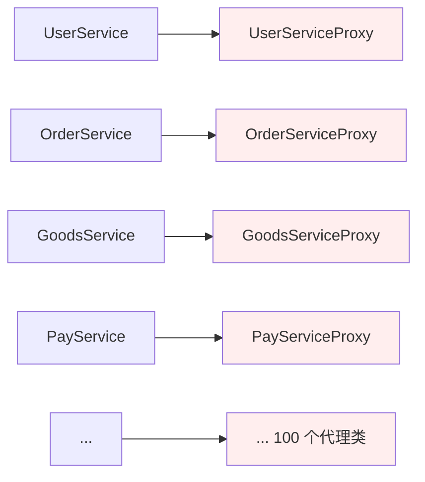
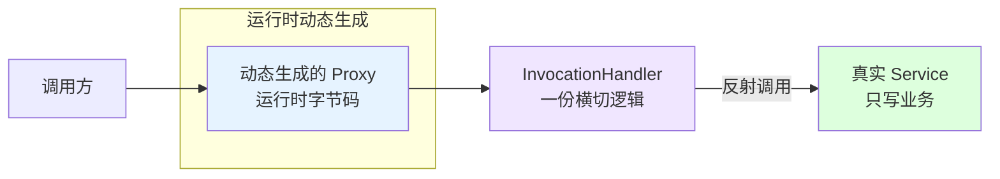
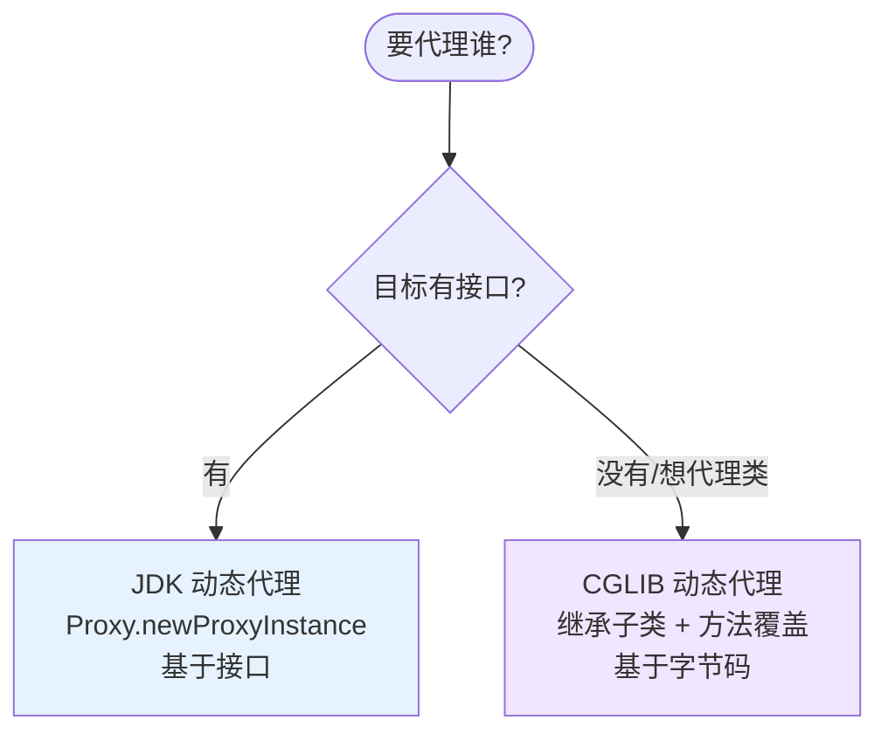
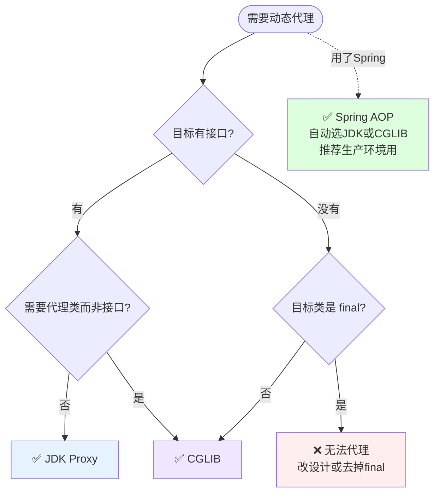

# 第三卷第6章：动态代理设计模式

> **📚 本篇渐进学习节奏（建议按顺序食用）**
>
> 1. **第 01 节 · 案例引入** — 100 个 Proxy 文件"类爆炸"现场
> 2. **第 02 节 · 直觉探索** — 静态复制粘贴/模板基类两条路为什么全塌了
> 3. **第 03 节 · 模式基础** — Handler+Proxy 上线，一套横切管所有
> 4. **第 04 节 · 两种实现** — JDK Proxy vs CGLIB 一表速查
> 5. **第 05 节 · 效果对比+Retrofit** — 事故改造量化 + 接口→请求的魔法
> 6. **第 06 节 · 反面踩坑** — CGLIB静默/final/this自调用/死循环 4坑
> 7. **第 07 节 · 决策选型** — JDK vs CGLIB vs Spring AOP 决策树
> 8. **第 08 节 · 总结延伸** — 沉淀+开源+思考题
>
> 阅读到任一节卡壳，直接跳回上一节复盘场景。

#### 目录介绍
- [01.案例引入与思考](#01案例引入与思考)
    - [1.1 痛点场景](#11-痛点场景)
    - [1.2 它哪里不舒服](#12-它哪里不舒服)
    - [1.3 引出本篇主角](#13-引出本篇主角)
- [02.直觉方案探索](#02直觉方案探索)
    - [2.1 手写N个静态Proxy](#21-手写n个静态proxy)
    - [2.2 尝试模板基类抽取](#22-尝试模板基类抽取)
- [03.动态代理基础](#03动态代理基础)
    - [3.1 InvocationHandler核心](#31-从失败中提炼的核心invocationhandler)
    - [3.2 动态代理定义](#32-动态代理定义)
    - [3.3 典型使用场景](#33-典型使用场景)
- [04.两种实现对比](#04两种实现对比)
    - [4.1 JDK动态代理](#41-jdk动态代理基于接口)
    - [4.2 CGLIB动态代理](#42-cglib动态代理基于类)
    - [4.3 两种实现速查](#43-两种实现速查)
- [05.用前用后效果对比](#05用前用后效果对比)
    - [5.1 事故现场改造](#51-事故现场改造)
    - [5.2 Retrofit实战](#52-retrofit实战)
    - [5.3 核心收益](#53-核心收益)
- [06.反面踩坑实录](#06反面踩坑实录)
    - [6.1 CGLIB代理final方法](#61-cglib代理final方法)
    - [6.2 this自调用穿透](#62-this自调用穿透代理)
    - [6.3 JDK强转ClassCastException](#63-jdk强转classcastexception)
    - [6.4 toString死循环](#64-tostringequals触发invoke死循环)
- [07.决策树与选型](#07决策树与选型)
    - [7.1 JDKvsCGLIBvsSpringAOP](#71-jdk-vs-cglib-vs-spring-aop)
    - [7.2 选型清单](#72-选型清单)
- [08.总结与延伸](#08总结与延伸)
    - [8.1 演化逻辑沉淀](#81-演化逻辑沉淀)
    - [8.2 开源实例](#82-真实开源代码中的动态代理)
    - [8.3 思考题](#83-思考题)


## 02.直觉方案探索

> **为什么要学这一节**：直接给你 `Proxy.newProxyInstance` 的代码很容易——但动态代理不是凭空发明的。它是在"100 个静态 Proxy 复制粘贴"这条死路上撞了无数次之后才收敛出来的唯一解法。

### 2.1 方案回顾：手写 N 个静态 Proxy

**【这就是上一篇最后的现场】**——给 20 个 Service 各写一个静态 Proxy，三件套横切逻辑一模一样，改一次日志格式就要改 20 个文件：

```java
// UserServiceProxy —— 日志+鉴权+计时
// OrderServiceProxy —— 同样的日志+鉴权+计时
// GoodsServiceProxy —— 同样的日志+鉴权+计时
// ... 20 个 Proxy 类，横切逻辑逐字相同
```

**🧪 验证规模化问题**：

```java
// 需求：日志从 println 改成 SLF4J + JSON
// ❌ 20 个 Proxy 类挨个改 → 漏改一个 = 线上日志格式不一致 → 监控告警误报
// 需求：新增一条鉴权规则（管理员才能 delete）
// ❌ 20 个 Proxy 里，只有 15 个 Service 有 delete ——哪些要加、哪些不加，全靠人肉判断
```

**❌ 失败原因**：静态代理的横切逻辑**逐类复制**——改一处需求 = 改 N 个文件。没有"一个地方管住全局"的机制。

### 2.2 尝试：用模板方法/基类抽取

**【方案：写一个 AbstractLogProxy 基类，子类只覆写业务】**：

```java
// 方案：模板方法基类
abstract class AbstractLogProxy<T> {
    protected T target;
    public Object handle(Method m, Object[] args) {
        log(); auth(); long t = now();
        Object r = invokeTarget(m, args);   // 子类覆写
        cost(t); return r;
    }
    abstract Object invokeTarget(Method m, Object[] args);
}
```

**🧪 跑一下，会发现根本问题**

```java
// 问题 1：每个 Proxy 还是要写一个子类覆写 invokeTarget——类数量没少
// 问题 2：代理对象类型丢失——调用方拿到的是 AbstractLogProxy，不是 UserService 接口
// 问题 3：不同接口的方法签名不同——抽象方法参数统一成 Method，丢失了类型安全
```

**❌ 失败原因**：模板方法只把"横切骨架"共享了，没有解决"代理类的个数"问题。而且代理对象不是目标接口类型——调用方无法面向接口编程。

**💡 反思**：我们需要的是**运行期自动生成代理类**——你只写一次横切逻辑，JVM 在运行时为**任意接口**合成代理字节码。这正是 `Proxy.newProxyInstance` + `InvocationHandler`。


## 03.动态代理基础

### 3.1 从失败中提炼的核心：InvocationHandler

上面两条死路的教训翻译成需求：① 代理类不需要手写——运行期生成；② 横切逻辑只写一次——所有接口共用。JDK 给出的方案是两件套：

```java
// ① InvocationHandler：你只写一次横切逻辑
class LogHandler implements InvocationHandler {
    private final Object target;
    public LogHandler(Object target) { this.target = target; }

    @Override
    public Object invoke(Object proxy, Method method, Object[] args) throws Throwable {
        System.out.println("[LOG] " + method.getName());   // 横切：日志
        long t = System.currentTimeMillis();                 // 横切：计时
        Object result = method.invoke(target, args);         // 转发：业务
        System.out.println("[LOG] 耗时:" + (System.currentTimeMillis() - t));
        return result;
    }
}

// ② Proxy.newProxyInstance：JVM 在运行时合成代理字节码
UserService proxy = (UserService) Proxy.newProxyInstance(
    UserService.class.getClassLoader(),
    new Class[]{UserService.class},
    new LogHandler(new UserServiceImpl())
);
// proxy 实现了 UserService 接口——调用方完全无感
```

**三句话记住**：`InvocationHandler` 写横切 → `Proxy.newProxyInstance` 生成代理 → 调用方拿到的就是接口类型。

### 3.2 动态代理定义

代理类在**运行期**动态生成字节码并加载到 JVM——不需要编译期手写 `.java` 文件。你写一次横切逻辑（`InvocationHandler#invoke`），JVM 帮你为所有接口自动合成代理类。**本质：把"N 次手写代理类"压缩成"1 次 Handler + 运行时字节码"。**

### 3.3 三步使用法

```java
// ① 定义接口（和目标实现）
public interface UserService {
    User findById(Long id);
    void update(User u);
}
class UserServiceImpl implements UserService { /* 业务实现 */ }

// ② 写一次横切逻辑——所有方法共用
InvocationHandler handler = new InvocationHandler() {
    private final UserService target = new UserServiceImpl();
    public Object invoke(Object proxy, Method m, Object[] args) throws Throwable {
        System.out.println("[LOG] " + m.getName());   // 日志
        long t = System.currentTimeMillis();            // 计时
        Object result = m.invoke(target, args);         // 转发业务
        System.out.println("[LOG] 耗时:" + (System.currentTimeMillis() - t) + "ms");
        return result;
    }
};

// ③ 一行生成代理——所有接口的所有方法自动拦截
UserService proxy = (UserService) Proxy.newProxyInstance(
    UserService.class.getClassLoader(),
    new Class[]{UserService.class},
    handler
);
proxy.findById(1L);  // ✅ 自动触发 invoke()——日志/计时全自动
```

### 3.4 典型使用场景

- **统一横切收口**：日志、鉴权、限流、事务——不再 20 个 Proxy 各写一遍，一个 Handler 搞定；
- **接口→实现零代码**：MyBatis Mapper 接口没有实现类——JDK Proxy 在运行期把接口方法转成 SQL；
- **远程调用透明化**：RPC 客户端拿到的接口实例是 Proxy——方法调用被序列化成网络请求；
- **AOP 基石**：Spring `@Transactional` / `@Async` / `@Cacheable` 底层全靠动态代理。


## 04.两种实现对比

### 4.1 JDK 动态代理——基于接口

**核心限制**：目标必须实现接口。JVM 生成 `$Proxy0` 类继承 `Proxy` 并实现目标接口。

```java
// JDK Proxy：目标有接口
UserService target = new UserServiceImpl();
UserService proxy = (UserService) Proxy.newProxyInstance(
    target.getClass().getClassLoader(),
    target.getClass().getInterfaces(),
    new LogHandler(target)
);
proxy.findById(1L);  // ✅ 类型安全，invoke() 自动拦截
```

**特点**：反射调用方法（`method.invoke(target, args)`），JDK 17+ 性能几乎与直接调用持平。

### 4.2 CGLIB 动态代理——基于类

**核心限制**：目标不能是 `final` 类/方法。CGLIB 生成目标类的子类，覆写每个非 final 方法。

```java
// CGLIB：目标没有接口，或必须代理类
Enhancer enhancer = new Enhancer();
enhancer.setSuperclass(UserService.class);           // 指定目标类
enhancer.setCallback(new MethodInterceptor() {        // 设置拦截器
    public Object intercept(Object obj, Method m, Object[] args, MethodProxy proxy) {
        System.out.println("[LOG] " + m.getName());
        return proxy.invokeSuper(obj, args);          // 调父类（目标）方法
    }
});
UserService proxy = (UserService) enhancer.create();
```

### 4.3 两种实现速查

| 维度 | JDK Proxy | CGLIB |
|:---|:---|:---|
| 代理对象类型 | 接口实现类 `$Proxy0` | 目标类的子类 |
| 目标要求 | 必须实现接口 | 不能是 final 类/方法 |
| 调用方式 | 反射 `method.invoke()` | `MethodProxy.invokeSuper()` |
| 性能 | JDK 17+ 几乎持平 | 略快（无反射） |
| Spring 使用场景 | 默认（有接口时） | 无接口时自动切换 |
| 典型问题 | `(UserImpl)proxy` 强转报 ClassCastException | final 方法静默不代理 |

> **本篇主线**：静态代理的"类爆炸"，正是动态代理要解决的核心问题

### 1.1 痛点场景

> **🔥 模拟事故复盘 · 周三 14:30 "补丁战第三天"**
>
> 上一篇周一的安全审计事故后，团队按统一标准给每个 Service 写了静态代理。三天过去：
>
> - **周一**：写了 `UserServiceProxy` / `OrderServiceProxy` / `PayServiceProxy`，三件套补完，提交 1.2k 行；
> - **周二**：架构师评审时一句话"日志格式得换 SLF4J + JSON"——**三个 Proxy 全得改一遍**；写代码的实习生小张周二晚上加班到 23:00，把 `OrderServiceProxy` 漏了一个方法没改，第二天早上监控告警全是格式错乱；
> - **周三 14:30**：业务又新上线了 `GoodsService` / `CouponService` / `MessageService`，**三个 Proxy 又得手写一遍**；CTO 在例会上拍板："再这么搞下去，半年后项目里一半文件叫 XxxProxy。"
>
> 这场"补丁战"暴露的不是"代理模式不好"，而是**"编译期手写代理"这条路在工程化规模面前根本走不通** — 100 个接口意味着 100 份雷同代码，一处需求变动就是 100 处地毯式修改。**真正的解法只有一条：让代理类从"手写"变成"运行时自动生成"**。

上一篇的静态代理，确实把"日志+鉴权+计时"从 `UserService` 抽了出去，但代价是多了一个 `UserServiceProxy`。如果项目里还有 `OrderService`、`GoodsService`、`PayService`……每个都要做同样的事：

```java
// UserServiceProxy
public class UserServiceProxy implements UserService {
    private final UserService target;
    public User findById(Long id) {
        log(); auth(); long t=now();
        User u = target.findById(id);
        cost(t);
        return u;
    }
    // ... update / delete / list 每个方法都写一遍
}

// OrderServiceProxy —— 把上面代码几乎一模一样复制
// GoodsServiceProxy —— 再来一次
// PayServiceProxy ——  再来一次
// 100 个接口 → 100 个代理类 → 每个代理类里 N 个方法 = N × 100 次复制
```



### 1.2 它哪里不舒服

- ❌ **类爆炸**：每多一个接口就多一个代理类，项目里一半文件是 `XxxProxy`；
- ❌ **代码雷同**：所有代理类里的日志/鉴权/计时逻辑本质上一模一样，修改"日志格式"就要改 100 个文件；
- ❌ **扩展痛苦**：新接口一上线，必须记得写它的代理，忘了就没日志没鉴权，线上事故在等你；
- ❌ **无法统一管控**：横切逻辑散落在 100 个代理类里，根本不存在"一个地方管住全局"的可能。

### 1.3 引出本篇主角

> **动态代理（Dynamic Proxy）的核心思想**：不再"编译期手写代理类"，改成"运行时自动生成代理类"。你只需要写一次横切逻辑（`InvocationHandler#invoke`），JDK/CGLIB 会在运行时为**任意接口/类**动态合成代理字节码。



两条技术路线互为补充：



Spring AOP、MyBatis Mapper、Retrofit 的接口请求——它们的"魔法"全都来自动态代理。本篇会把原理、两种实现、坑点一次讲透。

**🎯 用前用后效果对比（接续 1.1 事故现场）**

基线：20 个 Service，平均每个 10 个方法，三件套横切：

| 维度 | ❌ 静态代理（事故现场） | ✅ JDK 动态代理 | ✅✅ Spring AOP（动态代理 + 容器） |
|------|----------------------|-----------------|---------------------------------|
| 代理类文件数 | **20 个** XxxProxy.java | **0 个**（运行期生成） | 0 个 + 一个 `@Aspect` 类 |
| 横切代码总行数 | 约 1200 行（重复 20 遍） | 约 30 行（写一次 `invoke`） | 约 30 行 + 注解 |
| 新增 Service 时 | **必须**新写一个 Proxy | **零修改**（自动生效） | 零修改 |
| 改日志格式 | **20 处**逐个改 | **1 处** | 1 处 |
| 改鉴权规则 | **20 处** | **1 处** | 1 处 |
| 漏写一个方法 | 常见事故源 | 不可能（接口方法全部转发） | 不可能 |
| 启动性能 | 0 开销 | 首次代理生成 ~1ms | 容器启动慢 100~300ms |
| 调用性能 | 与直接调用持平 | 反射开销 ~3-5x（JDK 17+ 几乎可忽略） | 同 JDK Proxy |
| 可调试性 | IDE 直接 F11 进 Proxy 类 | 需进 `$Proxy0` 反编译类 | 同 JDK Proxy |

> **结论**：
> - **小型项目（< 5 个 Service）**：静态代理可读性更好；
> - **中大型项目（≥ 10 个 Service）**：必须动态代理 — 否则改一次需求够你写一周补丁；
> - **工程化项目**：直接用 Spring AOP，动态代理只是底层机制不必直接调用。

---

## 05.用前用后效果对比

### 5.1 事故现场改造：20 个 Proxy → 1 个 Handler

拿 01 节的"100 个 Proxy 类爆炸"事故做基准：

| 指标 | ❌ 静态代理 | ✅ JDK 动态代理 | ✅✅ Spring AOP |
|:---|:---|:---|:---|
| 代理类文件数 | **20 个** XxxProxy.java | **0 个**（运行期生成） | 0 个 + 一个 `@Aspect` 类 |
| 横切代码总行数 | ~1200 行（重复 20 遍） | ~30 行（写一次 invoke） | ~30 行 + 注解 |
| 新增 Service 时 | 必须新写一个 Proxy | **零修改**——自动生效 | 零修改 |
| 改日志格式 println→SLF4J | 20 处逐个改 | **1 处**——改 Handler | 1 处 |
| 漏写横切逻辑 | 常见事故源 | 不可能——所有方法自动拦截 | 不可能 |
| 调用性能 | 与直接调用持平 | ~3-5x 反射开销（JDK 17+ 可忽略） | 同 JDK Proxy |

### 5.2 Retrofit 实战：接口→网络请求的魔法

```java
// 只定义接口 + 注解——没有实现类！
public interface ApiService {
    @GET("/api/users/{id}")
    Call<User> getUser(@Path("id") long id);
}

// Retrofit.create() 内部就是 Proxy.newProxyInstance
ApiService api = new Retrofit.Builder()
    .baseUrl("https://api.example.com")
    .build()
    .create(ApiService.class);           // ← 这里返回的是 JDK 动态代理

api.getUser(1L).enqueue(callback);      // 方法调用 → HTTP 请求

// Retrofit 源码核心：create() 里的 InvocationHandler
public <T> T create(Class<T> service) {
    return (T) Proxy.newProxyInstance(service.getClassLoader(),
        new Class[]{service},
        (proxy, method, args) -> {
            // 解析方法注解 → 构造 HTTP 请求 → 执行
            return loadServiceMethod(method).invoke(args);
        });
}
```

### 5.3 核心收益

**🔑 核心收益**：动态代理把"横切逻辑的编写"从 N 次压缩到 1 次——一个 `InvocationHandler#invoke()` 方法代理所有接口的所有方法。**它是静态代理"类爆炸"问题的标准解法。**


## 06.反面踩坑实录

> **为什么有这一节**：动态代理写起来"看似只有 3 行"，但下面 4 类问题几乎人人翻过车。

### 6.1 CGLIB 代理 final 方法——静默失效半年才发现

```java
@Service
public class UserService {
    public final User findById(Long id) { return userDao.selectById(id); }  // ❌ final
}
@Aspect class LogAspect {
    @Around("execution(* UserService.findById(..))")  // 这个切面永远不会触发！
    public Object log(ProceedingJoinPoint p) { /* ... */ }
}
```

**根因**：CGLIB 生成子类覆写方法，final 不能覆写→跳过→**不报错不警告**。Spring INFO 日志里会有一行提醒，但 99% 的人不看。

**📌 教训**：Spring 项目中有切面需求的方法**绝对不能加 final**。

### 6.2 `this.xxx()` 自调用穿透代理——`@Async` `@Transactional` 全失效

```java
@Service
public class OrderService {
    @Transactional public void createOrder(Order o) {
        save(o);
        this.sendNotify(o);  // ❌ this 直接调自己，绕过代理→@Async 不生效
    }
    @Async public void sendNotify(Order o) { /* 期望异步，永远不生效 */ }
}
```

**根因**：代理拦截的是"外部对代理对象的调用"，`this.xxx()` 是目标对象内部对自己的直接调用——根本不经过代理。这是 Spring AOP 群里每周都有人踩的坑。

**✅ 正解**：`((OrderService) AopContext.currentProxy()).sendNotify(o)` 或拆成两个 Service 互相注入。

### 6.3 JDK Proxy 强转实现类 → ClassCastException

```java
UserService proxy = (UserService) Proxy.newProxyInstance(...);
((UserServiceImpl) proxy).someCustomMethod();  // ❌ $Proxy0 只 implements UserService，不继承 Impl
```

**📌 教训**：JDK Proxy 的 `$Proxy0` **只实现接口**、不继承实现类——面向接口编程是铁律。非要拿实现类：换 CGLIB 或用 `AopProxyUtils.getTargetObject()`。

### 6.4 `toString/equals` 触发 invoke 死循环

```java
class MyHandler implements InvocationHandler {
    public Object invoke(Object proxy, Method m, Object[] args) {
        log.info("call {} on {}", m.getName(), proxy);  // ❌ proxy.toString() → invoke() → toString() → StackOverflow
        return m.invoke(target, args);
    }
}
```

**✅ 正解**——所有工业级代理框架第一行就这么干：
```java
if (m.getDeclaringClass() == Object.class) return m.invoke(this, args);  // Object 方法不拦截
```

### 6.5 踩坑速查

| 坑 | 现象 | 根因 | 正解 |
|:---|:---|:---|:---|
| final 方法 | AOP 静默失效 | CGLIB 不能覆写 final | 去掉 final 或换 JDK Proxy |
| this.自调用 | @Async 不生效 | 不走代理 | AopContext.currentProxy() |
| 强转 Impl | ClassCastException | $Proxy0 只实现接口 | 面向接口编程 |
| toString | StackOverflow | Object 方法也进 invoke | 先判断 declaringClass |


## 07.决策树与选型

### 7.1 JDK vs CGLIB vs Spring AOP



### 7.2 选型清单

| 场景 | 推荐 | 理由 |
|:---|:---|:---|
| 有接口、简单横切 | ✅ JDK Proxy | 原生 API，无额外依赖 |
| 无接口 / 代理具体类 | ✅ CGLIB | 字节码继承子类 |
| Spring 项目、需要切面 | ✅ Spring AOP | 自动选型 + PointCut + 注解驱动 |
| 目标类是 final | ❌ 两<br/>种都不行 | 改设计去掉 final，或换组合模式 |
| 目标方法含 this.自调用 | ❌ 两<br/>种都不行 | 拆 Service 或用 AopContext |


## 08.总结与延伸

### 8.1 演化逻辑沉淀

| 阶段 | 核心问题 | 发现 |
|:---|:---|:---|
| **01 类爆炸事故** | 100 个静态 Proxy——改需求改 N 个文件 | 手写代理在工程化规模面前彻底崩塌 |
| **02 模板方法失败** | 基类共享横切骨架但代理类型丢失 | 运行期合成字节码才是正解 |
| **03 InvocationHandler** | 横切写一处 + `Proxy.newProxyInstance` | 所有接口的所有方法自动拦截 |
| **04 两种实现** | JDK Proxy(接口) vs CGLIB(类) | 有无接口决定选型 |
| **05 效果对比** | 20 个 Proxy→0 个文件+30 行 Handler | 改日志格式改 1 处，Retrofit 零实现类请求 |
| **06 4 坑踩坑** | final/this自调用/强转/死循环 | 动态代理的铁律必须记住 |
| **07 决策选型** | JDK vs CGLIB vs Spring AOP | Spring 项目直接用 AOP |

**🔑 一句话核心**：

> 动态代理是"100 份雷同代码→1 份横切逻辑 + 运行期字节码生成"的唯一工程化解法。**Spring AOP/MyBatis/Retrofit——Java 生态的半壁江山建立在这一个 API 之上。**

### 8.2 真实开源代码中的动态代理

动态代理在 Java 生态里是"框架基建"级别——下面每个案例都值得对照源码读一遍：

| 出处 | 代理类型 | 核心魔法 |
|:---|:---|:---|
| Spring AOP `@Transactional` | JDK + CGLIB | 注解→横切织入 |
| MyBatis Mapper 接口 | JDK Proxy | `MapperProxy#invoke` →接口方法→SQL |
| Retrofit `create()` | JDK Proxy | 接口+注解→HTTP 请求 |
| OpenFeign | JDK Proxy | 接口→远程 HTTP 调用 |
| Dubbo RPC Stub | Javassist | 远程伪装成本<br/>地调用 |
| Mockito | ByteBuddy | mock 任意类任意方法 |
| Hibernate LAZY | ByteBuddy | @OneToMany 懒加载子类代理 |

> **学习路径**：MyBatis `MapperProxy`（约 30 行，最简工业范本）→ Retrofit `create()`（注解→网络）→ Spring `JdkDynamicAopProxy`（带 advisor chain，最完整）。

### 8.3 模式联动

| 模式 | 关系 | 一句话区别 |
|:---|:---|:---|
| **静态代理** | 演化来源 | 静态手写 N 个 Proxy→动态一行生成 |
| **装饰器** | 结构同、意图不同 | 代理控制访问，装饰器叠加增强 |
| **Spring AOP** | 工业封装 | 动态代理 + PointCut + IoC = AOP |
| **JDK Proxy vs CGLIB** | 两种实现 | 接口→JDK，无接口→CGLIB，Spring 自动选 |

### 8.4 思考题

1. JDK Proxy 生成的 `$Proxy0` 和 CGLIB 生成的子类，在 JVM 层面有什么本质区别？
2. 为什么 CGLIB 不能拦截 `final` 方法？JDK Proxy 为什么没有这个限制？
3. Spring AOP 什么时候自动选 JDK Proxy、什么时候自动选 CGLIB？
4. Retrofit 的 `create()` 怎么知道一个接口方法应该发 GET 还是 POST 请求？

> 上一篇 [05.静态代理](05.静态代理设计模式.md) → 本篇 → [07.适配器](07.适配器设计模式.md)：当接口不一致时，用什么模式来"凑接"两个本不能一起工作的类？适配器登场。
