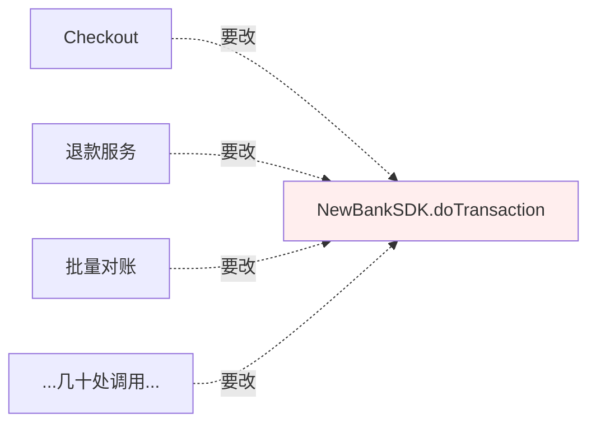
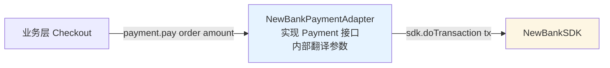
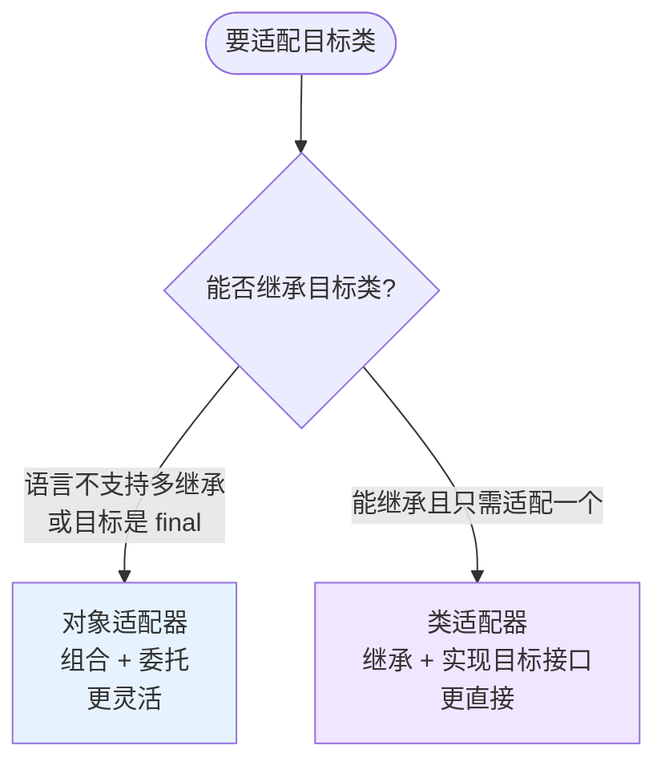
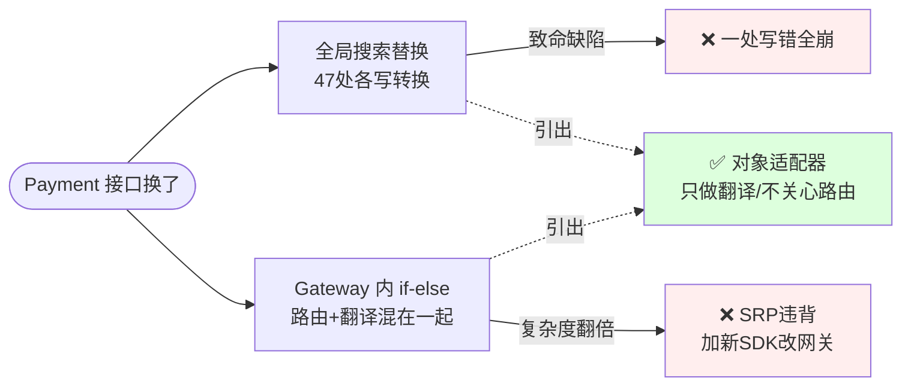
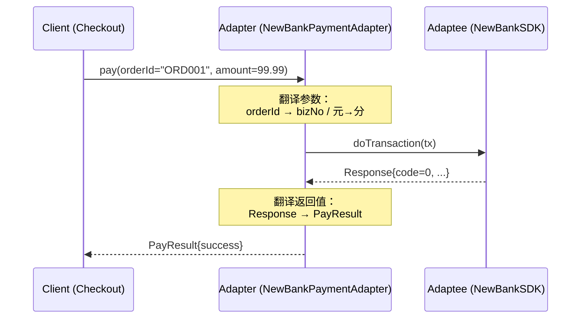
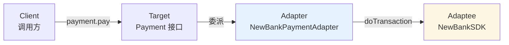
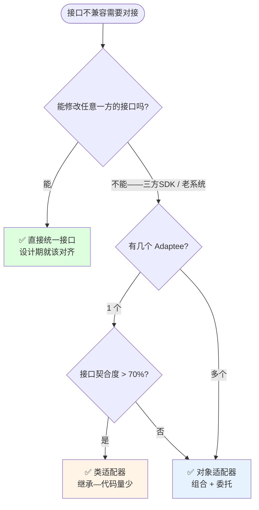
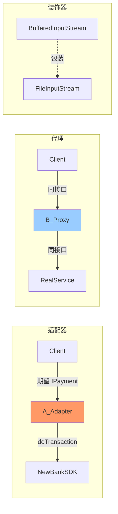

# 第三卷第7章：适配器模式设计思想

> **📚 本篇渐进学习节奏（建议按顺序食用）**
>
> 1. **第 01 节 · 案例引入** — 双十一前三天被迫更换支付 SDK，47 处调用点翻车
> 2. **第 02 节 · 直觉探索** — 全局搜索替换 / if-else 网关，两条死路走到底
> 3. **第 03 节 · 模式基础** — 从失败中提炼标准骨架——实现 Target + 组合 Adaptee
> 4. **第 04 节 · 两种实现** — 类适配器 vs 对象适配器一表速查
> 5. **第 05 节 · 效果对比** — 事故改造前后数据说话
> 6. **第 06 节 · 反面踩坑** — 4 类适配器经典翻车 + 替代方案
> 7. **第 07 节 · 决策选型** — 该不该用 Adapter？类 vs 对象？一张决策图搞定
> 8. **第 08 节 · 总结延伸** — 沉淀 + 联动 + 开源 + 思考题
>
> 阅读到任一节卡壳，直接跳回上一节复盘场景。

#### 目录介绍
- [01.案例引入与思考](#01案例引入与思考)
    - [1.1 痛点场景](#11-痛点场景)
    - [1.2 它哪里不舒服](#12-它哪里不舒服)
    - [1.3 引出本篇主角](#13-引出本篇主角)
- [02.直觉方案探索](#02直觉方案探索)
    - [2.1 全局搜索替换](#21-尝试全局搜索替换)
    - [2.2 抽Gatewayif-else路由](#22-尝试抽一个gateway类)
    - [2.3 需求清单收敛](#23-两次失败之后需求清单收敛)
- [03.适配器模式基础](#03适配器模式基础)
    - [3.1 标准骨架](#31-从失败中提炼的标准骨架)
    - [3.2 适配器模式定义](#32-适配器模式定义)
    - [3.3 典型使用场景](#33-典型使用场景)
- [04.两种实现对比](#04两种实现对比)
    - [4.1 类适配器继承](#41-类适配器继承-adaptee)
    - [4.2 对象适配器组合](#42-对象适配器组合-adaptee)
    - [4.3 两种实现速查](#43-两种实现速查)
- [05.用前用后效果对比](#05用前用后效果对比)
    - [5.1 支付事故改造](#51-回到事故现场改造)
    - [5.2 核心收益](#52-核心收益)
- [06.反面踩坑实录](#06反面踩坑实录)
    - [6.1 静默吞掉语义](#61-静默吞掉语义)
    - [6.2 类适配器多继承陷阱](#62-类适配器多继承陷阱)
    - [6.3 双向适配丢失回调](#63-双向适配只接单向)
    - [6.4 Adapter里new临时对象](#64-adapter里new临时对象)
    - [6.5 踩坑速查替代方案](#65-踩坑速查替代方案)
- [07.决策树与选型](#07决策树与选型)
    - [7.1 该不该用适配器](#71-该不该用适配器)
    - [7.2 选型清单速查](#72-选型清单速查)
- [08.总结与延伸](#08总结与延伸)
    - [8.1 演化逻辑沉淀](#81-演化逻辑沉淀)
    - [8.2 模式联动边界](#82-模式联动边界)
    - [8.3 开源实例](#83-真实开源代码中的适配器)
    - [8.4 思考题](#84-思考题)


## 01.案例引入与思考

> **本篇主线**：对接第三方 SDK / 老系统迁移时最高频的"接口签名不一致"

### 1.1 痛点场景

> **🔥 模拟事故复盘 · 双十一前 3 天 · 支付通道被迫更换**
>
> 10 月 28 日下午 16:00，老板拉住架构师："原来的 XX 支付通道今天告知双十一期间费率上调 30%，公司决定本周内全量切换到 YY 通道，后天上线。"
> 后端组拉开代码库一看——依赖原 `Payment` 接口的地方有 **47 处**：结算 Service、退款 Service、对账 Job、商户后台、营销退费、充值，全部分散在 12 个模块。小张拉过说"那我们全局搜索替换一下 SDK 调用名就行"，结果周六上线后：
>
> - **18:30**：商户后台退款接口 500，原因 `BigDecimal × 100` 转 `long cents` 时调用点忘了粘贴 `setScale(2, ROUND_HALF_UP)`，**一笔 99.999 元退款变成了 9999 分出了什么问题你们猜**；
> - **22:15**：对账 Job 跪了，原因商户后台代码中有些地方走老 SDK、有些走新 SDK，**订单号字段一个叫 `orderId` 一个叫 `bizNo`，双表联不上**；
> - **周一上午**：CTO 拍板回滚。但不能真回滚——费率今天零点已上调，需要 **同时保留老 SDK + 快速接入新 SDK + 支持灰度切换**。全局搜索替换这条路走不通了。
>
> 这场"紧急替换事故"暴露了一个本质问题：**业务层根本不应该直接调用三方 SDK 的原生接口**。就像你不会把手机直接插进中国插座 — 中间总得有个转接头。如果一开始就把 `Payment` 抽象接口、三方 SDK 用 Adapter 隔一层，双十一前这三个零点都不会发生。

项目里原来对接的是旧版支付 SDK，内部约定好的接口是：

```java
public interface Payment {
    PayResult pay(String orderId, BigDecimal amount);
}
```

上层已经有几十处都在用：

```java
public class Checkout {
    private Payment payment;  // 依赖的接口
    public void checkout(Order o) {
        PayResult r = payment.pay(o.getId(), o.getAmount());
        // ...
    }
}
```

现在老板宣布要换一家第三方 SDK，对方提供的 API 长这样：

```java
public class NewBankSDK {
    // 参数顺序、类型、返回值都完全不一样
    public Response doTransaction(Transaction tx) { ... }
}
public class Transaction {
    public void setBizNo(String no) { ... }
    public void setAmountInCents(long cents) { ... }
}
```

你怎么接？最直接的做法是把所有用 `Payment` 的地方都改掉，直接调 `NewBankSDK`：



### 1.2 它哪里不舒服

- ❌ **大面积改动**：几十处业务代码要跟着改，改动面失控；
- ❌ **参数转换重复**：每个调用点都要做一次"订单号 → bizNo、元 → 分"的转换，复制粘贴；
- ❌ **回退不了**：万一新 SDK 不稳定要回滚老 SDK——你得再把所有地方改回来；
- ❌ **业务耦合三方**：上层业务本来只关心"支付这个动作"，结果被三方 SDK 的数据结构、方法名绑死；
- ❌ **多选一困难**：如果同时要支持"老 SDK + 新 SDK"灰度切换，代码里到处是 `if-else`。

### 1.3 引出本篇主角

> **适配器模式（Adapter）的核心思想**：在调用方期望的接口和被调用方实际提供的接口之间插入一个"转换器"。调用方继续用老接口签名，适配器内部把调用翻译成新接口的调用。



业务层一行不用改，只新增一个 `NewBankPaymentAdapter` 类即可。如果要切回老 SDK，也只是换一个适配器。适配器还分 **类适配器**（继承）和 **对象适配器**（组合）两种——本篇会对比两种实现的适用场景与权衡。



**🎯 用前用后效果对比（衔接 1.1 事故现场）**

基线：47 处业务调用点，需要从老 SDK 切到新 SDK，且要支持灰度：

| 维度 | ❌ 全局搜索替换（事故现场） | ✅ 引入适配器模式 |
|------|-------------------------|-------------------|
| 业务代码改动量 | **47 处分散修改** | **0 处**（业务层只面向 `Payment` 接口） |
| 新增文件 | 0（但每处都要重复转换逻辑） | 1 个 `NewBankPaymentAdapter` |
| 参数转换重复度 | 47 处都要写"元→分"+"orderId→bizNo" | **集中在 1 个 Adapter** |
| 灰度切换实现 | 47 处都要插 `if (灰度) { 新 } else { 老 }` | 一个 `RoutingPaymentAdapter` 内部决策 |
| 一笔金额转换写错 | **必然发生**（手工 47 次复制粘贴） | 不可能（只有一处） |
| 回滚老 SDK | 全局再搜索替换一次 | 注入老 Adapter 即可 |
| 单元测试 | 无法 Mock SDK，只能集成测试 | Mock `Payment` 接口，纯单测 |
| 同时支持新老双通道 | 代码各种 if-else 分叉 | 两个 Adapter 共存即可 |

> **结论**：适配器模式的本质是 **"在你的接口和别人的接口之间，预留一层薄薄的隔离"**。这一层薄薄的代码就是你的项目对外部世界的"防御工事" — 三方 SDK 改了、要换厂商了、要做灰度了，所有冲击都被这一层挡住，业务代码毫发无损。**这不是过度设计，这是工程的最低保障**。

---

## 02.直觉方案探索

> **为什么要学这一节**：直接给你 Adapter 标准答案是很容易的——但适配器不是凭空发明的。它是在"全局搜索替换"和"if-else 网关"两条死路上撞了无数次之后才收敛出来的。



### 2.1 尝试：全局搜索替换——把 47 处 `Payment` 改成 `NewBankSDK`

**【新人方案①：每个调用点直接改调新 SDK】**

回到 01 节那场事故后，第一反应是"所有调老 SDK 的地方，全局替换成新 SDK"：

```java
// 方案 A：47 处调用点，每处自己写一次"元→分 + orderId→bizNo"
public class Checkout {
    public void checkout(Order o) {
        Transaction tx = new Transaction();
        tx.setBizNo(o.getId());
        tx.setAmountInCents(o.getAmount().multiply(new BigDecimal(100)).longValue());  // 元→分
        new NewBankSDK().doTransaction(tx);                                            // 新 SDK 调用
    }
}
// 退款Service、对账Job、营销退费... 47 处全要写一遍这种转换！
```

**🧪 跑一下，看会出什么问题**

```java
// 问题 1：47 处"元→分"——某处写了 setScale 某处没写 → 99.999 元变 9999 分
// 问题 2：对账 Job 里新旧 SDK 混用——orderId vs bizNo 字段对不上 → 双表联查跪
// 问题 3：要回滚老 SDK → 再全局搜索替换 47 处 → 再来一遍事故
```

**❌ 失败原因**：参数转换逻辑散落 47 处——复制粘贴 = 人肉同步 = 必然翻车。一处改错，整条链路崩。

**💡 反思**：我们需要把"新老 SDK 的翻译口诀"写在单独一处，所有调用方自动复用。

### 2.2 尝试：抽一个 Gateway 类，内部 if-else 路由

**【新人方案②：写 PaymentGateway，根据灰度开关选新/老 SDK】**

既然全局替换不行，那就写一个网关，内部 if-else 决定调谁：

```java
// 方案 B：PaymentGateway 内部 if-else 路由
public class PaymentGateway implements Payment {
    public PayResult pay(String orderId, BigDecimal amount) {
        if (grayFlag) {
            Transaction tx = new Transaction();
            tx.setBizNo(orderId);
            tx.setAmountInCents(amount.multiply(new BigDecimal(100)).longValue());
            return translate(new NewBankSDK().doTransaction(tx));
        } else {
            return oldSdk.pay(orderId, amount);
        }
    }
}
```

**🧪 跑一下，会发现隐藏问题——灰度切换逻辑与转换逻辑耦合**

```java
// 问题 1：GrayGateway 同时做了两件事——"选谁" + "翻译参数"——SRP 违背
// 问题 2：将来要加第三家 SDK → GrayGateway 变成三路 if-else → 上帝网关
// 问题 3：要单独 Mock 老 SDK or 新 SDK 来测转换逻辑？GrayGateway 把两者绑死了
```

**❌ 失败原因**：网关类把"路由决策"和"协议转换"绑在同一个类里。这其实是两个正交的职责——加一个新 SDK 不应该动路由逻辑，改路由逻辑不应该动转换逻辑。

**💡 反思**：我们需要一个**纯粹的转换器**——只负责把老接口翻译成新接口，"选谁"交给外部（DI/IoC 容器），而不是在 Adapter 里 if-else。

### 2.3 两次失败之后——需求清单收敛

| 必须满足 | 来自哪一次失败 |
|:---|:---|
| ① 参数转换逻辑只写一处，所有调用方复用 | 2.1 全局搜索替换失败 |
| ② 转换逻辑与路由逻辑解耦——Adapter 不关心"选谁" | 2.2 网关类耦合失败 |
| ③ 换 SDK 只加 Adapter 文件，业务代码一行不动 | 1.2 真实事故 |
| ④ 新老 SDK 可以共存——灰度切换靠 DI 容器，不靠 if-else | 1.2 真实事故


## 03.适配器模式基础

### 3.1 从失败中提炼的标准骨架

上面四条约束翻译成代码，就是适配器的灵魂——**实现调用方期望的接口、内部持有被适配对象、方法内做翻译**：

```java
// ① Target：调用方期望的接口——业务层只认识这个
public interface Payment {
    PayResult pay(String orderId, BigDecimal amount);
}

// ② Adaptee：第三方 SDK 的原生接口——不能改、也不想让业务层直接依赖
public class NewBankSDK {
    public Response doTransaction(Transaction tx) { ... }
}

// ③ Adapter：翻译器——实现 Target，内部组合 Adaptee
public class NewBankPaymentAdapter implements Payment {
    private final NewBankSDK sdk = new NewBankSDK();      // 组合 Adaptee

    public PayResult pay(String orderId, BigDecimal amount) {
        Transaction tx = new Transaction();                // ④ 参数翻译：JSON 风格的
        tx.setBizNo(orderId);                             // orderId → bizNo
        tx.setAmountInCents(amount.multiply(BigDecimal.valueOf(100)).longValue());  // 元→分
        Response r = sdk.doTransaction(tx);               // 转发到新 SDK
        return translate(r);                              // 返回值翻译
    }
}

// ⑤ 调用方：一行不动——换 SDK 只需注入不同的 Adapter 实例
Payment payment = new NewBankPaymentAdapter(new NewBankSDK());
payment.pay("ORD001", new BigDecimal("99.99"));
```

**三句话记住**：实现 Target → 组合 Adaptee → 方法内翻译。调用方只面向接口，完全不知道底层 SDK 换了。

### 3.2 一次调用的完整时序



> Client 从头到尾只认识 `Payment.pay()`——Adapter 内部做了两次翻译（参数 + 返回值），Client 毫不知情。

### 3.3 适配器模式定义

将一个接口（Adaptee）转换成客户期望的另一个接口（Target），让原本接口不兼容的类可以一起工作。**本质：调用方与三方接口之间的一层薄薄的"协议翻译层"。**

### 3.4 典型使用场景

- **替换三方 SDK**：老支付→新支付、老日志→新日志——Adapter 翻译参数和返回值格式，业务层零改动；
- **统一多供应商接口**：敏感词过滤 A/B/C 三家接口各不同→三个 Adapter 统一成 `filter(text)`，策略模式搭配使用；
- **兼容老版本 API**：JDK 中 `Enumeration`→`Iterator` 迁移——`Collections.enumeration()` 就是适配器；
- **数据格式转换**：`Arrays.asList()` 把数组适配成 List 接口；`InputStreamReader` 字节流转字符流。

> **反面提醒**：设计阶段能统一接口就别事后用 Adapter——它是"补偿模式"，不是"设计目标"。

### 3.5 三角色与结构图



| 角色 | 职责 | 示例 |
|:---|:---|:---|
| Target（目标接口） | 调用方期望的接口 | `Payment` 接口 |
| Adaptee（被适配者） | 需要被适配的原有类/三方 SDK | `NewBankSDK` |
| Adapter（适配器） | 实现 Target、组合/继承 Adaptee、做参数翻译 | `NewBankPaymentAdapter` |
| Client（客户端） | 通过 Target 接口调用 | `Checkout`、`OrderService` |


## 04.两种实现对比

适配器只有两种实现方式：**类适配器（继承）** 和 **对象适配器（组合）**——差异全在 Adapter 怎么拿到 Adaptee 的能力。

### 4.1 类适配器——继承 Adaptee

完整案例——电脑只能读 SD 卡，要读 TF 卡，用类适配器转换：

```java
// Target：Computer 期望的接口
public interface SDCard { String readSD(); void writeSD(String msg); }
public class Computer {
    public String readSD(SDCard sd) { return sd.readSD(); } // 只认 SDCard
}

// Adaptee：TF 卡——Computer 不认识
public class TFCardImpl implements TFCard {
    public String readTF() { return "TF data"; }
    public void writeTF(String msg) { }
}

// Adapter：继承 TFCardImpl + 实现 SDCard——把 TF 翻译成 SD
public class SDAdapterTF extends TFCardImpl implements SDCard {
    public String readSD() {
        System.out.println("adapter read tf card");
        return readTF();                // 直接继承的方法——不用组合
    }
    public void writeSD(String msg) { writeTF(msg); }
}

// ✅ 使用：Computer 以为自己拿到的是 SD 卡
Computer computer = new Computer();
computer.readSD(new SDAdapterTF());    // 输出："adapter read tf card" + "TF data"
```

**特点**：Adaptee 的部分方法无需覆写就直接可用；受限于 Java 单继承，只能适配一个 Adaptee。

### 4.2 对象适配器——组合 Adaptee

完整案例——MediaPlayer 只能播 mp3，要播 vlc/mp4，用对象适配器扩展：

```java
// Target：播放器接口——只认 play(audioType, filename)
public interface MediaPlayer { void play(String audioType, String fileName); }

// Adaptee：高级播放器——vlc / mp4 各不同
public interface AdvancedMediaPlayer {
    void playVlc(String fileName);
    void playMp4(String fileName);
}
public class VlcPlayer implements AdvancedMediaPlayer {
    public void playVlc(String f) { System.out.println("Playing vlc: " + f); }
    public void playMp4(String f) { /* do nothing */ }
}
public class Mp4Player implements AdvancedMediaPlayer {
    public void playVlc(String f) { /* do nothing */ }
    public void playMp4(String f) { System.out.println("Playing mp4: " + f); }
}

// Adapter：组合 AdvancedMediaPlayer——根据类型选择 vlc/mp4
public class MediaAdapter implements MediaPlayer {
    private AdvancedMediaPlayer advancedPlayer;     // 组合，而非继承

    public MediaAdapter(String audioType) {
        if ("vlc".equals(audioType)) advancedPlayer = new VlcPlayer();
        else advancedPlayer = new Mp4Player();
    }
    public void play(String audioType, String fileName) {
        if ("vlc".equals(audioType)) advancedPlayer.playVlc(fileName);
        else advancedPlayer.playMp4(fileName);
    }
}

// ✅ 使用：MediaPlayer 不需要改一行——Adapter 接管了新格式
AudioPlayer player = new AudioPlayer();
player.play("mp3", "song.mp3");               // 老格式直接播
player.play("mp4", "video.mp4");              // 新格式走 MediaAdapter
```

**特点**：灵活——可适配多个 Adaptee；"组合优于继承"原则的天然实践。

### 4.3 两种实现速查

| 维度 | 类适配器 | 对象适配器 |
|:---|:---|:---|
| 实现方式 | `extends Adaptee` + `implements Target` | `implements Target` + 组合 Adaptee |
| 适配数量 | 只能适配 **1 个** Adaptee | 可适配**多个** Adaptee |
| 复写 Adaptee 行为 | ✅ 可覆写父类方法 | ❌ 无法覆写——只能委托翻译 |
| Java 多继承限制 | ❌ 受限于单继承 | ✅ 无限制 |
| 推荐度 | ⭐⭐⭐（仅简单场景） | ⭐⭐⭐⭐⭐（工程首选） |

**📌 一句话决策**：Adaptee ≤ 1 个且接口契合 → 类适配器；其余所有场景 → **对象适配器**。

### 4.4 默认适配器（缺省适配器 Pattern）

当一个接口有 10 个方法但只需要实现其中 2 个时，先写一个抽象适配器给所有方法空实现，子类按需覆写。这是一种"减少接口实现量"的工程手段：

```java
// 原始接口——10 个方法
public interface MouseListener {
    void onClick(); void onDoubleClick(); void onDrag();
    void onHover();  void onEnter();   void onExit();
    void onMove();   void onWheel();   void onRightClick();
    void onLongPress();
}

// 默认适配器——全部空实现
public abstract class MouseAdapter implements MouseListener {
    public void onClick() { } public void onDoubleClick() { }
    public void onDrag() { }  public void onHover() { }
    public void onEnter() { } public void onExit() { }
    public void onMove() { }  public void onWheel() { }
    public void onRightClick() { } public void onLongPress() { }
}

// 子类只覆写需要的
new MouseAdapter() {
    public void onClick() { System.out.println("clicked!"); }
    public void onDrag()  { System.out.println("dragging..."); }
};
```

> Android SDK 中的 `XxxAdapter` 和 Java Swing 的 `XxxAdapter` 几乎全是这种模式——接口十几个方法、业务只需其中两个，完美匹配缺省适配器的天选之子。


## 05.用前用后效果对比


> **为什么单独留一节做对比**：用 01 节的支付事故做基准，量化 Adapter 到底省了什么。

### 5.1 🧪 回到事故现场：NewBankPaymentAdapter 改造

```java
// ❌ 事故现场：47 处直接调 NewBankSDK，每处自己写元→分 + orderId→bizNo
public class Checkout {
    public void checkout(Order o) {
        Transaction tx = new Transaction();
        tx.setBizNo(o.getId());          // 必须记 47 处——忘改一处就是 bug
        tx.setAmountInCents(o.getAmount().multiply(new BigDecimal(100)).longValue());
        new NewBankSDK().doTransaction(tx);
    }
}

// ✅ Adapter 改造后：Checkout 一行不动
public class Checkout {
    private Payment payment;      // 还是面向老接口
    public void checkout(Order o) {
        payment.pay(o.getId(), o.getAmount());  // 一行不动
    }
}
// 换 SDK 只需注入不同的 Adapter：
// payment = new NewBankPaymentAdapter(new NewBankSDK());
// payment = new OldBankPaymentAdapter(new OldBankSDK());
```

**📊 改造效果量化**：

| 指标 | 事故现场（全局替换） | Adapter 改造后 |
|:---|:---|:---|
| 业务代码改动量 | **47 处**分散修改 | **0 处** |
| 新增文件 | 0（但 47 处重复转换逻辑） | **1 个** NewBankPaymentAdapter |
| 元→分转换写错概率 | ⚠️ 47 处复制粘贴→必然发生 | ✅ 集中 1 处→不可能 |
| 灰度切换新老 SDK | 47 处插 if-else | 注入不同 Adapter |
| 回滚老 SDK | 再全局搜索替换一次 | 注入老 Adapter |
| 单元测试 | 无法 Mock SDK→只能集成测试 | Mock `Payment` 接口→纯单测 |

> **结论**：47 处改动 → 0 处改动 + 1 个 Adapter 文件。每次换 SDK 的动作从"全项目回归"蜕变成"加一个文件"。

### 5.2 🧪 统一多供应商：敏感词过滤改造

```java
// ❌ 用前：三个供应商各调各的——参数各不相同
public class RiskManagement {
    private AFilter a = new AFilter();  // filterSexyWords + filterPoliticalWords
    private BFilter b = new BFilter();  // filter(text)
    private CFilter c = new CFilter();  // filter(text, mask)
    public String check(String text) {
        text = a.filterSexyWords(text);
        text = a.filterPoliticalWords(text);
        text = b.filter(text);
        text = c.filter(text, "***");   // 每加一个供应商都要改这里
        return text;
    }
}

// ✅ 用后：统一接口 + 各写一个 Adapter + 策略模式批量调用
public interface ISensitiveWordsFilter { String filter(String text); }

public class AAdapter implements ISensitiveWordsFilter {
    private AFilter a;
    public String filter(String text) {
        text = a.filterSexyWords(text);
        return a.filterPoliticalWords(text);
    }
}

public class RiskManagement {
    private List<ISensitiveWordsFilter> filters = new ArrayList<>();
    public String check(String text) {
        for (ISensitiveWordsFilter f : filters) text = f.filter(text);
        return text;   // 新增供应商只加 Adapter——RiskManagement 一行不动
    }
}
```

### 5.3 生产场景速查

以下六大场景是适配器在生产环境中的主战场：

| 场景 | 说明 | 典型代码 |
|:---|:---|:---|
| **封装有缺陷的接口** | 外部 SDK 全静态方法、命名反人类→Adapter 包一层改名 | `CDAdaptor extends CD implements ITarget` |
| **统一多个类的接口** | 敏感词过滤 A/B/C 三家各不同→统一 `filter(text)` | 5.2 实例 |
| **替换外部系统** | 老支付换新支付——Adapter 翻译参数 | 5.1 实例 |
| **兼容老版本** | `Enumeration`→`Iterator`，JDK 靠 Adapter 兼容 | 见下文 5.4 |
| **数据格式转换** | `Arrays.asList()` 数组→List | `List<String> = Arrays.asList(a,b,c)` |
| **反向适配（防腐层）** | 三方接口常变→做一个厚 Adapter 层隔离 | Anti-Corruption Layer 模式 |

### 5.4 经典案例：Enumeration→Iterator 的 JDK 适配

`java.util.Collections.enumeration(Collection c)` 就是适配器——把新 API `Iterator` 翻译成老 API `Enumeration`：

```java
// JDK 源码简化版
public static Enumeration enumeration(final Collection c) {
    return new Enumeration() {
        private final Iterator i = c.iterator();    // 组合 Iterator
        public boolean hasMoreElements() { return i.hasNext(); }   // 方法名翻译
        public Object nextElement()     { return i.next(); }
    };
}

// 使用：老代码继续用 Enumeration，内部走的是 Iterator
for (Enumeration e = Collections.enumeration(list); e.hasMoreElements(); ) {
    System.out.println(e.nextElement());
}
```

### 5.5 封装有缺陷的第三方接口

外部 SDK 全静态方法、命名反人类、参数冗长——Adapter 包一层改名+收参数：

```java
// ❌ 原始三方 SDK——丑、全是 static、参数多
public class LegacySDK {
    public static void s1() { }
    public void uglyName_x_2() { }
    public void tooManyParams(int a, int b, int c, int d) { }
}

// ✅ Adapter 改造——漂亮命名 + 参数封装
public class CleanAdapter implements NewInterface {
    private LegacySDK sdk;
    public void doTask()         { LegacySDK.s1(); }           // static→实例方法
    public void process()        { sdk.uglyName_x_2(); }       // 重命名
    public void execute(Config c){ sdk.tooManyParams(c.a(), c.b(), c.c(), c.d()); }
}
```

### 5.6 核心收益

**🔑 核心收益**：适配器模式把"外部接口的协议翻译"从业务代码里彻底隔离——调用方永远只面向自己定义的接口，三方 SDK 换了只加一个 Adapter 文件。**它是项目对外部世界的"防御工事"——不是过度设计，是工程最低保障。**


## 06.反面踩坑实录

> **为什么有这一节**：Adapter 写起来"看似把 A 变成 B"，但下面 4 类问题几乎人人翻过车。

### 6.1 🚨 静默吞掉语义——错误码全映射成"失败"

```java
class NewBankPaymentAdapter implements Payment {
    public PayResult pay(String orderId, BigDecimal amount) {
        Response r = sdk.doTransaction(buildTx(orderId, amount));
        if (r.getCode() != 0) return PayResult.fail();  // ❌ 静默吞掉错误码
        return PayResult.success();
    }
}
// "已受理但未确认"、"需要重试"等中间态——全被映射成"失败"→业务层无法幂等
```

**📌 教训**：Adapter 是"接口转换"，不是"语义改写"。**保留并精确映射所有错误码。** ✅ 正解：`new PayResult(r.getCode(), r.getMsg(), translateStatus(r.getStatus()))`。

### 6.2 🚨 类适配器 + 多继承陷阱

```java
// ❌ 需要同时适配 TFCard + OldCard —— 类适配器卡死
class SDAdapter extends TFCardImpl extends OldCardImpl implements SDCard {}  // Java 不支持
```

**📌 教训**：超过一个 Adaptee → 立刻换**对象适配器**。单继承语言的硬伤。

### 6.3 🚨 双向适配只接单向——回调丢失

```java
// 正向：business → Adapter → NewSDK  ✅
// 反向：NewSDK 的异步回调 → ??? → business  ❌ Adapter 没接回调→支付成功但业务收不到通知
```

**📌 教训**：异步 SDK 需写**双向适配器**——正向 `XxxAdapter` + 反向 `XxxCallbackAdapter`，或一个类同时实现两边接口。

### 6.4 🚨 Adapter 里 new 临时对象→GC 抖动

```java
public PayResult pay(String orderId, BigDecimal amount) {
    Transaction tx = new Transaction();   // 每次 new——高频调用下 Young GC 飙升
    SignBuilder sb = new SignBuilder();   // 无状态对象完全可复用
}
```

**📌 教训**：无状态对象用 `static final` 单例；有状态用 `ThreadLocal`。

### 6.5 踩坑速查 + 替代方案

| 坑 | 根因 | 正解 |
|:---|:---|:---|
| 语义改写 | 错误码全映射失败 | 精确映射所有状态码 |
| 多继承 | 类适配器单继承受限 | 换对象适配器 |
| 回调丢失 | 只接正向不接反向 | 双向适配器 |
| GC 抖动 | 频繁 new 临时对象 | static final / ThreadLocal |

| 你的场景 | 推荐 |
|:---|:---|
| 替换三方 SDK | ✅ 对象适配器 + DI 注入 |
| 统一多供应商接口 | ✅ 各写一个 Adapter 实现同一 Target |
| 设计期可统一接口 | ❌ 别用 Adapter——直接统一设计 |
| 两个接口语义完全不同 | ❌ Adapter 不管语义翻译 |


## 07.决策树与选型

### 7.1 该不该用适配器



### 7.2 选型清单速查

| 场景 | 该用吗 | 推荐 |
|:---|:---|:---|
| 替换第三方 SDK | ✅ 该用 | 对象适配器 + DI 注入 |
| 统一多供应商接口 | ✅ 该用 | 各写 Adapter 实现同一 Target |
| 兼容老版本 API | ✅ 该用 | 对象适配器 |
| 设计期可统一接口 | ❌ 别用 | 直接统一设计 |
| 两边接口语义完全不同 | ❌ 别用 | 改设计——Adapter 只管翻译不管语义 |
| 单次临时调用 | ❌ 别用 | 写工具方法即可 |


## 08.总结与延伸

### 8.1 演化逻辑沉淀

| 阶段 | 核心问题 | 发现 |
|:---|:---|:---|
| **01 支付事故** | 47 处改 SDK 调用→全链路崩 | 业务代码不应直接依赖三方接口 |
| **02 两次失败** | 全局搜索替换 / if-else 网关 | 转换散落各处→复制粘贴必翻车；路由和翻译耦合→SRP 违背 |
| **03 标准骨架** | 正确的姿势是什么？ | 实现 Target + 组合 Adaptee + 方法内翻译→三句话 |
| **04 两种实现** | 类 vs 对象适配器 | 类=继承(单 Adaptee)、对象=组合(多 Adaptee)→工程首选对象 |
| **05 效果对比** | Adapter 到底省了什么？ | 47→0 处改动、一组文件代码一稿定 |
| **06 4 坑踩坑** | 语义改写/多继承/回调丢失/GC | Adapter 只管翻译、别吞语义、双向适配、复用无状态对象 |
| **07 决策选型** | 什么时候用、什么时候不用？ | 不改双方源码时才用 Adapter；设计期能统一就别用 |

**🔑 一句话核心**：

> 适配器模式是"事后补救"的隔离层——**业务层面向自己的接口永远不变，三方 SDK 的变化全被 Adapter 吸收。** 它不是模式炫技，是工程对不确定性的最低防御。

### 8.2 四模式结构辨析——代理/装饰器/桥接/适配器

代理、装饰器、桥接、适配器——这 4 种结构型模式代码骨架非常相似，面试最常问区别。**一句话区分：看接口是否改变。** 



| 模式 | 接口是否改变 | 意图 | JDK 例子 |
|:---|:---|:---|:---|
| **适配器** | ❌ 不同接口 | 翻译——把 A 接口转成 B 接口 | `InputStreamReader` <br/>(字节流→字符流) |
| **代理** | ✅ 同一接口 | 控制访问——加鉴权/限流 | `Collections.synchronizedList()` <br/>(同接口加锁) |
| **装饰器** | ✅ 同一接口 | 叠加增强——多级嵌套加能力 | `new BufferedInputStream(`<br/>`new FileInputStream(f))` |
| **桥接** | 设计期分离 | 抽象与实现独立变化 | JDBC `Driver` ↔ `Connection` |

### 8.3 真实开源代码中的适配器

适配器是 Java 生态里最朴素也最普及的模式——下面每个案例都值得对照源码读一遍：

| 出处 | 形态 | 它在适配什么 |
|:---|:---|:---|
| JDK `InputStreamReader` | 对象适配器 | 字节流→字符流（含字符集解码，继承 Reader + 组合 InputStream） |
| JDK `Arrays.asList(T...)` | 对象适配器 | 数组→List 接口（30 行代码，工业级范本） |
| JDK `Collections.list(Enumeration)` | 双向适配器 | 老 `Enumeration` ↔ 新 `Iterator`——JDK 的向后兼容方案 |
| Spring MVC `HandlerAdapter` | 适配器大本营 | 6 种 Handler（@RequestMapping、HttpRequestHandler 等）统一成 `handle(req,res)` |
| SLF4J `slf4j-log4j12` | 桥接式适配 | SLF4J API → Log4j/JUL/Logback——日志框架的"通用翻译层" |
| Android `RecyclerView.Adapter` | 数据适配 | 业务数据 → ViewHolder 视图 |

> **学习建议**：先看 `Arrays.asList`（30 行，最简单）→ 再看 `InputStreamReader`（含字符集解码，60 行）→ 最后读 Spring `HandlerAdapter` 体系（6 种实现互为参照）。三者读完，你就彻底理解适配器在工业系统中的核心地位。

### 8.4 ⚠️ 什么时候不该用适配器

- **接口本来就该一致**：如果你掌控两边接口的设计权，应在设计阶段统一，**不要用 Adapter 弥补设计偷懒**；
- **两个接口语义完全不同**：Adapter 只能"转换形式"，不能"翻译语义"——把"加密"接口 Adapt 成"压缩"接口是写 Bug；
- **只是单次性调用**：临时一两次调用直接写工具方法，引入 Adapter 反而过度设计；
- **应该用桥接的场合**：如果"接口端"和"实现端"都要独立扩展→桥接模式，不是适配器；
- **频繁 API 变更**：三方 SDK 半年改 5 次接口签名→Adapter 也要跟着改 5 次→防不住，应该用防腐层（Anti-Corruption Layer）。

> 一句话：**适配器是事后的补救，不是事前的炫技。设计阶段能统一就统一，统一不了再用 Adapter 兜底。**

### 8.5 思考题

1. 适配器和代理都有"包装目标对象"的结构——如何从"接口是否改变"上一句话区分？
2. "类适配器 + 单继承限制"是 Java 才有的问题吗？Go/Python 里有没有同样的困扰？
3. 如果三方 SDK 经常升级导致 Adapter 每月跟着改——这种场景下 Adapter 还是最佳选择吗？有没有更厚的防御层？
4. Spring MVC 的 `HandlerAdapter` 实现了 6 个适配器——它怎么做到的"来一个 Handler 就自动找到对应的 Adapter"？这不就是"适配器的策略模式"吗？

> 上一篇 [06.动态代理](https://yccoding.com/pages/ce54cb/) → 本篇 → [08.装饰器](08.装饰器模式设计思想.md)：结构型和 Adapter 极易混淆——它不转换接口，而是给同一接口"叠加能力"。


