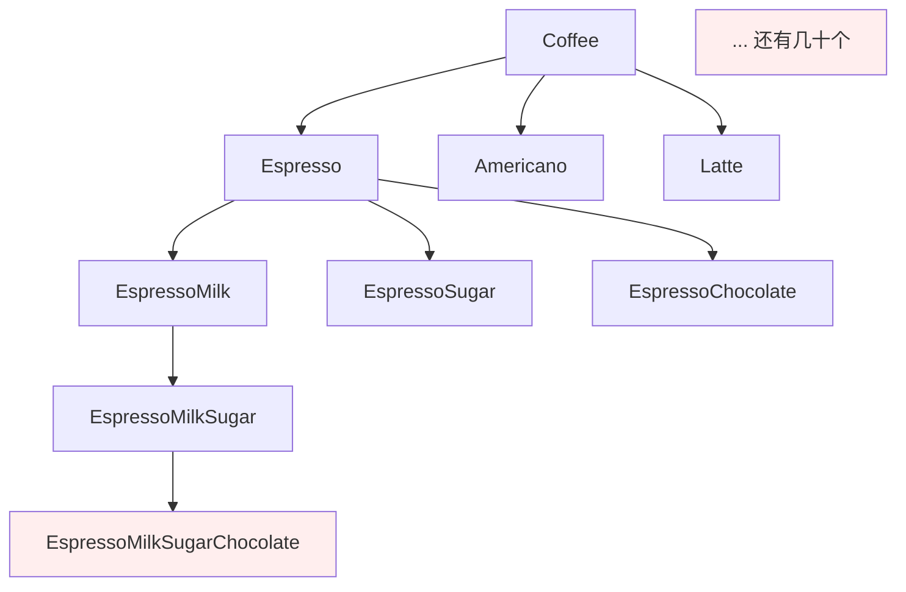
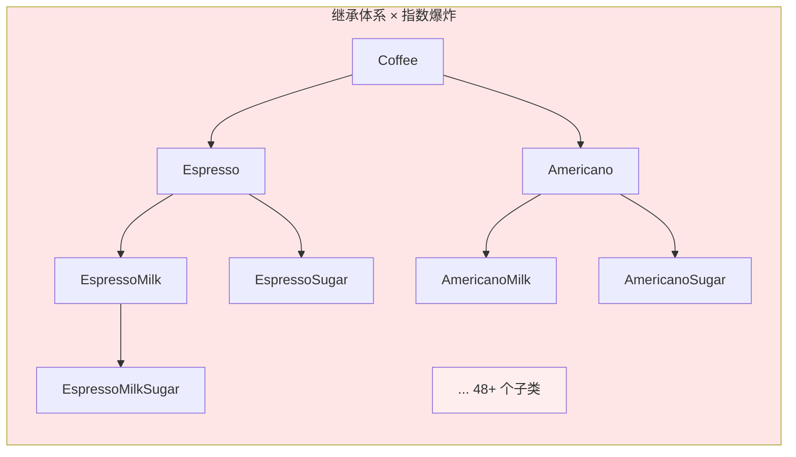
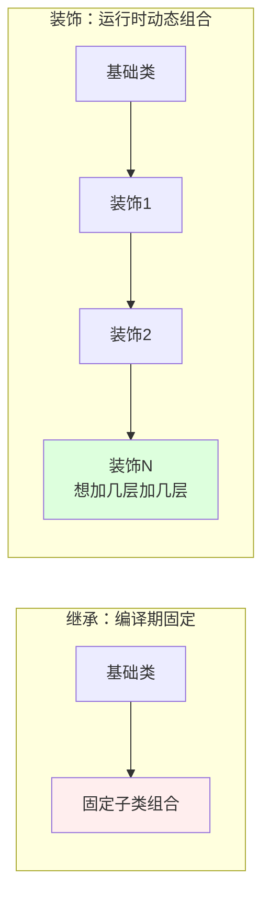
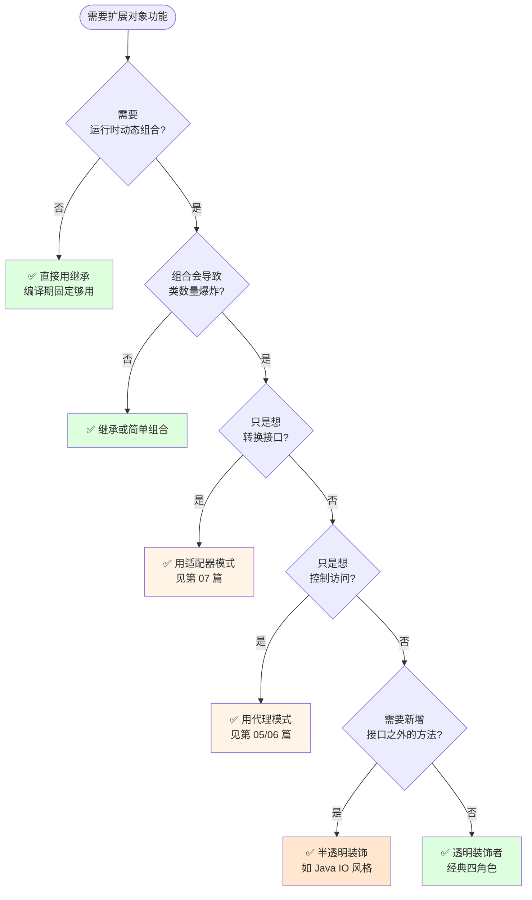
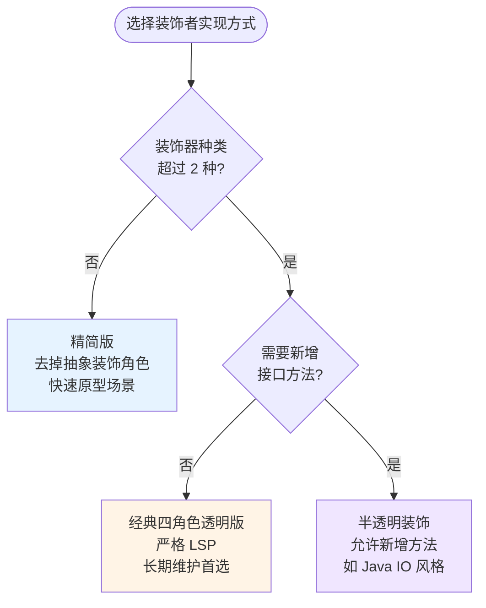
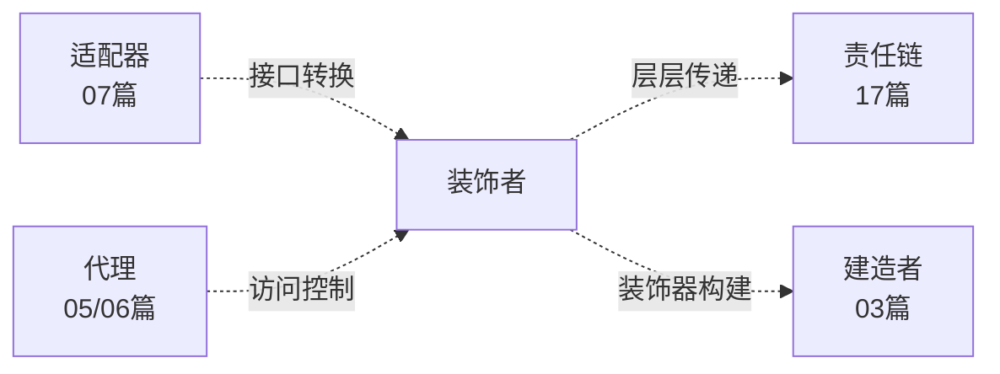

# 第三卷第8章：装饰者模式设计思想

> **📚 本篇渐进学习节奏（建议按顺序食用）**
>
> 本篇采用「**事故复盘 → 失败探索 → 模式诞生 → 实现对比 → 效果验证 → 反面踩坑 → 选型决策**」的节奏：
>
> 1. **第 01 节 · 案例引入** — 咖啡连锁外卖系统"3 种饮品 × 4 种配料 = 48 个子类"翻车现场
> 2. **第 02 节 · 失败探索** — 纯继承 / 标志位 / 配料列表，三种直觉方案全部翻车
> 3. **第 03 节 · 模式基础** — 从"继承 vs 关联"两种机制讲透装饰者本质
> 4. **第 04 节 · 实现对比** — 经典四角色 / 精简版 / 透明 / 半透明四种实现
> 5. **第 05 节 · 效果对比** — 用前 96 个子类 vs 用后 8 个类，数据说话
> 6. **第 06 节 · 反面踩坑** — 4 种翻车姿势：LSP 破坏 / 顺序错位 / 状态串扰 / 透明性破坏
> 7. **第 07 节 · 决策树** — 工程师的成熟度在于"知道什么时候不写"
> 8. **第 08 节 · 总结延伸** — 思考模型沉淀 + 与适配器/代理/责任链的边界
>
> 阅读到任一节卡壳，直接跳回上一节复盘场景；本篇代码均可直接运行。

## 推荐一个好玩网站

一个最纯粹的技术分享网站，打造精品技术编程专栏！[编程进阶网](https://yccoding.com/)

https://yccoding.com/


#### 目录快速导航
- [01.案例引入：咖啡连锁的"配料爆炸"事故](#01案例引入咖啡连锁的配料爆炸事故)
    - [1.1 痛点现场](#11-痛点现场)
    - [1.2 直觉实现复现](#12-直觉实现复现)
    - [1.3 问题根源拆解](#13-问题根源拆解)
    - [1.4 引出本篇主角](#14-引出本篇主角)
- [02.三次失败探索](#02三次失败探索)
    - [2.1 尝试方案A：纯继承——子类爆炸](#21-尝试方案a纯继承子类爆炸)
    - [2.2 尝试方案B：标志位——违背开闭原则](#22-尝试方案b标志位违背开闭原则)
    - [2.3 尝试方案C：配料列表——只加数据不改变行为](#23-尝试方案c配料列表只加数据不改变行为)
    - [2.4 终于引出装饰者模式](#24-终于引出装饰者模式)
- [03.装饰者模式基础](#03装饰者模式基础)
    - [3.1 从失败中提炼需求](#31-从失败中提炼需求)
    - [3.2 装饰者模式的标准骨架](#32-装饰者模式的标准骨架)
    - [3.3 典型使用场景](#33-典型使用场景)
- [04.四种实现对比](#04四种实现对比)
    - [4.1 实现核心要点](#41-实现核心要点)
    - [4.2 实现A：经典四角色（咖啡案例）](#42-实现a经典四角色咖啡案例)
    - [4.3 实现B：精简版（省略抽象装饰角色）](#43-实现b精简版省略抽象装饰角色)
    - [4.4 实现C：透明装饰（齐天大圣案例）](#44-实现c透明装饰齐天大圣案例)
    - [4.5 实现D：半透明装饰（Java IO 风格）](#45-实现d半透明装饰java-io-风格)
    - [4.6 四种实现速查表](#46-四种实现速查表)
- [05.用前用后效果对比](#05用前用后效果对比)
    - [5.1 核心数据对比](#51-核心数据对比)
    - [5.2 核心收益](#52-核心收益)
- [06.反面踩坑实录](#06反面踩坑实录)
    - [6.1 踩坑A：装饰用成修改，破坏LSP](#61-踩坑a装饰用成修改破坏lsp)
    - [6.2 踩坑B：装饰链顺序写错](#62-踩坑b装饰链顺序写错)
    - [6.3 踩坑C：装饰器持有状态，多链串扰](#63-踩坑c装饰器持有状态多链串扰)
    - [6.4 踩坑D：透明性破坏，instanceof 满天飞](#64-踩坑d透明性破坏instanceof-满天飞)
    - [6.5 替代方案汇总](#65-替代方案汇总)
- [07.决策树与选型](#07决策树与选型)
    - [7.1 该不该用装饰者模式](#71-该不该用装饰者模式)
    - [7.2 选哪种实现方式](#72-选哪种实现方式)
    - [7.3 选型清单速查](#73-选型清单速查)
- [08.总结与延伸](#08总结与延伸)
    - [8.1 设计思想沉淀](#81-设计思想沉淀)
    - [8.2 模式联动边界](#82-模式联动边界)
    - [8.3 思考题与延伸](#83-思考题与延伸)


## 01.案例引入：咖啡连锁的"配料爆炸"事故

> **本篇主线**：功能组合爆炸 + 无法动态增减 → 引出"包裹代替继承"的思想。

### 1.1 痛点现场

> **🔥 模拟事故复盘 · 咖啡连锁外卖系统 · 双 11 临时加配料活动**
>
> 11 月 5 日下午 14:00，运营拉群："活动定了，双 11 当天每杯咖啡可以免费加 1 种新配料『南瓜糖浆』，第二天上线。"
> 后端组拉开代码一看——**当前系统是用『继承』搞配料组合的**：3 种饮品 × 4 种配料的所有组合，已经有 **48 个子类**：`EspressoMilkSugar`、`LatteMilkSugarChocolate`、`AmericanoMilkChocolate`...
> 小张拍了拍胸："简单啊，再加 4 个『带南瓜糖浆』的版本就行——`EspressoPumpkin`、`LattePumpkin`、`EspressoMilkPumpkin`...""不对"，老李掐指一算："要加南瓜糖浆和已有 4 种配料的全部排列，得 **48 个新子类**。如果运营再加一种『海盐奶盖』，子类直接破百。"
> 周二紧急上线后：
>
> - **22:30**：客单"拿铁 + 奶 + 南瓜糖浆"算成 25 元，但订单后台显示 32 元——**因为某个子类 `LatteMilkPumpkin` 的 `cost()` 方法少加了一次 `super.cost()`，价格算错了**；
> - **23:15**：客户投诉"我加了奶+糖+巧克力+南瓜，怎么菜单没有这个组合？"——**因为 4 种配料 × 1 种新配料的全部排列还没建完**，48 个新子类来不及全部测；
> - **次日凌晨 1:00**：运营追加："南瓜糖浆和奶盖不能同时加，但和巧克力可以"——**业务规则要写在 48 个子类的构造函数里，复杂逻辑全靠手工**。
>
> 这场"加配料事故"暴露了一个本质问题：**用继承表达"功能组合"，规模一旦变大就指数爆炸**。每加一种配料，子类数量翻倍；每改一条规则，几十个子类一起改。

一家咖啡店，基础饮品是 `Espresso`、`Americano`、`Latte`。客人可以加料：**奶泡、糖浆、巧克力、焦糖**。同事的第一版实现是"每种组合建一个子类"：

```java
class Espresso extends Coffee { ... }
class EspressoMilk extends Coffee { ... }
class EspressoSugar extends Coffee { ... }
class EspressoMilkSugar extends Coffee { ... }
class EspressoMilkSugarChocolate extends Coffee { ... }
// 3 种咖啡 × 4 种配料的任意组合 = 3 × 2^4 = 48 个类
```



### 1.2 直觉实现复现

**【你也能写出这种代码】**。一个新同学接手需求"支持 3 种咖啡 + 4 种配料任意组合"，第一反应就是每个组合建一个子类：

```java
// 事故现场代码——LatteMilkPumpkin 的 cost() 少调了 super
class LatteMilkPumpkin extends Coffee {
    public double cost() {
        return 10.0 + 1.5 + 2.0;  // ❌ 直接写死加法，忘加牛奶的成本
        // 一旦有人改了 Milk 的价格，这里不会同步
    }
    public String getDescription() {
        return "Latte, Milk, Pumpkin Syrup";
    }
}
```

**🧪 跑一下，亲眼看到 bug**

```java
Coffee latte = new LatteMilkPumpkin();
System.out.println(latte.getDescription() + " 价格: $" + latte.cost());
// 输出: "Latte, Milk, Pumpkin Syrup 价格: $13.5"
// 但系统期望: $15.0（拿铁12 + 奶1.5 + 南瓜1.5 = 15.0）
```

事故现场重现完毕——**48 个类中任何一处 `cost()` 手写错，价格就崩**。

**💭 3 个反思题**（先别往下看，自己想 30 秒）：

1. 如果配料从 4 种变成 8 种，子类数量会是多少？
2. 运营说"糖浆涨价 5 毛"，你需要在多少个子类里改 `cost()`？
3. 有没有一种方式，让配料和饮品**解耦**——加配料不用动饮品代码？

### 1.3 问题根源拆解

**【画一张图就清楚了】**



每个具体的"咖啡+配料"子类 **各自维护 cost() 和 getDescription()**，互不感知，这就埋下了 5 类隐患：

| 隐患 | 现象 | 业务影响 |
|------|------|---------|
| **子类爆炸** | n 种饮品 × 2^m 种配料 = 指数级膨胀 | 加一种配料 → 翻倍工作量 |
| **不可动态调整** | 编译期固定，运行时没法改 | 客人临时加料要重新下单 |
| **修改扩散** | 糖浆涨价 → 所有"带糖"子类全改 | 改 1 个 → 改 32 个 |
| **继承僵化** | 新加配料"肉桂" → 现有子类全扩 | 每次扩展是 O(2^m) 的工作量 |
| **顺序无法表达** | 先加奶后加糖 vs 先加糖后加奶 | 影响口感但继承体系无法表达 |

**🎯 核心矛盾**：业务上"饮品 + N 种配料"是**线性叠加**，但代码层面用继承表达成了**指数组合**。

### 1.4 引出本篇主角

> **装饰者模式（Decorator）的核心思想**：把"增加功能"从"继承"换成"包裹"。每个配料就是一层"装饰"，一层套一层，像洋葱一样。调用方依然看到的是 `Coffee` 接口，但实际行为已经被层层加料过。

```java
Coffee c = new Espresso();
c = new Milk(c);     // 包一层奶
c = new Sugar(c);    // 再包一层糖
c = new Chocolate(c);// 再包一层巧克力
System.out.println(c.cost() + " / " + c.desc());
// -> 自动累加价格 + 自动拼描述
```


装饰者和继承的根本区别：



Java IO 流（`BufferedInputStream(new FileInputStream(...))`）、Web 过滤器链、Servlet 的 Wrapper，都是装饰者模式的经典落地。

但是！**先别急着看实现**。下一节，我们先看看新手通常会先尝试哪些"看起来很合理"的方案，并理解它们为什么都不够好。


## 02.三次失败探索

> **为什么要学这一节**：直接给你"标准答案"是容易的，但装饰者模式不是凭空发明的——它是**前人走过三条死路之后才提炼出来的**。走过这些死路，你才会真正理解为什么代码长那个样子。

### 2.1 尝试方案A：纯继承——子类爆炸

**【新手方案①：每种饮品+配料的组合都建一个子类】**

```java
// 方案A：纯继承实现
abstract class Coffee {
    abstract double cost();
    abstract String getDescription();
}

// 基础饮品
class Espresso extends Coffee {
    public double cost() { return 10.0; }
    public String getDescription() { return "Espresso"; }
}

// 加奶版
class EspressoMilk extends Coffee {
    public double cost() { return 10.0 + 1.5; }
    public String getDescription() { return "Espresso, Milk"; }
}

// 加糖版
class EspressoSugar extends Coffee {
    public double cost() { return 10.0 + 0.5; }
    public String getDescription() { return "Espresso, Sugar"; }
}

// 奶+糖版
class EspressoMilkSugar extends Coffee {
    public double cost() { return 10.0 + 1.5 + 0.5; }
    public String getDescription() { return "Espresso, Milk, Sugar"; }
}
// ... 还要写 44 个类
```

**🧪 跑一下，看会出什么问题**

```java
// 加一种新配料"南瓜糖浆"→ 需要新增 48 个子类
// 运营说"糖浆涨到 0.8 元"→ 需要改 32 个"带糖"子类的 cost() 方法
// 一次改 32 处，漏改 1 处 = 线上价格事故
```

**❌ 失败原因**：类的数量 = n × 2^m，指数爆炸；每加一种配料，翻倍工作量。改动一处价格，要在 N 个子类里逐个修改。

**💡 反思**：我们需要一种方式，让"配料"和"饮品"**独立演变**，互不侵入。

### 2.2 尝试方案B：标志位——违背开闭原则

**【新手方案②：在 Coffee 类里加 boolean 标志位】**

```java
class Coffee {
    private String name;
    private double basePrice;
    private boolean hasMilk;
    private boolean hasSugar;
    private boolean hasChocolate;
    private boolean hasCaramel;    // 每加一种配料，这里就多一个字段

    public Coffee(String name, double basePrice) {
        this.name = name;
        this.basePrice = basePrice;
    }

    public void setHasMilk(boolean hasMilk) { this.hasMilk = hasMilk; }
    public void setHasSugar(boolean hasSugar) { this.hasSugar = hasSugar; }
    public void setHasChocolate(boolean hasChocolate) { this.hasChocolate = hasChocolate; }
    // 每加一种配料，这里也多一个 setter

    public double cost() {
        double price = basePrice;
        if (hasMilk) price += 1.5;
        if (hasSugar) price += 0.5;
        if (hasChocolate) price += 2.0;
        if (hasCaramel) price += 2.5;
        // 每加一种配料，cost() 里多一个 if 分支
        return price;
    }

    public String getDescription() {
        StringBuilder sb = new StringBuilder(name);
        if (hasMilk) sb.append(", Milk");
        if (hasSugar) sb.append(", Sugar");
        if (hasChocolate) sb.append(", Chocolate");
        if (hasCaramel) sb.append(", Caramel");
        // 每加一种配料，description 里也多一个 if 分支
        return sb.toString();
    }
}
```

**🧪 跑一下，会发现隐藏问题**

```java
Coffee latte = new Coffee("Latte", 12.0);
latte.setHasMilk(true);
latte.setHasSugar(true);
latte.setHasSugar(true);  // ❌ 想加双份糖，但 boolean 做不到
// 运营说"同一配料限 2 份"→ cost() 里缺计数器，if-else 再膨胀
```

**❌ 失败原因**：① 每加一种配料 → Coffee 类必改（违背开闭原则）；② boolean 无法表达"同一配料加 X 份"；③ 业务规则（如"奶和南瓜不能共存"）全堆在 if-else 里；④ 改动一种配料的价格 ≠ 改一个地方，要改 cost() 里的魔法数字。

**💡 反思**：我们要的是"**配料自身就有定价能力**"，而不是把所有配料的定价权都塞在 Coffee 的 cost() 方法里。

### 2.3 尝试方案C：配料列表——只加数据不改变行为

**【新手方案③：用一个 List 存储配料对象】**

```java
class Condiment {
    String name;
    double price;
    public Condiment(String name, double price) {
        this.name = name;
        this.price = price;
    }
}

class Coffee {
    private String name;
    private double basePrice;
    private List<Condiment> condiments = new ArrayList<>();

    public Coffee(String name, double basePrice) {
        this.name = name;
        this.basePrice = basePrice;
    }

    public void addCondiment(Condiment c) {
        condiments.add(c);
    }

    public double cost() {
        return basePrice + condiments.stream()
            .mapToDouble(c -> c.price)
            .sum();
    }

    public String getDescription() {
        StringBuilder sb = new StringBuilder(name);
        for (Condiment c : condiments) {
            sb.append(", ").append(c.name);
        }
        return sb.toString();
    }
}
```

**🧪 跑一下，看会怎样**

```java
Coffee latte = new Coffee("Latte", 12.0);
latte.addCondiment(new Condiment("Milk", 1.5));
latte.addCondiment(new Condiment("Sugar", 0.5));
latte.addCondiment(new Condiment("Milk", 1.5));  // ✅ 双倍奶能做到
System.out.println(latte.cost());  // 15.5 -- 价格是对的

// 但是：
// 1. 配料不能"干预"咖啡的制作过程——Sugar 不能影响 brewing() 方法
// 2. 配料之间不能互相感知——"牛奶必须在糖之前加"这种顺序约束无法表达
// 3. 描述看起来像是平铺的列表，看不出"包裹"的语义
```

**❌ 失败原因**：配料只能贡献**数据**（名称 + 价格），无法贡献**行为**（拦截/增强 methods）。装饰者模式之所以叫"装饰"，要点是装饰器能**接管被装饰方法的执行**，不只是追加数据。

**💡 反思**：理想方案 = 方案 A 的"每种配料独立一类" + 方案 C 的"运行时动态组合"，而且要能**层层包裹、层层拦截方法**。

### 2.4 终于引出装饰者模式

**【三次失败之后，需求清单收敛了】**

| 必须满足 | 来自哪一次失败 |
|---------|-------------|
| ① 加新配料不动现有代码（开闭原则） | 2.2 标志位方案——修改扩散 |
| ② 运行时动态组合，想加几层加几层 | 2.1 纯继承方案——编译期固定 |
| ③ 配料能贡献行为，不只是数据 | 2.3 配料列表方案——只有数据 |
| ④ 配料之间不互相污染 | 2.2 标志位方案——if-else 粘连 |
| ⑤ 同一配料加多份 | 2.2 / 2.3——boolean 做不到，List 不优雅 |

**【装饰者模式的标准答案】——一套骨架，同时回答上面 5 条约束：**

```java
// ① 不修改现有 Coffee 接口
public interface Coffee {
    double cost();              // ② 运行时均通过接口调用
    String getDescription();
}

// ③ 配料 = 装饰器，自身也是一个 Coffee
public class MilkDecorator implements Coffee {
    private Coffee coffee;                  // ④ 内嵌被装饰者，不污染它的状态
    public MilkDecorator(Coffee coffee) { this.coffee = coffee; }

    public double cost() {
        return coffee.cost() + 1.5;         // ③ 在"父结果"上叠加自己的价格
    }
    public String getDescription() {
        return coffee.getDescription() + ", Milk";
    }
}

// ② 运行时任意套娃，⑤ 双倍奶：
Coffee c = new MilkDecorator(new MilkDecorator(new Espresso()));
```

短短几行，**同时回答了上面 5 个需求**。这就是装饰者模式的"灵魂代码"。


## 03.装饰者模式基础

### 3.1 从失败中提炼的需求

回顾 02 节，我们试了**纯继承、标志位、配料列表**——**全部失败**。现在拿着这些失败报告，问自己一个问题：

> 如果我要写一个能跑 3 年不崩的"咖啡 + 动态配料"系统，它必须满足哪几条硬约束？

把这些约束写下来，就自然得到了装饰者模式的设计清单：

| 约束 | 来自 | 代码体现 |
|:---|:---|:---|
| ① 被装饰者和装饰器同一接口 | 02 全部三次失败 | `class XxxDecorator implements Coffee` |
| ② 装饰器内嵌被装饰者引用 | 2.1 继承→编译期绑定 | `private Coffee coffee;` 构造函数注入 |
| ③ 在 super 结果上叠加，不覆盖 | 2.2 标志位→魔法数字扩散 | `return coffee.cost() + myPrice;` |
| ④ 每一层只关心自己 | 2.3 配料列表→无法贡献行为 | MilkDecorator 只管奶，SugarDecorator 只管糖 |
| ⑤ 能在运行时任意顺序套娃 | 2.1 编译期固定 | `new Milk(new Sugar(new Espresso()))` |

装饰模式以对客户端透明的方式动态地给一个对象附加上更多的责任，是继承关系的一个替代方案。

**装饰模式可以在不需要创造更多子类的情况下，将对象的功能加以扩展。这就是装饰模式的模式动机。**

### 3.2 装饰者模式的标准骨架

上面 5 条约束翻译成代码，**所有实现变体共用一个骨架**：

```java
// ① 抽象构件——定义统一接口
public interface Component {
    void operation();
}

// ② 具体构件——被装饰的核心对象
public class ConcreteComponent implements Component {
    public void operation() { /* 基础行为 */ }
}

// ③ 抽象装饰——持有被装饰者，自身也是 Component
public abstract class Decorator implements Component {
    protected Component component;               // ④ 内嵌被装饰者
    public Decorator(Component c) { this.component = c; }

    public void operation() {
        component.operation();                   // ⑤ 在父结果上叠加
    }
}

// ⑥ 具体装饰——只负责"贴"自己的那层责任
public class ConcreteDecoratorA extends Decorator {
    public ConcreteDecoratorA(Component c) { super(c); }

    public void operation() {
        super.operation();                       // ⑤ 先让里面执行
        addedBehavior();                         // 再贴自己的行为
    }
    private void addedBehavior() { /* A 独有的增强 */ }
}
```

**三句话记住**：**统一接口**（Component）→ **内嵌引用**（Decorator 持有 Component）→ **层层叠加**（每个操作都先调 super，再贴自己的）。差异全在"叠加前还是叠加后"、"贴什么行为"里头——这就是下一节四种实现的核心分岔。

装饰者模式又名包装(Wrapper)模式。装饰者模式以对客户端透明的方式扩展对象的功能，是继承关系的一个替代方案。

### 3.3 典型使用场景

装饰者模式适用于以下场景：

1. **需动态扩展**：动态地给一个对象添加额外的功能，而不需要修改其原始类的代码。装饰者模式允许在运行时动态地添加、修改或删除对象的行为。
2. **继承会导致类爆炸**：需要扩展一个类的功能，但是使用继承会导致类的数量急剧增加。通过装饰者模式，可以避免创建大量的子类，而是通过组合不同的装饰器来实现功能的扩展。
3. **需灵活组合排列**：需要在不影响其他对象的情况下，对对象的功能进行动态组合和排列。装饰者模式可以通过不同的装饰器组合来实现不同的功能组合。

**常见落地场景**：

1. Java 中 IO 流操作中的 `BufferedInputStream`、`DataInputStream` 等。
2. Android 中 `RecyclerView` 的 `ItemDecoration`、Fragment 的功能增强。
3. `Collections.synchronizedList` / `unmodifiableList` / `checkedList` 包装。
4. Servlet `HttpServletRequestWrapper` / `HttpServletResponseWrapper`。
5. Spring `TransactionAwareCacheDecorator` 系列。
6. MyBatis `LoggingCache` / `LruCache` / `BlockingCache` 多层 Cache 装饰链。

> **反面提醒**：仅做接口转换（应选适配器）、仅做访问控制（应选代理）、配料组合不会再增长——参考 06 / 07 节。


## 04.四种实现对比

### 4.1 实现核心要点

四种写法本质上是在 **接口透明度 / 代码精简度 / 扩展能力** 上的不同取舍。实现装饰者模式的核心只要两件事：

```java
Component c = new ConcreteComponent();              // ① 创建核心对象
c = new ConcreteDecoratorA(c);                      // ② 层层包裹
```

差异全在"要不要抽象装饰角色"和"装饰器要不要新增方法"这两个决策点里。下面按演进顺序逐一展开，最后在 [7.2 节](#72-选哪种实现方式) 会有一张决策图帮你快速定位。


### 4.2 实现A：经典四角色（咖啡案例）

**设计权衡**：用"多一个抽象装饰类"换"装饰器种类再多也不乱"。

**选它的理由**：装饰器种类 ≥ 3 种，且未来还会增加——这个抽象中间层提供公共的"持有被装饰者+委托"逻辑，避免每个具体装饰器重复写构造函数和委托代码。

**抽象构件角色**

```java
public interface Coffee {
    double cost();
    String getDescription();
}
```

**具体构件角色**

```java
public class SimpleCoffee implements Coffee {
    public double cost() { return 5.0; }
    public String getDescription() { return "Simple Coffee"; }
}
```

**装饰角色**

```java
public abstract class CoffeeDecorator implements Coffee {
    protected Coffee coffee;

    public CoffeeDecorator(Coffee coffee) {
        this.coffee = coffee;
    }

    public double cost() {
        return coffee.cost();
    }

    public String getDescription() {
        return coffee.getDescription();
    }
}
```

**具体装饰角色**

```java
public class MilkDecorator extends CoffeeDecorator {
    public MilkDecorator(Coffee coffee) { super(coffee); }

    public double cost() { return super.cost() + 1.5; }

    public String getDescription() { return super.getDescription() + ", Milk"; }
}

public class SugarDecorator extends CoffeeDecorator {
    public SugarDecorator(Coffee coffee) { super(coffee); }

    public double cost() { return super.cost() + 0.5; }

    public String getDescription() { return super.getDescription() + ", Sugar"; }
}
```

**使用装饰者模式**

```java
private void test1() {
    Coffee coffee = new SimpleCoffee();
    System.out.println(coffee.getDescription() + " Cost: $" + coffee.cost());

    coffee = new MilkDecorator(coffee);
    System.out.println(coffee.getDescription() + " Cost: $" + coffee.cost());

    coffee = new SugarDecorator(coffee);
    System.out.println(coffee.getDescription() + " Cost: $" + coffee.cost());
}
```

**技术分析**：
- 四角色：Component / ConcreteComponent / Decorator / ConcreteDecorator
- 抽象装饰层（CoffeeDecorator）提供 `protected Coffee coffee` 字段 + 全部委托方法，子类只需覆写"要增强"的那几个
- 代价：多一个抽象类，文件数 +1


### 4.3 实现B：精简版（省略抽象装饰角色）

**设计权衡**：用"未来加装饰器时可能重复代码"换"当前代码最简"。

大多数情况下，装饰者模式的实现都可以比经典版更简单。[更多内容](https://yccoding.com/)

如果只有一个 ConcreteComponent 类，那么可以去掉抽象的 Component 接口，把 Decorator 作为 ConcreteComponent 子类。

如果只有一个 ConcreteDecorator 类，那就没必要建立单独的 Decorator 类，把 Decorator 和 ConcreteDecorator 合并成一个类。甚至只有两个 ConcreteDecorator 的情况下都可以这样做：

```java
// 精简版：去掉 Coffee 接口和抽象 CoffeeDecorator，直接合并
class SimpleCoffee {
    public double cost() { return 5.0; }
    public String getDescription() { return "Simple Coffee"; }
}

// 具体装饰器直接继承 SimpleCoffee
class MilkCoffee extends SimpleCoffee {
    private SimpleCoffee coffee;
    public MilkCoffee(SimpleCoffee coffee) { this.coffee = coffee; }

    public double cost() { return coffee.cost() + 1.5; }
    public String getDescription() { return coffee.getDescription() + ", Milk"; }
}

class SugarCoffee extends SimpleCoffee {
    private SimpleCoffee coffee;
    public SugarCoffee(SimpleCoffee coffee) { this.coffee = coffee; }

    public double cost() { return coffee.cost() + 0.5; }
    public String getDescription() { return coffee.getDescription() + ", Sugar"; }
}
```

**关键判断**：当装饰器种类 ≤ 2 种且确认不会再增时，选精简版。一旦可能长到 3 种以上，请回到实现 A。


### 4.4 实现C：透明装饰（齐天大圣案例）

**设计权衡**：用"严格不允许装饰器新增方法"换"客户端永远看不到装饰器的存在"（完全透明）。

装饰者模式的透明性要求是指：对于客户端来说，应该能够透明地使用原始对象和装饰器对象，而不需要关心具体的对象类型。

**抽象构件角色"齐天大圣"**

```java
public interface TheGreatestSage {
    void move();
}
```

**具体构件角色"大圣本尊"猢狲类**[更多内容](https://yccoding.com/)

```java
public class Monkey implements TheGreatestSage {
    @Override
    public void move() {
        System.out.println("Monkey Move");
    }
}
```

**抽象装饰角色"七十二变"**

```java
public class Change implements TheGreatestSage {
    private TheGreatestSage sage;

    public Change(TheGreatestSage sage) {
        this.sage = sage;
    }

    @Override
    public void move() {
        sage.move();
    }
}
```

**具体装饰角色"鱼儿" / "鸟儿"**

```java
public class Fish extends Change {
    public Fish(TheGreatestSage sage) { super(sage); }

    @Override
    public void move() {
        System.out.println("Fish Move");
    }
}

public class Bird extends Change {
    public Bird(TheGreatestSage sage) { super(sage); }

    @Override
    public void move() {
        System.out.println("Bird Move");
    }
}
```

**客户端调用**——透明性的示范：

```java
TheGreatestSage sage = new Monkey();
TheGreatestSage bird = new Bird(sage);       // ✅ 声明为接口类型
TheGreatestSage fish = new Fish(bird);       // ✅ 装饰后仍然是 Sage
fish.move();
```

透明装饰的核心纪律：**永远声明为 Component 类型，杜绝向下转型**。以下做法是错的：

```java
Monkey sage = new Monkey();    // ❌ 声明为具体类型
Bird bird = new Bird(sage);    // ❌ 声明为装饰器类型
```


### 4.5 实现D：半透明装饰（Java IO 风格）

**设计权衡**：用"客户端可能需要 instanceof 判断"换"装饰器能提供接口之外的新能力"。

然而，纯粹的装饰者模式很难找到。装饰者模式的用意是在不改变接口的前提下，增强所考虑的类的性能。**在增强性能的时候，往往需要建立新的公开的方法**。[更多内容](https://yccoding.com/)

即便在孙大圣的系统里，也需要新方法——齐天大圣类并没有飞行能力，而鸟儿有（`fly()`）；没有游泳能力，而鱼儿有（`swim()`）。这意味着装饰器要**新增接口之外的方法**：

```java
public class Bird extends Change {
    public Bird(TheGreatestSage sage) { super(sage); }

    @Override
    public void move() { System.out.println("Bird Move"); }

    // ⚠️ 半透明的特征：新增了 Component 接口没有的方法
    public void fly() { System.out.println("Bird is flying!"); }
}

// 客户端使用半透明装饰
TheGreatestSage sage = new Monkey();
Bird bird = new Bird(sage);    // ⚠️ 声明为具体装饰器类型
bird.fly();                    // ⚠️ 调用了接口之外的方法
```

半透明的装饰者模式是介于装饰者模式和适配器模式之间的。适配器模式的用意是改变所考虑的类的接口，而半透明装饰者在保持核心接口一致的前提下新增了能力。

**Java IO 就是半透明装饰的经典案例**：

IO 流中装饰者模式结构如下：[更多内容](https://yccoding.com/)

| 角色 | Java IO 中的对应 |
|------|-----------------|
| 抽象构件(Component) | `InputStream` 抽象类 |
| 具体构件(ConcreteComponent) | `FileInputStream`、`ByteArrayInputStream` 等 |
| 抽象装饰(Decorator) | `FilterInputStream` |
| 具体装饰(ConcreteDecorator) | `BufferedInputStream`、`DataInputStream`、`PushbackInputStream` |

```java
public abstract class InputStream implements Closeable {
    public abstract int read() throws IOException;
    public int read(byte b[]) throws IOException { /* ... */ }
    // ... 8 个方法
}

public class FilterInputStream extends InputStream {
    protected FilterInputStream(InputStream in) { /* ... */ }
    // 全部委托给 in
}

// ⚠️ 半透明：PushbackInputStream 新增了 unread() 方法
public class PushbackInputStream extends FilterInputStream {
    public void unread(int b) throws IOException { /* ... */ }   // 不在 InputStream 接口中
    public void unread(byte[] b) throws IOException { /* ... */ }
}
```

使用 Java IO 的典型装饰链：

```java
DataInputStream dis = new DataInputStream(
    new BufferedInputStream(
        new FileInputStream("test.txt")
    )
);
```

现实世界与理论总归有一段差距。纯粹的装饰者模式在真实的系统中很难找到，一般所遇到的都是半透明的装饰者模式。[更多内容](https://yccoding.com/)

### 4.6 四种实现速查表

| 实现方式 | 抽象装饰角色 | 接口透明度 | 新增方法 | 适合场景 | 推荐度 |
|---------|------------|----------|---------|---------|------|
| A. 经典四角色 | ✅ 有 | 完全透明 | ❌ 不新增 | 装饰器 ≥ 3 种，长期维护 | ⭐⭐⭐⭐⭐ |
| B. 精简版 | ❌ 省略 | 透明 | ❌ 不新增 | 装饰器 ≤ 2 种，快速原型 | ⭐⭐⭐ |
| C. 透明装饰 | ✅ 有 | 完全透明 | ❌ 不新增 | 面向接口编程，严格 LSP | ⭐⭐⭐⭐ |
| D. 半透明装饰 | ✅ 有 | 部分破坏 | ✅ 可新增 | Java IO 风格，需额外方法 | ⭐⭐⭐⭐⭐ |

**📌 一句话决策**：装饰器种类多且长期维护 → **A. 经典四角色**；需提供接口外能力 → **D. 半透明**；原型验证 → **B. 精简版**。


## 05.用前用后效果对比

> **为什么单独留一节做对比**：很多人记住了"装饰者模式"几个字，却没算过它到底"省"了多少。下面用 1.x 节的咖啡系统做基准，让数据替你回答"为什么要用"。

### 5.1 核心数据对比

**实验设定**：3 种饮品 × 5 种配料（含新增南瓜糖浆），且支持运行时动态组合。

| 维度 | ❌ 继承组合（事故现场） | ✅ 装饰者模式 | 差距 |
|------|----------------------|-------------|------|
| 类的数量 | 3 × 2⁵ = **96 个子类** | 3 个饮品 + 5 个装饰器 = **8 个类** | **12× 减少** |
| 加 1 种新配料 | 新增 48 个子类 | **新增 1 个 Decorator** | **48× 提速** |
| 改 1 条规则（南瓜涨价） | 32 个"带南瓜"子类全改 | **改 1 处 `PumpkinDecorator.cost()`** | **32× 收敛** |
| 运行时动态组合 | ❌ 不支持，编译期固定 | `new Sugar(new Milk(new Espresso()))` 任意组合 | — |
| 同一配料加 2 次 | 需要新建 `DoubleMilk` 子类 | `new Milk(new Milk(coffee))` 套两层 | — |
| 配料顺序表达 | 无法表达 | 套娃顺序就是加料顺序 | — |
| 单元测试 | 96 个组合都要测 | 只测 8 个类 + 几条组合用例 | **10×+ 减少** |
| 客单价计算错 | **必然发生**（96 处复制粘贴） | 不可能（每个 Decorator 只 + 自己的价） | 根本性消除 |

### 5.2 核心收益

**🔑 核心收益**：装饰者的本质是 **"把'N 维组合爆炸'拆成'N 层一维包裹'"**。每一层装饰只关心"我自己的那点责任"——`MilkDecorator` 只知道加 1.5 元、拼", Milk"字符串，至于"被包的是什么咖啡、外面还包了什么"它完全不知情。组合的灵活性全部留给运行时。

> 这就是为什么 **Java IO 用 4 个抽象类 + 十几个装饰器，能撑起几十种 IO 组合** 的根源——不是因为它设计复杂，恰恰因为它把"多维"拍成了"一维"。


## 06.反面踩坑实录

> **为什么有这一节**：01 节让你看到"不用装饰者的痛"，但装饰者本身**也不是银弹**。本节用 4 个真实事故告诉你"乱用的痛"。

### 6.1 踩坑A：装饰用成修改，破坏 LSP

**【真实事故】** 运营活动"新客 8 折"，开发写了一个 `DiscountDecorator`：

```java
class DiscountDecorator extends CoffeeDecorator {
    public double cost() {
        // ❌ 直接覆盖，把基础价格也吞了
        return 3.0;  // 不再调用 super.cost()
    }
}
```

**💣 事故现场**：

```java
Coffee c = new SugarDecorator(new MilkDecorator(new Espresso()));
c = new DiscountDecorator(c);
System.out.println(c.cost());  // 输出 3.0，而不是 (10+1.5+0.5)*0.8 = 9.6
// 奶和糖加的价全丢了——整个装饰链被 DiscountDecorator 一刀斩断
```

**📌 教训**：装饰者的本职工作是 **"在原有行为上叠加一层"**，不是 **"完全重写"**。

**✅ 正解**：必须 `super.cost() * 0.8`，永远以"先拿父结果、再加工"的姿态出现。

```java
class DiscountDecorator extends CoffeeDecorator {
    public double cost() {
        return super.cost() * 0.8;   // ✅ 在父结果上打折
    }
}
```

### 6.2 踩坑B：装饰链顺序写错

**【真实事故】** 会计系统，"先打折后计税"和"先计税后打折"是两种截然不同的财税处理方式。

```java
// ❌ 先打折后计税：(10 * 0.8) * 1.1 = 8.8
Coffee c = new TaxDecorator(new DiscountDecorator(new Latte()));

// ✅ 先计税后打折：(10 * 1.1) * 0.8 = 8.8  数值一样但语义不同：
// 业务上"先税后折"是规范的，"先折后税"可能被税务稽查
```

**💣 事故现场**：装饰链的顺序就是**业务执行顺序**，写了半年后没人记得当时为什么用这个顺序，重构时换了一下位置 → 报表差几分钱 → 审计查了三天。

**📌 教训**：装饰链的顺序 = 业务语义的顺序，不能随便颠倒。

**✅ 正解**：在 Builder 里固化装饰顺序，业务代码不直接 `new` 套娃：

```java
public class CoffeeBuilder {
    public static Coffee latteWithMilkAndSugar() {
        return new SugarDecorator(new MilkDecorator(new Latte()));  // 顺序在此固化
    }
}
```

### 6.3 踩坑C：装饰器持有状态，多链串扰

**【真实事故】** 开发在日志装饰器里加了 `List<String>` 收集调用日志：

```java
class LogDecorator extends CoffeeDecorator {
    private List<String> logs = new ArrayList<>();  // ❌ 装饰器持有可变状态

    public double cost() {
        logs.add("cost called at " + System.currentTimeMillis());
        return super.cost();
    }
}
// 同一个 LogDecorator 实例被两条不同链路复用 → 日志混乱，A 链路里出现了 B 的调用记录
```

**💣 事故现场**：线上 debug 时发现日志里夹杂了别人的请求信息，追查一天发现是装饰器实例被多个线程共享。

**📌 教训**：装饰器应该尽量是**无状态的薄包装**。一旦持有状态，就要面对线程安全、重入、多次装饰串扰等连锁问题。

**✅ 正解**：状态外置（放业务对象上）或每次 new 新装饰器实例，保证装饰器实例与装饰链一一绑定。

### 6.4 踩坑D：透明性破坏，instanceof 满天飞

**【真实事故】** 半透明装饰器在业务代码层被大量 `instanceof` 判断。

```java
TheGreatestSage sage = new Bird(new Monkey());
if (sage instanceof Bird) {           // ❌ 装饰者模式被破坏
    ((Bird) sage).fly();
}

// 三个月后，装饰链变成 Bird → Fish → Bird → Monkey
// instanceof Bird 在哪儿都找不到预期的 fly() 行为
// 因为真正的 Bird 被 Fish 包住了
```

**📌 教训**：一旦客户端开始 `instanceof` 判断+强转，装饰链的"透明封装"就失效了——你不知道 target 在第几层。

**✅ 正解**：要么把方法纳入抽象接口（保持透明），要么明确告知团队"这是半装饰半适配模式"，调用方要对 `instanceof` 后果负责。

### 6.5 替代方案汇总

如果你看完上面 4 个踩坑还在心虚——别怕，绝大部分场景都能被这三种方式替代：

| 你的需求 | 推荐方案 |
|---------|---------|
| 只是想转换接口，不改行为 | ✅ **适配器模式**（07 篇） |
| 只是想控制访问（鉴权/缓存/代理） | ✅ **代理模式**（05/06 篇） |
| 配料组合不会再增长，写死 3-5 种 | ✅ **直接继承**反而更清晰 |
| 配料之间有强约束规则 | ✅ **Builder 模式**（03 篇）+ 校验逻辑 |
| 动态叠加功能，组合无限 | ✅ **装饰者模式** |


## 07.决策树与选型

> 经过前面 6 节的铺垫，是时候给一张能"贴在工位上"的决策图了。

### 7.1 该不该用装饰者模式



### 7.2 选哪种实现方式

如果决策树走到了"用装饰者模式"，再用下面这张图选实现：



### 7.3 选型清单速查

| 场景 | 该用吗 | 推荐方式 |
|------|------|---------|
| IO 流 / Cache 多层功能叠加 | ✅ 该用 | 半透明装饰（实现 D） |
| UI 组件叠加样式/行为 | ✅ 该用 | 经典四角色（实现 A） |
| 日志/监控埋点动态开关 | ✅ 该用 | 经典四角色（实现 A） |
| 只转接口不做行为增强 | ❌ 别用 | 适配器模式 |
| 只做访问控制/鉴权 | ❌ 别用 | 代理模式 |
| 配料之间有"互斥/依赖"约束 | ⚠️ 有条件用 | Builder + 校验 + 装饰者 |
| 组合固定，未来不再扩展 | ❌ 别用 | 直接继承更清晰 |


## 08.总结与延伸

### 8.1 设计思想沉淀

回顾本篇 01 → 07 的旅程，装饰者模式真正教会我们的是这套思考模型：

| 阶段 | 学到了什么 |
|------|----------|
| **01 事故引入** | 痛点是模式诞生的土壤——96 个子类的咖啡系统，缺的就是"包装解耦" |
| **02 三次失败** | 纯继承、标志位、配料列表都不够——模式是从"试错"中收敛出来的 |
| **03 模式基础** | 三大要点：统一接口 + 内嵌引用 + 层层叠加 |
| **04 四种实现** | 实现差异本质是"透明度 / 精简度 / 扩展力"的不同权衡 |
| **05 效果对比** | 数据说话：96 类 → 8 类，12× 减少；改价 1 处 vs 32 处 |
| **06 反面踩坑** | 装饰者不是免死金牌：LSP 破坏、顺序错位、状态串扰、instanceof 泛滥 |
| **07 决策树** | 工程师的成熟度，不在于会写多少种实现，而在于知道"什么时候不写" |

**🔑 一句话核心**：

> 装饰者模式是用来解决"**运行时动态组合多维功能导致类爆炸**"的，**不是"任何想加点东西"的场景都该用装饰者**。会选型比会写代码更重要。

### 8.2 模式联动边界

装饰者从来不是孤立存在的，它和其他模式有千丝万缕的关系：



| 模式 | 关系 | 一句话区别 |
|------|------|----------|
| **适配器**（07 篇） | 接口转换 vs 行为增强 | 想换皮 → 适配器；想加料 → 装饰者 |
| **代理**（05/06 篇） | 访问控制 vs 功能叠加 | 想控访 → 代理；想加料 → 装饰者 |
| **责任链**（17 篇） | 链上每个节点可能终止 | 想审批（链上决定是否往下传）→ 责任链；想加料（每层必调）→ 装饰者 |
| **建造者**（03 篇） | 构建复杂装饰链 | 装饰器多了套不动 → 用 Builder 固化顺序 |

**⚠️ 什么时候不该用装饰者**

- **配料组合不会再增长**：写死 3-5 种就够用 → 直接子类继承反而清晰；
- **配料之间有强约束**（如"加奶 + 加南瓜糖浆不能并存"）：装饰链没法表达约束，应该结合 **Builder 模式** + 校验逻辑；
- **要的是接口转换**：那是适配器，不是装饰者；
- **要的是访问控制**：那是代理，别为了"装饰"而装饰。

> 一句话：**装饰者解决的是"功能组合爆炸"，不是"任何想加点东西"的场景**。该用继承时别硬上装饰，否则只会让简单事变复杂。

### 8.3 思考题与延伸

**💭 三道思考题**（建议手写答案，再对照回顾本文）：

1. MyBatis 的 Cache 接口被 `LoggingCache` → `LruCache` → `BlockingCache` → `SerializedCache` 层层包裹——画出这个装饰链的类图，标注每层增加的"责任"是什么。（提示：回看 4.5 节 Java IO 的角色映射）
2. 如果要求"同一杯咖啡里牛奶不能超过 2 份、糖不能超过 3 份"——装饰者模式能做到吗？做不到的话，应该结合什么模式？（提示：回看 6.5 节替代方案）
3. 半透明装饰（如 PushbackInputStream 的 unread）在什么场景下是合理的，什么场景下是设计失误？（提示：回看 4.5 / 6.4 节）

**📚 延伸阅读**：

- 阅读 `Collections.synchronizedList` 源码（30 行就能看完，最简单的装饰者实战）
- 阅读 `BufferedInputStream` 源码（标准半透明装饰，读懂 Java IO 的装饰骨架）
- 阅读 MyBatis `Cache` 接口的 5 层装饰链（生产级教科书案例）

**🔍 真实开源代码中的装饰者模式**：

| 出处 | 关键源码 | 它在装饰什么 |
|------|---------|-------------|
| **JDK IO 体系** | `BufferedInputStream` / `DataInputStream` / `PushbackInputStream` 都继承 `FilterInputStream` | 在 `InputStream` 之上叠加缓冲、数据类型解析、回退能力 |
| JDK 字符流 | `BufferedReader(new InputStreamReader(new FileInputStream(...)))` | 字节流 → 字符流 → 缓冲读取，三层装饰链 |
| JDK Collections | `Collections.synchronizedList` / `unmodifiableList` / `checkedList` | 给普通 List 套上"线程安全/不可变/类型检查"装饰 |
| Servlet | `HttpServletRequestWrapper` / `HttpServletResponseWrapper` | 在过滤器中包装请求/响应（如 XSS 过滤） |
| Spring | `TransactionAwareCacheDecorator` 等 `*Decorator` 系 | 给 Cache 加事务感知能力 |
| MyBatis | `LoggingCache` / `LruCache` / `BlockingCache` / `SerializedCache` 多层包裹 | 同一个 Cache 接口叠加日志、淘汰、阻塞、序列化能力 |
| Guava | `ForwardingList` / `ForwardingMap` 抽象基类 | 提供"装饰任意 Collection"的脚手架 |

> **学习路径建议**：先读 `Collections.synchronizedList`（30 行）→ 再读 `BufferedInputStream` → 最后读 **MyBatis 的 Cache 装饰链**（5 层装饰堪称教科书）。读完这三个，你对"为什么装饰能撑起整个 IO / Cache 体系"就彻底通透了。

> **上一篇** [适配器模式设计思想](07.适配器模式设计思想.md) → **本篇** → [下一篇](09.外观模式设计思想.md)：把复杂子系统隐藏在一扇门后面——外观模式。
