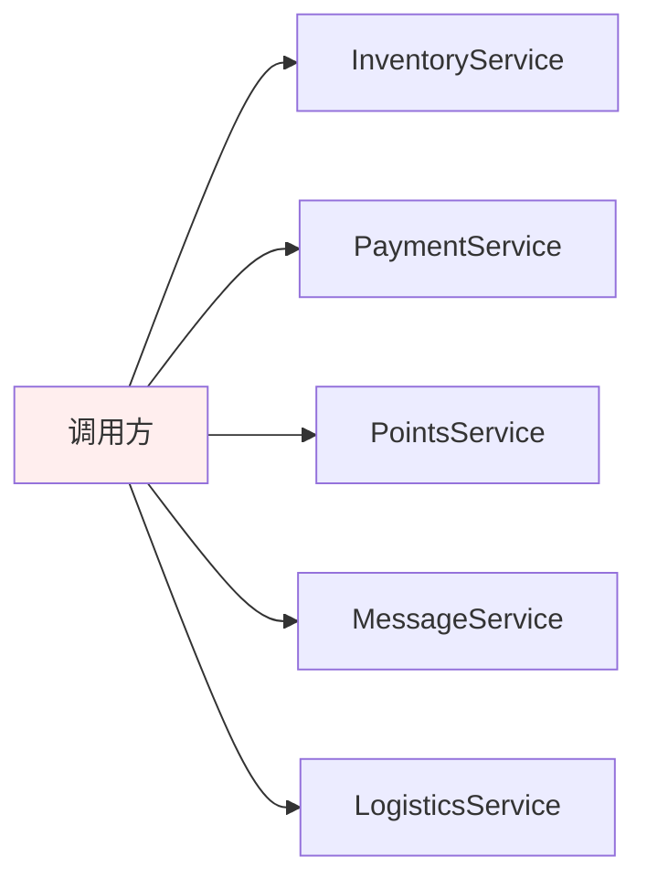
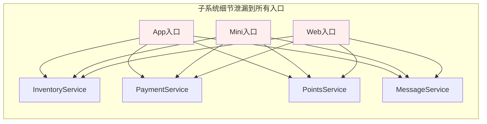
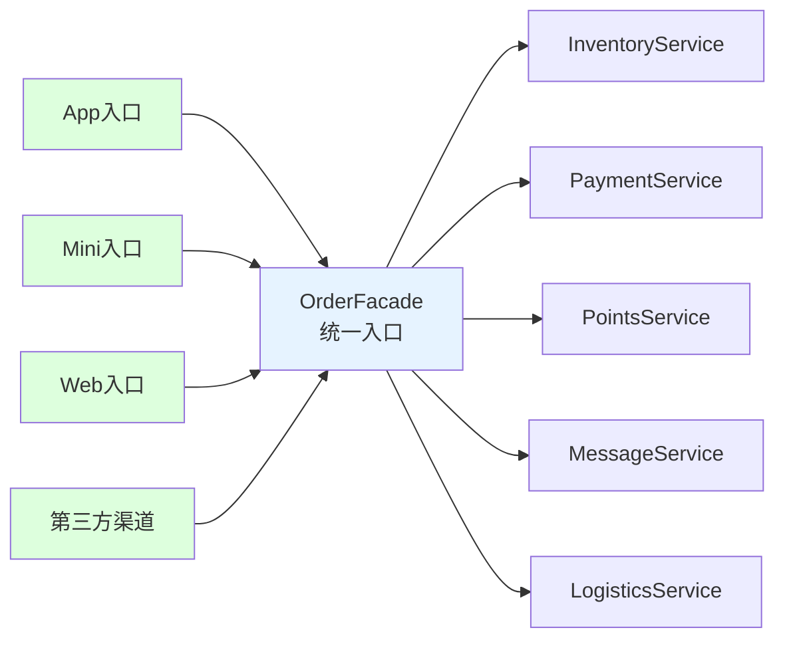
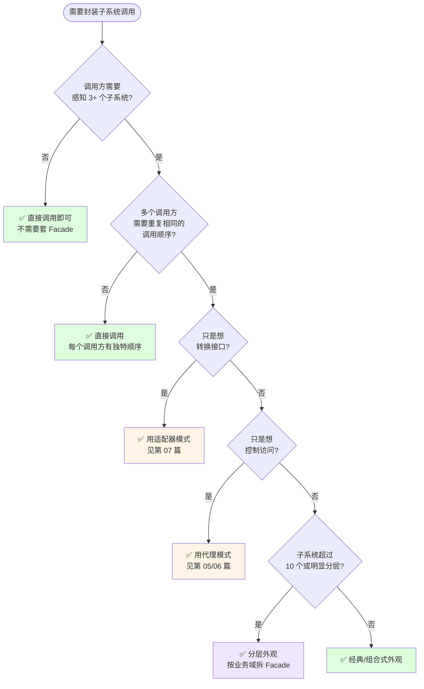
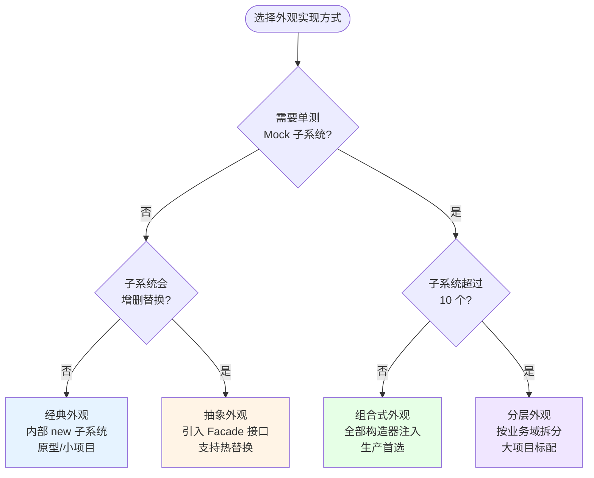
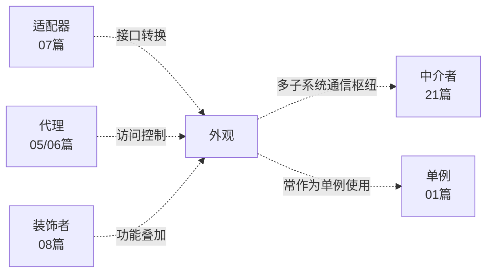

# 第三卷第9章：外观模式设计思想

> **📚 本篇渐进学习节奏（建议按顺序食用）**
>
> 本篇采用「**事故复盘 → 失败探索 → 模式诞生 → 实现对比 → 效果验证 → 反面踩坑 → 选型决策**」的节奏：
>
> 1. **第 01 节 · 案例引入** — 电商下单调用 7 个子系统，新人改一行代码顺序导致库存扣两次
> 2. **第 02 节 · 失败探索** — 直连子系统 / 静态工具 / 模板方法，三次直觉方案全部翻车
> 3. **第 03 节 · 模式基础** — 从医院接待、Java 三层架构讲透"统一入口 + 隐藏复杂度"
> 4. **第 04 节 · 实现对比** — 经典外观 / 抽象外观 / 组合式 / 分层四种实现
> 5. **第 05 节 · 效果对比** — 每个入口 47 行 → 1 行，4 个入口 188 行 → 4 行，数据说话
> 6. **第 06 节 · 反面踩坑** — 4 种翻车姿势：上帝类 / 静态直调 / 异常黑洞 / 假事务
> 7. **第 07 节 · 决策树** — 工程师的成熟度在于"知道什么时候不收口"
> 8. **第 08 节 · 总结延伸** — 思考模型沉淀 + 与代理/适配器/中介者/装饰者的边界
>
> 阅读到任一节卡壳，直接跳回上一节复盘场景；本篇代码均可直接运行。

## 推荐一个好玩网站

一个最纯粹的技术分享网站，打造精品技术编程专栏！[编程进阶网](https://yccoding.com/)

https://yccoding.com/


#### 目录快速导航
- [01.案例引入：电商下单的"子系统泄漏"事故](#01案例引入电商下单的子系统泄漏事故)
    - [1.1 痛点现场](#11-痛点现场)
    - [1.2 直觉实现复现](#12-直觉实现复现)
    - [1.3 问题根源拆解](#13-问题根源拆解)
    - [1.4 引出本篇主角](#14-引出本篇主角)
- [02.三次失败探索](#02三次失败探索)
    - [2.1 尝试方案A：直连子系统——复制散播](#21-尝试方案a直连子系统复制散播)
    - [2.2 尝试方案B：静态工具方法——无状态不可测](#22-尝试方案b静态工具方法无状态不可测)
    - [2.3 尝试方案C：模板方法继承——强行继承树](#23-尝试方案c模板方法继承强行继承树)
    - [2.4 终于引出外观模式](#24-终于引出外观模式)
- [03.外观模式基础](#03外观模式基础)
    - [3.1 从失败中提炼需求](#31-从失败中提炼需求)
    - [3.2 外观模式的标准骨架](#32-外观模式的标准骨架)
    - [3.3 典型使用场景](#33-典型使用场景)
- [04.四种实现对比](#04四种实现对比)
    - [4.1 实现核心要点](#41-实现核心要点)
    - [4.2 实现A：经典外观（电脑系统案例）](#42-实现a经典外观电脑系统案例)
    - [4.3 实现B：抽象外观（引入接口解决开闭原则）](#43-实现b抽象外观引入接口解决开闭原则)
    - [4.4 实现C：组合式外观（ShapeMaker + 依赖注入）](#44-实现c组合式外观shapemaker--依赖注入)
    - [4.5 实现D：分层外观](#45-实现d分层外观)
    - [4.6 四种实现速查表](#46-四种实现速查表)
- [05.用前用后效果对比](#05用前用后效果对比)
    - [5.1 核心数据对比](#51-核心数据对比)
    - [5.2 核心收益](#52-核心收益)
- [06.反面踩坑实录](#06反面踩坑实录)
    - [6.1 踩坑A：Facade 沦为上帝类](#61-踩坑a-facade-沦为上帝类)
    - [6.2 踩坑B：静态直调无法 Mock](#62-踩坑b静态直调无法-mock)
    - [6.3 踩坑C：Facade 吞掉异常变黑洞](#63-踩坑c-facade-吞掉异常变黑洞)
    - [6.4 踩坑D：在 Facade 里假装分布式事务](#64-踩坑d在-facade-里假装分布式事务)
    - [6.5 替代方案汇总](#65-替代方案汇总)
- [07.决策树与选型](#07决策树与选型)
    - [7.1 该不该用外观模式](#71-该不该用外观模式)
    - [7.2 选哪种实现方式](#72-选哪种实现方式)
    - [7.3 选型清单速查](#73-选型清单速查)
- [08.总结与延伸](#08总结与延伸)
    - [8.1 设计思想沉淀](#81-设计思想沉淀)
    - [8.2 模式联动边界](#82-模式联动边界)
    - [8.3 思考题与延伸](#83-思考题与延伸)


## 01.案例引入：电商下单的"子系统泄漏"事故

> **本篇主线**：复杂子系统的细节暴露给了所有调用方 → 引出"统一入口、隐藏复杂度"的思想。

### 1.1 痛点现场

> **🔥 模拟事故复盘 · 电商中台 · 新人入职第一天的下单 BUG**
>
> 6 月 3 日上午 9:30，应届生小王入职第二天接到任务："把『下单』接口加一个『新人首单减 10 元』的优惠逻辑，下午要上线。"
> 小王打开 IDE 一看——**当前下单逻辑是 47 行 Service 代码，混合调用了 7 个微服务**：库存(Inventory)、优惠券(Coupon)、积分(Points)、风控(RiskControl)、支付(Payment)、物流(Logistics)、消息(Message)。每个服务的初始化、调用顺序、回滚策略都堆在 `OrderService.placeOrder()` 一个方法里。
> 小王照着模仿，在"扣优惠券"和"扣积分"中间，**复制粘贴了一份"减 10 元优惠"的代码**，下午 14:30 灰度上线后：
>
> - **14:35**：客单"扣库存"和"扣优惠券"之间的顺序被无意打乱，**库存扣了 2 次**——某 SKU 显示库存"-12"，前台不再可售；
> - **15:10**：风控调用被越过了，因为小王把"减 10 元逻辑"插在了风控判断之前，**有人用同一身份证刷了 50 笔新人优惠**，损失 500 元；
> - **15:45**：消息推送报错，**因为小王新增的优惠扣减失败时没有调用 `MessageService.sendFailedNotice()`**，用户永远收不到失败通知，客服热线被打爆。
>
> 这场事故暴露了一个本质问题：**调用方（无论 App / 小程序 / 中台 / 新接入的渠道）被迫感知 7 个子系统的内部细节**。库存先扣还是优惠券先扣？风控在最前还是最后？失败了哪些要回滚？这些"调用秘籍"散落在 12 个入口的代码里，谁改谁踩坑。

做一个"下单"功能，后端涉及 5 个子系统：库存、支付、积分、消息、物流。调用方（前端/网关）直接面对所有细节：

```java
// 下单逻辑，调用方自己写
public void placeOrder(Order o) {
    InventoryService.lock(o.getSkuId(), o.getCount());
    PaymentService.init(o.getUserId()).charge(o.getAmount());
    PointsService.deduct(o.getUserId(), o.computePoints());
    MessageService.send(o.getUserId(), "下单成功");
    LogisticsService.assignCourier(o.getId(), o.getAddress());
}
```



调用方要知道：子系统启动顺序、各自的初始化参数、失败了回滚哪些步骤……一个"下单"涉及到 5 个服务的内部知识。

### 1.2 直觉实现复现

**【你也能写出这种代码】**。一个新同学接手需求"接一个新渠道下单"，第一反应就是复制已有入口的 47 行代码，微调一下：

```java
// ❌ 事故现场——每个入口手抄一份 7 步调用顺序
public class MiniAppOrderController {
    public void placeOrder(Order o) {
        // 第 1 步：锁库存
        InventoryService.lock(o.getSkuId(), o.getCount());
        // 第 2 步：扣优惠券（小王在这里插入"新人减10"）
        CouponService.use(o.getUserId(), o.getCouponId());
        // 第 3 步：扣积分
        PointsService.deduct(o.getUserId(), o.computePoints());
        // 第 4 步：风控 ← 小王插入代码时跳过了这一步
        // RiskControlService.check(o.getUserId());  // ❌ 被漏掉了！
        // 第 5 步：支付
        PaymentService.init(o.getUserId()).charge(o.getAmount());
        // 第 6 步：发消息（失败没补偿）
        MessageService.send(o.getUserId(), "下单成功");
        // 第 7 步：分配物流
        LogisticsService.assignCourier(o.getId(), o.getAddress());
    }
}
```

**🧪 跑一下，亲眼看到 bug**

```java
// 模拟：风控跳过 → 恶意刷单通过
Order order = new Order("userId_suspicious", "SKU_123", 1);
miniAppController.placeOrder(order);
// 库存锁定成功，支付扣款成功，消息发送成功
// 但是——风控没有拦住！同一用户连刷 50 单全部通过
```

事故现场重现完毕——**47 行复制到 12 个入口 → 任何一步顺序改动 / 遗漏 = 线上事故**。

**💭 3 个反思题**（先别往下看，自己想 30 秒）：

1. App / 小程序 / H5 / 第三方渠道都要下单，你会在 4 个地方各写一遍这 7 步吗？
2. 如果 PaymentService 改了一个参数，你需要改几个文件？
3. 有没有一种方式，让调用方"只知道下单，不知道子系统"？

### 1.3 问题根源拆解

**【画一张图就清楚了】**



每个入口的调用方 **各自维护 7 步调用顺序和回滚策略**，互不感知，这就埋下了 5 类隐患：

| 隐患 | 现象 | 业务影响 |
|------|------|---------|
| **顺序失控** | 每个入口手写 7 步顺序，改漏一处就全乱 | 库存扣两次 / 风控被绕过 / 支付未验券 |
| **修改扩散** | PaymentService 改 RPC 签名 → 改 4 个入口 | 灰度发布时只有 1 个入口改对，3 个报错 |
| **回滚策略散落** | 某一步失败时哪些要补偿？入口各自判断 | 消息失败没通知、积分扣了钱没退 |
| **横切关切缺失** | traceId / 限流 / 熔断 4 个入口分别埋 | 漏埋一个入口 = 链路追不到 / 限流无效 |
| **测试爆炸** | 下单组合 × 4 个入口 × N 种异常 = 30+ 套用例 | 改一行要跑全套回归 |

**🎯 核心矛盾**：业务上"下单"是一个**原子操作**，但代码层面它是**散落在 4 个入口的 7 步子调用**，没有任何机制保证一致性和完整性。

### 1.4 引出本篇主角

> **外观模式（Facade）的核心思想**：对外提供一个"简化收口"，把多个子系统的协作封装在里面。调用方只和 Facade 对话，内部的复杂、顺序、回滚都由 Facade 负责。

```java
public class OrderFacade {
    public void placeOrder(Order o) {
        // 统一顺序、统一回滚、统一日志
        InventoryService.lock(...);
        CouponService.use(...);
        PointsService.deduct(...);
        RiskControlService.check(...);
        PaymentService.charge(...);
        MessageService.send(...);
        LogisticsService.assignCourier(...);
    }
}

// 调用方——一行搞定
orderFacade.placeOrder(o);
```



经典案例：Spring `JdbcTemplate` 封装了获取连接→准备 Statement→执行→关闭资源等一系列步骤，调用方只写一行 `jdbcTemplate.query(sql)`。Retrofit、SLF4J、Netty 的 `Bootstrap` 都是外观模式。

外观模式虽然"看上去简单"，但它和代理、适配器、中介者容易混淆——本篇会把各自的动机与边界讲清楚。

但是！**先别急着看实现**。下一节，我们先看看新手通常会先尝试哪些"看起来很合理"的方案，并理解它们为什么都不够好。


## 02.三次失败探索

> **为什么要学这一节**：直接给你"标准答案"是容易的，但外观模式不是凭空发明的——它是**前人走过三条死路之后才提炼出来的**。走过这些死路，你才会真正理解为什么代码长那个样子。

### 2.1 尝试方案A：直连子系统——复制散播

**【新手方案①：每个入口各自调用 7 个子系统】**

```java
// 方案A：App 入口
public class AppOrderController {
    public void placeOrder(Order o) {
        InventoryService.lock(o.getSkuId(), o.getCount());        // ①
        CouponService.use(o.getUserId(), o.getCouponId());        // ②
        PointsService.deduct(o.getUserId(), o.computePoints());   // ③
        RiskControlService.check(o.getUserId());                   // ④
        PaymentService.init(o.getUserId()).charge(o.getAmount()); // ⑤
        MessageService.send(o.getUserId(), "下单成功");            // ⑥
        LogisticsService.assignCourier(o.getId(), o.getAddress());// ⑦
    }
}

// 方案A：小程序入口——同样的 7 行，复制粘贴
public class MiniAppOrderController {
    public void placeOrder(Order o) {
        InventoryService.lock(o.getSkuId(), o.getCount());        // 同上
        CouponService.use(o.getUserId(), o.getCouponId());        // 同上
        // ... 省略，和上面一模一样
    }
}
```

**🧪 跑一下，看会出什么问题**

```java
// PaymentService 升级 v2，charge() 多加一个 CurrencyType 参数
// App 入口改了 → PaymentService.init(userId).charge(amount, CurrencyType.CNY)
// 小程序入口忘了改 → PaymentService.init(userId).charge(amount) → 编译报错
// H5 入口也忘了改 → 线上爆炸
```

**❌ 失败原因**：7 步调用顺序、回滚策略、异常处理全部复制到 N 个入口。改一个子系统的签名 → N 个文件全改，漏 1 个 = 事故。

**💡 反思**：我们需要一个**单一入口**，让 7 个步骤的"协作逻辑"只存在一处。

### 2.2 尝试方案B：静态工具方法——无状态不可测

**【新手方案②：写一个 OrderHelper 静态工具类】**

```java
public class OrderHelper {
    public static void placeOrder(Order o) {
        InventoryService.lock(o.getSkuId(), o.getCount());        // ② 仍然硬编码
        CouponService.use(o.getUserId(), o.getCouponId());
        PointsService.deduct(o.getUserId(), o.computePoints());
        RiskControlService.check(o.getUserId());
        PaymentService.init(o.getUserId()).charge(o.getAmount()); // ① 静态直调,无法 Mock
        MessageService.send(o.getUserId(), "下单成功");
        LogisticsService.assignCourier(o.getId(), o.getAddress());
    }
}
```

**🧪 跑一下，会发现隐藏问题**

```java
// 想要单测 placeOrder，但 PaymentService 是静态方法直接调用的
// → 无法用 Mockito 替换 PaymentService
// → 要么跑集成测试（慢、不稳定），要么不测（裸奔上线）

// 运维说"双 11 限流下单接口到 1000 QPS"
// → placeOrder 是个 static 方法，加限流增强只能用 AOP，但静态方法 AOP 装不上
```

**❌ 失败原因**：① `PaymentService.init(...)` 是静态直调，单测无法 Mock；② 静态方法无法被 AOP 拦截，限流/熔断/日志增强全部失效；③ 所有依赖硬编码，无法替换实现。

**💡 反思**：我们要的是**一个实例化的对象**，可以通过 DI 注入子系统引用，也能被 AOP 拦截。

### 2.3 尝试方案C：模板方法继承——强行继承树

**【新手方案③：写一个 BaseOrderService 抽象类，子类实现几步】**

```java
public abstract class BaseOrderService {
    public final void placeOrder(Order o) {
        lockInventory(o);         // ① 模板固化顺序
        useCoupon(o);
        deductPoints(o);
        if (checkRisk(o)) {       // ② 这步要是返回 false 怎么办？
            chargePayment(o);
        }
        sendMessage(o);
        assignLogistics(o);
    }

    protected abstract void lockInventory(Order o);   // ③ 子类必须实现
    protected abstract void useCoupon(Order o);       // 每个都要实现，子类爆炸
    protected abstract void deductPoints(Order o);
    // ... 7 个抽象方法
}
```

**🧪 跑一下，看会怎样**

```java
// 小程序下单继承 BaseOrderService
class MiniAppOrderService extends BaseOrderService {
    protected void lockInventory(Order o) { /* 实现 */ }
    // ❌ 还要实现其余 6 个方法，每个 50 行，350 行
}

// 第三方渠道下单也继承 BaseOrderService
class ThirdPartyOrderService extends BaseOrderService {
    // ❌ 又写一遍 7 个方法，和上面 90% 相同
}
```

**❌ 失败原因**：① 模板方法把**外层顺序**和**每步实现**强行绑在一条继承链上，7 个抽象方法每个子类都要实现；② 如果"物流分配失败要不要回滚积分"这种策略要变，要么改模板方法（影响所有子类），要么每个子类自己 override（代码重复）。

**💡 反思**：理想方案 = 方案 A 的"直连子系统" + 方案 B 的"集中入口" + 方案 C 的"可复用的执行序列"，但子系统引用要能注入、策略要能替换。

### 2.4 终于引出外观模式

**【三次失败之后，需求清单收敛了】**

| 必须满足 | 来自哪一次失败 |
|---------|-------------|
| ① N 个入口共享一套调用逻辑 | 2.1 直连子系统——复制散播 |
| ② 子系统引用可注入、可 Mock | 2.2 静态工具——硬编码不可测 |
| ③ 调用顺序集中控制 | 2.1 直连子系统——每个入口手写顺序 |
| ④ 不强制继承 | 2.3 模板方法——每个子类写 7 个抽象方法 |
| ⑤ 可被 AOP 拦截（限流/日志/事务） | 2.2 静态工具——静态方法 AOP 失效 |

**【外观模式的标准答案】——一套骨架，同时回答上面 5 条约束：**

```java
// ① 单一外观类，N 个入口共享
public class OrderFacade {

    // ② 子系统引用通过构造器注入
    private final InventoryService inventoryService;
    private final PaymentService paymentService;
    private final PointsService pointsService;
    // ...

    public OrderFacade(InventoryService is, PaymentService ps, PointsService pts) {
        this.inventoryService = is;
        this.paymentService = ps;
        this.pointsService = pts;
    }

    // ③ 调用顺序集中在此一处
    public void placeOrder(Order o) {
        inventoryService.lock(o.getSkuId(), o.getCount());        // ④ 不强制 override
        paymentService.init(o.getUserId()).charge(o.getAmount());  // ⑤ 实例方法可被 AOP
        pointsService.deduct(o.getUserId(), o.computePoints());
        // ...
    }
}

// 单测完美：
// OrderFacade facade = new OrderFacade(mockInventory, mockPayment, mockPoints);
// facade.placeOrder(order);
// verify(mockInventory).lock(...);
```

短短几行，**同时回答了上面 5 个需求**。这就是外观模式的"灵魂代码"。


## 03.外观模式基础

### 3.1 从失败中提炼的需求

回顾 02 节，我们试了**直连子系统、静态工具、模板方法继承**——**全部失败**。现在拿着这些失败报告，问自己一个问题：

> 如果我要写一个能跑 3 年不崩的"下单收口"，它必须满足哪几条硬约束？

把这些约束写下来，就自然得到了外观模式的设计清单：

| 约束 | 来自 | 代码体现 |
|:---|:---|:---|
| ① 调用方只用一行触发 | 2.1 复制散播 | `orderFacade.placeOrder(o)` |
| ② 子系统引用可注入 | 2.2 静态不可测 | `private final XxxService svc;` 构造器注入 |
| ③ 执行顺序集中一处 | 2.1 每个入口手写 | 7 步调用全在 Facade 内部 |
| ④ 不强制继承树 | 2.3 模板方法 | Facade 是独立类，组合优于继承 |
| ⑤ 可被 AOP/拦截 | 2.2 静态方法 AOP 失效 | Facade 是实例方法，支持切面 |

外观模式的由来是为了解决软件系统中的复杂性和耦合性问题。在大型软件系统中，各个子系统之间可能存在复杂的依赖关系和交互逻辑，这导致了系统的可维护性和可扩展性变得困难。为了简化客户端与子系统之间的交互，外观模式被引入。

**外观模式可以在不暴露子系统细节的前提下，将复杂协作封装成一个简化的高层接口。这就是外观模式的模式动机。**

### 3.2 外观模式的标准骨架

上面 5 条约束翻译成代码，**所有实现变体共用一个骨架**：

```java
// ① 子系统 A——具体的功能单元
public class SubSystemA {
    public void operationA() { /* 子系统 A 的能力 */ }
}

// ② 子系统 B
public class SubSystemB {
    public void operationB() { /* 子系统 B 的能力 */ }
}

// ③ 外观类——持有子系统引用，对外提供简化接口
public class Facade {
    private SubSystemA a;                               // ④ 组合，非继承
    private SubSystemB b;

    public Facade(SubSystemA a, SubSystemB b) {        // ② 依赖注入
        this.a = a;
        this.b = b;
    }

    public void unifiedOperation() {                   // ① 单一入口
        a.operationA();                                // ③ 集中控制顺序
        b.operationB();
    }
}

// ⑤ 调用方
Facade facade = new Facade(new SubSystemA(), new SubSystemB());
facade.unifiedOperation();  // 一行
```

**三句话记住**：**统一入口**（Facade 收口所有调用）→ **组合子系统**（持有引用但不继承）→ **隐藏细节**（顺序、回滚、横切全封装在 Facade 内）。差异全在"子系统粒度"和"要不要引入抽象 Facade 接口"里头——这就是下一节四种实现的核心分岔。

外观模式（Facade Pattern），也叫门面模式。在 GoF 的定义中：为子系统中的一组接口提供一个一致的界面，Facade 模式定义了一个高层接口，这个接口使得这一子系统更加容易使用。

### 3.3 典型使用场景

外观模式适用于以下场景：

1. **复杂子系统需要收口**：外部与一个子系统的通信必须通过一个统一的外观对象进行，为子系统中的一组接口提供一个一致的界面。
2. **客户程序与多个子系统强依赖**：引入外观类将子系统与客户以及其他子系统解耦，可以提高子系统的独立性和可移植性。
3. **层次化架构**：在层次化结构中，可以使用外观模式定义系统中每一层的入口，层与层之间不直接产生联系，而通过外观类建立联系。

**常见落地场景**：

1. 医院接待人员简化了挂号、门诊、划价、取药等复杂流程。
2. Java 三层架构：通过外观模式简化对表示层、业务逻辑层和数据访问层的访问。
3. Spring `JdbcTemplate` / `RedisTemplate` / `RestTemplate` 系列。
4. SLF4J 的 `LoggerFactory.getLogger(...)`。
5. Netty 的 `Bootstrap` / `ServerBootstrap`。
6. Hystrix 的 `HystrixCommand`。

> **反面提醒**：仅做接口转换（应选适配器）、仅做访问控制（应选代理）、子系统就 1-2 个（直接调即可）——参考 06 / 07 节。


## 04.四种实现对比

### 4.1 实现核心要点

四种写法本质上是在 **子系统粒度 / 接口抽象度 / 依赖注入方式** 上的不同取舍。实现外观模式的核心只要两件事：

```java
Facade facade = new Facade(subsystemA, subsystemB);    // ① 组装子系统引用
facade.unifiedMethod();                                 // ② 一行调用
```

差异全在"要不要引入抽象 Facade 接口"和"子系统是硬编码还是注入"这两个决策点里。下面按演进顺序逐一展开，最后在 [7.2 节](#72-选哪种实现方式) 会有一张决策图帮你快速定位。


### 4.2 实现A：经典外观（电脑系统案例）

**设计权衡**：用"子系统在 Facade 内部 new"换"调用方最简（构造器无参）"。

**选它的理由**：子系统不需要替换实现，且调用方自己完全不想知道子系统怎么创建——适合原型、中小项目。

**创建三个子系统类**

```java
public class Music {
    public void open() { System.out.println("加载音乐"); }
    public void stop() { System.out.println("关闭音乐"); }
}

public class Video {
    public void open() { System.out.println("打开视频"); }
    public void stop() { System.out.println("关闭视频"); }
}

public class Internet {
    public void open() { System.out.println("连接网络"); }
    public void stop() { System.out.println("断开网络"); }
}
```

**创建外观类——电脑系统**

```java
public class Computer {
    private Music music;
    private Video video;
    private Internet internet;

    public Computer() {                               // ① 内部 new 子系统
        this.music = new Music();
        this.video = new Video();
        this.internet = new Internet();
    }

    public void openVideo() {                         // ② 一行触发子系统的协作
        internet.open();                              // ③ 顺序在此控制
        music.open();
        video.open();
    }

    public void stopVideo() {
        video.stop();
        music.stop();
        internet.stop();
    }
}
```

**客户端调用**

```java
private void test() {
    Computer computer = new Computer();
    System.out.println("播放视频步骤：");
    computer.openVideo();
    System.out.println("关闭视频步骤：");
    computer.stopVideo();
}
```

**技术分析**：
- 三角色：SubSystem（Music/Video/Internet）+ Facade（Computer）+ Client
- 优点：调用方完全无感子系统创建细节
- 缺点：子系统硬编码在 Facade 内部，无法替换、无法 Mock 单测


### 4.3 实现B：抽象外观（引入接口解决开闭原则）

**设计权衡**：用"多一个 Facade 接口"换"子系统升级时不改调用方"。

外观模式最大的缺点在于违背了"开闭原则"——当增加新的子系统或者移除子系统时需要修改外观类。**引入抽象外观类**可以在一定程度上解决该问题：

```java
// ① 抽象外观接口
public interface ComputerFacade {
    void openVideo();
    void stopVideo();
}

// ② 具体外观——现有方案
public class StandardComputer implements ComputerFacade {
    private Music music = new Music();
    private Video video = new Video();
    private Internet internet = new Internet();

    public void openVideo() {
        internet.open();
        music.open();
        video.open();
    }
    public void stopVideo() { /* ... */ }
}

// ③ 新增具体外观——关联新子系统，不改原有类
public class ProComputer implements ComputerFacade {
    private Music music = new Music();
    private Video video = new Video();
    private Internet internet = new Internet();
    private Bluetooth bluetooth = new Bluetooth();   // 新增蓝牙子系统

    public void openVideo() {
        internet.open();
        bluetooth.pair();                            // 新子系统的协作
        music.open();
        video.open();
    }
    public void stopVideo() { /* ... */ }
}
```

**关键判断**：当子系统可能会增删、且调用方期望"换个 Facade 实现不换代码"时，选抽象外观。代价是多一个接口文件。


### 4.4 实现C：组合式外观（ShapeMaker + 依赖注入）

**设计权衡**：用"构造器要传参"换"子系统可注入、可 Mock、完全解耦"。

有个需求：在 UI 开发中绘制圆形、矩形、椭圆形等形状。我们把它做成一个外观类 ShapeMaker：[更多内容](https://yccoding.com/)

```java
// ① 抽象构件——统一绘制接口
public interface Shape {
    void draw();
}

// ② 具体子系统
public class Circle implements Shape {
    @Override public void draw() { System.out.println("Circle::draw()"); }
}
public class Rectangle implements Shape {
    @Override public void draw() { System.out.println("Rectangle::draw()"); }
}
public class Square implements Shape {
    @Override public void draw() { System.out.println("Square::draw()"); }
}

// ③ 外观类——通过构造器注入子系统
public class ShapeMaker {
    private Shape circle;
    private Shape rectangle;
    private Shape square;

    public ShapeMaker(Shape circle, Shape rectangle, Shape square) {  // ② 依赖注入
        this.circle = circle;
        this.rectangle = rectangle;
        this.square = square;
    }

    public void drawCircle() { circle.draw(); }
    public void drawRectangle() { rectangle.draw(); }
    public void drawSquare() { square.draw(); }
}

// 单测中轻松 Mock：
ShapeMaker maker = new ShapeMaker(mockCircle, mockRectangle, mockSquare);
maker.drawCircle();
verify(mockCircle).draw();  // ✅ 可验证
```

**技术分析**：
- 这是 02 节"灵魂代码"的标准形态——子系统全量注入
- 适合需要单测覆盖、子系统可替换的生产环境
- 配合 Spring `@Autowired`，零样板代码


### 4.5 实现D：分层外观

**设计权衡**：用"多一层间接"换"子系统群按职责分层管理"。

当子系统数量过多（比如 20+），一个 Facade 装不下时，按"业务子领域"拆分：

```java
// 第一层：原子子系统
public class InventoryService { /* 库存 */ }
public class PaymentService { /* 支付 */ }
public class LogisticsService { /* 物流 */ }

// 第二层：子领域 Facade
public class PaymentFacade {
    public void executePayment(Order o) {
        // 支付 + 风控 + 对账 三个子系统的协作
    }
}

public class LogisticsFacade {
    public void arrangeLogistics(Order o) {
        // 物流 + 消息 + 时效预估 三个子系统的协作
    }
}

// 第三层：顶层 Facade——只编排子 Facade，不直接碰子系统
public class OrderFacade {
    private PaymentFacade paymentFacade;
    private LogisticsFacade logisticsFacade;
    private InventoryService inventoryService;

    public OrderFacade(PaymentFacade pf, LogisticsFacade lf, InventoryService is) {
        this.paymentFacade = pf;
        this.logisticsFacade = lf;
        this.inventoryService = is;
    }

    public void placeOrder(Order o) {
        inventoryService.lock(o.getSkuId(), o.getCount());  // 原子子系统
        paymentFacade.executePayment(o);                     // 子领域 Facade
        logisticsFacade.arrangeLogistics(o);                 // 子领域 Facade
    }
}
```

**关键判断**：子系统超过 10 个，或已明显分为"支付域 / 物流域 / 库存域" → 分层外观；否则单层经典外观足够。


### 4.6 四种实现速查表

| 实现方式 | 子系统注入 | 抽象接口 | 分层能力 | 适合场景 | 推荐度 |
|---------|----------|---------|---------|---------|------|
| A. 经典外观 | ❌ 内部 new | ❌ 无 | ❌ 单层 | 原型/中小项目，子系统固定 | ⭐⭐⭐ |
| B. 抽象外观 | ❌ 内部 new | ✅ 有接口 | ❌ 单层 | 子系统会增删，需热切换 | ⭐⭐⭐⭐ |
| C. 组合式外观 | ✅ 构造器注入 | ❌ 可选 | ❌ 单层 | 生产环境，需要单测 Mock | ⭐⭐⭐⭐⭐ |
| D. 分层外观 | ✅ 构造器注入 | ❌ 可选 | ✅ 多层 | 子系统 10+，已分业务域 | ⭐⭐⭐⭐⭐ |

**📌 一句话决策**：生产环境首选 **C. 组合式**（DI + 可测）；子系统会热替换选 **B. 抽象外观**；项目早期快速原型选 **A. 经典外观**；子系统超过 10 个务必 **D. 分层**。


## 05.用前用后效果对比

> **为什么单独留一节做对比**：很多人记住了"外观模式"四个字，却没算过它到底"省"了多少。下面用 1.x 节的下单系统做基准，让数据替你回答"为什么要用"。

### 5.1 核心数据对比

**实验设定**：电商中台下单流程，依赖 7 个微服务，需要被 App / 小程序 / H5 / 第三方渠道四种入口调用。

| 维度 | ❌ 调用方直连子系统（事故现场） | ✅ 外观模式收口 | 差距 |
|------|-----------------------------|---------------|------|
| 调用方代码量 | 每个入口 47 行 × 4 个入口 = **188 行** | 每个入口 **1 行** `orderFacade.placeOrder(o)` | **47× 减少** |
| 调用顺序错误风险 | **必然发生**（4 个入口手抄 7 步顺序） | 不可能（顺序集中 Facade 一处） | 根本性消除 |
| 子系统升级影响面 | 改 1 个 RPC 签名 → 改 4 个入口 | **改 1 处 Facade** | **4× 收敛** |
| 风控/事务/traceId 埋点 | 4 个入口分别埋点（漏埋必现） | Facade 一处统一切面 | — |
| 新人上手成本 | 必须读懂 7 个子系统的内部 | 只需要懂 Facade 入参出参 | — |
| 测试用例数 | 4 入口 × 多场景 = 30+ 套 | Facade 1 套 + 各入口 smoke 即可 | **5×+ 减少** |
| 链路追踪 traceId | 4 入口分别埋（容易丢） | Facade 入口生成，全链路贯穿 | — |
| 限流降级 | 散落在每个入口或子系统 | Facade 一层统一兜底 | — |

### 5.2 核心收益

**🔑 核心收益**：外观模式的本质是 **"为复杂子系统群提供一个高内聚的'对外窗口'"**。它不是简单的"包一层方法"，而是 **"把跨子系统的调用秩序、回滚策略、横切关切（traceId / 限流 / 熔断 / 审计）集中到一个工程化的入口层"**。

> 这就是为什么 **Spring 用 `JdbcTemplate`、Hibernate 用 `Session`、SLF4J 用 `LoggerFactory` 撑起整个数据访问 / 日志体系** 的根源——Facade 不是"简化代码"，是"工程化收口"。


## 06.反面踩坑实录

> **为什么有这一节**：01 节让你看到"不用外观的痛"，但外观本身**也不是银弹**。本节用 4 个真实事故告诉你"乱用的痛"。

### 6.1 踩坑A：Facade 沦为上帝类

**【真实事故】** 所有子系统操作全往一个 Facade 里塞：

```java
public class OrderFacade {
    public void placeOrder(...) { /* 100 行 */ }
    public void cancelOrder(...) { /* 80 行 */ }
    public void refundOrder(...) { /* 90 行 */ }
    public void exportReport(...) { /* 200 行 */ }   // ❌ 报表导出和下单半毛钱关系都没有
    public void syncWarehouse(...) { /* 150 行 */ }  // ❌ 仓库同步也塞进来
    // ... 30 个方法，2000 行
}
```

**💣 事故现场**：30 个方法挤在一个类里，改下单 → 影响报表导出（同一个 CI 模块必须全量回归）→ 发货慢了 2 小时。

**📌 教训**：Facade 应该按 **"业务子领域"** 划分（下单 / 售后 / 财务 / 报表），每个 Facade 方法 ≤ 7 个公开方法。一旦超过 500 行就该拆分。

**✅ 正解**：`OrderFacade` 只管下单领域，报表用 `ReportFacade`，仓库用 `WarehouseFacade`，各管各的。

### 6.2 踩坑B：静态直调无法 Mock

**【真实事故】** Facade 内部用静态方法或 `new` 直调子系统：

```java
public class OrderFacade {
    public void placeOrder(Order o) {
        InventoryService.lock(o.getSkuId(), o.getCount());  // ❌ 静态方法直接调
        new PaymentService().charge(o.getAmount());          // ❌ new 出来，无法 Mock
    }
}
```

**💣 事故现场**：QA 写单测发现 `PaymentService` 无法替换为 Mock → 要么全上集成测试（慢）、要么裸奔上线 → 一个支付 bug 遗漏到生产。

**📌 教训**：Facade 是"协作中枢"，必须通过依赖注入持有子系统引用。

**✅ 正解**：所有子系统通过构造器注入，单测时 Mockito 全链路 Mock：

```java
public class OrderFacade {
    private final InventoryService inventoryService;  // ✅ 注入
    private final PaymentService paymentService;

    public OrderFacade(InventoryService is, PaymentService ps) {
        this.inventoryService = is;
        this.paymentService = ps;
    }
}
```

### 6.3 踩坑C：Facade 吞掉异常变黑洞

**【真实事故】** Facade 里 catch 所有异常只返回 boolean：

```java
public boolean placeOrder(Order o) {
    try {
        // ... 7 个调用
        return true;
    } catch (Exception e) {
        log.error("下单失败", e);  // ❌ 只打日志
        return false;             // ❌ 调用方收到 false，不知道是哪一步失败
    }
}
```

**💣 事故现场**：调用方收到 `false`，不知道是"库存不足"还是"风控拦截"还是"支付超时"→ 前端只能统一提示"下单失败，请重试"→ 用户体验极差 → 投诉量飙升。

**📌 教训**：Facade 是"协作收口"，不是"异常黑洞"。子系统的业务异常必须明确传递。

**✅ 正解**：定义业务异常体系，Facade 透传或包装：

```java
public void placeOrder(Order o) throws OrderFailedException {
    try {
        inventoryService.lock(...);
        paymentService.charge(...);
    } catch (InventoryShortException e) {
        throw new OrderFailedException("库存不足", e);    // ✅ 明确传递
    } catch (RiskBlockedException e) {
        throw new OrderFailedException("风控拦截", e);
    }
}
```

### 6.4 踩坑D：在 Facade 里假装分布式事务

**【真实事故】** Facade 调用多个微服务，加个 `@Transactional` 假装解决了：

```java
@Transactional   // ❌ Facade 调用了 7 个微服务，这个事务根本管不住
public void placeOrder(Order o) {
    inventoryClient.lock(...);   // 远程 RPC，本地事务管不到
    paymentClient.charge(...);   // 远程 RPC，本地事务管不到
}
```

**💣 事故现场**：库存扣了，支付失败了，但事务回滚不了 → 库存少了一个，钱没扣，数据不一致。

**📌 教训**：本地 `@Transactional` 只能管本地数据源。跨多个微服务的"事务"是分布式事务问题，必须用 Saga / TCC / 本地消息表。

**✅ 正解**：Facade 内部使用 Saga 模式——每步骤配一个补偿动作：

```java
public void placeOrder(Order o) {
    inventoryClient.lock(skuId, count);          // 步骤1：锁库存
    try {
        paymentClient.charge(userId, amount);    // 步骤2：支付
    } catch (Exception e) {
        inventoryClient.unlock(skuId, count);    // ✅ 补偿：释放库存
        throw new OrderFailedException("支付失败，已回滚库存", e);
    }
}
```

### 6.5 替代方案汇总

如果你看完上面 4 个踩坑还在心虚——别怕，绝大部分场景都能被这些方式替代：

| 你的需求 | 推荐方案 |
|---------|---------|
| 只是想转换接口，不改行为 | ✅ **适配器模式**（07 篇） |
| 只是想控制访问（鉴权/缓存） | ✅ **代理模式**（05/06 篇） |
| 子系统只有 1-2 个，调用不复杂 | ✅ **直接调用**即可 |
| 需要给多个平行对象做通信中枢 | ✅ **中介者模式**（21 篇） |
| 封装复杂子系统群，统一收口 | ✅ **外观模式** |


## 07.决策树与选型

> 经过前面 6 节的铺垫，是时候给一张能"贴在工位上"的决策图了。

### 7.1 该不该用外观模式



### 7.2 选哪种实现方式

如果决策树走到了"用外观模式"，再用下面这张图选实现：



### 7.3 选型清单速查

| 场景 | 该用吗 | 推荐方式 |
|------|------|---------|
| Spring JdbcTemplate / RedisTemplate | ✅ 该用 | 组合式外观（实现 C） |
| 多个入口调用同一套子系统逻辑 | ✅ 该用 | 组合式外观（实现 C） |
| API Gateway 聚合后端 20+ 微服务 | ✅ 该用 | 分层外观（实现 D） |
| 子系统版本升级，需热切换新旧实现 | ⚠️ 有条件用 | 抽象外观（实现 B） |
| 只想转接口不做行为增强 | ❌ 别用 | 适配器模式 |
| 只想做访问控制/鉴权 | ❌ 别用 | 代理模式 |
| 子系统只有 1-2 个 | ❌ 别用 | 直接调用 |


## 08.总结与延伸

### 8.1 设计思想沉淀

回顾本篇 01 → 07 的旅程，外观模式真正教会我们的是这套思考模型：

| 阶段 | 学到了什么 |
|------|----------|
| **01 事故引入** | 痛点是模式诞生的土壤——47 行散落在 4 个入口、新人改错顺序 → 库存扣两次 |
| **02 三次失败** | 直连子系统、静态工具、模板方法都不够——模式是从"试错"中收敛的 |
| **03 模式基础** | 三大要点：统一入口 + 组合子系统 + 隐藏复杂度 |
| **04 四种实现** | 实现差异本质是"注入方式 / 抽象程度 / 分层粒度"的不同权衡 |
| **05 效果对比** | 数据说话：188 行 → 4 行，47× 收敛；升级改 1 处 vs 4 处 |
| **06 反面踩坑** | 外观不是免死金牌：上帝类、静态直调、异常黑洞、假事务 |
| **07 决策树** | 工程师的成熟度，不在于会写几种 Facade，而在于知道"什么时候不收口" |

**🔑 一句话核心**：

> 外观模式是用来把"**跨子系统的复杂协作收口到一个对外窗口**"的，**不是"任何多个调用凑一起就是外观"**。收口的粒度 = 业务子领域的边界。会收口比会写 Facade 更重要。

### 8.2 模式联动边界

外观从来不是孤立存在的，它和其他模式有千丝万缕的关系：



| 模式 | 关系 | 一句话区别 |
|------|------|----------|
| **适配器**（07 篇） | 接口转换 vs 统一入口 | 想换皮 → 适配器；想收口 → 外观 |
| **代理**（05/06 篇） | 访问控制 vs 简化协作 | 想控访 → 代理；想收口 → 外观 |
| **中介者**（21 篇） | 同级对象互联 vs 上层打包下层 | 想给一群平级对象做通信中枢 → 中介者；想给一堆子系统打包 → 外观 |
| **装饰者**（08 篇） | 功能叠加 vs 封装协作 | 想加料（不改接口）→ 装饰者；想封口 → 外观 |
| **单例**（01 篇） | 外观类常被实现为单例 | 组合使用，不是替代关系 |

**⚠️ 什么时候不该用外观**

- **子系统只有 1-2 个**：直接调用即可，套 Facade 反而多一层；
- **调用方需要细粒度定制**：做底层框架时，调用方就是要直接拿 `Connection` 自己控制事务粒度，`JdbcTemplate` 反而碍事；
- **Facade 自己变成上帝类**：动辄 30+ 方法、2000+ 行，那不是 Facade 是反模式；
- **Facade 想"增强行为"**：那是装饰者（08 篇）或代理（05/06 篇），别为了 Facade 而在里面塞业务规则。

> 一句话：**外观是"工程化收口"，不是"图省事的语法糖"。该收口的地方坚决收，不该收口的地方别强收**。

### 8.3 思考题与延伸

**💭 三道思考题**（建议手写答案，再对照回顾本文）：

1. SLF4J 的 `LoggerFactory.getLogger(...)` 屏蔽了 Log4j / Logback / JUL 的具体实现——画出它的 Facade 结构图，标注 Facade / SubSystem 角色分别是谁？（提示：回看 4.3 节抽象外观）
2. 如果下单系统引入了"用户等级"子系统——VIP 用户走专属物流、普通用户走标准物流——外观模式如何优雅处理？改 OrderFacade 内部 if-else 还是用抽象外观？（提示：回看 4.3 / 4.5 节）
3. 为什么 `JdbcTemplate` 被归类为外观模式而不是代理模式？提示：对比 JdbcTemplate 暴露的接口和它背后隐藏的子系统数量。

**📚 延伸阅读**：

- 阅读 `JdbcTemplate.query(...)` 源码（200 行，教科书级 Facade）
- 阅读 SLF4J `LoggerFactory.getLogger(...)` 的 SPI 加载流程
- 阅读 Spring `ApplicationContext` 的 `refresh()` 流程（13 步初始化 = Facade 工程级巅峰）

**🔍 真实开源代码中的外观模式**：

| 出处 | 关键源码 | 它在 Facade 什么 |
|------|---------|----------------|
| **Spring JDBC** | `JdbcTemplate` | 封装"获取 Connection → 创建 Statement → 执行 SQL → 关闭资源 → 异常翻译"全流程 |
| Spring 数据访问 | `RedisTemplate` / `MongoTemplate` / `RestTemplate` | 把连接池、序列化、超时、重试统一为一行调用 |
| Hibernate / JPA | `EntityManager` / `Session` | 屏蔽 JDBC + 缓存 + 事务 + 元数据等子系统 |
| Spring | `ApplicationContext` | 整合 BeanFactory + 资源加载 + 事件发布 + 国际化 + 环境配置 |
| **SLF4J** | `LoggerFactory.getLogger(...)` | 屏蔽 Log4j / Logback / JUL 等具体实现的初始化细节 |
| Netty | `Bootstrap` / `ServerBootstrap` | 把 EventLoopGroup / ChannelFactory / Pipeline / Option 打包成一行 |
| Hystrix / Resilience4j | `HystrixCommand` / `Decorators.ofSupplier()` | 熔断 + 限流 + 重试 + 降级 + Metrics 统一入口 |
| OkHttp / Retrofit | `OkHttpClient` / `Retrofit` | 拦截器链 + 连接池 + DNS + 缓存等的统一入口 |

> **学习路径建议**：先读 `JdbcTemplate.query(...)`（200 行，教科书级 Facade）→ 再读 `LoggerFactory.getLogger(...)` 的 SPI 加载流程 → 最后读 **Spring `ApplicationContext` 的 `refresh()` 流程**（13 步初始化每一步对应一个子系统，Facade 模式的工程级巅峰）。读完这三个，你就理解了"Facade 不是图省事，而是工程化收口"。

> **上一篇** [装饰者模式设计思想](https://yccoding.com/pages/c5df6a/) → **本篇** → [下一篇](https://yccoding.com/pages/5d99c5/)：将抽象与实现分离，让二者独立变化——桥接模式。
