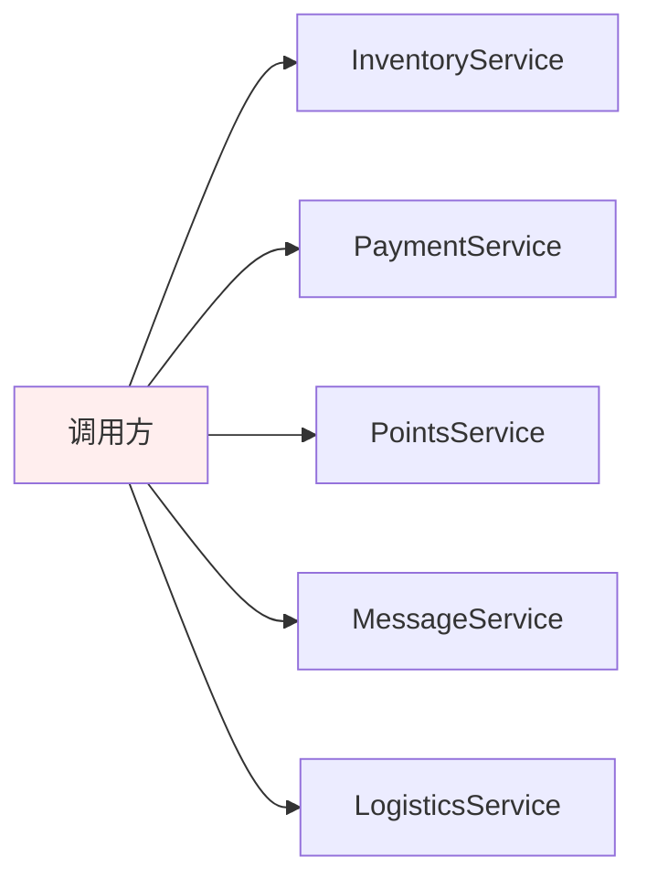
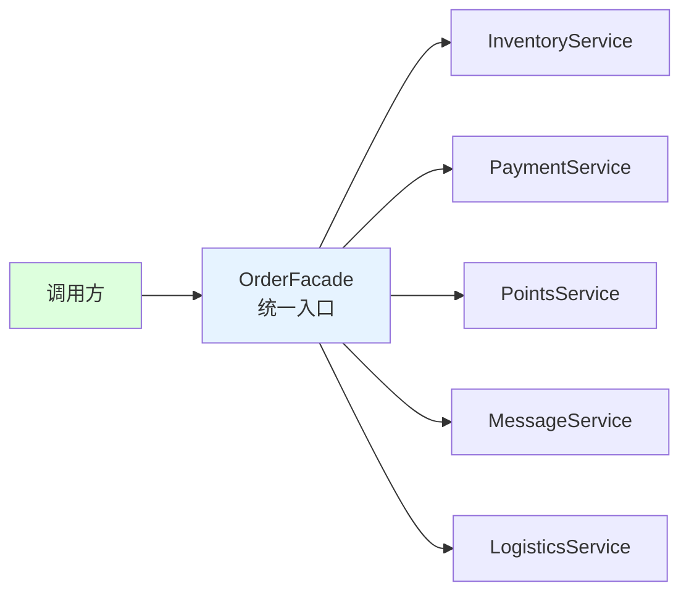

# 第三卷第9章：外观模式设计思想

> **📚 本篇渐进学习节奏（建议按顺序食用）**
>
> 1. **第 01 节 · 案例引入** — 电商下单调用 5 个子系统，新人改 BUG 改错调用顺序导致库存扣两次
> 2. **第 02 节 · 模式基础** — 从医院接待、Java 三层架构讲透"统一入口 + 隐藏复杂度"
> 3. **第 03 节 · 模式实现** — Facade / SubSystem / Client 三角色骨架
> 4. **第 04 节 · 实例演示** — 电脑系统打开/关闭三大子系统 + 形状绘制 ShapeMaker
> 5. **第 05~06 节 · 优缺分析** — 抽象外观类如何缓解开闭原则违背
> 6. **第 07 节 · 踩坑 + 联动** — 4 种翻车姿势 + 与代理/适配器/中介者/装饰者的边界
>
> 阅读到任一节卡壳，直接跳回上一节复盘场景；本篇代码均可直接运行。

#### 目录介绍
- [01.案例引入与思考](#01案例引入与思考)
  - [1.1 痛点场景](#11-痛点场景)
  - [1.2 它哪里不舒服](#12-它哪里不舒服)
  - [1.3 引出本篇主角](#13-引出本篇主角)
- [02.外观模式基础](#02外观模式基础)
  - [2.1 外观模式由来](#21-外观模式由来)
  - [2.2 外观模式定义](#22-外观模式定义)
  - [2.3 外观模式场景](#23-外观模式场景)
  - [2.4 外观模式思考](#24-外观模式思考)
  - [2.5 解决的问题](#25-解决的问题)
- [03.外观模式实现](#03外观模式实现)
  - [3.1 罗列一个场景](#31-罗列一个场景)
  - [3.2 外观结构](#32-外观结构)
  - [3.3 外观基本实现](#33-外观基本实现)
  - [3.4 有哪些注意点](#34-有哪些注意点)
  - [3.5 设计思想](#35-设计思想)
- [04.外观实例演示](#04外观实例演示)
  - [4.1 需求分析](#41-需求分析)
  - [4.2 代码案例实现](#42-代码案例实现)
  - [4.3 是否可以优化](#43-是否可以优化)
- [05.外观模式场景](#05外观模式场景)
- [06.外观模式分析](#06外观模式分析)
  - [6.1 外观模式优点](#61-外观模式优点)
  - [6.2 外观模式缺点](#62-外观模式缺点)
  - [6.3 适用环境](#63-适用环境)
  - [6.4 模式拓展](#64-模式拓展)
- [07.外观代理总结](#07外观代理总结)
  - [7.1 总结一下学习](#71-总结一下学习)
  - [7.2 模式联动与边界](#72-模式联动与边界)
  - [7.3 踩坑实录与开源案例](#73-踩坑实录与开源案例)


## 推荐一个好玩网站

一个最纯粹的技术分享网站，打造精品技术编程专栏！[编程进阶网](https://yccoding.com/)

https://yccoding.com/


## 01.案例引入与思考

> **本篇主线**：复杂子系统的细节暴露给了所有调用方

### 1.1 痛点场景

> **🔥 模拟事故复盘 · 电商中台 · 新人入职第一天的下单 BUG**
>
> 6 月 3 日上午 9:30，应届生小王入职第二天接到任务："把『下单』接口加一个『新人首单减 10 元』的优惠逻辑，下午要上线。"
> 小王打开 IDE 一看——**当前下单逻辑是 47 行 Service 代码，混合调用了 7 个微服务**：库存(Inventory)、优惠券(Coupon)、积分(Points)、风控(RiskControl)、支付(Payment)、物流(Logistics)、消息(Message)。每个服务的初始化、调用顺序、回滚策略都堆在 `OrderService.placeOrder()` 一个方法里。
> 小王照着模仿，在"扣优惠券"和"扣积分"中间，**复制粘贴了一份"减 10 元优惠"的代码**，下午 14:30 灰度上线后：
>
> - **14:35**：客单"扣库存"和"扣优惠券"之间的顺序被无意打乱，**库存扣了 2 次**——某 SKU 显示库存"-12"，前台不再可售；
> - **15:10**：风控调用被越过了，因为小王把"减 10 元逻辑"插在了风控判断之前，**有人用同一身份证刷了 50 笔新人优惠**，损失 500 元；
> - **15:45**：消息推送报错，**因为小王新增的优惠扣减失败时没有调用 `MessageService.sendFailedNotice()`**，用户永远收不到失败通知，客服热线被打爆。
>
> 这场"新人入职改错下单逻辑事故"暴露了一个本质问题：**调用方（无论 App / 小程序 / 中台 / 新接入的渠道）被迫感知 7 个子系统的内部细节**。库存先扣还是优惠券先扣？风控在最前还是最后？失败了哪些要回滚？这些"调用秘籍"散落在 12 个入口的代码里，谁改谁踩坑。如果一开始就用 `OrderFacade.placeOrder(order)` 一行收口，新人只是改 Facade 内部一行，**根本不可能把顺序写错**。

做一个"下单"功能，后端涉及 5 个子系统：库存、支付、积分、消息、物流。调用方（前端/网关）直接面对所有细节：

```java
// 下单逻辑，调用方自己写
public void placeOrder(Order o) {
    InventoryService.lock(o.getSkuId(), o.getCount());
    PaymentService.init(o.getUserId()).charge(o.getAmount());
    PointsService.deduct(o.getUserId(), o.computePoints());
    MessageService.send(o.getUserId(), "下单成功");
    LogisticsService.assignCourier(o.getId(), o.getAddress());
}
```



调用方要知道：子系统启动顺序、各自的初始化参数、失败了回滚哪些步骤……一个"下单"涉及到 5 个服务的内部知识。

### 1.2 它哪里不舒服

- ❌ **暴露内部复杂度**：调用方被迫感知所有子系统；
- ❌ **流程耦合**：5 个步骤的顺序、依赖关系散落在每个调用方；
- ❌ **复用困难**：App/小程序/H5/中台都要下单 → 同样的 5 行代码各写一遍；
- ❌ **回滚策略无处安放**：某一步失败怎么补偿？每个调用方都要自己判断；
- ❌ **子系统升级扩散**：`PaymentService` 改参数 → 所有下单入口都要跟着改。

### 1.3 引出本篇主角

> **外观模式（Facade）的核心思想**：对外提供一个"简化入口"，把多个子系统的协作封装在里面。调用方只和 Facade 对话，内部的复杂、顺序、回滚都由 Facade 负责。

```java
public class OrderFacade {
    public void placeOrder(Order o) {
        // 统一顺序、统一回滚、统一日志
        InventoryService.lock(...);
        PaymentService.init(...).charge(...);
        PointsService.deduct(...);
        MessageService.send(...);
        LogisticsService.assignCourier(...);
    }
}

// 调用方
orderFacade.placeOrder(o);   // 一行搞定
```



经典案例：Spring `JdbcTemplate` 封装了获取连接→准备 Statement→执行→关闭资源的一系列步骤，调用方只写一行 `jdbcTemplate.query(sql)`。Retrofit、OkHttp 的 `Client` 也是外观模式。

外观模式虽然"看上去简单"，但它和代理、适配器、中介者容易混淆——本篇会把各自的动机与边界讲清楚。

**🎯 用前用后效果对比（衔接 1.1 事故现场）**

基线：电商中台下单流程，依赖 7 个微服务，需要被 App / 小程序 / H5 / 第三方渠道四种入口调用：

| 维度 | ❌ 调用方直连子系统（事故现场） | ✅ 引入外观模式 |
|------|-----------------------------|---------------|
| 调用方代码量 | 每个入口 47 行 × 4 个入口 = **188 行** | 每个入口 **1 行** `orderFacade.placeOrder(o)` |
| 调用顺序错误风险 | **必然发生**（4 个入口手抄 7 步顺序） | 不可能（顺序集中在 Facade 一处） |
| 子系统升级影响面 | 改 1 个 RPC 签名 → 改 4 个入口 | **改 1 处 Facade** |
| 风控/事务/熔断埋点 | 4 个入口分别埋点（漏埋必现） | Facade 一处统一切面 |
| 新人上手成本 | 必须读懂 7 个子系统的内部 | 只需要懂 Facade 入参出参 |
| 测试用例数 | 4 入口 × 多场景 = 30+ 套 | Facade 1 套 + 各入口 smoke 即可 |
| 链路追踪 traceId | 4 入口分别埋（容易丢） | Facade 入口生成，全链路贯穿 |
| 限流降级 | 散落在每个入口或子系统 | Facade 一层统一兜底 |

> **结论**：外观模式的本质是 **"为复杂子系统群提供一个高内聚的'对外窗口'"**。它不是简单的"包一层方法"，而是 **"把跨子系统的调用秩序、回滚策略、横切关切（traceId/限流/熔断/审计）集中到一个工程化的入口层"**。**这就是为什么 Spring 用 `JdbcTemplate`、Hibernate 用 `Session`、Redis 用 `RedisTemplate` 撑起整个数据访问层** —— Facade 不是"简化代码"，而是"工程化收口"。

---

## 02.外观模式基础
### 2.1 外观模式由来

外观模式的由来是为了解决软件系统中的复杂性和耦合性问题。在大型软件系统中，各个子系统之间可能存在复杂的依赖关系和交互逻辑，这导致了系统的可维护性和可扩展性变得困难。为了简化客户端与子系统之间的交互，外观模式被引入。

门面模式原理和实现都特别简单，应用场景也比较明确，主要在接口设计方面使用。[更多内容](https://yccoding.com/)

### 2.2 外观模式定义

门面模式，也叫外观模式，英文全称是 Facade Design Pattern。

在 GoF 的《设计模式》一书中，门面模式是这样定义的：Provide a unified interface to a set of interfaces in a subsystem. Facade Pattern defines a higher-level interface that makes the subsystem easier to use.

翻译成中文就是：门面模式为子系统提供一组统一的接口，定义一组高层接口让子系统更易用。

外部与一个子系统的通信必须通过一个统一的外观对象进行，为子系统中的一组接口提供一个一致的界面，外观模式定义了一个高层接口，这个接口使得这一子系统更加容易使用。


### 2.3 外观模式场景

应用场景：

1. 医院接待：医院的接待人员简化了挂号、门诊、划价、取药等复杂流程。
2. Java三层架构：通过外观模式，可以简化对表示层、业务逻辑层和数据访问层的访问。

### 2.4 外观模式思考

外观模式的核心思想主要是通过创建一个外观类，将复杂系统的内部实现细节隐藏起来，只暴露出一个简化的接口给客户端。客户端只需要与外观类进行交互，而不需要直接与子系统的组件进行交互，从而达到想要的效果。

在思考外观模式时，可以考虑以下几个方面：

1. 系统的复杂性：外观模式适用于系统的复杂性较高，包含多个子系统或模块的情况。
2. 客户端的便利性：外观模式旨在提供一个简化的接口给客户端使用，使得客户端可以更方便地使用系统的功能，而不需要了解系统的内部实现细节。
3. 系统的灵活性和可扩展性：外观模式可以提供系统的灵活性和可扩展性。
4. 设计的一致性和封装性：外观模式可以提供设计的一致性和封装性。

### 2.5 解决的问题

主要解决的问题

1. 降低客户端与复杂子系统之间的耦合度。
2. 简化客户端对复杂系统的操作，隐藏内部实现细节。[更多内容](https://yccoding.com/)


## 03.外观模式实现
### 3.1 罗列一个场景

下面通过一个简单的例子来演示。假设有一个电脑系统，包含了多个子系统，如音乐功能、视频功能和联网功能。可以打开或者关闭某功能。

### 3.2 外观结构

外观模式包含如下角色：

1. Facade: 外观角色。提供一个简化的接口，封装了系统的复杂性。外观模式的客户端通过与外观对象交互，而无需直接与系统的各个组件打交道。
2. SubSystem:子系统角色。由多个相互关联的类组成，负责系统的具体功能。外观对象通过调用这些子系统来完成客户端的请求。
3. Client：客户端。使用外观对象来与系统交互，而不需要了解系统内部的具体实现。


### 3.3 外观基本实现

实现方式

1. 创建外观类：定义一个类（外观），作为客户端与子系统之间的中介。提供Facade接口，抽象出通用方法打开和关闭。
2. 封装子系统操作：外观类将复杂的子系统操作封装成简单的方法。三个子系统类（Subsystem）：音乐功能、视频功能和联网功能

提供一个简化的接口

```java
public interface Facade {
    void open();
    void close();
}
```

创建三个子系统类（Subsystem）：音乐功能、视频功能和联网功能。[更多内容](https://yccoding.com/)

```java
public class Music implements Facade{
    
    @Override
    public void open() {
        System.out.println("加载音乐");
    }
    @Override
    public void stop() {
        System.out.println("关闭音乐");
    }
}

public class Video implements Facade{

    @Override
    public void open() {
        System.out.println("打开视频");
    }

    @Override
    public void stop() {
        System.out.println("关闭视频");
    }
}

public class Internet implements Facade{

    @Override
    public void open() {
        System.out.println("连接网络");
    }

    @Override
    public void stop() {
        System.out.println("断开网络");
    }
}
```

创建外观类（Facade） - 电脑系统

```java
public class Computer {
    private Music music;
    private Video video;
    private Internet internet;

    public Computer() {
        this.music = new Music();
        this.video = new Video();
        this.internet = new Internet();
    }

    public void openVideo() {
        internet.open();
        music.open();
        video.open();
    }

    public void stopVideo() {
        video.stop();
        music.stop();
        internet.stop();
    }
}
```

创建客户端（Client）

```java
private void test() {
    Computer computer = new Computer();
    System.out.println("播放视频步骤：");
    // 播放视频
    computer.openVideo();
    System.out.println("关闭视频步骤：");
    // 关闭视频
    computer.stopVideo();
}
```

在上述例子中，音乐功能、视频功能和联网功能是子系统，Computer是外观类，封装了对这些子系统的调用，并提供了简化的接口给客户端。

在客户端中，我们使用外观模式简化了电脑系统的使用。通过调用外观类的方法，客户端无需直接与多个子系统交互，而是通过外观类来管理对子系统的调用。直接一个接口调用打开视频，打开音乐，连接网络功能

该案例中思考：如果不使用外观模式，客户端通常需要和子系统内部的多个模块交互，也就是说客户端会和这些模块之间都有依赖关系，任意一个模块的变动都可能会引起客户端的变动。

使用外观模式后，客户端只需要和外观类交互，即只和这个外观类有依赖关系，不需要再去关心子系统内部模块的变动情况了。[更多内容](https://yccoding.com/)，这样一来，客户端不但简单，而且这个系统会更有弹性。


### 3.4 有哪些注意点

外观模式并不是为了解决系统的性能问题，而是为了提供一个简化的接口和封装系统的复杂性。在使用外观模式时，需要权衡封装的程度和灵活性，并根据具体的需求和情况做出决策。


### 3.5 设计思想

比如该案例中：

1. 针对音乐，视频，联网抽象出通用功能，定义成接口【打开和关闭】。充分体现出面向对象中抽象的设计思想！
2. 针对音乐，视频，联网各个子系统之间的交互，将他们的逻辑封装到外观类中，充分体现出封装的原则！

外观模式的设计思想是基于封装和抽象的原则，通过将子系统的复杂性隐藏起来，提供一个简化的接口给客户端使用。这样可以提高系统的可维护性、可扩展性和可重用性，同时也使得客户端代码更加简洁和易于理解。


## 04.外观实例演示
### 4.1 需求分析

有个需求：我们知道在UI开发中，可以绘制很多图像。比如可以绘制圆形，绘制矩形，绘制椭圆形，绘制……来达到绘制显示的效果。

我们将创建一个 Shape 接口和实现了 Shape 接口的实体类。下一步是定义一个外观类 ShapeMaker。[更多内容](https://yccoding.com/)


### 4.2 代码案例实现

创建一个接口。

```java
public interface Shape {
    void draw();
}
```

创建实现接口的实体类。

```java
public class Rectangle implements Shape {
 
   @Override
   public void draw() {
      System.out.println("Rectangle::draw()");
   }
}

public class Square implements Shape {
 
   @Override
   public void draw() {
      System.out.println("Square::draw()");
   }
}

public class Circle implements Shape {
 
   @Override
   public void draw() {
      System.out.println("Circle::draw()");
   }
}
```

创建一个外观类。

```java
public class ShapeMaker {
   private Shape circle;
   private Shape rectangle;
   private Shape square;
 
   public ShapeMaker() {
      circle = new Circle();
      rectangle = new Rectangle();
      square = new Square();
   }
 
   public void drawCircle(){
      circle.draw();
   }
   public void drawRectangle(){
      rectangle.draw();
   }
   public void drawSquare(){
      square.draw();
   }
}
```

使用该外观类画出各种类型的形状。

```java
private void test() {
    ShapeMaker shapeMaker = new ShapeMaker();
    shapeMaker.drawCircle();
    shapeMaker.drawRectangle();
    shapeMaker.drawSquare();
}
```


### 4.3 是否可以优化

比如，现在增加一个需求，绘制各种素材，不管是圆形，矩形，或者椭圆等，都需要创建画笔和画板，可以给绘制设置不同的颜色。如果是你，该如何设计！[更多内容](https://yccoding.com/)


## 06.外观模式分析
### 6.1 外观模式优点

1. 简化接口：外观模式为子系统提供了一个简化的接口，使得调用者无需关心子系统的内部细节和复杂性，降低了系统的学习成本和使用难度。
2. 降低耦合度：通过引入外观类，子系统与调用者之间的耦合度得到了降低。外观类作为中间层，屏蔽了子系统的具体实现，使得子系统内部的修改不会影响到调用者。
3. 提高灵活性：由于外观类提供了统一的接口，调用者可以更加灵活地使用子系统，而无需关心子系统的具体实现细节。这有助于增加系统的可扩展性和可维护性。
4. 易于维护：当子系统内部发生变更时，只需要修改外观类即可，而无需修改所有调用者的代码。这大大降低了系统的维护成本。


### 6.2 外观模式缺点

1. 可能违背开闭原则：当需要添加新的子系统功能时，可能需要修改外观类或者增加新的外观类。这在一定程度上违背了开闭原则（即对扩展开放，对修改封闭），可能导致系统的稳定性和可维护性受到影响。
2. 可能增加不必要的复杂性：在某些情况下，如果子系统本身就很简单或者调用者需要直接访问子系统的某些功能，引入外观模式可能会增加不必要的复杂性。


### 6.3 适用环境

在以下情况下可以使用外观模式：

1. 当要为一个复杂子系统提供一个简单接口时可以使用外观模式。该接口可以满足大多数用户的需求，而且用户也可以越过外观类直接访问子系统。
2. 客户程序与多个子系统之间存在很大的依赖性。引入外观类将子系统与客户以及其他子系统解耦，可以提高子系统的独立性和可移植性。
3. 在层次化结构中，可以使用外观模式定义系统中每一层的入口，层与层之间不直接产生联系，而通过外观类建立联系，降低层之间的耦合度。


### 6.4 模式拓展

**不要试图通过外观类为子系统增加新行为**

不要通过继承一个外观类在子系统中加入新的行为，这种做法是错误的。外观模式的用意是为子系统提供一个集中化和简化的沟通渠道，而不是向子系统加入新的行为，新的行为的增加应该通过修改原有子系统类或增加新的子系统类来实现，不能通过外观类来实现。

**外观模式与迪米特法则**

外观模式创造出一个外观对象，将客户端所涉及的属于一个子系统的协作伙伴的数量减到最少，使得客户端与子系统内部的对象的相互作用被外观对象所取代。外观类充当了客户类与子系统类之间的"第三者"，降低了客户类与子系统类之间的耦合度，外观模式就是实现代码重构以便达到"迪米特法则"要求的一个强有力的武器。

**抽象外观类的引入**

外观模式最大的缺点在于违背了"开闭原则"，当增加新的子系统或者移除子系统时需要修改外观类，可以通过引入抽象外观类在一定程度上解决该问题，客户端针对抽象外观类进行编程。对于新的业务需求，不修改原有外观类，而对应增加一个新的具体外观类，由新的具体外观类来关联新的子系统对象，同时通过修改配置文件来达到不修改源代码并更换外观类的目的。


## 07.外观模式总结
### 7.1 总结一下学习


**01.外观模式基础**

外观模式的由来是为了解决软件系统中的复杂性和耦合性问题。在大型软件系统中，各个子系统之间可能存在复杂的依赖关系和交互逻辑，这导致了系统的可维护性和可扩展性变得困难。为了简化客户端与子系统之间的交互，外观模式被引入。

定义是：门面模式为子系统提供一组统一的接口，定义一组高层接口让子系统更易用。[更多内容](https://yccoding.com/)

主要解决的问题

1. 降低客户端与复杂子系统之间的耦合度。
2. 简化客户端对复杂系统的操作，隐藏内部实现细节。

**02.外观模式实现**

假设有一个电脑系统，包含了多个子系统，如音乐功能、视频功能和联网功能。可以打开或者关闭某功能。

实现方式

1. 创建外观类：定义一个类（外观），作为客户端与子系统之间的中介。提供Facade接口，抽象出通用方法打开和关闭。
2. 封装子系统操作：外观类将复杂的子系统操作封装成简单的方法。三个子系统类（Subsystem）：音乐功能、视频功能和联网功能

比如该案例中：

1. 针对音乐，视频，联网抽象出通用功能，定义成接口【打开和关闭】。充分体现出面向对象中抽象的设计思想！
2. 针对音乐，视频，联网各个子系统之间的交互，将他们的逻辑封装到外观类中，充分体现出封装的原则！


**03.外观实例演示**

有个需求：我们知道在UI开发中，可以绘制很多图像。比如可以绘制圆形，绘制矩形，绘制椭圆形，绘制……来达到绘制显示的效果。[更多内容](https://yccoding.com/)

**05.外观模式分析**

外观模式优点：1.简化接口；2.降低耦合；3.提高灵活性；4.方便维护

外观模式缺点：1.当添加新的子类系统，可能需要修改外观类，或者破坏开闭原则；

使用建议：建议1不要通过外观类给子类系统加入新的行为。


### 7.2 模式联动边界

- 与**代理模式**：代理是"同接口同职责+中间增强"，外观是"不同接口为多个子系统提供统一入口"；
- 与**适配器模式**：适配器是"接口不兑上去凑兑"，外观是"接口复杂去简化"；
- 与**中介者模式**：中介是"同级对象互动的跨点"，外观是"上层打包下层的隔面"；
- 与**单例模式**：外观类本身经常被实现为单例。

**何时说 NO**：子系统只有3 个以下、调用顺序不复杂；调用方需要细粒度定制控制。

下一站建议阅读 [10.桥接模式](10.桥接模式设计思想.md)——看看不同于"隔面"的另一种“结构解耦”。


### 7.3 踩坑实录与开源案例

外观模式写起来"看似很优雅"，但下面 4 类问题几乎人人翻过车，**每一类都对应一个真实事故场景**：

**坑 1：Facade 沦为 "上帝类"，啥都往里塞**
```java
public class OrderFacade {
    public void placeOrder(...) { /* 100 行 */ }
    public void cancelOrder(...) { /* 80 行 */ }
    public void refundOrder(...) { /* 90 行 */ }
    public void exportReport(...) { /* 200 行 */ }   // ❌ 报表导出和下单半毛钱关系都没有
    public void syncWarehouse(...) { /* 150 行 */ }  // ❌ 仓库同步也塞进来
    // ... 30 个方法,2000 行
}
```
**根因**：Facade 应该按 **"业务子领域"** 划分（下单 / 售后 / 财务 / 报表），而不是塞成"全公司唯一一个 Facade"。一旦超过 500 行就该拆分。**正解**：每个 Facade 对应一个明确的"对外用例集合"，超过 7 个公开方法立即拆分。

**坑 2：Facade 直接持有子系统 Bean，单测无法 Mock**
```java
public class OrderFacade {
    public void placeOrder(Order o) {
        InventoryService.lock(o.getSkuId(), o.getCount());  // ❌ 静态方法直接调
        new PaymentService().charge(o.getAmount());          // ❌ new 出来,无法 Mock
    }
}
```
**根因**：Facade 是"协作中枢"，必须通过依赖注入持有子系统引用，否则单测时无法用 Mockito 替换为 Mock 对象，整个 Facade 就只能上集成测试。**正解**：所有子系统通过构造器注入或字段注入，单测 Mock 全链路。

**坑 3：Facade 吞掉异常，只返回 boolean**
```java
public boolean placeOrder(Order o) {
    try {
        // ... 7 个调用
        return true;
    } catch (Exception e) {
        log.error("下单失败", e);  // ❌ 只打日志
        return false;             // ❌ 调用方收到 false,不知道是哪一步失败
    }
}
```
**根因**：Facade 是 **"协作收口"**，不是 **"异常黑洞"**。子系统的业务异常（库存不足/优惠券过期/风控拦截）必须明确传递到调用方，否则前端无法给用户准确提示。**正解**：定义一组业务异常（`InventoryShortException` / `RiskBlockedException` 等），Facade 透传或包装为 `OrderFailedException(reason, detail)`。

**坑 4：Facade 里偷偷开事务，跨服务事务玩崩**
```java
@Transactional   // ❌ Facade 调用了 7 个微服务,这个事务根本管不住
public void placeOrder(Order o) {
    inventoryClient.lock(...);   // 远程 RPC,本地事务管不到
    paymentClient.charge(...);   // 远程 RPC,本地事务管不到
}
```
**根因**：本地 `@Transactional` 只能管本地数据源。跨多个微服务的"事务"是分布式事务问题，必须用 Saga / TCC / 本地消息表，**绝不能用一个 `@Transactional` 注解假装解决**。**正解**：Facade 内部使用 Saga 模式（每步骤一个补偿动作）或本地消息表 + 异步重试。

**🔍 真实开源代码中的外观模式**

外观是 Java 生态最朴素也最高频的模式，凡是"封装一组复杂资源访问"的场景几乎都能看到它：

| 出处 | 关键源码 | 它在 Facade 什么 |
|------|---------|----------------|
| **Spring JDBC** | `JdbcTemplate` | 封装"获取 Connection → 创建 Statement → 执行 SQL → 关闭资源 → 异常翻译"全流程 |
| Spring 数据访问 | `RedisTemplate` / `MongoTemplate` / `RestTemplate` / `WebClient` | 把连接池、序列化、超时、重试统一为一行调用 |
| Hibernate / JPA | `EntityManager` / `Session` | 屏蔽 JDBC + 缓存 + 事务 + 元数据等子系统 |
| Spring | `ApplicationContext` | 整合 BeanFactory + 资源加载 + 事件发布 + 国际化 + 环境配置等子系统 |
| **SLF4J** | `LoggerFactory.getLogger(...)` | 屏蔽 Log4j / Logback / JUL 等具体实现的初始化细节 |
| Netty | `Bootstrap` / `ServerBootstrap` | 把 EventLoopGroup / ChannelFactory / Pipeline / Option 一系列复杂配置打包成一行 |
| Hystrix / Resilience4j | `HystrixCommand` / `Decorators.ofSupplier()` | 把熔断 + 限流 + 重试 + 降级 + Metrics 多子系统统一为一个调用入口 |
| Apache HttpClient | `HttpClients.createDefault()` 出来的 `CloseableHttpClient` | 屏蔽连接池 / 路由 / 重定向 / Cookie / SSL 等子系统 |
| OkHttp / Retrofit | `OkHttpClient` / `Retrofit` | 拦截器链 + 连接池 + DNS + 缓存等的统一入口 |
| Tomcat | `org.apache.catalina.startup.Bootstrap` | 启动阶段把 ClassLoader / Catalina / Server / Service 串起来一行启动 |

> **学习路径**：先读 `JdbcTemplate.query(...)`（200 行就能看完，是教科书级 Facade）→ 再读 `LoggerFactory.getLogger(...)` 的 SPI 加载流程 → 最后读 **Spring `ApplicationContext` 的 refresh() 流程**（13 步初始化每一步对应一个子系统，Facade 模式的工程级巅峰）。读完这三个，你就理解了"Facade 不是图省事，而是工程化收口"。

**⚠️ 外观 vs 三个最易混淆的兄弟**

| 模式 | 核心目的 | 接口数量 | 替换关系 |
|------|---------|---------|---------|
| **外观（Facade）** | 为多个子系统提供**统一简化入口** | 1 个 Facade ↔ N 个子系统 | 调用方 **多了一个** Facade（不替换原有） |
| **适配器**（07 篇） | **转换接口**让两个不兼容能对话 | 1↔1 | Adapter **替换** Adaptee 暴露给客户端 |
| **代理**（05/06 篇） | **控制访问**（鉴权 / 缓存 / 远程） | 1↔1 同接口 | Proxy **替换**真实对象暴露给客户端 |
| **中介者**（21 篇） | 把"对象间多对多通信"变成"星型通信" | 1 个中介 ↔ N 个同级对象 | 同级对象间不再直连 |

一句话区分：
- **想给一堆子系统开个总入口 → 外观**；
- **想给一个对象换个接口皮 → 适配器**；
- **想给一个对象加访问控制 → 代理**；
- **想让一群对象别互相直连 → 中介者**。

**⚠️ 什么时候不该用外观**

- **子系统就 1-2 个**：直接调用即可，套 Facade 反而多一层；
- **调用方需要细粒度定制**：比如做底层框架，调用方就是要直接拿 `Connection` 自己控制事务粒度，那 `JdbcTemplate` 反而碍事；
- **Facade 自己变成上帝类**：动辄 30+ 方法、2000+ 行，那不是 Facade 是反模式；
- **Facade 想"增强行为"**：那是装饰者（08 篇）或代理（05/06 篇），别为了 Facade 而在里面塞业务规则。

> 一句话：**外观是"工程化收口"，不是"图省事的语法糖"。该收口的地方坚决收，不该收口的地方别强收**。

