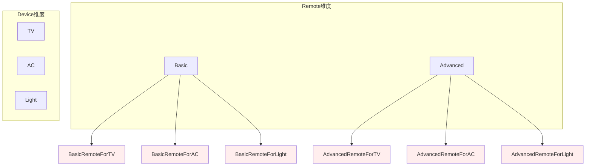
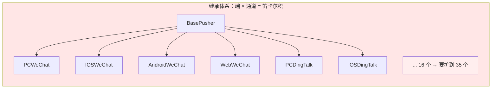
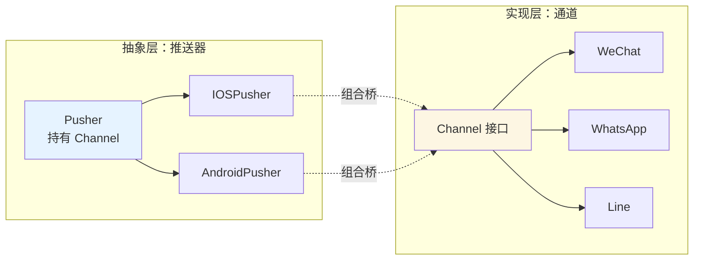
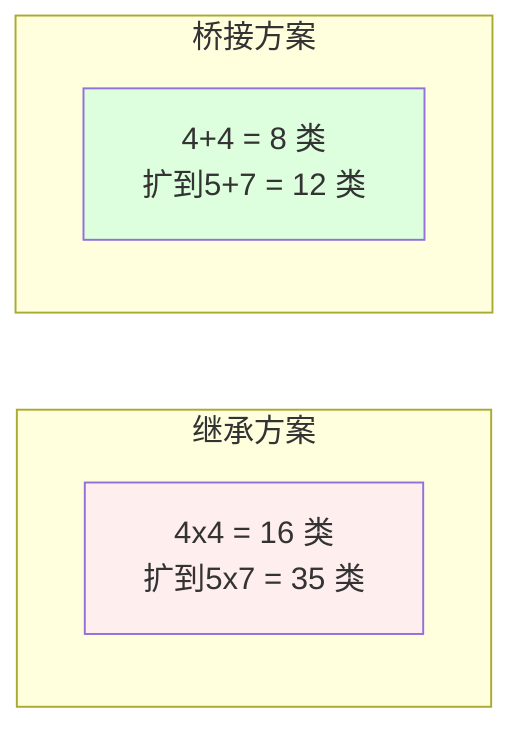
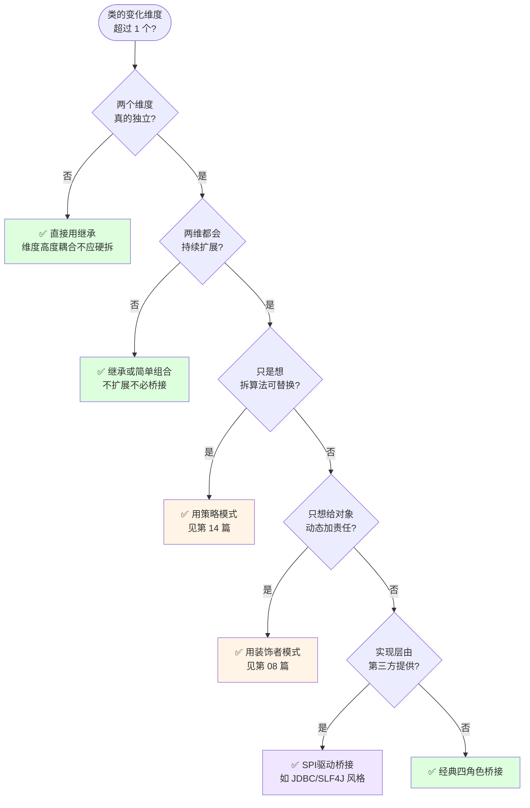
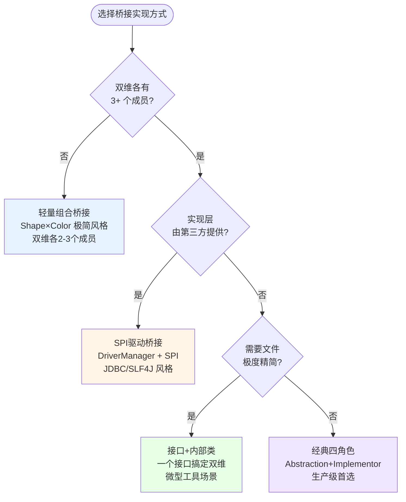
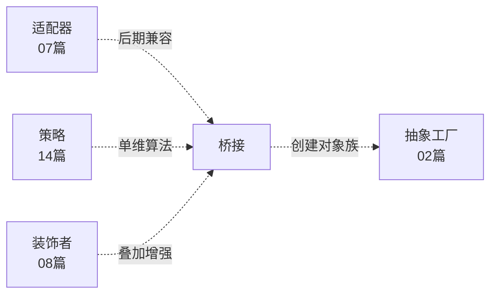

# 第三卷第10章：桥接模式设计思想

> **📚 本篇渐进学习节奏（建议按顺序食用）**
>
> 本篇采用「**事故复盘 → 失败探索 → 模式诞生 → 实现对比 → 效果验证 → 反面踩坑 → 选型决策**」的节奏：
>
> 1. **第 01 节 · 案例引入** — 多端推送系统：4端×4通道→扩张到5端×7通道，35个子类爆炸事故
> 2. **第 02 节 · 失败探索** — 纯继承 / if-else判断 / 两层继承树，三次直觉方案全部翻车
> 3. **第 03 节 · 模式基础** — 从"乘法变加法"讲透两个独立维度的解耦
> 4. **第 04 节 · 实现对比** — 经典四角色 / SPI桥接 / 轻量组合 / 接口内部类四种实现
> 5. **第 05 节 · 效果对比** — 35个子类 vs 12个类，改算法 1 处 vs 35 处，数据说话
> 6. **第 06 节 · 反面踩坑** — 4 种翻车姿势：非正交维拆分 / 抽象层退化成空壳 / 客户端写死组合 / 桥接适配混淆
> 7. **第 07 节 · 决策树** — 工程师的成熟度在于"知道什么时候不上桥接"
> 8. **第 08 节 · 总结延伸** — 思考模型沉淀 + 与适配器/策略/装饰者/抽象工厂的边界
>
> 阅读到任一节卡壳，直接跳回上一节复盘场景；本篇代码均可直接运行。

## 推荐一个好玩网站

一个最纯粹的技术分享网站，打造精品技术编程专栏！[编程进阶网](https://yccoding.com/)

https://yccoding.com/


#### 目录快速导航
- [01.案例引入：推送系统的"笛卡尔积"爆炸事故](#01案例引入推送系统的笛卡尔积爆炸事故)
    - [1.1 痛点现场](#11-痛点现场)
    - [1.2 直觉实现复现](#12-直觉实现复现)
    - [1.3 问题根源拆解](#13-问题根源拆解)
    - [1.4 引出本篇主角](#14-引出本篇主角)
- [02.三次失败探索](#02三次失败探索)
    - [2.1 尝试方案A：纯继承——笛卡尔积爆炸](#21-尝试方案a纯继承笛卡尔积爆炸)
    - [2.2 尝试方案B：if-else类型判断——修改扩散](#22-尝试方案bif-else类型判断修改扩散)
    - [2.3 尝试方案C：两层继承树——无法表达任意组合](#23-尝试方案c两层继承树无法表达任意组合)
    - [2.4 终于引出桥接模式](#24-终于引出桥接模式)
- [03.桥接模式基础](#03桥接模式基础)
    - [3.1 从失败中提炼需求](#31-从失败中提炼需求)
    - [3.2 桥接模式的标准骨架](#32-桥接模式的标准骨架)
    - [3.3 典型使用场景](#33-典型使用场景)
- [04.四种实现对比](#04四种实现对比)
    - [4.1 实现核心要点](#41-实现核心要点)
    - [4.2 实现A：经典四角色（支付案例）](#42-实现a经典四角色支付案例)
    - [4.3 实现B：SPI驱动桥接（JDBC/SLF4J风格）](#43-实现bspi驱动桥接jdbcslf4j风格)
    - [4.4 实现C：轻量组合桥接（Shape×Color）](#44-实现c轻量组合桥接shapecolor)
    - [4.5 实现D：接口+内部类桥接](#45-实现d接口内部类桥接)
    - [4.6 四种实现速查表](#46-四种实现速查表)
- [05.用前用后效果对比](#05用前用后效果对比)
    - [5.1 核心数据对比](#51-核心数据对比)
    - [5.2 核心收益](#52-核心收益)
- [06.反面踩坑实录](#06反面踩坑实录)
    - [6.1 踩坑A：把非正交维度硬拆成桥接](#61-踩坑a把非正交维度硬拆成桥接)
    - [6.2 踩坑B：抽象层退化成空壳](#62-踩坑b抽象层退化成空壳)
    - [6.3 踩坑C：客户端写死组合，桥接灵活性归零](#63-踩坑c客户端写死组合桥接灵活性归零)
    - [6.4 踩坑D：桥接和适配器写在一起](#64-踩坑d桥接和适配器写在一起)
    - [6.5 替代方案汇总](#65-替代方案汇总)
- [07.决策树与选型](#07决策树与选型)
    - [7.1 该不该用桥接模式](#71-该不该用桥接模式)
    - [7.2 选哪种实现方式](#72-选哪种实现方式)
    - [7.3 选型清单速查](#73-选型清单速查)
- [08.总结与延伸](#08总结与延伸)
    - [8.1 设计思想沉淀](#81-设计思想沉淀)
    - [8.2 模式联动边界](#82-模式联动边界)
    - [8.3 思考题与延伸](#83-思考题与延伸)


## 01.案例引入：推送系统的"笛卡尔积"爆炸事故

> **本篇主线**：两个独立变化的维度被继承绑死 → 引出"把乘法变成加法"的桥接思想。

### 1.1 痛点现场

> **🔥 模拟事故复盘 · 消息推送中台 · 国际化扩张时的"维度灾难"**
>
> 9 月 12 日上午 10:00，市场部宣布："Q4 公司要拓展 3 个海外区域，App 端先支持东南亚、欧美、日韩本地化推送渠道。"
> 后端组打开当前推送系统一看——**当前实现是用『继承』把"端 × 通道"绑死的**：4 个端（PC / iOS / Android / Web）× 4 个通道（微信 / 钉钉 / 邮件 / SMS）= **16 个子类**：`PCWeChatPusher`、`IOSDingTalkPusher`、`AndroidEmailPusher`、`WebSMSPusher`...
> 现在要新增 3 个海外通道（**WhatsApp / Line / Telegram**），按现有写法：
>
> - **新增类数 = 4 端 × 3 新通道 = 12 个新子类**；
> - 新人小赵手抖，把 `IOSWhatsAppPusher` 的"重试逻辑"复制粘贴时漏掉一行——iOS 推送失败后没退避就疯狂重试，**WhatsApp 接口被风控限流，全公司 iOS 用户当晚收不到推送**。
>
> 更糟的是 9 月 20 日运营追加："新增『车机端』，因为我们要进车厂。"——4 个新通道还没加完，又来了一个新端：
>
> - **新增类数 = 1 新端 × 7 通道（4 老 + 3 新）= 7 个新子类**；
> - 总子类数从 16 → 16 + 12 + 7 = **35 个**；
> - 改一个"重试退避算法"——**35 个类要全改一遍**；
> - 单测脚本 35 套要重写。
>
> 这场事故暴露了一个本质问题：**当类的"变化维度"是两个或更多时（端 × 通道），用继承会让类数量按笛卡尔积爆炸**。每加一个端 → 类数 ×（通道数）；每加一个通道 → 类数 ×（端数）。

做一套智能家居控制：遥控器有 `BasicRemote / AdvancedRemote` 两种，设备有 `TV / AirConditioner / Light` 三种。第一版用继承：

```java
class BasicRemoteForTV { ... }
class BasicRemoteForAC { ... }
class BasicRemoteForLight { ... }
class AdvancedRemoteForTV { ... }
class AdvancedRemoteForAC { ... }
class AdvancedRemoteForLight { ... }
// 2 × 3 = 6 个类
```

一维增加时成本是线性的，但双维度相乘后是**笛卡尔积爆炸**：



新增一个"语音遥控器" + 一个"窗帘设备"：立刻从 6 个类变成 4 × 4 = 16 个。

### 1.2 直觉实现复现

**【你也能写出这种代码】**。一个新同学接手需求"iOS 端接入 WhatsApp 推送"，第一反应是照着现有 `IOSWeChatPusher` 复制一个：

```java
// ❌ 事故现场——照着 IOSWeChatPusher 复制粘贴出 IOSWhatsAppPusher
class IOSWeChatPusher extends BasePusher {
    public void push(Message msg) {
        initConnection();           // ① iOS 推送初始化
        applyRetryPolicy();         // ② 退避重试（iOS 独有的指数退避算法）
        WeChatChannel.send(msg);    // ③ 调用微信通道
    }
    private void applyRetryPolicy() {
        // 指数退避: 1s → 2s → 4s → 8s
    }
}

// 新人复制上面，改成 WhatsApp
class IOSWhatsAppPusher extends BasePusher {
    public void push(Message msg) {
        initConnection();
        // ❌ applyRetryPolicy();  ← 漏掉了！WhatsApp 没重试，失败直接报错
        WhatsAppChannel.send(msg);
    }
}
```

**🧪 跑一下，亲眼看到 bug**

```java
// 模拟：WhatsApp 通道间歇性超时
IOSWhatsAppPusher pusher = new IOSWhatsAppPusher();
for (int i = 0; i < 10; i++) {
    pusher.push(new Message("test"));
    // 第 3 条超时 → 没重试 → 直接抛异常 → 用户收不到推送
    // 第 5 条超时 → 疯狂调用 send() 没退避 → WhatsApp 风控限流
}
// 结果：全公司 iOS 用户当晚收不到推送，WhatsApp 接口被限流 24 小时
```

事故现场重现完毕——**35 个类中任何一处漏复制一行逻辑 = 线上灾难**。

**💭 3 个反思题**（先别往下看，自己想 30 秒）：

1. 如果"端"从 4 种变成 10 种，"通道"从 4 种变成 15 种，子类数量是多少？
2. 改"退避算法"要从多少个类里改？
3. 有没有一种方式，让"端"和"通道"**各自独立发展**，加新端不影响通道，加新通道不影响端？

### 1.3 问题根源拆解

**【画一张图就清楚了】**



每个"端 × 通道"子类 **各自维护推送逻辑和通道调用**，互不感知，这就埋下了 5 类隐患：

| 隐患 | 现象 | 业务影响 |
|------|------|---------|
| **笛卡尔积爆炸** | m × n 个子类，任一维扩展 = 乘法增长 | 5端×7通道 = 35个类，每加一维翻倍 |
| **代码重复** | 16 个类各写一份 iOS 退避逻辑 | 改退避算法 → 改 16 处 |
| **维度耦合** | 端和通道绑死在同一继承树 | 改通道协议 → 所有端都受影响 |
| **无法运行时切换** | 编译期类型固定 | iOS 不能从微信切到 WhatsApp 推送 |
| **测试爆炸** | 35 个组合都要覆盖 | 退避回归 → 跑 35 套用例 |

**🎯 核心矛盾**：业务上"端"和"通道"是两个**独立变化维度**（加新端 ≠ 加新通道），但代码层面用继承把两个维度**硬绑在一起**，导致"乘法级"的组合爆炸。

### 1.4 引出本篇主角

> **桥接模式（Bridge）的核心思想**：把"两个独立变化的维度"拆开，一个作为抽象层（遥控器/端），另一个作为实现层（设备/通道），中间用**组合**连接。两边可以各自扩展，互不影响。



扩展成本立刻从"乘法"退化成"加法"：



JDBC 的 `DriverManager`（抽象）× `Driver 实现`（MySQL/Oracle/PG）、SLF4J 日志门面（抽象）× 实现（Log4j/Logback），都是桥接的经典落地。

但是！**先别急着看实现**。下一节，我们先看看新手通常会先尝试哪些"看起来很合理"的方案，并理解它们为什么都不够好。


## 02.三次失败探索

> **为什么要学这一节**：直接给你"标准答案"是容易的，但桥接模式不是凭空发明的——它是**前人走过三条死路之后才提炼出来的**。走过这些死路，你才会真正理解为什么代码长那个样子。

### 2.1 尝试方案A：纯继承——笛卡尔积爆炸

**【新手方案①：每个"端 × 通道"组合建一个子类】**

```java
// 方案A：纯继承实现——iOS 端的 4 个通道子类
class IOSWeChatPusher {
    public void push(Message msg) {
        initIOSConnection();         // iOS 特有逻辑（每个子类复制一遍）
        applyRetryPolicy();          // 退避算法（每个子类复制一遍）
        WeChatChannel.send(msg);     // 微信通道调用
    }
}

class IOSDingTalkPusher {
    public void push(Message msg) {
        initIOSConnection();         // 同上
        applyRetryPolicy();          // 同上
        DingTalkChannel.send(msg);   // 只有这行不同
    }
}

class IOSEmailPusher { /* 又复制一份 initIOSConnection + applyRetryPolicy */ }
class IOSSMSPusher { /* 又复制一份 */ }
// Android 端再复制 4 份、PC 端 4 份、Web 端 4 份 = 16 个类
```

**🧪 跑一下，看会出什么问题**

```java
// 运营：新增"车机端"
// → 需要新增 CarWeChatPusher, CarDingTalkPusher, CarEmailPusher, CarSMSPusher
// → 4 个新类，每个要重新写车机端的推送逻辑

// 市场：新增 WhatsApp / Line / Telegram 三个海外通道
// → 5 端 × 3 新通道 = 15 个新类
// → 加上车机端的 4 个 = 总共新增 19 个类

// 运维：把退避算法从指数退避改成斐波那契退避
// → 35 个类全改
```

**❌ 失败原因**：类数量 = 端数 × 通道数，笛卡尔积；加一维 = 乘法增长；改一个通用逻辑 = 所有类全改。

**💡 反思**：我们需要把"端"和"通道"拆成**两条独立的进化路线**——加通道不动端，加端不动通道。

### 2.2 尝试方案B：if-else类型判断——修改扩散

**【新手方案②：用一个方法 + int 标志位区分端和通道】**

这是支付场景中最常见的反模式：[更多内容](https://yccoding.com/)

```java
public class PayController {

    /**
     * @param channelType 渠道类型 1 微信, 2 支付宝
     * @param modeType    支付模式 1 密码, 2 人脸, 3 指纹
     */
    public void doPay(String uId, String tradeId, BigDecimal amount,
                      int channelType, int modeType) {
        // 微信支付
        if (1 == channelType) {
            System.out.println("微信渠道支付划账开始......");
            if (1 == modeType) {
                System.out.println("密码支付");
            } else if (2 == modeType) {
                System.out.println("人脸支付");
            } else if (3 == modeType) {
                System.out.println("指纹支付");
            }
        }

        // 支付宝支付
        if (2 == channelType) {
            System.out.println("支付宝渠道支付划账开始......");
            if (1 == modeType) {
                System.out.println("密码支付");
            } else if (2 == modeType) {
                System.out.println("人脸支付");
            } else if (3 == modeType) {
                System.out.println("指纹支付");
            }
        }
    }
}
```

**🧪 跑一下，会发现隐藏问题**

```java
// 新增"京东支付"渠道 → 在 doPay 里加一个 if (3 == channelType) {} 块
// 新增"刷掌支付"模式 → 在 3 个渠道块里各加一个 else if (4 == modeType) {} 分支
// 改"密码支付"的风控逻辑 → 在 3 个渠道块里各改一遍

// 1 个方法 = 渠道数 × 模式数 个 if-else 分支
// 任何维度的扩展 = 修改同一处代码（违背开闭原则）
```

**❌ 失败原因**：① 一维扩展 → 必须修改 PayController 类（违背开闭原则）；② 渠道和模式耦合在一个 if-else 森林里，任何改动都牵动全方法；③ 没有编译期类型安全——`channelType=99` 在运行时才报错。

**💡 反思**：我们需要渠道和模式的**各自独立演化**，每个新渠道是一个新类，每个新模式也是一个新类，然后用组合而非条件分支把它们连起来。

### 2.3 尝试方案C：两层继承树——无法表达任意组合

**【新手方案③：先按"渠道"继承，再按"模式"继承】**

```java
// 第一层：按渠道分
abstract class Pay { abstract void doPay(); }

class WxPay extends Pay {
    void doPay() { /* 微信划账逻辑 */ }
}
class AliPay extends Pay {
    void doPay() { /* 支付宝划账逻辑 */ }
}

// 第二层：WxPay 下按模式再分
class WxPasswordPay extends WxPay {
    void doPay() { super.doPay(); /* 加密码校验逻辑 */ }
}
class WxFacePay extends WxPay {
    void doPay() { super.doPay(); /* 加刷脸校验逻辑 */ }
}
class WxFingerprintPay extends WxPay {
    void doPay() { super.doPay(); /* 加指纹校验逻辑 */ }
}

// 支付宝下也要再分三层：
class AliPasswordPay extends AliPay { /* ... */ }
class AliFacePay extends AliPay { /* ... */ }
class AliFingerprintPay extends AliPay { /* ... */ }
```

**🧪 跑一下，看会怎样**

```java
// 新增"京东支付"渠道 → 第一层新增 JdPay 类
// 但问题：京东也支持密码/人脸/指纹三种模式
// → 必须在 JdPay 下再建 3 个子类，重复"密码校验"/"刷脸校验"/"指纹校验"逻辑

// 三层之下，密码逻辑在 WxPasswordPay、AliPasswordPay、JdPasswordPay 里各写一遍
// 改密码风控算法 → 改 3 处（未来 = 渠道数 处）
```

**❌ 失败原因**：① "先按渠道再按模式"的继承顺序把"模式"逻辑在每棵渠道子树下重复一遍；② 如果反过来"先按模式再按渠道"，则渠道逻辑又在每个模式子树下重复；③ **本质上仍然是在某个维度上重复另一个维度的代码**。

**💡 反思**：理想方案 = 方案 A 的"每个维度各有独立类" + 方案 B 的"运行时选择组合" + "两条维度通过组合连接，不通过继承捆绑"。

### 2.4 终于引出桥接模式

**【三次失败之后，需求清单收敛了】**

| 必须满足 | 来自哪一次失败 |
|---------|-------------|
| ① 维 A 和维 B 各自独立扩展 | 2.1 纯继承——加通道要翻倍类数 |
| ② 不改现有代码即可加新维度成员 | 2.2 if-else——每次扩展改同一方法 |
| ③ 任意 A × 任意 B 都能组合 | 2.3 两层继承——固定了继承顺序 |
| ④ 通用逻辑只写一处 | 2.1 / 2.3——退避算法/风控逻辑到处复制 |
| ⑤ 运行时动态选择组合 | 2.2 if-else——编译期硬编码 |

**【桥接模式的标准答案】——一套骨架，同时回答上面 5 条约束：**

```java
// ① 实现层——维 B（通道/模式），独立演化
public interface IChannel {
    void send(Message msg);
}

// ② 抽象层——维 A（端/渠道），持有实现层引用
public abstract class Pusher {
    protected IChannel channel;                     // ③ 组合桥接，非继承
    public Pusher(IChannel channel) { this.channel = channel; }

    public abstract void push(Message msg);
}

// ④ iOS 的通用退避逻辑，只在此一处
public class IOSPusher extends Pusher {
    public IOSPusher(IChannel channel) { super(channel); }

    public void push(Message msg) {
        initIOSConnection();
        applyRetryPolicy();                         // ④ 只写一次
        channel.send(msg);                          // ③ 组合调用实现层
    }
}

// ② WhatsApp 通道独立存在
public class WhatsAppChannel implements IChannel {
    public void send(Message msg) { /* WhatsApp 推送 */ }
}

// ⑤ 运行时任意组合：
Pusher pusher = new IOSPusher(new WhatsAppChannel());  // iOS + WhatsApp
pusher = new IOSPusher(new LineChannel());              // iOS + Line
pusher = new AndroidPusher(new TelegramChannel());      // Android + Telegram
```

短短几行，**同时回答了上面 5 个需求**。这就是桥接模式的"灵魂代码"。


## 03.桥接模式基础

### 3.1 从失败中提炼的需求

回顾 02 节，我们试了**纯继承笛卡尔积、if-else类型判断、两层继承树**——**全部失败**。现在拿着这些失败报告，问自己一个问题：

> 如果我要写一个能跑 3 年不崩的"双维度组合系统"，它必须满足哪几条硬约束？

把这些约束写下来，就自然得到了桥接模式的设计清单：

| 约束 | 来自 | 代码体现 |
|:---|:---|:---|
| ① 两条维度各自独立演化 | 2.1 笛卡尔积爆炸 | `interface IChannel` + `abstract class Pusher` 两条继承线 |
| ② 加新维度成员不碰现有代码 | 2.2 if-else 修改扩散 | 新增 `TelegramChannel implements IChannel`，不碰 `Pusher` 体系 |
| ③ 组合代替继承捆绑 | 2.3 两层继承固定顺序 | `protected IChannel channel;` 构造器注入 |
| ④ 通用逻辑只写一处 | 2.1/2.3 到处复制 | `IOSPusher` 中写一次退避，所有通道共享 |
| ⑤ 运行时动态选择 | 2.2 编译期硬编码 | `new IOSPusher(new WhatsAppChannel())` 运行时组合 |

桥接模式用一种巧妙的方式处理多层继承存在的问题，用抽象关联来取代传统的多层继承，将类之间的静态继承关系转变为动态的组合关系，使得系统更加灵活，并易于扩展，有效地控制了系统中类的个数（避免了继承层次的指数级爆炸）。[更多内容](https://yccoding.com/)

### 3.2 桥接模式的标准骨架

上面 5 条约束翻译成代码，**所有实现变体共用一个骨架**：

```java
// ① 实现层接口——维 B 的演化线
public interface Implementor {
    void operationImpl();                          // ③ 每个实现独立定义
}

// ② 具体实现——维 B 的成员
public class ConcreteImplementorA implements Implementor {
    public void operationImpl() { /* A 的具体实现 */ }
}
public class ConcreteImplementorB implements Implementor {
    public void operationImpl() { /* B 的具体实现 */ }
}

// ③ 抽象层——维 A 的演化线，持有实现层引用（组合桥）
public abstract class Abstraction {
    protected Implementor impl;                    // ⑤ 组合桥接，非继承

    public Abstraction(Implementor impl) { this.impl = impl; }

    public abstract void operation();              // ④ 通用逻辑只在此体系写一次
}

// ④ 扩充抽象——维 A 的成员
public class RefinedAbstraction extends Abstraction {
    public RefinedAbstraction(Implementor impl) { super(impl); }

    public void operation() {
        // ④ 维 A 的通用逻辑（如 iOS 退避）只在此处一次
        impl.operationImpl();                      // ③ 委托给实现层
    }
}
```

**三句话记住**：**两条线**（抽象线 + 实现线各自独立继承）→ **一个桥**（抽象层持有实现层引用，组合非继承）→ **乘法变加法**（加新维 A 成员只影响抽象线，加新维 B 成员只影响实现线）。差异全在"抽象层要不要有接口"和"实现层是接口还是抽象类"里头——这就是下一节四种实现的核心分岔。

桥接模式(Bridge Pattern)：将抽象部分与它的实现部分分离，使它们都可以独立地变化。它是一种对象结构型模式，又称为柄体(Handle and Body)模式或接口(Interface)模式。

### 3.3 典型使用场景

不是所有"有两个维度"的系统都适合桥接。核心判断标准是：**两个维度各自独立、都会持续扩展**。以下场景验证：

- **图形界面库**：控件（按钮/文本框/下拉框）与主题（Light/Dark）——两个维度独立变化，桥接后控件不加主题子类。
- **数据库访问层**：JDBC 的 `Connection/Statement`（抽象层）与 `Driver`（实现层）——加新数据库只需加 1 个 Driver，不碰 Connection。
- **消息传输协议**：消息类型 × 传输方式（TCP/HTTP/MQTT）——两个维度各自扩展。
- **音频视频播放器**：播放器（MP3/FLAC/AAC）× 平台实现（Android/iOS/Windows）。

> **反面提醒**：只有一个维度在变、维度高度耦合（端 A 只能用通道 X）、类数量本来就少——参考 06 / 07 节。


## 04.四种实现对比

### 4.1 实现核心要点

四种写法本质上是在 **抽象层形式 / 实现层形式 / 组合绑定方式** 上的不同取舍。实现桥接模式的核心只要两件事：

```java
Abstraction bridge = new RefinedAbstraction(new ConcreteImplementor());  // ① 双维组合
bridge.operation();                                                       // ② 抽象层驱动
```

差异全在"抽象层是抽象类还是接口"和"组合是在构造器注入还是 setter 注入"这两个决策点里。下面按演进顺序逐一展开，最后在 [7.2 节](#72-选哪种实现方式) 会有一张决策图帮你快速定位。


### 4.2 实现A：经典四角色（支付案例）

**设计权衡**：用"四个角色的完整骨架"换"双维度扩展时零摩擦"。

**选它的理由**：两维都有 3+ 个成员且还在增长——经典四角色是最标准、最不易翻车的写法。

以支付场景为例：支付渠道 × 支付方式。**实现层接口（支付方式）**：[更多内容](https://yccoding.com/)

```java
public interface IPayMode {
    boolean security(String uId);     // 安全校验：各支付模式的风控
}
```

**具体实现（密码/刷脸/指纹）**：

```java
public class PayCypher implements IPayMode {
    @Override public boolean security(String uId) { return false; }
}
public class PayFaceMode implements IPayMode {
    @Override public boolean security(String uId) { return true; }
}
public class PayFingerprintMode implements IPayMode {
    @Override public boolean security(String uId) { return false; }
}
```

**抽象层（支付渠道）**：

```java
public abstract class Pay {
    protected IPayMode payMode;                  // ① 组合桥接实现层

    public Pay(IPayMode payMode) {
        this.payMode = payMode;
    }

    public abstract String transfer(String uId, String tradeId, BigDecimal amount);
}
```

**扩充抽象（微信/支付宝）**：

```java
public class WxPay extends Pay {
    public WxPay(IPayMode payMode) { super(payMode); }

    @Override
    public String transfer(String uId, String tradeId, BigDecimal amount) {
        System.out.println("微信渠道支付划账开始......");
        boolean security = payMode.security(uId);           // ② 委托实现层
        if (!security) {
            System.out.println("微信渠道支付划账失败!");
            return "500";
        }
        System.out.println("微信渠道划账成功! 金额: " + amount);
        return "200";
    }
}

public class ZfbPay extends Pay {
    public ZfbPay(IPayMode payMode) { super(payMode); }

    @Override
    public String transfer(String uId, String tradeId, BigDecimal amount) {
        System.out.println("支付宝渠道支付划账开始......");
        boolean security = payMode.security(uId);
        if (!security) {
            System.out.println("支付宝渠道支付划账失败!");
            return "500";
        }
        System.out.println("支付宝渠道划账成功! 金额: " + amount);
        return "200";
    }
}
```

**客户端——运行时组合**：

```java
private void test() {
    System.out.println("测试: 微信支付、人脸方式");
    Pay wxpay = new WxPay(new PayFaceMode());
    wxpay.transfer("weixin", "10001900", new BigDecimal(100));

    System.out.println("测试: 支付宝支付、指纹方式");
    Pay zfbPay = new ZfbPay(new PayFingerprintMode());
    zfbPay.transfer("zhifubao", "567689999999", new BigDecimal(200));
}
```

**技术分析**：
- 四角色：Abstraction(Pay) / RefinedAbstraction(WxPay,ZfbPay) / Implementor(IPayMode) / ConcreteImplementor(PayFace等)
- 支付渠道和支付方式的各自扩展互不影响——加"刷掌支付"只需加一个 `IPayMode` 实现，不改 `Pay`/`WxPay`
- 代价：四个角色文件较多，但换来的是双维独立演化的"零摩擦"


### 4.3 实现B：SPI驱动桥接（JDBC/SLF4J风格）

**设计权衡**：用"运行时 SPI 发现实现"换"零代码更改即可切换底层实现"。

**选它的理由**：实现层由第三方提供（数据库驱动 / 日志实现 / MQ厂商），抽象层不直接 new 具体实现，而是在运行时通过 SPI 发现。

这是 JDBC 的核心架构：[更多内容](https://yccoding.com/)

```java
// ① 抽象层——Java 标准库提供的 SPI
public interface Connection extends Wrapper, AutoCloseable {
    Statement createStatement();
    PreparedStatement prepareStatement(String sql);
    // ...
}

public interface Driver {
    Connection connect(String url, java.util.Properties info);
    boolean acceptsURL(String url);
}

// ② 实现层——MySQL 厂商提供（mysql-connector-java.jar）
public class MySQLDriver implements Driver {
    public Connection connect(String url, Properties info) {
        return new MySQLConnection(url, info);    // ③ 具体实现
    }
}

// ③ 客户端运行时组合——通过 URL 选择实现
Connection conn = DriverManager.getConnection("jdbc:mysql://localhost/db");
// DriverManager 用 SPI 发现了 MySQLDriver → 组合成了 Bridge

// 切换到 PostgreSQL：
Connection conn = DriverManager.getConnection("jdbc:postgresql://localhost/db");
// 只改 URL，代码零改动——SPI 发现了 PostgreSQLDriver
```

**技术分析**：
- 这是"最像教科书桥接"的真实案例：`DriverManager` 是桥接控制器，`Connection` 是抽象层，`Driver` 是实现层
- 加新厂商驱动 = 加一个 jar + 一行 URL 变化，不改 `Connection` 和 `DriverManager` 源码
- 代价：SPI 机制本身有加载顺序和类隔离的复杂度


### 4.4 实现C：轻量组合桥接（Shape×Color）

**设计权衡**：用"没有抽象父类的独立实现层"换"代码量最少"。

**选它的理由**：双维各只有 2-3 个成员，不会大规模扩展——轻量组合够用不复杂。

```java
// ① 实现层——颜色，独立演化
public interface IColor {
    void fill();
}
public class Red implements IColor {
    public void fill() { System.out.println("填充红色"); }
}
public class Blue implements IColor {
    public void fill() { System.out.println("填充蓝色"); }
}

// ② 抽象层——形状，持有颜色引用
public abstract class Shape {
    protected IColor color;                            // ③ 桥接

    public Shape(IColor color) { this.color = color; }
    public abstract void draw();
}

// ④ 具体形状
public class Circle extends Shape {
    public Circle(IColor color) { super(color); }
    public void draw() {
        System.out.print("画圆形 → ");
        color.fill();                                  // ③ 委托实现层
    }
}
public class Square extends Shape {
    public Square(IColor color) { super(color); }
    public void draw() {
        System.out.print("画方形 → ");
        color.fill();
    }
}

// ⑤ 客户端
Shape redCircle = new Circle(new Red());
Shape blueSquare = new Square(new Blue());
redCircle.draw();    // 画圆形 → 填充红色
blueSquare.draw();   // 画方形 → 填充蓝色
```

**技术分析**：
- 相比经典四角色，省略了 RefinedAbstraction 和 Implementor 的显式分层——Shape 直接就是抽象层，IColor 直接就是实现层
- 适合双维成员少、扩展不频繁的场景
- 代价：如果形状或颜色数量暴涨，不如经典四角色的结构清晰


### 4.5 实现D：接口+内部类桥接

**设计权衡**：用"内部类实现接口"换"极度精简的文件数"。

**选它的理由**：小工具/小功能，连创建独立实现类都觉得多余——一个文件搞定桥接。

```java
// ① 抽象层——形状接口
interface Shape {
    void draw();
}

// ② 抽象基础——持有颜色引用
abstract class AbstractShape {
    protected Shape colorImpl;                        // ③ 桥接到"颜色接口"

    public void setColorImpl(Shape impl) { this.colorImpl = impl; }
    public abstract void draw();
}

// ④ 具体形状
class Rectangle extends AbstractShape {
    public void draw() { colorImpl.draw(); }          // ③ 委托颜色绘制
}
class Circle extends AbstractShape {
    public void draw() { colorImpl.draw(); }
}

// ⑤ 内部类实现"颜色"
class RedColor implements Shape {
    public void draw() { System.out.println("绘制红色形状"); }
}
class BlueColor implements Shape {
    public void draw() { System.out.println("绘制蓝色形状"); }
}

// 客户端
AbstractShape rect = new Rectangle();
rect.setColorImpl(new RedColor());
rect.draw();   // 绘制红色形状
```

**技术分析**：
- 实现层复用同一个 `Shape` 接口——颜色也是一个 `Shape`（画一个有颜色的图形 = 形状.draw() → 颜色.draw()）
- 适合极简场景，少于 5 个类的桥接
- 代价：`Shape` 接口语义过载——既是形状又是颜色，读起来需要注释解释


### 4.6 四种实现速查表

| 实现方式 | 抽象层 | 实现层 | 扩展力 | 适合场景 | 推荐度 |
|---------|-------|--------|-------|---------|------|
| A. 经典四角色 | 抽象类+子类 | 接口+实现类 | 最强 | 双维 3+ 成员，长期扩展 | ⭐⭐⭐⭐⭐ |
| B. SPI驱动桥接 | JDBC DriverManager | 厂商 Driver jar | 最强 | 实现层由第三方提供 | ⭐⭐⭐⭐⭐ |
| C. 轻量组合 | 抽象类+子类 | 接口+实现类 | 中等 | 双维各 2-3 成员 | ⭐⭐⭐⭐ |
| D. 接口+内部类 | 接口+抽象基类 | 同一接口实现 | 偏弱 | 微型工具，< 5 个类 | ⭐⭐⭐ |

**📌 一句话决策**：生产级双维度系统 → **A. 经典四角色**或**B. SPI桥接**；快速原型 → **C. 轻量组合**；微型工具 → **D**。


## 05.用前用后效果对比

> **为什么单独留一节做对比**：很多人记住了"桥接"两个字，却没算过它到底把"乘法"省成了"加法"。下面用 1.x 节的推送系统做基准，让数据替你回答。

### 5.1 核心数据对比

**实验设定**：消息推送中台，4 端 × 4 通道 → 扩张到 5 端 × 7 通道。

| 维度 | ❌ 继承绑维度（事故现场） | ✅ 桥接模式 | 差距 |
|------|----------------------|----------|------|
| 初始类数（4×4） | **16 个子类** | 4 端 + 4 通道 = **8 个类** | **2× 减少** |
| 加 3 个新通道 | 新增 4 × 3 = **12 个子类** | 新增 **3 个 Channel** | **4× 收敛** |
| 再加 1 个新端 | 新增 1 × 7 = **7 个子类** | 新增 **1 个 Pusher** | **7× 收敛** |
| 最终类数（5×7） | 16 + 12 + 7 = **35 个** | 5 + 7 = **12 个** | **3× 减少** |
| 改"退避算法" | 35 个类全改 | **改 1 处 `IOSPusher`** | **35× 收敛** |
| 端×通道动态切换 | 不支持（编译期固定） | `new IOSPusher(new LineChannel())` 任意组合 | — |
| 单元测试用例数 | 35 套 | 5 + 7 = 12 套 + 烟雾测试 | **3× 减少** |
| 代码复用 | 16 处 iOS 退避各写一份 | iOS 退避只在 `IOSPusher` 一次 | 根本性消除 |

### 5.2 核心收益

**🔑 核心收益**：桥接的本质是 **"把乘法变成加法"**——把"维度组合"从编译期固定的继承树，转化为运行期组合的两条独立轴。一边可以加无数个实现（通道/模式/驱动），另一边可以加无数个抽象（端/渠道/连接器），两边互不影响。

> 这就是为什么 **JDBC 用 `DriverManager × Driver`、SLF4J 用 `Logger × Binding` 撑起整个生态**：一边加数据库驱动，另一边加连接池/事务管理器，彼此独立。**桥接不是"高级炫技"，是"在双维度场景下唯一不爆炸的解法"**。


## 06.反面踩坑实录

> **为什么有这一节**：01 节让你看到"不用桥接的痛"，但桥接本身**也不是银弹**。本节用 4 个真实事故告诉你"乱用的痛"。

### 6.1 踩坑A：把非正交维度硬拆成桥接

**【真实事故】** 抽象层被迫判断实现层类型：

```java
public abstract class Pusher {
    protected Channel channel;
    public void send(Message msg) {
        if (channel instanceof WeChatChannel) {       // ❌ 抽象层判断实现层类型
            ((WeChatChannel) channel).appendOpenId(msg);
        }
        channel.send(msg);
    }
}
```

**💣 事故现场**：Pusher 里 `instanceof` 了 5 种 Channel 类型 → 加新通道不只要实现 Interface，还得改 Pusher 的 if-else → 桥接完全白做了。

**📌 教训**：桥接的前提是 **"两个维度真的独立"**。如果"端"必须知道"通道"的具体细节才能工作，那它们根本不正交，强拆桥接反而比继承还乱。

**✅ 正解**：先用 PoC 写 5 个组合，看能否各自独立扩展——如果 Pusher 必须 instanceof 判断 Channel 类型，请回退到继承或策略模式。

### 6.2 踩坑B：抽象层退化成空壳

**【真实事故】** 抽象层只有一行委托调用：

```java
public abstract class Pay {
    protected IPayMode payMode;
    public abstract String transfer(...);
}
public class WxPay extends Pay {
    public String transfer(...) {
        return payMode.security(uId);  // ❌ 抽象层一行代码，啥都没做
    }
}
```

**💣 事故现场**：线上支付，WxPay 里就是转发给 IPayMode，连日志都没打 → 抽象层完全没价值 → 整个桥接退化成"组合调用器"。

**📌 教训**：桥接的"抽象层"应该承载 **"端独有的非平凡逻辑"**（iOS 的退避算法、PC 的连接复用、风控聚合）。如果抽象层只是"调用一下实现层"，继承都不用，直接组合 1 个字段即可。

**✅ 正解**：抽象层必须有"自己的非平凡逻辑"，否则桥接就是过度设计——直接用组合模式即可。

### 6.3 踩坑C：客户端写死组合，桥接灵活性归零

**【真实事故】** 客户端直接 `new` 具体组合：

```java
// ❌ 客户端硬编码组合，桥接的"运行时灵活性"全废
Pay pay = new WxPay(new PayFaceMode());
```

**💣 事故现场**：运营要上线 A/B 测试——灰度组用微信+人脸、对照组用微信+密码，但代码写死了组合 → 改代码 + 重新发版 → A/B 测试延迟 2 天。

**📌 教训**：桥接的核心价值之一是"**运行时动态组合**"——根据用户配置/AB 实验/国家/渠道灵活选择。如果客户端写死 `new`，退化成"两层继承+组合"，灵活性归零。

**✅ 正解**：用工厂方法 + 配置中心动态拼装：

```java
public class PayFactory {
    public static Pay create(String channelType, String modeType) {
        IPayMode mode = ModeFactory.create(modeType);     // 配置中心决定
        if ("WX".equals(channelType)) return new WxPay(mode);
        if ("ALI".equals(channelType)) return new ZfbPay(mode);
        throw new IllegalArgumentException(channelType);
    }
}
```

### 6.4 踩坑D：桥接和适配器写在一起

**【真实事故】** 一个类既桥接又适配：

```java
// ❌ 既"对接老接口"又"做维度拆分"，代码看不懂
public class LegacyPayAdapter extends Pay {
    private OldPaySDK sdk;     // 适配老 SDK
    private IPayMode mode;     // 桥接维度
    public String transfer(...) {
        sdk.oldDoPay(...);          // 适配器职责
        return mode.security(...);  // 桥接职责
    }
}
```

**💣 事故现场**：新人接手后完全理不清——到底是适配老接口还是在做双维桥接？→ 不敢改，怕牵一发动全身。

**📌 教训**：桥接和适配器外形非常像，但**桥接是设计阶段就规划好的双维拆分**，**适配器是后期补救兼容的临时桥**。把两者混在一个类里，职责不清。

**✅ 正解**：分两层——先用 Adapter 把老 SDK 包成新 `IPayMode`，再让 `Pay` 桥接到 `IPayMode`，**职责分离**：

```java
class OldPayModeAdapter implements IPayMode {   // 第一步：适配
    private OldPaySDK sdk;
    public boolean security(String uId) {
        return sdk.oldRiskCheck(uId);
    }
}
Pay pay = new WxPay(new OldPayModeAdapter());    // 第二步：桥接组合
```

### 6.5 替代方案汇总

| 你的需求 | 推荐方案 |
|---------|---------|
| 只有 1 个维度在变（如只有形状没颜色） | ✅ **直接继承**即可 |
| 双维但高度耦合（端A只能用通道X） | ✅ **继承**反而清晰 |
| 维 A 是"算法可替换"而非独立实例 | ✅ **策略模式**（14 篇） |
| 想给单个对象动态加责任 | ✅ **装饰者模式**（08 篇） |
| 双维独立、都会持续扩展 | ✅ **桥接模式** |


## 07.决策树与选型

> 经过前面 6 节的铺垫，是时候给一张能"贴在工位上"的决策图了。

### 7.1 该不该用桥接模式



### 7.2 选哪种实现方式

如果决策树走到了"用桥接模式"，再用下面这张图选实现：



### 7.3 选型清单速查

| 场景 | 该用吗 | 推荐方式 |
|------|------|---------|
| JDBC / SLF4J（厂商驱动 + 统一API） | ✅ 该用 | SPI驱动桥接（实现 B） |
| 支付渠道 × 支付方式 | ✅ 该用 | 经典四角色（实现 A） |
| UI控件 × 主题 / 平台 | ✅ 该用 | 经典四角色（实现 A） |
| 形状绘制 × 颜色（小项目） | ⚠️ 有条件 | 轻量组合（实现 C） |
| 只想拆算法可替换 | ❌ 别用 | 策略模式 |
| 双维高度耦合不可分 | ❌ 别用 | 继承 |
| 只有 1 个维度在变 | ❌ 别用 | 继承或组合 |


## 08.总结与延伸

### 8.1 设计思想沉淀

回顾本篇 01 → 07 的旅程，桥接模式真正教会我们的是这套思考模型：

| 阶段 | 学到了什么 |
|------|----------|
| **01 事故引入** | 痛点是模式诞生的土壤——4端×4通道=16类→5端×7通道=35类爆炸 |
| **02 三次失败** | 纯继承、if-else判断、两层继承都不够——模式是从"试错"中收敛的 |
| **03 模式基础** | 三大要点：两条独立演化线 + 一个组合桥 + 乘法变加法 |
| **04 四种实现** | 实现差异本质是"抽象层形式 / 实现层形式 / 绑定方式"的不同权衡 |
| **05 效果对比** | 数据说话：35 类 → 12 类；改退避算法 1 处 vs 35 处 |
| **06 反面踩坑** | 桥接不是免死金牌：非正交维、空壳抽象、写死组合、桥接适配混淆 |
| **07 决策树** | 工程师的成熟度，不在于会写几种桥接，而在于知道"什么时候不上桥" |

**🔑 一句话核心**：

> 桥接模式是用来**把"两个独立变化维度的笛卡尔积组合拆成平行演化"**的，**不是"任何有两个字段的类都该上桥接"**。桥接的价值在于"双维都会持续扩展"——只有一边在变、或两边都不变，继承/组合更合适。

### 8.2 模式联动边界

桥接从来不是孤立存在的，它和其他模式有千丝万缕的关系：



| 模式 | 关系 | 一句话区别 |
|------|------|----------|
| **适配器**（07 篇） | 桥接是"前期分维度设计"，适配器是"后期接口补丁" | 桥接预防类爆炸；适配器解决兼容 |
| **策略模式**（14 篇） | 策略只关注"算法可替换"单维度 | 想换算法 → 策略；想拆双维度 → 桥接 |
| **装饰者**（08 篇） | 装饰同接口"叠加增强"，桥接是双层独立扩展 | 想加料 → 装饰；想分维 → 桥接 |
| **抽象工厂**（02 篇） | 抽象工厂常创建桥接两侧的对象族 | 组合使用：工厂创建桥，桥连接双维 |

**⚠️ 什么时候不该用桥接**

- **维度只有 1 个**：只有不同形状没有不同颜色 → 直接继承；
- **维度高度耦合**：端 A 必须通道 X，端 B 必须通道 Y → 继承反而清晰；
- **类数量本来就少**：3 × 3 = 9 个类一辈子不变，套桥接是过度设计；
- **抽象层无独立逻辑**：如果"端"自己没事干，只是转发给"通道"，那就直接组合，别套桥接。

> 一句话：**桥接的价值在于"双维都会持续扩展"。如果只有一边扩展、或两边都不扩展，继承/组合更合适。桥接不是炫技，是"避免笛卡尔爆炸"的工程化兜底**。

### 8.3 思考题与延伸

**💭 三道思考题**（建议手写答案，再对照回顾本文）：

1. JDBC 的 `DriverManager.getConnection()` 一行代码做了"抽象层 × 实现层"的桥接——画出 JDBC 的桥接类图，标注 Abstraction / Implementor 分别是谁，以及 SPI 机制是如何发现 `Driver` 的？（提示：回看 4.3 节）
2. Spring 的 `Resource` 接口有 `ClassPathResource / FileSystemResource / UrlResource` 等子类——这是桥接模式吗？如果是，桥的两个维度分别是什么？如果不是，为什么？（提示：回看 7.1 决策树）
3. 如果推送系统引入"消息优先级"作为第三个维度（紧急 / 普通 / 延迟），桥接模式还能处理吗？怎么处理？（提示：回看 4.1 节的核心要点——桥接只能处理两个维度）

**📚 延伸阅读**：

- 阅读 JDBC `DriverManager.getConnection()` 源码（30 行核心代码，教科书级桥接 + SPI）
- 阅读 SLF4J `LoggerFactory.getLogger()` 的 SPI binding 机制（桥接 + 外观的组合应用）
- 阅读 Spring `Resource` 体系（工程级桥接/策略混合体）

**🔍 真实开源代码中的桥接模式**：

| 出处 | 抽象层（Abstraction） | 实现层（Implementor） | 它桥接了什么 |
|------|---------------------|---------------------|------------|
| **JDBC** | `Connection` / `Statement` / `PreparedStatement` 等 SPI | `Driver` 接口的 MySQL/Oracle/PostgreSQL/SQL Server 实现 | "数据库操作语义" × "厂商驱动实现" |
| **SLF4J** | `Logger` 接口 | `Log4jLoggerAdapter` / `LogbackLogger` / `JulLogger` | "日志门面 API" × "底层日志实现" |
| Spring `Resource` | `Resource` 接口 | `ClassPathResource` / `FileSystemResource` / `UrlResource` | "资源访问统一抽象" × "资源物理位置" |
| AWT / Swing | `Component` / `Window` | `ComponentPeer` / `WindowPeer` 由各 OS 平台实现 | "GUI 控件抽象" × "OS 原生窗口实现" |
| Netty | `Channel`（Nio/Epoll/Oio） | `EventLoop` / `ChannelPipeline` | "Channel 行为抽象" × "IO 模型实现" |
| MyBatis | `Executor`（Simple/Reuse/Batch） | `Transaction`（JDBC/Managed/Spring） | "SQL 执行策略" × "事务管理实现" |
| Spring Cache | `CacheManager` × `Cache` | `EhCacheManager` / `RedisCacheManager` | "缓存管理抽象" × "厂商缓存实现" |

> **学习路径建议**：先读 **JDBC 的 `DriverManager.getConnection()`**（30 行核心代码，教科书级桥接）→ 再读 **SLF4J 的 `LoggerFactory.getLogger()`**（含 SPI binding，桥接 + Facade 组合）→ 最后读 **Spring `Resource` 体系**（抽象层 5 个方法，实现层 8+ 种资源位置，工程级巅峰）。读完这三个，你就理解了"桥接不是炫技，是避免笛卡尔爆炸的工程化兜底"。

> **上一篇** [外观模式设计思想](https://yccoding.com/pages/88fc0b/) → **本篇** → [下一篇](https://yccoding.com/pages/87127a/)：用树形结构统一处理"整体"与"部分"——组合模式。
