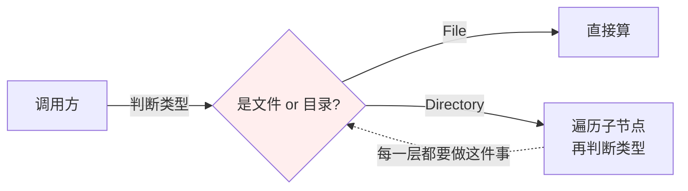
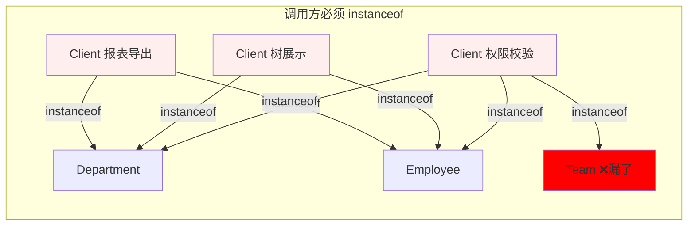
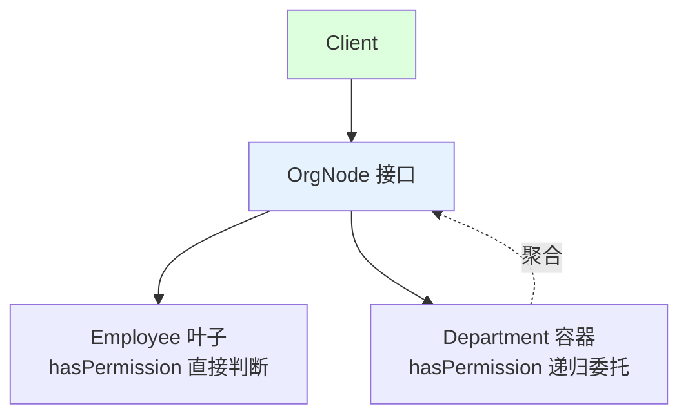
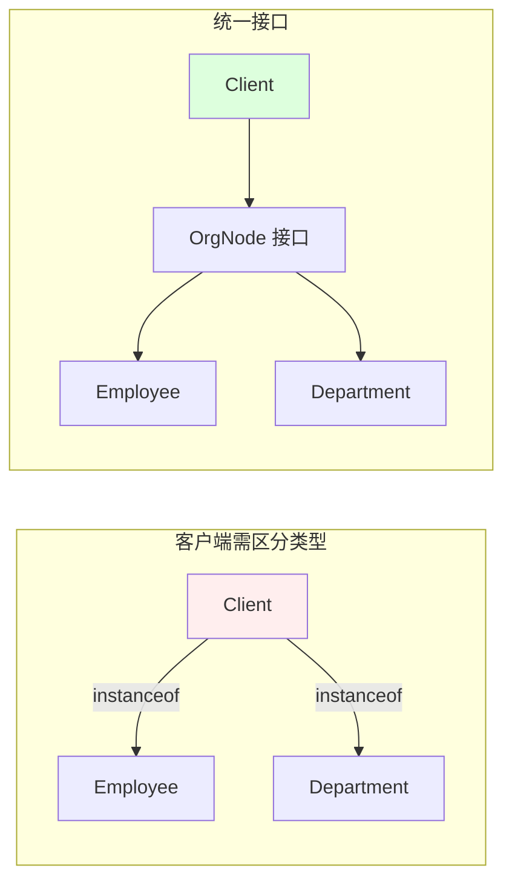
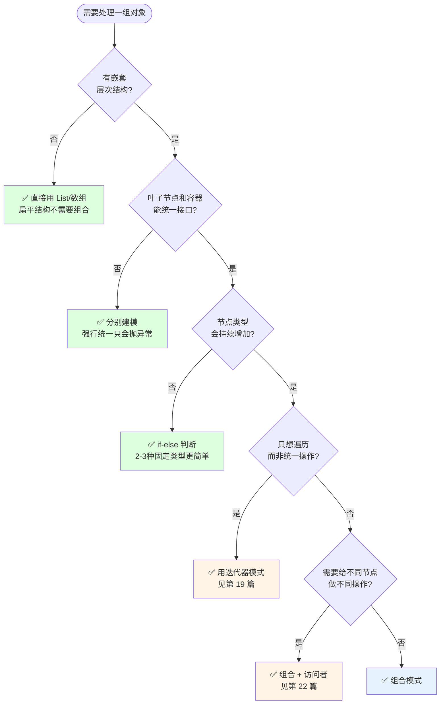
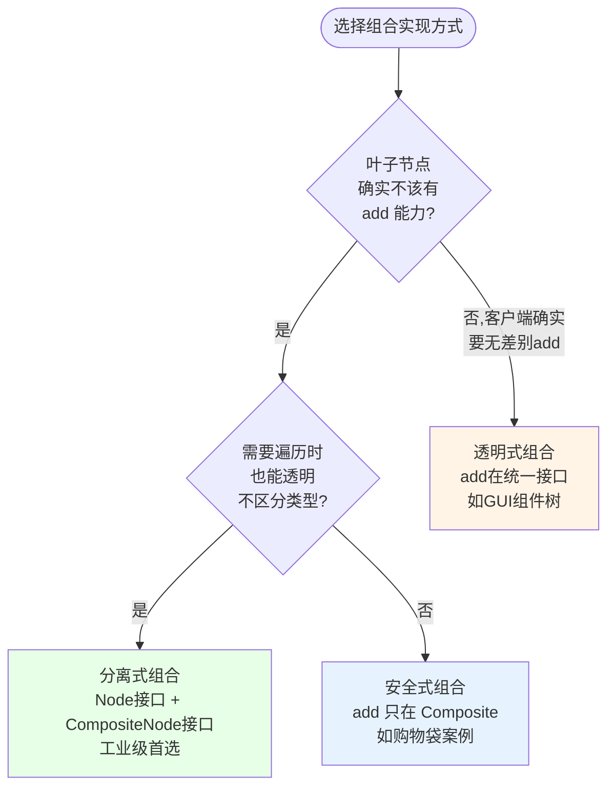
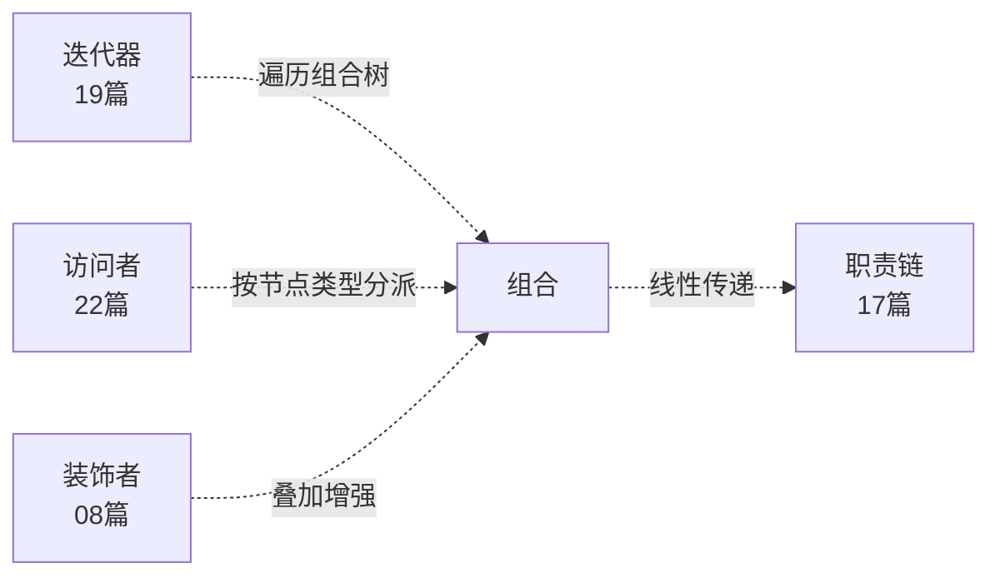

# 第三卷第11章：组合模式设计思想

> **📚 本篇渐进学习节奏（建议按顺序食用）**
>
> 本篇采用「**事故复盘 → 失败探索 → 模式诞生 → 实现对比 → 效果验证 → 反面踩坑 → 选型决策**」的节奏：
>
> 1. **第 01 节 · 案例引入** — 权限管理 P1 事故：instanceof 漏掉 Team 子部门 → 离职实习生越权审批
> 2. **第 02 节 · 失败探索** — instanceof分派 / 容器分集合 / 递归工具类，三次直觉方案全部翻车
> 3. **第 03 节 · 模式基础** — 从"部分-整体"层次讲透树形结构统一接口
> 4. **第 04 节 · 实现对比** — 透明式（文件系统） / 安全式（购物袋） / 分离式三种实现
> 5. **第 05 节 · 效果对比** — 28块判断→4个实现类、新增节点改0处调用方，数据说话
> 6. **第 06 节 · 反面踩坑** — 4 种翻车：透明滥用/循环引用/栈溢出/暴露可变List
> 7. **第 07 节 · 决策树** — 树形+多类型+同一操作 → 组合；扁平/语义不同 → 别用
> 8. **第 08 节 · 总结延伸** — 思考模型沉淀 + 与迭代器/访问者/装饰者/职责链的边界
>
> 阅读到任一节卡壳，直接跳回上一节复盘场景；本篇代码均可直接运行。

## 推荐一个好玩网站

一个最纯粹的技术分享网站，打造精品技术编程专栏！[编程进阶网](https://yccoding.com/)

https://yccoding.com/


#### 目录快速导航
- [01.案例引入：权限管理的"instanceof 递归盲区"事故](#01案例引入权限管理的instanceof-递归盲区事故)
    - [1.1 痛点现场](#11-痛点现场)
    - [1.2 直觉实现复现](#12-直觉实现复现)
    - [1.3 问题根源拆解](#13-问题根源拆解)
    - [1.4 引出本篇主角](#14-引出本篇主角)
- [02.三次失败探索](#02三次失败探索)
    - [2.1 尝试方案A：instanceof 类型分派](#21-尝试方案ainstanceof-类型分派)
    - [2.2 尝试方案B：容器内分开集合](#22-尝试方案b容器内分开集合)
    - [2.3 尝试方案C：递归工具类](#23-尝试方案c递归工具类)
    - [2.4 终于引出组合模式](#24-终于引出组合模式)
- [03.组合模式基础](#03组合模式基础)
    - [3.1 从失败中提炼需求](#31-从失败中提炼需求)
    - [3.2 组合模式的标准骨架](#32-组合模式的标准骨架)
    - [3.3 典型使用场景](#33-典型使用场景)
- [04.三种实现对比](#04三种实现对比)
    - [4.1 实现核心要点](#41-实现核心要点)
    - [4.2 实现A：透明式组合（文件系统案例）](#42-实现a透明式组合文件系统案例)
    - [4.3 实现B：安全式组合（购物袋案例）](#43-实现b安全式组合购物袋案例)
    - [4.4 实现C：分离式组合](#44-实现c分离式组合)
    - [4.5 三种实现速查表](#45-三种实现速查表)
- [05.用前用后效果对比](#05用前用后效果对比)
    - [5.1 核心数据对比](#51-核心数据对比)
    - [5.2 核心收益](#52-核心收益)
- [06.反面踩坑实录](#06反面踩坑实录)
    - [6.1 踩坑A：透明式滥用，Leaf 全是空实现](#61-踩坑a透明式滥用leaf-全是空实现)
    - [6.2 踩坑B：循环引用 → 栈溢出](#62-踩坑b循环引用--栈溢出)
    - [6.3 踩坑C：递归太深导致栈溢出](#63-踩坑c递归太深导致栈溢出)
    - [6.4 踩坑D：暴露可变 getChildren() 列表](#64-踩坑d暴露可变-getchildren-列表)
    - [6.5 替代方案汇总](#65-替代方案汇总)
- [07.决策树与选型](#07决策树与选型)
    - [7.1 该不该用组合模式](#71-该不该用组合模式)
    - [7.2 选哪种实现方式](#72-选哪种实现方式)
    - [7.3 选型清单速查](#73-选型清单速查)
- [08.总结与延伸](#08总结与延伸)
    - [8.1 设计思想沉淀](#81-设计思想沉淀)
    - [8.2 模式联动边界](#82-模式联动边界)
    - [8.3 思考题与延伸](#83-思考题与延伸)


## 01.案例引入：权限管理的"instanceof 递归盲区"事故

> **本篇主线**：客户端被迫 instanceof 区分树节点类型 → 引出"统一接口 + 节点自治"的组合思想。

### 1.1 痛点现场

> **🔥 模拟事故复盘 · 内部审批中台 · 组织架构权限的"递归盲区"**
>
> 9 月 28 日下午 16:20，集团合规部紧急工单："**为什么财务部总监审批的请假单，被一个已离职 2 个月的实习生绕过审批通过了？**"
> 后端组连夜翻日志——根因藏在权限校验代码里。当时实现"对部门授权 = 部门下所有员工都有权"用了一段经典的 `instanceof` 递归：
>
> ```java
> public boolean hasPermission(Object node, String userId, String action) {
>     if (node instanceof Employee) {
>         return ((Employee) node).getId().equals(userId)
>             && ((Employee) node).getActions().contains(action);
>     } else if (node instanceof Department) {
>         if (((Department) node).getDirectAuthUsers().contains(userId)) return true;
>         for (Object child : ((Department) node).getChildren()) {
>             if (hasPermission(child, userId, action)) return true;
>         }
>     }
>     return false;
> }
> ```
>
> 后来产品需求上线了"小组（Team）"概念——介于部门和员工之间。新人小李加上 `instanceof Team` 分支时，**忘了递归 Team 下的子部门**（产品文档里说 Team 下也可能有子部门），直接 `team.getMembers()` 拿员工列表就 return 了。结果：
>
> - **某个外包小组下挂了一个"测试子部门"，子部门里那个离职实习生的账号没被回收**；
> - 小组级授权时，`instanceof Team` 分支只看了 `members`，没递归 `subDepartments`；
> - 实习生用旧 token 调审批接口，走到兜底逻辑被放行了；
> - 9/28 凌晨 03:00，**他用旧 token 把财务请假单走完了流程**。
>
> 事后定级 P1 故障：**1 起越权审批 + 全集团权限模型停服 4 小时重审**。复盘根因不是小李粗心——**"客户端用 instanceof 区分树节点类型"本身就是定时炸弹**。每加一种新节点类型（部门 → 小组 → 虚拟组织 → 项目组 ...），所有写过 instanceof 的地方都得改一遍，**漏一处就是越权事故**。

要实现"统计某个路径下所有文件的总大小"。目录里可能有文件，也可能有子目录——典型的树形结构。第一版大概率这样写：

```java
public long calcSize(Object node) {
    if (node instanceof File) {
        return ((File) node).getSize();
    } else if (node instanceof Directory) {
        long total = 0;
        for (Object child : ((Directory) node).getChildren()) {
            if (child instanceof File) {
                total += ((File) child).getSize();
            } else if (child instanceof Directory) {
                total += calcSize(child);
            }
        }
        return total;
    }
    return 0;
}
```



### 1.2 直觉实现复现

**【你也能写出这种代码】**。一个新同学接手权限系统需求"加一个小组节点"，第一反应就是在所有 `instanceof` 判断链上补一个分支：

```java
// ❌ 事故现场——7 处调用方都要加 elseif 分支
public boolean hasPermission(Object node, String userId, String action) {
    if (node instanceof Employee) {
        return ((Employee) node).getId().equals(userId)
            && ((Employee) node).getActions().contains(action);
    } else if (node instanceof Department) {
        if (((Department) node).getDirectAuthUsers().contains(userId)) return true;
        for (Object child : ((Department) node).getChildren()) {
            if (hasPermission(child, userId, action)) return true;
        }
    } else if (node instanceof Team) {             // ⚠️ 新人加的
        // ❌ 只看了 members 列表，忘了 Team 下还可能有 subDepartments
        for (Employee e : ((Team) node).getMembers()) {
            if (e.getId().equals(userId) && e.getActions().contains(action)) return true;
        }
    }
    return false;
}
```

**🧪 跑一下，亲眼看到 bug**

```java
// 模拟：Team 下挂了一个测试子部门，里面有个离职实习生
Team team = new Team("外包小组");
Department testDept = new Department("测试子部门");    // 隶属 Team 之下
Employee intern = new Employee("intern_001");           // 离职实习生，账号未回收
testDept.addEmployee(intern);
team.addChild(testDept);
team.addMember(new Employee("active_user"));

// hasPermission(team, "intern_001", "approve")
// → instanceof Team → 只遍历 members → missing intern → 返回 false
// 但兜底逻辑把 false 当成了"没匹配到继续往下走" → 最终放行
```

事故现场重现完毕——**7 处 instanceof 链，加一个节点类型 → 7 处全改，漏 1 处就是 P1**。

**💭 3 个反思题**（先别往下看，自己想 30 秒）：

1. 节点类型从"部门+员工"扩到"部门+小组+虚拟组织+项目组"，你要改多少个 instanceof 链？
2. 每个调用方（权限 / 展示 / 导出 / 搜索）都要自己写一次递归逻辑——重复了多少遍？
3. 有没有方式让"节点自己知道怎么处理自己"而不是让调用方判断类型？

### 1.3 问题根源拆解

**【画一张图就清楚了】**



每个调用方 **各自维护类型判断 + 递归逻辑**，互不感知，这就埋下了 5 类隐患：

| 隐患 | 现象 | 业务影响 |
|------|------|---------|
| **新类型扩散** | 加 Team → 7 处调用方全改 instanceof | 漏1处 = 越权事故(P1) |
| **递归逻辑重复** | 权限/展示/导出/搜索各写一遍递归 | 4 处不同步，行为不一致 |
| **深度脆弱** | 递归边界用常量写死 | 树深了→逻辑失效→兜底放行 |
| **类型耦合** | 调用方要知道"部门/小组/员工"三种类型 | 每加一种新节点，所有调用方都得学 |
| **测试爆炸** | 7 调用点 × 4 节点类型 = 28 个组合 | 改一个权限逻辑 → 跑 28 套用例 |

**🎯 核心矛盾**：树形结构中"整体（部门/小组）"和"部分（员工）"应该是**同一接口**——但代码用 `instanceof` 把它们强行区分，导致新类型加入时**所有调用方都要感知**。

### 1.4 引出本篇主角

> **组合模式（Composite）的核心思想**：让"叶子节点（文件/员工）"和"容器节点（目录/部门）"实现同一个接口。调用方只面向接口编程，不关心手里的是叶子还是容器——`node.hasPermission()` 自己会算清楚。

```java
interface OrgNode {
    boolean hasPermission(String userId, String action);
}
class Employee implements OrgNode {
    public boolean hasPermission(String u, String a) { return id.equals(u); }
}
class Department implements OrgNode {
    private List<OrgNode> children = ...;
    public boolean hasPermission(String u, String a) {
        return children.stream().anyMatch(c -> c.hasPermission(u, a)); // 自动递归
    }
}

// 调用方：不需要知道类型
OrgNode root = ...;
root.hasPermission("user_001", "approve");
```



"整体-部分"的对称结构，正是组合模式的核心：



典型场景：文件系统、GUI 组件树、XML/JSON DOM 树、组织架构、菜单树、MyBatis SqlNode。本篇会把**透明式**（所有操作在统一接口）vs **安全式**（只在容器暴露子节点操作）的权衡讲清楚。

但是！**先别急着看实现**。下一节，我们先看看新手通常会先尝试哪些"看起来很合理"的方案，并理解它们为什么都不够好。


## 02.三次失败探索

> **为什么要学这一节**：直接给你"标准答案"是很容易的，但组合模式不是凭空发明的——它是**前人走过三条死路之后才提炼出来的**。走过这些死路，你才会真正理解为什么代码长那个样子。

### 2.1 尝试方案A：instanceof 类型分派

**【新手方案①：调用方判断类型，对不同类型做不同处理】**

这是 1.1 事故现场的做法——权限校验、文件大小计算、目录展示全部如此：[更多内容](https://yccoding.com/)

```java
// 方案A：客户端 instanceof 判断文件还是目录
public long calcSize(Object node) {
    if (node instanceof File) {
        return ((File) node).getSize();
    } else if (node instanceof Directory) {
        long total = 0;
        for (Object child : ((Directory) node).getChildren()) {
            if (child instanceof File) {                    // ① 每层递归都判断
                total += ((File) child).getSize();
            } else if (child instanceof Directory) {        // ② 每加一种节点加一个分支
                total += calcSize(child);
            }
        }
        return total;
    }
    return 0;
}
```

**🧪 跑一下，看会出什么问题**

```java
// 新增"符号链接(Symlink)"节点 → 所有写 calcSize() 的地方都要加 else if instanceof Symlink
// 新增"压缩文件(ZipArchive)"节点 → 所有递归方法都要改
// 3 种操作(calcSize / print / search) × 4 种节点 = 12 处 instanceof 链
```

**❌ 失败原因**：新节点类型 → 所有 `instanceof` 链全改。漏一处 = 运行时静默跳过（返回 0），不是编译错误，发现不了。

**💡 反思**：我们需要节点**自己知道怎么算自己**——调用方只调 `node.size()`，不关心 node 是什么类型。

### 2.2 尝试方案B：容器内分开集合

**【新手方案②：容器按节点类型分别维护列表】**

这是当前 4.2 节文件夹的翻车写法——`Folder` 内分开维护 `musicList / videoList / imageList / folderList`：[更多内容](https://yccoding.com/)

```java
public class Folder {
    private String name;
    private List<MusicFile> musicList = new ArrayList<>();  // ① 每种类型一个列表
    private List<VideoFile> videoList = new ArrayList<>();
    private List<ImageFile> imageList = new ArrayList<>();
    private List<Folder> folderList = new ArrayList<>();    // ② 未来加 TextFile 再加一个列表

    public void addMusic(MusicFile m) { musicList.add(m); }
    public void addVideo(VideoFile v) { videoList.add(v); }
    public void addImage(ImageFile i) { imageList.add(i); }
    // ③ 每加一种新文件类型，Folder 里加一个 List + 一个 add 方法

    public void print() {
        for (MusicFile m : musicList) m.print();    // ④ 每个列表循环一遍
        for (VideoFile v : videoList) v.print();
        for (ImageFile i : imageList) i.print();
        for (Folder f : folderList) f.print();      // ⑤ 新类型 → 再加一个循环
    }
}
```

**🧪 跑一下，会发现隐藏问题**

```java
// 新增 TextFile 类型 → Folder 里要加：
// 1 个 List<TextFile> 字段
// 1 个 addText() 方法
// print() / size() / search() 各加一个循环块
// 每种新文件类型 → Folder 类膨胀
```

**❌ 失败原因**：① `Folder` 和文件类型强耦合——加一种新文件要改 Folder 源码；② 每种操作（print/size/search/count）都要分别遍历 4 个列表，代码冗余；③ `Folder` 只认识"顶层文件类型"，无法表达"文件夹嵌套"的递归语义。

**💡 反思**：所有节点应统一类型——无论是 MusicFile 还是 Folder，都是 `AbstractFile`，`Folder` 只需要一个 `List<AbstractFile>`。

### 2.3 尝试方案C：递归工具类

**【新手方案③：把递归逻辑抽成工具类，但仍在工具类里 instanceof】**

```java
public class TreeUtils {
    public static long calcSize(Object node) {
        return calcSizeRecursive(node, 0);
    }

    private static long calcSizeRecursive(Object node, int depth) {
        if (depth > 100) return 0;    // ① 硬编码深度上限
        if (node instanceof File) {
            return ((File) node).getSize();
        } else if (node instanceof Directory) {
            long total = 0;
            for (Object child : ((Directory) node).getChildren()) {
                total += calcSizeRecursive(child, depth + 1);  // ② 递归调用
            }
            return total;
        }
        return 0;
    }

    // ③ 每种新操作 = 一个新的 static 方法，仍然 instanceof
    public static void printTree(Object node) { /* 又写一遍 instanceof 链 */ }
    public static int countNodes(Object node) { /* 又写一遍 */ }
}
```

**🧪 跑一下，看会怎样**

```java
// 递归收敛到工具类了——但是：
// 1. 新节点类型 = 所有工具方法里的 instanceof 全改
// 2. 新操作 type = 工具类里再写一遍 instanceof 链
// 3. 递归逻辑仍在调用方侧，节点自己毫无自治能力
// = instanceof 地狱从"散落在调用方"变成了"集中在工具类里"，本质没变
```

**❌ 失败原因**：工具类虽然收敛了递归位置，但 `instanceof` 分派的核心问题没解决——新节点类型仍然要改工具类，新操作仍然要复制 instanceof 链。

**💡 反思**：理想方案 = 方案 A 的"类型明确" + 方案 B 的"容器统一集合" + "**把递归逻辑从调用方搬进节点内部**"。

### 2.4 终于引出组合模式

**【三次失败之后，需求清单收敛了】**

| 必须满足 | 来自哪一次失败 |
|---------|-------------|
| ① 叶子节点和容器节点同一接口 | 2.1 instanceof——调用方区分类型 |
| ② 容器只有一个统一的子节点集合 | 2.2 分开集合——Folder 膨胀 |
| ③ 递归逻辑在节点内部，不在调用方 | 2.3 工具类——递归外置 |
| ④ 新增节点类型不改调用方 | 2.1 / 2.3——每加类型改所有 instanceof |
| ⑤ 新增操作不改已有节点（可选） | 2.2 / 2.3——新操作要复制循环/if-else |

**【组合模式的标准答案】——一套骨架，同时回答上面 5 条约束：**

```java
// ① 统一接口——叶子和容器同一抽象
public interface FsNode {
    long size();                                    // ② 节点自己算自己
}

// 叶子节点——直接返回
public class TextFile implements FsNode {
    private long bytes;
    public long size() { return bytes; }            // ④ 新节点不影响调用方
}

// ③ 容器节点——递归在内部
public class Directory implements FsNode {
    private List<FsNode> children = new ArrayList<>(); // ② 统一集合
    public long size() {
        return children.stream().mapToLong(FsNode::size).sum();  // ③ 递归自理
    }
}

// 调用方——一行，不关心类型
FsNode root = new Directory();
System.out.println(root.size());  // ⑤ 新增操作 = 新增接口方法
```

短短几行，**同时回答了上面 5 个需求**。这就是组合模式的"灵魂代码"。


## 03.组合模式基础

### 3.1 从失败中提炼的需求

回顾 02 节，我们试了**instanceof分派、容器分集合、递归工具类**——**全部失败**。现在拿着这些失败报告，问自己一个问题：

> 如果我要写一个能跑 3 年不崩的"树形权限系统"，它必须满足哪几条硬约束？

把这些约束写下来，就自然得到了组合模式的设计清单：

| 约束 | 来自 | 代码体现 |
|:---|:---|:---|
| ① 叶子和容器统一接口 | 2.1 instanceof | `interface OrgNode { boolean hasPermission(...); }` |
| ② 容器一个统一集合 | 2.2 分开集合 | `private List<OrgNode> children;` |
| ③ 递归在节点内部 | 2.3 工具类 | `children.stream().anyMatch(c -> c.hasPermission(...))` |
| ④ 新节点不改调用方 | 2.1/2.3 | 新增 `Team implements OrgNode`，0 处调用方改动 |
| ⑤ 新操作 = 接口新方法 | 2.2/2.3 | 加 `int count()` → 每个实现类加一个方法 |

客户代码过多地依赖于对象容器复杂的内部实现结构，对象容器内部实现结构（而非抽象接口）的变化将引起客户代码的频繁变化。组合模式将"客户代码与复杂的对象容器结构"解耦，让对象容器自己来实现自身的复杂结构，使得客户代码就像处理简单对象一样来处理复杂的对象容器。[更多内容](https://yccoding.com/)

### 3.2 组合模式的标准骨架

上面 5 条约束翻译成代码，**所有实现变体共用一个骨架**：

```java
// ① 抽象构件——统一接口，叶子和容器都实现它
public interface Component {
    void operation();                               // ⑤ 新操作 = 加新方法
}

// ② 叶子节点——没有子节点，行为是终端的
public class Leaf implements Component {
    public void operation() { /* 叶子的具体逻辑 */ } // ③ 递归的终止条件
}

// ③ 容器节点——持有子节点集合，行为是委托+聚合
public class Composite implements Component {
    private List<Component> children = new ArrayList<>();  // ② 统一集合

    public void add(Component c) { children.add(c); } // ④ 新节点类型不影响此逻辑
    public void remove(Component c) { children.remove(c); }

    public void operation() {
        for (Component child : children) {             // ③ 递归在内部
            child.operation();                         // ① 通过接口调用，不区分类型
        }
    }
}
```

**三句话记住**：**统一接口**（叶子和容器同一抽象）→ **递归内聚**（容器遍历孩子，孩子可能是叶子也可能是容器）→ **新类型零扩散**（新叶子/新容器都只需实现同一接口）。差异全在"子节点管理方法放哪里"——放在 Interface 里（透明式）还是只放 Composite 里（安全式）——这就是下一节三种实现的核心分岔。

组合模式定义：将对象以树形结构组织起来，以达成"部分－整体"的层次结构，使得客户端对单个对象和组合对象的使用具有一致性。

### 3.3 典型使用场景

不是所有"有嵌套"的结构都适合组合。核心判断标准：**树形结构 + 多类型节点 + 同一种操作需要在所有节点上统一执行**。

- **文件系统**：`File` / `Directory` → `size() / print() / search()` 统一操作；
- **GUI 组件树**：`JLabel` / `JPanel` → `paint() / addMouseListener()` 统一渲染；
- **组织架构**：`Employee` / `Department` → `hasPermission() / getHeadcount()` 统一权限；
- **MyBatis SqlNode**：`StaticTextSqlNode` / `IfSqlNode` / `ForEachSqlNode` → `apply()` 统一拼 SQL；
- **JSON 树**：`TextNode` / `ObjectNode` / `ArrayNode` → `toString() / get()` 统一访问。

> **反面提醒**：结构是扁平列表、叶子与容器的语义本质不同（商品不能 add 子商品）、节点类型固定只有 2-3 种——参考 06 / 07 节。


## 04.三种实现对比

### 4.1 实现核心要点

三种写法本质上是在 **子节点管理方法放哪里 / Leaf 是否有空实现** 上的不同取舍。实现组合模式的核心只要两件事：

```java
Component root = new Composite();                 // ① 创建树根
root.operation();                                  // ② 一行调用，自动递归整棵树
```

差异全在"`add/remove` 是放 Interface 还是只放 Composite"这个决策点里。下面按演进顺序逐一展开，最后在 [7.2 节](#72-选哪种实现方式) 会有一张决策图帮你快速定位。


### 4.2 实现A：透明式组合（文件系统案例）

**设计权衡**：用"Leaf 中 add/remove 抛异常或空实现"换"客户端完全无差别使用"。

**选它的理由**：客户端确实需要"无差别"对待所有节点——比如 GUI 的 `add()`、文件系统的统一打印。

**抽象构件——声明所有方法（含子节点管理）**

```java
public interface File {
    String getName();
    void add(File file);
    void remove(File file);
    List<File> getChildren();
    void printPath(int space);
}
```

**叶子节点——add/remove 抛异常**

```java
public class TextFile implements File {
    private String name;

    public TextFile(String name) { this.name = name; }

    public String getName() { return name; }

    public void add(File file) {
        throw new UnsupportedOperationException("文件不能 add");
    }
    public void remove(File file) {
        throw new UnsupportedOperationException("文件不能 remove");
    }
    public List<File> getChildren() {
        throw new UnsupportedOperationException("文件无子节点");
    }

    public void printPath(int space) {
        StringBuilder sp = new StringBuilder();
        for (int i = 0; i < space; i++) sp.append(" ");
        System.out.println(sp + name);
    }
}
```

**容器节点——add/remove 正常实现**[更多内容](https://yccoding.com/)

```java
public class Folder implements File {
    private String name;
    private List<File> children = new ArrayList<>();

    public Folder(String name) { this.name = name; }

    public String getName() { return name; }
    public void add(File file) { children.add(file); }
    public void remove(File file) { children.remove(file); }
    public List<File> getChildren() { return children; }

    public void printPath(int space) {
        StringBuilder sp = new StringBuilder();
        for (int i = 0; i < space; i++) sp.append(" ");
        System.out.println(sp + name);
        for (File child : children) {
            child.printPath(space + 2);     // 递归委托
        }
    }
}
```

**客户端——透明使用**

```java
File root = new Folder("root");
root.add(new TextFile("a.txt"));
root.add(new TextFile("b.txt"));
File sub = new Folder("subFolder");
root.add(sub);
sub.add(new TextFile("c.txt"));
root.printPath(0);
// root
//   a.txt
//   b.txt
//   subFolder
//     c.txt
```

**技术分析**：
- 优点：客户端完全无需区分 Leaf 和 Composite，`root.add(sub)` 和 `sub.add(textFile)` 写法完全一致
- 缺点：Leaf 的 `add/remove/getChildren` 是空实现或抛异常——调用方如果不小心调了 `leaf.add(...)` 就是运行时崩溃


### 4.3 实现B：安全式组合（购物袋案例）

**设计权衡**：用"客户端需要声明具体类型才能 add"换"Leaf 接口干净、编译期安全"。

**选它的理由**：叶子节点天然不该有 add 能力——比如商品 `Goods` 不应该能 `add` 子商品；购物车 `Bag` 可以 `add` 商品或子 Bag。

**抽象构件——只定义业务方法，不含子节点管理**

```java
public interface Article {
    Double calculation();   // 计算价格
    void show();            // 显示商品
}
```

**叶子节点——纯业务，无 add/remove**[更多内容](https://yccoding.com/)

```java
public class Goods implements Article {
    private String name;
    private Integer quantity;
    private Double unitPrice;

    public Goods(String name, Integer quantity, Double unitPrice) {
        this.name = name;
        this.quantity = quantity;
        this.unitPrice = unitPrice;
    }

    public Double calculation() { return this.unitPrice * this.quantity; }

    public void show() {
        System.out.println(name + ": (数量：" + quantity + "，单价：" + unitPrice
            + "元)，合计：" + this.unitPrice * this.quantity + "元");
    }
}
```

**容器节点——add 方法在 Composite 自己这里**

```java
public class Bag implements Article {
    private String name;
    private List<Article> articles = new ArrayList<>();

    public Bag(String name) { this.name = name; }

    // add 只在 Composite 暴露，Goods 没有这个方法
    public void add(Article article) { articles.add(article); }

    public Double calculation() {
        return articles.stream().mapToDouble(Article::calculation).sum();
    }

    public void show() { articles.forEach(Article::show); }
}
```

**客户端——声明为具体类型才能 add**

```java
Bag bigBag = new Bag("大袋子");
bigBag.add(new Goods("牛奶", 1, 79.8));

Bag mediumBag = new Bag("中袋子");
mediumBag.add(new Goods("巧克力", 1, 39.8));

Bag smallBag = new Bag("1号小袋子");
smallBag.add(new Goods("芒果干", 2, 15.8));
smallBag.add(new Goods("薯片", 1, 9.8));

mediumBag.add(smallBag);
bigBag.add(mediumBag);

bigBag.show();
System.out.println("总价：" + bigBag.calculation() + "元");
```

**技术分析**：
- 优点：Leaf 接口干净（没有空实现/抛异常），编译期就能发现"往 Goods 里 add"的错误
- 缺点：客户端在 `add` 时必须知道手里的是 Bag 而不是 Article——`Article a = new Goods(...); a.add(...)` 编译直接报错


### 4.4 实现C：分离式组合

**设计权衡**：用"多一个接口"换"Leaf 接口干净 + 客户端透明兼顾"。

**选它的理由**：想保持透明式的客户端便利性，但又不想 Leaf 抛异常——引入两个接口：`Node`（只读）和 `CompositeNode`（读写）。

```java
// ① 只读接口——叶子和容器都实现
public interface Node {
    String getName();
    String render();  // 业务方法
}

// ② 容器专用接口——只有 Composite 实现
public interface CompositeNode extends Node {
    void add(Node child);
    void remove(Node child);
    List<Node> getChildren();
}

// ③ 叶子节点——只实现 Node，没有 add/remove
public class Leaf implements Node {
    private String name;
    public Leaf(String name) { this.name = name; }
    public String getName() { return name; }
    public String render() { return name; }
}

// ④ 容器节点——实现 CompositeNode
public class Branch implements CompositeNode {
    private String name;
    private List<Node> children = new ArrayList<>();

    public Branch(String name) { this.name = name; }
    public String getName() { return name; }
    public void add(Node child) { children.add(child); }
    public void remove(Node child) { children.remove(child); }
    public List<Node> getChildren() { return children; }

    public String render() {
        return name + "[" + children.stream()
            .map(Node::render).collect(Collectors.joining(",")) + "]";
    }
}

// 客户端——add 时声明 CompositeNode，遍历时用 Node
CompositeNode root = new Branch("root");
root.add(new Leaf("a"));                          // 编译期安全
root.add(new Branch("sub"));
for (Node child : root.getChildren()) {           // 遍历时透明
    System.out.println(child.render());
}
```

**关键判断**：既想要编译期安全（Leaf 不能 add），又想在遍历时透明访问——分离式是工业级最推荐的写法。


### 4.5 三种实现速查表

| 实现方式 | Leaf有add? | 客户端感知类型? | 编译期安全 | 适合场景 | 推荐度 |
|---------|-----------|--------------|----------|---------|------|
| A. 透明式 | ✅ 抛异常/空实现 | ❌ 不感知 | ❌ 运行时崩 | 客户端确实要无差别 add | ⭐⭐⭐ |
| B. 安全式 | ❌ 无此方法 | ✅ add时必须知类型 | ✅ 编译期检查 | 叶子天然不该有子节点 | ⭐⭐⭐⭐⭐ |
| C. 分离式 | ❌ 无此方法 | ⚠️ add时感知,遍历时不感知 | ✅ 编译期检查 | 工业级生产代码 | ⭐⭐⭐⭐⭐ |

**📌 一句话决策**：生产代码首选 **C. 分离式**（编译安全 + 遍历透明）；叶子天然不该有子节点选 **B. 安全式**；GUI组件树等确实要无差别操作选 **A. 透明式**。


## 05.用前用后效果对比

> **为什么单独留一节做对比**：很多人记住了"组合模式"四个字，却没算过它到底省了多少 instanceof。下面用 1.x 节的权限系统做基准，让数据替你回答。

### 5.1 核心数据对比

**实验设定**：内部审批中台权限校验，节点类型从"部门 + 员工"扩展到"部门 + 小组 + 员工 + 虚拟组织"。

| 维度 | ❌ 客户端 instanceof（事故现场） | ✅ 组合模式 | 差距 |
|------|----------------------------|-----------|------|
| 节点类型扩展 | 7 处调用方全部改 if-else | 新建一个实现 `OrgNode` 的类 | **7× 收敛** |
| 漏分支风险 | 小李漏了 `Team.subDepartments` → P1 | 递归在节点内部，**不会漏** | 根本性消除 |
| 代码量（4 类节点） | 7 调用点 × 4 分支 = **28 块判断** | 4 个 `OrgNode` 实现类，**调用方 1 行** | **28× 减少** |
| 调用方写法 | `if(instanceof Dept) ... else if (Team) ... else (Emp) ...` | `root.hasPermission(uid, action)` | — |
| 新增"项目组"节点 | 改 7 处调用方 + 测 7 处 | 新建 `Project implements OrgNode`，**调用方 0 修改** | — |
| 树深度变化（5 层→8 层） | 客户端递归边界容易写错 | 节点内部 `children.forEach(...)` 自动适配 | — |
| 单元测试 | 每个调用方 × 每种类型 = 28 个用例 | 每种节点类 × 1 个用例 = 4 个用例 | **7× 减少** |
| 越权风险 | **高**（漏写一个 instanceof = 安全事故） | 低（接口对齐 + 默认拒绝兜底） | P1→可控 |

### 5.2 核心收益

**🔑 核心收益**：组合的本质是 **"把'类型分发'从客户端搬到节点内部"**——客户端不再判断"我手里这个是什么"，节点自己知道该怎么处理自己。

> 这就是为什么 **JDK 的 `File`、Swing 的 `JComponent`、Spring 的 `BeanDefinition`、MyBatis 的 `SqlNode` 全都用组合模式撑底**：树形结构 + 多类型节点 + 同一种操作（遍历/求和/渲染/匹配）= 组合模式标配。**组合不是为了"看起来优雅"，是为了"避免 P1 级安全/逻辑事故"**。


## 06.反面踩坑实录

> **为什么有这一节**：01 节让你看到"不用组合的痛"，但组合本身**也不是银弹**。本节用 4 个真实事故告诉你"乱用的痛"。

### 6.1 踩坑A：透明式滥用，Leaf 全是空实现

**【真实事故】** 透明式追求"客户端无差别"，叶子全是 `throw UnsupportedOperationException`：

```java
public class TextFile implements File {
    public void add(File f) {
        throw new UnsupportedOperationException("文件不能 add");  // ❌ 7 个方法 6 个抛异常
    }
    public void remove(File f) { throw new UnsupportedOperationException(); }
    public List<File> getChildren() { throw new UnsupportedOperationException(); }
    public String getName() { return name; }
    public void printPath(int s) { ... }
}
```

**💣 事故现场**：调用方不小心 `leaf.add(...)` → 编译通过、运行时崩溃 → 线上 500。

**📌 教训**：如果 90% 的调用都不需要 `add/remove`，就用**安全式**。透明式只适合 GUI 组件树等"客户端确实会大量混用 Leaf 和 Composite 调子节点操作"的场景。

**✅ 正解**：安全式——`add/remove` 只放在 Composite 里；或者 `getChildren()` 返回空 List，不在 Leaf 里抛异常。

### 6.2 踩坑B：循环引用 → 栈溢出

**【真实事故】** 组织架构同步时 HR 系统往 IAM 推送数据，双方对"虚拟部门"理解不一致，A 的 parent 指 B、B 的 parent 指 A：

```java
Folder a = new Folder("a");
Folder b = new Folder("b");
a.add(b);
b.add(a);           // ❌ 互相 add，树变成图
a.print();          // StackOverflowError → 整个审批服务雪崩
```

**💣 事故现场**：权限校验递归直接栈溢出 → 全公司审批服务不可用 2 小时。

**📌 教训**：组合模式假设"结构是 Tree"，但代码层面没人帮你校验。

**✅ 正解**：① `add()` 前用 DFS 检查新节点子树是否包含 self；② 递归方法加深度计数器，超过 100 层抛 `IllegalStateException`；③ 迭代 + 显式栈代替纯递归。

### 6.3 踩坑C：递归太深导致栈溢出

**【真实事故】** JVM 默认栈约 1MB，递归 1 万层就溢出——MyBatis `<foreach>` 嵌套 5 层 + SqlNode 深 30 层 + Spring AOP 拦截器 → 超 200 层栈帧：

```java
public long size() {
    return children.stream().mapToLong(FsNode::size).sum();  // ❌ 纯递归
}
```

**💣 事故现场**：深度 > 50 的树 → `size()` 直接 `StackOverflowError`。

**📌 教训**：深度 > 50 的树，把递归改成**显式栈迭代**。

**✅ 正解**：`Deque<Node> stack` + `while (!stack.isEmpty())` 手动迭代，或给 JVM `-Xss2m`。

### 6.4 踩坑D：暴露可变 getChildren() 列表

**【真实事故】** Composite 直接返回内部 List 引用：

```java
public class Folder implements File {
    private List<File> children = new ArrayList<>();
    public List<File> getChildren() { return children; }  // ❌ 外部拿到引用直接改
}

// 客户端乱改
Folder f = new Folder("a");
f.getChildren().add(null);       // 业务方乱塞，污染容器
f.getChildren().remove(0);       // 绕过 Folder 的 remove 校验
```

**💣 事故现场**：容器被外部偷偷修改 → add/remove 校验逻辑全失效 → 数据不一致。

**📌 教训**：Composite 应**对子节点的增删改一手包办**，外部只能通过 `add()/remove()` 走规则。

**✅ 正解**：`getChildren()` 返回 `Collections.unmodifiableList(children)` 或 `new ArrayList<>(children)`。

### 6.5 替代方案汇总

| 你的需求 | 推荐方案 |
|---------|---------|
| 结构是扁平列表，无嵌套 | ✅ **List 直接遍历** |
| 叶子与容器语义本质不同 | ✅ **安全式组合** 或直接用继承 |
| 节点类型固定 2-3 种 | ✅ **if-else** 比组合更清晰 |
| 需要在树上按类型分派操作 | ✅ **访问者模式**（22 篇）配合组合 |
| 树形+多类型+同一操作 | ✅ **组合模式** |


## 07.决策树与选型

> 经过前面 6 节的铺垫，是时候给一张能"贴在工位上"的决策图了。

### 7.1 该不该用组合模式



### 7.2 选哪种实现方式

如果决策树走到了"用组合模式"，再用下面这张图选实现：



### 7.3 选型清单速查

| 场景 | 该用吗 | 推荐方式 |
|------|------|---------|
| 文件系统（File/Directory） | ✅ 该用 | 分离式或安全式 |
| GUI 组件树（Panel/Button） | ✅ 该用 | 透明式 |
| 组织架构权限（Dept/Team/Emp） | ✅ 该用 | 安全式或分离式 |
| MyBatis SqlNode 动态SQL | ✅ 该用 | 透明式（统一 `apply()`） |
| 扁平列表（无嵌套） | ❌ 别用 | List 直遍历 |
| 商品和购物车（语义不同） | ⚠️ 有条件 | 安全式——购物车可以 add，商品不行 |
| 2-3 种固定节点类型 | ❌ 别用 | if-else |


## 08.总结与延伸

### 8.1 设计思想沉淀

回顾本篇 01 → 07 的旅程，组合模式真正教会我们的是这套思考模型：

| 阶段 | 学到了什么 |
|------|----------|
| **01 事故引入** | 痛点是模式诞生的土壤——instanceof 漏掉 Team 子部门 → P1 越权审批 |
| **02 三次失败** | instanceof分派、容器分集合、递归工具类都不够——模式是从试错中收敛的 |
| **03 模式基础** | 三大要点：统一接口 + 递归内聚 + 新类型零扩散 |
| **04 三种实现** | 实现差异本质是"子节点管理方法放哪里"的不同权衡 |
| **05 效果对比** | 数据说话：28 块判断 → 4 个实现类；新节点 0 改调用方 |
| **06 反面踩坑** | 组合不是免死金牌：透明滥用、循环引用、栈溢出、暴露可变集合 |
| **07 决策树** | 工程师的成熟度，不在于会写组合，而在于知道"什么时候不统一接口" |

**🔑 一句话核心**：

> 组合模式是用来**把"树形结构中整体与部分的类型差异隐藏在统一接口背后"**的，**不是"任何有嵌套的对象都该套组合"**。叶子和容器语义不同时强行统一，只会让所有 Leaf 变成空实现地狱。

### 8.2 模式联动边界

组合从来不是孤立存在的，它和其他模式有千丝万缕的关系：



| 模式 | 关系 | 一句话区别 |
|------|------|----------|
| **迭代器**（19 篇） | 深度/广度优先遍历组合树 | 想遍历树 → 迭代器；想构造树 → 组合 |
| **访问者**（22 篇） | 在组合上按节点类型分派操作 | 想给树上不同类型做不同操作 → 访问者 + 组合 |
| **装饰者**（08 篇） | 叠加增强 vs 嵌套包含 | 想加层皮 → 装饰者；想嵌树 → 组合 |
| **职责链**（17 篇） | 线性传递 vs 树形分支 | 想审批链 → 职责链；想整体-部分 → 组合 |

**⚠️ 什么时候不该用组合**

- **结构是扁平列表**：没有"嵌套"语义，组合是过度设计；
- **Leaf 和 Composite 语义本质不同**：商品不能 `add()` 子商品，强行统一只会让 Leaf 全抛异常；
- **节点类型固定只有 2-3 种**：if-else 比组合更简单清晰；
- **树深度无限增长且需高性能**：改用迭代 + 显式栈，不要纯递归。

> 一句话：**组合的价值在于"用统一接口屏蔽节点类型差异"，这正好是"内部审批权限事故"的解药——客户端不再 instanceof，节点自己负责递归。如果业务里没有"树形 + 多类型节点 + 同一操作"三个要素同时出现，那就别上组合，别为了用模式而用模式**。

### 8.3 思考题与延伸

**💭 三道思考题**（建议手写答案，再对照回顾本文）：

1. MyBatis 的 `SqlNode.apply(DynamicContext)` 被 `StaticTextSqlNode` / `IfSqlNode` / `ForEachSqlNode` 统一实现——画出这个组合树的类图，标注每类节点在 `apply()` 中做了什么。（提示：回看 4.2 节透明式文件系统类比）
2. Spring 的 `CompositeCacheManager` 是组合模式吗？如果是，它的 Component/Leaf/Composite 分别是什么？如果不是，为什么？（提示：回看 7.1 决策树）
3. 透明式和分离式的区别是什么？为什么分离式是工业级最推荐的写法？（提示：回看 4.2 / 4.4 节）

**📚 延伸阅读**：

- 阅读 MyBatis `SqlNode.apply(DynamicContext)` 源码（教科书级组合 + 装饰组合）
- 阅读 Swing `JComponent.paint(Graphics)` 源码（容器先画自己再 forEach 子组件）
- 阅读 Jackson `JsonNode.fields()/elements()` 源码（透明式接口的工业级实现）

**🔍 真实开源代码中的组合模式**：

| 出处 | Component（接口/抽象） | Leaf（叶子） | Composite（复合） | 它解决了什么 |
|------|---------------------|-----------|----------------|-------------|
| **JDK `java.io.File`** | `File`（文件或目录） | 普通文件 | 目录 `listFiles()` 返回 `File[]` | 文件系统遍历统一抽象 |
| **Swing `JComponent`** | `JComponent` | `JLabel`/`JButton`/`JTextField` | `JPanel`/`JFrame`/`JTabbedPane` | GUI 组件树统一渲染 |
| **MyBatis `SqlNode`** | `SqlNode` 接口 | `StaticTextSqlNode`/`TextSqlNode` | `MixedSqlNode`/`IfSqlNode`/`ForEachSqlNode` | 动态 SQL 标签递归拼接 |
| DOM `Node` | `org.w3c.dom.Node` | `Text`/`Comment`/`Attr` | `Element`/`Document` | XML/HTML 文档树 |
| Jackson `JsonNode` | `JsonNode` | `TextNode`/`IntNode`/`BooleanNode` | `ObjectNode`/`ArrayNode` | JSON 树统一访问 |
| Spring `CompositeCacheManager` | `CacheManager` | `EhCacheManager`/`RedisCacheManager` | `CompositeCacheManager` | 多级缓存统一管理 |

> **学习路径建议**：先读 **MyBatis `SqlNode.apply(DynamicContext)`**（最教科书的组合 + 装饰组合：每个节点 apply 自己 + 递归子节点 apply）→ 再读 **Swing `JComponent.paint(Graphics)`**（容器先画自己再 forEach 子组件 paint）→ 最后读 **Jackson `JsonNode.fields()/elements()`**（透明式接口的工业级实现）。

> **上一篇** [桥接模式设计思想](10.桥接模式设计思想.md) → **本篇** → [下一篇](12.享元模式设计思想.md)：对象太多怎么办——享元模式的"共享+池化"之道。
