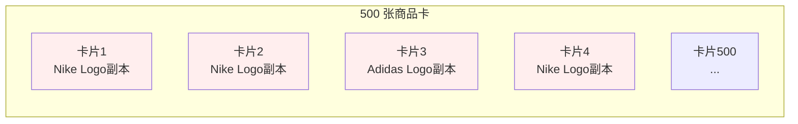
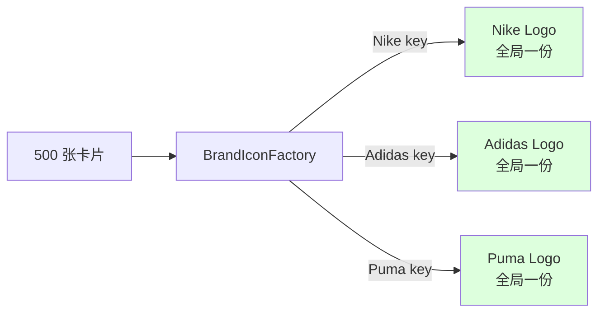
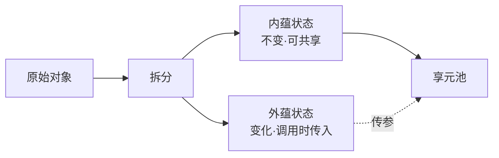
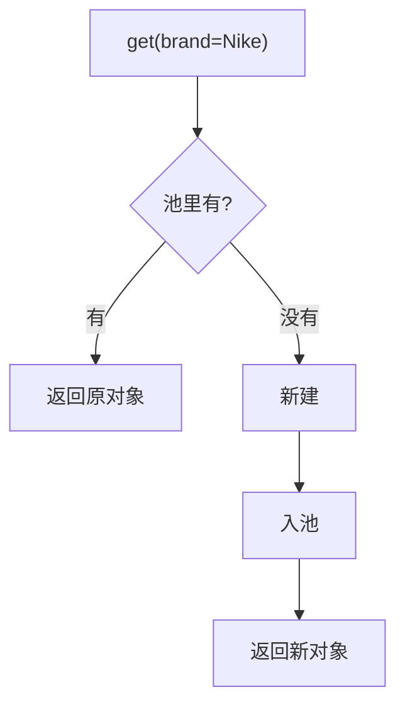
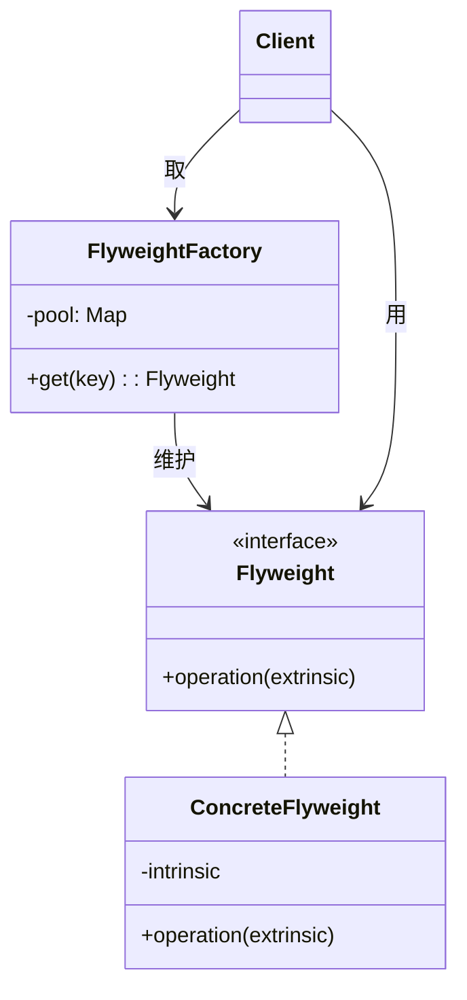
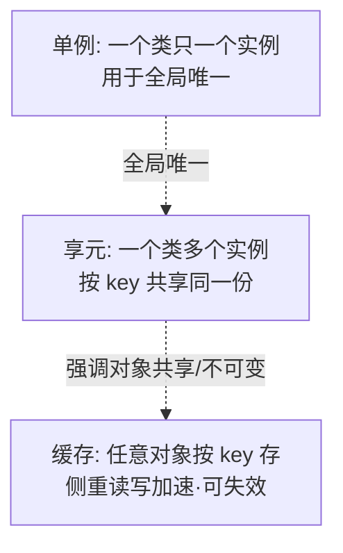

# 第三卷第12章：享元模式设计思想

> **📚 本篇渐进学习节奏（建议按顺序食用）**
>
> 1. **第 01 节 · 案例引入** — 双 11 大促首页 OOM 事故（同一品牌 Logo 被 new 几百次撑爆堆内存）
> 2. **第 02 节 · 模式基础** — "内蕴 + 外蕴"两态分离的核心思想
> 3. **第 03 节 · 模式原理** — 朴素 new vs 享元池的内存差异演示
> 4. **第 04 节 · 模式结构** — Flyweight / ConcreteFlyweight / Factory / Client 四角色
> 5. **第 05 节 · 实战案例** — 商品卡片图标享元 + JDK 内置享元（Integer/String/Boolean）
> 6. **第 06 节 · 优缺分析** — "节省内存"与"必须不可变"的两面性，与单例/缓存/对象池的边界
> 7. **第 07 节 · 踩坑 + 联动** — 4 种翻车姿势 + 与原型/单例/缓存/对象池的精准切割
>
> 阅读到任一节卡壳，直接跳回上一节复盘场景；本篇代码均可直接运行。

#### 目录介绍

- [01.案例引入与思考](#01案例引入与思考)
  - [1.1 痛点场景](#11-痛点场景)
  - [1.2 它哪里不舒服](#12-它哪里不舒服)
  - [1.3 引出本篇主角](#13-引出本篇主角)
- [02.享元模式基础](#02享元模式基础)
  - [2.1 模式产生动机](#21-模式产生动机)
  - [2.2 享元模式定义](#22-享元模式定义)
  - [2.3 关键概念拆解](#23-关键概念拆解)
  - [2.4 何时考虑享元](#24-何时考虑享元)
- [03.享元模式原理](#03享元模式原理)
  - [3.1 朴素实现问题](#31-朴素实现问题)
  - [3.2 享元改造思路](#32-享元改造思路)
- [04.享元模式结构](#04享元模式结构)
  - [4.1 结构图展示](#41-结构图展示)
  - [4.2 角色说明](#42-角色说明)
- [05.享元模式案例](#05享元模式案例)
  - [5.1 商品卡片享元](#51-商品卡片享元)
  - [5.2 内存效果对比](#52-内存效果对比)
  - [5.3 JDK内置享元](#53-jdk内置享元)
- [06.享元模式分析](#06享元模式分析)
  - [6.1 享元模式优点](#61-享元模式优点)
  - [6.2 享元模式缺点](#62-享元模式缺点)
  - [6.3 享元单例缓存](#63-享元单例缓存)
  - [6.4 模式联动边界](#64-模式联动边界)
- [07.享元模式总结](#07享元模式总结)
  - [7.1 一句话记忆](#71-一句话记忆)
  - [7.2 适用环境分析](#72-适用环境分析)
  - [7.3 进阶思考题](#73-进阶思考题)
  - [7.4 踩坑实录与开源案例](#74-踩坑实录与开源案例)

---

## 01.案例引入与思考

> **本篇主线**：大量"几乎一样"的对象挤爆内存

### 1.1 痛点场景

**🔥 模拟事故复盘 · 双 11 大促首页 · "同一个 Nike Logo 被 new 了 47 万次"**
>
> 11 月 11 日 00:08，大促开门红 8 分钟后，APP 首页瀑布流接口 RT 从 80ms 飙升到 2.3s，**Android 客户端大量 `OutOfMemoryError`** 用户群崩溃，运营同学截图甩进群："**首页打开就闪退！**"
> 监控大盘显示 JVM Old 区峰值 1.8GB（容器限额 2GB），Full GC 间隔从 30 分钟缩短到 **40 秒一次**，每次停顿 800ms。
>
> 抓 heap dump 一看，前两名怪兽：
>
> - **`BrandIcon` 实例数：473,621 个**，占用 **412MB**；
> - **`CategoryIcon` 实例数：521,034 个**，占用 **287MB**；
>
> 但 SQL 查出来——**全平台品牌只有 327 个、品类只有 89 个**。**也就是说同一个 Nike Logo 被 new 了 1400+ 次，同一个"运动鞋"图标被 new 了 5800+ 次**。
>
> 翻代码，根因是组里某个新人在大促前 3 天为了"加快首屏渲染"做了一次"激进优化"——把原本的 `IconCache.get(brandId)` 改成了直接 `new BrandIcon(brandId)`：
>
> ```java
> // 优化前（线上稳定版本）
> for (Goods g : list) {
>     card.brandIcon = IconCache.get(g.brandId);   // 缓存命中,全局共享
>     card.catIcon   = IconCache.get(g.catId);
> }
>
> // 大促前"优化"版本（事故元凶）
> for (Goods g : list) {
>     card.brandIcon = new BrandIcon(g.brandId);   // ❌ 每个商品 new 一份
>     card.catIcon   = new CategoryIcon(g.catId);  // ❌ 加载图片 100KB
> }
> ```
>
> 新人的"理由"听起来还挺有道理：
>
> - "缓存有锁，并发高时会争用，干脆每个商品自己 new，无锁更快"；
> - "测试环境压测过 100 个商品，没问题"；
> - "Code Review 时只有 PR 模板，没人盯到这一行"。
>
> 但他没想到的是：
>
> - 单个商品列表 500 条 × 用户并发 5000 = **同时存在 250 万个 `BrandIcon` 对象**；
> - 每个 `BrandIcon` 持有 **100KB byte[] 图片数据**（解码后位图）→ 250 万 × 100KB = **250GB 理论值**；
> - JVM 撑不住直接 OOM 重启，K8s Pod 全部 CrashLoopBackOff，**首页接口宕机 23 分钟**。
>
> 事后定级 P0 事故：
>
> - **业务影响**：开门红 23 分钟首页瘫痪，估算 GMV 损失 1200W+；
> - **技术影响**：紧急回滚到稳定版本 + 全平台 5 处类似"绕过缓存的 `new`"统一巡检；
> - **团队影响**：新人被踢出大促保障组，TL 季度绩效降档，CTO 全员邮件通报。
>
> 复盘根因不是"那行代码写错了"——而是 **"系统里存在大量内容相同、可共享的对象，但工程师没意识到要用享元"**。如果在新人 PR 时有一条静态规则**"图标/字体/Token 这类有限种类的不可变对象，必须走 Factory 不能 new"**，这个 P0 不会发生。

电商首页瀑布流一次拉取 500 个商品卡片，每个卡片都展示品牌 Logo、品类图标、店铺等级徽章。第一版实现：

```java
class GoodsCard {
    BrandIcon brandIcon;   // 每张卡片都 new 一个
    CategoryIcon catIcon;  // 每张卡片都 new 一个
    LevelBadge   badge;    // 每张卡片都 new 一个
    // ... 展示用的坐标、价格、标题（每张独一无二）
}

// 拉 500 条
for (Goods g : list) {
    GoodsCard card = new GoodsCard();
    card.brandIcon = new BrandIcon(g.brandId);  // 加载图片 100KB
    card.catIcon   = new CategoryIcon(g.catId); // 加载图片 50KB
    card.badge     = new LevelBadge(g.shopLv);  // 加载图片 30KB
    cards.add(card);
}
```

500 张卡片 ≈ 500 × (100 + 50 + 30) KB = **90 MB**。但品牌 Logo 实际只有十几个品牌——同一个品牌 Logo 被 new 了几十遍。



### 1.2 它哪里不舒服

- ❌ **内存暴涨**：一个图标 100KB × 500 份 = 50MB，但真正的"品牌种类"可能只有 10 个；
- ❌ **GC 压力**：滚动刷新时，几千个"一次性对象"频繁创建销毁，GC 停顿明显；
- ❌ **启动慢**：初始化每张卡片都要重新解码图片/加载纹理；
- ❌ **缓存散落**：图片解码结果没人统一管理，各个业务各自为战；
- ❌ **性能 vs 代码可读性冲突**：如果手动在每处 `if (cache.has) ...` 又会把缓存逻辑散落到各处。

### 1.3 引出本篇主角

> **享元模式（Flyweight）的核心思想**：把对象拆成**内部状态（可共享的、不变的）**和**外部状态（每次使用都不同的）**。内部状态只在全局保留一份，由\"享元工厂\"按 key 复用；外部状态由调用方按需传入。

```java
// 内部状态：Logo 图片本身（可共享）
// 外部状态：卡片上的坐标、大小（每次传入）
class BrandIcon {         // 享元
    private final Image img; // 内部状态：图片本身
    void draw(int x, int y, int w, int h) { ... } // 外部状态：绘制位置
}

class BrandIconFactory {  // 享元工厂
    private static Map<String, BrandIcon> pool = new HashMap<>();
    static BrandIcon get(String brandId) {
        return pool.computeIfAbsent(brandId, BrandIcon::new);
    }
}

// 使用
for (Goods g : list) {
    BrandIcon icon = BrandIconFactory.get(g.brandId); // 复用
    icon.draw(x, y, 48, 48); // 外部状态
}
```



Java 里的 `Integer.valueOf(-128..127)` 缓存、`String.intern()` 字符串常量池、Android `View` 的 Drawable 缓存——都是享元的实战版本。

**🎯 用前用后效果对比（衔接 1.1 双 11 OOM 事故）**

基线：双 11 大促首页瀑布流，单页 500 商品 × 5000 并发用户 × 平台 327 品牌：

| 维度 | ❌ 朴素 new（事故现场） | ✅ 引入享元模式 |
|------|----------------------|---------------|
| `BrandIcon` 实例数 | **47.3 万**（每个商品 new 一份） | **327**（每个品牌一份） |
| 图标内存占用 | **412 MB** | **~33 MB**（327 × 100KB） |
| Full GC 间隔 | 40 秒一次（停顿 800ms） | 30 分钟一次（停顿 80ms） |
| Old 区峰值 | 1.8 GB（接近 OOM） | 350 MB |
| 首屏渲染 RT | 2.3 s（OOM 后闪退） | 80 ms |
| 单实例创建成本 | 每次解码图片 ~5 ms | 池命中 0.01 μs |
| 线程安全 | new 出来的实例彼此独立，但**无意义浪费** | 享元天然不可变，**线程安全免费送** |
| 业务影响 | **P0 · GMV 损失 1200W+** | 平稳度过开门红 |
| 代码侵入度 | 看似简单（直接 new） | 多一层 `Factory.get()` 调用 |
| 内存随并发增长 | **线性爆炸**（5000 并发 → 250 万实例） | **常数级**（永远只有 327 个） |

> **结论**：享元的本质是 **"识别系统中的有限种类不可变对象，让它们活得更久、被更多人共享"**——`BrandIcon` 全平台只有 327 种、`Integer` 在 -128~127 间只有 256 种、`String` 字面量在编译期固定、棋盘格颜色只有黑白两种、字符渲染的字形只有 ASCII + 常用汉字 ~7000 种。**所有这些"枚举值密度高、对象内容大、创建成本高"的场景，都该用享元**。**这就是为什么 JDK `Integer.valueOf` 在 -128~127 间不 new、`String.intern()` 走常量池、Apache POI 的 `XSSFFont` 共享字体对象、Tomcat 的 `Constants` 共享 HTTP 头字符串——节流的不是单个对象的几 KB，而是对象数 × 并发数后的几 GB**。

---

## 02.享元模式基础

### 2.1 模式产生动机

当系统中存在大量**结构相同、内容相同**或**结构相同、内容不同但部分字段相同**的对象时，逐个 new 既浪费内存又拖慢创建。享元模式让这些对象的"共有部分"只保留一份。

### 2.2 享元模式定义

运用共享技术有效地支持大量细粒度对象的复用。被共享的对象称为**享元（Flyweight）**。



### 2.3 关键概念拆解

| 概念 | 含义 | 电商案例 |
|------|------|----------|
| 内蕴状态 | 与上下文无关、可共享 | 品牌图标 URL、品类名、店铺等级图标 |
| 外蕴状态 | 与上下文有关、不可共享 | 商品价格、库存、卡片位置 |
| 享元工厂 | 维护享元池，按 key 取/造 | `BrandIconFactory.get("Nike")` |

### 2.4 何时考虑享元

- 系统有**大量相似对象**（一般 ≥ 千级）；
- 这些对象的**大部分状态可外移**；
- 创建/销毁开销不可忽略（如图标、字体、棋盘格、SQL 词法 token）。

---

## 03.享元模式原理

### 3.1 朴素实现问题

```java
// 反例：每张卡片都 new
class ProductCard {
    Image brandIcon = new Image("nike.png");  // 500 张卡片 = 500 份
    Image levelIcon = new Image("gold.png");
    String title;
    double price;
}
```

500 张卡 × 2 张图 = 1000 个 Image 对象，但实际不同的图标可能只有 10 张。

### 3.2 享元改造思路



**关键**：享元对象必须**不可变**（immutable）——一旦被共享，任何修改都会污染所有引用它的地方。

---

## 04.享元模式结构

### 4.1 结构图展示



### 4.2 角色说明

- **享元接口（Flyweight）**：定义共享对象的行为；
- **具体享元（ConcreteFlyweight）**：内蕴状态 + `operation`；
- **享元工厂（FlyweightFactory）**：管理对象池；
- **客户端**：负责管理外蕴状态，调用时传入。

---

## 05.享元模式案例

### 5.1 商品卡片图标享元

```java
// 享元：图标，不可变
public final class Icon {
    private final String url;
    private final byte[] data;  // 真正占内存的部分

    Icon(String url, byte[] data) {
        this.url = url;
        this.data = data;
    }
    public void render(int x, int y) {  // x,y 是外蕴
        // 在 (x,y) 位置画
    }
}

// 享元工厂
public class IconFactory {
    private static final Map<String, Icon> POOL = new ConcurrentHashMap<>();

    public static Icon get(String url) {
        return POOL.computeIfAbsent(url,
            u -> new Icon(u, IO.load(u)));
    }
}

// 商品卡片
public class ProductCard {
    Icon brand;  // 享元引用
    Icon level;
    String title;
    double price;
    int x, y;    // 外蕴状态

    void draw() {
        brand.render(x, y);
        level.render(x + 30, y);
    }
}

// 使用
ProductCard c = new ProductCard();
c.brand = IconFactory.get("nike.png");   // 同款 Nike 卡片复用同一个 Icon
c.level = IconFactory.get("gold.png");
```

### 5.2 内存效果

| 卡片数 | 朴素方式 Icon 实例 | 享元方式 Icon 实例 |
|--------|-------------------|-------------------|
| 500 | 1000 | ~10–20 |
| 5000 | 10000 | ~10–20 |

### 5.3 JDK 内置享元

享元在标准库里随处可见，不必自己造轮子：

| 例子 | 享元池 |
|------|--------|
| `Integer.valueOf(127)` | -128~127 缓存池 |
| `String` 字面量 | 字符串常量池 |
| `Boolean.TRUE / FALSE` | 全局两个实例 |
| `Long.valueOf(1L)` | -128~127 缓存池 |

```java
Integer a = 127, b = 127;
System.out.println(a == b);   // true，享元
Integer c = 128, d = 128;
System.out.println(c == d);   // false，超出池
```

> 这也解释了"`Integer == ` 比较为什么有时候是 true 有时候是 false"——享元边界踩坑点。

---

## 06.享元模式分析

### 6.1 享元模式优点

- **节省内存**：相同实例只保留一份；
- **创建快**：池里直接拿；
- **天然不可变**：线程安全。

### 6.2 享元模式缺点

- **代码复杂度上升**：要拆分内蕴/外蕴，工厂多了一层；
- **共享必须不可变**：一旦可变就是大坑；
- **池本身要管理**：长期运行要考虑过期/清理（弱引用、LRU）。

### 6.3 享元单例缓存



| 维度 | 单例 | 享元 | 缓存 |
|------|------|------|------|
| 实例数 | 1 | 多个共享 | 多个，可淘汰 |
| 重点 | 唯一性 | 节省内存 | 加速访问 |
| 是否要不可变 | 否 | **是** | 否 |

### 6.4 模式联动边界

- 与**工厂模式**：享元工厂本质是工厂模式的特化，多了"池查询"一步；
- 与**装饰器模式**：装饰器外层可变、内层享元不变，是常见组合；
- 与**单例**：享元工厂自己经常做成单例。

**与其他模式边界对照**：
- vs **对象池**：对象池里的对象是可变状态的（用完还），享元是不可变的（只读使用）；
- vs **原型模式**：原型是"复制出很多个"，享元是"多人指向同一个"。

## 07.享元模式总结

### 7.1 一句话记忆

> 享元 = **不可变 + 池化 + 内/外蕴拆分**。

### 7.2 适用环境

- 大量相似对象，能拆出公共内蕴；
- 对内存/创建成本敏感的场景：图标、字体、棋盘、连接、Token、词法元素等。

### 7.3 思考题

我们的电商首页用享元解决了图标问题。再思考一步：**商品 SKU 的属性（颜色/尺码/材质）**，能不能也用享元？这又会和哪个模式联动？（提示：策略 + 工厂）

下一站建议阅读 [13.观察者模式](13.观察者模式设计思想.md)——结构型告一段落，进入"对象间协作"的行为型世界。


### 7.4 踩坑实录与开源案例

享元看似简单（"加个池就行"），但**真实工程里 80% 的享元 Bug 都来自"忘了不可变"或"池没清理"**。以下 4 类问题几乎是每个团队的必经之坑：

**坑 1：享元对象不是 immutable，被一个调用方改了，所有调用方一起遭殃**
```java
public class BrandIcon {
    private String url;
    private byte[] data;
    private int renderX, renderY;   // ❌ 把外蕴状态放进了享元

    public void setRenderPos(int x, int y) { this.renderX = x; this.renderY = y; }
    public void render() { /* 用 renderX, renderY 画 */ }
}

// 客户端
BrandIcon nike = IconFactory.get("nike");
nike.setRenderPos(10, 20);   // 卡片 A 设位置
nike.render();
nike.setRenderPos(100, 200); // 卡片 B 又改位置
nike.render();
// ❌ 多线程下卡片 A 还没画完,位置就被 B 改了 → 渲染错位
```
**根因**：享元的"内蕴状态"必须**与上下文无关、不可变**——renderX/renderY 是和"具体卡片"挂钩的外蕴，不该放进享元。**生产真实案例**：某游戏地图渲染，把"瓦片纹理"做成享元但保留了 rotation 字段，多线程渲染同一个瓦片时旋转角度互相覆盖，地图出现"风车一样转动的鬼畜画面"。**正解**：
- 享元类一律 `final` + 字段 `private final`（compile 期保证不可变）；
- 外蕴状态作为方法参数传入：`render(int x, int y, int rotation)`，不存进享元；
- 多线程场景下，享元就是天然的线程安全单元。

**坑 2：池没清理 → 内存泄漏比不用享元更严重**
```java
public class IconFactory {
    private static final Map<String, Icon> POOL = new ConcurrentHashMap<>();
    public static Icon get(String url) {
        return POOL.computeIfAbsent(url, Icon::new);   // ❌ 永不删除
    }
}

// 业务方
for (Goods g : longTailGoods) {  // 长尾商品的 brandId 五花八门
    Icon icon = IconFactory.get(g.brandId);   // 每个新 brandId 都进池
    // 一年下来池里塞了 50 万个 Icon
}
```
**根因**：享元池是**强引用 Map**，一旦 key 没有清理策略，**所有 put 进去的 Icon 永远不会被 GC**。**生产真实案例**：CDN 厂商的 URL 解析器把每个解析出的 host 做成享元缓存，结果遇到刷量攻击（每次随机 host），池里在 6 小时内堆了 800 万 host 实例，应用 OOM。**正解**：
- **有界池**：用 `Caffeine` / `Guava Cache` 替换 HashMap，设置 `maximumSize` + LRU 淘汰；
- **弱引用值**：`new WeakHashMap<>()` 或 `Caffeine.weakValues()`，享元没人引用就回收；
- **过期策略**：`expireAfterAccess(1, HOURS)` 长期不访问的清掉；
- **监控池大小**：`POOL.size()` 上报指标，超阈值告警。

**坑 3：把可变状态当内蕴，导致享元等于全局变量被乱改**
```java
public class FontFlyweight {
    private final String fontName;
    private final int size;
    private int color;   // ❌ color 看似在创建时确定,但其实每次绘制都不同

    public FontFlyweight(String name, int size, int color) { ... }
    public void setColor(int c) { this.color = c; }   // ❌ 提供了 setter
}

// 调用方
FontFlyweight f = FontFactory.get("宋体", 12, RED);
f.setColor(BLUE);   // 偷偷改了
// 其他线程拿到的"宋体-12-红"实际颜色变成了蓝
```
**根因**：享元是"按 key 共享的全局对象"，**任何 setter 都是定时炸弹**——它让"全局变量"伪装成"局部对象"，调试起来比纯全局变量还难。**正解**：享元类**只允许构造器赋值，不允许任何 setter**，IDEA 用 `@Immutable` 注解 + Lombok `@Value` 强约束。

**坑 4：享元 key 设计错误，导致"明明可以共享"却成了一对一**
```java
public class IconFactory {
    public static Icon get(Goods goods) {   // ❌ 用整个 Goods 做 key
        return POOL.computeIfAbsent(goods, Icon::new);
    }
}

// 调用方
for (Goods g : list) {
    Icon icon = IconFactory.get(g);   // 每个商品都不同 → 池里 500 个 Icon
}
```
**根因**：享元 key 应该是"内蕴状态的最小标识"——品牌图标的 key 是 `brandId`，不是整个 `Goods`。**正解**：
- 想清楚"什么决定享元的内容"，那就是 key；
- 复合 key 用 `record`（Java 14+）或 `String.format("%s-%s", a, b)`；
- key 一定要重写 `hashCode()` 和 `equals()`，否则池失效。

**🔍 真实开源代码中的享元模式**

| 出处 | 享元对象 | 池/工厂 | 它解决了什么 |
|------|---------|--------|-------------|
| **JDK `Integer.valueOf()`** | `Integer` | `IntegerCache.cache[]`（-128~127） | 装箱时避免每次 new，PreparedStatement 参数传值零开销 |
| **JDK `Long.valueOf()`** | `Long` | -128~127 缓存数组 | 同上，配合 `equals()` 而非 `==` |
| **JDK `Boolean.TRUE / FALSE`** | `Boolean` | 全局只有两个常量 | 任何 `Boolean.valueOf(true)` 都返回同一个 |
| **JDK `String.intern()` + 字符串常量池** | `String` | JVM 方法区常量池 | 编译期字面量自动池化，运行时 `intern()` 手动入池 |
| **JDK `Character.valueOf()`** | `Character` | 0~127 缓存数组 | 字符装箱零开销 |
| **JDK `BigDecimal.ZERO/ONE/TEN`** | `BigDecimal` | 11 个常量（0~10 + ZERO_THROUGH_TEN） | 高频小数避免重复构造 |
| **Apache POI `XSSFFont` / `XSSFCellStyle`** | 字体 / 单元格样式 | `Workbook` 内部样式表 | 数十万单元格共享几十种样式，避免 Excel 文件膨胀 100 倍 |
| **Tomcat `org.apache.coyote.Constants`** | HTTP 头字符串（"Content-Type" 等） | 静态常量 | 每个请求复用同一个字符串引用 |
| **Netty `PooledByteBufAllocator`** | `ByteBuf` 内存块 | jemalloc 风格的多级池 | 网络收发零拷贝 + 内存复用，QPS 提升 10x |
| **Guava `Interners.newWeakInterner()`** | 任意可不可变对象 | 弱引用享元池 | 自定义对象的字符串常量池效果，配合 `WeakReference` 自动清理 |
| **Java AWT `Color`** | `Color` 常量（RED/BLUE/...） | `Color` 类静态字段 | GUI 绘制时颜色对象复用 |
| **MyBatis `XNode` 解析的 token 缓存** | SQL 词法 token | 内部 Map | 解析期复用频繁出现的 token |

> **学习路径**：先读 **`Integer.IntegerCache`**（最教科书的享元，30 行代码）→ 再读 **`String.intern()` + 字符串常量池**（JVM 层的享元，理解"编译期 + 运行期"双入池）→ 最后读 **Apache POI `XSSFCellStyle`**（工业级享元，配合"先注册到 Workbook 再使用"的工厂套路，否则 Excel 写入会报错）。

**⚠️ 享元 vs 四个最易混淆的兄弟**

| 模式 | 实例数 | 是否可变 | 重点 | 典型场景 |
|------|-------|---------|------|---------|
| **享元（Flyweight）** | **多个**（按 key） | **必须不可变** | 节省内存 | 图标 / Token / 字符 |
| **单例**（01 篇） | **1 个** | 通常不可变 | 全局唯一 | 配置 / 日志器 |
| **原型**（04 篇） | 多个（独立副本） | 可变 | 复制成本 < new | 复杂对象批量创建 |
| **对象池**（HikariCP） | 多个（borrow/return） | **可变** | 创建销毁开销 | DB 连接 / 线程 |
| **缓存**（Caffeine） | 多个（任意值） | 任意 | 加速访问 | 接口结果缓存 |

一句话区分：
- **不可变 + 内容相同 + 想复用 → 享元**；
- **全局只能有 1 个 → 单例**；
- **新对象大部分像旧对象 → 原型**；
- **可变 + 用完归还 → 对象池**；
- **任意对象按 key 加速读 → 缓存**。

**⚠️ 什么时候不该用享元**

- **对象本身就很小**（< 100 字节）：池查找的 hash 计算 + 锁开销 > 直接 new；
- **对象种类无界**（如用户输入文本）：池会无限膨胀，反而 OOM；
- **对象需要可变状态**：享元的不可变约束是底线，强行用就是坑；
- **共享后调试困难**：日志里看到一个 BrandIcon，但不知道是哪个卡片在用；
- **生命周期短**：对象用完立刻丢，享元的"长期共享"价值发挥不出来。

一句话：**享元的价值在于"识别系统中的有限种类不可变对象，让它们活得更久、被更多人共享"**——这正好是"双 11 OOM"的解药：47 万个 BrandIcon 实际只需要 327 个。如果业务里没有"种类有限 + 内容可共享 + 不可变"这三个要素同时出现，那就别上享元，**普通缓存或对象池可能更合适**。

