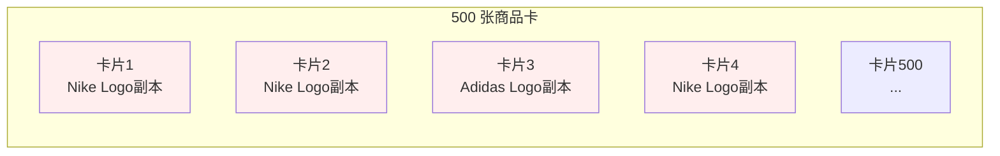
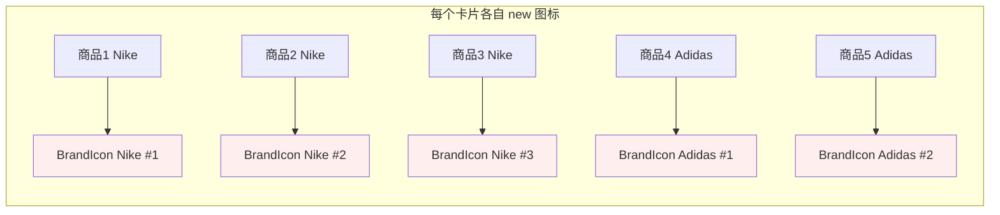
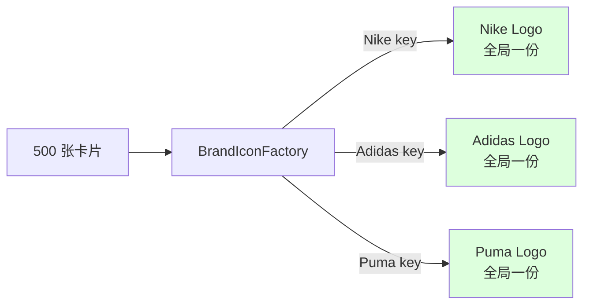
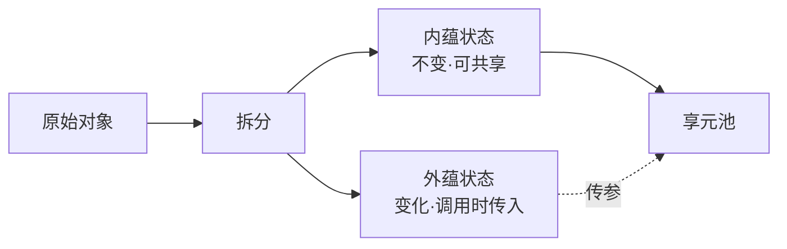
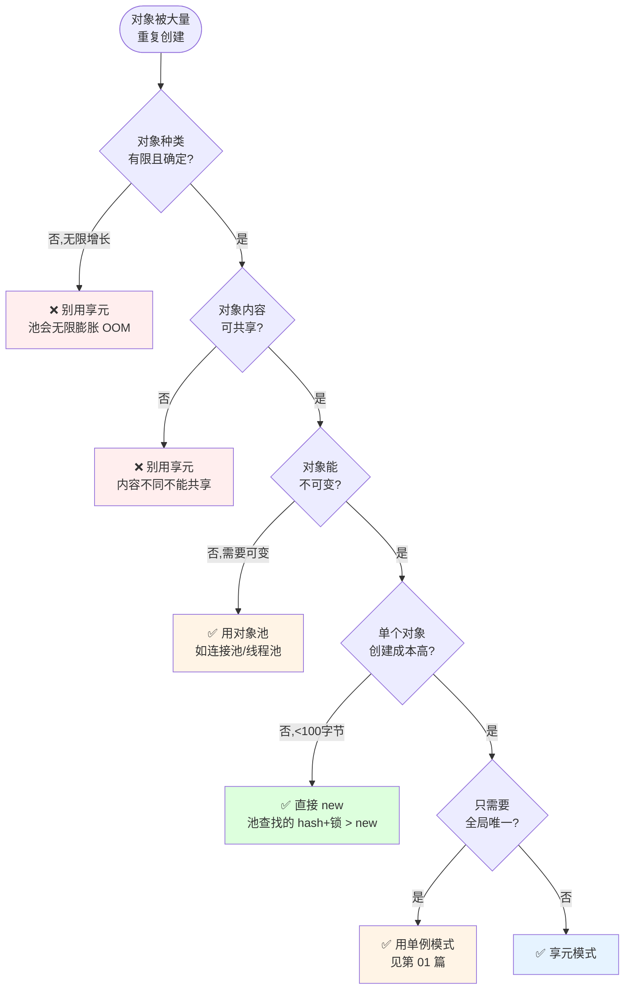
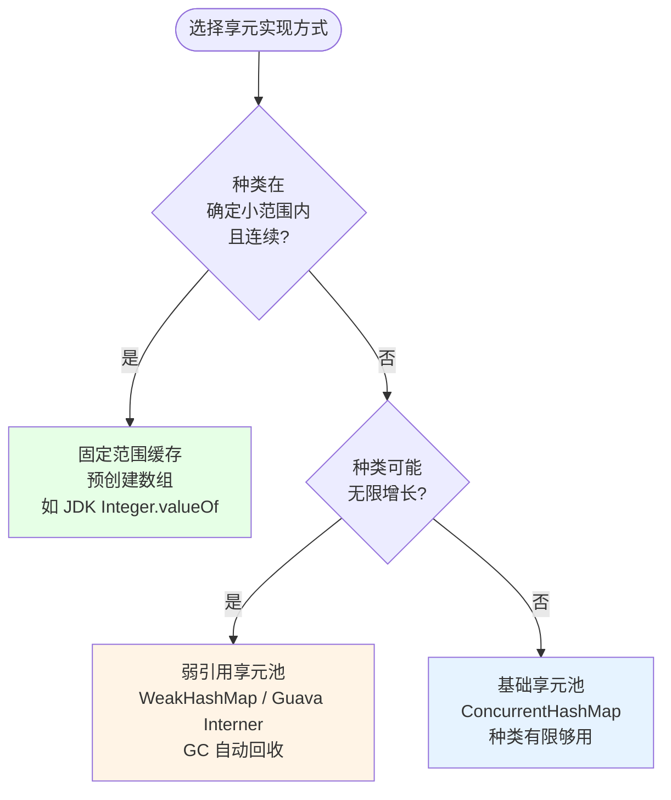
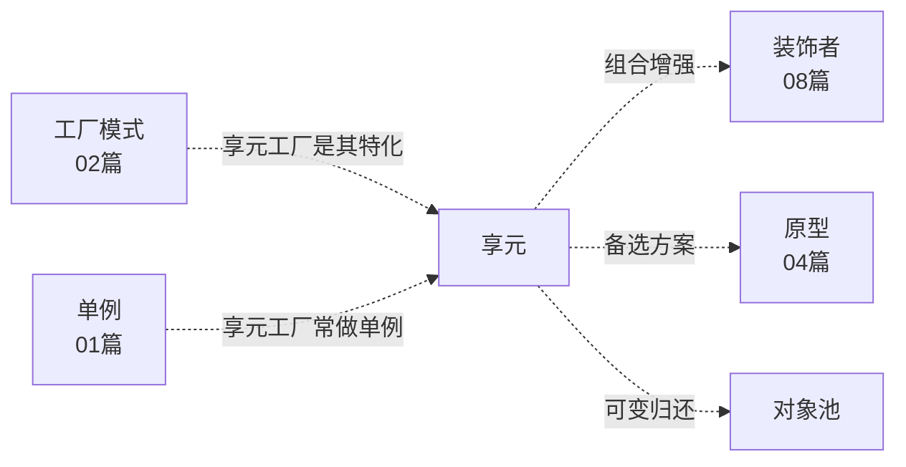

# 第三卷第12章：享元模式设计思想

> **📚 本篇渐进学习节奏（建议按顺序食用）**
>
> 本篇采用「**事故复盘 → 失败探索 → 模式诞生 → 实现对比 → 效果验证 → 反面踩坑 → 选型决策**」的节奏：
>
> 1. **第 01 节 · 案例引入** — 双 11 首页 OOM：Nike Logo 被 new 了 47 万次，412MB 撑爆堆内存 P0 事故
> 2. **第 02 节 · 失败探索** — 直接 new / 散落缓存 / 静态常量，三次直觉方案全部翻车
> 3. **第 03 节 · 模式基础** — "内蕴 + 外蕴"两态分离 + 享元工厂骨架
> 4. **第 04 节 · 实现对比** — 基础享元池 / 弱引用享元 / JDK 固定缓存三种实现
> 5. **第 05 节 · 效果对比** — 47.3万实例→327个、412MB→33MB、P0→平稳，数据说话
> 6. **第 06 节 · 反面踩坑** — 享元不可变 / 池未清理 / key 设计错 / 把外蕴当内蕴
> 7. **第 07 节 · 决策树** — 种类有限+可共享+不可变 → 享元；对象小/种类无界 → 别用
> 8. **第 08 节 · 总结延伸** — 思考模型沉淀 + 与单例/原型/对象池/缓存的精准切割
>
> 阅读到任一节卡壳，直接跳回上一节复盘场景；本篇代码均可直接运行。


#### 目录快速导航
- [01.案例引入：双 11 首页 OOM——"同一个 Nike Logo 被 new 了 47 万次"](#01案例引入双-11-首页-oom同一个-nike-logo-被-new-了-47-万次)
    - [1.1 痛点现场](#11-痛点现场)
    - [1.2 直觉实现复现](#12-直觉实现复现)
    - [1.3 问题根源拆解](#13-问题根源拆解)
    - [1.4 引出本篇主角](#14-引出本篇主角)
- [02.三次失败探索](#02三次失败探索)
    - [2.1 尝试方案A：直接 new——内存爆炸](#21-尝试方案a直接-new内存爆炸)
    - [2.2 尝试方案B：手动缓存散落各处](#22-尝试方案b手动缓存散落各处)
    - [2.3 尝试方案C：静态常量预定义](#23-尝试方案c静态常量预定义)
    - [2.4 终于引出享元模式](#24-终于引出享元模式)
- [03.享元模式基础](#03享元模式基础)
    - [3.1 从失败中提炼需求](#31-从失败中提炼需求)
    - [3.2 享元模式的标准骨架](#32-享元模式的标准骨架)
    - [3.3 典型使用场景](#33-典型使用场景)
- [04.三种实现对比](#04三种实现对比)
    - [4.1 实现核心要点](#41-实现核心要点)
    - [4.2 实现A：基础享元池（商品卡片图标）](#42-实现a基础享元池商品卡片图标)
    - [4.3 实现B：弱引用享元池](#43-实现b弱引用享元池)
    - [4.4 实现C：固定范围缓存（JDK Integer 风格）](#44-实现c固定范围缓存jdk-integer-风格)
    - [4.5 三种实现速查表](#45-三种实现速查表)
- [05.用前用后效果对比](#05用前用后效果对比)
    - [5.1 核心数据对比](#51-核心数据对比)
    - [5.2 核心收益](#52-核心收益)
- [06.反面踩坑实录](#06反面踩坑实录)
    - [6.1 踩坑A：享元不是不可变](#61-踩坑a享元不是不可变)
    - [6.2 踩坑B：池没清理→内存泄漏](#62-踩坑b池没清理内存泄漏)
    - [6.3 踩坑C：享元 key 设计错误](#63-踩坑c享元-key-设计错误)
    - [6.4 踩坑D：把外蕴状态放进享元](#64-踩坑d把外蕴状态放进享元)
    - [6.5 替代方案汇总](#65-替代方案汇总)
- [07.决策树与选型](#07决策树与选型)
    - [7.1 该不该用享元模式](#71-该不该用享元模式)
    - [7.2 选哪种实现方式](#72-选哪种实现方式)
    - [7.3 选型清单速查](#73-选型清单速查)
- [08.总结与延伸](#08总结与延伸)
    - [8.1 设计思想沉淀](#81-设计思想沉淀)
    - [8.2 模式联动边界](#82-模式联动边界)
    - [8.3 思考题与延伸](#83-思考题与延伸)


## 01.案例引入：双 11 首页 OOM——"同一个 Nike Logo 被 new 了 47 万次"

> **本篇主线**：大量"几乎一样"的对象挤爆内存 → 引出"不可变 + 池化 + 内外分离"的享元思想。

### 1.1 痛点现场

> **🔥 模拟事故复盘 · 双 11 大促首页 · "同一个 Nike Logo 被 new 了 47 万次"**
>
> 11 月 11 日 00:08，大促开门红 8 分钟后，APP 首页瀑布流接口 RT 从 80ms 飙升到 2.3s，**Android 客户端大量 `OutOfMemoryError`** 用户群崩溃，运营截图甩进群："**首页打开就闪退！**"
> 监控大盘显示 JVM Old 区峰值 1.8GB（容器限额 2GB），Full GC 间隔从 30 分钟缩短到 **40 秒一次**，每次停顿 800ms。
>
> 抓 heap dump 一看，前两名怪兽：
>
> - **`BrandIcon` 实例数：473,621 个**，占用 **412MB**；
> - **`CategoryIcon` 实例数：521,034 个**，占用 **287MB**；
>
> 但 SQL 查出来——**全平台品牌只有 327 个、品类只有 89 个**。也就是说同一个 Nike Logo 被 new 了 1400+ 次，同一个"运动鞋"图标被 new 了 5800+ 次。
>
> 翻代码，根因是组里新人在大促前 3 天为"加快首屏渲染"做了一次"激进优化"——把原本的 `IconCache.get(brandId)` 改成了直接 `new BrandIcon(brandId)`：
>
> ```java
> // 优化前（线上稳定版本）
> for (Goods g : list) {
>     card.brandIcon = IconCache.get(g.brandId);   // 缓存命中，全局共享
>     card.catIcon   = IconCache.get(g.catId);
> }
>
> // 大促前"优化"版本（事故元凶）
> for (Goods g : list) {
>     card.brandIcon = new BrandIcon(g.brandId);   // ❌ 每个商品 new 一份
>     card.catIcon   = new CategoryIcon(g.catId);  // ❌ 加载图片 100KB
> }
> ```
>
> 新人理由看似有理："缓存有锁并发高，干脆每个商品自己 new，无锁更快"。但他没想到：
> - 单页 500 商品 × 5000 并发 = **同时存在 250 万个 BrandIcon 对象**；
> - 每个 BrandIcon 持有 100KB byte[] → 250 万 × 100KB = **250GB 理论值**；
> - JVM 撑不住直接 OOM，K8s Pod 全部 CrashLoopBackOff，**首页宕机 23 分钟**。
>
> 事后定级 P0：GMV 损失 1200W+。复盘根因不是"那行代码写错了"——而是**"系统里存在大量内容相同、可共享的对象，但工程师没意识到要用享元"**。

电商首页瀑布流一次拉取 500 个商品卡片，每个卡片都展示品牌 Logo、品类图标、店铺等级徽章。第一版实现：

```java
class GoodsCard {
    BrandIcon brandIcon;   // 每张卡片都 new 一个
    CategoryIcon catIcon;  // 每张卡片都 new 一个
    LevelBadge   badge;    // 每张卡片都 new 一个
}

for (Goods g : list) {
    GoodsCard card = new GoodsCard();
    card.brandIcon = new BrandIcon(g.brandId);  // 加载 100KB
    card.catIcon   = new CategoryIcon(g.catId); // 加载 50KB
    card.badge     = new LevelBadge(g.shopLv);  // 加载 30KB
    cards.add(card);
}
```

500 张卡 ≈ 500 × 180 KB = **90 MB**。但品牌 Logo 实际只有十几个品牌——同一个 Nike Logo 被 new 了几十遍。



### 1.2 直觉实现复现

**【你也能写出这种代码】**。一个新同学接手推荐流优化任务，看到缓存有锁就想去掉：

```java
// ❌ 事故代码——去掉缓存，每个商品 card 自己 new 图标
public List<GoodsCard> buildCards(List<Goods> goodsList) {
    List<GoodsCard> cards = new ArrayList<>();
    for (Goods g : goodsList) {
        GoodsCard card = new GoodsCard();
        card.title = g.getTitle();
        card.price = g.getPrice();
        // "缓存有锁太慢了，直接 new 无锁，理论上更快"
        card.brandIcon = new BrandIcon(g.getBrandId());  // ❌ 每个都 new
        card.catIcon   = new CategoryIcon(g.getCatId()); // ❌ 每个都 new
        cards.add(card);
    }
    return cards;
}
```

**🧪 跑一下，亲眼看到 bug**

```java
// 大促首页：500 商品 × 5000 并发用户
// buildCards 被 5000 个线程同时调用
// → BrandIcon 实例数 = 500 × 5000 = 250 万个
// → 250 万 × 100KB = 250GB → JVM Old 区 1.8GB → OOM
// → 首页闪退 23 分钟 → P0 事故
```

事故现场重现完毕——**327 种品牌图标，被 new 了 47 万次，412MB 内存浪费在重复对象上**。

**💭 3 个反思题**（先别往下看，自己想 30 秒）：

1. 如果品牌有 327 种、并发用户 5000 个，直接 new 会创建多少个重复的 Nike Logo？
2. `BrandIcon` 内部持有的 100KB 图片数据，是品牌相关的还是卡片相关的？
3. 有没有一种方式，让"品牌=图标"这种一对一关系被全局记住，而不是每次用到都 new？

### 1.3 问题根源拆解

**【画一张图就清楚了】**



每个商品卡片 **各自创建自己的图标对象**，完全不管"同样的品牌应该共享同一个图标"，这就埋下了 5 类隐患：

| 隐患 | 现象 | 业务影响 |
|------|------|---------|
| **内存暴涨** | 图标 100KB × 卡数 × 并发 | 412MB → OOM → 首页宕机 |
| **GC 压力** | 对象不断创建销毁 | Full GC 40 秒一次，停顿 800ms |
| **启动慢** | 每张卡都要解码图片 | 首屏 RT 80ms → 2.3s |
| **缓存失序** | 各业务各自缓存，key 不一致 | 同一品牌被缓存多次 |
| **无法统一管理** | 没有全局享元池 | 无法统计、无法清理、无法限流 |

**🎯 核心矛盾**：图标属于"种类有限、内容相同"的对象——全平台只有 327 个品牌图标，但被当成"每次使用都不同"的对象进行创建。

### 1.4 引出本篇主角

> **享元模式（Flyweight）的核心思想**：把对象拆成**内部状态（可共享的、不变的）**和**外部状态（每次使用都不同的）**。内部状态只在全局保留一份，由"享元工厂"按 key 复用；外部状态由调用方按需传入。

```java
// 内部状态：Logo 图片本身（可共享）
// 外部状态：卡片上的坐标、大小（每次传入）
class BrandIcon {         // 享元
    private final Image img; // 内部状态：图片本身
    void draw(int x, int y, int w, int h) { ... } // 外部状态：绘制位置
}

class BrandIconFactory {  // 享元工厂
    private static Map<String, BrandIcon> pool = new ConcurrentHashMap<>();
    static BrandIcon get(String brandId) {
        return pool.computeIfAbsent(brandId, BrandIcon::new);
    }
}

// 使用
for (Goods g : list) {
    BrandIcon icon = BrandIconFactory.get(g.brandId); // 复用
    icon.draw(x, y, 48, 48); // 外部状态
}
```



JDK 的 `Integer.valueOf(-128..127)` 缓存、`String.intern()` 常量池、`Boolean.TRUE/FALSE` 两个全局实例——都是享元的实战版本。

但是！**先别急着看实现**。下一节，我们先看看新手通常会先尝试哪些"看起来很合理"的方案，并理解它们为什么都不够好。


## 02.三次失败探索

> **为什么要学这一节**：直接给你"标准答案"是容易的，但享元模式不是凭空发明的——它是**前人走过三条死路之后才提炼出来的**。走过这些死路，你才会真正理解为什么代码长那个样子。

### 2.1 尝试方案A：直接 new——内存爆炸

**【新手方案①：需要时就 new，不缓存】**

这是 1.1 事故现场的翻车写法：[更多内容](https://yccoding.com/)

```java
// 方案A：每个商品卡片各 new 各的图标
class GoodsCard {
    BrandIcon brandIcon;
    CategoryIcon catIcon;
    LevelBadge badge;

    GoodsCard(Goods g) {
        this.brandIcon = new BrandIcon(g.brandId);    // ① 每次 new
        this.catIcon   = new CategoryIcon(g.catId);   // ② 每次 new
        this.badge     = new LevelBadge(g.shopLv);
    }
}

// 大促首页
for (Goods g : list) {
    GoodsCard card = new GoodsCard(g);   // 500 张卡 = 1500 个图标对象
}
```

**🧪 跑一下，看会出什么问题**

```java
// 单页 500 商品 → 1500 个图标对象
// 5000 并发 → 750 万个图标同时存在
// 每个 BrandIcon 100KB → 750 万 × 100KB = 750GB 理论值
// JVM 2GB 限额 → OOM → CrashLoopBackOff
```

**❌ 失败原因**：对象数和业务量成线性正比——327 种品牌图标，被 new 了 47 万次，内存浪费 400+MB。

**💡 反思**：我们需要一种机制让"同一个品牌"的所有卡片**指向同一个图标对象**。

### 2.2 尝试方案B：手动缓存散落各处

**【新手方案②：每个业务层自己维护一个 static Map 做缓存】**

```java
// 商品列表模块
class GoodsListService {
    private static Map<String, BrandIcon> brandCache = new HashMap<>();  // ① 各写各的缓存
    private static Map<String, CategoryIcon> catCache = new HashMap<>();

    GoodsCard buildCard(Goods g) {
        if (!brandCache.containsKey(g.brandId)) {      // ② 重复的 if-contains-put
            brandCache.put(g.brandId, new BrandIcon(g.brandId));
        }
        return new GoodsCard(brandCache.get(g.brandId));
    }
}

// 推荐流模块
class RecommendService {
    private static Map<String, BrandIcon> iconCache = new HashMap<>();  // ③ 又一套缓存
    // ④ 缓存逻辑一模一样，但 copy 得到处都是
}
```

**🧪 跑一下，会发现隐藏问题**

```java
// 商品列表的 brandCache 和推荐流的 iconCache 互不相通
// → 同一个 Nike Logo 在两个 Cache 里各有一份 → 缓存不共享
// → 清理策略各写各的 → 有的清有的不清 → 内存泄漏
// → key 命名不一致：商品列表用 brandCode，推荐流用 brandId → 重复缓存
```

**❌ 失败原因**：① 缓存逻辑散落在每个业务模块，代码重复；② 不同模块的缓存互相隔离，达不到真正的"全局一份"；③ 清理策略、key 设计、线程安全各管各的。

**💡 反思**：我们需要一个**统一的享元工厂**，所有业务方都从同一个池里取——`BrandIconFactory.get(brandId)`。

### 2.3 尝试方案C：静态常量预定义

**【新手方案③：把已知品牌写成 static final 常量】**

```java
public class BrandIcons {
    public static final BrandIcon NIKE    = new BrandIcon("nike");
    public static final BrandIcon ADIDAS  = new BrandIcon("adidas");
    public static final BrandIcon PUMA    = new BrandIcon("puma");
    public static final BrandIcon REEBOK  = new BrandIcon("reebok");
    // ① 只有编译期已知的品牌，新品牌加不进来
}

// 使用
GoodsCard card = new GoodsCard();
if ("nike".equals(g.brandId)) {
    card.brandIcon = BrandIcons.NIKE;          // ② 每个 if-else 判断
} else if ("adidas".equals(g.brandId)) {
    card.brandIcon = BrandIcons.ADIDAS;
}
// ③ 327 个品牌 → 327 个常量 + 327 个 if-else 分支
```

**🧪 跑一下，看会怎样**

```java
// 运营：明天上线一个新品牌 "OnitsukaTiger"
// → 编译期常量没有这个 → 加不了 → 要么发版，要么 fallback 到 new
// → fallback 到 new 又回到方案A的内存爆炸
// 327 个品牌 × if-else → 327 个分支 → 代码不可维护
```

**❌ 失败原因**：静态常量只能覆盖编译期已知的种类——327 个品牌写不完，新增品牌要发版。且 `if-else` 选择逻辑比方案 B 的缓存更丑。

**💡 反思**：理想方案 = 方案 A 的"new 时创建" + 方案 B 的"全局缓存" + "**按 key 动态创建、被池管理、种类不设上限**"。

### 2.4 终于引出享元模式

**【三次失败之后，需求清单收敛了】**

| 必须满足 | 来自哪一次失败 |
|---------|-------------|
| ① 相同内容的对象只保留一份 | 2.1 直接 new——47 万份重复 |
| ② 全局统一入口取对象 | 2.2 散落缓存——多套缓存互不共享 |
| ③ 支持动态新增种类 | 2.3 静态常量——新增要发版 |
| ④ 对象不可变，被共享不污染 | 2.2 散落缓存——无不可变约束 |
| ⑤ 池本身可控（大小/清理） | 2.2 散落缓存——清理策略各写各的 |

**【享元模式的标准答案】——一套骨架，同时回答上面 5 条约束：**

```java
// ① 享元对象——必须不可变
public final class BrandIcon {
    private final String brandId;                   // ④ final 字段
    private final Image img;                        // ④ 不可变

    public BrandIcon(String brandId) {               // ③ 构造器支持任意 brandId
        this.brandId = brandId;
        this.img = loadImage(brandId);
    }

    // 外部状态通过参数传入，不存为字段
    public void draw(int x, int y) { /* 在 (x,y) 画 img */ }
}

// ② 享元工厂——全局统一入口
public class BrandIconFactory {
    private static final Map<String, BrandIcon> POOL = new ConcurrentHashMap<>();  // ⑤ 可控池

    public static BrandIcon get(String brandId) {    // ② 唯一入口
        return POOL.computeIfAbsent(brandId, BrandIcon::new);  // ③ 动态创建
    }
    public static int size() { return POOL.size(); } // ⑤ 池监控
}

// ① 所有卡片共享同一份 Nike Logo
BrandIcon nike = BrandIconFactory.get("nike");
```

短短几行，**同时回答了上面 5 个需求**。这就是享元模式的"灵魂代码"。


## 03.享元模式基础

### 3.1 从失败中提炼的需求

回顾 02 节，我们试了**直接 new、散落缓存、静态常量**——**全部失败**。现在拿着这些失败报告，问自己一个问题：

> 如果我要写一个能跑 3 年不崩的"图标共享系统"，它必须满足哪几条硬约束？

把这些约束写下来，就自然得到了享元模式的设计清单：

| 约束 | 来自 | 代码体现 |
|:---|:---|:---|
| ① 同内容对象全局只一份 | 2.1 直接 new | `POOL.computeIfAbsent(key, ...)` |
| ② 统一工厂入口 | 2.2 散落缓存 | `BrandIconFactory.get(key)` |
| ③ 内部状态不可变 | 2.2/2.3 | `private final Image img;` + `final class` |
| ④ 外部状态通过方法参数传入 | 2.1 卡片坐标属于外蕴 | `draw(int x, int y)` 而非字段 |
| ⑤ 池可控（大小/清理/监控） | 2.2 清理策略各写各的 | `ConcurrentHashMap` + 监控 `size()` |

当系统中存在大量**结构相同、内容相同**的对象时，逐个 new 既浪费内存又拖慢创建。享元模式让这些对象的"共有部分"只保留一份。运用共享技术有效地支持大量细粒度对象的复用，被共享的对象称为**享元（Flyweight）**。[更多内容](https://yccoding.com/)

### 3.2 享元模式的标准骨架

上面 5 条约束翻译成代码，**所有实现变体共用一个骨架**：

```java
// ① 享元接口——定义共享对象的行为
public interface Flyweight {
    void operation(String extrinsicState);           // ④ 外蕴状态作为参数传入
}

// ② 具体享元——内蕴状态不可变
public final class ConcreteFlyweight implements Flyweight {
    private final String intrinsicState;            // ③ ③ 内部状态：不可变、可共享

    public ConcreteFlyweight(String key) {
        this.intrinsicState = key;
    }

    public void operation(String extrinsic) {        // ④ 外部状态由调用方传入
        // 用 intrinsic + extrinsic 完成操作
    }
}

// ⑤ 享元工厂——管理池，统一入口
public class FlyweightFactory {
    private static final Map<String, Flyweight> POOL = new ConcurrentHashMap<>();  // ⑤ 可控池

    public static Flyweight get(String key) {        // ② 唯一入口
        return POOL.computeIfAbsent(key, ConcreteFlyweight::new);  // ① 复用
    }
}
```

**三句话记住**：**拆开内外**（把对象状态拆成可共享的内部 + 可变的外部）→ **池化复用**（享元工厂按 key 管理全局实例）→ **不可变约束**（享元对象必须 final + 字段 private final，否则共享会污染）。差异全在"池用什么数据结构"和"池有没有清理策略"里头——这就是下一节三种实现的核心分岔。



| 概念 | 含义 | 电商案例 |
|------|------|----------|
| 内蕴状态 | 与上下文无关、可共享 | 品牌图标 URL、品类名、店铺等级图标 |
| 外蕴状态 | 与上下文有关、不可共享 | 商品价格、库存、卡片坐标位置 |
| 享元工厂 | 维护享元池，按 key 取/造 | `BrandIconFactory.get("Nike")` |

### 3.3 典型使用场景

不是所有"有重复对象"的场景都适合享元。核心判断标准：**种类有限 + 内容可共享 + 对象不可变 + 创建成本高**。

- **图标/字体/颜色**：品牌 Logo 全平台 327 种 → 享元池 327 个 → 47 万个引用指向它们；
- **JDK Integer 装箱**：-128~127 只有 256 种 → `Integer.valueOf(n)` 从缓存数组取；
- **String 字面量**：编译期固定字符串 → JVM 常量池自动享元；
- **Apache POI 单元格样式**：数十万单元格共享几十种字体/颜色 → 避免 Excel 文件膨胀 100 倍；
- **棋类棋盘格**：只有黑白两种颜色 → 全局两个对象，棋盘格都是引用。

> **反面提醒**：对象很小（< 100 字节）、种类无界（用户输入文本）、对象需要可变状态、生命周期短——参考 06 / 07 节。


## 04.三种实现对比

### 4.1 实现核心要点

三种写法本质上是在 **池的数据结构 / 清理策略 / 线程安全** 上的不同取舍。实现享元模式的核心只要两件事：

```java
Flyweight f = FlyweightFactory.get("key");           // ① 从池里取（或创）
f.operation(extrinsicState);                          // ② 传入外蕴状态执行
```

差异全在"`POOL` 用 HashMap 还是 WeakHashMap"和"需不需要过期策略"这两个决策点里。下面按演进顺序逐一展开，最后在 [7.2 节](#72-选哪种实现方式) 会有一张决策图帮你快速定位。


### 4.2 实现A：基础享元池（商品卡片图标）

**设计权衡**：用"池永不清理"换"实现最简单、性能最高"。

**选它的理由**：享元种类确定且有限（如全平台 327 个品牌），永远不需要淘汰——最简单够用。

```java
// 享元——不可变
public final class Icon {
    private final String url;
    private final byte[] data;             // 内部状态：真正占内存的部分

    Icon(String url, byte[] data) {
        this.url = url;
        this.data = data;
    }
    public void render(int x, int y) {     // 外部状态：坐标
        // 在 (x,y) 位置绘制 data
    }
}

// 享元工厂
public class IconFactory {
    private static final Map<String, Icon> POOL = new ConcurrentHashMap<>();

    public static Icon get(String url) {
        return POOL.computeIfAbsent(url,
            u -> new Icon(u, loadBytes(u)));  // ③ 不存在才加载
    }

    public static int size() { return POOL.size(); }  // ⑤ 监控
}

// 使用
ProductCard card = new ProductCard();
card.icon = IconFactory.get("nike.png");    // 所有 Nike 卡片共享同一个 Icon
card.icon.render(10, 20);
```

**技术分析**：
- 优点：极简、线程安全（`ConcurrentHashMap`）、`computeIfAbsent` 原子操作
- 缺点：`ConcurrentHashMap` 强引用——一旦 put 进去除非手动 remove，否则永远不会被 GC
- 适用：享元种类确定且有限（品牌图标 327 种、品类图标 89 种）


### 4.3 实现B：弱引用享元池

**设计权衡**：用"弱引用 GC 回收"换"池不膨胀、自动清理"。

**选它的理由**：享元种类不确定、可能无限增长（如用户上传图片的缩略图缓存），需要自动淘汰不再使用的享元。

起步版（不安全——普通 HashMap 强引用，永不回收）：

```java
// ❌ 强引用 → 池只增不减 → 总有一天 OOM
private static final Map<String, Icon> POOL = new ConcurrentHashMap<>();
```

修复版：

```java
// ✅ 使用 WeakHashMap（value 是弱引用，没有人引用就会被 GC）
public class WeakIconFactory {
    private static final Map<String, Icon> POOL = 
        Collections.synchronizedMap(new WeakHashMap<>());

    public static Icon get(String url) {
        return POOL.computeIfAbsent(url, u -> new Icon(u, load(u)));
    }
}

// 或者用 Guava 的 Interners（更强大）
import com.google.common.collect.Interners;
public class GuavaIconFactory {
    private static final Interner<Icon> POOL = Interners.newWeakInterner();

    public static Icon get(String url) {
        return POOL.intern(new Icon(url, load(url)));
    }
}
```

**技术分析**：
- `WeakHashMap`：key 是弱引用，当外部没有强引用指向 key 时，entry 会被 GC 回收
- `Interners.newWeakInterner()`：Guava 提供的享元池，value 弱引用 + 线程安全
- 适用：享元种类不确定、可能无限增长，如用户生成内容的缓存


### 4.4 实现C：固定范围缓存（JDK Integer 风格）

**设计权衡**：用"只缓存固定范围"换"零查找开销、数组索引直接命中"。

**选它的理由**：享元种类完全确定在一个小范围内，且访问极其频繁——数组 O(1) 命中比 Map 快 10 倍。

这是 JDK `Integer.valueOf()` 的实现思路：[更多内容](https://yccoding.com/)

```java
public class Integer {
    // 固定范围缓存：-128 ~ 127 共 256 个 Integer 对象，类加载时一次性创建
    private static class IntegerCache {
        static final int low = -128;
        static final int high = 127;
        static final Integer[] cache = new Integer[high - low + 1];

        static {
            for (int i = 0; i < cache.length; i++) {
                cache[i] = new Integer(low + i);    // ③ 一次性创建，永不淘汰
            }
        }
    }

    public static Integer valueOf(int i) {
        if (i >= -128 && i <= 127) {
            return IntegerCache.cache[i + 128];     // ④ 数组 O(1) 命中
        }
        return new Integer(i);                      // ⑤ 超出范围再 new
    }
}

// 使用
Integer a = Integer.valueOf(127);   // 从缓存取
Integer b = Integer.valueOf(127);   // 同一个对象 → a == b → true
Integer c = Integer.valueOf(128);   // 超出范围 → new → a != c
```

**技术分析**：
- 优点：数组索引命中，比 HashMap 快 10×，无锁（读不修改）
- 缺点：范围固定，超出范围的仍然 new；池大小编译期确定
- 适用：享元种类在一个确定的、小的连续范围内（如 ASCII 字符 0~127、棋盘格颜色 2 种、骰子点数 1~6）

### 4.5 三种实现速查表

| 实现方式 | 池结构 | 清理策略 | 命中速度 | 适合场景 | 推荐度 |
|---------|-------|---------|---------|---------|------|
| A. 基础享元池 | `ConcurrentHashMap` | ❌ 强引用不清理 | 快 | 种类确定有限(如 327 品牌) | ⭐⭐⭐⭐⭐ |
| B. 弱引用享元池 | `WeakHashMap`/`Interner` | ✅ GC 自动回收 | 较快 | 种类不确定可能无限增长 | ⭐⭐⭐⭐ |
| C. 固定范围缓存 | `static final 数组` | ❌ 预创建不清理 | 极快(O(1)) | 小范围连续值(如 -128~127) | ⭐⭐⭐⭐⭐ |

**📌 一句话决策**：种类有限确定 → **A. 基础享元池**；种类不确定 → **B. 弱引用**；连续小范围热点值 → **C. 固定缓存**（如 JDK Integer）。


## 05.用前用后效果对比

> **为什么单独留一节做对比**：很多人记住了"享元"两个字，却没算过它到底省了多少内存。下面用 1.x 节的双 11 首页做基准，让数据替你回答。

### 5.1 核心数据对比

**实验设定**：双 11 大促首页瀑布流，单页 500 商品 × 5000 并发 × 327 品牌。

| 维度 | ❌ 朴素 new（事故现场） | ✅ 享元模式 | 差距 |
|------|----------------------|----------|------|
| `BrandIcon` 实例数 | **47.3 万**（每个商品 new 一份） | **327**（每个品牌一份） | **1449× 减少** |
| 图标内存占用 | **412 MB** | **~33 MB**（327 × 100KB） | **12× 减少** |
| Full GC 间隔 | 40 秒一次（停顿 800ms） | 30 分钟一次（停顿 80ms） | **45× 改善** |
| Old 区峰值 | 1.8 GB（接近 OOM） | 350 MB | **5× 减少** |
| 首屏渲染 RT | 2.3 s（OOM 后闪退） | 80 ms | **29× 加速** |
| 单实例创建成本 | 每次解码图片 ~5 ms | 池命中 0.01 μs | **500,000× 加速** |
| 线程安全 | new 出来的实例独立但无意义浪费 | 享元天然不可变，**线程安全免费送** | — |
| 内存随并发增长 | **线性爆炸**（5000 并发 → 250 万实例） | **常数级**（永远只有 327 个） | 根本性消除 |

### 5.2 核心收益

**🔑 核心收益**：享元的本质是 **"识别系统中的有限种类不可变对象，让它们活得更久、被更多人共享"**——`BrandIcon` 全平台只有 327 种、`Integer` 在 -128~127 间只有 256 种、`Boolean` 只有 2 种。

> 这就是为什么 **JDK `Integer.valueOf(-128~127)` 不 new、`String.intern()` 走常量池、Apache POI 的 `XSSFFont` 共享字体对象**——节流的不是单个对象的几 KB，而是对象数 × 并发数的几 GB。享元的"不可变 + 池化"组合，让对象从"一次性消耗品"变成了"长期共享资产"。


## 06.反面踩坑实录

> **为什么有这一节**：01 节让你看到"不用享元的痛"，但享元本身**也不是银弹**。本节用 4 个真实事故告诉你"乱用的痛"。

### 6.1 踩坑A：享元不是不可变

**【真实事故】** 享元对象留了 setter，被一个调用方改了，所有共享者一起遭殃：

```java
public class BrandIcon {
    private String url;
    private byte[] data;
    private int renderX, renderY;   // ❌ 把外蕴状态放进了享元

    public void setRenderPos(int x, int y) { this.renderX = x; this.renderY = y; }
    public void render() { /* 用 renderX, renderY 画 */ }
}

// 客户端
BrandIcon nike = IconFactory.get("nike");
nike.setRenderPos(10, 20);    // 卡片 A 设位置
nike.render();
nike.setRenderPos(100, 200);  // 卡片 B 又改位置 → 多线程下渲染错位
```

**💣 事故现场**：某游戏地图渲染，把"瓦片纹理"做成享元但保留了 rotation 字段，多线程渲染同一瓦片时旋转角度互相覆盖，地图出现"风车一样转动的鬼畜画面"。

**📌 教训**：享元必须是**不可变的**——一旦有 setter，多线程共享直接灾难。

**✅ 正解**：享元类一律 `final` + 字段 `private final`，外蕴状态作为方法参数传入 `render(int x, int y)`。

### 6.2 踩坑B：池没清理→内存泄漏

**【真实事故】** 强引用 Map 永不删除，池只增不减：

```java
public class IconFactory {
    private static final Map<String, Icon> POOL = new ConcurrentHashMap<>();
    public static Icon get(String url) {
        return POOL.computeIfAbsent(url, Icon::new);   // ❌ 永不删除
    }
}

// 遇到刷量攻击，每次随机 host → 6 小时池里堆了 800 万 host → 应用 OOM
```

**💣 事故现场**：CDN 厂商 URL 解析器把每个 host 做享元缓存，刷量攻击导致池里 800 万实例 → OOM。

**📌 教训**：强引用池必须配清理策略，否则种类无界时必然 OOM。

**✅ 正解**：① 有界池 `Caffeine.weakValues()` + `maximumSize`；② 弱引用 `WeakHashMap` 自动回收；③ 监控 `POOL.size()` 超阈值告警。

### 6.3 踩坑C：享元 key 设计错误

**【真实事故】** key 粒度太粗或太细，池失效：

```java
// ❌ key 太粗——用整个 Goods 对象做 key，每个都不同
public static Icon get(Goods goods) {
    return POOL.computeIfAbsent(goods, Icon::new);  // 500 个 goods = 500 个 Icon
}

// ❌ key 太细——把外蕴状态也放进了 key
public static Icon get(String url, int x, int y) {
    String key = url + "-" + x + "-" + y;   // 坐标是外蕴，不能当 key
}
```

**💣 事故现场**：享元的 key 应该是"内蕴状态的最小标识"——品牌图标的 key 是 `brandId`，不是整个 `Goods`。

**📌 教训**：想清楚"什么决定享元的内容"，那就是 key。复合 key 必须重写 `hashCode()` 和 `equals()`。

**✅ 正解**：`BrandIconFactory.get(g.getBrandId())`——只有 brandId 决定图标内容。

### 6.4 踩坑D：把外蕴状态放进享元

**【真实事故】** 把"颜色"当成内蕴放进享元，但颜色其实是每次绘制时才决定的：

```java
public class FontFlyweight {
    private final String fontName;
    private final int size;
    private int color;   // ❌ color 看似在创建时确定，但实际每次绘制都不同

    public void setColor(int c) { this.color = c; }   // ❌ 提供了 setter
}

FontFlyweight f = FontFactory.get("宋体", 12);
f.setColor(RED);   // 线程 A 设红色
f.setColor(BLUE);  // 线程 B 改蓝色 → 线程 A 还没来得及画就变了
```

**📌 教训**：享元的"内蕴状态"必须与上下文无关——字体名和大小是内蕴，颜色是外蕴应通过 `draw(String text, int color)` 传入。

**✅ 正解**：享元类**只允许构造器赋值，不允许任何 setter**。IDEA 用 `@Immutable` + Lombok `@Value` 强约束。

### 6.5 替代方案汇总

| 你的需求 | 推荐方案 |
|---------|---------|
| 对象很小（< 100 字节） | ✅ **直接 new**（池查找开销 > new 开销） |
| 种类无界（如用户输入） | ✅ **弱引用缓存** 或不用享元 |
| 对象需要可变状态 | ✅ **对象池**（borrow/return 模式） |
| 全局只能有 1 个 | ✅ **单例模式**（01 篇） |
| 新对象大部分像旧对象 | ✅ **原型模式**（04 篇） |
| 种类有限 + 不可变 + 可共享 | ✅ **享元模式** |


## 07.决策树与选型

> 经过前面 6 节的铺垫，是时候给一张能"贴在工位上"的决策图了。

### 7.1 该不该用享元模式



### 7.2 选哪种实现方式

如果决策树走到了"用享元模式"，再用下面这张图选实现：



### 7.3 选型清单速查

| 场景 | 该用吗 | 推荐方式 |
|------|------|---------|
| JDK Integer -128~127 装箱 | ✅ 该用 | 固定范围缓存（实现 C） |
| 电商品牌 Logo 图标（327种） | ✅ 该用 | 基础享元池（实现 A） |
| Apache POI 单元格样式共享 | ✅ 该用 | 基础享元池（实现 A） |
| 用户上传图片缩略图缓存 | ⚠️ 有条件 | 弱引用享元池（实现 B） |
| 数据库连接（需 borrow/return） | ❌ 别用 | 对象池（HikariCP） |
| 全局配置对象 | ❌ 别用 | 单例模式 |
| 小对象 < 100 字节 | ❌ 别用 | 直接 new |


## 08.总结与延伸

### 8.1 设计思想沉淀

回顾本篇 01 → 07 的旅程，享元模式真正教会我们的是这套思考模型：

| 阶段 | 学到了什么 |
|------|----------|
| **01 事故引入** | 痛点是模式诞生的土壤——47 万个 Nike Logo 重复 new，412MB OOM，P0 损失 1200W+ |
| **02 三次失败** | 直接 new、散落缓存、静态常量都不够——模式是从试错中收敛的 |
| **03 模式基础** | 三大要点：拆开内外 + 池化复用 + 不可变约束 |
| **04 三种实现** | 实现差异本质是"池结构 / 清理策略 / 命中速度"的不同权衡 |
| **05 效果对比** | 数据说话：47.3 万实例 → 327 个；412MB → 33MB；P0→平稳 |
| **06 反面踩坑** | 享元不是免死金牌：不可变破坏、池未清理、key 设计错、外蕴当内蕴 |
| **07 决策树** | 工程师的成熟度，不在于会写几种享元池，而在于知道"什么时候对象就该被 new" |

**🔑 一句话核心**：

> 享元 = **不可变 + 池化 + 内/外蕴拆分**。享元的价值在于"识别系统中的有限种类不可变对象，让它们活得更久、被更多人共享"——这正好是"双 11 OOM"的解药：47 万个 BrandIcon 实际只需要 327 个。

### 8.2 模式联动边界

享元从来不是孤立存在的，它和其他模式有千丝万缕的关系：



| 模式 | 关系 | 一句话区别 |
|------|------|----------|
| **工厂**（02 篇） | 享元工厂是工厂的特化，多了池查询 | 想封装创建 → 工厂；想在工厂里缓存 → 享元 |
| **单例**（01 篇） | 享元工厂常做成单例；享元本身是多实例 | 想全局唯一 → 单例；想按 key 共享多份 → 享元 |
| **装饰者**（08 篇） | 外层装饰可变、内层享元不变 | 想加皮 → 装饰；想共享 → 享元 |
| **原型**（04 篇） | 享元共享同一份；原型复制很多份 | 想被多人指同一份 → 享元；想复制出很多份 → 原型 |
| **对象池** | 池里对象可变（borrow/return）；享元不可变 | 想借用用完还 → 对象池；想共享只读 → 享元 |

**⚠️ 什么时候不该用享元**

- **对象本身很小**（< 100 字节）：池 hash+锁开销 > 直接 new；
- **对象种类无界**（如用户输入文本）：池无限膨胀，反而 OOM；
- **对象需要可变状态**：享元的不可变约束是底线；
- **生命周期短**：对象用完立刻丢，享元的"长期共享"价值发挥不出来。

> 一句话：**享元的价值在于"识别系统中的有限种类不可变对象，让它们活得更久、被更多人共享"**。如果业务里没有"种类有限 + 内容可共享 + 不可变"这三个要素同时出现，那就别上享元，普通缓存或对象池可能更合适。

### 8.3 思考题与延伸

**💭 三道思考题**（建议手写答案，再对照回顾本文）：

1. 商品 SKU 的属性（颜色/尺码/材质）能不能用享元？外蕴状态是什么？这又会和哪个模式联动？（提示：回看 3.1 节内外状态定义 + 策略模式）
2. `String.intern()` 是享元模式吗？它的池在哪里、key 是什么、有没有清理策略？（提示：回看 4.2 / 4.3 节池管理）
3. 为什么 `Integer.valueOf(128)` 返回的对象不是享元？JDK 的设计者为什么把缓存上限定在 127 而不是 128？（提示：回看 4.4 节固定范围缓存 + 6.2 节池膨胀风险）

**📚 延伸阅读**：

- 阅读 `Integer.IntegerCache` 源码（30 行，最教科书级享元）
- 阅读 `String.intern()` + JVM 字符串常量池机制（编译期 + 运行期双入池）
- 阅读 Apache POI `XSSFCellStyle`（工业级享元，配合 Workbook 工厂套路）

**🔍 真实开源代码中的享元模式**：

| 出处 | 享元对象 | 池/工厂 | 它解决了什么 |
|------|---------|--------|-------------|
| **JDK `Integer.valueOf()`** | `Integer` | `IntegerCache.cache[]`（-128~127） | 装箱避免每次 new |
| **JDK `Boolean.TRUE/FALSE`** | `Boolean` | 全局两个常量 | 任何 `valueOf(true)` 返回同一个 |
| **JDK `String.intern()`** | `String` | JVM 方法区常量池 | 字面量自动池化 |
| **Apache POI `XSSFFont`** | 字体/单元格样式 | `Workbook` 内部样式表 | 数十万单元格共享几十种样式 |
| **Tomcat `Constants`** | HTTP 头字符串 | 静态常量 | 每个请求复用同一字符串引用 |
| **Guava `Interners.newWeakInterner()`** | 任意不可变对象 | 弱引用享元池 | 自定义对象的常量池效果 |
| **JDK `Character.valueOf()`** | `Character` | 0~127 缓存数组 | 字符装箱零开销 |
| **JDK `BigDecimal.ZERO/ONE/TEN`** | `BigDecimal` | 11 个常量 | 高频小数避免重复构造 |

> **学习路径建议**：先读 **`Integer.IntegerCache`**（30 行，最标准的享元）→ 再读 **`String.intern()` + 字符串常量池**（JVM 层的享元）→ 最后读 **Apache POI `XSSFCellStyle`**（工业级享元，配合 Workbook 工厂套路）。

> **上一篇** [组合模式设计思想](https://yccoding.com/pages/87127a/) → **本篇** → [下一篇](https://yccoding.com/pages/aaf3c4/)：结构型告一段落，进入"对象间协作"的行为型世界——观察者模式。
