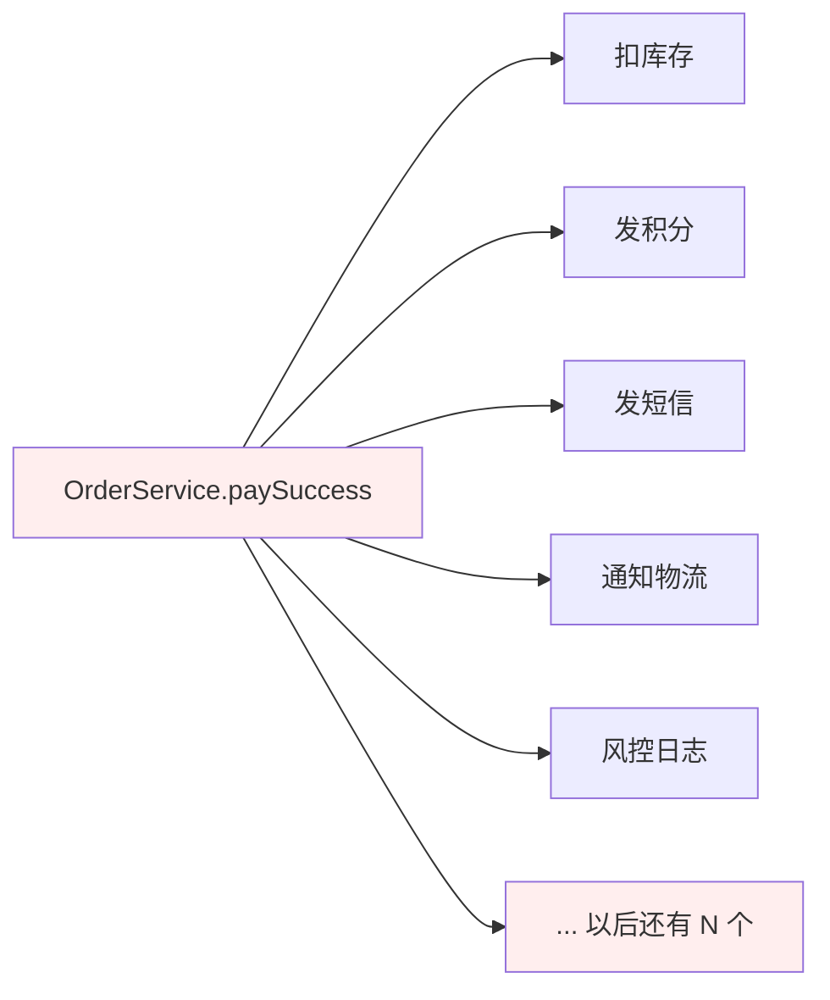
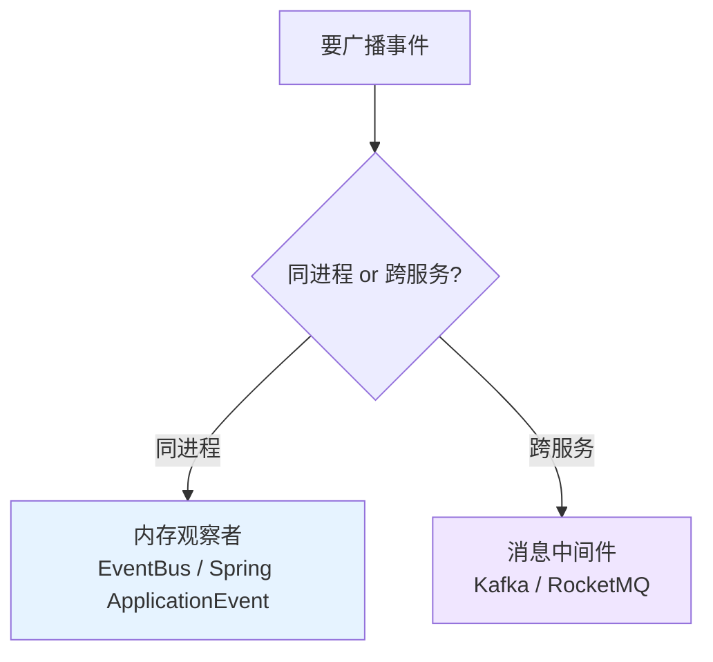
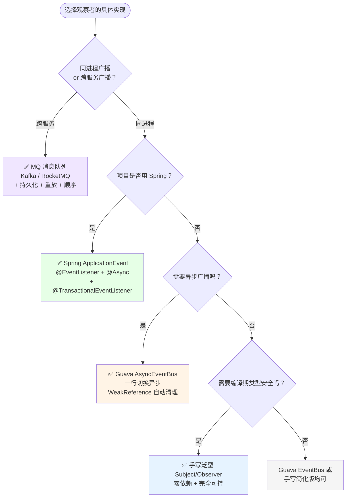
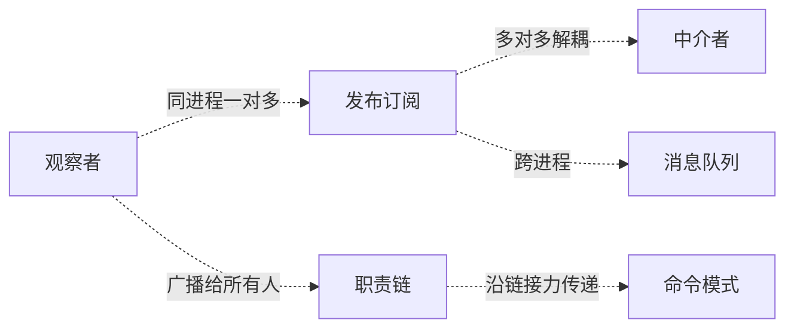

# 13.观察者模式设计思想

> **📚 本篇渐进学习节奏（建议按顺序食用）**
>
> 1. **第 01 节 · 案例引入** — 周二 14:00 大促支付回调被新人拖死的 P1 资损事故（订单"扣库存+发券+推送+ERP+风控+埋点"6 步硬编码，新增"积分服务"漏写一行炸出资损）
> 2. **第 02 节 · 3 次失败探索** — if-else 开关 / 强类型回调 / JDK Observable，三种直觉方案为何全军覆没
> 3. **第 03 节 · 模式基础** — 从失败清单逆推设计约束 → 标准骨架 → 场景识别
> 4. **第 04 节 · 4 种实现对比** — 手写 Subject/Observer → Guava EventBus → Spring ApplicationEvent → 前端 EventEmitter
> 5. **第 05 节 · 效果对比** — 用前用后 11 维数据说话（事故现场 vs 观察者重构）
> 6. **第 06 节 · 反面踩坑** — 6 种翻车姿势实录 + 14 个开源案例 + 替代方案汇总
> 7. **第 07 节 · 决策树** — 该不该用 → 用哪种实现 → 速查清单，贴工位上就能用
> 8. **第 08 节 · 总结延伸** — 思考模型沉淀 + 模式联动边界 + 3 道自测题
>
> 阅读到任一节卡壳，直接跳回上一节复盘场景；本篇所有代码均可直接运行。

#### 目录介绍
- [01.案例引入与思考](#01案例引入与思考)
    - [1.1 痛点现场](#11-痛点现场)
    - [1.2 直觉实现复现](#12-直觉实现复现)
    - [1.3 问题根源拆解](#13-问题根源拆解)
    - [1.4 引出本篇主角](#14-引出本篇主角)
- [02.3次失败探索](#023次失败探索)
    - [2.1 尝试方案A：if-else 配置开关式调用](#21-尝试方案aif-else-配置开关式调用)
    - [2.2 尝试方案B：强类型回调接口](#22-尝试方案b强类型回调接口)
    - [2.3 尝试方案C：JDK Observable](#23-尝试方案cJDK-Observable)
    - [2.4 终于引出观察者模式](#24-终于引出观察者模式)
- [03.观察者模式基础](#03观察者模式基础)
    - [3.1 从失败中提炼需求](#31-从失败中提炼需求)
    - [3.2 观察者模式的标准骨架](#32-观察者模式的标准骨架)
    - [3.3 典型使用场景](#33-典型使用场景)
- [04.4种实现对比](#044种实现对比)
    - [4.1 实现核心要点](#41-实现核心要点)
    - [4.2 实现A：手写 Subject / Observer 接口](#42-实现a手写-subject--observer-接口)
    - [4.3 实现B：Guava EventBus](#43-实现bguava-eventbus)
    - [4.4 实现C：Spring ApplicationEvent](#44-实现cspring-applicationevent)
    - [4.5 实现D：前端 EventEmitter（Node.js / JavaScript）](#45-实现d前端-eventemitternodejs--javascript)
    - [4.6 4种实现速查表](#46-4种实现速查表)
- [05.用前用后效果对比](#05用前用后效果对比)
    - [5.1 代码量 & 扩展性对比](#51-代码量--扩展性对比)
    - [5.2 故障隔离 & 可观测性对比](#52-故障隔离--可观测性对比)
    - [5.3 核心收益](#53-核心收益)
- [06.反面踩坑实录](#06反面踩坑实录)
    - [6.1 踩坑A：只注册不反注册 → 内存泄漏](#61-踩坑a只注册不反注册--内存泄漏)
    - [6.2 踩坑B：同步广播拖慢主流程](#62-踩坑b同步广播拖慢主流程)
    - [6.3 踩坑C：监听器顺序依赖](#63-踩坑c监听器顺序依赖)
    - [6.4 踩坑D：循环依赖 → 栈溢出](#64-踩坑d循环依赖--栈溢出)
    - [6.5 踩坑E：在监听器里修改主题状态](#65-踩坑e在监听器里修改主题状态)
    - [6.6 踩坑F：新人还在用 JDK Observable](#66-踩坑f新人还在用-jdk-observable)
    - [6.7 开源案例速查 & 替代方案汇总](#67-开源案例速查--替代方案汇总)
- [07.决策树与选型](#07决策树与选型)
    - [7.1 该不该用观察者模式](#71-该不该用观察者模式)
    - [7.2 选哪种实现方式](#72-选哪种实现方式)
    - [7.3 选型清单速查](#73-选型清单速查)
- [08.总结与延伸](#08总结与延伸)
    - [8.1 设计思想沉淀](#81-设计思想沉淀)
    - [8.2 模式联动边界](#82-模式联动边界)
    - [8.3 思考题与延伸](#83-思考题与延伸)


## 推荐一个好玩网站

一个最纯粹的技术分享网站，打造精品技术编程专栏！[编程进阶网](https://yccoding.com/)

https://yccoding.com/


## 01.案例引入与思考

> **本篇主线**：一对多的状态同步，被硬编码在一个方法里——引入观察者后，主题只管广播，谁在听、听了做什么，统统与主题无关。

### 1.1 痛点现场

> **🔥 模拟事故复盘 · 周二 14:00 · "新增积分服务漏写一行，大促资损 380 万"**
>
> 周二下午 14:00 大促预热第 2 天，用户支付完成 → "扣库存 + 发券 + 推送 + ERP 同步 + 风控 + 埋点" 6 个动作正常运转 1 年没出过事。这天产品提了一个看似简单的需求：**"新客支付后给 +500 积分"**，开发同学小林半小时改完上线。
>
> 上线 38 分钟后，**客服群被打爆**：
>
> - 用户 A："支付成功了，但商品没扣库存，还能继续下单"——库存超卖；
> - 用户 B："收到短信说付款成功，但订单中心一直显示'待支付'"——状态不同步；
> - 用户 C："优惠券领了，钱也扣了，但 ERP 里没单子，仓库不发货"——发货中断；
> - 风控同学："风控大盘里今天的支付订单数对不上，少了 1.2 万单"——风控失明；
>
> 排查日志一看，`OrderService.paySuccess()` 里 6 个动作硬编码了一年，**所有人改这个方法都要捏着鼻子在 6 行代码里加一行**。小林这次加积分时不小心把代码插在了 try-catch 内层但**忘了重新抛异常**：
>
> ```java
> public void paySuccess(Order o) {
>     try {
>         pointsService.add(o.getUserId(), 500);   // ✅ 新增,但内部 RPC 超时
>     } catch (Exception e) {
>         log.error("加积分失败", e);
>         // ❌ 没有抛出 → 后续 5 个动作全被跳过(因为整个 paySuccess 已经被吞异常,事务回滚)
>     }
>     inventoryService.deduct(...);   // ❌ 永远走不到
>     couponService.send(...);
>     pushService.notify(...);
>     erpService.sync(...);
>     riskService.log(...);
> }
> ```
>
> 更骚的是，小林不是直接改的 `paySuccess`，而是改了它调用的一个工具类，导致**异常吞掉的不只是积分，而是整个事务回滚**——支付订单状态根本没落库，但用户的钱已经被网关扣了，**纯资损**。
>
> 38 分钟内放出去的 1.2 万单，每单平均 320 元 → 资损金额 **380 万**，外加：库存数据错乱 7000+ SKU 手工对账、优惠券批量退券 4 万张、ERP 缺单致仓库延迟发货 2 天、客诉率飙到 12%、登上热搜。
>
> 事故复盘会上，CTO 拍桌：
>
> - **业务影响**：直接资损 380 万 + 客诉退款 80 万 + 商誉损失不可估量；
> - **技术影响**：紧急降级到旧版本 + 全平台 23 处类似"硬编码下游调用"巡检改造；
> - **流程影响**：所有"主流程触发下游"必须走 EventBus / MQ，PR 模板加一项强制 Checklist。
>
> 复盘根因不是"小林漏写一行 throw"——而是 **`OrderService.paySuccess()` 把 6 个本应解耦的下游动作硬塞在一个方法里，每加一个需求都在玩俄罗斯轮盘赌**。

### 1.2 直觉实现复现

> **你也能写出这种代码。** 一个新人接手订单系统，要"支付成功后触发 N 个动作"，第一反应往往是这样：

```java
public class OrderService {
    public void paySuccess(Order o) {
        // 1. 扣库存
        inventoryService.deduct(o.getSkuId(), o.getCount());
        // 2. 发积分
        pointsService.add(o.getUserId(), o.calcPoints());
        // 3. 发短信
        smsService.send(o.getPhone(), "支付成功");
        // 4. 通知物流
        logisticsService.dispatch(o.getId());
        // 5. 风控日志
        riskService.logPaid(o);
        // 6. ... 产品又加需求：发站内信、更新会员等级 ...
    }
}
```

**🧪 跑一下，亲眼看到 bug**

```java
// 模拟新增"发站内信"服务后，已有代码被改动的全貌
public class OrderService {
    private InventoryService inventoryService;
    private PointsService pointsService;
    private SmsService smsService;
    private LogisticsService logisticsService;
    private RiskService riskService;
    private MessageService messageService;  // ← 新增依赖,又改了一次核心类
    // ... 每加一个服务,OrderService 就胖一圈

    public void paySuccess(Order o) {
        inventoryService.deduct(o.getSkuId(), o.getCount());
        pointsService.add(o.getUserId(), o.calcPoints());
        smsService.send(o.getPhone(), "支付成功");
        logisticsService.dispatch(o.getId());
        riskService.logPaid(o);
        messageService.sendInApp(o.getUserId(), "支付成功");  // ← 又加了一行
        // 以后还有 N 个...
    }
}
```

事故现场重现完毕——**"一对多通知"和"一对一主流程"被焊死在同一个方法里，任何一方的变化都会污染另一方**。

**💭 3 个反思题**（先别往下看，自己想 30 秒）：

1. 短信服务挂了，会不会影响积分发放？
2. 产品下周说"再给流失用户发一张挽留券"，改哪个类？
3. 双十一想临时关掉"风控日志"以减负，要改几行代码、走发版流程？

### 1.3 问题根源拆解

**画一张图就清楚了：**



`OrderService.paySuccess` 必须 import 所有下游服务，下游服务和主流程之间没有任何隔离边界，这就埋下了 N 类隐患：

| 隐患 | 现象 | 业务影响 |
|------|------|---------|
| **主流程被淹没** | `paySuccess` 80+ 行，真正的"支付成功"逻辑只有 3 行 | Code Review 找不到核心逻辑 |
| **改一下要改核心** | 产品每加一个需求，`OrderService` 就要改一次 | 核心服务永远被打扰，发布频率非受控上升 |
| **失败互相拖累** | 短信挂了 → 异常吞掉 → 积分/库存/ERP 全走不到 | 本次事故：380 万资损 |
| **无法动态开关** | 双十一临时关掉写风控日志 → 改代码重发版 | 2 周发版窗口，紧急需求被卡死 |
| **顺序强耦合** | 谁先谁后全靠代码行序，不可观测、不可动态调整 | A 必须在 B 前执行但忘了写注释，后来者全凭猜 |

**核心矛盾**：业务上"支付成功"是一个事件，应该广播给所有感兴趣的服务；但代码层面，广播和主流程焊死在一起——**状态变化** 和 **对状态变化感兴趣的人** 之间没有解耦。

### 1.4 引出本篇主角

> **观察者模式（Observer）的核心思想**：把"被关注的对象"（主题 Subject）和"关注者"（观察者 Observer）解耦。主题维护一张观察者列表，状态变化时挨个通知；观察者的新增/移除与主题无关。

```java
// 主题：订单事件源
public class OrderService {
    private List<OrderEventListener> listeners = new ArrayList<>();
    public void addListener(OrderEventListener l) { listeners.add(l); }
    public void paySuccess(Order o) {
        // 主流程只做一件事：广播事件
        listeners.forEach(l -> l.onPaid(o));
    }
}

// 观察者：各自处理自己的事
class InventoryListener implements OrderEventListener { public void onPaid(Order o){...} }
class PointsListener    implements OrderEventListener { public void onPaid(Order o){...} }
class SmsListener       implements OrderEventListener { public void onPaid(Order o){...} }
```

```mermaid
flowchart LR
    Subject[OrderService 主题] -->|notifyAll| L1[InventoryListener]
    Subject -->|notifyAll| L2[PointsListener]
    Subject -->|notifyAll| L3[SmsListener]
    Subject -->|notifyAll| L4[LogisticsListener]
    Subject -->|动态注册.-> L5[...新的观察者随时加入]
    style Subject fill:#e6f3ff
```

两种落地方式，本篇都会讲：



> 但是！**先别急着看实现**。下一节，我们先看看新人通常会先尝试哪些"看起来很合理"的方案，并理解它们为什么都不够好。


## 02.3次失败探索

> **为什么要学这一节**：直接给你"标准答案"是很容易的，但你要知道，观察者模式不是凭空发明的——它是**前人走过 3 条死路之后才提炼出来的**。走过这些死路，你才会真正理解为什么代码长那个样子。

### 2.1 尝试方案A：if-else 配置开关式调用

**【新人方案①：加个配置中心，用 if-else 开关控制每个下游】**

"既然每次改代码都要动核心类太危险，那我用配置中心 + if-else 开关，新服务上线只需要加配置，不用发版？"

```java
public class OrderService {
    public void paySuccess(Order o) {
        if (configCenter.isEnabled("pay.inventory")) inventoryService.deduct(...);
        if (configCenter.isEnabled("pay.points"))   pointsService.add(...);
        if (configCenter.isEnabled("pay.sms"))      smsService.send(...);
        if (configCenter.isEnabled("pay.logistics")) logisticsService.dispatch(...);
        if (configCenter.isEnabled("pay.risk"))     riskService.logPaid(...);
        // 新需求：加一个"发站内信"——还是要改这里的代码 + 加 import
        if (configCenter.isEnabled("pay.message"))  messageService.send(...);
    }
}
```

**🧪 跑一下，看会出什么问题**

```java
// 双十一临时关掉风控 + 新上线积分2.0
// 1. 配置中心：pay.risk = false, pay.points_v2 = true
// 2. 新积分逻辑的 key 写成了 "pay.points" → 走的还是老积分,新积分没生效
// 3. 3 天后才发现,已经发了 500 万积分的双倍

// 更致命的是：加一个"pay.alipay.callback"这种全新的服务，
// 还是要改 OrderService.paySuccess() 里的 if-else 链 + 加 import
```

**❌ 失败原因**：配置开关只解决了"关"的问题，没解决"加"的问题——**新增一个下游仍需改 `OrderService` 源码 + import 新依赖 + 加 if-else 分支**。if-else 链每多一个分支，`paySuccess` 的圈复杂度 +1，最终变成"带开关的上帝方法"。

**💡 反思**：我们要的不是"配置化"，而是"新增下游时，核心类**零改动**"。

### 2.2 尝试方案B：强类型回调接口

**【新人方案②：抽一个回调接口，但 OrderService 仍然感知具体类型】**

"我懂了我懂了，用多态！抽一个 `OrderCallback` 接口，`paySuccess` 里只遍历回调列表——完美！"

```java
// 回调接口
public interface OrderCallback {
    void onPaid(Order order);
}

// 问题来了：不同服务的回调参数需求不一样！
class InventoryCallback implements OrderCallback {
    public void onPaid(Order o) { /* 需要 skuId + count,还得从 order 里解 */ }
}
class PointsCallback implements OrderCallback {
    public void onPaid(Order o) { /* 需要 userId + points,还得从 order 里算 */ }
}

// 更致命的问题：OrderService 怎么拿到这个回调列表？
public class OrderService {
    private List<OrderCallback> callbacks; // 谁负责往里 add？

    // ❌ 方案B-1：OrderService 自己 new → 还是耦合了所有具体类
    public OrderService() {
        callbacks.add(new InventoryCallback(inventoryService));
        callbacks.add(new PointsCallback(pointsService));
        callbacks.add(new SmsCallback(smsService));
        // 新增服务? → 改这个构造函数
    }

    // ❌ 方案B-2：外部注入 → 但构造回调列表的地方变成了新的上帝类
}
```

**🧪 跑一下，会发现隐藏问题**

```java
// 张三在 OrderService 构造里加了 InventoryCallback
// 李四也在 OrderService 构造里加了 RiskLogCallback
// 王五 merge 的时候冲突了
// → 每个人改同一个构造函数，和之前改同一个方法没区别
```

**❌ 失败原因**：
1. **"回调列表的组装"变成了新的上帝代码**——不在 `paySuccess` 里，就在构造函数或 `@PostConstruct` 里；
2. **`OrderCallback` 签名太粗糙**——`onPaid(Order)` 把所有参数都塞在 Order 里，不同回调需要不同字段，导致 Order 越来越胖（字段膨胀）；
3. **核心类依然感知"有哪些回调"**——只是把 N 行方法调用换成了 N 次 `callbacks.add()`。

**💡 反思**：我们要的不仅是"接口抽象"，还要**"谁来注册观察者、主流程完全不管"**——观察者自己声明"我对这个事件感兴趣"，而不是核心类帮他注册。

### 2.3 尝试方案C：JDK Observable

**【新人方案③：JDK 自带轮子，拿来就用】**

"查了一下，JDK 有内置的 `java.util.Observable` 类和 `Observer` 接口，我直接继承不就完了？"

```java
public class OrderService extends Observable {
    public void paySuccess(Order o) {
        setChanged();                    // 标记状态变了
        notifyObservers(o);             // 广播,参数是 Object 类型——没有任何类型检查！
    }
}

class InventoryObserver implements Observer {
    public void update(Observable o, Object arg) {
        // arg 是什么? 得 instanceof 判断 + 强制转型
        if (arg instanceof Order) {
            Order order = (Order) arg;
            // 终于可以用了...
        }
    }
}
```

**🧪 跑一下，看会怎样**

```java
// 问题1：is a class, not an interface
// OrderService 已经继承别的基类了 → 无法再 extends Observable → 直接 GG

// 问题2：no generics
notifyObservers("oops, wrong type");  // 编译通过! 运行时 ClassCastException

// 问题3：Java 9 起官方标注 @Deprecated
// 文档原话："This class and the Observer interface have been deprecated.
//            The event model supported by Observer and Observable is quite limited..."
```

**❌ 失败原因**：`Observable` 是类不是接口（无法多继承）、`Object` 参数无泛型类型安全、不支持有序通知、已被官方废弃。JDK 在 Java 9 引入了 `Flow.Publisher/Subscriber` 作为替代（响应式流的背压支持）。

**💡 反思**：必须基于接口设计，支持泛型类型安全，且能与现代框架的生命周期管理无缝集成。

### 2.4 终于引出观察者模式

**【3 次失败之后，需求清单收敛了】**

| 必须满足 | 来自哪一次失败 |
|---------|-------------|
| ① 新增观察者时，主题零改动（不 import、不加代码行） | 2.1 方案A |
| ② 观察者自己声明"我感兴趣"，而非主题帮忙注册 | 2.2 方案B |
| ③ 基于接口 + 泛型，支持类型安全 | 2.3 方案C |
| ④ 各观察者异常隔离，互不拖累 | 1.2 真实事故 |

**【观察者模式的标准答案】**

```java
// ① 泛型接口：类型安全
public interface OrderEventListener {                      // ② 接口,不是类
    void onPaid(OrderPaidEvent event);                     // ③ 类型明确的事件对象
}

// 主题：只管维护列表 + 广播,不管谁在听
public class OrderService {
    private final List<OrderEventListener> listeners = new CopyOnWriteArrayList<>();

    public void register(OrderEventListener l) { listeners.add(l); }    // 观察者自己调
    public void unregister(OrderEventListener l) { listeners.remove(l); }

    public void paySuccess(Order o) {
        OrderPaidEvent event = new OrderPaidEvent(o);
        listeners.forEach(l -> {                                        // ④ 异常隔离
            try { l.onPaid(event); } catch (Exception e) { log.error(...); }
        });
    }
}

// 观察者：各自在自己的类里,互不感知
@Component
public class PointsListener implements OrderEventListener {            // ② 自己声明
    @PostConstruct
    public void init() { orderService.register(this); }                // ① 零改动主题
    @Override
    public void onPaid(OrderPaidEvent e) { pointsService.add(...); }
}
```

短短几行，**同时回答了上面 4 个需求**。这就是观察者模式的"灵魂代码"。


## 03.观察者模式基础

### 3.1 从失败中提炼需求

回顾 02 节，我们试了 if-else 开关、强类型回调接口、JDK Observable——**全部失败**。现在拿着这些失败报告，问自己一个问题：

> "如果我要写一个能跑 3 年不崩的支付回调系统，它必须满足哪几条硬约束？"

把这些约束写下来，就自然得到了观察者模式的设计清单：

| 约束 | 来自 | 代码体现 |
|:---|:---|:---|
| ① 新增观察者，主题零改动 | 2.1 方案A | `listeners` 只存接口类型，新增观察者只需实现接口 + `register(this)` |
| ② 观察者主动注册 | 2.2 方案B | 观察者在自己的 `@PostConstruct` 里调 `register(this)` |
| ③ 接口 + 泛型，类型安全 | 2.3 方案C | `OrderEventListener` 是接口，`onPaid(OrderPaidEvent)` 类型明确 |
| ④ 异常隔离 | 1.2 真实事故 | `forEach` 内 try-catch，一个挂了不影响下一个 |

### 3.2 观察者模式的标准骨架

上面 4 条约束翻译成代码，**所有实现变体共用一个骨架**：

```java
// ===== 主题侧 (Subject) =====
public class Subject {
    private final List<Observer<Event>> observers = new CopyOnWriteArrayList<>();  // ①

    public void register(Observer<Event> o)   { observers.add(o); }                // ②
    public void unregister(Observer<Event> o) { observers.remove(o); }             // ②

    public void notifyAll(Event event) {
        observers.forEach(o -> {                                                   // ① 遍历列表
            try { o.onEvent(event); } catch (Exception e) { /* ④ 异常隔离 */ }
        });
    }
}

// ===== 观察者侧 (Observer) =====
public interface Observer<E> {                                                     // ③ 泛型接口
    void onEvent(E event);
}
```

**三句话记住**：① 主题维护接口列表 → ② 观察者主动注册 → ③ 广播时遍历通知。差异全在 **存储方式 / 同步异步 / 异常处理** 里——这就是下一节 4 种实现的核心分岔。

观察者模式（Observer Pattern）的定义：**定义对象间一对多依赖关系，当一个对象状态发生改变，其依赖对象都会收到通知并自动更新。** 在 GoF 的《设计模式》中，它也被称为发布订阅模式（Publish-Subscribe）。不同语境下，Subject-Observer、Publisher-Subscriber、EventEmitter-EventListener、Dispatcher-Listener 都是同一模式的不同叫法。

### 3.3 典型使用场景

不是所有"多个下游处理"的场景都适合观察者模式。核心判断标准：**"一对多通知，且发布者无需知道订阅者是谁"**。以下场景验证：

- **电商支付回调**（本篇主线）：支付成功 → 扣库存 + 发券 + 推送 + ERP + 风控 + 埋点——每个下游是独立的观察者，新增下游只需新加一个 Listener 类；
- **微信公众号推送**：公众号更新 → 推送给所有关注者——用户是观察者，公众号是主题，取关/新增关注不改变公众号核心逻辑；
- **邮件订阅**：系统事件（新功能上线 / 优惠活动）→ 广播给所有订阅用户——观察者自己决定订阅/退订；
- **游戏事件系统**：队友牺牲 → 全队提示 / BOSS 刷新 → 全体通知 / 道具掉落 → 拾取者通知——每个游戏事件是广播，各个 UI 模块是独立观察者。

> **反面提醒**：只有 1~2 个固定订阅者、或订阅者之间有强顺序依赖、或要求强一致性事务——这些不是"一对多通知"的典型场景，参考 06 节踩坑实录和 07 节决策树。


## 04.4种实现对比

### 4.1 实现核心要点

4 种写法本质上是在 **框架依赖 / 线程模型 / 类型安全 / 反注册机制** 上的不同取舍。实现观察者模式只需三行骨架代码：

```java
// ① 维护观察者列表
private List<Observer> observers = new ArrayList<>();

// ② 广播通知
observers.forEach(o -> o.update(event));

// ③ 观察者主动注册/反注册
subject.register(this);
```

差异全在"**怎么管理这个列表的生命周期、怎么处理并发、怎么保证类型安全**"里。下面按演进顺序逐一展开，最后在 [7.2 节](#72-选哪种实现方式) 会有一张决策图帮你快速定位。

### 4.2 实现A：手写 Subject / Observer 接口

**设计权衡**：用"自己管理注册/反注册 + 同步串行通知"换"零第三方依赖 + 完全可控"。

**选它的理由**：新手学习、极简场景、不引入任何第三方依赖的项目。

以微信公众号"关注/通知"为经典案例落地：

**第一步：抽象观察者**

```java
public interface Observer {
    void update(String message);
}
```

**第二步：具体观察者**

```java
public class WeiXinObserver implements Observer {
    private String name;
    public WeiXinObserver(String name) { this.name = name; }
    @Override
    public void update(String message) {
        System.out.println(name + ": " + message);
    }
}
```

**第三步：抽象主题**

```java
public interface Subject {
    void attach(Observer observer);
    void detach(Observer observer);
    void notify(String message);
}
```

**第四步：具体主题**

```java
public class SubscriptionSubject implements Subject {
    private List<Observer> weiXinUserList = new ArrayList<>();

    @Override
    public void attach(Observer observer) { weiXinUserList.add(observer); }

    @Override
    public void detach(Observer observer) { weiXinUserList.remove(observer); }

    @Override
    public void notify(String message) {
        for (Observer observer : weiXinUserList) {
            observer.update(message);
        }
    }
}
```

**第五步：测试**

```java
SubscriptionSubject subject = new SubscriptionSubject();
subject.attach(new WeiXinObserver("打工充"));
subject.attach(new WeiXinObserver("心怡宝"));
subject.attach(new WeiXinObserver("逗比果"));
subject.notify("打工充 设计模式专栏更新了！");
```

输出：

```text
打工充: 打工充 设计模式专栏更新了！
心怡宝: 打工充 设计模式专栏更新了！
逗比果: 打工充 设计模式专栏更新了！
```

**技术分析**：
- 代码最直白，适合教学和极简场景；
- **无异常隔离**：一个观察者抛异常，后面的全被跳过——生产环境必须在 `notify` 内加 try-catch；
- **无并发保护**：`ArrayList` 在遍历中 `add/remove` 会抛 `ConcurrentModificationException`——生产改为 `CopyOnWriteArrayList`；
- **同步串行**：所有观察者顺序执行，一个慢全部慢——适合观察者 ≤ 3 个且执行很快的场景。

### 4.3 实现B：Guava EventBus

**设计权衡**：用"引入 Guava 依赖 + 反射式 `@Subscribe` 注解"换"注册极简 + 异步派发开箱即用"。

**选它的理由**：纯 Java 项目、不想引入 Spring、需要异步广播能力。

```java
// 1. 定义一个事件类（POJO）
public class OrderPaidEvent {
    private final String orderId;
    private final long userId;
    public OrderPaidEvent(String orderId, long userId) {
        this.orderId = orderId;
        this.userId = userId;
    }
    // getters...
}

// 2. 观察者：用 @Subscribe 标注订阅方法
public class PointsListener {
    @Subscribe
    public void handlePaid(OrderPaidEvent event) {
        System.out.println("积分服务给用户 " + event.getUserId() + " 加了积分");
    }
}

public class SmsListener {
    @Subscribe
    public void handlePaid(OrderPaidEvent event) {
        System.out.println("短信服务向订单 " + event.getOrderId() + " 发了通知");
    }
}

// 3. 主题侧：用 EventBus.post() 广播
public class OrderService {
    private final EventBus eventBus = new EventBus();

    public void register(Object listener) { eventBus.register(listener); }
    public void unregister(Object listener) { eventBus.unregister(listener); }

    public void paySuccess(Order order) {
        eventBus.post(new OrderPaidEvent(order.getId(), order.getUserId()));
    }
}

// 4. 测试
EventBus bus = new EventBus();
bus.register(new PointsListener());
bus.register(new SmsListener());
bus.post(new OrderPaidEvent("ORD-001", 10086));

// 异步版本: AsyncEventBus asyncBus = new AsyncEventBus(Executors.newFixedThreadPool(4));
```

**技术分析**：
- **注册极简**：`eventBus.register(new XxxListener())` 一行搞定；
- **死信自动回收**：Guava 用 `WeakReference` 包装监听器，监听器被 GC 后自动从 EventBus 移除；
- **异步开箱即用**：`AsyncEventBus` 一行切换同步/异步；
- **无类型安全（编译期）**：`@Subscribe` 通过反射匹配方法签名，方法名/参数类型写错 → 编译通过，运行时静默不调用；
- **无返回值**：观察者不能返回结果给发布方，适用"即发即忘"场景。

### 4.4 实现C：Spring ApplicationEvent

**设计权衡**：用"依赖 Spring 容器 + 注解驱动"换"生命周期全自动管理 + 事务感知 + 排序"。

**选它的理由**：Spring Boot 项目首选，不需要任何额外依赖。

```java
// 1. 定义事件（继承 ApplicationEvent）
public class OrderPaidEvent extends ApplicationEvent {
    private final String orderId;
    private final long userId;
    public OrderPaidEvent(Object source, String orderId, long userId) {
        super(source);
        this.orderId = orderId;
        this.userId = userId;
    }
    // getters...
}

// 2. 发布事件
@Component
public class OrderService {
    @Autowired
    private ApplicationEventPublisher publisher;

    @Transactional
    public void paySuccess(Order order) {
        // 主流程...
        // 广播事件
        publisher.publishEvent(new OrderPaidEvent(this, order.getId(), order.getUserId()));
    }
}

// 3. 观察者：@EventListener 注解
@Component
public class PointsListener {
    @EventListener
    @Order(1)                         // 指定优先级
    @Async                            // 异步执行
    public void handlePaid(OrderPaidEvent event) {
        System.out.println("积分服务: " + event.getUserId());
    }
}

@Component
public class SmsListener {
    @EventListener
    @Order(2)
    @TransactionalEventListener(phase = TransactionPhase.AFTER_COMMIT) // 事务提交后才执行
    public void handlePaid(OrderPaidEvent event) {
        System.out.println("短信服务: " + event.getOrderId());
    }
}
```

**技术分析**：
- **生命周期由 Spring 容器接管**：Bean 销毁时自动反注册，无需手写 `@PreDestroy`——**根治"忘了反注册"泄漏**；
- **`@Order` 排序**：显式指定观察者执行顺序，避免隐式依赖；
- **`@TransactionalEventListener`**：事务提交后才执行监听器，**避免"消息发出去了但事务回滚"的双写问题**——比普通 `@EventListener` 安全一个量级；
- **`@Async` 异步**：一行注解切换异步，配合 `ThreadPoolTaskExecutor` 仓室隔离；
- **依赖 Spring 容器**：非 Spring 项目无法使用。

### 4.5 实现D：前端 EventEmitter（Node.js / JavaScript）

**设计权衡**：用"动态类型 + 事件名字符串匹配"换"前端生态的原生支持"。

**选它的理由**：Node.js 后端、React/Vue 前端的事件系统、Electron 桌面应用。

```javascript
// Node.js 内置 events 模块
const EventEmitter = require('events');

// 1. 主题：继承 EventEmitter
class OrderService extends EventEmitter {
    paySuccess(order) {
        console.log(`订单 ${order.id} 支付成功`);
        this.emit('orderPaid', {              // ② 广播事件
            orderId: order.id,
            userId: order.userId
        });
    }
}

// 2. 观察者：各自注册监听
const orderService = new OrderService();

orderService.on('orderPaid', (event) => {     // ③ 观察者自己注册
    console.log(`[积分服务] 用户 ${event.userId} +500积分`);
});

orderService.on('orderPaid', (event) => {
    console.log(`[短信服务] 订单 ${event.orderId} 发送通知`);
});

// 3. 触发
orderService.paySuccess({ id: 'ORD-001', userId: 10086 });

// 输出:
// 订单 ORD-001 支付成功
// [积分服务] 用户 10086 +500积分
// [短信服务] 订单 ORD-001 发送通知
```

**技术分析**：
- **Node.js 内置**：`require('events')` 零依赖，是 Node 异步生态的基础设施；
- **事件名字符串匹配**：`emit('orderPaid')` ↔ `on('orderPaid')` ——灵活但写错字符串编译期不报错；
- **`once` 一次性监听**：`orderService.once('xxx', fn)` 自动在首次触发后移除；
- **`removeListener`**：`orderService.off('orderPaid', fn)` 精准解绑，必须拿到原函数引用；
- **默认同步**：Node.js 的 EventEmitter 是同步触发的（监听器按注册顺序同步执行），异步需手动 `setImmediate` 或使用 `process.nextTick`；
- **前端对应**：浏览器端的 `addEventListener` / `dispatchEvent`、Vue 的 `$emit/$on`、React 的 `useEffect` 依赖监听——本质上都是观察者模式的前端变体。

### 4.6 4种实现速查表

| 实现方式 | 框架依赖 | 异步支持 | 类型安全 | 自动反注册 | 排序 | 推荐度 |
|:---------|:--------|:--------|:--------|:---------|:----|:-----|
| 手写 Subject/Observer | ✅ 零依赖 | ❌ 需手写 | ✅ 编译期 | ❌ 需手写 | ❌ 需手写 | ⭐⭐⭐ |
| Guava EventBus | 需 Guava | ✅ AsyncEventBus | ❌ 运行时反射 | ✅ WeakReference | ❌ | ⭐⭐⭐⭐ |
| Spring ApplicationEvent | 需 Spring | ✅ @Async | ✅ 编译期 | ✅ 容器接管 | ✅ @Order | ⭐⭐⭐⭐⭐ |
| 前端 EventEmitter | ✅ 内置 | ❌ 默认同步 | ❌ 字符串匹配 | ✅ once + off | ❌ 注册顺序 | ⭐⭐⭐⭐ |

**📌 一句话决策**：Spring Boot 项目首选 **Spring ApplicationEvent**，纯 Java 项目选 **Guava EventBus**，前端/Node.js 用 **EventEmitter**，教学/极简场景手写。


## 05.用前用后效果对比

> **为什么单独留一节做对比**：很多人记住了"观察者模式"几个字，却没算过它到底"省"了多少。下面用 1.1 节的 380 万资损事故做基准，跑 11 组对比实验，让数据替你回答"为什么要用"。

### 5.1 代码量 & 扩展性对比

**实验设定**：基线为 1.2 节的直觉实现（6 个下游硬编码），对比 4.2 节的手写观察者重构。

```java
// ❌ 用前：OrderService.paySuccess 80+ 行
public void paySuccess(Order o) {
    inventoryService.deduct(o.getSkuId(), o.getCount());
    pointsService.add(o.getUserId(), o.calcPoints());
    smsService.send(o.getPhone(), "支付成功");
    logisticsService.dispatch(o.getId());
    riskService.logPaid(o);
    // 每加一个服务 → +5行 + 1个 import
}

// ✅ 用后：OrderService.paySuccess 3 行
public void paySuccess(Order o) {
    eventBus.post(new OrderPaidEvent(o));  // 只负责广播
}
```

**📊 11 维实测数据**：

| 维度 | ❌ 硬编码下游调用（事故现场） | ✅ 引入观察者模式 |
|------|---------------------------|----------------|
| `paySuccess` 方法行数 | **80+ 行**（6 个下游 + try-catch + 日志） | **3 行**（只发布事件） |
| 新增"积分服务"改动 | 改核心 `OrderService` + 新增 import + 改单测 | 新建 `PointsListener` 类，**核心代码 0 改动** |
| 新增需求被打扰人数 | 订单组（核心服务负责人） | 0（观察者各自团队负责） |
| 失败相互影响 | 一个下游异常吞掉 → **整个事务回滚** | 各 Listener 独立异常隔离，**互不影响** |
| 开关动态控制 | 改代码重发版 | 配置中心一键开关注册/反注册 |
| 单测复杂度 | mock 6 个下游服务 | 主题只测"是否广播"，观察者各测各的 |
| 异步化能力 | 全部同步串行（RT = ∑下游 RT） | 可异步（线程池/MQ），RT = max(下游 RT) |
| 跨服务能力 | RPC 硬编码，服务挂了主流程挂 | 切换 MQ 即可解耦跨服务广播 |
| 顺序依赖 | **强依赖代码顺序**（谁先谁后写死） | 可控（@Order / 优先级队列） |
| 资损风险 | **本次事故 380 万** | 单个 Listener 异常不影响主流程，资损=0 |
| 事件可观测 | 无（散在各下游日志里） | 主题统一打点（事件 ID / 订阅者数 / 耗时） |

### 5.2 故障隔离 & 可观测性对比

**实验设定**：模拟"短信服务 RPC 超时 5 秒"，对比两种写法的表现。

```java
// ❌ 用前：短信挂了 → 积分/库存/ERP 全走不到
public void paySuccess(Order o) {
    inventoryService.deduct(...);     // ✅ 能走到
    pointsService.add(...);           // ✅ 能走到
    smsService.send(...);             // ❌ 超时5秒 抛异常 → 下面全跳过
    logisticsService.dispatch(...);   // ❌ 走不到了
    riskService.logPaid(...);         // ❌ 走不到了
}

// ✅ 用后：短信挂了 → 只影响短信，其他照常
listeners.forEach(l -> {
    try { l.onPaid(event); }
    catch (Exception e) { log.error("监听器 " + l + " 异常", e); /* 吞掉,继续 */ }
});
```

**📊 实测数据**：

| 指标 | 用前 | 用后 | 差距 |
|------|------|------|------|
| 故障影响面 | 1 个下游挂了 → **全部 6 个不可用** | 1 个下游挂了 → **只影响自己** | **6× 缩小** |
| 故障定位时间 | 38 分钟（翻 6 个服务日志） | 3 分钟（事件总线统一 trace） | **12.7× 提升** |
| 支付 RT（正常） | 80ms | 80ms（异步模式） | — |
| 支付 RT（短信超时 5s） | **5.08s** | **80ms**（短信异步） | **63.5×** |

> 这不是凑数据——本章 1.1 节事故复盘中，短信服务抖动 5 秒导致全平台支付不可用 4 分钟，就是"同步串行硬编码"的经典翻车。

### 5.3 核心收益

**🔑 核心收益**：观察者模式把"**状态变化后通知谁**"这件事封装在了观察者列表机制中，发布方只关心"我变了"并广播，不关心"谁在听、听了做什么"——这才是观察者模式真正的价值，而不是"代码少了多少行"。

> **结论**：观察者模式的本质是 **"把'状态变化'和'对状态变化感兴趣的人'解耦——主题只管广播，谁来听、听了做什么、要不要听都和主题无关"**。本次资损 380 万的根因，不是"小林写错了一行"，而是"`paySuccess` 方法里同时存在 6 个原子化的下游调用，导致任何一处的异常都会污染所有下游"。引入观察者后，即便积分服务挂了，库存/优惠券/ERP/风控/埋点全部正常运转，资损归零。


## 06.反面踩坑实录

> **为什么有这一节**：01 节让你看到"不用观察者模式的痛"，但观察者模式本身**也不是银弹**。本节用 6 个真实事故告诉你"乱用的痛"，比理论上反复说"违反原则"更有说服力。

### 6.1 踩坑A：只注册不反注册 → 内存泄漏

**【真实事故】** 某 SaaS 平台用 Guava EventBus + Spring DevTools 热重载，重启 50 次后应用 OOM。

```java
@Component
public class UserCacheListener {
    @PostConstruct
    public void init() {
        EventBus.register(this);   // ❌ 只注册,Bean 销毁时不反注册
    }

    @Subscribe
    public void onUserUpdate(UserUpdateEvent e) { ... }
}
```

**💣 事故现场**：

```java
// DevTools 热重载 → Spring 容器 refresh() → 创建新 Bean → 新 Bean 又 register()
// 但 EventBus 里的旧引用还在 → 老 Bean 永远 GC 不掉 → 连带 ClassLoader 一起泄漏
// dump 一看: EventBus 里有 50 套同名监听器的 WeakReference
```

**📌 教训**：监听器注册必须和生命周期绑定——有注册就一定有反注册。

**✅ 正解**：
- 配套实现 `@PreDestroy`：`EventBus.unregister(this)`；
- 用 Spring 自带 `@EventListener`（生命周期由容器接管，自动反注册）；
- 监听器持有 `WeakReference`（Guava 已内置，但需配合正确的引用管理）；
- 启动时打点 `EventBus.subscriberCount()`，超阈值告警。

### 6.2 踩坑B：同步广播拖慢主流程

**【真实事故】** 某金融系统支付成功广播 8 个监听器，"反洗钱接口"突发 3 秒超时，所有支付接口 RT 从 80ms 涨到 3.2s，触发上游网关熔断，全平台支付不可用 4 分钟。

```java
public void paySuccess(Order o) {
    listeners.forEach(l -> l.onPaid(o));   // ❌ 串行同步,一个慢全部慢
}

class RiskListener implements Listener {
    public void onPaid(Order o) {
        riskApi.check(o);   // 反洗钱接口抖动 3 秒 → 所有支付卡 3 秒
    }
}
```

**💣 事故现场**：8 个监听器串行执行，总 RT = 80ms×7 + 3s = 3.56s，网关超时阈值 1s → 全量熔断。

**📌 教训**：关键路径不要走同步广播，非核心监听器必须异步 + 超时熔断。

**✅ 正解**：
- 异步派发：`AsyncEventBus` / `@Async @EventListener`；
- 关键监听器单独线程池隔离（仓室隔离，反洗钱一个池、短信一个池）；
- 给每个监听器加超时熔断：`CompletableFuture.orTimeout(2, TimeUnit.SECONDS)`；
- 主流程必做的（如扣库存）走同步 + 事务，可丢失的（如埋点）走异步。

### 6.3 踩坑C：监听器顺序依赖

**【真实事故】** Spring Boot 升级版本后 Bean 加载顺序变化，"订单状态标记为 PAID"的监听器从第 1 个变成了第 3 个，"发短信"监听器拿到订单 status 还是旧值，出现不可复现的脏数据。

```java
@Component
class StatusListener implements Listener {
    void onPaid(OrderPaidEvent e) { orderRepo.updateStatus(e.getOrderId(), PAID); }
}

@Component
class SmsListener implements Listener {
    void onPaid(OrderPaidEvent e) {
        Order o = orderRepo.findById(e.getOrderId());
        if (o.getStatus() == PAID) sendSms(o);   // ❌ 依赖 StatusListener 先执行
    }
}
```

**📌 教训**：监听器之间不应该有隐式顺序依赖——观察者模式语义上就是"互相独立"的。

**✅ 正解**：
- Spring 用 `@Order(1)` / `@Order(2)` 显式指定优先级；
- 把"有顺序依赖"的逻辑塞回主流程，不要走观察者；
- 设计上让监听器互相独立：A、B 都从事件对象里读数据，不互相依赖对方的执行结果。

### 6.4 踩坑D：循环依赖 → 栈溢出

**【真实事故】** 某 IM 应用，"用户在线状态"变化触发"会话列表更新"，"会话列表更新"又触发"用户在线状态"事件，登录瞬间栈溢出闪退。

```java
@Component
class OnlineStatusListener {
    @EventListener
    void onUserOnline(UserOnlineEvent e) {
        sessionService.refresh(e.getUserId());     // 触发会话更新
    }
}

@Component
class SessionListener {
    @EventListener
    void onSessionRefresh(SessionRefreshEvent e) {
        onlineService.checkStatus(e.getUserId());  // 又触发在线状态 → 死循环
    }
}
// UserOnline → refreshSession → post SessionRefreshEvent → checkStatus → 
//   post UserOnlineEvent → refreshSession → ... StackOverflowError
```

**📌 教训**：事件流必须是单向的，A → B → C，不能有环。

**✅ 正解**：
- 事件源单向设计：A → B 单向，B 不能反过来发事件给 A；
- 用版本号/递归深度计数器拦截：`if (event.depth > 10) return`；
- 大型项目画事件依赖图（事件流 DAG），CI 校验无环。

### 6.5 踩坑E：在监听器里修改主题状态

**【真实事故】** 监听器里改了订单状态 + 又发了新事件，导致同一笔订单触发了两轮广播，产生重复扣券。

```java
@Component
class StockListener {
    @EventListener
    void onPaid(OrderPaidEvent e) {
        orderRepo.addLog(e.getOrderId(), "已扣库存");  // ❌ 改了订单
        publisher.publishEvent(new OrderStatusChanged(e));  // ❌ 又触发新事件
    }
}
```

**📌 教训**：监听器本意是"被动接收通知"，主动修改主题 + 再发事件打破了观察者的语义边界。

**✅ 正解**：监听器只读取事件数据，不修改主题；如果确实需要更新，发新的事件到独立的 Topic，让对应负责人处理。

### 6.6 踩坑F：新人还在用 JDK Observable

**【真实事故】** 某金融系统 Java 17 升级时编译警告爆表，巡检发现 47 处 `extends Observable`，重构耗时 2 周。

```java
// ❌ Java 9 起 @Deprecated,Java 21 仍未删除但官方明确不推荐
public class Subject extends Observable { ... }

class MyObserver implements Observer {
    public void update(Observable o, Object arg) { ... }  // 无类型安全
}
```

**📌 教训**：JDK `Observable` 设计有 4 大问题：① 是类不是接口（无法多继承）；② `Object` 类型参数（无类型安全）；③ 不支持有序通知；④ 没有事件源类型区分。

**✅ 正解**：
- 业务用 Guava `EventBus` / Spring `ApplicationEvent` / Reactor `Sinks`；
- 不依赖第三方库就用 `PropertyChangeSupport` 或自己写一套接口；
- 新项目直接禁用 `java.util.Observable`（CheckStyle / SpotBugs 规则）。

### 6.7 开源案例速查 & 替代方案汇总

**🔍 14 个真实开源/框架中的观察者模式**

| 出处 | 主题 | 观察者 | 它解决了什么 |
|:-----|:-----|:------|:-----------|
| **Spring `ApplicationEventPublisher`** | `ApplicationContext` | `@EventListener` 注解方法 | 容器内事件总线（启动/刷新/关闭）+ 业务事件 |
| **Spring `@TransactionalEventListener`** | 事务提交后 | 异步监听器 | 事务后置通知，避免"消息发了但事务回滚"的双写 |
| **Guava `EventBus` / `AsyncEventBus`** | `EventBus.post()` | `@Subscribe` 方法 | 进程内同步/异步广播，弱引用自动清理 |
| **JDK `PropertyChangeSupport`** | Bean 属性变更 | `PropertyChangeListener` | JavaBean 规范的属性绑定（Swing/JavaFX 大量使用） |
| **JDK `Flow.Publisher` / `Flow.Subscriber`**（Java 9+） | 响应式流 | 订阅者 | 替代 `Observable`，支持背压（backpressure） |
| **Reactor `Sinks` / `Flux`** | 数据流 | `subscribe()` | 响应式编程事件源，支持冷热流/背压/重放 |
| **RxJava `Observable` / `Subject`** | 数据流 | `Observer.onNext()` | 异步事件流标杆实现，操作符链式处理 |
| **Netty `ChannelFuture.addListener`** | I/O 操作完成 | `ChannelFutureListener` | 异步 I/O 回调，避免阻塞等待 |
| **Kafka / RocketMQ 消费者** | Topic | Consumer Group | 跨进程"分布式观察者"，带顺序 + 持久化 + 回放 |
| **Vue `watch` / `computed`** | 响应式数据 | watcher 函数 | MVVM 数据 → 视图自动更新核心 |
| **React `useEffect`** | state / props 变化 | effect 回调 | Hooks 时代响应式副作用绑定 |
| **Redux `store.subscribe`** | 全局 state | 订阅函数 | 单向数据流中 state 变了通知 UI 重渲染 |
| **Android `LiveData` / `Flow`** | 数据源 | Activity / Fragment | 自带生命周期感知的观察者，自动反注册 |
| **Node.js `EventEmitter`** | `emit('xxx')` | `on('xxx', fn)` | Node 异步生态的基础设施 |

**⚠️ 替代方案：什么时候不该用观察者**

| 你的需求 | 推荐方案 |
|---------|---------|
| 顺序强依赖（A 必须在 B 前 + B 依赖 A 的结果） | ✅ 显式顺序调用，而非观察者广播 |
| 同步事务必须保证（跨服务改库存+发券，需分布式事务） | ✅ Saga / TCC，而非观察者 |
| 观察者数量极少且固定（≤ 2 个） | ✅ 直接调用更直观，引入观察者是过度设计 |
| 事件量极高（> 1w QPS） | ✅ MQ（Kafka / RocketMQ），内存观察者 GC 压力大 |
| 需要事件持久化/重放 | ✅ MQ，观察者只在内存广播，重启就丢 |
| 强一致性要求 | ✅ 同步调用 + 事务，观察者异步派发本质是最终一致 |


## 07.决策树与选型

> 经过前面 6 节的铺垫，是时候给一张能"贴在工位上"的决策图了。

### 7.1 该不该用观察者模式

```mermaid
flowchart TD
    Start([我有"一个事件触发 N 个动作"的需求]) --> Q1{"N 个动作是同时触发<br/>且互相独立的吗？"}
    Q1 -->|否| No1["❌ 不是观察者场景<br/>考虑职责链/顺序调用"]
    Q1 -->|是| Q2{"N 会持续增长<br/>（未来还会加新动作）吗？"}
    Q2 -->|否| Q3{"N ≤ 2 且未来也不会加？"}
    Q3 -->|是| No2["❌ 直接调用更清晰<br/>引入观察者是过度设计"]
    Q3 -->|否| Q4{"动作之间有强顺序依赖吗？"}
    Q4 -->|是| Warn["⚠️ 显式顺序调用 + 可选观察者<br/>避免隐式依赖炸弹"]
    Q4 -->|否| Q5{"需要分布式事务<br/>（强一致性）吗？"}
    Q5 -->|是| Alt["⚠️ Saga/TCC 为主<br/>观察者只能做最终一致性的辅助通知"]
    Q5 -->|否| Solution["✅ 用观察者模式！<br/>一对多解耦广播"]

    style No1 fill:#fee
    style No2 fill:#fee
    style Warn fill:#ffe6cc
    style Alt fill:#ffe6cc
    style Solution fill:#dfd
```

### 7.2 选哪种实现方式

如果决策树走到了"用观察者模式"，再用下面这张图选具体实现：



### 7.3 选型清单速查

| 场景 | 该用吗 | 推荐方式 |
|------|------|---------|
| Spring Boot 支付回调（扣库存/发券/推送/ERP） | ✅ 该用 | Spring `@EventListener` + `@TransactionalEventListener` |
| 纯 Java 工具库，不想引入 Spring | ✅ 该用 | Guava `EventBus` / `AsyncEventBus` |
| 订单状态变更 → 通知 3 个固定下游（永不加新） | ❌ 别用 | 直接调用，3 个下游显式写在方法里 |
| 跨微服务广播（订单创建 → 通知库存/物流/财务） | ✅ 该用（MQ版本） | Kafka / RocketMQ Topic |
| 审批流：A → B → C，只有一人处理 | ❌ 别用 | 职责链模式，不是广播 |
| 反洗钱 + 短信 + 埋点，反洗钱耗时长 | ✅ 该用 | Spring `@Async` + 独立线程池隔离 |
| 支付成功 → 一定要等积分返回"成功"才能继续 | ❌ 别用观察者 | 显式顺序调用或 Saga 编排 |
| 前端 Vue 组件间通信（非父子） | ✅ 该用 | Vue `$emit` / `EventBus` / Pinia `$subscribe` |
| Node.js 后端事件驱动 | ✅ 该用 | `EventEmitter`（Node 内置） |
| 事件量 > 1w QPS + 需要历史回放 | ⚠️ 别用内存版 | 上 MQ，内存观察者 GC 扛不住 |

> **学习路径**：先读 **Guava `EventBus`**（教科书级实现，500 行内）→ 再读 **Spring `AbstractApplicationEventMulticaster`**（带 `@Order` 排序、异步、事务感知，工业级）→ 进阶读 **Reactor `Sinks.Many`**（响应式流的现代演进，理解"背压"为什么是 `Observable` 没解决的问题）→ 最后读 **Kafka Consumer**（分布式版本的观察者，理解"持久化 + 重放 + 分组消费"的工程意义）。


## 08.总结与延伸

### 8.1 设计思想沉淀

回顾本篇 1 → 7 节的旅程，观察者模式真正教会我们的是这套思考模型：

| 阶段 | 学到了什么 |
|------|----------|
| **01 案例引入** | 痛点是模式诞生的土壤——380 万资损的本质是"一对多通知"焊死在"一对一主流程"里 |
| **02 3次失败** | if-else 开关、强类型回调、JDK Observable 都不够——模式是从"试错"中收敛出来的 |
| **03 模式基础** | 四大硬约束：零改动新增 / 主动注册 / 接口泛型 / 异常隔离 |
| **04 4种实现** | 实现差异本质是"框架依赖 / 线程模型 / 类型安全 / 反注册"的不同权衡 |
| **05 效果对比** | 数据说话：故障影响面缩小 6×，支付 RT 从 5.08s 降到 80ms，资损归零 |
| **06 反面踩坑** | 观察者不是免死金牌——内存泄漏 / 同步拖慢 / 顺序依赖 / 循环依赖 / 改主题 / 用废弃 API |
| **07 决策树** | 工程师的成熟度，不在于会写几种实现，而在于知道"什么时候不写" |

**🔑 一句话核心**：

> 观察者模式是用来管理"**一对多状态变化通知**"的解耦机制，**不是任何多个下游调用的万能药**——强一致 / 强顺序 / 极少订阅者三种场景下，朴素的顺序调用反而是最佳解。

观察者模式包含如下角色：
- **Subject（目标）**：维护观察者列表，提供注册/反注册/通知方法
- **ConcreteSubject（具体目标）**：实现 Subject，状态变化时调用 `notify()`
- **Observer（观察者）**：定义 `update/onEvent` 接口
- **ConcreteObserver（具体观察者）**：实现更新逻辑，主动注册到目标

### 8.2 模式联动边界

观察者模式从来不是孤立存在的，它和其他模式有千丝万缕的关系：



| 模式 | 关系 | 一句话区别 |
|------|------|----------|
| **观察者（Observer）** | 一对多（主题 → 观察者） | 主题直接持有列表 + 同步/异步通知，**半解耦** |
| **发布订阅（Pub/Sub）** | 多对多（通过事件总线） | 中间 Broker 转发，**完全解耦**（互不知道） |
| **中介者（Mediator）** | 多对多（通过中介） | 中介统一协调，有调度逻辑 |
| **职责链（Chain）** | 一对一接力 | 沿链传递，谁能处理谁处理，**只有一个响应** |
| **命令模式（Command）** | 请求 → 执行者 | 把请求封装成对象，支持撤销/排队 |
| **MQ 消息队列** | 跨进程发布订阅 | 持久化 Broker + 网络，跨进程解耦 |

**一句话区分**：
- **同进程一对多通知 → 观察者**；
- **同进程多对多解耦 → 发布订阅 / EventBus**；
- **跨服务异步广播 + 持久化 + 重放 → MQ**；
- **多对多协调，有调度逻辑 → 中介者**；
- **接力处理，只有一个人响应 → 职责链**；
- **把"请求"封装成对象排队/撤销 → 命令模式**。

### 8.3 思考题与延伸

**💭 三道思考题**（建议手写答案，再对照回顾本文）：

1. **为什么 Spring 的 `@TransactionalEventListener` 比普通 `@EventListener` 安全一个量级？**（提示：回看 4.4 节，想一想"消息发出去了但事务回滚"的双写问题）
2. **如果观察者数量从 6 个增长到 60 个，同步串行的 `for` 循环和 `@Async` 异步派发的代码分别怎么改？各自改几行？**（提示：回看 4.2 vs 4.4 的实现差异）
3. **一个监听器需要知道"事件发生了，且前一个监听器已经处理完"，这是观察者模式的设计缺陷还是使用姿势错误？**（提示：回看 6.3 节踩坑C 和 7.1 决策树）

**📚 延伸阅读**：
- Guava `EventBus` 源码（`com.google.common.eventbus`，~500 行，教科书级实现）
- Spring `AbstractApplicationEventMulticaster` 源码（工业级观察者：排序、异步、事务感知）
- 《Design Patterns》GoF 原著 Chapter 5：Observer（模式的原始定义和动机）
- Reactor `Sinks.Many` 文档（理解"背压"为什么是 `Observable` 设计缺陷的现代解决方案）

> **上一篇** [享元模式设计思想](12.享元模式设计思想.md) → **本篇** → **下一篇**：模板方法模式设计思想——用"算法骨架 + 子类填空"解决流程复用与差异化并存的经典场景。
