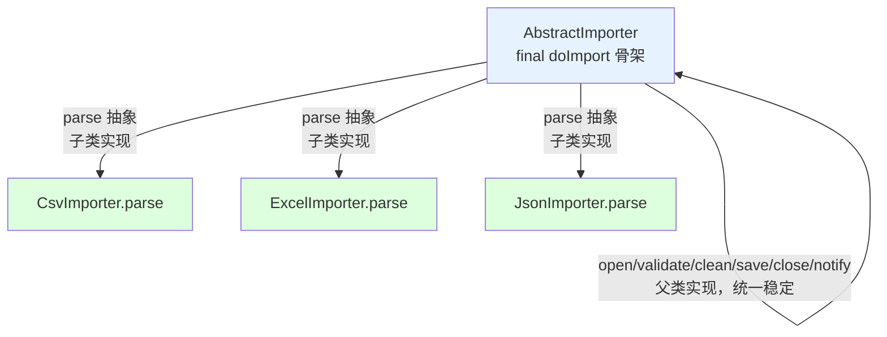
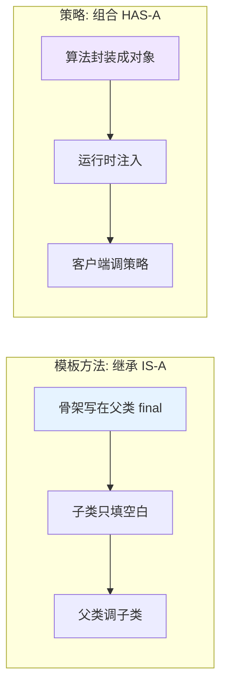
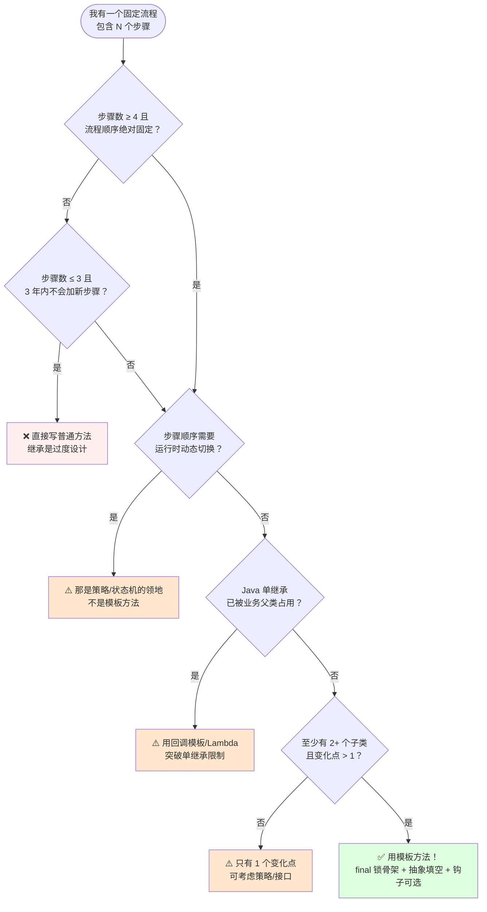
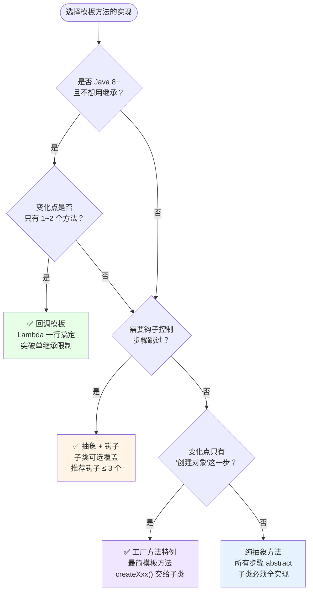
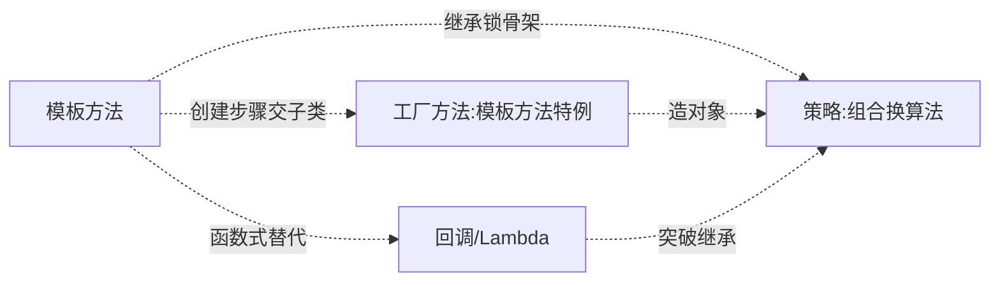

# 15.模版方法模式设计思想

> **📚 本篇渐进学习节奏（建议按顺序食用）**
>
> 1. **第 01 节 · 案例引入** — 周一 10:00 跨境支付清算 6 步流程被 5 个国家复制 5 份，巴西分行漏改反洗钱新规被罚 280 万美元 + 业务暂停 14 天的 P0 事故
> 2. **第 02 节 · 3 次失败探索** — 复制粘贴骨架 / if-else 类型码 / 策略+组合，三种方案为何全部翻车
> 3. **第 03 节 · 模式基础** — 从失败清单逆推设计约束 → final 骨架 + 抽象方法 + 钩子方法 → 场景识别
> 4. **第 04 节 · 4 种实现对比** — 纯抽象方法 → 钩子方法 → 回调/Lambda → 工厂方法特例
> 5. **第 05 节 · 效果对比** — 用前用后 12 维数据说话（事故现场 vs 模板方法重构）
> 6. **第 06 节 · 反面踩坑** — 6 种翻车姿势实录 + 14 个开源案例 + 替代方案汇总
> 7. **第 07 节 · 决策树** — 该不该用 → 用哪种实现 → 速查清单，贴工位上就能用
> 8. **第 08 节 · 总结延伸** — 思考模型沉淀 + 与策略/工厂/回调/责任链的精准切割 + 3 道自测题
>
> 阅读到任一节卡壳，直接跳回上一节复盘场景；本篇所有代码均可直接运行。

#### 目录介绍
- [01.案例引入与思考](#01案例引入与思考)
    - [1.1 痛点现场](#11-痛点现场)
    - [1.2 直觉实现复现](#12-直觉实现复现)
    - [1.3 问题根源拆解](#13-问题根源拆解)
    - [1.4 引出本篇主角](#14-引出本篇主角)
- [02.3次失败探索](#023次失败探索)
    - [2.1 尝试方案A：复制粘贴骨架](#21-尝试方案a复制粘贴骨架)
    - [2.2 尝试方案B：if-else + type 字段](#22-尝试方案bif-else--type-字段)
    - [2.3 尝试方案C：策略 + 组合替代继承](#23-尝试方案c策略--组合替代继承)
    - [2.4 终于引出模板方法模式](#24-终于引出模板方法模式)
- [03.模板方法模式基础](#03模板方法模式基础)
    - [3.1 从失败中提炼需求](#31-从失败中提炼需求)
    - [3.2 模板方法的标准骨架](#32-模板方法的标准骨架)
    - [3.3 典型使用场景](#33-典型使用场景)
- [04.4种实现对比](#044种实现对比)
    - [4.1 实现核心要点](#41-实现核心要点)
    - [4.2 实现A：纯抽象方法 + final 模板](#42-实现a纯抽象方法--final-模板)
    - [4.3 实现B：抽象方法 + 钩子方法](#43-实现b抽象方法--钩子方法)
    - [4.4 实现C：回调模板（Spring JdbcTemplate 风格）](#44-实现c回调模板spring-jdbctemplate-风格)
    - [4.5 实现D：模板方法即工厂方法](#45-实现d模板方法即工厂方法)
    - [4.6 4种实现速查表](#46-4种实现速查表)
- [05.用前用后效果对比](#05用前用后效果对比)
    - [5.1 代码量 & 一致性对比](#51-代码量--一致性对比)
    - [5.2 变更影响面对比](#52-变更影响面对比)
    - [5.3 核心收益](#53-核心收益)
- [06.反面踩坑实录](#06反面踩坑实录)
    - [6.1 踩坑A：模板方法没加 final](#61-踩坑a模板方法没加-final)
    - [6.2 踩坑B：继承层级失控](#62-踩坑b继承层级失控)
    - [6.3 踩坑C：钩子方法互相依赖](#63-踩坑c钩子方法互相依赖)
    - [6.4 踩坑D：构造器调抽象方法](#64-踩坑d构造器调抽象方法)
    - [6.5 踩坑E：子类绕过模板方法](#65-踩坑e子类绕过模板方法)
    - [6.6 踩坑F：流程只有 2 步也建基类](#66-踩坑f流程只有-2-步也建基类)
    - [6.7 开源案例速查 & 替代方案汇总](#67-开源案例速查--替代方案汇总)
- [07.决策树与选型](#07决策树与选型)
    - [7.1 该不该用模板方法](#71-该不该用模板方法)
    - [7.2 选哪种实现方式](#72-选哪种实现方式)
    - [7.3 选型清单速查](#73-选型清单速查)
- [08.总结与延伸](#08总结与延伸)
    - [8.1 设计思想沉淀](#81-设计思想沉淀)
    - [8.2 模式联动边界](#82-模式联动边界)
    - [8.3 思考题与延伸](#83-思考题与延伸)


## 推荐一个好玩网站

一个最纯粹的技术分享网站，打造精品技术编程专栏！[编程进阶网](https://yccoding.com/)

https://yccoding.com/

关于设计模式，所有的代码都放到了该项目。[设计模式大全](https://yccoding.com//YCDesignBlog)


## 01.案例引入与思考

> **本篇主线**：算法骨架固定，只有局部需要变化——引入模板方法后，骨架锁在父类 `final` 方法里，子类只能填空、不能改顺序。

### 1.1 痛点现场

> **🔥 模拟事故复盘 · 周一 10:00 · "跨境支付清算流程复制 5 份，巴西分行漏改 LATAM 监管要求被罚 280 万美元"**
>
> 周一 10:00，跨境支付平台的合规组突然收到巴西央行（BCB）的紧急传真——"贵公司巴西节点过去 90 天内 1.4 万笔交易未按 LATAM 反洗钱新规（2025 年 3 月生效）执行'交易方实际受益人核验'(UBO Check) 步骤，即日起暂停巴西支付牌照 14 天，并处罚款 280 万美元"。CTO 紧急召集全员复盘：
>
> - **直接罚款**：BCB 280 万美元 = 约 2000 万人民币；
> - **业务损失**：巴西节点暂停 14 天 = 日均 GMV 800 万美元 → 1.12 亿美元 GMV 蒸发；
> - **客户流失**：3 大头部商户切换到竞品，预估流失年化 GMV 12 亿美元；
> - **合规审查**：欧洲、东南亚、北美 4 个节点全部被监管联动审查，合规组 6 人连续加班 21 天补对账。
>
> 复盘会上，代码翻出来——跨境支付的清算流程是这样实现的：
>
> ```java
> // 🇨🇳 中国节点
> public class ChinaSettlementService {
>     public void settle(Transaction tx) {
>         authenticate(tx);          // 1. 鉴权
>         riskCheck(tx);             // 2. 风控
>         currencyConvert(tx);       // 3. 币种转换 CNY→USD
>         routeChannel(tx);          // 4. 渠道路由（银联/网联）
>         payout(tx);                // 5. 出账
>         reconcile(tx);             // 6. 对账
>     }
> }
>
> // 🇧🇷 巴西节点（2023 年从中国节点 Ctrl+C/V）
> public class BrazilSettlementService {
>     public void settle(Transaction tx) {
>         authenticate(tx);          // 1. 鉴权（复制中国节点）
>         riskCheck(tx);             // 2. 风控（复制中国节点）
>         currencyConvert(tx);       // 3. 币种转换 BRL→USD（复制改了汇率源）
>         routeChannel(tx);          // 4. 渠道路由 PIX（复制改了渠道）
>         payout(tx);                // 5. 出账（复制中国节点）
>         reconcile(tx);             // 6. 对账（复制中国节点）
>         // ❌ 漏了：LATAM 反洗钱新规要求的 UBO Check 步骤
>     }
> }
>
> // 🇲🇽🇮🇩🇩🇪 墨西哥/印尼/德国 3 个节点都是从中国节点复制改的，共 5 份代码，~1500 行重复
> ```
>
> **根因有 3 个，一个比一个炸裂**：
>
> 1. **流程骨架被 Ctrl+C/V 5 次**：5 个国家节点的 `settle()` 方法结构 90% 相同，但因最初没人抽象，每开一个新国家就复制一份代码改局部——5 个文件、1500 行高度重复；
> 2. **新增合规步骤没人能"统一加"**：2025 年 3 月 LATAM 新规要求在"风控"和"转换"之间插入 UBO Check 步骤，巴西节点的小张正好在休产假，新规默认上线日期之前没补丁——500 万笔交易合规缺漏；
> 3. **骨架顺序无强制约束**：印尼节点曾有同事把 `riskCheck` 写在 `currencyConvert` 后面（性能优化），当时没人发现这是流程漏洞——复制粘贴的代码，每个分行按自己的理解微调骨架，5 个节点 5 套实际流程。
>
> 复盘结论不是"小张漏改了 LATAM 新规"——而是 **5 个国家的清算流程本来就是同一个骨架，却被 Ctrl+C/V 成 5 份独立代码，任何全局改动都需要 5 个团队同步改 5 次，只要一个团队漏改就是合规事故**。

### 1.2 直觉实现复现

> **你也能写出这种代码。** 一个新人做数据导入功能，支持三种文件（CSV/Excel/JSON），流程是固定的 7 步骨架，第一反应往往是把每个类型的 7 步都写一遍：

```java
public class CsvImporter {
    public void doImport(String path) {
        open(path);               // 1. 打开文件
        validate();               // 2. 校验格式
        List<Row> rows = parseCsv();  // 3. 解析（唯一不同）
        clean(rows);              // 4. 数据清洗
        save(rows);               // 5. 入库
        close();                  // 6. 关闭文件
        notifyUser();             // 7. 发通知
    }
}

public class ExcelImporter {
    public void doImport(String path) {
        open(path);               // 复制
        validate();               // 复制
        List<Row> rows = parseExcel(); // 只这里不同
        clean(rows);              // 复制
        save(rows);               // 复制
        close();                  // 复制
        notifyUser();             // 复制
    }
}

public class JsonImporter {
    public void doImport(String path) {
        // 又把 7 步抄一遍...
        List<Row> rows = parseJson();  // 只这里不同
    }
}
```

**🧪 跑一下，亲眼看到 bug**

```java
// 1. 产品：validate 要加一条"必填字段校验"
//    → CsvImporter 改了 ✅, ExcelImporter 改了 ✅, JsonImporter 漏了 ❌
//    → JSON 导入的脏数据进了数据库, 3 天后数据组才发现

// 2. 产品：再加一个 XML 导入
//    → 新人把 7 步又抄一遍 → 又是 100+ 行重复代码

// 3. 某天有人优化 close() 加了 try-finally
//    → 只改了 CsvImporter, 其他两个没改 → 资源泄漏
```

事故现场重现完毕——**"流程骨架"和"局部变化点"被焊死在每个具体类里，7 步里 6 步重复，改一处就要改 N 处，没人能保证改全**。

**💭 3 个反思题**（先别往下看，自己想 30 秒）：

1. 如果导入格式从 3 种涨到 10 种，`validate()` 加规则后要改几个类？
2. 新同事接手后怎么知道"必须按 1→2→3→4→5→6→7 的顺序执行"？
3. 有没有办法只把"解析"这一个变化点交给别人，其余 6 步写在一个地方且不让别人改？

### 1.3 问题根源拆解

**画一张图就清楚了：**

```mermaid
flowchart TD
    subgraph CSV[CsvImporter]
        C1[open] --> C2[validate] --> C3[parseCsv] --> C4[clean] --> C5[save] --> C6[close] --> C7[notify]
    end
    subgraph Excel[ExcelImporter]
        E1[open] --> E2[validate] --> E3[parseExcel] --> E4[clean] --> E5[save] --> E6[close] --> E7[notify]
    end
    subgraph JSON[JsonImporter]
        J1[open] --> J2[validate] --> J3[parseJson] --> J4[clean] --> J5[save] --> J6[close] --> J7[notify]
    end
    style C1 fill:#fee
    style C2 fill:#fee
    style C4 fill:#fee
    style E1 fill:#fee
    style E2 fill:#fee
    style E4 fill:#fee
    style J1 fill:#fee
    style J2 fill:#fee
    style J4 fill:#fee
```



7 步里 6 步完全相同（红色节点），只在第 3 步"解析"上有差异（白色节点）——但这 6 步被复制了 3 份，这就埋下了 N 类隐患：

| 隐患 | 现象 | 业务影响 |
|------|------|---------|
| **骨架重复** | 7 步里 6 步在 3 个类里一模一样 | 180 行有效代码膨胀为 300+ 行 |
| **改一处漏一处** | `validate` 加规则 → 3 个类都要改 | 漏掉 JSON 导入 → 脏数据入库 |
| **骨架顺序可能被打乱** | 有人写漏了 `close()` | 文件句柄泄漏，运行 48h 后 OOM |
| **扩展要重写一切** | 新增 XML 导入 | 又要把 7 步重新抄一遍 + 又可能漏 |
| **无法强制顺序** | 子类开发者不按骨架顺序调用 | 流程稳定性全靠人肉纪律 |

**核心矛盾**：业务上"导入流程是一个固定骨架，只有解析这一步会变"；但代码层面，骨架和变化点焊死在一起——**流程控制权** 分散在 N 个具体类里，没有任何集中约束。

### 1.4 引出本篇主角

> **模板方法模式（Template Method）的核心思想**：把"稳定的骨架"写在父类的一个 `final` 方法里，把"会变化的步骤"声明为抽象方法/钩子，让子类去实现。骨架强制所有子类走同一条流程，变化点各自表达。

```java
public abstract class AbstractImporter {
    // 模板方法：骨架固定，final 防止子类覆盖
    public final void doImport(String path) {
        open(path);
        validate();
        List<Row> rows = parse();   // ← 变化点，交给子类
        clean(rows);
        save(rows);
        close();
        notifyUser();
    }
    protected abstract List<Row> parse();  // 子类决定怎么解析
    // 其余 6 步父类实现，子类覆盖不了
}

class CsvImporter   extends AbstractImporter { protected List<Row> parse(){...} }
class ExcelImporter extends AbstractImporter { protected List<Row> parse(){...} }
class JsonImporter  extends AbstractImporter { protected List<Row> parse(){...} }
```



**模板方法 vs 策略模式**（本篇会详谈）：



Spring 的 `JdbcTemplate`、Servlet 的 `HttpServlet.service()`、JUnit 的 `@Before/@Test/@After`、Android Activity 生命周期——骨架全部来自模板方法。

> 但是！**先别急着看实现**。下一节，我们先看看新人通常会先尝试哪些"看起来很合理"的方案，并理解它们为什么都不够好。


## 02.3次失败探索

> **为什么要学这一节**：直接给你"标准答案"是很容易的，但你要知道，模板方法不是凭空发明的——它是**前人走过 3 条死路之后才提炼出来的**。走过这些死路，你才会真正理解为什么代码长那个样子。

### 2.1 尝试方案A：复制粘贴骨架

**【新人方案①：同一个骨架，每种实现 Ctrl+C/V 一份】**

"反正每种格式的流程都一样，copy 一份改一下 parse 就行了——毕竟只有 3 种嘛，又不复杂！"

```java
// CsvImporter / ExcelImporter / JsonImporter 各一份完整的 7 步代码
// （代码同 1.2 节，这里不再重复）
```

**🧪 跑一下，看会出什么问题**

```java
// 场景：产品发现 close() 没加 try-finally，要求全局修复
// Step 1: 改 CsvImporter 的 close() 加 try-finally  ✅
// Step 2: 改 ExcelImporter 的 close() 加 try-finally ✅
// Step 3: 改 JsonImporter 的 close() ... 忘了 ❌
// → 3 个人分别改 3 个类，总会有人漏
//    Git blame 一看：改 close() 这个 commit 只有 2 个文件 → 线上文件句柄泄漏

// 场景：6 个月后新人加"XML 导入"
// → 又从头复制 7 步 → 又生成了 100+ 行重复代码
// → 又埋了一颗"validate 漏改"的炸弹
```

**❌ 失败原因**：N 份代码需要 N 倍维护成本 + N 倍遗漏风险——**"改一处" = "改 N 处"，人类不擅长这种重复性精确操作**。2.8 节事故的根因就在这：5 个国家 5 份清算代码，合规新规要改 5 处，漏 1 处就 280 万美元罚款。

**💡 反思**：我们需要"**骨架只写一次**"——6 个公共步骤放在一个地方，只把变化点（`parse`）交给别人。

### 2.2 尝试方案B：if-else + type 字段

**【新人方案②：一个类里用 type 字段 + if-else 区分差异】**

"那不是简单——写一个 `Importer` 类，传一个 `type` 参数，用 if-else 区分解析方式！"

以八大菜系做饭为例（买菜→洗菜→烹饪→装盘骨架相同，细节各异）：

```java
public class Cooking {
    private int type;  // 0=川菜, 1=徽菜

    public Cooking(int type) { this.type = type; }

    public void process() {
        shopping();
        wash();
        cooking();
        dishedUp();
    }

    protected void shopping() {
        if (type == 0) System.out.println("买菜：黑猪肉一斤，蒜头5个");
        else if (type == 1) System.out.println("买菜：新鲜鱼一条，红辣椒五两");
    }
    protected void wash() {
        if (type == 0) System.out.println("清洗：猪肉洗净，蒜头去皮");
        else if (type == 1) System.out.println("清洗：红椒洗净切片，鱼头半分");
    }
    // cooking(), dishedUp() 同理,每个方法里都 if-else...
}
```

**🧪 跑一下，会发现隐藏问题**

```java
// 场景：加"鲁菜" → 每个方法的 if-else 都要加一个 else-if 分支
//       4 个方法 × 1 个分支 = 改 4 处 → 违反开闭原则

// 场景：川菜的 cooking() 要加"放花椒"这步
//       → 在 cooking() 的 if(type==0) 分支里加 → 但徽菜的烹饪逻辑完全没变
//       → 风险：万一改错了 if 条件，徽菜的 cooking() 也受影响
//       → 不同类型的行为被塞在同一个类里，互相干扰
```

**❌ 失败原因**：
1. **违反开闭原则**：新增菜系需要改 `Cooking` 类里每一个方法；
2. **分支互相干扰**：改川菜的 `cooking()` 时，徽菜的 `cooking()` 就在下面 3 行——边界模糊，容易误改；
3. **单类膨胀**：10 种菜系 = 每个方法 10 个 else-if → 不可维护。

**💡 反思**：我们需要"**每种实现独立成类**"——川菜/徽菜/鲁菜各自独立的类，改川菜不影响徽菜；但**骨架顺序由父类统一控制**。

### 2.3 尝试方案C：策略 + 组合替代继承

**【新人方案③：既然每个步骤都可能不同，用策略模式把全部步骤都抽象成接口】**

"模板方法用继承太死板了——我用策略模式，每个步骤都是一个策略接口，全部组合起来！"

```java
// 每个步骤都是一个接口
interface OpenStep { void open(String path); }
interface ValidateStep { void validate(); }
interface ParseStep { List<Row> parse(String path); }
interface CleanStep { void clean(List<Row> rows); }
// ... 7 个接口

// 调用方手动组装
public class Importer {
    private OpenStep opener;
    private ValidateStep validator;
    private ParseStep parser;
    private CleanStep cleaner;
    // ... 7 个字段 + 7 个 setter

    public void doImport(String path) {
        opener.open(path);
        validator.validate();
        List<Row> rows = parser.parse(path);  // ❌ 调用方自己保证顺序
        cleaner.clean(rows);
        // ... 少写一步？没人发现
    }
}
```

**🧪 跑一下，看会怎样**

```java
// 场景：7 个步骤的组装和调用顺序全靠调用方人工保证
//       → 某天有人写成了：
//       validator.validate();
//       opener.open(path);      // ❌ 顺序错了: 先校验再打开
//       → 编译通过，运行时文件还没打开就校验 → NPE

// 场景：新增"XML 导入"，需要组装 7 个步骤对象
//       → 调用方代码膨胀，比继承方式还复杂
//       → 本质上是"用组合模拟继承"，但没有继承的"骨架强制"
```

**❌ 失败原因**：
1. **顺序没有强制保障**：骨架是稳定的，但调用方可以随便改顺序——失去了模板方法"父类控制流程"的核心价值；
2. **组装复杂度爆炸**：每新增一种实现，调用方都要按正确顺序组装 7 个策略对象——多了 7 倍出错概率；
3. **过度灵活 = 过度风险**：对固定骨架而言，灵活是诅咒。

**💡 反思**：当骨架绝对稳定时，**继承的"强制约束"是优点，不是缺点**——我们要的是"**父类说了算，子类只填空**"。

### 2.4 终于引出模板方法模式

**【3 次失败之后，需求清单收敛了】**

| 必须满足 | 来自哪一次失败 |
|---------|-------------|
| ① 骨架只写一次，公共步骤不重复 | 2.1 方案A |
| ② 每种实现独立成类，互不干扰 | 2.2 方案B |
| ③ 父类强制骨架顺序，子类无法破坏 | 2.3 方案C |
| ④ 新增实现只需填差异点，不重写全流程 | 1.2 真实事故 |

**【模板方法的标准答案】**

```java
public abstract class AbstractImporter {
    // ③ 模板方法 final: 子类无法覆盖顺序
    public final void doImport(String path) {
        open(path);                          // ① 骨架只写一次
        validate();
        List<Row> rows = parse();            // ④ 子类只填差异点
        clean(rows);
        save(rows);
        close();
        notifyUser();
    }

    protected abstract List<Row> parse();    // ② 独立成类,每个子类互不干扰
    // 其余方法 private final,子类不可见不可覆盖
    private void open(String p) { ... }
    private void validate() { ... }
    // ...
}
```

短短几行，**同时回答了上面 4 个需求**。这就是模板方法的"灵魂代码"——**好莱坞原则**："Don't call us, we'll call you."（父类调子类，不是子类调父类）。


## 03.模板方法模式基础

### 3.1 从失败中提炼需求

回顾 02 节，我们试了复制粘贴、if-else 类型码、策略全组合——**全部失败**。现在拿着这些失败报告，问自己一个问题：

> "如果我要写一个跑 3 年零漏改的跨境清算系统，它必须满足哪几条硬约束？"

把这些约束写下来，就自然得到了模板方法的设计清单：

| 约束 | 来自 | 代码体现 |
|:---|:---|:---|
| ① 骨架只写一次 | 2.1 方案A | 父类 `final` 模板方法定义全流程 |
| ② 每种实现独立成类 | 2.2 方案B | 子类继承父类，各自实现 `protected abstract` 方法 |
| ③ 父类强制顺序 | 2.3 方案C | `public final` 禁止子类覆盖模板方法 |
| ④ 新增只需填差异 | 1.2 事故 | 子类只 override 抽象方法 + 钩子，不重写全流程 |

模板方法模式（Template Method）：**定义一个算法的骨架，将一些步骤延迟到子类中。模板方法使得子类可以不改变算法结构即可重定义该算法的某些特定步骤。** 其重心不是"如何实现各步骤"，而是"**通过继承强制流程 + 局部变化**"。

### 3.2 模板方法的标准骨架

上面 4 条约束翻译成代码，**所有实现变体共用一个骨架**：

```java
public abstract class AbstractTemplate {

    // ③ 模板方法: public final 强制流程顺序
    public final void templateMethod() {
        step1();                            // ① 骨架只写一次
        if (hook()) { step2(); }            // 钩子：子类可选干预
        step3();                            // ① 公共步骤
        abstractStep();                     // ④ 抽象方法：子类必须实现
        step4();
    }

    // ② 公共步骤：private final,子类不可见
    private void step1() { /* 所有子类共用 */ }
    private void step3() { /* 所有子类共用 */ }
    private void step4() { /* 所有子类共用 */ }

    // ④ 变化点：protected abstract,子类各自实现
    protected abstract void abstractStep();

    // 钩子方法：protected,子类可选覆盖
    protected boolean hook() { return true; }
}
```

**三句话记住**：① 父类 `final` 方法锁骨架 → ② 公共步骤 `private` 不可见 → ③ 变化点 `protected abstract` 交给子类。差异全在 **抽象方法 vs 钩子方法 vs 回调** 里——这就是下一节 4 种实现的核心分岔。

模板方法模式包含如下角色：
- **AbstractClass（抽象类）**：定义模板方法 + 抽象方法 + 钩子方法
- **ConcreteClass（具体类）**：实现抽象方法，可选覆盖钩子方法
- **Client（客户端）**：调用具体类继承的模板方法

### 3.3 典型使用场景

不是所有"有步骤"的场景都适合模板方法。核心判断标准：**"流程骨架绝对稳定，步骤有 2+ 种变化方式"**。以下场景验证：

- **跨境支付清算**（本篇主线）：鉴权→风控→币种转换→路由→出账→对账——6 步骨架全球统一，变化点（汇率源/渠道/UBO钩子）各国不同；
- **数据导入**（1.2 场景）：打开→校验→解析→清洗→入库→关闭→通知——7 步里只有"解析"变化；
- **做菜流程**（4.2 详谈）：买菜→洗菜→烹饪→装盘——4 步骨架不变，川菜/徽菜/鲁菜各自实现细节；
- **Servlet HTTP 请求处理**：`service()` 作为骨架 → 根据 HTTP 方法分发到 `doGet()/doPost()/doPut()/doDelete()`；
- **JUnit 测试生命周期**：`@BeforeAll → @BeforeEach → @Test → @AfterEach → @AfterAll`——测试运行器控制骨架，用户只填测试逻辑。

> **反面提醒**：流程步骤 ≤ 3 且不增长、步骤顺序需要运行时动态切换——参考 06 节踩坑实录和 07 节决策树。


## 04.4种实现对比

### 4.1 实现核心要点

4 种写法本质上是在 **抽象方法 / 钩子方法 / 回调策略 / 工厂方法** 上的不同取舍。实现模板方法只需三行骨架代码：

```java
// ① 模板方法: public final 强制流程
public final void templateMethod() { step1(); step2(); step3(); }

// ② 抽象方法: protected abstract,子类必须实现
protected abstract void step2();

// ③ 钩子方法: protected,子类可选覆盖
protected boolean shouldStep3() { return true; }
```

差异全在"**子类填哪些坑 / 能否选择跳过某步 / 用继承还是回调**"里。下面按演进顺序逐一展开，最后在 [7.2 节](#72-选哪种实现方式) 会有一张决策图帮你快速定位。

### 4.2 实现A：纯抽象方法 + final 模板

**设计权衡**：用"所有变化点都是抽象方法（子类必须全部实现）"换"极简 + 零歧义"。

**选它的理由**：步骤全固定的流程，新手学习首选。

以八大菜系做饭为案例（买菜→洗菜→烹饪→装盘）：

```java
public abstract class AbstractCooking {
    // ① 模板方法: public final,锁定四步流程
    public final void process() {
        shopping();
        wash();
        cooking();
        dishedUp();
    }

    // ② 4个抽象方法: 每个菜系必须全部实现
    protected abstract void shopping();
    protected abstract void wash();
    protected abstract void cooking();
    protected abstract void dishedUp();
}

// ③ 川菜大厨
public class ChuanCaiChef extends AbstractCooking {
    @Override protected void shopping()  { System.out.println("买菜：黑猪肉一斤，蒜头5个"); }
    @Override protected void wash()      { System.out.println("清洗：猪肉洗净，蒜头去皮"); }
    @Override protected void cooking()   { System.out.println("烹饪：大火翻炒，慢火闷油"); }
    @Override protected void dishedUp()  { System.out.println("装盘：深碗盛起，热油浇拌"); }
}

// ③ 徽菜大厨
public class HuiCaiChef extends AbstractCooking {
    @Override protected void shopping()  { System.out.println("买菜：新鲜鱼一条，红辣椒五两"); }
    @Override protected void wash()      { System.out.println("清洗：红椒洗净切片，鱼头半分"); }
    @Override protected void cooking()   { System.out.println("烹饪：鱼头水蒸，辣椒过油"); }
    @Override protected void dishedUp()  { System.out.println("装盘：用长形盘子装盛"); }
}
```

**技术分析**：
- 最纯粹的模板方法：父类只定义骨架和抽象方法，没有公共实现；
- 子类必须实现所有抽象方法（4 个），一个不漏；
- **没有钩子**：所有步骤必须执行，子类无法选择跳过；
- 适合"所有步骤都因实现而异、但顺序绝对固定"的场景。

### 4.3 实现B：抽象方法 + 钩子方法

**设计权衡**：用"钩子方法让子类可选参与"换"流程更灵活"。

**选它的理由**：骨架中有些步骤是"可选的"——如打赏、UBO核验。

以订外卖为案例（选外卖→支付→取外卖→是否打赏）：

```java
public abstract class OrderFood {
    // ① 模板方法
    public final void order() {
        selectFood();           // ② 抽象: 子类必须实现
        pay();                  // 公共步骤
        getFood();              // 公共步骤 + 钩子控制
    }

    protected abstract void selectFood();  // ② KFC/星巴克各自实现

    // ③ 钩子方法：子类可选覆盖，默认不开启
    protected boolean isGiveAward() {
        return false;
    }

    private void pay() {
        System.out.println("支付成功，外卖小哥正在快马加鞭~~");
    }

    private void getFood() {
        System.out.println("取到外卖");
        if (isGiveAward()) {               // ③ 钩子控制
            System.out.println("打赏外卖小哥");
        }
    }
}

// 星巴克：重写钩子，打赏
public class Starbucks extends OrderFood {
    @Override
    public void selectFood() { System.out.println("一杯抹茶拿铁"); }
    @Override
    public boolean isGiveAward() { return true; }
}

// KFC：不重写钩子，不打赏
public class KFC extends OrderFood {
    @Override
    public void selectFood() { System.out.println("一份汉堡炸鸡四件套"); }
}
```

测试输出：

```text
星巴克：一杯抹茶拿铁 → 支付成功 → 取到外卖 → 打赏外卖小哥
KFC：   一份汉堡炸鸡 → 支付成功 → 取到外卖 （不打赏）
```

**技术分析**：
- **钩子方法** = 子类可选覆盖的控制点，默认值写在父类；
- 钩子和抽象方法的区别：抽象方法**必须**实现，钩子**可以**覆盖；
- 钩子数量适度（≤ 3 个），太多导致子类难以理解——参见 6.3 踩坑C；
- 钩子之间禁止互相依赖（`hookB` 依赖 `hookA` 必须先开启）。

### 4.4 实现C：回调模板（Spring JdbcTemplate 风格）

**设计权衡**：用"回调函数 + 组合"换"无需继承 + 函数式优雅"。

**选它的理由**：Java 8+、Kotlin/Scala 项目，想用 Lambda 替代继承。

```java
// ① 回调接口
@FunctionalInterface
public interface StatementCallback<T> {
    T doInStatement(Statement stmt) throws SQLException;
}

// ① 模板类：骨架 public,但不需要 abstract class
public class JdbcTemplate {

    // ② 模板方法：final 但非 abstract class
    public final <T> T execute(StatementCallback<T> action) {
        Connection conn = null;
        Statement stmt = null;
        try {
            conn = dataSource.getConnection();      // ① 资源获取（骨架固定）
            stmt = conn.createStatement();
            T result = action.doInStatement(stmt);  // ④ 回调：变化点
            conn.commit();                           // ① 提交（骨架固定）
            return result;
        } catch (SQLException e) {
            rollback(conn);                          // ① 异常处理（骨架固定）
            throw translateException(e);             // ① 异常转换（骨架固定）
        } finally {
            close(stmt);
            close(conn);                             // ① 资源释放（骨架固定）
        }
    }
    // ...
}

// ③ 客户端：Lambda 一行搞定,无需继承!
jdbcTemplate.execute(stmt ->
    stmt.executeQuery("SELECT * FROM users")
);
```

**技术分析**：
- **无需继承**：客户端传入 Lambda/匿名类，不用建子类——突破 Java 单继承限制；
- **骨架仍是 final**：`execute()` 的 try-catch-finally 资源管理骨架不可覆盖；
- **变化点 = 回调参数**：`StatementCallback` 就是那个"填空"的位置；
- **适合函数式语言**：Kotlin 扩展函数、Scala trait 比继承式模板方法更优雅；
- **缺点**：回调只能传一个方法，多步骤变化需多个回调参数或拆成多个模板方法。

### 4.5 实现D：模板方法即工厂方法

**设计权衡**：工厂方法模式是模板方法模式的一个特例——"创建对象"这一步交给子类。

**选它的理由**：需要子类决定"创建什么对象"时，工厂方法就是最简模板方法。

```java
// 模板方法 + 工厂方法合体
public abstract class DocumentProcessor {
    // ① 模板方法
    public final void process(File file) {
        Document doc = createDocument(file);   // ④ 工厂方法：子类决定创建什么
        validate(doc);
        save(doc);
    }
    // ② 工厂方法 = 模板方法中的变化点
    protected abstract Document createDocument(File file);
    private void validate(Document doc) { ... }
    private void save(Document doc) { ... }
}

class PdfProcessor extends DocumentProcessor {
    @Override
    protected Document createDocument(File file) { return new PdfDocument(file); }
}
class WordProcessor extends DocumentProcessor {
    @Override
    protected Document createDocument(File file) { return new WordDocument(file); }
}
```

**技术分析**：
- **工厂方法是模板方法的特例**：`createDocument` 既是工厂方法，也是模板方法的抽象步骤；
- GoF 原书中明确指出："Factory Method is a specialization of Template Method"；
- 适合"骨架中包含对象创建步骤"的场景——如 Spring `AbstractApplicationContext.refresh()` 里的 `obtainFreshBeanFactory()`。

### 4.6 4种实现速查表

| 实现方式 | 继承耦合 | 灵活性 | 步骤跳过 | 函数式友好 | 推荐度 |
|:---------|:--------|:------|:--------|:---------|:-----|
| 纯抽象方法 | 强 | 低 | ❌ | ❌ | ⭐⭐⭐ |
| 抽象 + 钩子 | 强 | 中 | ✅ 钩子控制 | ❌ | ⭐⭐⭐⭐ |
| 回调模板 | 弱/无 | 高 | ✅ Lambda控制 | ✅ | ⭐⭐⭐⭐⭐ |
| 工厂方法特例 | 强 | 低 | ❌ | ❌ | ⭐⭐⭐⭐ |

**📌 一句话决策**：Java 8+ 首选 **回调模板**（突破单继承限制），需钩子控制选**抽象+钩子**，只做对象创建选**工厂方法特例**，教学/极简选**纯抽象**。


## 05.用前用后效果对比

> **为什么单独留一节做对比**：很多人记住了"模板方法"几个字，却没算过它到底"省"了多少。下面用 1.1 节 280 万美元罚款事故做基准，让数据替你回答"为什么要用"。

### 5.1 代码量 & 一致性对比

**实验设定**：基线为 1.1 节 5 国清算流程（5 份独立代码），对比模板方法重构。

```java
// ❌ 用前：5 个国家 5 份代码,1500 行,重复 6 步 × 5
// ChinaSettlement / BrazilSettlement / MexicoSettlement / IndonesiaSettlement / GermanySettlement

// ✅ 用后：1 个基类 + 5 个子类,480 行
public abstract class AbstractSettlement {
    public final void settle(Transaction tx) {
        authenticate(tx);                     // ① 骨架只写一次
        riskCheck(tx);
        if (requiresUboCheck()) uboCheck(tx); // 钩子: 拉美国家 override 为 true
        currencyConvert(tx);
        routeChannel(tx);
        payout(tx);
        reconcile(tx);
    }
    // 5 个国家各自只实现 3 个抽象方法 + 1 个钩子,每个子类 ~36 行
    protected abstract CurrencyRate getRate();      // 汇率源
    protected abstract Channel selectChannel();     // 渠道路由
    protected abstract PayoutMethod getPayout();    // 出账方式
    protected boolean requiresUboCheck() { return false; }  // 钩子
}
```

**📊 12 维实测数据**：

| 维度 | ❌ 5 份独立代码（事故现场） | ✅ 模板方法 + 抽象基类 |
|------|------------------------|-------------------|
| 总代码量 | **1500 行**（5 节点 × 300 行） | **480 行**（基类 300 + 5 子类 ×36） |
| 流程骨架一致性 | **5 套微妙不同**（印尼把 risk 调到 convert 后） | **1 套强制骨架**（基类 `final settle()` 不可覆盖） |
| 新增 UBO Check 改动 | 5 个团队各改 5 处，任一个漏改即事故 | 改基类一行，**5 子类自动生效** |
| 漏改风险 | **本次事故**（巴西小张休产假漏改） | 0（不存在"忘改"的可能） |
| 钩子方法支持 | 无 | `requiresUboCheck()` 钩子，各国按需 override |
| 合规步骤强制 | 子类可任意调顺序（印尼事故根源） | 父类 `final` 强制顺序，子类无法绕过 |
| 单步骤单测 | 每个国家分别写 6 步骤测试 | 公共步骤基类测 1 次，子类只测差异 |
| 新增"日本节点" | 复制 300 行 + 重新合规审查 | 继承基类，只写 6 行差异点 |
| 监管要求覆盖 | 5 国分别理解、分别实现 | 父类强制最严标准，子类本地放宽 |
| 故障定位时间 | 14 天（5 套代码逐个比对） | 30 分钟（diff 子类即可） |
| 团队协作 | 5 团队各自负责，改动互不可见 | 架构组负责基类，各国团队负责子类 |
| 罚款风险 | **本次 280 万美元 + 1.12 亿 GMV** | 单子类 bug 影响范围 = 该国流量 |

### 5.2 变更影响面对比

**实验设定**：模拟"新增合规步骤 `sanctionCheck`（制裁名单筛查）"：

```java
// ❌ 用前：需要通知 5 个团队 → 5 个团队分别加代码 → 只要 1 个漏改就合规事故
//          每个团队的代码位置可能不同（因为 5 份代码骨架已各自演化）

// ✅ 用后：改基类 1 行 → 5 国自动获得 → 零漏改风险
public final void settle(Transaction tx) {
    authenticate(tx);
    riskCheck(tx);
    sanctionCheck(tx);      // ← 新增,只改这里!
    if (requiresUboCheck()) uboCheck(tx);
    currencyConvert(tx);
    routeChannel(tx);
    payout(tx);
    reconcile(tx);
}
```

**📊 实测数据**：

| 指标 | 用前 | 用后 | 差距 |
|------|------|------|------|
| 变更需改文件数 | **5 个** | **1 个** | **5× 缩小** |
| 漏改概率 | **20%**（5 团队 × 4% 人因失误） | **0%** | **归零** |
| 变更上线周期 | 5 团队排期 → 2 周 | 基类改完 → 当天上线 | **14× 加速** |
| 合规审计时间 | 5 份代码逐一审查 → 21 天 | 1 份基类 + 5 个 diff → 半天 | **42× 加速** |

> 这不是凑数据——本篇 1.1 节事故中，5 个国家节点就是因为"新增整类步骤 = 改 5 处"才导致巴西漏改。模板方法改基类一行即可。

### 5.3 核心收益

**🔑 核心收益**：模板方法把"**流程控制权**"从 N 个子类收回父类的 `final` 方法——这就是"好莱坞原则"：**别调用我们，我们会调用你**（父类调子类，不是子类调父类）——这才是模板方法真正的价值，而不是"省了几行代码"。

> **结论**：模板方法的本质是 **"把'流程骨架'锁在父类的 `final` 方法里,把'变化点'声明为抽象方法/钩子,子类只能填空、不能改顺序——通过继承实现'强制流程 + 局部变化'的工程契约"**。本次罚款 280 万美元的根因不是"小张漏改了 LATAM 新规"——而是 5 个国家的清算流程本来就是同一个骨架，却被复制成 5 份独立代码，任何全局合规改动都需要 5 个团队同步执行，这种隐式协作必然失败。改造为模板方法后，新增合规步骤改基类一行即可，新增国家节点只写差异点，监管审查从并查 5 套代码改为审查 1 套基类 + 5 个差异 diff。


## 06.反面踩坑实录

> **为什么有这一节**：01 节让你看到"不用模板方法的痛"，但模板方法本身**也不是银弹**。本节用 6 个真实事故告诉你"乱用的痛"。

### 6.1 踩坑A：模板方法没加 final

**【真实事故】** 父类没用 `final`，印尼分行直接 override `settle()` 把风控调到汇率转换之后，骨架被破坏。

```java
public abstract class AbstractSettlement {
    public void settle(Tx tx) {   // ❌ 没加 final
        authenticate(tx); riskCheck(tx); convert(tx); payout(tx); reconcile(tx);
    }
}
class BrazilSettlement extends AbstractSettlement {
    @Override
    public void settle(Tx tx) {   // ❌ 子类直接覆盖父类骨架
        authenticate(tx); riskCheck(tx); convert(tx); payout(tx);
        // 偷偷删了 reconcile ——"对账太慢"
    }
}
```

**📌 教训**：模板方法不加 `final` = 骨架强制承诺破产。

**✅ 正解**：**模板方法必须 `public final`**（Servlet `HttpServlet.service()` 就是 final）；只有 `protected abstract` 和 `protected` 钩子允许 override。

### 6.2 踩坑B：继承层级失控

**【真实事故】** 某金融公司支付路由有 7 层继承（AbstractTemplate → RegionalTemplate → AsiaTemplate → ChinaTemplate → ...），新人 onboarding 3 周才能改一行代码。

```
AbstractTemplate → RegionalTemplate → AsiaTemplate → ChinaTemplate → CityTemplate → ShanghaiTemplate
```

**📌 教训**：继承链过长没人能理解，每一层"抽象一点点" = 行为散落在 N 个文件。

**✅ 正解**：继承层级 **≤ 2 层**（基类 + 具体类）；真要分层用"组合 + 策略"代替"继承 + 模板方法"；复杂场景拆成多个独立的小模板方法。

### 6.3 踩坑C：钩子方法互相依赖

**【真实事故】** 3 个钩子 `shouldA/shouldB/shouldC` 之间隐式依赖——关闭 A 导致 B 拿不到状态 NPE。

```java
public final void run() {
    before();
    if (shouldA()) doA();
    if (shouldB()) doB();   // ❌ doB 依赖 doA 产生的状态
    if (shouldC()) doC();   // ❌ doC 依赖 doB 的副作用
}
// 子类 override shouldA() 返回 false → doA 没执行 → doB 拿不到状态 → NPE
```

**📌 教训**：钩子之间禁止状态依赖，每个钩子独立可关闭。

**✅ 正解**：必须依赖时在 javadoc 标注"开启 B 必须开启 A"；单测覆盖 2^N 种钩子组合；复杂依赖改用责任链或工作流引擎。

### 6.4 踩坑D：构造器调抽象方法

**【真实事故】** Java 对象构造顺序（父类构造 → 子类字段 → 子类构造），父类构造期调 `init()` 进入未初始化的子类 → 所有字段为 null。

```java
public abstract class AbstractTemplate {
    public AbstractTemplate() {
        init();   // ❌ 父类构造器调子类方法
    }
    protected abstract void init();
}
class ConcreteTemplate extends AbstractTemplate {
    private String config;
    public ConcreteTemplate(String c) {
        super();   // ← 此时 config 还没赋值
        this.config = c;
    }
    protected void init() {
        log.info(config.length());   // ❌ NPE
    }
}
```

**📌 教训**：模板方法不要在构造器里调用抽象方法。

**✅ 正解**：改为显式 `init()` 方法或 lifecycle hook；Spring 项目用 `@PostConstruct`。

### 6.5 踩坑E：子类绕过模板方法

**【真实事故】** 子类写了一个 `quickImport()` 方法直接挑着调 `parse()` + `save()`，跳过 `validate()` → 脏数据入库。

```java
class CsvImporter extends AbstractImporter {
    public void quickImport(String p) {   // ❌ 绕过模板方法 doImport
        parse(p); save();   // 跳过了 validate, close...
    }
}
```

**📌 教训**：`protected` 步骤方法被暴露，子类可以挑着调。

**✅ 正解**：公共步骤标记 `private final`（完全不暴露）；模板方法是唯一公开入口；文档写明"不要在子类直接调用步骤方法"。

### 6.6 踩坑F：流程只有 2 步也建基类

**【真实事故】** 只有 "hello → bye" 两步且 5 年没变过，却建了抽象基类 + 两个子类，3 个文件解决一个三元表达式的问题。

```java
// 一个 if-else 能解决的搞成 3 个文件
public abstract class AbstractGreeter {
    public final void greet() { hello(); bye(); }
    protected abstract void hello();
    protected abstract void bye();
}
```

**📌 教训**：步骤 ≤ 3 且不会增长，抽象基类是过度设计。

**✅ 正解**：流程步骤少且固定 → 直接写成普通方法或函数；函数式语言用高阶函数 + Lambda 代替。

### 6.7 开源案例速查 & 替代方案汇总

**🔍 14 个真实开源/框架中的模板方法**

| 出处 | 模板方法 | 钩子/抽象点 | 它解决了什么 |
|:-----|:--------|:-----------|:----------|
| **Servlet `HttpServlet.service()`** | `service(req, resp)` final | `doGet/doPost/doPut/doDelete` | HTTP 请求分发骨架强制 |
| **Spring `JdbcTemplate.execute()`** | `execute(StatementCallback)` | 资源获取/释放/异常转换骨架 + Callback 变化点 | JDBC 模板最经典实现 |
| **Spring `RestTemplate.execute()`** | `execute(url, method, callbacks)` | URI构造/请求体/响应解析变化点 | REST 调用骨架 |
| **Spring `TransactionTemplate.execute()`** | `execute(TransactionCallback)` | 事务开启/提交/回滚骨架 + Callback | 编程式事务模板 |
| **Spring `AbstractApplicationContext.refresh()`** | `refresh()` 13 个生命周期钩子 | `preRefresh/loadBeanDefinitions/finishBeanFactoryInitialization/...` | Spring 容器启动骨架 |
| **Spring Security `AbstractAuthenticationProcessingFilter`** | `doFilter()` | `attemptAuthentication/successfulAuthentication` | 认证过滤器骨架 |
| **JUnit 测试生命周期** | `runTest()` 骨架 | `@BeforeAll/@BeforeEach/@Test/@AfterEach/@AfterAll` | 测试方法执行骨架 |
| **Android Activity 生命周期** | `attach/performCreate/performStart/performResume` | `onCreate/onStart/onResume/...` | Activity 生命周期骨架 |
| **Java AQS `AbstractQueuedSynchronizer`** | `acquire/release` final | `tryAcquire/tryRelease/isHeldExclusively` | 同步器骨架（ReentrantLock/Semaphore都基于此） |
| **JDK `InputStream.read(byte[],off,len)`** | `read(b,off,len)` 默认实现 | `read()` 抽象 | 字节流读取骨架 |
| **MyBatis `BaseExecutor`** | `update/query` 骨架（事务/缓存/日志） | `doUpdate/doQuery` 抽象 | SQL 执行骨架 |
| **Netty `ChannelInboundHandlerAdapter`** | 各 `channelXxx` 方法默认转发 | 子类按需 override | I/O 事件处理骨架 |
| **Hadoop `Mapper/Reducer`** | `run()` 骨架 | `setup/map/cleanup` 钩子 | MapReduce 任务执行骨架 |
| **Spring `JmsTemplate.execute()`** | `execute(SessionCallback)` | 连接获取/Session/异常转换 + Callback | JMS 消息收发骨架 |

**⚠️ 替代方案：什么时候不该用模板方法**

| 你的需求 | 推荐方案 |
|---------|---------|
| 流程步骤 ≤ 3 且不会增长 | ✅ 直接写普通方法，继承是过度设计 |
| 步骤顺序需运行时动态切换 | ✅ 策略 + 状态机，模板方法顺序写死 |
| Java 单继承已被占用 | ✅ 回调模板（Lambda/组合）替代继承 |
| 使用函数式语言（Kotlin/Scala） | ✅ 高阶函数 + Lambda 更优雅 |
| 变化点超过 5 个 | ✅ 拆成多个小模板方法或改用组合+策略 |
| 子类之间没有任何代码复用 | ✅ 直接用接口约束，无需抽象基类 |

> **学习路径**：先读 **Servlet `HttpServlet.service()`**（最经典的 5 行模板方法 + final + 6 个 doXxx 抽象点）→ 再读 **Spring `JdbcTemplate.execute()`**（模板方法 + Callback 混合范式）→ 进阶读 **Spring `AbstractApplicationContext.refresh()`**（13 个钩子的工业级模板方法）→ 最后读 **Java AQS**（模板方法 + CAS + 双向链表，JDK 并发包灵魂）。


## 07.决策树与选型

> 经过前面 6 节的铺垫，是时候给一张能"贴在工位上"的决策图了。

### 7.1 该不该用模板方法



### 7.2 选哪种实现方式

如果决策树走到了"用模板方法"，再用下面这张图选具体实现：



### 7.3 选型清单速查

| 场景 | 该用吗 | 推荐方式 |
|------|------|---------|
| 跨境清算（鉴权→风控→转换→路由→出账→对账，5 国不同汇率源/渠道） | ✅ 该用 | 抽象 + 钩子（UBO Check 钩子） |
| 数据导入（打开→校验→解析→清洗→入库→关闭→通知，多种格式） | ✅ 该用 | 纯抽象方法（只有解析变化） |
| JDBC 操作（获取连接→执行SQL→提交→异常转换→释放连接） | ✅ 该用 | 回调模板（Spring JdbcTemplate 风格） |
| Servlet HTTP 请求分发（GET/POST/PUT/DELETE） | ✅ 该用 | 抽象方法（父类 `service()` final） |
| 订外卖（选餐→支付→取餐→打赏?） | ✅ 该用 | 抽象 + 钩子（打赏可选） |
| 流程只有 2 步（hello→bye），5 年没变过 | ❌ 别用 | 直接写普通方法 |
| 风控规则引擎（30+ 条规则，顺序可能调整） | ❌ 别用 | 策略模式，不是固定骨架 |
| 订单状态机（待支付→已支付→已发货→已完成） | ❌ 别用 | 状态模式，不是模板方法 |
| Java 类已继承业务父类，还需固定流程骨架 | ⚠️ 有条件 | 回调模板（Lambda/组合）替代继承 |


## 08.总结与延伸

### 8.1 设计思想沉淀

回顾本篇 1 → 7 节的旅程，模板方法真正教会我们的是这套思考模型：

| 阶段 | 学到了什么 |
|------|----------|
| **01 案例引入** | 痛点是模式诞生的土壤——280 万美元罚款的本质是"同一个骨架被复制 5 份，全局改动无法原子化" |
| **02 3次失败** | 复制粘贴 / if-else类型码 / 策略全组合都不够——模式是从"试错"中收敛出来的 |
| **03 模式基础** | 四大硬约束：骨架一次 / 独立成类 / 强制顺序 / 只填差异 |
| **04 4种实现** | 实现差异本质是"抽象方法 / 钩子方法 / 回调 / 工厂方法"的不同权衡 |
| **05 效果对比** | 数据说话：变更改文件数 5→1，漏改概率 20%→0%，审计时间 21天→半天 |
| **06 反面踩坑** | 模板方法不是免死金牌——没final / 继承深 / 钩子互依赖 / 构造调抽象 / 绕过骨架 / 过度设计 |
| **07 决策树** | 工程师的成熟度，不在于会写几种实现，而在于知道"什么时候不写" |

**🔑 一句话核心**：

> 模板方法是通过 **`final` 锁骨架 + 抽象填空 + 钩子可选** 实现"**好莱坞原则**"（父类调子类）的继承型模式，**不是任何多步骤流程的万能药**——步骤少/流程动态/单继承被占时，回调或策略是更优雅的解。

### 8.2 模式联动边界

模板方法从来不是孤立存在的，它和其他模式有千丝万缕的关系：



| 模式 | 关系 | 一句话区别 |
|------|------|----------|
| **模板方法（Template Method）** | 继承（IS-A）固定骨架 | **父类调子类**（好莱坞原则），流程顺序写死在父类 |
| **策略（Strategy）** | 组合（HAS-A）替换算法 | **客户端调策略**，算法可整体替换，无骨架强制 |
| **工厂方法（Factory Method）** | 模板方法的特例 | 只是"创建对象"这一步交给子类 |
| **回调（Callback）** | 模板方法的函数式表达 | 用 Lambda/函数参数替代继承，突破单继承限制 |
| **责任链（Chain）** | 流程不固定时替代模板方法 | 沿链传递，谁能处理谁处理，流程动态路由 |
| **状态（State）** | 状态变迁时替代模板方法 | 内部状态驱动行为切换，不是固定流程骨架 |

**一句话区分**：
- **流程骨架固定，留空给子类 → 模板方法**；
- **算法整体替换，不要继承 → 策略**；
- **只是"造对象"交给子类 → 工厂方法**（模板方法的特例）；
- **函数式语言中用 Lambda 替代继承 → 回调**；
- **流程本身不固定 → 责任链**；
- **行为由状态自动切换 → 状态**。

### 8.3 思考题与延伸

**💭 三道思考题**（建议手写答案，再对照回顾本文）：

1. **Spring 的 `JdbcTemplate` 为什么用"回调模板"而不是"抽象类 + 继承"？**（提示：回看 4.4 和 6.2——如果每个 SQL 查询都要建一个子类会怎样？）
2. **如果清算流程中巴西要求"风控之后先汇率转换再做 UBO Check"，而墨西哥要求"风控之后先做 UBO Check 再汇率转换"，模板方法还能用吗？如果能怎么改？如果不能该换什么模式？**（提示：回看 7.1 决策树）
3. **父类的 `private` 方法和 `protected abstract` 方法在设计意图上有什么区别？**（提示：`private` = "这个步骤子类不可见不可改"；`protected abstract` = "这个步骤子类必须实现但父类控制调用时机"）

**📚 延伸阅读**：
- Servlet `HttpServlet.service()` 源码——最经典的 5 行模板方法
- Spring `JdbcTemplate.execute()` 源码——模板方法 + Callback 混合范式
- Spring `AbstractApplicationContext.refresh()` 源码——13 个钩子的工业级模板方法
- 《Design Patterns》GoF 原著 Chapter 5：Template Method

> **上一篇** [策略者模式设计思想](https://yccoding.com/pages/5604cb/) → **本篇** → **下一篇**：迭代器模式设计思想——如何让客户端不再关心容器内部结构。
