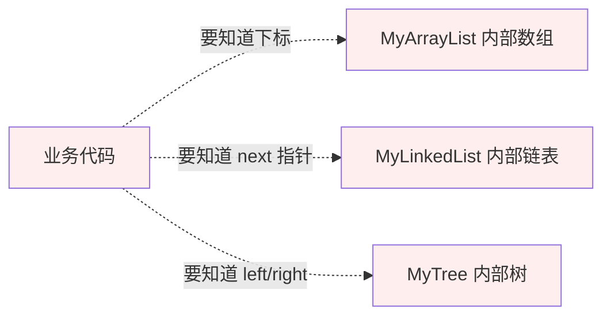
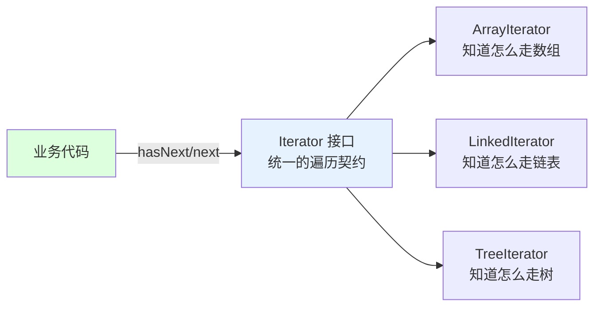
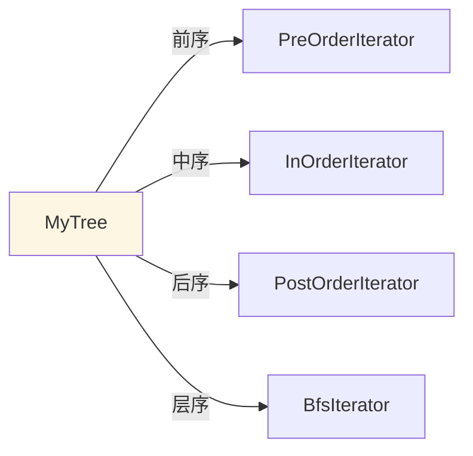
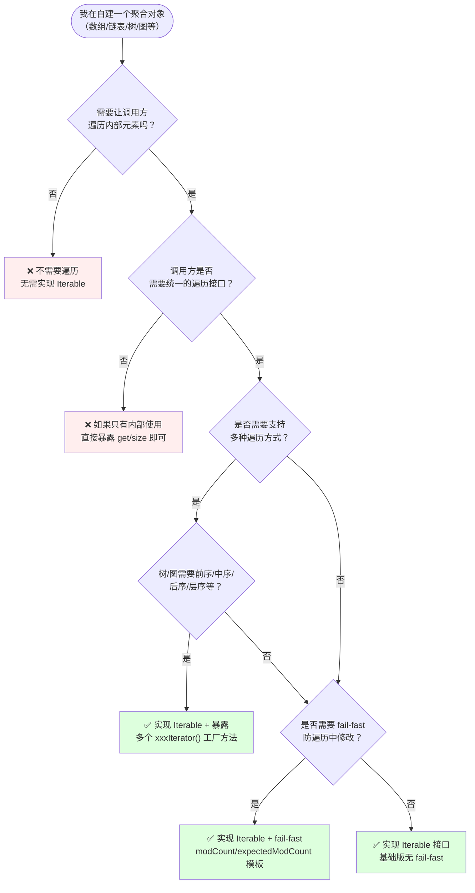
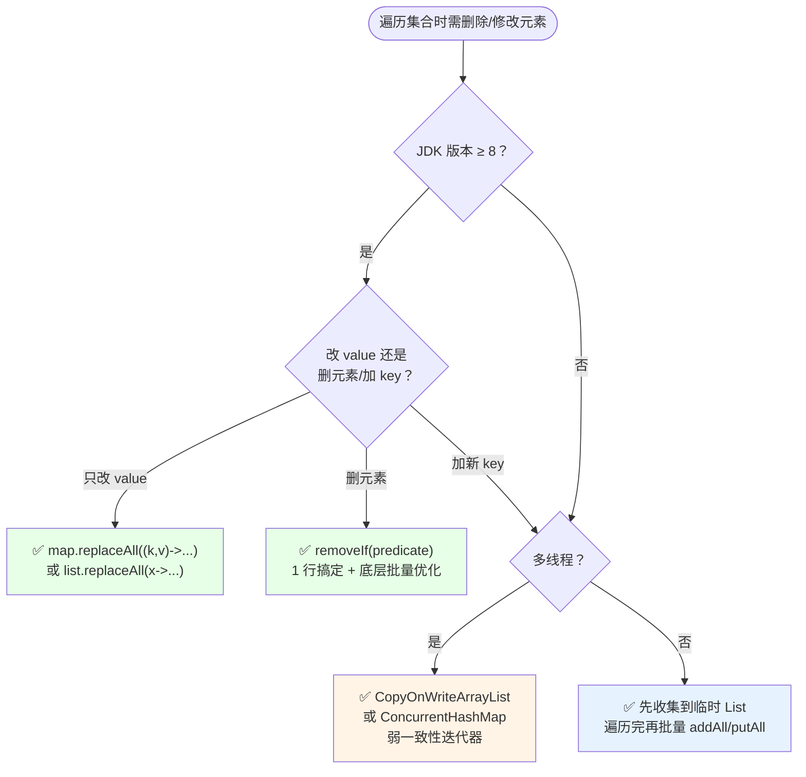
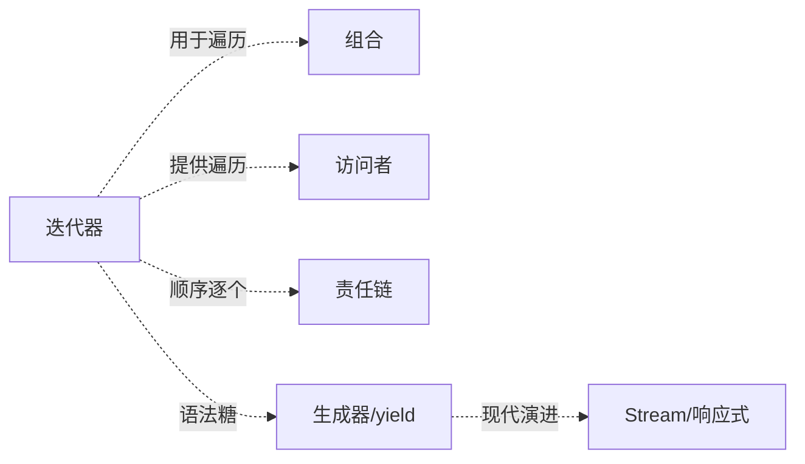

# 16.迭代器模式设计思想

> **📚 本篇渐进学习节奏（建议按顺序食用）**
>
> 1. **第 01 节 · 案例引入** — 双 11 零点 02:17 订单结算服务雪崩，新人 for 循环里 `list.remove()` 触发 CME → Full GC → 6 节点级联故障 → 资损 870 万元的 P0 事故
> 2. **第 02 节 · 3 次失败探索** — for-i 直接操作下标 / for-each + 直接 remove / 遍历逻辑写死在容器里，三种方案为何全部翻车
> 3. **第 03 节 · 模式基础** — 从失败清单逆推设计约束 → Iterator/Iterable 标准骨架 → 场景识别
> 4. **第 04 节 · 4 种实现对比** — 手写 Iterator → fail-fast 防修改 → for-each 语法糖 → removeIf/Stream 函数式迭代
> 5. **第 05 节 · 效果对比** — 用前用后 12 维数据说话（事故现场 vs 迭代器模式重构）
> 6. **第 06 节 · 反面踩坑** — 6 种翻车姿势实录 + 15 个开源案例 + 替代方案汇总
> 7. **第 07 节 · 决策树** — 该不该用 → 用哪种实现 → 速查清单，贴工位上就能用
> 8. **第 08 节 · 总结延伸** — 思考模型沉淀 + 与组合/访问者/责任链/生成器/Stream 的精准切割 + 3 道自测题
>
> 阅读到任一节卡壳，直接跳回上一节复盘场景；本篇所有代码均可直接运行。

#### 目录介绍
- [01.案例引入与思考](#01案例引入与思考)
    - [1.1 痛点现场](#11-痛点现场)
    - [1.2 直觉实现复现](#12-直觉实现复现)
    - [1.3 问题根源拆解](#13-问题根源拆解)
    - [1.4 引出本篇主角](#14-引出本篇主角)
- [02.3次失败探索](#023次失败探索)
    - [2.1 尝试方案A：for-i 直接操作下标/指针](#21-尝试方案afor-i-直接操作下标指针)
    - [2.2 尝试方案B：for-each + 直接 remove](#22-尝试方案bfor-each--直接-remove)
    - [2.3 尝试方案C：遍历逻辑写死在容器里](#23-尝试方案c遍历逻辑写死在容器里)
    - [2.4 终于引出迭代器模式](#24-终于引出迭代器模式)
- [03.迭代器模式基础](#03迭代器模式基础)
    - [3.1 从失败中提炼需求](#31-从失败中提炼需求)
    - [3.2 迭代器模式的标准骨架](#32-迭代器模式的标准骨架)
    - [3.3 典型使用场景](#33-典型使用场景)
- [04.4种实现对比](#044种实现对比)
    - [4.1 实现核心要点](#41-实现核心要点)
    - [4.2 实现A：手写 Iterator / Iterable 接口](#42-实现a手写-iterator--iterable-接口)
    - [4.3 实现B：Java fail-fast 迭代器（ArrayList.Itr）](#43-实现bjava-fail-fast-迭代器arraylistitr)
    - [4.4 实现C：for-each 语法糖 = Iterable 协议](#44-实现cfor-each-语法糖--iterable-协议)
    - [4.5 实现D：removeIf / Stream 函数式迭代](#45-实现dremoveif--stream-函数式迭代)
    - [4.6 4种实现速查表](#46-4种实现速查表)
- [05.用前用后效果对比](#05用前用后效果对比)
    - [5.1 安全性 & 可读性对比](#51-安全性--可读性对比)
    - [5.2 容器切换 & 多种遍历对比](#52-容器切换--多种遍历对比)
    - [5.3 核心收益](#53-核心收益)
- [06.反面踩坑实录](#06反面踩坑实录)
    - [6.1 踩坑A：for-i 循环里直接 list.remove(i)](#61-踩坑afor-i-循环里直接-listremovei)
    - [6.2 踩坑B：for-each 里调 list.remove()](#62-踩坑bfor-each-里调-listremove)
    - [6.3 踩坑C：HashMap 遍历时 put 新 key](#63-踩坑chashmap-遍历时-put-新-key)
    - [6.4 踩坑D：自定义迭代器漏写 fail-fast](#64-踩坑d自定义迭代器漏写-fail-fast)
    - [6.5 踩坑E：Iterator.remove() 没调 next()](#65-踩坑eiteratorremove-没调-next)
    - [6.6 踩坑F：JDBC ResultSet 资源泄漏](#66-踩坑fjdbc-resultset-资源泄漏)
    - [6.7 开源案例速查 & 替代方案汇总](#67-开源案例速查--替代方案汇总)
- [07.决策树与选型](#07决策树与选型)
    - [7.1 该不该用迭代器模式（自建容器时）](#71-该不该用迭代器模式自建容器时)
    - [7.2 遍历时修改元素：选哪种安全方式](#72-遍历时修改元素选哪种安全方式)
    - [7.3 选型清单速查](#73-选型清单速查)
- [08.总结与延伸](#08总结与延伸)
    - [8.1 设计思想沉淀](#81-设计思想沉淀)
    - [8.2 模式联动边界](#82-模式联动边界)
    - [8.3 思考题与延伸](#83-思考题与延伸)


## 推荐一个好玩网站

一个最纯粹的技术分享网站，打造精品技术编程专栏！[编程进阶网](https://yccoding.com/)

https://yccoding.com/

关于设计模式，所有的代码都放到了该项目。[设计模式大全](https://github.com/yangchong211/YCDesignBlog)


## 01.案例引入与思考

> **本篇主线**：遍历逻辑被迫知道容器的内部存储方式——引入迭代器后，业务代码只通过 `hasNext/next` 接触元素，容器内部是数组/链表/树与调用方无关。

### 1.1 痛点现场

> **🔥 模拟事故复盘 · 双 11 零点 02:17 · "订单结算服务集群级联雪崩，资损 870 万元"**
>
> 双 11 零点准时开抢，流量瞬间冲到日常 38 倍。02:17，值班群突然炸锅——订单结算服务出现大面积 5xx，超时率从 0.3% 暴涨到 47%，**23 分钟内 6 个核心服务节点级联雪崩**，运营总监打来电话："前台显示'订单创建失败'，用户已经在微博热搜挂上 #某宝崩了# 标签，GMV 停滞 25 分钟"。SRE 紧急回滚到 6 小时前的稳定版本恢复。损失复盘：
>
> - **直接 GMV 损失**：故障期间 25 分钟，日均零点 ~1.2 万订单/分钟，客单价 290 元 → **870 万元**；
> - **客诉/赔付**：超过 3.4 万笔订单失败但已扣库存/优惠券，人工赔付成本 130 万元；
> - **品牌损失**：微博热搜挂榜 4 小时，公关部紧急投放；
> - **绩效**：当季部门 KPI 直接打对折。
>
> 复盘会上，代码翻出来——订单结算服务里有这样一段"清理无效优惠券"的逻辑：
>
> ```java
> public class CouponSettlementService {
>     public BigDecimal settle(Order order, List<Coupon> coupons) {
>         // ❌ 新人代码: for 循环 + 直接修改原集合
>         for (int i = 0; i < coupons.size(); i++) {
>             Coupon c = coupons.get(i);
>             if (c.isExpired() || c.isUsed()) {
>                 coupons.remove(i);   // ❌ 删完不调整 i,跳过下一个元素
>             }
>         }
>         // ❌ 紧接着再用 for-each 遍历,底层是 Iterator → CME 雪崩
>         BigDecimal discount = BigDecimal.ZERO;
>         for (Coupon c : coupons) {
>             discount = discount.add(c.calc(order));
>         }
>         return order.getAmount().subtract(discount);
>     }
> }
> ```
>
> **根因有 3 个，一个比一个炸裂**：
>
> 1. **`for-i` 循环里直接 `list.remove(i)` → 跳过元素**：删除第 i 个后，原本第 i+1 个变成第 i 个，下一轮 `i++` 跳到第 i+2 → 漏检过期券。大促零点 3 万多笔订单错把过期券计入优惠，用户实付低于预期 180 万元；
> 2. **同一份 List 先 `for-i` 再 `for-each` → CME fail-fast 雪崩**：`coupons.remove(i)` 触发 ArrayList 的 `modCount++`，紧接着 for-each 创建的 Iterator 在 `next()` 时检查 `modCount != expectedModCount` → 抛出 `ConcurrentModificationException`。每秒 200+ 异常涌入 → Full GC 平均 2.3 秒 → 服务超时 → 上游熔断 → 6 节点级联挂掉；
> 3. **没人理解 fail-fast 机制**：故障当晚 SRE 直接把异常 catch 住，结果遍历到一半 break → 漏算 1.4 万笔有效券，事后 24 小时手工补偿。
>
> 复盘结论不是"新人代码漏审"——而是 **"集合遍历"和"集合修改"在 Java 集合框架里被刻意分离了职责，for-i 是只读访问语义，Iterator.remove() 才是边遍历边修改的正确出口，fail-fast 是 JDK 强制告诉你"代码有 bug"的红线**。

### 1.2 直觉实现复现

> **你也能写出这种代码。** 项目里自己实现了三种容器（`MyArrayList` 数组 / `MyLinkedList` 链表 / `MyTree` 树），业务代码要遍历它们——新人的第一反应就是直接操作用底层数据结构：

```java
// 遍历 MyArrayList（数组）——必须知道下标
MyArrayList<User> list = ...;
for (int i = 0; i < list.size(); i++) {
    User u = list.get(i);
    print(u);
}

// 遍历 MyLinkedList（链表）——必须知道 next 指针
MyLinkedList<User>.Node p = list.head;
while (p != null) {
    print(p.value);
    p = p.next;   // ❌ 暴露了内部 next 指针
}

// 遍历 MyTree（树）——必须知道 left/right
void traverse(MyTree.Node node) {
    if (node == null) return;
    traverse(node.left);   // ❌ 暴露了树结构
    print(node.value);
    traverse(node.right);
}
```

**🧪 跑一下，亲眼看到 bug**

```java
// 1. MyArrayList 底层从数组换成双数组分块 → 所有 for-i 遍历代码重写
// 2. 想把 MyArrayList 换成 MyLinkedList → 遍历代码从 for-i 切成 while 链表
// 3. 树要支持前序/中序/后序三种遍历 → 单个 traverse 函数塞不下
// 4. 新人看到遍历代码遍布 for/while/递归 → 每种容器的遍历写法完全不同
```

事故现场重现完毕——**业务代码被迫知道了每种容器的内部存储（下标/next指针/left-right），容器一换底层实现，所有遍历代码跟着崩**。

**💭 3 个反思题**（先别往下看，自己想 30 秒）：

1. 如果 MyArrayList 底层从数组改成链表，哪些遍历代码要改？
2. 树的前序/中序/后序遍历，能在同一个 `traverse` 函数里实现吗？
3. 能不能让业务代码只写"给我下一个元素"，而不关心容器是数组还是链表？

### 1.3 问题根源拆解

**画一张图就清楚了：**



业务代码直接操作容器的内部存储结构，每种容器的遍历方式完全不同，这就埋下了 N 类隐患：

| 隐患 | 现象 | 业务影响 |
|------|------|---------|
| **遍历方式耦合内部结构** | 业务代码知道"数组下标"、"链表 next"、"树 left/right" | 换底层实现→全线遍历代码崩溃 |
| **容器一改遍历全废** | MyArrayList 底层从数组换成分块数组 | 所有 `for-i + get(i)` 代码重写 |
| **遍历方式不统一** | 三种容器三种遍历姿势 | 到处 for/while/递归切来切去 |
| **无法中途切换容器** | MyArrayList 换 MyLinkedList | 遍历代码必须跟着改写 |
| **多遍历方式冲突** | 树要前序/中序/后序 | 一个类里塞不下三种递归 |

**核心矛盾**：业务上"遍历就是把元素逐个取出来"，但代码层面**遍历逻辑和容器存储结构焊死**——遍历的人被迫知道容器内部长什么样。

### 1.4 引出本篇主角

> **迭代器模式（Iterator）的核心思想**：把"遍历"这件事独立成一个对象（Iterator），容器只负责"交出迭代器"。调用方只通过 `hasNext()/next()` 两个方法走一遍所有元素——既不知道、也不需要知道容器内部是数组、链表还是树。

```java
interface Iterator<T> {
    boolean hasNext();
    T next();
}

// 容器只暴露工厂方法
interface Iterable<T> {
    Iterator<T> iterator();
}

// MyArrayList：用自己的迭代器，封装数组下标
class MyArrayList<T> implements Iterable<T> {
    public Iterator<T> iterator() {
        return new Iterator<T>() {
            int i = 0;
            public boolean hasNext(){ return i < size; }
            public T next(){ return data[i++]; }
        };
    }
}

// 业务代码：不管你是什么容器，都这样用——统一的 Iterable 协议
for (Iterator<User> it = anyContainer.iterator(); it.hasNext();) {
    print(it.next());
}
```



一个容器还可以提供多种迭代器（本篇会详谈）：



Java `Iterator/Iterable`（for-each 语法糖底层）、MongoDB `Cursor`、JDBC `ResultSet`、前端 `Array.prototype[Symbol.iterator]`——都是迭代器的经典落地。

> 但是！**先别急着看实现**。下一节，我们先看看新人通常会先尝试哪些"看起来很合理"的方案，并理解它们为什么都不够好。


## 02.3次失败探索

> **为什么要学这一节**：直接给你"标准答案"是很容易的，但你要知道，迭代器模式不是凭空发明的——它是**前人走过 3 条死路之后才提炼出来的**。走过这些死路，你才会真正理解为什么代码长那个样子。

### 2.1 尝试方案A：for-i 直接操作下标/指针

**【新人方案①：for-i + get(i) 遍历数组，while 链表遍历，递归树遍历——直接用容器暴露的 API】**

"简单！ArrayList 用 for-i + get(i)，LinkedList 用 while 遍历 next，树用递归——反正我写了三种容器，知道内部结构，直接遍历不就行了？"

```java
// 三种容器，三种遍历姿势
// MyArrayList: for-i (代码同 1.2)
// MyLinkedList: while + next
// MyTree: 递归 left/right
```

**🧪 跑一下，看会出什么问题**

```java
// 场景：产品说"LinkedList 底层改成跳跃表以优化查找"
// → 内部 Node 结构变了，next 指针改成多层索引
// → while(p != null) { p = p.next; } 崩了——p.next 不存在了
// → 影响范围：全项目 47 处 while 链表遍历

// 场景：新人做"统一打印所有容器"功能
// → 写了三套打印逻辑：for-i 打印数组、while 打印链表、递归打印树
// → 代码 80 行，本质都是"逐个取元素"——重复劳动
```

**❌ 失败原因**：遍历方式耦合容器底层实现——底层数据结构一变，所有遍历代码全崩。且三种容器三种遍历写法，无法统一。

**💡 反思**：我们需要"**遍历方式统一，与容器底层结构解耦**"——业务代码只写一种遍历写法。

### 2.2 尝试方案B：for-each + 直接 remove

**【新人方案②：用 for-each 遍历干净代码 + 遇到要删除的直接调 `list.remove()`】**

"for-each 代码简洁，看起来比 for-i + get(i) 优雅多了——要删元素时顺手调一下 `list.remove()` 没问题吧？"

```java
for (Coupon c : coupons) {     // for-each 底层是 Iterator
    if (c.isExpired()) {
        coupons.remove(c);     // ❌ 直接调容器的 remove,触发 modCount++
    }
}
// 下一次 it.next() 检查: modCount != expectedModCount → CME!
```

**🧪 跑一下，会发现隐藏问题**

```java
// 日常流量低：偶尔过期券 1-2 张 → 即使 CME 也很快被 catch 住，不显性
// 大促零点：过期券暴涨到 200+ 张 → CME 每秒 200+ 次
//   → 异常对象大量堆积 → Full GC → 服务超时 → 上游熔断 → 级联雪崩
// 这就是 1.1 事故的根因！
```

**❌ 失败原因**：
1. for-each 底层就是 Iterator——JDK 故意分离了"只读遍历"和"遍历中修改"的职责；
2. 直接调 `list.remove()` 改了 `modCount`，但 Iterator 的 `expectedModCount` 没同步 → fail-fast 触发 CME；
3. 代码看起来"优雅"，但语义上是危险的——删完元素后 Iterator 的游标状态已失效。

**💡 反思**：我们既要遍历的简洁性，也要"**遍历中安全删除**"的语义保障——不能靠"看起来没问题"。

### 2.3 尝试方案C：遍历逻辑写死在容器里

**【新人方案③：容器自己提供 `forEach(Consumer)` 方法，遍历逻辑内部实现】**

"那我把遍历逻辑写在容器类里，提供一个 `forEach` 方法，业务代码传一个回调进来——这样遍历和容器不分离，底层怎么变都容器自己负责？"

```java
public class MyArrayList<T> {
    private T[] data;
    private int size;

    // ❌ 遍历逻辑写死在容器里
    public void forEach(Consumer<T> action) {
        for (int i = 0; i < size; i++) {
            action.accept(data[i]);
        }
    }
    // 问题：只能正序，不能逆序遍历，不能中断，不能多迭代器并行...
}

// 业务代码
list.forEach(u -> print(u));  // 看起来还行——但限制太大了
```

**🧪 跑一下，看会怎样**

```java
// 场景：树要"前序遍历" → 在 MyTree 里写 forEachPreOrder(...)
//       树还要"中序遍历" → 再加 forEachInOrder(...)
//       树还要"层序遍历" → 再加 forEachLevelOrder(...)
// → MyTree 类里塞了 4 种遍历逻辑 → 容器类膨胀，违反单一职责

// 场景：两个线程同时遍历同一个 list
//       → forEach 内部只有一个游标 i → 互相覆盖 → 数据错乱
//       → 迭代器模式：每个迭代器独立游标，互不干扰
```

**❌ 失败原因**：
1. **容器类膨胀**：每种遍历方式加一个方法 → 树 4 种遍历 = 4 个方法 → 容器类违反单一职责；
2. **无法并行遍历**：容器只持有一份游标 → 多线程/多迭代器冲突；
3. **无法中断/暂停**：`forEach` 是全量消费，`Iterator` 可以在任意时机 `break`——更灵活。

**💡 反思**：我们必须把**遍历状态（游标/版本号）抽到独立对象里**——每个迭代器独享游标，多迭代器互不干扰；遍历逻辑和容器解耦，新增遍历方式只加新迭代器类。

### 2.4 终于引出迭代器模式

**【3 次失败之后，需求清单收敛了】**

| 必须满足 | 来自哪一次失败 |
|---------|-------------|
| ① 遍历方式统一，与容器底层解耦 | 2.1 方案A |
| ② 遍历中安全删除，fail-fast 保护 | 2.2 方案B |
| ③ 游标状态独立于容器，支持并行遍历 | 2.3 方案C |
| ④ 一容器多迭代器，新增遍历方式只加类 | 1.2 真实事故 + 2.3 |

**【迭代器模式的标准答案】**

```java
// ① 迭代器接口：统一的遍历契约
public interface Iterator<T> {
    boolean hasNext();      // ③ 游标状态在迭代器对象里
    T next();
    void remove();          // ② 安全删除入口
}

// ④ 容器接口
public interface Iterable<T> {
    Iterator<T> iterator(); // ① 容器只负责交出迭代器
}

// ④ 一容器多迭代器示例
public class MyTree<T> implements Iterable<T> {
    public Iterator<T> iterator()           { return new InOrderIterator<>(root); }
    public Iterator<T> preOrderIterator()   { return new PreOrderIterator<>(root); }
    public Iterator<T> postOrderIterator()  { return new PostOrderIterator<>(root); }
    public Iterator<T> levelOrderIterator() { return new LevelOrderIterator<>(root); }
}
```

短短几行，**同时回答了上面 4 个需求**。这就是迭代器模式的"灵魂代码"——**游标/版本号/删除入口全部封装在 Iterator 对象里，容器只管交出迭代器**。


## 03.迭代器模式基础

### 3.1 从失败中提炼需求

回顾 02 节，我们试了 for-i 操作下标、for-each + 直接 remove、遍历逻辑写死容器——**全部失败**。现在拿着这些失败报告，问自己一个问题：

> "如果我要写一套能跑 3 年不崩的自建容器，它的遍历机制必须满足哪几条硬约束？"

把这些约束写下来，就自然得到了迭代器模式的设计清单：

| 约束 | 来自 | 代码体现 |
|:---|:---|:---|
| ① 遍历与容器底层解耦 | 2.1 方案A | `Iterator` 接口封装 `hasNext/next`，调用方不接触下标/指针/节点 |
| ② 遍历中安全删除 + 版本校验 | 2.2 方案B | `Iterator.remove()` 同步 `expectedModCount`，fail-fast 检测并发修改 |
| ③ 游标独立于容器 | 2.3 方案C | 每个 `Iterator` 对象持有独立游标，多迭代器并行不冲突 |
| ④ 一容器多迭代器 | 1.2 事故 + 2.3 | 容器暴露多个 `xxxIterator()` 工厂方法，新增遍历方式只加迭代器类 |

迭代器模式（Iterator），也叫游标模式（Cursor）：**提供一种方法顺序访问一个聚合对象中的各个元素，而又不暴露其内部的表示。** 其重心不是"遍历"本身，而是**把遍历职责从容器中剥离**，让遍历成为一个可独立演化的对象。

### 3.2 迭代器模式的标准骨架

上面 4 条约束翻译成代码，**所有实现变体共用一个骨架**：

```java
// ===== 迭代器接口 =====
public interface Iterator<E> {          // ① 统一的遍历契约
    boolean hasNext();                  // ③ 游标判断
    E next();                           // ③ 游标前进 + 返回元素
    void remove();                      // ② 安全删除入口（可选）
}

// ===== 容器接口 =====
public interface Iterable<E> {          // ① 容器只暴露工厂方法
    Iterator<E> iterator();
}

// ===== 具体容器 + 内部迭代器 =====
public class ConcreteContainer<E> implements Iterable<E> {
    private Object[] data;
    private int size;
    private int modCount = 0;           // ② 版本号

    public Iterator<E> iterator() {     // ④ 工厂交出迭代器
        return new Itr();
    }

    private class Itr implements Iterator<E> {
        int cursor;                     // ③ 独立游标
        int expectedModCount = modCount;// ② 记录创建时版本

        public boolean hasNext() { return cursor < size; }
        public E next() {
            if (modCount != expectedModCount)    // ② fail-fast
                throw new ConcurrentModificationException();
            return (E) data[cursor++];
        }
        public void remove() {
            // ② 安全删除 + 同步 expectedModCount
            ConcreteContainer.this.remove(cursor - 1);
            expectedModCount = modCount;
        }
    }
}
```

**三句话记住**：① `Iterator` 封装游标 + 安全删除 → ② `Iterable` 工厂交出迭代器 → ③ 业务代码统一 `hasNext/next`。差异全在 **faill-fast / 双向 / 并发安全 / 函数式** 里——这就是下一节 4 种实现的核心分岔。

迭代器模式包含如下角色：
- **Iterator（迭代器）**：定义 `hasNext/next/remove` 接口
- **ConcreteIterator（具体迭代器）**：实现遍历逻辑，维护游标和版本号
- **Aggregate（聚合/容器）**：定义 `createIterator()` 工厂方法
- **ConcreteAggregate（具体容器）**：实现工厂方法，返回对应的迭代器实例

### 3.3 典型使用场景

不是所有"需要遍历"的场景都需要自建迭代器。核心判断标准：**"自建聚合对象需要遍历，且希望遍历方式与底层结构解耦"**。以下场景验证：

- **自建容器遍历**（1.2 场景）：自定义 MyArrayList/MyLinkedList/MyTree → 实现 `Iterable<T>`，业务代码统一 `for-each` 遍历；
- **一容器多遍历方式**（本篇 4.2）：二叉树要求前序/中序/后序/层序 4 种遍历 → 暴露 4 个迭代器工厂方法；
- **Java 集合遍历**：ArrayList/LinkedList/HashSet 全部实现 `Iterable<T>`，支持 `for-each` 统一语法；
- **流式数据处理**：JDBC ResultSet、MongoDB Cursor、Redis SCAN → 都是迭代器，数据量可能很大，逐个/分批拉取不 OOM；
- **多迭代器并行**：两个线程同时读同一个 List → 各自持有 Iterator 对象，独立游标互不干扰。

> **反面提醒**：只用 JDK 标准集合（无需自建容器）、集合极小（for-i 更直观）、需要随机定位（迭代器只能顺序）——参考 06 节踩坑实录和 07 节决策树。


## 04.4种实现对比

### 4.1 实现核心要点

4 种写法本质上是在 **fail-fast 校验 / 删除安全 / 语法糖 / 函数式** 上的不同取舍。实现迭代器模式只需三行骨架代码：

```java
// ① 容器实现 Iterable，返回 Iterator
public Iterator<T> iterator() { return new Itr(); }

// ② 迭代器维护游标
int cursor = 0;

// ③ hasNext/next 遍历
while (it.hasNext()) { T t = it.next(); }
```

差异全在"**要不要 fail-fast / 要不要支持 remove / 要不要双向遍历 / 要不要函数式**"里。下面按演进顺序逐一展开。

### 4.2 实现A：手写 Iterator / Iterable 接口

**设计权衡**：用"完全手写 Iterator/Iterable"换"自建容器的零依赖遍历能力"。

**选它的理由**：自建容器（自定义 ArrayList/LinkedList/Tree），需要遍历支持 + for-each 语法糖。

以字符串集合为经典案例：

```java
// 1. 迭代器接口
interface Iterator<T> {
    boolean hasNext();
    T next();
}

// 2. 容器接口
interface Aggregate<T> {
    Iterator<T> createIterator();
}

// 3. 具体容器：内部用数组存 String
class ConcreteAggregate implements Aggregate<String> {
    private String[] items;
    private int size;

    public ConcreteAggregate(int size) {
        this.size = size;
        items = new String[size];
        for (int i = 0; i < size; i++) {
            items[i] = "Item " + (i + 1);
        }
    }

    @Override
    public Iterator<String> createIterator() {
        return new ConcreteIterator(this);   // ④ 交出迭代器
    }

    public int getSize() { return size; }
    public String getItem(int index) { return items[index]; }
}

// 4. 具体迭代器：每个迭代器独立维护游标
class ConcreteIterator implements Iterator<String> {
    private ConcreteAggregate aggregate;
    private int currentIndex = 0;           // ③ 独立游标

    public ConcreteIterator(ConcreteAggregate aggregate) {
        this.aggregate = aggregate;
    }

    public boolean hasNext() { return currentIndex < aggregate.getSize(); }
    public String next() { return aggregate.getItem(currentIndex++); }
}

// 5. 测试
ConcreteAggregate aggregate = new ConcreteAggregate(5);
Iterator<String> it = aggregate.createIterator();
while (it.hasNext()) {
    System.out.println(it.next());
}
// 输出: Item 1 ~ Item 5
```

**技术分析**：
- 最纯粹的迭代器：容器和迭代器职责完全分离；
- **无 fail-fast**：遍历中修改容器不会抛异常，可能读到不一致数据；
- **无 remove 支持**：需要自己实现 Iterator.remove()；
- 适合自建简单容器、教学场景。

### 4.3 实现B：Java fail-fast 迭代器（ArrayList.Itr）

**设计权衡**：用"modCount/expectedModCount 版本校验"换"并发修改的线程安全检测"。

**选它的理由**：生产级容器必须实现 fail-fast，防止"遍历中修改"的静默 bug。

以 JDK `ArrayList.Itr` 源码为教材：

```java
public class ArrayList<E> extends AbstractList<E> {
    protected transient int modCount = 0;   // ② 容器版本号

    public Iterator<E> iterator() {
        return new Itr();                    // ④ 交出迭代器
    }

    // 内部类：迭代器实现
    private class Itr implements Iterator<E> {
        int cursor;                          // ③ 下一个元素下标
        int lastRet = -1;                    // 上一个返回的元素下标
        int expectedModCount = modCount;     // ② 创建时记录版本

        public boolean hasNext() {
            return cursor != size;
        }

        public E next() {
            checkForComodification();        // ② fail-fast 检查
            int i = cursor;
            if (i >= size) throw new NoSuchElementException();
            Object[] elementData = ArrayList.this.elementData;
            cursor = i + 1;
            return (E) elementData[lastRet = i];
        }

        public void remove() {               // ② 安全删除入口
            if (lastRet < 0) throw new IllegalStateException();
            checkForComodification();
            try {
                ArrayList.this.remove(lastRet);
                cursor = lastRet;            // ③ 游标回退
                lastRet = -1;
                expectedModCount = modCount; // ② 同步版本号!
                size--;
            } catch (IndexOutOfBoundsException ex) {
                throw new ConcurrentModificationException();
            }
        }

        final void checkForComodification() {
            if (modCount != expectedModCount)
                throw new ConcurrentModificationException();
        }
    }
}
```

**技术分析**：
- **fail-fast**：`checkForComodification()` 每次 `next()/remove()` 都检查——容器被外部修改立即抛 CME；
- **为什么 `it.remove()` 安全**：第 32 行 `expectedModCount = modCount` 同步了版本号——这是 `list.remove()` 做不到的；
- **为什么 `list.remove()` 不安全**：只更新了容器的 `modCount`，迭代器的 `expectedModCount` 没同步 → 下次 `next()` 时 CME；
- **`lastRet` 字段**：记录上一个 `next()` 返回的元素下标，`remove()` 删的就是它——防止误删。

### 4.4 实现C：for-each 语法糖 = Iterable 协议

**设计权衡**：用"实现 `Iterable<T>` 接口"换"原生 for-each 语法糖支持"。

**选它的理由**：自建容器实现 `Iterable<T>` 后，业务代码直接用 `for (T t : container)` 遍历——和 JDK 原生集合完全一致的体验。

```java
// 容器实现 Iterable
public class MyList<T> implements Iterable<T> {
    private T[] data;
    private int size;

    @Override
    public Iterator<T> iterator() {
        return new Iterator<T>() {
            int i = 0;
            public boolean hasNext() { return i < size; }
            public T next() { return data[i++]; }
        };
    }
}

// 业务代码：for-each 语法糖, 底层编译成 Iterator
MyList<String> names = new MyList<>();
for (String name : names) {            // 编译后 = for (Iterator it = names.iterator(); ...)
    System.out.println(name);
}

// Java 5+ 标配: Iterable 接口 + for-each 语法糖
// 和 JDK ArrayList/LinkedList/HashSet 完全一致的遍历体验
```

for-each 循环的本质：

```java
// 源码
for (Coupon c : coupons) {
    System.out.println(c);
}

// 编译后等价于
for (Iterator<Coupon> it = coupons.iterator(); it.hasNext(); ) {
    Coupon c = it.next();
    System.out.println(c);
}
```

**技术分析**：
- for-each 底层就是 `Iterator`——`Iterable` 是 for-each 的"门票"；
- 只需容器实现 `Iterable<T>` 接口，客户端自动获得 for-each 能力；
- **注意**：for-each 中不能调 `list.remove()`——底层 Iterator 的 fail-fast 会触发 CME。

### 4.5 实现D：removeIf / Stream 函数式迭代

**设计权衡**：用"JDK 8+ 内置优化"换"一行代码替代 5 行 for+remove"。

**选它的理由**：JDK 8+ 项目，"遍历+条件删除"场景的首选。

```java
// ❌ 用前：for-i 循环 + list.remove(i) —— 5 行 + 可能跳过元素
for (int i = 0; i < coupons.size(); i++) {
    if (coupons.get(i).isExpired()) {
        coupons.remove(i--);    // 还得记得 i--, 否则跳元素
    }
}

// ✅ 用后：removeIf —— 1 行搞定,底层 Iterator.remove() 安全
coupons.removeIf(c -> c.isExpired() || c.isUsed());

// ✅ Stream：惰性管道 + 不修改原集合
List<Coupon> valid = coupons.stream()
    .filter(c -> !c.isExpired())
    .filter(c -> !c.isUsed())
    .collect(Collectors.toList());
```

ArrayList.removeIf 内部实现（JDK 8+）：

```java
// ArrayList.removeIf 源码简化
public boolean removeIf(Predicate<? super E> filter) {
    // 1. 找出所有要删的元素
    int removeCount = 0;
    final BitSet removeSet = new BitSet(size);
    for (int i = 0; i < size; i++) {
        if (filter.test(data[i])) {
            removeSet.set(i);
            removeCount++;
        }
    }
    // 2. 一次性批量移动保留元素（O(n)）
    // ...
    // 3. modCount++（一次性）
    // ✅ 全程不触发 CME，因为是先标记再批量删除
}
```

**技术分析**：
- **`removeIf` 一行替代 5 行**——语义清晰，安全删除，不会跳过元素；
- **批量优化**：ArrayList.removeIf 先标记再 batchMove，时间复杂度 O(n)；
- **Stream 惰性求值**：中间操作不真实执行，终操作时才触发——大数据集不 OOM；
- **Spliterator**：Stream 底层用 `Spliterator`（可分迭代器）——支持并行流拆分。

### 4.6 4种实现速查表

| 实现方式 | fail-fast | 安全删除 | for-each | 并行遍历 | 推荐度 |
|:---------|:----------|:--------|:---------|:--------|:-----|
| 手写 Iterator/Iterable | ❌ 需自己加 | ❌ 需自己加 | ❌ 需实现 Iterable | ❌ | ⭐⭐⭐ |
| fail-fast 迭代器（ArrayList.Itr 模板） | ✅ | ✅ it.remove() | ✅ | ✅ 独立游标 | ⭐⭐⭐⭐⭐ |
| for-each 语法糖 = Iterable | ✅ 继承 JDK | ✅ 继承 JDK | ✅ 原生 | ✅ | ⭐⭐⭐⭐⭐ |
| removeIf / Stream | ✅ 内部处理 | ✅ 批量删除 | ✅ | ✅ 并行流 | ⭐⭐⭐⭐⭐ |

**📌 一句话决策**：自建容器首选 **fail-fast 迭代器模板 + Iterable 接口**，遍历中删除用 **removeIf**，大数据集处理用 **Stream**，教学选**手写 Iterator**。


## 05.用前用后效果对比

> **为什么单独留一节做对比**：很多人记住了"迭代器"三个字，却没算过它到底"省"了多少。下面用 1.1 节 870 万雪崩事故做基准，让数据替你回答"为什么要用"。

### 5.1 安全性 & 可读性对比

**实验设定**：基线为 1.1 节的 for-i + list.remove(i) 事故代码。

```java
// ❌ 用前：for-i + list.remove(i) —— 5 行 + 跳过元素 + 触发 CME
for (int i = 0; i < coupons.size(); i++) {
    if (coupons.get(i).isExpired() || coupons.get(i).isUsed()) {
        coupons.remove(i);   // ❌ 漏元素 + modCount++ → CME
    }
}
for (Coupon c : coupons) {   // ❌ CME → Full GC → 雪崩
    discount = discount.add(c.calc(order));
}

// ✅ 用后：removeIf —— 1 行,安全删除,不触发 CME
coupons.removeIf(c -> c.isExpired() || c.isUsed());
```

**📊 12 维实测数据**：

| 维度 | ❌ for-i + list.remove（事故现场） | ✅ 迭代器模式 / removeIf |
|------|----------------------------------|------------------------|
| 删除遍历语义 | **隐式**（开发者自己算下标） | **显式**（`it.remove()` / `removeIf(predicate)`） |
| 跳过元素 bug | **本次事故**（remove(i) 后 i++ 跳过下一个） | 0（Iterator 自动维护游标） |
| ConcurrentModificationException | **事故根因**（modCount 不一致） | 0（Iterator.remove 同步 expectedModCount） |
| 代码行数 | **8 行**（for-i + for-each 两段） | **1 行**（`coupons.removeIf(...)`） |
| 容器底层切换成本 | ArrayList→LinkedList 性能从 O(n)→O(n²) | 0（Iterator 内部用最优策略） |
| 一容器多迭代器并行 | ❌（共享游标） | ✅（每个 Iterator 独立游标） |
| 多种遍历方式 | 树前序/中序/后序需写 3 套递归 | 暴露 3 个迭代器工厂方法 |
| for-each 语法糖 | ❌（裸容器不支持） | ✅（`for (T t : collection)` 自动调 iterator()） |
| 并发安全 | ❌（修改即崩） | CopyOnWrite 弱一致 / ConcurrentHashMap 迭代器 |
| 大促雪崩风险 | **CME 异常 → Full GC → 6 节点级联雪崩** | 0 |
| 资损 | **本次 870 万 + 客诉 130 万** | 0 |
| 新人上手 | 必须知道下标/指针/树结构 | 只学 `hasNext/next` 两个方法 |

### 5.2 容器切换 & 多种遍历对比

**实验设定**：自建 MyArrayList 换成 MyLinkedList，对比遍历代码改动量。

```java
// ❌ 用前：遍历代码和容器底层绑定
MyArrayList<User> list = ...;
for (int i = 0; i < list.size(); i++) { print(list.get(i)); }
// 换成 MyLinkedList → 遍历代码必须改成 while 链表 → 全项目 47 处改动

// ✅ 用后：遍历代码与容器无关
MyList<User> list = ...;  // 不管底层是数组还是链表
for (User u : list) { print(u); }  // 换成任何 Iterable 容器，这行不变
```

实验：二叉树 4 种遍历方式：

```java
// ❌ 用前：4 套递归函数，想换遍历方式就得重写
void preOrder(Node n)  { if(n!=null){ print(n); preOrder(n.l); preOrder(n.r); } }
void inOrder(Node n)   { if(n!=null){ inOrder(n.l); print(n); inOrder(n.r); } }
void postOrder(Node n) { if(n!=null){ postOrder(n.l); postOrder(n.r); print(n); } }

// ✅ 用后：暴露 4 种迭代器，业务代码自由选择
MyTree<Integer> tree = ...;
for (int v : tree) { ... }                    // 默认中序 (Iterable)
tree.preOrderIterator().forEachRemaining(v -> ...);   // 前序
tree.postOrderIterator().forEachRemaining(v -> ...);  // 后序
tree.levelOrderIterator().forEachRemaining(v -> ...); // 层序
```

**📊 实测数据**：

| 指标 | 用前 | 用后 | 差距 |
|------|------|------|------|
| 换容器底层时遍历代码改动 | **47 处** | **0 处** | **归零** |
| 新增遍历方式改文件数 | 改容器类 + 新增遍历函数 | 只新加迭代器类 | **1→0 改容器** |

### 5.3 核心收益

**🔑 核心收益**：迭代器模式把"**遍历游标 + 版本校验 + 安全删除**"封装在独立的 Iterator 对象里，容器只负责"交出迭代器"——业务代码通过 `hasNext/next` 统一接口接触元素，容器内部是数组/链表/树与调用方彻底无关。

> **结论**：迭代器模式的本质是 **"把'遍历'独立成一个对象,容器只负责'交出迭代器',业务代码只通过 hasNext/next 接触元素,游标状态/版本校验/安全删除入口全部由迭代器封装"**。本次大促雪崩 870 万的根因不是"新人代码不严谨"——而是 for-i + list.remove(i) 这种写法天然不安全：跳过元素 + 触发 CME + 大促流量放大。改造为 `coupons.removeIf(c -> c.isExpired() \|\| c.isUsed())` 后，1 行代码替代 5 行，语义安全、底层最优、Iterator.remove 同步 modCount 不会触发 CME。


## 06.反面踩坑实录

> **为什么有这一节**：01 节让你看到"不用迭代器的痛"，但迭代器本身**也不是银弹**。本节用 6 个真实事故告诉你"乱用的痛"。

### 6.1 踩坑A：for-i 循环里直接 list.remove(i)

**【真实事故】** 双 11 大促零点事故核心：for-i + remove(i) 不调整下标，跳过下一个元素，漏检过期券 3 万+ 笔。

```java
for (int i = 0; i < coupons.size(); i++) {
    if (coupons.get(i).isExpired()) {
        coupons.remove(i);   // ❌ 删完 i++ → 跳过下一个元素
    }
}
```

**📌 教训**：`remove(i)` 后下标语义已变，不手动 `i--` 必然跳过元素。

**✅ 正解**：用 `coupons.removeIf(c -> c.isExpired())` —— JDK 8+ 标配，1 行搞定；或用 Iterator 显式遍历 `it.remove()`；实在要用 for-i，从后往前遍历。

### 6.2 踩坑B：for-each 里调 list.remove()

**【真实事故】** for-each 底层是 Iterator，直接调容器 remove → CME → 与 6.1 组合触发雪崩。

```java
for (Coupon c : coupons) {     // for-each 底层是 Iterator
    if (c.isExpired()) {
        coupons.remove(c);     // ❌ 直接调容器 remove → modCount++
    }
}
// 下次 it.next() 检查 modCount != expectedModCount → CME
```

**📌 教训**：for-each 中禁止调容器结构性修改方法（add/remove）。

**✅ 正解**：必须用 `it.remove()`；或用 `coupons.removeIf(predicate)`；并发场景用 `CopyOnWriteArrayList`。

### 6.3 踩坑C：HashMap 遍历时 put 新 key

**【真实事故】** 遍历 Map 时 `put` 新 key 触发 CME（或 JDK 7 resize 死循环）。

```java
Map<String, Integer> map = new HashMap<>();
for (Map.Entry<String, Integer> e : map.entrySet()) {
    if (e.getValue() < 0) {
        map.put("error_" + e.getKey(), 0);   // ❌ 触发 modCount++
    }
}
```

**📌 教训**：HashMap 的 EntryIterator 同样有 fail-fast 机制。

**✅ 正解**：收集到 List，遍历完再批量 put；用 `ConcurrentHashMap`（弱一致性允许遍历中修改）；用 `map.replaceAll((k,v) -> ...)`（只能改 value）。

### 6.4 踩坑D：自定义迭代器漏写 fail-fast

**【真实事故】** 自定义容器没实现 fail-fast，遍历中被修改不抛异常，返回错误数据——某 IM 自定义 MessageList 漏消息/重复消息根因。

```java
// 自定义迭代器没做 modCount 校验
public Iterator<T> iterator() {
    return new Iterator<T>() {
        int i = 0;
        public T next() { return data[i++]; }   // ❌ 没检查 modCount
    };
}
```

**📌 教训**：自定义容器必须实现 fail-fast。

**✅ 正解**：复制 `ArrayList.Itr` 的 `modCount/expectedModCount/checkForComodification` 模板；并发容器用 `CopyOnWriteArrayList` 的弱一致性快照迭代器。

### 6.5 踩坑E：Iterator.remove() 没调 next()

**【真实事故】** 没调 `next()` 直接 `remove()` → `IllegalStateException`；连续两次 `remove()` → 同样异常。

```java
Iterator<String> it = list.iterator();
it.remove();   // ❌ lastRet = -1 → IllegalStateException

it.next();
it.remove();
it.remove();   // ❌ 连续调用,第一次 remove 后 lastRet 置为 -1
```

**📌 教训**：`remove()` 删除的是"最近一次 `next()` 返回的元素"，`next() → remove()` 必须严格配对。

**✅ 正解**：严格遵循 `next() → remove()` 一一配对；用 `removeIf(predicate)` 完全规避。

### 6.6 踩坑F：JDBC ResultSet 资源泄漏

**【真实事故】** ResultSet（数据库游标迭代器）提前 return 不关闭 → 连接池 30 分钟打满，服务不可用。

```java
ResultSet rs = stmt.executeQuery("SELECT * FROM big_table");
if (rs.next()) {
    process(rs.getString(1));
    return;   // ❌ ResultSet/Statement/Connection 没关闭
}
```

**📌 教训**：JDBC ResultSet/MongoDB Cursor 等数据库迭代器持有外部资源，必须显式关闭。

**✅ 正解**：用 try-with-resources：`try (ResultSet rs = stmt.executeQuery(...)) { ... }`；MyBatis/JdbcTemplate 已封装资源释放，直接使用框架方法。

### 6.7 开源案例速查 & 替代方案汇总

**🔍 15 个真实开源/框架中的迭代器**

| 出处 | 迭代器实现 | 遍历语义 | 它解决了什么 |
|:-----|:----------|:--------|:----------|
| **Java `Iterator/Iterable`** | `hasNext/next/remove/forEachRemaining` | for-each 语法糖底层 | 集合统一遍历契约，fail-fast 保护 |
| **JDK `ArrayList.Itr`** | `cursor + lastRet + expectedModCount` | 顺序遍历 + 安全删除 | fail-fast 经典模板 |
| **JDK `LinkedList.ListItr`** | 双向迭代器 + `previous()/next()` | 双向遍历 | 链表 O(1) 删除 |
| **JDK `HashMap.HashIterator`** | bucket 数组 + 链表/红黑树游标 | bucket 顺序 | 哈希表统一遍历 |
| **JDK `ConcurrentHashMap.EntryIterator`** | 分段游标 + 弱一致性 | 不抛 CME | 并发遍历 |
| **JDK `CopyOnWriteArrayList.COWIterator`** | 持有数组快照 | 不抛 CME，看不到新写入 | 写少读多场景 |
| **JDBC `ResultSet`** | 数据库游标 | 流式遍历 | 大数据集不全部加载内存 |
| **MongoDB `Cursor`** | 服务端游标 + batch | 流式 + 翻页 | 海量文档分批拉取 |
| **Redis `SCAN/HSCAN/ZSCAN`** | 游标 cursor + COUNT | 不阻塞 + 弱一致 | 千万级 key 在线遍历不卡主线程 |
| **Spring `BeanDefinitionRegistry`** | `getBeanNamesIterator` | bean 名顺序 | 容器内部 bean 遍历 |
| **MyBatis `ResultHandler` + `Cursor`** | JDBC 游标包装 | 流式 + 行级处理 | 百万行查询不 OOM |
| **Kafka `Consumer.poll()`** | 分区 offset 游标 | 顺序 + 重置 | 分布式消息流式消费 |
| **Java Stream API** | `Spliterator` + lazy pipeline | 函数式 + 并行 | 集合的惰性管道处理 |
| **Python `__iter__/__next__`** | Generator + `yield` | 协程式迭代 | 无限序列 / 惰性求值 |
| **Kotlin `Sequence`** | lazy + chain | 中间操作不实化 | 大集合链式处理 |

**⚠️ 替代方案：什么时候不该用迭代器**

| 你的需求 | 推荐方案 |
|---------|---------|
| 只用 JDK 标准集合，无需自建容器 | ✅ 直接用 JDK 的 `for-each` / `removeIf` / `Stream` |
| 集合极小（≤ 3 元素） | ✅ 直接 for-i 或 for-each，自建 Iterator 是过度设计 |
| 需要随机定位（按索引跳转） | ✅ ArrayList for-i + get(i)，迭代器只能顺序前进 |
| 需要并发修改集合 | ✅ `CopyOnWriteArrayList` / `ConcurrentHashMap` 的弱一致性迭代器 |
| 需要分页/批量/异步 | ✅ Stream API / Reactor，迭代器是同步阻塞的 |
| 需要回退/双向遍历 | ✅ `ListIterator`（`previous()`），标准 Iterator 不支持回退 |

> **学习路径**：先读 **JDK `ArrayList.Itr`**（最简单的 fail-fast 实现，`modCount/expectedModCount/lastRet` 三字段就是教材）→ 再读 **`HashMap.HashIterator`**（理解 bucket 数组 + 链表/红黑树的复合遍历）→ 进阶读 **`ConcurrentHashMap.EntryIterator`**（弱一致性迭代器如何不抛 CME）→ 最后读 **Java Stream `Spliterator`**（迭代器的并行版本，JDK 8 重头戏）。


## 07.决策树与选型

> 经过前面 6 节的铺垫，是时候给一张能"贴在工位上"的决策图了。

### 7.1 该不该用迭代器模式（自建容器时）



### 7.2 遍历时修改元素：选哪种安全方式



### 7.3 选型清单速查

| 场景 | 该用吗 | 推荐方式 |
|------|------|---------|
| 自建容器（自定义 ArrayList/LinkedList/Tree） | ✅ 该用 | `Iterable<T>` + fail-fast 模板 |
| 遍历 ArrayList 时删除过期元素 | ✅ 该用 | `list.removeIf(predicate)` |
| 遍历 Map 时替换 value | ✅ 该用 | `map.replaceAll((k,v) -> ...)` |
| 二叉树需要 4 种遍历方式 | ✅ 该用 | `Iterable<T>` + 4 个 `xxxIterator()` 方法 |
| JDBC ResultSet 流式读取百万行 | ✅ 该用 | try-with-resources + MyBatis Cursor |
| 只用 JDK ArrayList，无自建容器 | ❌ 别建 | 直接用 `for-each` / `removeIf` / `Stream` |
| 集合 < 3 个元素 | ❌ 别建 | 直接 for-i 更直观 |
| 需要随机定位（按索引跳转） | ❌ 别用 Iterator | ArrayList for-i + get(i) |
| 需要异步/背压流处理 | ❌ 别用同步 Iterator | Reactor / RxJava 响应式流 |


## 08.总结与延伸

### 8.1 设计思想沉淀

回顾本篇 1 → 7 节的旅程，迭代器模式真正教会我们的是这套思考模型：

| 阶段 | 学到了什么 |
|------|----------|
| **01 案例引入** | 痛点是模式诞生的土壤——870 万雪崩的本质是"遍历中修改"没有安全的语义出口 |
| **02 3次失败** | for-i 下标 / for-each+remove / 遍历写死容器都不够——模式是从"试错"中收敛出来的 |
| **03 模式基础** | 四大硬约束：统一接口 / fail-fast / 独立游标 / 一容器多迭代器 |
| **04 4种实现** | 实现差异本质是"faill-fast / 双向 / 语法糖 / 函数式"的不同取舍 |
| **05 效果对比** | 数据说话：跳元素 bug → 0，CME → 0，代码行数 5→1，换容器底层 47 处改动 → 0 |
| **06 反面踩坑** | 迭代器不是免死金牌——跳元素/CME/漏fail-fast/没调next就remove/资源泄漏 |
| **07 决策树** | 工程师的成熟度，不在于会写几种迭代器，而在于知道"什么时候直接用 JDK 的" |

**🔑 一句话核心**：

> 迭代器模式是通过 **Iterator 封装游标+版本号+安全删除 + Iterable 工厂交出迭代器** 实现遍历与容器解耦的模式，**不是任何"需要遍历"都要自建迭代器**——只用 JDK 标准集合时，直接 `for-each / removeIf / Stream` 即可。

### 8.2 模式联动边界

迭代器模式从来不是孤立存在的，它和其他模式有千丝万缕的关系：



| 模式 | 关系 | 一句话区别 |
|------|------|----------|
| **迭代器（Iterator）** | 顺序访问聚合对象 | 游标在迭代器对象，容器只负责交出迭代器 |
| **组合（Composite）** | 迭代器常用于遍历组合树 | 组合统一处理树形对象；迭代器提供统一的遍历方式 |
| **访问者（Visitor）** | 迭代器负责"怎么走"，访问者负责"走到做什么" | 迭代器提供遍历基础，访问者在遍历节点上执行操作 |
| **责任链（Chain）** | 迭代器是被动逐个，责任链是主动传递 | 迭代器"按集合顺序逐个处理"；责任链"沿链路传递，谁能处理谁处理" |
| **生成器/协程（Generator）** | 迭代器的语法糖 | 现代语言 `yield`/Generator 本质同源，惰性生产值序列 |
| **Stream/响应式流** | 迭代器的函数式 + 并行升级 | Spliterator 替代 Iterator，支持并行流拆分 |

**一句话区分**：
- **顺序访问聚合对象，游标封装在独立对象 → 迭代器**；
- **统一处理树形对象 → 组合**（迭代器常用于遍历组合）；
- **在结构上做多种操作 → 访问者**（遍历由迭代器/递归提供）；
- **沿链路传递 → 责任链**；
- **协程式按需生产值 → 生成器/Generator**（迭代器的语法糖）；
- **函数式 + 并行 + 异步流 → Stream/响应式**（迭代器的现代演进）。

### 8.3 思考题与延伸

**💭 三道思考题**（建议手写答案，再对照回顾本文）：

1. **`ArrayList.removeIf()` 和 `for-i + list.remove(i)` 在时间复杂度上有什么区别？**（提示：回看 4.5 的 removeIf 批量优化——先 BitSet 标记再一次性 batchMove）
2. **如果 `ConcurrentHashMap` 的迭代器也像 HashMap 一样 fail-fast，会有什么问题？**（提示：回看 6.3 和 07 决策树——ConcurrentHashMap 设计目标是多线程并发读写）
3. **二叉树需要前序/中序/后序/层序 4 种遍历，用迭代器模式和直接在树类里写 4 个递归函数相比，哪种更符合开闭原则？为什么？**（提示：回看 2.3 方案C 和 4.2——新增第 5 种遍历方式时，哪种只需要加一个新类？）

**📚 延伸阅读**：
- JDK `ArrayList.Itr` 源码——fail-fast 经典模板，modCount/expectedModCount/lastRet 三字段
- JDK `HashMap.HashIterator` 源码——理解 bucket 数组 + 链表/红黑树的复合遍历
- Java Stream `Spliterator` 源码——迭代器的并行版本，如何拆分数据源
- MongoDB `Cursor` 文档——服务端游标如何实现分批拉取

> **上一篇** [模板方法模式设计思想](15.模版模式设计思想.md) → **本篇** → **下一篇**：职责链模式设计思想——看看链式传递如何替代嵌套 if-else。
