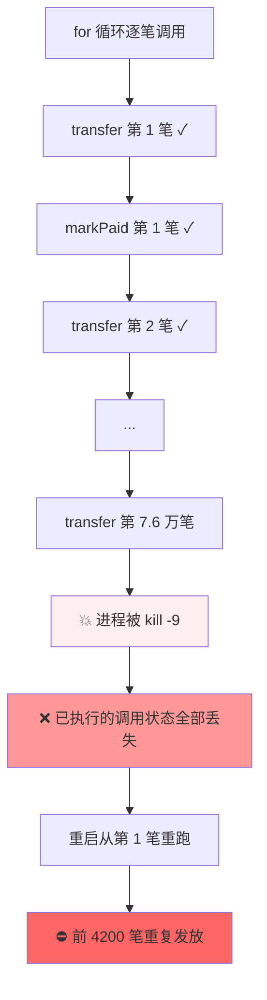
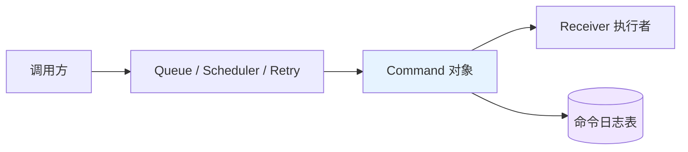
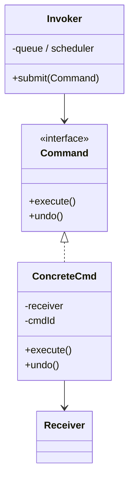
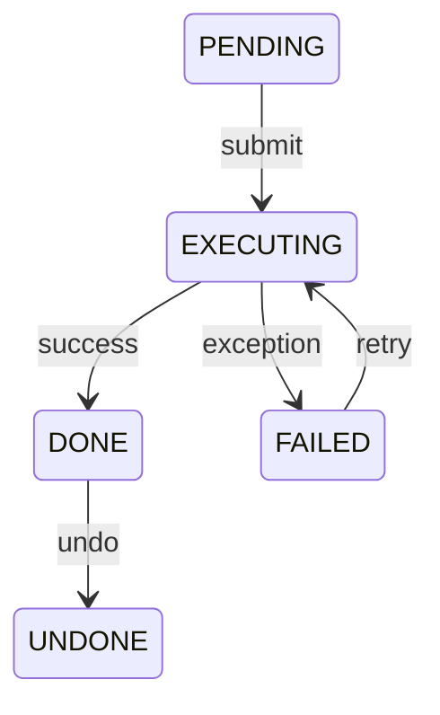
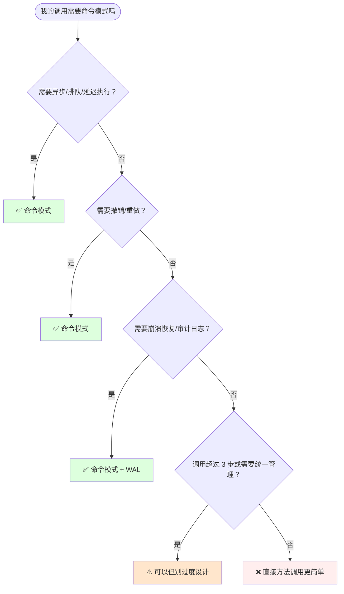
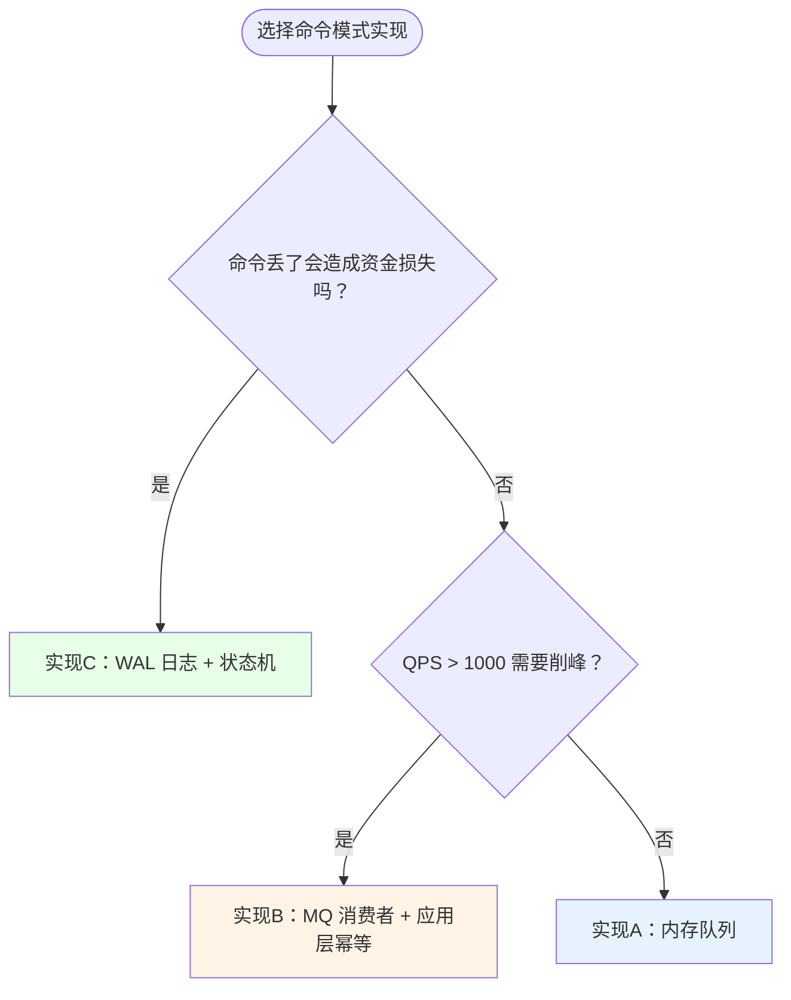
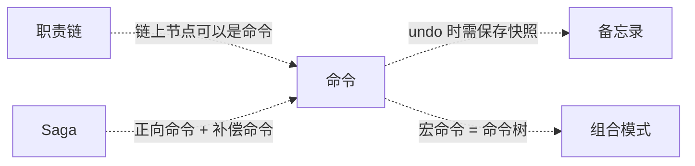

# 18.命令模式设计思想

> 📚 本篇按照「事故复盘 → 失败探索 → 模式登场 → 效果对比 → 反面踩坑 → 选型决策」的节奏展开，建议按顺序阅读，内容较深时可跳回上一节复盘场景。

#### 目录介绍

- [01.案例引入：银行代发 1860 万事故](#01案例引入银行代发-1860-万事故)
  - [1.1 痛点现场](#11-痛点现场)
  - [1.2 直觉实现复现](#12-直觉实现复现)
  - [1.3 问题根源拆解](#13-问题根源拆解)
  - [1.4 引出本篇主角](#14-引出本篇主角)
- [02.三次失败探索](#02三次失败探索)
  - [2.1 尝试方案A：加 try-catch 重试](#21-尝试方案a加-try-catch-重试)
  - [2.2 尝试方案B：操作前先查状态](#22-尝试方案b操作前先查状态)
  - [2.3 尝试方案C：全扔 MQ 异步消费](#23-尝试方案c全扔-mq-异步消费)
  - [2.4 终于引出命令模式](#24-终于引出命令模式)
- [03.命令模式基础介绍](#03命令模式基础介绍)
  - [3.1 从失败中提炼需求](#31-从失败中提炼需求)
  - [3.2 命令模式的标准骨架](#32-命令模式的标准骨架)
  - [3.3 典型使用场景](#33-典型使用场景)
- [04.三种实现对比](#04三种实现对比)
  - [4.1 实现核心要点](#41-实现核心要点)
  - [4.2 实现A：内存队列](#42-实现a内存队列)
  - [4.3 实现B：MQ 消费者](#43-实现bmq-消费者)
  - [4.4 实现C：WAL 日志 + 状态机](#44-实现cwal-日志--状态机)
  - [4.5 三种实现速查表](#45-三种实现速查表)
- [05.用前用后效果对比](#05用前用后效果对比)
  - [5.1 功能维度对比](#51-功能维度对比)
  - [5.2 事故维度对比（银行代发场景）](#52-事故维度对比银行代发场景)
  - [5.3 核心收益](#53-核心收益)
- [06.反面踩坑实录](#06反面踩坑实录)
  - [6.1 踩坑A：undo 写得不对称](#61-踩坑aundo-写得不对称)
  - [6.2 踩坑B：execute 部分成功抛异常](#62-踩坑bexecute-部分成功抛异常)
  - [6.3 踩坑C：命令不持久化（本次根因）](#63-踩坑c命令不持久化本次根因)
  - [6.4 踩坑D：命令捕获大对象引用](#64-踩坑d命令捕获大对象引用)
  - [6.5 踩坑E：重试无幂等控制](#65-踩坑e重试无幂等控制)
  - [6.6 踩坑F：宏命令部分失败状态丢失](#66-踩坑f宏命令部分失败状态丢失)
  - [6.7 替代方案汇总](#67-替代方案汇总)
- [07.决策树与选型](#07决策树与选型)
  - [7.1 该不该用命令模式](#71-该不该用命令模式)
  - [7.2 选哪种实现方式](#72-选哪种实现方式)
  - [7.3 选型清单速查](#73-选型清单速查)
- [08.总结与延伸](#08总结与延伸)
  - [8.1 设计思想沉淀](#81-设计思想沉淀)
  - [8.2 模式联动边界](#82-模式联动边界)
  - [8.3 思考题与延伸](#83-思考题与延伸)

---

## 01.案例引入：银行代发 1860 万事故

> **本篇主线**：方法调用本身需要被存储、调度、回放

### 1.1 痛点现场

某城商行为本地大型外包集团代发工资，集团旗下子公司 23 家，员工 18.4 万人，月度代发金额 7.8 亿元。每月 25 日凌晨 02:00 跑批，2 小时内必须完成所有发放。

某月 25 日 02:14，代发任务跑到第 7.6 万笔时，机房交换机硬件故障 → DB 主库切到从库，应用层 JDBC 连接全部中断 30 秒。运维监控告警，但代发任务进程反复重连失败，SRE 误判为"进程僵死"，直接 kill -9 杀掉进程，准备重启重跑。

02:18，SRE 重启代发任务从第 1 笔开始重跑——理由是"反正幂等性应该没问题"。结果：
- 第 1～7.6 万笔中，有 4200 笔由于 DB 主从切换瞬间状态不一致，幂等性检查走从库返回"未发放"，被重复发放；
- 直接资金损失 4200 笔 × 平均工资 4428 元 = 1860 万元；
- 最终追回 760 万，实际损失 1100 万，加上监管罚款和信用损失，总损失 1860 万。

故障复盘会上翻出代码——批处理代码直接顺序调用：

```java
public class SalaryBatchService {
    public void runBatch(long batchId) {
        List<SalaryRecord> records = salaryDao.loadAll(batchId);  // 18.4 万笔
        for (SalaryRecord r : records) {
            if (paid(r)) continue;                                  // 幂等检查走从库
            accountService.transfer(r.from, r.to, r.amount);       // 扣账
            salaryDao.markPaid(r.id);                              // 标记已发
            smsService.notify(r.phone, r.amount);                   // 发短信
        }
    }
}
```

### 1.2 直觉实现复现

复现这个事故只需要一个最小化场景——模拟 5 笔发放，第 3 笔时"人为 kill 进程"：

```java
// 事故复现：5 笔发放，第 3 笔模拟进程被杀
SalaryBatchService svc = new SalaryBatchService();
List<SalaryRecord> batch = loadBatch(5);
for (int i = 0; i < batch.size(); i++) {
    SalaryRecord r = batch.get(i);
    if (i == 2) throw new RuntimeException("模拟进程 kill -9");
    svc.transfer(r);           // 前 2 笔已执行
    svc.markPaid(r);
}
// 重启后从第 1 笔重跑 → 前 2 笔重复发放
```

**💭 反思**：为什么一段"正常的 for 循环"能在崩溃后造成 1860 万损失？核心问题不是"代码写错了"——而是**调用过程没有物化**。每次 `transfer()` 是一次纯方法调用，调用完成瞬间消失，进程崩溃后无法知道"哪笔执行了、哪笔没执行"。

### 1.3 问题根源拆解



根因有 5 个：

| 根因 | 具体表现 |
|------|---------|
| **调用没物化** | 每笔 transfer 是纯方法调用，执行瞬间消失，无持久化状态 |
| **无命令日志** | 没有 WAL，重启后无法精确恢复——只能"从头再跑" |
| **幂等靠从库** | `paid()` 查从库，主从延迟 8 秒内 4200 笔判为"未发" |
| **没有 undo** | 没有统一的撤销抽象，只能人工追款 |
| **异常无状态** | for 循环抛异常即中断，已成功/待重试/失败列表全凭 log |

### 1.4 引出本篇主角

> **命令模式的核心思想**：把"一次调用"封装成对象。对象里装着：调谁、带什么参数、怎么执行、怎么撤销。一旦变成对象，它就能被存储、传输、排队、重试、撤销、审计。

```java
interface Command {
    void execute();
    default void undo() {}
}

class SalaryTransferCmd implements Command {
    private final String cmdId;     // 全局唯一
    private final String from, to;
    private final int amount;

    public void execute() { accountService.transfer(from, to, amount); }
    public void undo()    { accountService.reverse(from, to, amount); }
}

// 发起方只认 Command
List<Command> cmds = toCommands(batch);
cmds.forEach(Command::execute);       // 同步
queue.offerAll(cmds);                  // 入队
scheduler.scheduleAfter(30min, cmds);  // 延迟
retryRunner.run(cmd, 3);               // 重试
cmds.reverse().forEach(Command::undo); // 撤销
```



**先别急着看实现**——下一节我们看看新人通常会先尝试哪些"看起来很合理"的方案，并理解它们为什么都不够好。

---

## 02.三次失败探索

> 命令模式不是凭空发明的——它是前人走过 3 条死路之后才提炼出来的。

### 2.1 尝试方案 A：加 try-catch 重试

```java
// 方案A：在 for 循环里包 try-catch
for (SalaryRecord r : records) {
    for (int retry = 0; retry < 3; retry++) {
        try {
            accountService.transfer(r.from, r.to, r.amount);
            salaryDao.markPaid(r.id);
            break;
        } catch (Exception e) { log.error("retry {}", retry, e); }
    }
}
```

**🧪 验证**：模拟网络抖动——第一次成功但 response 丢了：

```java
// 第 1 次 try：transfer 成功，但网络超时抛异常
// 第 2 次 try：retry → 重复扣账！
accountService.transfer("A", "B", 1000);  // 实际扣了 2 次
```

**❌ 失败原因**：重试不幂等。网络问题导致"成功但响应丢失"时，重试 = 重复执行业务。

**💡 反思**：重试的前提是"知道上次到底成功了没"——但方法调用没有身份、没有日志。

### 2.2 尝试方案 B：操作前先查状态

```java
// 方案B：每次 transfer 前查 DB 确认是否已处理
for (SalaryRecord r : records) {
    String status = salaryDao.getStatus(r.id);    // 查 DB
    if ("PAID".equals(status)) continue;
    accountService.transfer(r.from, r.to, r.amount);
    salaryDao.markPaid(r.id);
}
```

**🧪 验证**：主从切换场景：

```java
// 主库：status=PAID（已发放）
// 从库：status=PENDING（主从延迟 8 秒）
// 查询走从库 → 返回 PENDING → 判定"未发" → 重复发放
```

**❌ 失败原因**：状态查询依赖外部系统——外部系统抖动的瞬间，你的幂等保护也跟着失效。这正是本次事故的核心。

**💡 反思**：幂等性不能依赖"查询外部系统"，必须依赖**命令对象自身的 ID + 本地日志**。

### 2.3 尝试方案 C：全扔 MQ 异步消费

```java
// 方案C：18 万笔全部入 MQ，消费者慢慢处理
for (SalaryRecord r : records) {
    mq.send(new TransferMsg(r.from, r.to, r.amount));
}

// 消费者
@Consumer
public void onMessage(TransferMsg msg) {
    accountService.transfer(msg.from, msg.to, msg.amount);
}
```

**🧪 验证**：消费者挂了重启：

```java
// 消费者进程崩溃 → MQ 未 ack 的消息重新投递
// → 消费者重启消费 → 已经执行过的消息被重复消费
// MQ 的至少一次投递 + 无应用层幂等 = 重复发放
```

**❌ 失败原因**：MQ 只保证"消息不丢"，不保证"业务不重"。应用层没有幂等保护，MQ 的 at-least-once 就是灾难。

**💡 反思**：不管是同步调用还是异步 MQ，核心问题都是：**调用本身没有"身份"**——没有 cmdId 去重、没有日志记录状态。

### 2.4 终于引出命令模式

三次失败之后，需求清单收敛了：

| 必须满足 | 来自哪一次失败 |
|---------|-------------|
| ① 每次调用有全局唯一 ID，按 ID 幂等 | 2.1 重试不幂等 |
| ② 调用状态持久化到本地日志，不依赖外部系统 | 2.2 主从延迟 |
| ③ 应用层幂等，不依赖 MQ 的投递语义 | 2.3 MQ 重复投递 |
| ④ 崩溃后可精确恢复，不从第 1 笔重跑 | 1.2 真实事故 |

**命令模式的标准答案**：

```java
// 满足所有约束的最小实现
class SalaryTransferCmd implements Command {
    final String cmdId = UUID.randomUUID().toString();    // ① 全局唯一ID
    final String from, to; final int amount;
    
    public void execute() {
        if (cmdLog.exists(cmdId)) return;                 // ① 按ID幂等
        cmdLog.insert(cmdId, "EXECUTING");                // ② 写WAL日志
        accountService.transfer(from, to, amount);
        cmdLog.update(cmdId, "DONE");                     // ② 标记完成
    }
    public void undo() { accountService.reverse(from, to, amount); }
}
```

短短几行，同时回答了上面 4 个需求。这就是命令模式的灵魂——**把瞬时的方法调用，变成一个带身份、带日志、可撤销的对象。**

---

## 03.命令模式基础介绍

### 3.1 从失败中提炼的需求

回顾 02 节的三次失败和 01 节的事故，命令模式的设计约束：

| 约束 | 来自 | 代码体现 |
|:---|:---|:---|
| ① 调用对象化 | 01 事故 / 02.2 主从延迟 | `implements Command` |
| ② 全局唯一 ID + 幂等 | 02.1 重试 / 02.3 MQ | `cmdId` + `cmdLog.exists()` |
| ③ 命令日志（WAL）持久化 | 01 事故 / 02.2 | `cmdLog.insert/update` |
| ④ 撤销抽象（undo） | 01 事故 | `undo()` 方法 |

### 3.2 命令模式的标准骨架

```java
// 标准骨架：Command + ConcreteCommand + Receiver + Invoker
interface Command {
    void execute();           // ① 执行
    default void undo() {}    // ④ 撤销
}

// ConcreteCommand：持有 receiver + 参数
class TransferCmd implements Command {
    private final String cmdId;       // ② 全局唯一
    private final AccountService receiver;  // 真正干活的对象
    private final String from, to;
    private final int amount;
    
    public void execute() {
        if (cmdLog.exists(cmdId)) return;   // ② 幂等
        cmdLog.insert(cmdId, EXECUTING);    // ③ WAL
        receiver.transfer(from, to, amount);
        cmdLog.update(cmdId, DONE);
    }
    public void undo() { receiver.reverse(from, to, amount); }
}

// Invoker：调度器
class CmdInvoker {
    void submit(Command c) { /* 入队/延迟/重试/审计 */ }
}
```



三句话记住：**Command（协议） → ConcreteCommand（参数+receiver） → Invoker（调度器）。** 差异全在 Invoker 的调度策略——同步/异步/持久化/WAL——这就是下一节三种实现的分岔。

### 3.3 典型使用场景

| 场景 | 命令对象 | 实现了什么 |
|------|---------|----------|
| **金融批处理** | `SalaryTransferCmd` + WAL | 崩溃精确恢复 + 幂等 + 撤销 |
| **下单后置链** | `DeductStockCmd` / `AddPointsCmd` / `SendSmsCmd` | 异步队列 + 批量撤销 |
| **Runnable/Callable** | 线程池任务 | 方法调用的对象化调度 |
| **Git Commit** | SHA-1 + Tree + Parent | 完整可重放的代码变更命令 |
| **Kafka Message** | `ProducerRecord` | 消息天然是命令，可重放可消费 |
| **Redis MULTI/EXEC** | 命令队列 | 命令排队后批量原子执行 |
| **编辑器 Ctrl+Z** | 编辑命令栈 | 命令栈 + 撤销/重做 |
| **Saga 事务** | 正向命令 + 补偿命令 | 最终一致性 |

---

## 04.三种实现对比

### 4.1 实现核心要点

三种写法本质上是 **持久化程度 / 调度方式 / 一致性要求** 上的不同取舍。实现命令模式只需两行骨架：

```java
interface Command { void execute(); default void undo() {} }  // ① 协议
List<Command> cmds = buildCommands(batch);                     // ② 构建
```

差异全在 Invoker——怎么调度、怎么持久化、怎么恢复。下面按演进顺序逐一展开。

### 4.2 实现 A：内存队列（适合内部工具 / 异步非关键任务）

**设计权衡**：用"进程崩溃丢命令"换"零外部依赖 + 极低延迟"

```java
// 实现A：内存队列 + 撤销栈
public class MemoryCmdInvoker {
    private final BlockingQueue<Command> queue = new LinkedBlockingQueue<>();
    private final Deque<Command> done = new ArrayDeque<>();  // 撤销栈

    public MemoryCmdInvoker() {
        new Thread(() -> { while (true) queue.take().execute(); }).start();
    }

    public void submit(Command c) { queue.put(c); }
    
    public void undoAll() { while (!done.isEmpty()) done.pop().undo(); }
}
```

**优点**：零依赖，延迟极低。**缺点**：进程崩溃命令全部丢失。**适用**：非关键异步任务（发通知/写日志），丢几条不影响业务。

### 4.3 实现 B：MQ 消费者（适合高吞吐 / 削峰场景）

**设计权衡**：用"at-least-once + 应用层幂等"换"高吞吐 + 持久化投递"

起步版（不安全）：

```java
// 不安全：消费者无幂等
@KafkaListener(topics = "salary-cmd")
public void consume(TransferCmd cmd) {
    cmd.execute();  // ❌ 消息重复投递 = 重复执行
}
```

修复版：

```java
// 修复：cmdId 幂等
@KafkaListener(topics = "salary-cmd")
public void consume(TransferCmd cmd) {
    if (cmdLog.exists(cmd.cmdId)) return;         // ② 幂等
    cmdLog.insert(cmd.cmdId, EXECUTING);           // ③ 半日志
    cmd.execute();
    cmdLog.update(cmd.cmdId, DONE);
}
```

**关键判断**：MQ 投递保证"at-least-once"——应用层必须自己保证幂等。适合电商下单后置链等需要削峰+水平扩展的场景。

### 4.4 实现 C：WAL 日志 + 状态机（适合金融 / 资金类必须可恢复）

**设计权衡**：用"额外一次 DB 写"换"崩溃零丢失 + 精确恢复 + 审计合规"

```java
// 实现C：命令日志表 + 状态机驱动
public class WalCmdInvoker {
    public void submit(Command cmd) {
        cmdLog.insert(cmd.cmdId, PENDING);        // ① 先写日志
        try {
            cmdLog.update(cmd.cmdId, EXECUTING);   // ② 标记执行中
            cmd.execute();
            cmdLog.update(cmd.cmdId, DONE);         // ③ 标记完成
        } catch (Exception e) {
            cmdLog.update(cmd.cmdId, FAILED);       // ④ 标记失败
            cmd.undo();                              // ⑤ 回滚
        }
    }
    
    // 进程崩溃后恢复：扫描 EXECUTING 状态的命令
    public void recover() {
        List<CmdLog> stuck = cmdLog.findByStatus(EXECUTING);
        for (CmdLog log : stuck) {
            if (externalCheck(log.cmdId)) {         // 乐观检查
                cmdLog.update(log.cmdId, DONE);     // 已成功，补状态
            } else {
                resubmit(rebuildCmd(log));           // 未成功，重放
            }
        }
    }
}
```

**命令日志表结构**：

```sql
CREATE TABLE cmd_log (
    cmd_id   VARCHAR(64) PRIMARY KEY,
    status   ENUM('PENDING','EXECUTING','DONE','FAILED','UNDONE'),
    cmd_type VARCHAR(32),
    cmd_body TEXT,         -- JSON 序列化的命令参数
    created  DATETIME DEFAULT NOW(),
    updated  DATETIME DEFAULT NOW()
);
```

**状态机**：


### 4.5 三种实现速查表

| 实现方式 | 持久化 | 崩溃恢复 | 吞吐量 | 复杂度 | 适用场景 | 推荐度 |
|---------|--------|---------|--------|--------|---------|------|
| 实现A：内存队列 | ❌ | ❌ | ⭐⭐⭐⭐⭐ | ⭐ | 非关键异步 | ⭐⭐ |
| 实现B：MQ 消费 | ⚠️ MQ 层 | ⚠️ 依赖 MQ | ⭐⭐⭐⭐ | ⭐⭐ | 削峰+异步 | ⭐⭐⭐⭐ |
| 实现C：WAL 日志 | ✅ DB 层 | ✅ 精确恢复 | ⭐⭐⭐ | ⭐⭐⭐ | 金融/资金 | ⭐⭐⭐⭐⭐ |

**📌 一句话决策**：非关键通知→**实现A**，高吞吐削峰→**实现B**，资金类必须可恢复→**实现C**。

---

## 05.用前用后效果对比

> 用 1.1 节的银行代发场景做基准，跑三组对比实验。

### 5.1 功能维度对比

```java
// ❌ 用前：纯方法调用
public void runBatch(long batchId) {
    List<SalaryRecord> records = salaryDao.loadAll(batchId);
    for (SalaryRecord r : records) {
        accountService.transfer(r.from, r.to, r.amount);
        salaryDao.markPaid(r.id);
    }
}

// ✅ 用后：命令对象 + WAL
public void runBatch(long batchId) {
    List<SalaryTransferCmd> cmds = toCommands(batchId);
    for (SalaryTransferCmd cmd : cmds) {
        cmdLog.insert(cmd.cmdId, PENDING);
        cmd.execute();
        cmdLog.update(cmd.cmdId, DONE);
    }
}
```

### 5.2 事故维度对比（银行代发场景）

| 维度 | ❌ 纯方法调用（事故现场） | ✅ 命令模式 + WAL |
|------|------------------------|-----------------|
| 调用物化 | 方法调用瞬间消失 | 每笔 = 1 个 Command 对象 |
| 持久化日志 | 无，靠 log.info | 命令日志表（PENDING/EXECUTING/DONE/FAILED） |
| 崩溃恢复 | 从第 1 笔重跑 → 重复发放 | 扫 WAL 续跑，跳过 DONE，重做 EXECUTING |
| 幂等性 | 查从库，主从延迟失效 → 本次根因 | cmdId 主键 + 日志状态双保险 |
| 失败重试 | for 循环抛异常即中断 | 单条 Command 自动重试 |
| 撤销 | 无 undo → 人工对账 | 每个 Command 自带 undo() |
| 审计追溯 | 翻日志 | SQL 查 cmd_log 表 |
| 事故结果 | **重复发放 1860 万** | **0** |

### 5.3 核心收益

> **命令模式的本质**：把方法调用从"瞬时动作"转化为"有身份的对象"，让调用具备可存储、可调度、可撤销、可审计、可组合的能力。这正是为什么数据库 redo/undo log 是 ACID 的根基、为什么 Git 把每次提交做成 Commit 对象、为什么所有金融批处理系统都用 WAL——**任何"必须可恢复/可回滚/可审计"的场景，把调用做成对象+持久化日志，才能让"崩溃/抖动/切换/回滚/审计"五件事同时成立。**

---

## 06.反面踩坑实录

> 命令模式不是银弹——以下 6 个坑几乎每个团队都踩过。

### 6.1 踩坑 A：undo 写得不对称

```java
public class TransferCmd implements Command {
    public void execute() {
        accountA.subtract(100);   // ① 扣 A
        accountB.add(100);        // ② 加 B
    }
    public void undo() {
        accountA.add(100);        // ❌ 只回滚了 A
        // 忘了 accountB.subtract(100)
    }
}
```

**💣 事故**：某证券系统买入命令 undo 漏了"占用资金释放"，回滚后用户余额冻结但订单已撤，投诉 230 起。

**✅ 正解**：undo 必须严格反向对称，execute 做 N 步 undo 就逆序做 N 步；单测加 `execute → undo → assert 状态恢复` 用例。

### 6.2 踩坑 B：execute 部分成功抛异常

```java
public void execute() {
    inventory.deduct(o);     // ① 成功
    points.add(o);           // ② 抛异常
    sms.send(o);             // ③ 没执行
}
public void undo() {
    // ❌ 无法判断执行到哪步——盲目反向再次出错
    inventory.refill(o);
    points.subtract(o);      // 第②步根本没成功！
}
```

**💣 事故**：某电商支付后置链 5 步执行到第 3 步失败，undo 把第 4、5 步也反向操作，公关赔偿 28 万。

**✅ 正解**：用 done 栈记录已成功步骤，严格 `done.pop().undo()` 逆序回滚；拆细颗粒度，1 个命令只做 1 件原子事。

### 6.3 踩坑 C：命令不持久化——进程崩溃全丢（本次事故根因）

```java
// ❌ 命令在内存队列里，进程崩溃全丢
BlockingQueue<Command> q = new LinkedBlockingQueue<>();
```

**💣 事故**：某物流系统订单履约 1.2 万命令在 LinkedBlockingQueue 里，机器宕机全丢，人工补单 3 周，损失 670 万。

**✅ 正解**：命令必须先持久化到 DB/磁盘/MQ（Write-Ahead Log），再异步执行。单测加"submit 后 kill 进程，重启能否完整恢复"。

### 6.4 踩坑 D：命令捕获大对象引用

```java
public class SaveCmd implements Command {
    private final ApplicationContext ctx;  // ❌ 整个 Spring 上下文
    public void execute() { ctx.getBean(...).save(...); }
}
```

**💣 事故**：某 SaaS 平台用 Redis 存命令队列，Lambda 捕获了 Service 引用，单条命令序列化后 230KB，Redis 内存暴涨 80GB。

**✅ 正解**：命令只持有"参数"（id/amount/type），不持有 Service/Context；Receiver 从 IoC 按需获取。

### 6.5 踩坑 E：重试无幂等控制

```java
// ❌ 无 cmdId——重试 3 次 = 转账 4 次
retryRunner.run(new TransferCmd(from, to, amount), 3);
```

**💣 事故**：某支付系统跨行转账命令重试，因下游响应超时但实际成功，1 天内重复转账 380 笔，涉及 220 万。

**✅ 正解**：每个命令必须有全局唯一 cmdId；DB 唯一索引 + `INSERT ON DUPLICATE` 双保险；状态机严格 PENDING→EXECUTING→DONE。

### 6.6 踩坑 F：宏命令组合时部分失败状态丢失

```java
public class MacroCmd implements Command {
    List<Command> subs;
    public void execute() {
        for (Command c : subs) c.execute();  // ❌ 抛异常中断，已执行的子命令无人回滚
    }
}
```

**💣 事故**：某 OTA 平台"机+酒+车"打包宏命令，机酒成功后租车失败，抛异常整体标记失败但机酒已实际预订。

**✅ 正解**：宏命令内部维护 done 列表，失败反向 undo；复杂场景用 Saga 编排器代替手写宏命令。

### 6.7 替代方案汇总

| 你的需求 | 推荐方案 |
|---------|---------|
| 简单调用（<3步）无撤销 | ✅ 直接方法调用，别引入 Command |
| 超低延迟不可妥协 | ✅ Runnable/Callable 直接提交线程池 |
| 外部副作用无法 undo（如短信已发） | ✅ Saga 补偿命令 |
| 需要完整事件溯源 + 状态重建 | ✅ Event Sourcing / CQRS |
| 只有 1 种命令类型 | ✅ Lambda/Runnable，不需要建抽象 |

---

## 07.决策树与选型

### 7.1 该不该用命令模式



### 7.2 选哪种实现方式



### 7.3 选型清单速查

| 场景 | 该用吗 | 推荐方式 |
|------|------|---------|
| 金融批处理 18 万笔 | ✅ 必须用 | 实现C：WAL + 状态机 |
| 下单后置链异步削峰 | ✅ 该用 | 实现B：MQ + 幂等 |
| 发通知/写日志 | ⚠️ 有条件用 | 实现A：内存队列 |
| IDE 撤销/重做 | ✅ 该用 | 命令栈 + Memento |
| 一个 CRUD 接口 | ❌ 别用 | 直接方法调用 |

---

## 08.总结与延伸

### 8.1 设计思想沉淀

回顾本篇 1→7 节的旅程，命令模式教会我们的是这套思考模型：

| 阶段 | 学到了什么 |
|------|----------|
| **01 事故** | 痛点是模式诞生的土壤——1860 万的代价：方法调用一旦"瞬逝"，崩溃后状态全丢 |
| **02 三次失败** | 加 try-catch、查 DB 状态、全扔 MQ 都不够——模式是从"试错"中收敛出来的 |
| **03 模式基础** | 三大要素：Command 协议、ConcreteCommand（参数+Receiver）、Invoker 调度器 |
| **04 三种实现** | 内存队列/MQ 消费/WAL 日志本质是"持久化程度/调度方式/一致性"的权衡 |
| **05 效果对比** | 数据说话：1860 万 → 0，命令日志 = 完整资金链路证据 |
| **06 反面踩坑** | undo 不对称、部分成功状态乱、日志不持久化、大对象引用、重试无幂等、宏命令遗漏 |
| **07 决策树** | 工程师的成熟度：知道"什么时候不用命令模式" |

**🔑 一句话核心**：

> 命令 = **方法调用的对象化**。把瞬时的调用变成带身份、带日志、可撤销、可调度的对象。

### 8.2 模式联动边界



| 模式 | 关系 | 一句话区别 |
|------|------|----------|
| **策略** | 易混 | 命令：封装"一次调用"（可存可撤）；策略：封装"一个算法"（可换） |
| **职责链** | 联动 | 链上节点可以是命令——失败可整链撤销 |
| **备忘录** | 联动 | 命令做撤销时常用备忘录保存执行前快照 |
| **观察者** | 易混 | 命令：点对点调用；观察者：一对多广播 |
| **事件溯源** | 配合 | 命令是"想做什么"，事件是"已经做了什么" |

**什么时候不该用命令模式**：
- 简单调用（<3 步）且无撤销——直接方法调用更简洁
- 超低延迟场景——命令对象创建+队列开销不容忽视
- 只有 1 种命令类型——Runnable/Lambda 就够
- 撤销逻辑无法实现（短信/邮件等外部副作用）——用 Saga 补偿

### 8.3 思考题与延伸

**💭 三道思考题**：

1. 我们把扣库存等动作命令化后，撤销很容易；但**短信已发**这种"外部副作用"动作，`undo()` 该怎么实现？（提示：回看 6.7 替代方案）

2. 如果命令日志表有 1000 万条记录，`findByStatus(EXECUTING)` 查询会慢——怎么优化？（提示：时间范围 + 索引 + 归档策略）

3. 实现C的 WAL 中，如果 `cmdLog.insert` 成功但 `cmd.execute()` 抛异常——状态是 EXECUTING → FAILED。但有没有可能 insert 失败但 execute 成功的场景？怎么处理？

**📚 延伸阅读**：
- 数据库 redo/undo log：MySQL InnoDB 事务实现
- Git 内部原理：Commit/Tree/Blob 对象模型
- Seata Saga 模式：分布式事务中的命令补偿
- Event Sourcing + CQRS：命令与事件溯源

> **上一篇** [17.职责链模式](https://yccoding.com/pages/dc416d/) → **本篇** → [19.状态模式](https://yccoding.com/pages/a0f4be/)：订单不只是"下了"那一下，它的整个生命周期才刚刚开始。
