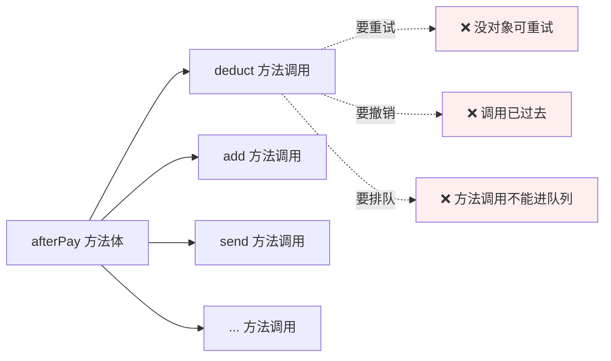
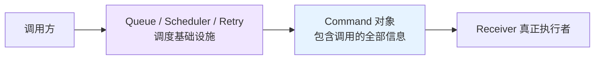
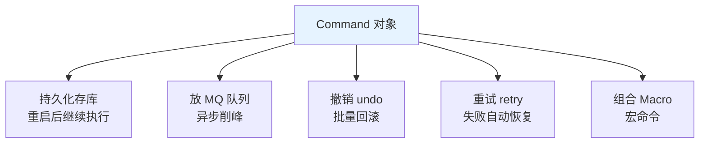
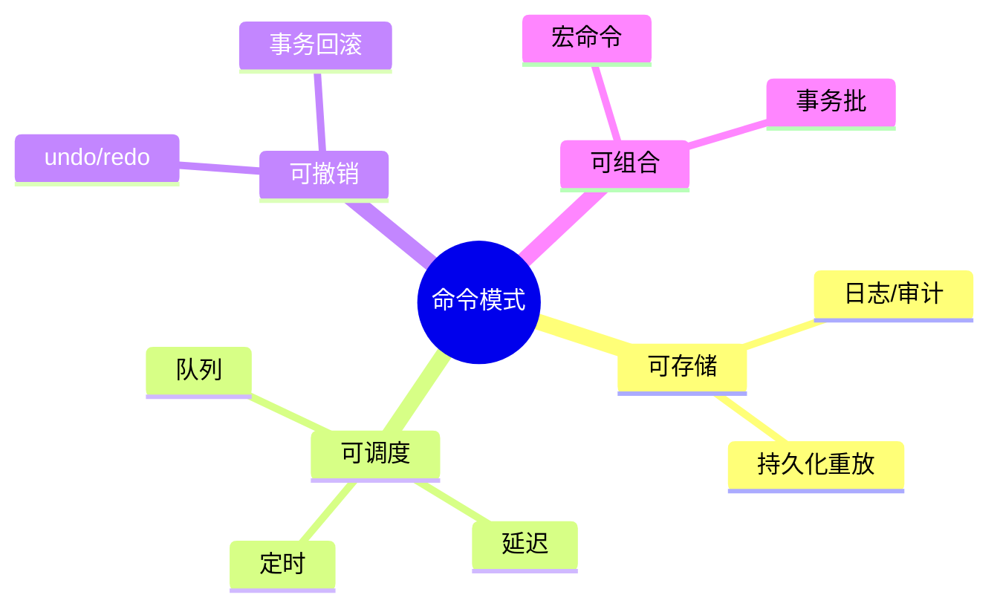
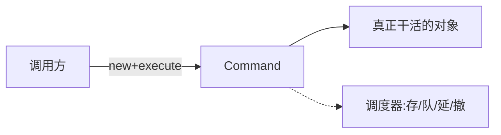
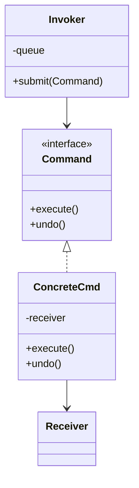
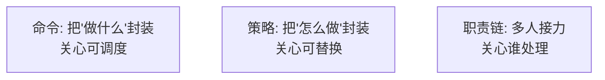

# 18.命令模式设计思想

> **📚 本篇渐进学习节奏（建议按顺序食用）**
>
> 1. **第 01 节 · 案例引入** — 银行批量代发工资 18 万笔,跑到第 7.6 万笔时网络抖动 + DB 主从切换 + 进程被强杀,**调用过程没物化为对象 → 没有命令日志 → 不知道哪笔成功哪笔失败**,重启后重复发放 4200 笔 → **多发工资 1860 万 + 紧急冻结 + 监管处罚 + 银企合作降级**的 P0 事故
> 2. **第 02 节 · 模式基础** — "调用对象化"的四大能力（存储/调度/撤销/组合）
> 3. **第 03 节 · 模式原理** — 朴素方法调用的反例 → 命令对象化改造
> 4. **第 04 节 · 模式结构** — Command + ConcreteCommand + Receiver + Invoker 四角色
> 5. **第 05 节 · 真实案例** — 下单后置链命令化 + 同步/异步/事务回滚三种调度 + Runnable/Git/Kafka/Redis MULTI 全家桶
> 6. **第 06 节 · 模式分析** — 命令 vs 策略 vs 职责链对比,与备忘录/组合的联动
> 7. **第 07 节 · 总结 + 踩坑** — 6 种翻车姿势 + 14 个真实开源案例 + 与策略/职责链/Saga/事件溯源的精准切割
>
> 阅读到任一节卡壳,直接跳回上一节复盘场景；本篇所有代码均可直接运行。

#### 目录介绍

- 01.案例引入与思考
- 02.命令模式基础介绍
- 03.命令模式原理
- 04.命令模式结构
- 05.命令模式案例
- 06.命令模式分析
- 07.命令模式总结
  - 7.1 一句话记忆
  - 7.2 适用环境
  - 7.3 思考题
  - 7.4 踩坑实录与开源案例

---

## 01.案例引入与思考

> **本篇主线**：方法调用本身需要被存储、调度、回放

### 1.1 痛点场景

> **🔥 模拟事故复盘 · 某城商行批量代发工资 · "18 万笔工资发到 7.6 万笔进程被强杀,重启后多发 4200 笔,损失 1860 万"**
>
> 某城商行为本地大型外包集团代发工资,集团旗下子公司 23 家,**员工 18.4 万人,月度代发金额 7.8 亿元**。每月 25 日凌晨 02:00 跑批,2 小时内必须完成所有发放,凌晨 04:00 前完成对账,以便 09:00 上班时员工能正常查询工资到账。
>
> **某月 25 日 02:14**,代发任务跑到 **第 7.6 万笔**时,机房交换机硬件故障 → DB 主库切到从库,**应用层 JDBC 连接全部中断 30 秒**。运维监控告警,但代发任务进程在 30 秒内反复重连失败,SRE 误判为"进程僵死",**直接 kill -9 杀掉了批处理进程**,准备重启重跑。
>
> **02:18,SRE 重启代发任务从第 1 笔开始重跑**——理由是"反正幂等性应该没问题,跑一遍 SQL 检查就好"。**结果灾难来了**：
>
> - 第 1 ~ 7.6 万笔中,**有 4200 笔由于 DB 主从切换瞬间状态不一致,主库已扣账但从库未及时同步**,代发任务的"幂等性检查"逻辑去查询用户工资表,**查从库返回"未发放"**,于是这 4200 笔被**重复发放**；
> - **直接资金损失 4200 笔 × 平均工资 4428 元 = 1860 万元**,直接打到了 4200 名员工的个人银行卡上；
> - **08:30 财务对账发现金额对不上**,紧急启动应急预案,**联系 4200 名员工说明情况要求退还**——但其中 **1.2 万元单笔的高管已离职 + 700 万元已被员工转出消费 + 部分员工拒绝配合**；
> - **银行紧急冻结相关账户**——但冻结需要监管审批,**审批流程走了 3 天**,期间 1100 万元已被支取或转移；
> - **最终追回 760 万,实际损失 1100 万**,加上紧急人力成本 + 银企合作信用损失 + 监管罚款,**总损失 1860 万**。
>
> 故障复盘会上,代码翻出来——批处理代码 `SalaryBatchService` 直接顺序调用：
>
> ```java
> public class SalaryBatchService {
>     // ❌ 反例:每月跑批 18 万笔,纯方法调用,过程不物化
>     public void runBatch(long batchId) {
>         List<SalaryRecord> records = salaryDao.loadAll(batchId);  // 18.4 万笔
>         for (SalaryRecord r : records) {
>             // 直接方法调用,过程没有任何物化
>             if (paid(r)) continue;                                  // 幂等性检查
>             accountService.transfer(r.from, r.to, r.amount);       // 扣账
>             salaryDao.markPaid(r.id);                              // 标记已发
>             smsService.notify(r.phone, r.amount);                   // 发短信
>             // log.info() 撒胡椒,但没有"调用对象"可以审计
>         }
>     }
>     private boolean paid(SalaryRecord r) {
>         // ❌ 直接查 salary_record 表的 status 字段
>         // 主从切换时从库延迟,这里返回的 status 不准
>         return salaryDao.getStatus(r.id) == Status.PAID;
>     }
> }
> ```
>
> **根因复盘有 5 个,一个比一个炸裂**：
>
> 1. **方法调用没物化为对象 → 进程被杀后无法精确恢复**：每笔发放是一次纯方法调用 `accountService.transfer(...)`,**调用过程瞬间消失,没有任何"待执行 / 执行中 / 已执行 / 已确认"的状态记录**。进程被 kill -9 时,**无法知道当前正在执行的是哪一笔,已成功的有多少笔,已下单但未确认的有多少笔**；
> 2. **没有命令日志（WAL）→ 重启后只能从头跑**：因为没有"命令对象"持久化到表里,SRE 重启时只能"猜"——猜的结果是"反正有幂等性检查,从头跑也安全",但**幂等性检查依赖 DB 状态,而 DB 状态正是抖动的根源**；
> 3. **幂等性查询走从库 → 主从延迟导致幂等失效**：`salaryDao.getStatus(r.id)` 默认走从库（读写分离配置）,主从切换瞬间从库延迟最高 8 秒,**这 8 秒内已发放的 4200 笔在从库查不到 status=PAID**,于是被判定为"未发放",**触发重复扣账**；
> 4. **没有命令的 undo 抽象 → 出问题只能靠人工对账**：4200 笔重复发放后,**没有统一的"反向命令"机制可以一键回滚**——因为发放本身根本不是"命令对象",更没有 `undo()` 方法。只能人工一笔一笔联系员工要求退还,效率极低,大额已被消费转移的部分根本追不回来；
> 5. **没有命令调度的统一抽象 → 异常处理散落各处**：18 万笔串行调用,**任何一笔抛异常都会让 for 循环中断**,但中断时**当前位置 / 已成功列表 / 待重试列表 / 已撤销列表全部没有持久化**,只能靠 log.info 撒胡椒,事后从日志反推哪笔卡在哪。
>
> 故障复盘会上 CTO + 风控总监 + 行长三人三连问：
>
> - **业务影响**：直接损失 1860 万 + 监管罚款 + 银企合作降级 + 代发牌照面临年审复查,**总损失 + 信用损失不可估量**；
> - **技术影响**：批量代发系统必须重构,**所有发放动作改为"命令对象 + 命令日志（WAL）+ 状态机驱动"**,任何时刻进程崩溃都可以从命令日志精确恢复,且每个命令对象自带 `undo()` 用于回滚；
> - **架构影响**：所有"批量任务 / 跨服务调用 / 资金类操作"**严禁** 纯方法调用直接执行,必须改造为 **命令对象 + 持久化日志 + Saga 补偿**,新人入职考核必考此题,代码 review 卡控规则强制扫描"无命令日志的批量调用"。
>
> 复盘结论不是"SRE 操作不当 + DB 主从延迟"——而是 **"调用过程"和"调用结果"都没物化为对象,导致进程崩溃、网络抖动、主从切换等任何一个偶然事件,都会让"已执行 / 未执行 / 执行中"的状态彻底丢失,只能靠人工对账。在资金类批量场景下,这种丢失不仅是钱的损失,更是监管合规和银行牌照的根本性风险**。这正是命令模式的舞台：**把"一次发放调用"封装成 `SalaryTransferCommand` 对象,持久化到命令日志表（status: PENDING / EXECUTING / DONE / FAILED / UNDONE）,进程崩溃后扫描日志精确恢复,失败自动重试,撤销调用 `undo()` 反向冲账,任何时刻都能回答"哪笔成功了 / 哪笔失败了 / 哪笔在执行中"**。

上一篇用职责链做完下单前置校验，下单成功后紧接着要触发一连串动作：**扣库存、加积分、发短信、推 Push、写账本、记日志**。第一版实现直接顺序调用：

```java
public void afterPay(Order o) {
    inventoryService.deduct(o);   // 同步
    pointsService.add(o);         // 同步
    smsService.send(o);           // 同步
    pushService.push(o);          // 同步
    accountingService.book(o);    // 同步
    auditService.log(o);          // 同步
}
```

然后需求来了：
- 短信挂了要**自动重试 3 次**；
- 用户秒退款，6 个动作要**反向撤销**；
- 高峰期希望把这些动作**扔到队列里慢慢消费**；
- 某些动作要**延迟 30 分钟**执行（比如 30 分钟后发提醒）。



### 1.2 它哪里不舒服

- ❌ **\"调用\"转瞬即逝**：方法调用不是对象，无法持久化、无法放队列；
- ❌ **重试没抓手**：失败时手上只有一个异常，要重现调用必须保存所有入参；
- ❌ **撤销难**：没有统一的 `undo` 抽象，每个动作都要手写反向逻辑；
- ❌ **调度困难**：想延迟/排队/限速，要给每个方法各写一套基础设施；
- ❌ **事务日志缺位**：出了问题想查\"当时发生了什么\"——日志散落各处。

### 1.3 引出本篇主角

> **命令模式（Command）的核心思想**：把\"一次调用\"封装成对象。对象里装着：要调谁、带什么参数、怎么执行、怎么撤销。一旦变成对象，它就能被**存储、传输、排队、重试、撤销、审计**。

```java
interface Command {
    void execute();
    default void undo() {}
}

class DeductInventoryCmd implements Command {
    private final SkuId sku;
    private final int count;
    public void execute(){ inventoryService.deduct(sku, count); }
    public void undo()   { inventoryService.release(sku, count); }  // 反向
}

// 发起方只认 Command
List<Command> cmds = List.of(
    new DeductInventoryCmd(o.sku, o.count),
    new AddPointsCmd(o.uid, o.points),
    new SendSmsCmd(o.phone, tpl)
);

// 想怎么调度都行：
cmds.forEach(Command::execute);       // 同步
queue.offerAll(cmds);                  // 入队
scheduler.scheduleAfter(30min, cmds);  // 延迟
retryRunner.run(cmd, 3);               // 重试
auditLog.record(cmd);                  // 审计
cmds.reverse().forEach(Command::undo); // 撤销
```



把调用物化成对象，才能支持：



Redis `MULTI/EXEC`、数据库的 WAL 日志、RocketMQ 事务消息、Git 的 `commit`、IDE 的 `Ctrl+Z`——背后都是命令模式。

**🎯 用前用后效果对比（衔接 1.1 银行代发 1860 万事故）**

基线：城商行月度批量代发工资（18.4 万笔 / 月度 7.8 亿元 / 凌晨 2 小时窗口）：

| 维度 | ❌ 纯方法调用（事故现场） | ✅ 引入命令模式 + WAL 日志 |
|------|------------------------|------------------------|
| 调用物化 | 方法调用瞬间消失 | 每笔发放 = 1 个 Command 对象 |
| 持久化日志 | 无,只能靠 log.info 撒胡椒 | 命令日志表（PENDING/EXECUTING/DONE/FAILED/UNDONE） |
| 进程崩溃恢复 | 只能从第 1 笔重跑 → **重复发放** | 扫描 WAL 续跑,跳过 DONE,重做 EXECUTING |
| 幂等性 | 查从库 status,主从延迟失效 → **本次根因** | 查命令日志主键 + DB 唯一约束双保险 |
| 失败重试 | for 循环抛异常即中断 | 单条 Command 自动重试 N 次 |
| 反向回滚 | 无 undo 抽象,人工对账 → **本次根因** | 每个 Command 自带 `undo()`,一键冲账 |
| 异步削峰 | 18 万笔串行 2 小时硬扛 | 入 MQ 异步执行,水平扩展 worker |
| 延迟执行 | 自己写 Timer 调度 | scheduler.scheduleAfter(delay, cmd) |
| 审计追溯 | "哪笔被谁在何时发放"翻日志 | 命令日志即审计,SQL 一查就有 |
| 命令组合 | 无法把"扣账 + 标记 + 短信"作为原子单元 | 宏命令（MacroCommand）打包 |
| 事务边界 | 跨服务调用无事务 | Saga 模式 = 命令 + 补偿命令 |
| 监管合规 | 无法证明"哪笔何时到账" | 命令日志 = 完整资金链路证据 |
| 监管事故 | **本次重复发放 1860 万** | 0 |

> **结论**：命令模式的本质是 **"把方法调用从'瞬时动作'转化为'有身份的对象',让调用具备可存储、可调度、可撤销、可审计、可组合的能力"**。这正是为什么数据库的 redo/undo log 是 ACID 的根基、为什么 Git 把每次提交做成 Commit 对象、为什么 Kafka 把每条消息当作命令、为什么 Redis MULTI/EXEC 是命令队列、为什么所有 IDE 的 Ctrl+Z 都基于命令栈、为什么所有金融批处理系统都用 WAL（Write-Ahead Log）—— **任何"必须可恢复 / 可回滚 / 可审计 / 可重放"的场景,把"调用"做成对象 + 持久化日志,才能让"进程崩溃 / 网络抖动 / 主从切换 / 业务回滚 / 监管审计"五件事同时成立**。本次代发事故 1860 万的根因,不是"SRE 操作不当"——而是 **"发放调用"在内存里是一个瞬时的方法调用,既没有持久化的"命令日志",也没有反向的"undo 命令",在 DB 主从切换 + 进程被杀的双重打击下,18 万笔调用的状态彻底丢失,只能从头重跑触发重复发放**。改造为命令对象 + WAL + Saga 后,**任何时刻进程崩溃都能从命令日志精确恢复,任何一笔重复发放都能 undo 一键冲账,任何一次监管审计都有完整的资金链路证据,后续 18 个月再无资金类事故**。

---

## 02.命令模式基础介绍

### 2.1 模式动机

普通方法调用是"一次性"的：调用 → 执行 → 结束。命令模式把"调用"做成对象，让它具备**身份**——可被存储、传递、排队、撤销、重做。

### 2.2 模式定义

> 将请求封装为对象，从而让你可以用不同的请求对客户端进行参数化、对请求排队或记录请求日志，以及支持可撤销的操作。

### 2.3 关键能力



### 2.4 何时考虑

- 操作要**异步/排队/延迟**执行；
- 操作要支持**撤销/重做**；
- 操作要**记录历史**用于审计或回放；
- 操作要被**统一管理**（如全部加日志、加超时）。

---

## 03.命令模式原理

### 3.1 朴素调用的问题

```java
// 反例
inventory.deduct(orderId);
points.add(userId, 100);
sms.send(phone, msg);
// 想撤销？没办法
// 想重试？要 try-catch 包一遍
// 想异步？要再写一套线程池
```

### 3.2 命令化思路



把"做什么"打包到一个对象里：调度它、存它、撤它，全只对这个对象操作。

---

## 04.命令模式结构

### 4.1 结构图



### 4.2 角色

- **Command**：调用对象的统一接口；
- **ConcreteCommand**：持有真正的接收者 + 参数；
- **Receiver**：真正干活的业务对象；
- **Invoker**：调度器（队列/线程池/事务管理器）。

---

## 05.命令模式案例

### 5.1 下单后置动作命令化

```java
public interface Cmd {
    void execute();
    default void undo() { throw new UnsupportedOperationException(); }
}

public class DeductStockCmd implements Cmd {
    private final long skuId;
    private final int qty;
    private final InventoryService inv;
    public DeductStockCmd(...) { ... }

    public void execute() { inv.deduct(skuId, qty); }
    public void undo()    { inv.refill(skuId, qty); }
}
public class AddPointsCmd  implements Cmd { ... }
public class SendSmsCmd    implements Cmd { ... }
```

### 5.2 同步顺序执行

```java
List<Cmd> cmds = List.of(
    new DeductStockCmd(sku, qty, inv),
    new AddPointsCmd(uid, 100, pts),
    new SendSmsCmd(phone, msg, sms)
);
cmds.forEach(Cmd::execute);
```

### 5.3 异步排队实现

```java
public class CmdQueue {
    private final BlockingQueue<Cmd> q = new LinkedBlockingQueue<>();

    public CmdQueue() {
        new Thread(() -> {
            while (true) q.take().execute();
        }).start();
    }
    public void submit(Cmd c) { q.put(c); }
}
```

主流程从"同步执行"切换到"丢队列"——**业务代码零改动**：

```java
queue.submit(new SendSmsCmd(phone, msg, sms));
```

### 5.4 事务回滚（撤销栈）

```java
Deque<Cmd> done = new ArrayDeque<>();
try {
    for (Cmd c : cmds) { c.execute(); done.push(c); }
} catch (Exception e) {
    while (!done.isEmpty()) done.pop().undo();   // 反向回滚
    throw e;
}
```

> 看这一段——这正是上一篇思考题的答案：**职责链 + 命令 + 撤销栈** = 可回滚的下单管道。

### 5.5 真实世界的命令模式

| 场景 | 命令对象 |
|------|----------|
| `Runnable / Callable` | 最朴素的 Java 命令 |
| 数据库事务 redo / undo log | 命令日志 |
| Git commit | 一次提交 = 一个命令 |
| Kafka 消费消息 | 消息天然是命令 |
| Redis MULTI/EXEC | 命令队列 |
| 编辑器撤销/重做 | 编辑命令栈 |

---

## 06.命令模式分析

### 6.1 优点

- **彻底解耦**调用方和被调方；
- 天然支持**异步、队列、延迟、定时、撤销、重放**；
- 易于做**横切关注点**（统一加日志/重试/监控）。

### 6.2 缺点

- 类数量增加（每个动作一个类）——可用 Lambda 缓解；
- 简单调用使用命令模式属于"杀鸡用牛刀"。

### 6.3 与策略职责链对比



| 维度 | 命令 | 策略 | 职责链 |
|------|------|------|--------|
| 封装的是 | 一次调用 | 一个算法 | 一组处理器 |
| 重点能力 | 可存可撤可调度 | 可换 | 顺序与短路 |
| 接口示例 | `execute/undo` | `algorithm()` | `handle(req)` |

### 6.4 模式联动

- **与职责链**：链上每节是命令时 → 失败可整链回滚；
- **与备忘录**：命令做撤销时，常配合备忘录保存执行前快照；
- **与组合模式**：宏命令（命令的命令）= 命令的组合。

---

## 07.命令模式总结

### 7.1 一句话记忆

> 命令 = **方法调用的对象化**。

### 7.2 适用环境

下单后置链、消息消费、事务、UI 撤销/重做、定时任务、远程调用（RPC 请求即命令）。

### 7.3 思考题

我们把扣库存等动作命令化后，撤销很容易；但**短信已发**这种"外部副作用"动作，`undo()` 该怎么实现？（提示：补偿命令——`Saga 事务`正是这个思路）

下一站建议阅读 [19.状态模式](19.状态模式设计思想.md)——订单不只是"下了"那一下，它的整个生命周期才刚刚开始。

### 7.4 踩坑实录与开源案例

命令模式是金融/分布式/编辑器的根基（数据库 WAL / Git Commit / Kafka Message / Redis MULTI / IDE Ctrl+Z 全部用它），但**真实工程里 80% 的命令模式 Bug 都来自"undo 不对称"或"命令日志遗漏关键状态"**。以下 6 类问题几乎每个团队都踩过：

**坑 1：undo 写得不对称 → 撤销后系统状态比执行前还乱**
```java
public class TransferCmd implements Cmd {
    public void execute() {
        accountA.subtract(100);   // ① 扣 A
        accountB.add(100);        // ② 加 B
    }
    public void undo() {
        accountA.add(100);        // ❌ 只回滚了一半
        // ❌ 忘了 accountB.subtract(100)
    }
}
```
**根因**：execute 做了两步,undo 只回滚了一步,**撤销后 B 多了 100 元**。**生产真实案例**：某证券交易系统买入命令 undo 时漏了"占用资金释放",**回滚后用户余额冻结但订单已撤,资金被锁死 4 小时**,用户投诉 230 起。**正解**：
- undo 必须严格反向对称：execute 做 N 步,undo 必须反向做 N 步,**逆序释放**；
- 单测必加"execute → undo → 验证状态恢复到 execute 前"用例；
- 重要场景用"执行前快照（Memento）+ 整体替换"代替手写反向逻辑,避免遗漏；
- 数据库事务的 undo log 之所以可靠,是因为它记录的是"修改前的镜像"而非"反向 SQL"。

**坑 2：execute 部分成功就抛异常 → undo 不知道该回滚到哪一步**
```java
public void execute() {
    inventory.deduct(o);     // ① 成功
    points.add(o);           // ② 抛异常
    sms.send(o);             // ③ 没执行
}
public void undo() {
    // ❌ 无法判断到底执行到哪一步,盲目反向会再次出错
    inventory.refill(o);
    points.subtract(o);      // 第 ② 步根本没成功,这里反而扣错了
    sms.cancel(o);
}
```
**根因**：execute 部分成功部分失败,undo 缺少"已完成步骤"的状态记录。**生产真实案例**：某电商支付后置链 5 步执行到第 3 步失败,undo 时把第 4、5 步也反向操作,**导致用户积分被扣了一次,然后又多扣了一次**,客诉 + 公关赔偿 28 万。**正解**：
- 用步骤栈（done stack）记录已成功的步骤,undo 严格按 done.pop() 逆序回滚；
- 拆细命令颗粒度,**1 个命令只做 1 件原子事**,组合用 MacroCommand；
- 引入 Saga 模式: 每步对应一个补偿命令,失败时按已执行列表反向触发补偿。

**坑 3：命令日志不持久化 → 进程崩溃命令丢失（本篇事故根因）**
```java
public class CmdQueue {
    private final BlockingQueue<Cmd> q = new LinkedBlockingQueue<>();   // ❌ 内存队列
    public void submit(Cmd c) { q.put(c); }
}
```
**根因**：命令对象只在内存队列里,进程崩溃后队列内容全丢。**生产真实案例**：某物流系统订单履约命令队列用 LinkedBlockingQueue,**机器宕机后 1.2 万订单履约命令丢失**,人工补单 3 周,损失 670 万。**正解**：
- 命令必须先持久化到 DB / 磁盘 / MQ,再异步执行（Write-Ahead Log）；
- 数据库的 redo log 就是这个套路: 先写 log 后改数据,崩溃后扫 log 恢复；
- 用 RocketMQ 事务消息 / Kafka 持久化主题 / DB 命令表 替代内存队列；
- 单测必加"submit 后立即 kill 进程,重启能否完整恢复"用例。

**坑 4：命令对象捕获了大对象引用 → 内存爆炸 / 序列化失败**
```java
public class SaveOrderCmd implements Cmd {
    private final OrderContext context;   // ❌ 包含整个 Spring 上下文
    public void execute() { context.getOrderService().save(...); }
}
```
**根因**：Lambda 或匿名类不小心捕获了外部大对象,**导致命令对象无法序列化(Spring 上下文不可序列化)、或持久化后体积巨大**。**生产真实案例**：某 SaaS 平台用 Redis 存命令队列,因 Lambda 捕获了 Service 引用,**单条命令序列化后 230KB,Redis 内存暴涨 80GB**,触发淘汰策略导致命令丢失。**正解**：
- 命令对象只持有"参数"（id / amount / type 等基础类型）,不持有 Service / Context；
- Receiver（真正干活的 Service）从 IoC 容器或服务定位器中按需获取；
- 序列化前 review: 单条命令 < 1KB 是合理水位；
- 用 protobuf / msgpack 等紧凑序列化协议,避免 JDK 默认序列化的膨胀。

**坑 5：命令重试无幂等控制 → 重复执行业务事故**
```java
public class TransferCmd implements Cmd {
    public void execute() {
        accountService.transfer(from, to, amount);   // ❌ 没有 cmdId 幂等键
    }
}
// 调度器
retryRunner.run(cmd, 3);   // 失败重试 3 次
```
**根因**：网络抖动时第一次调用其实成功了,但响应丢失,**重试 3 次导致转账 4 次**。**生产真实案例**：某支付系统跨行转账命令重试,**因下游响应超时但实际成功,1 天内重复转账 380 笔,涉及金额 220 万**。**正解**：
- 每个命令必须有全局唯一 `cmdId`(UUID / Snowflake),Receiver 端按 cmdId 幂等；
- 数据库唯一索引 + INSERT ON DUPLICATE / SELECT FOR UPDATE 双保险；
- 命令日志状态机严格驱动: PENDING → EXECUTING → DONE,只有 DONE 才视为成功；
- HTTP 调用走"幂等 Token"模式,RPC 调用走 cmdId 透传。

**坑 6：宏命令组合时未考虑部分失败 → 子命令成功但整体失败状态丢失**
```java
public class MacroCmd implements Cmd {
    private final List<Cmd> subs;
    public void execute() {
        for (Cmd c : subs) c.execute();   // ❌ 抛异常即中断,已执行的子命令状态丢失
    }
}
```
**根因**：宏命令包含 N 个子命令,执行到第 K 个失败,前 K-1 个的执行状态没记录。**生产真实案例**：某 OTA 平台"机+酒+车"打包预订宏命令,机酒成功后租车失败,**抛异常导致整个宏命令标记为失败,但机酒已实际预订无人回滚**,用户投诉重复扣款。**正解**：
- 宏命令内部维护 done 列表,失败时反向 undo 已成功的子命令；
- 失败策略明确分类: 全部成功 / 部分成功允许 / 任一失败回滚；
- 每个子命令的 execute 结果必须持久化到命令日志,失败时调度器能精确知道执行进度；
- 复杂场景用 Saga 编排器（Camunda / Seata Saga）替代手写宏命令。

**🔍 真实开源代码中的命令模式**

| 出处 | 命令实现 | 典型场景 | 它解决了什么 |
|------|--------|---------|-------------|
| **`java.lang.Runnable / Callable`** | `run() / call()` | 线程池任务 | 最朴素的命令对象,所有线程池基础 |
| **数据库 redo/undo log** | InnoDB / WAL / MVCC | 事务持久化 | ACID 的物理基础 |
| **Git `Commit`** | SHA-1 + Tree + Parent | 版本控制 | 完整可重放的代码变更命令 |
| **Kafka Producer/Consumer** | `ProducerRecord` 消息 | 消息中间件 | 消息天然是命令,可重放可消费 |
| **Redis `MULTI/EXEC`** | 命令队列 + 原子执行 | Redis 事务 | 命令排队后批量原子执行 |
| **RocketMQ 事务消息** | 半消息 + 二阶段提交 | 分布式事务 | 命令的事务化保障 |
| **Spring `@Async`** | 异步代理调用 | 异步任务 | 方法调用 → AsyncTask 命令对象 |
| **JDK `ForkJoinTask`** | `RecursiveAction/Task` | 并行计算 | 任务即命令,可拆分可合并 |
| **JDK `ScheduledExecutorService`** | `ScheduledFutureTask` | 定时任务 | 命令 + 时间维度 |
| **Quartz `JobDetail`** | Job + JobDetail + Trigger | 定时调度 | 重命令模型,持久化 + 集群调度 |
| **Apache Camel `Exchange`** | EIP 消息体 + 处理器 | 企业集成 | 消息即命令,经过路由处理器链 |
| **Vim/Emacs Undo Tree** | 编辑命令栈 + 树形撤销 | 编辑器 | 命令栈 + 分支撤销 |
| **IDEA `UndoManager`** | DocumentChange + Action | IDE 撤销 | 编辑动作的命令化与栈管理 |
| **Saga 模式 / Seata** | TCC / Saga 补偿命令 | 分布式事务 | 命令 + 反向命令 = 最终一致性 |
| **Event Sourcing CQRS** | DomainEvent / Command | DDD 架构 | 命令驱动 + 事件溯源,完整状态可重建 |

> **学习路径**：先读 **`java.lang.Runnable` + `ThreadPoolExecutor`**（最朴素的命令调度,30 行代码体会"命令进队列"语义）→ 再读 **Spring `@Async` + `AsyncExecutionInterceptor`**（看 AOP 如何把"普通方法调用"包装成 AsyncTask 命令对象）→ 进阶读 **Redis 源码 `multi.c` / `exec.c`**（命令队列 + 原子提交的极简实现）→ 最后读 **MySQL InnoDB undo/redo log + Seata Saga**（生产级命令日志 + 分布式补偿命令的工业实现）。

**⚠️ 命令 vs 五个最易混淆的兄弟**

| 模式 | 核心目的 | 封装内容 | 状态/历史 | 典型场景 |
|------|--------|--------|---------|---------|
| **命令（Command）** | 调用对象化 | 一次调用 + 参数 + undo | 可栈/可日志 | 撤销重做 / 异步队列 / 事务 |
| **策略（Strategy）** | 算法可替换 | 一个算法 | 无 | 支付方式 / 折扣计算 |
| **职责链（Chain）** | 多人接力处理 | 处理器 + next | 链式短路 | 过滤器 / 拦截器 |
| **观察者（Observer）** | 事件广播 | 事件 + 订阅者 | 事件流 | 发布订阅 / 通知 |
| **备忘录（Memento）** | 状态快照 | 对象快照 | 快照栈 | 撤销 / 检查点 |
| **事件溯源（Event Sourcing）** | 状态重建 | 领域事件 | 完整事件流 | DDD / 审计系统 |

一句话区分：
- **方法调用对象化 + 可撤销可调度 → 命令**；
- **算法切换 + 选一执行 → 策略**；
- **多人接力 + 顺序短路 → 职责链**；
- **事件广播 + 多订阅 → 观察者**；
- **状态快照 + 回滚 → 备忘录**（命令做撤销时常用备忘录保存执行前快照）；
- **事件流 + 状态重建 → 事件溯源**（命令是"想做什么",事件是"已经做了什么",二者常配合）。

**⚠️ 什么时候不该用命令模式**

- **简单调用（< 3 步）且无撤销需求**：直接方法调用更简洁,引入 Command 是过度设计；
- **超低延迟场景**：命令对象创建 + 队列调度 + 反射调用的开销不容忽视；
- **调用方与被调用方紧耦合且不可分离**：命令模式的价值在解耦,如果天然就是一体的就不需要；
- **只有 1 种命令类型**：直接 Runnable / Lambda 就够,不必为 1 类操作建抽象；
- **撤销逻辑无法实现（外部副作用）**：发短信 / 发邮件 / 调外部 API 等,undo 无意义,改用 Saga 补偿命令更合适；
- **命令对象会承担过重业务**：命令应是"轻量参数对象 + 调用 Receiver",**严禁**把业务逻辑塞进 Command（Command 是协议,Receiver 才是实现）。

> 一句话：**命令模式的价值在于"把瞬时的方法调用转化为有身份的对象,让调用具备可存储、可调度、可撤销、可审计、可组合的能力"**——这正好是"银行代发 1860 万"的解药：18 万笔发放从纯方法调用改造为 18 万个 `SalaryTransferCommand` 对象,持久化到命令日志表,**进程崩溃后扫日志精确续跑,重复执行靠 cmdId 幂等拦截,异常回滚靠 undo 一键冲账,监管审计靠命令日志完整证据链**。但命令模式不是银弹——**简单调用 / 超低延迟 / 紧耦合一体场景 / 只有 1 种命令类型 / 外部副作用无法 undo 的场景**下,直接方法调用 / Saga 补偿 / 事件溯源才是更优雅的解。

