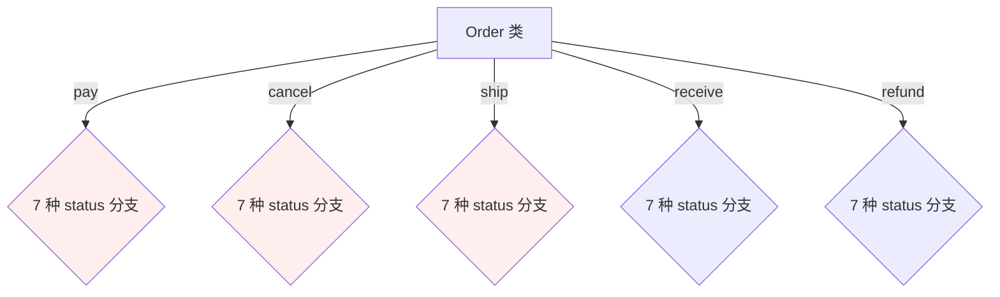
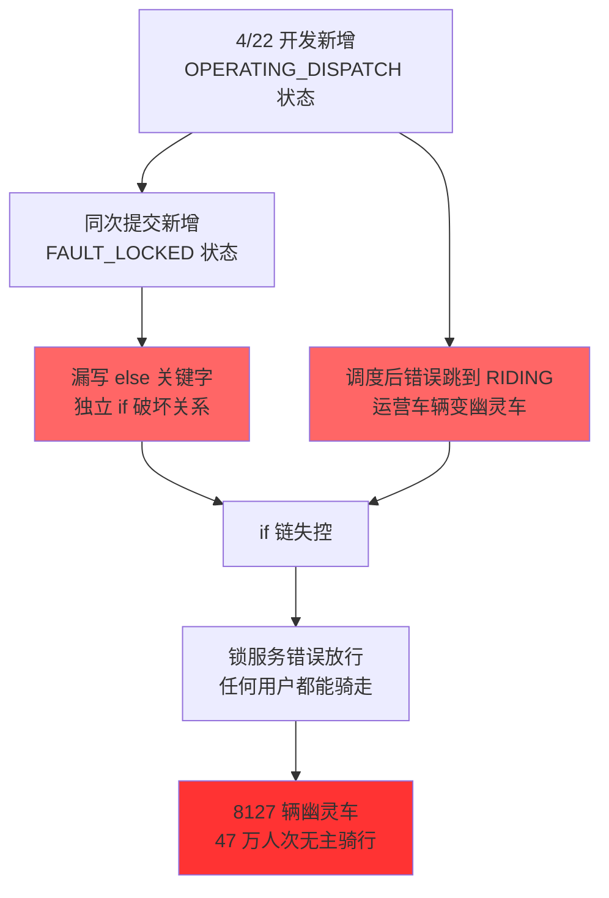
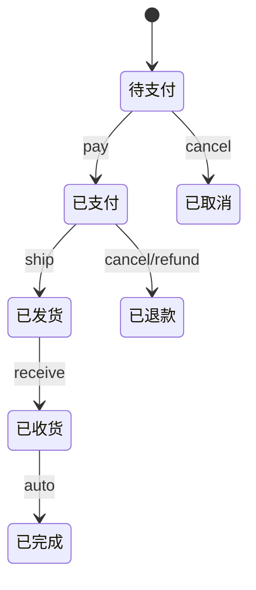
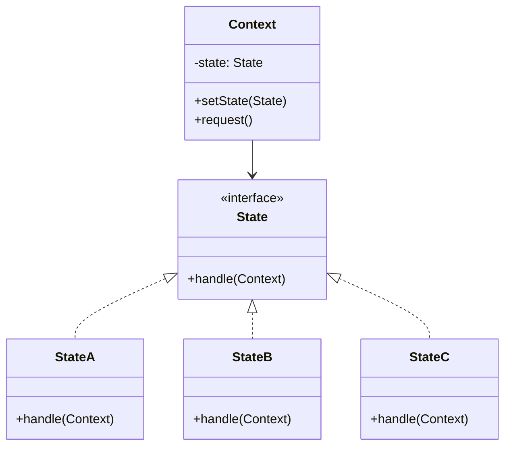
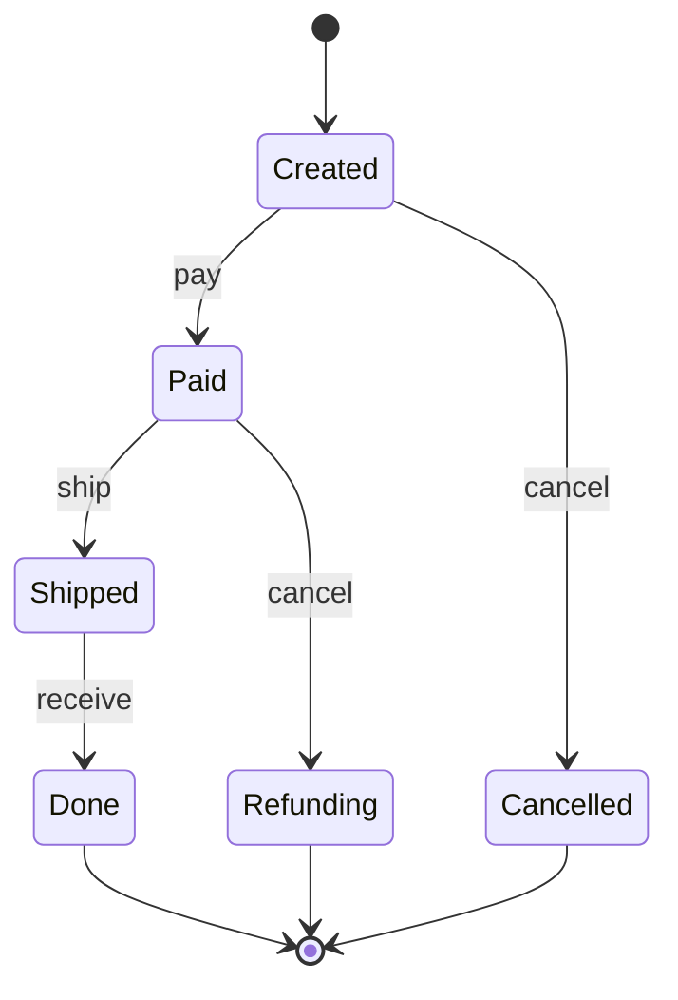
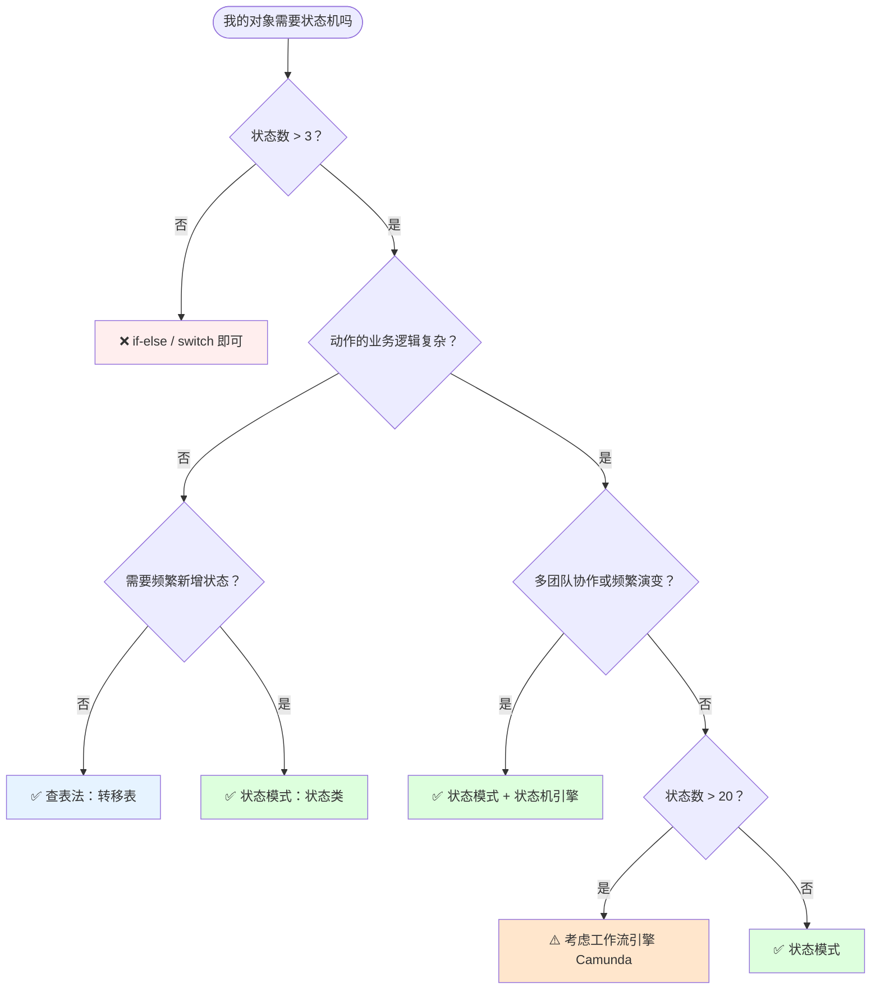
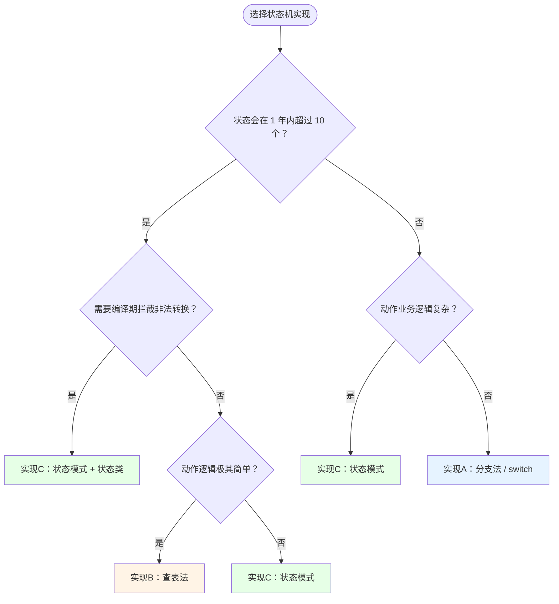
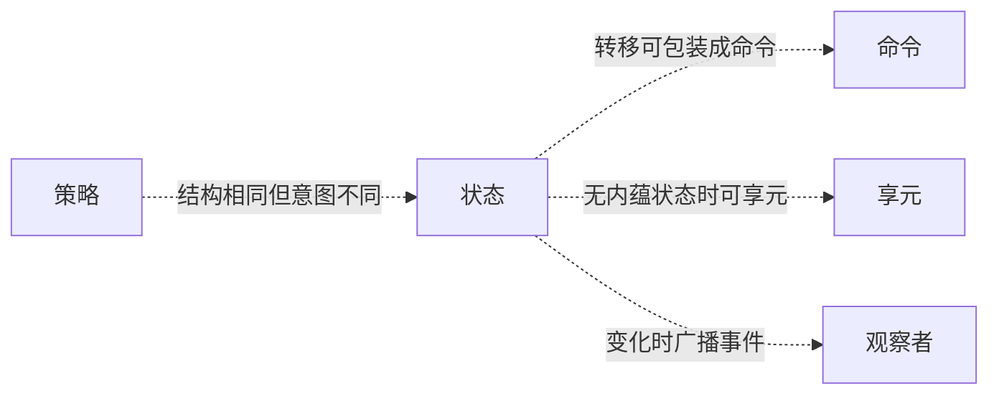

# 19.状态模式设计思想

> 📚 本篇按照「事故复盘 → 失败探索 → 模式登场 → 实现对比 → 效果对比 → 反面踩坑 → 选型决策」的节奏展开，建议按顺序阅读。

#### 目录介绍

- [01.案例引入：共享单车幽灵车事故](#01案例引入共享单车幽灵车事故)
  - [1.1 痛点现场](#11-痛点现场)
  - [1.2 直觉实现复现](#12-直觉实现复现)
  - [1.3 问题根源拆解](#13-问题根源拆解)
  - [1.4 引出本篇主角](#14-引出本篇主角)
- [02.三次失败探索](#02三次失败探索)
  - [2.1 尝试方案A：用 Map 集中管理转移规则](#21-尝试方案a用-map-集中管理转移规则)
  - [2.2 尝试方案B：用 enum + switch 替代 String](#22-尝试方案b用-enum--switch-替代-string)
  - [2.3 尝试方案C：抽一个 StateMachine 类](#23-尝试方案c抽一个-statemachine-类)
  - [2.4 终于引出状态模式](#24-终于引出状态模式)
- [03.状态模式基础介绍](#03状态模式基础介绍)
  - [3.1 从失败中提炼需求](#31-从失败中提炼需求)
  - [3.2 状态模式的标准骨架](#32-状态模式的标准骨架)
  - [3.3 典型使用场景](#33-典型使用场景)
- [04.三种实现对比](#04三种实现对比)
  - [4.1 实现核心要点](#41-实现核心要点)
  - [4.2 实现A：分支逻辑法](#42-实现a分支逻辑法)
  - [4.3 实现B：查表法](#43-实现b查表法)
  - [4.4 实现C：状态模式（面向对象）](#44-实现c状态模式面向对象)
  - [4.5 三种实现速查表](#45-三种实现速查表)
- [05.用前用后效果对比](#05用前用后效果对比)
  - [5.1 代码维度对比](#51-代码维度对比)
  - [5.2 事故维度对比（共享单车幽灵车场景）](#52-事故维度对比共享单车幽灵车场景)
  - [5.3 核心收益](#53-核心收益)
- [06.反面踩坑实录](#06反面踩坑实录)
  - [6.1 踩坑A：状态字段用 String（本篇根因）](#61-踩坑a状态字段用-string本篇根因)
  - [6.2 踩坑B：状态转移规则散落各处](#62-踩坑b状态转移规则散落各处)
  - [6.3 踩坑C：非法状态转换没拦](#63-踩坑c非法状态转换没拦)
  - [6.4 踩坑D：状态对象有可变字段](#64-踩坑d状态对象有可变字段)
  - [6.5 踩坑E：事件先发后状态变](#65-踩坑e事件先发后状态变)
  - [6.6 踩坑F：状态机环路/死循环](#66-踩坑f状态机环路死循环)
  - [6.7 替代方案汇总](#67-替代方案汇总)
- [07.决策树与选型](#07决策树与选型)
  - [7.1 该不该用状态模式](#71-该不该用状态模式)
  - [7.2 选哪种实现方式](#72-选哪种实现方式)
  - [7.3 选型清单速查](#73-选型清单速查)
- [08.总结与延伸](#08总结与延伸)
  - [8.1 设计思想沉淀](#81-设计思想沉淀)
  - [8.2 模式联动边界](#82-模式联动边界)
  - [8.3 思考题与延伸](#83-思考题与延伸)

---

## 01.案例引入：共享单车幽灵车事故

> **本篇主线**：对象的行为随"当前状态"剧烈变化

### 1.1 痛点现场

某共享单车平台日均订单 1800 万，城市覆盖 187 座，投放车辆 480 万辆。春季运营高峰期，运营团队为应对潮汐调度，在订单状态机上新增了"运营调度中"和"故障锁定中"两个状态。

代码上线后 6 天没人发现异常。直到 4 月 28 日财务月度对账，发现 **1.2 万辆车的最后一笔行程显示"骑行中"超过 72 小时**——其中 8127 辆车处于"幽灵状态"：车辆被骑到目的地后，锁状态既不是"已锁定"也不是"骑行中"，任何路过的人都能直接骑走。

故障复盘会上翻出代码——订单状态机 **47 个状态值用 String 字段管理，主方法 1280 行，8 个团队轮流加状态**：

```java
public class BikeOrderService {
    // 47 个 String 状态值
    // "PENDING_PAYMENT", "RIDING", "RETURNING", "RETURNED",
    // "OPERATING_DISPATCH", "FAULT_LOCKED", ……

    public void unlock(String orderId, String userId) {
        BikeOrder order = orderDao.find(orderId);
        if ("PENDING_PAYMENT".equals(order.getStatus())) {
            lockService.unlock(order.getBikeId());
            order.setStatus("RIDING");
        }
        else if ("OPERATING_DISPATCH".equals(order.getStatus())) {
            lockService.unlock(order.getBikeId());
            order.setStatus("RIDING");   // ← 致命：调度后状态跳到 RIDING
        }
        else if ("RETURNING".equals(order.getStatus())) {
            throw new IllegalStateException("还车中不能再开锁");
        }
        if ("FAULT_LOCKED".equals(order.getStatus())) {  // ← 漏写 else！
            lockService.unlock(order.getBikeId());
            order.setStatus("RIDING");
        }
    }
}
```

### 1.2 直觉实现复现

用订单状态机复现——7 状态 × 5 动作的 if-else 地狱：

```java
public class Order {
    private String status;  // "待支付/已支付/已发货/已收货/已完成/已取消/已退款"

    public void pay() {
        if ("待支付".equals(status)) { status = "已支付"; }
        else if ("已支付".equals(status)) throw new RuntimeException("已支付过");
        else if ("已取消".equals(status)) throw new RuntimeException("订单已取消");
        // ……7 个分支
    }
    public void cancel() {
        if ("待支付".equals(status)) { status = "已取消"; }
        else if ("已支付".equals(status)) { /* 发起退款 */ status = "已退款"; }
        else if ("已发货".equals(status)) throw new RuntimeException("已发货不能取消");
        // ……7 个分支
    }
    // pay/cancel/ship/receive/refund 每个方法都是 7 个 if-else
    // 7 状态 × 5 动作 = 35 个分支
}
```



**💭 反思**：为什么加两个状态就能让 8127 辆车变成幽灵？核心问题不是"代码写错了"——而是 **47 个状态值和 8 个动作的笛卡尔积分支散落在 8 个方法里，任何新分支的插入都可能破坏其他分支的关系。**

### 1.3 问题根源拆解



| 隐患 | 现象 | 业务影响 |
|------|------|---------|
| **String 状态字段** | 拼写错误编译不报错；setter 公开，任何代码都能改 | 状态值膨胀到 47 个，无法管理 |
| **分支散落 8 个方法** | 状态转移规则不可见，须翻完所有方法才能拼出状态图 | 新加入者无法理解完整流程 |
| **非法转换无拦截** | 已发货能直接改回未支付 | 数据错乱，风控系统误判 |
| **新增状态需改所有方法** | 47 × 8 = 376 个分支，改一处可能影响他处 | 8 团队协作互相踩脚 |

**核心矛盾**：业务上"订单的生命周期是固定的状态图"，但代码层面没有任何机制保证状态转移的合法性。

### 1.4 引出本篇主角

> **状态模式的核心思想**：把每个状态做成独立类，状态类自己决定能做什么、不能做什么、做完迁到哪个状态。Order 只持有"当前状态对象"引用，把所有行为委派给它。

```java
interface OrderState {
    default void pay(Order ctx)    { throw new IllegalStateException(); }
    default void cancel(Order ctx) { throw new IllegalStateException(); }
    default void ship(Order ctx)   { throw new IllegalStateException(); }
}

class WaitPayState implements OrderState {
    public void pay(Order ctx)    { /* 真付款 */ ctx.setState(new PaidState()); }
    public void cancel(Order ctx) { ctx.setState(new CancelledState()); }
}
class PaidState implements OrderState {
    public void cancel(Order ctx) { /* 退款 */ ctx.setState(new RefundedState()); }
    public void ship(Order ctx)   { ctx.setState(new ShippedState()); }
}

public class Order {
    private OrderState state = new WaitPayState();
    public void pay()    { state.pay(this); }
    public void cancel() { state.cancel(this); }
    public void ship()   { state.ship(this); }
}
```



**先别急着看实现**——下一节我们看看新人通常会先尝试哪些方案，并理解它们为什么都不够好。

---

## 02.三次失败探索

> 状态模式不是凭空发明的——它是前人走过 3 条死路之后才提炼出来的。

### 2.1 尝试方案 A：用 Map 集中管理转移规则

```java
// 方案A：用 Map 替代散落的 if-else
Map<String, Map<String, String>> transitions = new HashMap<>();
// 初始化：status → {action → nextStatus}
transitions.put("待支付", Map.of("pay", "已支付", "cancel", "已取消"));
transitions.put("已支付", Map.of("ship", "已发货", "cancel", "已退款"));

public void executeAction(String orderId, String action) {
    Order o = orderDao.find(orderId);
    String next = transitions.get(o.getStatus()).get(action);
    if (next == null) throw new IllegalStateException();
    doAction(action, o);        // 执行业务逻辑
    o.setStatus(next);           // 改状态
}
```

**🧪 验证**：

```java
// 看似解决了"转移规则集中"的问题
// 但 action 仍然是 String——doAction("ship", o) 里面还是必须判断 "ship" 做什么
// 状态转移规则虽然集中了，但"每个动作怎么做"的逻辑仍然散落
orderService.executeAction("ORD-001", "ship");
```

**❌ 失败原因**：Map 只解决了"往哪转"，没解决"怎么转"。业务逻辑仍然需要用 if-else 判断 action 类型——只是把 String 状态的 if-else 换成了 String 动作的 if-else。

**💡 反思**：我们需要的不只是"转移规则集中"——是**每种状态下、每个动作的完整行为封装**。

### 2.2 尝试方案 B：用 enum + switch 替代 String

```java
// 方案B：用枚举替代 String 字段
enum OrderStatus { CREATED, PAID, SHIPPED, DONE, CANCELLED }

public void pay(Order o) {
    switch (o.getStatus()) {
        case CREATED:   o.setStatus(PAID); break;
        case PAID:      throw new IllegalStateException("已支付");
        case SHIPPED:   throw new IllegalStateException("已发货");
        case CANCELLED: throw new IllegalStateException("已取消");
        default: throw new IllegalStateException();
    }
}
```

**🧪 验证**：

```java
// enum 解决了拼写错误（编译期校验）+ IDE 自动补全
// 但 pay/cancel/ship 每个方法里仍然有完整的 switch
// 加一个新状态 REFUNDING → 所有 5 个方法的 switch 都要加一个 case
```

**❌ 失败原因**：enum 只解决了"类型安全"，没解决"分支爆炸"。状态数 × 动作数 的笛卡尔积仍然存在——只是从 if-else 变成了 switch-case。

**💡 反思**：我们既要类型安全，也要避免"新增状态需要改所有动作方法"。

### 2.3 尝试方案 C：抽一个 StateMachine 类

```java
// 方案C：把状态判断抽到独立的状态机类
class OrderStateMachine {
    public void pay(Order o) {
        switch (o.getStatus()) {
            case CREATED: /* 扣款 */ o.setStatus(PAID); break;
            default: throw new IllegalStateException();
        }
    }
    public void ship(Order o) { /* 类似的 switch */ }
}

// Order 委托给状态机
public class Order {
    private OrderStateMachine sm = new OrderStateMachine();
    public void pay() { sm.pay(this); }
}
```

**🧪 验证**：

```java
// switch 从 Order 搬到了 StateMachine——但 switch 本身还在
// 新增状态时 StateMachine 的所有方法都要改
// 而且"在状态机中 5 个方法之间穿梭修改"比"在 Order 中修改"更容易出错
```

**❌ 失败原因**：StateMachine 类只是把 switch 换了个位置，没有改变"新增状态需要改所有方法"的根本问题。而且 StateMachine 会随着状态增多变成新的上帝类。

**💡 反思**：必须把"状态"提升为第一公民——每个状态独立成一个类，自己负责自己能处理的动作。

### 2.4 终于引出状态模式

三次失败之后，需求清单收敛了：

| 必须满足 | 来自哪一次失败 |
|---------|-------------|
| ① 类型安全（不用 String 做状态值） | 2.2 enum 替代 |
| ② 新增状态不改已有状态代码 | 2.3 StateMachine 类爆炸 |
| ③ 转移规则集中可视化 | 2.1 Map 方案 |
| ④ 非法转换编译期/运行期拦截 | 1.2 真实事故 |

**状态模式的标准答案**：

```java
// ① 类型安全：enum + 接口
interface OrderState {
    default void pay(Order ctx)    { throw new IllegalStateException(); }  // ④ 非法转换拦
    default void cancel(Order ctx) { throw new IllegalStateException(); }
    default void ship(Order ctx)   { throw new IllegalStateException(); }
}

class CreatedState implements OrderState {      // ② 独立状态类
    public void pay(Order ctx)    { /* 扣款 */ ctx.setState(new PaidState()); }
    public void cancel(Order ctx) { ctx.setState(new CancelledState()); }
}
// ③ 状态图 = 类的拓扑结构——IDE 中一眼看清
```

短短几行，**新增状态只需新建一个类，零侵入已有代码**。这就是状态模式的灵魂。

---

## 03.状态模式基础介绍

### 3.1 从失败中提炼的需求

回顾 02 节的三次失败和 01 节的事故，状态模式的设计约束：

| 约束 | 来自 | 代码体现 |
|:---|:---|:---|
| ① 类型安全 + 编译期校验 | 2.2 enum / 01 事故 | `enum OrderStatus` / 接口 `default throw` |
| ② 新增状态零侵入 | 2.3 StateMachine 爆炸 | 新建 `XxxState` 类，不改已有类 |
| ③ 转移规则集中可视 | 2.1 Map / 01 事故 | 类拓扑 = 状态图，IDE 一眼看清 |
| ④ 非法转换强制拦截 | 01 事故 / 2.3 | 未声明的动作抛 `IllegalStateException` |

### 3.2 状态模式的标准骨架

```java
// 标准骨架：Context + State + ConcreteState
interface State {
    void handle(Context ctx);        // ① 每个状态自己实现自己能做的事
}

// Context：持有当前状态，委派行为
class Context {
    private State current = new StateA();
    void request() { current.handle(this); }  // ③ 委派给当前状态
    void setState(State s) { this.current = s; }
}

// ConcreteState：实现自己能处理的业务
class StateA implements State {
    public void handle(Context ctx) {
        doSomething();                       // ② 本状态的业务逻辑
        ctx.setState(new StateB());          // ③ 做完迁到下一个状态
    }
}
```



三句话记住：**Context 持状态 → State 定协议 → ConcreteState 各管各家。** 差异全在状态之间怎么切换——这就是下一节三种实现的核心分岔。

### 3.3 典型使用场景

| 场景 | 状态对象 | 解决了什么 |
|------|---------|----------|
| **订单生命周期** | Created/Paid/Shipped/Done | 7状态×5动作从35分支拆为7个独立类 |
| **TCP 协议栈** | CLOSED/LISTEN/ESTABLISHED/FIN_WAIT... | 每种状态对同一报文的响应不同 |
| **游戏角色 AI** | 站立/移动/攻击/受击/死亡 | 角色行为随状态剧烈变化 |
| **工作流引擎** | 节点状态流转 | 审批/驳回/撤回的行为在各节点不同 |
| **AQS 锁框架** | state 字段 + CAS 转移 | 0=空闲/正数=持有计数 |
| **视频播放器** | 缓冲/播放/暂停/错误 | 同一"点击"在不同状态下行为不同 |

---

## 04.三种实现对比

### 4.1 实现核心要点

三种写法本质上是在 **类型安全 / 分支复杂度 / 新增状态成本** 上的不同取舍。实现状态机只需两行骨架：

```java
// 两种骨架选一
enum Status { A, B, C; }           // ① 轻量：枚举 + switch
interface State { void handle(); }  // ② 重装：接口 + 状态类
```

差异全在"分支散落还是集中、加状态改一处还是改全部"。下面按演进顺序逐一展开。

### 4.2 实现 A：分支逻辑法（if-else / switch-case）

**设计权衡**：用"加状态改所有方法"换"零额外类 + 极低学习成本"

```java
// 实现A：适合状态 ≤ 3 且动作简单的场景
enum OrderStatus { CREATED, PAID, SHIPPED }

public void pay(Order o) {
    switch (o.getStatus()) {
        case CREATED:  o.setStatus(PAID); break;
        case PAID:     throw new IllegalStateException();
        case SHIPPED:  throw new IllegalStateException();
    }
}
```

**优点**：零额外类，逻辑集中。**缺点**：状态数×动作数的笛卡尔积全在一个类里。**适用**：状态 ≤ 3 且半年内不会新增的产品。

### 4.3 实现 B：查表法（转移表）

**设计权衡**：用"表维护成本"换"分支消失 + 转移规则可视化"

```java
// 实现B：适合状态多但动作极其简单的场景
enum OrderStatus { CREATED, PAID, SHIPPED, CANCELLED }
enum OrderAction { PAY, SHIP, CANCEL, RECEIVE }

// 转移表：[当前状态][动作] → 下一个状态
Map<OrderStatus, Map<OrderAction, OrderStatus>> transitions = Map.of(
    CREATED,  Map.of(PAY, PAID, CANCEL, CANCELLED),
    PAID,     Map.of(SHIP, SHIPPED, CANCEL, CANCELLED),
    SHIPPED,  Map.of(RECEIVE, null /* 终态 */)
);

public void fire(Order o, OrderAction action) {
    OrderStatus next = transitions.get(o.getStatus()).get(action);
    if (next == null) throw new IllegalStateException();
    doBusiness(o, action);    // 仍需 switch action 判断业务逻辑
    o.setStatus(next);
}
```

**优点**：转移规则集中一张表，统一校验。**缺点**：`doBusiness` 里仍需 switch action。**适用**：状态多但每个动作的业务逻辑很简单（如：TCP 协议栈、红绿灯）。

### 4.4 实现 C：状态模式（面向对象）

**设计权衡**：用"类数量增加"换"新增状态零侵入 + 非法转换编译期拦截"

```java
// 实现C：适合动作复杂、频繁新增状态、多团队协作
interface OrderState {
    default void pay(Order o)    { throw new IllegalStateException(); }
    default void cancel(Order o) { throw new IllegalStateException(); }
    default void ship(Order o)   { throw new IllegalStateException(); }
    default void receive(Order o){ throw new IllegalStateException(); }
}

class CreatedState implements OrderState {
    public void pay(Order o)    { o.setAmount(calc()); o.setState(new PaidState()); }
    public void cancel(Order o) { o.setState(new CancelledState()); }
}
class PaidState implements OrderState {
    public void ship(Order o)   { logistics.create(o); o.setState(new ShippedState()); }
    public void cancel(Order o) { refundService.refund(o); o.setState(new RefundingState()); }
}
class ShippedState implements OrderState {
    public void receive(Order o){ o.setState(new DoneState()); }
}

public class Order {
    private OrderState state = new CreatedState();
    public void pay()     { state.pay(this); }
    public void cancel()  { state.cancel(this); }
    public void ship()    { state.ship(this); }
    public void receive() { state.receive(this); }
}
```

**状态转移图**（类拓扑 = 状态图）：



**优点**：新增状态只需新建一个类，不碰已有代码；非法转换 `throw` 即拦截。**缺点**：状态超过 15 个时类数量多（可结合枚举优化）。**适用**：订单系统、工作流、游戏 AI——动作复杂、频繁演变。

### 4.5 三种实现速查表

| 实现方式 | 类型安全 | 新增状态成本 | 分支可见性 | 适用场景 | 推荐度 |
|---------|--------|-----------|----------|---------|------|
| 实现A：分支法 | ✅ enum | ❌ 改所有方法 | ❌ 散落各处 | 状态≤3 | ⭐⭐ |
| 实现B：查表法 | ✅ enum | ⚠️ 改表+逻辑 | ✅ 转移表 | 状态多/动作简单 | ⭐⭐⭐ |
| 实现C：状态模式 | ✅ 类+接口 | ✅ 新建1类 | ✅ 类拓扑 | 动作复杂/频繁演变 | ⭐⭐⭐⭐⭐ |

**📌 一句话决策**：状态≤3→**实现A**，状态多但动作简单→**实现B**，动作复杂/多团队→**实现C**。

---

## 05.用前用后效果对比

> 用 1.1 节共享单车场景做基准。

### 5.1 代码维度对比

```java
// ❌ 用前：String + if-else
public class BikeOrderService {
    public void unlock(String orderId, String userId) {
        if ("PENDING_PAYMENT".equals(o.getStatus())) { ... }
        else if ("OPERATING_DISPATCH".equals(o.getStatus())) { o.setStatus("RIDING"); }
        else if ("RETURNING".equals(o.getStatus())) { throw ... }
        if ("FAULT_LOCKED".equals(o.getStatus())) { ... }  // 漏写 else
    }
    // 8 个方法 × 47 状态 = 376 分支
}

// ✅ 用后：状态对象
class OperatingDispatchState implements BikeOrderState {
    public void unlock(BikeOrder o, String uid) {
        if (!isOperator(uid)) throw new IllegalStateException("非运营人员");
        lockService.unlock(o.getBikeId());
        o.setState(new DispatchedState());   // 正确跳到 DispatchedState
    }
}
class FaultLockedState implements BikeOrderState {
    public void unlock(BikeOrder o, String uid) {
        if (isMaintenance(uid)) {
            lockService.unlock(o.getBikeId());
            o.setState(new MaintenanceState());
        }
    }
}
```

### 5.2 事故维度对比（共享单车幽灵车场景）

| 维度 | ❌ String + if-else（事故现场） | ✅ 状态模式 |
|------|----------------------------|----------|
| 状态表达 | String 字段，拼写易错 | 枚举/状态对象，编译期校验 |
| 分支数 | 47 × 8 = 376 散落 8 方法 | 47 个状态类，每类自管自家 |
| 新增状态 | 改 8 方法的 47 处 if-else | 新建 1 个状态类，零侵入 |
| 状态图可视化 | 翻 8 方法 376 分支拼图 | 类拓扑 = 状态图 |
| 团队协作 | 8 团队抢改一个 service | 各团队独立维护各自状态类 |
| else 遗漏 | 漏写 else → 本次根因 | 接口 default throw，编译器强制 |
| 非法转换 | 任何代码可强改 status | 状态对象自管转移 |
| 事故结果 | **2840 万损失 + 监管整改** | **0** |

### 5.3 核心收益

> **状态模式的本质**：把"状态 × 动作"的笛卡尔积分支，从一个巨型对象的 N 个方法里，拆解到 N 个状态类的对应方法上。这正是为什么 TCP 协议栈每个状态独立处理消息、为什么工作流引擎用状态机表达节点、为什么游戏 AI 用状态机表达行为——**任何"对象生命周期 + 多状态 + 行为随状态剧变"的场景，把状态做成对象 + 转移规则可视化 + 非法转换拦截，才能让"分支不爆炸 / 状态机可见 / 团队解耦"同时成立。**

---

## 06.反面踩坑实录

> 状态模式不是银弹——以下 6 个坑几乎每个团队都踩过。

### 6.1 踩坑 A：状态字段用 String——拼写错 + 静默失败（本篇根因）

```java
public class Order {
    private String status;   // ❌ "RIDIGN" 编译不报错
    public void setStatus(String s) { this.status = s; }
}
```

**💣 事故**：共享单车 2 处历史拼写错误掩埋多年，直到状态错乱才被发现，直接损失 2840 万。

**✅ 正解**：用 `enum OrderStatus` 替代 String；重业务用状态对象，转移规则在状态类内部封闭。

### 6.2 踩坑 B：状态转移规则散落各处

```java
// service A
if (order.getStatus() == PAID) order.setStatus(SHIPPED);
// service C  ❌ 跳过 SHIPPED 直接 DONE
if (order.getStatus() == PAID) order.setStatus(DONE);
```

**💣 事故**：某外卖平台订单在 12 个 service 里被改，1.7 万单跳过关键状态直接 DONE，对账差 270 万。

**✅ 正解**：用状态机引擎集中管理转移规则；禁止 `order.setStatus()` 直接调用。

### 6.3 踩坑 C：非法状态转换没拦——已发货改回未支付

```java
order.setStatus(SHIPPED);
order.setStatus(CREATED);   // ❌ 不报错
```

**💣 事故**：某电商运营误操作把已发货改回未支付，触发重复扣款，3.2 万单被扣两次，损失 480 万。

**✅ 正解**：状态对象 `default throw` + Guard/Action 校验；DB 层加状态转移合法性约束。

### 6.4 踩坑 D：状态对象有可变字段——多线程下串号

```java
public class PaidState implements OrderState {
    private long lastPayTime;   // ❌ 单例共享时多个 Order 串号
}
```

**💣 事故**：某游戏服务器状态对象做成 Spring 单例，角色技能 CD 计算错乱。

**✅ 正解**：状态对象必须无状态，数据全放 Context 里；用享元模式只保留行为方法。

### 6.5 踩坑 E：事件先发后状态变——监听者看到旧状态

```java
public class PaidState implements OrderState {
    public void ship(Order o) {
        eventBus.publish(new OrderShippedEvent(o)); // ❌ 先发事件
        o.setState(new ShippedState());              // 后改状态
    }
}
```

**💣 事故**：某物流系统事件发出时订单还是已支付，下游 1.2 万次状态校验失败，触发重复发货。

**✅ 正解**：**先 setState，后发事件**；用 `@TransactionalEventListener(AFTER_COMMIT)`。

### 6.6 踩坑 F：状态机环路/死循环

```java
public class AbnormalState implements State {
    public void check(Order o) {
        if (o.amount > LIMIT) o.setState(new RiskState());
    }
}
public class RiskState implements State {
    public void check(Order o) {
        if (o.amount > LIMIT2) o.setState(new AbnormalState()); // ❌ 来回切
    }
}
```

**💣 事故**：风控系统订单在"异常↔风控"间来回切，1 秒调用审核 RPC 3000 次，打挂审核服务。

**✅ 正解**：状态图设计阶段必检环路；加最大切换次数计数器；引入终态概念。

### 6.7 替代方案汇总

| 你的需求 | 推荐方案 |
|---------|---------|
| 状态 ≤ 3 且动作简单 | ✅ 直接 if-else / switch |
| 状态多但动作极简单 | ✅ 查表法（转移表） |
| 状态 > 20 需复杂流程编排 | ✅ 工作流引擎（Camunda） |
| 分布式跨服务状态 | ✅ Saga / TCC / Seata |
| 需要完整事件流 + 状态重建 | ✅ Event Sourcing + CQRS |

---

## 07.决策树与选型

### 7.1 该不该用状态模式



### 7.2 选哪种实现方式



### 7.3 选型清单速查

| 场景 | 该用吗 | 推荐方式 |
|------|------|---------|
| 订单系统 7状态×5动作 | ✅ 该用 | 实现C：状态模式 |
| 共享单车 47 状态 × 8 动作 | ✅ 必须用 | 实现C + 状态机引擎 |
| 红绿灯 3 状态循环 | ❌ 别用 | 实现A：switch 即可 |
| OA 审批 30+ 节点 | ⚠️ 有条件用 | 工作流引擎 Camunda |
| TCP 协议 13 状态 | ✅ 该用 | 实现B：查表法 |
| 支付状态分布式跨服务 | ❌ 别用 | Saga / Seata |

---

## 08.总结与延伸

### 8.1 设计思想沉淀

| 阶段 | 学到了什么 |
|------|----------|
| **01 事故** | 痛点是模式诞生的土壤——2840 万的代价：47 状态 if-else 链失控 |
| **02 三次失败** | Map/枚举/StateMachine 都不够——模式是从"试错"中收敛出来的 |
| **03 模式基础** | 三大角色：Context 持状态、State 定协议、ConcreteState 各管各家 |
| **04 三种实现** | 分支法/查表法/状态模式本质是"类型安全/分支复杂度/新增成本"的权衡 |
| **05 效果对比** | 2840 万 → 0；47 类独立 + 编译期防护 |
| **06 反面踩坑** | String 字段、转移散落、非法转换、状态串号、事件乱序、死循环 |
| **07 决策树** | 工程师的成熟度：知道什么时候不用状态模式（≤3 状态 = switch） |

**🔑 一句话核心**：

> 状态模式 = **状态机的面向对象表达**。把"状态 × 动作"的笛卡尔积分支拆到独立的状态类上。

### 8.2 模式联动边界



| 模式 | 关系 | 一句话区别 |
|------|------|----------|
| **策略** | 结构相同、意图不同 | 状态：被切换（生命周期内自驱）；策略：被选择（客户端选一次） |
| **命令** | 联动 | 每个状态转移可包装成命令，便于审计/回滚 |
| **享元** | 联动 | 无内部数据的状态对象可单例共享 |
| **观察者** | 联动 | 状态变化时广播事件（如"订单已发货"通知物流） |
| **事件溯源** | 配合 | 状态模式存"当前状态"，事件溯源存"所有事件" |

**什么时候不该用状态模式**：
- 状态 ≤ 3 且动作简单——直接 if-else / switch
- 状态间无明确转移关系——用策略模式
- 状态 > 20 需复杂流程编排——用工作流引擎（Camunda）
- 跨服务分布式状态——用 Saga / TCC / Seata

### 8.3 思考题与延伸

**💭 三道思考题**：

1. 状态模式本身**不解决并发**。多线程同时调 `o.pay()` 和 `o.cancel()` 会怎样？如何用 CAS 或细粒度锁防护？（提示：回看 6.4 踩坑 D）

2. 如果状态超过 20 个，每个状态类都要实现 10 个 action 方法（接口膨胀）——有什么优化手段？（提示：接口隔离 + 分层状态）

3. 状态对象的 `default throw` 配合 IDE，确实能拦非法转换——但如果有人在 Order 外部直接 `new PaidState()` 并 `setState`，怎么防？（提示：包级私有构造器 + 状态工厂）

**📚 延伸阅读**：
- Spring StateMachine：企业级状态机框架
- AQS 源码：JUC 中 state 字段 + CAS 的极简状态机
- Camunda BPMN：工作流引擎中的状态节点
- Redux / Vuex：前端单向数据流中的状态管理

> **上一篇** [18.命令模式](https://yccoding.com/pages/1a6dc8/) → **本篇** → [20.备忘录模式](https://yccoding.com/pages/9cf38a/)：状态切换错了，能否一键撤回？
