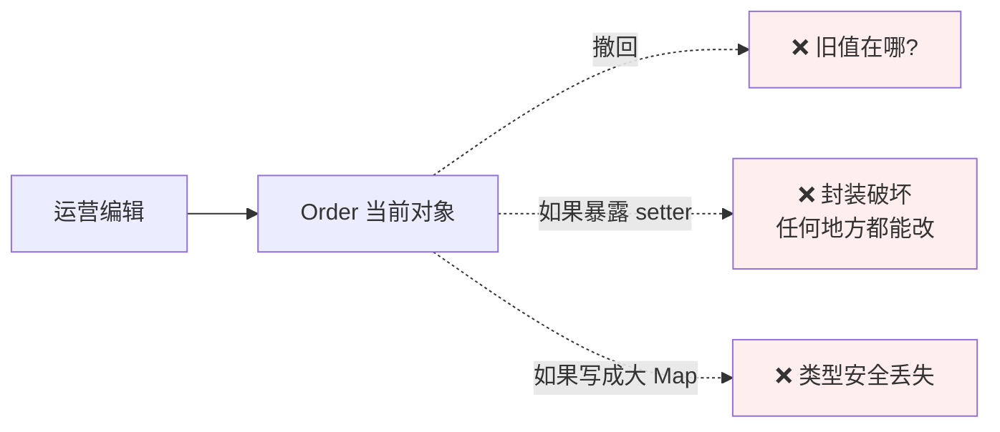
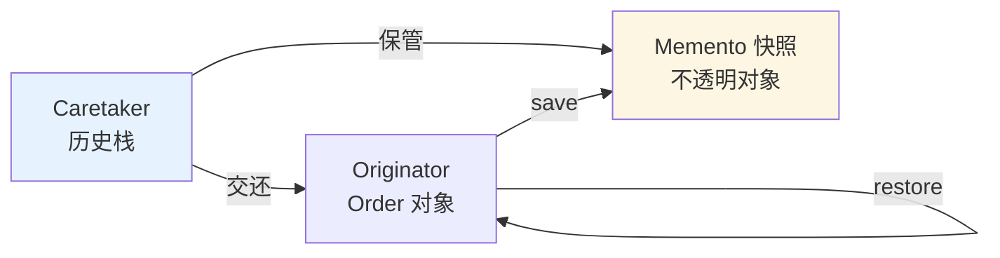
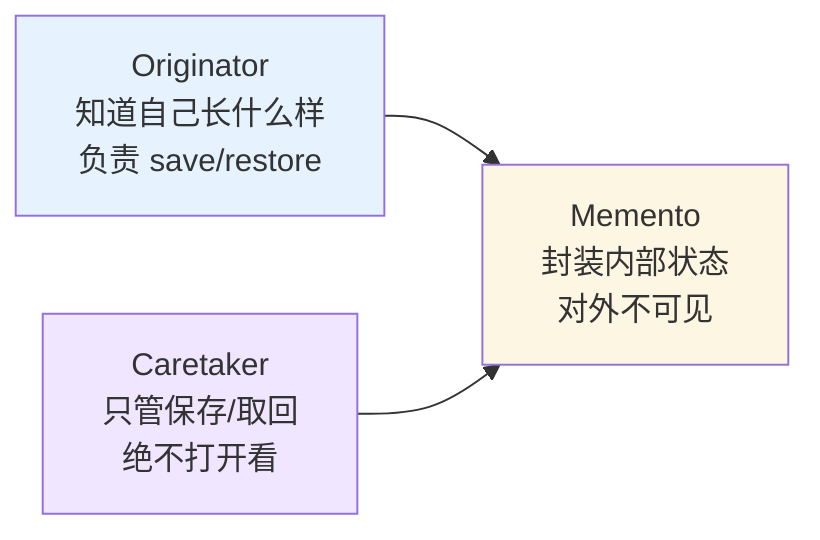
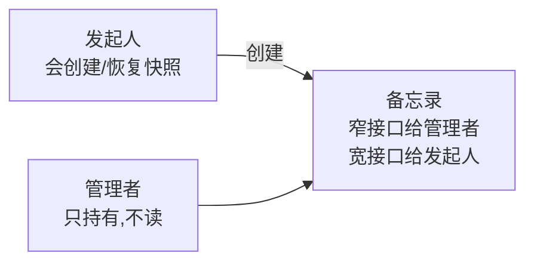
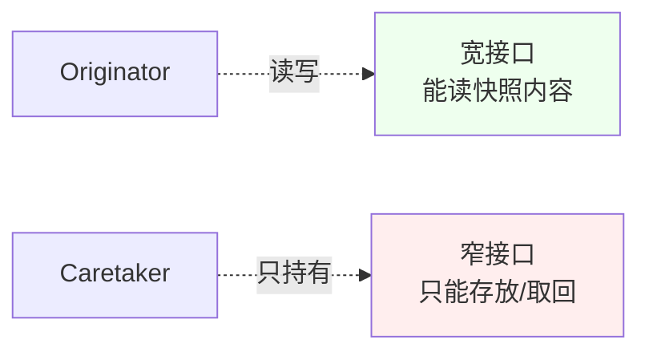
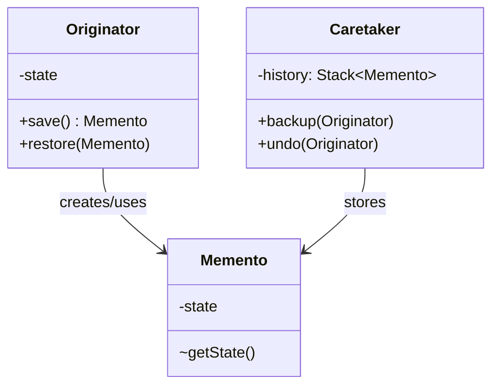
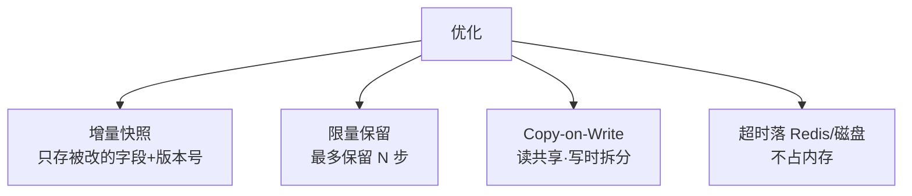
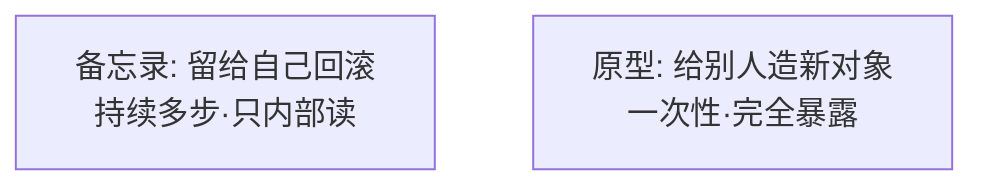

# 20.备忘录模式设计思想

#### 目录介绍

- 01.案例引入与思考
- 02.备忘录模式基础介绍
- 03.备忘录模式原理
- 04.备忘录模式结构
- 05.备忘录模式案例
- 06.备忘录模式分析
- 07.备忘录模式总结

---

## 01.案例引入与思考

> **本篇主线**：在不破坏对象封装的前提下，拍快照 + 回滚

### 1.1 痛点场景

运营后台的订单编辑页，一次提交会改动：**价格、SKU、收货地址、备注、发货单号**。上一秒运营手抖把订单改成"已发货 + 错地址"提交了，客服立刻来找你——**"能回到上次提交之前的样子吗？"**

第一版想法：保存一下"旧值"：

```java
class Order {
    BigDecimal price;
    String     sku;
    String     address;
    String     remark;
    String     trackingNo;

    public void update(OrderEditReq req) {
        // 改之前保存 old
        BigDecimal oldPrice = this.price;
        String     oldSku   = this.sku;
        String     oldAddr  = this.address;
        String     oldRmk   = this.remark;
        String     oldTn    = this.trackingNo;
        // 改
        this.price = req.price; this.sku = req.sku; ...
        // 万一想撤回...怎么传回去？暴露 setter?
    }
}
```



### 1.2 它哪里不舒服

- ❌ **手工备份不可靠**：5 个字段你记得存，加到 8 个字段就会漏；
- ❌ **暴露 setter 破坏封装**：为了恢复而把私有字段都暴露出来，谁都能改；
- ❌ **撤销栈无处安放**：产品说要支持\"撤回 N 次\" → 要维护一个栈，但存什么？存整对象又重、又要 clone；
- ❌ **快照和对象强耦合**：如果让 `OrderEditor` 外部类持有 Order 的所有内部字段 → 外部类知道了内部结构；
- ❌ **敏感字段泄露**：有些字段（如加密密钥、签名）连快照都不该拿出去。

### 1.3 引出本篇主角

> **备忘录模式（Memento）的核心思想**：对象自己负责\"拍快照\"和\"从快照恢复\"——快照本身是一个**只有对象自己看得懂**的不透明对象。外部只负责保管快照（不看内容），需要时交还给对象让它自己 restore。

```java
class Order {
    // 关键字段（private 保持封装）
    private BigDecimal price;
    private String address;
    // ...

    // 对外：拍快照（内部对象，外部看不懂）
    public Memento save() {
        return new Memento(price, address, /*...*/);
    }
    // 对外：从快照恢复
    public void restore(Memento m) {
        this.price = m.price;
        this.address = m.address;
    }

    // 内部类——外部访问不到它的字段
    public static class Memento {
        private final BigDecimal price;
        private final String address;
        Memento(BigDecimal p, String a){ this.price=p; this.address=a; }
    }
}

// 看守者（Caretaker）：只管存快照，不关心里面有啥
Stack<Order.Memento> history = new Stack<>();
history.push(order.save());   // 改之前拍一份
order.update(req);            // 改
history.push(order.save());   // 再拍一份

// 撤回
order.restore(history.pop());
```



备忘录三方角色严格分工：



IDE 的 `Ctrl+Z`、Word 的撤销历史、数据库事务 `SAVEPOINT`、Git 的 `stash`、Vue/React 的 TimeTravel 调试——都是备忘录的实战。

---

## 02.备忘录模式基础介绍

### 2.1 模式动机

恢复对象状态的需求场景多种多样：

- 编辑器 Ctrl+Z；
- 数据库事务回滚；
- 订单/工单的"撤销最后一次操作"；
- 游戏存档读档；
- 调试时回到出错前的状态。

简单的"另存一份字段"暴力可行，但有两个问题：

1. **暴露了对象内部字段**——破坏封装；
2. **快照管理混乱**——存在哪、谁能存、谁能读？

备忘录模式给出了规范化解法。

### 2.2 模式定义

> 在不违背封装原则的前提下，捕获一个对象的内部状态，并在该对象之外保存这个状态，以便之后将该对象恢复到原先保存的状态。

### 2.3 三个角色



**关键纪律**：管理者（Caretaker）**只能存放和返回**备忘录，**不能读它的内容**——这就是"不破坏封装"。

---

## 03.备忘录模式原理

### 3.1 朴素方案的问题

```java
// 反例 1：getter 暴露所有字段
backupName = order.getReceiverName();
backupAddr = order.getAddress();
backupAmt  = order.getAmount();
// ……变更后回滚时，对象内部一旦加新字段，所有备份点都要改
```

```java
// 反例 2：直接复制对象
Order backup = order.clone();
// 看似干净，但若 Order 引用了不可序列化对象（线程池、连接），克隆出错
// 而且把整个对象暴露了
```

### 3.2 备忘录的核心约束



通过"宽窄接口"分离，让管理者拿不到敏感数据。

---

## 04.备忘录模式结构

### 4.1 结构图



### 4.2 角色

- **Originator**：被快照的对象（订单）；
- **Memento**：快照本身，对外只露窄接口；
- **Caretaker**：管理快照集合（一般是栈）。

---

## 05.备忘录模式案例

### 5.1 订单变更撤销

```java
public class Order {
    private String receiver;
    private String address;
    private double amount;
    private OrderStatus status;

    /** 发起人创建快照（宽接口） */
    public Memento save() {
        return new Memento(receiver, address, amount, status);
    }
    /** 发起人恢复（宽接口） */
    public void restore(Memento m) {
        this.receiver = m.receiver;
        this.address  = m.address;
        this.amount   = m.amount;
        this.status   = m.status;
    }

    /** 备忘录定义为内部静态类，仅 Order 可读字段 */
    public static class Memento {
        private final String receiver, address;
        private final double amount;
        private final OrderStatus status;
        private Memento(String r, String a, double am, OrderStatus s) {
            receiver = r; address = a; amount = am; status = s;
        }
    }
}

public class History {           // Caretaker
    private final Deque<Order.Memento> stack = new ArrayDeque<>();
    public void backup(Order o)  { stack.push(o.save()); }
    public void undo(Order o)    {
        if (!stack.isEmpty()) o.restore(stack.pop());
    }
}

// 使用
History h = new History();
h.backup(order);
order.setReceiver("张三");
order.setAddress("北京");
h.backup(order);
order.setStatus(SHIPPED);   // 误操作
h.undo(order);              // 回到"张三/北京/未发货"
```

`History` 拿到的是 `Order.Memento` 对象，但**没有任何方法读它的字段**——封装完整。

### 5.2 联动命令模式

```java
public class UpdateAddressCmd implements Cmd {
    private final Order order;
    private final String newAddr;
    private Order.Memento snapshot;

    public void execute() {
        snapshot = order.save();   // 执行前拍快照
        order.setAddress(newAddr);
    }
    public void undo() {
        order.restore(snapshot);   // 撤销 = 回快照
    }
}
```

> **观察**：18 篇命令模式的 `undo()` 在那里只能"反向操作"；接入备忘录后，**任何变更都能精确回滚**——这才是工业级 undo 的实现方式。

### 5.3 大对象优化策略

订单含 100 个字段，每次操作都拍全量快照不划算。常见优化：



### 5.4 真实世界的备忘录

| 场景 | 形式 |
|------|------|
| 数据库事务 undo log | 记录每次修改的旧值 |
| Git stash | 把工作区快照入栈 |
| Redis BGSAVE | RDB 快照 |
| IDE 撤销 | 编辑动作 + 行级快照 |
| 浏览器后退 | 页面状态栈 |

---

## 06.备忘录模式分析

### 6.1 优点

- **不破坏封装**：通过宽窄接口隔离；
- **职责清晰**：发起人管创建/恢复，管理者只管存；
- **天然支持多步撤销**：栈结构。

### 6.2 缺点

- 大对象快照**内存/性能成本高**；
- 实现要小心——若快照里持有可变引用（如 List），等于没拍；
- 多线程下要锁，否则快照与恢复中间被改。

### 6.3 备忘录 vs 原型



| 维度 | 备忘录 | 原型 |
|------|--------|------|
| 目的 | 恢复同一对象 | 创建新对象 |
| 暴露 | 不破坏封装 | 完全 clone |
| 历史 | 多步栈 | 一次性 |

### 6.4 模式联动

- **与命令模式**：命令拍快照 → 真正可撤销；
- **与状态模式**：状态切换前后存档 → 状态机也能回退；
- **与原型模式**：备忘录的"快照"在底层常用 clone 实现。

---

## 07.备忘录模式总结

### 7.1 一句话记忆

> 备忘录 = **不开盒地存档读档**。

### 7.2 适用环境

事务回滚、撤销重做、定时存档、调试快照、运营误操作恢复。

### 7.3 思考题

我们让**单个订单**支持撤销了。如果**整个购物车**（多个商品 + 优惠 + 地址）都要"一键回到 5 分钟前"，每件商品都拍快照？还是把整个购物车作为发起人？两种方案各有什么取舍？

下一站建议阅读 [21.中介者模式](21.中介者模式设计思想.md)——电商前后台对象越来越多，它们的**交互**也开始失控了。
