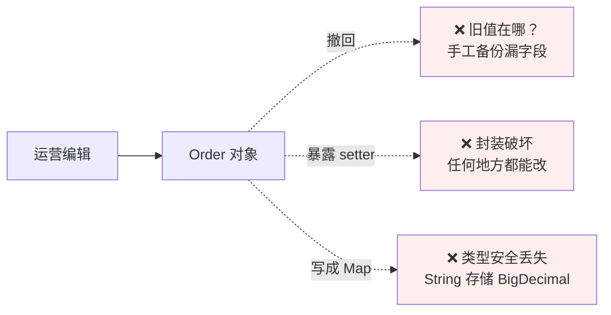
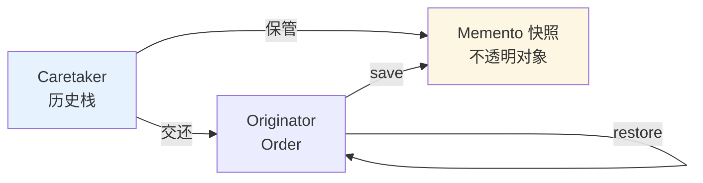
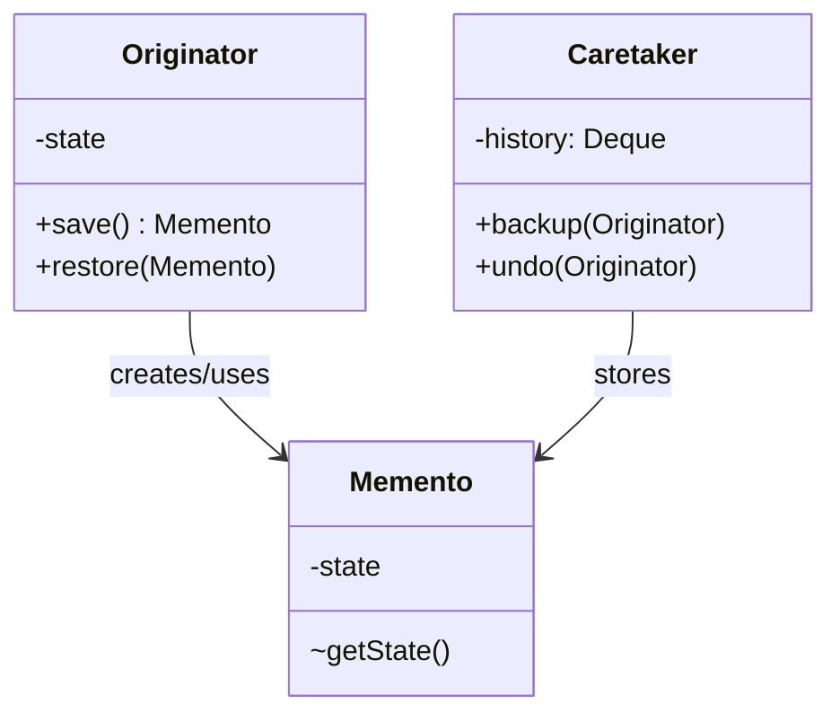
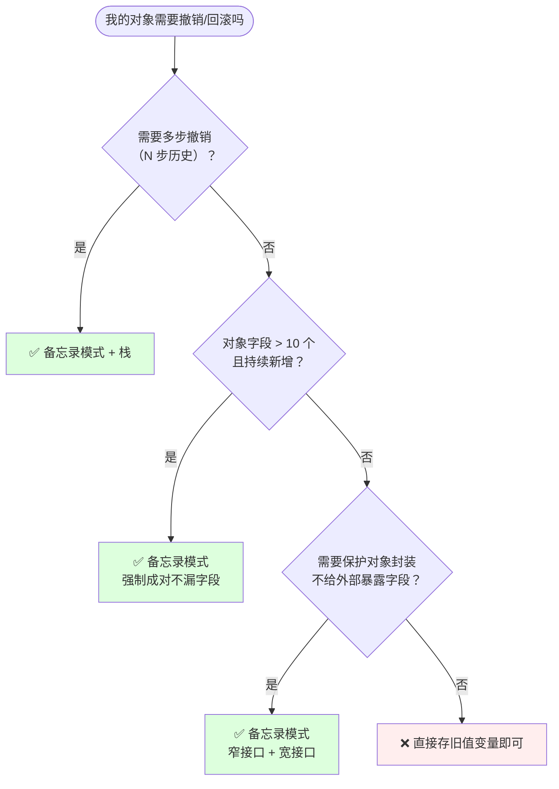
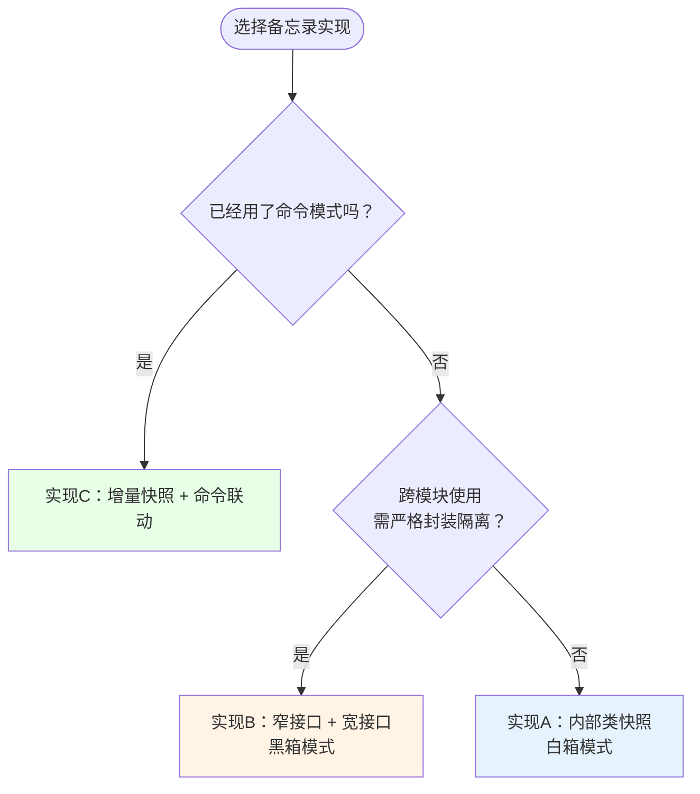
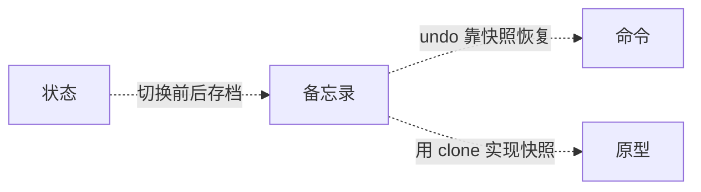

# 20.备忘录模式设计思想

> 📚 本篇按照「事故复盘 → 失败探索 → 模式登场 → 实现对比 → 效果对比 → 反面踩坑 → 选型决策」的节奏展开，建议按顺序阅读。

#### 目录介绍

- [01.案例引入：运营误操作订单回滚](#01案例引入运营误操作订单回滚)
  - [1.1 痛点现场](#11-痛点现场)
  - [1.2 直觉实现复现](#12-直觉实现复现)
  - [1.3 问题根源拆解](#13-问题根源拆解)
  - [1.4 引出本篇主角](#14-引出本篇主角)
- [02.三次失败探索](#02三次失败探索)
  - [2.1 尝试方案A：手工备份每个字段](#21-尝试方案a手工备份每个字段)
  - [2.2 尝试方案B：直接 clone 整个对象](#22-尝试方案b直接-clone-整个对象)
  - [2.3 尝试方案C：外部类持有备份](#23-尝试方案c外部类持有备份)
  - [2.4 终于引出备忘录模式](#24-终于引出备忘录模式)
- [03.备忘录模式基础介绍](#03备忘录模式基础介绍)
  - [3.1 从失败中提炼需求](#31-从失败中提炼需求)
  - [3.2 备忘录模式的标准骨架](#32-备忘录模式的标准骨架)
  - [3.3 典型使用场景](#33-典型使用场景)
- [04.三种实现对比](#04三种实现对比)
  - [4.1 实现核心要点](#41-实现核心要点)
  - [4.2 实现A：内部类快照（白箱）](#42-实现a内部类快照白箱)
  - [4.3 实现B：窄接口 + 宽接口（黑箱）](#43-实现b窄接口--宽接口黑箱)
  - [4.4 实现C：增量快照 + 命令联动](#44-实现c增量快照--命令联动)
  - [4.5 三种实现速查表](#45-三种实现速查表)
- [05.用前用后效果对比](#05用前用后效果对比)
  - [5.1 代码维度对比](#51-代码维度对比)
  - [5.2 能力维度对比](#52-能力维度对比)
  - [5.3 核心收益](#53-核心收益)
- [06.反面踩坑实录](#06反面踩坑实录)
  - [6.1 踩坑A：快照持有可变引用](#61-踩坑a快照持有可变引用)
  - [6.2 踩坑B：大对象全量快照内存爆炸](#62-踩坑b大对象全量快照内存爆炸)
  - [6.3 踩坑C：多线程快照与恢复穿插](#63-踩坑c多线程快照与恢复穿插)
  - [6.4 踩坑D：敏感字段泄露到快照](#64-踩坑d敏感字段泄露到快照)
  - [6.5 替代方案汇总](#65-替代方案汇总)
- [07.决策树与选型](#07决策树与选型)
  - [7.1 该不该用备忘录模式](#71-该不该用备忘录模式)
  - [7.2 选哪种实现方式](#72-选哪种实现方式)
  - [7.3 选型清单速查](#73-选型清单速查)
- [08.总结与延伸](#08总结与延伸)
  - [8.1 设计思想沉淀](#81-设计思想沉淀)
  - [8.2 模式联动边界](#82-模式联动边界)
  - [8.3 思考题与延伸](#83-思考题与延伸)

---

## 01.案例引入：运营误操作订单回滚

> **本篇主线**：在不破坏对象封装的前提下，拍快照 + 回滚

### 1.1 痛点现场

运营后台的订单编辑页，一次提交会改动：价格、SKU、收货地址、备注、发货单号。某日下午，运营手抖把一个已发货订单的地址和物流单号批量覆盖成了错误值——涉及 2300 单。客服瞬间被用户投诉淹没："我的快递发到别人家了！"

第一反应是改回来——但订单有 20+ 个字段，没人记得被覆盖前的值是什么。DBA 翻 binlog 恢复了 3 小时，期间 2300 个用户持续投诉。

定位到代码——编辑接口直接 `setXxx`，无任何快照：

```java
public void update(OrderEditReq req) {
    this.price = req.price;
    this.address = req.address;
    this.remark = req.remark;
    this.trackingNo = req.trackingNo;
    // 20+ 个字段直接覆盖，无历史记录
}
```

### 1.2 直觉实现复现

第一版补救想法——改之前保存"旧值"：

```java
class Order {
    BigDecimal price;
    String address, remark, trackingNo;
    // ……20+ 个字段

    public void update(OrderEditReq req) {
        BigDecimal oldPrice = this.price;
        String oldAddr  = this.address;
        String oldRmk   = this.remark;
        String oldTn    = this.trackingNo;
        // ……手动备份所有字段
        this.price = req.price; this.address = req.address; // ……
        // 想撤回？怎么传回去？暴露 20+ 个 setter？
    }
}
```

**💭 反思**：为什么一个"改错回滚"的功能需要 DBA 翻 3 小时 binlog？核心问题不是"没保存旧值"——而是 **快照的管理方式和对象的封装被破坏**。字段少时手工备份可行，20+ 个字段就会漏；暴露 getter/setter 回滚等于破坏封装。

### 1.3 问题根源拆解



| 隐患 | 现象 | 业务影响 |
|------|------|---------|
| **手工备份不可靠** | 5 个字段记得存，加到 20 个字段就会漏 | 回滚后状态不一致 |
| **暴露 setter 破坏封装** | 为了恢复把私有字段暴露，谁都能改 | 数据安全防线被打破 |
| **撤销栈无处安放** | 产品要"撤回 N 次"，存什么、怎么存、谁管 | 无法支持多步撤销 |
| **敏感字段泄露** | 加密密钥、签名等字段被快照带出对象 | 安全风险 |

**核心矛盾**：业务上"需要保存历史状态并恢复"，但代码层面**快照管理和对象封装是冲突的**——外部持有快照就能读内部字段。

### 1.4 引出本篇主角

> **备忘录模式的核心思想**：对象自己负责"拍快照"和"从快照恢复"——快照本身是一个只有对象自己看得懂的不透明对象。外部只负责保管快照，需要时交还给对象让它自己 restore。

```java
class Order {
    private String address;
    private double amount;
    // ……

    public Memento save() { return new Memento(address, amount, /*...*/); }
    public void restore(Memento m) { this.address = m.address; this.amount = m.amount; }

    public static class Memento {
        private final String address;      // 外部看不到
        private final double amount;
        private Memento(String a, double am) { address = a; amount = am; }
    }
}

// 看守者：只管存快照，不关心里面有什么
Deque<Order.Memento> history = new ArrayDeque<>();
history.push(order.save());   // 改之前拍
order.update(req);             // 改
history.push(order.save());   // 再拍
order.restore(history.pop());  // 撤回
```



**先别急着看实现**——下一节我们看看新人通常会先尝试哪些方案。

---

## 02.三次失败探索

> 备忘录模式不是凭空发明的——它是前人走过 3 条死路之后才提炼出来的。

### 2.1 尝试方案 A：手工备份每个字段

```java
// 方案A：改之前逐一保存旧值
public void update(OrderEditReq req) {
    BigDecimal oldPrice = this.price;
    String oldAddr  = this.address;
    // ……20+ 个字段逐一备份
    this.price = req.price; this.address = req.address; // ……
}
```

**🧪 验证**：

```java
// 场景：新增加一个字段 "discountAmount"
// 开发在 update() 方法里新增了 this.discountAmount = req.discountAmount;
// 但忘了加备份代码 oldDiscount = this.discountAmount;
// → 回滚时 discountAmount 没恢复，状态不一致
```

**❌ 失败原因**：手工备份不强制。字段从 5 个涨到 20 个——必漏。编译期没有任何提示说"你还差一个字段没备份"。

**💡 反思**：备份和恢复必须成对、强制——不能靠开发者记忆。

### 2.2 尝试方案 B：直接 clone 整个对象

```java
// 方案B：clone 整个 Order 作为备份
public class Order implements Cloneable {
    public Order clone() {
        Order copy = (Order) super.clone();
        copy.items = new ArrayList<>(this.items);  // 深拷贝可变引用
        return copy;
    }
}

Order backup = order.clone();  // 改之前整个复制
order.update(req);
order = backup;                // 撤回 = 整个替换
```

**🧪 验证**：

```java
// 问题1：Order 引用了不可序列化对象（线程池、连接、事件总线）
// → clone 时抛异常或复制了不该复制的引用
// 问题2：整个对象被暴露给了外部——caretaker 能读到所有字段
// 问题3：大对象每次全量 clone 性能开销大
```

**❌ 失败原因**：① clone 不可靠（浅拷贝陷阱、不可序列化引用）；② 整个对象暴露给外部——破坏封装；③ 大对象全量复制内存/CPU 开销高。

**💡 反思**：快照应该只包含需要恢复的状态字段，不是整个对象的副本。

### 2.3 尝试方案 C：外部类持有备份 Map

```java
// 方案C：外部 History 类持有备份 Map
class OrderHistory {
    private Map<Long, Map<String, Object>> backups = new HashMap<>();
    
    public void backup(Order o) {
        Map<String, Object> fields = new HashMap<>();
        fields.put("price", o.getPrice());   // 暴露 getter
        fields.put("address", o.getAddress());
        backups.put(o.getId(), fields);
    }
    public void restore(Order o) {
        Map<String, Object> fields = backups.get(o.getId());
        o.setPrice((BigDecimal) fields.get("price"));  // 类型强转
        o.setAddress((String) fields.get("address"));
    }
}
```

**🧪 验证**：

```java
// 问题1：类型安全丢失——Map<String, Object> 存储所有类型
//   → fields.get("price") 返回 Object，强制转 BigDecimal，编译期不保
// 问题2：外部类知道 Order 的内部结构——新增字段要同步改 OrderHistory
// 问题3：Order 必须暴露所有字段的 getter——封装彻底破坏
```

**❌ 失败原因**：① 类型安全丢失（`Map<String, Object>`）；② 外部类了解 Order 内部结构——强耦合；③ Order 的封装被 getter 破坏。

**💡 反思**：必须让 **Order 自己负责快照的创建和恢复**——外部只管保管，不关心内容。

### 2.4 终于引出备忘录模式

三次失败之后，需求清单收敛了：

| 必须满足 | 来自哪一次失败 |
|---------|-------------|
| ① 备份恢复强制成对，不漏字段 | 2.1 手工备份 |
| ② 不暴露对象内部状态给外部 | 2.2 clone 暴露 / 2.3 getter 暴露 |
| ③ 类型安全，编译期校验 | 2.3 Map<String, Object> |
| ④ 支持多步撤销栈 | 1.2 真实事故 |

**备忘录模式的标准答案**：

```java
// ① Order 自己负责 save/restore——字段备份强制成对
class Order {
    private String address; private double amount; // ② private 字段不暴露
    // ③ 内部类 Memento——字段类型安全
    public Memento save() { return new Memento(address, amount); }
    public void restore(Memento m) { this.address = m.address; this.amount = m.amount; }
    
    public static class Memento {
        private final String address;          // ② 外部拿不到
        private final double amount;            // ③ 编译期类型安全
        private Memento(String a, double am) { address = a; amount = am; }
    }
}

// ④ Caretaker 只管栈——支持多步撤销
Deque<Order.Memento> history = new ArrayDeque<>();
history.push(order.save());
order.restore(history.pop());
```

短短几行，**快照创建和恢复都在 Order 内部完成，外部只管存——不漏字段、不破坏封装、类型安全。**

---

## 03.备忘录模式基础介绍

### 3.1 从失败中提炼的需求

回顾 02 节的三次失败和 01 节的事故，备忘录模式的设计约束：

| 约束 | 来自 | 代码体现 |
|:---|:---|:---|
| ① 备份恢复强制成对 | 2.1 手工备份漏字段 | `save()` / `restore()` 都在 Originator 内 |
| ② 不暴露内部状态 | 2.2 clone / 2.3 Map | Memento 内部类 + private 字段 + 包级构造器 |
| ③ 类型安全 | 2.3 Map<String,Object> | Memento 字段用具体类型（`String`/`BigDecimal`） |
| ④ 支持多步撤销 | 01 事故 | Caretaker 用 `Deque<Memento>` 栈 |

**备忘录模式**：在不违背封装原则的前提下，捕获一个对象的内部状态，并在该对象之外保存这个状态，以便之后将该对象恢复到原先保存的状态。

### 3.2 备忘录模式的标准骨架

```java
// Originator：被快照的对象
class Originator {
    private String state;                                    // ① 内部状态

    public Memento save() {                                  // ① 创建快照
        return new Memento(state);
    }
    public void restore(Memento m) {                         // ① 从快照恢复
        this.state = m.getState();
    }

    // Memento：快照本身（内部静态类）
    public static class Memento {
        private final String state;
        private Memento(String s) { state = s; }             // ② 包级私有
        private String getState() { return state; }           // ② 仅 Originator 可读
    }
}

// Caretaker：管理者——只存快照，不读内容          // ③ 窄接口
class Caretaker {
    private final Deque<Originator.Memento> history = new ArrayDeque<>();
    public void backup(Originator o) { history.push(o.save()); }
    public void undo(Originator o)  { if (!history.isEmpty()) o.restore(history.pop()); }
}
```



三句话记住：**Originator 创快照+恢复 → Memento 不透明 → Caretaker 只管存取。** 差异全在快照策略——全量 vs 增量 vs 联动命令——这就是下一节三种实现的分岔。

### 3.3 典型使用场景

| 场景 | 快照对象 | 解决了什么 |
|------|---------|----------|
| **编辑器 Ctrl+Z** | 编辑命令 + 行级快照 | 支持多步撤销重做 |
| **数据库事务 undo log** | 每次修改的旧值 | 事务回滚的数据基础 |
| **Git stash** | 工作区快照入栈 | 暂存未提交改动 |
| **游戏存档** | 角色状态快照 | 读档回到存档点 |
| **订单编辑回滚** | Order.Memento | 运营误操作一键恢复 |
| **浏览器后退** | 页面状态栈 | 返回上一页保持状态 |
| **Redis RDB** | BGSAVE 快照 | 持久化 + 灾难恢复 |

---

## 04.三种实现对比

### 4.1 实现核心要点

三种写法本质上是在 **封装强度 / 内存开销 / 恢复粒度** 上的不同取舍。实现备忘录只需两行骨架：

```java
Originator.Memento m = obj.save();   // ① 拍快照
obj.restore(m);                       // ② 恢复
```

差异全在"Memento 里存什么、Caretaker 怎么管、恢复粒度多细"。下面按演进顺序逐一展开。

### 4.2 实现 A：内部类快照——白箱模式

**设计权衡**：用"Originator 可以读 Memento 内部"换"实现最简单"

```java
// 实现A：Memento 字段全部 private，但通过 getState() 让 Originator 读
public class Order {
    private String address;
    private double amount;
    private List<String> tags;

    public Memento save() {
        return new Memento(address, amount, new ArrayList<>(tags));  // 深拷贝可变字段
    }
    public void restore(Memento m) {
        this.address = m.address;     // Originator 直接读 Memento 字段
        this.amount  = m.amount;
        this.tags    = new ArrayList<>(m.tags);
    }

    public static class Memento {
        private final String address;
        private final double amount;
        private final List<String> tags;
        private Memento(String a, double am, List<String> t) {
            address = a; amount = am; tags = t;
        }
    }
}

// Caretaker
Deque<Order.Memento> history = new ArrayDeque<>();
history.push(order.save());
order.setAddress("新地址");
history.push(order.save());
order.restore(history.pop());  // 回到"新地址"
order.restore(history.pop());  // 回到最初
```

**优点**：实现极简，Originator 和 Memento 在同一文件内。**缺点**：白箱——Memento 字段对 Originator 可见但对外不可见；可变引用必须深拷贝。**适用**：对象字段少（<15 个）、同一 package 内使用。

### 4.3 实现 B：窄接口 + 宽接口——黑箱模式

**设计权衡**：用"接口隔离 + 类型转换"换"Caretaker 完全无法读快照内容"

```java
// 实现B：对外暴露窄接口 Memento（无任何方法），对内宽接口 MementoImpl
public interface Memento {}                            // 窄接口：空接口，外部只能持有

public class Order {
    private String address;
    private double amount;

    public Memento save() { return new MementoImpl(address, amount); }
    public void restore(Memento m) {
        MementoImpl impl = (MementoImpl) m;           // 内部转换拿到宽接口
        this.address = impl.address;
        this.amount = impl.amount;
    }

    private static class MementoImpl implements Memento {  // 宽接口：只有 Order 知道
        final String address;
        final double amount;
        MementoImpl(String a, double am) { address = a; amount = am; }
    }
}

// Caretaker 持有的只是 Memento 接口——无法读任何内容
Deque<Memento> history = new ArrayDeque<>();
history.push(order.save());    // 拿到的是 Memento 接口——只有 Object 的方法
```

**优点**：Caretaker 完全无法读快照内容——封装最强。**缺点**：`restore` 时需要类型转换；Memento 接口需要额外定义。**适用**：跨模块使用、需要严格封装隔离的场景。

### 4.4 实现 C：增量快照 + 命令联动

**设计权衡**：用"只存变更 + 依赖命令"换"内存极省 + 真正可撤销"

```java
// 实现C：命令模式 + 备忘录——执行前自动拍快照
interface Cmd {
    void execute();
    default void undo() { throw new UnsupportedOperationException(); }
}

class UpdateAddressCmd implements Cmd {
    private final Order order;
    private final String newAddr;
    private Order.Memento snapshot;          // 执行前拍的快照

    public void execute() {
        snapshot = order.save();              // ① 执行前拍快照
        order.setAddress(newAddr);
    }
    public void undo() {
        order.restore(snapshot);              // ② 撤销 = 回快照
    }
}

// Caretaker 升级为命令栈
Deque<Cmd> cmdHistory = new ArrayDeque<>();
cmdHistory.push(new UpdateAddressCmd(order, "新地址"));
cmdHistory.peek().execute();
// 想撤销
cmdHistory.pop().undo();      // order 回到执行前状态
```

**优点**：与命令模式天然联动，撤销就是回快照——比反向操作 `undo()` 可靠得多（参考 18 篇命令模式踩坑 A）。**缺点**：需要命令模式配合；粒度是"一次命令"。**适用**：已使用命令模式的系统、需要精确撤销到任意步骤。

### 4.5 三种实现速查表

| 实现方式 | 封装强度 | 内存开销 | 实现复杂度 | 适用场景 | 推荐度 |
|---------|--------|--------|----------|---------|------|
| 实现A：内部类白箱 | ⭐⭐⭐ | ⭐⭐⭐ | ⭐ | 单模块/小对象 | ⭐⭐⭐⭐ |
| 实现B：窄接口黑箱 | ⭐⭐⭐⭐⭐ | ⭐⭐⭐ | ⭐⭐ | 跨模块/强封装 | ⭐⭐⭐⭐ |
| 实现C：增量命令联动 | ⭐⭐⭐ | ⭐⭐⭐⭐⭐ | ⭐⭐⭐ | 已用命令模式 | ⭐⭐⭐⭐⭐ |

**📌 一句话决策**：小对象快照→**实现A**，跨模块封装→**实现B**，命令模式联动→**实现C**。

---

## 05.用前用后效果对比

> 用 1.1 节订单编辑回滚场景做基准。

### 5.1 代码维度对比

```java
// ❌ 用前：手工备份 + 暴露 setter
BigDecimal oldPrice = order.getPrice();  // 暴露 getter
String oldAddr = order.getAddress();
order.update(req);
// 想撤回？order.setPrice(oldPrice); order.setAddress(oldAddr); // 暴露 setter

// ✅ 用后：备忘录模式
history.backup(order);
order.update(req);
history.undo(order);  // 一行撤回，不暴露任何字段
```

### 5.2 能力维度对比

| 维度 | ❌ 手工备份 + 暴露 setter | ✅ 备忘录模式 |
|------|------------------------|------------|
| 封装性 | getter/setter 全部暴露 | Memento 私有不透明 |
| 备份完整性 | 依赖开发者记忆，必漏字段 | save/restore 强制成对 |
| 类型安全 | 手动强转或全用 Object | 编译期校验 |
| 多步撤销 | 需要自己维护栈+字段映射 | Caretaker 栈天然支持 |
| 新增字段成本 | 改备份+恢复两处，易漏 | 只改 save/restore 成对方法 |
| 敏感字段保护 | 全部暴露无保护 | Memento 可选择不存 |
| DBA 介入 | 2300 单翻 binlog 3 小时 | **1 秒撤回** |

### 5.3 核心收益

> **备忘录模式的本质**：把"状态保存和恢复"的逻辑内聚在对象自身，快照作为不透明对象交给外部保管。这正是为什么数据库 undo log 只记录旧值镜像、为什么 Git stash 只存差异、为什么 IDE 撤销栈只存编辑命令——**任何"需要回到过去某个状态"的场景，让对象自己拍快照+自己恢复，才能让"封装不破 / 备份不漏 / 类型安全 / 多步撤销"同时成立。**

---

## 06.反面踩坑实录

> 备忘录模式不是银弹——以下 4 个坑几乎每个团队都踩过。

### 6.1 踩坑 A：快照持有可变引用——等于没拍

```java
public class Order {
    private List<OrderItem> items;
    
    public Memento save() {
        return new Memento(items);  // ❌ 直接引用！快照和外部分享同一个 List
    }
    // 外部修改了 items → 快照里的 items 也跟着变了 → 恢复无效
}
```

**💣 事故**：某订单系统快照里的 items 和外部分享引用，运营编辑商品时快照悄悄被改，回滚后发现商品还是改后的。

**✅ 正解**：快照里做深拷贝——`new ArrayList<>(items)` 或序列化反序列化；不可变集合 `List.copyOf()`。

### 6.2 踩坑 B：大对象全量快照内存爆炸

```java
// 订单 50 个字段，用户频繁编辑，每 3 秒拍一张快照
history.push(order.save());  // 每张快照 ~2KB
// 100 个用户 × 20 步历史 × 2KB = 4MB → 还好
// 10000 个用户 × 50 步历史 × 5KB = 2.5GB → 内存告警
```

**💣 事故**：某 CMS 系统富文本编辑器每 5 秒拍全量快照，1000 并发编辑下内存 32GB 打满，频繁 Full GC。

**✅ 正解**：增量快照（只存变更字段+版本号）+ 快照上限（最多保留 N 步）+ 超时持久化（落 Redis/磁盘）。

### 6.3 踩坑 C：多线程下快照与恢复穿插

```java
// 线程A：拍快照
Memento m = order.save();
// 线程B：改了 address
order.setAddress("上海");
// 线程A：恢复 → address 被覆盖为快照里的值 → 线程B 的改动丢了
order.restore(m);
```

**💣 事故**：某电商后台订单同时被两个客服编辑，一人点了"撤回"把另一人的修改覆盖了。

**✅ 正解**：快照+恢复加锁或乐观锁（版本号）；UI 层提示"订单已被他人修改，刷新后重试"。

### 6.4 踩坑 D：敏感字段泄露到快照

```java
public class Order {
    private String signKey;     // 加密签名密钥
    private String cardToken;   // 支付 token
    
    public Memento save() {
        return new Memento(signKey, cardToken, address, amount);  // ❌ 敏感字段入快照
    }
}
```

**💣 事故**：某支付系统快照被序列化到日志，支付 token 泄露，被爬虫抓取后批量盗刷。

**✅ 正解**：`save()` 时跳过敏感字段或脱敏；敏感字段标记 `@transient`；快照对象不序列化到日志。

### 6.5 替代方案汇总

| 你的需求 | 推荐方案 |
|---------|---------|
| 只需撤销一步、对象小 | ✅ 直接存旧值 `oldXxx`，别引入 Memento |
| 需要完整状态重建+审计 | ✅ Event Sourcing（事件溯源） |
| 分布式对象状态回滚 | ✅ Saga 补偿 + 分布式快照 |
| 对象巨大只改几个字段 | ✅ 增量快照 + diff 记录 |
| 前端表单回退 | ✅ 浏览器 History API / Redux time travel |

---

## 07.决策树与选型

### 7.1 该不该用备忘录模式



### 7.2 选哪种实现方式



### 7.3 选型清单速查

| 场景 | 该用吗 | 推荐方式 |
|------|------|---------|
| 订单编辑多步撤销 | ✅ 该用 | 实现A：内部类快照 |
| 编辑器 Ctrl+Z | ✅ 该用 | 实现C：命令联动 |
| 跨服务状态回滚 | ❌ 别用 | Saga 补偿 |
| 只需回滚 1 步/对象小 | ❌ 别用 | 直接存旧值 |
| 支付系统+命令模式 | ✅ 该用 | 实现C：增量命令联动 |
| 游戏存档读档 | ✅ 该用 | 实现A + 持久化 |

---

## 08.总结与延伸

### 8.1 设计思想沉淀

| 阶段 | 学到了什么 |
|------|----------|
| **01 事故** | 痛点是模式诞生的土壤——2300 单误操作翻 3 小时 binlog |
| **02 三次失败** | 手工备份/整个 clone/外部 Map 都不够——快照创建和恢复必须内聚在对象自身 |
| **03 模式基础** | 三角色：Originator 创快照+恢复、Memento 不透明、Caretaker 只管存取 |
| **04 三种实现** | 白箱/黑箱/命令联动本质是"封装强度/内存开销/恢复粒度"的权衡 |
| **05 效果对比** | 封装不破 + 备份不漏 + 类型安全 + 多步撤销 |
| **06 反面踩坑** | 可变引用浅拷贝、大对象内存爆炸、多线程穿插、敏感字段泄露 |
| **07 决策树** | 工程师的成熟度：知道什么时候直接存旧值就够了 |

**🔑 一句话核心**：

> 备忘录 = **不开盒地存档读档**。对象自己拍快照+自己恢复，外部只管保管。

### 8.2 模式联动边界



| 模式 | 关系 | 一句话区别 |
|------|------|----------|
| **命令** | 联动 | 命令 `undo()` 拍快照=-真正可撤销（反之纯反向操作易漏步） |
| **原型** | 底层配合 | 备忘录的快照常用 clone 实现（但备忘录不暴露完整对象） |
| **状态** | 联动 | 状态切换前后存档 → 状态机也能回退 |
| **事件溯源** | 替代 | 备忘录存"当前快照"，事件溯源存"完整事件流"——前者更轻 |

**什么时候不该用备忘录**：
- 只需撤销 1 步且字段少——直接存旧值变量
- 对象巨大且内存敏感——增量快照或 Event Sourcing
- 分布式对象——Saga 补偿 + 分布式事务
- 需要完整审计历史——Event Sourcing 更合适

### 8.3 思考题与延伸

**💭 三道思考题**：

1. 我们让单个订单支持撤销了。如果整个购物车（多个商品+优惠+地址）都要"一键回到 5 分钟前"——每件商品各自拍快照，还是把购物车整体作为 Originator？（提示：粒度 vs 复杂度权衡）

2. 如果快照栈有 100 步历史，每次 `restore` 都会创建一个新的 Memento 对象——怎么用享元模式优化？（提示：不可变 Memento 天然享元化）

3. 备忘录的快照对象被序列化存入 Redis——如何保证反序列化后 Memento 的包级私有字段不被外部访问？（提示：回看 4.3 黑箱模式 + 序列化代理）

**📚 延伸阅读**：
- Git 内部原理：Commit/Tree/Blob 的快照模型
- MySQL InnoDB undo log：数据库事务回滚的备忘录实现
- Redux Time Travel：前端状态快照与回放
- Java Serialization Proxy：序列化中保护封装

> **上一篇** [19.状态模式](https://yccoding.com/pages/a0f4be/) → **本篇** → [21.中介者模式](https://yccoding.com/pages/606076/)：对象之间的交互也开始失控了。
