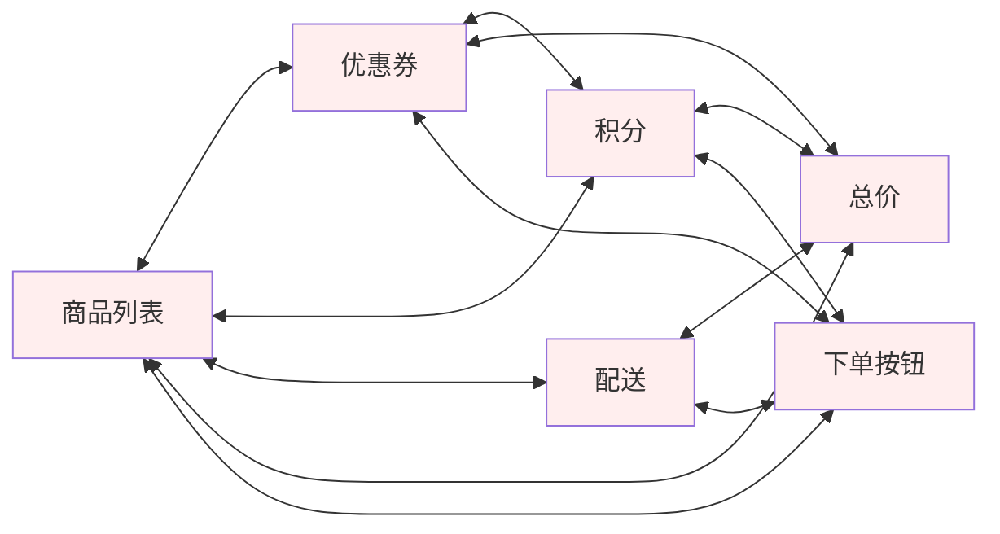
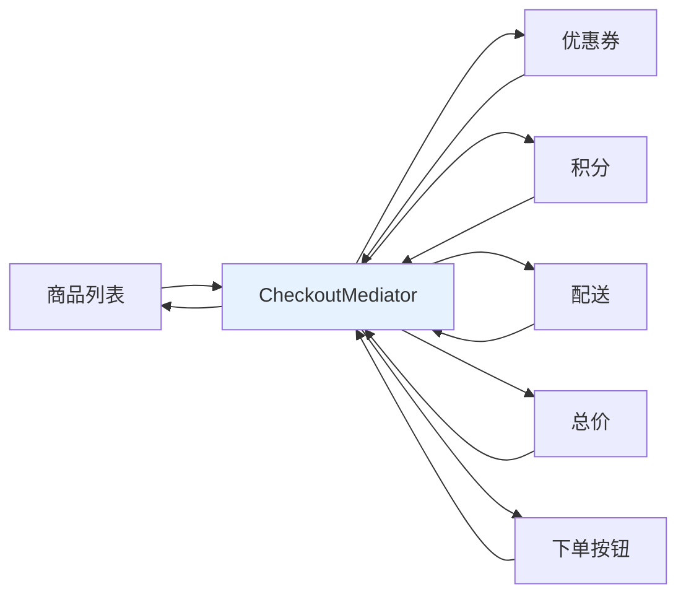
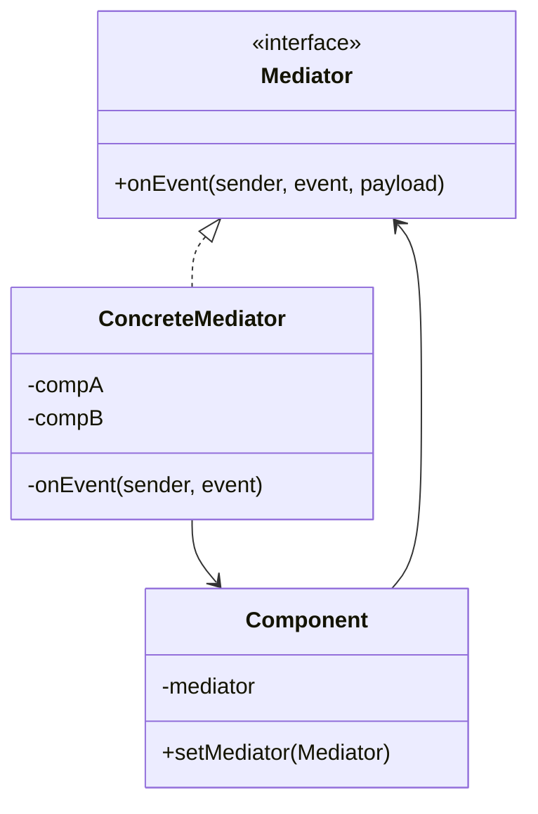
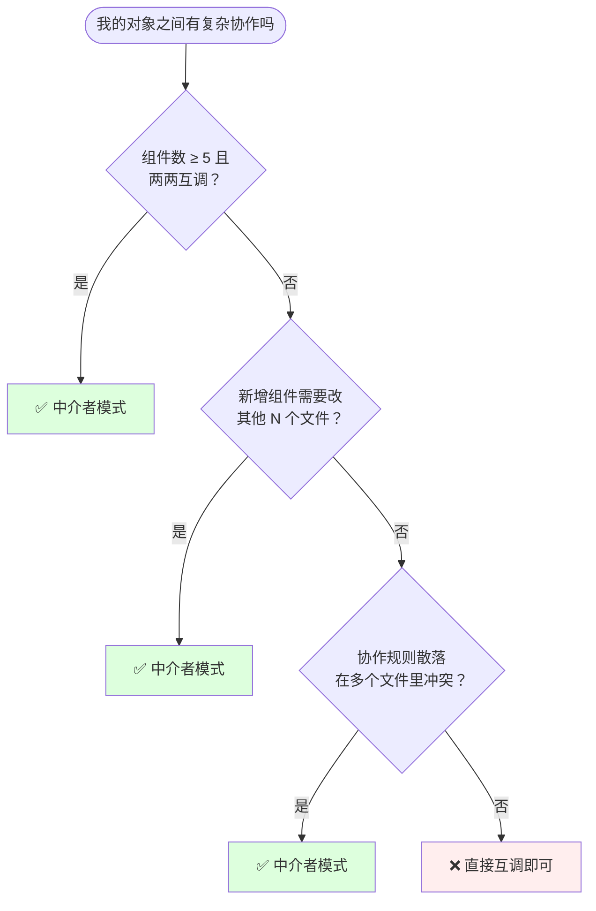
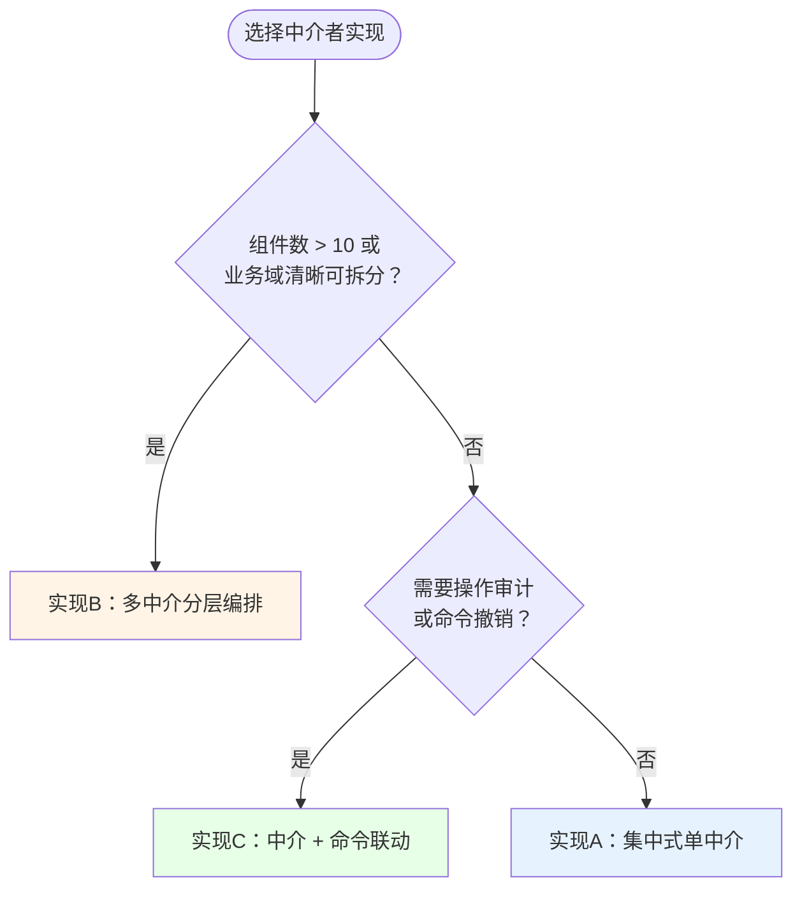
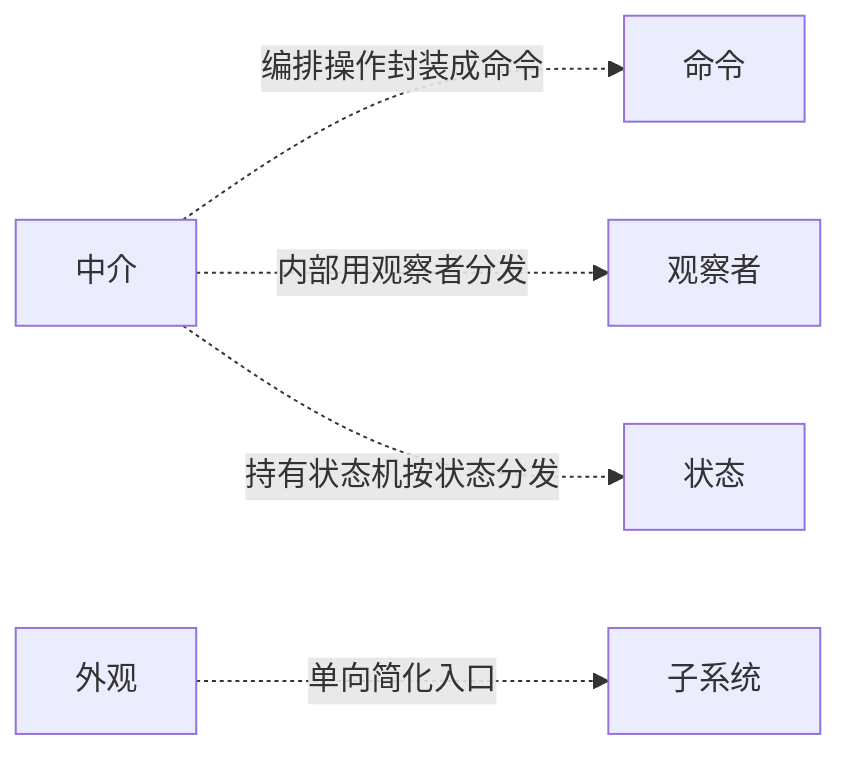

# 21.中介者模式设计思想

> 📚 本篇按照「事故复盘 → 失败探索 → 模式登场 → 实现对比 → 效果对比 → 反面踩坑 → 选型决策」的节奏展开，建议按顺序阅读。

#### 目录介绍

- [01.案例引入：收银页组件网状失控](#01案例引入收银页组件网状失控)
  - [1.1 痛点现场](#11-痛点现场)
  - [1.2 直觉实现复现](#12-直觉实现复现)
  - [1.3 问题根源拆解](#13-问题根源拆解)
  - [1.4 引出本篇主角](#14-引出本篇主角)
- [02.三次失败探索](#02三次失败探索)
  - [2.1 尝试方案A：事件总线广播](#21-尝试方案a事件总线广播)
  - [2.2 尝试方案B：观察者模式一对多](#22-尝试方案b观察者模式一对多)
  - [2.3 尝试方案C：把逻辑下沉到父类](#23-尝试方案c把逻辑下沉到父类)
  - [2.4 终于引出中介者模式](#24-终于引出中介者模式)
- [03.中介者模式基础介绍](#03中介者模式基础介绍)
  - [3.1 从失败中提炼需求](#31-从失败中提炼需求)
  - [3.2 中介者模式的标准骨架](#32-中介者模式的标准骨架)
  - [3.3 典型使用场景](#33-典型使用场景)
- [04.三种实现对比](#04三种实现对比)
  - [4.1 实现核心要点](#41-实现核心要点)
  - [4.2 实现A：集中式单中介](#42-实现a集中式单中介)
  - [4.3 实现B：多中介分层编排](#43-实现b多中介分层编排)
  - [4.4 实现C：中介 + 命令联动](#44-实现c中介--命令联动)
  - [4.5 三种实现速查表](#45-三种实现速查表)
- [05.用前用后效果对比](#05用前用后效果对比)
  - [5.1 代码维度对比](#51-代码维度对比)
  - [5.2 协作维度对比](#52-协作维度对比)
  - [5.3 核心收益](#53-核心收益)
- [06.反面踩坑实录](#06反面踩坑实录)
  - [6.1 踩坑A：中介膨胀成上帝类](#61-踩坑a中介膨胀成上帝类)
  - [6.2 踩坑B：中介成为单点性能瓶颈](#62-踩坑b中介成为单点性能瓶颈)
  - [6.3 踩坑C：组件绕过中介直连](#63-踩坑c组件绕过中介直连)
  - [6.4 替代方案汇总](#64-替代方案汇总)
- [07.决策树与选型](#07决策树与选型)
  - [7.1 该不该用中介者模式](#71-该不该用中介者模式)
  - [7.2 选哪种实现方式](#72-选哪种实现方式)
  - [7.3 选型清单速查](#73-选型清单速查)
- [08.总结与延伸](#08总结与延伸)
  - [8.1 设计思想沉淀](#81-设计思想沉淀)
  - [8.2 模式联动边界](#82-模式联动边界)
  - [8.3 思考题与延伸](#83-思考题与延伸)

---

## 01.案例引入：收银页组件网状失控

> **本篇主线**：对象之间多对多直连，变成网状泥潭

### 1.1 痛点现场

电商收银页上有 6 个组件：商品列表、优惠券、积分抵扣、配送方式、总价区、下单按钮。双十一大促前夕，运营要求新增"发票选择"组件——改动量评估让前端组长倒吸一口凉气：**加 1 个组件，要改其他 6 个组件各 5~8 行联动逻辑。**

更致命的是，两个月前的一次线上事故：优惠券和积分互斥的规则同时写在两个组件里——选券时积分面板把上限降为 50%，但积分面板自己又按全价算了一遍，两个逻辑互相覆盖，导致 3 小时内有 1200 单结算金额错误，损失 18 万。

翻出代码——每个组件直接持有其他组件的引用：

```js
// 商品列表改数量
goodsList.onQtyChange = () => {
    totalPanel.refresh();          // 通知总价
    coupon.validate();              // 通知优惠券
    points.recalc();                // 通知积分
    submitBtn.updateEnabled();      // 通知按钮
    shipping.recalcFee();           // 通知运费
};
// 优惠券选用 → 也要通知 5 个兄弟
coupon.onPicked = () => {
    totalPanel.refresh();
    points.recalc();
    submitBtn.updateEnabled();
};
// 6 个组件 × 5 个伙伴 = 30 处互相调用
```

### 1.2 直觉实现复现



每个组件都持有其他组件的引用——6 个组件之间 15 条双向线。任何组件都无法单独拎出来复用——它 import 了所有兄弟。

**💭 反思**：为什么加一个"发票选择"组件需要改 6 个文件？核心问题不是"功能复杂"——而是 **协作逻辑散落在各个组件的回调里，每个组件都知道"我应该通知谁"，但没有一个地方知道"全局的协作规则是什么"**。

### 1.3 问题根源拆解

| 隐患 | 现象 | 业务影响 |
|------|------|---------|
| **网状耦合** | 6 个组件 15 条线，一动牵全身 | 新人不敢改，改一处要测全部 |
| **规则散落** | "券和积分互斥"写了两遍 | 两遍逻辑不一致 → 金额算错 |
| **不可复用** | 商品面板 import 了优惠券 | 换个页面必须全套搬 |
| **新增=灾难** | 加发票组件改 6 个文件 | 迭代速度指数衰减 |
| **单测困难** | 测商品要 mock 5 个兄弟 | 单测成本 > 开发成本 |

**核心矛盾**：业务上"组件协作应该是集中编排的"，但代码层面**每个组件各自管理自己的协作关系**——散落各处、规则冲突、新增爆炸。

### 1.4 引出本篇主角

> **中介者模式的核心思想**：让所有组件不再直连，而是把状态变化统一汇报给一个"主持人"（Mediator）。主持人知道全部规则，负责协调谁该做什么。组件之间互相不认识，只认识主持人。

```js
class CheckoutMediator {
    onEvent(source, type) {
        switch (source + ':' + type) {
            case 'goods:qtyChange':
            case 'coupon:picked':
            case 'points:slide':
            case 'shipping:change':
                this.totalPanel.refresh();
                this.points.recalc();
                this.submitBtn.updateEnabled();
                break;
        }
    }
}
// 组件只认识 mediator
class GoodsList {
    constructor(mediator) { this.m = mediator; }
    onQtyChange() { this.m.onEvent(this, 'qtyChange'); }
}
```



从网状协作变成星型协作：新增"发票"组件只改中介一行，其他 6 个零改动。

**先别急着看实现**——下一节我们看看新人通常会先尝试哪些方案。

---

## 02.三次失败探索

> 中介者模式不是凭空发明的——它是前人走过 3 条死路之后才提炼出来的。

### 2.1 尝试方案 A：事件总线广播

```js
// 方案A：EventBus 全局广播
class GoodsList {
    onQtyChange() { EventBus.emit('qty:changed', this.data); }
}
class TotalPanel {
    constructor() { EventBus.on('qty:changed', () => this.refresh()); }
    // 也要监听 coupon:picked / points:slide / shipping:change
    // → 每个组件注册 5 个事件，6 个组件 = 30 个注册
}
```

**🧪 验证**：

```js
// 看似解耦了——但"谁发出了什么事件、谁在监听"散落在 6 个文件里
// 想回答"qty:changed 发出后发生了什么"——需要全局搜索
// 新增发票组件 → 需要改哪些监听？不知道——只能搜代码
```

**❌ 失败原因**：EventBus 解耦了"调用关系"，但没解耦"协作规则"。谁广播谁根本没有一个地方能看清全貌——调试靠全局搜索。

**💡 反思**：我们需要的不只是"组件不互调"——是**协作规则集中可视化**。

### 2.2 尝试方案 B：观察者模式一对多

```js
// 方案B：每个组件是 Subject + Observer
class GoodsList extends Subject {
    onQtyChange() { this.notify({ type: 'qtyChange', data: this }); }
}
// 总价区同时是多个 Subject 的 Observer
class TotalPanel extends Observer {
    update(msg) {
        if (msg.type === 'qtyChange' || msg.type === 'couponSelect') this.refresh();
    }
}
```

**🧪 验证**：

```js
// 观察者解决了一对多——但这里的问题是"多对多"
// 每个组件既是 Subject 又是 Observer——角色混乱
// "选了券之后积分应该怎么变"仍然散落在积分面板的 update() 里
// → 两个 Observer 之间的联动规则无处安放
```

**❌ 失败原因**：观察者是一对多，但收银页是多对多。每个组件既是观察者又是被观察者——网状结构本质上没有改变，只是换了一种写法。

**💡 反思**：多对多需要有**一个独立的"主持人"来编排**——不是组件之间互相观察，是大家都向主持人汇报。

### 2.3 尝试方案 C：把逻辑下沉到父类

```js
// 方案C：所有组件继承 BasePanel，父类里写死联动
class BasePanel {
    onChanged(source, data) {
        // ❌ 父类里写死：商品→总价/优惠券/积分/按钮/配送
        // 但"发票"组件来了——父类改不动，因为它是基础类，改了影响所有子类
    }
}
```

**🧪 验证**：

```js
// 父类只能管通用逻辑——"任何组件变化都刷新总价"
// 但"选了券A后积分降到50%还是全价"这种**特异性**规则无处可放
// 父类膨胀 = 所有子类被拖累
```

**❌ 失败原因**：父类适合"通用逻辑"，不适合"特异规则"。收银页的复杂之处恰恰是特异性规则多——券和积分互斥、满减和运费联动——这些不能写进父类。

**💡 反思**：必须有一个**专门负责"谁触发什么、谁怎么联动"的独立对象**——它知道所有组件的引用和所有业务规则。

### 2.4 终于引出中介者模式

三次失败之后，需求清单收敛了：

| 必须满足 | 来自哪一次失败 |
|---------|-------------|
| ① 协作规则集中可见，一处看清全局 | 2.1 EventBus 散落 |
| ② 支持多对多协调，而非一对多广播 | 2.2 观察者局限 |
| ③ 特异性规则有专属位置，不污染父类 | 2.3 父类膨胀 |
| ④ 新增组件不影响已有组件 | 1.2 真实事故 |

**中介者模式的标准答案**：

```java
// ① Mediator 持有所有组件引用——协作规则集中在 onEvent() 里
class CheckoutMediator implements Mediator {
    private ItemPanel items; private CouponPanel coupon; // ... ② 知道所有组件
    public void onEvent(Component source, String type) {
        switch (type) {                                   // ③ 特异性规则
            case "qtyChange" -> { total.refresh(); coupon.recheck(items.amount()); }
            case "couponSelect" -> { points.recheck(items.amount()); total.refresh(); }
        }
    }
}
// ④ 组件只认 Mediator——新增组件零侵入
class ItemPanel {
    private Mediator m;
    public void onQtyChange() { m.onEvent(this, "qtyChange"); }
}
```

短短几行，**协作规则集中一处、组件彼此不认识、新增零侵入**。这就是中介者模式的灵魂。

---

## 03.中介者模式基础介绍

### 3.1 从失败中提炼的需求

回顾 02 节的三次失败和 01 节的事故，中介者模式的设计约束：

| 约束 | 来自 | 代码体现 |
|:---|:---|:---|
| ① 协作规则集中编排 | 2.1 EventBus / 01 事故 | Mediator 持有所有组件引用 |
| ② 组件只认 Mediator | 2.2 观察者 / 2.3 父类 | `m.onEvent(this, type)` 单点汇报 |
| ③ 规则独立可维护 | 2.3 父类膨胀 | 特异性规则写在 ConcreteMediator 的 switch/策略表 |
| ④ 新增组件零侵入 | 01 事故 | 加组件只改 Mediator，其他组件不动 |

**中介者模式**：用一个中介对象封装一系列对象之间的交互。中介使各对象不需要显式地相互引用，从而使其耦合松散，且可以独立地改变它们之间的交互。

### 3.2 中介者模式的标准骨架

```java
// Mediator：中介接口
interface Mediator {
    void onEvent(Component sender, String event, Object payload);
}

// Component：每个组件持有 Mediator，事件向它汇报
class Component {
    protected Mediator mediator;
    public void setMediator(Mediator m) { this.mediator = m; }
}

// ConcreteMediator：持有所有组件 + 集中编排逻辑
class ConcreteMediator implements Mediator {
    private CompA a; private CompB b; private CompC c;   // ① 持有所有组件

    public void onEvent(Component sender, String event, Object payload) {
        switch (sender.getClass().getSimpleName() + ":" + event) {
            case "CompA:change" -> {                       // ② 协作规则集中
                b.refresh(a.getData());                    // ③ 特异性规则
                c.recalc();
            }
            case "CompB:select" -> { c.recalc(); a.highlight(); }
        }
    }
}
```



三句话记住：**Mediator 知所有组件 → Component 只识 Mediator → 协作规则全在 ConcreteMediator。** 差异全在中介怎么拆——单中介 vs 多中介 vs 命令联动——这就是下一节三种实现的分岔。

### 3.3 典型使用场景

| 场景 | 中介者 | 协调了什么 |
|------|--------|----------|
| **复杂表单/收银页** | CheckoutMediator | 6 组件互联动集中编排 |
| **MVC Controller** | Controller | 模型和视图的双向协调 |
| **聊天室服务器** | Room Server | 多客户端消息转发 |
| **前端 Redux Store** | Store + Reducer | 组件不互调，所有 action 走 store |
| **微服务编排** | Orchestrator | 多个微服务间的流程编排 |
| **空管塔台** | ATC | 多飞机起降调度 |

---

## 04.三种实现对比

### 4.1 实现核心要点

三种写法本质上是在 **中介粒度 / 规则复杂度 / 维护成本** 上的不同取舍。实现中介者只需两行骨架：

```java
// 组件只发事件
mediator.onEvent(this, "eventType");  // ① 汇报
// 中介集中编排
switch (event) { case "x" -> c.refresh(); }  // ② 协调
```

差异全在"一个中介还是多个中介、要不要联动命令"。下面按演进顺序逐一展开。

### 4.2 实现 A：集中式单中介

**设计权衡**：用"中介类可能膨胀"换"所有规则一处看清"

```java
// 实现A：所有协作规则集中在一个 Mediator
public class CheckoutMediator implements Mediator {
    private ItemPanel items; private CouponPanel coupon;
    private PointsPanel points; private TotalPanel total;
    private ShippingPanel shipping; private SubmitButton btn;

    public void onEvent(Component sender, String event, Object payload) {
        switch (event) {
            case "qtyChange" -> {
                coupon.recheck(items.totalAmount());
                points.recalc(items.totalAmount());
                total.refresh(items.totalAmount(), coupon.discount(), points.deduct());
                btn.setEnabled(items.notEmpty() && total.amount() > 0);
            }
            case "couponSelect" -> {
                points.recalc(items.totalAmount() - coupon.discount());  // 券积分互斥
                total.refresh(items.totalAmount(), coupon.discount(), points.deduct());
                btn.setEnabled(total.amount() > 0);
            }
            case "shippingChange" -> {
                total.refresh(items.totalAmount(), coupon.discount(), points.deduct(), shipping.fee());
            }
        }
    }
}
```

新增"发票组件"——只改 Mediator：

```java
// 加一个 case ——其他 6 个组件零改动
case "invoiceSelect" -> total.refresh(..., invoice.tax());
```

**优点**：规则一处看清，新增组件最小改动。**缺点**：所有逻辑集中后 Mediator 容易膨胀。**适用**：组件 ≤ 10 个、Mediator 代码 ≤ 300 行。

### 4.3 实现 B：多中介分层编排

**设计权衡**：用"跨中介协调成本"换"每个中介小而精"

```java
// 实现B：按子域拆分多个 Mediator
public class CheckoutOrchestrator {       // 顶层编排器
    private PricingMediator pricing;       // 价格子域
    private ShippingMediator shipping;     // 配送子域
    private SubmitMediator submit;         // 提交子域

    public void onEvent(Component sender, String event) {
        pricing.onEvent(sender, event);    // 委托子中介
        shipping.onEvent(sender, event);
        submit.onEvent(sender, event);
    }
}

public class PricingMediator {            // 只管价格相关
    private TotalPanel total; private CouponPanel coupon; private PointsPanel points;
    public void onEvent(Component sender, String event) {
        switch (event) {
            case "qtyChange": case "couponSelect": case "pointsSlide":
                total.refresh(items.amount(), coupon.discount(), points.deduct());
        }
    }
}
```

**优点**：每个中介职责单一，不会膨胀。**缺点**：子中介间需要协调时需要顶层编排器转发。**适用**：组件 > 10 个、业务域清晰可拆分。

### 4.4 实现 C：中介 + 命令联动

**设计权衡**：用"多写命令类"换"可审计可撤销的编排"

```java
// 实现C：每次编排操作封装为命令
interface MediatorCmd { void execute(); }

public class QtyChangeCmd implements MediatorCmd {
    private CouponPanel coupon; private PointsPanel points;
    private TotalPanel total; private SubmitButton btn;

    public void execute() {
        coupon.recheck(items.amount());
        points.recalc(items.amount());
        total.refresh(items.amount(), coupon.discount(), points.deduct());
        btn.setEnabled(canSubmit());
    }
}

public class CheckoutMediator {
    private Map<String, MediatorCmd> cmds = new HashMap<>();
    public void register(String event, MediatorCmd cmd) { cmds.put(event, cmd); }

    public void onEvent(Component sender, String event) {
        MediatorCmd cmd = cmds.get(event);
        if (cmd != null) cmd.execute();
    }
}
```

**优点**：每个操作独立封装，配合备忘录可撤销、可审计。**缺点**：命令类增多。**适用**：金融结算、需要操作审计和回滚的编排场景。

### 4.5 三种实现速查表

| 实现方式 | 规则集中 | 防止膨胀 | 审计撤销 | 适用场景 | 推荐度 |
|---------|--------|--------|--------|---------|------|
| 实现A：集中单中介 | ✅ | ❌ | ❌ | 组件≤10 | ⭐⭐⭐⭐ |
| 实现B：多中介分层 | ✅ | ✅ | ❌ | 组件>10/域清晰 | ⭐⭐⭐⭐⭐ |
| 实现C：中介+命令 | ✅ | ✅ | ✅ | 金融结算 | ⭐⭐⭐⭐⭐ |

**📌 一句话决策**：≤10 组件→**实现A**，>10 组件或域清晰→**实现B**，需要审计回滚→**实现C**。

---

## 05.用前用后效果对比

> 用 1.1 节收银页做基准。

### 5.1 代码维度对比

```java
// ❌ 用前：组件直连
class GoodsList {
    private CouponPanel coupon; private TotalPanel total;
    private PointsPanel points; private SubmitButton btn; // 认识 5 个兄弟
    onQtyChange() { total.refresh(); coupon.validate(); points.recalc(); btn.enable(); }
}

// ✅ 用后：组件只识 mediator
class GoodsList {
    private Mediator m;
    onQtyChange() { m.onEvent(this, "qtyChange"); }  // 只一行
}
```

### 5.2 协作维度对比

| 维度 | ❌ 组件直连 | ✅ 中介者模式 |
|------|----------|----------|
| 组件间引用数 | 6 组件 × 5 引用 = 30 处 | 0（互不认识） |
| 新增组件改动 | 改 6 个文件 | 改 1 个 Mediator |
| 规则可见性 | 散落 6 个文件 | 集中 switch/策略表 |
| 规则冲突风险 | 高（券积分写两份） | 低（一处定义） |
| 组件复用 | 不可（import 了全部兄弟） | 可（只依赖 Mediator 接口） |
| 单测成本 | mock 5 个兄弟 | mock 1 个 Mediator |
| 事故（积分券互斥） | 1200 单算错，损失 18 万 | **0** |

### 5.3 核心收益

> **中介者模式的本质**：把"多对多网状协作"集中到一个主持人对象中编排，组件只认识主持人。这正是为什么前端 Redux 所有 action 走 store、为什么聊天室服务器集中转发、为什么空管塔台指挥所有飞机——**任何"组件间多对多联动"的场景，让协作规则集中、组件互不认识，才能让"耦合可控 / 规则可见 / 新增零侵入 / 组件可复用"同时成立。**

---

## 06.反面踩坑实录

> 中介者模式不是银弹——以下 3 个坑几乎每个团队都踩过。

### 6.1 踩坑 A：中介膨胀成上帝类

```java
// ❌ 所有业务逻辑都往 Mediator 里塞
class CheckoutMediator {
    public void onEvent(...) {
        // 结算逻辑、地址校验、库存预占、埋点上报、风控调用……全在一个类
        if (event == "submit") {
            addressValidator.check(...); riskClient.audit(...);
            inventoryService.preLock(...); couponClient.redeem(...);
            eventTracker.send(...); logService.record(...);
        }
    }
}
```

**💣 事故**：某 CMS 系统中介 800+ 行，任何改动都要改它——回归测试 3 天。最后没人敢动，业务方怨声载道。

**✅ 正解**：一行原则——**Mediator 超过 300 行必须拆分**。按子域拆多中介（定价/配送/提交），中介只做编排不写业务逻辑。

### 6.2 踩坑 B：中介成为单点性能瓶颈

```java
// ❌ 中介里做了同步 RPC 调用
class CheckoutMediator {
    public void onEvent(Component sender, String event) {
        if ("qtyChange".equals(event)) {
            RiskResult risk = riskClient.check(userId);  // RPC 200ms
            total.refresh(price * risk.discount);
        }
    }
}
```

**💣 事故**：某电商收银页每次点加减按钮都要 RPC 查风控——200ms 延迟，用户狂点后页面冻住。投诉量双十一当天翻了 40 倍。

**✅ 正解**：中介只做同步编排——实时联动逻辑放本地。RPC/DB 查询用异步 + loading 状态，或在前端做本地缓存。

### 6.3 踩坑 C：组件绕过中介直连

```java
// ❌ 开发者觉得"就调一下"——走了捷径
class GoodsList {
    private Mediator m;
    private TotalPanel total;  // ❌ 又保留了直接引用！
    onQtyChange() {
        total.refresh();        // 绕过中介直接调——规则不经过编排
        m.onEvent(this, "qtyChange");
    }
}
```

**💣 事故**：某收银系统 3 个组件保留了"偷懒直连"——选券时绕过中介直接刷新总价，中介里更新了积分限制但总价先刷新了——积分限制不生效，重复算错金额。

**✅ 正解**：组件注入时**只注入 Mediator 接口**——不暴露任何兄弟引用；Code Review 卡控"Component 构造函数不允许接收其他 Component"。

### 6.4 替代方案汇总

| 你的需求 | 推荐方案 |
|---------|---------|
| 组件 ≤ 3 且联动极少 | ✅ 直接互调，别引入中介 |
| 单向数据流（如 Redux） | ✅ Store + Reducer，天然中介 |
| 纯事件广播无协作 | ✅ EventBus / 观察者 |
| 复杂流程编排+审批 | ✅ 工作流引擎 Camunda |
| 已用命令模式+需审计 | ✅ 实现C：中介+命令联动 |

---

## 07.决策树与选型

### 7.1 该不该用中介者模式



### 7.2 选哪种实现方式



### 7.3 选型清单速查

| 场景 | 该用吗 | 推荐方式 |
|------|------|---------|
| 收银页 6 组件互联动 | ✅ 该用 | 实现A：集中单中介 |
| 复杂 ERP 30 组件 | ✅ 该用 | 实现B：多中介分层 |
| 金融结算需审计回滚 | ✅ 该用 | 实现C：中介+命令 |
| 聊天室多客户端 | ✅ 该用 | 实现A |
| 2 个组件简单联动 | ❌ 别用 | 直接互调 |
| 前端 Redux 已用 | ❌ 别用 | Store 天然中介 |

---

## 08.总结与延伸

### 8.1 设计思想沉淀

| 阶段 | 学到了什么 |
|------|----------|
| **01 事故** | 痛点是模式诞生的土壤——1200 单算错因协作规则散落各处互相冲突 |
| **02 三次失败** | EventBus/观察者/父类下沉都不够——多对多必须有一个独立的编排者 |
| **03 模式基础** | 三大角色：Mediator 知全部、Component 只识 Mediator、规则在 ConcreteMediator |
| **04 三种实现** | 单中介/多中介/命令联动本质是"集中度/膨胀风险/审计能力"的权衡 |
| **05 效果对比** | 30 处互调→0；新增改 6 文件→改 1 行 |
| **06 反面踩坑** | 上帝类膨胀、单点瓶颈、绕过直连 |
| **07 决策树** | 组件 ≤ 3 且联动极少——直接互调更简单 |

**🔑 一句话核心**：

> 中介者 = **网状协作星型化的协调者**。组件只识主持人，规则集中一处编排。

### 8.2 模式联动边界



| 模式 | 关系 | 一句话区别 |
|------|------|----------|
| **外观** | 易混 | 外观：单向简化入口（外部→子系统）；中介：双向协调（对等同事之间） |
| **观察者** | 内部配合 | 观察者是一对多广播；中介内部可用观察者实现事件分发 |
| **命令** | 联动 | 中介里的编排可封装为命令——可审计可撤销 |
| **状态** | 联动 | 中介常持有页面状态机，按状态分发事件 |

**什么时候不该用中介者**：
- 组件 ≤ 3 且联动极少——直接互调
- 已是单向数据流架构（Redux/Vuex）——Store 天然是中介
- 纯事件广播无协作编排——EventBus 更轻

### 8.3 思考题与延伸

**💭 三道思考题**：

1. PM 提出新需求：用户每次操作要发埋点——埋点该写在中介里还是各组件里？为什么？（提示：开闭原则——加埋点不应改中介，AOP 思路更优）

2. 如果 CheckoutMediator 超过 500 行——拆分原则是什么？按事件类型拆还是按业务子域拆？

3. 收银页的中介模式在 React/Vue 框架里怎么落地——组件通信用 props、context 还是全局 store？它们本质是不是中介？

**📚 延伸阅读**：
- 前端 Redux 源码：Store.dispatch → Reducer 的中介模式
- Spring MVC DispatcherServlet：HTTP 请求的中介编排
- Apache Camel：企业集成中的中介者管道
- Android ViewModel：Fragment 间通信的中介

> **上一篇** [20.备忘录模式](20.备忘录模式设计思想.md) → **本篇** → [22.访问者模式](22.访问者模式设计思想.md)：经典而冷门的"双分派"——看看它解决了什么独特问题。
