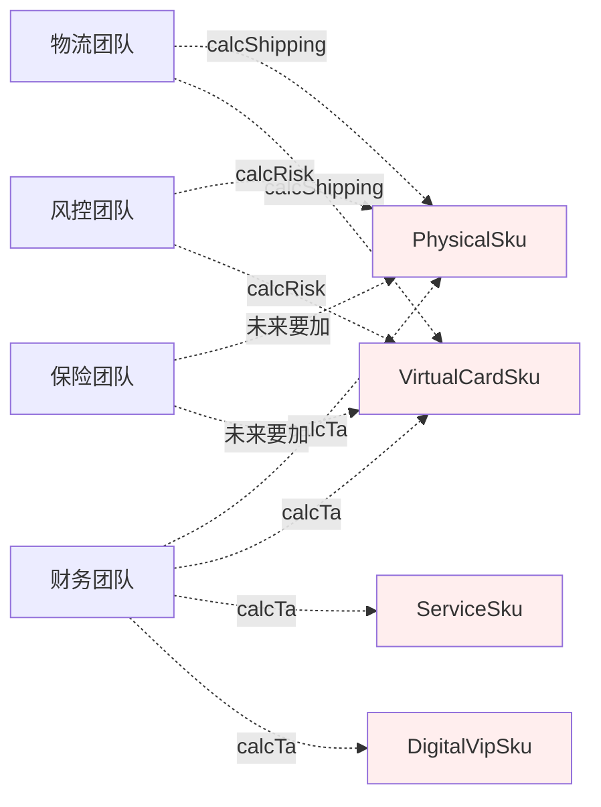
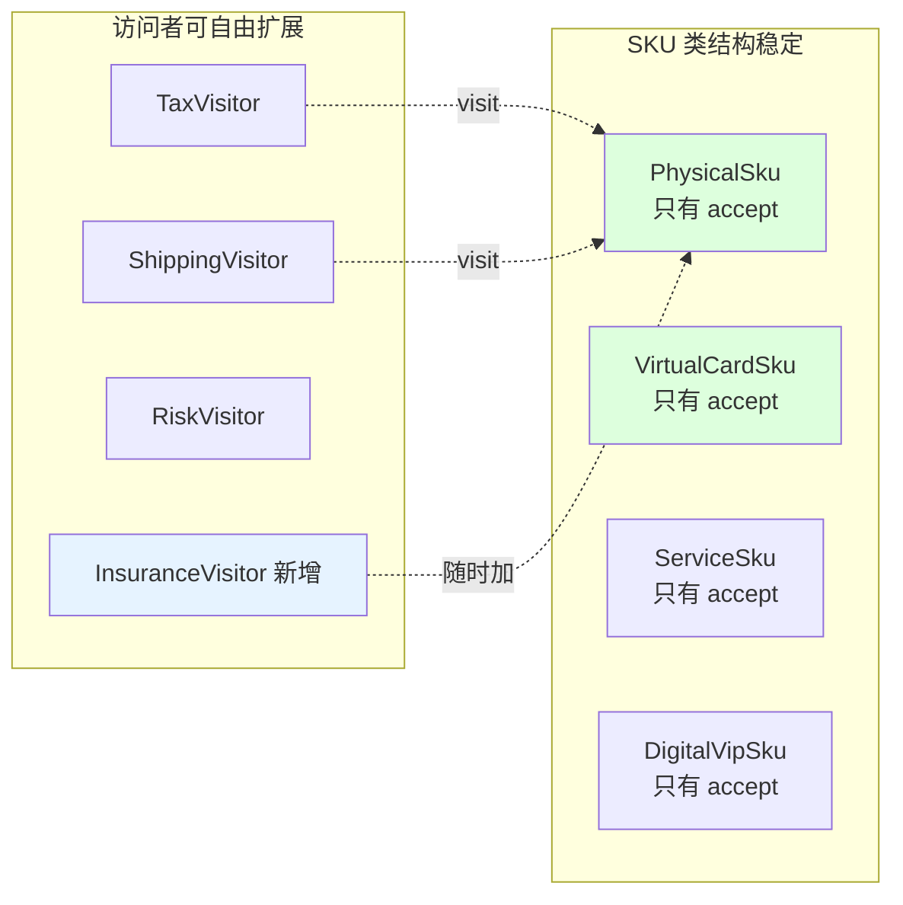
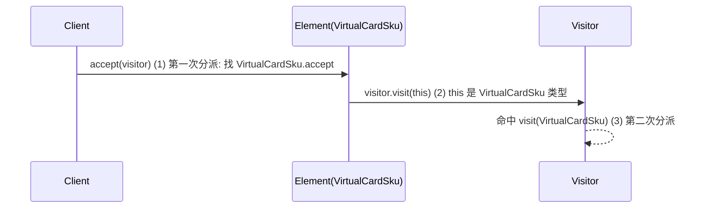
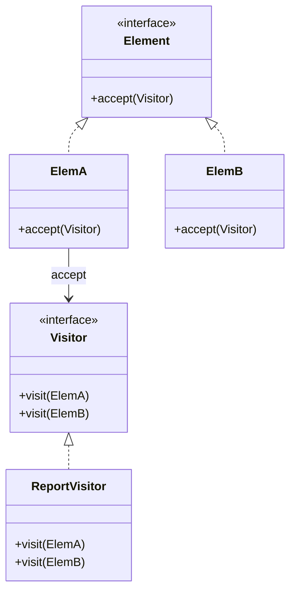
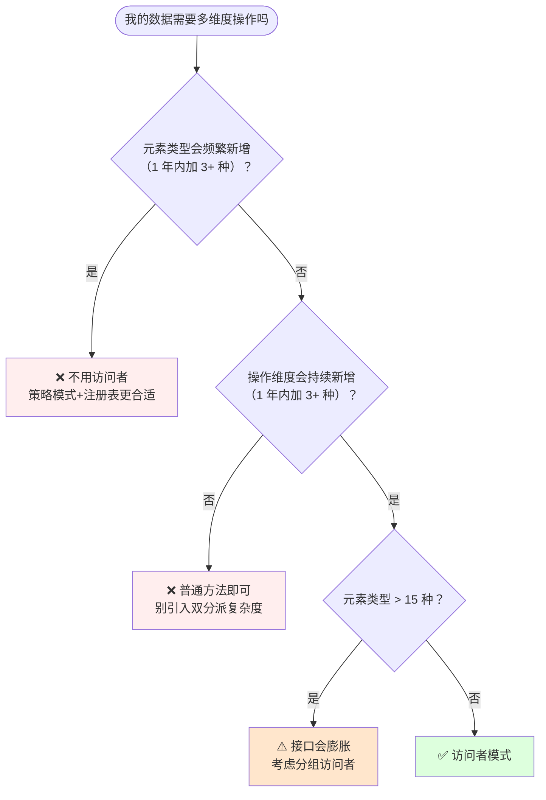
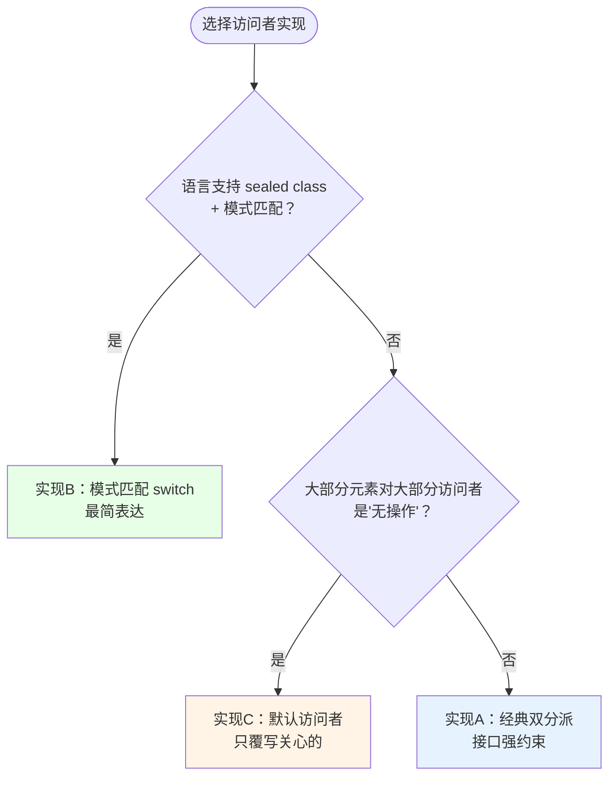
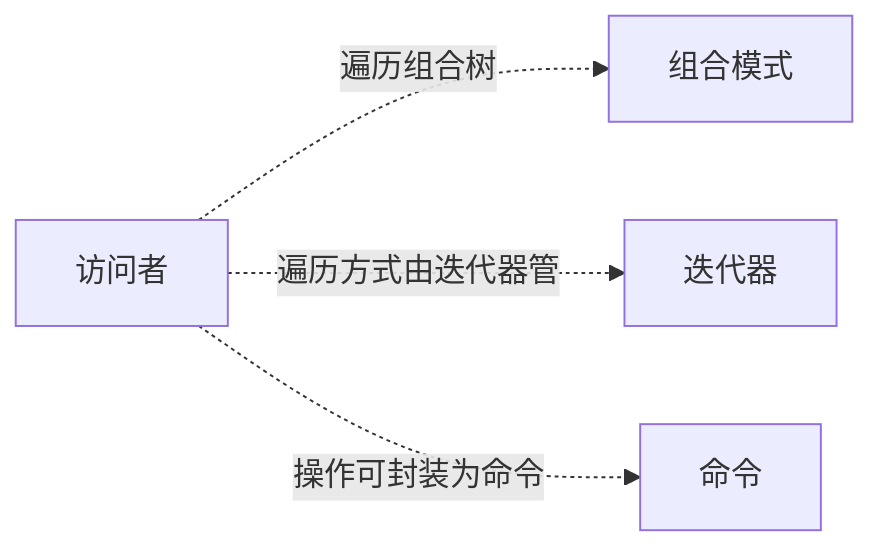

# 22.访问者模式设计思想

> 📚 本篇按照「事故复盘 → 失败探索 → 模式登场 → 实现对比 → 效果对比 → 反面踩坑 → 选型决策」的节奏展开，建议按顺序阅读。

#### 目录介绍

- [01.案例引入：SKU 多团队抢改事故](#01案例引入sku-多团队抢改事故)
  - [1.1 痛点现场](#11-痛点现场)
  - [1.2 直觉实现复现](#12-直觉实现复现)
  - [1.3 问题根源拆解](#13-问题根源拆解)
  - [1.4 引出本篇主角](#14-引出本篇主角)
- [02.三次失败探索](#02三次失败探索)
  - [2.1 尝试方案A：给 SKU 类加方法](#21-尝试方案a给-sku-类加方法)
  - [2.2 尝试方案B：外部工具类 + instanceof](#22-尝试方案b外部工具类--instanceof)
  - [2.3 尝试方案C：重载方法直接分派](#23-尝试方案c重载方法直接分派)
  - [2.4 终于引出访问者模式](#24-终于引出访问者模式)
- [03.访问者模式基础介绍](#03访问者模式基础介绍)
  - [3.1 从失败中提炼需求](#31-从失败中提炼需求)
  - [3.2 访问者模式的标准骨架](#32-访问者模式的标准骨架)
  - [3.3 典型使用场景](#33-典型使用场景)
- [04.三种实现对比](#04三种实现对比)
  - [4.1 实现核心要点](#41-实现核心要点)
  - [4.2 实现A：经典访问者（接口+双分派）](#42-实现a经典访问者接口双分派)
  - [4.3 实现B：现代模式匹配替代](#43-实现b现代模式匹配替代)
  - [4.4 实现C：默认访问者 + 只覆写部分](#44-实现c默认访问者--只覆写部分)
  - [4.5 三种实现速查表](#45-三种实现速查表)
- [05.用前用后效果对比](#05用前用后效果对比)
  - [5.1 代码维度对比](#51-代码维度对比)
  - [5.2 团队协作维度对比](#52-团队协作维度对比)
  - [5.3 核心收益](#53-核心收益)
- [06.反面踩坑实录](#06反面踩坑实录)
  - [6.1 踩坑A：元素新增时访问者全部要改](#61-踩坑a元素新增时访问者全部要改)
  - [6.2 踩坑B：访问者破坏元素封装](#62-踩坑b访问者破坏元素封装)
  - [6.3 踩坑C：访问者累积状态忘记清零](#63-踩坑c访问者累积状态忘记清零)
  - [6.4 替代方案汇总](#64-替代方案汇总)
- [07.决策树与选型](#07决策树与选型)
  - [7.1 该不该用访问者模式](#71-该不该用访问者模式)
  - [7.2 选哪种实现方式](#72-选哪种实现方式)
  - [7.3 选型清单速查](#73-选型清单速查)
- [08.总结与延伸](#08总结与延伸)
  - [8.1 设计思想沉淀](#81-设计思想沉淀)
  - [8.2 模式联动边界](#82-模式联动边界)
  - [8.3 思考题与延伸](#83-思考题与延伸)

---

## 01.案例引入：SKU 多团队抢改事故

> **本篇主线**：对象结构稳定，但"对它做什么"经常新增

### 1.1 痛点现场

电商商品有 4 种 SKU 类型：实物商品、虚拟卡券、服务订单、数字会员。三个团队都要对所有 SKU 各算各的——财务算税、物流算运费、风控算风险评分。某次大促前夕，财务团队上线的新税率计算因跨团队合并冲突覆盖了物流团队的运费逻辑，导致 3 小时内虚拟卡券被误收了运费——1200 单投诉、直接损失 8 万。

翻出代码——每个团队的算法都硬塞在 SKU 类里：

```java
class PhysicalSku {
    BigDecimal calcTax()     { /* 实物商品税率 13% */ }
    BigDecimal calcShipping(){ /* 按重量体积算 */ }
    int        calcRisk()    { /* 有实体仓发货风控 */ }
}
class VirtualCardSku {
    BigDecimal calcTax()     { /* 虚拟品 6% */ }
    BigDecimal calcShipping(){ return ZERO; }
    int        calcRisk()    { /* 防羊毛党重点 */ }
}
// ServiceSku / DigitalVipSku 同样塞满 3+ 方法

// 保险团队要加 calcInsurance() → 4 个 SKU 类都要改
// 碳排放团队要加 calcCarbon() → 4 个 SKU 类又要改
// 每次改动 = 4 个文件 + 跨团队合并冲突风险
```

### 1.2 直觉实现复现



**💭 反思**：为什么加一个"保险"维度要改 4 个 SKU 类？核心问题不是"SKU 种类多"——而是 **"对 SKU 做什么"的代码和"SKU 是什么"焊死在同一个类里**。每个新团队都在 SKU 类上打补丁，SKU 永远在被改。

### 1.3 问题根源拆解

| 隐患 | 现象 | 业务影响 |
|------|------|---------|
| **SKU 类永远被打扰** | 稳定的业务实体因"外人要算点啥"频繁改动 | 核心实体变更风险高 |
| **违反单一职责** | SKU 同时管自己数据+税+运费+风控+保险 | 任何改动都影响全域 |
| **跨团队冲突** | 4 个团队的 PR 落在同一文件上 | 合并冲突覆盖→运费被误扣 |
| **算法分散难对账** | 财务审查"实物税率"要翻 4 个文件 | 对账成本高、易遗漏 |
| **新增算法改 N 类** | 每加一个维度，4 个 SKU 类都要改 | 违反开闭原则 |

**核心矛盾**：业务上"SKU 类型是稳定的，操作维度是不断新增的"，但代码层面**操作维度被塞进了 SKU 类型里**——两个变化方向被强行耦合。

### 1.4 引出本篇主角

> **访问者模式的核心思想**：把"对每种 SKU 做什么"抽象成一个独立的访问者。SKU 只需一个 `accept(visitor)` 把自己"交出去"；每个新维度 = 一个新访问者类。SKU 一行不用动。

```java
interface SkuVisitor<R> {
    R visit(PhysicalSku sku);
    R visit(VirtualCardSku sku);
    R visit(ServiceSku sku);
    R visit(DigitalVipSku sku);
}

abstract class Sku { abstract <R> R accept(SkuVisitor<R> v); }
class PhysicalSku extends Sku {
    public <R> R accept(SkuVisitor<R> v) { return v.visit(this); }
}

// 每个新团队 = 一个新访问者类，SKU 零改动
class TaxVisitor implements SkuVisitor<BigDecimal> {
    public BigDecimal visit(PhysicalSku s)   { return s.price.multiply(new BigDecimal("0.13")); }
    public BigDecimal visit(VirtualCardSku s) { return s.price.multiply(new BigDecimal("0.06")); }
    public BigDecimal visit(ServiceSku s)    { return s.price.multiply(new BigDecimal("0.06")); }
    public BigDecimal visit(DigitalVipSku s) { return s.price.multiply(new BigDecimal("0.06")); }
}
// ShippingVisitor / RiskVisitor / InsuranceVisitor ——各自独立，互不干扰

BigDecimal tax = sku.accept(new TaxVisitor());
```



**先别急着看实现**——下一节我们看看新人通常会先尝试哪些方案。

---

## 02.三次失败探索

> 访问者模式不是凭空发明的——它是前人走过 3 条死路之后才提炼出来的。

### 2.1 尝试方案 A：给 SKU 类加方法

```java
// 方案A：每个新维度 = 给 4 个 SKU 类各加一个方法
class PhysicalSku {
    BigDecimal calcTax() { ... }      // 财务
    BigDecimal calcShipping() { ... } // 物流
    int calcRisk() { ... }            // 风控
    // 保险团队来 → 再加 calcInsurance()
    // 碳排放来   → 再加 calcCarbon()
}
```

**🧪 验证**：

```java
// 第 5 个团队来 → 4 个 SKU 类都要改 → 4 个 PR 可能冲突
// 第 10 个团队来 → SKU 类已经臃肿 500+ 行
// 财务想查看"所有 SKU 的税率计算"→ 必须翻 4 个文件
```

**❌ 失败原因**：操作维度被塞进数据维度。每加一个操作，所有数据类都要改——违反 OCP。4 个团队改同一文件→合并冲突频繁。

**💡 反思**：我们需要"新增操作不改数据类"——操作和数据应该正交分离。

### 2.2 尝试方案 B：外部工具类 + instanceof

```java
// 方案B：集中到外部工具类，用 instanceof 判断类型
public class TaxCalculator {
    public static BigDecimal calc(Sku sku) {
        if (sku instanceof PhysicalSku p)      return p.getPrice().multiply(new BigDecimal("0.13"));
        else if (sku instanceof VirtualCardSku v) return v.getPrice().multiply(new BigDecimal("0.06"));
        else if (sku instanceof ServiceSku s)     return s.getPrice().multiply(new BigDecimal("0.06"));
        else throw new IllegalArgumentException("未知 SKU 类型");
    }
}
```

**🧪 验证**：

```java
// 看似解决了"不改 SKU 类"——但 instanceof 链的问题：
// 1. 新增 SKU 类型（如 ComboSku）——编译器不报错，跑到 else 才抛异常
// 2. 每个工具类都要写一遍 instanceof 链——代码重复
// 3. 需要访问 SKU 私有字段时——要么加 getter（破坏封装），要么传 public 数据
```

**❌ 失败原因**：① 新增 SKU 类型编译期无感知——运行时才报错；② instanceof 链在多个工具类里重复；③ 访问私有字段需加 getter——破坏封装。

**💡 反思**：我们需要"新增 SKU 类型时编译器强制提示所有访问者要更新"——类型安全的保证。

### 2.3 尝试方案 C：重载方法直接分派

```java
// 方案C：利用方法重载——visitor.visit(sku) 自动选版本
class TaxVisitor {
    void visit(PhysicalSku s)     { ... }
    void visit(VirtualCardSku s)  { ... }
    void visit(ServiceSku s)      { ... }
}

// 调用
Sku sku = new VirtualCardSku();
new TaxVisitor().visit(sku);  // ❌ 编译错误！visit(Sku) 不存在
```

**🧪 验证**：

```java
// Java 是单分派语言——重载方法根据编译期声明类型选版本
// visit(sku) 在编译期看到 sku 的声明类型是 Sku → 找不到 visit(Sku)
// 即使运行时 sku 实际是 VirtualCardSku——也于事无补
```

**❌ 失败原因**：Java/C++ 是单分派——重载方法靠编译期声明类型决定调谁，而非运行期实际类型。直接重载行不通。

**💡 反思**：必须用一个精巧的两步机制——先走到对的元素类型，再用 this 把类型显式传给访问者。这就是**双分派（Double Dispatch）**。

### 2.4 终于引出访问者模式

三次失败之后，需求清单收敛了：

| 必须满足 | 来自哪一次失败 |
|---------|-------------|
| ① 新增操作不改数据类（正交分离） | 2.1 给 SKU 加方法 |
| ② 新增类型时编译器强制提示 | 2.2 instanceof 运行时才报 |
| ③ 绕过单分派限制，正确路由到 visit 版本 | 2.3 重载不生效 |
| ④ 操作维度集中在一个类里 | 2.1 散落 / 2.2 重复 |

**访问者模式的标准答案——双分派机制**：

```java
// ① 元素 accept——第一次分派：运行时类型决定走哪个 accept
class VirtualCardSku extends Sku {
    public <R> R accept(SkuVisitor<R> v) { return v.visit(this); }
    //                                              ↑ this 是 VirtualCardSku 类型
    //                            ② 第二次分派：编译期 this 类型决定走 visit(VirtualCardSku)
}

// ③ 每个访问者实现所有 visit 版本——新增类型编译报错
interface SkuVisitor<R> {
    R visit(PhysicalSku sku);      // ④ 操作集中
    R visit(VirtualCardSku sku);
    R visit(ServiceSku sku);
}
```



短短几行，**双分派 + 接口枚举所有类型 = 新增类型编译报错 + 新增操作零改动元素。**

---

## 03.访问者模式基础介绍

### 3.1 从失败中提炼的需求

回顾 02 节的三次失败和 01 节的事故，访问者模式的设计约束：

| 约束 | 来自 | 代码体现 |
|:---|:---|:---|
| ① 新增操作不改元素类 | 2.1 / 01 事故 | 新操作 = 新建 Visitor 类 |
| ② 新增元素类型编译报错 | 2.2 instanceof | Visitor 接口声明所有 `visit` 版本，缺一不可 |
| ③ 双分派绕过单分派限制 | 2.3 重载不生效 | `accept(v)` → `v.visit(this)` 两步分派 |
| ④ 操作集中可审计 | 2.1/2.2 | 每个 Visitor 只做一件事（税/运费/风控） |

**访问者模式**：表示一个作用于某对象结构中的各元素的操作。它可以让你在不改变各元素的类的前提下，定义作用于这些元素的新操作。

### 3.2 访问者模式的标准骨架

```java
// Element：被访问元素——只需一个 accept
interface Element { void accept(Visitor v); }

class ConcreteElementA implements Element {
    public void accept(Visitor v) { v.visit(this); }  // ③ 双分派核心
}
class ConcreteElementB implements Element {
    public void accept(Visitor v) { v.visit(this); }
}

// Visitor：为每种 Element 声明 visit 方法——② 编译期强制
interface Visitor {
    void visit(ConcreteElementA e);  // ① 每种元素一个重载版本
    void visit(ConcreteElementB e);
}

// ConcreteVisitor：④ 一个访问者 = 一个操作维度
class ReportVisitor implements Visitor {
    public void visit(ConcreteElementA e) { /* A 的处理 */ }
    public void visit(ConcreteElementB e) { /* B 的处理 */ }
}
```



三句话记住：**Element.accept → Visitor.visit(this) → 双分派定位。** 差异全在"传统接口 vs 模式匹配 vs 默认实现"——这就是下一节三种实现的分岔。

### 3.3 典型使用场景

访问者模式的硬性适用条件：**元素类型稳定 + 操作维度频繁新增**。以下场景完美契合：

| 场景 | 元素（稳定） | 操作（多变） |
|------|-----------|-----------|
| **编译器 AST** | 语法节点种类（Expr/Stmt/Decl…） | 类型检查/代码生成/格式化/Lint/埋点 |
| **电商 SKU 报表** | Physical/Virtual/Service/Digital | 算税/运费/风控/保险/碳排放 |
| **UI 树遍历** | Button/Panel/Text/Image | 渲染/无障碍/埋点/截图测试 |
| **文件树扫描** | File/Directory/Symlink | 搜索/统计大小/权限检查/备份 |
| **JSON/XML 节点** | Object/Array/String/Number/Boolean | 序列化/校验/Schema 检查 |

> **反面提醒**：元素类型会频繁新增的（如插件体系）——用策略模式或注册表，不要用访问者。

---

## 04.三种实现对比

### 4.1 实现核心要点

三种写法本质上是在 **类型安全 / 语言特性 / 扩展成本** 上的不同取舍。实现访问者只需两行骨架：

```java
// Element 端
public void accept(Visitor v) { v.visit(this); }  // ① 双分派

// Visitor 端
R visit(ElementA e); R visit(ElementB e); ...       // ② 枚举所有版本
```

差异全在"传统接口 vs 现代语法 vs 默认基类"。下面按演进顺序逐一展开。

### 4.2 实现 A：经典访问者——接口 + 双分派

**设计权衡**：用"接口声明所有 visit 版本"换"新增元素类型编译强制报错"

```java
// 实现A：经典 GoF 访问者
interface SkuVisitor<R> {
    R visit(PhysicalSku e);
    R visit(VirtualCardSku e);
    R visit(ServiceSku e);
    R visit(DigitalVipSku e);
}

class TaxVisitor implements SkuVisitor<BigDecimal> {
    public BigDecimal visit(PhysicalSku e)   { return e.price.multiply(new BigDecimal("0.13")); }
    public BigDecimal visit(VirtualCardSku e) { return e.price.multiply(new BigDecimal("0.06")); }
    public BigDecimal visit(ServiceSku e)    { return e.price.multiply(new BigDecimal("0.06")); }
    public BigDecimal visit(DigitalVipSku e) { return e.price.multiply(new BigDecimal("0.06")); }
}

// 使用
List<Sku> cart = List.of(new PhysicalSku(...), new VirtualCardSku(...));
TaxVisitor tax = new TaxVisitor();
cart.forEach(s -> s.accept(tax));
```

**优点**：新增操作 = 新建访问者；新增元素类型 = 编译报错（接口缺方法）。**缺点**：元素类型多时接口膨胀；双分派对新手不友好。**适用**：4-15 种元素类型、多团队各自维护各自访问者。

### 4.3 实现 B：现代模式匹配替代

**设计权衡**：用"丢失编译期强制 + 依赖语言特性"换"零接口 + 极简表达"

```java
// 实现B：Java 17+ sealed interface + 模式匹配 switch
sealed interface Sku permits PhysicalSku, VirtualCardSku, ServiceSku, DigitalVipSku {}

record PhysicalSku(double weight, BigDecimal price) implements Sku {}
record VirtualCardSku(BigDecimal price) implements Sku {}
record ServiceSku(BigDecimal price, int hours) implements Sku {}
record DigitalVipSku(BigDecimal price) implements Sku {}

// 无需 Visitor 接口——直接 switch
BigDecimal calcTax(Sku sku) {
    return switch (sku) {
        case PhysicalSku p   -> p.price().multiply(new BigDecimal("0.13"));
        case VirtualCardSku v -> v.price().multiply(new BigDecimal("0.06"));
        case ServiceSku s    -> s.price().multiply(new BigDecimal("0.06"));
        case DigitalVipSku d -> d.price().multiply(new BigDecimal("0.06"));
    };
}
```

**优点**：代码量极小，无接口无样板；sealed 保证 switch 穷举。**缺点**：每个操作维度仍要写一个 switch（可能分散）；新增元素类型 sealed interface 要改 permits。**适用**：Java 17+/Kotlin/Scala 等支持模式匹配和 sealed class 的现代语言。

### 4.4 实现 C：默认访问者——只覆写需要的部分

**设计权衡**：用"默认实现可选择性遗漏"换"不需要为每种元素写模板代码"

```java
// 实现C：抽象基类提供默认实现，子类只覆写关心的元素
abstract class DefaultSkuVisitor<R> implements SkuVisitor<R> {
    public R visit(PhysicalSku e)   { return defaultVisit(e); }
    public R visit(VirtualCardSku e) { return defaultVisit(e); }
    public R visit(ServiceSku e)    { return defaultVisit(e); }
    public R visit(DigitalVipSku e) { return defaultVisit(e); }
    protected R defaultVisit(Sku e) { return null; }
}

// 物流访问者——只关心实物
class ShippingVisitor extends DefaultSkuVisitor<BigDecimal> {
    public BigDecimal visit(PhysicalSku e) { return BigDecimal.valueOf(e.weight * 2); }
    // Virtual/Service/Digital 走 defaultVisit → 返回 null（免运费）
}

// 碳排放访问者——只关心实物和服务
class CarbonVisitor extends DefaultSkuVisitor<Double> {
    public Double visit(PhysicalSku e) { return e.weight * 0.15; }
    public Double visit(ServiceSku e)  { return e.hours * 0.05; }
}
```

**优点**：子类只覆写关心的元素，代码量少；新增访问者时不写不需要的 visit 方法。**缺点**：新增元素类型时 DefaultSkuVisitor 和所有子类都要检查。**适用**：大部分元素对大部分访问者是"无操作"的场景（如：只有实物收运费）。

### 4.5 三种实现速查表

| 实现方式 | 新增操作 | 新增元素 | 编译器强制 | 适用场景 | 推荐度 |
|---------|--------|--------|---------|---------|------|
| 实现A：经典双分派 | ✅新Visitor | ⚠️ 接口缺方法报错 | ✅ 强 | 多团队/4-15种元素 | ⭐⭐⭐⭐ |
| 实现B：模式匹配 | ✅ 新switch | ⚠️ sealed permits | ✅ sealed | Java17+/Kotlin/Scala | ⭐⭐⭐⭐⭐ |
| 实现C：默认访问者 | ✅ 新子类 | ❌ 无感知 | ❌ | 大部分元素无操作 | ⭐⭐⭐ |

**📌 一句话决策**：传统 Java→**实现A**，现代语言→**实现B**，多数元素无操作→**实现C**。

---

## 05.用前用后效果对比

> 用 1.1 节 SKU 多团队场景做基准。

### 5.1 代码维度对比

```java
// ❌ 用前：每个操作维度散落在 4 个 SKU 类里
class PhysicalSku    { calcTax(); calcShipping(); calcRisk(); /*……*/ }
class VirtualCardSku { calcTax(); calcShipping(); calcRisk(); /*……*/ }
class ServiceSku     { calcTax(); calcShipping(); calcRisk(); /*……*/ }
class DigitalVipSku  { calcTax(); calcShipping(); calcRisk(); /*……*/ }

// ✅ 用后：每个操作维度集中在一个 Visitor 类里
class TaxVisitor      implements SkuVisitor { /* 4 个 visit */ }
class ShippingVisitor  implements SkuVisitor { /* 4 个 visit */ }
class RiskVisitor     implements SkuVisitor { /* 4 个 visit */ }
```

### 5.2 团队协作维度对比

| 维度 | ❌ 操作塞入 SKU 类 | ✅ 访问者模式 |
|------|------------------|------------|
| 新增操作改动文件数 | 改 4 个 SKU 类 | **新建 1 个 Visitor 类** |
| 跨团队冲突风险 | 高（同一文件 4 团队改） | 低（各自访各自 Visitor） |
| 操作代码定位 | 翻 4 个文件拼出全貌 | **一个 Visitor 类看全局** |
| 新增 SKU 类型 | ❌ 编译报错（接口缺方法） | ✅ 编译期强制提示 |
| SKU 类职责 | 数据+税+运费+风控+保险… | **只含数据 + 1 个 accept** |
| 事故（运费误扣） | 1200 单投诉，损失 8 万 | **0** |

### 5.3 核心收益

> **访问者模式的本质**：把"操作维度"从"数据维度"中正交分离——数据类结构稳定时，新增操作只新建访问者，数据类零改动。这正是为什么编译器 AST 遍历用访问者、为什么 Jackson 用 `JsonNode.accept()`、为什么 LLVM 用 `RecursiveASTVisitor`——**任何"数据分类稳定 + 要做什么层出不穷"的场景，让操作集中在一个访问者类里，才能让"数据不受侵扰 / 操作可控 / 编译期安全"同时成立。**

---

## 06.反面踩坑实录

> 访问者模式不是银弹——以下 3 个坑几乎每个团队都踩过。

### 6.1 踩坑 A：元素新增时访问者全部要改——OCP 反向破坏

```java
// 新增 ComboSku（组合套餐）
// Visitor 接口要加 visit(ComboSku) → 所有 Visitor 实现类全部编译报错
interface SkuVisitor<R> {
    R visit(PhysicalSku e);
    R visit(VirtualCardSku e);
    R visit(ServiceSku e);
    R visit(DigitalVipSku e);
    R visit(ComboSku e);  // ← 新增——5 个 Visitor 类全部要补实现
}
```

**💣 事故**：某报表系统新增一种数据源类型，14 个已有访问者全部要改——发布延期 3 天。

**✅ 正解**：① 访问者适合"元素极少新增"的场景——判断错了就不该用；② 用实现C（默认访问者）兜底——新增类型时只有关心它的访问者才覆写。

### 6.2 踩坑 B：访问者破坏元素封装

```java
// ❌ Visitor 的 visit 方法内大量调用元素 getter
class ReportVisitor implements SkuVisitor {
    public void visit(PhysicalSku s) {
        s.getPrice(); s.getWeight(); s.getSupplier(); s.getWarehouse();
        // → 为了"访问"把元素的内部字段全部暴露成 public getter
    }
}
```

**💣 事故**：某访问者要算"实物商品的碳足迹"，需要仓库坐标+供应商等级——SKU 类被迫加了 7 个新 getter。后来这些 getter 被其他模块滥用，数据一致性被破坏。

**✅ 正解**：如果访问者确实需要大量内部数据——考虑 expose 一个只读的 `Snapshot`/`DTO` 给访问者，而非逐字段 getter。

### 6.3 踩坑 C：访问者累积状态忘记清零

```java
class TaxVisitor implements SkuVisitor<BigDecimal> {
    private BigDecimal total = BigDecimal.ZERO;  // ❌ 实例字段累积

    public BigDecimal visit(PhysicalSku s)   { total = total.add(...); return null; }
    public BigDecimal visit(VirtualCardSku s) { total = total.add(...); return null; }
}

TaxVisitor v = new TaxVisitor();
cart.forEach(s -> s.accept(v));
BigDecimal t1 = v.total;   // 第一次：正常

// ❌ 同一个 visitor 实例再用一次——忘记清零
cart2.forEach(s -> s.accept(v));
BigDecimal t2 = v.total;   // t1 + t2 → 数据脏了！
```

**💣 事故**：某报表系统同一个 Visitor 实例被复用于两个批次的数据——第二批次结果包含了第一批次的数据，导致对账差 37 万。

**✅ 正解**：访问者实例用一次即弃（`new TaxVisitor()`）；或访问者提供 `reset()` 方法；单测加"连续两批次结果独立"用例。

### 6.4 替代方案汇总

| 你的需求 | 推荐方案 |
|---------|---------|
| 元素类型会频繁新增 | ❌ 不用访问者——用策略模式+注册表 |
| 元素 ≤ 3 且操作少 | ✅ 直接 instanceof / 模式匹配 switch |
| 现代语言支持 sealed + switch | ✅ 实现B：模式匹配替代 |
| 需要操作可审计可回滚 | ✅ 访问者 + 命令模式联动 |
| 跨类型聚合统计 | ✅ 访问者（天然优势） |

---

## 07.决策树与选型

### 7.1 该不该用访问者模式



### 7.2 选哪种实现方式



### 7.3 选型清单速查

| 场景 | 该用吗 | 推荐方式 |
|------|------|---------|
| 电商 SKU 4种类型+5个操作维度 | ✅ 该用 | 实现A：经典双分派 |
| 编译器 AST 50+ 节点 | ✅ 该用 | 实现C：默认访问者 |
| Java 17+ sealed 类型 | ✅ 该用 | 实现B：模式匹配 |
| 插件系统（元素频繁新增） | ❌ 别用 | 策略模式+注册表 |
| 只有 2 种元素 2 个操作 | ❌ 别用 | 直接 if-else |

---

## 08.总结与延伸

### 8.1 设计思想沉淀

| 阶段 | 学到了什么 |
|------|----------|
| **01 事故** | 痛点是模式诞生的土壤——1 个操作维度 = 4 个 SKU 类全改，合并冲突覆盖运费 |
| **02 三次失败** | 给 SKU 加方法/外部工具 instanceof/直接重载都不行——双分派是绕过单分派的精巧设计 |
| **03 模式基础** | 四约束：新增操作不改元素 / 新增类型编译报错 / 双分派 / 操作集中 |
| **04 三种实现** | 经典双分派/模式匹配/默认访问者本质是"类型安全/语法糖/扩展成本"的权衡 |
| **05 效果对比** | 改 4 文件→新建 1 类，跨团队冲突归零 |
| **06 反面踩坑** | 元素新增全改、破坏封装、状态忘记清零 |
| **07 决策树** | 访问者最大硬约束：**元素类型必须稳定**——不满足直接弃用 |

**🔑 一句话核心**：

> 访问者 = **元素稳定 + 操作多变 + 双分派**。把操作维度从数据维度中正交分离。

### 8.2 模式联动边界



| 模式 | 关系 | 一句话区别 |
|------|------|----------|
| **组合** | 天然搭档 | 访问者最常遍历组合树（菜单/AST/目录） |
| **迭代器** | 配合 | 迭代器管遍历方式，访问者管到达节点后做什么 |
| **命令** | 联动 | 访问者的操作可封装为命令——可撤销/重放 |
| **策略** | 替代 | 元素不稳定时用策略+注册表，不要用访问者 |

**什么时候不该用访问者**：
- 元素类型会频繁新增——OCP 反向破坏，灾难
- 操作维度极少且不增长——普通方法更直接
- 现代语言已有 sealed + 模式匹配——优先用模式匹配，更简洁

### 8.3 思考题与延伸

**💭 三道思考题**：

1. 如果 SKU 体系未来一定会加新类型（如"组合套餐"）——访问者还能用吗？怎样把"加元素的痛"降到最低？（提示：回看 6.4 替代方案 + 实现C 默认访问者）

2. 访问者需要访问元素大量私有字段——优雅的做法是什么？暴露 DTO/Snapshot 还是直接用 getter？（提示：回看 6.2 踩坑 B）

3. Java 17 的 sealed + switch 模式匹配已经能替代大部分访问者场景——那什么场景下仍然必须用经典访问者？（提示：跨团队独立维护 visit 逻辑、需要编译期强约束所有访问者更新）

**📚 延伸阅读**：
- Java JDT ASTVisitor：编译器 AST 的经典访问者实现
- Jackson JsonNode.visit()：JSON 树的访问者遍历
- LLVM RecursiveASTVisitor：C++ AST 的访问者框架
- Babel Visitor：JavaScript AST 的访问者模式

> **上一篇** [21.中介者模式](https://yccoding.com/pages/606076/) → **本篇** → [23.解释器模式](https://yccoding.com/pages/10c897/)：本系列最后一个，也是最像"小型 DSL 设计"的模式。
