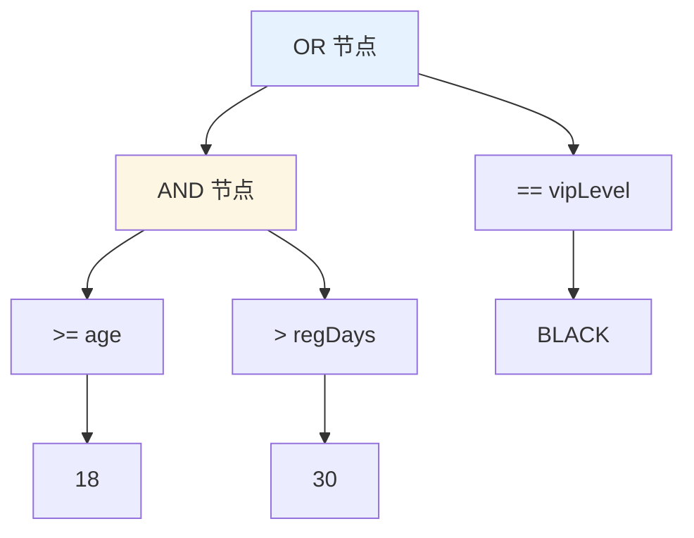
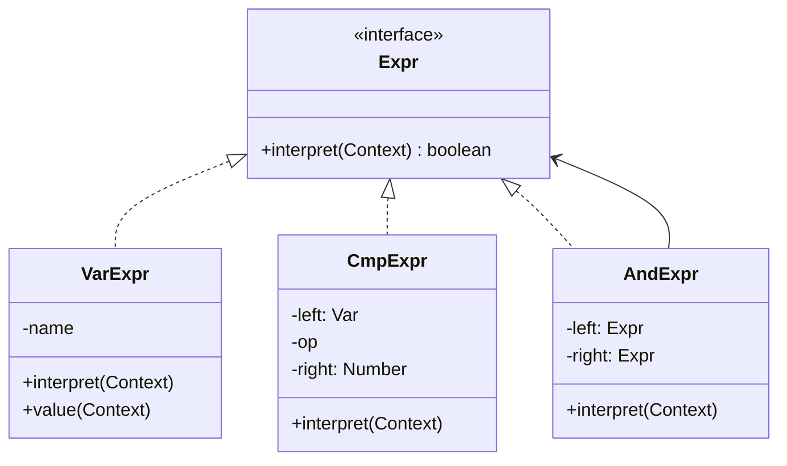
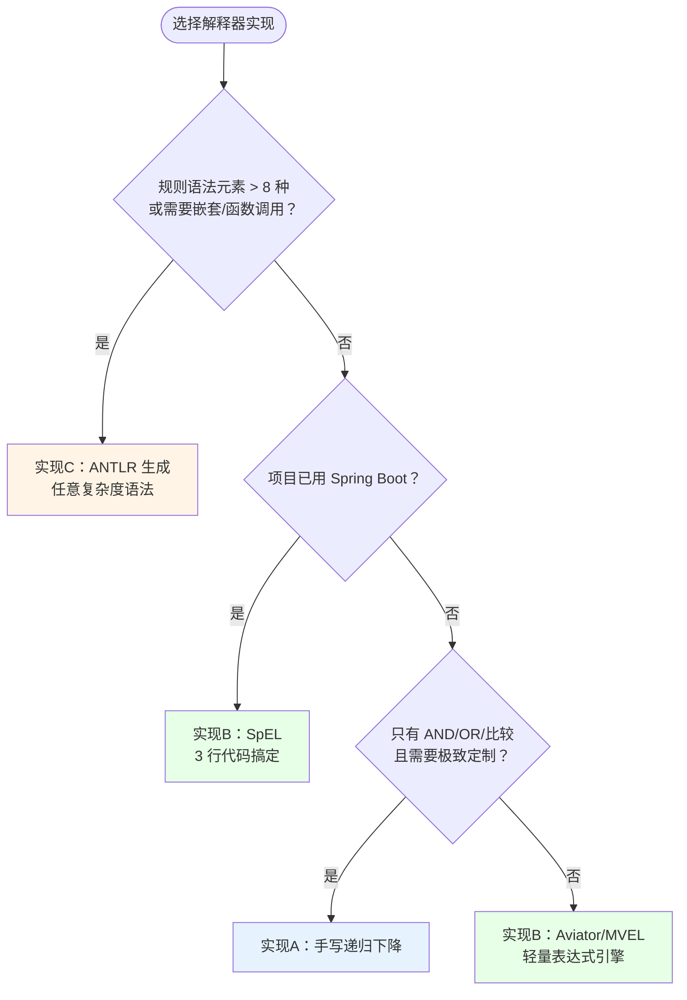
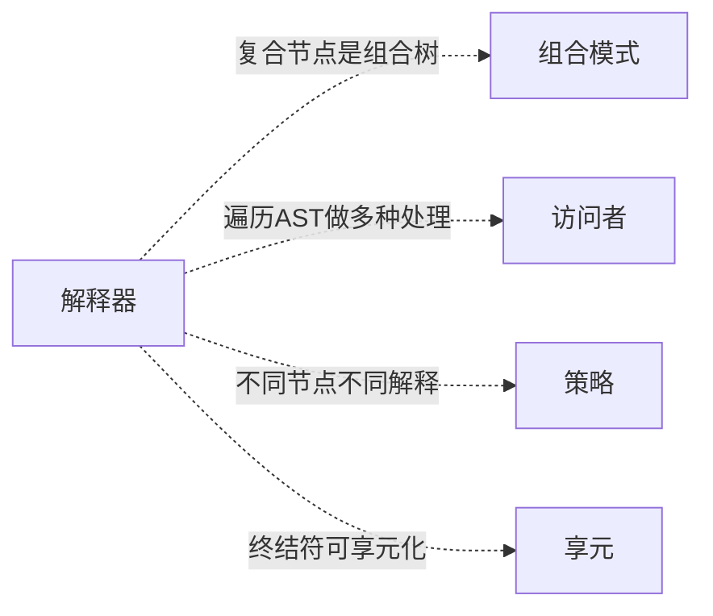
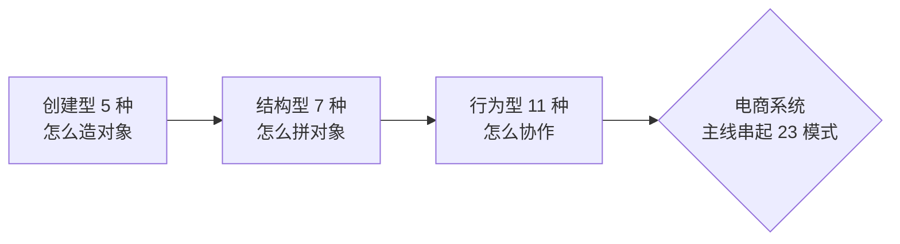

# 23.解释器模式设计思想

> 📚 本篇按照「事故复盘 → 失败探索 → 模式登场 → 实现对比 → 效果对比 → 反面踩坑 → 选型决策」的节奏展开，建议按顺序阅读。这是本系列最后一篇。

#### 目录介绍

- [01.案例引入：促销规则发版地狱](#01案例引入促销规则发版地狱)
  - [1.1 痛点现场](#11-痛点现场)
  - [1.2 直觉实现复现](#12-直觉实现复现)
  - [1.3 问题根源拆解](#13-问题根源拆解)
  - [1.4 引出本篇主角](#14-引出本篇主角)
- [02.三次失败探索](#02三次失败探索)
  - [2.1 尝试方案A：每条规则一个 if 方法](#21-尝试方案a每条规则一个-if-方法)
  - [2.2 尝试方案B：规则存 JSON 配置表](#22-尝试方案b规则存-json-配置表)
  - [2.3 尝试方案C：嵌入 Groovy/Js 脚本引擎](#23-尝试方案c嵌入-groovyjs-脚本引擎)
  - [2.4 终于引出解释器模式](#24-终于引出解释器模式)
- [03.解释器模式基础介绍](#03解释器模式基础介绍)
  - [3.1 从失败中提炼需求](#31-从失败中提炼需求)
  - [3.2 解释器模式的标准骨架](#32-解释器模式的标准骨架)
  - [3.3 典型使用场景](#33-典型使用场景)
- [04.三种实现对比](#04三种实现对比)
  - [4.1 实现核心要点](#41-实现核心要点)
  - [4.2 实现A：手写递归下降解释器](#42-实现a手写递归下降解释器)
  - [4.3 实现B：成熟表达式引擎](#43-实现b成熟表达式引擎)
  - [4.4 实现C：ANTLR/JavaCC 自动生成](#44-实现cantlrjavacc-自动生成)
  - [4.5 三种实现速查表](#45-三种实现速查表)
- [05.用前用后效果对比](#05用前用后效果对比)
  - [5.1 代码维度对比](#51-代码维度对比)
  - [5.2 运营效率维度对比](#52-运营效率维度对比)
  - [5.3 核心收益](#53-核心收益)
- [06.反面踩坑实录](#06反面踩坑实录)
  - [6.1 踩坑A：手写 Parser 把语法搞复杂了](#61-踩坑a手写-parser-把语法搞复杂了)
  - [6.2 踩坑B：AST 每次重建性能差](#62-踩坑bast-每次重建性能差)
  - [6.3 踩坑C：运营写错语法直接抛异常](#63-踩坑c运营写错语法直接抛异常)
  - [6.4 替代方案汇总](#64-替代方案汇总)
- [07.决策树与选型](#07决策树与选型)
  - [7.1 该不该用解释器模式](#71-该不该用解释器模式)
  - [7.2 选哪种实现方式](#72-选哪种实现方式)
  - [7.3 选型清单速查](#73-选型清单速查)
- [08.总结与延伸](#08总结与延伸)
  - [8.1 设计思想沉淀](#81-设计思想沉淀)
  - [8.2 模式联动边界](#82-模式联动边界)
  - [8.3 思考题与延伸](#83-思考题与延伸)
- [系列收束：23 种 GoF 设计模式回顾](#系列收束23-种-gof-设计模式回顾)

---

## 01.案例引入：促销规则发版地狱

> **本篇主线**：可变的业务规则被硬编码进不可变的代码

### 1.1 痛点现场

电商促销运营每周都在改规则。某次双十一大促，运营凌晨 2 点紧急调整一条满减规则——结果因为需要走完整发版流程（开发改代码→测试回归→灰度→全量），**规则上线时已是早上 8 点，错过了深夜 0-6 点的流量高峰，直接 GMV 损失 370 万。** 更糟的是，一周后运营发现这条规则有 bug 要撤回——又要走一遍发版流程。

翻出代码——每条促销规则是一个硬编码的 if 方法：

```java
public class PromotionService {
    public boolean matchRuleA(User u) {
        return u.getLevel() >= 3 && u.getMonthAmount() > 500;
    }
    public boolean matchRuleB(Order o) {
        return isDoubleEleven(o.getTime()) && "美妆".equals(o.getCategory());
    }
    // 一年下来 200+ 条规则，大部分已下线无人敢删
}
```

### 1.2 直觉实现复现


运营想改一句话，要等开发→测试→发版全流程。极端情况下规则上线 6 小时——错过整个凌晨流量窗口。

**💭 反思**：为什么一条"level >= 3 AND amount > 500"改了要发版？核心问题不是"规则多"——而是 **规则的表达和执行被焊死在代码里**。规则 = 代码 → 改规则 = 改代码 = 要发版。

### 1.3 问题根源拆解

| 隐患 | 现象 | 业务影响 |
|------|------|---------|
| **规则=代码** | 改规则必须改代码发版 | 上线周期几小时~几天，错过促销窗口 |
| **规则堆砌** | 200+ 条规则全是 if 方法 | 无用规则不敢删，代码库膨胀 |
| **组合逻辑复杂** | `(A且B)或(C且非D)`→if 嵌套难读 | 规则改动风险大 |
| **运营无法参与** | 运营写 Word 描述，开发翻译成代码 | 翻译错误率高 |
| **审计困难** | "去年双十一用了哪些规则？"→翻 git | 无法快速回溯 |

**核心矛盾**：业务上"规则应该是可配置的数据"，但代码层面**规则是硬编码的逻辑**——改一条规则 = 改一次代码 = 发一次版。

### 1.4 引出本篇主角

> **解释器模式的核心思想**：为这类"灵活多变的规则"设计一套迷你语法（DSL），实现一个解释器去运行它。规则变成配置字符串（存库、热更新），代码只维护"如何解释"这个稳定骨架。

```java
// 运营填的规则（存在数据库/配置中心，热更新）：
String ruleA = "level >= 3 AND monthAmount > 500";
String ruleD = "(age >= 18 AND regDays > 30) OR vipLevel == 'BLACK'";

// 系统解析 + 执行——代码不再改动
Expression expr = parser.parse(ruleD);
Map<String, Object> ctx = Map.of("age", 25, "regDays", 60, "vipLevel", "NORMAL");
boolean matched = expr.interpret(ctx);   // true
```

AST 是一棵语法树，每个节点自己知道怎么"解释自己"：



引入解释器后，工作流彻底换：


**先别急着看实现**——下一节我们看看新人通常会先尝试哪些方案。

---

## 02.三次失败探索

> 解释器模式不是凭空发明的——它是前人走过 3 条死路之后才提炼出来的。

### 2.1 尝试方案 A：每条规则一个 if 方法

```java
// 方案A：每条规则写死成一个方法
public class PromotionService {
    public boolean matchRuleA(User u) { return u.getLevel() >= 3 && u.getMonthAmount() > 500; }
    public boolean matchRuleB(Order o) { return isDoubleEleven(o.getTime()) && "美妆".equals(o.getCategory()); }
    // 每周加 3 条新规则 = 加 3 个方法 + 发版
}
```

**🧪 验证**：

```java
// 运营周三提了 5 条大促规则 → 开发周四完成 → 测试周五 → 发版下周一
// 大促周五就开始了 → 规则晚到 3 天 → 错过第一波流量
// 一年后代码里 200+ 条规则，上线过的 30% 已下线但方法还在
```

**❌ 失败原因**：规则 = 代码 → 改规则 = 发版。运营没有自主权，开发成为瓶颈。规则只增不减，代码库不可逆膨胀。

**💡 反思**：规则必须脱离代码——运营能自行修改、即时生效。

### 2.2 尝试方案 B：规则存 JSON 配置表

```json
// 方案B：用 JSON 描述规则结构
{
  "rules": [{
    "name": "ruleA",
    "conditions": [
      {"field": "level",   "op": ">=", "value": 3},
      {"field": "amount",  "op": ">",  "value": 500}
    ],
    "logic": "AND"
  }]
}
```

```java
// 解析 JSON 执行
for (Rule r : config.getRules()) {
    boolean match = true;
    for (Condition c : r.getConditions()) {
        Object fieldVal = ctx.get(c.field);
        match &= evaluate(fieldVal, c.op, c.value);
    }
    if (match) applyReward(r.reward);
}
```

**🧪 验证**：

```java
// JSON 解决了"可配置"——运营在后台填表单就行
// 但遇到了新问题：
// 1. 嵌套逻辑 ("(A AND B) OR C") JSON 表达困难——需要深度嵌套 JSON 结构
// 2. 运营要填"logic: AND"这个字段——他们不懂 AND/OR
// 3. JSON 校验弱——字段拼错 "amout" 不报错，规则静默不生效
```

**❌ 失败原因**：JSON 解决了一层的 AND/OR，但嵌套组合（`(A AND B) OR (C AND NOT D)`）JSON 表达极其繁琐。且 JSON schema 校验能力弱。

**💡 反思**：规则表达应该是最接近"自然语言"的形式——运营能读懂的表达式，而非 JSON 嵌套结构。

### 2.3 尝试方案 C：嵌入 Groovy/JS 脚本引擎

```java
// 方案C：规则写成 Groovy 脚本，运行时 eval
ScriptEngine engine = new ScriptEngineManager().getEngineByName("groovy");
Bindings bindings = engine.createBindings();
bindings.put("level", 3); bindings.put("amount", 500);

String rule = "level >= 3 && amount > 500";
boolean result = (Boolean) engine.eval(rule, bindings);  // 直接执行脚本
```

**🧪 验证**：

```java
// 看似完美——规则 = 脚本字符串，运营写好直接生效
// 但问题：
// 1. 安全——运营写 `System.exit(0)` / `Runtime.exec("rm -rf /")` 怎么办？
// 2. 沙箱隔离成本高——要限制脚本能访问的 API
// 3. 错误提示不友好——脚本语法错误抛一堆 Groovy 内部异常
// 4. 性能——脚本引擎冷启动 200ms+，高并发场景不可接受
```

**❌ 失败原因**：① 安全风险——通用脚本引擎权限太大；② 错误提示不可控——运营看不懂引擎报错；③ 性能差——每次 eval 有解释开销。

**💡 反思**：需要一个**可控的、领域特定的、轻量的**解释器——只支持促销规则需要的语法，其余一律拒绝。这就是解释器模式。

### 2.4 终于引出解释器模式

三次失败之后，需求清单收敛了：

| 必须满足 | 来自哪一次失败 |
|---------|-------------|
| ① 规则可配置+热更新，运营自主修改 | 2.1 硬编码 |
| ② 支持嵌套组合逻辑 `(A AND B) OR C` | 2.2 JSON 嵌套难 |
| ③ 安全可控——只允许白名单操作 | 2.3 脚本引擎风险 |
| ④ 规则表达接近自然语言，运营可读 | 2.2/2.3 |
| ⑤ 性能可接受——高频调用场景 | 2.3 脚本引擎性能 |

**解释器模式的标准答案**：

```java
// ① 规则 = 配置字符串（数据库热更新）
String rule = "level >= 3 AND amount > 500";

// ② 递归下降 Parser 构建 AST
Expr ast = new Parser(rule).parse();     // AST: AND(>=(level,3), >(amount,500))

// ③ AST 节点自解释——每个节点只做自己的事
interface Expr { boolean eval(Map<String, Object> ctx); }
class And implements Expr { public boolean eval(Map ctx) { return l.eval(ctx) && r.eval(ctx); } }
class Cmp implements Expr  { /* 比较逻辑 */ }
class Var implements Expr  { /* 从 ctx 取值 */ }

// ④ 运营可读的表达式
// ⑤ 只支持 AND/OR/比较——安全沙箱天然存在
```

短短几行，**规则热更新 + 嵌套组合 + 安全沙箱 + 运营可读**。这就是解释器模式。

---

## 03.解释器模式基础介绍

### 3.1 从失败中提炼的需求

回顾 02 节的三次失败和 01 节的事故，解释器模式的设计约束：

| 约束 | 来自 | 代码体现 |
|:---|:---|:---|
| ① 规则可配置+热更新 | 2.1 硬编码 | 规则存 DB/配置中心，Parser 解析字符串 |
| ② 支持嵌套组合 | 2.2 JSON | AST 树结构——AND/OR/NOT 任意嵌套 |
| ③ 安全沙箱 | 2.3 脚本引擎 | 只有 Var/Cmp/And/Or 四种节点类型 |
| ④ 运营可读 | 2.2/2.3 | 表达式语法接近自然语言 |
| ⑤ AST 可缓存 | 2.3 性能 | 规则不变时 AST 复用 |

**解释器模式**：给定一个语言，定义它的文法的一种表示，并定义一个解释器，这个解释器使用该表示来解释语言中的句子。

### 3.2 解释器模式的标准骨架

```java
// ① 表达式接口
interface Expr { boolean interpret(Map<String, Object> ctx); }

// ② 终结符：变量/常量——树的叶子
class VarExpr implements Expr {
    String name;
    public boolean interpret(Map ctx) { return true; }
    public Number value(Map ctx) { return (Number) ctx.get(name); }
}

// ③ 非终结符：组合节点——树的枝干
class AndExpr implements Expr {
    Expr left, right;
    public boolean interpret(Map ctx) { return left.interpret(ctx) && right.interpret(ctx); }
}
class OrExpr  implements Expr { /* left || right */ }
class CmpExpr implements Expr { /* left.value(ctx) op right */ }

// ④ Parser：文法→ AST
Expr ast = new Parser("level >= 3 AND amount > 500").parse();

// ⑤ Client：构建 context，调用 interpret
boolean match = ast.interpret(Map.of("level", 4, "amount", 800));
```



三句话记住：**文法→AST → 递归 interpret**。差异全在"手写 Parser vs 成熟引擎 vs 自动生成"——这就下一节的分岔。

### 3.3 典型使用场景

| 场景 | 规则 DSL | 适用判断 |
|------|---------|---------|
| **促销/风控规则** | 条件组合表达式 | ✅ 语法简单、频繁变化 |
| **SQL 解析器** | SQL 语句 | ✅ 语法标准、需要自己做优化 |
| **正则引擎** | 正则表达式 | ✅ 语法固定、需要极致性能 |
| **Spring SpEL** | `#user.age > 18` | 成熟引擎直接可用 |
| **模板引擎** | Velocity/Freemarker | ✅ 表达式嵌入模板 |

> **反面提醒**：规则语法极其复杂（如自然语言处理）→ 不要手写 Parser，直接上 ANTLR + 专业引擎。

---

## 04.三种实现对比

### 4.1 实现核心要点

三种写法本质上是在 **开发成本 / 性能 / 语法灵活性** 上的不同取舍。实现解释器只需两行骨架：

```java
interface Expr { boolean eval(Map ctx); }          // ① 表达式接口
Expr ast = new Parser(src).parse();                 // ② 构建 AST
```

差异全在"Parser 谁写"。下面按演进顺序逐一展开。

### 4.2 实现 A：手写递归下降解释器

**设计权衡**：用"手写 Parser 成本"换"零外部依赖 + 完全可控"

```java
// 实现A：手写递归下降 Parser + AST 节点
public class Parser {
    private List<String> tokens; private int pos = 0;

    public Expr parse() { return or(); }

    private Expr or() {                                    // expr := or
        Expr l = and();
        while (peek("OR")) { eat(); l = new OrExpr(l, and()); }
        return l;
    }
    private Expr and() {                                   // or := and (OR and)*
        Expr l = cmp();
        while (peek("AND")) { eat(); l = new AndExpr(l, cmp()); }
        return l;
    }
    private Expr cmp() {                                   // cmp := var OP number
        VarExpr v = new VarExpr(eat());
        String op = eat();
        Number n = Double.parseDouble(eat());
        return new CmpExpr(v, op, n);
    }
}

// 使用
String rule = "level >= 3 AND amount > 500";
Expr ast = new Parser(rule).parse();
ast.eval(Map.of("level", 4, "amount", 800));  // true
```

**优点**：零依赖、完全掌控语法、性能可控。**缺点**：手写 Parser 代码量 150-300 行；语法复杂时 Parser 维护成本高。**适用**：语法极简（AND/OR/比较）、需要定制化行为。

### 4.3 实现 B：成熟表达式引擎（SpEL/Aviator/MVEL）

**设计权衡**：用"引入外部依赖"换"零 Parser 开发 + 功能开箱即用"

```java
// 实现B：Spring SpEL——3 行搞定
ExpressionParser parser = new SpelExpressionParser();
Expression exp = parser.parseExpression("level >= 3 and amount > 500");

StandardEvaluationContext ctx = new StandardEvaluationContext();
ctx.setVariable("level", 4); ctx.setVariable("amount", 800);
exp.getValue(ctx, Boolean.class);  // true
```

**优点**：零 Parser 开发、支持函数/对象调用/集合操作、工业级性能。**缺点**：引入框架依赖；运营学 SpEL 语法比 AND/OR 表达式稍难。**适用**：已用 Spring 框架、规则需求远不止 AND/OR。

### 4.4 实现 C：ANTLR/JavaCC 自动生成

**设计权衡**：用"工具链复杂度"换"任意复杂语法支持"

```java
// 实现C：ANTLR 语法文件 PromotionRule.g4
grammar PromotionRule;
expr: orExpr;
orExpr:  andExpr (OR  andExpr)*;
andExpr: cmpExpr (AND cmpExpr)*;
cmpExpr: VAR OP NUMBER;
VAR:    [a-zA-Z_][a-zA-Z0-9_]*;
OR:     'OR';
AND:    'AND';
OP:     '>=' | '>' | '<=' | '<' | '==';
NUMBER: [0-9]+(.[0-9]+)?;

// Java 端：ANTLR 自动生成 Lexer + Parser + Visitor
PromotionRuleLexer lexer = new PromotionRuleLexer(CharStreams.fromString(rule));
PromotionRuleParser parser = new PromotionRuleParser(new CommonTokenStream(lexer));
Expr ast = new RuleVisitor().visit(parser.expr());
```

**优点**：任意复杂度语法都支持、自动生成代码不手写、语法错误自动报告位置。**缺点**：工具链重（Gradle/Maven 插件）、生成代码量庞大、调试困难。**适用**：语法 ≥ 中等复杂（如 SQL Parser）、需要精确错误提示。

### 4.5 三种实现速查表

| 实现方式 | 开发成本 | 语法灵活性 | 运营友好 | 适用场景 | 推荐度 |
|---------|--------|----------|--------|---------|------|
| 实现A：手写递归下降 | ⭐⭐⭐ | ⭐⭐ | ✅ 表达式 | 促销/风控规则 | ⭐⭐⭐ |
| 实现B：成熟引擎 | ⭐ | ⭐⭐⭐⭐ | ⚠️ 需学语法 | Spring 项目 | ⭐⭐⭐⭐⭐ |
| 实现C：ANTLR 生成 | ⭐⭐⭐⭐⭐ | ⭐⭐⭐⭐⭐ | 取决于语法 | SQL/复杂DSL | ⭐⭐⭐ |

**📌 一句话决策**：简单规则→**实现A**，Spring 项目→**实现B**，复杂语法→**实现C**。

---

## 05.用前用后效果对比

> 用 1.1 节促销规则场景做基准。

### 5.1 代码维度对比

```java
// ❌ 用前：每条规则一个 if 方法
public boolean matchRuleA(User u) { return u.getLevel() >= 3 && u.getMonthAmount() > 500; }
public boolean matchRuleB(Order o) { /* ... */ }
// 200+ 条规则 = 200+ 个方法

// ✅ 用后：一个 Parser + AST 引擎，规则 = 配置字符串
String rule = "level >= 3 AND monthAmount > 500";
Expr ast = ruleEngine.parse(rule);        // AST 可缓存
boolean ok = ast.eval(userContext);        // 执行
```

### 5.2 运营效率维度对比

| 维度 | ❌ 规则硬编码 | ✅ 解释器模式 |
|------|-----------|----------|
| 规则上线周期 | 几小时~几天（需发版） | **秒级（配置热更新）** |
| 运营能自主修改 | ❌ 必须提需求给开发 | ✅ 后台直接修改 |
| A/B 测试规则 | 改代码+发版+灰度 | 配置中心分用户组 |
| 规则审计 | 翻 git 历史 | DB 一条 SQL |
| 规则下线 | 删代码+发版 | 后台点"禁用" |
| 事故（错过大促窗口） | 规则晚到 6 小时，GMV -370 万 | **0** |

### 5.3 核心收益

> **解释器模式的本质**：把"固定频率变化的规则"从"几乎不变的代码"中剥离——规则变成数据（可配置、可热更新、可审计），代码变成稳定的解释引擎。这正是为什么 SQL 解析器让 DBA 直接写查询、为什么 Spring SpEL 让配置动态注入、为什么正则引擎让字符串匹配可配置——**任何"规则频繁变化"的场景，把规则做成数据+解释器，才能让"热更新 / 运营自治 / 开发解耦"同时成立。**

---

## 06.反面踩坑实录

> 解释器模式不是银弹——以下 3 个坑几乎每个团队都踩过。

### 6.1 踩坑 A：手写 Parser 把语法搞复杂了

```java
// ❌ 刚开始只是 AND/OR，后来陆续加了：
// NOT、IN、BETWEEN、函数调用、嵌套表达式、(A+B)*C 算术、正则匹配……
// 手写的 300 行 Parser 膨胀到 1200 行，没人敢动
class Parser {
    private Expr expr() { /* 200 行 */ }
    private Expr function() { /* 支持 15 种内置函数 */ }
    private Expr arithmetic() { /* 支持四则运算 */ }
}
```

**💣 事故**：某促销系统手写 Parser 从 5 种语法元素膨胀到 25 种，Parser bug 占比组内 30%。

**✅ 正解**：语法元素超过 8 种 → 立即切 ANTLR。语法设计阶段就确定"最多支持什么"——这是解释器模式最重要的设计约束。

### 6.2 踩坑 B：AST 每次重建性能差

```java
// ❌ 每次请求都重新 Parser.parse()
public boolean match(String ruleId, User u) {
    String rule = ruleDao.get(ruleId);         // 查 DB
    Expr ast = new Parser(rule).parse();       // 每次都解析！
    return ast.eval(toContext(u));
}
// QPS 1000 → 1000 次 Parser.parse() → CPU 打满
```

**💣 事故**：某风控系统每次请求重新 Parser.parse()，QPS 上 2000 时 CPU 从 30% 飙到 95%，服务降级。

**✅ 正解**：**AST 必须缓存**——`ConcurrentHashMap<String, Expr>` 按规则 ID 缓存；规则变更时清除对应缓存；启动时预热常用规则。

### 6.3 踩坑 C：运营写错语法直接抛异常

```java
// ❌ 运营拼错 AND → Parser 抛 IndexOutOfBoundsException
String rule = "level >= 3 AN amount > 500";  // "AN" 不是合法 token
Expr ast = new Parser(rule).parse();
// → 抛 ArrayIndexOutOfBoundsException → 运营看到 "系统错误"
// → 不知道是自己写错了语法
```

**💣 事故**：某运营后台规则编辑器无语法校验，运营写了 3 年规则全靠"提交后看有没有订单触发"。12% 的规则因语法错误从未生效。

**✅ 正解**：前端规则编辑器加语法校验——提交前解析一遍，错误时标红具体位置（"第 3 个词 'AN' 不是合法关键词，你想写 AND 吗？"）；后端返回结构化错误而非裸异常。

### 6.4 替代方案汇总

| 你的需求 | 推荐方案 |
|---------|---------|
| 规则极少、几乎不变 | ✅ 直接 if-else 硬编码，别引入解释器 |
| 规则简单、需要热更新 | ✅ 实现A：手写递归下降 |
| Spring 项目、规则需求多 | ✅ 实现B：SpEL/Aviator |
| 复杂语法（SQL/DSL） | ✅ 实现C：ANTLR |
| 专业规则引擎（超大规模） | ✅ Drools / 决策表 |

---

## 07.决策树与选型

### 7.1 该不该用解释器模式

```mermaid
flowchart TD
    Start([我的规则需要配置化吗]) --> Q1{规则每周变化 ≥ 2 次<br/>或需要运营自主修改？}
    Q1 -->|是| Yes1[✅ 用解释器/规则引擎]
    Q1 -->|否| Q2{规则有嵌套组合逻辑<br/>如 (A AND B) OR C？}
    Q2 -->|是| Yes2[✅ 解释器/表达式引擎]
    Q2 -->|否| Q3{规则 ≤ 5 条且<br/>半年内不新增？}
    Q3 -->|是| No1[❌ 直接 if-else]
    Q3 -->|否| Yes3[⚠️ 可选 JSON 配置<br/>或解释器]

    style Yes1 fill:#dfd
    style Yes2 fill:#dfd
    style No1 fill:#fee
    style Yes3 fill:#ffe6cc
```

### 7.2 选哪种实现方式



### 7.3 选型清单速查

| 场景 | 该用吗 | 推荐方式 |
|------|------|---------|
| 促销规则 AND/OR 组合 | ✅ 该用 | 实现A 或 实现B SpEL |
| Spring 项目动态规则 | ✅ 该用 | 实现B：SpEL |
| 风控规则树复杂嵌套 | ✅ 该用 | 实现C：ANTLR |
| 规则 3 条且半年不变 | ❌ 别用 | if-else |
| SQL 方言解析 | ✅ 该用 | 实现C：ANTLR |
| 正则表达式引擎 | ✅ 该用 | 实现A：手写 DFA |

---

## 08.总结与延伸

### 8.1 设计思想沉淀

| 阶段 | 学到了什么 |
|------|----------|
| **01 事故** | 痛点是模式诞生的土壤——规则发版 6 小时，错过双十一凌晨窗口，GMV -370 万 |
| **02 三次失败** | 硬编码/JSON 配置/脚本引擎都不够——需要可控的领域特定解释器 |
| **03 模式基础** | 文法→Parser→AST→递归 eval。规则=数据，代码=引擎 |
| **04 三种实现** | 手写 Parser/成熟引擎/ANTLR 本质是"开发成本/性能/灵活性"的权衡 |
| **05 效果对比** | 发版几小时→秒级热更新；运营无自主权→完全自治 |
| **06 反面踩坑** | 语法膨胀、AST 不缓存、错误提示不友好 |
| **07 决策树** | 解释器最大硬约束：**语法必须有限且稳定**——复杂度失控立刻切 ANTLR |

**🔑 一句话核心**：

> 解释器 = **AST 节点对象化 + 递归自解释**。规则变数据，代码成引擎。

### 8.2 模式联动边界



| 模式 | 关系 | 一句话区别 |
|------|------|----------|
| **组合** | AST 本身就是组合树 | 解释器是组合模式在"语法树"领域的特化 |
| **访问者** | AST 上做多操作 | 访问者在 AST 上做类型检查/优化/代码生成——SpEL/Babel 标配 |
| **策略** | 不同节点不同算法 | 每个节点类型 = 一个解释策略 |
| **享元** | 常量节点复用 | 数字"3"在 AST 中出现 10 次——用一个享元对象 |

**什么时候不该用解释器**：
- 规则极少且几乎不变——直接 if-else 更简单
- 已有成熟引擎（SpEL/Aviator）——不要重复造轮子
- 语法极其复杂（接近通用编程语言）——这不是解释器模式的舞台

### 8.3 思考题与延伸

**💭 三道思考题**：

1. 促销规则解释器跑通了。但运营写错语法（拼漏 AND），系统直接抛 NPE——怎样给规则编辑器提供友好的语法校验和错误提示？（提示：回看 6.3 踩坑 C + 前端实时 Parser）

2. AST 缓存后，如果规则本身引用了动态数据（如"当前时间"、"今日大盘指数"）——缓存 AST 还有效吗？怎么处理动态变量？（提示：变量绑定在 context 中，AST 结构不变）

3. 你的团队有一个"报警规则引擎"需求——规则语法像 SQL WHERE 子句。手写递归下降还是直接用 ANTLR？（提示：回看 7.2 决策树 + 4.4 实现C）

**📚 延伸阅读**：
- Spring SpEL 源码：`TemplateAwareExpressionParser`
- ANTLR 4 官方教程：从 G4 语法文件到 Java Visitor
- Aviator 表达式引擎：高性能解释器实践
- 《编程语言实现模式》：Parser/Interpreter 设计模式

> **上一篇** [22.访问者模式](22.访问者模式设计思想.md) → **本篇** → 23 种 GoF 设计模式到此完结。

---

## 系列收束：23 种 GoF 设计模式回顾

至此，23 种 GoF 设计模式全部完结。回顾电商主线一路走来：



| 阶段 | 我们用了哪些模式 | 解决什么 |
|------|-----------------|----------|
| 商品 | 单例·工厂·建造者·原型·享元 | 对象的诞生 |
| 订单 | 适配器·装饰·外观·桥接·组合·代理 | 对象的拼装 |
| 业务 | 观察者·策略·模板·迭代器·职责链·命令·状态·备忘录·中介·访问者·解释器 | 对象的协作 |

**三条经验**：

1. **模式是工具，不是目的**——为已有的痛点找模式，不要为模式创造痛点
2. **先写直觉代码，再审视"这段代码三年后会不会成为别人的噩梦"**——答案经常藏在模式里
3. **克制使用模式比堆砌模式更重要**——一个类里写满设计模式 = 没人敢改

下一站推荐：
- 重读 SOLID 原则 + 重构十二式——配合本系列对照阅读
- 《重构》《Clean Code》——把模式当作"写代码时随时取用的工具"
- 真实项目里，**用在最痛的那一个地方，比用在所有地方有价值 100 倍**
