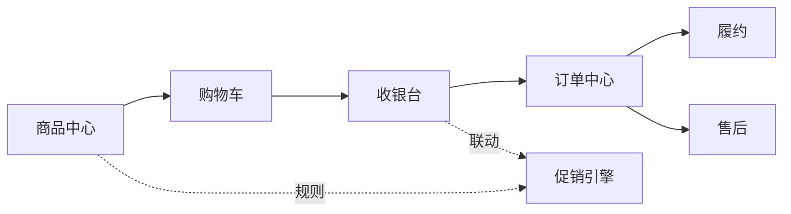
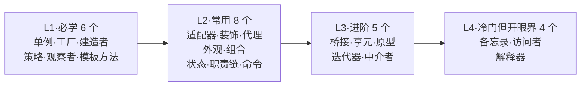
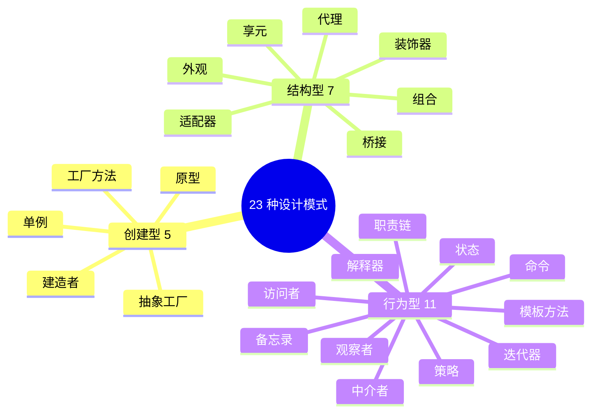
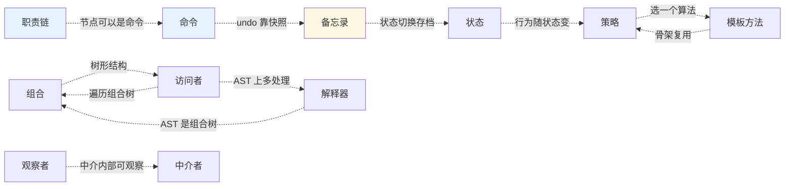

# 23种设计模式概括

#### 目录介绍

- [00.本专栏的特色](#00本专栏的特色)
- [01.主线案例：一个电商系统](#01主线案例一个电商系统)
- [02.阅读路径推荐](#02阅读路径推荐)
- [03.23 模式速查地图](#0323-模式速查地图)
- [04.创建型模式](#04创建型模式)
  - [4.1 单例模式](#41-单例模式)
  - [4.2 工厂模式](#42-工厂模式)
  - [4.3 建造者模式](#43-建造者模式)
  - [4.4 原型模式](#44-原型模式)
- [05.结构型模式](#05结构型模式)
  - [5.1 代理模式](#51-代理模式)
  - [5.2 桥接模式](#52-桥接模式)
  - [5.3 装饰器模式](#53-装饰器模式)
  - [5.4 适配器模式](#54-适配器模式)
  - [5.5 组合模式](#55-组合模式)
  - [5.6 享元模式](#56-享元模式)
  - [5.7 外观模式](#57-外观模式)
- [06.行为型模式](#06行为型模式)
  - [6.1 观察者模式](#61-观察者模式)
  - [6.2 模板方法模式](#62-模板方法模式)
  - [6.3 策略模式](#63-策略模式)
  - [6.4 职责链模式](#64-职责链模式)
  - [6.5 迭代器模式](#65-迭代器模式)
  - [6.6 状态模式](#66-状态模式)
  - [6.7 命令模式](#67-命令模式)
  - [6.8 备忘录模式](#68-备忘录模式)
  - [6.9 中介者模式](#69-中介者模式)
  - [6.10 访问者模式](#610-访问者模式)
  - [6.11 解释器模式](#611-解释器模式)

---

## 00.本专栏的特色

市面上的设计模式文章绝大多数是"**模式定义 → UML 图 → 通用例子 → 优缺点**"——单篇读着都懂，合上书还是不知道在自己的项目里到底什么时候用、和别的模式怎么配合。

本专栏不同的地方有四点：

1. **一条主线、贯穿 23 篇**：所有模式都用同一个**电商系统**作为引子，模式之间不再各自孤立；
2. **事故驱动 + 失败探索**：每篇先用真实事故建立痛点共鸣，再展示 3 次"直觉实现"为何失败，最后才引出模式标准答案——知道"为什么不用那个"比"记住这个怎么写"更重要；
3. **每篇都有"模式联动"章节**：明确指出它和已学模式的关系（替代/互补/组合），把零散的 23 个模式连成网；
4. **决策树 + 速查表**：选型的"什么时候用/什么时候不用"被显式画成决策图，不是埋在文字里。

---

## 01.主线案例：一个电商系统

我们假设要做这样一个电商系统，所有模式都从中找到自己的位置：

| 子域 | 主要痛点 | 登场模式 |
|------|----------|----------|
| 商品中心 | 大量相似对象、复杂构造 | 单例、工厂、建造者、原型、享元 |
| 购物车/收银台 | 多组件高频联动 | 中介者、观察者、命令 |
| 订单中心 | 状态机、多步前置/后置动作 | 状态、职责链、命令、备忘录 |
| 履约/售后 | 多种 SKU 的多种操作 | 访问者、组合、迭代器 |
| 促销引擎 | 规则频繁变化、可配置 | 策略、模板方法、解释器 |
| 跨切面 | 适配三方接口、加日志/限流/缓存 | 适配器、代理、装饰器、外观、桥接 |

---

## 02.阅读路径推荐

- **3 天速通**：只看 L1，能看懂大部分开源代码；
- **2 周入门**：L1 + L2，覆盖 80% 项目场景；
- **1 个月精通**：23 篇全跑一遍，结合主线案例自己写一个 demo。

---

## 03.23 模式速查地图

每篇文末都有**"模式联动"小节**，展示该模式与同组/跨组模式的关系——这才是把零散模式连成"工程能力"的关键。

---

## 04.创建型模式

> 创建型模式对实例化过程进行抽象，将**对象的创建与使用分离**，让系统在"创建什么、谁创建、何时创建"三个维度获得灵活性。

### 4.1 单例模式

**一句话**：一个类只允许创建一个实例，全局唯一访问点。

**电商场景**：配置管理器、数据库连接池——全系统只需要一份。

**常见实现**：饿汉式、懒汉式、双重检测锁、静态内部类、枚举（推荐）。

**主要争议**：单例对 OOP 支持不友好、隐藏类间依赖、对扩展性和可测试性有副作用。**克制使用**——不是所有的"只用一份"都需要单例。

### 4.2 工厂模式

**一句话**：通过工厂类封装对象创建逻辑，根据参数决定创建哪种类型的对象。

**电商场景**：根据支付方式（微信/支付宝/银行卡）创建对应的支付处理器。

**简单工厂 vs 工厂方法**：创建逻辑简单 → 简单工厂（一个工厂类 + switch）；创建逻辑复杂 → 工厂方法（每种产品一个工厂子类）。

**四个作用**：封装变化、代码复用、隔离复杂性、控制职责单一。

### 4.3 建造者模式

**一句话**：分步构建复杂对象，通过可选参数"定制化"创建。

**电商场景**：创建订单——必填（用户+商品）、可选（优惠券/积分/备注/发票）。

**适用信号**：必填属性多导致构造函数参数过长；属性间有依赖约束需一次性校验；需要创建不可变对象。

### 4.4 原型模式

**一句话**：通过复制已有对象（原型）来创建新对象，节省创建成本。

**电商场景**：基于模板 SKU 快速创建相似商品——大部分字段相同，只改价格和库存。

**关键**：深拷贝 vs 浅拷贝。Java 实现 `Cloneable` 接口，注意可变引用字段的深拷贝。

---

## 05.结构型模式

> 结构型模式描述如何**将类或对象组合成更大的结构**——像搭积木，通过简单组合形成复杂且功能强大的结构。

### 5.1 代理模式

**一句话**：为原始类定义代理类，**控制访问**而非增强功能——这是与装饰器的核心区别。

**电商场景**：订单查询加缓存代理——先查缓存，未命中再查数据库。

**静态代理 vs 动态代理**：静态代理需为每个类写代理类（代码重复）；动态代理运行期动态创建（JDK Proxy / CGLIB）。

**典型应用**：监控、鉴权、限流、事务、RPC 客户端、缓存。

### 5.2 桥接模式

**一句话**：将抽象与实现解耦，让它们能独立变化——本质是"**组合优于继承**"的体现。

**电商场景**：通知渠道（短信/邮件/推送）× 通知类型（营销/系统/验证码）——两个维度独立变化时，用桥接避免 M×N 的子类爆炸。

### 5.3 装饰器模式

**一句话**：通过组合给原始类**增强功能**——与代理的区别：代理控制访问，装饰增强功能。

**电商场景**：订单价格计算器 → 包装上"满减装饰器"→ 再包装"会员折扣装饰器"→ 层层叠加。

**关键**：装饰器类需与原始类继承相同接口，支持嵌套多层装饰。

### 5.4 适配器模式

**一句话**：将不兼容的接口转换为可兼容的接口——**事后补救策略**。

**电商场景**：对接第三方物流——顺丰/圆通接口格式不同，统一适配为 `LogisticsAdapter`。

**五种应用场景**：封装有缺陷接口、统一多个类接口、替换外部系统、兼容老版本、适配不同数据格式。

### 5.5 组合模式

**一句话**：将对象组织成**树形结构**，统一处理单个对象和组合对象。

**电商场景**：商品分类树——"手机"下有"iPhone"和"安卓"，每层结构相同。

**适用前提**：数据能表示成树形结构（文件系统、组织架构、菜单、AST）。

### 5.6 享元模式

**一句话**：复用不可变对象，节省内存——"**共享的单元**"。

**电商场景**：商品规格属性（颜色/尺码）——"红色"在所有商品里是同一个对象，不重复创建。

**前提**：享元对象必须是不可变对象；区分内部状态（共享）和外部状态（传递）。

### 5.7 外观模式

**一句话**：为多个复杂子系统提供一个**统一入口**，屏蔽内部细节。

**电商场景**：`OrderFacade.placeOrder()` 内部依次调用库存/支付/物流/通知等多个服务，调用方只调一个方法。

**与中介者的区别**：外观是单向简化入口，中介者是双向多对多协调。

---

## 06.行为型模式

> 行为型模式关注**对象之间的职责划分和协作方式**——不仅关注结构，更关注交互。

### 6.1 观察者模式

**一句话**：一对多依赖关系——被观察者状态变化时，所有观察者自动收到通知。

**电商场景**：订单支付成功 → 自动触发短信通知、积分增加、库存扣减。

**实现方式**：同步阻塞（代码解耦）、异步非阻塞（提高效率）、跨进程（消息队列）。EventBus 和消息队列是观察者模式的容器设计实战。

### 6.2 模板方法模式

**一句话**：在父类定义算法骨架，子类实现可变步骤——**复用 + 扩展**。

**电商场景**：订单处理流程固定（校验→扣库存→生成单→通知），不同商品类型在"校验"这一步有差异。

**与策略/回调的区别**：模板基于继承，策略基于接口+组合，回调基于组合——回调更灵活。

### 6.3 策略模式

**一句话**：定义一族可互换的算法，运行时动态选择——**避免 if-else 膨胀**。

**电商场景**：促销计算——满减/折扣/N 件 N 折/赠品，每种促销一个策略类。

**三要素**：策略定义（接口+实现）、策略创建（工厂类）、策略使用（运行时选择）。**最大价值**：新增策略零侵入已有代码。

### 6.4 职责链模式

**一句话**：多个处理器串联成链，请求沿链传递，任一节点可拦截——**接力处理 + 短路控制**。

**电商场景**：下单前置校验链——登录→风控→库存→优惠券→价格→限流，任何一步失败则中断。

> 📖 详见 [17.职责链模式设计思想](https://yccoding.com/pages/dc416d/)

**两种变体**：纯职责链（命中即止，如审批流）、过滤链（全员执行，如 Servlet Filter）。4 种实现：GoF 经典 / Servlet Filter / OkHttp 洋葱模型 / Spring Security FilterChain。

### 6.5 迭代器模式

**一句话**：将集合遍历与集合本身解耦——**for-each 的本质**。

**电商场景**：遍历商品列表、遍历订单明细——不关心底层是数组、链表还是树。

**核心三优势**：封装复杂数据结构、职责分离（集合只管存、迭代器只管遍历）、新增遍历算法零侵入。

**注意**：遍历过程中增删元素会导致 fail-fast——Java 集合的 `ConcurrentModificationException` 即为此设计。

### 6.6 状态模式

**一句话**：行为随内部状态变化——每个状态独立成一个类，**状态机面向对象表达**。

**电商场景**：订单状态机——待支付→已支付→已发货→已收货→已完成，每状态只允许特定操作。

> 📖 详见 [19.状态模式设计思想](https://yccoding.com/pages/a0f4be/)

**三种实现**：分支法（if-else，≤3 状态）、查表法（状态多但动作简单）、状态模式（动作复杂、多团队）。核心收益：新增状态 = 新建一个状态类，零侵入已有代码。

### 6.7 命令模式

**一句话**：将方法调用封装成对象——**让调用变得可存储、可调度、可撤销**。

**电商场景**：支付后置链——扣库存/加积分/发短信/推 Push，每个动作为一个命令对象。

> 📖 详见 [18.命令模式设计思想](https://yccoding.com/pages/1a6dc8/)

**三种实现**：内存队列（非关键任务）、MQ 消费者（削峰）、WAL 日志 + 状态机（金融级）。**最大价值**：崩溃后可从命令日志精确恢复——这是数据库 redo/undo log 和 Git commit 的底层原理。

### 6.8 备忘录模式

**一句话**：不破坏封装的前提下拍快照 + 回滚——**不开盒地存档读档**。

**电商场景**：运营编辑订单误操作——一键撤回，订单回到修改前的状态。

> 📖 详见 [20.备忘录模式设计思想](https://yccoding.com/pages/9cf38a/)

**三角色**：Originator（创快照+恢复）、Memento（不透明快照）、Caretaker（只管存取）。vs 原型：备忘录用于同一对象回滚，原型用于创建新对象。

### 6.9 中介者模式

**一句话**：将多对多网状协作变为星型——**组件只识主持人，规则一处编排**。

**电商场景**：收银页 6 组件互联动（商品/券/积分/配送/总价/按钮）→ CheckoutMediator 统一编排。

> 📖 详见 [21.中介者模式设计思想](https://yccoding.com/pages/606076/)

**三种实现**：集中单中介（≤10 组件）、多中介分层（>10 组件）、中介+命令联动（需审计撤销）。**最大坑**：中介超过 300 行必须按子域拆分，否则变成上帝类。

### 6.10 访问者模式

**一句话**：元素稳定 + 操作多变——把操作维度从数据维度中正交分离。

**电商场景**：4 种 SKU × 多团队操作（财务算税/物流算运费/风控算风险）→ 每个团队一个 Visitor。

> 📖 详见 [22.访问者模式设计思想](https://yccoding.com/pages/a0c2f9/)

**核心机制**：双分派（Double Dispatch）——`accept(visitor)` → `visitor.visit(this)` 两步精确定位。

**硬约束**：**元素类型必须稳定**——如果频繁新增元素类型，不要用访问者，用策略+注册表。

### 6.11 解释器模式

**一句话**：规则变数据、代码成引擎——**AST 节点对象化 + 递归自解释**。

**电商场景**：促销规则频繁变化——`"level >= 3 AND amount > 500"` 存在配置中心，Parser 解析为 AST 后解释执行。

> 📖 详见 [23.解释器模式设计思想](https://yccoding.com/pages/10c897/)

**三种实现**：手写递归下降 Parser（简单语法）、成熟引擎 SpEL/Aviator（Spring 项目）、ANTLR 自动生成（复杂语法）。**关键**：AST 必须缓存——每次请求重新解析性能无法接受。

**🔄 模式联动总览**：

---

> **23 种 GoF 设计模式到此完结。** 三句最重要的话：
>
> 1. **模式是工具，不是目的**——为已有的痛点找模式，不要为模式创造痛点。
> 2. **先写直觉代码，再审视"这段代码三年后会不会成为别人的噩梦"**——答案经常藏在模式里。
> 3. **克制使用模式比堆砌模式更重要**——用在一个最痛的地方，比用在所有地方有价值 100 倍。
