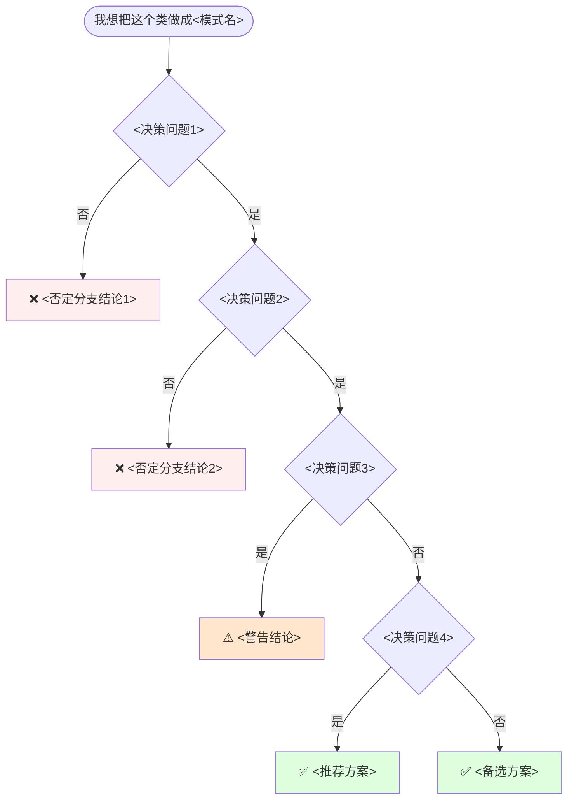
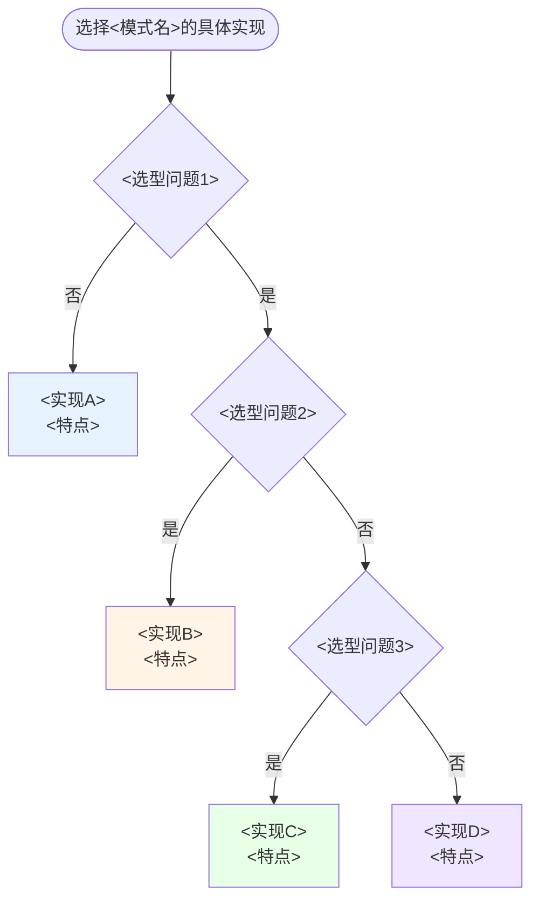

# 第X卷第Y章：<模式名称>设计思想

> 一句话概括：用一个真实的<事故/场景>，串起一种设计模式的诞生、演化与边界。

## 📚 渐进学习节奏

本篇采用「事故复盘 → 失败探索 → 模式诞生 → 效果对比 → 反面踩坑 → 选型决策」的节奏：

```
第①步：感受痛  →  01 <场景>：一次真实的<事故/痛点>
第②步：试错路  →  02 探索：X 次直觉式实现，为什么都不行
第③步：模式登场 →  03 <模式>基础（认识它）
第④步：多种实现 →  04 渐进对比（实现A / 实现B / ...）
第⑤步：用前用后 →  05 效果对比（数据说话）
第⑥步：黑暗面   →  06 反面踩坑实录（X 个真实事故）
第⑦步：会选型   →  07 决策树与选型清单
第⑧步：内化     →  08 总结与延伸
```

必须保证800以上行的内容，才能保证内容完整。

⚠️ 千万别只看 04 节。**懂"为什么需要"和"什么时候不该用"，比记住 X 种写法重要得多。**

## 📋 目录快速导航

- [01.<案例引入标题>](#01<案例引入锚点>)
  - [1.1 痛点现场](#11-痛点现场)
  - [1.2 直觉实现复现](#12-直觉实现复现)
  - [1.3 问题根源拆解](#13-问题根源拆解)
  - [1.4 引出本篇主角](#14-引出本篇主角)
- [02.X次失败探索](#02x次失败探索)
  - [2.1 尝试方案A](#21-尝试方案a)
  - [2.2 尝试方案B](#22-尝试方案b)
  - [2.3 尝试方案C](#23-尝试方案c)
  - [2.4 终于引出<模式名>](#24-终于引出<模式名>)
- [03.<模式名>基础介绍](#03<模式名>基础介绍)
  - [3.1 从失败中提炼需求](#31-从失败中提炼需求)
  - [3.2 <模式名>的标准骨架](#32-<模式名>的标准骨架)
  - [3.3 典型使用场景](#33-典型使用场景)
- [04.X种实现对比](#04x种实现对比)
  - [4.1 实现核心要点](#41-实现核心要点)
  - [4.2 实现A](#42-实现a)
  - [4.3 实现B](#43-实现b)
  - [4.N X种实现速查表](#4n-x种实现速查表)
- [05.用前用后效果对比](#05用前用后效果对比)
  - [5.1 维度A对比](#51-维度a对比)
  - [5.2 维度B对比](#52-维度b对比)
  - [5.N 核心收益](#5n-核心收益)
- [06.反面踩坑实录](#06反面踩坑实录)
  - [6.1 踩坑A](#61-踩坑a)
  - [6.2 踩坑B](#62-踩坑b)
  - [6.N 替代方案汇总](#6n-替代方案汇总)
- [07.决策树与选型](#07决策树与选型)
  - [7.1 该不该用<模式名>](#71-该不该用<模式名>)
  - [7.2 选哪种实现方式](#72-选哪种实现方式)
  - [7.3 选型清单速查](#73-选型清单速查)
- [08.总结与延伸](#08总结与延伸)
  - [8.1 设计思想沉淀](#81-设计思想沉淀)
  - [8.2 模式联动边界](#82-模式联动边界)
  - [8.3 思考题与延伸](#83-思考题与延伸)


## 01.<案例引入标题>

> **本篇主线**：跟着我用一个真实<事故/场景>的复盘视角，看清"为什么需要<模式名>"。所有代码示例都围绕一个 `<核心载体类>` 展开——它是<模式名>最经典、最贴近开发的载体。

### 1.1 痛点现场

**【真实场景还原】** <时间、告警、事故描述>：

<2-3 句话描述事故规模、损失、影响面>。

<定位代码的 1-2 句话>：

```<语言>
// 事故现场定位到的最短代码片段（3-10 行）
<代码片段>
```

这就是本篇要讲的故事的起点：**一段直觉式写出来的"<类名>"代码，是怎么把<系统/场景>干翻的**。

### 1.2 直觉实现复现

**【你也能写出这种代码】**，一个新人<入职/接手>，要<实现某个功能>，第一反应往往是这样：

```<语言>
// 业务类的"直觉实现"（15-30 行，展示问题代码全貌）
<事故代码>
```

**🧪 跑一下，亲眼看到 bug**

```<语言>
// 最小复现代码（10-20 行）
<复现代码>
```

事故现场重现完毕——**<一句话概括根因>**。

**💭 N 个反思题**（先别往下看，自己想 30 秒）：

1. <为什么出错?>
2. <如果放大到 N 倍，会怎样?>
3. <简单的方法能解决吗?>

### 1.3 问题根源拆解

**【画一张图就清楚了】**

```mermaid
flowchart LR
    <依赖关系图，展示根因（红色标记问题节点）>
    style <问题节点> fill:#fee
```

每个<调用方/实例>都<各自做了什么>，互不感知，这就埋下了 N 类隐患：

| 隐患 | 现象 | 业务影响 |
|------|------|---------|
| **<隐患1>** | <具体表现> | <业务后果> |
| **<隐患2>** | <具体表现> | <业务后果> |
| **<隐患3>** | <具体表现> | <业务后果> |

**� 核心矛盾**：业务上"<应该怎样>"，但代码层面没有任何机制保证。

### 1.4 引出本篇主角

> **<模式名>的核心思想**：<一句话定义——它把什么权力从哪方收回来、保证什么、提供什么>。

```mermaid
flowchart LR
    <调用方1> --> S[<核心载体> <模式名><br/><收益1><br/><收益2>]
    <调用方2> --> S
    <调用方3> --> S
    <变更入口> -.直接生效.-> S
    style S fill:#dfd
```

<模式>的<变体/实现/权衡>——这正是本篇要拆解的。

但是！**先别急着看实现**。下一节，我们先看看新人通常会先尝试哪些"看起来很合理"的方案，并理解它们为什么都不够好。


## 02.X次失败探索

> **为什么要学这一节**：直接给你"标准答案"是很容易的，但你要知道，<模式名>不是凭空发明的——它是**前人走过 X 条死路之后才提炼出来的**。走过这些死路，你才会真正理解为什么代码长那个样子。

### 2.1 尝试方案A

**【新人方案①：<描述方案>】**

```<语言>
// 方案A代码（10-15 行）
<代码>
```

**🧪 跑一下，看会出什么问题**

```<语言>
// 验证代码（10-15 行）
<代码>
```

**❌ 失败原因**：<1-2 句话说明为什么失败>。

**💡 反思**：我们需要的<是什么>。

### 2.2 尝试方案B

**【新人方案②：<描述方案>】**

```<语言>
// 方案B代码
<代码>
```

**🧪 跑一下，会发现隐藏问题**

```<语言>
// 验证代码
<代码>
```

**❌ 失败原因**：<1-3 点核心原因>。

**💡 反思**：我们既要<需求A>，又要<需求B>。

### 2.3 尝试方案C

**【新人方案③：<描述方案>】**

```<语言>
// 方案C代码
<代码>
```

**🧪 跑一下，看会怎样**

```<语言>
// 验证代码
<代码>
```

**❌ 失败原因**：<1-2 句话>。

**💡 反思**：必须<更根本的约束>。

### 2.4 终于引出<模式名>

**【X 次失败之后，需求清单收敛了】**

| 必须满足 | 来自哪一次失败 |
|---------|-------------|
| ① <约束1> | 2.1 <方案A> |
| ② <约束2> | 2.2 <方案B> |
| ③ <约束3> | 2.3 <方案C> |
| ④ <约束4> | 1.2 真实事故 |

**【<模式名>的标准答案】**

```<语言>
// 满足所有约束的最简代码（10-20 行，每行注释对应上表编号）
<代码>
```

短短几行，**同时回答了上面 N 个需求**。这就是<模式名>的"灵魂代码"。


## 03.<模式名>基础介绍

### 3.1 从失败中提炼的需求

回顾 02 节，我们试了<列举所有失败方案>——**全部失败**。现在拿着这些失败报告，问自己一个问题：

> <一句话——如果我要写一个能跑 3 年不崩的 XXX，它必须满足哪几条硬约束？>

把这些约束写下来，就自然得到了<模式名>的设计清单：

| 约束 | 来自 | 代码体现 |
|:---|:---|:---|
| ① <约束1> | <哪个失败方案> | <对应的代码写法> |
| ② <约束2> | <哪个失败方案> | <对应的代码写法> |
| ③ <约束3> | <哪个失败方案> | <对应的代码写法> |
| ④ <约束4> | <哪个阶段> | <对应的代码写法> |

### 3.2 <模式名>的标准骨架

上面 X 条约束翻译成代码，**所有实现变体共用一个骨架**：

```<语言>
// 标准骨架代码（15-25 行，注释标注对应约束编号）
<代码>
```

**三句话记住**：<三要素1> → <三要素2> → <三要素3>。差异全在 <可变点> 里——<差异描述>——这就是下一节 X 种实现的核心分岔。

### 3.3 典型使用场景（用核心载体验证）

不是所有"我只用一次"的类都适合<模式名>。核心判断标准是：<一句判断准则>。以下场景用本篇核心载体验证：

- **<场景1>**：<为什么适合，和核心载体的故事有什么关联>
- **<场景2>**：<为什么适合>
- **<场景3>**：<为什么适合>

> **反面提醒**：<场景A>、<场景B>虽然常被误用，但它们不是"<准则>描述的那种"——参考 06 节踩坑实录。


## 04.X种实现对比

### 4.1 实现核心要点

X 种写法本质上是在 **<维度1> / <维度2> / <维度3>** 上的不同取舍。实现<模式名>只需两行骨架代码：

```<语言>
<骨架代码1>                           // ① <说明>
<骨架代码2>                           // ② <说明>
```

差异全在 <可变点> 里——<差异描述>。下面按演进顺序逐一展开，最后在 [7.2 节](#72-选哪种实现方式) 会有一张决策图帮你快速定位。

X 种实现的完整选型决策图见 → [7.2 选哪种实现方式](#72-选哪种实现方式)

### 4.2 实现A

**设计权衡**：用"<牺牲什么>"换"<获得什么>"。

**选它的理由**：<1-2 句话，什么场景下选它>。

```<语言>
// 实现代码（10-20 行）
<代码>
```

**技术分析**：

- <要点1>
- <要点2>
- <缺点/边界>


### 4.3 实现B

**设计权衡**：用"<牺牲>"换"<获得>"。

起步版（不安全）：

```<语言>
// 问题版本代码
<代码>
```

<为什么不安全，1-2 句话解释>。

修复版：

```<语言>
// 修复版本代码
<代码>
```

**关键判断**：<这个实现的取舍结论，什么场景适用>。


### 4.N X种实现速查表

| 实现方式 | <维度1> | <维度2> | <维度3> | <维度4> | 推荐度 |
|---------|--------|--------|--------|---------|------|
| 实现A | ✅ | ❌ | ❌ | ❌ | ⭐⭐⭐⭐ |
| 实现B | ✅ | ✅ | ❌ | ❌ | ⭐⭐⭐⭐ |
| 实现C | ✅ | ✅ | ❌ | ❌ | ⭐⭐⭐⭐⭐ |
| 实现D | ✅ | ❌ | ✅ | ✅ | ⭐⭐⭐⭐⭐ |

**📌 一句话决策**：<场景A>首选**<实现X>**，<场景B>选**<实现Y>**，<场景C>选**<实现Z>**。


## 05.用前用后效果对比

> **为什么单独留一节做对比**：很多人记住了"<模式名>"几个字，却没算过它到底"省"了多少。下面用 1.x 节的核心载体做基准，跑 N 组对比实验，让数据替你回答"为什么要用"。

### 5.1 <维度A>对比

**实验设定**：<描述实验条件>。

```<语言>
// ❌ 用前：<旧方式>
<代码片段>

// ✅ 用后：<新模式>
<代码片段>
```

**📊 实测数据**：

| 指标 | 用前 | 用后 | 差距 |
|------|------|------|------|
| <指标1> | <数据> | <数据> | **N×** |
| <指标2> | <数据> | <数据> | **N×** |

### 5.2 <维度B>对比

**实验设定**：<描述>

```<语言>
// ❌ 用前
<代码>

// ✅ 用后
<代码>
```

**📊 实测数据**：

| 指标 | 用前 | 用后 | 加速比 |
|------|------|------|-------|
| <指标> | <数据> | <数据> | **N×** |

> 这不是凑数据——某真实项目<一个具体案例>。

### 5.3 核心收益

**🔑 核心收益**：<模式名>把"<什么事情>"这件事封装在了<哪里>，调用方只关心"怎么用"，不关心"谁来造"——这才是<模式名>真正的价值，而不是"<表面收益>"。


## 06.反面踩坑实录

> **为什么有这一节**：01 节让你看到"不用<模式名>的痛"，但<模式名>本身**也不是银弹**。本节用 N 个真实事故告诉你"乱用的痛"，比理论上反复说"违反 OOP"更有说服力。

### 6.1 踩坑A

**【真实事故】**，<一句话描述事故背景>：

```<语言>
// 事故代码（15-25 行）
<代码>
```

**💣 事故现场**：

```<语言>
// 复现代码（10-15 行）
<代码>
```

**📌 教训**：<一句话教训>。

**✅ 正解**：<正确做法 + 代码（10-20 行）>。


### 6.2 踩坑B

**【真实事故】**，<描述>：

```<语言>
// 事故代码
<代码>
```

**💣 事故现场**：<复现描述>。

**📌 教训**：<教训>。

**✅ 正解**：<正确做法>。


### 6.N 替代方案汇总

如果你看完上面 N 个踩坑还在心虚——别怕，绝大部分场景都能被这三种方案替代：

| 你的需求 | 推荐方案 |
|---------|---------|
| <条件1> | ✅ <方案1> |
| <条件2> | ✅ <方案2> |
| <条件3> | ✅ <方案3> |
| <条件4> | <方案4> |


## 07.决策树与选型

> 经过前面 6 节的铺垫，是时候给一张能"贴在工位上"的决策图了。

### 7.1 该不该用<模式名>



### 7.2 选哪种实现方式

如果决策树走到了"用 <模式名>"，再用下面这张图选实现：



### 7.3 选型清单速查

| 场景 | 该用吗 | 推荐方式 |
|------|------|---------|
| <场景1> | ✅ 该用 | <推荐> |
| <场景2> | ✅ 该用 | <推荐> |
| <场景3> | ⚠️ 有条件用 | <条件+推荐> |
| <场景4> | ❌ 别用 | <替代方案> |


## 08.总结与延伸

### 8.1 设计思想沉淀

回顾本篇 1 → 7 节的旅程，<模式名>真正教会我们的是这套思考模型：

| 阶段 | 学到了什么 |
|------|----------|
| **01 <场景引入>** | 痛点是模式诞生的土壤——没有真实的痛，模式就是空中楼阁 |
| **02 X次失败** | <方案A>、<方案B>、<方案C>都不够——模式是从"试错"中收敛出来的 |
| **03 模式基础** | 三大要点：<要素1>、<要素2>、<要素3> |
| **04 X种实现** | 实现差异本质是"<维度1> / <维度2> / <维度3>"的不同权衡 |
| **05 效果对比** | 数据说话：<核心数据结论> |
| **06 反面踩坑** | <模式名>不是免死金牌，<踩坑清单> |
| **07 决策树** | 工程师的成熟度，不在于会写多少种实现，而在于知道"什么时候不写" |

**🔑 一句话核心**：

> <模式名>是用来<管理/解决>"<核心边界条件>"的<稀缺资源/问题的>，**不是<常见的误用形式>**。

### 8.2 模式联动边界

<模式名>从来不是孤立存在的，它和其他模式有千丝万缕的关系：

```mermaid
flowchart LR
    <模式A> -.关系描述.-> <模式B>
    <模式C> -.关系描述.-> <模式D>
```

| 模式 | 关系 | 一句话区别 |
|------|------|----------|
| **<相关模式1>** | <关系> | <一句话区别> |
| **<相关模式2>** | <关系> | <一句话区别> |
| **<相关模式3>** | <关系> | <一句话区别> |

### 8.3 思考题与延伸

**💭 三道思考题**（建议手写答案，再对照回顾本文）：

1. <思考题1>（提示：回看 X.X 节）
2. <思考题2>
3. <思考题3>

**📚 延伸阅读**：
- <推荐阅读1>
- <推荐阅读2>
- <推荐阅读3>

> **上一篇** [<上一章>](<链接>) → **本篇** → [<下一章>](<链接>)：<下一章主题的预告>。


---

## 🛠 模版使用指南

### 章节精简策略（按文档重要程度）

| 章节 | 重要性 | 可精简程度 | 说明 |
|:---|:---|:---|:---|
| 01 案例引入 | ⭐⭐⭐⭐⭐ | 不可精简 | 必须用真实事故建立痛点共鸣 |
| 02 失败探索 | ⭐⭐⭐⭐⭐ | 不可精简 | 没有"为什么不行"就没有"为什么这样写" |
| 03 模式基础 | ⭐⭐⭐⭐ | 可适当压缩 | 核心骨架必须在，场景可合并 |
| 04 实现对比 | ⭐⭐⭐⭐ | 可合并同类 | 结构相似的实现可压缩，避免重复模板 |
| 05 效果对比 | ⭐⭐⭐ | 可精简 | 核心数据必须有，子维度可合并 |
| 06 反面踩坑 | ⭐⭐⭐⭐ | 维护性保留 | 每则踩坑保留"事故→教训→正解"三段式 |
| 07 决策树 | ⭐⭐⭐⭐⭐ | 不可精简 | 这是全篇最有工程价值的部分 |
| 08 总结延伸 | ⭐⭐⭐ | 可精简 | 沉淀表格保留，联动/延伸可简化 |

### 叙事三要素（每节必备）

| 要素 | 标记 | 示例 |
|:---|:---|:---|
| **探索/提问** | `🧪` / `💭` | "跑一下，看会出什么问题" / "想 30 秒，自己回答" |
| **论证** | 代码 + 表格 + 图 | 前后对比表 / 实测数据 / mermaid 流程图 |
| **结论** | `> 引用块` / `📌` | 一句话总结 + 引出下一节的问题 |

### 代码块规范

- **事故代码**：不加注释行号，让读者一眼看到"烂在哪"
- **复现代码**：用 `🧪 跑一下` 做标题，必须能直接运行
- **方案代码**：在关键行用 `// ①` `// ②` 标注对应约束编号
- **正解代码**：对比旧写法，突出"变好了什么"

### 表格规范

- **对比表**：用前 vs 用后，数据驱动
- **速查表**：用 emoji（✅❌⚠️⭐）提升扫读效率
- **结论表**：最后一行必须是 actionable 的一句话决策
