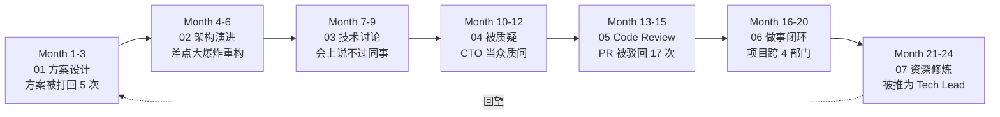
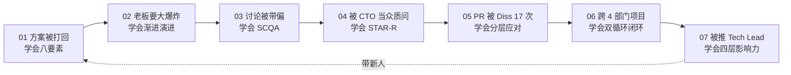
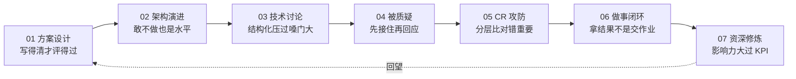
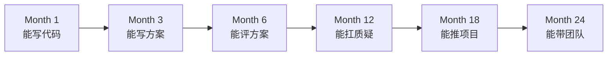

# 程序员精进之路 · 7 篇职场硬技能之旅

> 写代码只是入门，能在职场把事情"设计好、推动完、扛得住"，才叫资深。

## 系列导读

技术能力决定了你**能不能干**，软技能决定了你**能干到多高**。三年到十年是程序员分水岭：一部分人成了"更快的编码者"，另一部分人成了**方案的拍板者、评审的定海神针、跨团队的推进者**。差距不在算法，在这 7 篇讨论的场景。

本系列不讲情商鸡汤，只讲**能落到工位上的动作**：技术方案怎么写才被通过、架构演进怎么决策才不翻车、被 CTO 当众质疑怎么回应、Code Review 被 Diss 怎么破、跨部门怎么把事情做到闭环、如何在 5 年后被叫"老师"而不是"老油条"。

## 主线人物：张伟的 24 个月

7 篇串成**一个人的成长时间线**——工程师张伟，3 年经验，从"能干活"到"能拍板"的 24 个月：

每篇都从**张伟遇到的一次真实翻车**开篇，跟着他从"被打脸"到"打回去"，再到"不再需要打"。

## 文档目录

| 编号 | 文档 | 核心场景 | 关键动作 | 难度 |
|:--:|------|---------|---------|:--:|
| 01 | [技术方案设计能力](https://yccoding.com/pages/a2d1f9/) | 方案评审现场被 5 连问 | 方案八要素模板、可评审性、Trade-off 表格、方案陈述三段式、方案反模式六种、写完自检 15 条 | ⭐⭐⭐ |
| 02 | [架构演进决策能力](https://yccoding.com/pages/b3e20a/) | 老板要一次性重写 | 渐进演进四原则、可逆决策 vs 不可逆决策、Trade-off 定量表达、演进节奏拆分、时间/风险/收益三轴决策图、"先不做"也是决策 | ⭐⭐⭐ |
| 03 | [技术讨论表达能力](https://yccoding.com/pages/c4f31b/) | 会上被同事带节奏 | 讨论四种模式、SCQA 结构化表达、异议表达三段式、白板法引导讨论、把冲突变共识五步、静音者与暴躁者应对 | ⭐⭐⭐ |
| 04 | [应对技术质疑能力](https://yccoding.com/pages/d5042c/) | CTO 当众质问方案 | 质疑五种类型识别、STAR-R 回应结构、"我不知道"的正确说法、情绪与事实分离、化质疑为背书、场后跟进闭环 | ⭐⭐⭐⭐ |
| 05 | [代码审查攻防能力](https://yccoding.com/pages/e6153d/) | PR 被 Diss 17 次 | 收 Diss 五级分类、就事回击 vs 让步升级、评审别人的黄金句式、Nit/Question/Blocker 分层、Review 反模式六种、把 Review 变成教学场 | ⭐⭐⭐ |
| 06 | [做事闭环执行能力](https://yccoding.com/pages/f7264e/) | 跨 4 部门项目卡死 | PDCA 与 OODA 双循环、拿结果 vs 交付物区分、向上同步 3-3-3 节奏、跨部门推进四抓手、复盘不甩锅五步、烂尾项目救火 | ⭐⭐⭐⭐ |
| 07 | [资深程序员软能力](https://yccoding.com/pages/a8375f/) | 被推为 Tech Lead | 影响力四层模型、技术判断力训练法、导师意识与放权、职业韧性抗压六招、资深六个错觉、10 年后仍在场的秘密 | ⭐⭐⭐⭐ |

## 学习方法

本系列延续**疑惑→答疑→论证→结论**的教学模式：

1. **疑惑**：从张伟遇到的真实翻车场景切入，先痛后学
2. **答疑**：给出软技能层面的根本解法（不是"多沟通"这种废话）
3. **论证**：通过对话脚本、决策表、反模式清单深入拆解
4. **结论**：产出可以立刻在下次会议、下个 PR、下次汇报中使用的**动作清单**

## 主线连贯性

每篇结尾会留下一个"下一集预告"——张伟解决了本篇问题后，紧接着遭遇下一篇的挑战。7 篇形成一部**职场连续剧**：

**读完全系列的收获**：你会拥有一份"职场肌肉记忆"——下次开会、下次评审、下次被质问时，脑子里会自动跳出一套动作，而不是"回家路上才想起当时应该怎么说"。

## 适合人群

| 人群 | 收获 |
|---|---|
| 3-5 年工程师 | 补齐软技能短板，从"能干活"升级到"能拍板" |
| 5-8 年高工 | 系统化沉淀已有经验，拿到 Tech Lead / 架构师门票 |
| 转型 Tech Lead | 从"最强 coder"过渡到"最强推动者"的动作库 |
| 想跳槽涨薪者 | 面试终面 60% 考察的是这些能力，不是算法 |
| 长期职业规划者 | 看清"10 年后仍在场"的程序员到底做对了什么 |

## 与其他专栏的关系

| 专栏 | 关系 |
|---|---|
| [面向对象设计](https://yccoding.com/pages/ff0407/) | 底层技术功底，硬技能地基 |
| [设计原则](https://yccoding.com/pages/design-principle/) | 代码级判断力，本系列进阶到方案级 |
| [设计模式](https://yccoding.com/pages/design-pattern/) | 具体招式，本系列讲"招式之外的分寸" |
| [系统架构设计](https://yccoding.com/pages/architecture/) | 架构硬能力，本系列讲"架构之外的推动力" |
| **本系列** | 硬技能之上的**软能力护城河** |

## 快速总结

7 篇文章一站式速览。每篇一张"速通卡"：**张伟遭遇 → 常见错法 → 核心动作 → 反模式 → 落地清单**。

### 一句话定位每一篇

### 七个能力层与对应篇

| 能力层 | 核心能力 | 对应篇 |
|---|---|---|
| 输出层 | 让方案被理解、被通过 | 01 |
| 决策层 | 让架构演进不翻车 | 02 |
| 表达层 | 让观点在会议中站得住 | 03 |
| 抗压层 | 让质疑无法击穿方案 | 04 |
| 协作层 | 让代码评审变共赢 | 05 |
| 闭环层 | 让事情有始有终 | 06 |
| 影响层 | 让人愿意跟你干 | 07 |

### 张伟成长曲线

**核心命题**：技术能力让你**入场**，本系列的能力让你**留场并成为主角**。
