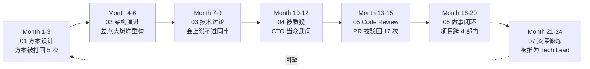
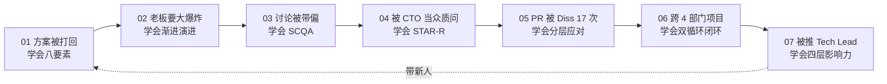
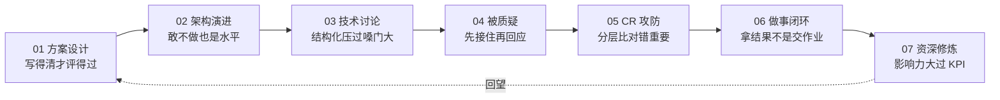
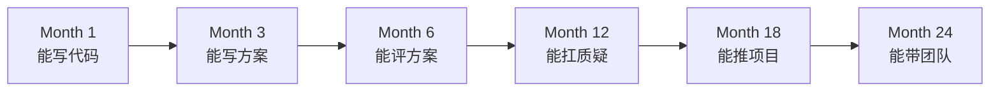
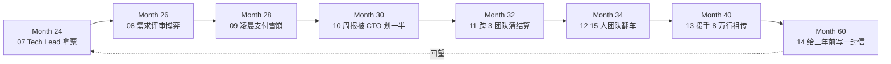
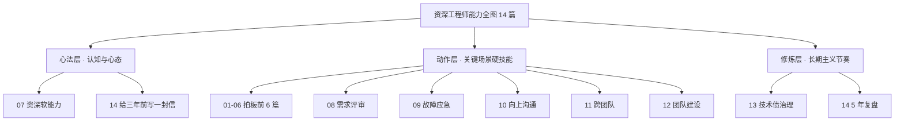
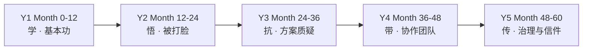

# 程序员精进之路 · 14 篇职场硬技能全景

> 写代码只是入门，能在职场把事情"设计好、推动完、扛得住、传下去"，才叫资深。

## 系列导读

技术能力决定了你**能不能干**，软技能决定了你**能干到多高**。三年到十年是程序员分水岭：一部分人成了"更快的编码者"，另一部分人成了**方案的拍板者、评审的定海神针、跨团队的推进者、遗产系统的接盘侠、团队的定盘星**。差距不在算法，在这 14 篇讨论的场景。

本系列不讲情商鸡汤，只讲**能落到工位上的动作**：技术方案怎么写才被通过、架构演进怎么决策才不翻车、被 CTO 当众质疑怎么回应、Code Review 被 Diss 怎么破、跨部门怎么把事情做到闭环、需求评审如何博弈不背锅、凌晨故障如何止血复盘、周报如何被老板一眼看懂、15 人团队如何不翻车、8 万行祖传代码如何优雅治理，以及 5 年后如何给 3 年前的自己写一封不后悔的信。

## 主线人物：糖果充的 60 个月

14 篇串成**一个人的成长时间线**——工程师糖果充，3 年经验入场，用 60 个月从"能干活"走到"能出师"。前 7 篇（Month 1-24）是"能拍板"的攻坚期，后 7 篇（Month 26-60）是"能带盘"的进阶期：

每篇都从**糖果充遇到的一次真实翻车**开篇，跟着他从"被打脸"到"打回去"，再到"不再需要打"，最后到"教别人怎么打"。

## 前 7 篇文档目录 · Month 1-24 拍板期

| 编号 | 文档 | 核心场景 | 关键动作 | 难度 |
|:--:|------|---------|---------|:--:|
| 01 | [技术方案设计能力](https://yccoding.com/pages/a2d1f9/) | 方案评审现场被 5 连问 | 方案八要素模板、可评审性、Trade-off 表格、方案陈述三段式、方案反模式六种、写完自检 15 条 | ⭐⭐⭐ |
| 02 | [架构演进决策能力](https://yccoding.com/pages/b3e20a/) | 老板要一次性重写 | 渐进演进四原则、可逆决策 vs 不可逆决策、Trade-off 定量表达、演进节奏拆分、时间/风险/收益三轴决策图、"先不做"也是决策 | ⭐⭐⭐ |
| 03 | [技术讨论表达能力](https://yccoding.com/pages/c4f31b/) | 会上被同事带节奏 | 讨论四种模式、SCQA 结构化表达、异议表达三段式、白板法引导讨论、把冲突变共识五步、静音者与暴躁者应对 | ⭐⭐⭐ |
| 04 | [应对技术质疑能力](https://yccoding.com/pages/d5042c/) | CTO 当众质问方案 | 质疑五种类型识别、STAR-R 回应结构、"我不知道"的正确说法、情绪与事实分离、化质疑为背书、场后跟进闭环 | ⭐⭐⭐⭐ |
| 05 | [代码审查攻防能力](https://yccoding.com/pages/e6153d/) | PR 被 Diss 17 次 | 收 Diss 五级分类、就事回击 vs 让步升级、评审别人的黄金句式、Nit/Question/Blocker 分层、Review 反模式六种、把 Review 变成教学场 | ⭐⭐⭐ |
| 06 | [做事闭环执行能力](https://yccoding.com/pages/f7264e/) | 跨 4 部门项目卡死 | PDCA 与 OODA 双循环、拿结果 vs 交付物区分、向上同步 3-3-3 节奏、跨部门推进四抓手、复盘不甩锅五步、烂尾项目救火 | ⭐⭐⭐⭐ |
| 07 | [资深程序员软能力](https://yccoding.com/pages/a8375f/) | 被推为 Tech Lead | 影响力四层模型、技术判断力训练法、导师意识与放权、职业韧性抗压六招、资深六个错觉、10 年后仍在场的秘密 | ⭐⭐⭐⭐ |

## 学习方法

本系列延续**疑惑→答疑→论证→结论**的教学模式：**疑惑**从糖果充的真实翻车切入，先痛后学；**答疑**给出软技能根本解法（不是"多沟通"这种废话）；**论证**通过对话脚本、决策表、反模式清单深入拆解；**结论**产出可立刻在下次会议、下个 PR、下次汇报中使用的**动作清单**。

## 主线连贯性

每篇结尾都有"下一集预告"——糖果充解决了本篇问题后，紧接着遭遇下一篇的挑战。14 篇形成一部**60 个月的职场连续剧**，前 7 篇是"拿票"，后 7 篇是"守成与传承"：

**读完全系列的收获**：你会拥有一份"职场肌肉记忆"——下次开会、下次评审、下次被质问时，脑子里会自动跳出一套动作，而不是"回家路上才想起当时应该怎么说"。

## 适合人群

| 人群 | 收获 |
|---|---|
| 3-5 年工程师 | 补齐软技能短板，从"能干活"升级到"能拍板" |
| 5-8 年高工 | 系统化沉淀已有经验，拿到 Tech Lead / 架构师门票 |
| 转型 Tech Lead | 从"最强 coder"过渡到"最强推动者"的动作库 |
| 想跳槽涨薪者 | 面试终面 60% 考察的是这些能力，不是算法 |
| 长期职业规划者 | 看清"10 年后仍在场"的程序员到底做对了什么 |

## 与其他专栏的关系

| 专栏 | 关系 |
|---|---|
| [面向对象设计](https://yccoding.com/pages/ff0407/) | 底层技术功底，硬技能地基 |
| [设计原则](https://yccoding.com/pages/design-principle/) | 代码级判断力，本系列进阶到方案级 |
| [设计模式](https://yccoding.com/pages/design-pattern/) | 具体招式，本系列讲"招式之外的分寸" |
| [系统架构设计](https://yccoding.com/pages/architecture/) | 架构硬能力，本系列讲"架构之外的推动力" |
| **本系列** | 硬技能之上的**软能力护城河** |

## 快速总结

前 7 篇一站式速览。每篇一张"速通卡"：**糖果充遭遇 → 常见错法 → 核心动作 → 反模式 → 落地清单**。

### 一句话定位每一篇

### 七个能力层与对应篇

| 能力层 | 核心能力 | 对应篇 |
|---|---|---|
| 输出层 | 让方案被理解、被通过 | 01 |
| 决策层 | 让架构演进不翻车 | 02 |
| 表达层 | 让观点在会议中站得住 | 03 |
| 抗压层 | 让质疑无法击穿方案 | 04 |
| 协作层 | 让代码评审变共赢 | 05 |
| 闭环层 | 让事情有始有终 | 06 |
| 影响层 | 让人愿意跟你干 | 07 |

### 糖果充成长曲线

**核心命题**：技术能力让你**入场**，本系列的能力让你**留场并成为主角**。

---

## 系列续篇 · 从"能拍板"到"能出师"

前 7 篇讲的是**从"能干活"到"能拍板"的 24 个月**。糖果充在 Month 24 拿到了 Tech Lead 的门票。**但门票不是终点**。

真正的分水岭在**24 → 60 个月**：从"个人拍板"到"平台负责人"，中间还要过 7 道坎。所以续篇又追加了 7 篇（08-14），把糖果充的时间线延长到 **Month 60（5 年）**。

### 续篇时间线

### 续篇文档目录 · Month 26-60 进阶期

| 编号 | 文档 | 核心场景 | 关键动作 | 难度 |
|:--:|------|---------|---------|:--:|
| 08 | [需求评审博弈能力](https://yccoding.com/pages/a80806/) | 30 需求一周上线崩盘 | 需求四象限、PRD 六反问、砍需求五句式、变更留痕机制、需求分级 P0-P3、评审反模式五种 | ⭐⭐⭐⭐ |
| 09 | [线上故障应急能力](https://yccoding.com/pages/b90917/) | 凌晨支付雪崩 P0 | 止血四步、播报三段式、5 Whys 追组织根因、复盘不成靶子、事故分级、值班 SOP | ⭐⭐⭐⭐⭐ |
| 10 | [向上沟通汇报能力](https://yccoding.com/pages/c91a28/) | 周报被 CTO 划一半 | 金字塔结构、3-3-3 汇报节奏、坏消息四段式、跨级三条边界、老板脑图三层、1v1 准备模板 | ⭐⭐⭐⭐ |
| 11 | [跨团队协作推进能力](https://yccoding.com/pages/d92b39/) | 3 团队清结算项目 | 势能模型、借势不越权、OKR 对齐、四抓手推进、冲突升级三级、人情账管理 | ⭐⭐⭐⭐ |
| 12 | [技术团队建设能力](https://yccoding.com/pages/e93c4a/) | 15 人团队第一次翻车 | 面试三层筛（技术/协作/特质）、30-60-90 新人融入、绩效沟通三段式、劝退五步、团队信任四要素 | ⭐⭐⭐⭐⭐ |
| 13 | [技术债与遗产系统治理](https://yccoding.com/pages/fa3d5b/) | 接手 8 万行 core-billing | 治理四阶段、绞杀者模式、双写灰度 5 阶段、20% Sprint 还债、影响-成本四象限、60/20/10/10 平衡 | ⭐⭐⭐⭐⭐ |
| 14 | [给三年前写一封信](https://yccoding.com/pages/0b4e6d/) | Month 60 深夜信件收束 | 5 建议 + 3 遗憾 + 1 秘密、5 年成长曲线、教材化三步、长期主义速查、每月自检 8 问、每年复盘四问 | ⭐⭐⭐⭐⭐ |

### 三层能力地图

14 篇不是流水账，而是三层结构：

- **心法层（2 篇）**：07 + 14 —— 顶层认知，回答"为什么资深"
- **动作层（11 篇）**：01-06 + 08-12 —— 关键场景动作库
- **修炼层（2 篇）**：13 + 14 —— 长期节奏与自检

### 5 年能力成长曲线

**关键节点**：

- **Month 12**：基本功过关（第 1-3 篇打底）
- **Month 24**：Tech Lead 门票（第 1-7 篇拿下）
- **Month 36**：独立扛业务（第 8-9 篇实战）
- **Month 48**：从人管人到事管人（第 10-12 篇进阶）
- **Month 60**：从做事到留下（第 13-14 篇收束）

### 续篇适合读者

| 人群 | 建议路径 |
|---|---|
| 未读过前 7 篇 | 先按 01→07 顺序读，续篇是"进阶包" |
| 已经是 Tech Lead | 直接从 08 开始，08-14 帮你从"个人拍板"到"平台负责人" |
| 5-8 年高工 | 重点看 09/11/13 三篇，故障 + 协作 + 治理是升 P8 的三张牌 |
| 转岗管理 | 重点看 10/12/14 三篇，向上 + 团建 + 长期主义 |
| 走过完整 5 年 | 只读第 14 篇，看能不能引发共鸣 |

### 系列一句话

> **前 7 篇讲"怎么在 24 个月拿到 Tech Lead 门票"**
>
> **后 7 篇讲"怎么在接下来 36 个月不辜负那张门票"**

**14 篇合起来只讲一件事**：**技术之路很长，别用力太猛，也别停下太久。每年留一封信给自己，就够了。**
