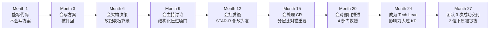

# 7.资深程序员软能力

#### 目录介绍
- [1. 案例引入](#1-案例引入)
  - [1.1 从工程师到 TL](#11-从工程师到-tl)
  - [1.2 顺藤摸到根因](#12-顺藤摸到根因)
  - [1.3 我们要回答什么](#13-我们要回答什么)
- [2. 资深软技能全景图](#2-资深软技能全景图)
  - [2.1 六大能力总图](#21-六大能力总图)
  - [2.2 为什么这么切](#22-为什么这么切)
- [3. 影响力四层模型](#3-影响力四层模型)
  - [3.1 专业影响力](#31-专业影响力)
  - [3.2 关系影响力](#32-关系影响力)
  - [3.3 位置影响力](#33-位置影响力)
  - [3.4 结果影响力](#34-结果影响力)
- [4. 技术判断力训练](#4-技术判断力训练)
  - [4.1 判断力的三层](#41-判断力的三层)
  - [4.2 训练的四种方法](#42-训练的四种方法)
  - [4.3 判断失误如何复盘](#43-判断失误如何复盘)
- [5. 导师意识与放权](#5-导师意识与放权)
  - [5.1 从做事到教做事](#51-从做事到教做事)
  - [5.2 放权四原则](#52-放权四原则)
  - [5.3 允许下属犯错](#53-允许下属犯错)
- [6. 职业韧性抗压六招](#6-职业韧性抗压六招)
- [7. 资深的六个错觉](#7-资深的六个错觉)
- [8. 十年后仍在场](#8-十年后仍在场)
  - [8.1 持续学习的引擎](#81-持续学习的引擎)
  - [8.2 沉淀个人品牌](#82-沉淀个人品牌)
  - [8.3 建立护城河](#83-建立护城河)
  - [8.4 反脆弱职业路径](#84-反脆弱职业路径)
- [9. 资深反模式](#9-资深反模式)
- [10. 综合案例串讲](#10-综合案例串讲)
  - [10.1 糖果充成为 TL](#101-糖果充成为-tl)
  - [10.2 24 个月成长回望](#102-24-个月成长回望)
  - [10.3 修炼哲学回扣](#103-修炼哲学回扣)
  - [10.4 全系列速查](#104-全系列速查)


## 1. 案例引入

### 1.1 从工程师到 TL

Higress 项目全量上线一个月后，CTO 单独找糖果充聊：

```
CTO: "糖果充, 支付重构 + Higress 干得漂亮。
     下季度我准备推你做 Tech Lead, 带 10 人小组, 负责整个支付平台。你准备好了吗?"

糖果充: (惊喜 + 惶恐) "谢谢老板! 我......我尽力。"

CTO: "别说'尽力', 说'准备好'。给我 3 个理由。"

糖果充: "呃......" (卡壳)
```

回到工位，糖果充一晚上睡不着。他知道自己**能干事**，但**带 10 个人**是完全不一样的活。

过去 24 个月的成长轨迹：Month 1-3 写方案（1 人）→ Month 4-6 做架构决策（与 Leader 老王）→ Month 7-9 主持讨论（10 人评审会）→ Month 10-12 扛住质疑（20 人评审）→ Month 13-15 处理 CR 攻防（与 5 位架构师）→ Month 16-20 跨部门推进（4 部门 20 人）→ Month 21-24 Tech Lead？（10 人小组）。前 24 月的成长是"从 1 个人 → 推动多方"，**未来是"从推动别人干 → 让别人愿意跟着你干"**。

**新问题**：① 下属跟你说"我这个方案 XX 好"，你判断错了怎么办？② 下属跟错了技术方向，是让他撞墙还是拉回来？③ 上线出重大事故了，你怎么面对 3 位下属和 CTO？④ 团队里的老资历比你大 5 岁，你怎么带他？⑤ 10 年后，你还想在场吗？**以上任何一个问题，糖果充都没现成答案**。

三天后，糖果充找 Leader 老王聊：

```
老王: "你有'能力恐慌', 这是好事——说明你意识到了差距。
      但你不是'从 0 开始'。过去 24 个月你走完了'硬技能之外'的六个层次:
      方案 → 决策 → 讨论 → 抗压 → 协作 → 闭环。
      
      Tech Lead 只是第七层: 把前面六层的能力叠加, 
      变成'让别人愿意跟你走'的影响力。我陪你走这一段。"
```

### 1.2 顺藤摸到根因

带着这条线往下挖：Tech Lead 就是"更强的 coder"？不是，是**推动集体的能力**；就是"更懂业务的架构师"？不完全，是**能让 10 个人各就其位**；靠什么让人跟随？**影响力**；影响力来自哪？**专业 + 关系 + 位置 + 结果 四层**；怎么从"能干活"过渡到"让人跟你干"？**转变六个错觉**；10 年后什么样的人还在场？**建立护城河的**——这些修炼就是本篇主线。

**核心洞察**：**从"资深工程师"到"Tech Lead"的跳跃，不是技能量的增加，而是关注点的转移**——资深工程师关注"这段代码怎么最好"，Tech Lead 关注"这个团队怎么最好"；资深工程师问"我怎么做"，Tech Lead 问"让谁做、怎么让他做好"；资深工程师看"我个人的产出"，Tech Lead 看"团队 10 人的合力产出"。

这一段里至少藏着 8 个原理点：① 资深工程师和 Tech Lead 的根本差异 → 第 2 章；② 影响力靠什么建立 → 第 3 章；③ 技术判断力怎么训练、判断错了怎么办 → 第 4 章；④ 带下属的正确姿势 → 第 5 章；⑤ 遇到重大挫折怎么恢复 → 第 6 章；⑥ "资深"有哪些常见错觉 → 第 7 章；⑦ 十年后还想在场靠什么 → 第 8 章；⑧ 常见的"资深反模式" → 第 9 章。

### 1.3 我们要回答什么

这个事故就是本篇的**主线案例**——**糖果充从工程师到 Tech Lead 的转型**。本篇路线：**资深软技能全景图（第 2 章）→ 影响力四层模型（第 3 章，"让人跟随"）→ 技术判断力（第 4 章，"决策不慌"）→ 导师意识（第 5 章，"带人不亲干"）→ 职业韧性（第 6 章，"扛得住挫折"）→ 六错觉（第 7 章，"避免误入歧途"）→ 十年在场（第 8 章，"长期主义"）→ 反模式（第 9 章）→ 综合案例（第 10 章，糖果充成为 Tech Lead）**。

> 📌 **本篇定位**：这是"程序员精进"系列的**收官之作**。前六篇是"术"——具体动作；本篇是"道"——**心法与长期主义**。**读完这七篇，你就有一份"职场肌肉记忆"**——下次评审、下次冲突、下次跨部门，脑子里会自动跳出动作。


## 2. 资深软技能全景图

### 2.1 六大能力总图

**资深软技能不是单一技能，是六大能力的组合**：

| # | 能力 | 核心命题 | 训练时长 |
|---|---|---|---|
| ① | **影响力** Influence | 让人愿意跟你干 | 3-5 年 |
| ② | **技术判断力** Judgment | 信息不完整时做出最合理决策 | 5-10 年 |
| ③ | **导师意识** Mentoring | 培养他人比亲干重要 | 2-3 年 |
| ④ | **职业韧性** Resilience | 崩溃后能爬起来，长期在场 | 全职业周期 |
| ⑤ | **长线视野** Long-term | 看到 10 年而非 10 天 | 全职业周期 |
| ⑥ | **自我迭代** Iteration | 持续更新，不被时代淘汰 | 全职业周期 |

### 2.2 为什么这么切

为什么资深软技能是这六个而不是"沟通/管理/领导力"这些老生常谈？**第一，老生常谈太虚**——"要有沟通能力"是废话，"在 5 分钟异议表达中用先接后转再给三段式"是动作。**本系列坚持"可动作化"**。**第二，六大能力互为支撑**——影响力需要判断力（跟你才对）+ 韧性（跟你才稳）；判断力需要视野（长线）+ 迭代（信息新）；导师意识需要影响力 + 判断力；韧性需要支持系统 + 视野；长线视野需要迭代 + 韧性；自我迭代需要视野 + 韧性。**任何一个能力单独存在都不完整**。

**第三，六大能力对应"资深工程师最容易失败的六个场景"**：

| 失败场景 | 缺失能力 |
|---|---|
| "没人愿意跟他干" | 影响力 |
| "重大决策拍偏" | 判断力 |
| "只会亲干不会带人" | 导师意识 |
| "一次失败就沉沦" | 韧性 |
| "只看眼前不看未来" | 长线视野 |
| "5 年后被淘汰" | 自我迭代 |

**结论**：六大能力的本质是**资深工程师失败模式的正面镜像**——**避开六个坑，你就是资深**。


## 3. 影响力四层模型

### 3.1 专业影响力

**定义**：**别人因为"你懂"而听你的**。**建立方式**：① **深度**——某个领域（支付/网关/性能）有独到见解；② **广度**——相邻领域能对齐（业务/架构/运维都能聊）；③ **复盘**——每次事件都有沉淀（Wiki/Blog/内部分享）；④ **教学**——能教别人的人才叫真懂。

**糖果充的专业影响力构建**：Month 1-6 在支付方向"深"扎根（方案设计 + 架构演进）；Month 7-15 在支付方向"能带团队讨论 + 抗质疑"；Month 16-24 支付方向"跨部门推动 + 教学新人"。**24 个月，团队里"提到支付就想到糖果充"** → 专业影响力建立。**关键**：**专业影响力最耐用**——即使换公司依然带得走，是所有影响力的地基。

### 3.2 关系影响力

**定义**：**别人因为"信任你这个人"而听你的**。**建立方式**：① 一致性（说到做到、千次不失约）；② 帮忙不图回报（有能力时主动帮同事）；③ 认可他人（公开赞美 + 私下反馈）；④ 尊重差异（允许别人跟你不同）；⑤ 长期投入（5 年、10 年的耐心积累）。

**关键动作**：**每周做 1 件"利他但不求回报"的事**——帮同事 review PR 认真给意见 / 分享一份 wiki 给相邻组 / 会议中主动为静音的人说话 / 记住同事家庭情况，关键时刻问候。**5 年积累 = 你在公司有 100 个"愿意帮你"的人**。**注意**：**关系影响力不是搞小圈子**——搞小圈子是负债，越搞越负；**真诚利他才是正向积累**。

### 3.3 位置影响力

**定义**：**别人因为"你的头衔"而听你的**。**特点**：优点——快（拿到 Tech Lead 头衔立刻有影响力）；缺点——脆（离开这个位置，影响力立刻消失）；本质——组织借你的。**关键**：**位置影响力不能替代前两层**——只靠头衔的人一旦离开位置或换公司，一无所有。

**"真"资深的位置观**：**位置只是加倍器**——专业 5 分 + 位置 = 5×2 = 10；专业 8 分 + 位置 = 8×2 = 16；但如果位置 = 0，专业 5 分 = 5，专业 8 分 = 8。**位置是加倍，底数得靠专业**。

### 3.4 结果影响力

**定义**：**别人因为"你干成过"而听你的**。**建立方式**：① 数一数你的"名场面"（独立主导过什么项目？有量化业绩数据吗？有可查证的案例吗？）；② 让"名场面"被知道（内部分享每半年 1 次 / 公开文章/演讲每年 1-2 次 / 相关面试案例业界流传）。

**糖果充 24 个月的"名场面"**：Month 3 支付方案 V4 版被 CTO 一次通过（评审故事）→ Month 6 顶住 A 总"顺便重构"压力，ROI 分析获认可 → Month 12 评审现场翻盘（老周的"抄袭"质疑）→ Month 20 跨 4 部门推动 Higress 上线（延期救火）。**四个"名场面" = 结果影响力**。**关键**：**结果影响力 = 硬通货**——任何 Level 讨论都以此为证据。**没有结果，前三层都是纸糊的**。

**四层影响力关系**：**专业（地基，耐用）+ 关系（润滑剂，长效）+ 位置（加倍器，脆但快）+ 结果（硬通货，无可辩驳）= 总影响力**。**四层都要建**——只靠一层的都很脆弱；**同时建，才能形成护城河**。


## 4. 技术判断力训练

### 4.1 判断力的三层

**技术判断力 = 在信息不完整时做出最合理的决策**。分三层：

| Layer | 类别 | 典型问题 | 判断依据 |
|---|---|---|---|
| L1 | **术层** 具体技术 | "Redis vs Memcached 选哪个?" | 场景 + 数据 + 经验 |
| L2 | **局层** 架构级 | "微服务 vs 单体?" | 团队规模 + 业务成熟度 + 长期演进 |
| L3 | **势层** 方向级 | "AI 大模型对我们业务的影响?" | 行业趋势 + 组织能力 + 时间窗口 |

**大多数工程师止步于 L1，资深止步于 L2，Tech Lead / 架构师能进入 L3**。

### 4.2 训练的四种方法

```
训练法 1 - 阅读顶级案例
  必读: Netflix 技术博客 / AWS Architecture Blog / Uber Engineering / 
       Meta Engineering / 阿里技术 / 字节技术
  每周 2 小时读一篇 + 写下: 他们的场景是什么、判断是什么、
                            换成我们的场景我会怎么判断

训练法 2 - 事后诸葛复盘
  每次重大决策上线 3 个月后, 强制复盘:
   决策当时的信息 / 做出的选择 / 实际结果 / 如果重来是否还这么选
  10 次这样的复盘 = 你的判断力"内部数据"

训练法 3 - 逆向推演经典
  每周找一个"经典架构"逆向推演:
   "为什么 Kafka 选顺序写日志?" / "为什么 Redis 单线程?" / "为什么 K8s 用声明式?"
  不看答案, 自己推 3 个假设的选择, 再对比原答案

训练法 4 - 影子决策
  每次公司高管做重大技术决策, 1 小时内写下你会怎么判断
  3 个月后对比 (老板判断 vs 你判断 vs 实际结果)
  3 年下来, 你的判断力会逼近高管水平
```

### 4.3 判断失误如何复盘

判断错了怎么办？**判断错很正常**——**关键是"错了怎么复盘"**：

```
❌ 错误复盘: "这次我判断错了, 我不适合做架构师" → 打击自信, 学不到东西

✅ 结构化复盘:
   1. 决策时的信息: 完整/不完整?
   2. 决策使用的模型: 正确/有偏差?
   3. 决策后的行动: 及时纠偏?
   4. 结果的成因: 决策错? 执行错? 环境变?
   5. 我能改的是什么? (未来动作)
```

**关键洞察**：判断失误的根源通常是——① 信息不足（未来更主动收集）；② 模型缺陷（学新框架，如本系列）；③ 情绪干扰（训练情绪隔离，第 6 章）；④ 环境突变（承认不可控，快速纠偏）。**只有情况 ③ 是"你的问题"，其他都是"可以改进的动作"**。**结论**：**判断力靠"错"训出来**——害怕犯错的人，永远学不会判断。


## 5. 导师意识与放权

### 5.1 从做事到教做事

**Tech Lead 的第一场认知冲击**：过去"这件事我 2 小时干完 = 我很牛"；现在"这件事我教下属 3 天让他学会 = 我更牛"。**因为**：我干只加了 2 小时产能，我教团队永久加了这个能力。

**关键动作**：**任何事情做之前先问**——"这件事是我干最优，还是找合适的下属干 + 我 review 最优？" **判断标准**：① 时间紧迫度极紧急 → 我干；② 学习价值高 → 下属干；③ 出错代价极高 → 我干或双人干；④ 频率会重复 → 下属干（未来他能顶）。**结论**：过去"我做完了很牛" → 现在"我让别人做完了更牛"——**思维大反转**。

### 5.2 放权四原则

怎么放权才能既不失控又不亲干？**放权四原则**：① **明确边界**——"这件事你决定，但涉及 XX 需要跟我对齐"；② **明确 SLA**——"预计一周内交付，中间任何阻塞找我"；③ **定期同步**——"每 3 天钉钉 3 句话进度（完成/阻塞/明日）"；④ **只 review 结果**——"过程尽量少干预，结果时给反馈"。

**放权前的 Checklist**：□ 下属能力能承担这个任务的 60%+；□ 出错代价能承受（不是 P0）；□ 有 30% Buffer 时间给他犯错；□ 我在关键节点（方案/上线）会过一眼；□ 明确的失败可回滚方案。

### 5.3 允许下属犯错

下属做错了怎么办？我要不要立刻纠正？**分级处理**：

| Level | 类型 | 处理方式 | 例 & 技法 |
|---|---|---|---|
| L1 | 小错（不影响结果） | 不管，让他自己发现 | 变量命名有点丑 |
| L2 | 中错（影响结果、可回滚） | 引导他自己发现 | 方案漏 case → "你看这个 case，觉得怎么处理？" |
| L3 | 大错（影响交付、不可回滚） | 及时拉齐一起解决 | 上线前严重 bug → 一起 debug，事后复盘 |
| L4 | 原则错（安全/合规/道德） | 立刻纠正 + 明确规则 | 硬编码密码 → "这不能过，原则性问题，我马上帮你改" |

**核心命题**：**下属犯 L1-L2 的错就是训练场**——你替他做 = 他永远不会。**给下属的三个心理保障**：① 犯错不会被批评；② 尝试新方向被鼓励；③ 求助不会显得弱。**有这三条，下属才敢试**。


## 6. 职业韧性抗压六招

面对 CTO 当众批评、上线事故、跨部门翻车，怎么才能不崩？韧性不是"天生皮实"，是六种可训练的动作：

**招 1 · 情绪隔离**——三步走：① **命名情绪**（"我现在是愤怒 / 委屈 / 焦虑"——给情绪贴上标签，大脑就能从"沉浸"变"观察"）；② **生理调节**（4-7-8 呼吸法：吸 4 秒-屏 7 秒-呼 8 秒，做 3 轮——副交感神经启动）；③ **隔断动作**（上洗手间 3 分钟 / 到窗边站 2 分钟 / 喝一口水——物理隔断让大脑重启）。**情绪不是敌人是信号**，情绪告诉你"这件事你在乎"，收信号后再理性行动。

**招 2 · 事实分离**——老板批评时怎么理性听？分离三种信息：

```
老板的话: "你这次跨部门推进太差了, 完全没经验!"
分离后:  ① 事实层: "延期 3 周"
         ② 判断层: "推进太差"
         ③ 情绪层: "太失望了"
我处理:  ① 事实层: 接受, 复盘根因
         ② 判断层: 部分接受 (缺经验) + 部分反驳 (方法在改进)
         ③ 情绪层: 我不承担 (老板的情绪是他的问题)
```
**事实/判断/情绪三分离 = 不玻璃心，也不硬顶。成年人的心态**。

**招 3 · 长线视角**——一次挫折就让我怀疑人生怎么办？**三问**：Q1 这件事 5 年后还重要吗？（不重要 → 现在别太较真；重要 → 系统学习）；Q2 这次挫折对我 3 年目标有什么影响？（通常没那么大 → 消解焦虑）；Q3 如果我把这次经历讲给 10 年后的我，他会觉得这是"糟糕的一天"还是"成长的一课"？（大部分是后者 → 收获视角）。**5 年视角 → 消解 90% 焦虑；10 年视角 → 消解 99%**。

**招 4 · 支持系统**——一个人抗压总有极限，建立"三层支持系统"：

| Layer | 角色 | 作用 | 频次 |
|---|---|---|---|
| L1 | 家人 | 情感支持，谈心不谈事 | 日常 |
| L2 | 好友 / 同龄同行 | 共情支持，理解你的处境 | 每月 1-2 次深聊 |
| L3 | 导师 / 长者 | 指导支持，给方向 | 每季度 1 次请教 |

**三层缺一不可**——只靠家人则家人也累；只靠同龄则视野被限；只靠导师则情感未处理。**每年扩充 1-2 位每层的朋友**——支持系统是最好的抗风险资产。

**招 5 · 身体先行**——身体是心态的物理基础。研究数据：睡眠 < 6h 决策质量下降 30%；长期加班 2h+ 冲动性决策增加 40%；缺乏运动抑郁风险 3x。反面案例："我最忙的时候，3 天睡 8 小时，上线出重大事故——那不是因为技术，是因为大脑供血不足做决策。" **基础要求**：① 睡眠 7 小时（不可让）；② 每周 3 次运动（30 分钟起）；③ 饮食均衡（垃圾食品是脑力杀手）；④ 每周 1 天完全不看工作（大脑必须换气）。**"身体是本钱"对程序员格外重要**——你的产出 100% 依赖大脑。

**招 6 · 退路思维**——不是应该"一往无前"吗？**没有退路 = 心态失衡；有退路 = 从容出击**。"最坏也就 X" 的心理机制：项目失败 → 大不了辞职，我有 6 个月储备金；老板不满 → 大不了换公司，我的技术能力在；公司倒闭 → 大不了自由职业，我有个人品牌。**有这些"退路思考"，你在职场就永远不"跪"——因为"跪了也无所谓"**。**建立退路的具体行动**：① 财务储备（12 个月生活费的"辞职基金"）；② 技术储备（每年至少一次外部面试练手，保持市场化）；③ 关系储备（100+ 前同事/行业朋友，换工作 1 周内有 offer）；④ 品牌储备（个人博客/开源/公众号，有辨识度）。**退路不是软弱，是"能承受最坏情况"的底气**——这种底气反过来让你不会走到最坏。


## 7. 资深的六个错觉

伪资深有六种画像，一张表看清：

| # | 错觉 | 症状 | 真相 | 修复 |
|---|---|---|---|---|
| ① | 资历 = 资深 | "我干了 10 年，我就是资深" | "1 年经验重复 10 次" ≠ "10 年经验" | 每年做一次"我今年学了什么"清单——和去年一样 = 1 年经验重复 |
| ② | 会最多技术 = 资深 | "我会 Java/Go/Python/K8s/Kafka/Redis，全栈资深" | "知道" ≠ "能拍板"；广度是加分项，深度才是入场券 | 至少一个方向"当家做主"，其他"能对话"就够 |
| ③ | 加班多 = 资深 | "我每天 12 小时，上线周末在" | 加班多 = 效率低 = 判断力下降 = 犯错多；Google/Netflix 顶尖工程师朝九晚六 | 看产出不看时长——12 小时才干完 8 小时的活，反省"是不是方法有问题" |
| ④ | 说话严肃 = 资深 | "我要看起来很稳重，少笑，板着脸" | 装出来的稳重 = 大家躲你；真正资深的人反而更松弛 | 做自己：微笑、开玩笑、承认不知道——真诚比装严肃有魅力 10 倍 |
| ⑤ | 独立解决 = 资深 | "这个问题我不问别人，自己搞定" | "独狼式资深"最脆弱——你会遇到瓶颈，没人能拉你 | 主动寻求帮助 = 智慧的信号——"我不懂 X，谁能教我?" 比"我什么都懂"更资深 |
| ⑥ | 拒绝新技术 = 资深 | "大模型都是炒作，老技术才靠谱" | 拒绝新技术 = 停止学习 = 3 年后被淘汰 | 每季度学 1 个新技术，至少到"能对话"程度——AI 时代尤其重要 |


## 8. 十年后仍在场

### 8.1 持续学习的引擎

怎么保证 10 年后不被淘汰？**持续学习的四引擎并行**：

```
引擎 1 - 输入
  阅读: 每年 20 本书 (技术 10 + 非技术 10)
  订阅: 5-10 个高质量博客/公众号
  会议: 每年 1-2 次业界大会

引擎 2 - 输出
  写作: 每月 1 篇技术文章
  演讲: 每年 2-3 场内部/外部分享
  开源: 参与 1-2 个开源项目

引擎 3 - 实践
  副项目: 保持 1 个业余技术项目
  面试: 每年 1-2 次外部面试 (保持市场化)
  跨界: 每年学一个非本领域的新东西

引擎 4 - 反思
  每月 30 分钟复盘: 我学到了什么? 用上了什么?
  每季度调整学习方向
  每年重新审视职业方向
```

**关键**：**四引擎并行**——只输入不输出 = 假学习；只实践不反思 = 低效学习。

### 8.2 沉淀个人品牌

为什么要有"个人品牌"？**品牌 = 你不在场时别人怎么谈论你**。糖果充这个人在公司内部："支付方向的专家，稳、靠谱、有担当"；公司外部："在支付架构公众号写过深度文章 / GitHub 上贡献过 Higress 的 PR / 行业沙龙分享过跨部门推进方法论"。**10 年下来提到"支付架构"这个方向，糖果充是行业前 100 人**。

**构建品牌的三层**：L1 公司内（半年一次内部分享 + Wiki 沉淀技术方案 + 复盘会主动分享）；L2 行业内（技术博客/公众号 + 开源项目贡献 + 行业大会演讲）；L3 公众（出书 / 视频课 + 长期社交媒体运营）。**个人品牌 = 你在这个行业的信誉资产**——跳槽/合作/融资/招人，都靠它。

### 8.3 建立护城河

什么样的能力最难被替代？**四层护城河**：① **技术深度**（某个方向如支付/搜索/推荐全国 Top 100）；② **行业理解**（懂业务 + 懂技术 + 懂用户，稀缺组合）；③ **关系网络**（100+ 高质量前同事/行业朋友）；④ **品牌影响力**（公司外也有人知道你）。**任何一层单独都容易被超越，四层同时有就是不可替代**。

**AI 时代的加分层**：⑤ **AI 协作能力**（能高效使用 AI 提升 10 倍产能，知道 AI 的边界、知道什么让人做）；⑥ **复合场景能力**（不是"AI 专家"而是"用 AI 做支付架构" → 稀缺人才）。

### 8.4 反脆弱职业路径

怎么规划一条"反脆弱"的职业路径？**反脆弱职业 = 越经历变化越强大**。**四原则**：① **多元收入**（主业 + 副业 + 投资 + 版权——任一板块出问题不至于崩）；② **多元能力**（技术 + 沟通 + 写作 + 管理——转型不至于从零开始）；③ **多元人脉**（同行 + 跨行 + 上下游 + 客户——任何领域出事有人指路）；④ **多元身份**（工程师 + 作者 + 讲师 + 顾问——一个身份失效其他还在）。

**糖果充未来 10 年的反脆弱规划**：Year 3 Tech Lead → Year 5 技术专家/架构师 + 副业写作 → Year 7 部门负责人 + 出版技术书 → Year 10 CTO/创业 + 讲师 + 顾问。**任何一条路失败，其他三条都还在——反脆弱**。**反脆弱 = 不押注在单一路径上**——你的价值不在"这份工作"，在"你这个人"。


## 9. 资深反模式

资深路上最容易走歪的四种画像：

| 反模式 | 症状 | 危害 | 修复 |
|---|---|---|---|
| ① **老油条化** | 什么都懂，但什么都不干；逻辑清晰，但结果全无 | 团队里最讨厌的存在——技术上打不倒，但没人愿意合作 | 始终有"名场面"——每年拿一个实际结果。**说得再好没结果 = 老油条** |
| ② **技术单一化** | 只会 Java，只做业务，从来不看新技术 | 行业换轨时被抛下——移动互联网时代抛下了 J2EE 老将，AI 时代会抛下 CRUD 老将 | 每年学 1 个"陌生领域"——AI / 云原生 / 大数据 / 前端 都可以 |
| ③ **沟通僵化** | 只用命令式沟通，从不用请教式；只发一次消息，从不主动跟进 | 5 年后你带不动新一代员工——他们受不了你 | 每年更新一次"沟通词汇表"——观察新一代的沟通方式，主动学习 |
| ④ **放弃学习** | "我这个年纪学不动了""AI 是年轻人的事" | 放弃学习 = 主动被淘汰的信号 | 心态 = 学习的第一障碍——认为自己能学的人才能学。**每天 30 分钟，5 年后判若两人** |


## 10. 综合案例串讲

### 10.1 糖果充成为 TL

Higress 上线 3 个月后，CTO 正式任命糖果充为**支付平台 Tech Lead**，带 10 人小组。任命当天糖果充做了三件事：

**Day 1 · 1v1 每个下属 45 分钟**：

```
议程 (每人):
- 5 min:  我的定位 (我不是老王 2.0, 我是糖果充版 Tech Lead)
- 10 min: 你的过去 (听你的经历)
- 15 min: 你的期望 (你想在下一年学到什么)
- 10 min: 我们的合作方式 (放权 + 同步节奏)
- 5 min:  你有什么想问我的

关键动作: ✅ 只听不评价 ✅ 记录每人期望 ✅ 承诺每周 1 次 1v1 30 分钟
```

**Day 2 · 建立团队心跳**：**每周**——周一 10:00 站会 30 分钟（对齐本周）/ 周三 15:00 技术分享 60 分钟（轮流）/ 周五 16:00 复盘 30 分钟（谈成/败）/ 每周 3-4-5 个 1v1 45 分钟；**每月**——月初团队 OKR 对齐，月末团队复盘 + 我个人复盘；**每季度**——战略对齐（跟 CTO/A 总）+ 每人成长计划评审。

**Day 3 · 明确"我的领导风格"**——糖果充发给团队的第一封信：

```
"各位, 从今天起我是团队 Tech Lead。
 
 我的领导原则:
 1. 放权: 你的事你决定, 涉及 XX 找我
 2. 挡枪: 出问题我扛, 有功大家分
 3. 教学: 我的目标是让你 3 年后不需要我
 4. 透明: 战略/薪资/机会, 该知道的都会知道
 5. 反馈: 及时肯定 + 私下改进
 
 你可以对我做: 挑战我的判断 / 求助 / 拒绝我的分配 (说清原因) / 表达不满 (私下或公开)
 你别对我做:   隐藏坏消息 / 甩锅 / 消极怠工不说 / 背后小圈子
 
 有任何问题随时敲我。"
```

**3 个月后的团队状态**：✅ 团队 3 次成功项目交付；✅ 2 位下属被 Promotion；✅ 团队离职率 0；✅ CTO 评价："支付团队是全公司凝聚力最好的小组之一"。

### 10.2 24 个月成长回望

**糖果充从 Month 1 到 Month 27 的成长曲线**：



**每个里程碑对应的技能修炼**：

| 阶段 | 关键事件 | 学到的能力 | 篇章 |
|---|---|---|---|
| Month 1-3 | 方案被打回 5 次 | 方案八要素 + 15 条自检 | 01 |
| Month 4-6 | 顶住"顺便重构" | 渐进演进 + Trade-off 量化 | 02 |
| Month 7-9 | 主持网关选型 | SCQA + 白板法 + 三段异议 | 03 |
| Month 10-12 | 抗 CTO 质问 | STAR-R + 化敌为友 | 04 |
| Month 13-15 | PR 被 Diss 17 次 | 五级分类 + 就事回击/让步/升级 | 05 |
| Month 16-20 | 4 部门推进 Higress | 四抓手 + 3-3-3 + 复盘五步 | 06 |
| Month 21-24 | 成为 Tech Lead | 影响力四层 + 导师意识 | 07 |
| Month 25-27 | 团队三次成功 | 放权 + 韧性 + 长线 | 07 |

**24 个月的复合成长**：**硬技能（纵向深度）** Java → 分布式 → 微服务 → 平台架构；**软技能（横向宽度）** 独干 → 方案 → 讨论 → 推进 → 带团队；**综合影响力** Level 3 员工 → Tech Lead → 部门骨干 →（未来）架构师 / 部门 Leader / CTO。

### 10.3 修炼哲学回扣

回望糖果充的 24 个月，也是本系列的哲学回扣。**核心命题**：**技术能力让你入场，软技能让你留场并成为主角**。

| Level | 定位 | 跨越的关键 |
|---|---|---|
| L1 入场 | 能干活的人 | — |
| L2 合格 | 能干好的人 | 学会闭环 |
| L3 资深 | 能让别人干好的人 | 学会推动他人 |
| L4 领导 | 能让集体越干越好的人 | 学会培养他人 |
| L5 专家 | 能定义"什么叫好"的人 | 学会开创新赛道 |

**长期主义的三个信念**：① **复利信念**——小改善 + 时间 = 巨大差距，每周 1% 改进，5 年后 12 倍；② **反脆弱信念**——变化不是威胁是机会，AI 时代淘汰的是"不学"的人不是"某个技能"；③ **长期在场信念**——30 年职业生涯 10 年才刚过 1/3，现在的一切挫折长线看都是训练数据。**结论**：**资深不是终点是新的起点**——Tech Lead 之后有架构师，架构师之后有 CTO，CTO 之后有创业，创业之后有布道者。**只要保持修炼，永远有下一站**。

### 10.4 全系列速查

**7 篇文章一站式速查**：

| # | 文档 | 核心动作 | 一句话精髓 |
|---|------|--------|----------|
| 01 | 技术方案设计能力 | 八要素 + 15 条自检 | **写方案不是文书，是决策** |
| 02 | 架构演进决策能力 | 渐进演进 + Trade-off 量化 | **敢不做也是水平** |
| 03 | 技术讨论表达能力 | SCQA + 白板 + 三段异议 | **结构化压过嗓门大** |
| 04 | 应对技术质疑能力 | STAR-R + 五类分辨 + 化敌 | **先接住再回应** |
| 05 | 代码审查攻防能力 | 五级分类 + 回击/让步/升级 | **分层比对错重要** |
| 06 | 做事闭环执行能力 | 四抓手 + 3-3-3 + 五步复盘 | **拿结果不是交作业** |
| 07 | 资深程序员软能力 | 影响力四层 + 长线视角 | **影响力大过 KPI** |

**七篇通用的心法**：① 结构化压过散点化（SCQA / 五级 / 四抓手）；② 数据碾压嗓门（量化 / L1-L4 论据 / 三方案）；③ 先接再给不树敌（先接后转再给）；④ 承认边界不显弱（三段式承认）；⑤ 让老板做决策不甩锅（三方案让选）；⑥ 闭环大过交付（拿结果不是交作业）；⑦ 长线视角熬短期（5/10 年视角消解焦虑）。

**修炼节奏**：

```
每天 5 min   早 3 min 列今日 3 件事 + 每件的"结果定义"
             午 1 min 复盘上午遇到的 1 个决策
             晚 1 min 记录今天学到的 1 个观察

每周 30 min  周一 10 min 定本周 OKR
             周三 10 min 中期 Check
             周五 10 min 复盘 + 下周预演

每月 60 min  月初 30 min 上月复盘 + 本月目标
             月末 30 min 本月产出总结 + 下月方向

每季 3 h     1h 系统学习一个新领域 + 1h 写一篇技术复盘博客 + 1h 找导师/朋友深聊

每年 全盘    职业方向审视 + 反脆弱补充
```

---

## 系列尾声

亲爱的读者，如果你读到这里，请你先给自己点个赞——**你已经拥有了 90% 程序员没有的"软技能地图"**。

但真正的修炼不在读，在**行**。这七篇文章是"武功秘籍"，**只有拿到工位上试，才能变成你的**。

**建议行动**：Week 1 挑一篇最贴近你现状的重读，划出 3 个动作；Week 2-4 把这 3 个动作在真实场景里试；Month 2 换下一篇循环；Month 7 七篇都过一遍，回头看第 1 篇你已判若两人。

**最后送一句话给你**：

> **技术让你入场，软技能让你留场并成为主角。**
> **前者半年学会，后者一辈子修炼。**  
> **但每天 1% 的复利，5 年后你在别人看不见的地方甩开他们。**

**祝你 24 个月后，也拿到属于你的 Tech Lead offer**。

---

**本篇速查表**：

| 维度 | 关键武器 |
|---|---|
| 影响力 | 专业 + 关系 + 位置 + 结果 四层 |
| 判断力 | 术/局/势 三层 + 阅读/复盘/推演/影子 四训练 |
| 导师意识 | 从做事到教做事 + 放权四原则 + 允许四级犯错 |
| 韧性六招 | 情绪隔离 / 事实分离 / 长线 / 支持系统 / 身体 / 退路 |
| 长线视野 | 十年在场 / 持续学习 / 个人品牌 / 反脆弱 |
| 六错觉 | 资历 / 会最多 / 加班 / 说话严肃 / 独立解决 / 拒绝新技术 |
| 反模式 | 老油条 / 单一化 / 沟通僵化 / 放弃学习 |

**24 个月成长速查**：Month 3 会写方案 → Month 6 会决策 → Month 9 会讨论 → Month 12 会抗压 → Month 15 会协作 → Month 20 会闭环 → Month 24 会带团队（Tech Lead）→ Month 60 能带部门 → Month 120 能定义方向。

**——完——**
