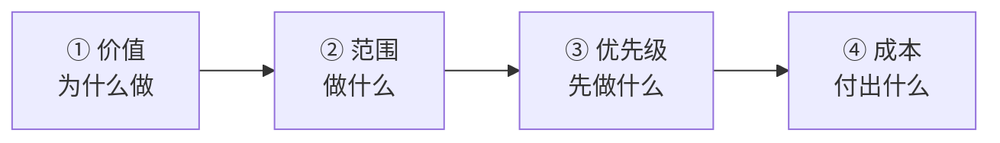

# 8.需求评审博弈能力

#### 目录介绍
- [1. 案例引入](#1-案例引入)
  - [1.1 30 个需求要一周上线](#11-30-个需求要一周上线)
  - [1.2 顺藤摸到根因](#12-顺藤摸到根因)
  - [1.3 我们要回答什么](#13-我们要回答什么)
- [2. 博弈全景图](#2-博弈全景图)
  - [2.1 需求博弈四要素](#21-需求博弈四要素)
  - [2.2 研发 vs 产品的错位](#22-研发-vs-产品的错位)
- [3. 需求分级四象限](#3-需求分级四象限)
  - [3.1 价值-成本矩阵](#31-价值-成本矩阵)
  - [3.2 四象限对应策略](#32-四象限对应策略)
  - [3.3 分级说服话术](#33-分级说服话术)
- [4. PRD 反问清单](#4-prd-反问清单)
  - [4.1 六类必问问题](#41-六类必问问题)
  - [4.2 反问话术示例](#42-反问话术示例)
  - [4.3 反问的分寸](#43-反问的分寸)
- [5. 砍需求不背锅五句式](#5-砍需求不背锅五句式)
  - [5.1 为什么砍需求最难](#51-为什么砍需求最难)
  - [5.2 五种砍法](#52-五种砍法)
  - [5.3 砍完的书面确认](#53-砍完的书面确认)
- [6. 需求变更留痕](#6-需求变更留痕)
  - [6.1 变更三种类型](#61-变更三种类型)
  - [6.2 变更留痕模板](#62-变更留痕模板)
  - [6.3 变更成本可视化](#63-变更成本可视化)
- [7. 产品-研发平衡点](#7-产品-研发平衡点)
  - [7.1 目标一致 vs 手段对抗](#71-目标一致-vs-手段对抗)
  - [7.2 建立长期信任](#72-建立长期信任)
  - [7.3 一起做 CEO 的思维](#73-一起做-ceo-的思维)
- [8. 评审现场的动作库](#8-评审现场的动作库)
  - [8.1 会前动作](#81-会前动作)
  - [8.2 会中动作](#82-会中动作)
  - [8.3 会后动作](#83-会后动作)
- [9. 博弈反模式](#9-博弈反模式)
  - [9.1 五种反模式一览](#91-五种反模式一览)
- [10. 综合案例串讲](#10-综合案例串讲)
  - [10.1 糖果充的评审翻盘](#101-糖果充的评审翻盘)
  - [10.2 博弈全过程复盘](#102-博弈全过程复盘)
  - [10.3 博弈哲学回扣](#103-博弈哲学回扣)
  - [10.4 博弈速查](#104-博弈速查)

## 1. 案例引入

### 1.1 30 个需求要一周上线

`Month 26`, 糖果充升 Tech Lead 后第 2 个月, 第一次独立面对产品经理**小林**的需求评审. 小林入职半年, 非常"卷", PRD 文档 60 页, 需求清单 30 条, 会议开场就丢下一句:

```
小林 (语速极快): "各位, 这批需求都是 CEO 拍板的 Q4 冲刺目标, 下周五之前必须全部上线, 我们不能再拖了!"
糖果充: (翻着 60 页 PRD, 内心 OS: "30 个需求 + 5 个工作日, 每天要上线 6 个? 疯了吧")
糖果充: "小林, 这 30 个需求, 优先级都一样吗?"
小林: "对啊都一样, 都是 CEO 亲自定的, 谁也不能砍!"
糖果充: "那...... 你有工时评估吗?"
小林: "没有, 那是你们研发的事, 反正下周五必须上!"
糖果充: (深吸一口气) "OK, 那我先梳理一下......"
```

三天后, 糖果充带着团队评估表回来:

```
糖果充: "小林, 我们评估完了: 30 个需求共需 43 人日; 团队 8 人 × 5 天 = 40 人日;
        100% 投入还差 3 人日, 加上 30% buffer 处理 bug, 下周五能上的最多 18 个。"
小林: (火了) "18 个? 太少了! CEO 那边我怎么交代?"
糖果充: "那你想砍哪 12 个?"
小林: "我不能砍! 都是 CEO 定的!"
糖果充: "那你想让我砍哪 12 个?"
小林: "你砍? 那我就跟 CEO 说是研发决定砍的!"
糖果充: (火气也上来了) "小林, 你这是甩锅"
小林: "你这是不配合业务!"
(僵住, 5 秒安静)
```

**会议崩了**. 当天下午小林把糖果充告到 CEO 那儿, 理由是"研发不配合业务". CEO 找糖果充谈话:

```
CEO: "糖果充, 我听说你不配合小林?"
糖果充: (慌) "老板, 是 30 个需求太多了, 一周做不完......"
CEO: "那你是怎么跟小林商量的?"
糖果充: "我让她砍..."
CEO: "谁给你的权力让 PM 砍需求? 你有做工时对比表吗? 有分优先级吗? 有画'如果全做要付出什么代价'吗? 你就一句'砍', 你让 PM 怎么答? 她也不想扛砍需求的锅啊。"
糖果充: (愣住)
CEO: "回去重来。记住: 需求博弈不是'我不做', 是'我们一起想清楚做什么'。"
```

### 1.2 顺藤摸到根因

糖果充回工位复盘, 把整个过程拆开看:

```
错误 1: 我把小林当"对手"         → 其实我们目标一致 (都想让业务成功)
错误 2: 我只给出"18 个"这个技术结论 → 没给出决策依据 (哪个应该砍, 为什么)
错误 3: 我让小林砍                → 她没有砍需求的话语权 (需求是 CEO 定的)
错误 4: 我用"人日"术语            → 小林听不懂业务价值, 只听懂"能不能上"
错误 5: 我没有把 CEO 拉进来       → CEO 是决策者, 却被隔离在博弈之外
```

更深一层, 糖果充意识到: **我在用"研发视角"跟 PM 谈, 不是"业务视角"**; **我没给她"决策工具", 她只能硬扛**; **我把"砍需求"变成了"零和博弈", 而不是"共同决策"**.

**糖果充这才明白**: 需求博弈的高段位, 不是"我砍你需求", 而是"我帮你把这 30 个需求切成 3 层, 第一层 A/B/C 都要, 第二层 D/E/F 二选一, 第三层 G/H/I 全放弃, 然后让 CEO 拍板". **你不是砍需求的人, 你是"帮 PM 和 CEO 做决策的人"**.

### 1.3 我们要回答什么

本篇要回答 8 个问题: **① PM 甩一堆需求过来, 怎么接? ② 评审会上到底要问什么? ③ "砍需求"这个动作谁来做才不背锅? ④ PM 说"这是老板拍板的"怎么应对? ⑤ 需求变更 5 次怎么让 PM 承担成本? ⑥ 会上怎么不被 PM 带节奏? ⑦ PM 和研发的长期关系应该是什么样? ⑧ PM 就是不讲理怎么办?**

**核心命题**: **需求博弈不是"研发对抗 PM", 是"研发和 PM 一起对抗'不清晰的业务目标'"** —— **你的对手不是 PM, 是"含糊"**.

---

## 2. 博弈全景图

### 2.1 需求博弈四要素

任何一次需求博弈, 都可以拆成四个要素:



| 要素 | 关键问题 | 谁来回答 |
|:--:|---|---|
| ① 价值 | 这个需求带来什么业务收益? | PM (研发追问) |
| ② 范围 | 边界在哪, 什么算 done, 什么不算? | PM + 研发 (共同定义) |
| ③ 优先级 | 30 个里先做哪 10 个? | PM 建议 + 决策层拍板 |
| ④ 成本 | 需要多少人多少时间? | 研发 (PM 挑战) |

**博弈的核心**: 每个要素都必须闭环, 不能留白. **价值不清 → 做了才发现"其实没用"; 范围不清 → 做到一半 PM 说"我以为要做 X"; 优先级不清 → 团队天天救火, 大事没做; 成本不清 → 老板以为免费, 加需求毫无节制**.

### 2.2 研发 vs 产品的错位

**为什么需求博弈这么容易崩** —— 两边的关注点错位:

| 研发关注 | 产品关注 |
|---|---|
| 技术可行性 | 用户价值 |
| 工期与人力 | 上线时间点 |
| 代码质量 | 迭代速度 |
| 长期维护 | 短期指标 |
| "做对" | "做完" |

**错位的话术表现**:

```
研发说: "这个改动影响面很大, 需要 3 周"  → 产品听到: "研发不想做, 找借口拖"
产品说: "这个下周必须上"                → 研发听到: "PM 拍脑袋不管死活"
研发说: "这个方案技术上不合理"          → 产品听到: "研发瞧不起我的方案"
产品说: "用户体验很重要"                → 研发听到: "PM 又拿'用户体验'压我"
```

**破解错位的核心**: **双方都要"过一次对方的桥"**.

```
研发过 PM 的桥: "这个改动影响 3 周, 对应的业务价值是 X 万营收吗? 如果是, 我们分两期做, 第 1 期 1 周上核心, 第 2 期 2 周补长尾, 这样能吗?"
PM 过研发的桥: "这个需求技术上确实复杂, 我们能不能砍掉 30% 边缘功能, 保住核心用户体验? 这样能压到 1 周吗?"
```

**这就叫"共同决策", 而不是"互相对抗"**.

---

## 3. 需求分级四象限

### 3.1 价值-成本矩阵

面对一堆需求, 第一件事就是画四象限:

```
             业务价值 ↑
      高价值    │    高价值
      低成本    │    高成本
       (A)     │     (B)
   ─────────────┼─────────────  → 研发成本
      低价值    │    低价值
      低成本    │    高成本
       (C)     │     (D)
```

**分类标准**: **业务价值 高** = 直接影响营收 / 关键指标 / 战略目标; **低** = 边缘功能 / 小优化 / 内部工具. **研发成本 低** = <3 人日, 无架构影响; **高** = >3 人日, 或需要架构改动.

### 3.2 四象限对应策略

| 象限 | 定位 | 处理策略 |
|---|---|---|
| **A (高价值 + 低成本)** | 立即做 | 优先塞进本迭代, 不需要讨论, 直接排期 |
| **B (高价值 + 高成本)** | 拆分做 | 拆分成 MVP + 迭代, MVP 塞本迭代, 长尾放后续, 需专门方案讨论 |
| **C (低价值 + 低成本)** | 见缝插针 | 有 buffer 时做, 或跟 A 类捆绑做, 别单独占资源 |
| **D (低价值 + 高成本)** | 果断砍 | 或延后 3 个月再评估, 或转成"用户投票"看真实需求, **绝不主动排期** |

**糖果充第二版评估表**:

```
30 个需求分类: A 立即做 12 个 → 塞本周; B 拆分做 8 个 → MVP 塞本周, 长尾下周;
              C 见缝插针 5 个 → 有 buffer 就做; D 果断砍 5 个 → 建议延后 3 个月
结论: 本周能上 12-15 个 (A 全部 + B 的 MVP), 下周补 8 个 (B 长尾 + C), 砍 5 个 (D)
```

### 3.3 分级说服话术

**给 PM 的话术**:

```
"小林, 你这 30 个需求我们做了个价值-成本分析:
 12 个是 [高价值 + 低成本], 本周全上;
 8 个是 [高价值 + 高成本], 建议拆成 MVP + 迭代, 本周 MVP 上核心, 下周补长尾, 用户体感一致;
 5 个是 [低价值 + 低成本], 有 buffer 就上;
 5 个是 [低价值 + 高成本], 建议 3 个月后再评估。
 你觉得这个分组合理吗? 合理就一起给 CEO 汇报; 不合理你告诉我哪 5 个要挪, 我们重算成本。"
小林: (第一次感到"研发在帮我思考", 而不是"卡我") "OK, 这 5 个我确实觉得可以延后。"
```

**给 CEO 的话术**:

```
"老板, 30 个需求我们和小林一起分了 4 层:
 A 层 12 个: 本周全上 (价值高, 成本可控)
 B 层 8 个:  本周 MVP + 下周迭代 (价值高, 分期消化)
 C 层 5 个:  下周补 (低成本, 顺手做)
 D 层 5 个:  建议延后 3 个月 (投入产出比不划算)
 本方案下周五上 A + B 的 MVP = 20 个, 用户体感覆盖 85% 核心场景, 剩余 15% 下周补齐。
 请您决策: 1) 是否接受 D 类延后? 2) 若不接受, 需额外 2 人 × 1 周资源。"
CEO: "D 类延后 OK, 其他按你说的做。"
```

**关键**: **你不是砍需求, 你是给决策者提供决策支持**.

---

## 4. PRD 反问清单

### 4.1 六类必问问题

拿到 PRD 之后, 不管三七二十一先按六类问一遍:

| # | 类别 | 关键问题 |
|:--:|---|---|
| Q1 | 用户价值 | 这是谁的痛点? 用户用它做什么? 不做用户损失什么? |
| Q2 | 业务价值 | 对应哪个业务指标? 上线后如何衡量效果? 埋点谁负责? |
| Q3 | 范围与边界 | "完成"的定义 (DoD) ? 哪些场景不做? 哪些 corner case 可忽略? |
| Q4 | 依赖与前置 | 依赖哪些系统 / 团队? 前置动作谁做何时完? 有无第三方? |
| Q5 | 上线与灰度 | 时间硬约束还是软约束? 灰度策略? 灰度期看什么指标? |
| Q6 | 回滚与降级 | 出问题怎么回滚? 是否需要开关? 依赖挂了兜底方案? |

**六类作用**: **Q1+Q2 确认"要不要做" (价值筛选); Q3 确认"做多少" (范围收敛); Q4 确认"谁来做" (依赖澄清); Q5+Q6 确认"怎么上" (风险管控)**.

### 4.2 反问话术示例

**PRD 常见含糊表述 → 对应反问**:

- **"提升用户体验"** → "具体是哪个指标? 留存 +X% 还是页面加载 -Y ms? 没有可量化指标, 我们怎么证明有效?"
- **"支持批量操作"** → "'批量'量级? 10 条走前端循环, 10000 条要走异步队列, 方案完全不同."
- **"接入第三方 XX"** → "第三方 API 文档看过吗? 稳定性 SLA 多少? 挂了兜底? 是否需要签服务协议?"
- **"下周必须上"** → "'必须上'的商业理由? 市场活动? 竞品逼迫? 老板承诺客户? 延后 3 天损失是什么? (有些'必须'经不起追问)"
- **"跟 XX 一样"** → "跟 XX 具体像哪部分? 界面、交互、逻辑、数据? XX 的技术栈? 抄整个方案还是某个模块?"
- **"简单加个字段就行"** → "这个字段影响哪些接口? 历史数据要不要回刷? 前端联动改? App 需要新版本兼容? '简单加一个字段'通常牵动 5-10 处修改."

### 4.3 反问的分寸

**反问是双刃剑** —— **问得好显专业, 问得多显敌意**. 分寸三条:

- **分寸 1: 问关键的, 不问全部** — 30 个需求不用每个都六问, 挑高风险的问, 简单需求就"OK"过.
- **分寸 2: 私下先问, 会上补充** — 会前先跟 PM 私聊一轮摸清含糊点, 会上只问"关键分歧", 不问琐碎.
- **分寸 3: 语气是"共建", 不是"审判"** — ✗ "你这里写得不清楚" → ✓ "这里我理解得可能有偏差, 想跟你对齐一下"; ✗ "你没考虑到 X" → ✓ "关于 X 的场景, 我们讨论一下?"

**反问的黄金句式**: "帮我理解一下..." / "我担心一个场景..." / "如果 X 发生了, 我们打算..." / "这个和之前的 Y 有联动吗?" / "从工时上讲, A 和 B 差 2 倍, 你觉得哪个更重要?"

---

## 5. 砍需求不背锅五句式

### 5.1 为什么砍需求最难

砍需求是需求博弈里最难的动作 —— **因为它是"负和"的**: 不砍 → PM 高兴, 研发累死, 质量崩; 砍 → 研发轻松, PM 不高兴 (业绩打折). 任何一方吃亏都会紧张关系.

**新手常见三种错法**:

- **错法 1: 我来砍 (背锅)** — PM 事后跟老板说"是研发不做的", 你成为"业务阻碍者".
- **错法 2: PM 砍 (甩锅给 PM)** — PM 也不想背锅, 逼急了跟你翻脸.
- **错法 3: 老板砍 (回避)** — 老板觉得"你俩连这个都定不了, 要你干嘛".

**正确姿势**: **砍需求的动作是 PM 做, 但决策依据是研发提供的**.

### 5.2 五种砍法

| # | 砍法 | 话术 | 适用 |
|:--:|---|---|---|
| 1 | **延后型** (最温和) | "这个价值高但成本高, 这一期做 A, 把 B 放到下一期, 用户先用起来 A, 我们看数据再决定 B 的优先级." | 高价值 + 高成本 (B 象限) |
| 2 | **换需求型** | "这个要 5 人日, 但你之前提的 X 只要 1 人日, 从投产比看 X 更划算, 这一期先做 X, 这个下期再评估?" | 有明确替代方案 |
| 3 | **验证型** (最优雅) | "先给 10% 用户开放最简版, 看数据表现, 好我们再做完整版, 不好省 80% 工作量." | 价值不确定的需求 |
| 4 | **升级型** (借势) | "这个决策超出我们层级, 30 个都是 CEO 拍的, 砍哪个我们说了不算, 一起给 CEO 看让他拍." | 无法在 PM+研发层级达成共识 |
| 5 | **拒绝型** (慎用) | "这个我们无法承接, 因为 [具体技术风险 / 违反架构原则]. 如果一定要做, 需要 [具体资源/授权]. 请 [PM/老板] 决策." | 明显不合理或违反底线 |

**共通关键**: **不给"零"选项, 给替代路径; 用数据不用情绪; 让决策回到决策层**.

### 5.3 砍完的书面确认

**砍需求最容易翻车的地方**: 口头说好, 事后 PM 说"我以为要做". **书面确认三要素**:

1. **明确清单** — 本迭代做的 (A/B/C/D); 本迭代不做的 (E/F/G); 延后的 (H/I/J, 延后到哪个迭代).
2. **决策依据** — 每一项砍/延的理由; 决策人是谁.
3. **未来触发条件** — 什么情况下 E 要重新排期? 什么指标达成后 H 立即启动?

**书面确认模板**:

```
【需求评审结论 · Sprint 26 · 09/20】

## 本迭代承接 (20 个)
[列表 A-T]

## 本迭代不做 (5 个)
- 需求 U: 延后到 Sprint 28 (等第三方 API 上线)
- 需求 V: 延后 3 个月重新评估 (投产比不明)
- 需求 W: 转为"用户投票", 得票 >100 再做
- 需求 X: 已改为其他方式满足 (走活动配置)
- 需求 Y: 砍除 (与主链路冲突)

## 决策
- 决策人: 糖果充 (Tech Lead) + 小林 (PM) 共识
- 上报: 已同步 CEO 及 PM Leader
- 复议时间: Sprint 28 中期回看

## 签字
- Tech Lead: 糖果充 ✓  |  PM: 小林 ✓  |  QA Lead: 老赵 ✓
```

**书面版发到项目管理系统 + 邮件同步 + 相关方群 = 三重留痕**. 未来任何"你之前说过要做"的追责, 都可以指着这份文档.

---

## 6. 需求变更留痕

### 6.1 变更三种类型

| 类型 | 定义 | 举例 | 处理 | 额外成本 |
|---|---|---|---|:--:|
| **澄清型 (Clarification)** | 原 PRD 有歧义, 澄清后细化 | "支持批量" → "一次 100 条以内" | 免费改, 记录澄清结论 | 0-10% (可吸收) |
| **扩展型 (Extension)** | 新增原 PRD 没有的功能点 | 原本只导出 CSV, 现在还要 Excel | 需评估工时, 决定是否本期 | 20-50% (需评估) |
| **反向型 (Reversal)** | 已开发的功能被推翻重来 | 已完成"验证码登录", 改成"人脸" | 必须走变更审批, 明确成本 | 50-200% (必须审批) |

### 6.2 变更留痕模板

**核心目的**: 让"变更成本"可视化.

```
【需求变更单 · Sprint 26 · #003】

## 变更信息
- 变更编号: CR-2026-026-003    发起人: 小林 (PM)
- 变更时间: 09/22 15:30         变更类型: 扩展型
- 涉及需求: 需求 C - 用户导出功能

## 变更内容
原 PRD: 支持导出 CSV 格式
新 PRD: 支持导出 CSV + Excel + PDF 三种格式

## 影响评估
- 工时: 2 人日 → 5 人日 (+3 人日)
- 排期: 本迭代无法承接, 需延后 3 天
- 依赖: PDF 导出需引入新库 (架构评审)
- 测试: 测试用例 +6 个

## 决策 (勾选)
□ 本期承接 (延后 3 天)  □ 拆分: CSV 本期, Excel/PDF 下期
□ 全部下期              □ 取消 (维持原 PRD)

## 决策人签字
- Tech Lead: ___  PM: ___  老板 (如影响里程碑): ___
```

**每一个变更都走变更单** = **PM 会自然节制** (要签字、要评估、要给老板看).

### 6.3 变更成本可视化

**给 PM 和老板一份"变更成本累计表"**:

```
【Sprint 26 变更成本累计 · 09/25】
变更编号 | 类型 | 工时影响 | 决策
─────────────────────────────────────
CR-001  | 澄清 | 0        | 免费
CR-002  | 扩展 | +2 人日  | 本期承接
CR-003  | 扩展 | +3 人日  | 拆分 (CSV 本期)
CR-004  | 反向 | +5 人日  | 下期做
CR-005  | 澄清 | 0        | 免费
─────────────────────────────────────
本期额外承接: +5 人日 (原 40, 现 45)  |  延到下期: +8 人日
下期已预占: 8 / 40 (下期总容量)
```

**表的四重作用**: 对 PM — 让她感受到"变更是有代价的"; 对老板 — 让他看到"需求变更多少次, 影响多大"; 对研发 — 保护自己的排期不被无止境侵蚀; 对下期 — 提前预警下期容量已被占用.

**糖果充的实践**: `Month 27` 建立"变更单 + 累计表"制度前, 小林前 3 天提 8 个变更, 糖果充没吭声, sprint 结束延期 2 天被老板问责. `Month 28` 之后, 小林在第 5 个变更时看到"累计 +12 人日"的表, 主动说: "**这个下期做吧, 不折腾了**." 事后她跟糖果充说: "**其实我也不想加变更, 只是老板/客户不停提新想法, 你这张表帮我挡了 50% 的临时需求**."

**变更留痕不是对抗 PM, 是"帮 PM 挡外面的临时想法"**.

---

## 7. 产品-研发平衡点

### 7.1 目标一致 vs 手段对抗

**PM 和研发的关系, 长期看是"目标一致, 手段互补"** —— **目标一致**: 都想业务成功 / 产品体验好 / 不出事故 / 按时上线. **手段互补**: PM 关注"用户要什么", 研发关注"技术怎么做"; PM 看短期指标, 研发看长期可维护; PM 需要速度, 研发需要质量.

**理解这一点, 就不会把 PM 当对手**:

```
✗ "PM 又来提无理需求了"       → ✓ "PM 感受到了业务压力, 我们一起想怎么消化"
✗ "PM 不懂技术还乱指挥"       → ✓ "PM 不懂技术很正常, 我需要用她能懂的方式沟通"
✗ "PM 甩锅给研发"             → ✓ "PM 缺决策工具, 我提供工具她自然不甩锅"
```

### 7.2 建立长期信任

**PM-研发信任度**决定了每次评审是"顺畅"还是"扯皮". **建立信任的 4 个动作**:

- **动作 1: 承担一次她的锅** — PM 出错时你替她挡: "这次是我们评估有偏差, 不是 PM 的锅." **她一辈子记你**.
- **动作 2: 让她也懂点技术** — 不定期跟她讲 1 分钟"这个功能背后的技术原理", 她的技术判断力涨了, 需求质量涨了.
- **动作 3: 请她一起 celebrate** — 上线后成绩好, 主动带上 PM 一起邀功, 她感受到"研发认可我".
- **动作 4: 保护她面子** — 会议上有她说错的地方, 私下告诉她, 不在公开场合让她下不来台.

**糖果充和小林的关系转变**:

```
Month 26 (评审崩盘): 两人在 CEO 面前互相指责
Month 27 (糖果充改进): 糖果充给小林发变更成本表 + 分层清单, 小林第一次感觉"研发在帮我"
Month 28 (信任建立): 小林主动来找糖果充: "我下周有个大需求, 想先跟你聊聊, 看看技术上怎么做最省事。"
Month 30 (深度合作): 小林跟其他 PM 说: "糖果充是我合作过最靠谱的 Tech Lead, 有他在我做需求心里踏实。"
Month 32 (跨部门借势): 糖果充做跨团队清结算, 小林主动带风控组 PM 加入, 帮糖果充"打通任督二脉"
```

**长期信任的 ROI 是"复利"** —— **一个信任你的 PM 能给你带来 3 年的顺畅**.

### 7.3 一起做 CEO 的思维

**最高段位的 PM-研发关系**: **双方都在做"半个 CEO"**. CEO 思维的 3 个体现:

- **体现 1: 看整个业务, 不看局部** — ✗ "这个技术上不合理" → ✓ "短期能上, 但长期会拖累业务, 建议..."
- **体现 2: 拿总账, 不拿明细** — ✗ 争论"这个需求 3 人日还是 5 人日" → ✓ 讨论"整个 Q4 我们的产出能不能翻倍"
- **体现 3: 考虑机会成本** — ✗ "这个能做" (被动响应) → ✓ "能做, 但会挤掉 X, X 更值得做, 建议先做 X" (主动建议)

**CEO 思维的话术**: "如果我是 CEO, 我会怎么排这 30 个需求?" / "这个决策对 6 个月后的业务意味着什么?" / "如果只做 3 个需求, 会是哪 3 个?" / "这个功能, 我们真的在解决用户问题吗?"

**当 PM 和研发都在用 CEO 视角对话时, 博弈变成"共谋"**.

---

## 8. 评审现场的动作库

### 8.1 会前动作

**会前 24 小时四步**: (1) 精读 PRD, 圈出所有含糊表述, 列出六类反问 Top 5; (2) 跟 PM 私聊摸底 15 分钟 —— "你这次 PRD 里, 你自己最担心哪 3 个?" / "老板对这一期最看重什么?" / "有没有需求是你觉得可砍但没敢删的?"; (3) 跟团队初步评估工时 —— 让核心工程师看 2 小时出粗略工时, 找出 "工时爆炸点" (>3 人日的需求); (4) 准备四象限初稿, 提前把 30 个需求分好 A/B/C/D, 会上直接展示引导讨论.

**会前的核心**: **80% 的博弈在会前完成**.

### 8.2 会中动作

**评审会时间分配** (以 90 分钟为例):

```
0-10 min:   PM 讲背景 + 目标 (听, 不打断)
10-40 min:  逐条 PRD 澄清 (研发反问, 澄清含糊)
40-60 min:  四象限对齐 (共同分类)
60-75 min:  优先级 & 排期讨论
75-85 min:  确认清单 + 变更机制
85-90 min:  收尾, 明确 owner 和下次同步
```

**会中黄金 5 句**: "帮我理解一下..." (澄清) / "如果 X 发生, 我们打算..." (风险) / "这个和 Y 之间的优先级..." (对齐) / "从投产比看..." (数据说话) / "我们对齐一下今天的结论..." (收尾).

**会中要避免的动作**: ✗ 打断 PM 讲话; ✗ 会上争论超过 3 轮 (超过就转私聊); ✗ 挑战 PM 面子 (对事不对人); ✗ 会上做临时决策 (给自己缓冲); ✗ 让讨论无限延伸 (强制收敛).

### 8.3 会后动作

**会后 24 小时四步**: (1) **发会议纪要** (2 小时内): 承接清单 / 不做清单 / 待决策项, 相关方群 + 邮件; (2) **找 PM 补一次电话** (1 天内): 会上没聊透的私下聊, 让 PM 觉得"你在意她"; (3) **拉团队开评估会** (1 天内): 精细评估工时, 排细粒度 sprint plan; (4) **上报老板** (如需要): "本 sprint 承接 X 个, 砍/延 Y 个, 如有异议请老板决策".

**会后的核心**: **把口头共识变成书面契约**.

---

## 9. 博弈反模式

### 9.1 五种反模式一览

| # | 反模式 | 现象 | 危害 | 对法 |
|:--:|---|---|---|---|
| 1 | **有求必应** | PM 提啥都答应 | 团队天天加班, 质量下降; 需求越滚越多; 研发失去话语权 | 每次答应必须绑定"代价" —— "可以做, 但需要 X" |
| 2 | **硬顶死磕** | PM 提啥都说"做不了" | 关系恶化; PM 绕过你直接告状; 老板觉得你"不配合业务" | "做不了"必须给替代方案 —— "有问题, 但可以 X 或 Y" |
| 3 | **情绪化辩论** | 会上情绪失控, 大声争论 | 会议崩盘, 无结论; 双方公开翻脸; 老板对你俩都失望 | 识别"上头"信号 (心跳加速) → "我需要 10 分钟消化, 茶歇 10 分钟" |
| 4 | **会上不说会后骂** | 会上默默同意, 会后跟团队抱怨 PM | 表面妥协, 内部不满, 执行低效; 团队学会"两面派" | 该说的会上说透, 会后不再翻旧账 |
| 5 | **只谈技术不谈业务** | 一开口就是架构/性能/代码质量 | PM 听不懂觉得"卖弄"; 老板听不懂觉得"抠细节"; 观点没人认同 | 每一句技术话必须翻译成业务话 —— "改造后支付高峰扛量 +3 倍, 双 11 不用担心宕机" |

**反模式的共同根源**: **把 PM 当对手** —— 把她放到队友位, 5 种反模式都会自然消失.

---

## 10. 综合案例串讲

### 10.1 糖果充的评审翻盘

被 CEO 敲打后的第 2 次评审 (`Month 27`):

**会前**: 糖果充周五花 2 小时通读 PRD, 圈出 12 处含糊, 找小林私聊 15 分钟摸底, 拉团队初步评估工时, 画好四象限初稿.

**会中**:

```
9:00  小林讲背景 (糖果充只听, 不插话)
9:10  糖果充展示四象限初稿: "小林, 我先展示我的初步分类, 你看哪里需要调整"
9:15  小林调整了 3 处 (2 个 D 挪到 A, 1 个 B 挪到 D)
9:20  逐条澄清 12 处含糊: "'批量'我们对齐一下量级...'接入第三方'他们 SLA 多少?"
9:45  优先级排定, 分四层清单
10:00 变更机制约定 (以后新增需求走变更单)
10:15 结论: 本期上 20, 下期上 5, 砍 5
10:30 会议结束
```

**会后**: 30 分钟内发会议纪要, 抄送 CEO; 变更单模板发给 PM 团队.

**CEO 收到会议纪要后的回复**:

```
"这次评审我看到了几个进步:
 1. 分层清单让决策变简单了
 2. 变更机制预防了后期扯皮
 3. PM 和研发达成共识, 不是零和博弈
 糖果充, 这才是 Tech Lead 该有的样子。
 (小林可以看看这次评审的方法, 以后跟其他团队合作也用这套)"
```

**从"被骂不配合业务"到"CEO 表扬 Tech Lead 该有的样子", 糖果充只花了 3 周**.

### 10.2 博弈全过程复盘

**糖果充在需求博弈上的三次质变**:

```
Month 26 (初次翻车): 只有"18 个"这个结论; 无分层, 无依据; 让 PM 砍, 甩锅感强; 会议崩盘被 CEO 敲打
Month 27 (方法论建立): 四象限分层; 变更单机制; CEO 表扬"Tech Lead 该有的样子"
Month 30 (信任积累): PM 主动来找糖果充商量; 需求质量明显提升; 无谓临时变更减少 50%
Month 32 (跨团队借势): 糖果充做跨部门项目时, 小林主动帮忙对接其他 PM; 博弈从"对抗"进化到"共谋"
```

**成长曲线**:


### 10.3 博弈哲学回扣

**需求博弈的五段修炼**:

```
初级:  接需求         (PM 说啥做啥)
中级:  评估需求       (给工时, 让 PM 自己砍)
高级:  分层需求       (四象限, 帮 PM 决策)
资深:  共谋需求       (与 PM 一起做半个 CEO)
大师:  塑造需求       (PM 提之前, 我已经在引导方向)
```

**博弈的四层修炼**: **① 分类能力 (四象限) → ② 反问能力 (六类清单) → ③ 决策辅助 (给决策者工具) → ④ 长期信任 (让 PM 成为盟友)**.

**核心命题**: **你和 PM 的对手不是彼此, 是"含糊的业务目标"** —— **能一起把含糊变清晰的 PM+研发组合, 会比任何"能吵赢架"的组合走得远 10 倍**.

**结论**: **需求博弈不是"研发抗 PM", 而是"研发教 PM 做决策"** —— **让 PM 变得更强, 你才更强**.

### 10.4 博弈速查

**博弈速查表**:

| 场景 | 动作 |
|------|-----|
| 收到大 PRD | 六类反问 + 私聊 PM 摸底 + 团队粗估工时 |
| 需求评审前 | 四象限初稿 + 关键分歧 Top 3 |
| 需求太多 | 分 A/B/C/D 四层, 让决策层拍 |
| 砍需求 | 五句式: 延后/换/验证/升级/拒绝 |
| 需求变更 | 变更单三要素 + 累计成本可视化 |
| 会议争执 | 3 轮不下就茶歇 10 分钟 |
| 会议结论 | 24 小时内书面确认, 三方签字 |
| 情绪失控 | 识别信号 → 主动茶歇 → 冷却重启 |
| 保护 PM 面子 | 公开夸 + 私下建议 |

**四象限速查**: 高价值+低成本 → 立即做; 高价值+高成本 → 拆分 (MVP + 迭代); 低价值+低成本 → 见缝插针; 低价值+高成本 → 果断砍 / 延后.

**六类反问**: ① 用户价值 (谁的痛点/用它做什么/不做损失) → ② 业务价值 (指标/度量/埋点) → ③ 范围边界 (DoD/不做的场景/忽略的 corner case) → ④ 依赖前置 (依赖谁/谁先/第三方) → ⑤ 上线灰度 (硬约束/灰度策略/指标) → ⑥ 回滚降级 (回滚/开关/兜底).

**砍需求五句式**: ① 延后型: "这一期做 A, B 下一期"; ② 换需求型: "A 5 人日, X 1 人日, X 更划算"; ③ 验证型: "先给 10% 用户试, 数据好再全量"; ④ 升级型: "超出层级, 一起给老板拍"; ⑤ 拒绝型: "无法承接, 除非 [具体资源]".

**变更单三要素**: ① 变更内容 (原 vs 新); ② 影响评估 (工时 / 排期 / 依赖 / 测试); ③ 决策签字 (Tech Lead + PM + 老板).

**PM-研发信任建立 4 动作**: ① 承担一次她的锅 (公开挡枪); ② 让她也懂点技术 (1 分钟原理); ③ 请她一起 celebrate (成绩共享); ④ 保护她面子 (私下建议).

---

**下一集预告**: 糖果充跟 PM 的关系搞好了, 但下一个挑战来自完全不同的方向 —— 凌晨 2:47 值班手机被震醒, 支付成功率从 99.9% 直接掉到 62%, 客服炸了, CEO 也炸了. 糖果充第一次以 Tech Lead 身份指挥 P0 故障, 手抖到打不出字. **第 9 篇《线上故障应急能力》**告诉他: **故障不是拼技术, 是拼节奏 —— 止血四步、播报三段式、复盘不成靶子**.

---

**本篇速查表**:

| 维度 | 关键武器 |
|---|---|
| 分层 | 价值-成本四象限 + A/B/C/D 分类 |
| 反问 | 六类清单: 用户/业务/范围/依赖/上线/回滚 |
| 砍需求 | 五句式: 延后/换/验证/升级/拒绝 |
| 变更 | 变更单 + 累计成本表 |
| 平衡 | 目标一致 + 手段互补 + CEO 思维 |
| 现场 | 会前 80% / 会中收敛 / 会后书面 |
| 反模式 | 有求必应 / 硬顶 / 情绪化 / 会后骂 / 只谈技术 |
