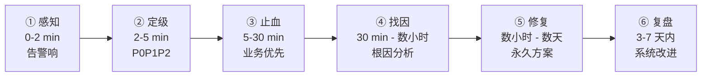
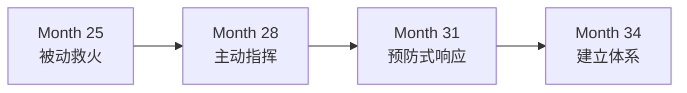

# 9.线上故障应急能力

#### 目录介绍
- [1. 案例引入](#1-案例引入)
  - [1.1 凌晨 3 点的支付雪崩](#11-凌晨-3-点的支付雪崩)
  - [1.2 顺藤摸到根因](#12-顺藤摸到根因)
  - [1.3 我们要回答什么](#13-我们要回答什么)
- [2. 应急全景图](#2-应急全景图)
  - [2.1 应急六阶段](#21-应急六阶段)
  - [2.2 为什么这么切](#22-为什么这么切)
- [3. 止血优先四步法](#3-止血优先四步法)
  - [3.1 先止血再找因](#31-先止血再找因)
  - [3.2 四步动作清单](#32-四步动作清单)
  - [3.3 止血手段优先级](#33-止血手段优先级)
- [4. 故障播报三段式](#4-故障播报三段式)
  - [4.1 播报格式](#41-播报格式)
  - [4.2 播报节奏](#42-播报节奏)
  - [4.3 播报反模式](#43-播报反模式)
- [5. 故障分级与响应 SLA](#5-故障分级与响应-sla)
  - [5.1 P0P1P2P3 分级](#51-p0p1p2p3-分级)
  - [5.2 响应时效表](#52-响应时效表)
  - [5.3 谁来定级](#53-谁来定级)
- [6. 根因分析 5 Whys](#6-根因分析-5-whys)
  - [6.1 从现象挖到系统](#61-从现象挖到系统)
  - [6.2 5 Whys 实战](#62-5-whys-实战)
  - [6.3 挖到"人"就该停](#63-挖到人就该停)
- [7. 复盘不成靶子五步](#7-复盘不成靶子五步)
  - [7.1 事实先行](#71-事实先行)
  - [7.2 责任落到系统](#72-责任落到系统)
  - [7.3 改进 Action 可验证](#73-改进-action-可验证)
  - [7.4 公开与共识](#74-公开与共识)
  - [7.5 30 天回访](#75-30-天回访)
- [8. 故障当事人的自处](#8-故障当事人的自处)
  - [8.1 承认但不塌陷](#81-承认但不塌陷)
  - [8.2 别人问责怎么接](#82-别人问责怎么接)
  - [8.3 事后心态修复](#83-事后心态修复)
- [9. 应急反模式](#9-应急反模式)
  - [9.1 五种反模式一览](#91-五种反模式一览)
- [10. 综合案例串讲](#10-综合案例串讲)
  - [10.1 糖果充的第二次救火](#101-糖果充的第二次救火)
  - [10.2 全过程动作复盘](#102-全过程动作复盘)
  - [10.3 应急哲学回扣](#103-应急哲学回扣)
  - [10.4 应急速查](#104-应急速查)

## 1. 案例引入

### 1.1 凌晨 3 点的支付雪崩

`Month 28`, 糖果充升 Tech Lead 后第 2 个月正式接管支付平台. 一个周三凌晨 3 点 12 分, 他被夺命连环电话叫醒:

```
03:12  值班运维 小赵: "糖哥! 支付大量失败! 商户投诉进来了!"
03:13  糖果充 (还在被窝): "多大量? 什么错?"
       小赵: "全线! 成功率从 99.8 跌到 12%! 报错 timeout!"

03:14  糖果充坐起来打开监控:
       - 支付成功率:    12%       ↓
       - 平均响应时间:  8.7s      ↑ (正常 200ms)
       - 数据库连接池:  100/100   满
       - 商户投诉群:    47 条
```

工作群里已经有 3 个人在吵:

```
03:10  小赵: "支付挂了! 谁在?"
03:11  DBA 老吴: "数据库负载正常啊, 不是我这边问题"
03:12  运维 大刘: "网关流量也没异常, 别甩锅到我这"
03:13  小赵: "反正就是挂了, 你们俩看看!"
```

糖果充第一反应是想去看代码 (上周刚上线"优惠券预扣"), 但脑子里响起老陈半年前的话: **"先止血, 再找因"**. 他做了三个动作:

```
03:15  @所有人 (工作群置顶):
       "【故障应急】03:12 起支付大量超时, 成功率 12%. 我是 owner, 按 P0 处置.
        3 分钟内进战时群: 小赵(运维) / 老吴(DBA) / 大刘(网关) / 小李(支付, 我叫醒他).
        其他人先勿扰, 15 分钟后我播报."

03:16  钉钉建 "P0-支付超时-0918" 群, 拉齐 4 人

03:17  战时群 @全体:
       "分工 (3 分钟后各自播报, 不要闷头查):
        - 小赵: 确认是否需要熔断
        - 老吴: 看数据库慢查询 TOP 10
        - 大刘: 看网关限流是否触发
        - 小李: review 最近 24h 的发布记录
        - 我:   联系值班 SRE 老周 + 通知 leader 老王"
```

**03:20 四路结果汇总**:

```
小赵: "熔断阈值 500ms 已触发, 但下游还在压."
老吴: "慢查询榜首 SELECT coupon_stock, QPS 从 200 涨到 8000!"
大刘: "网关限流没问题, 是应用层扛不住."
小李: "昨天 22:00 上线'优惠券预扣'接口, 新增 SELECT 无索引!"
```

糖果充脑子里"咔嗒"一响 —— 优惠券预扣接口没走 code review (紧急上线走了 fast track). 立即下决策:

```
03:21  糖果充: "止血动作 (我 owner, 决策我担):
             1. 小李: 立即回滚昨晚 22:00 发布
             2. 老吴: 临时给 coupon_stock 表加索引
             3. 大刘: 网关侧对 /coupon/pre-lock 限流 100 QPS
             4. 小赵: 5 分钟后监控成功率"

03:24  小李完成回滚  |  03:26  老吴索引加完
03:28  监控 43% → 78% → 96%  |  03:31  99.6% 恢复
```

**19 分钟从 12% 拉回 99.6%**, 商户投诉群开始出现"恢复了". 糖果充给老王发钉钉:

```
03:33  糖果充 → 老王: "老王, 已止血:
        问题: 昨晚新接口 SELECT 无索引 → DB 打满
        影响: 03:12-03:31, 19 分钟, 成功率最低 12%
        止血: 回滚 + 加索引 + 网关限流  |  当前: 99.6% 稳定
        我 30 分钟后同步详细报告, 上午组织复盘. 你先睡, 我盯到 5 点."
03:35  老王: "OK 辛苦, 复盘我参加"
```

糖果充留守到 05:00 写完 Timeline 才去补觉.

### 1.2 顺藤摸到根因

拆解这次救火, 与他 3 个月前**第一次遇到 P1** 的表现对比:

| 维度 | 第一次 P1 (Month 25) | 这次 P0 (Month 28) |
|---|---|---|
| 心态 | 慌, 打开代码直接改 | 稳, 止血优先 |
| 组织 | 一个人闷头查, 忘通知 Leader | 4 分钟内组建战时群 |
| 沟通 | 群里 15 分钟没消息, 老板打电话来问 | 3 分钟播报制, 主动同步 Leader |
| 交付 | 修完没写 Timeline, 复盘被老陈问懵 | Timeline 分钟粒度, 复盘会主导 |
| 后果 | 被点名"应急意识不足" | CTO 说"糖果充有指挥感了" |

**同一个人 3 个月, 差在哪? 不在技术, 在应急动作库**. 糖果充复盘时给自己列了 3 条:

- **Q1 为什么第一反应想看代码?** — 因为潜意识把"故障 = 修 bug", 没意识到"故障 = 项目" (时间/沟通/决策/复盘四条线并行).
- **Q2 怎么忍住没自己扑上去查?** — 老陈半年前一句话: "故障时, 你自己动手查, 是最没价值的动作. 你的价值是让 4 个人同时查."
- **Q3 怎么知道要先止血?** — 止血 vs 找因是"业务损失 vs 团队面子"的取舍. 业务损失是分钟级钱, 面子是我的事. **先钱后面**.

### 1.3 我们要回答什么

本篇要回答 8 个问题: **① 收到告警头 5 分钟干什么? ② 谁当 Incident Commander? ③ 止血和找因顺序怎么定? ④ 播报发给谁、怎么发、多久一次? ⑤ 故障怎么分级、P0/P1/P2/P3 响应多快? ⑥ 5 Whys 怎么问不变追责会? ⑦ 复盘怎么开不成批斗现场? ⑧ 我就是始作俑者怎么活下来?**

**核心命题**: **P0 时段最贵的不是代码, 是决策** —— **你在故障中的 30 分钟表现, 决定别人未来 3 年是否把关键系统交给你**.

---

## 2. 应急全景图

### 2.1 应急六阶段

一次完整的故障处置, 可拆成六个阶段:



| 阶段 | 目标 | 关键动作 | 常见错法 |
|:--:|---|---|---|
| ① 感知 | 尽快识别 | 告警响应、判断真伪 | 静音告警、等下一波 |
| ② 定级 | 分配资源 | 影响面评估、拉齐指挥 | 定低不喊人、定高扰民 |
| ③ 止血 | 减少损失 | 回滚/限流/降级/切流 | 先查代码、不肯回滚 |
| ④ 找因 | 定位根源 | 日志/监控/复现 | 只看现象不深挖 |
| ⑤ 修复 | 永久解决 | 代码修复、加防护 | 只修表面、留同样的坑 |
| ⑥ 复盘 | 系统提升 | 5 Whys、Action、公开 | 甩锅、走过场、无验证 |

### 2.2 为什么这么切

**六阶段的核心哲学**: **①②③ 用秒/分钟计费, 业务损失线性增长 → 拼动作库**; **④⑤ 用小时/天计费, 团队协作线性推进 → 拼工程能力**; **⑥ 用周计费, 组织学习非线性回报 → 拼诚意**.

**新手的坑**: 把 6 个阶段挤成 2 个 —— "出事修一下"、"修完就完了". **资深的做法**: 每个阶段都有自己的 KPI 和产出.

**指挥官原则 (Incident Commander)**: 故障期间必须有**唯一一个人**拍板, 其他人是"信息提供者"和"动作执行者". **新手最容易做的错事**: 好几个人都在指挥, 谁都不担责.

---

## 3. 止血优先四步法

### 3.1 先止血再找因

**这是应急现场最重要的一条原则, 没有之一**.

- **错法**: "先查清楚原因再决定怎么处理" —— 每多 1 分钟, 业务损失多 1 分钟.
- **对法**: "先用最保守的动作把损失控制住, 再慢慢查" —— 哪怕止血动作有 30% 副作用, 也比让血继续流强.

**为什么新手爱先找因**: (1) 工程师本能 —— 想搞明白 why; (2) 怕背锅 —— 万一止血手段错了又是我; (3) 没经验 —— 不知道止血手段清单.

**资深的口头禅**: "能回滚就回滚, 一切原因分析等回滚完再说"; "能限流就限流, 让 10% 用户失败, 比 100% 全崩强"; "能切流就切流, 把流量导到备用集群, 舞台留给现场分析师".

### 3.2 四步动作清单

**止血动作优先级从高到低**:

| # | 动作 | 条件 | 收益 | 代价 |
|:--:|---|---|---|---|
| 1 | **回滚 Rollback** | 最近有发布, 时间点吻合 | 100% 恢复 | 新功能暂时下线 |
| 2 | **限流 Throttle** | 某个接口暴涨, 其他正常 | 保住其他接口 | 该接口部分用户失败 |
| 3 | **降级 Degrade** | 依赖某服务挂了 | 核心链路保住 | 非核心体验受损 |
| 4 | **切流 Failover** | 单机房/单集群挂了 | 全量切换 | 切流本身几秒抖动 |

**决策口诀**: "**有发布先回滚; 没发布看流量; 流量涨就限流; 依赖挂就降级; 机房挂就切流.**"

### 3.3 止血手段优先级

**为什么"回滚"排第一**: 回滚是唯一能"100% 恢复到已知稳定状态"的动作, 所有其他动作都是"进入未知状态".

**回滚常见误区**:

- ✗ "我这个改动只影响一小部分, 不用回滚" → 一小部分的 bug 也可能引发雪崩.
- ✗ "回滚了业务方投诉新功能不能用怎么办" → 业务方投诉 vs 全线故障, 你选哪个?
- ✗ "回滚等于承认我错了" → 回滚是止血, 不是定罪.

**回滚三条纪律**: (1) 5 分钟内能不能回滚, 决定于发布系统, 不决定于工程师 → 平时要建"一键回滚"能力; (2) 回滚是"决定", 不是"讨论" → 指挥官拍板, 不投票; (3) 回滚后再讨论"该不该" → 先动作后复盘.

**糖果充的实战记录**:

- `Month 25` 纠结要不要回滚 → 拖了 22 分钟 → 老陈打电话强制指令"回滚". 事后老陈说: "**你不敢回滚, 是因为你怕承担'回滚决策错误'的责任. 但你不回滚, 承担的是'业务损失 22 分钟'的责任. 哪个大?**"
- `Month 28` 4 分钟内决策回滚 → 收益 vs 代价心里有杆秤.

---

## 4. 故障播报三段式

### 4.1 播报格式

故障期间**必须有人定时播报** —— 每 15 分钟一次, 让所有相关方在同一个信息层.

**播报三段式**:

```
【故障播报 #N · 时间点】
一、当前状态 (1-2 行, 用数据说话)
   - 影响范围 (什么系统/用户/指标)  |  严重程度 (数字化损失)  |  已恢复百分比
二、正在做的动作 (3-5 行)
   - 谁 在 做 什么 预计什么时候完成
三、下一次播报时间 (通常 15 分钟后, 有重大进展提前)
```

**糖果充这次的三段式实录**:

```
【故障播报 #1 · 03:20】
一、当前: 全线支付超时, 成功率 12% (正常 99.8%), 已定位: 昨晚 22:00 新接口无索引 → DB 打满
二、动作: 小李回滚(预计 03:25) | 老吴加索引(预计 03:27) | 大刘限流(已完成)
三、下次: 03:35

【故障播报 #2 · 03:35】
一、当前: 成功率 99.6% ✅ 恢复, 影响时长 19 分钟, 预估影响 ~2,300 笔 (待精算)
二、动作: 小李精算影响订单+补偿名单 | 老吴索引正式方案(明日) | 我起草 Timeline(上午 10:00 复盘)
三、下次: 上午 10:00 复盘会
```

### 4.2 播报节奏

- **止血阶段 (0-30 min)**: 每 15 分钟一次, 局面变化快.
- **修复阶段 (30 min - 数小时)**: 每 30 分钟一次, 稳定推进.
- **修复完成 → 复盘前**: 每天一次, 低频但要有.
- **复盘之后**: 30 天回访一次, 检验 Action 落地.

**播报要发到哪些群**:

- **必发**: 战时群 (处理团队) / Leader (管理层) / 业务方 & 客服 (对外).
- **选发**: 全公司通告 (P0 且影响面大) / 客户 (需产品/PR 决策).

### 4.3 播报反模式

| # | 反模式 | 示例 | 对法 |
|:--:|---|---|---|
| 1 | 只说"处理中"无数据 | "还在处理中" / "马上好了" | 用数字: 影响面 X% + 已完成 Y% |
| 2 | 报好不报坏 | 只说"已加索引", 不说"还没恢复" | 好坏都报, 免得上级误判 |
| 3 | 技术黑话 | "connection pool 打满导致 downstream 熔断" | "数据库连接不够, 支付大面积失败" |
| 4 | 无下次播报时间 | 发完就没了 | 每条播报都写下次时间 |
| 5 | 多人乱播报 | 战时群 5 个人都在发进度 | 只有 IC 或指定发言人播报 |

---

## 5. 故障分级与响应 SLA

### 5.1 P0P1P2P3 分级

大部分公司都有故障分级制度, 但很多人不知道**怎么用**.

| 级别 | 定义 | 举例 |
|:--:|---|---|
| **P0 灾难级** | 核心业务不可用 / 全线用户受影响 / 有资损或数据损坏或安全事件 | 支付成功率 <50% |
| **P1 严重级** | 核心业务局部不可用 / 大范围用户体验受损 / 有资损但可控 | 某地区支付慢, 或某支付渠道挂 |
| **P2 一般级** | 非核心业务受影响 / 少量用户体验问题 / 无资损 | 优惠券展示错乱 |
| **P3 轻微级** | 内部工具异常 / 单个用户或订单问题 | 客服后台图表加载慢 |

### 5.2 响应时效表

| 级别 | 首响应 | 首播报 | 止血目标 | 复盘时效 | 谁 owner |
|:--:|:--:|:--:|:--:|:--:|---|
| P0 | 5 分钟 | 15 分钟 | 30 分钟 | 24 小时内 | Tech Lead 或以上 |
| P1 | 15 分钟 | 30 分钟 | 2 小时 | 3 天内 | 高级工程师 |
| P2 | 1 小时 | 无强制 | 24 小时 | 1 周内 | 值班工程师 |
| P3 | 工作时间 | 无强制 | 3 天 | 无强制 | 值班工程师 |

**响应时效的意义**: 时效 = 承诺 = KPI 依据. **没在时效内响应, 复盘会被点名; 时效内响应但没解决, 只是继续升级, 不追责**.

### 5.3 谁来定级

**定级三原则**:

- **就高不就低** — 拿不准按更高级别响应, 事后可降级, 但漏报不能补救.
- **业务方声音优先** — 技术觉得 P2, 业务方在冒血, 那就是 P1. 用户体感 > 技术判断.
- **定级人写在 Timeline 里** — 谁定的、什么时候、依据什么, 事后可追溯, 也保护定级人.

**糖果充这次的定级过程**:

```
03:14  糖果充看到成功率 12% → 直接定 P0
03:15  在群里明确: "我判定 P0, 依据: 支付核心业务, 成功率 <50%"
```

事后老王点评: "**你 3 分钟内定 P0 定得对. 我见过太多人纠结'要不要拉 P0 太惊动人' —— 拉高扰民, 拉低耽误业务. 前者是脸面, 后者是钱, 你会选.**"

**新手常见的定级焦虑**: (1) "拉 P0 是不是小题大做?" → 就高不就低, 事后可降; (2) "P0 会不会连累领导睡眠?" → 你半夜叫醒他他感激, 你早上让他被 CEO 问他记恨; (3) "是不是我一个人能扛?" → 应急现场没有"一个人扛", 不喊人是自私, 不是坚强.

---

## 6. 根因分析 5 Whys

### 6.1 从现象挖到系统

**5 Whys 是从现象层挖到系统层的工具** —— 平均问 5 次"为什么", 就能从"表面 bug"挖到"系统缺陷". **关键**: 每一层答案必须能推出下一层的问题, 不能跳.

### 6.2 5 Whys 实战

**糖果充这次故障的 5 Whys**:

```
现象: 支付大量超时
Why 1: 为什么超时?         → DB 连接池打满
Why 2: 为什么打满?         → coupon_stock 慢查询, QPS 从 200 涨到 8000
Why 3: 为什么 SELECT 慢?   → 没有索引, 全表扫描
Why 4: 为什么没有索引?     → 昨晚新接口临时加字段, 建表时没考虑
Why 5: 为什么没走索引评审? → 该接口走了 fast track, 跳过 DBA review
────────────────────────────
挖到系统层: fast track 机制缺少 DBA 二次卡点
```

**改进 Action 一定要落在系统层, 不能落在人层**:

- ✗ 落在人: "小李下次要记得建索引"
- ✓ 落在系统: (1) fast track 发布流程强制加入 SQL review; (2) 新增字段自动扫描 EXPLAIN, 全表扫描告警; (3) 上线前压测环境验证 QPS 峰值.

### 6.3 挖到"人"就该停

**这是 5 Whys 的唯一戒律**: **如果第 N 层答案是"某某人忘了/大意了/没经验", 立刻停下, 你挖偏了, 回到 N-1 层重新挖**.

**为什么**: 挖到"人" = 复盘变追责会 = 团队心态崩塌; 挖到"系统" = 复盘变学习会 = 系统抗风险变强. **追责治不了系统病, 换个新人还会犯; 系统修好, 老员工新员工都不再犯**.

**转换话术**:

- ✗ "为什么小李没加索引?" → ✓ "为什么流程允许无索引 SQL 上线?"
- ✗ "为什么老吴没审出来?" → ✓ "为什么 fast track 跳过了 DBA?"
- ✗ "为什么值班没及时告警?" → ✓ "为什么告警配置漏了这类慢查询?"

**糖果充这次复盘的高光**:

```
老板 (追问): "小李昨晚 fast track 是谁批的?"
糖果充: "老板, 这个问题我建议不追. 我们要追的是: fast track 为什么可以跳过 DBA?
        追人只能让下次小李更害怕, 不解决系统问题. 追系统才能让下次任何人都不会再犯."
(全场沉默 3 秒)
老板: "OK, 就按你说的, 追系统."
```

**这段对话让糖果充在管理层"稳"了**.

---

## 7. 复盘不成靶子五步

### 7.1 事实先行

**复盘会开场的第一句话不是"分析原因", 而是"还原事实"**.

**Timeline 分钟粒度**:

```
时间          | 事件                          | Owner
02:00 (昨天)  | 优惠券预扣接口紧急发布        | 小李
02:15         | 发布完成, 未做压测            | 小李
03:12 (今天)  | 首个支付超时告警              | 系统
03:13         | 值班 小赵 感知, 拉群          | 小赵
03:14         | 糖果充响应, 判定 P0           | 糖果充
03:17         | 战时群建立, 4 路调查          | 糖果充
03:20         | 定位: coupon_stock 无索引     | 4 路
03:21         | 决策: 回滚 + 加索引 + 限流    | 糖果充
03:24 / 03:26 | 回滚完成 / 索引完成           | 小李 / 老吴
03:31         | 成功率恢复 99.6%              | -
03:33         | 首次同步 Leader               | 糖果充
05:00         | Timeline 完成                 | 糖果充
```

**Timeline 三条纪律**: (1) **只写事实, 不写判断** — ✗ "小李错误地上线了" / ✓ "小李在 02:00 通过 fast track 发布"; (2) **精确到分钟, 有争议时间点写"约"** — "约 02:15" 比 "凌晨" 强; (3) **所有 owner 都要出现** — 免得复盘时"我不知道那时候我在做什么".

### 7.2 责任落到系统

**责任分析**只在**系统层**分析, 不在**人层**分析:

- ✗ "谁的锅?" → ✓ "什么机制让这个 bug 溜进生产?"
- ✗ "小李该背 P0" → ✓ "fast track 流程需要加 SQL 卡点"
- ✗ "小赵响应慢了" → ✓ "告警到人的路径, 中间丢了 2 分钟"

**复盘定性的三种正确表述**: (1) **流程缺陷**: "我们的流程漏了 XX 环节"; (2) **工具缺陷**: "我们的工具没自动检测 XX"; (3) **意识缺陷**: "团队对 XX 场景重视不够, 需要培训".

**永远不要出现**: "某某人不专业" / "某某人不负责" / "某某人经验不足".

### 7.3 改进 Action 可验证

**Action 三要素**: **Owner** (具体到人, 不是"研发组") / **Due** (具体到日期, 不是"尽快") / **验证方式** (具体到指标, 不是"注意").

**这次复盘的 Action 清单**:

| # | Action | Owner | Due | 验证 |
|:--:|---|---|---|---|
| 1 | fast track 流程加 SQL review 卡点 | 老吴 (DBA leader) | 10/15 | 新流程发布单测试用例覆盖率 100% |
| 2 | 新增字段自动 EXPLAIN 扫描告警 | 老陈 (架构) | 11/01 | 灰度环境跑通 3 个测试案例 |
| 3 | coupon_stock 索引优化 (临→正) | 小李 | 09/20 | 索引发布 + 慢查询消失 |
| 4 | P0 应急演练每季度 1 次 | 糖果充 | 每季度末 | 演练报告 + Timeline 分钟级 |

### 7.4 公开与共识

**复盘会不是"内部秘密"**, 应该公开到部门. **好处**: (1) 让其他团队从别人的坑里学习; (2) 提升团队的应急文化; (3) 保护当事人 (公开定性 = 组织担责, 而非个人担责).

**公开的形式**: Timeline → 邮件/文档平台; 5 Whys → 内部技术论坛; Action 表 → 项目管理平台 (可跟踪); 30 天回访 → 短同步邮件.

**公开的边界**: **可公开** — 现象、时间线、根因分析、Action、验证; **不公开** — 具体人的操作细节 (除非本人同意), 商业敏感数据 (脱敏).

### 7.5 30 天回访

**没有 30 天回访的复盘 = 没做复盘**.

**回访模板**:

```
【故障复盘 30 天回访 · 0918 支付超时】
Action 完成: 1 SQL review 已上线, 拦截 2 起类似 ✅
             2 EXPLAIN 扫描已上线, 告警 1 次 ✅
             3 索引优化已上线 ✅   |   4 应急演练 Q4 已规划 ⏳
延伸影响: fast track 使用次数 -40% (有效)  |  值班响应 P95: 15 → 8 分钟
未预期问题: SQL review 导致部分紧急需求延误 4 小时
           → 下次优化: 加"高优先级绿色通道 + 事后审计"
```

**30 天回访的价值**: (1) 验证 Action 是否真的解决问题; (2) 发现 Action 引入的副作用; (3) 沉淀"故障 → 系统改进"的组织记忆.

---

## 8. 故障当事人的自处

### 8.1 承认但不塌陷

**如果这次故障是你直接引起的** (比如你就是那个上线新接口的人), 怎么活下来?

**承认的三个层次**:

- **第一层 (最差) 死不承认**: "我这个改动没问题, 是别人的锅" → 让团队反感, 让复盘偏离.
- **第二层 (中等) 全揽下来**: "都是我的错, 我辞职" → 情绪化, 无益于系统改进.
- **第三层 (最好) 事实承认 + 系统视角**: "这个改动是我发布的, 我承担直接责任. 但流程本身有缺陷, 我们要一起把系统改好, 避免下一个'小李'再犯." → 展示担当 + 引导团队向前看.

**糖果充给小李在复盘会的定调**:

```
老板: "小李, 你说说这次是怎么回事?"
小李 (紧张): "我...... 我昨晚紧急上线..."
糖果充 (打断): "老板, 我作为 owner 说下: 小李按 fast track 流程操作, 流程本身允许跳过 DBA
             review, 不是他个人问题. 我们今天复盘的是流程, 不是小李. 小李在这次事件中
             3 分钟就承认并配合回滚, 这是应急现场应有的表现."
小李: (眼泪没掉下来)
老板: "OK, 就按 owner 说的方向复盘."
```

**这段话让糖果充在团队心里"封神"** —— 下属知道你是罩得住的.

### 8.2 别人问责怎么接

**如果有人在复盘会上直接质问你**:

**质问型 1 · 追责型**

- 质问: "小李, 你昨晚为什么走 fast track?"
- 弱回应: "因为 leader 让我快点上..." (甩锅)
- 强回应: "我昨晚判断这是紧急需求, 走了 fast track. 决策依据是 [业务方 22:00 前必须上], 当时没意识到 SQL 无索引风险. 这是我个人判断失误. 建议: fast track 里加 SQL 卡点, 让流程帮我把这类判断兜住."
- **关键**: 承认判断 + 说清依据 + 提改进 = "我不完美但我在成长".

**质问型 2 · 翻旧账型**

- 质问: "你上次 P1 就干过类似的事, 怎么又来?"
- 弱回应: "上次不一样..." (辩解)
- 强回应: "上次 P1 我的问题是 X, 这次是 Y, 场景不同但都反映了'我对压测重视不足'的共性问题. 这周开始给自己加一条规矩: 所有上线前压测环境跑 3 遍."
- **关键**: 承认共性 + 给出可验证动作 = 从"辩解"到"改进".

**质问型 3 · 情绪型**

- 质问: "你这么搞我们业务方还要不要活?"
- 弱回应: "对不起对不起..." (道歉但没方向)
- 强回应: "我完全理解您的愤怒. 业务受损是我们的责任. 已启动补偿方案: [具体动作]. 我接下来 30 天会 owner 这个模块的稳定性提升. 您的意见是我们复盘 Action 的一部分."
- **关键**: 接情绪 + 给动作 + 给承诺 = 让对方从愤怒到期待.

### 8.3 事后心态修复

**故障当事人最痛的往往不是"被问责", 而是"自我否定"**: "我是不是根本不适合这行" / "团队会不会永远看不起我" / "我职业生涯完了".

**心态修复三步**:

- **第 1 步 事实剥离**: 写下"这次我做错的是 X, 做对的是 Y" → 大部分人只记住做错的, 忽视应急中做对的.
- **第 2 步 系统归因**: 写下"如果流程/工具/培训 3 件事到位了, 我还会犯错吗?" → 大概率答案是"不会", 说明不是"我不行".
- **第 3 步 时间隔离**: 给自己 7 天缓冲期, 不做重大决定 (辞职/转行/放弃) → 7 天后再看, 80% 的想法会变.

**糖果充第一次 P1 的自我修复日记摘录**:

```
9/05 (P1 当天): "我完了, 团队肯定觉得我不行, 老陈今天没看我."

9/08 (3 天后): "冷静看, 我做对了 3 件 (承认没甩锅 / 主动写 Timeline / 提 3 个 Action);
              做错 2 件 (慌到没通知 Leader / 独自扛太久没喊人)."

9/12 (一周后): "老陈找我聊, 说他第一次搞挂线上是 25 岁, 修了 6 小时. 他没批评我,
              反而说'能哭出来的都还有救'."

9/15 (两周后): "我给自己定了 3 条: (1) 每次上线前跑一遍'如果这个挂了怎么办';
              (2) 阻塞 15 分钟未解决必须喊人; (3) 每季度主动做一次故障演练.
              从今天起, 我不是'搞挂过 P1 的糖果充', 是'从 P1 里学过东西的糖果充'."
```

---

## 9. 应急反模式

### 9.1 五种反模式一览

| # | 反模式 | 现象 | 危害 | 对法 |
|:--:|---|---|---|---|
| 1 | **埋头修不播报** | 埋头查代码 30 分钟群里没消息 | 上级被 CEO 问懵、业务方越等越焦虑、战友重复工作 | 规定 15 分钟必播报, 哪怕内容是"还在查" |
| 2 | **先找因后止血** | 一定要"查明白再动手" | 每多 1 分钟 = 损失 1 分钟 | 按"最保守假设"回滚/限流/降级/切流, 再找因 |
| 3 | **一人扛不喊人** | 怕麻烦别人自己扛 | 单点故障、决策孤单、事后追责 | 故障没有"个人英雄", P0 强制拉战时群 |
| 4 | **复盘变批斗** | 复盘会变追责会, 围攻当事人 | 团队心态崩、掩盖真问题、优秀员工离职 | 定性不定人, 主持人主动打断"追责话术" |
| 5 | **Action 走过场** | 列 10 条, 30 天后一条没落地 | 同类故障重复、团队对复盘失信、组织学习能力下降 | Action ≤5 条 + Owner/Due/验证 + 30 天回访 + 未完成升级 |

---

## 10. 综合案例串讲

### 10.1 糖果充的第二次救火

三个月后 (`Month 31`), 支付平台又遇到一次准 P0 —— 双 11 前的压测流量导致 **Redis 集群 CPU 95%**. 糖果充第一时间接住:

```
20:15  告警: Redis CPU > 90% 持续 3 分钟
20:16  糖果充在办公室, 立即拉战时群
20:17  发首条播报: "【P1 预警】Redis CPU 95%, 我 owner,
       已拉齐 SRE 老周 / DBA 老吴 / 缓存组 小周. 分工:
       - 老周: 3 min 内看流量 TOP 10 key
       - 老吴: 3 min 内看是否是持久化写入
       - 小周: 3 min 内看客户端连接数
       20:20 播报第二次."

20:20  播报 #2: "定位: 新上线 key 'user:cart:*' 单 key 4MB, 被 hot 访问.
                止血: 立即禁用该功能, 老周操作."
20:23  禁用完成, CPU 降回 40%
20:25  播报 #3: "已恢复, 全过程 10 分钟."
20:30  老陈在群里发了个 👍
```

### 10.2 全过程动作复盘

**时间轴对比**:

| 时刻 | Month 25 (第一次 P1) | Month 28 (第二次 P0) | Month 31 (第三次 P1 预警) |
|:--:|---|---|---|
| 感知 | 10 分钟才响应 | 3 分钟内响应 | 1 分钟内响应 |
| 定级 | 犹豫是否拉 | 3 分钟内 P0 | 1 分钟内 P1 |
| 建群 | 15 分钟后建 | 4 分钟内建 | 2 分钟内建 |
| 首播报 | 30 分钟才播 | 8 分钟内播 | 2 分钟内播 |
| 止血决策 | 22 分钟才回滚 | 9 分钟决策 | 5 分钟决策 |
| 恢复时长 | 47 分钟 | 19 分钟 | 8 分钟 |

**成长曲线**:



### 10.3 应急哲学回扣

回望这三次应急表现, **故障应急能力**的本质是:

```
初级:  修 bug     (我把问题修好了)
中级:  救火       (我把损失止住了)
高级:  指挥       (我让 5 个人同时救火)
资深:  防患       (我让下次不会再发生)
大师:  文化       (我让团队都会救火)
```

**应急能力的四层修炼**: **① 动作库** (回滚/限流/降级/切流) → **② 指挥感** (Incident Commander) → **③ 播报力** (信息透明) → **④ 复盘力** (系统改进).

**核心命题**: **P0 时段是资深工程师的"高考"** —— 平时看不出的差距, 30 分钟里全部显性化.

**渐进模型**:

```
1 分钟:   感知 → 定级       |   5 分钟:  拉齐 → 分工
15 分钟:  止血 → 首播报     |   30 分钟: 恢复 → 定 owner
24 小时:  Timeline + 5 Whys |   7 天:    复盘会 + Action
30 天:    Action 验收 + 回访
```

**结论**: **故障不是坏事, 是"团队体检"** —— 一次 P0 = 平时 3 个月看不出的系统问题一次性暴露. **能把 P0 变成"体检报告 + 改进方案"的人, 才是资深**.

### 10.4 应急速查

**应急速查表**:

| 场景 | 动作 |
|------|-----|
| 告警响起 | 5 分钟内响应 + 判定级别 |
| 定级 P0 | 拉战时群 + 明确 Incident Commander |
| 止血决策 | 回滚 → 限流 → 降级 → 切流 |
| 首次播报 | 15 分钟内, 三段式 |
| 播报节奏 | 止血阶段 15 min, 修复阶段 30 min |
| 5 Whys | 挖到"系统"就停, 挖到"人"就回退 |
| 复盘会 | 24-72 小时内, 定性不定人 |
| Action | ≤5 条, Owner + Due + 验证 |
| 30 天回访 | 验证 Action 是否落地 |
| 当事人自处 | 承认 + 系统归因 + 时间隔离 |

**P0 处置 30 分钟节奏**: 0-2 min 感知定级 → 2-5 min 拉战时群明确 Commander → 5-10 min 四路调查 3 分钟播报 → 10-15 min 首次群播报通知 Leader → 15-30 min 止血完成二次播报 → 30 min 稳定起草 Timeline.

**故障播报三段式**: 当前状态 (影响 + 数据 + 恢复率) → 正在做的 (谁 做 什么 何时完成) → 下次播报时间.

**5 Whys 停止条件**: ✓ 挖到"流程/工具/意识" → 继续挖 Action; ✗ 挖到"某某人" → 停, 回退一层重新问.

**复盘五步**: 事实还原 (Timeline 分钟粒度) → 5 Whys (挖到系统层) → 定性不定人 (人 → 系统) → 改进 Action (Owner + Due + 验证) → 公开共识 + 30 天回访.

**故障当事人心态修复三步**: 事实剥离 (做错 X + 做对 Y) → 系统归因 (流程/工具/培训是否到位) → 时间隔离 (7 天冷静期不做重大决定).

---

**下一集预告**: 糖果充这次 P0 处理得漂亮, CTO 单独找他聊: "**你救火不错, 但我更想问 —— 上周你干了 5 件事, 我只知道 2 件, 剩下 3 件是听别人说的**." 糖果充蒙了: "我不是每周都发周报了吗?" CTO: "你的周报我从来看不完 —— 全是技术细节, 我要的是'你在解决什么业务问题'." 糖果充这才发现, **技术能力再强, 让老板看不见, 等于零**. **第 10 篇《向上沟通汇报能力》**告诉他: **干得多不如说得清, 说得清不如说得准**.

---

**本篇速查表**:

| 维度 | 关键武器 |
|---|---|
| 感知定级 | 5 分钟响应 + 就高不就低 |
| 止血四步 | 回滚 → 限流 → 降级 → 切流 |
| 播报三段式 | 状态 + 动作 + 下次时间 |
| 分级 SLA | P0 5min / P1 15min / P2 1h / P3 工作时间 |
| 5 Whys | 挖到系统止, 挖到人回退 |
| 复盘五步 | 事实 + 5Why + 定性 + Action + 回访 |
| 当事人自处 | 承认 + 系统归因 + 时间隔离 |
| 反模式 | 埋头不播报 / 先找因后止血 / 一人扛 / 复盘变批斗 / Action 走过场 |
