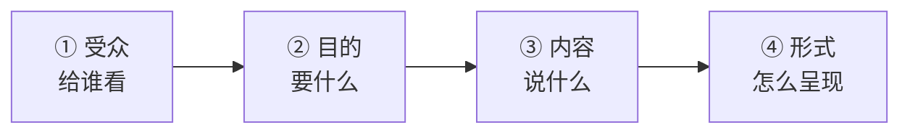
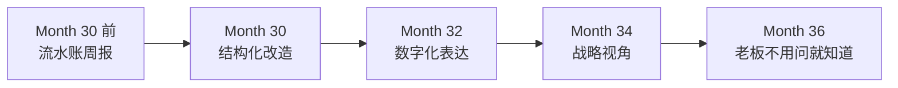

# 10.向上沟通汇报能力

#### 目录介绍
- [1. 案例引入](#1-案例引入)
  - [1.1 周报被 CTO 划掉一半](#11-周报被-cto-划掉一半)
  - [1.2 顺藤摸到根因](#12-顺藤摸到根因)
  - [1.3 我们要回答什么](#13-我们要回答什么)
- [2. 汇报全景图](#2-汇报全景图)
  - [2.1 汇报四要素](#21-汇报四要素)
  - [2.2 老板要的 vs 你写的](#22-老板要的-vs-你写的)
- [3. 汇报金字塔](#3-汇报金字塔)
  - [3.1 结论先行](#31-结论先行)
  - [3.2 三点支撑](#32-三点支撑)
  - [3.3 细节按需下钻](#33-细节按需下钻)
- [4. 3-3-3 汇报节奏](#4-3-3-3-汇报节奏)
  - [4.1 每日 3 句](#41-每日-3-句)
  - [4.2 每周 3 段](#42-每周-3-段)
  - [4.3 每月 3 张图](#43-每月-3-张图)
- [5. 老板脑图](#5-老板脑图)
  - [5.1 三类老板关注点](#51-三类老板关注点)
  - [5.2 反推老板 KPI](#52-反推老板-kpi)
  - [5.3 用老板的语言](#53-用老板的语言)
- [6. 坏消息四段式](#6-坏消息四段式)
  - [6.1 报忧比报喜更难](#61-报忧比报喜更难)
  - [6.2 四段式模板](#62-四段式模板)
  - [6.3 报忧的时间点](#63-报忧的时间点)
- [7. 跨级汇报的分寸](#7-跨级汇报的分寸)
  - [7.1 跨级的三条边界](#71-跨级的三条边界)
  - [7.2 让上级不越级](#72-让上级不越级)
  - [7.3 直属 Leader 不失位](#73-直属-leader-不失位)
- [8. 汇报的日常动作](#8-汇报的日常动作)
  - [8.1 电梯 30 秒话术](#81-电梯-30-秒话术)
  - [8.2 1v1 高效准备](#821v1-高效准备)
  - [8.3 会议中的表达时机](#83-会议中的表达时机)
- [9. 汇报反模式](#9-汇报反模式)
  - [9.1 五种反模式一览](#91-五种反模式一览)
- [10. 综合案例串讲](#10-综合案例串讲)
  - [10.1 糖果充的周报重写](#101-糖果充的周报重写)
  - [10.2 汇报全过程复盘](#102-汇报全过程复盘)
  - [10.3 汇报哲学回扣](#103-汇报哲学回扣)
  - [10.4 汇报速查](#104-汇报速查)

## 1. 案例引入

### 1.1 周报被 CTO 划掉一半

`Month 30`, 糖果充升 Tech Lead 后第 4 个月. 前一周处理完一个 P0, 做了 3 个技术选型, 还带团队跑通了新中间件调研. 他自认为**这是升职以来最有产出的一周**, 周日晚上写周报写到 12 点.

第二天, CTO 老李把糖果充叫进办公室:

```
老李: (把打印的周报推过来) "小杨, 你这周报我读了 15 分钟. 先问你三个问题:
      1. 你上周解决了什么业务问题?
      2. 你下周最优先的一件事是什么?
      3. 你有什么事需要我帮忙? 能回答吗?"

糖果充: (愣 5 秒) "呃...我处理了 P0, 做了 Redis 选型, 还调研了..."

老李: (打断) "你说的这些, 我要么早就知道 (P0), 要么不关心 (调研).
             我作为 CTO, KPI 是 [业务稳定性 + 团队产出效率]. 你的周报里这两个词一个都没出现.
             你写了 8 项, 我红笔划掉 5 项, 不是因为不重要 —— 是它们不该出现在给我的周报里."
```

糖果充拿回周报, 看到老李的批注:

```
本周工作 (糖果充原文)                          | 老李批注
─────────────────────────────────────────────────────────
1. 处理支付超时 P0                              | ✗ 已知
2. Redis 集群选型 (Redis Cluster vs Codis)     | △ 结论呢?
3. 调研 K8s Ingress 新版本                      | ✗ 不关心
4. Review 团队 15 个 PR                         | ✗ 你本职
5. 参加 3 个跨部门会议                          | ✗ 是过程不是结果
6. 招聘: 面试 4 个候选人                        | △ 有没有 offer?
7. 写技术分享 PPT                               | ✗ 无关
8. 学习 gRPC                                    | ✗ 私事

红色批注结论: "你写的是 8 项'我做了什么', 我要的是 3 件'因为你, 什么变好了'."
```

**这顿点评把糖果充打醒了**. 他之前一直以为周报是"日志", 现在才知道**周报是"影响力窗口"**.

### 1.2 顺藤摸到根因

糖果充回工位对着周报发呆一小时, 把自己写的 8 项和老李划掉的 5 项对比:

| 维度 | 糖果充原思路 | 老李的思路 |
|---|---|---|
| 心态 | 我做了 8 件事, 每件都很重要 | 8 件我只关心 3 件 — 影响业务/影响团队/需要我决策 |
| 格式 | 时间顺序 + 技术细节 (自己视角) | 业务影响 + 关键决策 (老板视角) |
| 结论 | "本周辛苦, 下周继续" | "本周达成 X, 遇到 Y, 需要你帮 Z" |

再往深挖 3 个本质差距:

- **Q1 为什么写"我做了什么"而不是"我影响了什么"?** — 还是工程师思维, 关注"输入"而非"产出".
- **Q2 为什么什么都想让老板知道?** — 因为我怕老板觉得我不忙 —— 这是"表演型工作".
- **Q3 为什么没提"需要老板帮什么"?** — 因为我怕显得能力不够 —— 但老板恰恰需要"知道你缺什么".

**糖果充这才第一次意识到**: **"汇报"不是"报告我在忙", 而是"帮老板做决定". 你在他脑子里越清晰, 他给你的资源越多, 机会越大**.

### 1.3 我们要回答什么

本篇要回答 8 个问题: **① 周报到底给谁看? ② 老板一周花在你身上的注意力只有 3 分钟怎么用? ③ 结论先行怎么倒着写? ④ 每日/每周/每月节奏怎么切? ⑤ 报忧怎么报不让老板炸? ⑥ 跨级汇报的边界在哪? ⑦ 电梯里遇到大老板 30 秒说什么? ⑧ 老板问"最近怎么样"怎么答?**

**核心命题**: **你干得多, 不如说得清; 说得清, 不如说得准**. **老板对你的印象, 90% 来自"你告诉他的部分", 只有 10% 来自"他实际观察到的"**.

---

## 2. 汇报全景图

### 2.1 汇报四要素

任何一次汇报, 都可以拆成四个要素:



| 要素 | 关键问题 | 常见错法 |
|:--:|---|---|
| ① 受众 | 老板/上级老板/平级/下属 关心的不同 | 一稿多发, 全员群发 |
| ② 目的 | 让老板做决定 / 建立信任 / 求资源 / 报进度 | 目的模糊, 只是"打卡" |
| ③ 内容 | 结论 + 3 个支撑点 + 1 个诉求 | 流水账, 8 项全罗列 |
| ④ 形式 | 邮件 / 钉钉 / 1v1 / PPT / 电梯口 | 用错媒介, 场合错配 |

**四要素组合对比**:

```
资深:  受众 CTO / 目的 让他决策 Redis 选型 / 内容 结论 + 3 理由 + 1 风险 / 形式 3 段钉钉私聊, 5 分钟决策
新手:  受众 全组 20 人 (乱撒网) / 目的 报告"我在忙" / 内容 30 页 PPT / 形式 @所有人 附 PPT
```

**同样内容, 前者 5 分钟落地决策, 后者 3 小时无回响**.

### 2.2 老板要的 vs 你写的

**这是所有汇报错位的根源**. 用一张对照表刺穿:

| 你写的 (工程师视角) | 老板想看的 (管理者视角) |
|---|---|
| 我做了 8 件事 | 你解决了 3 个问题 |
| 技术选型 A/B 对比 | 你推荐 A, 因为 3 个理由 |
| 调研了 K8s 新版本 | 是否影响我们上线计划 |
| 面试了 4 个人 | 招到了几个 offer |
| 处理了 P0 | 复盘 Action 谁 owner 什么时候完成 |
| 学习了 gRPC | 我们要不要在项目中用 |
| Review 了 15 个 PR | 这周团队交付质量如何 |
| 参加了 3 个跨部门会 | 会议输出的关键决策是什么 |

**规律**: 你写的是"过程" (verb + 我); 老板要的是"结果" (noun + 影响).

**核心口诀**: **每一条汇报都要能回答"So what?"** —— "我做了 Redis 选型" → so what? → 集群 QPS 能撑到多少? 上线时间? 成本? "我处理了 P0" → so what? → 业务恢复了多久? 复盘 Action 落地了吗?

---

## 3. 汇报金字塔

### 3.1 结论先行

**汇报金字塔**是巴巴拉·明托《金字塔原理》的核心思想, 用到工程师汇报场景:

```
    ┌──── 结论 (Top) ────┐         ← 第 1 层: 一句话
    │                    │
    ├──── 三点支撑 ──────┤         ← 第 2 层: 3 个要点
    │  (Support)         │
    ├── 细节 (下钻按需) ─┤         ← 第 3 层: 数据/案例
    └────────────────────┘
```

**结论先行的核心**: **用 15 秒讲完主线, 让老板决定"要不要听下去"**.

**对比示例**:

```
✗ 新手 (归纳式, 从细节到结论):
"老板, 我上周分析了 Redis Cluster 源码, 对比了 Codis 分片方案, 调研了业界几家公司选型...
 (15 分钟后) ... 综上, 建议选 Codis."
→ 老板听了 15 分钟才知道结论, 内心崩溃

✓ 资深 (演绎式, 从结论到细节):
"老板, 结论: 建议选 Codis. 三个理由:
 1. 团队有 2 人有 Codis 运维经验, 学习成本低
 2. Codis 支持在线扩容, Redis Cluster 需要停机
 3. 硬件复用率高 30%
 一个风险: 社区活跃度低于 Redis Cluster, 但内部支持能覆盖.
 需要您决策: 是否本周启动 POC?"
→ 老板 30 秒内明白, 5 分钟内决策
```

**结论先行的三条纪律**: (1) 结论一句话, 不超过 30 字; (2) 结论必须是"判断"或"决策"或"求助", 不是"陈述事实"; (3) 结论后立刻给"因为" —— 三个理由并列.

### 3.2 三点支撑

**为什么是"三点"**: 1 点显得单薄, 2 点容易被抓遗漏, 3 点正好覆盖 (主/辅/风险)、记忆友好, 4+ 点老板边听边遗忘.

**三点的常见组合**:

| 场景 | 三点是什么 |
|:--:|---|
| 技术选型 | 主要理由 / 次要理由 / 风险与应对 |
| 项目进度 | 已完成 / 阻塞 / 下周计划 |
| 报忧 | 问题现状 / 影响面 / 需要老板做什么 |
| 求资源 | 现状 / 缺口 / 补齐后的收益 |
| 复盘 | 做对的 / 做错的 / 下一步改进 |

**三点必须"并列且互斥"** —— 不能有交叉:

- ✗ 差: (1) Codis 团队会用 (2) Codis 好维护 (3) Codis 好运维 — 2 和 3 重复.
- ✓ 好: (1) 团队熟悉度 (人) (2) 技术能力 (物) (3) 成本 (钱).

### 3.3 细节按需下钻

**第三层"细节"的核心原则**: **老板不问, 你不讲**.

**下钻的信号**: 老板问"为什么 Codis 硬件复用率高?" → 你可下钻到具体数据 (60% → 85%); 老板问"运维经验具体指什么?" → 你可下钻到具体人员 (小周 3 年, 小李 1 年); 老板没问 → 你就不要主动下钻.

**新手常犯的错**: 老板刚问一句, 你就把 30 页 PPT 全讲一遍.

**资深做法**: 老板问 A → 答 A (一句), 停顿, 看老板反应; 若追问 B → 答 B; 若不追问 → 说"如需更多细节, 我可以发文档". **主动权在老板, 你负责响应, 而不是"倾倒信息"**.

**信息倾倒的危害**: 显得你不会分主次; 老板听不完就走神; 你重要的观点被淹没在细节里.

---

## 4. 3-3-3 汇报节奏

### 4.1 每日 3 句

**每日汇报的目的**: 让老板"知情"但"不打扰".

**每日 3 句模板**:

```
【日报 · 09-25】
昨完成: XXX (一句, 有明确结果)
今计划: XXX (一句, 具体动作)
阻塞:   无 / XXX (一句, 需要谁帮什么)
```

**糖果充的日报实例**:

```
【日报 · 09-25】
昨完成: Redis 选型 POC 完成 90%, 剩最后一个 failover 测试
今计划: 下午跑完 failover 测试, 晚上 6 点给老板发选型报告
阻塞:   无
```

**要点**: (1) 三句话不超过 100 字; (2) 发到"你和老板的私聊", 不是群; (3) 时间点固定 (每天 09:00 或 18:00); (4) 阻塞必须写 (哪怕是"无") → 让老板知道你有 checkpoint 意识.

**新手常犯的错**: ✗ "今天开了 3 个会, 处理了几个 bug, 学习了 gRPC" (老板看不到具体输出, 觉得你在划水); ✗ "完成了 Redis 搭建, 遇到版本兼容/网络配置/内存分配..." (太多细节); ✗ 一周只发一次日报, 然后一周不发 (节奏乱, 老板没安全感).

### 4.2 每周 3 段

**每周周报是"影响力窗口"**, 不是"日志".

**每周 3 段模板**:

```
【周报 · Week 39 · 糖果充】

## 一、本周关键产出 (3 条)
1. [业务影响] 支付平台稳定性: 成功率 P95 从 99.6% → 99.85%
2. [团队产出] Redis 选型定稿, 已启动 POC, 下周三出结论
3. [招聘] 高级工程师 offer 发出 1 份, 候选人预计下周入职

## 二、风险与阻塞 (最多 2 条)
1. Codis 硬件采购走 IT 流程, 预计延迟 3 天 → 需老板协调采购
2. 团队小李近期状态不稳定, 我会做 1v1 (无需老板介入)

## 三、下周计划 (3 条)
1. Redis POC 收尾, 27 号出选型 review
2. 支付平台 Q4 稳定性方案文档定稿
3. 完成 1 位高工入职引导
```

**周报三段的价值**: 段一让老板看到"我在做正确的事" (对齐 KPI); 段二让老板看到"我在管理风险" (你在 own 事情); 段三让老板看到"我知道去哪" (你有节奏感).

**周报的三条纪律**:

- **每条前面加 [业务/团队/招聘/技术债] 标签** → 让老板 3 秒扫过就分类完.
- **数字化, 数字化, 数字化** — ✗ "支付稳定性有提升" / ✓ "支付成功率 P95 99.6% → 99.85%".
- **有始有终** — 上周说"下周三出结论", 这周必须回应"是否出了". **断链的周报会让老板失去信任**.

### 4.3 每月 3 张图

**月度汇报**目的是**回顾大盘 + 展望方向**, 比周报更"战略".

**月度 3 张图**:

```
图 1: 关键指标趋势 (业务/技术)   —— 支付成功率月度曲线 / P0/P1 故障次数 / 团队交付吞吐量
图 2: 项目里程碑达成情况        —— 计划 vs 实际 / 延期项目分析
图 3: 下月重点 + 需要老板支持    —— 战略优先级 / 资源缺口
```

**月度汇报的重点**: 不再讲"做了什么" (那是周报层次), 要讲: 团队变强了什么 (能力/流程/工具); 业务变好了什么 (指标/口碑); 我作为 Tech Lead 的判断是什么.

**糖果充的月报开头**:

```
【9 月月报 · 支付平台 · 糖果充】
## 本月一句话总结
支付平台稳定性冲进 99.85%, 团队应急能力质变, 但技术债累积速度是化解速度的 1.5 倍
—— 需要老板决策 Q4 是否启动"技术债专项".
```

**一句话总结**: 既有事实 (99.85%), 也有判断 (技术债需专项), 也有诉求 (决策) —— 这是资深味道.

---

## 5. 老板脑图

### 5.1 三类老板关注点

**不同层级的老板, 关注点完全不同**:

| 层级 | 关注点 | 关注周期 |
|---|---|---|
| **直属 Leader (Team Lead / Manager)** | 团队推进如何 / 个人成长 / 阻塞协调 | 每日/每周 |
| **二级老板 (Director / Sr. Manager)** | 解决什么业务问题 / 跨部门推动 / 团队士气 | 每周/每月 |
| **三级老板 (VP / CTO)** | 影响什么业务指标 / 战略判断 / 培养谁 | 每月/每季度 |

**层级越高, 越关注"结果 + 判断 + 人", 越不关心"技术细节"**.

**同一件事 (Redis 选型完成), 面对三类老板的表述差异**:

```
给直属 Leader: "Codis 选型定稿, POC 完成, 27 号出评审, 需要您协调硬件采购流程."

给 Director:  "缓存架构方案本周定稿, 预计 Q4 上线, 稳定性目标 99.9%, 硬件成本节省 30%."

给 CTO:      "缓存架构升级, 是我们 Q4 稳定性大盘的第 2 个关键项. 我判断这次升级能把大促场景
             的支付成功率再拉 0.1 个百分点. 3 位新入职工程师正好用这个项目练手."

同一件事 → 三种视角.
```

### 5.2 反推老板 KPI

**理解老板 KPI 是"向上管理"的第一步**.

**反推老板 KPI 的三条路径**:

- **直接问 (最有效)**: "老板, 您今年 Q4 最重要的 3 件事是什么? 我看看能在哪里出力." → 大部分老板会认真回答, 因为他也希望你的努力对齐他的目标.
- **观察行为**: 老板一周开的会 60% 是关于什么? 老板对哪些数字最紧张? 老板给谁投入时间最多? → 那就是他真正的 KPI.
- **从他的老板反推**: 你老板的老板关心什么 → 那就是你老板的 KPI.

**KPI 对齐的话术**: 低对齐 "我这周做了 X" / 高对齐 "我这周做的 X, 对齐了您 Q4 的稳定性目标"; 低对齐 "我想搞 A" / 高对齐 "为了您 Q4 的稳定性目标, 我建议搞 A".

**糖果充的实践**:

```
Month 30 (被批周报后), 糖果充主动找老李:
"老板, 您 Q4 最看重的 3 件事我列一下:
 1. 支付稳定性冲 99.9%   2. 团队交付吞吐 +20%   3. Q4 内孵化 1 个新业务线. 对吗?"

老李: "前两个对, 第 3 个不是 Q4, 是明年 Q1. Q4 我要的是'为孵化做好准备'."

糖果充: "OK, 那我的季度目标就是: 稳定性 + 团队产出 + 孵化前期."

老李: (点头) "从现在起, 你的每次汇报都对齐这 3 个."
```

**这次对话之后, 糖果充的周报再没被划过**.

### 5.3 用老板的语言

**"用老板的语言"**指的是: **采用他的口头禅、他的术语框架、他的思考单位**.

**举例**: 老板常说 "抓大放小" → 你汇报时用"抓大放小的分工"; 常说 "闭环" → 你用"闭环了 X"; 常说 "结果导向" → 你用"结果是..."; 常说 "顶层设计" → 你战略汇报时用"顶层设计上...". **用老板的语言 = 让老板"耳熟", 记忆和认同都在潜意识加分**.

**警告**: 不是拍马屁, 是"共同话语体系". 你不需要变成老板, 但你要能"翻译到老板的频道".

---

## 6. 坏消息四段式

### 6.1 报忧比报喜更难

**大部分工程师最难的是"报忧"**: 报喜心理"赶紧告诉老板让他高兴"; 报忧心理"能不能不告诉, 或者晚点告诉..."; 结果 —— 报忧永远比报喜晚, 而且往往晚到"补救不了"的时候.

**报忧的三大恐惧**: (1) 老板生气骂我; (2) 显得能力不行; (3) 影响绩效.

**资深的认知**:

- **真相 1**: 老板骂你是因为他从别人那里先知道了 —— 如果你先说, 他反而不会骂.
- **真相 2**: 显能力不行的不是"报忧", 是"隐瞒后被发现".
- **真相 3**: 影响绩效的不是"坏消息", 是"坏消息处理不当".

**核心口诀**: **坏消息不隔夜, 好消息可以慢**.

### 6.2 四段式模板

**坏消息汇报四段式**:

```
第 1 段 事实 (What):    "发生了什么, 一句话"
第 2 段 影响 (Impact):  "损失多少, 影响多大, 数字化"
第 3 段 我在做的 (Action): "已经采取的动作 + 正在做的"
第 4 段 需要老板 (Ask): "需要老板决策/资源/协调什么"
```

**糖果充报忧实例 1 (P0 当天)**:

```
【坏消息 · 03:33】老李:
一、事实: 03:12 起支付大量超时, 昨晚新接口无索引导致 DB 打满
二、影响: 19 分钟, 成功率最低 12%, 预估影响 2300 笔订单
三、我在做: 已回滚 + 加索引 + 限流, 99.6% 恢复, Timeline 5:00 完成
四、需要您: 上午 10:00 复盘会请您参加, 决策"fast track 是否加卡点"
```

**糖果充报忧实例 2 (项目延期)**:

```
【坏消息 · 周三下午】老李:
一、事实: Redis POC 遇到网络分区问题, 无法在 27 号出结论
二、影响: 缓存升级项目延后 1 周, 影响 Q4 大促准备时间
三、我在做: 已联系原厂技术支持明天上门 | 备选方案 (Sentinel) 评估中, 周五完成
四、需要您: 是否可延后 1 周? 或者是否要启动 B 方案?
```

**四段式的核心**: 先给结论 (第 1 段) 老板不用猜; 给影响 (第 2 段) 老板判断严重性; 给动作 (第 3 段) 让老板知道你在扛; 给诉求 (第 4 段) 让老板明确他要做什么.

**四段式的话术模板**: "老板, 有一个坏消息, [事实一句话]. 影响是 [数字]. 我已经/正在 [动作]. 需要您 [具体诉求]."

### 6.3 报忧的时间点

**报忧的黄金时间点**:

- **越早越好, 越及时越好** — 你 5 分钟内报, 老板觉得你敏锐; 5 小时后报, 老板觉得你隐瞒; 5 天后报, 老板觉得你不诚实.
- **报忧不隔夜** — 晚上出的问题, 第二天早上必须已经在老板知情范围内. 别指望"明天再说, 也许自己就修好了".
- **报忧不隔"层"** — 直属老板必须先知道, 才能告诉更上一层. 越级报忧是"炸雷", 不是"报告".

**报忧的错误时间点**: ✗ 老板正在开重要会议 (除非火烧眉毛, 否则等 5 分钟); ✗ 老板刚接完 CEO 电话情绪不好 (先看脸色找缝隙); ✗ 周五下午 6 点前 (除非 P0, 老板一周尾声不想被雷打, 但也不能等到周一 —— 周五中午前报).

**糖果充的"报忧时机"实践**:

```
错误经验 (Month 26):
周五下午 5:50 报忧一个 P1 → 老板加班到 10 点 → 后来老板私聊: "这种事你能不能中午就告诉我?"

正确做法 (Month 30 之后):
一旦发现苗头, 15 分钟内先短信通知"有情况, 15 分钟后详细汇报", 然后组织好四段式再详细报.
短信示例: "老板, 有情况需要 15 分钟后详细同步, 目前无生产影响, 我在梳理."
这 15 分钟给自己组织语言, 给老板留缓冲.
```

---

## 7. 跨级汇报的分寸

### 7.1 跨级的三条边界

**跨级汇报** (向老板的老板汇报) 是个双刃剑 —— **做好了叫"高层视野", 做砸了叫"越级犯上"**.

**三条边界**:

- **边界 1 · 提前告知直属 Leader** — ✓ "老板, CTO 让我下周给他做技术分享, 我准备了 X, 你 review 下" / ✗ 直接就去讲了 → 直属 Leader 感觉被绕过.
- **边界 2 · 不告黑状 / 不甩锅到 Leader 头上** — ✓ "我们团队 Q4 计划是..." / ✗ "我 Leader 老王让我..." "老王没决定...".
- **边界 3 · 结束后立刻回同步** — ✓ 汇报完 15 分钟内 → 告诉直属 Leader "跟 CTO 聊了什么, 结论是什么" / ✗ 让 Leader 从别的渠道知道 → 关系裂痕.

### 7.2 让上级不越级

**跨级的另一面**: **老板的老板直接来找你**.

**处理原则四步**:

- **Step 1 接住 (不能拒绝)**: "好的, 我马上准备."
- **Step 2 同步 (立刻告诉直属 Leader)**: "老板, CTO 刚问我 X, 我准备这样回, 你有补充吗?" → 让直属 Leader 知情, 而不是被信息孤立.
- **Step 3 回复 (客观, 不夹私货)**: 只讲事实和分析, 不评价 Leader 的决策.
- **Step 4 回环 (同步结果给直属 Leader)**: "刚才 CTO 那边我回复了 X, 他说 Y."

**关键原则**: **让直属 Leader 永远不成为"最后一个知道的人"**.

### 7.3 直属 Leader 不失位

**如何让直属 Leader"不失位"**:

- **汇报节奏对齐** — 你的每周动作都在直属 Leader 的知情范围内.
- **平时给足面子** — 会议上主动引用 Leader 的决策 ("按老王上周的思路, 我们...").
- **邀请他参与关键节点** — 大方案评审、复盘会主动邀请 Leader 加入, 让他成为"你的合作者".
- **遇到荣誉分给他** — 老板夸你时, 主动带出老王的支持: "感谢老王上周指点, 让我少走弯路."

**这不是拍马屁, 是"团队 credit 建设"**.

**反面案例**: 一个工程师某次做了关键项目, 老板在全部门大会点名表扬, 他: "谢谢老板, 我个人非常努力" → Leader 老王脸色一沉 → 三个月后该工程师升职被卡, 表面原因"综合评估", 实际"老王不推荐".

**资深的表述**: "谢谢老板, 这是团队一起做的, 特别是老王在方向上给了关键指导, 让我们避免了两次弯路." —— **一句话让老王"面子里子都有"**.

---

## 8. 汇报的日常动作

### 8.1 电梯 30 秒话术

**电梯里遇到大老板, 30 秒能说什么?**

**电梯话术模板**:

```
第 1-5 秒:   打招呼 + 简短寒暄 — "李总好!"
第 5-25 秒:  三句话精华
  第 1 句 (身份 + 项目): "我在支付组, 最近在做 Redis 升级"
  第 2 句 (关键进展 + 数字): "上周稳定性冲到 99.85%"
  第 3 句 (未来诉求 or 邀请): "下周有个 review, 您有 15 分钟我想请教一下"
第 25-30 秒: 收尾 — "不打扰您, 具体的我发邮件"
```

**核心原则**: (1) 别指望电梯里讲透, 目标是"让老板记住你 + 建立后续接触"; (2) 数字化, 数字化, 数字化 (99.85% 比"稳定"强 10 倍); (3) 结尾必须给出"下一次沟通的锚点".

**错误示范**: "李总好, 最近工作还好吗?" (浪费 15 秒) → CTO "你在哪个组?" → "支付组..." (再浪 5 秒) → CTO "都在忙什么?" → "呃, 挺多事的..." (彻底废了) → 电梯到, CTO 走出, 30 秒毫无留痕.

### 8.2 1v1 高效准备

**1v1 是"向上管理"最重要的战场**.

**1v1 前 3 天准备**:

- **Step 1**: 列 5-7 个话题, 按优先级排序.
- **Step 2**: 每个话题准备 [背景 + 现状 + 我的判断 + 需要老板做什么].
- **Step 3**: 前 3 个话题必须能 5 分钟讲完 (老板可能只有 30 分钟).

**1v1 时间分配 (以 30 分钟为例)**: 0-5 min 暖场 + 老板要讲的 → 5-20 min 你的三大话题 → 20-25 min 请示 + 决策 → 25-30 min 我的成长 + 老板对我的建议.

**糖果充的 1v1 准备模板**:

```
【1v1 · 与老李 · 09/28】
## 一、老板可能问的 (先准备)
- Redis 选型结论? → 选 Codis, 3 个理由...
- 团队小李状态? → 已 1v1, 状态好转

## 二、我要请示的 (按优先级)
1. Q4 稳定性目标: 99.9% 是否要压到 99.95%?
2. 招聘: 高级工程师能否再放 1 个 HC?
3. 技术债: 是否启动"技术债专项"?

## 三、我要求助的
- 硬件采购卡在 IT 流程, 请老板协调

## 四、我想请教的
- Q4 之后我的下一步成长方向 (架构 vs 管理)
```

**1v1 后立刻回环**:

```
1v1 结束 15 分钟内, 发一份钉钉给老板:
"李总, 感谢刚才的 1v1, 我整理了 3 个 action:
 1. Codis 选型下周三前正式启动 (我 owner)
 2. 稳定性目标暂维持 99.9% (待 Q3 复盘再定)
 3. 招聘 HC 您本周协调 HR (您 owner)
 如有偏差, 请指正."

一句话把 1v1 变成"可追溯的合同".
```

### 8.3 会议中的表达时机

**大会议中, 什么时候发言最加分**:

- ✅ **时机 1**: 老板问了但没人答 → 你举手 (哪怕不完美), 是"敢担当".
- ✅ **时机 2**: 讨论卡住时 → 你说"我提个折中方案", 是"能推动".
- ✅ **时机 3**: 老板说完某观点, 停顿 3 秒 → 你说"补充一个数据", 是"能配合".
- ✅ **时机 4**: 会议结束前 → 你说"我确认一下今天的 3 个 action", 是"能收尾".

**避免的时机**: ✗ 老板讲话时插嘴; ✗ 别人讲重点时抢话; ✗ 会议前 5 分钟就抢发言 (急功近利); ✗ 会议结束后追加 15 分钟发言 (没眼力).

**发言的 4 句黄金结构**:

```
第 1 句: 明确立场 ("我同意/我有不同看法")
第 2 句: 说理由 ("因为...")
第 3 句: 给证据 ("数据是...")
第 4 句: 提建议 ("我建议...")
20 秒讲完, 全场都记住你.
```

---

## 9. 汇报反模式

### 9.1 五种反模式一览

| # | 反模式 | 现象 | 危害 | 对法 |
|:--:|---|---|---|---|
| 1 | **流水账** | 一周事情按时间顺序列 10 项无主次 | 看不到重点; 老板觉你没判断力; 优秀产出被琐事淹没 | 结论先行 + 三点支撑, 8 项砍到 3 项, 写"影响"不写"过程" |
| 2 | **技术黑话** | 周报全是 K8s / Redis / gRPC / Failover | 非技术老板读不懂; 你没"翻译"能力; 产出无法向上传递 | 技术术语后必须跟"业务意义" —— "缓存架构升级, 支付高峰扛量 +3 倍" |
| 3 | **报喜不报忧** | 只写好消息, 坏消息藏着不说 | 老板从别人渠道知道 → 信任崩塌; 问题积累到爆炸 | 周报里必须有"风险与阻塞"段, 哪怕"本周无重大风险"也要有一句 |
| 4 | **只汇报不请示** | 只说"我做了什么", 不问"你要我做什么" | 老板觉你"独狼"; 错过战略指令; 资源永远拿不到 | 每次汇报必须有一条"需要老板 X", 哪怕"下周需要老板决策 X" |
| 5 | **越级找上级** | 绕过直属 Leader, 直接找 CTO | 直属 Leader 记恨; CTO 觉你"不懂规矩"; 未来所有晋升 Leader 都不推荐 | 除三种情况外不越级 (Leader 本人问题 / 紧急联系不上 / Leader 已同意) |

---

## 10. 综合案例串讲

### 10.1 糖果充的周报重写

被老李批评后, 糖果充把原周报重写了一遍:

**原版 (老李划掉一半)**:

```
本周工作:
1. 处理支付超时 P0    2. Redis 集群选型    3. 调研 K8s Ingress 新版本
4. Review 团队 15 个 PR   5. 参加 3 个跨部门会议   6. 招聘: 面试 4 个候选人
7. 写技术分享 PPT     8. 学习 gRPC
```

**新版 (老李回复"这份周报进步很大")**:

```
【周报 · Week 40 · 糖果充】

## 一、本周关键产出 (对齐您 Q4 目标)
1. [稳定性] 支付平台完成 P0 复盘 + 5 个 Action 落地
   - 成功率从 99.6% → 99.85%
   - fast track 加入 SQL review 卡点, 已生效
2. [团队产出] Redis 缓存升级选型定稿
   - 结论 Codis, POC 完成 90%
   - 预计 Q4 上线, 大促扛量能力 +3 倍
3. [招聘] 高级工程师 offer 已发出 1 份
   - 候选人预计 10/15 入职, 团队规模从 8 → 9

## 二、风险与阻塞
1. Codis 硬件采购走 IT 流程, 延迟 3 天
   → 需您协调 IT 部门加急; 若无加急, 上线从 11/15 顺延到 11/18
2. 团队小李压力较大 (P0 后遗症)
   → 我本周已做 2 次 1v1, 状态回稳; 无需您介入

## 三、下周计划
1. Redis POC 收尾 + 选型 review (10/02)
2. Q4 稳定性方案定稿 (10/05)
3. 新同学入职引导 (10/15 前完成)

## 四、需要您决策的
1. Q4 稳定性目标: 99.9% or 99.95%? 后者需额外投入 1 人月, 请您判断
```

**老李看完的批注**: **"进步很大, 三段结构清晰. 我批准 IT 加急, 稳定性目标暂定 99.9%. 保持这个节奏."**

**从"8 条流水账"到"3 段影响力", 糖果充只用了一周**.

### 10.2 汇报全过程复盘

**糖果充这次周报重写的三个转变**:

| 转变 | 之前 | 现在 |
|---|---|---|
| 视角 | "我做了什么" | "我影响了什么" |
| 结构 | 时间顺序罗列 | 影响 → 风险 → 计划 → 求助 |
| 语言 | Redis 集群、K8s、gRPC | 扛量 +3 倍、成功率 +0.25pp、团队 +1 |

**糖果充的成长曲线**:



### 10.3 汇报哲学回扣

回望糖果充这次汇报能力的跃迁, **向上汇报**的本质是:

```
初级:  报告 (我今天做了 X)
中级:  同步 (我进展如何 + 有无阻塞)
高级:  对齐 (我对齐了你的 KPI)
资深:  影响 (我在你脑中占了正确的位置)
大师:  预判 (老板还没问我就已经答好)
```

**汇报的四层修炼**: **① 结构化 (金字塔 + 结论先行) → ② 节奏化 (3-3-3 + 日周月三层) → ③ 数字化 (影响 > 过程) → ④ 战略化 (对齐老板 KPI + 用老板语言)**.

**核心命题**: **你的成长曲线, 90% 由老板的"感知"决定, 10% 由你的实际产出决定** —— **好的汇报, 是把 100% 的产出让老板感知到 100%**.

**渐进模型**:

```
菜鸟:  老板问, 我才答             |   新手:  我主动报, 但报得乱
进阶:  我按节奏报, 结构清晰       |   资深:  我按老板语言报, 老板能立刻决策
大师:  我预判老板要问的, 提前把答案送到
```

**结论**: **汇报不是"额外工作", 汇报本身就是工作** —— 一个每周花 30 分钟精心组织周报的 Tech Lead, 3 年后的位置一定比"周报敷衍"的高一层.

### 10.4 汇报速查

**汇报速查表**:

| 场景 | 动作 |
|------|-----|
| 每日汇报 | 3 句: 昨完成 + 今计划 + 阻塞 |
| 每周汇报 | 3 段: 产出 + 风险 + 下周 + 需老板决策 |
| 每月汇报 | 3 图: 指标 + 里程碑 + 下月重点 |
| 结论先行 | 30 字以内 + 判断/决策/求助 |
| 三点支撑 | 主 + 辅 + 风险, 并列互斥 |
| 报忧 | 事实 + 影响 + 我在做 + 需老板 |
| 报忧时机 | 越早越好, 不隔夜, 不隔层 |
| 电梯话术 | 身份 + 数字 + 下一次锚点, 30 秒 |
| 1v1 准备 | 3 天前列 5-7 话题, 结束 15 分钟内回环 |
| 会议发言 | 立场 + 理由 + 数据 + 建议, 20 秒 |
| 跨级 | 提前告知 Leader + 结束立刻回同步 |

**结论先行模板**: "结论 X (30 字内). 三个理由 1/2/3. 一个风险 X (已有应对). 需您决策 X."

**3-3-3 节奏模板**: 每日 3 句 (钉钉发老板): 昨完成 / 今计划 / 阻塞. 每周 3 段 (邮件): 本周关键产出 (对齐 KPI) / 风险与阻塞 / 下周 + 需决策. 每月 3 图 (文档): 指标趋势 / 里程碑达成 / 下月重点.

**坏消息四段式**: 事实 (一句话) → 影响 (数字化) → 我在做的 (动作) → 需要您 (具体诉求).

**老板脑图三层**: 直属 Leader 关心过程 + 阻塞; Director 关心结果 + 跨部门; VP/CTO 关心影响 + 判断 + 人.

**跨级三条边界**: (1) 提前告知直属 Leader; (2) 不告黑状, 不甩锅; (3) 结束 15 分钟内回同步.

---

**下一集预告**: 糖果充周报升级后, CTO 给了他一个新任务 —— **"支付、风控、账务三个团队, 协同做一个跨部门的清结算平台. 你牵头."** 糖果充懵了: "我在支付组是 Tech Lead, 但风控和账务不是我的下属, 凭什么听我的?" 老李意味深长: "这就是你要学的下一课 —— **推动不属于你的人做事**." **第 11 篇《跨团队协作推进能力》**告诉他: **权力靠位置, 影响力靠势能**.

---

**本篇速查表**:

| 维度 | 关键武器 |
|---|---|
| 结构化 | 金字塔: 结论 + 三点 + 细节按需 |
| 节奏化 | 3-3-3: 日 3 句 / 周 3 段 / 月 3 图 |
| 数字化 | 影响 > 过程, so what 检验法 |
| 战略化 | 对齐老板 KPI, 用老板语言 |
| 报忧 | 四段式 + 不隔夜 + 不隔层 |
| 跨级 | 边界三条 + 15 分钟回同步 |
| 日常 | 电梯 30 秒 + 1v1 3 天准备 + 会议黄金时机 |
| 反模式 | 流水账 / 技术黑话 / 报喜不报忧 / 只报不请 / 越级 |
