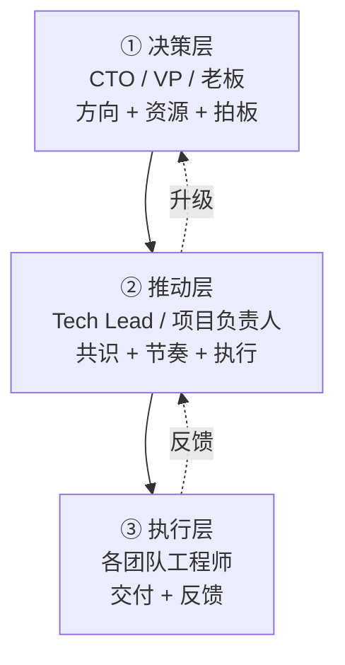
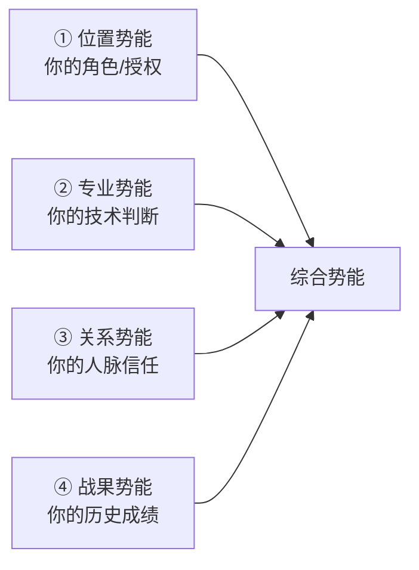
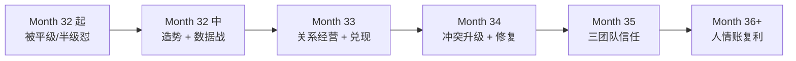

# 11.跨团队协作推进能力

#### 目录介绍
- [1. 案例引入](#1-案例引入)
  - [1.1 三个团队谁也不听](#11-三个团队谁也不听)
  - [1.2 顺藤摸到根因](#12-顺藤摸到根因)
  - [1.3 我们要回答什么](#13-我们要回答什么)
- [2. 协作全景图](#2-协作全景图)
  - [2.1 跨团队协作三层结构](#21-跨团队协作三层结构)
  - [2.2 权力 vs 影响力](#22-权力-vs-影响力)
- [3. 协作势能模型](#3-协作势能模型)
  - [3.1 势能的四个来源](#31-势能的四个来源)
  - [3.2 造势的四个动作](#32-造势的四个动作)
  - [3.3 势能不足的补救](#33-势能不足的补救)
- [4. 借势不越权](#4-借势不越权)
  - [4.1 借上级的势](#41-借上级的势)
  - [4.2 借数据的势](#42-借数据的势)
  - [4.3 借流程的势](#43-借流程的势)
- [5. 跨团队 OKR 对齐](#5-跨团队-okr-对齐)
  - [5.1 找到共同 KPI](#51-找到共同-kpi)
  - [5.2 拆分 OKR 的方法](#52-拆分-okr-的方法)
  - [5.3 共同签字机制](#53-共同签字机制)
- [6. 非直属推动四抓手](#6-非直属推动四抓手)
  - [6.1 抓手一 共同利益](#61-抓手一-共同利益)
  - [6.2 抓手二 关键人经营](#62-抓手二-关键人经营)
  - [6.3 抓手三 节奏同频](#63-抓手三-节奏同频)
  - [6.4 抓手四 兑现承诺](#64-抓手四-兑现承诺)
- [7. 冲突升级的路径](#7-冲突升级的路径)
  - [7.1 三级升级模型](#71-三级升级模型)
  - [7.2 升级前的准备](#72-升级前的准备)
  - [7.3 升级后的关系修复](#73-升级后的关系修复)
- [8. 长期人情账](#8-长期人情账)
  - [8.1 人情是可累积的资产](#81-人情是可累积的资产)
  - [8.2 存人情的四种方式](#82-存人情的四种方式)
  - [8.3 用人情的三条纪律](#83-用人情的三条纪律)
- [9. 协作反模式](#9-协作反模式)
- [10. 综合案例串讲](#10-综合案例串讲)
  - [10.1 糖果充的清结算平台](#101-糖果充的清结算平台)
  - [10.2 三个月推动全过程](#102-三个月推动全过程)
  - [10.3 协作哲学回扣](#103-协作哲学回扣)
  - [10.4 协作速查](#104-协作速查)


## 1. 案例引入

### 1.1 三个团队谁也不听

Month 32，CTO 老李给糖果充下了一个新任务：

```
老李: "糖果充, 下季度公司要做一个'清结算平台', 
      涉及支付、风控、账务三个团队, 你牵头。"
糖果充: (惊喜) "谢谢老板信任!"
老李: "别急着谢, 这个任务最难的地方你想过吗?"
糖果充: "呃...... 技术复杂?"
老李: "不, 技术是最简单的。最难的是: 
      - 风控组的老王, 你的平级 (Tech Lead)
      - 账务组的老赵, 比你高半级 (Sr. Tech Lead)  
      - 你是支付组 Tech Lead
      三个团队, 三条汇报线, 你有'牵头'的名分, 但没有'指挥'的权力。
      去想想, 一周后给我方案。"
```

糖果充第 3 天信心满满地拉了个 3 团队大会，结果 15 分钟被怼在墙上：

```
糖果充: "各位, CTO 让我牵头做清结算平台, 下季度必须上线, 大家配合一下。
       风控组: 请老王安排一个人对接; 账务组: 请老赵安排两个人对接......"

老王 (风控 Tech Lead, 平级): 
"糖果充, 风控组本季度已经排满了, 无 HC。你要我们配合, 去老陈那要人。
 而且 CTO 只说'牵头', 没说你可以调我们的资源, 这个我要跟老陈确认。"

老赵 (账务, 高半级):
"我们账务组也很忙, 你这个清结算涉及我们核心账本, 
 我需要 CTO 直接给我下任务, 不是你说做就做。"

糖果充: (支支吾吾, 会议 15 分钟结束, 无任何进展)
```

散会后回工位跟老陈吐槽：

```
糖果充: "老陈, 老王和老赵油盐不进! CTO 都授权我牵头了, 他们凭什么不配合?"

老陈: (笑) "你 CTO 授权你'牵头', 不是授权你'指挥'。
      牵头 = '你负责这件事的结果', 但资源、人、流程都要你自己想办法。
      你现在把自己当'CTO 代理人', 想用行政命令让他们干活, 他们不服, 是对的。"

糖果充: (蒙了) "那我怎么做?"

老陈: "你要学会一个词 —— '造势'。
      老王凭什么听你的? 因为你和他都关心业务成功。
      老赵凭什么让人手? 因为清结算平台能减轻他们运维负担。
      你先别拉群, 先做 3 件事: 1v1 老王 30 分钟, 1v1 老赵 30 分钟, 1v1 老李 15 分钟。
      把每个人的诉求摸清, 找到'他们各自想要什么, 我能给什么'的交集, 再拉全体会。"
```

### 1.2 顺藤摸到根因

糖果充按老陈说的做了三个 1v1，第 4 天再看这件事，完全不一样：

**老王的诉求 (风控)**：

```
真实需求: 老王手下 3 个人在 3 个不同的账务/支付项目重复对接, 
        他很想有一个统一的账务底座, 但不敢主动提, 怕自己团队"被合并"。
顾虑:   清结算平台会不会最终"吞并"他的风控团队? 
        他的 KPI 是"风控规则拦截率", 清结算平台对他 KPI 无益; 老赵一直在压他。
如果我能: 承诺不吞并 + 帮他团队解放 1 人 + 帮他拉平和老赵关系 → 他会全力支持
```

**老赵的诉求 (账务)**：

```
真实需求: 账本系统运行 5 年, 技术债严重, 想重构但没预算立项; 
        被 CFO 每周追问"账不平", 焦头烂额。
顾虑:   项目做失败会不会背锅? "半级"高被糖果充"指挥", 面子挂不住。
如果我能: 把项目包装成"账务系统重构 + 清结算增强" + 让他挂"评审组长"名 + 
         私下明确"我是执行, 你是决策" → 他会主动推进
```

**老李的诉求 (CTO)**：

```
真实需求: Q4 最看重"跨部门协作效率"; 这个任务是"跨团队协作能力"的 KPI 项; 
        他不在乎具体谁做, 只在乎"事成"。
期待:   你成为能连接多团队的 Tech Lead; 不越级, 也不软弱; 
        出问题时自己搞定 70%, 剩下 30% 及时求助。
```

**三方诉求的交集**：

```
共同点: 都想业务稳定 + 都想节省资源 + 都不想背失败的锅。
差异点: 老王想保团队, 老赵想重构账本, 老李想练兵你。
最大公约数: "清结算平台 = 业务稳定 + 团队解放 + 账本升级 + Tech Lead 练兵"
          四方都赢, 没人吃亏 → 项目能推动。
```

**糖果充第一次意识到**：Q1 我为什么第一次开会崩了? — 只想着"我要做什么", 没想过"他们各自要什么"; Q2 我为什么把老王老赵当"障碍"? — 用"上下级"视角, 但我们其实是"合伙人"; Q3 我为什么幻想"CTO 授权"就万事大吉? — **权力是骨架, 影响力才是血肉, 骨架没血肉走不动路**。

### 1.3 我们要回答什么

```
Q1: 我"牵头"但没"权力", 怎么让人听我的?
Q2: 平级 / 半级高的同事, 我怎么协调?
Q3: 每个团队都很忙, 凭什么优先我的项目?
Q4: 项目出了矛盾, 我什么时候升级、找谁升级?
Q5: 项目完成后, 怎么让参与者也拿到 credit?
Q6: 长期看, 跨团队人脉怎么攒?
Q7: 如果对方就是不配合, 我怎么办?
Q8: 我怎么在协作中提升自己的势能?
```

**核心命题**：**跨团队协作的本质是"共赢"而非"授权"** —— **CTO 让你牵头,只是给了你"入场券",能不能推动,靠你自己造势**。

---

## 2. 协作全景图

### 2.1 跨团队协作三层结构

任何跨团队项目都有三层结构：



**你作为"牵头人"处在推动层**——**决策层不会替你推,执行层也不听你差遣,你的任务是让两层间的信息、资源、共识流动起来**。三层利益不同(决策层关心结果+大方向、执行层关心工时+个人利益、你关心节奏+共识+平衡), 你要做"三层翻译官"：把决策层的战略翻译成执行层的动作、把执行层的困难翻译成决策层的诉求、把各团队的利益翻译成共同目标。

### 2.2 权力 vs 影响力

| 权力 (Authority) | 影响力 (Influence) |
|---|---|
| 位置带来 | 关系与信任带来 |
| 只对下属有效 | 对所有人有效 |
| 命令式 | 感染式 |
| 短期强 | 长期强 |
| 会被替代 | 可累积迁移 |

**Tech Lead 的推动能力 = 20% 权力 + 80% 影响力**：20% 权力来自 CTO 授权(入场券) + 项目立项(合法性) + 汇报线(强制通道); 80% 影响力来自老王愿不愿意帮你、老赵愿不愿意让人、工程师愿不愿意加班配合、老李愿不愿意继续给你更多机会。

**新手三个误区**：(1) "我有权力就能推" — 真相: 权力只能让人"应付", 不能让人"用心"; (2) "影响力 = 拍马屁 + 请客吃饭" — 真相: 影响力 = 专业能力 + 靠谱 + 换位思考 + 长期投入; (3) "先有权力再有影响力" — 真相: 顺序反了, **先有影响力才配拿更大权力**。

**影响力的四个核心要素**：专业过硬(别人觉得你懂)、说到做到(别人相信你的承诺)、换位思考(别人觉得你懂他)、长期投入(别人愿意跟你共事)。

---

## 3. 协作势能模型

### 3.1 势能的四个来源

**势能 (Momentum)** 是让协作对象"愿意配合"的能量场。势能高, 别人主动配合; 势能低, 别人各种推脱。



**四种势能的特点**：
- **① 位置势能**：来源老板授权+项目立项; 有天花板(只到"牵头"级); 用法是底线保障但不能靠它。
- **② 专业势能**：来源技术判断力+方案质量; 可累积, 天花板高; 用法是让别人服你。
- **③ 关系势能**：来源长期共事的信任; 冷启动难, 积累后威力大; 用法是走"友情通道"优先处理。
- **④ 战果势能**：来源过往成功项目; 复利效应, 每次都加分; 用法是"他做过 X, 这次也能"。

**糖果充 Month 32 的势能盘点**：位置 60/100(有 CTO 授权但无指挥权)、专业 75/100(支付重构+P0 救火+缓存升级)、关系 40/100(风控账务组不熟)、战果 70/100(24 个月做成 5 个项目)。**总势能 60 分, 及格但不高, 薄弱点在关系势能 → 需重点补**。

### 3.2 造势的四个动作

**动作 1: 提升位置势能** — 把项目名称从"清结算平台"升级到"公司 Q4 战略项目"、争取"直接向 CTO 汇报"的通道、拿到明确的"三团队协作宪章"(CTO 签字)、邀请高层站台(kickoff 请老李讲话)。

**动作 2: 展示专业势能** — kickoff 亲自讲 30 分钟技术方案、让参与方感受到"这个方案能落地"、提前 review 各方设计、关键决策会当场拍板技术方向。

**动作 3: 经营关系势能** — 1v1 摸底、每周非正式午餐/咖啡 15 分钟、记住关键人的名字、主动帮对方团队解决 1-2 个"顺手小忙"、项目结束后请团队吃顿饭。

**动作 4: 累积战果势能** — 项目分阶段, 每个阶段都有"小胜利"; 每次小胜利都公开表扬相关团队; 项目结束时主动给参与者写"内部推荐信"; 把项目做成"内部案例", 复用到别的项目。

### 3.3 势能不足的补救

**补救 1: 借势 (最快)**

```
借上级势: "这个是 CTO 亲自定的 Q4 战略"
借数据势: "财报会议上, CFO 明确说 Q4 要冲 XXX 指标"
借客户势: "XX 大客户已经提了需求, 承诺 12 月上线"
```

**补救 2: 换势 (最持久)** — 用你有的势能, 换你缺的势能：

```
"老王, 你帮我这次, 我下个季度支付新版本上线前, 
 先给你风控组做一遍数据规范化" (专业换关系)
"老赵, 你团队重构账本我全力支持, 
 但清结算这一期你先出 2 人配合我" (战果换资源)
```

**补救 3: 造势 (最深远)** — 主动为对方创造价值：免费给对方培训一场技术分享、免费帮对方 review 一次架构、免费介绍一个候选人、免费同步最新的行业情报。**对方欠你 3 次小人情后, 你的势能自然涨**。

---

## 4. 借势不越权

### 4.1 借上级的势

**"借势"和"越权"的区别**：

```
借势: 用上级的名义传达上级的意图
      "CTO 上周说 Q4 要冲清结算, 咱们对齐一下" → 上级会同意你这样说
越权: 用上级的名义传达自己的意图
      "CTO 说必须周五之前给我 5 个人!"       → 上级不同意你这样说 = 越权
```

**借上级势的三条纪律**：(1) **提前跟上级对齐** — 你要说的每一句"上级说..."都要先问过上级, 或有微信/邮件截图为证; (2) **只借"事实", 不借"授权"** — ✅ "CTO 说这是 Q4 重点"(事实), ✗ "CTO 让我调你 5 个人"(未经授权的授权); (3) **借完立刻回环** — "我刚跟老王/老赵传达了 CTO 的战略, 反馈是 X, 下一步计划 Y", 上级会觉得"你在借势但没瞎搞"。

**借势的黄金句式**："上周 CTO 提到..." / "根据公司 Q4 OKR..." / "我理解公司战略上..." / "如果这个不做, 会影响..."。

### 4.2 借数据的势

**数据比人有说服力** —— **用数据代替观点**。三个渠道：

```
渠道 1 · 业务指标: "上季度清结算错误占客服投诉 30%" / "账不平事件月均 5 次, 每次影响 5 万营收"
渠道 2 · 行业标杆: "同行 XX 公司清结算平台 3 年降低 60% 人力" / "标杆 Y 公司 QPS 是我们 10 倍"
渠道 3 · 内部数据: "过去一年 3 团队重复对接账务 8 次, 累计 40 人日浪费" / "现在每年多花 200 万人力"
```

**数据借势的说服力**：不带数据说"清结算要做, 大家配合下" → 别人内心 OS "凭什么? 我为啥要配合?"; 带数据说"清结算不做, 每年浪费 200 万人力, CFO 已经在追问投产比, 三团队一起降本 30%" → 别人内心 OS "老板会关注, 我得配合"。

**糖果充的数据战** — kickoff 前先做了一份《清结算系统现状分析 · 2026 Q3》：

```
1. 现状问题: 
   - 3 团队重复对接: 支付↔账务、风控↔账务、支付↔风控
   - 全年账务对接人力: 40 人日 (相当于 1 个工程师 2 个月)
   - 账不平事件: 月均 5 次; 客服投诉"账不平"占比: 30%
2. 影响: 人力浪费 200 万/年; 客户投诉恶化 NPS; 财务风险审计频繁挑战。
3. 目标: 3 团队对接 3→1; 人力节省 60% (240→96 人日); 
        账不平事件月均 5→1; 客服投诉 -25%。
```

**这份数据发给所有参与方之后, 老王老赵的态度立刻变了** —— **"这个项目值得做"**。

### 4.3 借流程的势

**用公司流程/规范代替个人指令**：

```
个人指令: "老王你把这个改一下"                        → 老王想: "你算老几?"
流程借势: "根据公司架构评审规范第 3.2 条, 跨团队接口变更需过
         技术委员会 review, 老王, 你评估要过 review 吗?"  → 老王: "OK 走流程"
```

**常见的可借流程**：架构评审(架构委员会)、上线发布(发布委员会)、数据合规(法务+安全)、性能压测(QA+SRE)、财务预算(财务)。

**流程借势的秘密** — 流程是"客观的第三方", 用流程要求人, 不是"你要求他"而是"公司要求他" → 对方不会觉得"被你压"而是"按规矩办事"。**警告**：流程借势不能滥用, 每次都拿流程压人会显得"官僚", 要在"关键节点"用, 平时靠关系和专业。

---

## 5. 跨团队 OKR 对齐

### 5.1 找到共同 KPI

**跨团队协作最大的动力源是"共同 KPI"**。方法四步：Step 1 列出每个团队本季度的 KPI; Step 2 找出你的项目能"顺带完成"的 KPI; Step 3 明确"你出力 → 他 KPI 完成"的因果关系; Step 4 用他的 KPI 语言, 讲述你的项目。

**糖果充的 KPI 对齐分析**：

```
支付组 (糖果充): KPI 支付成功率 99.9% + 支付效率 +30%
              帮助: 减少支付-账务对账错误 → +成功率
风控组 (老王):  KPI 拦截率 +X% + 误伤率 -Y%
              帮助: 统一账务数据源, 风控规则可直接跑账务数据, 减少 3 次数据同步
账务组 (老赵):  KPI 账不平事件 -50% + 对账时效 -30%
              帮助: 就是账务组的 KPI 加速器 (账不平主要来自数据不一致)
```

**三方 KPI 对齐后的说服话术**：

```
糖果充对老王:
"老王, 清结算平台上线后, 风控规则可以直接查统一账务库, 
 你们不用再从支付/账务两边同步数据, 团队 3 人可解放 1, 
 直接支撑你 Q4 KPI '拦截率 +X%'。"
→ 老王: (第一次觉得"这个项目对我有用")

糖果充对老赵:
"老赵, 你团队 Q4 KPI 是'账不平 -50%, 对账时效 -30%', 
 说实话, 这两个指标不做架构升级根本达不到。
 清结算平台就是 CTO 借这个机会, 给你做账务重构的合法预算。
 你参与得越深, 你的 KPI 完成得越好。"
→ 老赵: (从"被要求配合"到"我要主导")
```

### 5.2 拆分 OKR 的方法

**当共同 KPI 找不到时, 主动帮对方"造"KPI**。

```
主项目 O: "清结算平台 Q4 上线, 支撑三团队降本"

支付组 KR: (1) 对接账务 API 3→1; (2) 支付成功率 +0.1%; (3) 上线 P0 事故 0 次。
风控组 KR: (1) 统一账务数据源, 移除 3 处冗余同步; 
          (2) 风控规则跑账务响应时间 -50%; (3) 因数据不一致导致的误伤 -80%。
账务组 KR: (1) 完成账本模型升级 (借清结算之势); 
          (2) 账不平事件 -50%; (3) 对账时效 -30%。
共同 KR:  (1) 上线时间 Q4 内; (2) 项目复盘产出内部案例。
```

**拆 OKR 的核心**：**每个团队都能在"共同项目"里拿到"自己的成绩"**。

### 5.3 共同签字机制

**跨团队项目最容易翻车的地方**：**上线出问题时,谁都说"不是我的问题"**。共同签字机制 —— 在 kickoff 会上制作《清结算平台协作宪章》：

```
一、共同目标: Q4 上线; 三团队 KPI 共享 (前述)。
二、职责分工: 支付/风控/账务 各 XXX; 糖果充: 牵头 + 整体架构。
三、决策机制: 技术方向由糖果充+老王+老赵三人一致; 
            上线时间糖果充最终决定但需三方投票 2:1; 冲突升级至 CTO。
四、承诺: 每周三 15:00 三方例会; 关键节点各方签字确认; 
        出现风险 24 小时内共同应对。
五、签字: 支付 糖果充 ✓ | 风控 老王 ✓ | 账务 老赵 ✓ | CTO 老李 见证 ✓
```

**宪章的四大作用**：(1) 事前对齐职责减少扯皮; (2) 事中出问题按宪章执行不打感情牌; (3) 事后复盘有据可查不甩锅; (4) 提升项目"合法性", 大家都签过字, 都是责任人。

---

## 6. 非直属推动四抓手

### 6.1 抓手一 共同利益

**推动"非直属"最有效的抓手是"共同利益"** — 让对方觉得"帮你就是帮自己"。发现共同利益的三种角度：

```
角度 1 · 短期利益 (KPI/绩效):  前面 5.1 讲过
角度 2 · 中期利益 (能力/资源):  老赵借项目重构账本 = 拿到重构预算; 
                              老王借项目减轻负担 = 团队 3→2 也够用
角度 3 · 长期利益 (影响力/晋升): 老赵挂"技术委员会评审组长" = 晋升加分; 
                              老王在 CTO 面前露脸 = 未来机会
```

**共同利益的表达话术**：不带利益视角"老王, 你帮我做清结算" → 老王内心"凭什么"; 带利益视角"老王, 清结算做完后, 你团队 3 人可解放 1, 这个人可以去支持你一直想推的风控 3.0, Q4 结束你有理由跟 CTO 申请 HC, 你觉得这个 trade off 值吗?" → 老王内心"值, 我要参与"。

### 6.2 抓手二 关键人经营

**每个团队都有 2-3 个"关键人"** — 能影响团队方向的人。三类：

```
Type 1 · 决策关键人 (Team Lead): 老王、老赵。他不点头, 事情推不动。
Type 2 · 执行关键人 (核心工程师): 风控核心开发小刘、账务架构师老周。他不干活, 事情做不完。
Type 3 · 影响关键人 (话语权大户): 团队里说话有分量但不是 Lead 的人。他反对, 团队情绪跟着反对。
```

**关键人经营三步**：Step 1 **识别** — 通过 1v1、观察例会发言, 找出各团队 5-6 个关键人; Step 2 **建立个人连接** — 一对一咖啡/午餐/微信闲聊, 记住他们的技术偏好、家庭情况、职业目标; Step 3 **提供个人价值** — 小刘想学中间件, 送他一本书 + 半小时讲解; 老周想晋升, 在 CTO 面前带一句"老周架构判断力很强"; 小赵想去大厂面试, 介绍一个内推。

**关键人经营不是"利用", 是"长期结盟"** —— 错法: 项目要用时才找 → 显得功利; 对法: 平时就有联系, 项目时自然帮 → 关系稳固。

**糖果充的关键人档案**：

```
小刘 (风控核心开发): 喜欢中间件 / 想 2 年内做 Tech Lead / 
                   上季度给他 review 过架构 + 送过书 / 
                   项目中分配他"清结算核心模块", 让他有露脸机会。
老周 (账务架构师):   分布式事务, 老派 / 想在 CTO 面前证明自己 / 
                   上月一起吃饭 2 次 / 让他挂"清结算架构技术委员"名分。
```

### 6.3 抓手三 节奏同频

**跨团队协作,节奏同频比技术方案更重要**。三个层次：

```
层次 1 · 会议同频: 每周固定时间 (如周三 15:00) + 参与者固定 + 
                议程模板固定 + 输出物固定 (下周计划 + 阻塞 + Action)
层次 2 · 交付同频: 三团队按同一个 Sprint 节奏 + 里程碑对齐 (共同 M1-M4) + 联调时间预约
层次 3 · 沟通同频: 相同的 IM 群/项目管理工具 + 相同的术语 (统一命名规范) + 
                相同的模板 (bug 单/需求单)
```

**同频的三个坑**：坑 1 三团队用三个不同的项目管理工具 → 你每周花 3 小时同步数据; 坑 2 三团队 Sprint 起止日不一样 → 谁也追不上谁; 坑 3 三团队用三套术语讲同一件事 → "订单/单据/交易"是同一个东西吗? 天知道。

**统一节奏的话术**：

```
"各位, 三个团队要协作, 建议从下周开始统一节奏:
 1. Sprint: 双周一 Sprint (你们的调整我可以让步)
 2. 例会:   每周三 15:00-16:00 (含 3 团队核心 6 人)
 3. 工具:   统一到公司的 JIRA
 4. 术语:   我起草一份《清结算术语表》, 明天发给大家
 5. 汇报:   每周五 17:00 我给 CTO 发周报, 各位可提前反馈到我这
 有异议吗?"
```

### 6.4 抓手四 兑现承诺

**跨团队合作最珍贵的资产是"你说到做到"**。三条：(1) **说小做大** — ✗ 承诺 100% 交付 80% → 失望; ✓ 承诺 80% 交付 90% → 惊喜; (2) **及时告知偏差** — ✗ 承诺周五交付当天说延期 → 失控; ✓ 周三就告知"可能延期 2 天, 需协调" → 可控; (3) **主动补偿** — ✗ 承诺没兑现装作没事 → 信任崩塌; ✓ 承诺没兑现主动加倍补偿 → 反而加分。

**兑现承诺的复利效应**：项目 1 兑现 → 老王开始信任你; 项目 2 兑现且提前 → 老王主动推荐你; 项目 3 老王遇到麻烦第一个找你 → 你成为他的"信任圈"; 项目 4 老王被提拔时会带上你 → 你的机会指数级增长。

**糖果充在清结算项目中的"信誉存款"**：

```
Month 32: 承诺"每周三例会不迟到" → 12 次一次不迟
Month 33: 承诺"给风控的接口 10/15 前给" → 10/13 交付
Month 34: 承诺"账务重构风险由我兜底" → P1 时糖果充亲自守夜
Month 35: 项目上线 → 老王在庆功宴上说 "跟糖果充合作, 我睡觉都踏实"

从此以后: 老王主动找糖果充做别的项目; 老赵推荐糖果充给别的部门 Leader; 
        CTO 在管理会说"糖果充是三团队都认可的 Tech Lead"。
```

---

## 7. 冲突升级的路径

### 7.1 三级升级模型

**冲突不是坏事, 关键是"用对方式升级"**。

```
Level 1 · 私下沟通 (24 小时内): 直接找对方 1v1, 情绪先冷静。
                              目标: 理解分歧, 尝试自己解决。→ 80% 冲突到此为止。
Level 2 · 三方会议 (48 小时内): 拉相关利益方开会。各自表述立场, 找共识点。→ 15% 到此为止。
Level 3 · 升级共同上级 (需要时): 找双方共同的上级 (老李), 请他拍板。→ 5% 冲突需要。
```

**升级的错误路径**：✗ 直接跳到 Level 3 (越级, 关系彻底崩); ✗ 停留在 Level 1 无穷无尽拉扯 (拖延, 项目延期); ✗ 用邮件/IM 打嘴仗 (无效, 且留下不好的证据)。

### 7.2 升级前的准备

**升级前必须做的三件事**：(1) **事实清单** — 什么时候发生的分歧、各方观点、影响; (2) **尝试过的方案** — Level 1 私聊几次、Level 2 三方会议几次、各次进展和阻塞; (3) **你的建议** — 3 个可选方案(推荐 A、备选 B、兜底 C)、每个方案的收益和风险、明确"需要老板做什么决策"。

**升级请求的话术模板**：

```
"老板, 有个跨团队分歧需要您 15 分钟决策:

 一、事实: 清结算项目里, 我和风控组老王在'风控规则触达时机'上有分歧。
         我认为应在支付发起时触达 (延迟低), 老王认为应在账务落地时触达 (数据准)。
 二、已尝试: 私聊 3 次无共识 / 三方会议 1 次各持己见 / 找架构组做过第三方评估, 结论中立。
 三、建议方案:
    方案 A (推荐): 支付时触达 + 账务落地时二次验证
        收益: 延迟低 + 数据准, 风险: 复杂度 +30%
    方案 B: 只在支付时触达 → 简单, 极端场景数据不准
    方案 C: 只在账务落地时触达 → 数据准, 延迟 200ms 影响体验
 四、需您决策: 选 A/B/C, 或另行拍板"
```

**这样升级的好处**：(1) 老板 5 分钟能决策; (2) 显示你做了功课; (3) 不是"甩问题给老板"而是"给老板决策工具"; (4) 老板拍板后你和老王都没面子问题(是老板决定)。

### 7.3 升级后的关系修复

**升级完成 = 冲突解决的第一步, 关系修复才是第二步**。三个动作：

```
动作 1 · 私下沟通表达感谢:
"老王, 上次那个分歧升级到 CTO, 感谢你尊重最终决策。
 我知道你的观点有道理, 只是这次业务优先级不同。
 下次遇到分歧, 我们先私聊, 别急着搞大。"

动作 2 · 公开场合让对方"下得来台":
邮件/群里: "感谢老王在决策过程中提供的技术洞察, 虽然最终选择了 A 方案, 
         但老王提出的极端场景问题, 我们已经加入了兜底方案 (二次验证)。"

动作 3 · 未来项目主动"投桃报李":
下一个项目, 主动让老王当一次"技术评审组长"; 或主动帮老王的项目做一次深度支持。
→ 让老王感受到"冲突不影响长期合作"。
```

**关系修复的核心**：**冲突是"事", 关系是"人". 分开处理: 事已解决, 人的关系不能崩**。

---

## 8. 长期人情账

### 8.1 人情是可累积的资产

**跨部门做久了,最宝贵的资产不是技术,是"人情账"** —— 人情账 = 一个个"欠"你的人构成的关系网 = 你未来任何跨部门项目的"通行证"。

**复利效应**：Year 1 帮 10 个人小忙 → 存 10 张人情; Year 2 这 10 人中 3 人有大项目 → 主动带你入伙 → 攒战果; Year 3 战果多了 → 再认识 20 个人 → 再存 20 张; Year 5 你走到哪都有"熟人接应" → 事情推得比别人快 3 倍。

### 8.2 存人情的四种方式

```
方式 1 · 顺手帮 (最日常):     别人问技术问题 3 分钟答疑 / 
                            别人找候选人转发一次内推 / 别人赶方案帮 review 30 分钟
方式 2 · 分享信息 (最增值):   高层会议分享有价值信息 / 行业情报转发给相关的人 / 
                            踩过的坑主动告诉别人别踩
方式 3 · 关键时刻挺人 (最深):  别人在评审会被质疑时你出面帮解释 / 
                            别人项目出事故时你主动帮救火 / 别人被误解时你私下帮澄清
方式 4 · 让别人拿 credit (最长): 项目成功时主动带上参与方邀功 / 
                              老板夸你时记得带一句"多亏 X 支持" / 
                              内部案例分享时让参与者一起上台
```

### 8.3 用人情的三条纪律

**存人情容易, 用人情难 —— 用不好, 一次就败光**。

**纪律 1 · 别在小事上用大人情** — 小事用"友情"(顺手帮), 大事用"人情"(欠一次), 重大事用"信任"(长期积累)。

**纪律 2 · 用完立刻回补** — 借了一次主动找机会还; 还的时候要"加倍"; 别让对方觉得"你只借不还"。

**纪律 3 · 别在紧急时透支** — 突然让老王加班救急 = "抢人情"; 平时零投入关键时刻求救 → 效果最差。对法: 项目开始就打好招呼, 让对方有充分心理准备, 提前把"你会用到他"通知到位。

**糖果充的人情账实践**：

```
Month 24 前: 只顾自己项目, 没存过人情 → Month 32 拉三团队协作时冷启动困难。
Month 32 后: 每周 3 小时"顺手帮"跨部门的人 / 每月请一次不同部门的人喝咖啡 / 
           每季度分享一次内部技术情报 → Month 36 人情账从 0 → 30 张。
Month 40:  老王升 Director 时说: "糖果充在我们组要一个人手, 直接给, 我这几年欠他好多"。
```

---

## 9. 协作反模式

跨团队协作中五种常见反模式：

| 反模式 | 现象 | 危害 | 对法 |
|---|---|---|---|
| **官僚式推动** | 邮件/群里 @所有人, 不做单点沟通 | 显得"不 care 别人困难" / 消息被无视 / 关系冷冰冰 | 关键人必须 1v1, 群里只做"广播 + 存档" |
| **越级施压** | 绕过对方 Leader, 直接找他老板施压 | 对方 Leader 记恨一辈子 / 被贴"不懂规矩" / 未来跨部门无人帮 | 先 L1 → L2 → L3, 每一步都跟对方 Leader 通气 |
| **独狼英雄主义** | 所有事情自己扛, 不喊人 | 项目单点风险高 / 团队没参与感 / 成绩显得就你做的 / 老板担心"没了你项目会崩" | 主动分派 credit, 让"贡献可见性"覆盖参与方 |
| **只索取不付出** | 只找别人要资源, 不帮别人做事 | 人情账赤字 / 名声"占便宜" / 一旦失势无人相助 | 先付出 3 次再索取 1 次, **3:1 存取比** |
| **关系错位** | 把对方当"下属"或"对手" | 命令语气对平级 → 翻脸 / 防御语气对合伙人 → 推不动 / 讨好语气对下属 → 团队失控 | 上级=汇报者+求支持 / 平级=合伙人+交换价值 / 下属=教练+授权 / 业务方=服务者+塑造预期 |

**每次开口前先想 3 秒: 我和 TA 是什么关系?**

---

## 10. 综合案例串讲

### 10.1 糖果充的清结算平台

**Month 32-35, 三个月推动全过程**：

**Month 32 · Week 1**: 势能盘点 + 三方 1v1 — 老陈教"造势" → 糖果充做三方摸底, 发现三方诉求交集, 制定 KPI 对齐。**势能 60 → 65**。

**Month 32 · Week 2-3**: kickoff 准备 — 出《清结算现状分析报告》(数据战) + 起草《清结算协作宪章》 + 找 CTO 争取"直接汇报"通道。**势能 65 → 72**。

**Month 32 · Week 4**: 正式 kickoff — CTO 老李亲自开场 5 分钟 (位置势能借用) + 糖果充讲 30 分钟技术方案 (专业势能展示) + 三方签《协作宪章》 (共同承诺)。**势能 72 → 78**。

**Month 33**: 执行 + 关系经营 — 每周三例会 12 次不迟 + 每周五 CTO 周报主动带上"感谢老王/老赵" + 一对一咖啡 8 次 (跟关键人) + 承诺兑现率 100%。**势能 78 → 85**。

**Month 34**: 第一次冲突 — "风控触达时机"分歧, Level 1 私聊 3 次 + Level 2 三方会议 1 次 + Level 3 升级 CTO 30 分钟决策, 后续修复关系: 私下感谢老王 + 公开肯定他的洞察。**势能 85 → 88**。

**Month 35**: 上线 + 复盘 — 上线成功 + 三团队 KPI 全部达成 + 老李在管理会点名"糖果充是三团队都认可的 Tech Lead" + 老王主动带糖果充加入下一个跨部门项目。**势能 88 → 95**。

### 10.2 三个月推动全过程

**关键节点复盘**：

| 时刻 | 动作 | 势能变化 |
|:--:|---|:--:|
| Month 32 W1 | 三方 1v1 | 60 → 65 |
| Month 32 W2 | 数据报告 | 65 → 68 |
| Month 32 W3 | 协作宪章 | 68 → 72 |
| Month 32 W4 | Kickoff | 72 → 78 |
| Month 33 | 承诺兑现 | 78 → 85 |
| Month 34 | 冲突处理 | 85 → 88 |
| Month 35 | 上线成功 | 88 → 95 |

**成长曲线**：



### 10.3 协作哲学回扣

回望糖果充这次跨团队协作能力的成长，**跨团队协作**的本质是：

```
初级: 接任务 (老板让我牵头我就牵头)
中级: 推任务 (拉群 @ 所有人)
高级: 造势能 (借势 + 关系 + 数据)
资深: 共赢局 (三方 KPI 对齐, 一起赢)
大师: 养生态 (长期人情账, 事情自动来找我)
```

**协作的四层修炼**：第一层势能造(位置+专业+关系+战果)、第二层抓手用(共同利益+关键人+节奏+兑现)、第三层冲突控(三级升级+修复关系)、第四层人情养(3:1 存取比+长期投入)。

**核心命题**：**跨团队协作,靠权力只能推动 20%,靠影响力能推动 80%** —— **影响力的复利,是资深工程师最大的隐形资产**。

**渐进模型**：

```
菜鸟: "CTO 让我做, 你们都得听"
新手: "咱们群里同步一下"
进阶: "1v1 摸底 + 拉群"
资深: "找共同 KPI + 兑现承诺"
大师: "长期人情账 + 生态自转"
```

**结论**：**你能在没有权力的时候推动多少事, 决定了你未来能拿到多大的权力** —— **这是"资深"和"高级"的分界线**。

### 10.4 协作速查

**协作速查表**：

| 场景 | 动作 |
|------|-----|
| 收到"牵头"任务 | 先 1v1 摸底, 再拉群 |
| 平级/半级高不听 | 找共同 KPI + 造势 |
| 势能不足 | 借上级/数据/流程 |
| KPI 无交集 | 主动帮对方"造 KPI" |
| 冲突出现 | Level 1 私聊 → Level 2 会议 → Level 3 升级 |
| 升级前 | 备事实 + 已尝试 + 3 个方案 |
| 冲突后 | 私下感谢 + 公开肯定 + 未来投桃 |
| 存人情 | 顺手帮 + 分享信息 + 挺人 + 让 credit |
| 用人情 | 小事用友情, 大事用人情, 别透支 |

**四大武器速记**：

```
势能造势四动作: 位置(直接汇报+高层站台+立项包装) / 专业(kickoff 讲方案+关键决策拍板) / 
             关系(1v1 摸底+关键人经营+常喝咖啡) / 战果(分阶段小胜利+公开表扬参与方)
非直属四抓手:   共同利益 (短/中/长期) / 关键人经营 (决策/执行/影响) / 
             节奏同频 (会议/交付/沟通) / 兑现承诺 (说小做大+及时告知+主动补偿)
冲突升级三级:   L1 私下 1v1 (24h 内) → L2 三方会议 (48h 内) → L3 上级拍板 (5% 冲突), 
             每一步都跟对方 Leader 通气, 别越级
人情账三纪律:   小事用友情大事用人情别混 / 存取比 3:1 / 别在紧急时透支, 提前打招呼
关系定位:      上级=汇报者+求支持 / 平级=合伙人+交换价值 / 下属=教练+授权 / 业务方=服务者+塑造预期
```

---

**下一集预告**：跨团队协作让糖果充的势能达到新高度, CTO 老李下季度直接让他升 Sr. Tech Lead, 带一个 15 人的团队 (从原 8 人扩到 15 人)。糖果充满心期待, 却发现 **"带 15 个人"完全是"带 8 个人"的另一个物种**: 新入职 3 人磨合、老员工小李跟不上、绩效沟通第一次得罪人、劝退第一个人手都在抖。**"带人"这件事,比"做技术"难 10 倍**。**第 12 篇《技术团队建设能力》**告诉他: **好团队不是"聚"出来的,是"选、育、管、淘"出来的**。

---

**本篇速查表**：

| 维度 | 关键武器 |
|---|---|
| 势能造 | 位置 + 专业 + 关系 + 战果 四来源 |
| 借势 | 上级 + 数据 + 流程 三种 |
| KPI 对齐 | 找共同 + 拆分 + 共同签字 |
| 四抓手 | 共同利益 + 关键人 + 节奏 + 兑现 |
| 冲突 | 三级升级 + 修复关系 |
| 人情账 | 存 4 方式 + 用 3 纪律 |
| 关系定位 | 上级/平级/下属/业务方 |
| 反模式 | 官僚 / 越级 / 独狼 / 只索取 / 关系错位 |
