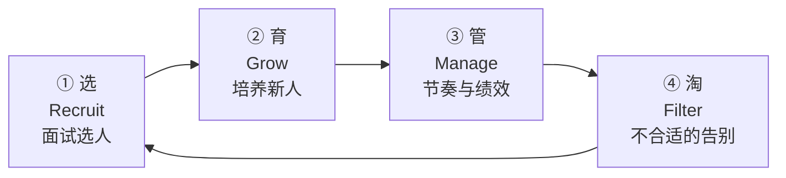
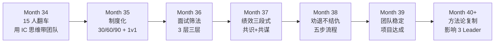

# 12.技术团队建设能力

#### 目录介绍
- [1. 案例引入](#1-案例引入)
  - [1.1 15 人团队的第一次翻车](#11-15-人团队的第一次翻车)
  - [1.2 顺藤摸到根因](#12-顺藤摸到根因)
  - [1.3 我们要回答什么](#13-我们要回答什么)
- [2. 团队建设全景图](#2-团队建设全景图)
  - [2.1 建设四阶段](#21-建设四阶段)
  - [2.2 个人贡献者 vs 团队 Leader](#22-个人贡献者-vs-团队-leader)
- [3. 面试三层筛法](#3-面试三层筛法)
  - [3.1 硬技能筛](#31-硬技能筛)
  - [3.2 软素质筛](#32-软素质筛)
  - [3.3 文化契合筛](#33-文化契合筛)
- [4. 新人 30/60/90](#4-新人-306090)
  - [4.1 前 30 天生存期](#41-前-30-天生存期)
  - [4.2 30-60 天融入期](#42-30-60-天融入期)
  - [4.3 60-90 天独立期](#43-60-90-天独立期)
- [5. 绩效沟通三段式](#5-绩效沟通三段式)
  - [5.1 事实回顾](#51-事实回顾)
  - [5.2 差距对话](#52-差距对话)
  - [5.3 未来承诺](#53-未来承诺)
- [6. 劝退不结仇](#6-劝退不结仇)
  - [6.1 什么时候该劝退](#61-什么时候该劝退)
  - [6.2 劝退的五步流程](#62-劝退的五步流程)
  - [6.3 劝退后的处理](#63-劝退后的处理)
- [7. 团队节奏管理](#7-团队节奏管理)
  - [7.1 日周月节奏](#71-日周月节奏)
  - [7.2 忙闲平衡](#72-忙闲平衡)
  - [7.3 团队氛围塑造](#73-团队氛围塑造)
- [8. 带人的三个转变](#8-带人的三个转变)
  - [8.1 从"做事"到"教人做事"](#81-从做事到教人做事)
  - [8.2 从"最快"到"最稳"](#82-从最快到最稳)
  - [8.3 从"英雄"到"教练"](#83-从英雄到教练)
- [9. 带人反模式](#9-带人反模式)
- [10. 综合案例串讲](#10-综合案例串讲)
  - [10.1 糖果充的团队重塑](#101-糖果充的团队重塑)
  - [10.2 一年团队进化史](#102-一年团队进化史)
  - [10.3 带人哲学回扣](#103-带人哲学回扣)
  - [10.4 带人速查](#104-带人速查)


## 1. 案例引入

### 1.1 15 人团队的第一次翻车

Month 34，糖果充的团队从 8 人扩到 15 人：新入职 3 人、老团队 8 人、从别的组抽调 4 人。CTO 老李给他的期望是 **"半年内成为公司支付领域的核心团队"**。糖果充信心满满，第一次开 15 人全员会：

```
糖果充: "各位, 团队扩到 15 人了! Q4 目标是清结算 2.0 + 支付性能升级 + 一个新业务孵化,
       任务重, 大家加油! 后面 3 个月要跑出'技术团队天花板'的速度!"

会议室气氛: 
- 老团队 8 人: 表情平静 (听过多次类似口号)
- 新入职 3 人: 兴奋点头
- 抽调的 4 人: 面无表情 (被抽调过来本就不情愿)
```

**第一个月的翻车信号**：

```
Week 1: 小李 (老团队骨干) 私下找糖果充
       "糖哥, 新来的小王写的代码我 review 一次要改 30 处, 比自己写还累"
Week 2: 抽调的小陈 (架构组来的) 找 HR 投诉
       "我不是支付方向, 让我做支付根本发挥不了"
Week 3: 新员工小张 30 天试用期结束时说
       "感觉一直在摸索, 没人系统带我, 我不知道自己做的对不对"
Week 4: 团队周会时大家都不发言, 糖果充: "怎么都没意见?" (沉默) "OK 那散会"
       (私下老陈跟糖果充说: "团队氛围有问题, 你没感觉到吗?")
```

**第二个月, 事情崩了**：

```
Month 35 · Week 2:
- 新员工小张突然辞职 → 3 个月投入白费
- 抽调的小陈申请调回原组 → 一个坑
- 老团队小李绩效沟通时哭了 → "老板给的活我都做完了, 但看不到成长, 也没被认可"
```

糖果充第 3 个月末找老陈复盘：

```
老陈: "8 人变 15 人不是'数量翻倍', 是'物种进化'。
      你以前的 8 人是'战友', 15 人是'团队'。
      战友之间用'感情'和'默契', 团队之间需要'制度'和'节奏'。
      你还在用带 8 人的方式带 15 人。"

糖果充: "我该怎么办?"

老陈: "先回答我 3 个问题:
      1. 你 15 人的团队, 每个人的 KPI 你能一句话说清吗?
      2. 每个人的成长路径, 你有没有画过?
      3. 团队的'节奏感', 你设计过吗?"

糖果充: (三个问题都答不上来)

老陈: "你现在不是 Tech Lead 了, 你是'教练兼指挥兼制度设计师'。3 个角色, 你一个都没做。"
```

### 1.2 顺藤摸到根因

糖果充复盘 15 人团队的翻车, 把每个问题拆开：

```
问题 1 · 新员工小张 30 天迷茫
根因: 无系统的新人 onboarding 流程 —— 谁是 mentor 没定 / 30 天做什么没画 / 什么标准算"过关"没有。

问题 2 · 抽调的小陈想回去
根因: 抽调进来时没做"意愿评估" —— 他本人愿不愿意来没问 / 支付方向能否发挥价值没评估 / 
     抽调是"任务"还是"合作"没沟通。

问题 3 · 老员工小李哭了 (最扎心)
根因: 老员工的成长照顾没做 —— 小李做了什么、我承认了吗? 没 / 
     小李的成长路径, 我画过吗? 没 / 小李的诉求 (被认可 + 成长感), 我 care 了吗? 没。

问题 4 · 团队会议死气沉沉
根因: 无有效的沟通节奏 —— 会议目标没 / 每个人的发言机会没 / 决策 vs 讨论 vs 同步 分清没。
```

再往深挖 3 个更本质的问题：Q1 我为什么以为"扩容 = 数量翻倍"? — 用"个人贡献者视角"看团队, 而不是"管理者视角"; Q2 我为什么不重视老员工感受? — 把老员工当"战友", 以为默契不需要维护; Q3 我为什么忽略了新人成长? — 记得自己"摸爬滚打就长大了", 以为大家都能这样, 但今天的新人不吃这套。

**糖果充这才明白**：**带团队的核心不是"推进项目", 是"让每个人都能长大"** —— 让每个人都有归属感 + 成长感 + 认可感; **项目会有, 但如果人不留, 项目做完就散了**。

### 1.3 我们要回答什么

```
Q1: 团队扩容, 怎么"不散架"?
Q2: 新人入职 30/60/90 天分别应该达成什么?
Q3: 面试怎么筛人才不后悔?
Q4: 老员工看不到成长, 怎么办?
Q5: 绩效沟通怎么谈不伤感情?
Q6: 什么样的员工要劝退? 怎么劝退不结仇?
Q7: 团队氛围怎么塑造?
Q8: 我作为 Tech Lead, 每天/每周/每月的工作重点应该是什么?
```

**核心命题**：**带团队的第一天,你就不再是"最强 coder", 你是"让 10 个人都变强的教练"** —— **你的产出 = 团队每个人的产出之和 - 团队摩擦成本**。

---

## 2. 团队建设全景图

### 2.1 建设四阶段



| 阶段 | 核心问题 | 关键动作 |
|:--:|---|---|
| ① 选 | 招什么样的人 | 三层筛法 (硬 + 软 + 文化) |
| ② 育 | 怎么让新人快速产出 | 30/60/90 + mentor 制 |
| ③ 管 | 怎么让团队保持节奏 | 日周月三层 + 绩效沟通 |
| ④ 淘 | 什么样的人该走 | 劝退五步 + 关系不结仇 |

**四阶段构成"人才循环"** —— **没有淘汰的团队, 无法持续输入新血**。

### 2.2 个人贡献者 vs 团队 Leader

| IC | Leader |
|---|---|
| 产出 = 自己写的代码 | 产出 = 团队产出之和 - 摩擦 |
| 时间用在写代码 | 时间用在"让别人写代码" |
| KPI 是"做完 X" | KPI 是"团队做完 X + 团队没散架" |
| 加薪路径靠"技术深度" | 加薪路径靠"团队规模 + 影响" |
| 失败 = 项目延期 | 失败 = 员工离职 |

**IC 转 Leader 的三大坑**：坑 1 "我自己做更快" — 真相: 短期是, 长期你会累死, 团队学不到; 坑 2 "老员工不用管有默契" — 真相: 老员工最需要"被看见", 一旦感觉被忽视, 离职速度比新人快 3 倍; 坑 3 "带团队就是排排任务" — 真相: 排任务只是 10%, 剩下 90% 是"人的事"(士气/成长/关系/冲突/情绪)。

**Leader 一天的时间分配 (糖果充 Month 36 之后)**：30% 团队沟通 (1v1/例会/关键讨论) / 20% 战略 & 规划 (季度 OKR/项目排期) / 15% 面试 & 招聘 / 15% 跨团队协作 (第 11 篇) / 10% 代码 review + 关键技术决策 / 10% 向上汇报 (第 10 篇) / 0% 亲自写代码 (除非"重大代码" or "教学用")。**警告**：如果你还有 40%+ 时间在写代码 → 你还没转型; 如果你 100% 在开会 → 你转过头了也不对。

---

## 3. 面试三层筛法

### 3.1 硬技能筛

**第一层筛"硬技能"** —— **能不能干这个岗位的技术活**。三层评估：Level 1 基础 (数据结构+算法+语言功底+常用中间件) / Level 2 项目 (深挖过往项目"为什么这样设计"+追问 trade-off+场景题) / Level 3 系统设计 (大流量场景+分布式一致性+故障应对)。

**硬技能面试话术**："过往最有挑战的项目讲讲"(听项目) / "为什么用 A 不用 B?"(追问 trade-off) / "QPS 涨 10 倍还能撑吗?"(考察长远) / "这个组件挂了用户体验是什么?"(考察健壮性)。**红线**：✗ 讲不清项目细节 / ✗ 只会背概念 / ✗ 完全没考虑 trade-off / ✗ 遇到追问就懵。

### 3.2 软素质筛

**第二层筛"软素质"** —— **能不能在这个团队"活下来"**。四维: 沟通表达(结论先行+听懂问题+讲清复杂) / 抗压能力(P0/延期表现+冲突处理+犯错反应) / 主动性(没人让做主动做+主动推进改进) / 学习能力(最近学了什么+学习方法+找答案渠道)。

**软素质话术**："搞砸的项目学到了什么?" / "和 PM 争执怎么处理?" / "直属 Leader 什么风格, 合作困扰?" / "入职后发现和面试不一样怎么办?"。**红线**：✗ 甩锅 / ✗ 情绪化 / ✗ 无反思 / ✗ 讲话啰嗦 / ✗ 傲慢。

### 3.3 文化契合筛

**第三层筛"文化契合"** —— **是否愿意长期干**。三问: 动机匹配"为什么想加入?"(听是钱/稳定/发展/学习) / 未来匹配"未来 3 年规划?"(听路径和公司是否一致) / 价值观匹配"Leader 让你做你不认同的事怎么办?"(听独立性 vs 服从性的平衡)。

**判断方法**："这个人在团队里会加分/减分?" — 加分: 真诚不表演 / 客观评价前同事 / 敢说"我不知道" / 讲"我能贡献"; 减分: 完美人设 / 只关心薪资 title / 贬损前公司 / "救世主"心态。

**糖果充的面试筛法实践 (Month 34 面 4 人)**：

```
候选人 A: 硬 9 软 8 文 6 → 短期主义者
候选人 B: 硬 7 软 9 文 9 → 长期潜力股
候选人 C: 硬 10 软 5 文 4 → 傲慢技术大牛
候选人 D: 硬 6 软 8 文 8 → 培养型

最终: 发 B (综合平衡) + D (培养型). 拒 A (可能一年内走) + C (毒瘤风险).
Month 34 曾选过 C 一样的人 (小陈), 一个月就要走.
```

**核心原则**：**面试时"文化契合"权重最高, 硬技能可以后天教, 文化不契合改不了**。

---

## 4. 新人 30/60/90

### 4.1 前 30 天生存期

**前 30 天核心目标**：**让他"活下来"** —— 有归属感、安全感、敢发言。

**Day 1**：上午 Leader 15 分钟 1v1 讲团队 & 项目大图 + 介绍 mentor(提前定好, 一般 2-3 年老员工) + 领电脑权限; 下午 Mentor 带熟悉环境 + 熟悉代码仓库结构 + 领"新人礼包"(团队介绍/工具清单/关键人名单); 下班前 15 分钟 Leader 1v1 "第一天感觉?", 明确"30/60/90 目标"。

**Week 1-4 递进**：Day 2-3 搭本地环境+跑"Hello World"级小任务+参加例会只听不讲 / Day 4-5 Mentor 分配"1-2 天完成"的小任务 / Week 2 独立完成第一个 PR / Week 3 参与一次代码 review / Week 4 30 天回顾 1v1 沟通。

**30 天目标 (可验证)**：熟悉团队 5+ 关键人 / 独立完成 3+ 小任务 / 提交 5+ PR 被合入 / 能讲清团队 mission。**必做 1v1 三次**：Day 1 期望对齐(15min) + Day 15 中期回顾(30min) + Day 30 生存期总结(60min)。**Day 30 关键问题**：最大困扰? / 我什么方面可以做得更好? / 团队氛围如何? / 下 30 天想做什么?

### 4.2 30-60 天融入期

**核心目标**：**"融进来"** —— 能独立承接需求, 能参与讨论。

**动作**：独立承接"3-5 天工时"的完整需求 / 从"看别人代码"到"设计自己方案" / 允许犯错 mentor 兜底 / 例会主动发言(mentor push) / 参加架构评审(旁听) / 参与代码规范讨论。

**60 天目标**：独立完成 1-2 中型需求 / 参与 3+ 团队讨论并发言 / 熟悉 5+ 跨团队人(PM/QA/DBA/SRE) / 能识别项目技术风险。**60 天 1v1 问题**：能独立干活了? 缺什么? / 团队还有什么改进? / 下 30 天成长目标? / 与 mentor 关系如何?

### 4.3 60-90 天独立期

**核心目标**：**"独立"** —— 不需 mentor 兜底, 能主动推进。

**独立标志**：需求评审能独立反问 PM / 技术方案能独立设计上评审 / 出问题能独立定位修复 / 主动 review 别人 PR。**90 天目标**：独立承接 1 个完整项目 / 输出 1 份团队内技术分享 / 有明确下一步成长方向 / 对团队有归属感(主动帮别人)。

**90 天转正评估 5 维**：技术能力 / 独立性 / 协作能力 / 成长速度 / 文化契合。**任何一项低于阈值 → 延长试用 or 劝退**。**90 天 1v1 问题**：最骄傲的? 最遗憾的? / 现在最想学什么, 我怎么帮你? / 未来 1 年在团队的定位? / 谁最值得学习, 为什么?

**糖果充的 30/60/90 制度**：Month 34 无制度小张 30 天辞职; Month 35 建立制度(mentor + 30/60/90 目标 wiki + Leader 3 次强制 1v1 + 转正 5 维); Month 36 后 4 个新人全部顺利转正, 90 天后能独立承担, **团队"扩容不散架"**。

---

## 5. 绩效沟通三段式

**绩效沟通不是"打分",是"共识过去 + 共谋未来"**。三段式: 事实回顾 → 差距对话 → 未来承诺。

### 5.1 事实回顾

**第 1 段"事实回顾"** —— **只讲事实, 不下判断**：

```
"过去一个季度, 你做了 [A, B, C] 三件事. 其中:
 - A 完成得不错, 表现在...
 - B 有一些挑战, 表现在...
 - C 有较大缺陷, 表现在...
 我先讲讲我的观察, 你补充或纠正."
```

**关键**：(1) 用"事件"不用"标签" — ✗ "你态度不端正" / ✓ "上周 3 次迟到 15 分钟+"; (2) 让员工补充/纠正 感受"被公平对待"; (3) 好坏都讲 — 只讲坏话=打压, 只讲好话=没勇气, 好坏都讲=客观+有能力。

### 5.2 差距对话

**第 2 段"差距对话"** —— **对齐"期望 vs 实际"的差距**：

```
"我对 [你/岗位] 的期望是 [X]. 你目前是 [Y]. 差距 [Z]. 
 差距成因我的判断是 [W]. 你怎么看?"
```

**三种差距类型**：能力差距("这个岗位要求带 3 人项目, 你还需我把关关键决策, 建议独立 owner 一个跨组小项目"); 意愿差距("能力我很认可, 但最近感觉精力不在这, 是否有别的想法, 坦诚聊"); 匹配差距最微妙("你的特长更适合 X 方向, 我们在做 Y 方向, 你有点勉强, 考虑过换方向吗?")。

**三个分寸**：(1) 允许员工反驳(可能有你不知道的原因); (2) 用"我"开头不用"你"开头 — ✗ "你不够主动" / ✓ "我感觉最近你的主动性下降了, 我可能理解偏差, 你怎么看?"; (3) 差距成因归因"我们"不只归"你" — "一半你努力不够, 一半我作为 Leader 没给你足够支持"。

### 5.3 未来承诺

**第 3 段"未来承诺"** —— **约定下一周期的具体动作**：

```
"基于我们对齐的差距, 下季度我建议你重点做 [A, B, C].
 我承诺: 每两周和你 1v1 30 分钟跟进 / 提供资源/机会 / 关键时刻挺你
 你承诺: 完成 A/B/C / 遇到卡点提前告诉我 / 定期给我反馈
 签个'口头 SLA'."
```

**三条纪律**：具体可验证(✗ "多沟通" ✓ "每周主动约 1 次跨组会议主导话题") / 双方承诺(不是员工做 Leader 看) / 下次对齐时间(不是季度末再看, 而是 3 周后再 1v1)。

**糖果充实践 (Month 35 小李哭了那次)**：

```
段 1 · 事实:
"过去一季度做了 A/B/C: A 支付重构 100% 质量高 / B 带小张 mentor 不太成功 / C 跨组主动性一般"

段 2 · 差距:
"我对高级工程师期望: 独立带项目+承担 mentor+主动跨组. 
 你差距在'带人'和'跨组'. 我猜: 你之前一直 IC, 从'做事'到'带人'需要转型时间."

段 3 · 承诺:
"下季度: 主 mentor 小周 30/60/90 / 清结算主导 1 个模块 / 每两周和我 1v1 复盘'带人'心得
 我承诺: 帮你 review 带小周的过程 / 让你在清结算主导 1 次评审 / 有 credit 一定带上你"

小李: "糖哥, 上季度我一直觉得你没看到我做的事. 现在知道你其实看到, 只是我做得不够好.
       下季度按你说的干."
```

**这次绩效沟通把小李从"想辞职"拉回"想升职"**。

---

## 6. 劝退不结仇

### 6.1 什么时候该劝退

**劝退是 Leader 最难但最必要的一件事**。**该劝退的四种信号**：(1) **能力持续不达标** — 3-6 个月改进期后仍未达 / 培训/mentor/换项目都试过无效; (2) **意愿明显下滑** — 主动性消失 / 加班意愿全无 / 私下面试其他公司; (3) **团队负面影响** — 抱怨传染影响 3+ 人 / 拖累项目节奏 / 团队讨厌他(私下有人反映); (4) **文化不契合** — 价值观明显冲突 / 与团队氛围格格不入 / 长期无法融入。

**不该劝退的三种情况**：短期表现下滑(家庭变故/健康/情绪) → 支持而非放弃; 能力可培养 → 给 mentor 和练手项目; Leader 个人不喜欢 → 克制自己不能因"化学反应"淘汰人, 要看事实。

### 6.2 劝退的五步流程

**劝退五步 (前后跨 1-3 个月)**：

```
Step 1 · 明确信号 (1-2 周): 收集 5+ 条具体事件 / 与 mentor/同事验证 / 心里给"劝退阈值"
Step 2 · 第一次警示 1v1: 明确"不满意的地方" / 给改进期 (30-90 天) / 明确"改到什么程度算过"
Step 3 · 改进期跟进 (2 周一次): 明确进度 / 提供支持 (换 mentor/项目/加培训) / 记录日期+事件
Step 4 · 最终评估: 达标 → 转"重点关注" / 不达标 → Step 5
Step 5 · 劝退沟通: 与 HR 共同 1v1 / 说明"改进期未达目标" / 明确离职方案 (N+1 + 交接) / 
                 承诺"内推 + 推荐信"作为软着陆
```

**劝退话术**：

```
段 1 · 事实:
"过去 3 个月我给你提了改进方向 A/B/C. 从现在看, A 有进步, B/C 依然没达到岗位要求.
 团队目前方向是 X, 需要能力组合是 Y, 我觉得匹配度不高."

段 2 · 方案:
"我作为 Leader, 有责任告诉你这个判断. 建议一起找'软着陆':
 - 公司: N+1 补偿 / 交接: 2 周 / 未来: 我帮你内推 + 写推荐信 / 现在到离开: 不承担新任务只做交接"

段 3 · 让员工发声:
"这个决定我们可以商量. 你有什么想法, 或者觉得我判断有偏差, 可以再聊聊."
```

### 6.3 劝退后的处理

**三个动作决定"结不结仇"**：动作 1 **保护面子** — 对外通知"因个人原因离职" / 不散播"不达标"内部信息 / 欢送会照常办; 动作 2 **兑现承诺** — 内推 3 天内推 1 岗 / 推荐信 1 周内写好 / 补偿走 HR 流程无拖延; 动作 3 **长期联系** — 一年后主动问候 / 有机会主动介绍 / 别在朋友圈拉黑删微信。

**长期效果**：糖果充劝退 5 人, 3 个后来在其他公司做得很好, 2 个成了长期朋友。其中 1 人 3 年后成合作方 Leader: "糖哥, 你 3 年前劝退我, 我一开始很怨你, 但现在回头看, 你救了我 —— 我在支付方向就是不擅长, 换到其他方向后我如鱼得水。"

**核心原则**：**"劝退"是"帮他找到更适合的地方",不是"惩罚他不适合我们"**。

---

## 7. 团队节奏管理

### 7.1 日周月节奏

**团队"节奏感"是 Leader 的产出物** —— **没有节奏, 团队就没有心跳**。三层：

```
日节奏: 10:00 站会 15 分钟 (每人 1-2 分钟, 昨完成/今计划/阻塞) / 不做技术讨论只做同步
周节奏: 周一 10:00 周计划会 (30min) + 周五 16:00 周复盘会 (30min) / 
       周二三四保护"深度工作时间" / 周会不超 1 小时
月节奏: 月初团队 OKR 对齐 (60min) + 月中每人 1v1 (60min) + 月末团队复盘 + 团建 (2h)
```

**四条关键**：固定时间不随意调 / 有议程不闲聊 / 有输出会议纪要 / 有边界超时不谈。

### 7.2 忙闲平衡

**长期"忙"或"闲"都是问题**：长期忙 → 过劳/流失/质量下降/技术栈老化; 长期闲 → 失去成长感/被质疑价值/优秀员工被挖。

**Leader 调控动作**：**太忙时** — 主动挡外部需求("下季度做") / 加人 or 加资源 / 保护 20% buffer / 明确"必须做"vs"可以延"; **太闲时** — 主动找项目 (跨组合作/技术债) / 组织技术分享 / 让员工"外部借调"拓展视野 / 提前布局下季度大项目。

**糖果充的忙闲管理表**：每周五下班前团队每人自评"忙碌 1-5 + 成长感 1-5"; 理想状态忙碌 3 成长 3-4; 警戒 忙 5+ 成长 1 → 员工要跑; 警戒 忙 1 + 成长 1 → 员工要走(无意义)。

### 7.3 团队氛围塑造

**团队氛围是"文化落地", 由 Leader 的动作决定**。5 个动作：(1) **明确"值得肯定的行为"** — 主动承担 P0 全员表扬 / 帮同事 review 私下感谢 / 分享技术 blog 团队周会展示; (2) **严禁"负能量行为"** — 甩锅私下明确"我们不这样" / 抱怨引导"抱怨=提改进建议" / 私下贬损同事严肃对话; (3) **制造"仪式感"** — 每月生日会 / 项目 kickoff 小型仪式 / 每季度团建; (4) **心理安全落地** — 允许"我不知道""我做错了""我需要帮助"; (5) **保护员工时间** — 深度工作时间不打扰(至少 4h/天) / 周末不 @ / 加班要给补偿。

**氛围翻车信号**：✗ 团队周会都不发言 / ✗ 员工找 Leader 时紧张防御 / ✗ 私下讨论多会上讨论少 / ✗ 有事情"绕过"Leader 找别人 → **Leader 必须紧急调整**。

---

## 8. 带人的三个转变

### 8.1 从"做事"到"教人做事"

**IC → Leader 的第一个转变**：

```
IC:     "这个 bug 我 30 分钟修完"
Leader: "让小李修, 我教他, 用 2 小时"

短期: Leader 更慢; 长期: 团队多一个能修 bug 的人.
```

**三个具体动作**：(1) **克制"我上"的冲动** — 每次想自己做, 先问"这件事教别人做的成本 vs 收益?"; (2) **设立"教学时间"** — 每周 3 小时专门教团队(code review 讲思路/技术分享/1v1 讨论方案); (3) **允许"教出来的人做得不如你"** — 60 分足够, 慢慢会到 80 分, 你 100 分但你只有一个人。

**教人的四层深度**：Level 1 教操作(照着做, 30 天); Level 2 教方法(为什么这样做, 3 个月); Level 3 教思考(遇到新问题怎么办, 半年); Level 4 教判断(什么该做什么不该做, 1 年+)。**大部分 Leader 只教到 Level 1-2, 优秀 Leader 教到 Level 3-4**。

### 8.2 从"最快"到"最稳"

**第二个转变**：

```
IC 追求:     单次任务的最快完成
Leader 追求: 团队长期稳定输出
```

**具体动作**：(1) **降低"个人英雄式"救火** — P0 你冲到最前 = 团队没人成长; 让"接班人小李"顶前面, 你在后面兜底; (2) **建"复盘 + 沉淀"文化** — 每次事故复盘产出文档 / 每次项目结束沉淀"最佳实践" / 每次决策记录"当时为什么这样选"; (3) **重视"文档 + 自动化"** — 关键流程写文档不靠人肉记忆 / 重复操作做工具减少手工 / 知识不在某个人脑子里而在团队 wiki 里。

**衡量"稳"的指标**：员工离职率 (< 10%/年) / 项目按时交付率 (> 80%) / 事故数量 (季度递减) / 招聘转正率 (> 90%)。

### 8.3 从"英雄"到"教练"

**第三个转变 (最难)**：

```
IC 的成就感: "我把这个搞定了"
Leader 的成就感: "小李在我带下从菜鸟成长为骨干"
```

**心理层面的挑战**：(1) 失去"代码高手光环" — 转型后不再是"最强 coder", 需要接受"我不再是那个 star"; (2) 成就感周期变长 — IC 每天写代码有成就, Leader 可能几个月才见团队成长; (3) 面对"团队做得不如我" — 需要克制"我上就好了", 允许团队慢慢成熟。

**如何调节心态**：(1) **重新定义"成功"** — 从"我做完 X"到"团队做完 X"到"团队自转起来"; (2) **享受"教练乐趣"** — 看着小李从新人到能独立承担项目, 类似父母看孩子长大; (3) **保留"技术触感"** — 每周留 10% 时间碰技术(重要 PR review / 关键技术决策), 不让自己完全脱离一线。

**糖果充 Month 40 的自白**：

```
"Month 34 的我: 一天不写代码就慌, 觉得 Leader 是'退休'.
Month 40 的我: 一天不带人 1v1 就慌, 觉得每天让 1 个人成长 1%, 一年就是 3-4 个成熟工程师.
             这个价值感, 比自己写 10 万行代码强 10 倍."
```

---

## 9. 带人反模式

团队建设中五种常见反模式：

| 反模式 | 现象 | 危害 | 对法 |
|---|---|---|---|
| **Micro-manage 微观管理** | 每件事都要过一遍, 员工任何决定都要请示 | 员工失去主动性, 会做的事也不做 / 你自己累死开会开一天 / 团队离职率高 (无自主权) | 给"边界"不给"步骤" — 明确"什么该做, 什么不该做", 中间过程放手 |
| **好人 Leader (滥好人)** | 从不批评, 只讲好听的 / 绩效沟通一片和气 / 劝退不敢开口 | 员工不知道自己哪不好 / 团队"劣币驱良币" (差的员工不淘汰, 好员工看不下去走了) / 你自己失去权威 | 该讲的坏话必须讲 — 但用"事实+建议"方式讲, 不用"情绪+指责"方式讲 |
| **偏心某几个 favorite** | 有几个"红人"什么都优先 / 老员工/新员工/朋友/普通员工差别对待 | 团队内部撕裂 / "非红人"离职 / 你失去客观公信力 | 每个人都 1v1 / 绩效评估用"事实+标准" / 每个人都有平等的成长机会 |
| **不做梯队建设** | 团队里只有你能拍板决策 / 你休假团队就停摆 / 没有接班人 | 你被"绑架"永远休不了假 / 你无法晋升 (上面不放心你走) / 你离职团队立刻散 | 有意识培养 2-3 个副手 / 关键决策"授权给他们做" / 你休假 1 周试试团队能否自转 |
| **忽视"隐性员工"** | 声音大的员工你 1v1 频繁, 声音小的员工你几个月没聊过 | 沉默的员工突然离职你才发现问题 / 团队里有"沉默大多数"你不了解 / 士气问题浮现太晚 | 每个人月度 1v1 强制 (无论他找没找你) / 观察"最少发言的 2-3 人", 主动关心 |

**核心**：**Leader 的角色不是"班长", 是"教练+制度设计师+关心者"**。

---

## 10. 综合案例串讲

### 10.1 糖果充的团队重塑

**Month 34-40, 从 15 人翻车团队到 25 人稳定团队**：

**Month 34 · 翻车月**：15 人扩容后小张辞职 / 小陈想调回 / 小李哭了 / 老陈复盘"3 个都做不到"。

**Month 35 · 制度月**：建立"新人 30/60/90 制度" + 明确 mentor 分配 + 每人月度 1v1 强制 + 团队日周月节奏。

**Month 36 · 招聘月**：应用"面试三层筛法"面 20 人, 发 offer 3 人, 全部转正; 小李升"高级+ mentor 组长"; 老陈的建议对齐"月度 1v1 强制"。

**Month 37 · 绩效月**：第一次全员绩效沟通用"三段式" — 事实回顾+差距对话+未来承诺; 5 人给 A 级, 3 人给 B+ 级, 2 人给 B 级(改进期), 5 人给 A- 级; 无一人闹情绪。

**Month 38 · 劝退月**：一个改进期 3 个月未达标员工小陈被劝退, 走"五步流程", 给 N+1 + 推荐信 + 内推; 小陈 2 个月后在别的公司发挥不错; 后续成朋友。

**Month 39 · 稳定月**：团队 15 人已稳定, 每人有明确成长路径; 项目 Q4 目标全部达成(清结算 2.0 上线+性能升级 30%+新业务孵化成功); CTO 老李在管理会点名"糖果充的团队是公司最稳定的团队之一"。

**Month 40 · 复制月**：CTO 让糖果充"教 3 个新任 Tech Lead"这套团队方法论; 糖果充第一次感受到"我不只是带我的团队, 我在影响更多团队"。

### 10.2 一年团队进化史

| 时刻 | 关键动作 | 团队状态 |
|:--:|---|:--:|
| Month 34 | 15 人翻车 | 士气低 / 离职 1 人 |
| Month 35 | 建立制度 | 稳定初步 / 焦虑减弱 |
| Month 36 | 面试三层筛 | 招进优质人 3 名 |
| Month 37 | 绩效三段式 | 无人闹情绪 |
| Month 38 | 劝退不结仇 | 团队筛选完成 |
| Month 39 | 项目达成 | 团队稳定 15 人 |
| Month 40 | 方法论复制 | 影响 3 个 Leader |

**成长曲线**：



### 10.3 带人哲学回扣

回望糖果充这次团队建设能力的成长，**带人**的本质是：

```
初级: 排任务 (让人做事)
中级: 教方法 (让人做好事)
高级: 建制度 (让人自动做好事)
资深: 塑文化 (让人主动想做好事)
大师: 育人才 (让人自己变成好 Leader)
```

**带人的四层修炼**：第一层选(面试三层筛) + 第二层育(30/60/90 + mentor) + 第三层管(节奏+绩效三段式) + 第四层淘(劝退五步不结仇)。

**核心命题**：**你不是团队里"最强的 IC", 而是让 15 个人都变强的教练** —— **你的产出 = 团队每个人的产出之和 - 团队摩擦成本 + 团队进化速度**。

**渐进模型**：

```
菜鸟: "我自己做更快"
新手: "让别人做, 但我要盯着"
进阶: "教方法+定标准"
资深: "建制度+塑氛围"
大师: "选育管淘一体化 + 影响更多 Leader"
```

**结论**：**你能带多大的团队, 决定了你能承担多大的责任; 你带出多少 Leader, 决定了你的影响力天花板**。

### 10.4 带人速查

**带人速查表**：

| 场景 | 动作 |
|------|-----|
| 团队扩容 | 建制度不靠默契 |
| 新人入职 | 30/60/90 + Mentor + 三次强制 1v1 |
| 面试选人 | 三层筛 (硬+软+文化) |
| 绩效沟通 | 事实回顾 + 差距对话 + 未来承诺 |
| 员工不达标 | 3-6 个月改进期不改再劝退 |
| 劝退 | 五步 + N+1 + 推荐信 + 内推 |
| 团队节奏 | 日站会 15min + 周计划复盘 + 月 OKR/1v1 |
| 忙闲失衡 | 太忙挡需求, 太闲找项目 |
| 团队氛围低 | 制造仪式感 + 保护心理安全 |
| 你想休假 | 培养梯队, 副手能拍板 |

**四大武器速记**：

```
选人三层筛:    硬技能 (基础+项目+系统设计) / 软素质 (沟通+抗压+主动+学习) / 文化契合 (动机+未来+价值观)
育人 30/60/90: 30 天生存期 (mentor + 3 次 1v1 + 小任务) / 60 天融入期 (独立中型需求) / 90 天独立期 (5 维评估)
管人三段式:     事实回顾 (事件不标签) + 差距对话 (我不用你) + 未来承诺 (双方 SLA)
淘人五步:      信号 1-2 周 → 警示 1v1 → 改进期跟进 → 最终评估 → 劝退五步走
带人三转变:     从"做事"到"教人做事" / 从"最快"到"最稳" / 从"英雄"到"教练"
```

---

**下一集预告**：Month 40, 糖果充团队稳定, CTO 老李突然给他扔来一个"烫手山芋" —— **接手一个 8 年的老系统**(公司最早的核心账务系统, 500K 行代码, 5 个前任 Owner 全部离职, 文档 30% 过时, bug 报告堆积 3000+)。老李说: "这个系统是公司'心脏', 但也是'技术债的坟墓'。你要 Q4 之内让它'既能跑, 又能改'。"糖果充蒙了 —— **老代码不敢动、动了就崩、不动又拖累业务, 到底怎么办?** **第 13 篇《技术债与遗产系统治理》**告诉他: **老系统不是"重写", 而是"手术式改造", 一步步止血, 慢慢重生**。

---

**本篇速查表**：

| 维度 | 关键武器 |
|---|---|
| 选人 | 三层筛 (硬+软+文化) |
| 育人 | 30/60/90 + Mentor 制 |
| 管人 | 绩效三段式 (事实+差距+承诺) |
| 淘人 | 劝退五步 (信号+警示+改进+评估+沟通) |
| 节奏 | 日周月三层 + 忙闲平衡 |
| 氛围 | 5 动作 (肯定+严禁+仪式+心安+护时间) |
| 转变 | 教人+最稳+教练 |
| 反模式 | Micro / 好人 / 偏心 / 无梯队 / 忽视隐性 |
