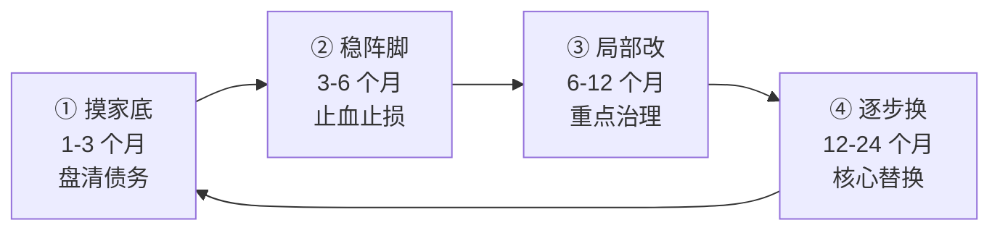
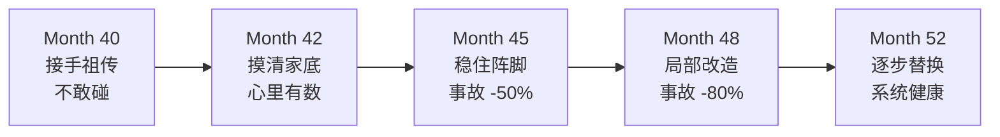

# 13.技术债与遗产系统治理

#### 目录介绍
- [1. 案例引入](#1-案例引入)
  - [1.1 8 万行祖传代码](#11-8-万行祖传代码)
  - [1.2 顺藤摸到根因](#12-顺藤摸到根因)
  - [1.3 我们要回答什么](#13-我们要回答什么)
- [2. 治理全景图](#2-治理全景图)
  - [2.1 治理四阶段](#21-治理四阶段)
  - [2.2 债务与遗产的区别](#22-债务与遗产的区别)
- [3. 技术债分级](#3-技术债分级)
  - [3.1 债务四种类型](#31-债务四种类型)
  - [3.2 债务优先级评估](#32-债务优先级评估)
  - [3.3 债务清单化管理](#33-债务清单化管理)
- [4. 遗产系统救活四步](#4-遗产系统救活四步)
  - [4.1 摸清家底](#41-摸清家底)
  - [4.2 稳住阵脚](#42-稳住阵脚)
  - [4.3 局部改造](#43-局部改造)
  - [4.4 逐步替换](#44-逐步替换)
- [5. 渐进与勒索重构](#5-渐进与勒索重构)
  - [5.1 勒索式重构的诱惑](#51-勒索式重构的诱惑)
  - [5.2 渐进式重构的路径](#52-渐进式重构的路径)
  - [5.3 两者的选择标准](#53-两者的选择标准)
- [6. 还债节奏与预算](#6-还债节奏与预算)
  - [6.1 20% 还债时间](#61-20-还债时间)
  - [6.2 每期还小债](#62-每期还小债)
  - [6.3 大债走专项](#63-大债走专项)
- [7. 共存策略](#7-共存策略)
  - [7.1 新旧系统并跑](#71-新旧系统并跑)
  - [7.2 双写与流量切换](#72-双写与流量切换)
  - [7.3 数据一致性保障](#73-数据一致性保障)
- [8. 老板与团队的对齐](#8-老板与团队的对齐)
  - [8.1 说服老板还债](#81-说服老板还债)
  - [8.2 团队"还债"的动力](#82-团队还债的动力)
  - [8.3 功能与还债平衡](#83-功能与还债平衡)
- [9. 治理反模式](#9-治理反模式)
- [10. 综合案例串讲](#10-综合案例串讲)
  - [10.1 祖传项目救活](#101-祖传项目救活)
  - [10.2 治理全过程](#102-治理全过程)
  - [10.3 治理哲学回扣](#103-治理哲学回扣)
  - [10.4 治理速查](#104-治理速查)


## 1. 案例引入

### 1.1 8 万行祖传代码

Month 40，CTO 老李把糖果充叫进办公室：

```
老李: "糖果充, 有个硬活给你。公司 5 年前的核心账务系统 'core-billing',
     8 万行代码, 3 个前任 Owner, 每个月出 3-5 个 P1, 谁也不敢碰. 你敢接吗?"
糖果充: (心里一咯噔) "老板, 能不能重写?"
老李: "你敢跟 CFO 说'我们要停 core-billing 3 个月重写'吗?"
糖果充: "呃......"
老李: "这就是你要学的一课 —— 遗产系统不能推倒重来, 要在'带病运转'的同时慢慢救活."
```

糖果充回工位, 第一件事打开代码仓库：

```
/core-billing (2020 年首次提交)
├── /src (7.8 万行 Java)  ├── /test (300 行, 覆盖率 4%)
├── /doc (空)             ├── /db (54 张表, 无关系图)
└── README.md (5 行, "billing service")

src/BillingService.java: 3200 行 / 一个类 / 一个方法 processBilling() 800 行 / 
                        10 层嵌套 if / 大量 // TODO fix later (最早 2020 年) / 拷贝 CRUD x 20 处

git log: 前任 A (2020) 首次提交后离职 / 前任 B (2021-2023) 加 30% 功能后调岗 / 
        前任 C (2023-2025) 只修 bug 后离职 / 之后 6 个月无主, 谁改谁背

监控: 过去 6 个月 P0 事故 2 次 (账不平 + 数据丢失) / P1 事故 18 次 / P2 数不清 / 
     客服工单 200+/月 / CFO 每周质问 3 次
```

糖果充第 2 天带团队开会：

```
糖果充: "我们接了 core-billing. 各位说说想法."
小李: "直接重写. 6 个月, 我带 3 个人."
小周: "重写风险太大. 慢慢改, 花 2 年吧."
小张: "要不......只修 bug, 不改代码?"
糖果充: (三种截然不同的意见, 头疼)
```

糖果充找老陈复盘：

```
老陈: "3 个方案代表 3 种认知: 小李勒索式重构 (激进) / 小周渐进式重构 (温和) / 小张装死不动 (逃避).
      3 种都有问题. 正解是:
      1. 摸清家底 (家底不清就动手 = 送死)
      2. 稳住阵脚 (先别让它继续出事)
      3. 局部改造 (找到最痛的 20%, 重点治)
      4. 逐步替换 (真正的重构, 分模块滚动)
      别急着写代码, 3 个月内不允许写一行'重构'代码, 先做前 2 步."
```

### 1.2 顺藤摸到根因

糖果充听老陈的话, 第一个月忍住手, 只做"摸家底":

**产出 1: 系统全景图** — 计费引擎(核心 3 万行) / 账单生成(2 万行, 稳定) / 对账系统(1.5 万行, 事故重灾区) / 报表导出(1 万行, 边缘) / 定时任务(5000 行, 事故重灾区); 上游 7 系统(支付/风控/订单) + 下游 5 系统(财务/客服/审计)。**结论: 80% 的事故来自 2 个模块 —— 对账系统 + 定时任务**。

**产出 2: 债务全景表**：

```
【core-billing 技术债清单 · 2026-04】
模块       | 债务类型     | 严重程度  | 修复成本 | 优先级
─────────────────────────────────────────────────────
对账系统   | 逻辑黑洞     | ⭐⭐⭐⭐⭐ | 3 人月   | P0
定时任务   | 无幂等       | ⭐⭐⭐⭐⭐ | 1 人月   | P0
计费引擎   | 800 行大方法 | ⭐⭐⭐⭐   | 5 人月   | P1
账单生成   | 拷贝模式     | ⭐⭐⭐    | 2 人月   | P2
报表导出   | 无缓存       | ⭐⭐      | 0.5 人月 | P3
全局       | 无测试       | ⭐⭐⭐⭐⭐ | 持续    | 并行
全局       | 无文档       | ⭐⭐⭐⭐   | 1 人月   | 并行
```

**产出 3: 复盘 6 个月的所有事故** — 账不平 8 次(对账系统无一致性保证) / 数据丢失 3 次(定时任务无幂等+无重试) / 性能问题 4 次(报表全表扫描) / 配置错乱 3 次(写死代码里) / 其他 2 次。**结论: 70% 事故集中在'对账+定时任务'两个模块, 先治这两个事故率能压 70%**。

**这份"摸家底"报告让糖果充第一次看到方向**：

```
错误思路"全部重写"→ 8 人 × 12 月 = 96 人月 → 期间业务停 → 不可能
错误思路"全都不动"→ 每月继续 3-5 个 P1 → 3 年后变"没人敢动的黑洞" → 团队全离职
正确思路 → 用 20% 时间修 80% 的痛 → 先治对账+定时任务 → 6 个月事故率 -70% → 
        12 个月启动核心引擎重构 → 24 个月整体健康
```

### 1.3 我们要回答什么

```
Q1: 接手祖传代码, 第一件事应该做什么?
Q2: 什么样的技术债该还, 什么样的该忍?
Q3: "重写"和"重构"的边界在哪?
Q4: 老板不肯给"还债"资源, 怎么争取?
Q5: 团队没人愿意搞"重构", 怎么激励?
Q6: 新老系统怎么并存共处?
Q7: 数据迁移怎么保证不丢?
Q8: 治理完的代码, 怎么防止再腐化?
```

**核心命题**：**遗产系统的治理,不是"技术活",是"经营活"** —— **你要在"不影响业务 + 不吓跑团队 + 不激怒老板"的约束下, 让一个"活的病人"慢慢康复**。

---

## 2. 治理全景图

### 2.1 治理四阶段



| 阶段 | 目标 | 关键动作 | 完成标志 |
|:--:|---|---|---|
| ① 摸家底 | 全景可见 | 债务清单 + 事故复盘 + 依赖图 | 3 份文档产出 |
| ② 稳阵脚 | 事故率 -50% | 补测试 + 加监控 + 修高频 bug | P0/P1 事故数下降 |
| ③ 局部改 | 关键模块健康 | 20% 模块的深度治理 | 关键模块可维护 |
| ④ 逐步换 | 长期可持续 | 核心引擎替换 | 老系统下线 |

### 2.2 债务与遗产的区别

| 维度 | 技术债 (Tech Debt) | 遗产系统 (Legacy System) |
|---|---|---|
| 定义 | 为短期利益主动选择的次优方案 | 时间久远、无人熟悉、混合大量债务 |
| 例子 | "先写死配置, 下版本改"(然后忘了) | 5 年前老项目, 3 个前任, 无文档 |
| 特点 | 有自知之明, 有记录(至少 // TODO) | 债务累积到"考古现场"级别 |
| 治理 | 主动还, 定期还 | 系统性救治, 而非单点还债 |

**核心差别**: 技术债"我知道我欠了什么, 也知道怎么还"; 遗产系统"我不知道里面有什么, 也不知道从哪开始"。**遗产系统 = 未偿还技术债 × 时间 × 人员流失 的复合结果**。

---

## 3. 技术债分级

### 3.1 债务四种类型

**Martin Fowler 的技术债四象限**：

| 类型 | 特征 | 说明 |
|---|---|---|
| **谨慎 & 主动** | "我们知道不完美, 但业务紧急, 先这样" | 有记录, 事后主动还 → **最健康的债** |
| **谨慎 & 被动** | "现在才知道当初的方案不好" | 事后发现, 需要主动重构 → 常见的债 |
| **鲁莽 & 主动** | "反正上线要紧, 管他什么设计" | 明知道错还要做 → 危险的债 |
| **鲁莽 & 被动** | "我们根本不知道这是坏设计" | 团队缺乏经验, 无自知 → **最可怕的债** |

**判断类型三问**: Q1 决策时是否知道这是次优方案?(是→主动, 否→被动); Q2 决策依据是否合理?(是→谨慎, 否→鲁莽); Q3 是否有记录(// TODO/文档)?(是→可跟进, 否→黑洞)。

**糖果充接手时 core-billing 的类型分布**：谨慎主动 5%(有 // TODO 注释) / 谨慎被动 15%(早期合理后来不合适) / 鲁莽主动 30%(明显赶工) / **鲁莽被动 50%(团队不知道是坏设计)** → 说明当初团队缺乏经验, 现在治理需要"教育 + 修复"双管齐下。

### 3.2 债务优先级评估

**"影响-成本"矩阵**：

```
             影响 (业务损失/年)
                ↑
     高影响低成本(P0) │ 高影响高成本(P1)
     立即还           │ 走专项
    ─────────────────┼───────────────── → 修复成本 (人月)
     低影响低成本(P2) │ 低影响高成本(P3)
     有空就做         │ 忽略
```

**四象限策略**：**P0** (高影响+低成本 立即还) —— 例: 定时任务加幂等 (1 人月, 消除 8 起 P1); **P1** (高影响+高成本 走专项) —— 立项 3-6 个月, 例: 对账系统重构 (3 人月, 消除大部分账不平); **P2** (低影响+低成本 有空就做) —— 塞进 20% 还债时间, 例: 修 TODO 注释; **P3** (低影响+高成本 忽略) —— 不要浪费资源, 例: 报表页面样式重构 (业务不痛就别动)。

**"业务损失/年"估算方法** —— 四个维度: 直接损失(赔付/补偿) + 效率损失(每次事故处理人力 × 频次) + 机会成本(因保护老系统新功能延期) + 团队士气(团队苦恼的隐性成本)。

**例: 对账系统未治理的年损失** — 直接账不平赔付 60 万 + 效率 8 次 P1 × 20 人天 = 160 人天 (约 40 万) + 机会新账务功能延期 3 次影响 200 万营收 + 士气 3 人因老系统提离职 (换人成本 30 万/人); **总计 60 + 40 + 200 + 90 = 390 万/年**; **修复成本 3 人月 (约 15 万); 投产比 390 / 15 = 26x → 立即还**。

### 3.3 债务清单化管理

**技术债卡片模板 (debt-2026-042 · 对账系统)**：

```
基本信息: 编号 debt-2026-042 / 发现 2026-04-15 / 发现人 糖果充 / 
        模块 core-billing / 对账系统 / 类型 鲁莽 & 被动
债务描述: 对账系统"每晚跑一次全量对比", 逻辑在 2000 行存储过程里. 无幂等, 
        中途失败需 DBA 手动介入.
影响:   直接 60 万/年赔付 / 效率 160 人天/年 / 士气 3 人想离职
方案:   A 完全重写 (5 人月) / B 抽出核心逻辑+补幂等 (3 人月) ← 推荐 / C 只补幂等 (0.5 人月)
优先级: P0 (影响高 + 成本可控 + 投产比 26x)
计划:   Sprint 1 摸清逻辑+补测试 (糖果充+小李) / Sprint 2-3 抽出核心+补幂等 (小李主导) / 
       Sprint 4 灰度+上线; 目标 6 月底完成
```

**清单化的价值**：可视化(让老板和团队看到"债有多少") / 可跟踪(每个债有 Owner + Due) / 可决策(数据说话, 不靠"感觉") / 可复盘(半年回顾"还了多少 / 新增多少")。**工具建议**: 简单 Confluence/Wiki / 中级 JIRA 建"技术债"项目 / 复杂 独立技术债管理平台(大公司)。

---

## 4. 遗产系统救活四步

### 4.1 摸清家底

**摸家底产出物 (前 1-3 个月)**：产出 1 系统全景图(业务子域+依赖上下游+数据流) / 产出 2 债务清单(卡片全集+优先级矩阵+修复路线图) / 产出 3 事故复盘归纳(过去 6-12 个月所有事故+类型分类+共同根因) / 产出 4 团队能力盘点(谁熟悉哪块+关键人 backup+培训需求)。

**三条纪律**：(1) **不写"重构代码", 只写"文档"** —— 前 3 个月忍住手; (2) **广纳意见** —— 找 3 位前任(哪怕已离职)喝咖啡 + 找上下游 Owner 聊 + 找业务方了解痛点; (3) **数字化一切** —— 事故次数/频率/损失 + 代码复杂度/覆盖率/圈复杂度, 让"感觉"变"数字"。

**常见陷阱**：太快下"重写"结论(摸不清就重写=拿业务命赌) / 太深陷入细节(一个模块细节看 2 个月=见树不见林) / 只看代码不看业务(代码丑不代表要改, 业务痛才要改)。**对法: 用 "80/20 视角" — 80% 事故来自哪 20% 代码? 那 20% 是治理重点**。

### 4.2 稳住阵脚

**稳阵脚 (3-6 个月) 的三个动作**：

**动作 1 · 补监控 (第一周)** — 关键接口成功率/RT/QPS + 关键定时任务执行状态 + 异常日志告警 + 数据一致性告警; **目的**: 让"隐性事故"显性化(之前不告警的 P2 现在能看到, 之前手工发现的 P1 现在自动告警)。

**动作 2 · 补测试 (前 2 个月)** — 关键路径的集成测试 + 核心方法的单元测试 + 覆盖率 4% → 40%; **目的**: 让"改一行不出事"成为可能(之前不敢改怕引入新 bug, 有测试后可以放心改)。

**动作 3 · 修高频 bug (前 3 个月)** — 从事故列表挑 Top 10 频次的问题 + 每周 1-2 个集中修 + 每个修复必须有测试; **目的**: 事故率 -50%(团队获得喘息机会, 也让老板看到"糖果充在做事")。

**核心**："稳"是"改结构"的前提, 没稳住就动结构 = 更大事故; **先让病人"活下来", 再考虑"变健康"**。

### 4.3 局部改造

**局部改造 (6-12 个月) 的策略**：策略 1 **优先改造"痛点模块"** — 从债务清单挑 P0 / 一次只改 1 个模块(避免摊子铺太大)/每个模块周期 1-3 个月; 策略 2 **边改造边补测试** — 改之前先写"回归测试"/改的过程写"新测试"/改完覆盖率 60%+; 策略 3 **用"绞杀者模式"** — 在旧模块外面套一层"新接口", 内部逐步替换, 外部无感, 完全替换后拆掉旧模块。

**"绞杀者模式" (Strangler Pattern) 三步**：

```
Step 1: 老代码原封不动, 但外面套"防腐层" (Anti-Corruption Layer)
       所有对老代码的调用都经过防腐层
Step 2: 逐个替换老代码功能, 每替换一个, 防腐层内部把调用切到新代码
Step 3: 老代码功能全部被替换后, 删除老代码, 防腐层退化为"新代码的门面"
```

**糖果充对账系统的绞杀实践**：

```
Sprint 1: 建立防腐层 ReconcileFacade
Sprint 2: 用新代码实现"新增对账"
Sprint 3: 用新代码实现"历史对账查询"
Sprint 4: 用新代码实现"异常对账处理"
Sprint 5: 老代码 0 调用, 删除
期间业务无感, 只是"越来越稳".
```

### 4.4 逐步替换

**逐步替换 (12-24 个月) 的核心**：(1) 一次一个模块不贪多; (2) 每个模块的替换必须过 3 关: 功能等价性验证(老 vs 新对比) + 数据一致性验证(老 vs 新数据对齐) + 性能不劣化验证(新的至少不比老的差); (3) 每个模块替换后立即观察 1-2 周, 不出问题再替换下一个; (4) 核心(计费引擎)最后替换 — 前面稳定后, 团队有信心和经验再动核心。

**"退路"**: 每次替换必须有"回滚开关" — 新代码可通过配置一键切回老代码 / 保留至少 2-3 个月的"双版本共存期" / 出问题立即切回, 不硬撑。

**最终目标**: 不是"变成完美代码", 是"变成'普通可维护代码'" — 覆盖率 >60% / 平均圈复杂度 <10 / 平均方法长度 <50 行 / 关键文档齐全 / 有 2+ 人熟悉。**达到"普通"就够了, 别追求"完美"**。

---

## 5. 渐进与勒索重构

### 5.1 勒索式重构的诱惑

**"勒索式重构" (Big Bang Rewrite) 的四种诱惑**：一次性解决"3 个月重写, 一劳永逸" / 技术挑战"用最新架构秀技术肌肉" / 摆脱历史包袱"不用再看那些恶心的代码" / 团队升级"借重写机会培养新一代工程师"。

**勒索式的现实 (业界统计)**: 完全重写项目成功率 <30% / 平均延期 200%(计划 6 个月实际 18 个月) / 期间业务影响巨大(无法迭代新功能) / 团队士气前 3 个月高涨 6 个月后崩塌 / 老板信任一次失败永久失去。

**三大陷阱**：陷阱 1 **低估复杂度** — 老系统 5 年积累的"corner case"无法一次覆盖, 每个奇怪需求背后都有业务故事, 你不知道直到用户投诉; 陷阱 2 **高估团队能力** — "3 个月重写"通常是"6-12 个月才能对齐老系统", 期间团队压力巨大; 陷阱 3 **无法止损** — 一旦启动, 中途放弃 = 一无所有, 老板不会让你"停半年再重启"。

**经典案例 (Netscape → Firefox)**：1997 年 Netscape 决定重写浏览器 (Netscape 5.0), 预计 6 个月; 实际花 3 年, 期间市场份额 80% → 5%, Microsoft IE 反超, 公司最终被收购。Joel Spolsky 2000 年发文《Things You Should Never Do, Part I》批评："重写代码是软件公司犯的最大战略错误。"

### 5.2 渐进式重构的路径

**渐进式重构 (Incremental Refactoring) 五原则**：不停业务只改结构 / 每次改一点立即验证 / 有测试才动手无测试先补测试 / 有退路(feature flag)出问题就回滚 / 分批发布灰度先行。

**四步节奏**：Step 1 **Extract (抽出)** — 从大方法抽出小方法/从大类抽出小类/从模块抽出接口; Step 2 **Simplify (简化)** — 消除重复代码/消除循环依赖/简化控制流; Step 3 **Test (测试)** — 每次改动补测试/覆盖率逐步提升/关键路径 100% 覆盖; Step 4 **Replace (替换)** — 有测试保护后大胆替换/每次替换 1 个模块/观察 1-2 周再动下一个。

**三个经典技巧**：**Sprout Method (发芽方法)** — 新功能不直接改老方法, 抽出到新方法, 从老方法调用, 老方法逐渐"发芽"出多个小方法; **Wrap Class (包装类)** — 不改老类包一层, 新逻辑在包装层, 老类逐渐被"包"起来; **Branch by Abstraction (分支抽象)** — 老代码抽出接口, 新老实现共存, 通过 feature flag 切换。

### 5.3 两者的选择标准

| 维度 | 勒索式适合 | 渐进式适合 |
|---|---|---|
| 系统状态 | 完全无法使用 | 带病能跑 |
| 业务价值 | 已无价值 | 仍在产生收入 |
| 团队能力 | 极强 (有过重写经验) | 一般 |
| 时间压力 | 无 | 有 (业务不能停) |
| 决策层信任 | 极高 (给你 12 个月) | 有限 |
| 系统规模 | 小 (<1 万行) | 大 (>5 万行) |

**决策矩阵**：**渐进式** — 系统能勉强跑 + 业务还在产生收入 + 老板给的时间 <6 个月 + 系统 >2 万行 → **100% 用渐进式**; **勒索式** — 系统彻底崩了(每周挂 3 次) + 业务方也承受不了 + 老板准备"stop the world" 3-6 个月 + 系统 <5000 行 → 可以考虑勒索式。**大部分情况 → 渐进式**。

**糖果充的选择**：core-billing 8 万行(大) + 业务在跑(无法停) + CFO 每周质问(老板压力大) + 老板给的时间 6-12 个月 → **渐进式(无悬念)**。小李最初提"6 个月重写"被否决："6 个月重写 = 12-18 个月才能对齐, 期间业务停 = 每年 200 万营收损失, 账不划算。"

---

## 6. 还债节奏与预算

### 6.1 20% 还债时间

**行业最佳实践**: 团队 20% 时间用于还债 — 60% 新需求 + 20% 还债 + 10% Bug 修复 + 10% Buffer/学习。**100% 新需求 → 债务快速累积; 40% 还债 → 业务方不满意老板不批; 20% 是"平衡点", 让债不再增加**。

**三种分配方式**：方式 1 每周固定 1 天"周五全员还债日"(简单粗暴, 但"周五还没恢复到工作状态"); 方式 2 每 Sprint 固定 20%"每 2 周有 2 天还债"(主流做法, 与新需求并行); 方式 3 每季度固定 2 周"每季度末'还债周'"(集中攻坚, 适合大债务)。

**糖果充的选择**: **Sprint 内 20% 时间 + 每季度 1 周攻坚周** — 平时 20% 还小债 + 季度末 1 周攻坚大债 + 遇到 P0 债(如对账)走专项立项。

### 6.2 每期还小债

**每 Sprint 20% 还债的操作**: Sprint 计划会时从债务清单挑 3-5 个小债, 每个 <2 人天, 分给不同的人。**选择标准**: 优先 P2 类(小成本大收益) + 与本 Sprint 新需求相关的债(顺手治) + 团队成员感兴趣的债(提高积极性)。

**Sprint 26 还债清单示例**：

```
1. 删除 3 处死代码 (小张, 0.5 天)
2. 补充 UserService 单元测试 (小李, 1 天)
3. 修复配置读取硬编码 (小周, 1 天)
4. 重构 ReportGenerator 方法 (糖果充, 1 天)
5. 清理 5 个过期 // TODO (小赵, 0.5 天)
总计: 4 人 × 4 天 = 16 人天 (团队总产能 80 人天的 20%)
```

**Sprint 复盘时新增"本 Sprint 还债成果"**: 计划 5 个实际 4 个 / 债务余额 80 → 76 / 事故率上月 3 次 P1 本月 1 次 → **让团队感受到"还债有意义, 不是白干"**。

### 6.3 大债走专项

**大债 (P0 级, 3+ 人月) 必须走"专项"** — 单独立项 + 独立预算 + 独立里程碑 + 独立汇报; 老板视角: "这是一个正式项目, 不是'顺手做'"。

**专项立项书 · core-billing 对账系统重构**：

```
一、背景: 对账系统年损失 390 万 (直接 + 效率 + 机会 + 士气)
二、目标: 事故率 -70% / 效率 +50% / 数据一致性 100%
三、方案: 抽出核心逻辑 + 补幂等 (第 4.3 节), 3 人月, 6 月-8 月
四、风险: 迁移期间双系统并跑 QA 加倍投入 + 数据一致性验证需 DBA 支持
五、投产比: 投入 3 人月 (约 15 万), 产出 390 万/年, ROI 26x
六、请求: 3 人月人力 + 6-8 月保护期 (期间不接新需求) + 老板月度 review
```

**糖果充的实践**：Month 43-45 (对账系统专项) — 立项 CTO 批 3 人月+保护期 / 团队 小李 owner+糖果充导师+小周辅助 / 3 个月完成 / 上线后事故率 -80% (超预期) / Q4 复盘获 CTO 特别表扬: "这是我见过最漂亮的遗产系统治理."

---

## 7. 共存策略

### 7.1 新旧系统并跑

**新老共存的 5 阶段时间线**：

```
Phase 1: 老系统独占 (100% : 0%)             新系统开发中, 老系统正常服务
Phase 2: 双写 + 老系统读 (100 write : 0 read new)  新系统与老系统同时接收写入, 数据两侧沉淀, 老系统继续读
Phase 3: 双写 + 灰度读 (100 : X% read new)  部分读流量导到新系统, 灰度 1% → 5% → 20% → 50%
Phase 4: 新系统主 + 老系统备 (0% : 100%)   完全切到新系统, 老系统保留 2-3 个月作"回滚保险"
Phase 5: 老系统下线                        确认无问题后老系统正式下线, 归档代码
```

**每个 Phase 的最短停留时间**：Phase 1→2 新系统开发完 + 通过测试; Phase 2→3 双写 1 周无差异; Phase 3→4 灰度 100% 后再稳定 2 周; Phase 4→5 老系统 0 调用后再等 2-3 个月。

### 7.2 双写与流量切换

**双写 (Dual Write) 的实现**：

```java
// 伪代码
public void createBill(BillDto dto) {
    Bill oldBill = oldBillingService.create(dto);           // 先写老系统 (主)
    try {
        Bill newBill = newBillingService.create(dto);       // 再写新系统 (影子)
        if (!isConsistent(oldBill, newBill)) alertInconsistency(oldBill, newBill);  // 对比一致性
    } catch (Exception e) {
        log.warn("New system failed, ignored", e);          // 新系统出错不影响主流程
        alertNewSystemError(e);
    }
    return oldBill;
}
```

**流量切换的实现 (feature flag)**：

```java
public Bill getBill(String billId) {
    if (featureFlag.isEnabled("read_new_billing_system", userId)) {
        return newBillingService.get(billId);
    } else {
        return oldBillingService.get(billId);
    }
}
// 灰度扩容: featureFlag 支持按 userId hash 灰度, 1% → 5% → 20% → 50% → 100%
```

**关键**：**切换要"可逆" —— 任何时候都能一键切回老系统**。

### 7.3 数据一致性保障

**新老共存期最大的风险**: **数据不一致**。**一致性保障三层**: 第 1 层 **双写时同步校验** (每次写入后立即对比新老数据 + 发现差异立即告警 + 定位到具体字段差异); 第 2 层 **定时全量校验** (每天凌晨跑一次全量对比 + 输出差异报表 + 人工介入修复差异); 第 3 层 **关键业务事件校验** (结账、对账等关键事件时强制新老对比 + 差异超阈值则中止操作)。

**数据修复策略**：情况 1 老对新错 → 从老补数据到新 + 修新系统 bug; 情况 2 新对老错 → 修老系统数据(慎重)或标记老数据"已过时"; 情况 3 两个都错 → 联系业务方确认真实值, 修复后回溯根因。

**糖果充的数据一致性实践**：Phase 2 双写期间 — 前 2 周差异率 3-5% (每天分析根因) / 中 2 周差异率 <1% (修 corner case) / 后 2 周差异率 <0.1% (只有极端场景); Phase 3 灰度期间 — 关键业务前设置校验点 + 有 3 次自动切回老系统的经验 + 每次切回后修 bug 重新灰度; **最终 Phase 5 时零差异**。

---

## 8. 老板与团队的对齐

### 8.1 说服老板还债

**老板天然不喜欢"还债"**——**因为看起来没有"新东西"**。

**说服老板三话术**：**话术 1 · 数字化损失**"老板, core-billing 的技术债一年损失 390 万, 修复投入 15 万 ROI 26x. 这是我算的账 [详细清单], 不修损失继续, 修 6 个月回本"; **话术 2 · 类比业务语言**"技术债像'高利贷', 短期不修没事, 长期利滚利, 3 年后修复成本翻 5 倍. 现在修是'投资', 3 年后修是'救火'"; **话术 3 · 竞争视角**"竞品去年重写了核心账务系统, 现在能日结, 我们只能周结. 如果不修, 6 个月后功能上被拉开 3 个身位"。

**老板视角的还债汇报模板 (Q3 · 糖果充)**：

```
一、本季度成果: 事故率 -60% (5/月 → 2/月) / 效率 +30% (定时任务 4h → 2.5h) / 团队 NPS 6.5 → 8.2
二、量化收益: 直接节省 45 万 (少赔付) + 效率节省 20 万 + 士气无人离职 (对比上季度走 2 人)
           总计 65 万 (投入 15 万, ROI 4.3x 首季)
三、下季度: 完成对账系统重构 (P0 债) / 事故率目标 -80% (2/月 → 1/月以下) / 
         投入 3 人月 / 预期收益 100 万/年
```

### 8.2 团队"还债"的动力

**团队天然不喜欢"还债"** —— 因为没有"新东西"能秀。**激励三动作**: 动作 1 **让还债"有战果"** — 每 Sprint 还债成果公开展示 + 团队群贴"事故率曲线"让大家看进步 + 每季度评"还债英雄"; 动作 2 **让还债"有成长"** — 还债 = 学习经典代码 + 学习重构技术 + 派"还债"给想学重构的员工 + 让还债成为"晋升加分项"; 动作 3 **让还债"有名分"** — 立"还债专项"有正式 Owner + 项目结束时对参与者写"内部推荐信" + CTO 例会点名表扬。

**糖果充的实践**：

```
Month 40 (刚接手): 团队对还债消极.
Month 43 (对账系统上线): 事故率 -80% / 老板全员大会表扬 / 小李 (owner) 收到 CTO 亲笔手写卡片 / 
                     团队氛围转变: "还债是件酷事".
Month 45 (后续): 团队主动申请"我要接哪块债" / 内部形成"还债文化".
```

### 8.3 功能与还债平衡

**新功能与还债的平衡**：错误做法 1 100% 做新功能(债越滚越大 3 年崩盘); 错误做法 2 停 3 个月只还债(业务方翻脸老板问责); **正确做法 60/20/10/10** — 60% 新功能(业务方满意) + 20% 还债(债不再增加) + 10% 修 bug(稳定性) + 10% Buffer/学习(团队健康)。

**特殊情况调整**：新业务爆发期 70/15/10/5 (优先业务, 债务暂缓但不能 <10%); 事故频发期 50/30/15/5 (债务比例升高, 直到事故率下降); 稳态期 60/20/10/10 (标准比例长期维持)。

**如何跟业务方沟通"还债时间"**：

```
业务方: "这个功能下周必须上!"
弱对法: "我们时间紧, 加班做" → 长期不可持续
强对法: "这个功能我们承接, 但根据 60/20 原则, 20% 还债时间不能占用.
        如果你觉得这个功能超优先级, 可以砍以下 2 个功能中的一个:
        - 功能 A (下下周)
        - 功能 B (下下下周)
        请你选一个."
业务方: (第一次意识到"还债不是可选") "OK 那砍 A 吧."
```

---

## 9. 治理反模式

遗产系统治理中五种常见反模式：

| 反模式 | 现象 | 危害 | 对法 |
|---|---|---|---|
| **全部推倒重来** | 接手祖传就想全部重写 | 期间业务停老板不批 / 6 个月变 18 个月团队崩 / 新老切换出事故灾难 | 渐进式重构 + 绞杀者模式, 而非全部重写 |
| **装作没看见** | "能跑就行", 只修 bug 不改结构 | 债务累积到爆炸 / 团队没人愿意留 / 3 年后彻底玩不动 | 主动摸家底 + 20% 还债时间, 不逃避 |
| **只重构不还债** | 沉迷"技术优雅", 对业务债不闻不问 | 代码美了但业务问题没解决 / 老板质问"你到底在忙什么" / 团队疲惫但无成就感 | 每次重构必须绑定"业务收益 (事故率/效率/成本)" |
| **无灰度上线** | 重构完直接全量上线 | 一旦出问题全线崩 / 无法快速回滚 / 修 bug 时业务方骂 | 双写 → 灰度读 → 全量, 每步都可回滚 |
| **一个人扛** | 一个人默默重构, 团队不参与 | 你走了系统又"孤儿化" / 团队没学到经验 / 后续再次腐化 | 让 2-3 人共同参与, 培养 backup, 沉淀文档 |

---

## 10. 综合案例串讲

### 10.1 祖传项目救活

**Month 40-52, 12 个月治理全过程**：

**Month 40-42 · 摸家底**：产出 系统全景图(5 子域, 12 上下游) / 债务清单 82 个(P0×3, P1×15, P2×45, P3×19) / 事故复盘归纳(70% 集中在 2 模块) / 团队能力盘点。关键动作: 前 3 个月不写一行"重构代码" / 找 2 位前任喝咖啡 / CTO 月度 review 每次汇报 debt list。

**Month 43-45 · 稳阵脚**：产出 监控 20+ 关键指标告警 / 测试覆盖率 4% → 40% / 事故率 3-5 次/月 → 1-2 次/月。关键动作: 每 Sprint 20% 时间还债 / Top 10 bug 集中修 / 每季度末 1 周攻坚。

**Month 46-48 · 局部改造**：产出 对账系统重构上线(专项 3 人月) / 定时任务加幂等(1 人月) / 事故率 -80%(3/月 → 0.5/月) / CTO 表扬。关键动作: 绞杀者模式改造对账 / 新老共存 3 个月 / 灰度上线分 4 周切换。

**Month 49-52 · 逐步替换**：产出 计费引擎替换启动 / 报表导出模块下线(无价值直接退休) / 团队信心大增 / 老板追加 5 人 HC。关键动作: 核心模块逐个替换 / 每替换一个稳定 2 周 / 老代码保留 3 个月保险。

### 10.2 治理全过程

**关键指标进化**：

| 时刻 | 事故率 | 测试覆盖率 | 团队 NPS | CFO 质问次数 |
|:--:|:--:|:--:|:--:|:--:|
| Month 40 (接手) | 5/月 | 4% | 4.2 | 3/周 |
| Month 43 | 2/月 | 25% | 5.8 | 1/周 |
| Month 46 | 1/月 | 45% | 7.1 | 1/月 |
| Month 49 | 0.5/月 | 60% | 8.3 | 0 |
| Month 52 | 0.3/月 | 65% | 8.7 | 0 |

**成长曲线**：



**CTO 老李对糖果充的评价 (Month 52)**：

```
"糖果充, 这 12 个月你做的最难的事:
 不是重构技术, 是让老板/业务方/团队三方都对'还债'达成共识.
 你没有一次'重写', 却让系统焕然一新.
 你没有一次冒进, 却让事故率降 90%.
 你没有一次抱怨'代码烂', 却让团队爱上重构.
 明年我给你 30 人的团队 + 支付平台整体负责."
```

### 10.3 治理哲学回扣

回望糖果充这次遗产系统治理, **技术债与遗产治理**的本质是：

```
初级: 修 bug (哪痛修哪)
中级: 重构模块 (让代码好看)
高级: 系统治理 (从事故到健康)
资深: 组织教育 (让团队会自己治)
大师: 文化沉淀 (债务在这里长不出来)
```

**治理的四层修炼**：第一层家底清(数据+债务清单+事故复盘) + 第二层阵脚稳(监控+测试+修高频) + 第三层局部治(绞杀者+双写+灰度) + 第四层长期健(20% 还债+文化)。

**核心命题**：**遗产系统的价值,不在"漂亮的代码",在"能持续产生业务价值的可维护性"** —— **80 分够用,别追求 100 分**。

**渐进模型**：

```
菜鸟: "这代码不能看, 全部重写!"
新手: "这代码不能看, 但我不敢重写"
进阶: "先摸清家底, 再局部治理"
资深: "绞杀者模式 + 20% 还债节奏"
大师: "债务在我的团队自然被消化"
```

**结论**：**能救活一个 5 年老系统的人, 比能从 0 写一个新系统的人, 稀缺 10 倍** —— **前者需要工程能力 + 政治能力 + 长期主义, 后者只需要技术能力**。

### 10.4 治理速查

**治理速查表**：

| 场景 | 动作 |
|------|-----|
| 接手祖传 | 前 3 个月不写重构代码, 只摸家底 |
| 债务分类 | 影响-成本四象限 (P0/P1/P2/P3) |
| 稳阵脚 | 补监控 + 补测试 + 修 Top 10 bug |
| 大债重构 | 绞杀者模式 + 双写 + 灰度 |
| 新老共存 | 双写 → 灰度读 → 全量 → 老下线 |
| 每 Sprint 还债 | 20% 时间 + 3-5 个小债 |
| 大债 (P0) | 走专项立项 + 独立预算 + 月度 review |
| 老板沟通 | 数字化 ROI + 类比高利贷 + 竞品视角 |
| 团队激励 | 有战果 + 有成长 + 有名分 |

**四大武器速记**：

```
治理四阶段:  ① 摸家底 (1-3 月, 全景+清单+复盘) → ② 稳阵脚 (3-6 月, 监控+测试+修 Top 10) →
            ③ 局部改 (6-12 月, 绞杀者+20% 时间) → ④ 逐步换 (12-24 月, 一次一模块+观察 2 周)
债务四类型:  谨慎+主动 (最健康) / 谨慎+被动 (常见) / 鲁莽+主动 (危险) / 鲁莽+被动 (最可怕)
渐进重构四步: Extract (抽出) → Simplify (简化) → Test (测试) → Replace (替换)
60/20/10/10 平衡: 60% 新功能 + 20% 还债 + 10% 修 bug + 10% Buffer/学习
新老共存 5 阶段: 独占 → 双写 → 灰度 → 主备 → 下线, 每步可回滚
```

---

**下一集预告**：糖果充在第 60 个月的深夜, 回望这 5 年从"能干活"到"支付平台负责人"的路. 他打开电脑, 给 3 年前那个还在被 CTO 打脸的自己写了一封信. 信里有 5 个建议, 有 3 次遗憾, 有 1 个秘密. **第 14 篇《给 3 年前自己的一封信》**用信件体收束全系列, 讲一个道理: **真正的资深, 不是"从没犯过错", 而是"每次犯错都留下了教材"**。

---

**本篇速查表**：

| 维度 | 关键武器 |
|---|---|
| 家底 | 全景图 + 债务清单 + 事故复盘 |
| 分级 | 影响-成本四象限 P0/P1/P2/P3 |
| 阵脚 | 补监控 + 补测试 + 修高频 bug |
| 改造 | 绞杀者 + 双写 + 灰度 + 回滚 |
| 节奏 | 20% Sprint + 季度攻坚 + P0 专项 |
| 平衡 | 60/20/10/10 (新/债/bug/buffer) |
| 共存 | 5 阶段: 独占 → 双写 → 灰度 → 主备 → 下线 |
| 老板 | 数字化 ROI + 高利贷类比 + 竞品视角 |
| 反模式 | 推倒重来 / 装看不见 / 只重构 / 无灰度 / 一人扛 |
