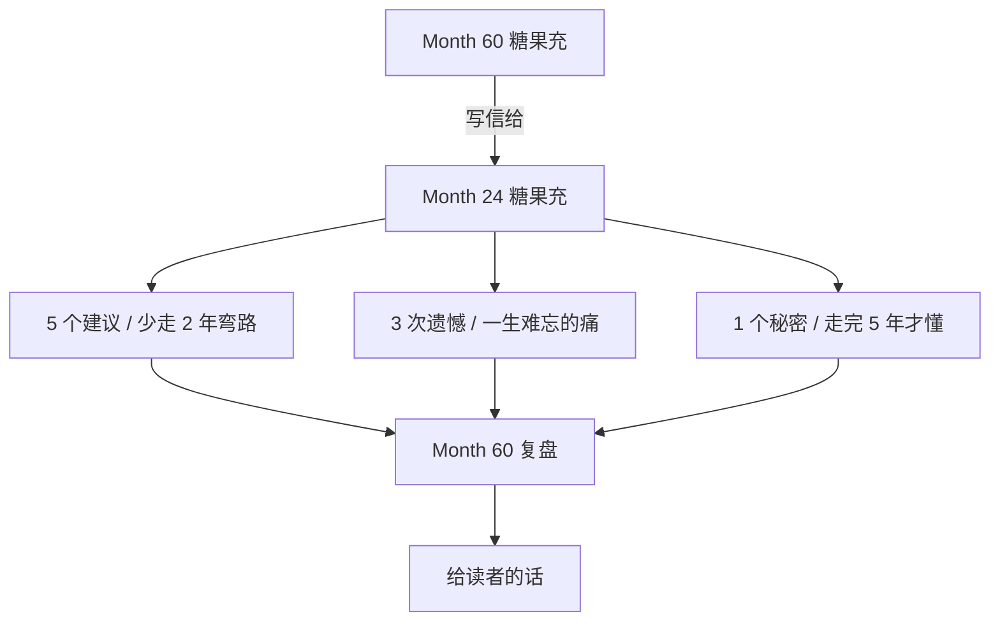
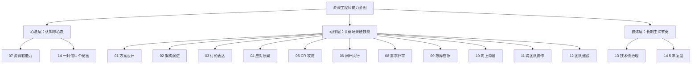

# 14。给3年前自己的一封信

#### 目录介绍
- [1。案例引入](#1-案例引入)
  - [1.1 深夜的一封信](#11-深夜的一封信)
  - [1.2 为什么要写这封信](#12-为什么要写这封信)
  - [1.3 这封信要回答什么](#13-这封信要回答什么)
- [2。信件全景图](#2-信件全景图)
  - [2.1 五三一结构](#21-五三一结构)
  - [2.2 时间线闭环](#22-时间线闭环)
- [3. 5 个建议](#3-5-个建议)
  - [3.1 尽早暴露](#31-尽早暴露)
  - [3.2 多解决问题](#32-多解决问题)
  - [3.3 事故变教材](#33-事故变教材)
  - [3.4 向上不是拍马](#34-向上不是拍马)
  - [3.5 找到三个人](#35-找到三个人)
- [4. 3 次遗憾](#4-3-次遗憾)
  - [4.1 被你逼走的实习生](#41-被你逼走的实习生)
  - [4.2 没敢喊停的上线](#42-没敢喊停的上线)
  - [4.3 没告别的师父](#43-没告别的师父)
- [5. 1 个秘密](#5-1-个秘密)
  - [5.1 秘密的样子](#51-秘密的样子)
  - [5.2 秘密的三层解释](#52-秘密的三层解释)
  - [5.3 资深不是终点](#53-资深不是终点)
- [6. 5 年时间线复盘](#6-5-年时间线复盘)
- [7。十三次犯错的教材化](#7-十三次犯错的教材化)
- [8. 14 篇全景速查](#8-14-篇全景速查)
- [9。不要长成这样](#9-不要长成这样)
- [10。长期主义速查表](#10-长期主义速查表)
- [11。结束语与致意](#11-结束语与致意)

---

## 1。案例引入

### 1.1 深夜的一封信

Month 60，凌晨 01:23。支付平台负责人，带 15 人团队。窗外下雨，桌上黑咖啡凉透了。糖果充刚陪 CTO 复盘完一次跨部门冲突回来。打开 Mac，光标闪了很久，第一行才敲出来：
> **"嘿，24 岁的糖果充：你现在正一个人加班到凌晨，又被 CTO 在评审会上按在地上摩擦。别急，3 年后，你会给他做汇报。5 年后，他会请你吃饭。"**

他停了一下，苦笑。那次评审会历历在目 —— PPT 只写了"技术方案"，被 CTO 一句"你在给谁做？"钉在原地。他红着脸出会议室，楼梯间抽了两根烟，朋友圈敲了句 **"我是不是不适合做技术"**, 3 秒后删掉。没人看见。
Month 60 的他，想告诉 Month 24 的自己一句话：**你不是不适合做技术。你只是不知道——光会写代码，走不远。**

- **前 12 个月**，以为技术就是"把功能实现"
- **12-24 个月**，被打脸打到怀疑人生
- **24-36 个月**，终于明白：技术方案 = 业务收益 × 落地成本 ÷ 风险
- **36-48 个月**，从"一个人牛"变成"一群人牛"
- **48-60 个月**，不再需要"证明自己"

**这封信 5 个建议，3 次遗憾，1 个秘密。** 全是坑，我踩过的。
### 1.2 为什么要写这封信

写这封信之前，糖果充做了三件事：**1.翻开了 Month 24 的周报** —— 那份周报现在看起来幼稚得可笑：本周完成"开发用户中心模块 (100%)" / 下周计划"开发订单模块" / 遇到问题"无"。 **没有一个业务指标。没有一次风险预警。没有一句向上同步**. CTO 那时候一定是憋着没说。
**2.翻开了 Month 24 的 code review 记录** —— 那时候他 review 别人代码的评论是: > "这么写不对，应该用 XXX 模式。" **没有为什么。没有替代方案。没有代价对比**。现在看，那不是 review，那是"炫技"。

**3.翻开了 Month 24 的绩效自评** —— 自评写了 800 字，**全在讲"我做了什么"，没有一句"我带来了什么"**。主管的评语只有一句: "**能干活，但看不到全局**。"

翻完这三样东西，糖果充突然理解为什么 CTO 当年会那么严厉 —— **不是他不够努力，是他方向错了**。于是，有了这封信。
### 1.3 这封信要回答什么

如果你正处在：刚工作 1-2 年觉得"技术能解决一切" / 3-5 年卡在 P6 上不去天花板肉眼可见 / 5-8 年想从"独立贡献者"变成"团队 Owner" / 或者单纯想少走点弯路 —— 那这封信想帮你回答四个问题：- **Q1**: **哪些坑早点填，能少走 2 年弯路**？— 见「5 个建议」
- **Q2**: **哪些事一辈子都会记得，想想都心疼**？— 见「3 次遗憾」
- **Q3**: **走完 5 年之后，我到底想清楚了什么**？— 见「1 个秘密」
- **Q4**: **怎么把犯过的错，变成后来人的教材**？— 见「教材化三步」

**结论先给**: 别怕丢人，尽早暴露；少证明自己，多解决问题；犯错不可耻，**不留教材才可耻**。
---

## 2。信件全景图

### 2.1 五三一结构

这封信不按常规章节走，按"信"的写法：


**为什么是 5 + 3 + 1**:

| 数字 | 含义 | 为什么这个数 |
|---|---|---|
| **5 个建议** | 战术级，可落地 | 太少不够用，太多记不住 |
| **3 次遗憾** | 情感级，一辈子的痛 | 3 件事已经足够让你哭 |
| **1 个秘密** | 认知级，顶层心法 | 只有 1 个，是所有一切的根 |

**建议是"应该做什么"** — 面向未来; **遗憾是"没有做什么"** — 面向过去; **秘密是"到底是什么"** — 面向本质。
### 2.2 时间线闭环

```
Month 24 (被打脸) → Month 60 (写信人) → Month 24 (收信人) ← 时间闭环 → Month 60 → 更远 (给读者)
```

**核心**: **过去的自己是老师，未来的自己是学生，现在的自己是那支笔**。
---

## 3. 5 个建议

### 3.1 尽早暴露

**这是我最想告诉你的一条**。
`Month 25`，你在做用户中心的分库分表。卡了 3 天，一个 shard key 的选择，你在网上查、看文档、发呆，就是不敢在群里问。**你怕什么**？你怕主管觉得你菜。结果第 4 天，主管过来看进度，你磕磕巴巴讲了半天，他 5 分钟就给了答案：**"用 user_id % 32，别用手机号，手机号会重"**。**你多花了 3 天，只为了不"丢人". 结果是：又丢人，又延期**。
**Month 60 的建议**: 能 30 分钟问出来的事，不要闷 3 小时 / 能 3 小时讨论清楚的事，不要一个人研究 3 天 / 能 3 天讨论清楚的方案，不要一个人写 3 周。
**心法**: > **"暴露问题的速度，决定成长的速度"**

**具体动作**:

| 卡住时长 | 该做的事 |
|---|---|
| 30 分钟 | Google + 官方文档 |
| 1 小时 | 群里发一句"有没有人做过 XXX" |
| 半天 | 拉主管 1v1, 5 分钟同步进度和卡点 |
| 1 天 | **必须**升级。不升级就是隐瞒 |
| 2 天 | 你已经严重延期。全组都在等你 |

**Month 24 的你**，记住：**快速求助不是无能，是职业素养**。「牛」的人不是"什么都会"，而是"知道怎么快速搞定"; 你在楼梯间偷偷 Google 的样子，主管其实看得见。
### 3.2 多解决问题

`Month 27`，你写了一个非常炫技的注解处理器，用 APT + 字节码增强做了一套自动路由。100 行代码变 20 行。你在周会上讲了 40 分钟。**主管当场没说话。一个月后，他把这个模块交给了别人重写。用最土的 if-else**。你委屈，私下问他为什么。他说了一句你 3 年才明白的话：
> **"你的代码，只有你能维护。那不叫资产，叫负债。"**

**Month 60 的建议**: 炫技型的代码 = 一次性资产，高维护成本 / 朴素型的代码 = 长期资产，低维护成本 / **"我能写"和"别人能改" 是两种不同的能力**。
**心法**: > **"少写让人惊叹的代码，多写让人放心的代码"**

**判断一段代码好不好，3 个问题**: (1) 半年后自己还能看懂吗？ (2) 新来的实习生能改吗？ (3) 凌晨 3 点线上出问题，值班人敢改吗？ **三个"是"，才是好代码。炫技的代码，通常这三条都不及格**。
**延伸**: 「证明自己」的行为—用最新技术，用最复杂模式，用最深的抽象; 「解决问题」的行为—用最简单的方式，让最多人能维护，让最短时间能上线。
**Month 24 的你**，你脑子里想的是"让我看起来牛"; **Month 60 的你**，想的是"让业务跑得更稳". **这两个"你"的差距，不是技术，是心态**。
### 3.3 事故变教材

`Month 28`，那次凌晨支付雪崩 P0。你熬到早上 7 点才恢复。复盘会上你被 CTO 追问了 45 分钟。出来之后你只想睡觉。**你没写复盘文档。你说"下次注意"**。**结果 Month 41，一模一样的故障，又发生了一次**。只不过这次不是你值班，是新来的小张，他不知道你踩过这个坑。CTO 在群里发了一句话你到现在都记得：
> **"事故不写复盘的团队，会把同一个坑，踩到公司倒闭。"**

**Month 60 的建议**: 每一次事故，都是**已经花过学费的课**; 不写下来，学费白交；写下来了，就是**留给团队的资产**。
**心法**: > **"复盘不是找靶子，是留教材"**

**教材化三步 (在第 7 章详细展开)**:

```
Step 1: 事实 (What) — 时间线，损失，影响面
Step 2: 根因 (Why)   — 5 Whys 追到组织/流程
Step 3: 改进 (How)   — 短/中/长期措施 + Owner + DDL
```

**每一次事故 = 一份文档 = 团队的一块砖**。**Month 24 的你**，从今天起，犯一次错就写一份。**哪怕只有 100 字**. 5 年后你会发现，你留下的教材，比你写的功能代码更值钱。
### 3.4 向上不是拍马

`Month 30`，你的周报被 CTO 划掉了一半。你回家路上一直在想: "**我做了那么多事，为什么他看不见**"? **你想错了。是你没让他看见**。那时候你的周报长这样：
```
本周完成：- 完成用户中心接口 (100%)
- 修复 3 个 bug
- 参加 5 次评审
```

**没有一个业务指标。没有一次风险预警。没有一句"需要老板决策"**. CTO 看你的周报，就像看流水账。**Month 60 的你现在写周报是这样的**:

```
本周成果 (业务视角):
- 支付成功率 99.87% → 99.94% (+0.07pp，月省客诉 800)
- 大促预演: TPS 从 800 → 1500，已具备双十一底座

风险预警：- 清结算团队人力缺口 1 人，影响双十一如期上线
  需要老板支持：从 XX 团队借调 1 人 2 周

需要决策：- 新支付渠道接入，A 方案 vs B 方案 (详见附件)
- 建议 A，请老板 review
```

**同样的一周，两份周报，老板看到的完全是两个人**。
**Month 60 的建议**: **管理向上 ≠ 拍马屁**, **管理向上 = 让老板能替你做决策** / 老板 80% 的时间是"没时间", **给他信息包，不给他大字报** / 每条汇报都要能回答：**"So what?"** (所以呢？ 老板要做什么?)。**心法**: > **"老板的时间，是最贵的资源。你不给他节省，他就替你砍预算"**

**具体动作 (详见系列第 10 篇)**: **3-3-3 结构** — 3 个成果 + 3 个风险 + 3 个决策 / **金字塔** — 结论先行，论据支撑 / **坏消息四段式** — 事实 → 影响 → 已做 → 需要。
### 3.5 找到三个人

`Month 32`，你被拉去带一个 3 团队的项目。你一个人扛，3 个月，掉了 15 斤。项目上线了，你也 hospitalized 了。**你以为"一个人扛"是英雄。主管说你是"傻子"**。他跟你说：
> **"糖果，你以为你是超人吗？ 一个人扛只会证明：团队没有你就不行。那不是资产，是风险。"**

**Month 60 的建议**: 在你的职业生涯中，你必须找到 3 种人：
| 角色 | 干什么 | 怎么找 |
|---|---|---|
| **师父 (Mentor)** | 高你 2-3 级，定期指路 | 看到有心得就主动请教，每季度 1v1 30 分钟 |
| **战友 (Peer)** | 同级别，互相吐槽和拉扯 | 一起加过班的都是种子，主动约饭 |
| **徒弟 (Mentee)** | 低你 1-2 级，逼你系统化 | 带教 1 个新人，你会重新理解一遍你会的 |

**为什么是这 3 种**: 师父让你看得远(帮你避坑，帮你规划下一步) / 战友让你走得稳(陪你熬夜，陪你吐槽老板) / 徒弟让你想得清(你教不明白的，是你自己也没懂的)。**Month 24 的你**，现在就该做的三件事：拉 CTO 每季度喝一次咖啡(别怕，他不会拒绝) / 和同期入职的 3 个人建个小群(3 年后你们会互相拉一把) / 带一个实习生(从 code review 教起，你的水平会翻一倍)。**心法**: > **"一个人走得快，一群人走得远。但 3 个人已经够远了。"**

---

## 4. 3 次遗憾

**建议是理性的。遗憾是感性的**。**Month 60 的糖果充**，写这一节的时候，抽了 3 根烟。因为这 3 件事，想起来都会疼。
### 4.1 被你逼走的实习生

`Month 29`，组里来了个实习生，叫小雷。华工的，挺聪明，但是新手。**你带他**。但你没耐心。他 PR 提上来，你打回去，评论只写"重写"; 他问你问题，你说"自己 Google"; 他周会讲技术分享，你打断说"这个太浅了". **3 个月后，他没转正，走了**。走之前跟你说了一句话：
> **"充哥，你是我见过技术最好的，但也是最不想再共事一次的。"**

你当时觉得"实习生玻璃心". **Month 60 的你，每次想起这句话都想找他道歉**。但他早就换了城市，微信也不回。
**你损失了什么**: 一个可能成为你左膀右臂的战友 / 一次锻炼"带人"能力的机会 / 一次让你早 2 年懂"管理"的教训。
**Month 60 的话**: > **"你 review 别人的代码，用什么口吻，决定了 3 年后你身边还有没有人。"**

**如果重来一次，该怎么做 (详见系列第 12 篇)**: **PR 评论** 不说"重写"，说"这里我担心 XXX 风险，建议 YYY，你觉得呢？"; **答疑** 不说"自己 Google"，说"我 5 分钟给你讲，你先自己看 15 分钟"; **分享** 不说"太浅"，说"这块讲得清楚，下次可以延展 XXX". **代码可以重写。人走了，追不回来**。
### 4.2 没敢喊停的上线

`Month 34`，双十一前一周。团队要上一个大版本。你已经发现风控降级开关有 bug，但你没喊停。**为什么没喊停**？业务方压力大"已经宣传了，必须上" / 老板已经拍板"上，出问题我担着" / 你怕背锅"喊停要是没事就是你笑话". 你选择了"上线，观察". 结果晚上凌晨 1 点雪崩。支付降级失败，30 分钟没恢复。那晚支付损失近 2000 万。
**复盘会上，CTO 问你**: "**发现问题的时候，你为什么没喊停**"? 你说不出话。**老板担的锅，最终还是团队担了。你欠团队的**。
**Month 60 的话**: > **"喊停一次错的上线，是给团队立信。沉默一次，是给团队埋雷。"**

**如果重来一次，该怎么做 (详见系列第 8/9 篇)**: **发现风险的第一时间，拉群同步**"@业务方 @测试 @老板 现发现 XXX 风险，影响 XXX，建议 XXX" / **给出替代方案** 不是"不上"，而是"降级上"或"灰度上" / **留痕** 邮件 / 会议纪要，**不是为了甩锅，是为了下次不再出**。
**沉默的成本**: 团队信任你 → 你沉默 → **下次没人再信你** / 业务信任你 → 你沉默 → **下次业务自己拍板不问你** / 老板信任你 → 你沉默 → **下次出事你还是主责**。**沉默从来不是保护自己，是慢性自杀**。
### 4.3 没告别的师父

`Month 42`，老李离职了。**老李是你的师父**. Month 12 你刚入职的时候，是他一行行给你讲清结算的逻辑。Month 25 你分库分表卡住，是他在群里丢了一句"用 user_id % 32". Month 28 你雪崩那晚，是他 3 点跑到公司陪你。他离职那天，组里 farewell 局你没去。**为什么没去**？有个 P1 事故正在处理 / 你觉得"以后还能约". 结果就再也没约上。老李去了美国，时差 15 小时。后来他微信朋友圈也停了。
**Month 60 的话**: > **"技术上的师父，一辈子只有那么两三个。错过一次，就是一辈子。"**

**Month 24 的你，记住**: **师父不是永远都在的** — 他会跳槽，会转行，会离开 / **感谢要说出口** — 不要以为对方"知道" / **重要的饭局不要缺席** — 那不是饭局，那是节点。
**具体动作**: 每年**给老师父发一次拜年信** (不是群发，是私发) / 每次**得到帮助明确说谢谢**，不要用"哈哈"或"厉害"敷衍 / 有师父的**离职、婚礼、乔迁**, **能到必到**。
**这不是"人情世故"，是"人情账"** — 你以为你在"消费"关系，其实你在"投资"自己。
---

## 5. 1 个秘密

**建议是术，遗憾是情，秘密是道**。
### 5.1 秘密的样子

写到这里，糖果充又抽了一根烟。**1 个秘密，是走完 5 年才敢承认的一句话**:

> **"真正的资深，不是从没犯过错，而是每次犯错都留下了教材。"**

**为什么这是秘密**: 因为整个行业都在**假装"资深 = 没错误"** / 因为面试的时候你**不敢讲你犯过什么错** / 因为绩效会上你**只讲成功不讲失败** / 因为分享会上你只讲"我做对了什么"，不讲"我做错了什么". **结果是**: 所有人都在**掩盖错误**，而不是**转化错误**。
### 5.2 秘密的三层解释

**第一层：犯错不可耻** —— 犯错是**成长的原材料**。一个 5 年不犯错的人，只有两种可能: (1) 他没干什么事 (温室里); (2) 他犯了错但不承认 (更危险)。**真实的高手，简历里都是"血"**。你没看到，是因为他们没写。
**第二层：关键不是犯错，是怎么处理错** —— 同样是 P0 事故，两种人：
| A 型 | B 型 |
|---|---|
| 事故后加班 3 天修复，结束 | 事故后加班 3 天修复，再花 2 天写复盘 |
| 复盘会上说"下次注意" | 复盘会上讲清 5 Whys 和长期措施 |
| 半年后同样事故再犯 | 半年后新人来了照着复盘避坑 |
| 3 年后还在原地 | 3 年后成了这个域的专家 |

**A 型和 B 型的差距，不是能力，是"教材化"这个动作**。
**第三层：教材化才是复利** —— 技术会过时，框架会换代，但**"从犯错到教材"这个能力**, **一辈子都在增值**。你 Month 28 那次雪崩 → 复盘文档 → Month 41 救了小张 / 你 Month 34 那次没喊停 → 复盘文档 → Month 55 救了整个大促 / 你 Month 42 那次没告别 → 遗憾文字 → 让 Month 60 的你懂了"人情账". **每一次痛，都在生利息**。前提是：**你把它写下来了**。
### 5.3 资深不是终点

**Month 60 的糖果充**，现在是支付平台负责人。但他知道: P7 不是终点(上面还有 P8/P9) / 能带 15 人不是终点(有人带 500 人) / 懂支付不是终点(有人懂整个金融)。**真正的终点在哪里**:

> **"当你不再需要'证明自己'，而是能'成就他人'的时候，你才刚开始。"**

Month 60 的他，每周花 3 小时给团队 mentor. 每月写 1 篇技术复盘。每季度带 1 个新人从 P5 到 P6. **他给自己的定位不再是"技术专家"，而是"教材制造者"** —— 每一次故障复盘 = 教材 / 每一次方案评审 = 教材 / 每一次团队冲突 = 教材 / 每一次和实习生的 1v1 = 教材。
**5 年前的糖果充**，追求的是"我能做什么". **5 年后的糖果充**，追求的是"我留下什么". **这，就是那 1 个秘密的全部**。
---

## 6. 5 年时间线复盘

写给 Month 24 的你，也是回顾 Month 60 的自己。5 年时间线，每 12 个月一个阶段。
**Y1 (Month 0-12) · 埋头写代码 · 关键词 学写跟** —— 上手一个业务每天写代码 10 小时 / 主管说什么做什么从不问"为什么" / 会议只听不说觉得"我还没资格发言" / 加班到凌晨是"努力"周末去公司是"上进". **成长点**: 打好技术基本功(语法+框架+调试) / 熟悉业务流程(每个接口都跟一遍) / 积累第一批"信誉"(交付稳定)。**踩过的坑**: 只顾局部不看全局 → 代码写完发现方向错了 / 只做加法不敢减法 → 老代码不敢删越来越臃肿 / 不敢质疑不敢提问 → 3 天憋出 1 个 Google 能解决的问题。**Month 60 回望**: > **"这一年别问'为什么'，就先把'怎么做'搞定。但 12 个月后必须切换。"**

**Y2 (Month 12-24) · 开始被打脸 · 关键词 撞疼悟** —— 开始负责小模块独立设计接口 / 第一次做技术方案被 CTO 打脸(那次评审会) / 第一次做 code review 被架构师怼 / 第一次上线出事故熬夜到 6 点。**成长点**: 学会技术方案(不只是"实现"还要"取舍" · 第 1 篇) / 学会架构演进(单体→微服务 · 第 2 篇) / 学会技术表达(你会做 ≠ 你能讲清楚 · 第 3 篇)。**踩过的坑**: 方案只讲技术不讲收益 / 只想炫技不想踏实 / 讨论时只讲自己观点。**Month 60 回望**: > **"疼过一次，就长一岁。不疼的人，走不到 24 个月。"**

**Y3 (Month 24-36) · 方案与质疑 · 关键词 稳抗议** —— 独立负责一个业务域(清结算 3-5 人) / 每天要过 5-10 次技术质疑 / 开始参与架构评审学会 challenge 别人 / 主导第一次大版本上线。**成长点**: 应对技术质疑(三段式 + 假设/试探/否定/追问 · 第 4 篇) / CR 攻防能力(PR 评论从"重写"到"这里我担心" · 第 5 篇) / 做事闭环(从"我做了"到"我搞定了" · 第 6 篇)。**踩过的坑**: 面对质疑硬顶 → 说服不了别人还得罪人 / 只讲结论不讲论据 / 只闭环技术不闭环人。**Month 60 回望**: > **"这一年学的不是技术，是'怎么让别人接受你的技术'."**

**Y4 (Month 36-48) · 协作与团队 · 关键词 借带协** —— 升 P7 带小组 5-8 人 / 主导跨团队项目(清结算平台 3 团队协作) / 面试新人带教实习生 / 第一次做 OKR 第一次做绩效沟通。**成长点**: 资深软技能 6 大能力(第 7 篇) / 需求评审博弈 学会说"不"(第 8 篇) / 线上故障应急 止血四步(第 9 篇) / 向上沟通 3-3-3 结构(第 10 篇) / 跨团队协作 势能模型(第 11 篇) / 团队建设 面试三层筛(第 12 篇)。**踩过的坑**: 一个人扛项目 → 掉 15 斤团队没成长 / 面试只考技术不考特质 / 绩效沟通只讲结果不讲过程。**Month 60 回望**: > **"从'一个人牛'到'一群人牛'，是最痛的一年。因为你要学会'不做'."**

**Y5 (Month 48-60) · 平台与长期 · 关键词 治稳传** —— 升平台负责人带 15 人 / 接手祖传 core-billing 用 12 个月还债 / 培养 2 个 P7 提拔 1 个 P6 / 开始给整个部门做技术分享和写作。**成长点**: 技术债治理 绞杀者模式 + 20% 还债(第 13 篇) / 长期主义 5 年不看数字只看曲线 / 教材制造 每一次事故/冲突/决策都留一份文档。**踩过的坑**: 一开始想推倒重来 / 只顾还债不顾业务 / 只写代码不写文档。**Month 60 回望**: > **"这一年才明白: '我'不重要，'我留下的'才重要。"**

---

## 7。十三次犯错的教材化

系列 13 篇，每一篇背后都是一次(或多次)犯错。现在把每一篇的"最痛的一句话"列出来，作为教材化的最短版本。
### 7.1 每篇一句最痛的话

| # | 篇目 | 最痛的一句话 |
|---|---|---|
| 01 | 技术方案设计能力 | "你在给谁做？" (CTO) |
| 02 | 架构演进决策能力 | "你的架构图，我看不懂业务在哪。" |
| 03 | 技术讨论表达能力 | "你讲了 40 分钟，我没听到你的观点。" |
| 04 | 应对技术质疑能力 | "被质疑就急，说明你自己也没想清楚。" |
| 05 | 代码审查攻防能力 | "PR review 不是宣示权威。" |
| 06 | 做事闭环执行能力 | "只闭环技术，不叫闭环。" |
| 07 | 资深程序员软能力 | "P7 不是给'会写代码的人'的，是给'能扛事的人'的。" |
| 08 | 需求评审博弈能力 | "所有需求都答应，就是所有需求都做不好。" |
| 09 | 线上故障应急能力 | "复盘不写文档的团队，会把同一个坑踩到公司倒闭。" |
| 10 | 向上沟通汇报能力 | "老板看你的周报，就像看流水账。" |
| 11 | 跨团队协作推进能力 | "别人不是不配合，是你没有'势'." |
| 12 | 技术团队建设能力 | "面试考技术只能招'能干活的'，招不到'能扛事的'." |
| 13 | 技术债与遗产系统治理 | "能救活一个 5 年老系统的人，比能从 0 写一个新系统的人稀缺 10 倍。" |

**这 13 句话，是糖果充这 5 年的血**。**Month 24 的你**，打印出来，贴在你显示器旁边。每犯一次错，划掉一句。**划掉的越多，你走得越远**。
### 7.2 教材化三步

**Step 1: 事实层 (What) —— 15 分钟内写完** —— 事故/冲突/打脸结束之后，**15 分钟内**开一个文档，只写事实不写情绪：
```
时间: 2026-XX-XX HH:MM / 事件: XXX / 损失/影响: XXX
时间线: HH:MM 发现 → HH:MM 定位 → HH:MM 止血 → HH:MM 恢复
参与人: XXX
```

**为什么 15 分钟内**？因为 24 小时后你会记不清细节，48 小时后你会开始"美化"故事。
**Step 2: 根因层 (Why) —— 24 小时内 5 Whys 追到组织/流程** —— 情绪冷静了，用 **5 Whys** 追到组织根因：
```
Why 1: 为什么会发生？ → 因为 XXX
Why 2: 为什么会 XXX? → 因为 YYY
Why 3: 为什么会 YYY? → 因为 ZZZ
Why 4: 为什么会 ZZZ? → 因为 AAA (开始触及流程)
Why 5: 为什么会 AAA? → 因为 BBB (触及组织/机制)
```

**关键**: **不追到"人"就停。追到"机制"才算完**. ❌ 停在"张三写错了" → 靶子 / ✅ 停在"没有 code review 的 checklist" → 教材。
**Step 3: 改进层 (How) —— 1 周内落地短中长措施**

```
短期 (1 周内):  [ ] 短期止血措施 A (Owner: XXX, DDL: XXX)
中期 (1 月内):  [ ] 流程改进措施 B (Owner: XXX, DDL: XXX)
长期 (1 季度): [ ] 机制建设措施 C (Owner: XXX, DDL: XXX)
```

**每一项必须有 Owner，有 DDL**。没有 Owner 的行动项 = 没有行动项。**Month 24 的你**，从今天开始，**每一次犯错都走这三步**. 5 年后你就是团队最贵的资产。
---

## 8. 14 篇全景速查

### 8.1 三层能力地图



**三层结构**: 心法层 2 篇 (07 + 14) —— 认知与心态 / 动作层 11 篇 (01-06 + 08-12) —— 场景硬技能 / 修炼层 2 篇 (13 + 14) —— 长期节奏。**14 = 11 动作 × 2 心法 × 2 修炼 (07/14 双属性)**。
### 8.2 5 年能力成长曲线

```
能力值 ▲
     |
100  |                                    ┌─── Month 60 (P7 → 平台负责人)
 90  |                              ┌─────┘
 80  |                        ┌─────┘   Month 48 (跨团队/团队建设)
 70  |                  ┌─────┘
 60  |             ┌────┘        Month 36 (方案质疑成熟)
 50  |         ┌───┘
 40  |      ┌──┘             Month 24 (第一次被打脸)
 30  |    ┌─┘
 20  |  ┌─┘
 10  | ┌┘             Month 12 (基本功)
  0  └───────────────────────────────────────► 时间 (月)
     0    12    24    36    48    60
```

**关键节点**: Month 12 基本功过关 / Month 24 开始被打脸(走向拐点) / Month 36 独立扛业务 / Month 48 从人管人到事管人 / Month 60 从做事到留下。
### 8.3 五种反模式速查

一图看清"资深工程师"最容易长歪的 5 种形态：
| 反模式 | 症状 | 药方 (对应篇) |
|---|---|---|
| 只会用力，不会用脑 | 加班堆时间，不谈收益 | 01 方案设计 / 10 向上沟通 |
| 只想被看见，不想被质疑 | 讲炫技，不接质疑 | 03 讨论表达 / 04 应对质疑 |
| 只顾自己爽，不顾团队痛 | 炫技代码，单点英雄 | 05 CR / 12 团建 |
| 只谈方案，不谈代价 | 银弹思维，忽视 tradeoff | 02 架构 / 08 需求评审 |
| 只到 P7，不再往前一步 | 到瓶颈就躺 | 13 技术债 / 14 长期主义 |

---

## 9。不要长成这样

**Month 60 的糖果充**，见过太多"卡在 P6/P7"的人。他们的问题都不是"技术不行"，而是**长成了错误的样子**。五种最常见的"长歪":

| 反模式 | 画像 | 危险点 | 药方 (对应篇) |
|---|---|---|---|
| **① 只会用力，不会用脑** | 每天加班到 12 点 / 周报只写"完成 XX，修复 XX" / 从不问"为什么要做" / 从不追业务指标 | 你以为在积累经验，其实在重复同一年经验 5 次 / 3 年后同期已带团队，你还在写接口 / 5 年后被 replace | 每接一需求问 3 个"为什么" / 每完成一功能追一次业务指标 / 周报里必须有一个"业务视角"的成果 (01 / 10) |
| **② 只想被看见，不想被质疑** | 分享会讲得天花乱坠 / PR 上被 comment 就急 / 评审会讲完就走不留问答 / 私下说"XXX 就是嫉妒我" | 越防质疑越暴露"不自信" / 团队没人愿意跟你合作 / 老板不敢把大项目交给你 | 主动约 3 个人 review 你的方案 / 每次评审预留 20% 时间接质疑 / 面对质疑先说"你说得对"再说"我补充" (03 / 04) |
| **③ 只顾自己爽，不顾团队痛** | 代码写得"骚" / 用最新框架不管别人会不会 / 抽象层套 5 层 / 文档只有 README 一行"see code" | 你的代码 = 你的负债 / 你休假团队救不了火 / 你想升职主管说"没人接你的坑，你走不了" | 每个模块必须有 2 个 owner / 每个复杂逻辑必须有 architecture.md / 能用 3 层抽象解决的不用 5 层 (05 / 12) |
| **④ 只谈方案，不谈代价** | 方案 PPT 100 页全是"优势" / 从不写"这个方案的风险" / 质疑就说"XXX 公司也是这么做的" / 从不做 ROI 测算 | 老板一次相信，两次质疑，三次不再听 / 项目出问题你没有退路 / 你会永远做"中小项目" | 每个方案必须有"如果不做"和"如果做错"两页 / 每个决策必须有 ROI 测算 / 主动列 3 个风险 + 3 个 fallback (02 / 08) |
| **⑤ 只到 P7，不再往前一步** | 到 P7 就"躺" / 不再学新东西不再带新人 / 只做熟悉的域不接新挑战 / 周会上开始"倚老卖老" | P7 不是终点，是分水岭 / 卡在 P7 3 年以上，开始"被时代抛弃" / 30 出头混日子，40 岁被裁 | 每年至少接 1 个"陌生域"的项目 / 每年培养 1 个能力接近你 60% 的下属 / 每季度写 1 篇复盘逼自己抽象 (13 / 14) |

---

## 10。长期主义速查表

**Month 60 的糖果充**，给 Month 24 的你，留下一张 5 年可以照着走的速查表。
### 10.1 每月自检 8 问

打印出来，每月 30 号问自己一遍。**7 个"是"以上，才算及格**:

- [ ] Q1: 这个月，我有没有做一件"提升团队"的事？ (不只是自己)
- [ ] Q2: 这个月，我有没有得罪一个"该得罪"的人？ (不是老好人)
- [ ] Q3: 这个月，我的周报里有没有"业务视角"的成果？
- [ ] Q4: 这个月，我有没有 review 过至少 5 个别人的 PR / 方案？
- [ ] Q5: 这个月，我有没有留下至少 1 份文档 (复盘 / 方案 / 教程)？- [ ] Q6: 这个月，我有没有主动请教师父 1 次？
- [ ] Q7: 这个月，我有没有主动带教徒弟 1 次？
- [ ] Q8: 这个月，我加班时长有没有超过 20% (超过就是姿势错了)？
### 10.2 每年复盘四问

每年 12 月 31 号，用 4 小时回答：**Q1: 今年我"变强"的地方是什么？ 变强的证据是什么**? ❌ "感觉技术进步了" → 无效 / ✅ "今年主导了 3 个大项目，客户端评审通过率从 50% → 90%" → 有效。
**Q2: 今年我"没变化"的地方是什么？ 为什么**？—— 如果一年下来只是"熟练度"变高了，就是原地踏步。
**Q3: 今年我"痛"过几次？ 每一次留下了什么教材**？—— 没痛过的一年，是没长的一年；痛过但没留下教材的一年，学费白交。
**Q4: 明年我"必须"变的一件事是什么**？—— 只写一件，逼自己聚焦。例: "明年必须完成从技术 IC 到 Tech Lead 的转型".

### 10.3 五年里程碑

**注**: 这只是**糖果充自己的 5 年**。你的路可以不同，但节奏可以参考：
| 时间段 | 关键动作 | 关键产出 |
|---|---|---|
| **Y1 (Month 0-12)** | 打基本功，熟悉业务 | 第一批"信誉" |
| **Y2 (Month 12-24)** | 承担小模块，第一次被打脸 | 第一份技术方案 |
| **Y3 (Month 24-36)** | 独立业务域，学会 challenge | 第一次上线 P0 事故复盘 |
| **Y4 (Month 36-48)** | 跨团队协作，带教新人 | 第一份 OKR + 团队规划 |
| **Y5 (Month 48-60)** | 平台化，治理祖传，育人 | 第一批"教材文档库" |

**关键不是"你几年到 P7"，而是"你有没有留下什么"**。
---

## 11。结束语与致意

### 11.1 落款前一句话

写到这里，已经凌晨 3:47。糖果充给这封信写最后一段：
> **"24 岁的糖果充：你现在觉得很难。5 年后回头看，你会发现，那些让你哭的事，都是让你走远的事。"**

> **"别怕丢人，尽早暴露。少证明自己，多解决问题。每次犯错，都留一份教材。找到你的 3 个人。剩下的，交给时间。"**

> **"我是 60 个月后的你。谢谢你熬过来了。"**

> **"—— 糖果充，于 Month 60 的深夜"**

他保存文档，关上电脑。窗外雨停了。
### 11.2 给读者的话

**Month 60 的糖果充**，也想给屏幕前的你说几句。如果你读到了这里，说明你把 14 篇都追完了。这不是一件容易的事。
**1.这 14 篇里，没有一篇是"教你怎么升职"** —— 升职是**结果**，不是**目标**; 追结果的人，走不远；追过程的人，反而走得远。
**2.这 14 篇里，没有一篇是"教你怎么写代码"** —— 因为代码只是**载体**; 真正的能力，是**方案 / 沟通 / 决策 / 影响力**; 代码写得再好，走不出你的电脑。
**3.这 14 篇里，唯一想教你的，是"怎么把每次犯错变成教材"** —— 因为**教材**才是复利; **犯错不可耻，不留教材才可耻**; 每次痛，都写下来。5 年后，你就是那个"最贵的人".

---

**最后的最后**:

如果这个系列对你有一点点帮助，请你做 3 件事：**拉一个比你晚 2 年的朋友**，让他也看看 / **每次犯错，花 30 分钟写一份复盘** / **3 年后，给 3 年前的自己也写一封信**。
**"给 3 年前的自己写一封信"** —— 这个动作本身，就是**成为资深**的分水岭。因为写这封信的时候，你必须：**回望**(你走过什么) + **梳理**(你踩过什么坑) + **抽象**(你留下什么) + **传递**(你把它给谁)。**回望 + 梳理 + 抽象 + 传递 = 资深**。
---

**系列 14 篇，就到这里。祝各位读者，早一点少走弯路，早一点走上自己的路**。
**—— 糖果充 (杨充), Month 60，深夜**

---

**本篇速查表**:

| 维度 | 关键武器 |
|---|---|
| 5 建议 | 早暴露 / 少证明 / 留教材 / 管向上 / 找 3 人 |
| 3 遗憾 | 逼走实习生 / 没喊停上线 / 没告别师父 |
| 1 秘密 | 资深 = 每次犯错都留下教材 |
| 5 年曲线 | 学-悟-抗-带-传 (每 12 月一跳) |
| 教材化三步 | 事实 (15 min) → 根因 (24 h) → 改进 (1 周) |
| 每月自检 | 8 问 (7 是及格) |
| 每年复盘 | 4 问 (变强 / 没变 / 痛过 / 必变) |
| 反模式 5 种 | 用力不用脑 / 怕质疑 / 独乐 / 只谈利 / 到 P7 躺 |
| 底层心法 | 犯错不可耻，不留教材才可耻 |

---

**系列完结。感谢陪伴**。
> **"技术之路很长，别用力太猛；也别停下太久。每年留一封信给自己，就够了。"**

> —— 糖果充 · 杨充 · 敬上
