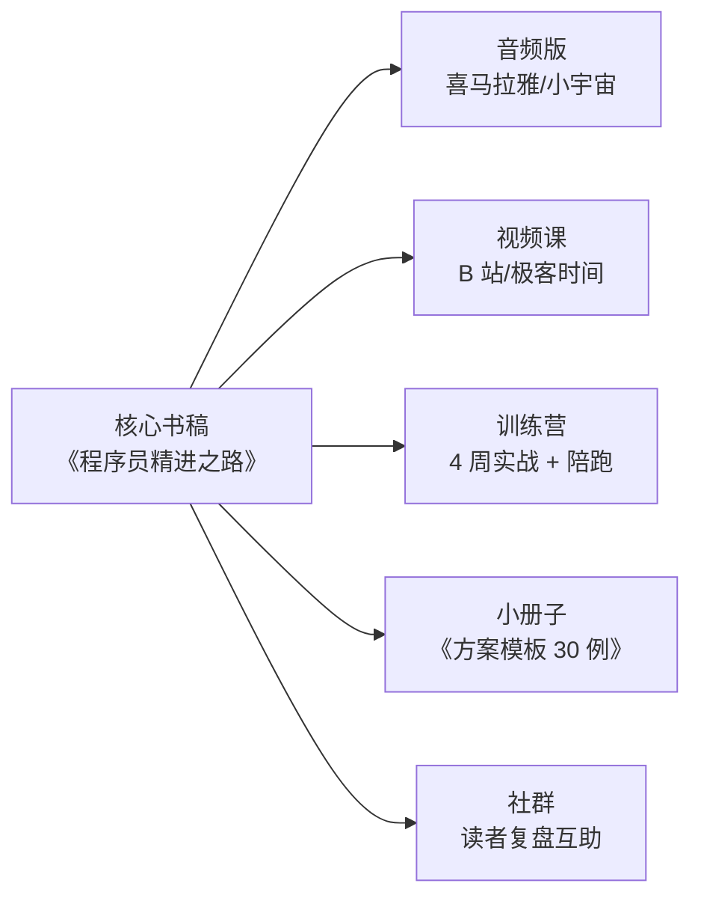

# 《程序员精进之路》系统化扩展方案

> 从 7 篇专栏 → 一本可出版书 + IP 化知识产品矩阵

## 一、目标定位

| 层级 | 现状 | 扩展后 |
|---|---|---|
| 内容体量 | 7 篇 · 约 7 万字 | 20 章 · 18-22 万字（实体书标准体量）|
| 结构层次 | 单层：7 个场景 | 三层：心法 / 动作 / 修炼 |
| 叙事视角 | 单主角糖果充 | 群像：主角 + 导师 + 对照组 + 反面案例 |
| 权威性 | 个人经验 | 个人经验 + 行业案例 + 经典引用 |
| 交付形态 | 博客文章 | 书 + 音频 + 视频 + 训练营 + 社区 |
| 目标读者 | 3-8 年工程师 | 3-15 年工程师 + 转管理者 + 校招生入门 |

---

## 二、三层内容架构

```
┌─────────────────────────────────────────┐
│  Part 3 · 长期修炼（3 章）· 内功         │  ← 新增
│  10 年视角 / 反脆弱 / 认知升级            │
├─────────────────────────────────────────┤
│  Part 2 · 场景动作（现有 7 章 + 拓展 5）│  ← 主体
│  从"能干活"到"能拍板"的 12 个场景         │
├─────────────────────────────────────────┤
│  Part 1 · 底层心法（4 章）· 心态         │  ← 新增
│  分水岭认知 / 三种工程师画像 / 能力地图   │
└─────────────────────────────────────────┘
```

### Part 1 · 底层心法（新增 4 章 · 铺根）

先讲"为什么"，让读者对号入座，不至于一上来就淹没在动作里。

| 章 | 主题 | 核心问题 |
|:--:|---|---|
| 00 | **序章：程序员的三次分水岭** | 3 年 / 8 年 / 15 年三道坎，各栽在什么地方？ |
| 01 | **三种工程师画像** | "更快的编码者"vs"方案的拍板者"vs"团队的定海神针"——你在哪一格 |
| 02 | **软技能能力地图** | 一张 30 项能力雷达图，读者能自测出自己的短板 |
| 03 | **糖果充与他的三位同事** | 引入群像：Alice 硬核不社交、Bob 会说不做事、Carol 平衡型——**三种镜子** |

### Part 2 · 场景动作（现有 7 章 + 拓展 5 章）

现有 7 章基础上，**补齐职业生涯高频但常被忽略的 5 个场景**：

| 编号 | 现状 | 拓展 |
|:--:|---|---|
| 08 | ⭐ 新增 | **需求评审博弈能力**：产品经理甩需求怎么接、如何砍需求不背锅 |
| 09 | ⭐ 新增 | **线上故障应急能力**：P0 事故当下怎么表现、复盘会如何不成靶子 |
| 10 | ⭐ 新增 | **向上沟通与汇报能力**：给老板讲技术、周报怎么写才被看见 |
| 11 | ⭐ 新增 | **跳槽与谈薪能力**：技术面 vs 终面差别、Offer 谈判的 6 个筹码 |
| 12 | ⭐ 新增 | **技术选型与背锅能力**：选型翻车如何自处、"当初你选的"如何回应 |

### Part 3 · 长期修炼（新增 3 章 · 拔高）

现有 07 章"资深修炼"过于集中在 24 个月末尾。把长线内容独立出来单成一 Part。

| 章 | 主题 |
|:--:|---|
| 13 | **技术判断力：10 年只值一次的决策** |
| 14 | **反脆弱职业路径：裁员时代的护城河** |
| 15 | **认知升级：从"会做"到"知道该做什么"** |

**总计：15 章 + 序章 + 附录 = 完整书稿**

---

## 三、每章升级到"出版级"的 5 件事

现有 7 章内容质量已够，需要在每章加以下 5 个元素：

### 1. 章首"能力自评表"

```
读本章前，先给自己打分（1-5 分）：
□ 我能一句话讲清方案要解决的问题
□ 我在评审前会先找一位同事预审
□ 我写方案时会给出至少 3 个可选项
...
```

低分项 = 本章重点读的地方。**读者立刻知道自己要读什么。**

### 2. "行业镜子"栏目（每章 2-3 处）

在关键节点插入**真实公司案例 + 经典书引用**，锚定权威性：

```
🪞 行业镜子
Google SRE 手册第 3 章提到，任何变更都必须回答"如何回滚"
——这就是为什么糖果充第二版方案里加了"灰度与开关"章节。

参考：Site Reliability Engineering (O'Reilly, 2016)
```

**每章 2-3 处**，覆盖：Google SRE、Netflix Chaos、字节复盘文化、《人月神话》、《DDIA》、《The Manager's Path》、《Staff Engineer》。

### 3. "对照组现场"（引入 Alice/Bob/Carol）

同一场景，看 3 种性格的工程师**如何不同回应**，读者能对号入座。

```
🎭 三种应答
场景：CTO 质问"为什么 QPS 只做到 3 万？"

Alice（硬核派）："10 万在架构上做过评估，成本 3 倍不划算。"
                 → 技术过硬但显冷
Bob（讨好派）："老板说得对，我马上评估到 10 万！"
                 → 表面顺从但埋下过度设计的坑
Carol（平衡派）："3 万是当前业务上限的 2 倍冗余，
                 若您有 10 万预期我们下周同步一次容量规划。"
                 → 承接 + 边界 + 闭环，教科书应答
```

### 4. 章末"实战练习 + 参考答案"

每章 3 道题，选自：
- **情景题**：给一段对话/评审现场，问你怎么回应
- **改写题**：给一段烂方案，让读者改
- **反思题**：让读者复盘自己上周一次相关场景

答案放附录，形成**训练营教材属性**。

### 5. 章末"下一章的钩子"

现有版本已有"预告"感，但可以更强：

```
下章预告：糖果充这次赢了方案，但下周 Alice 在评审会上一句
"你这方案 QPS 撑得住吗？"当场把他问到面红耳赤——
他这才发现，**能写好方案 ≠ 能扛住质疑**。
```

---

## 四、出版级"权威锚点"补充清单

书要摆上书架，需要给读者**明确的知识谱系归属**。建议每章至少锚定 1-2 本经典：

| 现有章 | 建议锚定 |
|---|---|
| 01 方案设计 | 《Design It!》Michael Keeling、Google Design Doc 规范 |
| 02 架构演进 | 《Fundamentals of Software Architecture》、《DDIA》 |
| 03 技术讨论 | 《金字塔原理》SCQA、《非暴力沟通》 |
| 04 应对质疑 | 《关键对话》、Amazon 6-pager 文化 |
| 05 CR 攻防 | Google Code Review Guidelines、《Software Engineering at Google》第 9 章 |
| 06 做事闭环 | 《OKR 工作法》、PDCA 戴明环、《高效能人士的 7 个习惯》 |
| 07 资深修炼 | 《Staff Engineer》Will Larson、《The Manager's Path》 |

**每章开头引用一句这些书的金句**，出版气质立刻拉起来。

---

## 五、群像化改造（关键升级）

现在只有糖果充一人，出版书需要**至少 4 个可辨识的人物**：

| 角色 | 人物设定 | 作用 |
|---|---|---|
| **糖果充** | 主角，3→8 年成长弧 | 读者代入 |
| **老陈** | Tech Lead 导师，40 岁，前大厂架构师 | 传递心法、点拨式对白 |
| **Alice** | 硬核派同事，代码强但情商低 | 对照组：技术强 ≠ 资深 |
| **Bob** | 讨好派同事，会说不会做 | 反面镜子：表演型工程师 |
| **CTO 老李** | 出题人，每次都在关键节点出现 | 制造冲突推动情节 |

每篇章开头改成**"糖果充 + 一位关键人物"的一段对话**，比现在的独角戏更有画面感。

---

## 六、数据 & 图表升级

现在几乎全是文字。**出版级需要至少 30-50 张图**，建议按以下类型补充：

| 类型 | 数量 | 说明 |
|---|:--:|---|
| **能力雷达图** | 6-8 张 | 每章一张，展示该能力包含的子维度 |
| **时间线/成长曲线** | 3-5 张 | 糖果充 24 个月定量成长曲线 |
| **决策矩阵** | 8-10 张 | Trade-off 表可视化（2×2 / 四象限）|
| **对照表** | 15+ 张 | 弱回应 vs 强回应 / 错法 vs 对法 |
| **场景流程图** | 10+ 张 | Mermaid 现有基础上强化 |

**用统一视觉规范**（配色、字体、图标）做成一致视觉锤，这是能不能"看起来像本书"的分水岭。

---

## 七、配套产品矩阵（IP 化）

一本书不够，形成矩阵才有影响力：



| 产品 | 定位 | 变现 |
|---|---|---|
| **实体书 / 电子书** | IP 母体 | 版税 |
| **音频课** | 通勤场景 | 平台分成 |
| **视频课**（20 节，每节 20 分钟）| 系统学习 | 极客时间/拉勾/腾讯课堂 |
| **训练营**（4 周 · 30 人小班）| 高价值转化 | 3000-6000/人 |
| **《方案模板 30 例》**（附赠小册子）| 引流爆款 | 免费/低价 |
| **读者社群** | 长期沉淀 | 品牌资产 |

---

## 八、里程碑规划（12 个月）

| 阶段 | 时间 | 产出 |
|---|---|---|
| M1-2 | 8-9 月 | 底层心法 4 章 + 拓展 5 章 大纲敲定 |
| M3-5 | 10-12 月 | 12 章正文完稿 + 群像人物植入现有 7 章 |
| M6-7 | 次年 1-2 月 | 长期修炼 3 章 + 全书图表补齐（50 张）|
| M8-9 | 次年 3-4 月 | 出版社接洽 + 试读版投放（掘金/知乎连载引流）|
| M10-12 | 次年 5-7 月 | 定稿 → 出版 → 同步启动音频/视频/训练营 |

---

## 九、优先动作清单（下周就能开工）

如果不追求出版，只想让专栏更成体系、更出圈，可以先做这 5 件：

1. **写"序章"**：程序员的三次分水岭（1 篇顶 10 篇导流）
2. **加"三位同事"**：Alice/Bob/Carol 群像贯穿现有 7 章（每章加 1-2 段对照）
3. **补"行业镜子"栏目**：每章 2-3 处经典书 & 名企案例锚定
4. **画 8 张能力雷达图**：每章一张，视觉锤统一
5. **每章末加 3 道练习题**：训练营 / 读者互动的种子

---

## 十、一句话总结

现在的 7 篇是 **"高质量的连载专栏"**；
按此方案扩展后，是 **"能上书架、能开课、能带训练营的知识 IP"**。

差距不在写作能力，在于：
**从"我经历过什么"→"我为一代工程师总结了什么"**
的视角切换。
