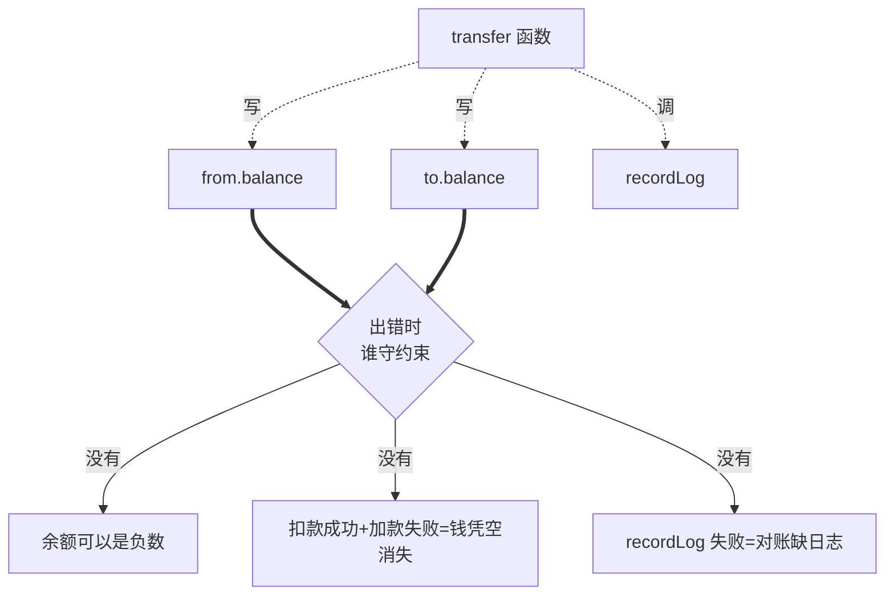
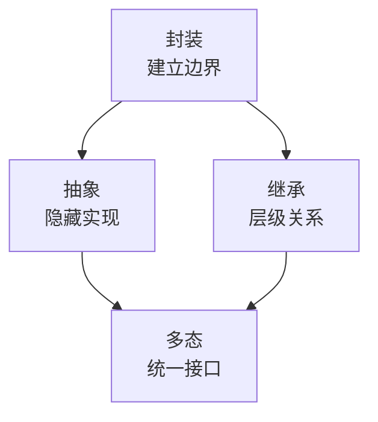
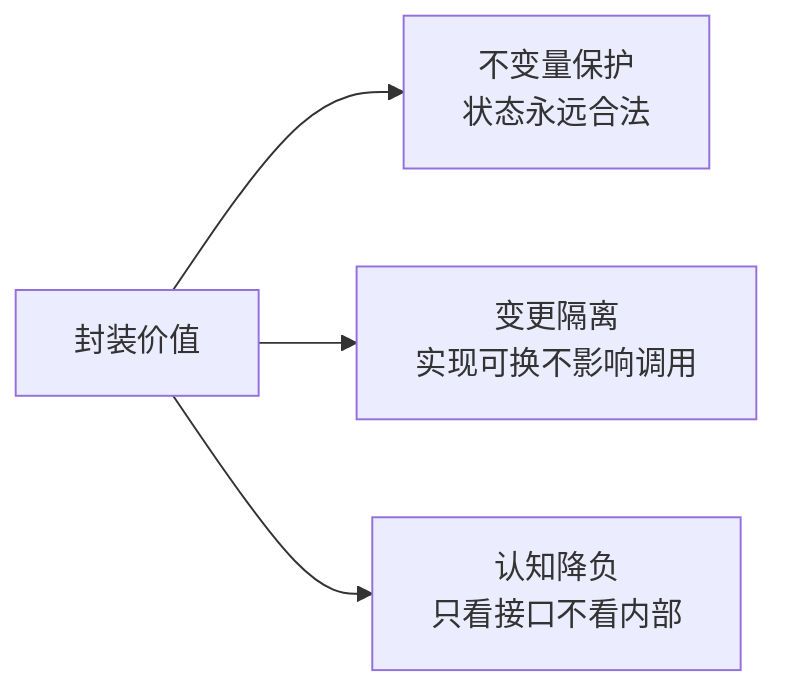
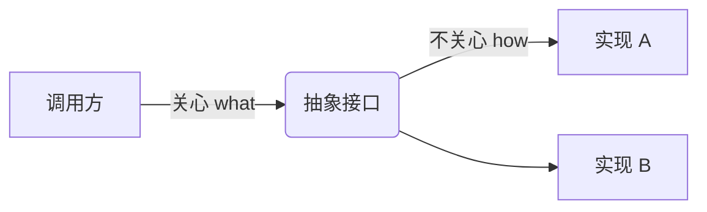
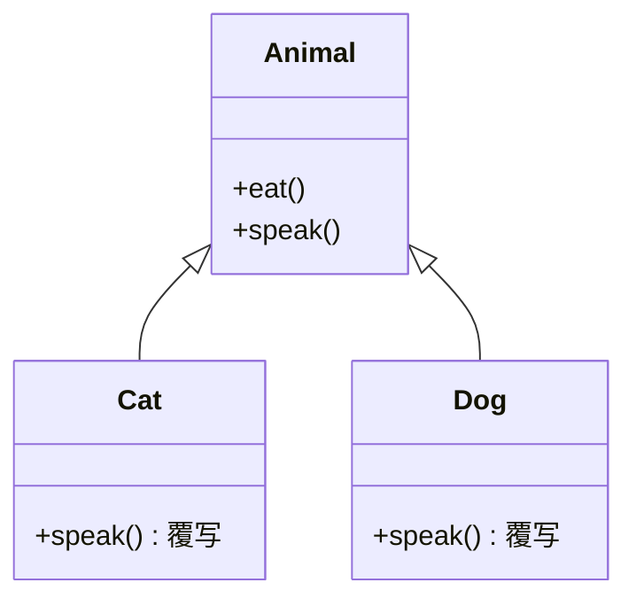
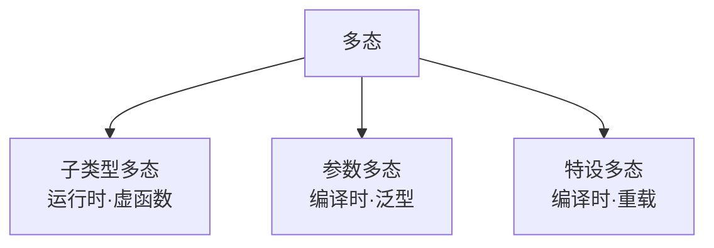
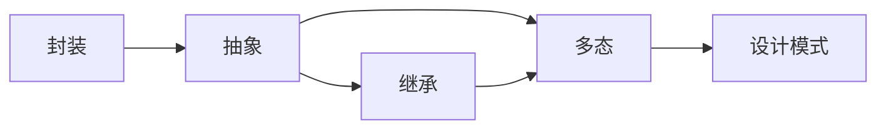
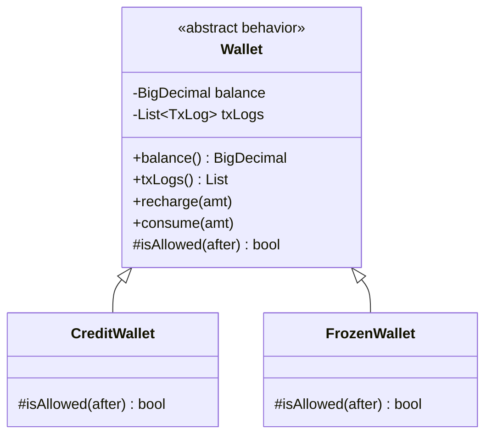

# 第一卷第2章：面向对象的特性

#### 目录介绍
- [1.先回答上篇思考题](#1先回答上篇思考题)
  - [1.1 上篇遗留三道题](#11-上篇遗留三道题)
  - [1.2 三道题的共同根](#12-三道题的共同根)
  - [1.3 一次余额对账事故](#13-一次余额对账事故)
  - [1.4 灵魂五连问](#14-灵魂五连问)
- [2.从一个 Bug 说起](#2从一个-bug-说起)
  - [2.1 钱包翻车现场](#21-钱包翻车现场)
  - [2.2 Bug 的根因](#22-bug-的根因)
  - [2.3 四大特性登场](#23-四大特性登场)
- [3.特性全景图](#3特性全景图)
  - [3.1 四大特性关系](#31-四大特性关系)
  - [3.2 三大还是四大](#32-三大还是四大)
- [4.封装特性](#4封装特性)
  - [4.1 封装的动机](#41-封装的动机)
  - [4.2 钱包封装版](#42-钱包封装版)
  - [4.3 不变量守卫](#43-不变量守卫)
  - [4.4 封装的层次](#44-封装的层次)
  - [4.5 实现原理](#45-实现原理)
  - [4.6 好坏封装对比](#46-好坏封装对比)
- [5.抽象特性](#5抽象特性)
  - [5.1 抽象的动机](#51-抽象的动机)
  - [5.2 接口与抽象类](#52-接口与抽象类)
  - [5.3 抽象的层级](#53-抽象的层级)
  - [5.4 命名即抽象](#54-命名即抽象)
- [6.继承特性](#6继承特性)
  - [6.1 继承的动机](#61-继承的动机)
  - [6.2 类型层级](#62-类型层级)
  - [6.3 实现原理](#63-实现原理)
  - [6.4 继承的代价](#64-继承的代价)
- [7.多态特性](#7多态特性)
  - [7.1 多态的动机](#71-多态的动机)
  - [7.2 三种形态](#72-三种形态)
  - [7.3 实现原理](#73-实现原理)
  - [7.4 多态的代价](#74-多态的代价)
- [8.特性总结与延展](#8特性总结与延展)
- [9.综合实战案例](#9综合实战案例)
  - [9.1 钱包再升级需求](#91-钱包再升级需求)
  - [9.2 一行 public 引发的崩塌](#92-一行-public-引发的崩塌)
  - [8.3 四大特性逐层加固](#83-四大特性逐层加固)
  - [8.4 类图与不变量清单](#84-类图与不变量清单)
  - [8.5 留下三道思考题](#85-留下三道思考题)
- [09.认知跃迁总结](#09认知跃迁总结)

---

## 1.先回答上篇思考题

### 1.1 上篇遗留三道题

上一篇 [01.面向对象设计思想](01.面向对象设计思想.md) 末尾留下了三道题：

- 🟢 把 `Order.items` 改成 `public` 会发生什么坏事？
- 🟡 怎样改 `BuyTwoGetOneActivity` 而不动 `Order` 一行？
- 🔴 多个活动叠加，`List<Activity>` / 装饰器 / 管道——三种方案各有什么代价？

它们看似分别对应「字段访问」「类的扩展」「调用顺序」，**但答案都同一个根**——本篇的四大特性。

### 1.2 三道题的共同根

| 题 | 看似考的 | 实际考的 | 对应特性 |
|---|---|---|---|
| 🟢 易 | 字段可见性 | **不变量被谁守护** | 封装 |
| 🟡 中 | 类的扩展点 | **细节被谁隐藏** | 抽象 + 多态 |
| 🔴 难 | 数据结构选型 | **行为如何编排** | 继承 / 组合 / 多态 |

如果你在上一篇能直觉地写出"`items` 应该 private、`Activity` 应该是接口"，**说明你的脑子里已经埋着这四大特性**——本篇要做的，是把它们从直觉变成可解释的工程语言。

### 1.3 一次余额对账事故

让"四大特性"不再是教科书名词，先看一个真实事故。2024 年 3 月，某公司财务系统：

> 凌晨 2 点对账：用户表与流水表余额相差 **¥1273.45**——不是大数，但**对账不能容忍任何差额**。
> 排查发现：流水表显示用户 A 充值 100，但用户表余额没动；用户 B 没操作，余额却减少 100。
> 复盘根因：一段「转账」代码——

```java
// 事故代码 · 脱敏后
public void transfer(Account from, Account to, BigDecimal amount) {
    from.balance = from.balance.subtract(amount);
    to.balance   = to.balance.add(amount);
    recordLog(from, to, amount);
}
```

看起来人畜无害？**它至少违反了四大特性中的三个**：



| 现象 | 缺失的特性 |
|---|---|
| 调用方能直接改 `balance` 字段 | **封装** 缺失——不变量"余额≥0"无人守 |
| 业务规则散在 `transfer` 函数里 | **抽象** 缺失——「转账」该是 `Account` 自己的方法 |
| 切到"信用账户"（允许负余额）要改所有调用方 | **多态** 缺失——账户类型没有统一接口 |

> 真相：**四大特性不是为了"OOP 看起来更面向对象"，而是为了让"约束有人守、变化有人扛"。**

### 1.4 灵魂五连问

读到这里你应该有一连串疑问，本篇就靠这五问串起：

```
Q1 ── 封装到底封装了什么？只是字段 private 吗？
       └─→ §03 封装的不变量守卫
Q2 ── 抽象和封装到底差在哪？听起来很像
       └─→ §04 抽象 = 隐藏实现复杂度
Q3 ── 继承不是经常被骂吗？为什么还要学？
       └─→ §05 继承的代价与价值
Q4 ── 多态究竟"动态"在哪？编译器看到了什么？
       └─→ §06 vtable / 内联缓存的实现原理
Q5 ── 四大特性中，最重要的是哪一个？
       └─→ §07 层层依赖关系图
```

---

## 2.从一个 Bug 说起

### 2.1 钱包翻车现场

接续上一篇的电商系统。线上突然出现"用户余额变了，但 `balanceLastModifiedTime` 还是上周的时间"。排查代码：

```java
public class Wallet {
    public BigDecimal balance;
    public long balanceLastModifiedTime;
}

// 某处业务代码
wallet.balance = wallet.balance.add(amount);  // 偷偷加了钱
// 忘了更新 balanceLastModifiedTime
```

这种"忘记同步"在百万行代码库里几乎无法靠纪律堵住。

### 2.2 Bug 的根因

字段 public、行为外置 → **不变量（balance 与时间必须同步变更）的守卫被分散到了 N 个调用点**，任何一处疏忽都会全局污染。

### 2.3 四大特性登场

OOP 的四大特性，每一个都直接对应一类**复杂度治理**问题：

| 特性 | 对治的问题 |
|------|------------|
| 封装 | 数据被任意修改 |
| 抽象 | 实现细节泄漏到调用方 |
| 继承 | 重复代码与类型层级 |
| 多态 | 调用方写满 if-else |

---

## 3.特性全景图

### 3.1 四大特性关系



**封装是地基**：没有边界，其余三者无从谈起；
**抽象是骨架**：定义"做什么"；
**继承+多态是肌肉**：让骨架在不同形态下复用与变形。

### 3.2 三大还是四大

业内常争论"抽象"是否独立——因为抽象不依赖特殊语法，函数本身就是一种抽象。**记住一句话即可**：四大特性争的是分类法，工程价值在于解决了什么问题，名字只是标签。

---

## 4.封装特性

### 4.1 封装的动机

**根本目的：管理复杂度**。人脑同时处理信息约 7±2 单元，百万行系统若全暴露，没人能理解。

封装的本质是把复杂度藏起来，**只留必要的操作面板**。

```
没有封装的车：油门控制喷油量、变速箱档位、ABS 频率…… → 没人能开
有封装的车：方向盘 + 油门 + 刹车 + 挡位 → 人人能开
```

### 4.2 钱包封装版

```java
public class Wallet {
    private final String id;
    private final long createTime;
    private BigDecimal balance;
    private long balanceLastModifiedTime;

    public Wallet() {
        this.id = IdGenerator.gen();
        this.createTime = System.currentTimeMillis();
        this.balance = BigDecimal.ZERO;
        this.balanceLastModifiedTime = this.createTime;
    }

    public BigDecimal getBalance() { return balance; }

    public void increase(BigDecimal amount) {
        if (amount.compareTo(BigDecimal.ZERO) <= 0)
            throw new InvalidAmountException("金额必须 > 0");
        this.balance = this.balance.add(amount);
        this.balanceLastModifiedTime = System.currentTimeMillis();  // ← 同步更新
    }

    public void decrease(BigDecimal amount) {
        if (amount.compareTo(BigDecimal.ZERO) <= 0)
            throw new InvalidAmountException("金额必须 > 0");
        if (amount.compareTo(this.balance) > 0)
            throw new InsufficientAmountException("余额不足");
        this.balance = this.balance.subtract(amount);
        this.balanceLastModifiedTime = System.currentTimeMillis();
    }
}
```

字段 `private` + 关键约束写在方法内部 → **不变量被强制守卫**，调用方再也无法绕过。

### 4.3 不变量守卫

封装解决的核心问题有三类：



### 4.4 封装的层次

封装不仅在类一级：

```
系统层：微服务以 API 交互
模块层：Java module / Go package
类  层：private 字段 + public 方法
函数层：局部变量对外不可见
```

四个层次原理一致：**隐藏实现，暴露接口，降低耦合**。

### 4.5 实现原理

不同语言的封装机制差异巨大：

| 语言 | 机制 | 强度 |
|------|------|------|
| C++ | 编译期访问检查 + 名称查找 | 编译期君子协定 |
| Java | 字节码 access_flags，JVM 持续校验 | 编译期+运行时 |
| JavaScript | 闭包 / `#` 私有字段（Symbol 隔离） | 引擎级隔离 |
| Go | 包级（首字母大小写） | 编译期 |
| Python | 约定（`_`/`__`） | 不强制 |

**关键洞察**：C++ 的 `private` 在二进制里没有任何痕迹，靠 `reinterpret_cast` 可以"破"；Java 的 `private` 写在字节码里，反射能"破"，但模块系统能进一步堵死；JS 的闭包是真正不可达的——三种封装强度递进。

### 4.6 好坏封装对比

```java
// ✗ 坏封装：getter/setter 满天飞，等于没封装
class Bad {
    private int x;
    public int getX() { return x; }
    public void setX(int x) { this.x = x; }
}

// ✓ 好封装：方法背后有规则
class Good {
    private List<Item> items;
    private Money totalPrice = Money.ZERO;
    public void addItem(Item item) {
        if (items.size() >= MAX) throw new CapacityException();
        items.add(item);
        totalPrice = totalPrice.add(item.amount());   // 派生状态同步
        notifyObservers();                            // 副作用触发
    }
}
```

封装的灵魂不是"加 private"，而是**让方法承担"必须如此"的业务约束**。

---

## 5.抽象特性

### 5.1 抽象的动机

封装藏数据，**抽象藏实现**——调用者只需知道"能做什么"，无需知道"怎么做"。



### 5.2 接口与抽象类

```java
public interface PictureStorage {
    void save(Picture p);
    Picture get(String id);
}

public class OssStorage implements PictureStorage { /* … */ }
public class S3Storage  implements PictureStorage { /* … */ }
```

调用方只面向 `PictureStorage`，**底层换 OSS 还是 S3，调用方零感知**。

注意：抽象不必依赖 `interface`/`abstract` 语法。函数本身就是抽象——`malloc(size)` 没人去看它的伙伴算法。

### 5.3 抽象的层级

抽象有不同层级：

```
高层抽象：业务概念（Order、Payment）
中层抽象：服务接口（PaymentGateway）
低层抽象：函数（calcTax(amount)）
```

越靠上越稳定，越靠下越易变。设计原则之一：**让稳定的东西被依赖，让易变的东西被替换**——这就是后两篇的主题。

### 5.4 命名即抽象

`getAliyunPictureUrl()` 与 `getPictureUrl()` 的差别：前者把"阿里云"这一实现细节焊死到了名字里。一旦换私有云，名字就要改，连锁影响调用点。

**好命名只描述能力，不暴露策略**——这是抽象思维最日常的体现。

---

## 6.继承特性

### 6.1 继承的动机

人类天然以**分类与层级**理解世界：

```
生物 → 动物 → 哺乳动物 → 猫科 → 猫
                              → 虎
                       → 犬科 → 狗
```

继承把这种"分类思维"引入代码：每层继承上层特征 + 增加自己的特化。

### 6.2 类型层级

继承构造的是**子类型关系**：

```
所有猫的集合 ⊂ 所有动物的集合
→ 任何"动物"位置放一只"猫"都合法
```

这就是**里氏替换原则（LSP）** 的数学本质：子类可以替换父类，不破坏程序正确性。



### 7.3 实现原理

C++/Java 的继承落到底层就是**虚函数表（vtable）**：

```
Cat 对象:
┌─────────┐
│ vptr ───────→ Cat_vtable: [Cat::speak, Animal::eat]
├─────────┤
│ age     │
└─────────┘

Animal* a = new Cat();
a->speak();  // 编译为：查 vptr → 查表 → 间接调用 → 找到 Cat::speak
```

子类对象前半段与父类布局一致 → 父类指针可以安全指向子类对象。**这就是多态的物理基础**。

### 6.4 继承的代价

继承也是双刃剑：

| 代价 | 说明 |
|------|------|
| 强耦合 | 父类改动影响所有子类 |
| 层级爆炸 | 深继承难读、难调 |
| 破坏封装 | 子类依赖父类内部实现 |
| 静态绑定 | 编译期确定，运行时不可换 |

> 这正是后续第 5 篇 **"多用组合少用继承"** 要破的题。

---

## 7.多态特性

### 7.1 多态的动机

没有多态时，调用方必须知道每种具体类型：

```java
void pay(Object obj) {
    if (obj instanceof Alipay)  ((Alipay) obj).pay();
    else if (obj instanceof Wechat) ((Wechat) obj).pay();
    else if (obj instanceof CreditCard) ((CreditCard) obj).pay();
    // 每加一种支付方式，这里都得改 ← 灾难
}
```

多态后：

```java
void pay(Payment p) { p.pay(); }   // 永远不用改
```

**多态消除条件分支**——把"类型判断"从代码里彻底拿掉。

### 7.2 三种形态



| 形态 | 例子 | 时机 |
|------|------|------|
| 子类型多态 | `Animal a = new Cat(); a.speak();` | 运行时 |
| 参数多态 | `List<T>`、C++ 模板 | 编译时 |
| 特设多态 | 函数重载、运算符重载 | 编译时 |

### 7.3 实现原理

子类型多态依赖**延迟绑定**——把"调哪个函数"推到运行时：

```
早绑定: call 0x401000   ← 编译期写死
晚绑定: call [vptr+0]   ← 运行时查表
```

JIT/V8 还能进一步优化：**内联缓存（Inline Cache）** 把"高频路径"的虚调用降到接近直接调用的开销。

### 7.4 多态的代价

| 代价 | C++ | Java | JS |
|------|-----|------|-----|
| 内存 | 每对象多 8B vptr | 对象头自带类型 | 隐藏类自带原型 |
| 调用 | 2 次内存间接寻址 | 类似，可 JIT 内联 | 首次慢，IC 后接近直调 |
| 分支预测 | 不友好 | JIT 反馈优化 | IC 可预测 |

**没有银弹**：多态用一次次间接跳转换来了扩展性；当性能极致敏感（紧内层循环、SIMD 段），刻意去多态也是合理工程选择。

---

## 8.特性总结与延展

| 特性 | 核心问题 | 关键机制 |
|------|----------|----------|
| 封装 | 不变量守卫 | 访问控制 + 业务方法 |
| 抽象 | 隐藏实现 | 接口/抽象类/函数 |
| 继承 | 类型层级与复用 | vtable/原型链 |
| 多态 | 消除条件分支 | 延迟绑定 |

四大特性不是平行关系，而是**层层依赖**：



- **封装是地基**——没有封装，其他三个都建在沙上；
- **抽象是骨架**——没有抽象，继承和多态都失去意义；
- **继承是肌肉**——它提供类型层级，但本身不是目的；
- **多态是灵魂**——一切设计模式的终点都是"用统一接口处理一族变化"。

四大特性是**面向对象的语法层基础**，但只懂特性还不够。真正的工程难题是：

- **何时用接口、何时用抽象类？** → [03.接口vs抽象类比较](03.接口vs抽象类比较.md)
- **如何让代码不锁死在某个实现上？** → [04.接口而非实现编程](04.接口而非实现编程.md)
- **继承怎么用才不翻车？** → [05.多用组合和少继承](05.多用组合和少继承.md)

---

## 9.综合实战案例

> **延续主线案例**——01 篇我们造了 `Order`，本篇要造一只 `Wallet`，作为后续支付环节的基石。

### 9.1 钱包再升级需求

电商系统接入"账户钱包"。PM 给的需求清单：

```
1. 用户可以充值、消费、退款
2. 余额不能为负
3. 必须能追溯每一笔流水（不可丢失日志）
4. 后期要支持"信用账户"（允许临时透支至 -500）
5. 后期要支持"冻结账户"（只能查看，不能动钱）
```

### 9.2 一行 public 引发的崩塌

工程师 A 写了第一版：

```java
public class Wallet {
    public BigDecimal balance;          // ① public
    public List<TxLog> txLogs;          // ① public

    public void recharge(BigDecimal amt) { balance = balance.add(amt); txLogs.add(...); }
    public void consume(BigDecimal amt) { balance = balance.subtract(amt); txLogs.add(...); }
}
```

两周后：

| 接连发生的事 | 根因 |
|---|---|
| 客服直接 `wallet.balance = wallet.balance.add(refund)`——绕过日志 | ① 字段 public，**没人守"流水必须同步"** |
| 月底某条流水偷偷被删——`wallet.txLogs.remove(0)` | ① 集合内部状态泄漏 |
| 接 SDK 时崩溃——SDK 期望"余额变化必发事件"，钱包压根没设计事件机制 | 没有抽象层，扩展点缺失 |
| 加"信用账户"要写 `if (isCreditAccount)` 满世界改 | 没有多态，类型差异散在调用方 |

四个事故，**四个特性都缺席**。

### 9.3 四大特性逐层加固

**第 1 层：封装——把"钱"从字段变成"有守门人的资源"**

```java
public class Wallet {
    private BigDecimal balance;
    private final List<TxLog> txLogs = new ArrayList<>();

    public BigDecimal balance() { return balance; }
    public List<TxLog> txLogs() { return List.copyOf(txLogs); }   // 防御式只读

    private void recordAndApply(TxType type, BigDecimal amt) {
        // 不变量校验集中在这里
        BigDecimal after = type == TxType.IN ? balance.add(amt) : balance.subtract(amt);
        if (!isAllowed(after)) throw new InsufficientBalanceException();
        balance = after;
        txLogs.add(new TxLog(type, amt, Instant.now()));
    }
    protected boolean isAllowed(BigDecimal after) { return after.signum() >= 0; }
}
```

> 关键变化：`balance` 不再是被改的对象，而是"被守护的不变量"；`txLogs` 通过防御性拷贝杜绝外部破坏。**至此，第 ① 类事故彻底消失**。

**第 2 层：抽象——把"扩展点"从 if-else 变成方法重写**

把 `isAllowed` 设为 `protected`——这是一个**抽象层级**：子类可以改写规则，但**主流程被锁死**。

**第 3 层：继承——派生 `CreditWallet` 表示"信用账户"**

```java
public class CreditWallet extends Wallet {
    private static final BigDecimal CREDIT_LIMIT = new BigDecimal("-500");
    @Override protected boolean isAllowed(BigDecimal after) {
        return after.compareTo(CREDIT_LIMIT) >= 0;
    }
}
```

> 注意：**不是为了"复用代码"才继承**，是因为 `CreditWallet` 在概念上**就是 Wallet 的子类型**（满足里氏替换：能装进 `Wallet` 的地方都能装它）。

**第 4 层：多态——让支付服务永远只看到 `Wallet`**

```java
public class PaymentService {
    public void pay(Wallet wallet, BigDecimal amt) {
        wallet.consume(amt);   // 不知道是普通钱包还是信用钱包，也无需知道
    }
}
```

新增 `FrozenWallet`（冻结账户）只需再写一个子类，**`PaymentService` 一行不改**——这就是上一篇思考题🟡的答案。

### 9.4 类图与不变量清单



钱包的**不变量清单**——这才是封装真正"封装"的东西：

| # | 不变量 | 谁来守 |
|---|---|---|
| I1 | 余额变化必须有对应流水 | `recordAndApply` 私有方法 |
| I2 | 普通账户余额 ≥ 0 | `Wallet#isAllowed` |
| I3 | 信用账户余额 ≥ -500 | `CreditWallet#isAllowed` |
| I4 | 流水日志只增不删 | `txLogs()` 返回不可变拷贝 |
| I5 | 任何外部访问都不能直接改 `balance` 字段 | `private` 关键字 |

> 写下这张表的瞬间，你会突然发现：**这就是 11 篇 DDD 里"聚合根"的雏形**——本篇的封装+抽象，是第 11 篇的伏笔。

### 9.5 留下三道思考题

> 答案在第 03 篇开头揭晓。

- **🟢 易**：第 8.3 节里 `isAllowed` 我用了 `protected`。如果改成 `private`，会出现什么问题？
- **🟡 中**：`CreditWallet` 用了**继承**实现"信用规则"。如果换成**组合**——给 `Wallet` 注入一个 `BalanceRule` 策略——你倾向哪种？说出取舍标准。
- **🔴 难**：当前 `recordAndApply` 是同步的。如果"流水"必须**事务性写入数据库**，封装应该如何演化？需要在抽象层引入什么？这道题就是第 03 篇要回答的"接口 vs 抽象类"的真实战场。

---

## 10.认知跃迁总结

回到开篇的转账事故。如果当初 `Account` 是这样写的：

```java
public class Account {
    private Money balance;
    public void transferTo(Account other, Money amount) {
        // 校验、扣款、加款、记日志——全在一个边界内
    }
}
```

那 ¥1273.45 的对账差额根本没机会发生——**不是因为代码更优雅，而是因为不变量有了守门人**。

一句话送给你：

> **OOP 不是"用类组织代码"，而是"用类划清责任边界"。封装是边界，抽象是边界的语义，继承是边界的层级，多态是边界外的统一视角。**

下一篇 [03.接口vs抽象类比较](03.接口vs抽象类比较.md) 将从一次"日志器被改了 47 次"的事故出发，回答**抽象到底该用接口还是抽象类**——并揭晓本篇 §8.5 的三道思考题。

