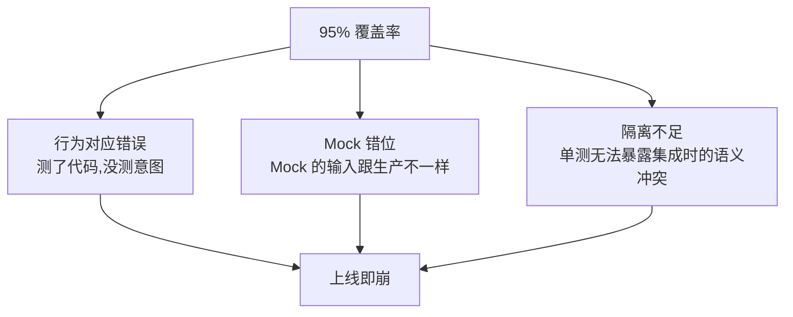
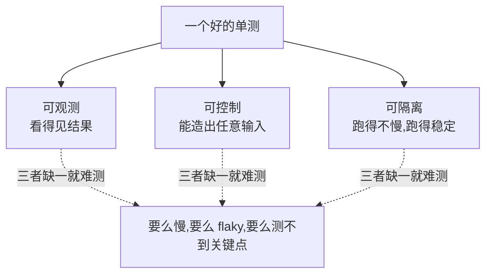
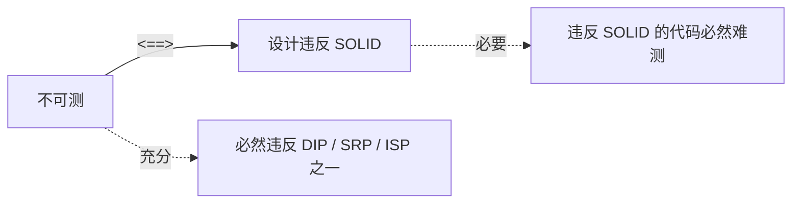
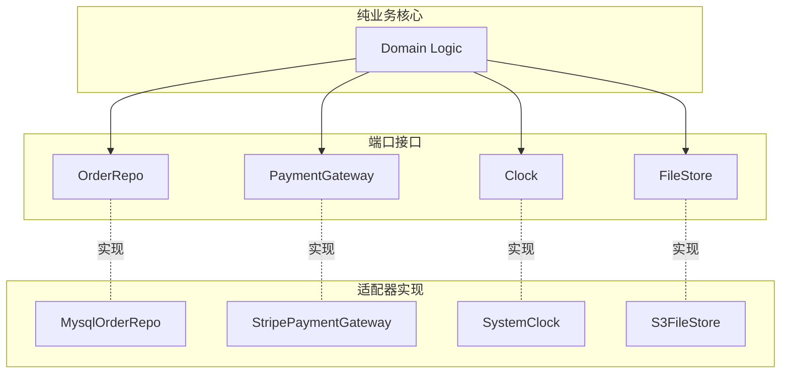
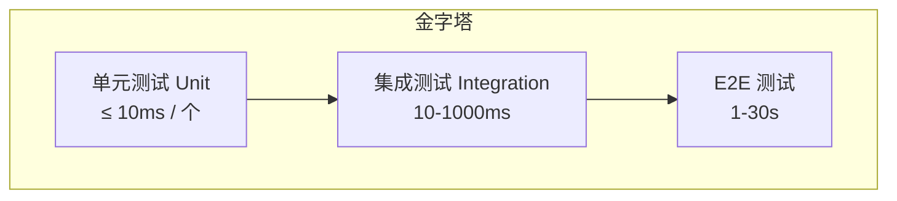
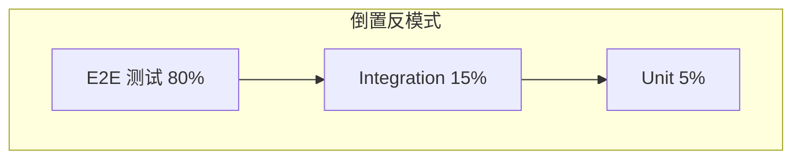
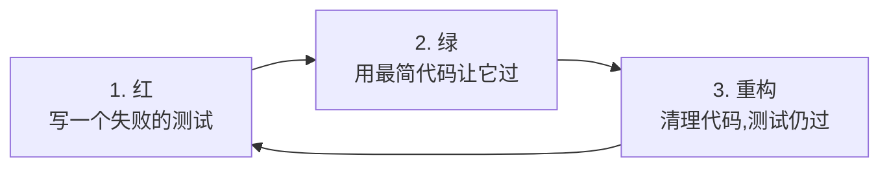
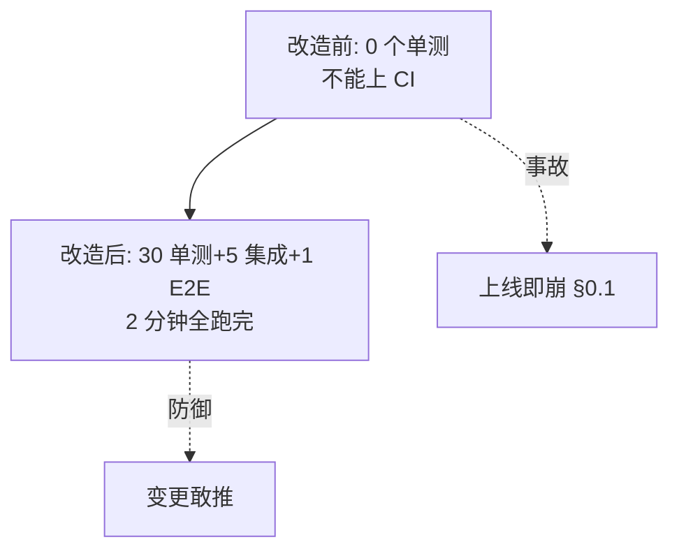
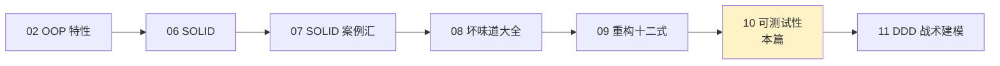

# 第一卷第10章：可测试性设计

#### 目录介绍
- [01.95%覆盖率仍崩溃](#0195覆盖率仍崩溃)
  - [1.1 上线就出事的悲剧](#11-上线就出事的悲剧)
  - [1.2 测试为何失效](#12-测试为何失效)
  - [1.3 灵魂五连问](#13-灵魂五连问)
- [02.可测试性是什么](#02可测试性是什么)
  - [2.1 三个层次的定义](#21-三个层次的定义)
  - [2.2 与设计耦合的本质](#22-与设计耦合的本质)
  - [2.3 OOP的最硬验收](#23-oop的最硬验收)
- [03.不可测代码画像](#03不可测代码画像)
  - [3.1 静态方法陷阱](#31-静态方法陷阱)
  - [3.2 单例的传染性](#32-单例的传染性)
  - [3.3 全局时间获取](#33-全局时间获取)
  - [3.4 私有方法依恋](#34-私有方法依恋)
  - [3.5 隐式IO访问](#35-隐式io访问)
- [04.可测设计五原则](#04可测设计五原则)
  - [4.1 依赖注入](#41-依赖注入)
  - [4.2 时间抽象化](#42-时间抽象化)
  - [4.3 IO边界化](#43-io边界化)
  - [4.4 副作用集中化](#44-副作用集中化)
  - [4.5 纯函数优先](#45-纯函数优先)
- [05.测试金字塔](#05测试金字塔)
  - [5.1 单元/集成/E2E](#51-单元集成e2e)
  - [5.2 比例与成本](#52-比例与成本)
  - [5.3 倒金字塔反模式](#53-倒金字塔反模式)
- [06.Mock与Stub](#06mock与stub)
  - [6.1 五种测试替身](#61-五种测试替身)
  - [6.2 Mock滥用症](#62-mock滥用症)
  - [6.3 接口与可替换性](#63-接口与可替换性)
- [07.TDD与设计反馈](#07tdd与设计反馈)
  - [7.1 红绿重构循环](#71-红绿重构循环)
  - [7.2 测试先行的设计驱动](#72-测试先行的设计驱动)
  - [7.3 何时不要TDD](#73-何时不要tdd)
- [08.覆盖率的真相](#08覆盖率的真相)
  - [8.1 行/分支/路径覆盖](#81-行分支路径覆盖)
  - [8.2 100%覆盖的陷阱](#82-100覆盖的陷阱)
  - [8.3 变异测试](#83-变异测试)
- [09.综合案例实战](#09综合案例实战)
  - [9.1 不可测的订单系统](#91-不可测的订单系统)
  - [9.2 五步可测改造](#92-五步可测改造)
  - [9.3 测试套件演化](#93-测试套件演化)
  - [9.4 留下三道思考题](#94-留下三道思考题)
- [10.总结与下一篇](#10总结与下一篇)

---

> 本篇是「面向对象设计」系列第 10 篇。  
> 上一篇 [09.重构十二式的实战](09.重构十二式的实战.md) 教你"如何把烂代码救回来"。  
> 但**重构的安全网是测试**——没有测试的重构，等于在悬崖上换轮胎。  
> 本篇要回答一个被严重低估的问题：**为什么你的代码"测不动"？**

---

## 01.95%覆盖率仍崩溃

### 1.1 上线就出事的悲剧

2024 年 11 月，某交易系统大版本上线。CI 全绿、覆盖率 **94.7%**——团队开庆功 PR 通过。**周一上线，周二崩了**。

**事故时间线**：

```
00:00  灰度 5%        监控全绿
01:30  扩量到 30%     P99 延时翻倍
02:10  扩量到 80%     大量「订单状态错乱」工单
03:45  紧急回滚       告警雪崩,最高峰 1200 条/分钟
05:00  事故定级 P0
```

事故根因——一段「**新增的优惠券满减规则**」：

```java
public BigDecimal applyDiscount(Order order, Coupon coupon) {
    if (order.amount().compareTo(coupon.threshold()) >= 0) {
        return order.amount().subtract(coupon.discount());
    }
    return order.amount();
}
```

代码看似无错，**测试也通过**：

```java
@Test void shouldApplyDiscount() {
    Order order = new Order(BigDecimal.valueOf(100));
    Coupon coupon = new Coupon(BigDecimal.valueOf(50), BigDecimal.valueOf(10));
    BigDecimal result = applyDiscount(order, coupon);
    assertEquals(BigDecimal.valueOf(90), result);    // ✓ 通过
}
```

**但事故现场出现的真实订单**——`order.amount = ¥4.99`，`coupon = 满 5 元减 1 元`：

```
applyDiscount 返回 ¥4.99   ← 没满 5 元,不打折(对的)
```

但**业务规则**是：「**满 5 元的"满"指的是 ≥ 5 元**」——而代码 `order.amount.compareTo(coupon.threshold()) >= 0` 在 `4.99 vs 5` 时**返回 -1，即不满足**——这一支也是对的。


**测试为什么没发现？** 因为 95% 覆盖率全部覆盖在「**函数内部行为**」上——`applyDiscount` 自己的输入输出**完全对**。问题在于「**调用方传入的输入语义跟函数预期的语义不一致**」。这个**语义鸿沟**没有任何一个单测能发现，**因为单测是在 mock 数据上跑的**。

> **覆盖率测的是"代码被跑过"，不是"业务规则被验证"。** 这是 95% 覆盖率仍崩溃的根本机制。

### 1.2 测试为何失效

把这次事故当作放大镜，可以看到**三层失效**：



| 层次 | 失效形式 |
|---|---|
| **形似神不似** | 测试在调函数,验证返回值。但**没有任何一个测试在断言"业务规则"** |
| **Mock 制造温室** | 单测里 `new Order(¥100)` 这种"教科书数据"把现实里的 `¥4.99 + 运费 ¥5` 隐藏了 |
| **缺少契约边界** | `applyDiscount` 没有用类型/文档明确「amount 是原价还是减运费后」——任何调用方都可以猜错 |

> 真正的问题不在测试**少**，而在测试**测了不该测的对象**。本篇要重新定义"什么是值得测的"。

### 1.3 灵魂五连问

```
Q1 ── 测试到底在测什么?是代码,还是意图?
       └─→ §01.1 三个层次
Q2 ── 为什么有的代码"无从下手测"?
       └─→ §02 不可测代码画像
Q3 ── 可测性与设计的关系是什么?是相关,还是因果?
       └─→ §01.2 充要条件
Q4 ── 是先有可测设计,还是先有测试驱动设计?
       └─→ §06.2 TDD 与设计反馈
Q5 ── 高覆盖率为何解决不了崩溃?
       └─→ §07.2 + §07.3 变异测试
```

---

## 02.可测试性是什么

### 2.1 三个层次的定义

学术上，可测试性是三个**独立**能力的合成（Robert Binder 1994 *Design for Testability*）：

| 层次 | 定义 | 工程含义 |
|---|---|---|
| **可观测性（Observability）** | 测试代码能看到被测代码的**所有相关状态** | 内部状态有 getter / 事件能被监听 |
| **可控制性（Controllability）** | 测试代码能**精确驱动**被测代码到任意状态 | 依赖能被替换,初始状态能被构造 |
| **可隔离性（Isolability）** | 被测代码能与**外部世界**断开运行 | 文件/网络/数据库都能 mock |



**任何一层缺失，单测都会变味**。比如 §0.1 事故的代码：

- 可观测：✓ 返回值能看到
- 可控制：⚠️ 只能传入「函数自己接受的 amount」，**控制不到上游**
- 可隔离：✓ 函数本身没有 IO

**控制力被一层隔板挡住**——这就是 95% 覆盖率仍漏的根源。

### 2.2 与设计耦合的本质

**「不可测 = 设计错」是充要条件**——这是 OOP 的最硬验收。

证明思路：



- **不可测 → 设计错**：不可测意味着无法 mock、无法注入、无法隔离——这必然指向 DIP 或 SRP 违反。
- **设计错 → 不可测**：违反 DIP 的代码 `new` 了具体类，无法替换；违反 SRP 的代码一个方法干 5 件事，要 mock 全部副作用——**不可测**。

> **测试不是"另一项工作"，而是"设计的镜子"**。一段代码能否单测，**直接等价于**它的设计水平。

### 2.3 OOP的最硬验收

02 篇讲了封装、抽象、继承、多态。06 篇讲了 SOLID。但这些都是「**主观判断**」——同一段代码不同人会有不同评价。

**单测是唯一的客观验收**：

| 主观验收 | 客观验收 |
|---|---|
| "这段代码遵守 SOLID 吗?" | "这段代码能写单测吗?" |
| 5 个工程师 5 个答案 | 答案是 yes 或 no |
| 评审 30 分钟争吵 | 30 秒尝试就有结果 |

> **能写单测 = 设计达标**。这是 OOP 走过 30 年得到的最硬验收标准。

---

## 03.不可测代码画像

### 3.1 静态方法陷阱

```java
// 反例
public class OrderUtil {
    public static String genOrderId(String userId) {
        return userId + "-" + System.currentTimeMillis() + "-" + new Random().nextInt(1000);
    }
}
```

**为什么不可测**：
- 调用 `OrderUtil.genOrderId(...)` **无法 mock**——静态调用钉死类型
- 内部用了 `currentTimeMillis()` 和 `Random` ——返回值**每次都不同**

**修复**：把"工具函数"变成**实例方法 + 接口**：

```java
public interface OrderIdGenerator {
    String generate(String userId);
}
public class DefaultOrderIdGenerator implements OrderIdGenerator {
    private final Clock clock;
    private final Supplier<Integer> randomSource;
    public DefaultOrderIdGenerator(Clock clock, Supplier<Integer> randomSource) { ... }
    public String generate(String userId) {
        return userId + "-" + clock.millis() + "-" + randomSource.get();
    }
}
// 测试时
var gen = new DefaultOrderIdGenerator(Clock.fixed(...), () -> 42);
assertEquals("u1-1000000-42", gen.generate("u1"));
```

> 静态方法是 OOP 的"逃生舱口"——但每用一次，都在**牺牲可测性**。

### 3.2 单例的传染性

```java
public class OrderManager {
    private static OrderManager INSTANCE = new OrderManager();
    public static OrderManager getInstance() { return INSTANCE; }
}

public class OrderService {
    public void place(Order o) {
        OrderManager.getInstance().save(o);   // ← 钉死
    }
}
```

**「传染」**怎么发生：
- `OrderService` 内部硬编码 `OrderManager.getInstance()`
- 测试 `OrderService` 时**无法替换** `OrderManager`
- 要么不测，要么"曲线救国"用 PowerMock 改字节码

**修复**：构造器注入（与 07 篇 DIP 同一道理）。

### 3.3 全局时间获取

测试不稳定（flaky test）的**头号源头**就是直接调 `System.currentTimeMillis()` 或 `LocalDateTime.now()`。

```java
// 反例
public class CouponService {
    public boolean isValid(Coupon c) {
        return LocalDateTime.now().isBefore(c.expireAt());
    }
}

@Test void shouldBeValidIfNotExpired() {
    Coupon c = new Coupon(LocalDateTime.now().plusDays(1));   // 测试当下生效
    assertTrue(service.isValid(c));
    // ↑ 跑得过一年后吗? 不,因为 plusDays(1) 是相对当下,但生产可能是绝对时间
}
```

**修复**：抽出 `Clock` 接口，**永远不在业务代码里直接读"现在"**：

```java
public class CouponService {
    private final Clock clock;
    public CouponService(Clock clock) { this.clock = clock; }
    public boolean isValid(Coupon c) {
        return clock.now().isBefore(c.expireAt());
    }
}
@Test void shouldBeValidIfNotExpired() {
    var fixed = Clock.fixed(LocalDateTime.of(2025,1,1,0,0));
    var service = new CouponService(fixed);
    assertTrue(service.isValid(new Coupon(LocalDateTime.of(2025,12,31,0,0))));
}
```

### 3.4 私有方法依恋

```java
class PriceCalculator {
    public BigDecimal calculate(Order o) {
        BigDecimal base = computeBase(o);
        return applyTax(base);
    }
    private BigDecimal computeBase(Order o) { ... }   // 30 行核心算法
    private BigDecimal applyTax(BigDecimal b)  { ... }
}
```

测试想直接测 `computeBase`——但它是 `private`。要测它，**只能通过反射或改 visibility**。

**信号**：私有方法**复杂到值得单独测**——意味着它**应该是另一个类的公共方法**。

```java
class PriceBaseCalculator { public BigDecimal compute(Order o) { ... } }   // 提炼出来
class TaxApplier          { public BigDecimal apply(BigDecimal b) { ... } }

class PriceCalculator {
    public PriceCalculator(PriceBaseCalculator b, TaxApplier t) { ... }
    public BigDecimal calculate(Order o) { return tax.apply(base.compute(o)); }
}
```

> "**想反射测私有方法**"≡"**设计漏掉了一个类**"。

### 3.5 隐式IO访问

```java
public class ReportService {
    public Report generate(Date d) {
        String sql = "SELECT ...";
        try (Connection c = DriverManager.getConnection("jdbc:...")) {  // ← 隐式 IO
            ...
        }
        File template = new File("/etc/templates/report.html");          // ← 隐式 IO
        ...
        URL slack = new URL("https://hooks.slack.com/...");              // ← 隐式 IO
        ...
    }
}
```

**测一次要起数据库、读文件系统、连 Slack**——最终团队放弃，只做集成测试，于是金字塔倒置（§04.3）。

**修复**：让所有 IO 走**注入的接口**——见 §03.3 IO 边界化。

---

## 04.可测设计五原则

### 4.1 依赖注入

最基本：**任何外部依赖都通过构造方法传入**。

```java
// 不要这样
class OrderService {
    private OrderRepo repo = new MysqlOrderRepo();    // ← 钉死
}
// 要这样
class OrderService {
    private final OrderRepo repo;
    public OrderService(OrderRepo repo) { this.repo = repo; }   // ← 可注入
}
```

> 这与 07 篇 §05 DIP 是同一件事的两个视角。**DIP 是设计原则，DI 是落地手段**。

### 4.2 时间抽象化

```java
public interface Clock {
    Instant now();
}
public class SystemClock implements Clock {
    public Instant now() { return Instant.now(); }
}
public class FakeClock implements Clock {
    private Instant fixed;
    public void set(Instant t) { this.fixed = t; }
    public Instant now() { return fixed; }
}
```

**所有业务代码注入 `Clock`，永远不直接调 `Instant.now()`**。

各语言对照：

| 语言 | 抽象方式 |
|---|---|
| Java | `java.time.Clock` |
| Kotlin | 自定义 `Clock` 接口 + 协程 `TestDispatcher` |
| Go | `clock.Clock` 接口（jonboulle/clockwork） |
| C# | `IClock` + `SystemClock`/`FakeClock` |

### 4.3 IO边界化

**Hexagonal Architecture（六边形架构）**——核心思想：



**好处**：
- 内核**不知道**MySQL/Stripe/S3 的存在——可以用 `InMemoryOrderRepo` 跑全套单测
- 适配器**单独**测试（用集成测试）
- 切换 Stripe 到 PayPal = 加一个适配器

### 4.4 副作用集中化

「副作用」 = 改外部状态（写库、发消息、改文件）。

```java
// 反例:副作用散在各处
class OrderService {
    public void process(Order o) {
        repo.save(o);                        // 副作用 1
        kafka.send("order-paid", o);          // 副作用 2
        emailer.notify(o.user());             // 副作用 3
        bi.report(o);                         // 副作用 4
        log.info("processed " + o.id());      // 副作用 5
    }
}
```

测试要 mock **5 个**外部依赖。

**修复**：**返回"决定"，不直接执行**——CQRS 思想：

```java
class OrderProcessor {
    /** 纯函数:返回应当发生的事件,不做任何副作用 */
    public List<Event> decide(Order o) {
        return List.of(
            new OrderSaved(o),
            new EventEmitted("order-paid", o),
            new EmailDispatched(o.user(), ...),
            new BiReportPushed(o),
            new AuditLogged(o));
    }
}
class OrderHandler {
    public void apply(List<Event> events) { /* 这里执行副作用 */ }
}
```

**单测**：直接测 `decide` 返回的事件列表——**全程纯函数**。集成测试再测 `apply`。

### 4.5 纯函数优先

```java
// 纯函数:一切被测代码的天堂
public BigDecimal price(Order order, Discount discount) { ... }
```

特征：
- **同样输入永远同样输出**（没有 I/O、没有 `now()`、没有随机）
- **不改外部状态**

**测纯函数**：写两行就行——`assertEquals(expected, fn(input))`。

> **OOP 的设计目标，应该是把「纯函数」的占比尽量做高**。这与 §03.4 副作用集中化是同一道理的两面。

---

## 05.测试金字塔

### 5.1 单元/集成/E2E



| 层 | 范围 | 速度 | 数量 | 修复成本 |
|---|---|---|---|---|
| Unit | 单类/单函数 | < 10 ms | **数千** | 低 |
| Integration | 多模块/真实数据库 | 100-1000 ms | **数百** | 中 |
| E2E | 全链路浏览器/全 API | 1-30 s | **数十** | 高 |

### 5.2 比例与成本

经典 70 / 20 / 10 的来源（Mike Cohn《Succeeding with Agile》2009）：

| 数量比 | 成本比 | 反馈延时 |
|---|---|---|
| 70% Unit | 10% | 秒级 |
| 20% Integ | 30% | 分钟级 |
| 10% E2E | 60% | 小时级 |

**单元测试是最高 ROI**：写得快、跑得快、修得快。

### 5.3 倒金字塔反模式



**为什么团队会倒置？**
- Unit 写不动（代码不可测）
- 团队感觉 E2E "更真实"
- 不知道 Unit 的力量

**后果**：
- CI 跑 1 小时，开发者推 PR 后吃完午饭才知道挂了
- 一个改动经常 100 个 E2E 同时挂——**根因是哪一行?** 谁也不知道
- 测试维护成本超过业务代码

> 倒金字塔的根因是 §02 不可测代码画像——**先治根因，再谈金字塔**。

---

## 06.Mock与Stub

### 6.1 五种测试替身

Gerard Meszaros《xUnit Test Patterns》定义的五种「**Test Double**」：

| 类型 | 行为 | 用途 |
|---|---|---|
| **Dummy** | 占位，**不会被调用** | 满足参数列表 |
| **Fake** | 简化的真实实现 | `InMemoryRepo` 替代 MySQL |
| **Stub** | 返回**预设值** | 让被测代码走特定分支 |
| **Spy** | Stub + **记录调用** | 验证「被调过吗?」 |
| **Mock** | Spy + **预期断言** | 验证「按预期调了吗?」 |

```java
// Stub:简单返回
when(repo.find(any())).thenReturn(...);
when(gateway.pay(any())).thenReturn(...);
when(emailer.send(any(), any())).thenReturn(...);
when(clock.now()).thenReturn(...);
when(bi.report(any())).thenReturn(...);
// ↑ 50 行 mock 设置,真正的"测试"只有 2 行
```

### 6.2 Mock滥用症

**症状 1**：所有依赖都 mock。

```java
@Test void test() {
    when(repo.find(any())).thenReturn(...);
    when(gateway.pay(any())).thenReturn(...);
    when(emailer.send(any(), any())).thenReturn(...);
    when(clock.now()).thenReturn(...);
    when(bi.report(any())).thenReturn(...);
    // ↑ 50 行 mock 设置,真正的"测试"只有 2 行
}
```

**问题**：**这测的是"我设置的 mock 对不对"，不是真实代码**。如果 mock 设置错了，测试对**真实代码错误**完全无感。

**症状 2**：用 Mock 验证内部实现。

```java
verify(repo, times(3)).find(any());   // ← 测了"内部调了 3 次"
```

如果将来重构成 1 次批量查找，**业务正确，但测试挂**——这是**被测代码与测试代码过度耦合**的反面教材。

**修复方法**：
- **Fake 优于 Mock**——用 `InMemoryRepo` 这种小型真实实现，**不验证调用次数**
- **只 mock 边界**（DB、HTTP、外部 API），不 mock 自己代码内部

### 6.3 接口与可替换性

**Mock 能不能注入 = 是不是依赖了接口**。

```java
// 不可 mock
class OrderService {
    private final MysqlOrderRepo repo;     // ← 具体类
}
// 可 mock
class OrderService {
    private final OrderRepo repo;          // ← 接口
}
```

> 与 04 篇「面向接口编程」首尾呼应——**面向接口编程的真正回报，要在写测试时才兑现**。

---

## 07.TDD与设计反馈

### 7.1 红绿重构循环

Kent Beck 的三步舞：



**关键纪律**：
- **每一步都很小**——5-15 分钟一个循环
- **绿之前不要重构**
- **绿之后必须重构**（否则积累技术债）

### 7.2 测试先行的设计驱动

TDD 不是"测试方法"，而是"**设计方法**"。先写测试**强迫**你回答：

> 「**调用方期望这个 API 是什么样?**」

```java
// 测试先写
@Test void shouldChargeWithRetry() {
    var gateway = new RetryingPaymentGateway(realGateway, 3);
    var result = gateway.charge(order);
    assertEquals(SUCCESS, result.status());
}
// ↑ 这一段就把 RetryingPaymentGateway 的接口、构造参数、返回值全设计了
```

**没写测试的设计**容易过度——你猜未来需要 12 个方法，结果用 3 个。**写测试的设计**精确——只有调用方真要的方法才会出现。

### 7.3 何时不要TDD

TDD 不是万能。以下场景反而是**负担**：

| 场景 | 为何不适合 |
|---|---|
| 探索性原型 | 需求都没定，测试是浪费 |
| UI 实验 | 视觉效果难以测试断言 |
| 算法尝试（先调通再说） | 解空间不明确 |
| 学习新框架 | 重点是熟悉 API |

**TDD 适合**：业务规则清晰、接口稳定、需要长期演进的代码。

---

## 08.覆盖率的真相

### 8.1 行/分支/路径覆盖

三种强度递增：

| 类型 | 含义 | 强度 |
|---|---|---|
| **行覆盖** | 代码行被执行过 | 弱 |
| **分支覆盖** | if/switch 的每个分支都走过 | 中 |
| **路径覆盖** | 所有可能的执行路径组合 | 强 |

```java
public int f(int a, int b) {
    int x = 0;
    if (a > 0) x = 1;       // 分支 1
    if (b > 0) x = x + 2;   // 分支 2
    return x;
}
```

| 用例 | 行覆盖 | 分支覆盖 | 路径覆盖 |
|---|---|---|---|
| `f(1, 1)` | 100% | 50% (只走了 true/true) | 25% (只走 1/4) |
| `f(1, 1)` + `f(0, 0)` | 100% | 100% | 50% (2/4) |
| 全部 4 组 | 100% | 100% | 100% |

> **行覆盖会骗人**——它满足时分支可能只走了一半。

### 8.2 100%覆盖的陷阱

```java
@Test void shouldNotCrash() {
    service.run();   // 不抛异常
}
```

**100% 覆盖率，但什么也没断言**。这种「**虚假覆盖**」在 §0.1 的事故里就是凶手——业务规则被绕过，但代码"被走过"了。

**真相**：覆盖率是**必要不充分**条件。低覆盖率 = 一定有未测到的代码；**高覆盖率 ≠ 一定测得好**。

### 8.3 变异测试

**变异测试（Mutation Testing）**：故意改坏代码，看测试是否能"杀死变异体"。

```java
原代码:  if (a > 0) ...
变异体:  if (a >= 0) ...    ← 工具自动改
变异体:  if (a < 0) ...     ← 工具自动改
```

**如果你的测试在变异体下**还能通过**——说明测试不够灵敏**。

工具：
- Java：**PIT (PITest)**
- JS：**Stryker**
- Python：**mutmut**

```bash
mvn org.pitest:pitest-maven:mutationCoverage
# 输出: Killed Mutants: 87/120 (72.5%)   ← 这才是有意义的指标
```

> **变异测试覆盖率**比传统覆盖率更接近"测试质量"——它逼测试**真的去断言行为**，而不是"代码被走过"。

---

## 09.综合案例实战

> 主线接力——09 篇我们重构了 `RefundService`，但**没写测试**。如果有人问「你怎么证明重构没引入 Bug」？本节回答这个问题。

### 9.1 不可测的订单系统

09 篇遗留的"半成品"代码——`OrderProcessor.process(Order o)`：

```java
public class OrderProcessor {
    public OrderResult process(Order o) throws Exception {
        // 1. 时间判断
        if (LocalDateTime.now().getHour() < 6) {                    // 隐式时间
            throw new ServiceClosedException();
        }
        // 2. 风控
        if (RiskService.getInstance().isRisky(o)) {                 // 单例
            ...
        }
        // 3. 数据库
        try (Connection c = DriverManager.getConnection(...)) {     // 隐式 IO
            ...
        }
        // 4. HTTP 通知
        new RestTemplate().postForObject(                           // 内部 new
            "https://api.notify.com", o.toJson(), String.class);
        // 5. 写文件
        Files.writeString(Path.of("/var/log/order.log"), o.toString());  // 隐式 IO
        return ...;
    }
}
```

**尝试写第一个单测**——立刻发现 5 处障碍：

```java
@Test void shouldReturnSuccess() {
    var processor = new OrderProcessor();
    var result = processor.process(new Order(...));
    assertEquals(SUCCESS, result.status());
}
```

报错：
```
✗ ServiceClosedException （凌晨跑测试就过不了）
✗ 静态单例无法 mock
✗ JDBC 找不到驱动
✗ HTTPS 网络超时
✗ 写 /var/log 没权限
```

**5 个单测 0 个能跑**——典型不可测代码。

### 9.2 五步可测改造

**Step 1·依赖注入**——所有外部依赖参数化：

```java
public class OrderProcessor {
    public OrderProcessor(Clock clock, RiskService risk, OrderRepo repo,
                          NotificationGateway notify, AuditLog audit) { ... }
}
```

**Step 2·时间抽象化**：

```java
if (clock.now().atZone(ZoneId.systemDefault()).getHour() < 6) ...
```

**Step 3·IO 边界化**——给 DB / HTTP / 文件系统**接口**：

```java
public interface OrderRepo            { void save(Order o); }
public interface NotificationGateway  { void notify(Order o); }
public interface AuditLog             { void log(String message); }
```

**Step 4·副作用集中化**——把 5 步变成「**计算事件 → 应用事件**」：

```java
public class OrderProcessor {
    public List<Event> decide(Order o) {
        if (clock.now().getHour() < 6) return List.of(new Rejected("closed"));
        if (risk.isRisky(o)) return List.of(new Rejected("risk"));
        return List.of(new Saved(o), new Notified(o), new Audited(o));
    }
}
```

**Step 5·纯函数优先**——`decide` 是**纯函数**：相同输入永远相同输出，没有任何副作用。

### 9.3 测试套件演化

可测改造完成后，测试可以这么写：

**第 1 类：纯函数单测（30 个）**
```java
@Test void shouldRejectAfterMidnight() {
    var fixed = Clock.fixed(LocalDateTime.of(2025,1,1,3,0).toInstant(...));
    var p = new OrderProcessor(fixed, alwaysSafeRisk, ...);
    var events = p.decide(new Order(...));
    assertEquals(List.of(new Rejected("closed")), events);
}

@Test void shouldRejectIfRisky() { ... }
@Test void shouldEmitFiveEventsForNormalOrder() { ... }
... 30 个用例,每个 < 5ms,全部秒级跑完
```

**第 2 类：集成测试（5 个）**——验证适配器（数据库、HTTP）**真的能存能发**：
```java
@Test void mysqlRepoCanPersist() { ... }
@Test void httpGatewayCanNotify() { ... }
... 5 个用例,跑 30 秒
```

**第 3 类：E2E（1 个）**——验证全链路：
```java
@Test void e2eHappyPath() { ... }
... 1 个用例,跑 1 分钟
```

**金字塔比例**：30 / 5 / 1 ≈ 83% / 14% / 3%——比经典 70/20/10 还更陡。



### 9.4 留下三道思考题

> 答案在第 11 篇 DDD 开头揭晓。

- **🟢 易**：§8.2 我把 `decide` 写成返回 `List<Event>` 的纯函数。**业界还有一种叫 "事件溯源（Event Sourcing）" 的架构，把状态通过事件累积出来**。这两种设计**有什么共同点**？
- **🟡 中**：§8.3 测试套件里"30 个纯函数单测"看起来很美好。但是**「业务规则只规定了订单凌晨 6 点前不接单」——你写了 30 个用例，是不是过测了**？另一面，**凌晨 6 点这个边界值**呢？写测试时应该如何**精确地**只覆盖业务规则、不多不少？
- **🔴 难**：本节最大的进步是把"控制流"从代码中剥离成"事件"。但**这种剥离是有上限的**——比如 `clock.now()` 我们抽象了，但**「读取当前用户的余额」**呢？这个值依赖**外部状态**而非函数参数。如何把这种"**带外部状态依赖**"的纯函数也变得可测？提示：这道题就是 11 篇 DDD「**聚合根 + 仓储**」要回答的问题——**用聚合根把外部状态"装进对象"**，让方法看起来仍是纯函数。

---

## 10.总结与下一篇

**一句话总结**：

> **不可测的代码，是设计在向你求救**。每一次"测不动"都是 SOLID 在喊救命——你越早听见，付出的代价越小。

与全系列关系——



**01-09** 解决「**代码层**」的设计——**类怎么写、接口怎么用、错代码怎么救、测试怎么保**。但代码层之上还有「**业务层**」——

> **当业务规则本身复杂到一定程度，"代码层的好"也救不了"业务建模的错"**。这就是 DDD 要登场的舞台。

下一篇 [11.DDD与战术建模](11.DDD与战术的建模)——把 SOLID 推到限界上下文层级，用聚合根、领域事件、仓储等战术工具，让**业务的"形"决定代码的"型"**。本篇 §8.4 三道思考题答案，也将在下一篇 §0 揭晓。

