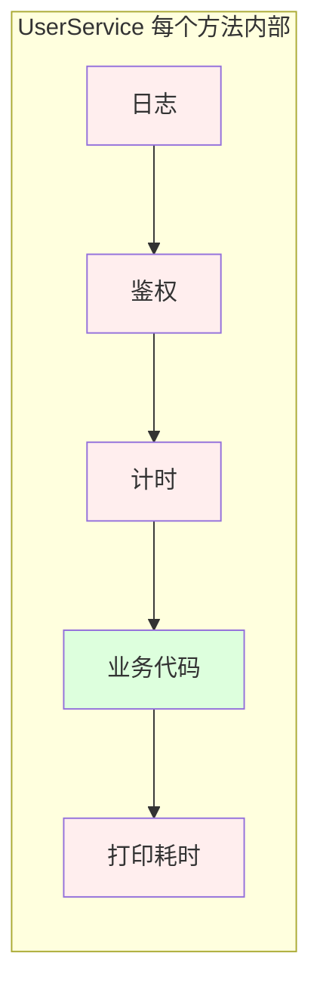
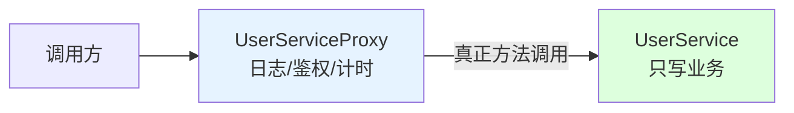

# 第三卷第5章：静态代理设计模式

> **📚 本篇渐进学习节奏（建议按顺序食用）**
>
> 1. **第 01 节 · 案例引入** — 一段"日志/鉴权/计时"散落在每个 Service 方法里的事故复盘
> 2. **第 02 节 · 模式基础** — 三个生活类比让"代理"这个词在脑子里有画面
> 3. **第 03 节 · 原理实现** — 从"能跑"到"能改"，代码演化的两步走
> 4. **第 04 节 · 结构分析** — UML 角色图 + 时序图，理清 Subject/RealSubject/Proxy
> 5. **第 05 节 · 优势解读** — 用前用后效果对比，看代理到底省下多少代码
> 6. **第 06~07 节 · 局限与联动** — 真实开源案例、踩坑实录、何时该升级到动态代理
>
> 阅读到任何一节卡壳，直接跳回上一节复盘场景；本篇代码均可直接运行。

#### 目录介绍
- [01.案例引入与思考](#01案例引入与思考)
    - [1.1 痛点场景](#11-痛点场景)
    - [1.2 它哪里不舒服](#12-它哪里不舒服)
    - [1.3 引出本篇主角](#13-引出本篇主角)
- [02.静态代理模式基础](#02静态代理模式基础)
    - [2.1 静态代理由来](#21-静态代理由来)
    - [2.2 静态代理定义](#22-静态代理定义)
    - [2.3 静态代理场景](#23-静态代理场景)
    - [2.4 静态代理思考](#24-静态代理思考)
- [03.静态代理原理与实现](#03静态代理原理与实现)
    - [3.1 罗列一个场景](#31-罗列一个场景)
    - [3.2 用一个例子理解代理](#32-用一个例子理解代理)
    - [3.3 案例演变分析](#33-案例演变分析)
- [04.静态代理分析](#04静态代理分析)
    - [4.1 静态代理结构图](#41-静态代理结构图)
    - [4.2 静态代理时序图](#42-静态代理时序图)
- [05.代理模式优势](#05代理模式优势)
    - [5.1 如何降低耦合](#51-如何降低耦合)
    - [5.2 保护真实对象使用权限](#52-保护真实对象使用权限)
- [06.静态代理不足](#06静态代理不足)
    - [6.1 静态代理类优缺点](#61-静态代理类优缺点)
    - [6.2 静态代理缺乏灵活](#62-静态代理缺乏灵活)
    - [6.3 静态代理复用难](#63-静态代理复用难)
    - [6.4 难以动态添加功能](#64-难以动态添加功能)
    - [6.5 无法实现多态](#65-无法实现多态)
    - [6.6 思考一下局限性](#66-思考一下局限性)
    - [6.7 动态代理弥补不足](#67-动态代理弥补不足)
- [07.静态代理总结](#07静态代理总结)
    - [7.1 总结一下学习](#71-总结一下学习)
    - [7.2 模式联动与边界](#72-模式联动与边界)


## 推荐一个好玩网站

一个最纯粹的技术分享网站，打造精品技术编程专栏！[编程进阶网](https://yccoding.com/)

https://yccoding.com/


## 01.案例引入与思考

> **本篇主线**：日常开发中最常见的"横切关注点散落在每个业务方法里"

### 1.1 痛点场景

> **🔥 模拟事故复盘 · 周一上午 10:00 安全审计组突袭**
>
> 公司年度安全审计，要求所有用户敏感操作必须有"操作日志 + 登录态校验 + 耗时监控"三件套，72 小时内全量补齐，否则下架整改。
> 后端组打开 IDE 一看 — 50+ 个 Service、200+ 个方法，**每个方法的开头都要加一段三明治代码**。组长拍板"全员加班手工补"，结果周二凌晨 3 点：
>
> - 张三在 `OrderService.update` 里把 `t = currentTimeMillis()` 写成了 `t = 0`，**所有订单接口耗时显示为天文数字**，监控告警炸群；
> - 李四在 `PayService.refund` 里漏了一行 `if (!isLogin())` 校验，**未登录用户能直接退款**，被红队渗透组当场抓包；
> - 王五好不容易写完，第二天产品又改需求："日志格式要从 println 换成 SLF4J + JSON" — 200 个方法**全部得再改一遍**。
>
> 这场"三件套补丁战"暴露了一个本质问题：**横切关注点（cross-cutting concerns）和业务代码物理耦合**，一旦数量上去了，靠人工复制粘贴必然翻车。

写一个用户服务，每个方法都要在进入前打日志、检查登录态，离开时计时：

```java
public class UserService {
    public User findById(Long id) {
        System.out.println("[LOG] findById 开始, id=" + id);
        if (!SessionHolder.isLogin()) throw new AuthException();
        long t = System.currentTimeMillis();
        // —— 真正的业务 —— 
        User u = userDao.selectById(id);
        // —— 业务结束 ——
        System.out.println("[LOG] 耗时: " + (System.currentTimeMillis() - t));
        return u;
    }

    public void update(User u) {
        System.out.println("[LOG] update 开始");
        if (!SessionHolder.isLogin()) throw new AuthException();
        long t = System.currentTimeMillis();
        userDao.updateById(u);
        System.out.println("[LOG] 耗时: " + (System.currentTimeMillis() - t));
    }
    // 还有 delete/list/count/... 每个方法都是同样的三段式
}
```

画一张结构图，问题一目了然——横切逻辑和业务逻辑死死缠在一起：



### 1.2 它哪里不舒服

- ❌ **横切关注点侵入业务代码**：日志、鉴权、计时本来和"查用户"毫无关系，却硬塞进业务方法；
- ❌ **复制粘贴灾难**：每个方法都要写一遍这三段式，一个项目几十个 Service 方法 = 几百行重复样板；
- ❌ **改一处动全身**：哪天要把日志换成 SLF4J、或者鉴权规则升级——每个方法都要改；
- ❌ **测试困难**：想单测业务逻辑，却被日志/鉴权牵连，Mock 一大堆；
- ❌ **职责不清**：`UserService` 本该只关心"用户数据"，现在却身兼"日志员 + 门卫 + 计时员"三职。

### 1.3 引出本篇主角

> **代理模式（Proxy）的核心思想**：为目标对象提供一个"替身"，调用方接触到的只是替身。替身把"真正的调用"转发给目标，并在前后加上横切逻辑——业务代码因此保持干净。



代理模式又分 **静态代理** 和 **动态代理**——本篇先把静态代理讲透（手工写一个代理类），为下一篇的动态代理（JDK/CGLIB 自动生成代理）打好基础。

**回到事故现场**：如果周一接到审计需求时，团队里有人说"先不要动 50 个 Service，给每个 Service 配一个 Proxy 类，三件套全写在 Proxy 里" — 那么张三、李四、王五的事故就根本不会发生，因为业务代码一行没动，所有横切逻辑改起来只需要改 Proxy 这一层。

---

## 02.静态代理模式基础
### 2.1 静态代理由来
在某些情况下，一个客户不想或者不能直接引用一个对象，此时可以通过一个称之为“代理”的第三者来实现间接引用。

代理对象可以在客户端和目标对象之间起到中介的作用，并且可以通过代理对象去掉客户不能看到的内容和服务或者添加客户需要的额外服务。

代理模式的英 文叫做Proxy或Surrogate，它是一种对象结构型模式。


### 2.2 静态代理定义

静态代理定义是什么？

**代理模式(Proxy Pattern) ：为了隐藏与保护目标对象，给某一个对象提供一个代理，并由代理对象控制对原对象的引用**。


### 2.3 静态代理场景

静态代理使用场景

代理模式常用在业务系统中开发一些非功能性需求，比如：监控、统计、鉴权、限流、事务、幂等、日志。

我们将这些附加功能与业务功能解耦，放到代理类统一处理，让程序员只需要关注业务方面的开发。除此之外，代理模式还可以用在 RPC、缓存等应用场景中。


### 2.4 静态代理思考
思考一下：代理类和被代理类的关系？

静态代理中，代理类和被代理类之间的关系在编译时就已经确定。需要考虑代理类和被代理类之间的接口或继承关系，以确保代理类能够正确地代理被代理类的功能。

思考一下：代理类的责任？

代理类在静态代理中充当了中介的角色，负责将客户端的请求转发给被代理类，并在必要时添加额外的功能或控制。需要考虑代理类应该承担的责任，以及如何在代理类中实现这些责任。

思考一下：代理类的性能和效率？

静态代理在编译时就已经确定代理类和被代理类的关系，因此在运行时不需要进行额外的动态代理操作。这可能会带来一些性能和效率上的优势，但也需要考虑代理类的创建和销毁成本，以及代理类对系统性能的影响。

思考一下：代理类的扩展性和维护性？

静态代理在编译时就已经确定代理类和被代理类的关系，因此在需要代理多个类或接口时，就需要编写多个代理类。这可能会导致代码冗余和维护困难。需要考虑如何设计代理类，以提高代码的扩展性和维护性。


## 03.静态代理原理与实现
### 3.1 罗列一个场景

**为什么要先讲这三个类比**：初学者看到"Subject/RealSubject/Proxy"三个类很容易迷失。接下来三个生活类比帮你在脑子里推出“为什么需要代理”，而不是“怎么写代理”。
> 第一个类比：代理对象是中介，原对象是房东的房子，客户就是我们需要找房的人。

房东的房子让中介代理出租，中介可以直接控制房子出租，用户是不能找房东直接租房子的，而是要间接通过中介租房子。

> 第二个类比：代理对象是售票点，原对象是火车站，客户就是需要买票的乘客。

我们购买火车票可以去火车站买，但是也可以去火车票代售处买，此处的火车票代售处就是火车站购票的代理，即我们在代售点发出买票请求，代售点会把请求发给火车站，火车站把购买成功响应发给代售点，代售点再告诉你。

但是代售点只能买票，不能退票，而火车站能买票也能退票，因此代理对象支持的操作可能和委托对象的操作有所不同。

> 第三个类比：代理对象是vpn，原对象是国外网站，客户就是需要翻墙上网的人。

(1)用户把HTTP请求发给代理；(2)代理把HTTP请求发给web服务器；(3)web服务器把HTTP响应发给代理；(4)代理把HTTP响应发回给用户


### 3.2 用一个例子理解代理
实现模式

1. 首先创建一个接口（代理都是面向接口的），
2. 创建具体实现类来实现这个接口，
3. 创建一个代理类同样实现这个接口，不同之处在于具体实现类的方法中需要将接口中定义的方法的业务逻辑功能实现，而代理类中的方法只要调用具体类中的对应方法即可，这样我们在需要使用接口中的某个方法的功能时直接调用代理类的方法即可，将具体的实现类隐藏在底层。

**举一个实际案例**

1. 定义用户找房子的需求接口
2. 创建用户找房子具体实现类
3. 创建一个代理中介，委托中介去找房子


代码如下所示，可以了解到，静态代理可以通过聚合来实现，让代理类持有一个委托类的引用即可。代码案例放到GitHub上，[设计模式代码案例](https://github.com/yangchong211/YCComputerBlog)

```java
/**
 * 静态代理伪代码
 */
private void testProxy() {
    //1.创建委托对象
    RealSubject subject = new RealSubject();
    //2.创建调用处理器对象
    MyProxy p = new MyProxy(subject);
    //3.通过代理对象调用方法
    p.request();
}

/**
 * 代理类和委托类会实现接口
 */
interface Subject{
    void request();
}

/**
 * 委托类
 */
class RealSubject implements Subject{
    @Override
    public void request(){
        System.out.println("request");
    }
}

/**
 * 代理
 */
class Proxy implements Subject{
    private Subject subject;
    public Proxy(Subject subject){
        this.subject = subject;
    }
    @Override
    public void request(){
        System.out.println("PreProcess");
        subject.request();
        System.out.println("PostProcess");
    }
}
```


### 3.3 案例演变分析

**从“能跑”到“能改”**：3.2 只证明代理模式能跑起来，现在要看它面对需求变化时是否也能从容应对。

考虑一下这个需求：

给委托类增加一个过滤功能，只租房给我们这类逗比程序员。通过静态代理，我们无需修改委托类的代码就可以实现，只需在代理类中的方法中添加一个判断即可如下所示：

```java
class MyProxy implements Subject {
    private Subject subject;
    public MyProxy(Subject subject){
        this.subject = subject;
    }
    @Override
    public void request(){
        //判断是否是逗比程序员
        if (isDouBi){
            System.out.println("PreProcess");
            subject.request();
            System.out.println("PostProcess");
        }
    }
}
```

使用代理的第二个优点：

可以实现客户与委托类间的解耦，在不修改委托类代码的情况下能够做一些额外的处理。静态代理的局限在于运行前必须编写好代理类。


## 04.静态代理分析
### 4.1 静态代理结构图

代理模式包含如下角色：

1. Subject: 抽象主题角色
2. Proxy: 代理主题角色
3. RealSubject: 真实主题角色

静态代理结构图


### 4.2 静态代理时序图

静态代理时序图如下所示


## 05.代理模式优势
### 5.1 如何降低耦合

**🎯 用前用后效果对比**

用 5.1 的邮件发送案例做基线，假设公司有 20 个类似的 Service（订单、用户、支付、库存…），每个 Service 平均 10 个方法，所有方法都要补"日志 + 鉴权 + 计时"三件套：

| 维度 | ❌ 不用代理（事故现场） | ✅ 引入静态代理 |
|------|------------------|--------------|
| 修改文件数 | 20 个 Service × 10 方法 = **200 处改动** | 20 个 Proxy 类 × 1 处增强 = **20 处改动** |
| 业务代码污染 | 每个方法被三段式包裹，可读性极差 | 业务方法干干净净，只关心"查用户" |
| 切换日志框架 | 200 个方法挨个改 println→SLF4J | 改 Proxy 一处，所有 Service 受益 |
| 单元测试 | Mock 日志/鉴权/计时一大堆 | 直接 new RealService 测业务 |
| 新增鉴权规则 | 200 处都要补一行 if | 改 Proxy 一处 |
| 漏写一段 | **必然发生**（人工复制粘贴） | 不可能发生（编译期保证） |
| 代码审查难度 | 横切+业务交错，难以聚焦 | 业务/横切物理隔离，diff 一目了然 |

> 一句话：**代理模式 = 用 "+20 个 Proxy 类" 换来 "-200 处分散修改"**，规模越大、横切越多，收益越显著。这也是为什么 Spring AOP 在企业级开发中是"标配"。

一个简单的案例，演示了如何使用静态代理来降低耦合：

假设我们有一个邮件发送的接口 MailSender，以及一个实现该接口的具体类 RealMailSender。

现在我们想要在发送邮件之前记录日志，但又不想直接修改 RealMailSender 类。这时可以使用静态代理来实现：

```java
// 定义邮件发送接口
interface MailSender {
    void sendMail(String recipient, String message);
}

// 实现邮件发送接口的具体类
class RealMailSender implements MailSender {
    public void sendMail(String recipient, String message) {
        System.out.println("Sending mail to " + recipient + ": " + message);
    }
}

// 静态代理类
class MailSenderProxy implements MailSender {
    private RealMailSender realMailSender;

    public MailSenderProxy() {
        this.realMailSender = new RealMailSender();
    }

    public void sendMail(String recipient, String message) {
        System.out.println("Logging mail sending...");
        realMailSender.sendMail(recipient, message);
    }
}
    
// 使用示例
public class Main {
    public static void main(String[] args) {
        MailSender mailSender = new MailSenderProxy();
        mailSender.sendMail("example@example.com", "Hello, world!");
    }
}
```

**代码案例分析，它降低耦合的设计思想是什么**

通过使用静态代理，我们可以在不修改 RealMailSender 类的情况下，为邮件发送操作添加额外的功能。这样，RealMailSender 类和 MailSenderProxy 类之间的耦合度降低，客户端只需要与 MailSender 接口进行交互，而不需要关心具体的实现类。

静态代理可以通过以下方式降低耦合：

1. 接口抽象：定义一个接口，代理类和被代理类都实现该接口。通过接口的抽象，代理类和被代理类之间的耦合度降低，客户端只需要与接口进行交互，而不需要关心具体的实现类。
2. 代理类作为中介：代理类作为客户端和被代理类之间的中介，将客户端的请求转发给被代理类。这样，客户端只需要与代理类进行交互，而不需要直接与被代理类进行交互，从而降低了客户端与被代理类之间的耦合。
3. 面向接口编程：在客户端代码中，尽量使用接口类型来声明变量，而不是具体的实现类。这样可以使客户端与具体的代理类解耦，提高代码的灵活性和可扩展性。
4. 使用依赖注入：通过依赖注入的方式，将代理对象注入到客户端中，而不是在客户端代码中直接创建代理对象。这样可以将代理对象的创建和配置与客户端代码解耦，提高代码的可维护性和可测试性。


### 5.2 保护真实对象使用权限
静态代理可以用于保护真实对象的使用权限。

通过代理类，可以在访问真实对象之前或之后执行一些额外的操作，例如权限验证、身份验证等，以确保只有具有适当权限的用户可以访问真实对象。

以下是一个简单的示例，演示了如何使用静态代理来保护真实对象的使用权限：

* Image接口定义了display方法，RealImage类实现了该接口并表示真实对象。ImageProxy类也实现了Image接口，并在display方法中创建或使用真实对象。
* 通过ImageProxy类，我们可以在访问真实对象之前进行权限验证或其他操作。只有在真正需要显示图像时，真实对象才会被加载和显示，从而保护了真实对象的使用权限。

```java
private static void proxyImage() {
    Image image = new ImageProxy("image.jpg");
    // 只有在调用display方法时，真实对象才会被加载和显示
    image.display();
}


// 定义接口
interface Image {
    void display();
}

// 定义真实对象
static class RealImage implements Image {
    private String filename;

    public RealImage(String filename) {
        this.filename = filename;
        loadFromDisk();
    }

    private void loadFromDisk() {
        System.out.println("Loading image from disk: " + filename);
    }

    public void display() {
        System.out.println("Displaying image: " + filename);
    }
}
// 定义代理类
static class ImageProxy implements Image {
    private String filename;
    private RealImage realImage;

    public ImageProxy(String filename) {
        this.filename = filename;
    }

    public void display() {
        if (realImage == null) {
            realImage = new RealImage(filename);
        }
        realImage.display();
    }
}
```


## 06.静态代理不足
### 6.1 优缺点概述
优点：

业务类只需要关注业务逻辑本身，保证了业务类的重用性。这是代理的共有优点。

缺点：

1. 1）代理对象的一个接口只服务于一种类型的对象，如果要代理的方法很多，势必要为每一种方法都进行代理，静态代理在程序规模稍大时就无法胜任了。
2. 2）如果接口增加一个方法，除了所有实现类需要实现这个方法外，所有代理类也需要实现此方法。增加了代码维护的复杂度。


### 6.2 缺乏灵活性

静态代理缺乏灵活说明：

静态代理在编译时就已经确定代理类和被代理类的关系，因此无法在运行时动态地改变代理行为。而动态代理允许在运行时动态地创建代理对象，并可以根据需要动态地改变代理行为，提供更大的灵活性。


### 6.3 复用性不足
代码复用难，会导致代码庞大：

静态代理需要为每个被代理类编写一个代理类，当需要代理多个类时，会导致代码冗余。而动态代理可以通过一个通用的代理类来代理多个类，实现代码的复用。


### 6.4 动态增加不便
静态代理动态添加功能：

静态代理在编译时就已经确定代理类和被代理类的关系，无法在运行时动态地添加额外的功能。而动态代理可以在运行时动态地为被代理对象添加额外的功能，例如日志记录、性能监控、事务管理等。


### 6.5 多态支持不足
静态代理无法满足多态性：

静态代理在编译时就已经确定代理类和被代理类的关系，无法实现多态性。而动态代理可以基于接口或基类来创建代理对象，实现多态性，使得代理对象可以替代被代理对象的使用。


### 6.6 其余局限思考
如果要按照上述的方法使用代理模式，那么真实角色(委托类)必须是事先已经存在的，并将其作为代理对象的内部属性。

但是实际使用时，一个真实角色必须对应一个代理角色，如果大量使用会导致类的急剧膨胀；此外，如果事先并不知道真实角色（委托类），该如何使用代理呢？这个问题可以通过Java的动态代理类来解决。


### 6.7 动态代理补足

1. 代码复用：动态代理可以通过一个通用的代理类来代理多个类，实现代码的复用。不需要为每个被代理类编写一个代理类，减少了代码的冗余。
2. 灵活性和扩展性：动态代理在运行时动态地创建代理对象，并可以根据需要动态地添加、修改或删除代理行为。这使得代理行为可以根据不同的需求进行定制和扩展，提供了更大的灵活性和扩展性。
3. 解耦合：动态代理通过使用接口或基类来代理对象，实现了代理类和被代理类之间的松耦合。客户端只需要与代理对象进行交互，无需关心具体的实现类，提高了代码的可维护性和可扩展性。

**总结起来，静态代理在一些简单的场景下可以使用，但在需要更大的灵活性、扩展性和可维护性时，动态代理更为适合**。

**🚨 反面踩坑实录 · 静态代理 4 种典型翻车姿势**

看似"new 一个 Proxy 包一层"很简单，真上手后这 4 类坑几乎人人踩过：

**坑 1：Proxy 没实现 Subject 接口，调用方拿到的不是"替身"而是"伪装者"**
```java
class UserServiceProxy {  // ❌ 没 implements UserService
    private UserService target;
    public User findById(Long id) { /* 加日志 + target.findById */ }
}
// 调用方期望的是 UserService 类型,结果只能拿到 UserServiceProxy 具体类
// 一旦 UserService 接口新增方法,所有调用方都要改类型,完全失去多态
```
**根因**：代理模式的"灵魂"在于 **代理与目标实现同一接口** — 这样调用方面向接口编程，根本感知不到中间多了一层。漏掉 implements，代理就退化成了普通的"包装类"，丢失了无侵入替换的能力。

**坑 2：代理链顺序写反，鉴权之前先打了日志，安全审计直接判不合规**
```java
// ❌ 写法 1：先日志后鉴权
public User findById(Long id) {
    log.info("findById id={}", id);     // 未登录用户的访问也被记录到正常业务日志
    if (!isLogin()) throw new AuthException();
    return target.findById(id);
}
```
**根因**：代理链的拦截顺序就是真实的**执行顺序**，必须按"鉴权 → 限流 → 日志 → 计时 → 业务"的洋葱模型排列。顺序写反不仅功能错误，更会带来合规与审计风险（攻击者的非法访问混进了正常请求日志）。Spring AOP 通过 `@Order` 注解控制顺序，**静态代理则全靠手工小心**。

**坑 3：把 Proxy 当成"全功能万能瓶"，把缓存、限流、熔断、日志、事务全塞一个类里**
```java
class UserServiceProxy implements UserService {
    public User findById(Long id) {
        // 日志 + 鉴权 + 计时 + 限流 + 缓存 + 熔断 + 事务 + 重试  → 8 件套堆在这里
    }
}
// 这个 Proxy 自身就成了"超级 Service",违背单一职责,且无法局部禁用某个功能
```
**根因**：横切关注点应当**分层叠加**而非堆在一个 Proxy 里。正解是写多个 Proxy 链式组合：`new LoggingProxy(new AuthProxy(new RateLimitProxy(real)))`，每个 Proxy 只关心一件事 — 这就是"装饰器模式"和代理的边界（也是 Spring AOP 的多 Advisor 的设计哲学）。

**坑 4：代理类内部直接 `new RealSubject()`，导致替身和真身被强绑死，单测无路可逃**
```java
class UserServiceProxy implements UserService {
    private UserService target = new RealUserService();  // ❌ 硬编码
}
// 想 Mock RealUserService 测试 Proxy 的横切逻辑? 改不动,只能改源码
```
**根因**：代理与目标的关系应通过**构造函数注入**，让目标可以被替换（包括 Mock）。这也是 Spring 容器注入 Bean 的核心 — 它让所有的"代理装配"都变成可配置、可替换的，进而让 AOP 真正可工程化。

> 这四个坑共同指向一个事实：**静态代理的所有"机械活儿"都可以由动态代理（JDK Proxy/CGLIB）+ Spring AOP 自动完成**。先用静态代理理解原理，再用动态代理享受工程红利 — 这就是为什么本系列把它们拆成两篇。

**🔍 真实开源代码中的代理模式**

代理在 Java 工程界几乎是"看不见但无处不在"的存在 — 大部分都是动态代理，但思路完全是静态代理的延伸：

| 形态 | 出处 | 关键代码/特征 | 它在解决什么 |
|------|------|----------|-----------|
| 静态代理 | JDK `Collections.unmodifiableList(list)` | 返回的是 `UnmodifiableList` 同接口包装类，所有 mutator 方法抛 UOE | 用代理保护真实对象的"只读访问权" |
| 静态代理 | JDK `Collections.synchronizedList(list)` | 同接口包装类，每个方法 `synchronized(mutex)` | 横切线程安全，业务无感 |
| 静态代理 | Servlet `HttpServletRequestWrapper` | 同接口包装，子类覆盖单个方法即可 | 改请求参数前不动原始 Request |
| 动态代理 | Spring AOP `@Transactional` / `@Async` / `@Cacheable` | JDK Proxy 或 CGLIB 在运行时生成增强类 | 把日志/事务/缓存横切自动织入，免手写 Proxy |
| 动态代理 | MyBatis `Mapper` 接口 | `MapperProxyFactory` 用 JDK Proxy 把接口方法转成 SQL | 接口 = SQL 入口，免写 DAO 实现 |
| 动态代理 | RPC 客户端（Dubbo / gRPC / OpenFeign） | 客户端拿到的是接口的代理对象，方法调用被序列化成网络请求 | 远程调用伪装成本地方法调用 |
| 远程代理 | Java RMI `Stub` / EJB 远程接口 | 编译期生成 Stub 类（古典静态代理） | 隐藏跨 JVM 的网络细节 |
| 虚代理 | Hibernate 懒加载 `@OneToMany(fetch=LAZY)` | CGLIB 子类代理，访问时才查 DB | 推迟昂贵对象的创建（5.2 节 ImageProxy 的工业级版本） |
| 保护代理 | Spring Security `@PreAuthorize` | AOP 代理在方法前注入鉴权检查 | 把鉴权与业务彻底分离 |

> **学习建议**：尤其要看 MyBatis 的 `MapperProxy.invoke()` 与 Spring 的 `JdkDynamicAopProxy.invoke()` — 它们是"静态代理的工业版"，理解它们能直接通到 AOP/IOC 的内核。

**⚠️ 什么时候不该用静态代理**

- **目标接口频繁变更**：每改一次接口就要改 N 个 Proxy 类，此时直接上动态代理；
- **代理类数量超过 3~5 个**：手写量级失控，CGLIB/JDK Proxy 一行 `Proxy.newProxyInstance` 就替代百行代码；
- **目标类没有接口（且不可改）**：JDK Proxy 也不行，必须 CGLIB 字节码生成子类；
- **需要细粒度切点（只代理某些方法 + 注解过滤）**：手写代理无法表达 PointCut 表达式，应直接用 Spring AOP。

> 一句话：**静态代理是教学之用、轻场景实用；工程上一旦规模化，立刻请动态代理出场**。

## 07.静态代理总结
### 7.1 总结一下学习
**01.静态代理模式基础**

由来和背景：在某些情况下，一个客户不想或者不能直接引用一个对象，此时可以通过一个称之为“代理”的第三者来实现间接引用。比如以下场景就适合用代理模式

1. 个人，通过中介来找房东发布的租房。
2. 乘客，通过火车站来购买铁路局的车票。
3. 客户，通过VPN代理来翻墙查阅国外资料。

一句话概括就是：**代理模式(Proxy Pattern) ：给某一个对象提供一个代理，并由代理对象控制对原对象的引用**。

静态代理使用场景：监控、统计、鉴权，日志等场景。附加功能与业务功能解耦，放到代理类统一处理，让程序员只需要关注业务方面的开发！

**02.静态代理原理与实现**

实现模式

1. 首先创建一个接口（代理都是面向接口的），
2. 创建具体实现类来实现这个接口，
3. 创建一个代理类同样实现这个接口，不同之处在于具体实现类的方法中需要将接口中定义的方法的业务逻辑功能实现，而代理类中的方法只要调用具体类中的对应方法即可，这样我们在需要使用接口中的某个方法的功能时直接调用代理类的方法即可，将具体的实现类隐藏在底层。

**举一个实际案例**

1. 定义用户找房子的需求接口
2. 创建用户找房子具体实现类
3. 创建一个代理中介，委托中介去找房子

**03.静态代理分析**

代理模式包含如下角色：

1. Subject: 抽象主题角色
2. Proxy: 代理主题角色
3. RealSubject: 真实主题角色


**04.代理模式优势**

1. 使用静态代理来降低耦合。比如，邮件发送的接口 MailSender，以及一个实现该接口的具体类 RealMailSender。可以在不修改 RealMailSender 类的情况下，为邮件发送操作添加额外的功能。这样，RealMailSender 类和 MailSenderProxy 类之间的耦合度降低，客户端只需要与 MailSender 接口进行交互，而不需要关心具体的实现类。
2. 静态代理可以用于保护真实对象的使用权限。在真正需要显示图像时，真实对象才会被加载和显示，从而保护了真实对象的使用权限。


**05.静态代理不足**

1. 静态代理缺乏灵活说明
2. 代码复用难，会导致代码庞大
3. 难以动态添加功能
4. 静态代理无法满足多态性


### 7.2 模式联动与边界

- 与**装饰器模式**：装饰器同接口"叠加增强"，静态代理是"同接口提供前置/后置"，常被用来比较；区别在装饰器关注"扩展功能"，代理关注"控制访问"；
- 与**适配器模式**：适配器接口不一致需要"转接"，代理接口一致只是中间多一层；
- 与**外观模式**：外观把多个子系统合并成一层，代理只是同一个对象的中间层；
- 与**动态代理**：静态代理需要为每个目标类写代理类，动态代理在运行时统一生成。

**何时说 NO**：目标方法只有一两个、不需要拦截；接口频繁变更（每改接口都要改代理实现）。

下一站建议阅读 [06.动态代理](06.动态代理设计模式.md)——看看 Spring AOP 背后的运行时代理是如何工作的。
