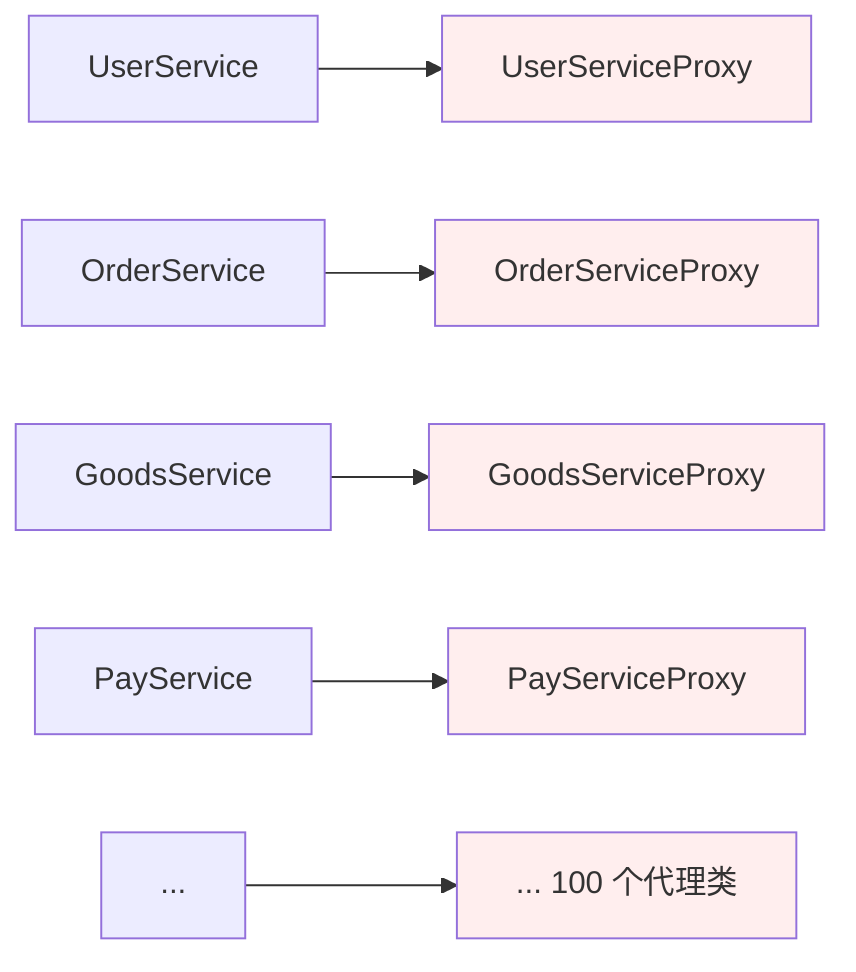
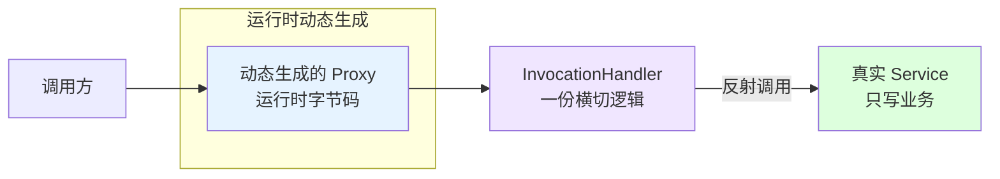
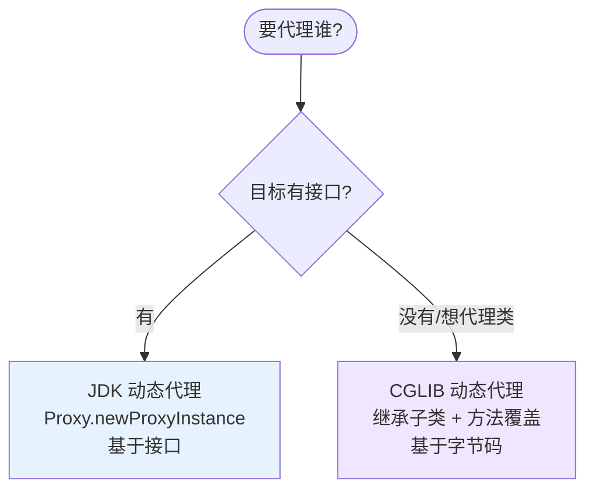

# 第三卷第6章：动态代理设计模式

> **📚 本篇渐进学习节奏（建议按顺序食用）**
>
> 1. **第 01 节 · 案例引入** — 上一篇 100 个 Service × 100 个 Proxy 文件的"类爆炸"现场
> 2. **第 02 节 · 为何要动态代理** — 从"编译期写死"到"运行期生成"的思想跃迁
> 3. **第 03 节 · 概念与角色** — 调用处理器 InvocationHandler 凭什么是核心
> 4. **第 04 节 · 两种实现** — JDK Proxy（接口）vs CGLIB（类），何时选谁一表搞定
> 5. **第 05 节 · 工业级实战** — Retrofit `create()` 一行代码生成所有接口实现的奥秘
> 6. **第 06~07 节 · 原理与边界** — 字节码级的拆解 + 真实开源案例 + 4 种典型踩坑姿势
>
> 阅读到任一节卡壳，直接跳回上一节复盘场景；本篇代码均可直接运行。

#### 目录介绍
- [01.案例引入与思考](#01案例引入与思考)
    - [1.1 痛点场景](#11-痛点场景)
    - [1.2 它哪里不舒服](#12-它哪里不舒服)
    - [1.3 引出本篇主角](#13-引出本篇主角)
- [02.为何要动态代理](#02为何要动态代理)
    - [2.1 为何要动态代理](#21-为何要动态代理)
    - [2.2 动态代理思考](#22-动态代理思考)
- [03.动态代理的概念](#03动态代理的概念)
    - [3.1 动态代理定义](#31-动态代理定义)
    - [3.2 动态代理类比理解](#32-动态代理类比理解)
    - [3.3 动态代理参与者](#33-动态代理参与者)
    - [3.4 动态代理步骤](#34-动态代理步骤)
- [04.动态代理的实现](#04动态代理的实现)
    - [4.1 罗列一个场景](#41-罗列一个场景)
    - [4.2 用一个例子理解代理](#42-用一个例子理解代理)
    - [4.3 基于接口动态代理](#43-基于接口动态代理)
    - [4.4 基于类动态代理](#44-基于类动态代理)
    - [4.5 动态代理模版代码](#45-动态代理模版代码)
- [05.动态代理案例](#05动态代理案例)
    - [5.1 动态代理和反射](#51-动态代理和反射)
    - [5.2 Java中代理](#52-java中代理)
    - [5.3 Retrofit核心思想](#53-retrofit核心思想)
- [06.动态代理思想和原理](#06动态代理思想和原理)
    - [6.1 动态代理实现机制](#61-动态代理实现机制)
    - [6.2 动态代理思想](#62-动态代理思想)
    - [6.3 动态代理存在的问题](#63-动态代理存在的问题)
    - [6.4 动态代理的优势](#64-动态代理的优势)
- [07.动态代理总结](#07动态代理总结)
    - [7.1 总结一下学习](#71-总结一下学习)
    - [7.2 模式联动与边界](#72-模式联动与边界)


## 推荐一个好玩网站

一个最纯粹的技术分享网站，打造精品技术编程专栏！[编程进阶网](https://yccoding.com/)

https://yccoding.com/


## 01.案例引入与思考

> **本篇主线**：静态代理的"类爆炸"，正是动态代理要解决的核心问题

### 1.1 痛点场景

> **🔥 模拟事故复盘 · 周三 14:30 "补丁战第三天"**
>
> 上一篇周一的安全审计事故后，团队按统一标准给每个 Service 写了静态代理。三天过去：
>
> - **周一**：写了 `UserServiceProxy` / `OrderServiceProxy` / `PayServiceProxy`，三件套补完，提交 1.2k 行；
> - **周二**：架构师评审时一句话"日志格式得换 SLF4J + JSON"——**三个 Proxy 全得改一遍**；写代码的实习生小张周二晚上加班到 23:00，把 `OrderServiceProxy` 漏了一个方法没改，第二天早上监控告警全是格式错乱；
> - **周三 14:30**：业务又新上线了 `GoodsService` / `CouponService` / `MessageService`，**三个 Proxy 又得手写一遍**；CTO 在例会上拍板："再这么搞下去，半年后项目里一半文件叫 XxxProxy。"
>
> 这场"补丁战"暴露的不是"代理模式不好"，而是**"编译期手写代理"这条路在工程化规模面前根本走不通** — 100 个接口意味着 100 份雷同代码，一处需求变动就是 100 处地毯式修改。**真正的解法只有一条：让代理类从"手写"变成"运行时自动生成"**。

上一篇的静态代理，确实把"日志+鉴权+计时"从 `UserService` 抽了出去，但代价是多了一个 `UserServiceProxy`。如果项目里还有 `OrderService`、`GoodsService`、`PayService`……每个都要做同样的事：

```java
// UserServiceProxy
public class UserServiceProxy implements UserService {
    private final UserService target;
    public User findById(Long id) {
        log(); auth(); long t=now();
        User u = target.findById(id);
        cost(t);
        return u;
    }
    // ... update / delete / list 每个方法都写一遍
}

// OrderServiceProxy —— 把上面代码几乎一模一样复制
// GoodsServiceProxy —— 再来一次
// PayServiceProxy ——  再来一次
// 100 个接口 → 100 个代理类 → 每个代理类里 N 个方法 = N × 100 次复制
```



### 1.2 它哪里不舒服

- ❌ **类爆炸**：每多一个接口就多一个代理类，项目里一半文件是 `XxxProxy`；
- ❌ **代码雷同**：所有代理类里的日志/鉴权/计时逻辑本质上一模一样，修改"日志格式"就要改 100 个文件；
- ❌ **扩展痛苦**：新接口一上线，必须记得写它的代理，忘了就没日志没鉴权，线上事故在等你；
- ❌ **无法统一管控**：横切逻辑散落在 100 个代理类里，根本不存在"一个地方管住全局"的可能。

### 1.3 引出本篇主角

> **动态代理（Dynamic Proxy）的核心思想**：不再"编译期手写代理类"，改成"运行时自动生成代理类"。你只需要写一次横切逻辑（`InvocationHandler#invoke`），JDK/CGLIB 会在运行时为**任意接口/类**动态合成代理字节码。



两条技术路线互为补充：



Spring AOP、MyBatis Mapper、Retrofit 的接口请求——它们的"魔法"全都来自动态代理。本篇会把原理、两种实现、坑点一次讲透。

**🎯 用前用后效果对比（接续 1.1 事故现场）**

基线：20 个 Service，平均每个 10 个方法，三件套横切：

| 维度 | ❌ 静态代理（事故现场） | ✅ JDK 动态代理 | ✅✅ Spring AOP（动态代理 + 容器） |
|------|----------------------|-----------------|---------------------------------|
| 代理类文件数 | **20 个** XxxProxy.java | **0 个**（运行期生成） | 0 个 + 一个 `@Aspect` 类 |
| 横切代码总行数 | 约 1200 行（重复 20 遍） | 约 30 行（写一次 `invoke`） | 约 30 行 + 注解 |
| 新增 Service 时 | **必须**新写一个 Proxy | **零修改**（自动生效） | 零修改 |
| 改日志格式 | **20 处**逐个改 | **1 处** | 1 处 |
| 改鉴权规则 | **20 处** | **1 处** | 1 处 |
| 漏写一个方法 | 常见事故源 | 不可能（接口方法全部转发） | 不可能 |
| 启动性能 | 0 开销 | 首次代理生成 ~1ms | 容器启动慢 100~300ms |
| 调用性能 | 与直接调用持平 | 反射开销 ~3-5x（JDK 17+ 几乎可忽略） | 同 JDK Proxy |
| 可调试性 | IDE 直接 F11 进 Proxy 类 | 需进 `$Proxy0` 反编译类 | 同 JDK Proxy |

> **结论**：
> - **小型项目（< 5 个 Service）**：静态代理可读性更好；
> - **中大型项目（≥ 10 个 Service）**：必须动态代理 — 否则改一次需求够你写一周补丁；
> - **工程化项目**：直接用 Spring AOP，动态代理只是底层机制不必直接调用。

---

## 02.为何要动态代理
### 2.1 为何要动态代理

一个真实角色必须对应一个代理角色，如果大量使用会导致类的急剧膨胀；此外，如果事先并不知道真实角色（委托类），该如何使用代理呢？这个问题可以通过Java的[动态代理](https://yccoding.com/zh/design/behavioral/06.%E5%8A%A8%E6%80%81%E4%BB%A3%E7%90%86%E8%AE%BE%E8%AE%A1%E6%A8%A1%E5%BC%8F.html)类来解决。

1. 代码复用：动态代理可以通过一个通用的代理类来代理多个类，实现代码的复用。不需要为每个被代理类编写一个代理类，减少了代码的冗余。
2. 灵活性和扩展性：动态代理在运行时动态地创建代理对象，并可以根据需要动态地添加、修改或删除代理行为。这使得代理行为可以根据不同的需求进行定制和扩展，提供了更大的灵活性和扩展性。
3. 解耦合：动态代理通过使用接口或基类来代理对象，实现了代理类和被代理类之间的松耦合。客户端只需要与代理对象进行交互，无需关心具体的实现类，提高了代码的可维护性和可扩展性。

**总结起来，[静态代理](https://yccoding.com/zh/design/behavioral/05.%E9%9D%99%E6%80%81%E4%BB%A3%E7%90%86%E8%AE%BE%E8%AE%A1%E6%A8%A1%E5%BC%8F.html)在一些简单的场景下可以使用，但在需要更大的灵活性、扩展性和可维护性时，动态代理更为适合，动态代理在解耦方面提供了巨大的便利**。


### 2.2 动态代理思考

当涉及到动态代理时，有几个方面值得思考：

1. 性能考虑：动态代理可能会引入一定的性能开销。在使用动态代理时，需要考虑代理对象的创建和方法调用的性能影响，并权衡是否值得使用代理。
2. 异常处理：在代理对象中处理异常是很重要的。确定如何处理原始对象方法中可能抛出的异常，并决定是否需要在代理对象中捕获、处理或转发异常。
3. 安全性考虑：了解代理对象的安全性问题。代理对象可能会暴露原始对象的敏感信息或功能，因此需要确保适当的安全措施。


## 03.动态代理的概念
### 3.1 动态代理定义

**动态代理的概括**

代理类是在运行时生成的。也就是说 Java 编译完之后并没有实际的 class 文件，而是在运行时动态生成的类字节码，并加载到JVM中。

动态代理定义

给某个对象提供一个代理对象，并由代理对象控制对于原对象的访问，即客户不直接操控原对象，而是通过代理对象间接地操控原对象。


### 3.2 动态代理类比理解

第一个类比：代理对象是中介，原对象是房东的房子，客户就是我们需要找房的人。

静态代理：房东的房子让中介代理出租，中介代理可以直接控制房子出租，用户是不能找房东直接租房子的，而是要间接通过中介租房子。

动态代理：现在中介代理有很多，链家中介，中原地产中介，21世纪中介，贝壳中介等等，用户在所在区域搜索心仪的房子（公寓，单间，隔断房，床位，整租房等等）后才知道找具体的中介租房子。这就需要用到动态代理！


### 3.3 动态代理参与者

代理模式的角色分四种：


如下所示

1. **主题接口**：Subject，是委托对象和代理对象都共同实现的接口，即代理类的所实现的行为接口。
2. **目标对象**：ReaSubject，是原对象，也就是被代理的对象。
3. **代理对象**：Proxy，是代理对象，用来封装真是主题类的代理类。
4. **客户端**：使用代理类和主题接口完成一些工作。


### 3.4 动态代理步骤

定义业务接口和实现：习惯性地首先定义一个接口，然后提供一个或多个实现。

创建调用处理器：实现InvocationHandler接口的类，它定义了代理实例的调用处理程序。

生成代理实例：通过调用Proxy.newProxyInstance()，传入目标类的类加载器、接口数组和调用处理器来创建。


## 04.动态代理原理和实现
### 4.1 罗列一个场景

现在有一个需求：用户找中介租房子，假如根据租房的条件，将客户需求分类：比如需要公寓，单间，隔断房，床位，整租房等等。

为其他对象提供一种代理以控制对这个对象的访问。

某些情况下，一个对象不适合或者不能直接引用另一个对象，而代理对象可以再两者之间起到中介作用。运行阶段才指定代理哪个对象。

组成元素：

1. 抽象类接口
2. 被代理类（具体实现抽象类接口的类）
3. 动态代理类，实际调用被代理类的方法和属性


### 4.2 用一个例子理解代理

Java 实现动态代理主要涉及以下几个类：

1. java.lang.reflect.Proxy: 这是生成代理类的主类，通过 Proxy 类生成的代理类都继承了 Proxy 类，即 DynamicProxyClass extends Proxy。
2. java.lang.reflect.InvocationHandler: 这里称他为"调用处理器"，他是一个接口，我们动态生成的代理类需要完成的具体内容需要自己定义一个类，而这个类必须实现 InvocationHandler 接口。


### 4.3 基于接口动态代理

基于接口的动态代理是一种常见的动态代理方式，它通过实现Java的Proxy类和InvocationHandler接口来实现。以下是一个基于接口的动态代理的示例：

首先，定义一个接口（例如MyInterface）：

```java
public interface MyInterface {
    void doSomething();
}
```

然后，创建一个实现InvocationHandler接口的代理处理器类（例如MyInvocationHandler）：

```java
public class MyInvocationHandler implements InvocationHandler {
    private Object target;

    public MyInvocationHandler(Object target) {
        this.target = target;
    }

    @Override
    public Object invoke(Object proxy, Method method, Object[] args) throws Throwable {
        // 在方法调用前执行额外的逻辑
        System.out.println("Before method invocation");
        // 调用目标对象的方法
        Object result = method.invoke(target, args);
        // 在方法调用后执行额外的逻辑
        System.out.println("After method invocation");
        return result;
    }
}
```

接下来，创建原始对象并生成代理对象：

```java
MyInterface originalObject = new MyOriginalObject(); // 创建原始对象
MyInvocationHandler invocationHandler = new MyInvocationHandler(originalObject); // 创建代理处理器
MyInterface proxyObject = (MyInterface) Proxy.newProxyInstance(
        MyInterface.class.getClassLoader(),
        new Class[]{MyInterface.class},
        invocationHandler); // 创建代理对象
```

最后，通过代理对象调用方法：

```java
proxyObject.doSomething();
```

在调用proxyObject.doSomething()时，会先执行代理处理器的invoke()方法中的前置逻辑，然后调用原始对象的doSomething()方法，最后执行代理处理器的后置逻辑。

通过基于接口的动态代理，我们可以在不修改原始对象的情况下，为其添加额外的功能或行为，例如日志记录、权限检查、性能监控等。


### 4.4 基于类动态代理

基于类的动态代理是另一种常见的动态代理方式，它使用第三方库或框架来实现。在Java中，常用的类动态代理库包括CGLIB和Byte Buddy。以下是一个基于CGLIB的类动态代理的示例：

首先，确保在项目中引入CGLIB库的依赖。

然后，定义一个原始类（例如MyClass）：

```java
public class MyClass {
    public void doSomething() {
        System.out.println("Original method");
    }
}
```

接下来，创建一个类动态代理处理器类（例如MyMethodInterceptor），继承自CGLIB的MethodInterceptor接口：

```java
public class MyMethodInterceptor implements MethodInterceptor {
    @Override
    public Object intercept(Object obj, Method method, Object[] args, MethodProxy proxy) throws Throwable {
        // 在方法调用前执行额外的逻辑
        System.out.println("Before method invocation");
        // 调用原始对象的方法
        Object result = proxy.invokeSuper(obj, args);
        // 在方法调用后执行额外的逻辑
        System.out.println("After method invocation");
        return result;
    }
}
```

在上述代码中，我们实现了MethodInterceptor接口的intercept()方法，该方法在方法调用前后执行额外的逻辑。通过调用proxy.invokeSuper(obj, args)来调用原始对象的方法。

接着，创建原始对象并生成代理对象：

```java
Enhancer enhancer = new Enhancer();
enhancer.setSuperclass(MyClass.class); // 设置原始类
enhancer.setCallback(new MyMethodInterceptor()); // 设置代理处理器
MyClass proxyObject = (MyClass) enhancer.create(); // 创建代理对象
```

使用Enhancer类来创建代理对象。通过setSuperclass()方法设置原始类，setCallback()方法设置代理处理器，然后调用create()方法生成代理对象。

最后，通过代理对象调用方法：

```java
proxyObject.doSomething(); // 调用代理对象的方法
```

在调用proxyObject.doSomething()时，会先执行代理处理器的intercept()方法中的前置逻辑，然后调用原始对象的doSomething()方法，最后执行代理处理器的后置逻辑。

通过基于类的动态代理，我们可以在不修改原始类的情况下，为其添加额外的功能或行为，例如日志记录、权限检查、性能监控等。


### 4.5 动态代理模版代码

代码如下所示[Demo代码](https://github.com/yangchong211/YCDesignBlog)

```java
private void testProxy() {
    RealSubject realSubject = new RealSubject();
    ProxyHandler proxyHandler = new ProxyHandler(realSubject);
    Subject subject = (Subject) Proxy.newProxyInstance(RealSubject.class.getClassLoader(),
            RealSubject.class.getInterfaces(), proxyHandler);
    subject.request();
}

interface Subject{
    void request();
}

class RealSubject implements Subject{
    @Override
    public void request(){
        System.out.println("request");
    }
}

/**
 * 代理类的调用处理器
 */
class ProxyHandler implements InvocationHandler {
    private final Subject subject;
    public ProxyHandler(Subject subject){
        this.subject = subject;
    }
    @Override
    public Object invoke(Object proxy, Method method, Object[] args) throws Throwable {
        //定义预处理的工作，当然你也可以根据 method 的不同进行不同的预处理工作
        System.out.println("====before====");
        Object result = method.invoke(subject, args);
        System.out.println("====after====");
        return result;
    }
}
```


## 05.动态代理案例
### 5.1 动态代理和反射

先来了解下反射

1. [Java 反射机制](https://yccoding.com/zh/java/advanced/4.1%E5%8F%8D%E5%B0%84%E6%80%A7%E8%83%BD%E6%8E%A2%E7%B4%A2%E5%92%8C%E4%BC%98%E5%8C%96.html)在程序运行时，对于任意一个类，都能够知道这个类的所有属性和方法；对于任意一个对象，都能够调用它的任意一个方法和属性。
2. 这种 动态的获取信息 以及 动态调用对象的方法 的功能称为 java 的反射机制。
3. 反射机制很重要的一点就是"运行时"，其使得我们可以在程序运行时加载、探索以及使用编译期间完全未知的 .class 文件。换句话说，Java 程序可以加载一个运行时才得知名称的 .class 文件，然后获悉其完整构造，并生成其对象实体、或对其 fields（变量）设值、或调用其 methods（方法）。

那么为什么要用到反射呢？


### 5.3 Retrofit核心思想
Retrofit，想必大家都很熟悉，retrofit其实核心内容就是用了动态代理。

想想retrofit是怎么工作的？在interface里面写上需要配置的请求方法，并添加一些注解 然后创建出interface的实例，就可以直接调用方法进行网络请求了。看看代码：

```java
public interface ApiService {
    @POST(RetrofitHelper.APP_V1 + "/banner")
    Observable<BaseEntity<List<Banner>>> getBanners();
}

//如何调用，如下所示
ApiService service = new Retrofit.Builder().baseUrl("").build().create(ApiService.class);
service.getBanners().enqueue(callback);
```

只是写了ApiService接口和接口下面的getBanners方法，然后就可以进行网络请求。所以retrofit是代替我们写了网络请求的具体逻辑，也就是完成了代理的这样一个作用。

具体怎么代理的呢？奥秘主要就在这个***.create(ApiService.class)方法***里面，看看源码：

```java
public <T> T create(final Class<T> service) {
    return (T) Proxy.newProxyInstance(service.getClassLoader(), new Class<?>[] { service },
        new InvocationHandler() {
          private final Platform platform = Platform.get();
          @Override public Object invoke(Object proxy, Method method, @Nullable Object[] args)
              throws Throwable {
            ServiceMethod<Object, Object> serviceMethod =
                (ServiceMethod<Object, Object>) loadServiceMethod(method);
            OkHttpCall<Object> okHttpCall = new OkHttpCall<>(serviceMethod, args);
            return serviceMethod.callAdapter.adapt(okHttpCall);
          }
        });
}
```

看到这个newProxyInstance方法了吧，这就是创建动态代理类的方法。invoke方法里面就是具体去拆解，接口里面方法的一些参数，然后完成网络请求的整个过程了，也就是代理帮你做的一些事情。


## 06.动态代理思想和原理
### 6.1 动态代理实现机制
1，通过实现 InvocationHandler 接口创建自己的调用处理器；

```java
// InvocationHandlerImpl 实现了 InvocationHandler 接口，并能实现方法调用从代理类到委托类的分派转发
// 其内部通常包含指向委托类实例的引用，用于真正执行分派转发过来的方法调用
InvocationHandler handler = new InvocationHandlerImpl(..); 
```

2，通过为 Proxy 类指定 ClassLoader 对象和一组 interface 来创建动态代理类；

```java
// 通过 Proxy 为包括 Interface 接口在内的一组接口动态创建代理类的类对象
Class clazz = Proxy.getProxyClass(classLoader, new Class[] { Interface.class, ... }); 
```

3，通过[反射机制](https://yccoding.com/zh/java/advanced/4.1%E5%8F%8D%E5%B0%84%E6%80%A7%E8%83%BD%E6%8E%A2%E7%B4%A2%E5%92%8C%E4%BC%98%E5%8C%96.html)获得动态代理类的构造函数，其唯一参数类型是调用处理器接口类型；

```java
// 通过反射从生成的类对象获得构造函数对象
Constructor constructor = clazz.getConstructor(new Class[] { InvocationHandler.class });
```

4，通过构造函数创建动态代理类实例，构造时调用处理器对象作为参数被传入。

```java
// 通过构造函数对象创建动态代理类实例
Interface Proxy = (Interface)constructor.newInstance(new Object[] { handler });
```

为了简化对象创建过程，Proxy类中的newProxyInstance方法封装了2~4，只需两步即可完成代理对象的创建。

```java
// InvocationHandlerImpl 实现了 InvocationHandler 接口，并能实现方法调用从代理类到委托类的分派转发
InvocationHandler handler = new InvocationHandlerImpl(..); 
 
// 通过 Proxy 直接创建动态代理类实例
Interface proxy = (Interface)Proxy.newProxyInstance( classLoader, 
     new Class[] { Interface.class }, 
     handler );
```

需要注意的是：

1. 生成的代理类为public final，不能被继承。
2. 类名：格式是“$ProxyN”，N是逐一递增的数字，代表Proxy被第N次动态生成的代理类，要注意，对于同一组接口(接口的排列顺序也相同)，不会重复创建动态代理类，而是返回一个先前已经创建并缓存了的代理类对象。提高了效率。
3. Proxy 类是$ProxyN的父类，这个规则适用于所有由 Proxy 创建的动态代理类。(也算是java动态代理的一处缺陷，java不支持多继承，所以无法实现对class的动态代理，只能对于Interface的代理)而且该类还实现了其所代理的一组接口，这就是为什么它能够被安全地类型转换到其所代理的某接口的根本原因。
4. 代理类的根类 java.lang.Object 中有三个方法也同样会被分派到调用处理器的 invoke 方法执行，它们是 hashCode，equals 和 toString，

[Demo代码](https://github.com/yangchong211/YCDesignBlog)


### 6.2 动态代理思想

[动态代理](https://yccoding.com/zh/design/behavioral/06.%E5%8A%A8%E6%80%81%E4%BB%A3%E7%90%86%E8%AE%BE%E8%AE%A1%E6%A8%A1%E5%BC%8F.html)的思想基于以下几个关键概念：

1. 代理对象：代理对象是一个与原始对象具有相同接口的对象，它可以替代原始对象进行方法调用。代理对象在运行时动态生成，可以在方法调用前后执行额外的逻辑。
2. 原始对象：原始对象是需要被代理的对象，它定义了业务逻辑的实现。代理对象通过调用原始对象的方法来实现相同的功能。
3. 代理处理器：代理处理器是一个中间组件，它实现了代理对象的生成和方法调用的处理逻辑。代理处理器在方法调用前后可以执行额外的逻辑，例如记录日志、权限检查、性能监控等。
4. 动态生成：动态代理是在运行时动态生成代理对象的过程。通过使用反射或第三方库，可以在运行时创建代理对象，并将其与原始对象关联起来。


###  6.3 存在的问题

尽管动态代理在许多情况下非常有用，但也存在一些问题需要考虑：

1. 性能开销：动态代理涉及到反射机制，这可能导致一定的性能开销。相比直接调用原始对象的方法，动态代理需要额外的方法调用和反射操作，可能会导致一些性能损失。
2. 限制于接口：Java的动态代理机制只能代理接口，无法直接代理类。这是因为动态代理是基于接口的，它生成的代理对象实现了与原始对象相同的接口。
3. 无法代理final类和方法：动态代理无法代理被final修饰的类和方法。这是因为final修饰的类和方法无法被继承或重写，而动态代理需要生成子类或子类的方法来实现代理。
4. 无法直接访问私有方法和字段：动态代理无法直接访问私有方法和字段。这是因为反射机制只能访问公共的方法和字段。如果需要访问私有成员，可以通过反射设置可访问性，但这可能会破坏封装性。
5. 序列化问题：动态代理对象通常无法序列化。由于代理对象是在运行时动态生成的，无法保证其可序列化。如果需要序列化代理对象，可能需要采用其他方法或框架。
6. 调试困难：由于动态代理的逻辑是在运行时生成的，调试可能会变得更加困难。在调试代理对象时，可能需要跟踪反射调用和代理处理器的逻辑。


### 6.4 动态代理优势

1. 动态代理的优势在于可以很方便的对代理类的函数进行统一的处理，而不用修改每个代理类中的方法。是因为所有被代理执行的方法，都是通过在InvocationHandler中的invoke方法调用的，所以我们只要在invoke方法中统一处理，就可以对所有被代理的方法进行相同的操作了。例如，这里的方法计时，所有的被代理对象执行的方法都会被计时，然而我只做了很少的代码量。
2. 动态代理的过程，代理对象和被代理对象的关系不像静态代理那样一目了然，清晰明了。因为动态代理的过程中，我们并没有实际看到代理类，也没有很清晰地的看到代理类的具体样子，而且动态代理中被代理对象和代理对象是通过InvocationHandler来完成的代理过程的，其中具体是怎样操作的，为什么代理对象执行的方法都会通过InvocationHandler中的invoke方法来执行。

### 6.5 反面案例与踩坑实录

动态代理写起来"看似只有 3 行"，但下面这 4 类问题几乎人人翻过车，**每一类都对应一个真实事故**：

**坑 1：CGLIB 代理 final 方法静默失效，业务跑了半年才发现没走切面**
```java
@Service
public class UserService {
    public final User findById(Long id) {  // ❌ final 方法
        return userDao.selectById(id);
    }
}
@Aspect
class LogAspect {
    @Around("execution(* UserService.findById(..))") // 这切面永远不会触发
    public Object log(ProceedingJoinPoint p) { /* ... */ }
}
```
**根因**：CGLIB 的代理机制是**"生成一个继承目标类的子类，覆写每个方法"**。Java 的 final 方法**不能被子类覆写**，CGLIB 只能跳过 — 但它不会报错也不会警告，**静默失效**。Spring 启动期会打 INFO 日志提示 "Unable to proxy method: final method"，但 99% 的人不看 INFO 日志。**修复**：去掉 final 修饰，或改用 JDK Proxy（要求接口）。

**坑 2：内部方法调用穿透代理，事务/日志全失效**
```java
@Service
public class OrderService {
    @Transactional public void createOrder(Order o) {
        save(o);
        sendNotify(o);  // ❌ this.sendNotify() 是直接调用,不走代理
    }
    @Async public void sendNotify(Order o) { /* 期望异步执行 */ }
}
```
**根因**：动态代理拦截的是**"对代理对象的外部调用"**，`this.xxx()` 是"目标对象内部对自己"的直接调用，根本走不到代理 — 所以 `@Async` `@Transactional` 等都不会生效。**修复**：① 通过 `AopContext.currentProxy()` 拿到代理对象再调用；② 或拆成两个 Service 互相注入。这个坑是 Spring 群里几乎每周都有人踩。

**坑 3：JDK Proxy 强转目标类报 ClassCastException**
```java
UserServiceImpl real = new UserServiceImpl();
UserService proxy = (UserService) Proxy.newProxyInstance(...);
((UserServiceImpl) proxy).someMethod();  // ❌ ClassCastException
```
**根因**：JDK Proxy 生成的 `$Proxy0` **只实现接口，不继承实现类**。所以代理对象可以转成接口，但绝不能强转回 `XxxImpl` 实现类。**修复**：始终面向接口编程；如果非要拿实现类，要么换 CGLIB，要么走 `AopProxyUtils.getTargetObject(proxy)` 取出真身。

**坑 4：`equals/hashCode/toString` 也被拦截，导致 Map 找不到 key、日志打印死循环**
```java
class MyHandler implements InvocationHandler {
    public Object invoke(Object proxy, Method m, Object[] args) {
        log.info("call {} on {}", m.getName(), proxy);  // ❌ proxy.toString() 又触发 invoke
        return m.invoke(target, args);
    }
}
```
**根因**：JDK Proxy 会把 `Object` 的 `equals/hashCode/toString` 也分派到 `invoke()`。日志里直接打印 `proxy` 会触发 `proxy.toString()` → 又进 `invoke()` → 又 toString → **栈溢出 StackOverflowError**。**修复**：在 `invoke()` 里先判断 `if (m.getDeclaringClass() == Object.class) return m.invoke(this, args);` — 这是所有工业级代理框架都做的兜底（Spring 的 `JdkDynamicAopProxy` 第一行就这么干）。

**🔍 真实开源代码中的动态代理**

动态代理在 Java 生态里几乎是"框架基建"，下面 9 个开源案例每一个都值得对照源码读一遍：

| 出处 | 关键源码 | 用了什么动态代理 | 它在解决什么 |
|------|---------|----------------|-------------|
| Spring AOP | `JdkDynamicAopProxy#invoke` / `CglibAopProxy` | JDK Proxy + CGLIB 双引擎 | 注解驱动的 `@Transactional` / `@Async` / `@Cacheable` 全靠这 |
| Spring `@Configuration` | `ConfigurationClassPostProcessor` | CGLIB 增强 | `@Bean` 方法多次调用返回同一个单例（Bean 间依赖） |
| MyBatis Mapper | `MapperProxy#invoke` + `MapperProxyFactory` | JDK Proxy | 接口方法 → SQL 执行，免写 DAO 实现类 |
| Retrofit | `Retrofit#create()` | JDK Proxy | 接口方法 + 注解 → HTTP 请求，本篇 5.3 节已剖析 |
| OpenFeign | `ReflectiveFeign$FeignInvocationHandler` | JDK Proxy | 接口 → 远程 HTTP 调用，Spring Cloud 内核 |
| Dubbo | `JavassistProxyFactory` | Javassist 字节码 | RPC 客户端 Stub 自动生成 |
| Hibernate | `ByteBuddyProxyFactory` | ByteBuddy 字节码 | `@OneToMany(LAZY)` 懒加载子类代理 |
| Mockito | `MockMaker` 默认实现 | ByteBuddy | 单元测试中 mock 任意类的任意方法 |
| ASM/CGLIB/ByteBuddy | 字节码生成框架 | 直接操作 .class 文件 | 是上面所有框架的底层依赖 |

> **学习路径建议**：先看 MyBatis 的 `MapperProxy.invoke()`（最简洁的工业级范本，约 30 行）→ 再读 Retrofit 的 `create()`（注解 → 网络请求的桥）→ 最后啃 Spring 的 `JdkDynamicAopProxy.invoke()`（带 advisor chain，最完整）。三者读完，你就抓住了"动态代理在 Java 工程界的所有套路"。

**⚠️ 什么时候不该用动态代理**

- **目标方法只有 1~2 个，且调用频率极高**：反射开销可能超过业务本身（如 ns 级算子）；
- **目标类被 `final` 修饰**：CGLIB 也代理不了，只能改源码或换设计；
- **调用链路有 `this.xxx()` 自调用且无法重构**：动态代理的根本机制决定它无法拦截，强行用就是给自己埋雷；
- **追求极致启动速度**：CGLIB 首次类生成有 ms 级开销，Spring Boot 启动慢的元凶之一是大量 AOP 代理。

> 一句话：**动态代理是工程化的标配，但任何"标配"都有它的边界 — 用前先确认目标类不是 final、不会做 this 自调用、调用频率不在 ns 级**。

## 07.动态代理总结
### 7.1 总结一下学习

**01.为何要动态代理**

一个真实角色必须对应一个代理角色，如果大量使用会导致类的急剧膨胀；此外，如果事先并不知道真实角色（委托类），该如何使用代理呢？这个问题可以通过Java的动态代理类来解决。

**02.动态代理的概念**

动态代理是指：代理类是在运行期间生成的，也就是说 Java 编译完之后并没有实际的 class 文件，而是在运行时动态生成的类字节码，并加载到JVM中。

动态代理定义：给某个对象提供一个代理对象，并由代理对象控制对于原对象的访问，即客户不直接操控原对象，而是通过代理对象间接地操控原对象。

**03.动态代理的实现**

代理模式的角色分四种：

1. **主题接口**：Subject，是委托对象和代理对象都共同实现的接口，即代理类的所实现的行为接口。
2. **目标对象**：ReaSubject，是原对象，也就是被代理的对象。
3. **代理对象**：Proxy，是代理对象，用来封装真是主题类的代理类。
4. **客户端**：使用代理类和主题接口完成一些工作。

**04.动态代理案例**

组成元素：

1. 抽象类接口
2. 被代理类（具体实现抽象类接口的类）
3. 动态代理类，实际调用被代理类的方法和属性

动态代理有两种实现方式：

1. 基于接口动态代理。一种常见的动态代理方式，它通过实现Java的Proxy类和InvocationHandler接口来实现。
2. 基于类动态代理。另一种常见的动态代理方式，它使用第三方库或框架来实现。在Java中，常用的类动态代理库包括CGLIB。

**05.动态代理思想和原理**

动态代理实现机制，主要是通过关键类`Proxy`和`InvocationHandler`来实现的。

1. 创建`InvocationHandler`处理器对象，主要作用是通过实现方法，调用从代理类到委托类的分派转发。
2. 通过`Proxy`创建代理对象，传入指定 ClassLoader 对象和一组 interface 来创建动态代理类，里面实现是通过反射去动态创建对象。


### 7.2 模式联动与边界

- 与**静态代理**：静态代理需要"为每个目标类写一份代理"，动态代理"运行期统一生成"；
- 与**装饰器模式**：装饰器同接口扩展行为，动态代理同接口拦截行为，二者结构相似但语义有别（一个增强、一个控制）；
- 与**AOP**：动态代理是 Spring AOP 的实现基石（JDK Proxy 用于接口、CGLIB 用于类）；
- 与**职责链模式**：动态代理 + InvocationHandler + 拦截器链 = 经典的"切面流水线"。

**何时说 NO**：目标对象不实现接口又不能被继承（如 final 类）；性能极敏感场景（反射开销不可忽略）。

下一站建议阅读 [07.适配器模式](07.适配器模式设计思想.md)——看看接口不一致时用什么模式来"凑接"。
