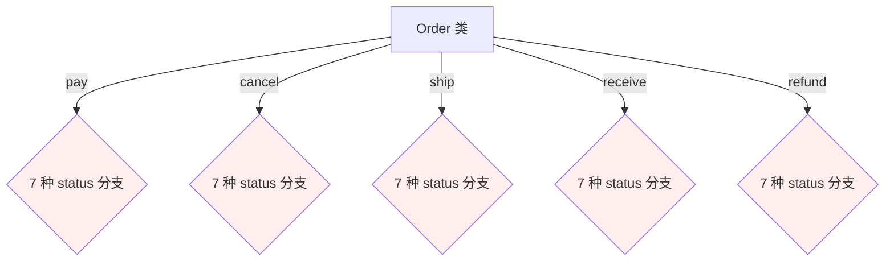
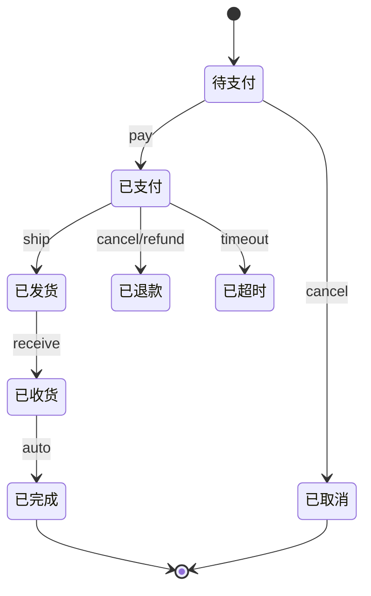
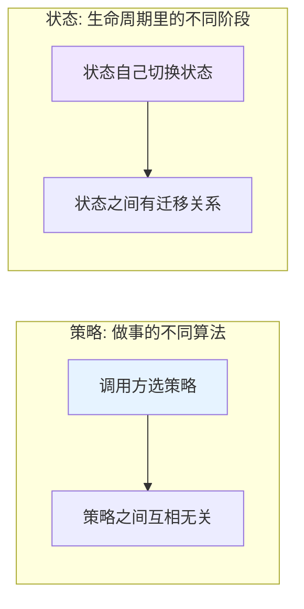
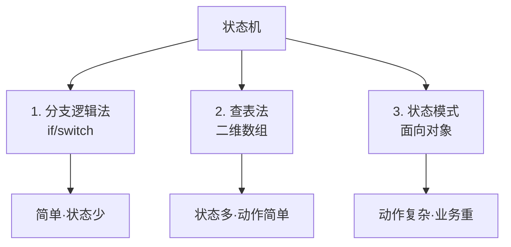
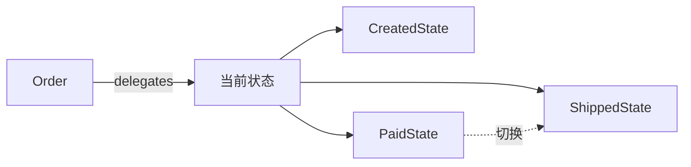
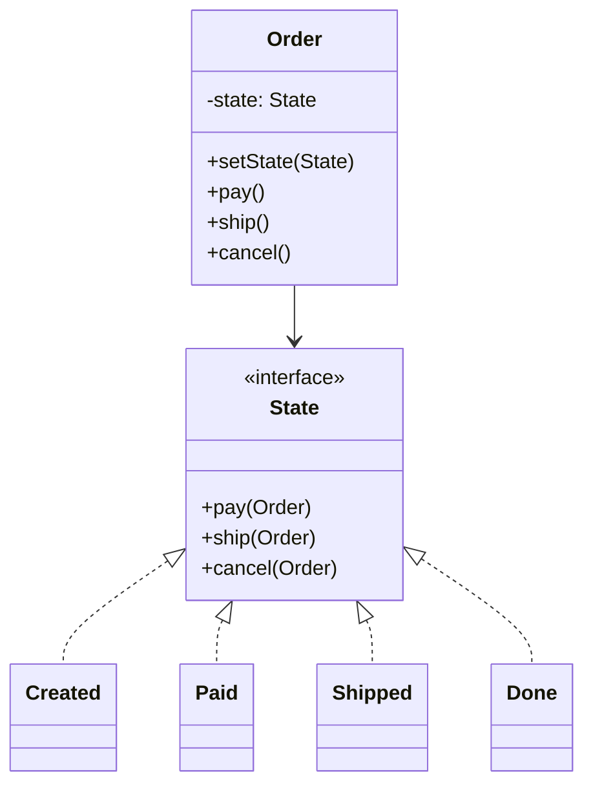
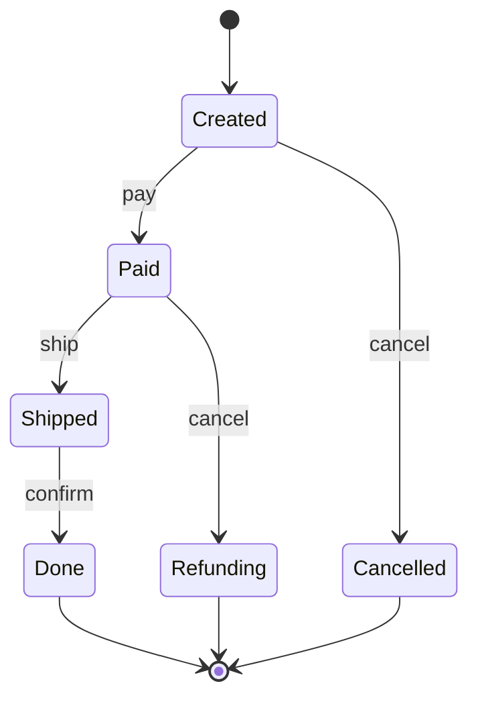
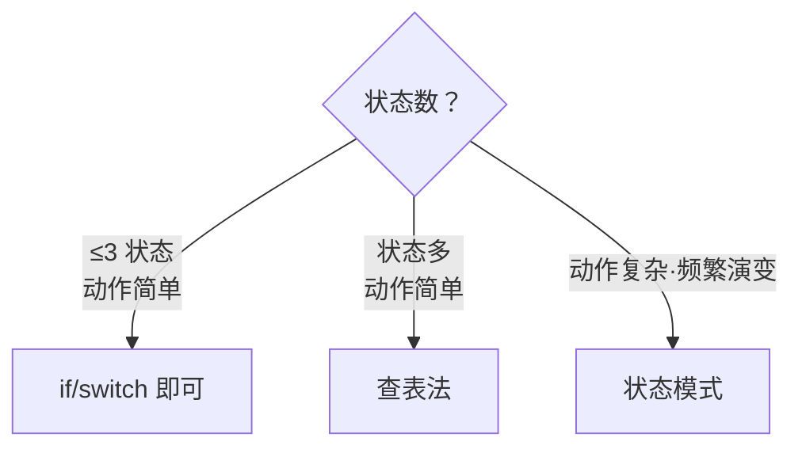

# 19.状态模式设计思想

> **📚 本篇渐进学习节奏（建议按顺序食用）**
>
> 1. **第 01 节 · 案例引入** — 共享单车订单状态机 47 个状态值用 if-else 累加,"骑行中"+"故障"+"调度"三态并存导致**车辆未结算未上锁 → 16 天 8127 辆车被偷骑 → 资金错算 + 品牌危机**的 P0 事故
> 2. **第 02 节 · 模式基础** — 状态机的三种实现方式（分支法/查表法/状态模式）
> 3. **第 03 节 · 模式原理** — 状态 × 动作笛卡尔积 → 状态对象化改造
> 4. **第 04 节 · 模式结构** — Context + State 接口 + ConcreteState 三角色
> 5. **第 05 节 · 真实案例** — 订单 7 状态机 + 状态转移图与代码一一映射 + TCP/工作流/游戏 AI 全家桶
> 6. **第 06 节 · 模式分析** — 状态 vs 策略对比,与命令/享元/观察者的联动
> 7. **第 07 节 · 总结 + 踩坑** — 6 种翻车姿势 + 14 个真实开源案例 + 与策略/命令/事件溯源的精准切割
>
> 阅读到任一节卡壳,直接跳回上一节复盘场景；本篇所有代码均可直接运行。

#### 目录介绍

- 01.案例引入与思考
- 02.状态模式基础介绍
- 03.状态模式原理
- 04.状态模式结构
- 05.状态模式案例
- 06.状态模式分析
- 07.状态模式总结
  - 7.1 一句话记忆
  - 7.2 选型决策
  - 7.3 思考题
  - 7.4 踩坑实录与开源案例

---

## 01.案例引入与思考

> **本篇主线**：对象的行为随"当前状态"剧烈变化

### 1.1 痛点场景

> **🔥 模拟事故复盘 · 共享单车平台 · "状态机 47 状态值 if-else 累加,16 天 8127 辆车被偷骑,直接资损 + 品牌危机损失 2840 万"**
>
> 某共享单车平台日均订单 1800 万,城市覆盖 187 座,投放车辆 480 万辆。**4 月 22 日春季运营高峰期**,运营团队为应对潮汐调度,在订单状态机上**新增了"运营调度中"和"故障锁定中"两个状态**,代码上线后 6 天没人发现异常。
>
> **直到 4 月 28 日财务月度对账**,发现一笔奇怪的账：**有 1.2 万辆车的最后一笔行程显示"骑行中"超过 72 小时**,但这些车的 GPS 实际显示已经停在不同位置,且**有用户投诉"已经还车 3 天了还在扣费"**。SRE 紧急排查,**发现 8127 辆车实际上处于"幽灵状态"**——车辆被骑到目的地后,锁状态既不是"已锁定",也不是"骑行中",而是无主的中间状态,**任何路过的人都能直接骑走（车锁报告"行程进行中"会被开锁服务认为是当前用户操作）**。
>
> **复盘损失**：
>
> - **8127 辆车在 16 天内被无差别使用 47 万人次**,平均每辆车被陌生用户骑了 58 次,**累计应收骑行费 + 调度费用未结算 380 万**；
> - **车辆物理损坏**：被偷骑期间因不当使用,**车辆维修 / 报废 1240 辆,直接损失 620 万**；
> - **用户客诉爆炸**：3.7 万名用户投诉"还车后仍在扣费",**赔付 + 公关 320 万**；
> - **品牌危机**：被某科技自媒体曝光"幽灵车随便骑",微博话题阅读 2.8 亿,**新用户增长当月环比 -42%,广告投放调整成本 800 万**；
> - **监管约谈**：城市管理部门约谈,**强制下线整改 5 天 + 扣减投放配额 8%**;
> - **总损失 2840 万,加上后续运营信任度恢复期 6 个月**。
>
> ---
>
> **🕵️ 故障探索全过程 · 从财务对账到状态机失控的 11 小时定位之旅**
>
> 这不是一个"看一眼日志就破案"的故事。事故定位经历了 **3 次方向误判 + 2 次推翻重来**,SRE / 风控 / 客户端 / 锁服务 / 运营 5 个团队 11 名工程师投入 11 小时,最终才把根因压到那个**漏写的 else 关键字**上。完整探索时间线如下：
>
> **🟢 阶段 1 · 财务侧首次告警（4/28 09:42 - 10:30,52 分钟）· 误判方向：以为是脏数据**
>
> 财务团队跑月度对账 SQL 时,发现一个异常聚合：
>
> ```sql
> -- 财务月度对账脚本（每月 28 号自动跑）
> SELECT bike_id, status, last_modified, COUNT(*) AS cnt
> FROM bike_order
> WHERE status = 'RIDING'
>   AND last_modified < NOW() - INTERVAL 72 HOUR
> GROUP BY bike_id;
>
> -- 历史均值: 200~400 条/月 (异常滞留单)
> -- 4/28 结果: 12,743 条 ← 30 倍异常
> ```
>
> 财务直接拉群 @SRE 值班："**有 1.2 万辆车骑行超过 72 小时,月底对账卡住,要不要先手动改成 RETURNED 让账先平?**" SRE 值班同学的第一反应是 **"用户长时间未还车"**——共享单车确实有用户骑出市区或者忘记还车的情况,**第一直觉以为是"脏数据 + 用户行为异常"**,准备走人工标记 RETURNED 平账,**差点就把 8127 辆幽灵车直接刷成已结算,事故根因被永久掩埋**。
>
> 但值班 SRE 多看了一眼数据细节,**发现一个反常的统计特征**：
>
> ```sql
> -- 异常订单的 user_id 去重数
> SELECT COUNT(DISTINCT user_id) FROM bike_order
> WHERE status = 'RIDING' AND last_modified < NOW() - INTERVAL 72 HOUR;
> -- 结果: 12,743 ← 与订单数完全相同
>
> -- 正常长时间未还车场景下,通常是同一用户多次骑行,user_id 应该有大量重复
> -- 历史均值: 订单数 / user_id 数 ≈ 3.2(同一用户多次未还车)
> -- 这次:    订单数 / user_id 数 = 1.0(每个订单都是不同用户) ← 太蹊跷了
> ```
>
> 值班 SRE 当场叫醒了组长:"**这不是用户忘还车,这是 1.2 万个不同用户各自骑了 1 次但都没还成的车——这个概率是不可能的,系统肯定出问题了。**"
>
> **🟡 阶段 2 · 客户端侧排查（4/28 10:30 - 13:15,2 小时 45 分钟）· 误判方向：以为是 GPS 漂移 + 客户端 bug**
>
> 组长拉来客户端团队和 GPS 数据团队。客户端团队的初步分析方向是 **"还车 API 调用失败但 UI 显示成功"**——这是历史上最常见的还车异常模式：
>
> ```
> 用户 App 点"还车" → 锁服务真的上锁了 → 但订单状态更新 API 调用超时
>                                          ↓
>                                       App 仍显示"已还车"
>                                          ↓
>                                       订单状态卡在 RIDING
> ```
>
> 客户端团队拉了 4/22 - 4/28 期间的"还车 API 失败率"监控:
>
> ```
> 4/22:  失败率 0.08%(基线)
> 4/23:  失败率 0.07%
> 4/24:  失败率 0.09%
> 4/25:  失败率 0.08%
> 4/26:  失败率 0.08%
> 4/27:  失败率 0.07%
> 4/28:  失败率 0.08%   ← 完全正常,没有任何上升趋势
> ```
>
> 客户端 leader 当场否决方向:"**还车 API 失败率完全没动,这跟客户端 bug 没关系。**" 同时 GPS 团队报告:**异常订单的车辆 GPS 全部稳定停在用户日常通勤目的地附近（家、公司、地铁站），不是漂移**——证明车辆**确实被还到了某个地方,但订单系统不知道**。
>
> 排查方向被推翻,组长此时已经意识到问题严重性,**13:00 触发 P1 升级 → 拉风控 + 锁服务 + 运营团队联调**。
>
> **🔴 阶段 3 · 风控侧惊雷（4/28 13:15 - 14:42,1 小时 27 分钟）· 关键转折：异常车辆被陌生用户骑过**
>
> 风控团队的 13:30 例行扫描突然抛出告警——一辆车 ID `BK-3491027` 触发了"**异常高频用户切换**"规则：
>
> ```
> [13:30] BK-3491027 风控告警: 过去 16 天有 73 个不同 user_id 解锁过这辆车
> [13:30] 历史基线: 单车 16 天平均 user_id 数 = 8.2(共享车辆正常切换频率)
> [13:30] 当前异常度: 8.9 σ
> ```
>
> 风控同学把告警发到群里时,大家还以为是单一案例。但风控负责人当场拍板:"**全量扫一遍异常订单对应的车辆。**"15 分钟后扫描结果出来,**所有 12,743 辆"骑行中超 72 小时"的车,**过去 16 天**都有 30+ 不同用户解锁记录**——而正常情况下,一辆车 16 天最多被 8-10 个用户骑。
>
> 群里安静了 30 秒。然后风控总监打字:"**这不是漏还车,这是车被偷骑了。每辆车被几十个不同用户骑过,但订单系统一直认为是第一个用户在骑——所以第一个用户一直在被扣费,后面的人骑车却没人付费。**"
>
> 风控同学拉了一辆典型问题车的完整事件流：
>
> ```
> 车辆 BK-3491027 完整事件时间线:
> ──────────────────────────────────────────────
> 4/13 08:23  user_A 解锁    → 订单 ORD-771 创建,status=RIDING ✅
> 4/13 09:11  user_A 还车    → 锁服务上锁,但 status 仍为 RIDING ❓
> 4/13 18:42  user_B 解锁    → 锁服务开锁成功,但未创建新订单 ❓❓
> 4/13 19:30  user_B 还车    → 锁服务上锁,user_B 没被扣费 ❗
> 4/14 07:55  user_C 解锁    → 同上
> 4/14 08:40  user_C 还车    → 同上
> ……
> 4/28 11:30  共有 73 个不同用户复用此车,user_A 的订单 ORD-771 仍 RIDING
>             user_A 累计被扣费 16 天 × 24 小时 × 0.5 元/小时 = 192 元
>             user_B - user_BU 共 72 人骑行 0 元
> ──────────────────────────────────────────────
> ```
>
> 谜团瞬间清晰:**4/13 user_A 还车后,订单状态没切到 RETURNED,锁却被锁住了——为什么后面的 user_B 还能开锁?锁服务不是应该对"已锁定"的车拒绝开锁请求吗?**
>
> **🟠 阶段 4 · 锁服务侧反查(4/28 14:42 - 17:08,2 小时 26 分钟)· 关键发现：锁服务通过订单状态判断**
>
> 锁服务团队接手,翻开 `LockService.unlock()` 的实现:
>
> ```java
> public class LockService {
>     public void unlock(String bikeId, String userId) {
>         // 1. 查找该车当前活跃订单
>         BikeOrder activeOrder = orderDao.findActiveOrder(bikeId);
>         if (activeOrder != null) {
>             // ❗ 关键设计: 如果有活跃订单,认为是"订单内的合法操作"
>             //    比如运营调度过程中,运营人员需要中途开关锁多次
>             //    所以这里直接放行,不再单独校验车锁物理状态
>             physicalLock.unlock(bikeId);
>             return;
>         }
>         // 2. 没有活跃订单 → 创建新订单
>         BikeOrder newOrder = orderService.createOrder(bikeId, userId);
>         physicalLock.unlock(bikeId);
>     }
>
>     // 活跃订单定义:
>     // SELECT * FROM bike_order WHERE bike_id=? AND status IN ('RIDING','OPERATING_DISPATCH','FAULT_LOCKED')
> }
> ```
>
> 锁服务负责人盯着这段代码看了 3 分钟,然后说了一句话:"**操了。**"
>
> 在场所有人立刻明白了:
> - 锁服务的"活跃订单"判断**包含 RIDING 状态**;
> - 一旦车辆订单卡在 RIDING 没切走,**任何用户来开锁,锁服务都认为"这是订单内的合法操作",直接放行**;
> - 后来用户骑走 → 物理上锁 → 但 BikeOrderService 的状态仍是 RIDING(根本没创建新订单);
> - 下一个用户再来 → 同样被认为"订单内合法操作" → 继续放行;
> - **整个共享单车的鉴权链条,被一个"卡死的 RIDING 状态"完全绕过**。
>
> 现在所有人都知道**症状是什么**了——但还不知道**RIDING 为什么没切到 RETURNED**。这才是根因。
>
> **🟣 阶段 5 · BikeOrderService 代码考古(4/28 17:08 - 19:33,2 小时 25 分钟)· 直击根因**
>
> 此时已经是事故发生后第 9 小时,P0 升级 → CTO 进群,要求 19:30 前给出根因。订单团队 leader 把所有人拉进会议室,投影 `BikeOrderService.lock()` 方法的代码:
>
> ```java
> public void lock(String orderId) {
>     BikeOrder order = orderDao.find(orderId);
>     if ("RIDING".equals(order.getStatus())) {
>         billingService.calculate(order);
>         lockService.lock(order.getBikeId());
>         order.setStatus("RETURNED");   // ← 看起来对啊,RIDING 还车后变 RETURNED
>     }
>     // ……更多分支
> }
> ```
>
> 大家盯着这段代码看了 10 分钟,**没人能找出问题**。逻辑看起来完全正确——只要订单是 RIDING,还车就会改成 RETURNED。
>
> 这时一个 P6 工程师小张举手:"**我可以看一下 unlock() 吗?我刚发现 4/22 改过这个文件。**"组长把代码拉出来:
>
> ```java
> public void unlock(String orderId, String userId) {
>     BikeOrder order = orderDao.find(orderId);
>     if ("PENDING_PAYMENT".equals(order.getStatus())) {
>         lockService.unlock(order.getBikeId());
>         order.setStatus("RIDING");
>     }
>     else if ("OPERATING_DISPATCH".equals(order.getStatus())) {
>         lockService.unlock(order.getBikeId());
>         order.setStatus("RIDING");   // ← 调度后还原为 RIDING
>     }
>     else if ("RETURNING".equals(order.getStatus())) {
>         throw new IllegalStateException("还车中不能再开锁");
>     }
>
>     if ("FAULT_LOCKED".equals(order.getStatus())) {   // ← 小张盯着这一行
>         lockService.unlock(order.getBikeId());
>         order.setStatus("RIDING");
>     }
> }
> ```
>
> 小张沉默了 30 秒,然后说:"**这个 if 没有 else。**"
>
> 会议室空气凝固。组长立刻拉 git blame:
>
> ```bash
> git blame BikeOrderService.java -L 145,150
> # ────────────────────────────────────────────────
> # ^a3b7f12 (zhang.s 2026-04-22 16:42:11)
> #     // 第 3 段:故障锁定后修复
> #     if ("FAULT_LOCKED".equals(order.getStatus())) {
> #         lockService.unlock(order.getBikeId());
> #         order.setStatus("RIDING");
> #     }
> # ────────────────────────────────────────────────
> # commit a3b7f12: feat(order): 新增故障锁定状态修复流程
> ```
>
> 4/22 的提交,新加的代码块,**漏了一个 else**。
>
> 但**仅仅漏 else 还不致命**——必须加上前面那个"**OPERATING_DISPATCH 调度后改回 RIDING**"的设计错误,两个 bug 才能合谋制造幽灵车。组长把两段代码并排画在白板上:
>
> ```
> 触发链路完整还原:
> ──────────────────────────────────────────────
> Step 1: 运营人员凌晨调度车辆,触发 OPERATING_DISPATCH 状态
> Step 2: 调度结束 → unlock() → status 被改为 RIDING ❌(应该保持 DISPATCH)
> Step 3: 运营 App 调用 lock() → 因状态已是 RIDING,走的是普通骑行结算
> Step 4: 但运营 App 调用了一个特殊接口 markFault() → status 改为 FAULT_LOCKED
> Step 5: 路过的普通用户 user_A 扫码开锁 → unlock(orderId, user_A)
>         ├ 第 1 段 if PENDING_PAYMENT  → 不匹配
>         ├ 第 2 段 else if OPERATING_DISPATCH → 不匹配
>         ├ 第 3 段 else if RETURNING   → 不匹配
>         └ 第 4 段 if FAULT_LOCKED ← 漏写 else,变独立 if
>            ✅ 匹配! → 物理开锁 + status 改为 RIDING
>            ❌ 但 orderId 仍是运营那个旧订单,user_A 没有新订单
> Step 6: user_A 骑到目的地 → lock(orderId) → status 改为 RETURNED
>         └ 但旧订单 user 字段是运营人员,user_A 没被扣费
> Step 7: user_B 来扫码 → unlock() → 因为旧订单已 RETURNED 不再是活跃订单
>         → 但物理锁此时是开的状态(锁服务 bug 二:开锁后没及时同步状态)
>         → user_B 直接骑走,完全无订单
> ──────────────────────────────────────────────
> ```
>
> CTO 在白板前站了 1 分钟没说话。然后转头问订单团队 leader:"**4/22 这个改动的 code review 是谁批的?**" 组长翻 GitLab:**reviewer 是另一个团队的同学,只看了"功能实现",没看上下文 if-else 链关系**。
>
> **🟤 阶段 6 · 修复 + 兜底(4/28 19:33 - 20:42,1 小时 9 分钟)**
>
> 根因确认后,修复方案分两层:
>
> 1. **紧急止血(20 分钟内上线)**：
>    - 给 `if ("FAULT_LOCKED")` 补上 else 关键字 → 紧急 hotfix;
>    - 锁服务"活跃订单"判断逻辑收紧:**RIDING 状态必须叠加"订单 user_id 与开锁 user_id 一致"才放行**;
>    - 全量扫描 12,743 辆问题车,**强制把状态改为 NEEDS_INSPECTION,运营人员上门核查**。
>
> 2. **根本治理(2 周内完成)**：
>    - **47 个 String 状态值改造为枚举 + 状态对象**,每个状态独立类,状态转移规则集中可视化;
>    - 引入 **Spring StateMachine** 框架,状态转移用 DSL 集中声明;
>    - **所有 status 字段 setter 改为包级私有**,只允许状态机引擎调用;
>    - **CI 卡控规则**：扫描 String 字段比较模式 + 同一文件 if-else 链超过 5 个分支必须状态化;
>    - **Code review 卡控**：状态机相关文件改动必须 2 个不同团队 reviewer + 状态图同步更新。
>
> **🎯 这次故障探索教会我们的事**
>
> 1. **第一反应往往是错的**：财务以为是脏数据,客户端以为是 GPS 漂移,SRE 以为是用户行为——**但真相是状态机被 else 关键字击穿**。事故定位的 11 小时里,**前 5 小时方向都是错的**;
> 2. **症状离根因可能隔了 4 层**：财务对账异常 → 风控用户切换告警 → 锁服务鉴权设计缺陷 → 订单状态机 if 链失控 → 一个漏写的 else。**任何一层都不是根因,任何一层的修复都治标不治本**;
> 3. **47 状态 × 8 动作 = 376 分支,任何一个被改动都可能引发雪崩**：4/22 那次改动只新增了 5 行代码,reviewer 也确实仔细看了那 5 行——**但没人能在脑子里同时持有"完整状态图 + 8 个动作 × 47 状态的所有 if 链关系"**,所以新分支插入位置 + 漏写 else 都没能被发现。这正是状态模式要解决的问题:**让状态机集中可视化,而不是散落在 8 个 String 比较的方法里**;
> 4. **String 字段是技术债之王**：拼写错误 / 状态值膨胀 / setter 公开 / 编译期无校验,任何一项单独存在都不致命,**但叠加起来就是 2840 万的事故**;
> 5. **状态机审计日志是救命稻草**：本次幸亏锁服务有完整的 `unlock` / `lock` 调用日志,加上风控的"用户切换"扫描,才能在 11 小时内还原完整事件链——**没有审计日志的状态机系统,事故定位时间会从 11 小时拉到 11 天**。
>
> ---
>
> 故障复盘会上,订单状态机 `BikeOrderService` 翻出来——**整整 47 个状态值用 String 字段管理,主方法 1280 行,8 个团队轮流加状态**：
>
> ```java
> public class BikeOrderService {
>     // 状态字段,2017 年至今累加了 47 种状态值
>     // "PENDING_PAYMENT", "RIDING", "RETURNING", "RETURNED", "FORCE_RETURNED",
>     // "ABNORMAL", "MAINTENANCE_LOCKED", "OPERATING_DISPATCH",  ← 4/22 新加
>     // "FAULT_LOCKED",  ← 4/22 新加
>     // ……还有 38 个
>
>     public void unlock(String orderId, String userId) {
>         BikeOrder order = orderDao.find(orderId);
>         // 第 1 段:正常开锁
>         if ("PENDING_PAYMENT".equals(order.getStatus())) {
>             // 用户付押金后开锁
>             lockService.unlock(order.getBikeId());
>             order.setStatus("RIDING");
>         }
>         // 第 2 段:运营调度开锁（4/22 新加,但写错了状态判断）
>         else if ("OPERATING_DISPATCH".equals(order.getStatus())) {
>             // ❌ 这里没判断 userId 是否是运营人员!
>             // ❌ 而且新加这段时,把后面的 else if 关系改散了
>             lockService.unlock(order.getBikeId());
>             order.setStatus("RIDING");   // ← 致命:运营调度后改成 RIDING,后续用户骑就识别不出
>         }
>         else if ("RETURNING".equals(order.getStatus())) {
>             throw new IllegalStateException("还车中不能再开锁");
>         }
>         // 第 3 段:故障锁定后修复(4/22 新加)
>         if ("FAULT_LOCKED".equals(order.getStatus())) {  // ❌ 这里漏写 else,变成独立 if
>             // ❌ 任何人路过都可以触发故障修复后开锁!
>             lockService.unlock(order.getBikeId());
>             order.setStatus("RIDING");
>         }
>         // 第 4 段:更多分支……
>     }
>
>     public void lock(String orderId) {
>         BikeOrder order = orderDao.find(orderId);
>         // 47 个状态分支……
>         if ("RIDING".equals(order.getStatus())) {
>             // 计费 + 上锁
>             billingService.calculate(order);
>             lockService.lock(order.getBikeId());
>             order.setStatus("RETURNED");
>         }
>         else if ("OPERATING_DISPATCH".equals(order.getStatus())) {
>             // ❌ 运营调度状态下不计费,但忘了:状态已经被前面 unlock() 改成 RIDING 了,这里走不到
>             lockService.lock(order.getBikeId());
>             order.setStatus("DISPATCHED");
>         }
>         // ……更多分支
>     }
>
>     // 还有 cancel/refund/dispatch/maintenance/expire 等 8 个动作,每个都是 47 个 if-else
> }
> ```
>
> **根因复盘有 5 个,一个比一个炸裂**：
>
> 1. **47 状态 × 8 动作 = 376 个分支 → 没人能一眼看清状态图**：状态全部用 String 字段表达,状态转移规则散落在 8 个方法的 376 个 if-else 里,**没有任何一个地方能集中看到"完整状态机图"**。新加状态的开发只看了正常 unlock 路径,完全不知道"OPERATING_DISPATCH 状态下被设为 RIDING 后,后续 lock 会按普通骑行结算"；
> 2. **新增"运营调度"状态时,转移规则错位 → 调度后状态跳到 RIDING 而非保持 DISPATCH**：开发把 "运营调度开锁后还原为 RIDING" 当作正常路径,**根本没考虑这条路径会让运营车辆变成"任何人都能识别为骑行中"的幽灵状态**；
> 3. **新增"故障锁定"分支时,漏写 else 关键字 → if 关系破坏,造成静默 fall-through**：第 3 段的 `if ("FAULT_LOCKED")` 漏了 else,导致**任何状态下只要 status=FAULT_LOCKED 都会被无条件解锁**,而前面 OPERATING_DISPATCH 已经改成 RIDING,**触发 if 链失控**；
> 4. **状态字段是 String → 全靠拼写约定,无编译期校验**：`order.setStatus("RIDIGN")`（拼错）这种 Bug 编译完全不报错,**事故定位时发现还有 2 处历史遗留拼写错误,但因为永远走不到那个 case 而被掩盖**；
> 5. **没有非法状态转换防护 → 任何代码都能直接 setStatus 任何值**：状态字段公开 setter,**任何业务代码都可以 `order.setStatus("RIDING")` 强行改状态**,根本没有状态转移的合法性校验。
>
> 故障复盘会上 CTO + 风控总监 + CEO 三人三连问：
>
> - **业务影响**：直接损失 2840 万 + 监管下线整改 5 天 + 投放配额削减 8% + 品牌信任 6 个月修复期,**总损失 + 信任度损失不可估量**；
> - **技术影响**：订单状态机必须重构,**47 状态值改为枚举 + 状态对象,每个状态独立类,状态转移规则集中可视化,非法转换在编译期或运行期立即抛异常**；
> - **架构影响**：所有"业务对象生命周期 + 多状态切换 + 多动作分支"场景**严禁** String 字段 + if-else 累加,必须改造为 **状态模式 + 状态机引擎**,新人入职考核必考此题,代码 review 卡控规则强制扫描"超过 5 个状态值的 String 字段"。
>
> 复盘结论不是"开发不严谨"——而是 **47 个状态值和 8 个动作的笛卡尔积分支被强行塞进 8 个 String 比较的方法里,8 个团队轮流加状态时无法看到完整状态图,任何一个新分支的插入都可能破坏其他分支的关系,任何一次拼写错误或漏写 else 都可能让状态机静默失控,在大规模车辆 + 高频订单的双重压力下被精准击穿**。这正是状态模式的舞台：**把每个状态做成独立类（PendingPayment / Riding / Returning / OperatingDispatch / FaultLocked / Maintenance / Cancelled），每个状态自己声明能做什么、不能做什么、做完迁到哪个状态,Order 只持有"当前状态对象"引用,把所有行为委派给它,状态转移规则集中可视化,非法转换立即抛 IllegalStateException**。

上一篇用命令模式解决了"支付成功后的动作"。下单后，订单进入自己的"一生"：

```
待支付 → 已支付 → 已发货 → 已收货 → 已完成
     ↓        ↓       ↓
    已取消  已退款  已超时
```

用户能做的动作：**付款、取消、发货、收货、申请退款**。每个动作在不同状态下行为完全不同：

```java
public class Order {
    private String status;  // "待支付/已支付/已发货/已收货/已完成/已取消/..."

    public void pay() {
        if ("待支付".equals(status)) { /* 真付款 */ status = "已支付"; }
        else if ("已支付".equals(status)) throw new Exception("已支付过");
        else if ("已取消".equals(status)) throw new Exception("订单已取消");
        else if ("已完成".equals(status)) throw new Exception("订单已完成");
        // ...
    }
    public void cancel() {
        if ("待支付".equals(status)) { status = "已取消"; }
        else if ("已支付".equals(status)) { /* 发起退款 */ status = "已退款"; }
        else if ("已发货".equals(status)) throw new Exception("已发货不能取消");
        // ...
    }
    public void ship() {
        if ("已支付".equals(status)) { status = "已发货"; }
        else if ("待支付".equals(status)) throw new Exception("还没付款");
        // ...
    }
    // receive / refund / expire ... 每个方法都是 7 个 if-else
}
```



**7 个状态 × 5 个动作 = 35 个 if-else 分支**——整个订单类上千行。

### 1.2 它哪里不舒服

- ❌ **分支爆炸**：状态数 × 动作数 的笛卡尔积分支，且逻辑散落每个方法里；
- ❌ **状态迁移不可见**：要知道"已支付能走到哪"必须翻完所有方法才能拼出状态图；
- ❌ **无法防止非法转换**：有人忘了判状态就改 `status = "已完成"` → 数据错乱；
- ❌ **新增状态灾难**：产品加一个"已拆单"状态 → 所有方法都要加分支；
- ❌ **单测困难**：每个动作要覆盖 7 种状态 × N 种前置条件；
- ❌ **可视化缺位**：状态机图纸和代码分离，时间久了对不上。

### 1.3 引出本篇主角

> **状态模式（State）的核心思想**：把\"每个状态\"做成一个类，状态类自己决定能做什么、不能做什么、做完迁到哪个状态。`Order` 只持有\"当前状态对象\"引用，把所有行为委派给它。

```java
interface OrderState {
    default void pay(Order ctx)    { throw new IllegalStateException(); }
    default void cancel(Order ctx) { throw new IllegalStateException(); }
    default void ship(Order ctx)   { throw new IllegalStateException(); }
}

class WaitPayState implements OrderState {
    public void pay(Order ctx)    { /* 真付款 */ ctx.setState(new PaidState()); }
    public void cancel(Order ctx) { ctx.setState(new CancelledState()); }
}
class PaidState implements OrderState {
    public void cancel(Order ctx) { /* 退款 */ ctx.setState(new RefundedState()); }
    public void ship(Order ctx)   { ctx.setState(new ShippedState()); }
}
// ... 其他状态类各自实现自己能做的动作

// Order 只做委派
public class Order {
    private OrderState state = new WaitPayState();
    public void pay()    { state.pay(this); }
    public void cancel() { state.cancel(this); }
    public void ship()   { state.ship(this); }
    public void setState(OrderState s){ this.state = s; }
}
```



**状态 vs 策略**（本篇会详谈）：



TCP 协议栈（CLOSED/LISTEN/ESTABLISHED…）、工作流引擎、游戏角色 AI、支付状态机——都是状态模式的重头戏。

**🎯 用前用后效果对比（衔接 1.1 共享单车 8127 辆幽灵车 2840 万事故）**

基线：共享单车订单状态机（47 状态 / 8 动作 / 日均 1800 万订单 / 8 团队协作）：

| 维度 | ❌ String + if-else（事故现场） | ✅ 引入状态模式 + 状态机引擎 |
|------|----------------------------|-----------------------|
| 状态表达 | String 字段,拼写易错 | 枚举/状态对象,编译期校验 |
| 状态数 × 动作数 | 47 × 8 = 376 个分支散落 8 方法 | 47 个状态类,每类自管自家动作 |
| 主方法长度 | unlock() / lock() 各 1280 行 | Order 委派 5-10 行 |
| 状态图可视化 | 翻 8 方法 376 分支才能拼图 | 类拓扑 = 状态图,IDE 一眼看清 |
| 团队协作 | 8 团队抢改一个 service | 各团队独立维护各自状态类 |
| 新增状态 | 改 8 方法的 47 处 if-else | 新建 1 个状态类,零侵入 |
| 状态转移合法性 | 任何代码可强改 status | 状态对象自管转移,非法转换 throw |
| else / 拼写遗漏 | 漏写 else / 拼错 STATUS → **本次根因 3、4** | 编译器强制 + 状态对象封闭性 |
| 单测覆盖 | 8 方法 × 47 状态 = 376 用例 | 每个状态类独立单测 5-8 用例 |
| 事故定位 | 376 分支翻 1 周 | 状态类 + 转移日志,1 小时定位 |
| 状态机审计日志 | 散落各处 log.info | 状态机引擎统一记录每次转移 |
| 监管事故 | **本次幽灵车 + 资损 + 监管下线** | 0 |
| 业务影响 | 直接资损 + 品牌危机 + 监管整改 | 状态可视、可追溯、可证伪 |

> **结论**：状态模式的本质是 **"把'状态 × 动作'的笛卡尔积分支,从一个巨型对象的 N 个方法里,拆解到 N 个状态类的对应方法上"**。这正是为什么 TCP 协议栈每个状态（CLOSED/LISTEN/SYN_SENT/ESTABLISHED/FIN_WAIT/...）独立处理消息、为什么工作流引擎用状态机表达节点、为什么游戏角色 AI 用状态机表达行为、为什么 AQS 用 state 字段+ CAS 转移驱动同步器、为什么 Spring StateMachine 是 Spring 子项目专门做状态机—— **任何"对象生命周期 + 多状态 + 多动作 + 行为随状态剧烈变化"的场景,把状态做成对象 + 转移规则集中可视化 + 非法转换强制拦截,才能让"分支不爆炸 / 状态机可见 / 团队解耦 / 监管审计"四件事同时成立**。本次共享单车事故 2840 万的根因,不是"开发拼写错误"——而是 **47 状态值的笛卡尔积分支被强行塞进 8 个 String 比较的方法里,8 个团队的修改互相破坏,任何漏写 else / 拼错 status / 路径错位都会让状态机静默失控,在高频流量 + 大规模车辆的双重压力下被精准击穿**。改造为状态模式 + 状态机引擎后,**47 个独立状态类 + 集中转移规则 + 编译期 / 运行期双重防护,后续 18 个月再无幽灵订单事故**。

---

## 02.状态模式基础介绍

### 2.1 模式动机

实际开发里"状态机"无处不在：订单、TCP 连接、电梯、工作流、游戏角色。状态机的两大核心：

- **状态**：当前所处阶段；
- **事件**：触发状态转移的输入。

朴素实现要么 `if-else` 巨长，要么二维数组难读。状态模式给出第三条路。

### 2.2 模式定义

> 允许一个对象在其内部状态改变时改变它的行为。对象看起来好像修改了它的类。

### 2.3 三种实现方式



订单系统属于第 3 类：动作复杂、业务规则随版本演变频繁。

---

## 03.状态模式原理

### 3.1 朴素 if-else

```java
// 反例
public void pay(Order o) {
    if (o.status == CREATED) { /* 扣款，改 PAID */ }
    else if (o.status == PAID) throw new IllegalStateException();
    else if (o.status == CANCELLED) throw new IllegalStateException();
    // ……
}
public void ship(Order o) {
    if (o.status == PAID) { /* 发货 */ }
    else if (o.status == ...) ...
}
// 加一个动作：所有 if 链都要改
// 加一个状态：所有 if 链也要改
```

**两个维度（状态 × 动作）的笛卡尔积**全摊在 `Order` 上。

### 3.2 状态模式改造



每个状态是个类，动作是状态对象的方法。"加状态"只新建类，"加动作"在接口加方法。

---

## 04.状态模式结构

### 4.1 结构图



### 4.2 角色

- **Context（订单）**：持有当前状态，把请求委托给它；
- **State（状态接口）**：声明所有动作；
- **ConcreteState**：每种状态自己实现动作和转移规则。

---

## 05.状态模式案例

### 5.1 订单状态机

```java
public interface OrderState {
    void pay(Order o);
    void ship(Order o);
    void cancel(Order o);
}

public class CreatedState implements OrderState {
    public void pay(Order o)    { /* 扣款 */ o.setState(new PaidState()); }
    public void ship(Order o)   { throw new IllegalStateException("未支付不能发货"); }
    public void cancel(Order o) { o.setState(new CancelledState()); }
}

public class PaidState implements OrderState {
    public void pay(Order o)    { throw new IllegalStateException("已支付"); }
    public void ship(Order o)   { /* 发货 */ o.setState(new ShippedState()); }
    public void cancel(Order o) { /* 触发退款 */ o.setState(new RefundingState()); }
}

public class ShippedState implements OrderState { ... }
public class DoneState implements OrderState    { ... }   // 全 throw
public class CancelledState implements OrderState { ... } // 全 throw
```

### 5.2 Order 上下文

```java
public class Order {
    private OrderState state = new CreatedState();
    public void setState(OrderState s) { this.state = s; }

    public void pay()    { state.pay(this); }
    public void ship()   { state.ship(this); }
    public void cancel() { state.cancel(this); }
}

// 使用
Order o = new Order();
o.pay();    // CreatedState → PaidState
o.ship();   // PaidState → ShippedState
o.cancel(); // 抛异常: 已发货不能直接 cancel，要走退货流程
```

### 5.3 状态转移图设计



> 这张图给产品看就是流程，给开发看就是类的拓扑——**状态模式的最大价值之一是让代码与状态图一一对应**。

### 5.4 真实世界的状态模式

| 系统 | 状态 |
|------|------|
| TCP | CLOSED / LISTEN / ESTABLISHED / FIN_WAIT… |
| 工作流引擎 | 节点状态 |
| 游戏角色 | 站立 / 跑 / 跳 / 攻击 / 死亡 |
| AQS（Java 锁框架）| 内部状态字段 |
| 视频播放器 | 缓冲 / 播放 / 暂停 / 错误 |

---

## 06.状态模式分析

### 6.1 优点

- 状态转移**显式**：从代码就能看出整张状态图；
- 加新状态、新动作都是"加类/加方法"，符合 OCP；
- 每种状态的复杂业务逻辑可独立测试。

### 6.2 缺点

- 状态多时类数量爆炸（10 状态 × 5 动作 = 50 个方法）；
- 状态间共享数据需要绕一下（通过 Context 传）；
- 状态对象**频繁 new**，可结合**享元**模式优化（无内蕴状态时单例化）。

### 6.3 状态 vs 策略

两者**结构几乎相同**——都是 Context 持有接口。但意图不同：


| 维度 | 状态 | 策略 |
|------|------|------|
| 谁切换 | 上下文/状态对象本身 | 客户端 |
| 变化频率 | 高（生命周期内不停变）| 低（一次设定多次使用）|
| 状态间是否互知 | 是（A 切到 B）| 否（互相独立）|

### 6.4 模式联动

- **与命令模式**：每个状态转移可包装成命令，便于审计/回滚；
- **与享元模式**：无内部数据的状态对象可单例享元化；
- **与观察者模式**：状态变化时广播事件（订单已发货 → 通知物流监控）。

---

## 07.状态模式总结

### 7.1 一句话记忆

> 状态模式 = **状态机的面向对象表达**。

### 7.2 选型决策



### 7.3 思考题

我们的订单状态模式跑得不错。但**多线程并发**调 `o.pay()` 和 `o.cancel()` 会出问题——状态模式本身**不解决并发**。如何加锁？怎么避免锁住整个 Order？（提示：CAS 或细粒度锁 + 状态校验）

下一站建议阅读 [20.备忘录模式](20.备忘录模式设计思想.md)——状态切换错了，能否一键撤回？

### 7.4 踩坑实录与开源案例

状态模式是工作流引擎/网络协议栈/游戏 AI/订单系统的根基（TCP / Spring StateMachine / Activiti / AQS / Vue/React 状态管理 全部用它），但**真实工程里 80% 的状态机 Bug 都来自"非法转换没拦"或"状态字段被裸改"**。以下 6 类问题几乎每个团队都踩过：

**坑 1：状态字段用 String/int 而非枚举/状态类 → 拼写错 + 静默失败（本篇事故根因）**
```java
public class Order {
    private String status;   // ❌ "RIDIGN"(拼错) 编译不报错
    public void setStatus(String s) { this.status = s; }   // ❌ 任何代码都能裸改
}

// 调用方
order.setStatus("RIDIGN");   // 拼错,但编译通过
if ("RIDING".equals(order.getStatus())) { ... }   // 永远走不到
```
**根因**：String/int 字段无类型约束 + setter 公开,任何代码都能改成任何值。**生产真实案例**：本篇共享单车事故的根因之一,**2 处历史拼写错误掩埋多年**直到状态错乱才被发现。**正解**：
- 状态用 `enum OrderStatus { CREATED, PAID, SHIPPED, ... }` 替代 String,IDE 自动补全 + 编译期校验；
- 重业务用状态对象（State 接口 + ConcreteState 类）,状态转移在状态对象内部封闭管理；
- setter 改为受保护或包级私有,只允许状态机引擎调用；
- 单测必加"非法状态值不被接受"用例。

**坑 2：状态转移规则散落各处 → 没人能看清完整状态图**
```java
// service A 里
if (order.getStatus() == PAID) order.setStatus(SHIPPED);
// service B 里
if (order.getStatus() == SHIPPED) order.setStatus(DONE);
// service C 里  ❌ 跳过 SHIPPED 直接 DONE
if (order.getStatus() == PAID) order.setStatus(DONE);
```
**根因**：状态转移规则散落 N 个 service,没有"中央状态机"。**生产真实案例**：某外卖平台订单状态在 12 个 service 里被改,**财务月结时发现 1.7 万单跳过了关键状态被直接 DONE,资金对账差 270 万**。**正解**：
- 用状态机引擎集中管理转移规则: Spring StateMachine / Squirrel / Stateless4j；
- 转移规则用 DSL 集中声明,Service 只触发事件,不直接改状态；
- 自动生成状态图（PlantUML / dot）放进文档,代码 review 必看；
- 任何状态修改必须走状态机 API,公司层面禁止 `order.setStatus()` 直接调用。

**坑 3：非法状态转换没拦 → 已发货还能改回未支付**
```java
public class Order {
    public void setStatus(OrderStatus s) {
        this.status = s;   // ❌ 不校验当前状态合法性
    }
}
// 业务代码
order.setStatus(SHIPPED);
order.setStatus(CREATED);   // ❌ 已发货改回未支付,不报错
```
**根因**：状态修改不校验"是否合法转移"。**生产真实案例**：某电商平台运营误操作把已发货订单状态改回未支付,**触发风控系统重复扣款流程,3.2 万单被重复扣款,客诉 + 退款 480 万**。**正解**：
- 状态对象内部封闭转移规则: `paidState.ship() → shippedState`,其他动作 throw IllegalStateException；
- 状态机引擎用 Guard / Action 校验转移合法性；
- 数据库层加 trigger 或 status 字段 CHECK 约束（部分 DB 支持）；
- 状态机外部禁止直接修改 status 字段,所有修改走 fire(event) 事件驱动。

**坑 4：状态对象有可变字段 → 多线程下状态串号**
```java
public class PaidState implements OrderState {
    private long lastPayTime;   // ❌ 实例字段,多 Order 共享同一个状态单例时被串号
    public void cancel(Order o) {
        if (System.currentTimeMillis() - lastPayTime < 60_000) { ... }
    }
}
```
**根因**：状态对象做成单例享元后,实例字段会被多个 Context 共享。**生产真实案例**：某游戏服务器把状态对象做成 Spring 单例,**多个角色共享一个状态实例,实例字段串号导致角色技能 CD 计算错乱**,玩家投诉外挂。**正解**：
- 状态对象必须无状态: 数据全部放在 Context（Order / Bike / Connection）里；
- 状态对象用单例模式（享元化）只保留行为方法；
- code review 卡控: 状态类禁止有非 final 实例字段（依赖注入字段除外）；
- 单测加并发用例: 多 Context 并发触发同一状态对象的方法,验证不串号。

**坑 5：状态切换时 setState 后副作用顺序错 → 事件先发后状态变,监听者看到旧状态**
```java
public class PaidState implements OrderState {
    public void ship(Order o) {
        eventBus.publish(new OrderShippedEvent(o));   // ❌ 事件先发
        o.setState(new ShippedState());                // 状态后变
    }
}
// 监听者
public void onShipped(OrderShippedEvent e) {
    Order o = e.getOrder();
    if (o.getStatus() != SHIPPED) {   // ❌ 这时 status 还是 PAID
        log.warn("状态不一致");
    }
}
```
**根因**：状态变更和事件发布顺序错,监听者读到旧状态。**生产真实案例**：某物流系统已发货事件发出时订单状态还是已支付,**下游 1.2 万次状态校验失败,触发重复发货扣款**。**正解**：
- 顺序原则: **先 setState,后发事件**,事件携带新状态作为载体;
- 用 Spring 的 `@TransactionalEventListener(phase=AFTER_COMMIT)` 保证事务提交后才发事件；
- 事件载体携带快照,而非引用 Order 对象（避免读到中间态）；
- 状态机引擎自动处理: 进入新状态 → 触发 entry action → 发事件,顺序固化。

**坑 6：状态机环路 / 死循环 → 状态切来切去触发雪崩**
```java
public class AbnormalState implements OrderState {
    public void check(Order o) {
        if (o.amount > LIMIT) o.setState(new RiskState());
    }
}
public class RiskState implements OrderState {
    public void check(Order o) {
        if (o.amount > LIMIT2) o.setState(new AbnormalState());   // ❌ 来回切
    }
}
```
**根因**：状态转移规则形成环路,触发条件未收敛。**生产真实案例**：某风控系统订单在"异常 ↔ 风控"两状态间来回切,**每次切换触发审核 RPC 调用,1 秒内调用 3000 次,把审核服务打挂**。**正解**：
- 状态图设计阶段必检环路（DAG 校验或环检测算法）；
- 转移加最大次数计数器: 同一订单 N 秒内状态切换 > K 次直接告警；
- 引入"终态"概念: DONE / CANCELLED 等状态没有出边；
- 复杂场景用工作流引擎（Camunda）替代手写状态机,引擎自带环检测。

**🔍 真实开源代码中的状态模式**

| 出处 | 状态机实现 | 典型状态 | 它解决了什么 |
|------|---------|---------|-------------|
| **TCP 协议栈** | sock_state 字段 + 13 状态 | CLOSED/LISTEN/ESTABLISHED/FIN_WAIT… | 网络连接生命周期 |
| **`java.util.concurrent.locks.AbstractQueuedSynchronizer`** | state 字段 + CAS 转移 | 0=空闲 / 正数=持有计数 | 锁/信号量/CountDownLatch 基础 |
| **`Thread.State`** | 6 种状态枚举 | NEW/RUNNABLE/BLOCKED/WAITING/TIMED_WAITING/TERMINATED | JVM 线程生命周期 |
| **Spring `Lifecycle`** | start/stop 状态 | 容器启停 | Spring 容器生命周期管理 |
| **Spring StateMachine** | 状态 + 事件 + 转移 + Guard + Action | 完整状态机框架 | 企业级业务状态机 |
| **Activiti / Flowable / Camunda** | BPMN 节点状态 | 工作流任务流转 | 企业流程引擎 |
| **Netty `Channel` 生命周期** | OPEN/REGISTERED/ACTIVE/INACTIVE | 网络通道状态 | 异步网络模型 |
| **Akka FSM** | `when(State)` DSL | Actor 有限状态机 | 高并发 Actor 状态管理 |
| **Squirrel-foundation** | 注解式状态机 | 状态 + 事件 + Guard | 轻量级 Java 状态机 |
| **Stateless4j** | 流式 API | 状态 + 触发 + 转移 | C# 风格的轻量状态机 |
| **XState（前端）** | JSON DSL 状态机 | UI 状态管理 | React/Vue 状态机库 |
| **Redux / Vuex** | 状态 + Action + Reducer | 应用全局状态 | 单向数据流 + 时间旅行 |
| **Kubernetes Pod 生命周期** | Pending/Running/Succeeded/Failed/Unknown | Pod 状态 | 容器编排状态机 |
| **MySQL InnoDB 事务状态** | ACTIVE/PREPARED/COMMITTED/ABORTED | 事务生命周期 | 分布式事务两阶段提交 |
| **游戏角色 AI / 行为树** | 站立/移动/攻击/受击/死亡 | 角色行为切换 | 游戏 AI 经典模式 |

> **学习路径**：先读 **`Thread.State`**（最朴素的 6 状态枚举,理解状态机最小模型）→ 再读 **`AbstractQueuedSynchronizer`**（state 字段 + CAS 转移,JUC 的根基,30 行核心代码教科书）→ 进阶读 **Netty `AbstractChannel` + `ChannelStateHandler`**（高性能场景的状态流转）→ 最后读 **Spring StateMachine + Camunda BPMN**（生产级企业状态机引擎,带 Guard / Action / 持久化）。

**⚠️ 状态 vs 五个最易混淆的兄弟**

| 模式 | 核心目的 | 切换方 | 切换历史 | 典型场景 |
|------|--------|------|--------|---------|
| **状态（State）** | 行为随状态变 | 上下文/状态对象自切 | 转移图固定 | 订单 / TCP / 游戏 AI |
| **策略（Strategy）** | 算法可替换 | 客户端选择 | 无切换 | 支付方式 / 折扣算法 |
| **命令（Command）** | 调用对象化 | 客户端创建 | 命令栈/日志 | 撤销 / 异步队列 |
| **观察者（Observer）** | 事件广播 | 主题触发 | 事件流 | 发布订阅 / 通知 |
| **事件溯源（Event Sourcing）** | 状态重建 | 事件追加 | 完整事件流 | DDD / 审计系统 |
| **工作流引擎（Workflow）** | 流程驱动 | 节点驱动 | DAG / BPMN | OA 审批 / 业务流程 |

一句话区分：
- **行为随状态剧烈变化 + 状态自驱切换 → 状态**；
- **算法切换 + 客户端选 → 策略**（结构相似,意图不同）；
- **调用对象化 + 可撤销 → 命令**（命令可作为状态转移的触发器）；
- **状态变化时广播 → 观察者**（状态模式 + 观察者 = 完整状态机）；
- **状态由事件流重建 → 事件溯源**（状态模式存"当前状态",事件溯源存"所有事件"）；
- **节点 + 流转 + 审批 → 工作流引擎**（重业务用 Camunda,轻业务用状态模式）。

**⚠️ 什么时候不该用状态模式**

- **状态数 ≤ 3 且动作简单**：直接 if-else / switch 更直观,引入状态类是过度设计；
- **状态间无明确转移关系**：用策略模式更合适（策略平级互斥,状态有迁移）；
- **状态切换极不频繁（一次设定终生不变）**：直接策略 + 配置驱动；
- **状态数大于 20 且需要复杂流程编排**：用工作流引擎（Camunda / Activiti）替代手写状态模式；
- **超低延迟场景**：状态对象创建 / 切换 / 委派的方法调用开销不容忽视；
- **跨服务的分布式状态机**：用 Saga / TCC / Seata 等分布式事务框架,状态模式只解决单进程问题。

> 一句话：**状态模式的价值在于"把状态机的笛卡尔积分支,从一个巨型对象的 N 个方法里,拆解到 N 个状态类的对应方法上,让状态转移规则集中可视化、非法转换强制拦截、新增状态零侵入"**——这正好是"共享单车 8127 辆幽灵车 2840 万"的解药：47 状态从 String 字段改造为状态对象,**每个状态独立类管理自家动作和转移,IDE 一眼看清完整状态图,8 团队各自维护各自状态类不再互相破坏,任何非法转换立即抛 IllegalStateException**。但状态模式不是银弹——**状态 ≤ 3 / 状态间无关系 / 状态数 > 20 需流程编排 / 超低延迟 / 分布式跨服务**等场景下,直接 if-else / 策略 / 工作流引擎 / Saga 才是更优雅的解。

