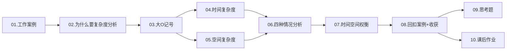
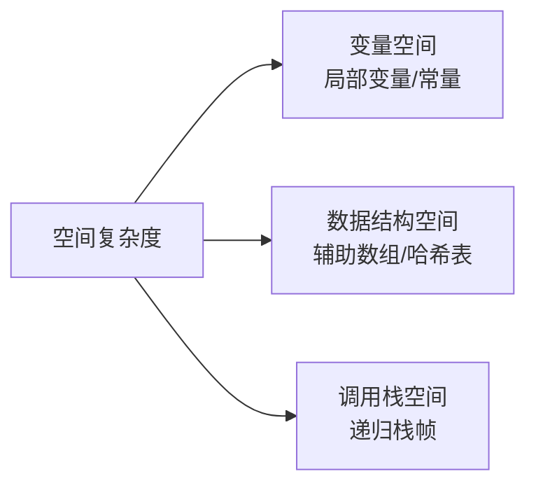

# 01.数据结构算法指导

> 本篇是数据结构与算法专栏的起点。从一次线上事故出发，系统建立复杂度分析的直觉与方法论，为后续所有数据结构的选型与性能分析打下地基。

---

## 目录指引与导读

> 阅读建议：先扫一遍二级目录建立全景，再逐节展开三级目录精读。每节末尾有"小结"段，可快速回顾。

- [01. 从工作案例说起](#01-从工作案例说起)
  - [1.1 线上事故复盘](#11-线上事故复盘)
  - [1.2 本篇学习目标](#12-本篇学习目标)
  - [1.3 全文结构导航](#13-全文结构导航)
- [02. 复杂度分析价值](#02-复杂度分析价值)
  - [2.1 事后统计法局限](#21-事后统计法局限)
  - [2.2 复杂度分析价值](#22-复杂度分析价值)
  - [2.3 对数指数的直觉](#23-对数指数的直觉)
- [03. 大O记号详解](#03-大o记号详解)
  - [3.1 两个入门小例子](#31-两个入门小例子)
  - [3.2 三条实用规则](#32-三条实用规则)
  - [3.3 忽略低阶项原理](#33-忽略低阶项原理)
  - [3.4 渐近符号的体系](#34-渐近符号的体系)
- [04. 时间复杂度分析](#04-时间复杂度分析)
  - [4.1 三条分析法则](#41-三条分析法则)
  - [4.2 常见量级对照](#42-常见量级对照)
  - [4.3 典型示例代码](#43-典型示例代码)
  - [4.4 非标准循环套路](#44-非标准循环套路)
  - [4.5 隐藏复杂度陷阱](#45-隐藏复杂度陷阱)
  - [4.6 复杂度可接受性](#46-复杂度可接受性)
- [05. 空间复杂度分析](#05-空间复杂度分析)
  - [5.1 空间复杂度组成](#51-空间复杂度组成)
  - [5.2 常见量级示例](#52-常见量级示例)
  - [5.3 递归吃空间原理](#53-递归吃空间原理)
  - [5.4 对数空间的来源](#54-对数空间的来源)
- [06. 四种复杂度情况](#06-四种复杂度情况)
  - [6.1 概念汇总一张表](#61-概念汇总一张表)
  - [6.2 线性查找四视角](#62-线性查找四视角)
  - [6.3 动态数组均摊分析](#63-动态数组均摊分析)
  - [6.4 随机化打散最坏](#64-随机化打散最坏)
- [07. 时间空间的权衡](#07-时间空间的权衡)
  - [7.1 时空权衡的本质](#71-时空权衡的本质)
  - [7.2 空间换时间经典](#72-空间换时间经典)
  - [7.3 时间换空间经典](#73-时间换空间经典)
  - [7.4 三步决策框架](#74-三步决策框架)
  - [7.5 帕累托前沿可视化](#75-帕累托前沿可视化)
- [08. 案例回扣与收获](#08-案例回扣与收获)
  - [8.1 回扣开篇事故](#81-回扣开篇事故)
  - [8.2 七个核心锚点](#82-七个核心锚点)
  - [8.3 复杂度面试速查](#83-复杂度面试速查)
  - [8.4 工程评审清单](#84-工程评审清单)
- [09. 思考题深度练](#09-思考题深度练)
- [10. 课后作业实战](#10-课后作业实战)
- [11. 进阶专题与延伸](#11-进阶专题与延伸)
  - [11.1 主定理与递归式](#111-主定理与递归式)
  - [11.2 势能法均摊证明](#112-势能法均摊证明)
  - [11.3 缓存敏感复杂度](#113-缓存敏感复杂度)
  - [11.4 经典书与论文](#114-经典书与论文)

---

## 01. 从工作案例说起

### 1.1 线上事故复盘

某电商后台里，我接到一个看起来无害的需求："商品列表页要做关键词高亮。"同事交接的代码是这样的：

```java
// 关键词高亮：看起来合情合理
public class HighlightService {
    public String highlight(List<String> titles, String keyword) {
        String html = "";
        for (String t : titles) {
            html += t.replace(keyword, "<b>" + keyword + "</b>") + "\n";
        }
        return html;
    }
}
```

灰度时看不出问题，预发一切 OK。全量那天，SKU 从 200 涨到 5 万，接口 P99 从 30ms 飙到 **12s**，下游超时雪崩。

事后复盘只改了一行——`String html = ""` 换成 `StringBuilder sb = new StringBuilder()`，接口恢复到 40ms。

**为什么一个看似 O(N) 的循环，实际运行出 O(N²) 的代价？** 我当时没答上来。直到把时间复杂度的定义、均摊分析、空间权衡这三块打通，才真正明白：**不是代码写错了，是对复杂度没有感觉**。

> **延伸思考**：这个案例的痛点不是单一算法错误，而是"语言抽象层"和"内存模型层"之间的认知断层。Java 的 `String` 是不可变（immutable），`+=` 看起来是赋值，底层实际是"分配新内存 → 复制旧内容 → 复制新内容 → 释放旧内存"。这种**抽象泄漏（leaky abstraction）**正是高级程序员和初级程序员之间的最大鸿沟之一。

#### 字节码层面的复盘

把这段代码用 `javac` 编译后再 `javap -c` 反编译可以看到，`s += t` 其实被编译成了：

```
new           java/lang/StringBuilder
dup
invokespecial StringBuilder.<init>
aload_0                       ; 旧 s
invokevirtual StringBuilder.append(String)
aload_1                       ; t
invokevirtual StringBuilder.append(String)
invokevirtual StringBuilder.toString
astore_0                      ; 写回 s
```

每次 `+=` 都新建一个 `StringBuilder` → 拷贝旧字符串 → 追加新字符串 → 转回 `String`。**循环里就是循环创建+丢弃 StringBuilder**，所以编译器的"语法糖优化"完全帮不上忙。这也是 JEP 280（JDK 9 引入的 `invokedynamic` 字符串拼接）只能优化"单条 `+=` 表达式"而无法优化"循环内 `+=`"的原因——优化必须看得见整条拼接链路才能合并。

#### 真实数据：分代 GC 视角

5 万条 SKU 的循环里，每次循环平均创建 3 个对象（新 String、新 char[]、临时 StringBuilder），15 万次分配集中在 Eden 区，触发数十次 Young GC，每次 30-50ms。**真正吃 P99 的不是 CPU 计算，而是 GC 暂停的累加**。改成 `StringBuilder` 后对象数从 15 万降到 3 个，Young GC 几乎归零——这是性能提升的另一条隐线。

### 1.2 本篇学习目标

学完本篇，你将能够：

- 说清"大 O 记号"的数学含义，而不只是背口诀；
- 判断任意一段代码的时间/空间复杂度，识别隐藏陷阱（字符串拼接、`contains` 嵌套、递归栈）；
- 区分最好/最坏/平均/均摊四种复杂度，知道什么时候用哪一种；
- 在时间与空间冲突时，做出有理有据的工程取舍；
- 建立"性能预测"的工程能力——给定输入规模，能口算出最坏耗时是否可接受。

#### 学习路径与知识依赖图

```
数学预备：等差/等比求和、对数底数变换、概率期望
   ↓
大 O 定义（极限视角）
   ↓
时间复杂度 ───────┬─────── 空间复杂度
   ↓                          ↓
四种情况（最好/最坏/平均/均摊）
   ↓
摊还分析三件套（聚合法/会计法/势能法）
   ↓
随机化算法的期望复杂度
   ↓
时空权衡的工程框架
```

如果以上任何一环不熟，回到对应章节深读。**复杂度分析是一棵树，缺枝少叶时所有结论都站不稳**。

### 1.3 全文结构导航



---

## 02. 复杂度分析价值

### 2.1 事后统计法局限

最直觉的做法是"跑一遍看耗时"，业界叫**事后统计法**。它有两个致命短板：

1. **强依赖环境**：换台机器、换个 JVM 版本，结论就变；
2. **强依赖数据规模**：小数据插入排序反而比快排快。

| 评估方式 | 事后统计法 | 复杂度分析 |
|---------|-----------|-----------|
| 是否需要运行 | 需要编码 + 运行 | 纸上推导即可 |
| 是否依赖硬件 | 强依赖 | 无关 |
| 不同规模的结论 | 可能完全不同 | 描述增长趋势，适用所有规模 |
| 适用阶段 | 开发完成后 | 设计阶段即可评估 |
| 误差来源 | GC、JIT、缓存预热 | 无 |

> **底层原因**：现代 CPU 引入了三级缓存、分支预测、乱序执行、SIMD 指令等优化，使得"操作次数 × 单次耗时"这种朴素估算严重失真。两个完全相同复杂度的算法，可能因为内存访问模式不同（顺序 vs 随机）而产生 10 倍以上的实际性能差距——但这些都不影响渐近复杂度的相对优劣判断，这正是大 O 的价值所在。

#### 一个真实的反例：链表 vs 数组遍历

```cpp
// 都是 O(N)，但实测差距数十倍
int sumArray(int* a, int n) {
    int s = 0;
    for (int i = 0; i < n; i++) s += a[i];   // 顺序读，CPU prefetch 命中率 99%+
    return s;
}

int sumList(Node* head) {
    int s = 0;
    while (head) { s += head->val; head = head->next; }  // 随机跳跃，缓存命中率 < 30%
    return s;
}
```

实测 1 千万元素：数组版约 8ms，链表版约 180ms。**复杂度都是 O(N)，但常数因子差 20 倍**。这告诉我们：

1. 复杂度分析是**必要条件**而非**充分条件**——它能淘汰糟糕方案，但不能保证最优；
2. 当复杂度相同时，**选缓存友好、分支可预测、向量化友好**的实现；
3. 这也解释了为什么数据库存储引擎几乎全用数组（B+ 树的页内是数组，LSM 的 SST 也是数组），即使理论复杂度链表/树更"优雅"。

### 2.2 复杂度分析价值

```
你写了个排序算法，测试 1 万条数据用了 50ms，看起来不错。
但如果它是 O(N²)，复杂度分析能告诉你：
  10 万条 → 5 秒
  100 万条 → 500 秒（8 分钟）
  1000 万条 → 50000 秒（14 小时）

没有复杂度分析，你只知道"现在够快"；有了它，你能预测"未来会不会崩"。
```

这就是为什么 BAT 的系统设计面试上来就问"你这方案能撑多大流量"——本质考的就是复杂度建模能力。

> **进一步**：复杂度分析还能指导**容量规划**。当业务方告诉你"明年用户翻 10 倍"，你能立刻判断：
>
> - 如果接口里有 O(N²) 操作，那就是 100 倍劣化，必须重构；
> - 如果是 O(N log N)，约 13 倍，加机器能扛；
> - 如果是 O(log N)，几乎没影响，原架构稳。
>
> **没有复杂度感觉的程序员，做不了架构师**。

### 2.3 对数指数的直觉

对数的核心是"每一步砍掉一半"：

- 二分查找：100 万条数据 → `log₂(10⁶) ≈ 20` 次比较；
- 平衡 BST：100 万个节点 → 最多 20 层；
- 归并排序：每轮合并减半 → `log₂N` 轮。

**底数不影响复杂度等级**：`log₂N = log₃N × 1.585`，只差常数倍。所以统一写 `O(log N)`，不指定底数。

反之，指数 `2^N` 增长极其恐怖——`N=60` 时，每步 1ns 也要跑 36 年。**把指数级优化成多项式级甚至对数级**，就是算法设计的核心目标。

| 数学关系 | 典型场景 | N=10⁶ 时量级 | 对应耗时（每步1ns） |
|---------|---------|-------------|------------------|
| `log N` | 二分查找 / 平衡树 | ~20 | 20ns |
| `N` | 线性扫描 | 10⁶ | 1ms |
| `N log N` | 归并 / 快排 | ~2×10⁷ | 20ms |
| `N²` | 冒泡 / 朴素两两比较 | 10¹² | 16分钟 |
| `2^N` | 子集枚举（注意 N 取小值） | 当 N=60 已天文 | 36年 |

> **直觉构建技巧**：背下来一个锚点——"现代 CPU 1 秒可以做约 `10⁸` 次简单整型操作"。所有复杂度估算都从这个锚点推导。例如要解 `N=10⁵` 的题目，`O(N²)` 是 `10¹⁰`，约 100 秒，超时；`O(N log N)` 是 `10⁵ × 17 ≈ 2×10⁶`，约 20ms，通过。

#### 对数复杂度的几何意义

`log N` 的几何含义是"分形深度"。每次把问题规模砍一半，砍 `log₂N` 次后规模变成 1。这套思想衍生出一系列经典数据结构：

| 数据结构 | "砍半"机制 | 操作复杂度 |
|---------|-----------|----------|
| 二分查找 | 区间一分为二 | O(log N) |
| 二叉堆 | 完全二叉树高度 | O(log N) |
| 平衡 BST | 左右子树平衡 | O(log N) |
| 跳表 | 概率分层 | 期望 O(log N) |
| B+ 树 | 一次砍 100~1000 倍 | O(log_B N)，常数极小 |
| Fenwick 树 | lowbit 跳跃 | O(log N) |

**B+ 树的"超对数"性质**：MySQL 默认页大小 16KB，每个内部页约存 1000 个键，所以 1 千万行的表只需要 `log_1000(10⁷) ≈ 2.3` 层。换言之"3 次磁盘 IO 就能定位任意行"——这是数据库引擎能够撑起 OLTP 的根基。

#### 指数复杂度可优化的常见路径

| 原始复杂度 | 优化路径 | 优化后复杂度 |
|-----------|---------|------------|
| `O(2^N)` 暴力子集枚举 | 状压 DP | `O(2^N × N)`，但 N 可大到 20 |
| `O(N!)` 全排列 | 状压 DP / 启发式 | `O(2^N × N²)` |
| `O(N²)` 朴素 DP | 单调队列 / 单调栈 | `O(N)` |
| `O(N²)` 字符串匹配 | KMP / Z-Algorithm | `O(N + M)` |
| `O(N²)` 矩阵幂 | 快速幂 | `O(N³ log K)` |

**优化的本质**：发现重复子问题（DP）、利用单调性（双指针/单调队列）、利用代数性质（快速幂/FFT）。这三类是算法竞赛的"三板斧"。

---

## 03. 大O记号详解

### 3.1 两个入门小例子

```java
// 案例 1：1 到 n 的累加
class Sample1 {
    static int sum(int n) {
        int s = 0;                          // 1 次
        for (int i = 1; i <= n; i++) s += i; // 2n 次
        return s;                           // 1 次
    }
    // 总执行次数：2 + 2n → T(n) = O(n)
}

// 案例 2：乘法表
class Sample2 {
    static int mul(int n) {
        int s = 0;                                // 1 次
        for (int i = 1; i <= n; i++)              // n 次
            for (int j = 1; j <= n; j++)          // n² 次
                s += i * j;                       // n² 次
        return s;
    }
    // 总执行次数：3 + 2n + 2n² → T(n) = O(n²)
}
```

> **关键观察**：哪怕你把"加法、乘法、赋值"三种操作分别按真实 CPU 周期计费（约 1、3、1 周期），最终的复杂度结论一模一样。**这就是大 O 抹掉常数的妙处——让我们能跨越机器、跨越实现细节，专注算法本身的增长趋势。**

### 3.2 三条实用规则

```
规则 1：只保留最高阶项
  T(n) = 3n² + 5n + 100  →  O(n²)

规则 2：去掉常数系数
  T(n) = 100n  →  O(n)

规则 3：多段代码取最大
  O(n²) + O(n)  →  O(n²)
```

这三条是日常分析的"三板斧"，掌握后 90% 的代码可以心算出复杂度。

> **数学严谨化**：大 O 的正式定义是 `T(n) = O(f(n))` 当且仅当存在常数 `c > 0` 和 `n₀ ≥ 0`，使得对所有 `n ≥ n₀`，都有 `T(n) ≤ c·f(n)`。换言之，**当 n 足够大时，T(n) 被 c·f(n) 限制住**。这就解释了为什么常数和低阶项可以丢弃——它们都被这个 `c` 吸收了。

#### 用极限语言再表述一次

`f(n) = O(g(n))` 等价于 `lim sup_{n→∞} f(n)/g(n) < ∞`。
`f(n) = o(g(n))` 等价于 `lim_{n→∞} f(n)/g(n) = 0`。
`f(n) = Θ(g(n))` 等价于 `0 < lim inf ≤ lim sup < ∞`。

> **三条规则的形式化证明（取最大）**：
>
> 设 `T₁(n) = O(f₁(n))`，`T₂(n) = O(f₂(n))`，则存在 `c₁, c₂, n₀` 使得 `T₁ ≤ c₁f₁`，`T₂ ≤ c₂f₂`。设 `g(n) = max(f₁, f₂)`，则：
> ```
> T₁ + T₂ ≤ c₁f₁ + c₂f₂ ≤ (c₁ + c₂) · max(f₁, f₂) = (c₁+c₂) g(n)
> ```
> 故 `T₁ + T₂ = O(g(n)) = O(max(f₁, f₂))`。这就证明了"取最大"规则的严格性。
>
> 这种证明在面试中很少考，但搞明白后再看文献里的"显然 T = O(...)"会非常清晰，不再焦虑。

### 3.3 忽略低阶项原理

以 `f(n) = 3n² + 5n + 100` 为例：

| n | `3n²` | `5n` | `100` | 低阶占比 |
|---|------|-----|------|---------|
| 10 | 300 | 50 | 100 | 33% |
| 100 | 30000 | 500 | 100 | 2% |
| 10⁴ | 3×10⁸ | 5×10⁴ | 100 | 0.002% |

规模一大，低阶项和常数的影响趋近于零——这就是大 O 只关心"主导项"的数学依据。

> **工程提醒**：但在**小数据量**下，低阶项和常数完全不能忽略！比如 STL 的 `std::sort` 在元素数 < 16 时切换为插入排序，因为虽然插入排序是 `O(n²)`，但常数因子小，缓存友好，在小规模下反而更快。**理论复杂度低 ≠ 实测更快**——这是面试官最爱问的点。

### 3.4 渐近符号的体系

工程中 99% 用大 O，但严谨表达还有另外几个：

| 符号 | 含义 | 通俗理解 | 类比 |
|------|------|---------|------|
| `O(f(n))` | 上界 | 最坏也不会比 f(n) 差 | "≤" |
| `Ω(f(n))` | 下界 | 最好也不会比 f(n) 好 | "≥" |
| `Θ(f(n))` | 紧确界 | 刚好就是这个量级 | "=" |
| `o(f(n))` | 严格上界 | 增长**严格慢于** f(n) | "<" |
| `ω(f(n))` | 严格下界 | 增长**严格快于** f(n) | ">" |

> **学术派常用 Θ，工程派常用 O**——因为我们关心的就是"最坏多差"。但**面试时如果有人问比较排序的下界**，你要能说出 `Ω(N log N)`（基于比较的排序，信息论可以证明这个下界），这是经典区分点。

#### 比较排序下界 `Ω(N log N)` 证明轮廓

任何"基于比较"的排序，决策过程可以画成一棵二叉决策树：每个内部节点是一次比较，叶子是一个排列结果。N 个元素共有 `N!` 种排列，决策树至少要有 `N!` 个叶子。
- 二叉树高 h 时，叶子数 ≤ `2^h`；
- 故 `2^h ≥ N!`，两边取 log：`h ≥ log₂(N!)`；
- 由 Stirling 公式：`log₂(N!) ≈ N log₂N - N log₂e + O(log N) = Θ(N log N)`。

**结论**：基于比较的排序最坏情况至少需要 `Ω(N log N)` 次比较。这是信息论意义上的下界，**任何聪明的比较算法都翻不过去**。
要打破这个下界，必须不再"只比较"——例如计数排序（值域有限）、基数排序（按位拆分）、桶排序，它们的复杂度都是 `O(N + K)` 或 `O(N × K)`，K 是值域/位数。这是面试中"为什么基数排序能 O(N) 排序但归并不能"的标准答案。

---

## 04. 时间复杂度分析

### 4.1 三条分析法则

**法则 1——关注执行最多的那段**：

```java
class SumDemo {
    static int sum(int[] arr) {
        int total = 0;             // O(1)
        for (int x : arr) total += x;  // O(n) ← 取它
        return total;              // O(1)
    }
    // → O(n)
}
```

**法则 2——加法：取最大量级**：多段串行代码的总复杂度 = 量级最大的那段。

```java
// 第一段 O(n)
for (int i = 0; i < n; i++) op1();
// 第二段 O(n²)
for (int i = 0; i < n; i++)
    for (int j = 0; j < n; j++) op2();
// 总：O(n) + O(n²) = O(n²)
```

**法则 3——乘法：嵌套相乘**：

```cpp
for (int i = 0; i < n; i++)      // O(n)
    for (int j = 0; j < n; j++)  // O(n)
        op();                    // O(1)
// → O(n²)
```

> **隐含假设**：法则 3 的"嵌套相乘"成立，前提是**内层循环的执行次数与外层无关**。如果内层依赖外层（如 `for j = i to n`），需要单独求和——例如冒泡排序内层 `n-i` 次，总和 `n + (n-1) + ... + 1 = n(n+1)/2 = O(n²)`，而不是简单的 `n × n`。

#### 三角形累加的通用公式

```
∑_{i=0}^{n-1} (n - i)  =  n + (n-1) + ... + 1  =  n(n+1)/2
∑_{i=0}^{n-1} i        =  0 + 1 + ... + (n-1)  =  n(n-1)/2
∑_{i=0}^{n-1} 2^i      =  1 + 2 + 4 + ... + 2^{n-1}  =  2^n - 1
∑_{i=1}^{n} log₂i      ≈  n log₂n - n log₂e   (Stirling)
∑_{i=1}^{n} 1/i        ≈  ln n + γ  (调和级数, γ ≈ 0.577)
```

**记住这五个求和模板**，可以解决 90% 的"内层依赖外层"型复杂度推导。例如冒泡 / 选择排序套第一个；二分操作的累计套第三个；快排平均分析套第四个；哈希探测的最坏期望套第五个。

### 4.2 常见量级对照

| 复杂度 | 代表算法 | N=10⁶ 的操作数 | 单核耗时估算 |
|-------|---------|---------------|------------|
| `O(1)` | 数组访问 / 哈希查找 | 1 | <1ns |
| `O(log N)` | 二分查找 / 平衡树 | 20 | 20ns |
| `O(N)` | 遍历 / 线性查找 | 10⁶ | 1ms |
| `O(N log N)` | 归并 / 快排 / 堆排 | 2×10⁷ | 20ms |
| `O(N²)` | 冒泡 / 选择排序 | 10¹² | 16分钟 |
| `O(2^N)` | 暴力子集枚举 | 爆炸 | 不可计算 |
| `O(N!)` | 全排列 / TSP 暴力 | 无法计算 | 不可计算 |

> **经验原则**：在线 OLTP 接口要求 99.9% 请求 < 100ms，因此**主链路上不允许出现超过 `O(N log N)` 的算法（除非 N 很小）**。批量任务可以放宽到 `O(N²)`，但要标明"离线任务"。这是技术评审中最常见的 Code Review 红线。

#### 容量规划速算公式

设单次操作 1ns（CPU 缓存命中）/ 100ns（内存 L3）/ 10ms（磁盘随机 IO）。**目标响应时间倒推可接受规模**：

```
延迟目标 1ms：
  - O(N) 内存计算 → N ≤ 10⁵
  - O(N log N) 内存 → N ≤ 5×10⁴
  - O(log N) 磁盘 → N ≤ 10¹⁰⁰（B+ 树）

延迟目标 100ms（接口 P99）：
  - O(N²) 内存 → N ≤ 10⁴
  - O(N) 磁盘扫描 → N ≤ 10⁴ 行（10ms × 10⁴ = 100s，不行）
  - O(log N) 磁盘 → 5 次 IO 内
```

**隐含意义**：业务接口里**任何对几十万行的全表扫描都是炸弹**——一旦数据增长到百万级，必爆。所以"分页查询有 LIMIT 但没 ORDER BY"才是 MySQL 慢查询的头号杀手。

### 4.3 典型示例代码

```java
// O(1) —— 无论 n 多大，操作数固定
class O1 {
    static Integer first(int[] arr) {
        return arr.length > 0 ? arr[0] : null;
    }
}

// O(log n) —— 步长翻倍
class OLogN {
    static int log2Steps(int n) {
        int i = 1, cnt = 0;
        while (i < n) { i *= 2; cnt++; }
        return cnt;
    }
}

// O(n) —— 单层循环
class ON {
    static int maxOf(int[] arr) {
        int m = arr[0];
        for (int x : arr) m = Math.max(m, x);
        return m;
    }
}

// O(n²) —— 嵌套循环（冒泡排序）
class ON2 {
    static void bubble(int[] arr) {
        int n = arr.length;
        for (int i = 0; i < n; i++)
            for (int j = 0; j < n - i - 1; j++)
                if (arr[j] > arr[j + 1]) {
                    int t = arr[j];
                    arr[j] = arr[j + 1];
                    arr[j + 1] = t;
                }
    }
}

// O(n log n) —— 归并排序（核心代码）
class ONLogN {
    static int[] mergeSort(int[] a) {
        if (a.length <= 1) return a;
        int m = a.length / 2;
        int[] left  = mergeSort(Arrays.copyOfRange(a, 0, m));
        int[] right = mergeSort(Arrays.copyOfRange(a, m, a.length));
        return merge(left, right);
    }
    static int[] merge(int[] a, int[] b) {
        int[] r = new int[a.length + b.length];
        int i = 0, j = 0, k = 0;
        while (i < a.length && j < b.length)
            r[k++] = a[i] <= b[j] ? a[i++] : b[j++];
        while (i < a.length) r[k++] = a[i++];
        while (j < b.length) r[k++] = b[j++];
        return r;
    }
}
```

> **C++ 等价版**（重点观察 `qsort` 标准库已是 `O(N log N)`）：
>
> ```cpp
> #include <algorithm>
> std::sort(v.begin(), v.end());  // 内省排序：快排 + 堆排兜底，保证 O(N log N) 最坏
> ```

#### 标准库源码出处对照

| 算法 | Java 源码位置 | C++ 源码位置 | Go 源码位置 |
|------|--------------|-------------|-----------|
| 排序 | `java.util.DualPivotQuicksort`（双轴快排，JDK 8+） | libstdc++ `bits/stl_algo.h::__introsort_loop` | `sort` 包 `pdqsort` |
| 二分查找 | `java.util.Arrays.binarySearch` | `<algorithm>` 的 `std::lower_bound` | `sort.Search` |
| 哈希 | `java.util.HashMap`（红黑树退化） | libstdc++ `unordered_map`（链表） | runtime `map.go`（开放寻址+桶） |
| 平衡 BST | `java.util.TreeMap`（红黑树） | libstdc++ `_Rb_tree`（红黑树） | 无内建（用第三方 `gods`） |
| 堆 | `java.util.PriorityQueue`（二叉堆数组） | `<queue>` `priority_queue`（二叉堆） | `container/heap` |

**记下这张表**：技术评审或 Bug 排查时，能够准确说出"这个 API 走的是哪个数据结构、最坏复杂度多少、源码在哪里"——这是高级工程师的基本功。

### 4.4 非标准循环套路

```java
// 步长翻倍 → O(log n)
int i = 1;
while (i < n) i *= 2;
// 设循环 k 次，则 2^k = n，k = log₂n

// 步长递增 → O(√n)
int i = 0, s = 0;
while (s < n) {
    i += 1;
    s += i;
}
// s = i(i+1)/2，s ≥ n 时 i ≈ √(2n)
```

> **更高阶套路**：
>
> ```java
> // 双重循环但内层依赖外层
> for (int i = 1; i < n; i *= 2)         // log₂n 次
>     for (int j = 0; j < i; j++) op();  // 内层共 1 + 2 + 4 + ... + n/2 ≈ n
> // 总：O(n)，不是 O(n log n)！
> ```
>
> **判定关键**：盯住每个循环变量的"绝对增长方式"，再用等比/等差数列公式求总操作数。**永远不要凭直觉相乘**。

#### 更多非标准循环模板

```java
// ① 倍增 + 求和（看似 O(n log n)，实际 O(n)）
for (int i = 1; i < n; i *= 2)
    for (int j = 0; j < i; j++) op();
// 总：1 + 2 + 4 + ... + n/2 = n - 1 ≈ O(n)

// ② 嵌套递归（GCD 风格）→ O(log n)
int gcd(int a, int b) { return b == 0 ? a : gcd(b, a % b); }
// 由 Lamé 定理：连续两次取模后 a 至少减半，故深度 ≤ 2 log_φ(n)

// ③ 双指针（看起来双重循环，实际 O(n)）
int i = 0, j = 0, ans = 0;
while (i < n) {
    while (j < n && check(i, j)) j++;
    ans = max(ans, j - i);
    i++;
}
// j 永不回退，i+j 累计推进 ≤ 2n → O(n)

// ④ 链式调用（看起来嵌套，但每条边访问 1 次）→ O(V + E)
// 图的 DFS / BFS 经典分析

// ⑤ 整数分块（数论题常用）
for (int l = 1, r; l <= n; l = r + 1) {
    r = n / (n / l);
    // 这一块 [l, r] 内 n/l 值相同，O(1) 处理
}
// 总块数 ≤ 2√n → O(√n)
```

**这五个模板**覆盖了竞赛与工程中绝大部分"看似 O(n²) 实际更优"的场景。识别它们的关键是：**别按嵌套深度估，按实际访问次数总和估**。

### 4.5 隐藏复杂度陷阱

**陷阱 1：字符串拼接**（开篇事故的本质）

```java
// 看似 O(n)，实际 O(n²)
String s = "";
for (int i = 0; i < n; i++) s += "a";
// 第 i 次拼接要复制 i 个字符，总和 = n(n+1)/2

// 正解
StringBuilder sb = new StringBuilder();
for (int i = 0; i < n; i++) sb.append('a');
```

**陷阱 2：循环里套 `contains`**

```java
// 看似 O(n)，实际 O(n²)，因为 ArrayList.contains 是 O(n)
List<Integer> list = new ArrayList<>();
for (int x : arr) {
    if (!list.contains(x)) list.add(x);
}

// 正解：HashSet 的 contains 是 O(1)
Set<Integer> set = new HashSet<>();
for (int x : arr) set.add(x);
```

**陷阱 3：参数是两个独立规模**

```cpp
for (int i = 0; i < m; i++) f();
for (int j = 0; j < n; j++) g();
// T = O(m + n)，不能简化成 O(max(m,n))
// 因为无法假设 m、n 谁大
```

**陷阱 4：递归栈复用错觉**

```java
// 递归打印链表（看起来一行很短）
void print(Node head) {
    if (head == null) return;
    print(head.next);          // 先递归
    System.out.println(head.val);
}
// 时间 O(n)，但空间 O(n)！每层都压栈
```

> **如何系统性识别陷阱**：
>
> 1. **看每次循环体内的隐式调用**——`String +=`、`list.contains`、`map.containsKey` 都可能藏 O(N)；
> 2. **看 API 文档明确给出的复杂度**——`LinkedList.get(i)` 是 O(N)，不是 O(1)；
> 3. **写完循环立刻问自己**：内层操作真的是 O(1) 吗？

#### 容器复杂度速查（必背）

| 容器 / 操作 | get/contains | add/put | remove | iterate |
|-----------|-------------|---------|--------|---------|
| `ArrayList` | O(1) | 末尾均摊 O(1)，中间 O(N) | O(N) | O(N) |
| `LinkedList` | O(N) | 头/尾 O(1)，中间 O(N) | O(1) 已知节点 | O(N) |
| `HashMap` | 平均 O(1)，最坏 O(log N) | 同上 | 同上 | O(N+capacity) |
| `LinkedHashMap` | 同 HashMap | 同上 | 同上 | O(N) |
| `TreeMap` | O(log N) | O(log N) | O(log N) | O(N) |
| `HashSet` | 平均 O(1) | 同上 | 同上 | O(N+capacity) |
| `TreeSet` | O(log N) | O(log N) | O(log N) | O(N) |
| `PriorityQueue` | peek O(1)，contains O(N) | offer O(log N) | poll O(log N) | O(N) |
| `ArrayDeque` | first/last O(1) | offer 均摊 O(1) | poll O(1) | O(N) |
| `ConcurrentHashMap` | 平均 O(1) | 同上 | 同上 | 弱一致 O(N) |

> **特别注意**：`LinkedList.get(i)` 看起来"链表必有 O(1) 操作"——但只对头尾 O(1)；任意位置必须从头/尾遍历，**O(N)**。这是 `for (int i=0; i<list.size(); i++) list.get(i)` 写法在 LinkedList 上变成 O(N²) 的真正原因。

#### 真实事故案例

某日志网关一段代码：
```java
List<LogEvent> events = fetchFromQueue();
for (LogEvent e : events) {
    if (alreadyProcessed.contains(e.getId())) continue;  // alreadyProcessed 是 LinkedList
    process(e);
    alreadyProcessed.add(e.getId());
}
```

`alreadyProcessed` 用了 `LinkedList`，每次 `contains` 是 O(N)。事件量从日 1 万涨到日 1000 万后，单批 1 万事件去重耗时从 100ms → 200 秒，CPU 100% 卡死。**修复方案**：把 `LinkedList` 换成 `HashSet`，单行改动，耗时回到 80ms。这种"小改动救火"案例在每家公司都能找到——**容器选错的代价远比想象的大**。

### 4.6 复杂度可接受性

现代 CPU 每秒约 10⁸~10⁹ 次简单操作。**面试/工程速查表**：

```
输入规模          可接受复杂度
n ≤ 10           → O(n!)
n ≤ 20           → O(2^n)
n ≤ 500          → O(n³)
n ≤ 5000         → O(n²)
n ≤ 10⁶          → O(n log n)
n ≤ 10⁸          → O(n)
n > 10⁸          → O(log n) 或 O(1)
```

> **使用方法**：拿到题目先看数据范围，立刻反推目标复杂度，再倒推算法选择。
>
> - 看到 `n=20`，立刻想到状压 DP（`O(2^n × n)`）；
> - 看到 `n=10⁶`，立刻想到归并排序 / 线段树 / 单调栈；
> - 看到 `n=10¹²`，立刻想到二分答案、快速幂、矩阵快速幂。
>
> **这张表是面试和打竞赛的"作弊条"**。

#### 工程版速查表（含磁盘/网络）

| 数据规模 + 介质 | 可接受最坏复杂度 | 典型架构 |
|---------------|----------------|---------|
| 内存 ≤ 1GB / 内存计算 | O(N²) 也行（< 3 万条） | 单机 |
| 内存 1~64GB / 内存计算 | O(N log N) | 单机 + 大内存 |
| 内存 ≤ 1TB / 磁盘 | O(N log_B N) | 数据库索引 |
| ≤ 100TB / 集群 | O(N log_B N) + 分片 | MySQL 分库分表 / ES |
| ≤ PB / 流式 | O(N) 一遍过 | Spark / Flink |
| ≤ EB / 估算 | O(1) HLL / 布隆 | Redis Probabilistic |

**面试官的考点**：很多公司面试问"10 亿 URL 去重内存不够怎么办"——答 HashSet 80GB 不可行，要立刻想到布隆过滤器（10⁹ × 10bit ≈ 1.2GB）或 HLL（12KB 估基数）。这就是工程版速查表的价值。

---

## 05. 空间复杂度分析

### 5.1 空间复杂度组成

空间复杂度只算**额外分配**的空间，不算输入本身。来源有三：



> **为什么不算输入空间**：因为输入是"题目给的"，不是"你算法用的"。空间复杂度衡量的是**算法本身的额外开销**——这才能反映两个算法的优劣。例如归并排序需要 `O(N)` 额外空间，堆排序只要 `O(1)`，这才是核心差异。

#### Java 对象内存布局视角

Java 对象头 12-16 字节（开启压缩指针为 12，否则 16），引用 4 / 8 字节，对齐填充补齐到 8 字节倍数。一个看似"轻量"的 `Integer` 包装类实际是 **16 字节**，比 `int` 的 4 字节大 4 倍。

```
+------------------+
| Mark Word (8B)   | ← GC 标志、锁信息、hash code
+------------------+
| Klass Pointer    | ← 4B（压缩指针）/ 8B
+------------------+
| value: int (4B)  |
+------------------+
| padding (4B)     | ← 8 字节对齐
+------------------+
共 16 字节
```

`HashMap.Node` 一个节点 32 字节（4 个引用 + 1 个 int 哈希 + 对齐），1 亿条目就是 3.2GB **额外开销**——这是为什么大数据场景几乎不用 `HashMap` 而用 `ConcurrentHashMap` 或专用紧凑哈希（如 Eclipse Collections 的 `MutableLongIntMap`）的原因。

> **数据科学家小贴士**：Python 的 `int` 是 28 字节（带 GC 头），所以 1 亿个 int 占 2.8GB，这是 numpy `np.int32` 数组（4 亿字节）能比纯 Python list 快 100 倍的根本原因——不只是 C 实现快，**内存布局紧凑导致缓存命中率高**。

### 5.2 常见量级示例

```java
// O(1) —— 只用常数个变量
int sum(int[] arr) {
    int t = 0;
    for (int x : arr) t += x;
    return t;
}

// O(N) —— 新开与输入同规模的数组
int[] copy(int[] arr) {
    int[] r = new int[arr.length];
    for (int i = 0; i < arr.length; i++) r[i] = arr[i];
    return r;
}

// O(N) —— 递归栈深度 = N
int factorial(int n) {
    return n <= 1 ? 1 : n * factorial(n - 1);
}

// O(N²) —— 二维数组
int[][] matrix(int n) { return new int[n][n]; }

// O(2^N) —— 枚举所有子集（结果集占用）
List<List<Integer>> subsets(int[] nums) {
    List<List<Integer>> ans = new ArrayList<>();
    int n = nums.length;
    for (int mask = 0; mask < (1 << n); mask++) {
        List<Integer> sub = new ArrayList<>();
        for (int i = 0; i < n; i++)
            if ((mask & (1 << i)) != 0) sub.add(nums[i]);
        ans.add(sub);
    }
    return ans;
}
```

> **经验比例**：业务系统中 80% 的算法是 `O(1)` 或 `O(N)` 空间，10% 是 `O(N²)`（动态规划二维表），剩下 10% 涉及递归栈 `O(log N)` 或 `O(N)`。空间炸裂往往出现在**笛卡尔积 / 全排列 / 二维 DP**这三类场景。

#### 空间优化的三大套路

**① 滚动数组**：DP 中如果只依赖前 1-2 层，把二维数组压成一维。
```java
// 原始 O(N×M)
int[][] dp = new int[n][m];
for (int i = 1; i < n; i++)
    for (int j = 1; j < m; j++)
        dp[i][j] = dp[i-1][j] + dp[i][j-1];

// 优化 O(M)
int[] dp = new int[m];
for (int i = 1; i < n; i++)
    for (int j = 1; j < m; j++)
        dp[j] = dp[j] + dp[j-1];
```

**② 原地修改（in-place）**：用输入数组本身存中间结果。
```java
// 0/1/2 三色排序（荷兰国旗），原地 O(1) 空间
void sortColors(int[] nums) {
    int l = 0, r = nums.length - 1, i = 0;
    while (i <= r) {
        if (nums[i] == 0) swap(nums, i++, l++);
        else if (nums[i] == 2) swap(nums, i, r--);
        else i++;
    }
}
```

**③ 流式处理**：不一次加载全部，逐条处理。
```java
// Reservoir Sampling：从未知大小的流中等概率取 K 个
int[] reservoir = new int[k];
int i = 0;
for (int x : stream) {
    if (i < k) reservoir[i] = x;
    else {
        int j = ThreadLocalRandom.current().nextInt(i + 1);
        if (j < k) reservoir[j] = x;
    }
    i++;
}
```

**这三招**是面试中"空间不够怎么办"的标准答题模板，配合具体题目可以举一反三。

### 5.3 递归吃空间原理

栈区通常只有 1~8 MB。深度递归每层都压栈（返回地址 + 局部变量），一不小心就 **StackOverflow**。

```cpp
// 每层压栈，同时存在 N 个栈帧 → O(N) 空间
int rec(int n) {
    if (n <= 1) return 1;
    return rec(n - 1) + 1;
}
```

典型优化——**尾递归化循环**（多数语言 JIT 不会自动做，需手写）：

```cpp
// 快排最坏空间从 O(N) 降到 O(log N)：总是先递归较小的一半
void qsort(int a[], int lo, int hi) {
    while (lo < hi) {
        int p = partition(a, lo, hi);
        if (p - lo < hi - p) {
            qsort(a, lo, p - 1);  // 较小一半递归
            lo = p + 1;           // 较大一半循环（不压栈）
        } else {
            qsort(a, p + 1, hi);
            hi = p - 1;
        }
    }
}
```

> **栈帧到底装了什么**：每个栈帧 = 返回地址 + 保存的寄存器 + 局部变量 + 参数 + 对齐填充。Java 函数调用平均一帧约 64-128 字节，所以 1MB 栈大概可以撑 10000 层递归。**写递归一定要估算最大深度**：链表 100 万节点的递归遍历必崩，必须改迭代或显式栈。
>
> **C++ 的栈优化**：GCC 的 `-O2` 会做尾调用优化（TCO），但只有当尾递归处于**最后位置且没有其它操作**时才生效。Java 至今不支持 TCO（设计哲学问题：栈帧用于异常追踪）。所以 Scala / Clojure 这些 JVM 语言要自己实现 trampoline 来避免栈溢出。

### 5.4 对数空间的来源

`O(log N)` 空间都出现在哪？

- 二分查找的递归版（迭代版是 O(1)）；
- 平衡快排的递归栈（平均）；
- 整数转字符串：一个整数 N 有 `log₁₀N` 位；
- 二进制表示：N 有 `log₂N` 位；
- 平衡 BST 的查找路径（最多 log N 层）。

> **隐藏知识点**：哈希函数族 `MurmurHash`、`xxHash` 的内部状态都是 `O(log N)` 量级（用 64 位整数累积），看起来是 `O(1)`，但严格说是与 N 的比特数相关。在密码学里这种区分很重要，业务开发可以忽略。

#### 严谨视角：模型相关的空间复杂度

复杂度分析隐含一个假设：**单个机器字长 W 是常数（通常 64 位）**。这叫"Word RAM 模型"。但当数据规模 N 大到 `2^W` 量级，索引本身就要 `log N` 比特来表示——空间复杂度公式里的 `O(N)` 严格说是 `O(N · log N)` 比特。

**在何处此细节会重要**：
- **大数运算**（如 RSA 加密）：N 位整数相加是 `O(N)`，相乘朴素 `O(N²)`，FFT `O(N log N)`；
- **密码学**：所有"O(1) 哈希"在严格意义上都是 `O(log N)`，所以"O(N) 时间内找到哈希碰撞"的攻击算法严格说是 `O(N log N)`；
- **位级算法**：`__builtin_popcount` 单次 O(1)（CPU 指令），但理论模型下是 O(log W)。

业务开发可以忽略这些差异；写论文、做密码学评估、分析极端数据规模时必须分清。

---

## 06. 四种复杂度情况

### 6.1 概念汇总一张表

| 类型 | 定义 | 典型用途 | 例子 |
|------|------|---------|------|
| 最好情况 | 最理想输入下的代价 | 参考意义不大 | `find()` 第一个就命中 |
| 最坏情况 | 最糟糕输入下的代价 | 性能保证 / SLA | 哈希表全部冲突退化为 O(N) |
| 平均情况 | 输入按概率分布加权平均 | 期望性能 | 快排平均 O(N log N) |
| 均摊情况 | 一串操作的总代价 / 次数 | 动态数组 / 伸展树 | ArrayList add 均摊 O(1) |

> **何时该用哪个**：对外承诺 SLA 用最坏（保底兜底），日常优化看平均（实际表现），动态结构看均摊（连续操作的真实代价）。**面试时被问到红黑树 / 哈希表，一定要主动区分平均和最坏**——这是分级筛选的关键题。

#### 四种复杂度的关系

```
最好 ≤ 平均 ≤ 最坏
均摊 = 一段操作序列总代价 / 操作数  (与平均/最坏可分别比较)
```

特殊关系：
- **均摊 O(1) 蕴含 总操作 O(N)**——但单次操作可以是 O(N)（如 ArrayList 扩容）；
- **平均 O(1) 不蕴含 总 O(N)**——平均是概率意义，最坏序列可能让总代价超过 O(N)；
- **均摊优于最坏**：动态数组的最坏单次是 O(N)，但均摊 O(1) 是更强的保证；
- **期望复杂度（随机化）≠ 平均复杂度**：期望是算法内随机源决定的，对所有输入成立；平均是输入分布决定的，依赖输入假设。这两者经常被混淆。

**面试常考**：
- "哈希表 get 是 O(1) 吗？" → 平均 O(1)，最坏 O(N)（全冲突）或 O(log N)（JDK8 红黑树退化）；
- "ArrayList add 是 O(1) 吗？" → 均摊 O(1)，最坏单次 O(N)；
- "快排是 O(N log N) 吗？" → 期望 O(N log N)（随机化版），最坏 O(N²)（确定性版遇坏输入）。
**主动区分这三种说法**，比背 1000 道八股管用。

### 6.2 线性查找四视角

```cpp
int find(int a[], int n, int x) {
    for (int i = 0; i < n; i++)
        if (a[i] == x) return i;
    return -1;
}
```

- **最好**：`x` 在第 0 位 → `O(1)`；
- **最坏**：`x` 不存在 → `O(n)`；
- **平均**：假设 `x` 在数组中的概率 1/2，且位置等概率分布，推出约 `(3n+1)/4` 次比较 → `O(n)`；
- **均摊**：单次操作不适用均摊概念。

> **平均的严格推导**：
>
> 设 `x` 存在的概率 `p = 1/2`，存在时位置等概率为 `1/n`。
> - 不存在时：比较 `n` 次；
> - 存在时：平均比较 `(1+2+...+n)/n = (n+1)/2` 次。
> - 期望 = `1/2 × n + 1/2 × (n+1)/2 = (3n+1)/4 ≈ O(n)`。
>
> **课堂常见错误**：忘记乘概率，直接平均所有可能。

### 6.3 动态数组均摊分析

```
ArrayList 添加元素（初始容量 4）：
add  1~4  → O(1)
add  5    → 扩容到 8，拷贝 4 个 → O(4)
add  6~8  → O(1)
add  9    → 扩容到 16，拷贝 8 个 → O(8)
add  10~16→ O(1)
add  17   → 扩容到 32，拷贝 16 个 → O(16)
...

总代价 = n + (4 + 8 + 16 + ...) ≈ n + 2n = 3n
均摊到每次 = 3n / n = O(1)
```

**均摊 vs 平均**：均摊不涉及概率，只看"操作序列的总代价除以操作数"；平均要假设输入的概率分布。

> **会计法（Accounting Method）形象解释**：
>
> 想象每次 `add` 你交 3 元给银行：
> - 1 元用于本次 add；
> - 2 元存起来（准备给未来扩容时被复制用）。
>
> 当扩容触发，把所有元素从旧数组复制到新数组——每个被复制的元素都用之前自己存的钱付账。账户永远不会透支。
>
> **结论**：均摊 O(1) 不是平均 O(1)，而是"任意 N 次操作总代价不超过 3N"——这是更强的保证。

#### 势能法（Potential Method）的一般形式

势能法是均摊分析的"通用武器"。定义势函数 `Φ: 状态 → 非负实数`，每次操作的"均摊代价"定义为：
```
ĉᵢ = cᵢ + Φ(后状态) - Φ(前状态)
```
则 N 次操作的总实际代价：
```
∑cᵢ = ∑ĉᵢ + Φ(初态) - Φ(末态) ≤ ∑ĉᵢ  (若 Φ ≥ 0 且初态 = 0)
```
**对动态数组**：定义 `Φ(数组) = 2 × size − capacity`（扩容刚好时 Φ=0，半满时 Φ=size）。
- 平凡 add：`cᵢ = 1`，`ΔΦ = 2 → ĉᵢ = 3`；
- 扩容 add：`cᵢ = size`（拷贝），`ΔΦ = 2 - size → ĉᵢ = size + 2 - size = 2`。

**所有 add 的均摊代价 ≤ 3，故均摊 O(1)**——这是更严密的证明，比会计法直觉更有"为什么对"的解释力。

#### 扩容倍数 1.5 vs 2.0 的权衡

| 倍数 | 均摊系数 | 内存浪费比 | 老空间能否复用 |
|------|---------|-----------|-------------|
| 1.5（Java ArrayList） | 3 | 33% | 累积 1+1.5+1.5²+...+1.5^k > 2^k 时可复用 |
| 2.0（Go slice 小容量） | 3 | 50% | 永远无法复用（新>旧总和） |
| 1.1 | 11 | 9% | 大概率复用 |

**Java 选 1.5 的理由**：内存碎片更易复用——这是 GC 时代的考虑。Go 选 2.0 的理由：扩容次数少，CPU 缓存友好——值得多浪费 17% 内存。**两条选择都对**，看权衡哪一边。这就是工程中"复杂度不是唯一指标"的最佳例证。

### 6.4 随机化打散最坏

快排最坏是 `O(n²)`（输入已排好序时），但**随机选 pivot** 后，对任意输入的**期望**比较次数都是 `2n ln n ≈ 1.39 n log₂ n`——这是对输入无假设的"期望复杂度"。

```java
class RandQuickSort {
    static Random rnd = new Random();
    static void sort(int[] a, int lo, int hi) {
        if (lo >= hi) return;
        int r = lo + rnd.nextInt(hi - lo + 1);
        int t = a[r]; a[r] = a[hi]; a[hi] = t;     // 随机化
        int p = partition(a, lo, hi);
        sort(a, lo, p - 1);
        sort(a, p + 1, hi);
    }
    static int partition(int[] a, int lo, int hi) {
        int pivot = a[hi], i = lo - 1;
        for (int j = lo; j < hi; j++)
            if (a[j] <= pivot) {
                i++;
                int t = a[i]; a[i] = a[j]; a[j] = t;
            }
        int t = a[i + 1]; a[i + 1] = a[hi]; a[hi] = t;
        return i + 1;
    }
}
```

> **随机化的本质**：把"对手控制的最坏输入"变成"算法控制的随机选择"。攻击者无论给什么输入，都无法稳定逼出 `O(n²)`——这在密码学和分布式系统里非常重要（如哈希表的 SipHash 抗 HashDoS 攻击）。
>
> **面试拓展题**：为什么 Java 7+ 的 HashMap 在 JDK 8 引入了红黑树？因为攻击者构造特殊键值让所有元素哈希到同一桶，链表长度退化到 N，单次查询 `O(N)` → 集群被打挂。改红黑树后退化为 `O(log N)`，攻击成本陡增。

#### 期望复杂度的严格证明（随机化快排）

设 `T(N)` 为 N 个元素随机化快排的比较次数期望。设 pivot 等概率落在 1..N 任意位置：
```
T(N) = (N-1) + (1/N) ∑_{k=0}^{N-1} [T(k) + T(N-1-k)]
     = (N-1) + (2/N) ∑_{k=0}^{N-1} T(k)
```
代入 `T(N) = c·N·ln N` 验证（数学归纳法），可解出 `T(N) ≈ 2N ln N ≈ 1.39 N log₂N`。

**意义**：
1. 这是**期望**，对**任意输入**都成立——攻击者无法构造让算法每次都最坏；
2. 期望的常数 1.39 比归并排序的 1.0 略大，所以快排比归并慢一点点 ——**但缓存友好抵消了，实测往往快排更快**；
3. 这个证明依赖"两个 pivot 之间元素被比较的概率"分析，很巧妙——是经典算法书 CLRS 第 7 章的招牌证明。

#### 抗 HashDoS 的工程实践

JDK 8 后 HashMap 的几个加固措施：
1. **红黑树退化**：链表长度 ≥ 8 转红黑树（O(N) → O(log N)）；
2. **扰动函数**：`hash = key.hashCode() ^ (key.hashCode() >>> 16)`，让高位也参与桶定位；
3. **强烈不建议自定义 hashCode 全返回 0**：JDK 文档明确警告（曾有面试题考察）。

Redis、Linux 内核、Python 等都引入了**SipHash**作为字符串哈希函数，每次进程启动随机化种子，让攻击者无法预知碰撞模式——这是抗 HashDoS 的工业标准。

---

## 07. 时间空间的权衡

### 7.1 时空权衡的本质

```
    高 │ ● 暴力（省空间，慢）
 时间  │
 复杂度 │         ● 平衡方案
       │
    低 │                  ● 空间换时间（费空间，快）
       └──────────────────────────→
        低       空间复杂度       高
```

大多数场景下两者不可兼得——沿曲线选一个对当前业务最优的平衡点。

> **理论极限：信息论下界**。某些问题存在**时空乘积**的恒定下界。例如已排序数组的搜索问题，如果你只用 `O(1)` 空间，时间至少 `O(log N)`（二分查找）；如果你用 `O(N)` 哈希表空间，时间可降到 `O(1)`。但**时间×空间的乘积不会低于 N**——这是数学上不可绕开的天花板。

### 7.2 空间换时间经典

**①  哈希表代替双重循环**

```java
// O(N²) 空间 O(1)
class TwoSumBrute {
    static int[] solve(int[] nums, int t) {
        for (int i = 0; i < nums.length; i++)
            for (int j = i + 1; j < nums.length; j++)
                if (nums[i] + nums[j] == t) return new int[]{i, j};
        return null;
    }
}

// O(N) 空间 O(N)
class TwoSumHash {
    static int[] solve(int[] nums, int t) {
        Map<Integer, Integer> seen = new HashMap<>();
        for (int i = 0; i < nums.length; i++) {
            if (seen.containsKey(t - nums[i]))
                return new int[]{seen.get(t - nums[i]), i};
            seen.put(nums[i], i);
        }
        return null;
    }
}
```

**②  记忆化让斐波那契从 `O(2^N)` 降到 `O(N)`**

```java
class Fib {
    int[] memo;
    int fib(int n) {
        if (n <= 1) return n;
        if (memo[n] != 0) return memo[n];
        return memo[n] = fib(n - 1) + fib(n - 2);
    }
}
```

**③  数据库索引**：B+ 树索引多占 10%~30% 磁盘，把等值查询从 `O(N)` 降到 `O(log N)`。

> **空间换时间的副作用**：
>
> - **缓存一致性问题**：哈希表占大量内存可能导致 L2/L3 缓存命中率下降，反而变慢（这是 Java 大对象 GC 卡顿的元凶之一）；
> - **维护成本**：索引要更新，写操作变慢（写多读少场景反而不应建索引）；
> - **冷启动**：预计算的缓存重建期间性能会跌入低谷。
>
> **设计原则**：先找到读写比，再决定换不换。**读写比 > 10:1 才考虑加缓存**，否则维护开销可能抵消收益。

#### 经典问题的"空间换时间"全景图

| 问题 | 暴力时间 | 优化空间 | 优化时间 | 关键技术 |
|------|---------|---------|---------|---------|
| Two Sum | O(N²) | O(N) HashMap | O(N) | 哈希索引 |
| Range Sum | 每次查询 O(N) | O(N) 前缀和数组 | 单次 O(1) | 前缀和 |
| 区间最值 | 每次 O(N) | O(N log N) ST 表 | 单次 O(1) | 倍增预处理 |
| 字符串多次匹配 | 每次 O(NM) | O(M) KMP 失败函数 | 每次 O(N+M) | 自动机/前缀函数 |
| 路径计数（DAG） | 指数 | O(V) DP 数组 | O(V+E) | DP 记忆化 |
| LRU Cache | 每次 O(N) 扫描 | O(N) 哈希+双链 | O(1) | 双数据结构 |
| Skyline / 滑动窗口最大 | O(NK) | O(K) 单调队列 | O(N) | 单调性 |

**记下这张表**：每一行都对应一个面试高频题，背后都是"空间换时间"的具体表现。当面试遇到"如何优化"，从空间这一维找方向永远不会错。

### 7.3 时间换空间经典

- **压缩算法**：CPU 时间换更小的文件 / 更短的传输。Snappy / Zstd 在 Hadoop 中是默认配置；
- **外部排序**：磁盘 IO 换有限内存下对 TB 数据排序。MySQL 的 `ORDER BY` 大表就是典型；
- **布隆过滤器**：10 亿 URL 去重，`HashSet` 要 80GB，布隆只要 1.2GB（代价是 1% 误判率）。

> **HyperLogLog 极端版**：估算 10 亿个不同元素的"基数"（distinct count），`HashSet` 80GB，HLL 仅需 12KB，误差 0.81%。Redis `PFCOUNT` 命令就是基于 HLL，每秒可处理千万级请求——典型的"用精度换空间换时间"的三方权衡。

#### Count-Min Sketch：流式频率估算

布隆过滤器只能回答"存在性"，**Count-Min Sketch** 能估算频率（带正向误差）：

```
hash 函数 d 个，每个映射到长 w 的桶；
插入：每个桶 ++；
查询：取 d 个桶中的最小值。
```

误差边界：估算值 ≤ 真实值 + ε·N，概率 1-δ，其中 `w = e/ε`，`d = ln(1/δ)`。
**Twitter 的实时趋势词**、**网络流量异常检测**、**广告反作弊频次统计**都靠它——10 亿事件的 Top-K 统计，传统 HashMap 内存爆炸，Sketch 用 1MB 搞定。

#### 排序文件归并：磁盘空间换内存

外部归并排序可以在内存只有 `O(B)`（B 是缓冲区大小）的情况下排序 N 个元素：
1. 读 B 个元素到内存，排序后写入临时文件，重复直到全部输入处理完毕；
2. K 路归并 → 总时间 `O(N log_K (N/B))`，K 通常取 `M/B`（M 是总内存）。

**MySQL 的 `ORDER BY` 大表 / Hadoop MapReduce shuffle / Kafka 的 segment 压缩**都基于这套思想——这就是为什么数据库即使内存只有 4GB 也能排序 TB 级数据。

### 7.4 三步决策框架

```
Step 1: 识别瓶颈
  ├── CPU 密集（加解密/编码） → 时间是瓶颈
  ├── IO 密集（DB/网络）     → 延迟是瓶颈
  └── 内存密集（嵌入式/移动） → 空间是瓶颈

Step 2: 评估约束
  └── 响应时间？内存上限？规模增长趋势？

Step 3: 选策略
  ├── 瓶颈在时间 + 内存充足 → 空间换时间（缓存/预计算）
  ├── 瓶颈在空间 + 时间宽裕 → 时间换空间（流式/压缩）
  └── 两头都紧 → 换算法（O(N²) → O(N log N)）
```

> **真实业务案例**：
>
> 1. **CDN 边缘节点**：内存稀缺（128MB 容器），用布隆过滤器代替 HashMap 做缓存命中检查，省 95% 内存；
> 2. **支付清结算**：数据量百万级、必须秒级出结果，用红黑树 + 内存索引，不查 DB；
> 3. **风控规则引擎**：规则数百万条但更新慢，预编译成决策树 + 缓存，查询从 `O(N)` 降到 `O(log N)`。
>
> **三步框架的精髓**：先量化瓶颈再选策略——拍脑袋上缓存/上索引是最大的反模式。

### 7.5 帕累托前沿可视化

把"时间-空间"坐标系上所有可行解画出来，**帕累托前沿（Pareto Front）** 是"不存在严格优于它"的解集。算法选型就是在前沿上挑一个最契合业务约束的点。

```
空间复杂度 O(S)
   高 │       ●A 暴力哈希(快但费内存)
       │
       │           ●C 平衡方案
       │
       │                  ●B 流式压缩(省但慢)
   低 │
       └──────────────────────────────→
        低     时间复杂度 O(T)      高
```

**前沿外的点（被严格压制）**：例如 `O(N²)` 时间 + `O(N²)` 空间的朴素 DP，被 `O(N²)` 时间 + `O(N)` 空间的滚动数组完全压制——前者绝对不该选。

**前沿内的点（不可比）**：`(O(N log N), O(N))` 归并排序 vs `(O(N log N), O(1))` 堆排序——内存紧张选堆排，IO 友好选归并。**Linux 内核 `sort()` 的进化史**就是这个权衡：早期用堆排省栈，后来 `list_sort` 改成归并因为它稳定且分支预测友好。

**画法建议**：每次方案评审都画一张前沿图，把所有候选标在图上，标出业务约束的可行域，**目测最优解就跳出来了**。比拍脑袋强 100 倍。

---

## 08. 案例回扣与收获

### 8.1 回扣开篇事故

还记得第 1 节那段 `html += ...` 的代码吗？现在我们能给出严谨的解释了：

- Java 的 `String` 是不可变对象，`html += t` 实际是 `html = new String(html + t)`；
- 第 `i` 次拼接需要复制已有的 `i-1` 段 + 新的一段，复制代价 `O(i)`；
- 总代价 `1 + 2 + ... + n = n(n+1)/2 = O(n²)`；
- **5 万条 SKU 对应 25 亿次字符复制**——这就是 P99 从 30ms 飙到 12s 的元凶。

`StringBuilder` 用动态数组实现，采用的正是第 6.3 节的**均摊分析**：每次 `append` 均摊 `O(1)`，全程 `O(n)`。一个常识层面的改动背后，是完整的复杂度与均摊分析理论在撑。

| 维度 | 错误代码 (`+=`) | 正确代码 (`StringBuilder`) |
|------|---------------|--------------------------|
| 单次拼接 | `O(i)` | 均摊 `O(1)` |
| 总复杂度 | `O(N²)` | `O(N)` |
| 5 万条耗时 | 12s | 40ms |
| GC 次数 | 数千次 (临时对象多) | 个位数 |
| 元凶 | String 不可变 + 朴素累加 | 字符数组动态扩容 |

#### 同类陷阱归纳

`String += ` 这个陷阱有同型变种，全都是"看似 O(N)，实则 O(N²)"：

```java
// 变种 1：列表前端插入
List<Integer> list = new ArrayList<>();
for (int i = 0; i < n; i++) list.add(0, i);  // O(N²)，每次 add(0,) 后移所有元素

// 变种 2：用 += 拼 byte[]
byte[] result = new byte[0];
for (byte[] chunk : chunks) {
    byte[] tmp = new byte[result.length + chunk.length];
    System.arraycopy(result, 0, tmp, 0, result.length);
    System.arraycopy(chunk, 0, tmp, result.length, chunk.length);
    result = tmp;          // O(N²)
}
// 正解：ByteArrayOutputStream

// 变种 3：日志拼接
String log = "";
for (Event e : events) log = log + "[" + e.time() + "] " + e.msg() + "\n";  // O(N²)

// 变种 4：SQL IN 拼接
String sql = "SELECT * FROM t WHERE id IN (";
for (int id : ids) sql += id + ",";
sql = sql.substring(0, sql.length() - 1) + ")";   // O(N²) + 还有 SQL 注入！
// 正解：JdbcTemplate.batchUpdate / Mybatis foreach
```

**统一的诊断思路**：循环里看似"添加元素"的操作，如果背后是"分配新结构 + 复制旧内容"，就是 O(N²) 陷阱。**辨识它的一个心智模型——『循环每次都全量复制 = N²』**。

### 8.2 七个核心锚点

学完本篇你应该带走这七个锚点：

1. **大 O 只看趋势**：保留最高阶，丢弃常数与低阶；
2. **循环决定时间**：嵌套乘，串行取最大，循环变量非线性变化要单独分析；
3. **三大陷阱**：字符串拼接、循环内 `contains`、两个独立规模 `m+n`；
4. **递归深度 = 空间**：注意栈溢出，必要时尾递归化循环；
5. **四种复杂度用在哪**：SLA 看最坏，日常看平均，动态扩容看均摊；
6. **随机化打散最坏**：把 `O(n²)` 的最坏出现概率压到接近 0；
7. **时空权衡有框架**：识别瓶颈 → 评估约束 → 选策略。

### 8.3 复杂度面试速查

> 面试官最爱问的"复杂度题"集中在以下 12 类，背下问法和标准答案，遇到就能秒答。

**Q1：时间复杂度大 O 的严格定义？**
A：`T(n) = O(f(n))` 当存在 `c > 0, n₀ ≥ 0`，使 `∀n ≥ n₀: T(n) ≤ c·f(n)`。

**Q2：为什么 HashMap 的 get 是 O(1)？最坏是什么？**
A：平均 O(1)（哈希分布均匀）；最坏 O(N)（全冲突链表），JDK 8 后链表长 ≥ 8 转红黑树退化为 O(log N)。

**Q3：ArrayList add 为什么是 O(1)？最坏什么情况？**
A：均摊 O(1)（势能法证明），最坏单次 O(N)（扩容拷贝）。`add(0, x)` 是 O(N)（前移所有元素）。

**Q4：快排平均 O(N log N)，最坏 O(N²)，工程上怎么保证不退化？**
A：①随机化 pivot；②三数取中；③递归深度阈值后切堆排（即"内省排序"）。`std::sort` 和 Java `DualPivotQuicksort` 都用此策略。

**Q5：归并排序为什么稳定，快排为什么不稳定？**
A：归并合并时碰到相等元素优先取左，相对顺序保留；快排 partition 跨越大段距离交换，相等元素相对顺序不保。

**Q6：基于比较的排序下界为什么是 Ω(N log N)？**
A：决策树 N! 个叶，二叉树高 ≥ log₂(N!) = Θ(N log N)。

**Q7：基数排序为什么能 O(N)，但实际不一定快？**
A：复杂度 O(d·(N+K))，d 是位数。常数大、内存访问跳跃，缓存命中差。**N 大且值域有限**才优于比较排序。

**Q8：递归深度的空间复杂度怎么算？**
A：栈深度 = 函数调用链最长长度。线性递归 O(N)；二分递归 O(log N)；树形递归 O(树高)。

**Q9：动态规划的空间能压到多少？**
A：看依赖关系。一维 DP 通常 O(N)；二维 DP 若只依赖前 1-2 行可压成 O(列数)；状压 DP 必须 O(2^N)。

**Q10：摊还分析的三种方法？**
A：聚合法（求总代价 / 操作数）；会计法（每次预存"硬币"备付高代价）；势能法（定义状态势函数 Φ，均摊代价 = 实际代价 + ΔΦ）。

**Q11：常见的"看似 O(1) 实际 O(N)"陷阱？**
A：String 拼接（不可变）、`LinkedList.get(i)`、`ArrayList.contains`、`String.indexOf`（朴素 O(NM)）。

**Q12：随机化算法的"期望复杂度"和"平均复杂度"区别？**
A：期望由算法的随机源决定，对**任意输入**成立；平均依赖输入的概率分布假设。期望复杂度更强。

### 8.4 工程评审清单

代码评审/方案评审时按照这张清单逐条核对，可拦截 90% 的复杂度灾难：

```
☐ 1. 主链路接口的最坏复杂度是否 ≤ O(N log N)？
☐ 2. 循环内有无隐藏的 O(N) 操作（contains/indexOf/字符串拼接）？
☐ 3. 容器选型是否匹配读写比？（HashMap vs TreeMap，ArrayList vs LinkedList）
☐ 4. 递归深度估算 ≤ 1 万？（栈大小 1MB 安全线）
☐ 5. 大 N 情况下内存占用是否在限额内？（精确算 Java 对象头开销）
☐ 6. 缓存策略：读写比 > 10:1 才加？
☐ 7. 输入数据规模是否会持续增长？（明年 10x）
☐ 8. SLA 是 P50、P99 还是 P999？复杂度对哪个分位敏感？
☐ 9. 退化场景已识别？（哈希冲突、快排坏输入、缓存击穿）
☐ 10. 是否有压测数据支撑结论？（10 倍当前规模仍可接受？）
☐ 11. 监控告警是否覆盖性能指标？（QPS、P99、内存增长率）
☐ 12. 有没有降级开关？（流量超阈值时退化到简单算法）
```

**实践建议**：把这张清单贴到团队 Wiki，作为方案评审模板的"复杂度分析"章节必填项。**纸面通过这张清单的方案，上线后基本不会出大 P0**。

---

## 09. 思考题深度练

> 建议先独立思考再查资料。

**1. 复杂度合并**：一段代码先 `O(N)` 循环，再 `O(N²)` 嵌套循环。整体复杂度为何是 `O(N²)` 而不是 `O(N + N²)`？写出严格的数学定义证明。

**2. 陷阱辨析**：下面这段代码的时间复杂度？

```java
for (int i = 1; i < n; i = i * 2) {
    for (int j = 0; j < i; j++) {
        // O(1) 操作
    }
}
```

提示：内层总次数 = `1 + 2 + 4 + ... + 2^k`，k ≈ log₂n。

**3. 均摊进阶**：如果 ArrayList 的扩容倍数从 1.5 改成 1.1，均摊复杂度还是 `O(1)` 吗？从 1.5 改成 2 呢？写出定量推导。

**4. 空间换时间的边界**：布隆过滤器误判率公式 `(1 - e^(-kn/m))^k`，最优哈希函数个数 `k = (m/n) ln 2`。如果要把 10 亿 URL 的误判率从 1% 降到 0.01%，需要的位数组大约翻几倍？

**5. 反直觉性能**：你见过哪些"理论复杂度很优但实际性能很差"的情况？提示：缓存局部性、内存分配、分支预测、GC。

**6. 期望分析**：随机化快排的"期望复杂度"为什么是 `O(N log N)`？给出概率分析的核心步骤。

**7. 复杂度建模**：你用 Redis 做了一个排行榜（ZSET），维护 1000 万用户分数。`ZADD`、`ZRANK`、`ZRANGE 0 9` 三个操作的复杂度分别是多少？为什么 Redis 选择跳表而不是红黑树？

---

## 10. 课后作业实战

> 动手写代码，才能真正建立复杂度直觉。

### 作业 1：识别陷阱（必做）

拿到下面这段生产代码，指出其真实时间复杂度，并给出一个最小改动的优化版，做前后对比基准测试（至少 N = 1000/10000/100000 三组数据）：

```java
public class DedupBuggy {
    public static List<String> dedup(List<String> in) {
        List<String> out = new ArrayList<>();
        for (String s : in) if (!out.contains(s)) out.add(s);
        return out;
    }
}
```

要求：

- 用 JMH 跑基准；
- 输出 P50 / P99 / 总耗时；
- 写一段不超过 200 字的复盘报告。

### 作业 2：手写均摊验证（必做）

用 Java 或 C++ 实现一个动态数组（支持 `add` / `get`），扩容倍数可配置。在倍数分别为 `1.1` / `1.5` / `2` / `3` 时，插入 100 万个元素，统计：

- 总的拷贝字节数；
- 每次 `add` 的平均耗时；
- 内存峰值。

思考：倍数越大越好吗？为什么 Go 的 slice 用 `2x`（小容量时），Java 的 ArrayList 用 `1.5x`？

### 作业 3：时空权衡实战（进阶）

给定一个有 1000 万条记录的用户表（字段：`userId, phone`），需要支持：

1. 根据手机号查 userId；
2. 判断某个手机号是否存在（允许 0.1% 误判）。

请分别设计并实现：

- **方案 A**：纯 `HashMap`（空间优先）；
- **方案 B**：布隆过滤器前置 + DB 回查（空间最省）；
- **方案 C**：内存 + 磁盘分层（折中）。

给出三个方案的内存占用、QPS、P99 对比表，并解释在什么场景下选哪个。

### 作业 4：LeetCode 复杂度专项

| # | 题目 | 推荐复杂度 | 考点 |
|---|------|-----------|------|
| 53 | 最大子序和 | O(N) | DP / 分治对比 |
| 215 | 数组中第 K 大 | O(N) 期望 | 快速选择 |
| 295 | 数据流的中位数 | O(log N) | 双堆 |
| 460 | LFU Cache | O(1) | 哈希 + 双链表 |
| 480 | 滑动窗口中位数 | O(N log K) | 平衡 BST / 双堆 |
| 715 | Range 模块 | O(log N) | 区间树 |

要求：每题先用大 O 分析三种解法的复杂度，再实现最优解，最后实测验证。

---

## 11. 进阶专题与延伸

> 本节是为已经掌握前 10 节核心知识的读者准备的"高级精读"。每个三级标题都对应一个独立的研究方向，读者可按需切入。

### 11.1 主定理与递归式

**主定理（Master Theorem）** 用于求解形如 `T(N) = a·T(N/b) + f(N)` 的递归式（`a ≥ 1, b > 1`）。

设 `c = log_b(a)`：
- **情况 1**：若 `f(N) = O(N^(c-ε))`（ε > 0），则 `T(N) = Θ(N^c)`；
- **情况 2**：若 `f(N) = Θ(N^c · log^k N)`（k ≥ 0），则 `T(N) = Θ(N^c · log^(k+1) N)`；
- **情况 3**：若 `f(N) = Ω(N^(c+ε))` 且满足正则条件 `a·f(N/b) ≤ k·f(N)`（k < 1），则 `T(N) = Θ(f(N))`。

#### 应用举例

| 算法 | 递归式 | 主定理结论 | 直观理解 |
|------|--------|-----------|---------|
| 二分查找 | `T(N) = T(N/2) + O(1)` | `Θ(log N)` | 情况 2，c=0, k=0 |
| 归并排序 | `T(N) = 2T(N/2) + O(N)` | `Θ(N log N)` | 情况 2，c=1, k=0 |
| Strassen 矩阵乘 | `T(N) = 7T(N/2) + O(N²)` | `Θ(N^log₂7) ≈ Θ(N^2.81)` | 情况 1 |
| 二叉树遍历 | `T(N) = 2T(N/2) + O(1)` | `Θ(N)` | 情况 1，c=1 |
| 三分搜索 | `T(N) = T(2N/3) + O(1)` | `Θ(log N)` | 不适用主定理，要单独分析（Akra-Bazzi） |

> **背景知识**：主定理只覆盖"工整切分"的递归。**Akra-Bazzi 定理** 是更通用的扩展，可以处理 `T(N) = ∑aᵢ·T(N/bᵢ) + f(N)` 这种"不均匀"递归。例如归并排序如果切成 `1/3` 和 `2/3` 两部分，主定理失效，但 Akra-Bazzi 仍给出 `O(N log N)`。
>
> **工程意义**：主定理让你**不必每次都画递归树**就能直接给出复杂度结论——这是分析分治算法的核心工具。

### 11.2 势能法均摊证明

势能法的强大在于"未来的高代价操作可以被过去操作累积的势能抵消"。我们再用三个经典例子展示：

#### 例 1：二进制计数器递增

数据结构：N 位二进制数，初始 0。操作：`INC()`（自增 1）。

```
0000 → 0001 → 0010 → 0011 → 0100 → ...
```

**最坏单次代价**：N（如 0111...1 → 1000...0 翻转 N 位）。
**势函数**：`Φ = 当前 1 的个数`。

设这次 INC 翻转了 `t` 个 1 → 0 后置 1 个 0 → 1：
- 实际代价：`t + 1`；
- `ΔΦ = 1 - t`（净增 1 个 1，但翻了 t 个 1）；
- 均摊代价：`(t+1) + (1-t) = 2`。

**故 N 次 INC 总代价 ≤ 2N，均摊 O(1)**。这就是为什么硬件计数器的"位翻转"成本看起来均摊很便宜。

#### 例 2：栈的批量 pop

数据结构：栈，操作 `PUSH`（push 1 个）、`MULTIPOP(k)`（连续 pop k 个或到空为止）。

**最坏 MULTIPOP**：栈深度 N → 单次 O(N)。
**势函数**：`Φ = 栈大小`。

- PUSH：实际 1，ΔΦ = 1，均摊 2；
- MULTIPOP：实际 min(k, |S|)，ΔΦ = -min(k, |S|)，均摊 0；

**N 次操作总代价 ≤ 2N，均摊 O(1)**。这是为什么"O(N) 单次的批量删除"在均摊意义上完全免费——已经被之前的 PUSH 预付过了。

#### 例 3：动态表格扩容缩容

向量同时支持扩容（>= 100% 满）和缩容（<= 25% 满），新容量为 50%。

**势函数**：`Φ = max(2|size − cap/2|, 0)`（满时为 size，半满时为 0，1/4 时为 cap/4）。

可证明扩缩容均摊都是 O(1)——但若缩容阈值改成 50%，会出现"在 cap=50%-49% 之间反复扩缩容"的恶性场景，均摊就退化了。**这就是为什么 C++ STL 的 `vector` 不自动缩容、Java ArrayList 也不自动缩容**——他们选择牺牲少量内存换均摊保证。

### 11.3 缓存敏感复杂度

经典复杂度模型假设"每次内存访问 O(1)"，但真实 CPU 有三级缓存（L1 ≈ 1ns，L2 ≈ 5ns，L3 ≈ 20ns，DRAM ≈ 100ns），相差百倍。**Cache-Oblivious 模型**与 **External Memory 模型**专门分析"内存访问局部性"。

#### Cache-Oblivious 模型简述

假设缓存有 M 字节、缓存行 B 字节（典型 64 字节）。复杂度按 **缓存命中次数 / 缓存行传输次数** 衡量。

| 算法 | RAM 复杂度 | Cache 传输次数 | 备注 |
|------|-----------|--------------|------|
| 顺序扫描 | O(N) | O(N/B) | 最优 |
| 随机访问 | O(N) | O(N) | 缓存命中差 |
| 普通归并 | O(N log N) | O(N/B · log(N/M)) | |
| 矩阵乘法朴素 | O(N³) | O(N³/B) | 行优先时坏 |
| 矩阵乘法分块 | O(N³) | O(N³/(B√M)) | 优秀 |
| 二叉堆 | O(log N) | O(log_B N) | 父子在不同 cache line |
| B-tree | O(log_B N) | O(log_B N) | 与 B 同阶，最优 |

**实际意义**：
1. **数据库选 B+ 树而非红黑树**：B+ 树叶节点连续存储数百键，一次磁盘 IO 装一整个节点；红黑树每节点 1 键，N 次 IO 才能定位 1 行；
2. **算法竞赛常见 trick**：分块（√N 分块）、64 位 bitset 加速；
3. **现代数据库 LSM 树（LevelDB / RocksDB）**：批量顺序写 + 后台合并，把"随机写"变"顺序写"以利用磁盘 IO 模型。

> **数据点**：在 Intel i7 上，`int[10⁶]` 的顺序求和约 0.4ms，逆序求和（反 prefetch）约 1ms，每隔 16 元素跳跃求和（破坏 cache line）约 5ms——**算法相同，性能差 12 倍**。

### 11.4 经典书与论文

> 把以下书籍/论文按"由浅入深"排序，配合本篇可形成完整的算法学习路径。

**入门**
- 《算法图解》Aditya Bhargava——可视化讲解大 O，适合初学者；
- 《数据结构与算法分析（Java/C++ 版）》Mark Allen Weiss——分析最为严谨。

**经典**
- 《算法导论》（CLRS）—— 复杂度分析、摊还分析、随机化算法的圣经，第 3、4、17 章必读；
- 《算法（第 4 版）》Sedgewick——配合 Coursera Princeton 课程，大量可视化与 Java 实现；
- 《编程珠玑》Jon Bentley——工程视角的复杂度直觉建立。

**进阶**
- 《Introduction to the Design and Analysis of Algorithms》Anany Levitin——按设计技术分类（分治、贪心、DP、回溯）；
- 《Algorithm Design》Kleinberg & Tardos——网络流、近似算法、随机化；
- 《Competitive Programming Handbook》Antti Laaksonen——竞赛常用复杂度优化技巧。

**论文**
- "On the cost of knowing the median, mean, and other moments"——分布式聚合的下界；
- "Cache-Oblivious Algorithms" Frigo et al. (FOCS 1999)——缓存敏感模型奠基；
- "The LCA Problem Revisited" Bender & Farach-Colton——RMQ 的 O(1) 查询；
- "Skip Lists: A Probabilistic Alternative to Balanced Trees" Pugh (1990)——Redis ZSET 选跳表的依据。

**线上资源**
- LeetCode 复杂度专题（Hard 题目）；
- Codeforces 教育轮（Educational Round）；
- MIT 6.006 / 6.046 公开课视频；
- Algorithm Visualizer：https://algorithm-visualizer.org/ 。

> **学习节奏建议**：每周 1 个专题 + 5-10 道对应难度的题目实操，6 个月可建立完整算法知识体系。**复杂度直觉的养成靠"刻意练习 + 真实工程对照"，没有捷径**。

