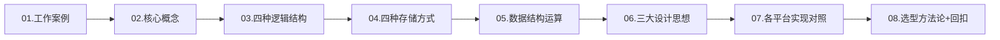
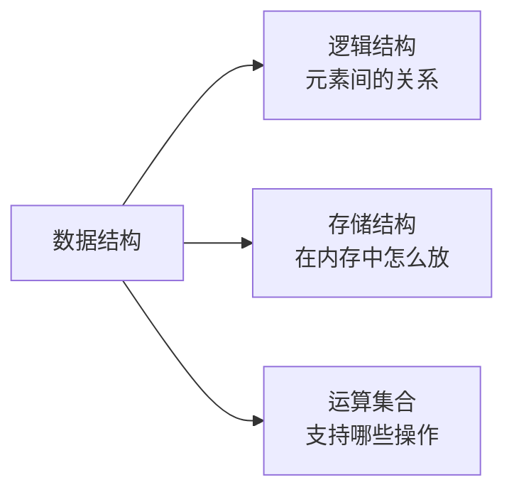
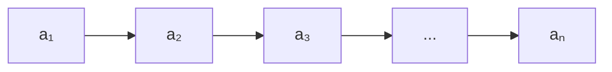
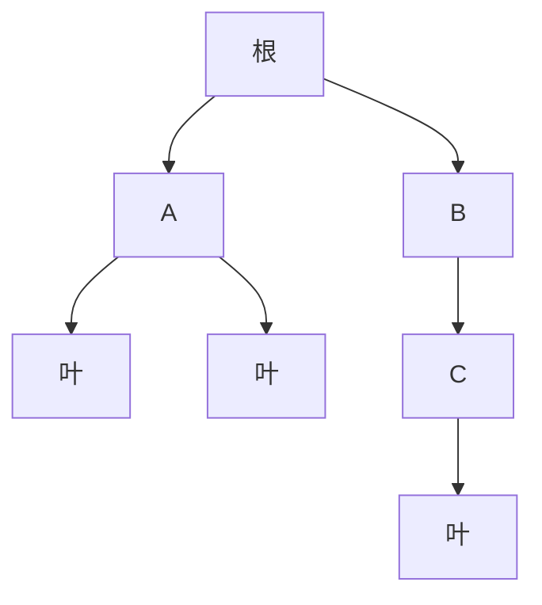
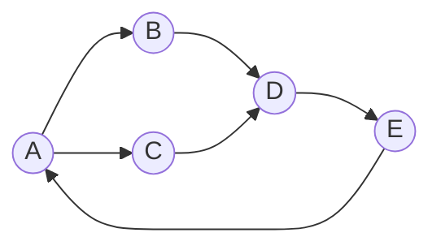
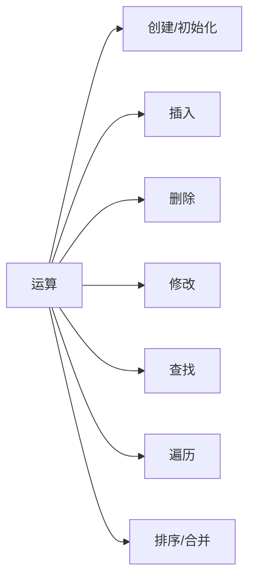
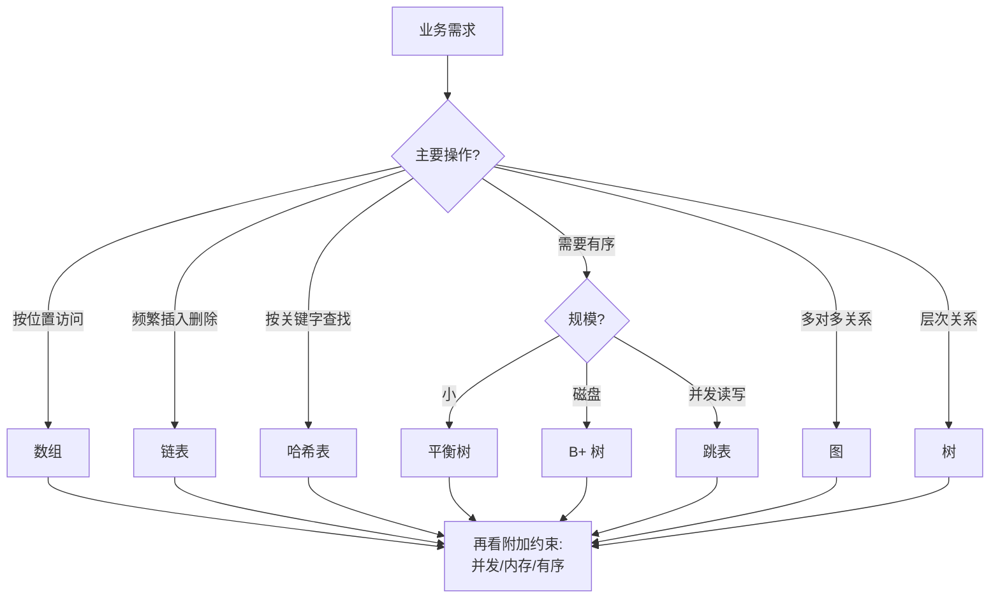

# 结构设计纲要

> 上一篇我们打通了"复杂度分析"的理论地基。本篇往上一层——数据结构本身是如何被设计出来的？四种逻辑结构、四种存储方式、三大核心思想，以及 "面对业务该选哪个" 的方法论。

---

## 目录指引与导读

> 阅读建议：扫一眼二级标题建立全景，再带着"业务怎么选"的问题精读三级。

- [01. 从工作案例说起](#01-从工作案例说起)
  - [1.1 选错结构的事故](#11-选错结构的事故)
  - [1.2 本篇要解决问题](#12-本篇要解决问题)
  - [1.3 全篇结构导航](#13-全篇结构导航)
- [02. 核心概念体系](#02-核心概念体系)
  - [2.1 四个基础术语](#21-四个基础术语)
  - [2.2 数据结构三要素](#22-数据结构三要素)
  - [2.3 程序两大基石](#23-程序两大基石)
- [03. 四种逻辑结构](#03-四种逻辑结构)
  - [3.1 集合结构特性](#31-集合结构特性)
  - [3.2 线性表逻辑](#32-线性表逻辑)
  - [3.3 树形层次关系](#33-树形层次关系)
  - [3.4 图的多对多](#34-图的多对多)
- [04. 四种存储方式](#04-四种存储方式)
  - [4.1 顺序存储原理](#41-顺序存储原理)
  - [4.2 链式存储代价](#42-链式存储代价)
  - [4.3 索引存储应用](#43-索引存储应用)
  - [4.4 散列存储机制](#44-散列存储机制)
- [05. 数据结构运算](#05-数据结构运算)
- [06. 三大设计思想](#06-三大设计思想)
  - [6.1 抽象化ADT思想](#61-抽象化adt思想)
  - [6.2 分治思想运用](#62-分治思想运用)
  - [6.3 权衡取舍法则](#63-权衡取舍法则)
- [07. 各平台实现对照](#07-各平台实现对照)
  - [7.1 标准库映射表](#71-标准库映射表)
  - [7.2 移动端特化版](#72-移动端特化版)
  - [7.3 复杂度速查表](#73-复杂度速查表)
  - [7.4 业务结构映射](#74-业务结构映射)
  - [7.5 源码出处速查](#75-源码出处速查)
- [08. 案例回扣收获](#08-案例回扣收获)
  - [8.1 回到开篇的通讯录事故](#81-回到开篇的通讯录事故)
  - [8.2 三大核心收获](#82-三大核心收获)
  - [8.3 方案评审清单](#83-方案评审清单)
- [09. 思考题深练](#09-思考题深练)
- [10. 课后作业实战](#10-课后作业实战)
- [11. 进阶专题与延伸](#11-进阶专题与延伸)
  - [11.1 持久化数据结构](#111-持久化数据结构)
  - [11.2 并发友好结构](#112-并发友好结构)
  - [11.3 缓存感知结构](#113-缓存感知结构)
  - [11.4 经典书与论文](#114-经典书与论文)

---

## 01. 从工作案例说起

### 1.1 选错结构的事故

我曾经接手过一个通讯录服务，老代码用 `ArrayList<Contact>` 存全部联系人（约 20 万条），需求是按手机号查人。核心代码：

```java
Contact find(String phone) {
    for (Contact c : list)           // O(N) 全表扫描
        if (c.phone.equals(phone)) return c;
    return null;
}
```

单次查询约 40ms，看起来还能接受。直到某天出了个"导入 50 万联系人后批量比对"的需求——代码变成 `O(N²)`，5 分钟跑不完，直接超时。

我当时做了一个一行代码的改动：`ArrayList` → `HashMap<String, Contact>`，查询 `40ms → 0.01ms`，比对任务 `5 分钟 → 2 秒`。

**问题不在代码写得差，而在数据结构没选对**：线性表擅长"按位置访问"，但对"按关键字查找"束手无策——这是由它**一对一的逻辑结构**决定的先天缺陷。选对结构，比优化代码有用得多。

#### 事故的数学推导

把规模 N 代入算一下就能看到"量变到质变"：

| 规模 N | 单次查询 O(N) | 批量比对 O(N²) | 是否雪崩 |
|--------|-------------|---------------|----------|
| 2,000 | ~40 μs | 80 ms | 可接受 |
| 20,000 | ~400 μs | 8 s | 边界 |
| 200,000 | 4 ms | 800 s | 雪崩 |
| 500,000 | 10 ms | 5000 s | 必崩 |

**从 N = 2K 到 N = 500K，规模涨 250 倍，耗时涨 62,500 倍**——这就是 O(N²) 的可怕之处。面试问"O(N²) 什么时候会爆"，正是这一刻。

而换成 HashMap 后：
- 单次查询：平均 O(1) ≈ 100ns；
- 批量比对：O(N) ≈ 50ms（50 万 × 100ns）；
- **规模涨 250 倍，耗时只涨 250 倍**——这就是好数据结构的价值。

#### 为什么"老代码跑得好好的"

工程中常见误区：现有代码没出问题，就没必要改。但数据结构的问题有一个**延迟爆炸**特性：

```
规模小：耗时低 → 观察不到 → 被忽略
规模中：耗时高 → 用户抱怨 → 被当性能问题优化
规模大：雪崩 → P0 事故 → 紧急重构
```

好的工程师要能从**代码上看出"规模炸弹"**。上面那段 `for + equals` 看一眼就该警觉：这是线性扫描，上规模必爆。**Code Review 时的第一个问题永远是"N 多大"**。

### 1.2 本篇要解决的问题

- 数据结构 = 逻辑结构 + 存储结构 + 运算集合，三者到底指什么
- 四种逻辑结构（集合/线性/树/图）对应什么业务关系
- 四种存储方式（顺序/链式/索引/散列）在内存中长什么样
- 三大核心设计思想（抽象、分治、权衡）如何指导选型
- 一套可复用的"数据结构选型"决策框架

#### 读完本篇应当获得的能力

| 能力层 | 具体表现 |
|--------|---------|
| 识别层 | 看到业务问题能说出它对应哪种逻辑结构（集合/线性/树/图） |
| 推理层 | 给定存储结构，能口算主要操作的复杂度 |
| 选型层 | 能从 10+ 候选结构中挑 1 个，并解释为什么淘汰其他 |
| 设计层 | 能定义自己的 ADT，分离接口与实现 |
| 辩护层 | 技术评审中能引用"负载因子/ B+ 树页大小/缓存行"等原理支撑决策 |

如果读到最后能对以上 5 层都有把握，本篇的目的就达到了。

### 1.3 全篇结构导航



---

## 02. 核心概念体系

### 2.1 四个最基础的术语

| 术语 | 定义 | 案例（学生管理） |
|------|------|----------------|
| 数据（Data） | 能被计算机识别处理的符号集合 | 整个学生库的所有信息 |
| 数据项（Data Item） | 不可再分的最小标识单位 | `学号=20230001` |
| 数据元素（Data Element） | 若干数据项构成的一个整体 | 一条完整的学生记录 |
| 数据结构（Data Structure） | 多个数据元素按某种关系构成的集合 | `List<Student>` / `TreeMap<id, Student>` |

```java
// 数据项 → 数据元素
class Student { int id; String name; int age; }

// 数据元素 → 数据结构
List<Student>            list;   // 线性结构详解
TreeMap<Integer,Student> tree;   // 树形结构
Map<Integer,Student>     index;  // 散列结构
```

#### 术语的层级模型

```
bit（位） → byte（字节） → 数据项 → 数据元素 → 数据结构 → 数据集 / 数据库
 1b           8b          若干字段   一条记录    一张表     整个系统
```

**这个层级关系是面试高频考点**——为什么"数据库表"比"数据结构"大一级？因为表是"数据结构 + 持久化 + 事务 + 并发控制"的组合体。`List<Student>` 是运行时内存中的结构，`student 表` 是磁盘上的持久结构，两者逻辑一致但存储差异巨大。

> **术语的跨语言差异**：
> - C 里叫 `struct`，没有方法；
> - C++ 里 `struct` 和 `class` 几乎等同，都能带方法；
> - Java 里 "数据元素" 对应 `class`（或 record，JDK 14+）；
> - Go 里叫 `struct`，方法通过 receiver 绑定；
> - Rust 里 `struct` 可以 impl 方法，但没有继承。
>
> **讨论数据结构时务必先对齐术语**——同一个词在不同语言里含义可能差很多。

### 2.2 数据结构三要素



三者关系：**同一种逻辑结构可以有多种存储实现，不同存储实现支持的运算效率不同**。例如二叉树（逻辑）既可以用数组存（堆），也可以用指针存（普通 BST），选择取决于业务。

#### 三要素的正交性

三个维度之间相互独立，可以自由组合：

| 逻辑结构 | 存储结构 | 运算集 | 实例 |
|---------|---------|-------|------|
| 线性表 | 顺序 | 全功能 | ArrayList |
| 线性表 | 链式 | 全功能 | LinkedList |
| 线性表 | 顺序 | 只能 push/pop | ArrayDeque |
| 线性表 | 顺序 | 只能按优先级 | PriorityQueue（虽逻辑为堆，物理为数组） |
| 树 | 顺序 | 最值 + 插入 | 二叉堆 |
| 树 | 链式 | 全功能 | TreeMap |
| 集合 | 散列 | 存在性查询 | HashSet |
| 集合 | 位图 | 存在性查询 | BitSet |
| 图 | 邻接矩阵 | 查邻接 | 稠密图 |
| 图 | 邻接表 | 遍历邻接 | 稀疏图 |

**关键洞察**：同一个业务需求（比如"有序集合"）可以有 N 种实现；同一个数据结构（比如 HashMap）又可以有 N 种物理布局（开放寻址 vs 链地址）。**选型就是在这个 3D 空间里挑一个最优坐标点**。

### 2.3 程序两大基石

> Niklaus Wirth，1976：**程序 = 数据结构 + 算法**。

数据结构决定数据如何**存储与关联**，算法决定数据如何**操作与处理**。两者选择相互制约：

| 数据结构 | 查找 | 插入 | 限制 |
|---------|------|------|------|
| 数组 | `O(log N)` 二分 | `O(N)` | 不支持高效插入 |
| 链表 | `O(N)` | `O(1)` | 不支持随机访问 |
| 哈希表 | `O(1)` | `O(1)` | 不支持有序遍历 |
| 平衡树 | `O(log N)` | `O(log N)` | 实现复杂 |

#### Wirth 公式的现代延伸

Wirth 在 2009 年采访中说："如果今天重写这本书，我会加上**并发控制**和**内存布局**两个维度。" 扩展后的公式：

```
程序 = 数据结构 + 算法 + 并发模型 + 内存布局
```

- **并发模型**：同一个 HashMap，单线程用 `HashMap`，多线程用 `ConcurrentHashMap`（分段锁 / CAS），分布式用 Redis Cluster（一致性哈希 + 槽位迁移）；
- **内存布局**：同一个二叉堆，C++ `priority_queue` 是数组连续布局，Java `PriorityQueue` 是 `Object[]` 包装引用，实际是"指针数组 + 离散对象"。前者缓存命中率远高于后者。

**现代工程师做方案时，必须同时考虑这 4 个维度**——只盯着"数据结构 + 算法"是 1990 年代的思维方式，已经落后。

---

## 03. 四种逻辑结构

按数据元素间的关系划分，所有数据结构归为 4 类：

| 结构 | 关系 | 代表 | 业务原型 |
|------|------|------|---------|
| 集合 | 无关系 | Set | 一袋弹珠、在线用户集合 |
| 线性表 | 一对一 | 数组 / 链表 | 排队、日程表 |
| 树 | 一对多 | 二叉树 / B 树 | 组织架构、文件系统 |
| 图 | 多对多 | 邻接表 / 邻接矩阵 | 社交网络、路网 |

### 3.1 集合结构特性

**数学三性**：确定性、互异性、无序性。

> **底层原理**：集合本身只关心"是不是属于"——这是一种**纯关系判断**。HashSet 用哈希函数把元素映射到桶，TreeSet 用红黑树把元素按序组织——同样是集合，"无序集合"和"有序集合"在内存中长得完全不同。

核心操作及复杂度：

| 操作 | HashSet | TreeSet |
|------|---------|---------|
| `add` / `remove` / `contains` | O(1) | O(log N) |
| 交集 ∩ | O(min(m,n)) | O(m log n) |
| 并集 ∪ | O(m+n) | O(m log n) |
| 差集 − | O(m) | O(m log n) |

```java
Set<String> online  = new HashSet<>(Arrays.asList("alice", "bob", "charlie"));
Set<String> premium = new HashSet<>(Arrays.asList("bob", "david", "eve"));

Set<String> inter = new HashSet<>(online); inter.retainAll(premium);  // 交：{bob}
Set<String> union = new HashSet<>(online); union.addAll(premium);     // 并：5 个
Set<String> diff  = new HashSet<>(online); diff.removeAll(premium);   // 差：{alice, charlie}
```

#### 集合运算的内部实现原理

以 `retainAll`（求交集）为例，JDK `AbstractCollection.retainAll` 的源码大致是：

```java
public boolean retainAll(Collection<?> c) {
    boolean modified = false;
    Iterator<E> it = iterator();
    while (it.hasNext()) {
        if (!c.contains(it.next())) {       // 关键：contains 的复杂度决定整体
            it.remove();
            modified = true;
        }
    }
    return modified;
}
```

**复杂度取决于参数类型**：
- `a.retainAll(b)`，a 是 HashSet，b 是 HashSet → O(|a|)（contains O(1)）；
- `a.retainAll(b)`，a 是 HashSet，b 是 **List** → O(|a| × |b|)（contains O(N)）；
- `a.retainAll(b)`，a 是 TreeSet，b 是 TreeSet → O(|a| log |b|)。

> **常见陷阱**：代码里写 `set.retainAll(someList)`，编译器不报错，但 List 的 `contains` 是 O(N)，整体瞬间变 O(M×N)。线上事故频发——**传入 retainAll 的参数请务必也是 Set**。

#### 位图集合：极省内存的特化

当集合元素是 `[0, N)` 范围内的整数，用 `BitSet` 比 `HashSet` 省 64 倍内存：

```java
BitSet a = new BitSet(1_000_000);
a.set(123);
a.set(456);
BitSet b = new BitSet(1_000_000);
b.set(456);
b.set(789);
a.and(b);        // 交集，单条 CPU AND 指令可处理 64 位
```

- **空间**：1 百万元素 HashSet 约 64MB，BitSet 约 125KB，省 **500 倍**；
- **时间**：交集运算 O(N/64)——CPU 指令级并行；
- **应用**：搜索引擎倒排索引的 posting list 压缩、数据库 bitmap 索引、游戏场景的"技能冷却标志位"。

> **Roaring Bitmap**：工业级压缩位图，Elasticsearch/Lucene/Druid/Spark 都在用。它按高 16 位分桶，每桶用稀疏（short 数组）或密集（位图）两种表示自适应切换，1 亿规模集合可压到 10MB 量级。

### 3.2 线性表逻辑

一对一关系，除首尾外每个元素都有唯一前驱和后继。



顺序表 vs 链表的核心对比：

| 维度 | 顺序表（数组） | 链表 |
|------|--------------|------|
| 内存布局 | 连续 | 离散 |
| 随机访问 | `O(1)` | `O(N)` |
| 头部插入 | `O(N)` | `O(1)` |
| 尾部插入 | 均摊 `O(1)` | `O(1)`（有尾指针） |
| CPU 缓存 | 友好 | 不友好 |
| 内存开销 | 仅数据 | 数据 + 指针（32B 节点仅存 4B 数据时浪费 50%+） |

#### 一对一关系的数学表达

线性表形式化定义为一个序列 `(a₁, a₂, ..., aₙ)`，满足：
- 除 `a₁` 外每个元素有唯一**前驱**；
- 除 `aₙ` 外每个元素有唯一**后继**；
- `n = 0` 时称为**空表**。

这种"唯一前驱、唯一后继"的性质就是一对一关系的数学表达。它直接决定了：
- **可以按位置访问**（第 i 个）——位置本身成为坐标；
- **不能直接按"关系"跳转**——要找 `a₅` 的前驱必须先知道位置 5；
- **可以定义顺序**——a₁ < a₂ < ... < aₙ 是"位置序"，与值序无关。

#### 顺序表的地址计算细节

```
LOC(a_i) = LOC(a_1) + (i - 1) × sizeof(ElemType)
```

对 CPU 来说，这是一条 `LEA`（Load Effective Address）指令能完成的操作，因此 `a[i]` 真正达到 O(1)。**这一条特性是链表永远做不到的**——链表从头结点跳到第 i 个节点必须执行 i 次 "加载指针" 指令，且每次可能 cache miss。

#### 链表的侵入式（intrusive）与非侵入式

```c
// 非侵入式（常见教科书写法）
struct Node { int data; struct Node* next; };

// 侵入式（Linux 内核 list_head 风格）
struct list_head { struct list_head *next, *prev; };
struct user_task {
    int id;
    char name[32];
    struct list_head link;   // 把链表字段嵌入业务结构体
};

// 通过 container_of 宏从 link 回到 user_task
#define container_of(ptr, type, member) \
    ((type*)((char*)(ptr) - offsetof(type, member)))
```

**侵入式链表的好处**：
1. 少一次内存分配（`Node` 和 `user_task` 合并为一块）；
2. 一个业务对象可以同时存在于多个链表（多维度索引）；
3. 没有泛型也能实现通用链表（C 语言首选）。

**Linux 内核 5000 多处链表使用都是这种风格**，这是工程上对"链表内存开销"的终极优化。

### 3.3 树

**定义**：n 个节点的有限集，具有层次关系。



关键子类：二叉树、BST、AVL、红黑树、B+ 树、堆、Trie。后续章节会逐一展开。

#### 树的形式化定义

树 T 是一个包含 n（n ≥ 0）个节点的有限集，满足：
- 存在一个称为**根**（root）的特殊节点；
- 其余 n-1 个节点被划分为 m（m ≥ 0）个互不相交的子集 T₁, T₂, ..., Tₘ；
- 每个子集本身又是一棵树，称为根的**子树**（subtree）。

**这个定义是递归的**——"树的子树还是树"。正因为这个递归性质，树上的几乎所有算法都可以写成递归形式：

```java
// 树的三个核心递归量
int size(Node r)   { return r == null ? 0 : 1 + size(r.left) + size(r.right); }
int height(Node r) { return r == null ? 0 : 1 + Math.max(height(r.left), height(r.right)); }
int count(Node r, int x) {
    if (r == null) return 0;
    return (r.val == x ? 1 : 0) + count(r.left, x) + count(r.right, x);
}
```

**每一个递归式都对应主定理的一种形式**——这就是为什么上一篇"复杂度分析"是本篇的地基。

#### 树的 7 个核心术语

| 术语 | 含义 | 例子（上图） |
|------|------|------------|
| 节点的度 | 子节点数 | A 的度为 2 |
| 树的度 | 所有节点度的最大值 | 2（二叉树） |
| 叶子 | 度为 0 的节点 | A1、A2、B11 |
| 层次 | 根在第 1 层，子在 +1 层 | B1 在第 3 层 |
| 深度 | 从根到节点的边数 | A1 深度为 2 |
| 高度 | 从节点到最深叶子的边数 | 根的高度为 3 |
| 森林 | m 棵不相交的树 | 删掉根后得到的 m 个子树 |

> **深度 vs 高度**：这是刷题高频坑——LeetCode 104 叫"二叉树的最大深度"，但 corners case 里用的是高度定义（`height(null) = -1` 或 `0`）。工程中**统一用"节点数"而不是"边数"**能避开大部分边界错误。

#### 为什么"二叉树"最常用

理论上树可以有任意度，但二叉树（度 ≤ 2）几乎是数据结构家族的"万能插座"：

1. **任意 m 叉树都能用二叉树表示**（孩子兄弟表示法：左孩子-右兄弟）；
2. **二叉树的性质极其优美**——n₀ = n₂ + 1（叶子数 = 度 2 节点数 + 1）；
3. **完全二叉树可以用数组紧凑存储**——父子关系用下标算：`parent = i/2`，`left = 2i`，`right = 2i+1`（下标从 1 起），这就是二叉堆的底层；
4. **硬件友好**——一次二分查找只走 log₂ N 步，现代 CPU 的分支预测对"二路分支"优化最好。

所以学树结构，**先把二叉树榨干，再看其他**。

### 3.4 图的多对多

顶点 + 边，多对多关系。分为有向/无向、有权/无权。

> **图的存储两难**：邻接矩阵 `O(V²)` 空间但查"任意两点是否相连"是 `O(1)`；邻接表 `O(V+E)` 空间但查邻接需要遍历。**稠密图用矩阵，稀疏图用邻接表**——社交网络通常稀疏（每人朋友数远小于总人数），所以微博/微信的关系数据底层都用邻接表 + 哈希索引。



典型场景：社交关系、路径规划、依赖分析、知识图谱。

#### 图的形式化定义与分类

G = (V, E)，V 是顶点集，E 是边集。按 5 个维度分类：

| 维度 | 类型 | 例子 |
|------|------|------|
| 方向 | 有向 / 无向 | 微博关注（有向）、微信好友（无向） |
| 权重 | 有权 / 无权 | 路网（权=距离）、好友图（无权） |
| 连通 | 连通 / 非连通 | 公交网（连通）、社交孤岛 |
| 环 | 有环 / 无环（DAG） | 任务依赖（DAG）、引用关系（可能有环） |
| 稠密度 | 稠密（E ≈ V²）/ 稀疏（E ≈ V） | 棋盘邻接（稠密）、大型社交图（稀疏） |

**工程上 90% 的图是稀疏图**：人均好友 200，注册用户 10 亿，E/V² = 200/(10⁹)² ≈ 2×10⁻¹⁸，远远小于 1。

#### 邻接矩阵 vs 邻接表的代码实现

```java
// 邻接矩阵：二维数组，O(V²) 空间
int[][] adjMatrix = new int[V][V];
adjMatrix[u][v] = weight;            // 加边 O(1)
boolean connected = adjMatrix[u][v] != 0;  // 查邻接 O(1)
// 遍历 u 的所有邻居 O(V)

// 邻接表：每个点一个链表/List，O(V + E) 空间
List<List<int[]>> adjList = new ArrayList<>();  // adjList[u] = [[v, weight], ...]
adjList.get(u).add(new int[]{v, weight});      // 加边 O(1)
// 查 u-v 邻接 O(度(u))
// 遍历 u 的所有邻居 O(度(u))
```

**工业级存储**：大图不用 `List<List>`，而用**压缩稀疏行（CSR）**格式——两个数组，`offsets[V+1]` 存每个点的邻居起始位置，`edges[E]` 存所有邻居连续编号。这种布局缓存命中率极高，图算法性能提升 3-10 倍。Facebook 的 Cassovary、阿里的 GraphScope 都采用 CSR。

```
V=4，边 {0→1, 0→2, 1→2, 2→3}
offsets = [0, 2, 3, 4, 4]      // 顶点 i 的邻居在 edges[offsets[i]..offsets[i+1]]
edges   = [1, 2, 2, 3]
```

#### 图算法的"复杂度三板斧"

记住这三组复杂度，工程选型时够用 90% 场景：

| 算法 | 邻接表 | 邻接矩阵 | 典型用途 |
|------|-------|---------|---------|
| BFS / DFS | O(V + E) | O(V²) | 连通性、层序遍历 |
| Dijkstra（堆优化） | O((V+E) log V) | O(V²) | 单源最短路 |
| Floyd | O(V³) | O(V³) | 全源最短路 |
| Prim（堆优化） | O(E log V) | O(V²) | 最小生成树 |
| 拓扑排序 | O(V + E) | O(V²) | 依赖解析、编译顺序 |

**Dijkstra 为什么是 log V 不是 log E**：堆里最多同时存在 V 个元素（每个点最多进堆一次），E 次 relaxation 都是堆内操作 log V——这是复杂度分析的经典细节。

---

## 04. 四种存储方式

逻辑结构说的是"关系"，存储方式说的是"内存里长什么样"。

### 4.1 顺序存储

**连续内存 + 下标计算地址**。

```
地址计算：a[i] 的地址 = base_addr + i × sizeof(elem)
int 数组 base=0x1000：
  a[0]→0x1000  a[1]→0x1004  a[2]→0x1008  a[3]→0x100C
```

**隐藏优势——CPU 缓存友好**：CPU 每次加载一整个缓存行（通常 64 字节），连续内存一次加载能覆盖多个元素，遍历命中率 > 95%。

```
顺序：[a₀][a₁][a₂][a₃][a₄][a₅][a₆][a₇]
      ├──── 缓存行1 ───┤├─── 缓存行2 ───┤
      ↑ 加载 a₀ 时 a₁~a₃ 自动进缓存
```

#### 顺序存储的动态扩容

定长数组一旦写满就没法加元素，于是有了"动态数组"——它对外表现为顺序存储，对内维护 `capacity` 和 `size` 两个字段，**装满时拷贝到更大的数组**：

```java
// ArrayList#grow 的简化版
void grow(int minCapacity) {
    int oldCap = elementData.length;
    int newCap = oldCap + (oldCap >> 1);        // 扩 1.5 倍
    if (newCap < minCapacity) newCap = minCapacity;
    elementData = Arrays.copyOf(elementData, newCap);
}
```

**均摊分析**：N 次 `add` 的总拷贝次数约 `2N`，均摊每次 O(1)。这就是"均摊 O(1)"的来源，也是上一篇复杂度分析里聚合分析法的经典应用。

> **扩容倍数的秘密**：Java ArrayList 用 1.5×，C++ vector 用 2×，Python list 用 1.125× 起步。大倍数浪费空间但拷贝次数少，小倍数反之。**1.5 是经验最优**——GCC 团队论文证明，2× 会让"释放的旧空间永远小于新申请"，无法复用内存池的碎片，而 1.5× 能让碎片在几次扩容后被复用。

#### 顺序存储在 AI 时代的新地位

2023 年后，深度学习主导的工作负载里，顺序存储的地位进一步上升：
- **GPU/TPU 运算的最小单位是 tensor**——本质是高维连续数组；
- **向量数据库（FAISS, Milvus）**存储 embedding，1 亿条 × 768 维 float 就是 300GB 的连续内存；
- **transformer 的 KV Cache** 也是连续内存，优化重点就是"避免离散"。

未来十年，"离散存储结构"会越来越像老古董，而"连续内存 + SIMD + GPU 并行"的组合会吃掉更多场景。

### 4.2 链式存储代价

**离散内存 + 指针链接**。

```cpp
struct Node {
    int data;          // 4 字节
    Node* next;        // 8 字节（64位系统）
};
// 每节点 16 字节（含对齐），指针占 50%
```

代价：空间开销大、缓存不友好。收益：插入删除 O(1)、动态扩展。

> **指针膨胀**：节点数据越小，指针占比越离谱。存 `int` 时指针占 50%，存 `bool` 时甚至到 80%。**这就是为什么 Linux 内核 list_head 选择"侵入式链表"（指针嵌入业务结构体内部）——本质就是把指针成本平摊到原本就要分配的对象上。**

#### 链式存储的 cache miss 代价量化

设链表节点分散在堆上，每个节点读取都可能触发 cache miss（L1 ~1ns、L2 ~4ns、L3 ~10ns、DRAM ~100ns）。遍历 1M 节点的链表：

- **理想（全命中 L1）**：1M × 1ns = 1 ms
- **悲观（全 miss DRAM）**：1M × 100ns = 100 ms
- **实测**：通常在 30~50 ms

同规模连续数组遍历只要 2-3 ms——**差距 10~20 倍**。这是"算法复杂度相同，实际性能差一个数量级"的最常见原因，也是为什么 **Java LinkedList 在 JDK 21 文档里被官方标注"大多数场景都应该用 ArrayList 替代"**。

#### 链式存储的 3 个变体

```c
// 1) 单链表
struct Node { int data; Node* next; };

// 2) 双链表（Java LinkedList 用这个）
struct Node { int data; Node *prev, *next; };

// 3) 循环链表（尾节点 next 指回头节点）
//   常用于：时间片轮转调度、Redis ziplist 退化时的环形结构

// 4) 跳表（多层链表 + 索引，后文 11.2 会展开）
```

工程上**首选双链表**——多了 `prev` 指针后，删除某个已知节点是 O(1)，逆序遍历也天然支持，代价只是多 8 字节。"节约 8 字节"在现代内存白菜价的环境里不值一提。

### 4.3 索引存储应用

**数据 + 索引表**，索引表告诉你数据在哪。数据库的 B+ 树索引是典型。

```
B+ 树索引查 ID=35 的流程：
  根 → [30,40] → 叶子数据页
  通常 3 次磁盘 IO，而全表扫描可能上万次
```

> **索引为什么是 B+ 树而不是红黑树**：磁盘 IO 单位是页（4KB-16KB），一次磁盘读能拉回大量数据。B+ 树每个节点装数百个 key，树高 3-4 层就能索引十亿条数据；红黑树每节点 1 个 key，索引十亿要 30 层——磁盘 IO 是百倍差距。

#### B+ 树的"分叉数"量化

InnoDB 默认页大小 16KB，假设 key 是 8 字节 BIGINT，指针 6 字节：
- 非叶子节点每页能装 `16KB / 14B ≈ 1170` 个 key；
- 叶子节点假设每行 1KB，能装 `16`  行；
- **3 层 B+ 树可索引行数**：`1170 × 1170 × 16 ≈ 2190 万`；
- **4 层 B+ 树**：`1170³ × 16 ≈ 256 亿` 行。

**所以 MySQL 表不超过 2000 万行时，主键查询只需 3 次磁盘 IO**——这是面试高频结论，也是"单表建议 2000 万"的理论来源（实际更多是写放大考虑）。

#### 索引的分类与代价

| 类型 | 结构 | 适用场景 | 代价 |
|------|------|---------|------|
| 聚簇索引 | B+ 树（叶子存行） | 主键查询、范围查询 | 每表只能一个 |
| 辅助索引 | B+ 树（叶子存主键） | 二级字段查询 | 回表 |
| 哈希索引 | 哈希表 | 等值查询 | 不支持范围 |
| 全文索引 | 倒排索引 | 文本搜索 | 写入慢 |
| 位图索引 | bitmap | 低基数字段（性别） | 写入需加锁 |
| 空间索引 | R 树 / GeoHash | 地理位置 | 实现复杂 |
| 向量索引 | HNSW / IVF | 向量相似度 | 大内存 |

**没有"万能索引"**——每种索引都是"在某种查询模式上快，在其他操作上慢"的权衡，这正是第 6 章"权衡思想"的生动展示。

### 4.4 散列存储机制

**哈希函数直接算出地址**：`key → hash(key) → 地址`。

```
常用散列函数：
  除留余数法：h(k) = k % p           （p 取质数）
  乘法散列：  h(k) = ⌊m·(k·A mod 1)⌋（A≈0.618）
  全域散列：  h(k) = ((a·k+b) mod p) mod m

冲突解决：
  链地址法（Java HashMap）
  开放寻址（Python dict）
  再散列
```

哈希表是平均 O(1) 的明星，但没有"免费"的 O(1)——换来的是空间浪费（负载因子 < 1）和冲突处理开销。

> **负载因子的物理含义**：Java HashMap 默认 0.75，意为"装 75% 就扩容"——这是空间和时间的折中。装得太满冲突率指数上升（链表退化），装得太空浪费内存。0.75 是 Doug Lea 经过大量实验得出的经验最优。

#### 散列函数的三条硬要求

一个"好"的散列函数必须同时满足：

1. **确定性**：同一 key 永远算出同一 hash；
2. **均匀性**：任意 key 映射到任意桶的概率都接近 1/M；
3. **雪崩性**：输入改动 1 bit，输出至少有一半 bit 翻转——这样相似的 key（比如 `"abc1"` 和 `"abc2"`）不会落到相邻桶，避免聚集。

Java `HashMap` 的 hash 扰动函数就是为了满足第 3 条：

```java
// JDK 8 HashMap#hash
static final int hash(Object key) {
    int h;
    return (key == null) ? 0 : (h = key.hashCode()) ^ (h >>> 16);
}
// 把高 16 位异或到低 16 位——让高位也参与桶定位，避免低位偶发相同导致聚集
```

#### 冲突解决的深度对比

| 方法 | 代表 | 优点 | 缺点 |
|------|------|------|------|
| 链地址 | Java HashMap | 实现简单、支持高负载 | 指针开销、cache 不友好 |
| 开放寻址-线性 | Python dict（早期） | cache 友好 | 一次聚集严重 |
| 开放寻址-双重哈希 | C++ unordered_map（部分实现） | 聚集少 | 删除复杂（需 tombstone） |
| Robin Hood Hashing | Rust HashBrown | 查找方差小 | 插入稍复杂 |
| Cuckoo Hashing | 部分 KV 存储 | 最坏 O(1) 查找 | 插入可能死循环 |

**现代趋势**：开放寻址 + Robin Hood 回潮（Rust HashBrown、Swift Dictionary、Google Abseil flat_hash_map 都用这种）——原因是缓存友好，在现代 CPU 上整体快 20-50%。

#### JDK 8 的"链 → 树"优化

JDK 8 把 HashMap 的冲突链表在**长度 ≥ 8 且桶数组 ≥ 64** 时升级为红黑树，查找从 O(N) 退化为 O(log N)。为什么阈值是 8？

> 源码注释（`HashMap.java`）给出泊松分布计算：负载因子 0.75 时，一个桶装 k 个节点的概率为 `(0.5)^k / k!`——k=8 时概率约 `0.00000006`，几乎不会自然发生；一旦发生说明遭遇哈希攻击或糟糕的 hashCode，此时树化能挽救。

这是**工程权衡的教科书案例**：平时用便宜的链表，异常情况自动退化到贵但稳的红黑树。

---

## 05. 数据结构运算

一组标准运算构成数据结构的接口：



每种运算在不同存储结构上的复杂度差异巨大。这正是**选型的决策依据**。

#### 运算的"幂等性"与"副作用"

数据结构的运算按是否修改结构分两类：

| 类别 | 代表 | 并发友好度 |
|------|------|-----------|
| 只读 | `get / contains / size / iterator` | 高（可多线程无锁并发） |
| 读写 | `add / remove / put / clear` | 低（需要同步） |

**工程原则**：如果某条业务链路 95% 是只读，应优先选 `ImmutableMap / CopyOnWriteArrayList` 这类"写时复制"结构——读无锁、写重建。Guava、Clojure、Scala 的大部分集合都是这种设计。

#### 运算集与迭代器

迭代器（Iterator）是数据结构"对外暴露遍历能力"的标准协议：

```java
interface Iterator<E> {
    boolean hasNext();
    E next();
    default void remove() { throw new UnsupportedOperationException(); }
}
```

**fail-fast vs fail-safe**：
- JDK `ArrayList` 的迭代器是 fail-fast：遍历中修改会抛 `ConcurrentModificationException`；
- `CopyOnWriteArrayList` 是 fail-safe：遍历的是快照，不会抛异常但看不到新改动；
- `ConcurrentHashMap` 是弱一致：部分反映新改动。

**接口相同，语义不同，这就是 ADT 思想允许的多实现**——下一节展开。

---

## 06. 三大核心设计思想

### 6.1 抽象化——ADT 思想

把"是什么"（接口）和"怎么做"（实现）分离。

```java
interface Stack<E> {
    void push(E e);
    E pop();
    E peek();
    boolean isEmpty();
}

class ArrayStack<E> implements Stack<E> { /* 数组实现 */ }
class LinkedStack<E> implements Stack<E> { /* 链表实现 */ }

// 用户代码无感切换
Stack<Integer> s = new ArrayStack<>();
// 性能不满足？换一行：
Stack<Integer> s = new LinkedStack<>();
```

抽象的层次：现实问题 → 识别实体关系 → 选择逻辑结构 → 选择存储结构 → 编码。

#### ADT 的三个组成部分

形式化定义一个 ADT 需要写清楚：

```
ADT Stack<E>:
  Data:
    有限的元素序列 s₁, s₂, ..., sₙ，允许为空
  Operations:
    push(e)   → void     前置条件：无
    pop()     → E        前置条件：非空
    peek()    → E        前置条件：非空
    isEmpty() → boolean  前置条件：无
  Axioms (代数定义):
    pop(push(s, e)) = s
    peek(push(s, e)) = e
    isEmpty(new Stack()) = true
    isEmpty(push(s, e)) = false
```

**代数公理是 ADT 正确性的"证据"**。工程实现只要满足公理，就可以自由替换——这是 Liskov 替换原则的数据结构版本。

#### "抽象"的收益在长期维护

短期看 `interface Stack` 看起来"多此一举"，但它带来三个长期价值：

1. **测试可替换**：单元测试用内存实现，线上用 Redis 实现，接口不变；
2. **演进平滑**：从单机栈到分布式栈，业务代码零改动；
3. **诊断清晰**：性能瓶颈时，换个实现做对照实验只需一行代码。

> **反面教材**：某电商用 `HashMap` 做 session 存储，散落在 30 个 Controller 里直接调 `session.get(key)`。后来要换 Redis，改了 3 周才切完——这就是**不做抽象的代价**。

### 6.2 分治思想运用

```
solve(problem):
    if 基本情况: return 直接求解
    subs   = divide(problem)
    result = [solve(s) for s in subs]
    return combine(result)
```

归并排序是教科书级例子：

```java
static int[] mergeSort(int[] a) {
    if (a.length <= 1) return a;
    int m = a.length / 2;
    int[] left  = mergeSort(Arrays.copyOfRange(a, 0, m));
    int[] right = mergeSort(Arrays.copyOfRange(a, m, a.length));
    return merge(left, right);
}
// T(n) = 2T(n/2) + O(n) → O(n log n)
```

> **主定理（Master Theorem）**：递归式 `T(n) = aT(n/b) + f(n)` 的解由 `f(n)` 与 `n^(log_b a)` 的大小关系决定。归并排序 `a=2, b=2, f(n)=O(n)`，恰好平衡，得 `O(n log n)`——这是分治算法复杂度分析的核心工具。

分治在数据结构中的化身：

| 结构 | 分治体现 |
|------|---------|
| BST | 左子树 < 根 < 右子树，每次排除一半 |
| 堆 | 只处理根到叶一条路径（log N） |
| B 树 | 多路分支，每层比较 O(log m) |
| 跳表 | 多层索引，每层跳过约一半 |
| 线段树 | 区间递归二分 |

#### 分治的三个成立条件

不是所有问题都能分治。一个问题可分治当且仅当满足：

1. **子问题同结构**：子问题与原问题同类型（数组分成两半仍是数组）；
2. **子问题独立**：子问题之间没有重叠（否则要用动态规划）；
3. **结果可合并**：子问题的解能在低于原问题复杂度下合并。

**反例**：
- 最长公共子序列（LCS）——子问题有重叠，要用 DP，不能纯分治；
- 图最短路——子路径依赖全局信息，Dijkstra 用贪心而非分治。

#### 从"分治算法"到"分治架构"

分治思想在软件架构里有宏观体现：

| 软件层级 | 分治化身 |
|---------|---------|
| 算法 | 归并排序、快排、FFT |
| 数据结构 | BST、堆、线段树、KD 树 |
| 并发 | Fork-Join 框架、MapReduce |
| 微服务 | 服务拆分（按业务域分） |
| 分布式系统 | 分库分表、一致性哈希分片 |
| 前端 | 组件树（每个组件只关心自己的子树） |

**这就是为什么"学好数据结构"能辐射到架构设计**——底层思想是相通的，只是规模不同。

### 6.3 权衡——No Free Lunch

没有一种结构在所有操作上都最优。以"有序数据存储"为例：

| 方案 | 查找 | 插入 | 删除 | 代价 |
|------|------|------|------|------|
| 有序数组 | `O(log N)` | `O(N)` | `O(N)` | 写太慢 |
| BST | `O(log N)` | `O(log N)` | `O(log N)` | 可能退化成链表 |
| 红黑树 | `O(log N)` | `O(log N)` | `O(log N)` | 实现复杂 |
| 跳表 | `O(log N)` | `O(log N)` | `O(log N)` | 额外 O(N) 空间 |
| B+ 树 | `O(log N)` | `O(log N)` | `O(log N)` | 内存大、磁盘友好 |

**工程决策矩阵**：

| 约束 | 推荐 | 理由 |
|------|------|------|
| 读多写少 | 数组 / B+ 树 | 缓存友好 |
| 写多读少 | 链表 / LSM 树 | 顺序写 |
| 内存紧张 | 位图 / 布隆过滤器 | 极省空间 |
| 需要排序 | 平衡树 / 跳表 | 天然有序 |
| 追求极快查找 | 哈希表 | `O(1)` |
| 磁盘存储 | B / B+ 树 | 减少 IO |

#### 权衡的五条万能轴

任何数据结构选型都是在以下 5 个维度之间做取舍：

```
        时间
         ↑
         │
空间 ← ─ ┼ ─ → 一致性
         │
         ↓
       可用性 ↔ 实现复杂度
```

| 轴 | 对立面 | 例子 |
|----|-------|------|
| 时间 ↔ 空间 | 快 vs 省 | 布隆过滤器省空间但有假阳性 |
| 读 ↔ 写 | 读快 vs 写快 | B+ 树读快，LSM 树写快 |
| 一致性 ↔ 可用性 | 强一致 vs 高可用 | 分布式系统的 CAP |
| 精确 ↔ 近似 | 绝对正确 vs 可接受误差 | HyperLogLog 只用 12KB 估计 10 亿 UV |
| 通用 ↔ 专用 | 万能但慢 vs 特化但快 | HashMap vs SparseArray |

**技术评审时，把决策画到这个五轴坐标系上，就能快速说服评审者**——"我们选 LSM 树，是因为业务是 10:1 写读比，时间维度上写比读重要"。

#### 真实业务的权衡案例

| 公司/系统 | 结构选择 | 权衡 |
|----------|---------|------|
| MySQL InnoDB | B+ 树 | 磁盘友好 vs 内存浪费 |
| RocksDB / LevelDB | LSM Tree | 写放大 vs 读放大 |
| Redis ZSet | 跳表 + 哈希 | 空间 × 2 换实现简单 + 并发友好 |
| Kafka | 追加日志（本质是顺序数组） | 顺序写极快 vs 不支持随机改 |
| ClickHouse | 列存 | 写分散 vs 读聚合极快 |
| Elasticsearch | 倒排索引 + 列存 | 写慢 vs 搜索极快 |
| Redis HyperLogLog | 概率结构 | 12KB 估计 10 亿 vs 有 0.81% 误差 |

**每一条都是权衡的胜利**。你看到的"某数据库快"，本质是在某个维度上做了激进优化而在别的维度牺牲。

---

## 07. 各平台实现对照

### 7.1 标准库映射表

| 抽象 | Java | C++ STL | Go | Swift | Kotlin | Rust |
|-----|------|--------|----|-------|--------|------|
| 动态数组 | ArrayList | vector | slice | Array | MutableList | Vec |
| 链表 | LinkedList | list | container/list | — | LinkedList | LinkedList |
| 哈希表 | HashMap | unordered_map | map | Dictionary | HashMap | HashMap |
| 有序映射 | TreeMap | map | — | — | TreeMap | BTreeMap |
| 哈希集合 | HashSet | unordered_set | — | Set | HashSet | HashSet |
| 栈 | ArrayDeque | stack | slice | Array | ArrayDeque | Vec |
| 队列 | ArrayDeque | queue | list | Array | ArrayDeque | VecDeque |
| 优先队列 | PriorityQueue | priority_queue | heap | — | PriorityQueue | BinaryHeap |

### 7.2 移动端特化实现

Android 对小规模 / int key 的内存优化：

```java
SparseArray<String>      sparse = new SparseArray<>();   // 替代 HashMap<Integer,V>，免装箱
ArrayMap<String,Integer> map    = new ArrayMap<>();      // 替代 HashMap<String,V>，小数据量省内存
SparseBooleanArray       flags  = new SparseBooleanArray();
```

Swift 的 COW（写时复制）让值类型集合也能零拷贝共享：

```swift
var a = [1,2,3,4,5]
var b = a        // 共享底层存储
b.append(6)      // 此时才真正拷贝
```

### 7.3 复杂度速查表

| 结构 | 访问 | 搜索 | 插入 | 删除 | 空间 |
|------|------|------|------|------|------|
| 数组 | O(1) | O(N) | O(N) | O(N) | O(N) |
| 链表 | O(N) | O(N) | O(1) | O(1) | O(N) |
| 栈/队列 | — | O(N) | O(1) | O(1) | O(N) |
| 哈希表 | — | O(1) | O(1) | O(1) | O(N) |
| BST | O(log N) | O(log N) | O(log N) | O(log N) | O(N) |
| 红黑树 | O(log N) | O(log N) | O(log N) | O(log N) | O(N) |
| 堆 | O(1)* | O(N) | O(log N) | O(log N) | O(N) |
| B+ 树 | O(log N) | O(log N) | O(log N) | O(log N) | O(N) |

> *堆的 O(1) 指获取最值。

### 7.4 业务结构映射

| 业务 | 推荐结构 | 原因 |
|------|---------|------|
| 列表展示 | ArrayList | 随机访问快 |
| 撤销重做 | 栈 | LIFO |
| 任务调度 | 优先队列 | 按优先级出队 |
| 社交关系 | 邻接表 | 多对多 |
| 缓存（LRU） | HashMap + 双向链表 | O(1) 查 + O(1) 淘汰 |
| 自动补全 | Trie | 前缀匹配 |
| 排行榜 | 跳表 / 红黑树 | 有序 + O(log N) |
| 大规模去重 | 布隆过滤器 | 极省空间 |
| 文件系统 / DB 索引 | B+ 树 | 磁盘友好 |
| URL 路由 | 前缀树 / 基数树 | 路径匹配 |

### 7.5 源码出处速查

想深入学习某个结构，直接读标准库源码是最可靠的路径。这里列出各语言里"教材级"实现的定位：

| 结构 | 仓库 / 路径 | 推荐阅读点 |
|------|------------|-----------|
| Java `HashMap` | OpenJDK `src/java.base/share/classes/java/util/HashMap.java` | `hash()`、`resize()`、`treeifyBin()` |
| Java `ConcurrentHashMap` | 同上目录 | `transfer()`、`helpTransfer()`——并发扩容的精妙 |
| Java `ArrayList` | 同上目录 | `grow()`、`elementData` 懒初始化 |
| C++ `std::unordered_map` | libstdc++ `bits/hashtable.h` | 负载因子、rehash 策略 |
| Go `map` | `runtime/map.go` | bucket 数组 + overflow 链表 + evacuate 渐进扩容 |
| Go `sync.Map` | `sync/map.go` | read/dirty 双 map 的无锁读 |
| Redis `dict` | `src/dict.c` | 渐进式 rehash（ht[0] → ht[1]） |
| Redis `ziplist/listpack` | `src/listpack.c` | 紧凑内存布局极致优化 |
| Redis `skiplist` | `src/t_zset.c`（`zslInsert`） | 跳表插入、`backward` 指针的用法 |
| LevelDB `SkipList` | `db/skiplist.h` | 无锁跳表，论文级实现 |
| Linux `list_head` | `include/linux/list.h` | 侵入式链表、`container_of` 宏 |
| Linux `rbtree` | `include/linux/rbtree.h` + `lib/rbtree.c` | 不带 cache 的极简红黑树 |
| Linux `radix tree` | `lib/radix-tree.c` | 用于页缓存索引 |
| PostgreSQL B+ 树 | `src/backend/access/nbtree/` | 页面结构、分裂、并发控制 |
| LevelDB LSM 树 | `db/db_impl.cc` + `db/version_set.cc` | memtable、SSTable、compaction |
| Lucene | `lucene-core/org/apache/lucene/index/` | 倒排索引 + FST |

> **读源码的姿势**：先读头文件 / 接口签名（看 ADT），再读核心 5 个方法的实现（看数据流），最后读测试用例（看边界）。不要从头到尾顺读，容易淹没在细节里。

---

## 08. 本篇收获与案例回扣

### 8.1 回到开篇的通讯录事故

我当时把 `ArrayList` 换成 `HashMap` 的那一秒，其实在做的是：

- **逻辑结构**：从"线性表（一对一）"换成"集合/映射（按关键字存取）"
- **存储结构**：从"顺序存储"换成"散列存储"
- **运算复杂度**：按 `phone` 查找 `O(N) → O(1)`

为什么老代码跑了很久都没出问题？因为数据规模没到阈值——`N = 2000` 时，`O(N)` 才 2000 次比较，40ms 能接受；`N = 500000` 时就是 25 万次 × N，直接雪崩。**选错数据结构不一定当场出问题，但规模一涨就是炸**。

### 8.2 三大核心收获

一套可迁移的选型决策流程：



**三条黄金法则**：

1. **先问操作，再选结构**：哪个操作最频繁，就优先保证它是 `O(1)` 或 `O(log N)`
2. **规模决定代价**：`N < 100` 时什么结构都够用；过 10⁴ 就必须认真选
3. **抽象先于实现**：先想清楚要的是 "Stack / Queue / Map / Set"，再谈用数组还是链表实现

### 8.3 方案评审清单

做技术评审时，面对一个"XXX 用什么数据结构"的问题，用下面 10 条 checklist 走一遍，基本不会翻车：

```
□ 1. 元素总规模 N 当前多少、3 年后多少？
□ 2. 主要操作是什么？（按 key 查、按 index 取、范围遍历、Top-K）
□ 3. 这些操作的 QPS 分布？（哪些是热点）
□ 4. 读写比是多少？
□ 5. 是否需要有序？有序的依据是什么？（插入序 / 值序 / 复合序）
□ 6. 是否跨进程 / 跨机器？
□ 7. 并发模型是什么？（单线程 / 多线程 / 分布式）
□ 8. 内存预算多少？
□ 9. 是否允许近似？（布隆 / HLL / Count-Min）
□ 10. 持久化要求？（丢了能重建吗 / 必须强持久）
```

每一条都对应本篇的一个理论点。**能在会议上把这 10 条问清楚的工程师，已经超过 80% 同行**——因为大部分人还停留在"用 HashMap 试试、不行再说"的阶段。

---

## 09. 思考题

1. **基础理解**：为什么说所有复杂结构（树、图、哈希表）最终都可以用数组或链表实现？分别画出"数组表示完全二叉树"和"邻接表表示有向图"的内存布局。
2. **抽象思维**：如果要设计一个"浏览器前进/后退"功能，你会把它抽象成 List 还是 Deque？为什么说"选对 ADT 比选对底层实现更重要"？
3. **设计权衡**：Redis ZSet 用的是跳表而非红黑树。从①实现复杂度 ②范围查询效率 ③并发友好度 三个维度，解释这个决策。
4. **演进思考**：2010s 的无锁数据结构解决了多核并发，下一代数据结构可能要解决什么问题？（提示：PMem 持久化内存、AI 向量检索、CRDT 最终一致性）
5. **开放思考**：有没有一种"神奇"的数据结构，在所有操作上都优于其他？如果没有，为什么？（提示：信息论的下界）

---

## 10. 课后作业实战

**作业 1（必做）——替身实验**

用你熟悉的语言实现三个版本的 `Contact find(String phone)`，数据集 50 万条：

- V1：`ArrayList` 全表扫描
- V2：`HashMap<String, Contact>` 按手机号查
- V3：`TreeMap<String, Contact>` 按手机号查

分别测 10 万次随机查询的 P50/P99，画成柱状图。回答：为什么 V2 比 V3 还快？什么时候应该选 V3？

**作业 2（必做）——选型决策矩阵**

针对下列 5 个业务需求，各写出一份"推荐数据结构 + 理由 + 拒选的备选方案"分析：

1. 秒杀系统的黑名单（判断某用户是否被拉黑）
2. 订单状态机的历史变更日志
3. 游戏实时排行榜（插入分数、查排名、Top 100）
4. IM 未读消息数
5. 配置中心的多级 key（`app.module.feature.name`）

**作业 3（进阶）——设计抽象层**

为"短链服务"设计一套 ADT，要求：

- 支持 `shorten(longUrl) → shortCode`
- 支持 `expand(shortCode) → longUrl`
- 支持 `stats(shortCode) → 点击次数`
- 支持"过期自动清理"

给出：ADT 接口定义、至少两种底层实现方案（纯内存 vs 内存+Redis+MySQL 分层）、每种方案的各操作复杂度分析。

---

## 11. 进阶专题与延伸

以下四个方向是教科书一般不会深入展开、但工程上不断在用的"数据结构新风景"。读到这里，你已经具备看懂它们的地基。

### 11.1 持久化数据结构

**Persistent Data Structure** 不是指"写到磁盘"，而是"修改后仍保留所有历史版本"。每次修改返回一个新版本，旧版本不变——函数式语言（Clojure、Scala、Haskell）的默认集合都是这种语义。

#### 朴素实现 vs 路径复制（Path Copying）

```
原始 list  = [1, 2, 3, 4, 5]
newList   = list.set(2, 99)       // 返回新 list [1, 2, 99, 4, 5]

- 朴素做法：整体拷贝，O(N) 时间 + O(N) 空间
- 路径复制：只复制从根到被改节点的那条路径，O(log N)
```

以"持久化数组"（Hash Array Mapped Trie，HAMT）为例：

```
数组逻辑上有 N 个槽位，物理上是一棵 32 叉 Trie。
修改第 i 个元素 → 只重建从根到叶子的 log₃₂(N) ≈ 5-6 个节点。
99% 的节点在新旧版本间共享。
```

**应用**：
- React 的 `useState`/`useReducer` 依赖"状态不可变"，Redux 也要求 reducer 返回新对象；
- Clojure 的 `vector`/`map` 直接就是 HAMT；
- Git 内部用 Merkle DAG（本质也是持久化树），每次 commit 只新增改动的 blob 和 tree。

#### 完全持久化 vs 部分持久化

| 类型 | 能力 | 代表 |
|------|------|------|
| 部分持久化 | 只能改最新版，能读任意版本 | 简单版本链 |
| 完全持久化 | 任何版本都能改，派生新分支 | Git、Clojure 集合 |
| 合流持久化 | 可以合并两个版本 | CRDT（Yjs、Automerge） |

### 11.2 并发友好结构

多核时代，"单线程 HashMap" 已经不够用。三条技术路线：

#### 路线 1：粗粒度锁

```java
Collections.synchronizedMap(new HashMap<>());   // 全表一把锁
```

简单但性能差，读多写少场景的吞吐只有 `ConcurrentHashMap` 的 1/10。

#### 路线 2：分段锁 / 细粒度锁

```java
// JDK 7 ConcurrentHashMap：16 个 Segment，每 Segment 一把锁
// 并发度 = 16，理论上 16 倍于单锁
```

#### 路线 3：无锁（Lock-Free / Wait-Free）

基于 CAS（Compare-And-Swap）原语，不用互斥锁：

```java
// JDK 8+ ConcurrentHashMap
// 数组槽位用 volatile + CAS 写入
// 扩容时多线程协同 transfer，O(N) 分摊到 O(N/T) 每个线程
```

**Java Concurrent 包里的经典无锁结构**：

| 类 | 本质 | 用途 |
|----|------|------|
| `ConcurrentHashMap` | CAS + synchronized | 高并发 KV |
| `ConcurrentLinkedQueue` | CAS 链表（Michael-Scott 队列） | MPMC 队列 |
| `ConcurrentSkipListMap` | 无锁跳表 | 有序并发映射 |
| `LongAdder` | 分槽计数 | 高并发计数器 |
| `AtomicReference` | CAS 引用 | 原子状态机 |

无锁结构的三大陷阱：**ABA 问题**（用版本号 / AtomicStampedReference 解决）、**CAS 自旋空转**（适用于短临界区）、**内存模型**（volatile 保证可见性 + happens-before）。

### 11.3 缓存感知结构

2025 年的 CPU，L1 访问 ~1ns，DRAM ~100ns，**差 100 倍**。"缓存不友好"的结构已经很难再被算作"高性能结构"。

#### Cache-Oblivious 与 Cache-Aware 的区别

- **Cache-Aware**：知道具体缓存行大小（通常 64B），按它设计；例如 B 树节点大小卡在 64B 的倍数。
- **Cache-Oblivious**：不依赖具体参数，但在任意缓存层级上都接近最优；例子是 van Emde Boas 布局的 B 树。

#### 几个缓存友好的"改造版"

| 传统结构 | 缓存友好版本 | 改进点 |
|---------|------------|-------|
| 二叉搜索树 | B+ 树 | 节点变宽，一次 IO 多个 key |
| 哈希表（链地址） | 开放寻址 + Robin Hood | 全数组，cache 命中高 |
| 红黑树 | Radix Tree / ART | 前缀压缩 + 扁平节点 |
| 链表 | Unrolled Linked List | 每个节点装 16-32 个元素 |
| 堆 | D-ary Heap（4 叉堆） | 一次 IO 比多个孩子 |

**ART（Adaptive Radix Tree）** 是现代数据库（HyPer、DuckDB）用的索引结构——论文《The Adaptive Radix Tree》（Leis 等，2013）证明它在内存、查找速度、范围查询上全面超越红黑树和 B+ 树。

#### 数据布局：AoS vs SoA

```c
// AoS（Array of Struct）——面向对象式
struct Point { float x, y, z; };
Point points[1000];            // 连续：x₀y₀z₀ x₁y₁z₁ x₂y₂z₂ ...

// SoA（Struct of Array）——数据导向式
struct Points {
    float x[1000];
    float y[1000];
    float z[1000];
};
// 连续：x₀x₁x₂...x₉₉₉ y₀y₁...
```

- 遍历所有 x 做求和：AoS cache miss 率高，SoA 几乎 0；
- SIMD/GPU 并行要求连续数据，SoA 天然适配；
- ECS 游戏架构（Unity DOTS、Bevy）、列式数据库（ClickHouse、DuckDB）都选 SoA。

这是**未来 10 年最重要的数据结构变革方向**：从"对象导向"走向"数据导向"。

### 11.4 经典书与论文

想系统深入本篇所有话题，推荐顺序：

**入门**：
- 《大话数据结构》程杰——通俗、例子多
- 《算法图解》Aditya Bhargava——可视化到极致

**进阶**：
- 《算法导论（CLRS）》第 3/4 版——本学科的"圣经"
- 《数据结构与算法分析——Java 语言描述》Weiss——平衡理论与工程
- 《Purely Functional Data Structures》Chris Okasaki——持久化数据结构必读

**工程**：
- 《Designing Data-Intensive Applications》Martin Kleppmann——分布式数据结构视角
- 《Database Internals》Alex Petrov——B+ 树、LSM 树源码级讲解
- 《The Art of Multiprocessor Programming》Herlihy & Shavit——并发数据结构权威

**论文**（每篇都值得精读）：
- Pugh, 1990.《Skip Lists: A Probabilistic Alternative to Balanced Trees》——跳表奠基
- Bayer & McCreight, 1972.《Organization and Maintenance of Large Ordered Indexes》——B 树开山
- O'Neil 等, 1996.《The Log-Structured Merge-Tree》——LSM 树开山
- Leis 等, 2013.《The Adaptive Radix Tree: ARTful Indexing for Main-Memory Databases》——ART
- Bender 等, 2000.《Cache-Oblivious B-Trees》——缓存无关算法
- Bagwell, 2001.《Ideal Hash Trees》——HAMT 的最初形式

**阅读策略**：先读对应的工业实现源码（上文 7.5 的仓库），带着"这段代码在做什么 / 为什么这么做"的问题回到论文——**带问题读论文比顺读效率高 10 倍**。

---

> 至此，"数据结构设计思想"的地基就铺完了。从下一篇开始，进入每一种结构的深度实践：顺序表/链表→栈→队列→哈希→树→红黑树→堆→图……每一篇都回扣本篇的"逻辑结构 + 存储结构 + 运算 + 权衡"四件套。**把这篇当索引来回翻，越读越薄，越用越厚**。
