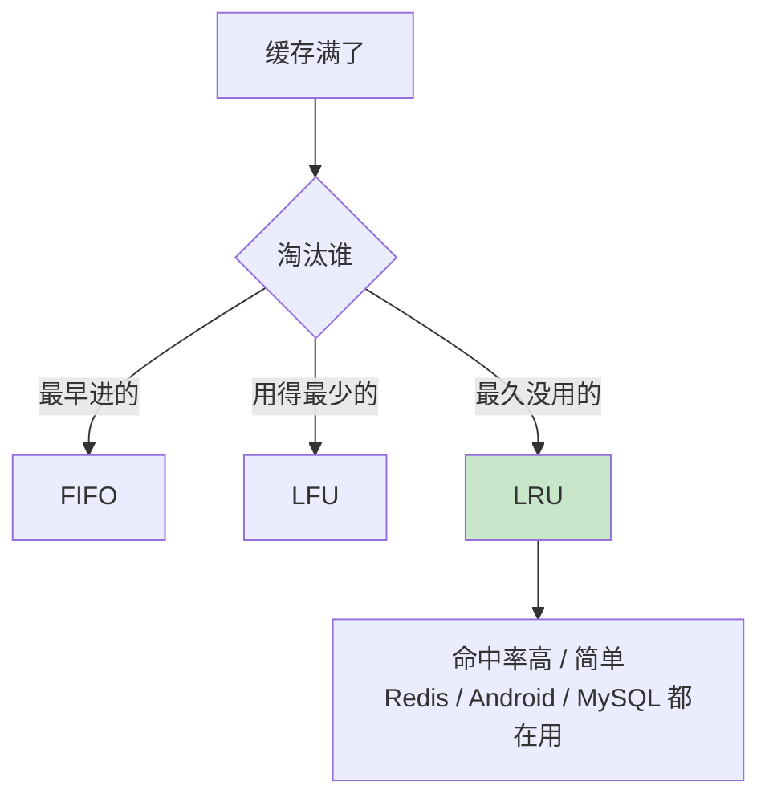
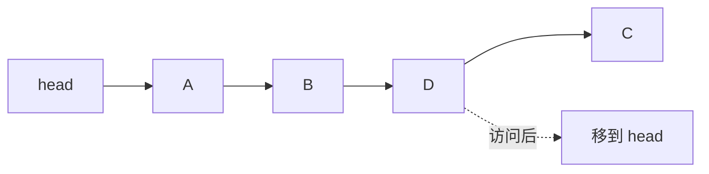
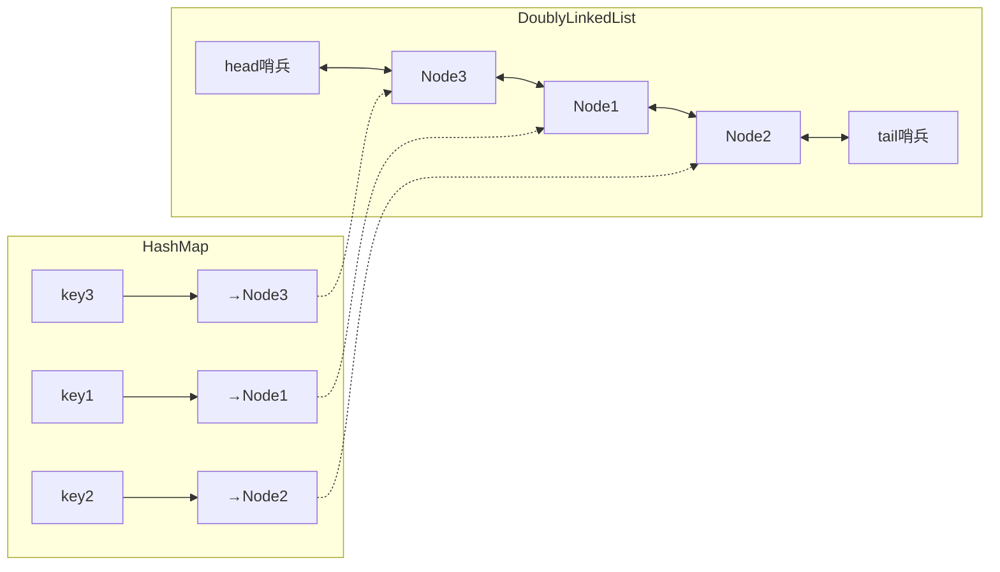
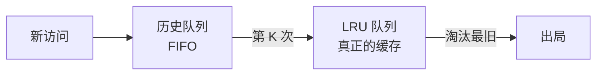

# 05.链表实现Lru原理

## 目录指引与导读

> 阅读建议：先看 §3 弄清"为什么链表 + 哈希"是 LRU 的标配，再看 §5.3 的工业版代码，最后用 §6 的扩展策略对照实际业务。

- [01. 从工作案例说起](#01-从工作案例说起)
- [02. 缓存淘汰三策略](#02-缓存淘汰三策略)
  - [2.1 为什么必须淘汰](#21-为什么必须淘汰)
  - [2.2 三大策略对比](#22-三大策略对比)
- [03. LRU为何用链表](#03-lru为何用链表)
  - [3.1 LRU两种核心操作](#31-lru两种核心操作)
  - [3.2 用数组方案会崩](#32-用数组方案会崩)
  - [3.3 用链表天然合适](#33-用链表天然合适)
  - [3.4 链表查找仍线性](#34-链表查找仍线性)
- [04. 单链表实现LRU](#04-单链表实现lru)
  - [4.1 单链表实现思路](#41-单链表实现思路)
  - [4.2 单链表性能瓶颈](#42-单链表性能瓶颈)
- [05. 哈希加双链工业版](#05-哈希加双链工业版)
  - [5.1 整体结构全貌](#51-整体结构全貌)
  - [5.2 为何必须双向链表](#52-为何必须双向链表)
  - [5.3 Java工业级实现](#53-java工业级实现)
  - [5.4 C++工业级实现](#54-c工业级实现)
  - [5.5 操作复杂度对比](#55-操作复杂度对比)
- [06. LRU缺陷与变体](#06-lru缺陷与变体)
  - [6.1 LRU的缓存污染](#61-lru的缓存污染)
  - [6.2 LRU-K进阶策略](#62-lru-k进阶策略)
  - [6.3 2Q简化版](#63-2q简化版)
  - [6.4 LFU频率淘汰](#64-lfu频率淘汰)
  - [6.5 各策略选型矩阵](#65-各策略选型矩阵)
- [07. 工业界LRU身影](#07-工业界lru身影)
- [08. 案例回扣与收获](#08-案例回扣与收获)
- [09. 思考题深度练](#09-思考题深度练)
- [10. 课后作业实战](#10-课后作业实战)
- [11. 进阶专题与延伸](#11-进阶专题与延伸)

---

## 01. 从工作案例说起

> 真实踩坑：一个列表页图片刷不停，用户说"翻回去又要重新加载，体验太差"。

背景：一个商品列表 App，每屏大概 8 张图。我们在首页做了个**全局图片缓存**以减少网络请求。

最初实现用 `HashMap<String, Bitmap>` 直接存，"无容量上限"，理由是内存足够大。上线一周后监控告警：

- 稍长时间使用，App 内存飙到 500MB+
- 滚到列表末尾再返回顶部，**顶部图片仍然重新下载**（本该命中缓存）
- 偶发 OOM

原因一查就明白：

1. 只有放入、没有淘汰 → 内存持续膨胀，Android 系统直接把进程杀了，缓存一并清空；
2. 进程重启后 `HashMap` 是空的，老图片自然要重新下载。

正确做法是给缓存**设容量上限**，当超限时按照"最近最少使用"淘汰旧图片。这就是 LRU。

Android 官方的 `LruCache` 底层正是 **`LinkedHashMap(accessOrder=true)`**——哈希表 + 双向链表。本篇的目标就是把这套结构亲手拆一遍，学完你能：

- 说清楚为什么 LRU 必须是 **哈希 + 双向链表**；
- 独立写出 LeetCode 146 的满分解；
- 给开篇案例换上带容量上限的 LRU，解决 OOM 与命中率问题。

---

## 02. 缓存淘汰三策略

### 2.1 为什么必须淘汰

缓存空间远小于底层存储：

| 介质 | 典型容量 | 访问延迟 |
|-----|---------|---------|
| L1 / L2 Cache | 几十 KB~1 MB | 1~5 ns |
| 内存 | GB 级 | 100 ns |
| SSD | TB 级 | 100 μs |
| 磁盘 | TB 级 | 10 ms |

"有限的快资源要放最有价值的数据"——缓存淘汰策略要解决的就是这件事。

### 2.2 三大策略对比

| 策略 | 依据 | 假设 | 常见反例 |
|-----|-----|-----|---------|
| FIFO | 进入顺序 | 越老越没用 | 内核代码老但一直要用 |
| LFU | 访问频率 | 用得少就没用 | 昨天热搜、今天凉了 |
| **LRU** | 最近访问时间 | 最近用过 → 还会用 | 全表扫描污染缓存 |

LRU 依据的是 **时间局部性原理**——大量程序行为实测都符合 80/20：80% 的访问集中在 20% 的数据上。所以 LRU 在 Web、App、DB 查询缓存等通用场景命中率最佳、实现也最简单，是工业界默认首选。



### 2.3 时间局部性与空间局部性

LRU 背后的理论基础是**时间局部性（Temporal Locality）**——Denning 在 1968 年 *The Working Set Model* 论文里系统阐述：程序在某段时间内访问的内存集中在一个较小的\"工作集（working set）\"内。这一原理从 CPU cache 到操作系统 page 置换再到应用级缓存都成立：

| 层级 | 时间局部性 | 空间局部性 |
|------|-----------|-----------|
| CPU L1/L2 cache | 刚访问的字节很可能再被访问 | 相邻字节也会被访问（cache line） |
| OS page cache | 刚读过的磁盘页很可能再读 | 预读相邻页 |
| 应用缓存 | 刚请求的 key 很可能再请求 | 较弱，但排序/分页查询仍有 |

**LRU 利用的是时间局部性**；而数组的 cache line 预取利用的是空间局部性。两个局部性不是一回事，但工程上经常同时出现。

### 2.4 Belady 最优算法（OPT）

作为\"天花板\"参照，Belady 在 1966 年证明：**淘汰\"未来最久不会被访问\"的那个**是最优策略。但未来不可知，所以 OPT 不能实现，只能用来给其他策略做评估基线：

```
命中率：LRU / LFU / ARC / W-TinyLFU 通常能做到 OPT 的 80%-95%
```

研究缓存算法时通常用 **trace-driven simulation**——拿真实访问日志跑一遍，分别计算各算法的命中率。这是为什么很多论文用 SPC、MSR Cambridge 等公开 trace 做对比。

---

## 03. 为什么 LRU 偏爱链表

### 3.1 LRU 的两种核心操作

- **命中时**：把被访问的元素"移到最前面"
- **未命中 + 容量满**：删掉"最后面那个"

### 3.2 用数组方案会崩

```text
数组：[A B C D E]
访问 D → 需要把 D 移到队首
        → 搬移 A B C 三个元素 → O(N)
```

10 万容量时平均每次访问要搬 5 万个元素，线上绝对扛不住。

### 3.3 用链表天然合适



链表移动一个节点只改几个指针，是 **O(1)**。这正是 LRU 偏爱链表的根本原因。

### 3.4 链表查找仍线性

单靠链表无法解决"怎么快速找到那个节点"的问题，**所以还差一个哈希表**。

---

## 04. 单链表实现 LRU（原理版）

### 4.1 思路

维护一条单链表：越靠头越新，越靠尾越旧。访问时遍历、找到就移到头；没找到就头插入，超容量就丢尾巴。

```java
public class SimpleLRUCache<K> {
    private Node<K> head;
    private int size, capacity;
    static class Node<K> { K key; Node<K> next; Node(K k){key=k;} }

    public SimpleLRUCache(int cap) { this.capacity = cap; }

    public boolean access(K key) {
        Node<K> prev = null, cur = head;
        while (cur != null) {
            if (cur.key.equals(key)) {           // 命中：摘出来放到头
                if (prev != null) {
                    prev.next = cur.next;
                    cur.next = head;
                    head = cur;
                }
                return true;
            }
            prev = cur; cur = cur.next;
        }
        // 未命中：头插入
        Node<K> n = new Node<>(key);
        n.next = head; head = n; size++;
        if (size > capacity) removeTail();
        return false;
    }

    private void removeTail() {
        if (head == null || head.next == null) { head = null; size--; return; }
        Node<K> c = head;
        while (c.next.next != null) c = c.next;
        c.next = null; size--;
    }
}
```

### 4.2 单链表性能瓶颈

| 操作 | 复杂度 | 原因 |
|-----|-------|-----|
| 查找是否命中 | O(N) | 必须遍历 |
| 摘除已定位节点 | O(N) | 单链表要找前驱 |
| 删尾节点 | O(N) | 要找倒数第二 |

结论：**单链表 LRU 只适合教学 / 面试手写**。工业级必须升级。

---

## 05. 哈希加双链工业版

### 5.1 整体结构全貌



- **HashMap**：`key → Node` 的直接引用，让"查找"降到 O(1)；
- **双向链表**：维护访问顺序，队首是最新，队尾是最旧；
- **双端哨兵**：消除所有头尾空判断。

### 5.2 为何必须双向链表

摘除某个已定位节点，要改它前驱的 next。单链表找前驱要 O(N)；双向链表 prev 直接给，O(1)。哈希 + 双向链表组合才能让 **get / put 全部 O(1)**。

### 5.3 Java工业级实现

```java
public class LRUCache<K, V> {
    static class Node<K, V> {
        K key; V value; Node<K,V> prev, next;
        Node() {}
        Node(K k, V v) { key = k; value = v; }
    }

    private final int capacity;
    private final Map<K, Node<K, V>> map = new HashMap<>();
    private final Node<K, V> head = new Node<>(), tail = new Node<>();

    public LRUCache(int capacity) {
        this.capacity = capacity;
        head.next = tail; tail.prev = head;
    }

    public V get(K key) {
        Node<K, V> n = map.get(key);
        if (n == null) return null;
        moveToHead(n);
        return n.value;
    }

    public void put(K key, V value) {
        Node<K, V> n = map.get(key);
        if (n != null) { n.value = value; moveToHead(n); return; }
        Node<K, V> nn = new Node<>(key, value);
        map.put(key, nn); addToHead(nn);
        if (map.size() > capacity) {
            Node<K, V> last = tail.prev;
            remove(last); map.remove(last.key);
        }
    }

    private void addToHead(Node<K,V> n) {
        n.prev = head; n.next = head.next;
        head.next.prev = n; head.next = n;
    }
    private void remove(Node<K,V> n) {
        n.prev.next = n.next; n.next.prev = n.prev;
    }
    private void moveToHead(Node<K,V> n) { remove(n); addToHead(n); }
}
```

### 5.4 C++工业级实现

```cpp
#include <unordered_map>

class LRUCache {
    struct Node {
        int key, value;
        Node *prev, *next;
        Node(int k = 0, int v = 0) : key(k), value(v), prev(nullptr), next(nullptr) {}
    };

    int cap;
    std::unordered_map<int, Node*> map;
    Node *head, *tail;

    void addToHead(Node* n) {
        n->prev = head; n->next = head->next;
        head->next->prev = n; head->next = n;
    }
    void removeNode(Node* n) {
        n->prev->next = n->next; n->next->prev = n->prev;
    }
    void moveToHead(Node* n) { removeNode(n); addToHead(n); }

public:
    LRUCache(int capacity) : cap(capacity) {
        head = new Node(); tail = new Node();
        head->next = tail; tail->prev = head;
    }

    int get(int key) {
        auto it = map.find(key);
        if (it == map.end()) return -1;
        moveToHead(it->second);
        return it->second->value;
    }

    void put(int key, int value) {
        auto it = map.find(key);
        if (it != map.end()) {
            it->second->value = value;
            moveToHead(it->second);
            return;
        }
        Node* n = new Node(key, value);
        map[key] = n; addToHead(n);
        if ((int)map.size() > cap) {
            Node* last = tail->prev;
            removeNode(last); map.erase(last->key);
            delete last;
        }
    }
};
```

> **C++ 与 Java 的实现差异**：
>
> - **内存管理**：C++ 必须 `new`/`delete` 配对，Java 由 GC 处理；
> - **`unordered_map` vs `HashMap`**：底层都是开链法哈希，但 C++ STL 默认负载因子 1.0，Java 是 0.75；
> - **节点删除时序**：C++ 必须先 `map.erase` 再 `delete last`，否则迭代器失效。

### 5.5 操作复杂度对比

| 操作 | 单链表 LRU | 哈希 + 双链 LRU |
|-----|-----------|----------------|
| get / put | O(N) | **O(1)** |
| 淘汰最旧 | O(N) | **O(1)** |
| 空间 | O(N) | O(N) |

### 5.6 LinkedHashMap：JDK 自带的\"半成品 LRU\"

其实不用从零写——JDK 的 `LinkedHashMap` 只要改两行就是 LRU：

```java
public class LinkedHashMapLRU<K, V> extends LinkedHashMap<K, V> {
    private final int capacity;

    public LinkedHashMapLRU(int capacity) {
        super(16, 0.75f, true);    // accessOrder=true 是关键
        this.capacity = capacity;
    }

    @Override
    protected boolean removeEldestEntry(Map.Entry<K, V> eldest) {
        return size() > capacity;
    }
}
```

内部机制：`LinkedHashMap` 在 `HashMap` 节点上额外加了 `before/after` 两个指针，组成一条贯穿所有节点的双向链表。`accessOrder=true` 时，每次 `get` 都会把节点移到链尾。`removeEldestEntry` 则在每次 `put` 后被调用，返回 true 就删链首。

**Android `LruCache` 就是这样实现的**，源码核心不到 30 行：

```java
// Android androidx.collection.LruCache 节选
public final V get(K key) {
    V mapValue;
    synchronized (this) {
        mapValue = map.get(key);   // LinkedHashMap 的 get 就做了 move
        if (mapValue != null) { hitCount++; return mapValue; }
        missCount++;
    }
    // ... 可选的 create() 慢加载 ...
}
```

### 5.7 常见面试陷阱

写 LRU 时最常踩的 5 个坑：

1. **`put` 已存在时忘了更新 value**——只做了 moveToHead；
2. **先 map.remove 再 list.remove，顺序反了导致 key 拿不到节点**——应该先拿 last，再 list.remove，再 map.remove(last.key)；
3. **哨兵节点的 prev/next 忘了初始化**——head.next=tail; tail.prev=head；
4. **capacity=0 时的边界**——应该直接返回 miss 或抛异常；
5. **多线程下 size() 和实际链表长度不一致**——没加锁；容易 map 里有 key 但链表已经摘了。

面试官常用 LeetCode 146 考察这 5 点，写的时候每一步自问\"这个顺序能反吗\"、\"这里会 NPE 吗\"。

---

## 06. LRU 的缺陷与 LRU-K / 2Q / LFU

### 6.1 LRU 的死穴：缓存污染

```text
缓存容量 100，现有 100 个热点 key，命中率 99%
突然跑一次全表扫描，顺序访问 10000 条冷数据
→ 前 100 条直接把热点全部挤走
→ 扫描完毕后缓存全是冷数据
→ 命中率骤降到 0%
```

### 6.2 LRU-K进阶策略

只访问过一次的数据不进正式缓存，而是进"历史队列"；第 K 次访问才提升到 LRU 队列。全表扫描的数据访问一次即止，不会污染热点。



### 6.3 2Q = LRU-2 的简化

两条队列：FIFO 放一次性数据，LRU 放热点；FIFO 中再次命中时升级到 LRU。

### 6.4 LFU频率淘汰

优点是对"真正的热 key"很友好，缺点是**频率衰减问题**——昨天热搜的访问次数太高，导致它今天凉了也不容易被淘汰。

### 6.5 各策略选型矩阵

| 你的场景 | 推荐 | 说明 |
|---------|-----|-----|
| 通用（Web / App 查询缓存） | **LRU** | 80% 场景直接用 |
| 有扫描 / 批量读风险 | 2Q / LRU-2 | 抗污染 |
| 命中率要极致、冷热分层明显 | **W-TinyLFU**（Caffeine） | 兼顾 LRU + LFU |
| 自适应负载变化 | ARC | ZFS / PostgreSQL 用 |
| 数据带 TTL | LRU + 过期时间 | Redis 默认思路 |

---

## 07. 工业界的 LRU 身影

| 系统 | 实现 | 备注 |
|-----|------|-----|
| **Android `LruCache`** | `LinkedHashMap(accessOrder=true)` | 图片 / View 缓存标配 |
| **iOS `NSCache`** | 近似 LRU + 内存压力自动清理 | 不保证严格顺序 |
| **Redis** | 近似 LRU（随机采样 N 个取最旧） | 真正链表太耗内存 |
| **MySQL InnoDB Buffer Pool** | 带 midpoint 的分段 LRU（类 2Q） | 防全表扫描污染 |
| **Linux Page Cache** | active / inactive 双链表 | 近似 LRU |
| **Glide / SDWebImage** | LRU + 磁盘二级缓存 | 图片加载框架标配 |
| **Caffeine (Java)** | W-TinyLFU | 当前 JVM 最快的缓存 |

### Redis 的采样 LRU（为什么不用真链表）

为每个 key 加 prev / next 指针意味着百万 key 多出几十 MB 指针开销，Redis 作者不愿付这个代价。折中方案：**每个 key 记录 `lru` 时间戳，淘汰时随机采样 N 个取最旧**。采样数（`maxmemory-samples`）默认 5，越大越接近真实 LRU、也越慢。

---

## 08. 案例回扣与收获

回到开篇的"列表图片总是重下载 / OOM"：

- **问题本质**：用无上限的 `HashMap` 当缓存 → 要么 OOM、要么被系统干掉清空，从来没进入"淘汰—保留热点"循环。
- **正确解法**：`LruCache<String, Bitmap>`（底层 `LinkedHashMap(accessOrder=true)`）+ 按 `bitmap.getByteCount()` 计量容量 → 内存稳定、热图命中率高、冷图自动让位。
- **进一步优化**：本地内存 LRU + 磁盘二级缓存（与 Glide 一致），冷启动时也能命中。

通过本篇你应该拿到以下能力：

1. 说清楚 LRU 必须用 **哈希 + 双向链表** 的底层原因；
2. 手写 `get / put` 全 O(1) 的 LRU，通过 LeetCode 146；
3. 识别 LRU 缓存污染并选出 LRU-K / 2Q / W-TinyLFU 等合适的进阶策略；
4. 读懂 Android `LruCache`、Redis maxmemory-policy、InnoDB midpoint 等工业实现差异。

---

## 09. 思考题

> 建议先独立思考，再查资料验证。

1. **LRU 假设失效**：请举出"最近访问过的数据，将来更可能被访问"这个假设明显不成立的真实场景；在这个场景下，你会用什么策略替代 LRU？
2. **复杂度验真**：仔细分析 `put` 中"容量满时淘汰尾节点"的每一步，确认真的是 O(1)。如果把双向链表换成单链表，这一步还能 O(1) 吗？哈希表能否帮单链表拿到前驱？
3. **并发 LRU**：在 `get / put` 外部套一把 `synchronized` 是否可行？高并发下会怎样？Caffeine 为了做到高并发采用了什么思路？（提示：Ring Buffer + 异步 replay）
4. **Redis 近似 LRU**：在 100 万 key 中随机采样 5 个并淘汰最旧，对真正的 LRU 精度大概损失多少？把采样数提到 10 / 20，边际收益是什么形状？为什么不继续增加？
5. **LRU-K 设计**：实现 K=2 的 LRU-2 需要几个数据结构？其 `get / put` 复杂度？与标准 LRU 相比，它在"一次性冷扫描"场景下的命中率会如何变化？

---

## 10. 课后作业实战

### 作业一｜手写 LRU 过 LeetCode 146

- 用 Java / Go / Python 任选一种，手写"哈希 + 双向链表 + 双端哨兵"的 LRU；
- 提交 LeetCode 146 AC；
- 写一份 200 字的自测报告：哪里最容易错？（一般是 `moveToHead` 的顺序、put 中 map 与链表是否都更新、哨兵是否初始化）

### 作业二｜还原开篇 Android 图片缓存

1. 写一个 demo：`HashMap<String, Bitmap>` 无限缓存版本，滚动列表 1000 张图，观察内存曲线；
2. 换成 `LruCache`（按 byte 大小计算容量，上限 64MB），对比内存曲线和重复下载次数；
3. 加上磁盘二级缓存（本地文件），再对比冷启动命中率；
4. 写一份 300 字踩坑总结。

### 作业三｜抗扫描污染实验

- 以作业一的 LRU 为基础，扩展成 **2Q / LRU-2**；
- 构造负载：80% 请求命中 20% 热点 key + 偶发 1 次 10 万次冷扫描；
- 对比 LRU、LRU-2、W-TinyLFU（可用 Caffeine）三种策略的命中率曲线；
- 得出你自己的"在我们业务场景里，XXX 最合适，因为……"结论。

---

## 11. 进阶专题与延伸

### 11.1 W-TinyLFU：Caffeine 为什么能做到最高命中率

Caffeine（JVM 上最快的本地缓存）的核心算法是 **W-TinyLFU**（Window TinyLFU），论文《TinyLFU: A Highly Efficient Cache Admission Policy》（ACM TOS 2017）。它融合了 LRU 和 LFU 的优点：

```
┌─────────────────────────────────────┐
│  Window LRU (1% 容量)               │  ← 新数据先进这里
└─────────┬───────────────────────────┘
          │ 从 Window 出来的候选者
          ▼
    ┌──────────┐
    │ TinyLFU  │  ← 用 Count-Min Sketch 估计历史频率
    │ admission│     比较候选者 vs 淘汰者的频率，频率高才允许进入
    └─────┬────┘
          ▼
┌─────────────────────────────────────┐
│  Protected LRU (80%)                │
│  Probationary LRU (19%)             │
└─────────────────────────────────────┘
```

三个关键创新：
1. **Count-Min Sketch**：用 4 个哈希函数 + 计数数组估算 key 的访问频率——**空间只要几十字节就能估计百万级 key 的频率**；
2. **频率衰减（aging）**：每累积 N 次访问后把所有计数减半，避免\"陈年热 key\"永远霸占；
3. **admission（准入控制）**：不是\"先放进再淘汰\"，而是\"比较后决定放不放\"——这是相对传统缓存的范式转变。

实测命中率：在 Zipf 0.7 的典型工作负载下，W-TinyLFU 比 LRU 高 5-10 个百分点，比 ARC 高 2-3 个百分点，接近 OPT 的 95%。

### 11.2 ARC：自适应双队列

ARC（Adaptive Replacement Cache）由 IBM Almaden 在 2003 年提出，已被 ZFS、PostgreSQL、IBM DB2 使用。核心思想：**维护两个 LRU 队列，一个跟\"最近一次访问\"（recency），一个跟\"频率\"（frequency）；根据当前命中情况自适应调整两边容量**。

```
T1: 只被访问过 1 次的 (recency)        T2: 被访问过 ≥2 次的 (frequency)
B1: T1 的淘汰 ghost                    B2: T2 的淘汰 ghost

当命中 B1（最近淘汰的 recency 页）：增大 T1 容量
当命中 B2（最近淘汰的 frequency 页）：增大 T2 容量
```

\"ghost list\"只存 key 不存 value，作为历史信息。这让 ARC 能根据**工作负载特征实时调参**——扫描型工作负载自然偏 T1，热点型自然偏 T2。

### 11.3 Redis 的 LFU 与采样近似

Redis 4.0 引入了 `allkeys-lfu` 和 `volatile-lfu` 两个策略。其 LFU 实现也是采样 + 近似：

```c
// redisObject 只有 24 字节，其中 24 位用来存 LFU 信息
// 16 位：最近衰减的访问时间（分钟级）
// 8 位：对数频率计数器（log counter，最大 255）
struct redisObject {
    unsigned type:4;
    unsigned encoding:4;
    unsigned lru:LRU_BITS;    // 24 位：复用给 LFU 用
    int refcount;
    void *ptr;
};
```

**对数计数**防止溢出：计数 = C 时，访问一次变 C+1 的概率为 `1 / (C * factor + 1)`——C 越大，增长越慢。

采样淘汰依然使用，但候选池（pool）会按频率排序：

```
maxmemory-samples 5           # 每次随机采 5 个 key
maxmemory-policy allkeys-lfu  # 淘汰频率最低的
```

**采样 vs 精确 LRU 的内存代价**：100 万 key 加双链指针就是 16MB，Redis 不愿付这个代价。采样 5-10 个时准确率已达 95%+。

### 11.4 多级缓存的层次 LRU

现代系统很少只用一级缓存：

```
L1: 进程内 Caffeine 本地缓存 (μs 级)
     ↓ miss
L2: Redis/Memcached 分布式缓存 (ms 级)
     ↓ miss
L3: MySQL / 数据库 (10ms 级)
```

每一级都跑自己的 LRU（或变种），互不干扰。**关键设计点**：
- **一致性**：写入时要失效所有层的缓存（cache aside、write through 等模式）；
- **防击穿**：热 key 过期瞬间大量请求直接穿透到 DB——用互斥锁或过期前主动刷新；
- **防雪崩**：多个 key 同时过期——加随机抖动的 TTL；
- **防穿透**：查询不存在的 key——用 Bloom Filter 先挡一层。

### 11.5 经典书与论文

- Denning, Peter J. 1968. *The Working Set Model for Program Behavior*——工作集理论原论文
- Belady, L. A. 1966. *A Study of Replacement Algorithms for a Virtual-Storage Computer*——OPT 算法
- Megiddo, N. & Modha, D. S. 2003. *ARC: A Self-Tuning, Low Overhead Replacement Cache*——ARC 论文
- Einziger, G. et al. 2017. *TinyLFU: A Highly Efficient Cache Admission Policy*——W-TinyLFU 理论基础
- Johnson, T. & Shasha, D. 1994. *2Q: A Low Overhead High Performance Buffer Management Replacement Algorithm*——2Q 论文
- O'Neil et al. 1993. *The LRU-K Page Replacement Algorithm for Database Disk Buffering*——LRU-K 论文
- Caffeine 源码 `ben-manes/caffeine`（github）——**最值得逐行读的 Java 缓存代码**
- Redis 源码 `src/evict.c`、`src/lfu.c`——近似 LRU/LFU 的工业实现

### 11.6 选型速查手册

```
简单 App 缓存 / 图片缓存
    → 直接用 LRU（LinkedHashMap 或 Android LruCache）

通用 Java 服务端本地缓存
    → Caffeine（W-TinyLFU），命中率、吞吐、API 都是最佳

分布式缓存
    → Redis LRU + TTL + allkeys-lru 或 allkeys-lfu

数据库 buffer pool
    → 使用数据库自带算法（InnoDB midpoint LRU、PostgreSQL 的 clock-sweep）

抗扫描污染要求高
    → LRU-K（K=2）或 2Q

研究 / benchmark
    → 同时跑 LRU / LFU / ARC / W-TinyLFU，对照 OPT 看命中率
```

---

> LRU 是"链表 + 哈希"这个黄金组合的第一次亮相，但不是最后一次——下一篇《06.栈常见的操作实践》会切到另一种线性结构，但你会发现它底层仍然是**数组或链表的受限接口**：弹出+压入这对操作，看似简单，实则能撬动整个递归、表达式求值、浏览器历史、撤销重做等一大片世界。

