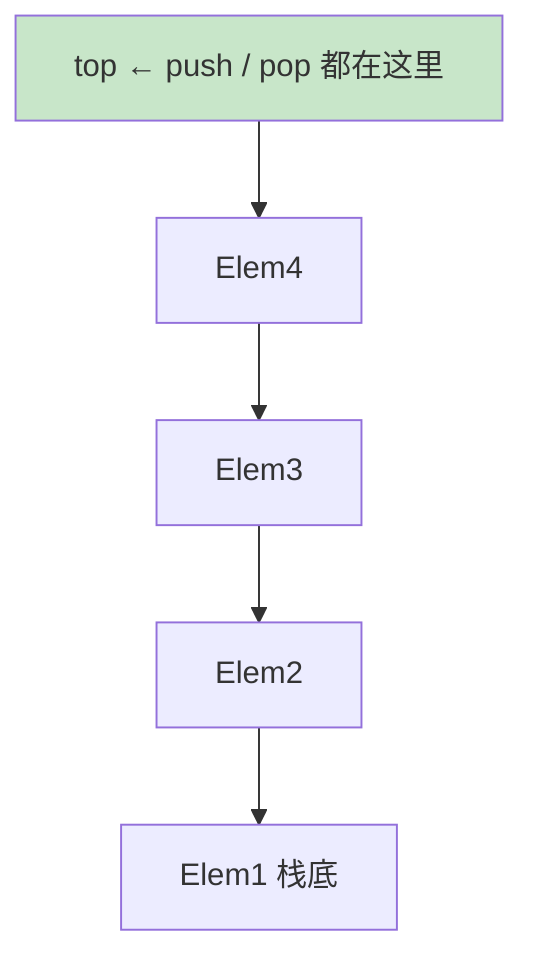
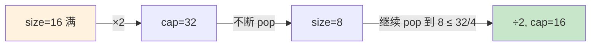

# 06.栈常见的操作实践

## 目录指引与导读

> 阅读建议：本篇围绕"栈的工业实现 + LIFO 经典模板"展开，建议按顺序通读；如果只想速查某一段，直接点对应锚点即可。

- [01. 从工作案例说起](#01-从工作案例说起)
- [02. 栈的定义与操作](#02-栈的定义与操作)
  - [2.1 栈的本质定义](#21-栈的本质定义)
  - [2.2 栈的核心API](#22-栈的核心api)
  - [2.3 LIFO匹配嵌套语义](#23-lifo匹配嵌套语义)
- [03. 数组实现顺序栈](#03-数组实现顺序栈)
- [04. 链表实现链式栈](#04-链表实现链式栈)
- [05. 动态扩容均摊O1](#05-动态扩容均摊o1)
  - [5.1 翻倍与四分之一缩容](#51-翻倍与四分之一缩容)
  - [5.2 动态扩容栈实现](#52-动态扩容栈实现)
  - [5.3 均摊O1的证明](#53-均摊o1的证明)
  - [5.4 缩容选四分之一](#54-缩容选四分之一)
- [06. 调用栈与递归本质](#06-调用栈与递归本质)
  - [6.1 操作系统调用栈](#61-操作系统调用栈)
  - [6.2 递归即系统管栈](#62-递归即系统管栈)
  - [6.3 递归深度与栈大小](#63-递归深度与栈大小)
- [07. 栈的经典工业应用](#07-栈的经典工业应用)
  - [7.1 括号匹配实战题](#71-括号匹配实战题)
  - [7.2 双栈表达式求值](#72-双栈表达式求值)
  - [7.3 单调栈三大模板](#73-单调栈三大模板)
  - [7.4 栈的应用速查表](#74-栈的应用速查表)
- [08. 本篇收获与回扣](#08-本篇收获与回扣)
- [09. 思考题深度练](#09-思考题深度练)
- [10. 课后作业实战](#10-课后作业实战)
- [11. 进阶专题与延伸](#11-进阶专题与延伸)

---

## 01. 从工作案例说起

> 真实需求：给一个内部管理后台加「操作审计」的 **撤销 / 重做** 能力。

背景：一个配置管理后台，运维同学会批量修改机房、机柜、机器的归属。业务方提的新需求：

- 编辑过程中，按 `Ctrl + Z` 可以一步步撤销；
- 按 `Ctrl + Y` 能把刚撤销的再重做回来；
- 一旦在"撤销到一半"时产生了新修改，所有"可以重做的操作"必须立刻作废。

最早的同事用了一个 `List<Operation>` + 一个下标指针来回移动，逻辑很快就写乱了——涉及"从中间截断再追加"的操作散落在好几处，上线一周收到了 3 个「操作丢失 / 撤销后又跳回去」的线上 bug。

**其实这就是栈的教科书级应用**：

- 所有"已做"操作压入 `undoStack`；
- `Ctrl + Z`：从 `undoStack` 弹出最近一个，反向执行，压入 `redoStack`；
- `Ctrl + Y`：从 `redoStack` 弹出一个，重新执行，压回 `undoStack`；
- 一旦产生新操作：压入 `undoStack`，**直接清空 `redoStack`**。

```java
class UndoManager {
    private final Deque<Op> undo = new ArrayDeque<>();
    private final Deque<Op> redo = new ArrayDeque<>();

    public void doOp(Op op) { op.apply(); undo.push(op); redo.clear(); }
    public void undo() { if (!undo.isEmpty()) { Op o = undo.pop(); o.revert(); redo.push(o); } }
    public void redo() { if (!redo.isEmpty()) { Op o = redo.pop(); o.apply();  undo.push(o); } }
}
```

换成双栈后，上面 3 个线上 bug 一次性消失：代码只有 3 行核心逻辑，"语义"和"实现"正好对上。

> 本篇就把"栈"讲透：从怎么实现，到函数调用栈与递归的关系，再到括号匹配、表达式求值、单调栈这些工业高频套路。学完你能独立实现开篇的撤销管理器，并在 LeetCode 20 / 150 / 496 这类题上秒写答案。

---

## 02. 栈的定义与操作

### 2.1 栈的本质定义

栈 = **只允许一端操作的线性表**，遵循 **LIFO（Last In First Out，后进先出）**。



> **延伸原理**：栈的"单端约束"看似限制，反而带来三大红利——所有操作 O(1)、内存访问局部性好（数组栈尤甚）、与系统调用栈 / 解释器栈天然同构，可以无缝把递归改成迭代。

### 2.2 栈的核心API

| 操作 | 含义 | 复杂度 |
|-----|-----|-------|
| `push(x)` | 入栈 | O(1) |
| `pop()` | 出栈（取出并返回） | O(1) |
| `peek()` / `top()` | 看一眼栈顶 | O(1) |
| `isEmpty()` | 判空 | O(1) |
| `size()` | 元素个数 | O(1) |

栈的全部魅力就在于：**通过限制操作位置，换来所有动作都是 O(1)**。

> **底层说明**：`peek` 不应改变栈状态；很多面试 bug 来自于"以为 peek 也会弹出"。Java `Deque` 提供 `peek()`（不抛异常）和 `element()`（空时抛 `NoSuchElementException`）两套 API，工程里推荐 `peek` + 显式 null 判断，避免异常控制流。

### 2.3 LIFO匹配嵌套语义

| 场景 | LIFO 体现 |
|-----|---------|
| 函数调用 | 最后进入的函数最先返回 |
| 括号 / 标签 | 最后打开的最先关闭 |
| 撤销 / 重做 | 撤销最近一次 |
| 表达式求值 | 先算优先级最高的 |
| DFS 回溯 | 回退到最近的分支点 |

---

## 03. 数组实现顺序栈

思路：一个数组 + 一个指向"下一个空位"的 `top`。

```java
public class ArrayStack<T> {
    private Object[] data;
    private int top;

    public ArrayStack(int capacity) { this.data = new Object[capacity]; }

    public void push(T v) {
        if (top == data.length) throw new StackOverflowError();
        data[top++] = v;
    }

    @SuppressWarnings("unchecked")
    public T pop() {
        if (top == 0) throw new RuntimeException("empty");
        T v = (T) data[--top];
        data[top] = null;          // 帮 GC
        return v;
    }

    @SuppressWarnings("unchecked")
    public T peek() {
        if (top == 0) throw new RuntimeException("empty");
        return (T) data[top - 1];
    }

    public boolean isEmpty() { return top == 0; }
    public int size() { return top; }
}
```

优点：连续内存，CPU 缓存友好，实际性能最快。
缺点：容量固定，需要扩容（见 §05）。

---

## 04. 链表实现链式栈

思路：把链表头当作栈顶，push / pop 只改 head。

```java
public class LinkedStack<T> {
    static class Node<T> { T data; Node<T> next; Node(T d, Node<T> n){data=d; next=n;} }
    private Node<T> top;
    private int size;

    public void push(T v)  { top = new Node<>(v, top); size++; }
    public T pop() {
        if (top == null) throw new RuntimeException("empty");
        T v = top.data; top = top.next; size--; return v;
    }
    public T peek() {
        if (top == null) throw new RuntimeException("empty");
        return top.data;
    }
    public boolean isEmpty() { return top == null; }
}
```

优点：天然动态，不用扩容。
缺点：每次 push 都 new 节点（开销 + GC），缓存不友好。

### 两种实现的选型对照

| 维度 | 数组栈 | 链表栈 |
|-----|-------|-------|
| 内存 | 连续、预分配 | 离散、按需 |
| 缓存命中率 | 高 | 低 |
| 扩容 | 要搬移 | 不用 |
| 小对象开销 | 低 | 高（节点指针） |
| 工业默认 | ✅（`ArrayDeque`、`Vec`、Python `list`）| 很少直接使用 |

> **底层原因**：链表栈每次 `push` 都要 `new Node`，触发堆分配 + GC；而数组栈 `data[top++] = v` 是一条访存指令，紧贴 CPU L1 缓存。**结论**：如果没有特殊理由，一律用 **数组栈**。Java 里用 `ArrayDeque`，不要用古老的 `Stack`（基于 `Vector`，每个方法都带 `synchronized` 拖性能）。

---

## 05. 动态扩容均摊O1

### 5.1 翻倍与四分之一缩容

- 满了就 ×2；
- 元素数降到容量的 1/4 时 ÷2 缩容；
- 两个阈值之间留出缓冲区，避免 **扩缩乒乓**。



### 5.2 动态扩容栈实现

```java
public class DynamicStack<T> {
    private Object[] data;
    private int top;

    public DynamicStack() { data = new Object[4]; }

    public void push(T v) {
        if (top == data.length) resize(data.length * 2);
        data[top++] = v;
    }

    @SuppressWarnings("unchecked")
    public T pop() {
        if (top == 0) throw new RuntimeException("empty");
        T v = (T) data[--top];
        data[top] = null;
        if (data.length > 4 && top <= data.length / 4) resize(data.length / 2);
        return v;
    }

    private void resize(int cap) {
        Object[] nd = new Object[cap];
        System.arraycopy(data, 0, nd, 0, top);
        data = nd;
    }
}
```

### 5.3 均摊O1的证明

连续做 N 次 push，扩容发生在第 1、2、4、8、…、N 次，每次搬 1、2、4、…、N 个元素：

```text
搬移总次数 = 1 + 2 + 4 + ... + N ≈ 2N
总代价    = N 次 push + 2N 次搬移 = 3N
均摊到每次 push → O(1)
```

> **数学严谨化**：用聚合分析法（aggregate analysis）证明 N 次操作总代价为 O(N)，单次均摊代价 O(1)；如果用账户法（accounting method），可以给每次 push 多收 2 个"币"——1 个用于现在，1 个未来用于搬移自己 + 帮一个老元素搬走。两种证法结论一致。

### 5.4 缩容选四分之一

如果用 1/2，恰好满的栈里 push→扩容→pop→缩容→push→扩容…… 每次都 O(N)，出现 **复杂度震荡**。选 1/4，在扩容点和缩容点之间留出一倍空间作为缓冲。

> **工程提醒**：JDK `ArrayDeque` 永远不缩容（容量只增不减）——典型工程权衡：大多数场景容量稳定后不再增长，缩容收益小、复杂度高，干脆不做。如果你写一个长生命周期、容量波动大的服务，可以考虑加缩容。

---

## 06. 调用栈与递归本质

### 6.1 操作系统调用栈

每个线程都有一块独立的 **调用栈**。每次函数调用，都会把一个 **栈帧（Stack Frame）** 压入调用栈；函数返回，栈帧被弹出。

```text
┌───────────────┐  ← 栈顶（当前正在执行的函数）
│ 栈帧: factorial(1) │
├───────────────┤
│ 栈帧: factorial(2) │
├───────────────┤
│ 栈帧: main()       │  ← 栈底
└───────────────┘
```

每个栈帧里存：**返回地址、参数、局部变量、保存的寄存器**。

> **栈帧到底装了什么**：以 x86-64 SysV ABI 为例，一个栈帧自高地址向低地址依次包含：调用者保存的返回地址 → 旧 RBP → 被调用者保存寄存器（callee-saved）→ 本地变量 → 参数传递区。理解这一点，"栈溢出攻击 / canary 保护 / 异常栈展开"才能真正读懂。

### 6.2 递归即系统管栈

```java
// 经典递归
public static long factorial(int n) {
    if (n <= 1) return 1;
    return n * factorial(n - 1);
}
```

调用 `factorial(4)` 时，调用栈自底向上依次压入 `factorial(4) / 3 / 2 / 1`，触底返回 1 后逐层出栈：1 → 2 → 6 → 24。

**任何递归都可以用显式栈改写为迭代**（这正是"递归转迭代"的通用套路）：

```java
public static long factorialIter(int n) {
    Deque<Integer> stack = new ArrayDeque<>();
    while (n > 1) { stack.push(n); n--; }
    long res = 1;
    while (!stack.isEmpty()) res *= stack.pop();
    return res;
}
```

> **延伸思考**：有些递归（如尾递归）甚至不需要显式栈——编译器可以把"调用栈"折叠成单个变量。Scala / Kotlin 通过 `@tailrec` 注解强制做尾递归优化；C++ / Rust 依赖编译器优化级别；Java 至今仍**不做**尾调用优化，所以 JVM 上递归深度受限于线程栈大小。

### 6.3 递归深度与栈大小

| 平台 | 默认栈大小 | 大致可递归层数 |
|-----|-----------|-------------|
| Linux 线程 | 8 MB | ~10 万 |
| Windows 线程 | 1 MB | ~1 万 |
| JVM 线程 | 512 KB ~ 1 MB | 5 千 ~ 1 万 |
| Python | 软限制 1000 层 | 默认 1000 |
| Go goroutine | 起始 2 KB，动态增长 | 百万级 |

"爆栈"的 3 个典型原因：**递归太深 / 无限递归 / 栈上局部变量过大**。

> **工程提醒**：JVM 默认线程栈 512KB ~ 1MB，可用 `-Xss2m` 调大，但代价是每个线程都多吃这一块；在大量线程的 Server 端要谨慎调。Go 的 goroutine 起始 2KB 并能动态增长，使其能轻松开百万协程，**这是协程模型对线程模型的核心优势之一**。

---

## 07. 栈的经典工业应用

### 7.1 括号匹配实战题

左括号压栈、右括号比对栈顶。

```java
// LeetCode 20. Valid Parentheses
public boolean isValid(String s) {
    Map<Character, Character> pair = Map.of(')', '(', ']', '[', '}', '{');
    Deque<Character> stack = new ArrayDeque<>();
    for (char c : s.toCharArray()) {
        if (c == '(' || c == '[' || c == '{') {
            stack.push(c);
        } else {
            if (stack.isEmpty() || stack.pop() != pair.get(c)) return false;
        }
    }
    return stack.isEmpty();
}
```

> **底层直觉**：括号匹配 = "每遇到一个右括号，必须能找到最近未匹配的同类左括号"——"最近未匹配"正好是栈顶语义。所有"成对嵌套结构"问题都同构。

### 7.2 双栈表达式求值

两条栈：**数栈 nums + 符栈 ops**。遇到运算符时，只要栈顶运算符优先级 ≥ 当前，就先把栈顶的算掉。

```java
// 中缀表达式求值（支持 + - * /、括号、多位数）
public int evaluate(String expr) {
    Deque<Integer> nums = new ArrayDeque<>();
    Deque<Character> ops = new ArrayDeque<>();
    int i = 0, n = expr.length();
    while (i < n) {
        char c = expr.charAt(i);
        if (Character.isDigit(c)) {
            int v = 0;
            while (i < n && Character.isDigit(expr.charAt(i))) {
                v = v * 10 + (expr.charAt(i) - '0'); i++;
            }
            nums.push(v); continue;
        }
        if (c == '(') ops.push(c);
        else if (c == ')') {
            while (ops.peek() != '(') apply(ops, nums);
            ops.pop();
        } else if ("+-*/".indexOf(c) >= 0) {
            while (!ops.isEmpty() && ops.peek() != '(' && prec(ops.peek()) >= prec(c)) {
                apply(ops, nums);
            }
            ops.push(c);
        }
        i++;
    }
    while (!ops.isEmpty()) apply(ops, nums);
    return nums.pop();
}

private int prec(char op) {
    if (op == '*' || op == '/') return 2;
    if (op == '+' || op == '-') return 1;
    return 0;
}

private void apply(Deque<Character> ops, Deque<Integer> nums) {
    int b = nums.pop(), a = nums.pop();
    switch (ops.pop()) {
        case '+': nums.push(a + b); break;
        case '-': nums.push(a - b); break;
        case '*': nums.push(a * b); break;
        case '/': nums.push(a / b); break;
    }
}
```

> **延伸知识**：双栈算法等价于把中缀表达式即时编译为后缀（逆波兰），并立即执行。所以 JVM、Python 字节码、PostScript、Forth 这些虚拟机才统一选择"基于栈的指令集"——指令简单、解释器循环紧凑、无须寄存器分配。

### 7.3 单调栈三大模板

**下一个更大元素**：栈底到栈顶单调递减，O(N) 完成。

```java
// LeetCode 496. Next Greater Element
public int[] nextGreater(int[] nums) {
    int n = nums.length;
    int[] res = new int[n];
    Arrays.fill(res, -1);
    Deque<Integer> stack = new ArrayDeque<>();   // 存下标
    for (int i = 0; i < n; i++) {
        while (!stack.isEmpty() && nums[stack.peek()] < nums[i]) {
            res[stack.pop()] = nums[i];
        }
        stack.push(i);
    }
    return res;
}
```

一句话口诀：**"求下一个更大 / 更小、柱状图最大矩形、接雨水"——都是单调栈**。

> **如何系统性识别单调栈**：题面包含"下一个 / 上一个 + 更大 / 更小"或"在某个范围内能撑起的最大值"的，几乎都是单调栈。**栈中存下标**比存值更通用——能恢复距离信息（739. Daily Temperatures 的"还要等几天"就是 `i - stack.pop()`）。

### 7.4 栈的应用速查表

| 问题形态 | 解法 |
|---------|-----|
| 括号 / HTML 标签匹配 | 栈 |
| 函数调用、DFS 回溯 | 栈（或递归） |
| 撤销 / 重做 | 双栈 |
| 浏览器前进 / 后退 | 双栈 |
| 表达式求值 / 逆波兰 | 双栈 |
| 下一个更大 / 更小 | 单调栈 |
| 最大矩形、接雨水 | 单调栈 |

核心模板：**"LIFO 语义 / 嵌套结构 / 递归可迭代化"**，三者之一就用栈。

### 7.5 浏览器前进后退与路由栈

浏览器历史就是两个栈——**back 栈**和 **forward 栈**：

```
当前页：C
back栈: [A, B]        forward栈: [D, E]

点击"后退" → 把 C 压 forward，从 back 弹出 B 作为当前页
back栈: [A]           forward栈: [C, D, E]

点击一个新链接 → 把当前页 B 压 back，清空 forward
back栈: [A, B]        forward栈: []   ← 清空！
```

和开篇的 undo/redo 是同一个模型！React Router、Vue Router、Android Navigation 的 backstack 全部遵循这个双栈范式。浏览器源码（Chromium `NavigationController`）直接就是两个 `std::vector<NavigationEntry>` 当栈用。

### 7.6 DFS 与回溯

递归的 DFS 用系统栈；改迭代就要显式栈：

```java
// 二叉树前序遍历迭代版
public List<Integer> preorder(TreeNode root) {
    List<Integer> res = new ArrayList<>();
    if (root == null) return res;
    Deque<TreeNode> stack = new ArrayDeque<>();
    stack.push(root);
    while (!stack.isEmpty()) {
        TreeNode n = stack.pop();
        res.add(n.val);
        if (n.right != null) stack.push(n.right);   // 右先进，后出
        if (n.left != null) stack.push(n.left);     // 左后进，先出
    }
    return res;
}
```

注意**右子树先压栈**——因为栈是 LIFO，要保证左子树先被访问。这种\"顺序反转\"是栈用法里非常常见的细节。

中序、后序遍历也能用栈迭代，只是需要额外标记\"该节点是否已经展开过\"——这也是很多面试高分题（比如 LeetCode 94、145）的考点。

---

## 08. 本篇收获与回扣

回到开篇的"撤销 / 重做"需求：

- **问题本质**：撤销是"倒回最近一次"→ LIFO；而"一旦产生新操作，原本的重做作废"本就是栈的特性（新 push 让旧 redo 天然断链）。
- **正确解法**：`Deque<Op> undo` + `Deque<Op> redo`；新操作 `undo.push + redo.clear`；撤销 `undo.pop → redo.push`；重做 `redo.pop → undo.push`。
- **为什么之前代码乱**：用"List + 下标"模拟栈，等于自己手写了个半吊子的栈，所有"截断 / 丢弃"逻辑散落在好几处。**一选对数据结构，代码就从"多处特判"塌缩成 3 行**。

通过本篇你应该拿到以下能力：

1. 看到"LIFO / 嵌套 / 撤销 / 后进先出"就立刻反应出"栈"；
2. 能分别用**数组和链表**实现栈，并讲清楚为什么工业默认用数组；
3. 理解 **均摊 O(1)** 的证明，知道为什么缩容阈值是 1/4 而不是 1/2；
4. 理解调用栈 / 栈帧结构，知道"递归就是系统在帮你管理栈"，并能手工把递归改写成迭代；
5. 能在面试和真实代码里熟练使用 **括号匹配 / 双栈表达式求值 / 单调栈**。

---

## 09. 思考题深度练

> 建议先独立思考，再查资料验证。

1. **两种栈的真实差异**：数组栈和链表栈理论都是 O(1)。但实测中，往一个 LinkedStack 里连续 push 一亿次，比 ArrayStack 慢几倍。为什么？（请结合堆分配、GC、缓存行一起说）
2. **两栈模拟队列**：如何用两个栈实现一个 FIFO 队列？`enqueue / dequeue` 的均摊复杂度分别是多少？反过来，用两个队列实现栈，哪种方向"更自然"？
3. **Go 的分段栈**：Linux / JVM 线程栈是固定大小的，为什么 Go goroutine 可以从 2KB 自动长到几百 MB？它是怎么做到"函数里访问局部变量"时还能判断要不要扩栈的？（提示：morestack、栈复制）
4. **最小栈 O(1)**：设计一个栈，支持 `push / pop / top / getMin` 全部 O(1)。空间最省的方案是什么？如果还要同时支持 `getMax`，你会怎么组织数据？
5. **中缀转后缀**：逆波兰表达式在计算机里比中缀更"好算"。请写出"中缀 → 后缀"转换的栈算法，并回答：为什么 JVM、Python、各种栈式虚拟机都选择基于后缀（栈式）的指令集，而不是类似 `a = b + c` 的三地址形式？

---

## 10. 课后作业实战

### 作业一｜还原开篇的撤销重做

1. 定义一个 `interface Op { void apply(); void revert(); }`；
2. 实现 `UndoManager`：`doOp / undo / redo`；
3. 写单元测试，至少覆盖"连续撤销 3 次 → 重做 2 次 → 做一个新动作 → redo 栈必须为空"这条路径；
4. 想想：如果要做"只保留最近 100 条"，你会用什么数据结构替代 `ArrayDeque`？

### 作业二｜手写 ArrayDeque-style 动态栈

1. 写一个支持泛型的 `DynamicStack<T>`：容量翻倍扩容 + 1/4 缩容；
2. 跑一个测试：push 一千万次再全部 pop，记录总耗时；
3. 同样用 `LinkedList` 当栈跑同一个测试，对比耗时；
4. 写 200 字总结，解释为什么有差异。

### 作业三｜单调栈三连

在 LeetCode 上依次 AC 以下三题，均用单调栈解法：

- 496. Next Greater Element I
- 739. Daily Temperatures
- 84. Largest Rectangle in Histogram

提交后总结：三题的**栈中元素单调性方向**与**弹出时机**，找出共同模板。

---

## 11. 进阶专题与延伸

### 11.1 栈式虚拟机：JVM / Python / WASM

几乎所有主流虚拟机都是\"栈式指令集\"——JVM 字节码、Python 字节码、WebAssembly、PostScript、Forth。其指令都像这样：

```
# Python: a + b
LOAD_NAME 'a'       # 把 a 压栈
LOAD_NAME 'b'       # 把 b 压栈
BINARY_ADD          # 弹出两个，求和，压回栈
STORE_NAME 'c'      # 弹出栈顶，存入 c
```

**为什么选栈式而不是寄存器式**（如 x86、ARM、Lua 5、Dalvik）？

| 维度 | 栈式 VM | 寄存器 VM |
|------|---------|----------|
| 指令编码 | 紧凑（大多 1 字节） | 较长（要编码寄存器号） |
| 解释器循环 | 简单（pop/push） | 复杂（寄存器分配） |
| 跨平台分发 | 容易 | 更难 |
| 执行速度 | 较慢 | 更快（减少栈操作） |
| 对 JIT 友好 | 需要重新分析 | 更容易生成本地码 |

**趋势**：Lua 5.0 从栈式切到寄存器式、Google 的 Dalvik（Android 早期 VM）也是寄存器式——运行性能提升 20-30%。但 JVM 仍然坚持栈式，因为"字节码紧凑 + 跨平台"的价值大于性能。HotSpot 的 JIT 在内部会把栈式字节码重新转成类似寄存器的 IR 再优化。

### 11.2 函数调用约定与栈溢出攻击

\"栈溢出攻击\"（stack buffer overflow）是经典的漏洞利用方式。原理：

```c
void vulnerable(char* input) {
    char buf[64];
    strcpy(buf, input);    // 不检查长度！
}
// 栈布局（从高到低）：
//   ... 参数 ...
//   返回地址 (RIP)   ← 攻击者改写这里就能劫持控制流
//   旧 RBP
//   buf[64]          ← strcpy 溢出后可以覆盖上面
```

防御三件套：
1. **Canary（栈保护）**：栈帧里插一个随机值，返回前检查；
2. **NX（DEP）**：栈内存不可执行，防止"注入 shellcode 直接执行"；
3. **ASLR**：地址随机化，让攻击者猜不到返回地址。

这几个机制都是**系统栈设计的延伸**——理解栈结构才能理解攻击与防御。

### 11.3 最小栈的两种设计

LeetCode 155 要求 push/pop/top/getMin 都 O(1)。两种实现：

**方案 A：双栈**（经典）
```java
class MinStack {
    Deque<Integer> s = new ArrayDeque<>();
    Deque<Integer> mins = new ArrayDeque<>();
    public void push(int x) {
        s.push(x);
        if (mins.isEmpty() || x <= mins.peek()) mins.push(x);
    }
    public void pop() {
        int x = s.pop();
        if (x == mins.peek()) mins.pop();
    }
    public int getMin() { return mins.peek(); }
}
```

**方案 B：存差值**（更省内存）
```java
class MinStack {
    Deque<Long> s = new ArrayDeque<>();
    long min;
    public void push(int x) {
        if (s.isEmpty()) { min = x; s.push(0L); }
        else { s.push((long)x - min); if (x < min) min = x; }
    }
    public void pop() {
        long diff = s.pop();
        if (diff < 0) min = min - diff;
    }
    public int top() {
        long diff = s.peek();
        return diff > 0 ? (int)(min + diff) : (int)min;
    }
}
```

方案 B 的妙处：**每个元素只占一个 long**（方案 A 在最坏情况下要 2 倍空间）。但可读性差，工程上方案 A 是首选。

### 11.4 两栈模拟队列 / 两队列模拟栈

**两栈模拟队列**（LeetCode 232）：

```java
class MyQueue {
    Deque<Integer> in = new ArrayDeque<>();
    Deque<Integer> out = new ArrayDeque<>();
    public void push(int x) { in.push(x); }
    public int pop() {
        if (out.isEmpty()) while (!in.isEmpty()) out.push(in.pop());
        return out.pop();
    }
}
```

**均摊 O(1)**：每个元素只会被倒腾一次（in → out）。是\"均摊分析\"在面试里最常见的考点之一。

反过来用两队列模拟栈就复杂得多——每次 pop 要把 n-1 个元素倒过去，**均摊 O(N)**。这也告诉我们：**栈模拟队列自然，队列模拟栈别扭**。

### 11.5 尾递归优化（TCO）

```scheme
; Scheme: 尾递归版阶乘
(define (factorial n acc)
  (if (<= n 1) acc (factorial (- n 1) (* n acc))))
```

如果递归调用是函数的**最后一步**（尾调用），编译器可以**复用当前栈帧**而不是压新栈帧——这叫 TCO。效果：递归深度不受栈大小限制。

各语言支持情况：
- **Scheme / OCaml / Haskell**：标准要求必须 TCO；
- **Scala**：用 `@tailrec` 注解显式声明；
- **Kotlin**：`tailrec fun`；
- **JS**：ES6 规范要求，但 V8 未实现（兼容性问题暂时搁置）；
- **Python / Java**：**不做 TCO**，Guido 和 Gosling 都公开拒绝过（他们认为 TCO 会让调试栈变得混乱）；
- **C/C++/Rust**：依赖编译器优化级别（`-O2` 通常会做）。

\"递归爆栈\"在 JVM 上几乎只能通过\"显式栈改写迭代\"解决——这是 Java 工程里避免不了的坑。

### 11.6 Go 的分段栈与栈复制

Go goroutine 起始 2KB 栈，能长到几 GB。机制：

1. **初始 2KB**：goroutine 创建时分配；
2. **morestack**：每个函数入口编译器插入一小段代码，检查栈空间，不够就跳转到 `runtime.morestack`；
3. **栈复制**（Go 1.3+）：不够时**分配一块 2 倍大的新栈**，把整个栈内容 memcpy 过去，修正栈上所有指针（因为栈地址变了）。

Go 1.2 之前用的是\"分段栈\"（每段 4KB，不够时链接新段），但\"热分裂\"问题严重——函数在两段交界反复调用导致反复分配释放。1.3 改为\"连续栈+复制\"之后性能稳定下来。

**这是 Go 支持百万协程的核心基础设施**——如果用 JVM 线程模型（1MB/线程），百万协程就要 1TB 内存。

### 11.7 经典书与论文

- Aho, Lam, Sethi, Ullman 《编译原理（龙书）》第 2 章：表达式求值、语法分析里的栈
- Cormen et al. 《算法导论》第 17 章：均摊分析（聚合法、记账法、势能法）
- 《深入理解计算机系统》第 3 章：x86-64 调用约定、栈帧布局
- 《Programming Language Pragmatics》（Scott）：栈式 vs 寄存器式虚拟机的取舍
- Shivers, Olin. 1991. *Control-Flow Analysis of Higher-Order Languages*——CPS/TCO 的经典
- Go 官方博客 *Goroutines vs OS Threads*、*Contiguous Stacks*——Go 栈机制权威解读

**工业代码**：
- JDK `ArrayDeque` 源码——工业级数组栈最佳范本
- HotSpot `src/hotspot/share/interpreter/bytecodeInterpreter.cpp`——看栈式解释器怎么跑
- Chromium `NavigationController`——浏览器历史双栈实现
- Redux 的 time-travel debugging——状态快照 + 栈模型

---

> 栈讲完了，但它的孪生兄弟"队列"还没出场——下一篇《07.队列常见操作实践》会把 FIFO 从循环数组讲到阻塞队列、再讲到生产者消费者 / Kafka 的 log，看同一个"单端操作"的约束下，LIFO 和 FIFO 如何延伸出**完全不同**的工业世界。

