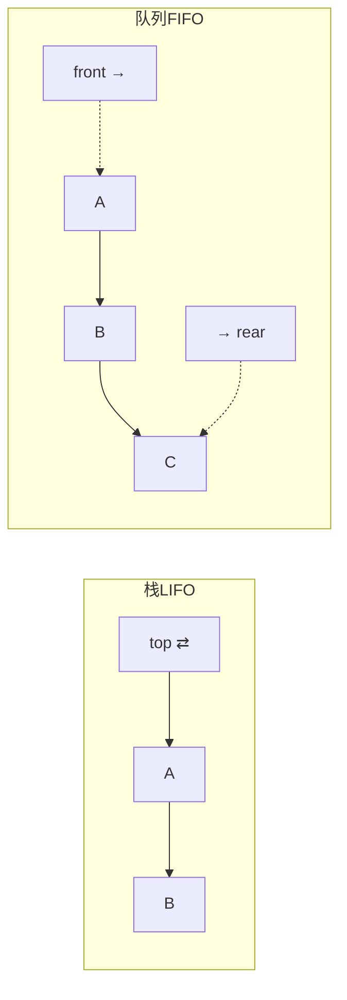
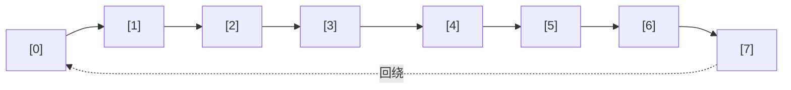
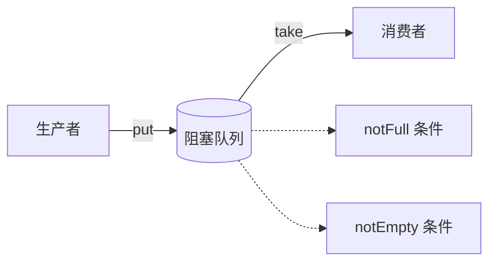

# 队列操作实践

## 目录指引与导读

> 阅读建议：本篇贯穿"FIFO 数据结构 → 阻塞 / 无锁 / Disruptor 工业级实现"，一路打通从手写到选型；想速查可直接跳到对应锚点。

- [01. 从工作案例说起](#01-从工作案例说起)
- [02. 队列定义与本质](#02-队列定义与本质)
  - [2.1 队列核心API](#21-队列核心api)
  - [2.2 FIFO对比LIFO](#22-fifo对比lifo)
  - [2.3 队列常见变种](#23-队列常见变种)
- [03. 顺序队列假溢出](#03-顺序队列假溢出)
  - [3.1 什么是假溢出](#31-什么是假溢出)
  - [3.2 入队集中搬移](#32-入队集中搬移)
- [04. 循环队列环形解法](#04-循环队列环形解法)
  - [4.1 环形队列思想](#41-环形队列思想)
  - [4.2 四个关键公式](#42-四个关键公式)
  - [4.3 循环队列实现](#43-循环队列实现)
- [05. 阻塞队列消费模型](#05-阻塞队列消费模型)
  - [5.1 阻塞队列语义](#51-阻塞队列语义)
  - [5.2 双条件经典实现](#52-双条件经典实现)
  - [5.3 两个易错要点](#53-两个易错要点)
  - [5.4 工业实现对照表](#54-工业实现对照表)
- [06. 并发队列三大流派](#06-并发队列三大流派)
  - [6.1 双锁链表队列](#61-双锁链表队列)
  - [6.2 无锁CAS队列](#62-无锁cas队列)
  - [6.3 ABA经典问题](#63-aba经典问题)
  - [6.4 Disruptor环形极致](#64-disruptor环形极致)
  - [6.5 五种方案选型](#65-五种方案选型)
- [07. 优先与双端队列](#07-优先与双端队列)
  - [7.1 优先队列即堆](#71-优先队列即堆)
  - [7.2 双端队列Deque](#72-双端队列deque)
- [08. 队列经典工业应用](#08-队列经典工业应用)
- [09. 本篇收获与回扣](#09-本篇收获与回扣)
- [10. 思考题深度练](#10-思考题深度练)
- [11. 课后作业实战](#11-课后作业实战)
- [12. 进阶专题与延伸](#12-进阶专题与延伸)

---

## 01. 从工作案例说起

> 真实事故：一个订单导出服务把整个 JVM 打爆了。

背景：后台有一个 **订单导出** 功能，运营同学一次可以勾选最多 100 万条订单导出 Excel。初期用的是最朴素的实现：

- 前端点"导出"后，直接在线程里**同步**跑；
- 一个 Tomcat 工作线程从接到请求到生成文件可能要 30 秒；
- 用户偶尔会频繁点，同一用户点几次就会开好几个同样重的任务。

结果：

- Tomcat 工作线程被导出任务占光 → 所有业务接口超时；
- 用户按"退出"后任务没被清掉 → 继续跑、继续占内存；
- 某天某运营点了 20 次，进程直接 OOM。

正确的做法：**请求入队 → 工作线程按 FIFO 消费 → 同一用户最多只能排一个任务 → 队列满了就拒新**。核心就是把同步改成异步：

```java
BlockingQueue<ExportTask> queue = new ArrayBlockingQueue<>(200);
ExecutorService workers = Executors.newFixedThreadPool(8);

// 接口层
public void submit(ExportTask t) {
    if (!queue.offer(t)) throw new BusyException("当前导出任务繁忙，请稍后再试");
}

// 消费层
workers.submit(() -> {
    while (true) {
        ExportTask t = queue.take();        // 空就阻塞，不忙等
        t.run();
    }
});
```

上线后：

- 接口 P99 从 30s 降到 10ms（只做入队）；
- 内存稳定，不再 OOM；
- 同一用户只会消耗一个排队位。

> 本篇就从这个案例切进去，把队列从"基本数组实现"讲到"阻塞 / 无锁 / Disruptor 极致性能"，学完你能从 0 搭出一个像样的异步任务系统，并独立选型 `ArrayBlockingQueue` / `LinkedBlockingQueue` / `ConcurrentLinkedQueue` / Kafka / RocketMQ。

---

## 02. 队列定义与本质

### 2.1 队列核心API

| 操作 | 含义 | 复杂度 |
|-----|-----|-------|
| `enqueue(x)` | 从队尾入队 | O(1) |
| `dequeue()` | 从队头出队 | O(1) |
| `peek()` | 看一眼队头 | O(1) |
| `isEmpty()` / `size()` | 判空 / 大小 | O(1) |

> **底层说明**：所有"队列"实现都要努力保持 `enqueue/dequeue` 都是 O(1)；这就要求 head 和 tail 两个指针都可独立 O(1) 推进——这正是顺序数组实现"假溢出"的根源（tail 推进了，head 留下的空位无法回收）。

### 2.2 FIFO对比LIFO



- 栈关注"时间邻近"：最近进的先出（撤销 / 回溯）；
- 队列关注"时间公平"：先进的先出（调度 / 消息）。

> **延伸思考**：为什么操作系统的就绪线程用"队列"调度而非"栈"？因为公平——若用栈，就会出现"刚来的优先执行，老任务一直饿死"的优先级反转。**队列 = 公平**，**栈 = 邻近**，看到这两个词就能立刻定位结构。

### 2.3 队列常见变种

| 变种 | 特征 | 典型应用 |
|-----|-----|---------|
| 普通队列 | 严格 FIFO | 打印任务 |
| 循环队列 | 数组首尾相接 | 内核 kfifo、Disruptor |
| 双端队列 | 两端都能进出 | 滑动窗口最大值、ForkJoin work-stealing |
| 优先队列 | 按优先级出 | Dijkstra、任务调度 |
| 阻塞队列 | 空等 / 满等 | 生产者-消费者 |
| 延迟队列 | 到期才能出 | 订单超时、定时任务 |

> **工程提醒**：很多业务问题选错"队列变种"会导致严重事故——例如订单超时该用"延迟队列 / 时间轮"而不是普通队列轮询；而"按优先级抢先"该用优先队列而不是给普通队列加排序逻辑（每次入队 O(N)）。

---

## 03. 顺序队列假溢出

用一维数组 + 双指针（head / tail）最朴素的实现：

```java
public class ArrayQueue<T> {
    private Object[] items;
    private int n, head, tail;

    public ArrayQueue(int cap) { items = new Object[cap]; n = cap; }

    public boolean enqueue(T v) {
        if (tail == n) return false;              // 假溢出！
        items[tail++] = v; return true;
    }
    @SuppressWarnings("unchecked")
    public T dequeue() {
        if (head == tail) return null;
        T v = (T) items[head];
        items[head++] = null;
        return v;
    }
}
```

### 3.1 什么是假溢出

```text
容量 8: [A B C D E . . .]
              ↑        ↑
             head     tail=5

出队3次: [. . . D E . . .]
                ↑     ↑
              head=3 tail=5

再入队3次: [. . . D E F G H]
                  ↑           ↑
                 head=3       tail=8

→ tail 顶到 n 了，其实前面还有 3 个空位
```

### 3.2 入队集中搬移

出队时不搬，tail 顶到头时一次性把 [head, tail) 搬到 [0, tail-head)：

```java
public boolean enqueue(T v) {
    if (tail == n) {
        if (head == 0) return false;              // 真的满了
        for (int i = head; i < tail; i++) items[i - head] = items[i];
        tail -= head; head = 0;
    }
    items[tail++] = v; return true;
}
```

均摊复杂度仍是 O(1)——但每次搬移都是突刺，不够稳定。**根治方案见循环队列**。

---

## 04. 循环队列环形解法

### 4.1 环形队列思想

物理上还是一维数组，但 head / tail 用 **模运算** 回绕，逻辑上首尾相接成环。



### 4.2 四个关键公式

| 操作 | 公式 |
|-----|-----|
| 入队推进 | `tail = (tail + 1) % cap` |
| 出队推进 | `head = (head + 1) % cap` |
| 判空 | `head == tail` |
| 判满（牺牲一格） | `(tail + 1) % cap == head` |

"牺牲一格"是因为 `head == tail` 需要同时表达"空"和"满"中的一种，最简单的办法是让队列永远留一个空位——代价仅 1 个槽位，逻辑最清晰。

> **延伸知识**：除了"牺牲一格"，还有两种常见判满方案——① 显式 `count` 字段，多 4 字节但语义最清楚；② tail 用 `unsigned long` 单调递增、不取模（容量必须是 2 的幂），靠 `tail - head == cap` 判满，**Disruptor / Linux kfifo 都用这种方案**，CAS 友好且无需取模。

### 4.3 循环队列实现

```java
public class CircularQueue<T> {
    private final Object[] data;
    private final int cap;                     // 实际分配 capacity + 1
    private int head, tail;

    public CircularQueue(int capacity) {
        cap = capacity + 1;
        data = new Object[cap];
    }

    public boolean enqueue(T v) {
        int nextTail = (tail + 1) % cap;
        if (nextTail == head) return false;    // 满
        data[tail] = v; tail = nextTail;
        return true;
    }

    @SuppressWarnings("unchecked")
    public T dequeue() {
        if (head == tail) return null;         // 空
        T v = (T) data[head];
        data[head] = null;
        head = (head + 1) % cap;
        return v;
    }

    public int size() { return (tail - head + cap) % cap; }
}
```

> Linux 内核的 `kfifo`、Disruptor 的 RingBuffer 都是循环队列的工业级进化版本。

---

## 05. 阻塞队列消费模型

### 5.1 阻塞队列语义

- 队列**空**时，`take()` 阻塞，直到有数据；
- 队列**满**时，`put()` 阻塞，直到有空位；
- 生产者和消费者通过队列解耦。



### 5.2 双条件经典实现

```java
public class MyBlockingQueue<T> {
    private final Object[] data;
    private int head, tail, count;
    private final ReentrantLock lock = new ReentrantLock();
    private final Condition notFull  = lock.newCondition();
    private final Condition notEmpty = lock.newCondition();

    public MyBlockingQueue(int cap) { data = new Object[cap]; }

    public void put(T v) throws InterruptedException {
        lock.lock();
        try {
            while (count == data.length) notFull.await();   // ← 必须 while
            data[tail] = v;
            tail = (tail + 1) % data.length;
            count++;
            notEmpty.signal();
        } finally { lock.unlock(); }
    }

    @SuppressWarnings("unchecked")
    public T take() throws InterruptedException {
        lock.lock();
        try {
            while (count == 0) notEmpty.await();
            T v = (T) data[head];
            data[head] = null;
            head = (head + 1) % data.length;
            count--;
            notFull.signal();
            return v;
        } finally { lock.unlock(); }
    }
}
```

### 5.3 两个易错要点

- **`while` 而不是 `if`**：存在 **虚假唤醒**，线程被唤醒时条件可能并未满足，必须循环再判一次；
- **`signal` 还是 `signalAll`**：单生产单消费用 `signal` 即可；多生产多消费若只用一个 Condition，要用 `signalAll` 防止"错过唤醒"（这也是为什么推荐用两个 Condition）。

> **延伸思考**：虚假唤醒不是 JDK bug，而是 POSIX `pthread_cond_wait` 自身允许的——为了让 `condition variable` 实现更高效，`futex` / 信号量在内核唤醒边界条件下可能"虚假返回"。所以但凡用条件等待，**永远 while + 永远再校验**是必要而非可选。

### 5.4 工业实现对照表

| 实现 | 底层 | 特点 |
|-----|------|-----|
| `ArrayBlockingQueue` | 数组 + 一把锁 | 有界、公平锁可选 |
| `LinkedBlockingQueue` | 链表 + 两把锁 | 可选有界，吞吐稍高 |
| `LinkedTransferQueue` | 链表 + 无锁CAS | 高吞吐、支持 transfer 同步移交 |
| `SynchronousQueue` | 不存数据，直接握手 | 线程池缓存线程模型核心 |

---

## 06. 并发队列三大流派

### 6.1 双锁链表队列

入队在 tail、出队在 head，两端在绝大多数时刻互不干扰。给 tail / head 分别加锁，**生产者和消费者不再互斥**，吞吐大幅提升。

`ArrayBlockingQueue` 用数组，head / tail 共享同一块内存，无法做到像链表这样彻底分离。

> **底层原因**：链表的 head / tail 节点天然不在同一块内存（不同 cache line），双锁互不干扰；而数组 head / tail 都是 `int` 字段，会落在同一对象头之后的连续字节里，容易共享 cache line，**强行加双锁反而触发伪共享**，得不偿失。

### 6.2 无锁CAS队列

用 `AtomicReference` 自旋 + CAS 代替锁（Java `ConcurrentLinkedQueue` 原型）：

```java
public class LockFreeQueue<T> {
    static class Node<T> {
        final T value;
        final AtomicReference<Node<T>> next = new AtomicReference<>();
        Node(T v) { value = v; }
    }

    private final AtomicReference<Node<T>> head, tail;

    public LockFreeQueue() {
        Node<T> dummy = new Node<>(null);
        head = new AtomicReference<>(dummy);
        tail = new AtomicReference<>(dummy);
    }

    public void enqueue(T v) {
        Node<T> n = new Node<>(v);
        for (;;) {
            Node<T> t = tail.get();
            Node<T> nx = t.next.get();
            if (nx == null) {
                if (t.next.compareAndSet(null, n)) {
                    tail.compareAndSet(t, n);                // 帮忙推进
                    return;
                }
            } else {
                tail.compareAndSet(t, nx);                    // 别人推进到一半，帮一把
            }
        }
    }
}
```

### 6.3 ABA经典问题

CAS 只比较"值是否变化"，但**值从 A → B → A 再回来，CAS 依然成功**，可能导致逻辑错误。
解决：加版本号 —— Java `AtomicStampedReference`。

> **直觉构建**：CAS 关心的是"现值 == 期望值"——但"期望值此刻看到的 A，是不是和我之前看到的 A 是同一个 A"，CAS 无法回答。版本号给每次修改打"时间戳"，让"先 A 后 B 再 A"留下不可抹除的修改痕迹。

### 6.4 Disruptor环形极致

LMAX 交易所开源，标称比 `ArrayBlockingQueue` 快约 **100 倍**。

| 优化 | 说明 |
|-----|-----|
| **RingBuffer** | 环形数组预分配，无 GC |
| **CAS 获取序号** | 生产者通过 CAS 抢占 slot 的 sequence |
| **缓存行填充** | 用 padding 把 head / tail 放到不同缓存行，消除 **伪共享（False Sharing）** |
| **批量消费** | 消费者一次取多个可用事件 |

> 典型吞吐参考（单生产单消费，百万次操作）：`ArrayBlockingQueue ≈ 5 μs / op`，`LinkedBlockingQueue ≈ 8 μs / op`，**Disruptor ≈ 50 ns / op**。

### 6.5 五种方案选型

| 队列 | 线程安全机制 | 吞吐 | 场景 |
|-----|-----------|-----|-----|
| 普通队列 | 无 | 最快 | 单线程 |
| `ArrayBlockingQueue` | 一把锁 | 中 | 生产消费、一般并发 |
| `LinkedBlockingQueue` | 双锁 | 较高 | 线程池任务队列（JDK 默认） |
| `ConcurrentLinkedQueue` | CAS 无锁 | 高 | 高并发、非阻塞 |
| Disruptor | 序号 + 缓存行填充 | 极致 | 交易、游戏、低延迟系统 |

---

## 07. 优先与双端队列

### 7.1 优先队列即堆

语义：**出队的永远是优先级最高（或最低）的元素**，典型用二叉堆实现，入 / 出 均为 O(log N)。

```java
// JDK 自带：PriorityQueue 默认小顶堆
PriorityQueue<int[]> pq = new PriorityQueue<>((a, b) -> a[0] - b[0]);
pq.offer(new int[]{3, 1});   // 优先级 3
pq.offer(new int[]{1, 2});   // 优先级 1（最高）
pq.offer(new int[]{2, 3});
System.out.println(Arrays.toString(pq.poll()));   // [1, 2]
```

工业应用：Dijkstra 最短路、Huffman 编码、线程池中的"定时任务"、消息调度的"优先级 + 时间"模型。

> **底层说明**：`PriorityQueue` 不是线程安全的；并发场景请用 `PriorityBlockingQueue`（基于二叉堆 + ReentrantLock）。注意它的 `iterator()` **不保证按优先级顺序**——很多人栽过这个坑，要按优先级输出必须反复 `poll`。

### 7.2 双端队列Deque

两端都能入 / 出：既是栈、又是队列、还是滑动窗口的基础数据结构。Java 里用 `ArrayDeque`（注意不是 `LinkedList`，前者基于数组循环队列，缓存友好且更快）。

**滑动窗口最大值**是经典的单调双端队列应用，O(N) 搞定：

```java
// LeetCode 239. Sliding Window Maximum
public int[] maxSlidingWindow(int[] nums, int k) {
    int n = nums.length;
    int[] res = new int[n - k + 1];
    Deque<Integer> dq = new ArrayDeque<>();   // 存下标，对应值单调递减
    for (int i = 0; i < n; i++) {
        while (!dq.isEmpty() && nums[dq.peekLast()] <= nums[i]) dq.pollLast();
        dq.offerLast(i);
        if (dq.peekFirst() <= i - k) dq.pollFirst();
        if (i >= k - 1) res[i - k + 1] = nums[dq.peekFirst()];
    }
    return res;
}
```

> **延伸思考**：单调双端队列让"窗口最大值"从 O(NK) 降到 O(N)——每个元素至多入队一次、出队一次。"什么时候该淘汰旧元素"靠尾删（被新更大值挤出），"什么时候该过期"靠头删（窗口左端越界）。这种"尾淘汰 + 头过期"双向操作，正是 Deque 的杀手锏。

---

## 08. 队列经典工业应用

| 场景 | 队列的角色 |
|-----|----------|
| 线程池任务调度 | `BlockingQueue` 承接未执行任务 |
| BFS / 层次遍历 | 先进先出自然表达"按层次展开" |
| 消息队列（Kafka / RocketMQ） | 跨服务异步解耦、削峰填谷 |
| 打印任务 | 严格 FIFO 保证公平 |
| CPU 指令流水线 | 多级队列串联各阶段 |
| 网卡缓冲区 | 环形队列缓存数据包 |
| 订单超时 / 定时任务 | 延迟队列 / 时间轮 |
| 滑动窗口 | 双端队列 |

### 8.1 线程池的任务队列选型

`ThreadPoolExecutor` 构造函数里那个 `BlockingQueue<Runnable> workQueue` 的选择，直接决定线程池的行为模型：

| 队列 | 线程池行为 | 场景 |
|------|-----------|------|
| `SynchronousQueue` | 不缓存任务，必须立即有空闲线程接手；否则新建线程（最多到 maxPoolSize） | `newCachedThreadPool`——峰值弹性 |
| `LinkedBlockingQueue`（无界） | 任务先入队；max 参数实际失效 | `newFixedThreadPool`、`newSingleThreadExecutor` |
| `ArrayBlockingQueue`（有界） | 入队满时才扩线程；线程也满则走拒绝策略 | 生产环境推荐，能真正起到限流作用 |
| `PriorityBlockingQueue` | 按任务优先级出队 | 任务有轻重缓急时 |
| `DelayedWorkQueue` | 延迟出队 | `ScheduledThreadPoolExecutor` |

**工程红线**：`newFixedThreadPool` 的无界 `LinkedBlockingQueue` 是**隐形 OOM 杀手**——任务堆积无人拦截。阿里《Java 开发手册》明确禁止使用 Executors 创建线程池，要求直接用 `ThreadPoolExecutor` 传入有界队列。

### 8.2 Kafka 的 log 其实也是队列

Kafka 表面是"消息队列中间件"，本质上**每个 partition 就是一条只追加（append-only）的文件队列**：

```
Partition-0:
[msg0][msg1][msg2][msg3][msg4][msg5]...
 ↑                              ↑
consumer offset=0              producer end

消费：读到 offset 3 后，把 offset 持久化到 __consumer_offsets topic
生产：append 到文件末尾，fsync 后返回确认
```

这种设计的妙处：
- **顺序写磁盘** 比随机写快 100+ 倍（HDD 尤其明显，SSD 也快 5-10 倍）；
- **offset 作为指针**而不是删除——消费者各自独立记进度，同一条消息可以被多个 consumer 各自消费一次（\"发布订阅\"）；
- **保留时间/大小**控制，不是\"消费完就删\"——回溯消费、重放都很容易。

**Kafka 的吞吐（百万条/秒）就是来自这个简化到极致的队列模型**——它把\"内存队列\"直接放到磁盘上，并用操作系统的 page cache 当 \"自动内存缓存\"。

---

## 09. 本篇收获与回扣

回到开篇"订单导出打爆 JVM"的案例：

- **问题本质**：同步直跑 → 线程资源被长耗时任务霸占 → 请求堆积 → OOM。
- **正确解法**：`ArrayBlockingQueue(200)` 作为任务缓冲 + 固定大小工作线程池消费 + 用户级排队去重 + 队满快速拒绝。
- **队列在这里做的三件事**：
  1. **削峰**：瞬时涌入挡在队列前，不直接打到处理层；
  2. **解耦**：接口层只管入队，处理层只管出队；
  3. **限流**：队列有上限 + `offer` 非阻塞 → 自然拒绝多余请求。

通过本篇你应该拿到以下能力：

1. 能独立讲清 **FIFO 本质 + 假溢出 + 循环队列**，知道为什么工业里更偏爱循环队列；
2. 能用 `ReentrantLock + Condition` 手写阻塞队列，并理解为什么用 `while` 不用 `if`；
3. 能在 `ArrayBlockingQueue / LinkedBlockingQueue / ConcurrentLinkedQueue / Disruptor` 之间做有依据的选型；
4. 理解 CAS / ABA / 伪共享 / 缓存行填充等无锁并发的关键概念；
5. 在任何遇到"异步 + 生产消费 + 限流 + 削峰"的工程场景，第一反应就是队列。

---

## 10. 思考题深度练

> 建议先独立思考，再查资料验证。

1. **判空 / 判满**：循环队列中 `head == tail` 既可能空也可能满。请列出**三种**区分方式，并对比各自优缺点；`Disruptor` 的 RingBuffer 采用的是哪一种，为什么？
2. **双锁可行性**：`LinkedBlockingQueue` 能用两把锁，`ArrayBlockingQueue` 却只能一把，为什么？如果你一定要给数组版也加"双锁"，会遇到什么边界问题？
3. **ABA 的隐蔽 Bug**：请构造一个能因 ABA 导致数据错乱的场景（例如无锁栈 pop 出 A、别人 push B、pop B、又 push 回 A），并说明 `AtomicStampedReference` 是如何解决的。
4. **伪共享**：两个 volatile 变量恰好落在同一个 64 字节缓存行，为什么会"互相拖后腿"？给 `head` 和 `tail` 各自做 padding 后，吞吐提升能达到怎样的量级？（可以用 `@Contended` 或手写 long 填充做对照实验）
5. **延迟队列实战**：订单 30 分钟未支付自动取消。请设计至少两套方案：**堆 + 轮询** vs **时间轮**；它们的时间 / 空间复杂度各是多少？Kafka / RocketMQ 分别选了什么思路？

---

## 11. 课后作业实战

### 作业一｜还原开篇案例，对比同步 vs 异步

1. 用纯同步实现一个"耗时 3 秒的假导出"接口，开 100 并发，观察接口 P99 与线程数；
2. 引入 `ArrayBlockingQueue(50) + ThreadPoolExecutor(8)` 改成异步，接口仅入队立即返回 `requestId`；
3. 客户端轮询 `requestId` 拿结果；
4. 记录改造前后 **P99、可用线程数、错误率** 三项指标并写 300 字总结。

### 作业二｜手写循环 + 阻塞队列

1. 实现一个泛型 `BoundedBlockingQueue<T>`：底层循环数组 + ReentrantLock + 两个 Condition；
2. 至少支持 `put / take / offer(timeout) / poll(timeout) / size / clear`；
3. 写 JMH 基准，比较你的实现与 `ArrayBlockingQueue` 在单生产单消费、多生产多消费两种负载下的吞吐。

### 作业三｜选型决策矩阵

针对下面 4 个真实场景，给出你推荐的队列并说明理由：

1. 双十一秒杀的订单接收缓冲（百万 QPS，要求绝不丢单）；
2. 一个 WebSocket 网关，每连接一个线程安全的待发送消息队列，平均负载较低；
3. LMAX 式的高频交易匹配引擎，要求延迟 < 1μs；
4. 一个延迟 10min 自动通知的定时器（总量百万、峰值 1 万 QPS）。

最后写一份"我们项目如果要新增一个队列，选型流程应该是这样"的 300 字 SOP。

---

## 12. 进阶专题与延伸

### 12.1 时间轮：延迟任务的最优解

普通堆实现的延迟队列：插入 O(log N)、取最早到期 O(log N)。百万级任务时 log N ≈ 20，每次操作 20 次比较，CPU 开销可观。

**时间轮（Hashed Wheel Timer）**把时间切成固定刻度（tick，如 100ms），每个刻度一个桶，任务 Hash 到对应桶：

```
时间轮（刻度 100ms，共 8 格）：
┌─────┬─────┬─────┬─────┬─────┬─────┬─────┬─────┐
│bucket│ … │ … │ … │ … │ … │ … │ … │
│  0  │ 1 │ 2 │ 3 │ 4 │ 5 │ 6 │ 7 │
└─────┴─────┴─────┴─────┴─────┴─────┴─────┴─────┘
  ↑ 指针每 100ms 前进一格，执行当前 bucket 里到期任务
```

**复杂度**：插入 O(1)、删除 O(1)、tick 时批处理 O(expired)。**Netty HashedWheelTimer、Kafka DelayedOperationPurgatory、RocketMQ 定时消息** 都用时间轮。

**层级时间轮**：一个 8 格的时间轮只能表示 8 tick 的时间；再嵌套一层\"粗粒度\"时间轮（比如 8 格 × 8 tick = 64 tick），可以表达更长的延迟。Kafka 的\"分钟级定时\"就是 3 层时间轮级联。

```java
// Netty 时间轮使用示例
HashedWheelTimer timer = new HashedWheelTimer(100, TimeUnit.MILLISECONDS, 512);
timer.newTimeout(timeout -> {
    System.out.println("30 分钟后取消订单");
}, 30, TimeUnit.MINUTES);
```

### 12.2 Disruptor 的核心 trick：序号 + 缓存行填充

```java
// Disruptor 核心的 Sequence
class Sequence {
    // 填充前：避免 CPU false sharing
    long p1, p2, p3, p4, p5, p6, p7;
    volatile long value;
    // 填充后
    long p8, p9, p10, p11, p12, p13, p14;
    // 一个 Sequence 独占一整个 64 字节缓存行
}
```

**伪共享（False Sharing）** 是多核 CPU 的性能杀手——两个 volatile 变量恰好落在同一 cache line，核 A 修改 x 时，核 B 上的 y 所在 cache line 也被 invalidate，触发一次跨核同步（几十到几百纳秒）。

Disruptor 把生产者序号和消费者序号各自填充到独占 cache line，**消除跨核干扰**，是它能跑到 50ns/op 的关键。JDK 8 的 `@sun.misc.Contended` 注解（JDK 9+ 的 `@jdk.internal.vm.annotation.Contended`）能自动做这件事——但需要 JVM 参数 `-XX:-RestrictContended` 开启。

### 12.3 work-stealing 队列：ForkJoinPool 的秘密

`ForkJoinPool` 是 Java 并行计算的核心（`parallelStream`、`CompletableFuture` 默认线程池）。每个工作线程都有**自己的双端队列**：

```
Worker A 的 deque: [T5][T4][T3]        ← A 从头部 push/pop（LIFO，提升 cache）
Worker B 的 deque: []                   ← B 空闲了
                  ↑
                  B 从 A 的尾部 "steal" 任务（FIFO，避免冲突）
```

关键点：
- **自己 push/pop 走头部**（LIFO）——新产生的任务最可能共享局部缓存；
- **别人偷窃走尾部**（FIFO）——大任务通常在尾部，偷到能跑久一些；
- **两端不会竞争**（只要队列不是空的）——减少锁冲突。

这个数据结构叫 **Chase-Lev deque**，由 David Chase 和 Yossi Lev 2005 年论文提出。Go 的调度器、Rust Rayon 线程池、.NET TPL 都用这个思路。

### 12.4 无锁环形队列的两种主流

- **SPSC（单生产单消费）**：只需普通 volatile 读写 + memory barrier，无需 CAS。Netty `PlatformDependent.newSpscArrayQueue` 就是；
- **MPMC（多生产多消费）**：每个 slot 加一个 sequence 序号，生产者 CAS 占据 slot 前必须先 CAS 写 seq。Disruptor 的 multi-producer 模式、JCTools MpmcArrayQueue 即此思路。

SPSC 性能最高，**吞吐能到 10 亿 ops/s 量级**（JCTools 官方 benchmark）——几乎是 CPU 理论极限。

### 12.5 异步 IO 与 io_uring 中的队列

Linux 5.1+ 引入的 `io_uring` 是近年最重要的内核特性之一。它用**两条共享内存环形队列**（Submission Queue + Completion Queue）实现\"用户态提交 IO 请求，内核完成后写入完成队列\"——**零拷贝、零系统调用**：

```
用户态                                 内核态
  ┌───────────┐ ──填写──>           ┌───────────┐
  │  SQ 环    │                       │ 处理请求   │
  │ (提交队列) │                       │          │
  └───────────┘                       │          │
                                      │  异步 IO   │
  ┌───────────┐ <──完成─            │          │
  │  CQ 环    │                       │          │
  │ (完成队列) │                       │          │
  └───────────┘                       └───────────┘
```

**性能**：nginx 用 io_uring 后 QPS 提升 30-50%；rust 的 `tokio` + `io-uring` 跑到百万连接。它本质仍是**循环数组 + 原子指针**——和 Disruptor 的思路完全一样，但一条跑在内核一条跑在用户态。

### 12.6 经典书与论文

- Michael, M. & Scott, M. 1996. *Simple, Fast, and Practical Non-Blocking and Blocking Concurrent Queue Algorithms*——MS 队列开山之作
- Chase, D. & Lev, Y. 2005. *Dynamic Circular Work-Stealing Deque*——work-stealing 的标准算法
- Varghese, G. & Lauck, T. 1987. *Hashed and Hierarchical Timing Wheels*——时间轮论文
- Herlihy & Shavit 《The Art of Multiprocessor Programming》——并发数据结构权威
- 《深入理解 Kafka》（郑奇煌）——Kafka 存储模型和队列化设计
- LMAX Disruptor 白皮书（docs/Disruptor-1.0.pdf）——mechanical sympathy 哲学的代表作

**工业代码**：
- JCTools (`org.jctools.queues`)——最成熟的 JVM 无锁队列库，Netty 内嵌使用
- LMAX Disruptor（github.com/LMAX-Exchange/disruptor）
- Netty `HashedWheelTimer`（`io.netty.util.HashedWheelTimer`）
- Kafka `kafka.utils.timer.SystemTimer`——层级时间轮工业实现
- Linux 内核 `include/linux/kfifo.h`——循环队列的"零依赖"实现典范

---

> 队列讲完，线性结构（数组、链表、栈、队列）这条主线就完整了。下一篇《08.二叉树的操作实践》会跨到**非线性**世界——一旦节点有了\"两个孩子\"的分支，算法和复杂度的世界就彻底变天：从线性的 O(N) 降到 O(log N) 是可能的，但也出现了\"平衡与不平衡\"、\"递归与迭代\"、\"遍历顺序\" 等全新维度的博弈。

