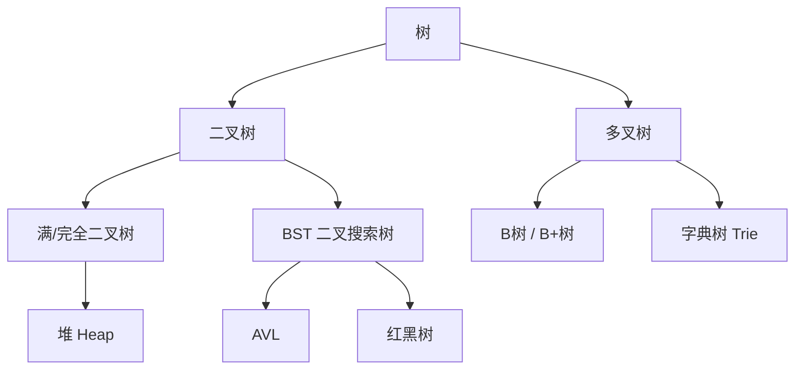
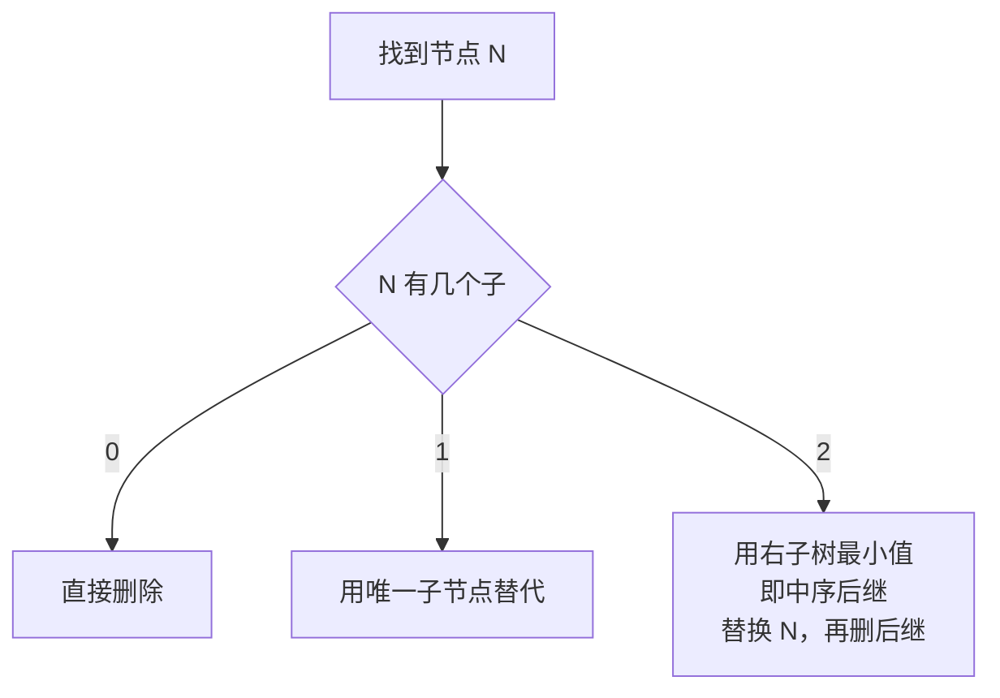
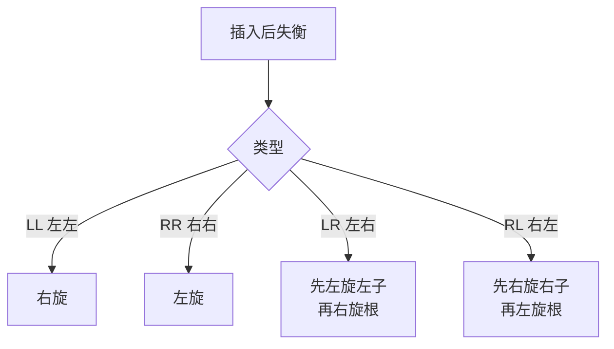

# 二叉树操作论

## 目录指引与导读

> 阅读建议：本篇从"为什么需要分层结构"切入，逐步走到 BST、AVL、堆、B+ 树、Huffman、表达式树等工业落地；如果只想速查可直接跳到锚点。

- [01. 从工作案例说起](#01-从工作案例说起)
- [02. 树为何分层结构](#02-树为何分层结构)
  - [2.1 线性结构的天花板](#21-线性结构的天花板)
  - [2.2 logN的分层威力](#22-logn的分层威力)
  - [2.3 树的基本术语](#23-树的基本术语)
  - [2.4 常见树的家族](#24-常见树的家族)
- [03. 二叉树存储与节点](#03-二叉树存储与节点)
  - [3.1 数学性质速记](#31-数学性质速记)
  - [3.2 完全二叉数组存](#32-完全二叉数组存)
  - [3.3 链式节点定义](#33-链式节点定义)
  - [3.4 两种存储对比](#34-两种存储对比)
- [04. 二叉树的四种遍历](#04-二叉树的四种遍历)
  - [4.1 三种DFS递归版](#41-三种dfs递归版)
  - [4.2 显式栈迭代版](#42-显式栈迭代版)
  - [4.3 层序遍历BFS版](#43-层序遍历bfs版)
  - [4.4 用哪种遍历选型](#44-用哪种遍历选型)
- [05. 二叉搜索树BST](#05-二叉搜索树bst)
  - [5.1 BST核心定义](#51-bst核心定义)
  - [5.2 查找操作迭代](#52-查找操作迭代)
  - [5.3 插入操作递归](#53-插入操作递归)
  - [5.4 删除三种情况](#54-删除三种情况)
  - [5.5 BST退化弱点](#55-bst退化弱点)
- [06. 平衡二叉树AVL](#06-平衡二叉树avl)
  - [6.1 平衡因子约束](#61-平衡因子约束)
  - [6.2 四种失衡旋转](#62-四种失衡旋转)
  - [6.3 插入再平衡逻辑](#63-插入再平衡逻辑)
  - [6.4 AVL对比红黑树](#64-avl对比红黑树)
- [07. 堆与优先队列](#07-堆与优先队列)
  - [7.1 完全二叉堆序](#71-完全二叉堆序)
  - [7.2 上浮与下沉操作](#72-上浮与下沉操作)
  - [7.3 建堆为何是ON](#73-建堆为何是on)
  - [7.4 TopK小顶堆套路](#74-topk小顶堆套路)
  - [7.5 用堆的典型场景](#75-用堆的典型场景)
- [08. 二叉树工业应用](#08-二叉树工业应用)
  - [8.1 文件系统多叉树](#81-文件系统多叉树)
  - [8.2 数据库B加树索引](#82-数据库b加树索引)
  - [8.3 哈夫曼数据压缩](#83-哈夫曼数据压缩)
  - [8.4 表达式树求值](#84-表达式树求值)
  - [8.5 高频面试速览](#85-高频面试速览)
- [09. 本篇收获与回扣](#09-本篇收获与回扣)
- [10. 思考题深度练](#10-思考题深度练)
- [11. 课后作业实战](#11-课后作业实战)
- [12. 进阶专题与延伸](#12-进阶专题与延伸)

---

## 01. 从工作案例说起

> 真实需求：给 IM 服务接入一个"**离线消息排行榜 Top-100**"——在 10 亿条消息里找出"未读数最多"的前 100 个群。

第一版实现，组内新同学直接用：

```java
// 把 10 亿条消息按未读数倒排全量排序，再取前 100
messages.sort((a, b) -> b.unread - a.unread);
List<Msg> top100 = messages.subList(0, 100);
```

压测时直接崩：

1. 时间复杂度 **O(N log N)**，10 亿级数据在 JVM 里几乎跑不完；
2. 要把 10 亿对象同时驻留内存，OOM 分分钟的事；
3. 场景只要 Top 100，却支付了 99.99% 无用排序的成本。

**正确解法：维护一个容量为 100 的 "小顶堆"**

- 堆顶永远是当前 Top 100 里的 "第 100 名"；
- 新来一条消息：若未读数 ≤ 堆顶，直接丢；否则弹出堆顶、把它插进堆；
- 全程内存 O(K = 100)，时间 **O(N log K)**。

```java
PriorityQueue<Msg> minHeap = new PriorityQueue<>(100, Comparator.comparingInt(m -> m.unread));
for (Msg m : messages) {
    if (minHeap.size() < 100) minHeap.offer(m);
    else if (m.unread > minHeap.peek().unread) {
        minHeap.poll();
        minHeap.offer(m);
    }
}
```

10 亿级流式数据秒级完成，内存不到 1 MB。堆 / 优先队列本质就是一棵 **完全二叉树**，是这一篇二叉树知识的核心落脚点。

> 本篇从"为什么需要树"讲到"BST / AVL / 堆"，再到 B+ 树、哈夫曼、表达式树等工业应用。学完你能轻松拿下 LeetCode 94 / 98 / 102 / 215 / 236 等高频题，并独立设计开篇的 Top-K 服务。

---

## 02. 树为何分层结构

### 2.1 线性结构的天花板

| 结构 | 查找 | 插入 | 删除 |
|-----|-----|-----|-----|
| 有序数组 | **O(log N)** | O(N) | O(N) |
| 链表 | O(N) | **O(1)**（已定位） | **O(1)**（已定位） |
| 平衡二叉树 | **O(log N)** | **O(log N)** | **O(log N)** |

线性结构逼不出"查找、插入、删除全都 O(log N)"这种均衡；**树通过分层** 把这三件事捏在一起。

> **底层原因**：线性结构只能"线性扫描或有序对半"——前者插入快、查找慢；后者反过来。**树把"有序"沿层次摊开**，让任何一次操作都只走一条 log N 的路径，从而同时拿到三方面的均衡。

### 2.2 logN的分层威力

| 数据量 N | O(N) | O(log N) | 加速比 |
|---------|-----|---------|-------|
| 1 千 | 500 | 10 | 50× |
| 100 万 | 50 万 | 20 | 2.5 万× |
| 10 亿 | 5 亿 | 30 | 1600 万× |

一层分层判断 = 排除一半候选，这是树结构的效率本源。

> **直觉构建**：log₂(N) 的物理含义就是"把 N 个候选连续对半砍多少次能剩 1 个"。这也解释了为什么 B+ 树工业上几乎只需 3~4 层就能管 1 亿数据——因为每层做的不是"砍一半"，而是"砍几百份"。

### 2.3 树的基本术语

```text
        A          根
       / \
      B   C        B、C 兄弟
     / \   \
    D   E   F      叶子: E/F/G
   /
  G
```

| 术语 | 定义 |
|-----|-----|
| 根节点 | 没有父节点 |
| 叶子节点 | 没有子节点 |
| 节点的度 | 子节点数量 |
| 深度 | 根到该节点的边数（从上往下） |
| 高度 | 该节点到最远叶子的边数（从下往上） |

### 2.4 常见树的家族



红黑树单独在下一篇展开。

---

## 03. 二叉树存储与节点

### 3.1 数学性质速记

| 性质 | 公式 |
|-----|-----|
| 第 i 层最多节点数 | 2^i |
| 深度 h 满二叉树节点数 | 2^(h+1) - 1 |
| 叶子 / 度 2 关系 | n₀ = n₂ + 1 |
| N 节点最小高度 | ⌊log₂ N⌋ |
| N 节点最大高度 | N - 1（退化链表） |

> **数学严谨化**：`n₀ = n₂ + 1` 由"边数 = 节点数 - 1"和"边数 = n₁ + 2·n₂"联立得到——两个等式相减即可证。这条性质在"哈夫曼树证明 / 二叉树形态计数（卡塔兰数）"等推导中反复用到。

### 3.2 完全二叉数组存

**完全二叉树**：除最后一层外每层都满，最后一层从左到右连续。这使它能用数组紧凑存储（下标从 0 起）：

```text
     50(0)
    /      \
  30(1)    70(2)
   / \      / \
 20(3) 40(4) 60(5) 80(6)
```

下标关系：`parent(i) = (i-1)/2`、`left(i) = 2i+1`、`right(i) = 2i+2`。堆就是靠这个特性成立的。

> **底层原因**：紧凑数组存储意味着所有相邻层级的节点在内存里彼此挨着，CPU 缓存行（64B 一行）一次能装 8 个 long ——这正是堆排序在大量数据上比红黑树快得多的根本原因。

### 3.3 链式节点定义

```java
class TreeNode {
    int val;
    TreeNode left, right;
    TreeNode(int v) { val = v; }
}
```

```cpp
// C++ 常见定义（智能指针版可避免手动 delete）
struct TreeNode {
    int val;
    TreeNode *left, *right;
    TreeNode(int v) : val(v), left(nullptr), right(nullptr) {}
};
```

### 3.4 两种存储对比

| 方式 | 优点 | 缺点 | 适用 |
|-----|-----|-----|-----|
| 链式 | 灵活、不浪费 | 指针开销 | 一般树、BST、AVL、红黑树 |
| 数组 | 无指针、缓存友好 | 非完全树浪费 | 完全二叉树、堆 |

> **工程提醒**：稀疏二叉树用数组存储会浪费大量空槽（最坏退化链表，N 个节点要 2^N 个槽），所以**只有完全 / 几乎完全二叉树才用数组存**——堆是绝佳例子。

---

## 04. 二叉树的四种遍历

```text
        1
       / \
      2   3
     / \ / \
    4  5 6  7

前序（根左右）: 1 2 4 5 3 6 7
中序（左根右）: 4 2 5 1 6 3 7
后序（左右根）: 4 5 2 6 7 3 1
层序（逐层） : 1 2 3 4 5 6 7
```

### 4.1 三种DFS递归版

```java
public void preorder(TreeNode n, List<Integer> res) {
    if (n == null) return;
    res.add(n.val);                  // 根
    preorder(n.left, res);
    preorder(n.right, res);
}

public void inorder(TreeNode n, List<Integer> res) {
    if (n == null) return;
    inorder(n.left, res);
    res.add(n.val);                  // 根
    inorder(n.right, res);
}

public void postorder(TreeNode n, List<Integer> res) {
    if (n == null) return;
    postorder(n.left, res);
    postorder(n.right, res);
    res.add(n.val);                  // 根
}
```

> **底层说明**：三种 DFS 区别仅在于"访问根"语句的位置——它本质都是同一棵 DFS 决策树，只不过"在进入左子树之前 / 之后 / 离开右子树之后"分别记录值。

### 4.2 显式栈迭代版

**前序**（"先压右再压左"）：

```java
public List<Integer> preorderIter(TreeNode root) {
    List<Integer> res = new ArrayList<>();
    if (root == null) return res;
    Deque<TreeNode> stk = new ArrayDeque<>();
    stk.push(root);
    while (!stk.isEmpty()) {
        TreeNode n = stk.pop();
        res.add(n.val);
        if (n.right != null) stk.push(n.right);
        if (n.left  != null) stk.push(n.left);
    }
    return res;
}
```

**中序**（"一路向左压栈，弹出访问再转右"）：

```java
public List<Integer> inorderIter(TreeNode root) {
    List<Integer> res = new ArrayList<>();
    Deque<TreeNode> stk = new ArrayDeque<>();
    TreeNode cur = root;
    while (cur != null || !stk.isEmpty()) {
        while (cur != null) { stk.push(cur); cur = cur.left; }
        cur = stk.pop();
        res.add(cur.val);
        cur = cur.right;
    }
    return res;
}
```

**后序**（技巧：按"根右左"采集后反转 = "左右根"）：

```java
public List<Integer> postorderIter(TreeNode root) {
    LinkedList<Integer> res = new LinkedList<>();
    if (root == null) return res;
    Deque<TreeNode> stk = new ArrayDeque<>();
    stk.push(root);
    while (!stk.isEmpty()) {
        TreeNode n = stk.pop();
        res.addFirst(n.val);          // 头插，等价于最后反转
        if (n.left  != null) stk.push(n.left);
        if (n.right != null) stk.push(n.right);
    }
    return res;
}
```

> **延伸思考**：后序最难写的本质——它要在"两个子树都处理完"才能访问根，而递归靠系统栈帧记录"我已访问过哪些子节点"，迭代要自己用"颜色标记法 / 反向采集 / 双栈"等手段补上这个状态。

### 4.3 层序遍历BFS版

```java
public List<List<Integer>> levelOrder(TreeNode root) {
    List<List<Integer>> res = new ArrayList<>();
    if (root == null) return res;
    Queue<TreeNode> q = new ArrayDeque<>();
    q.offer(root);
    while (!q.isEmpty()) {
        int sz = q.size();
        List<Integer> layer = new ArrayList<>(sz);
        for (int i = 0; i < sz; i++) {
            TreeNode n = q.poll();
            layer.add(n.val);
            if (n.left  != null) q.offer(n.left);
            if (n.right != null) q.offer(n.right);
        }
        res.add(layer);
    }
    return res;
}
```

> **底层说明**：层序遍历用队列，因为 BFS 要"先访问的优先扩展"——这是 FIFO 语义；DFS 则用栈或递归，因为它要"刚到的优先深入"——这是 LIFO 语义。**任何图 / 树搜索都在 BFS / DFS 之间二选一**。

### 4.4 用哪种遍历选型

| 需求 | 遍历方式 |
|-----|---------|
| 先处理父、再处理子（复制、序列化、打印目录） | 前序 |
| 得到有序序列 / 验证 BST | 中序 |
| 先处理子、再汇总父（删树、目录大小、表达式求值、LCA） | 后序 |
| 最短深度、按层打印、最短路径、LeetCode 二叉树序列化 | 层序 |

---

## 05. 二叉搜索树BST

### 5.1 BST核心定义

- 左子树所有值 < 根
- 右子树所有值 > 根
- 左右子树本身也是 BST

**核心性质**：中序遍历 BST 得到 **有序序列**。

> **底层原因**：左 < 根 < 右 这个不变量沿着递归分解传递，所以中序遍历（左 → 根 → 右）必然按升序输出。"验证 BST"这道题靠的就是这条性质——一边中序遍历一边校验"前一个 < 当前"即可。

### 5.2 查找操作迭代

```java
public TreeNode search(TreeNode root, int target) {
    TreeNode cur = root;
    while (cur != null) {
        if (target == cur.val) return cur;
        cur = target < cur.val ? cur.left : cur.right;
    }
    return null;
}
```

### 5.3 插入操作递归

```java
public TreeNode insert(TreeNode root, int v) {
    if (root == null) return new TreeNode(v);
    if (v < root.val)      root.left  = insert(root.left,  v);
    else if (v > root.val) root.right = insert(root.right, v);
    return root;
}
```

### 5.4 删除三种情况



```java
public TreeNode delete(TreeNode root, int key) {
    if (root == null) return null;
    if (key < root.val) {
        root.left = delete(root.left, key);
    } else if (key > root.val) {
        root.right = delete(root.right, key);
    } else {
        if (root.left == null)  return root.right;
        if (root.right == null) return root.left;
        TreeNode succ = root.right;
        while (succ.left != null) succ = succ.left;
        root.val = succ.val;
        root.right = delete(root.right, succ.val);
    }
    return root;
}
```

> **延伸思考**：删除时为什么用"右子树最小值（中序后继）"而不是"左子树最大值（中序前驱）"？两者都对——选择中序后继更习惯，且"对称性"让代码可对调。Hibbard 删除法（最早 1962 年）有个细节坑：长期反复删除会让树越来越不平衡，所以工业用红黑树 / B+ 树都重写了删除规则以保证旋转后的平衡。

### 5.5 BST退化弱点

按有序序列插入，BST 会变成链表，所有操作退化为 O(N)：

```text
插入 1,2,3,4,5:     理想 BST:
1                       3
 \                     / \
  2                   1   4
   \                   \   \
    3                   2   5
     \
      4
       \
        5
高度 N-1          高度 O(log N)
```

→ 催生了自平衡 BST：AVL、红黑树、Treap、Splay……

---

## 06. 平衡二叉树AVL

### 6.1 平衡因子约束

平衡因子 = 左高 - 右高。任何一次插入 / 删除后破坏了这个约束，就要通过旋转修复。

> **数学严谨化**：AVL 的高度上界证明——设 $N(h)$ 为高度 $h$ 的最矮 AVL 树节点数，递推有 $N(h) = N(h-1) + N(h-2) + 1$，与斐波那契同形，因此 $h \le 1.44 \log_2(N+2)$。这意味着 AVL 高度最多比理想完全二叉树高 44%，**仍是严格 O(log N)**。

### 6.2 四种失衡旋转



```java
private TreeNode rightRotate(TreeNode z) {
    TreeNode y = z.left;
    z.left = y.right;
    y.right = z;
    updateHeight(z); updateHeight(y);
    return y;
}

private TreeNode leftRotate(TreeNode z) {
    TreeNode y = z.right;
    z.right = y.left;
    y.left = z;
    updateHeight(z); updateHeight(y);
    return y;
}
```

### 6.3 插入再平衡逻辑

```java
public TreeNode insertAvl(TreeNode root, int v) {
    if (root == null) return new TreeNode(v);
    if (v < root.val)      root.left  = insertAvl(root.left,  v);
    else if (v > root.val) root.right = insertAvl(root.right, v);
    else                   return root;

    updateHeight(root);
    int b = balance(root);

    if (b >  1 && v < root.left.val)  return rightRotate(root);                       // LL
    if (b < -1 && v > root.right.val) return leftRotate(root);                        // RR
    if (b >  1 && v > root.left.val)  {                                               // LR
        root.left = leftRotate(root.left);
        return rightRotate(root);
    }
    if (b < -1 && v < root.right.val) {                                               // RL
        root.right = rightRotate(root.right);
        return leftRotate(root);
    }
    return root;
}

private int height(TreeNode n) { return n == null ? 0 : n.height; }
private void updateHeight(TreeNode n) { n.height = 1 + Math.max(height(n.left), height(n.right)); }
private int balance(TreeNode n) { return n == null ? 0 : height(n.left) - height(n.right); }
```

> **底层说明**：插入只可能在"插入路径上的某个祖先"破坏平衡，而首次失衡点修一次旋转就能恢复——所以单次插入旋转最多 2 次（LR / RL）。删除则可能沿路径连续触发 O(log N) 次旋转，这也是 AVL 删除比插入慢的根因。

### 6.4 AVL对比红黑树

| 维度 | AVL | 红黑树 |
|-----|-----|-------|
| 平衡严格度 | 高（高差 ≤ 1） | 低（最长 ≤ 2×最短） |
| 查找 | 略优 | 略差 |
| 插入 / 删除旋转次数 | 多 | **最多 3 次** |
| 工业应用 | 少（个别 DB） | **Java TreeMap、Linux CFS、Linux epoll** |

→ 红黑树是"**工程最优解**"，详见下一篇。

---

## 07. 堆与优先队列

### 7.1 完全二叉堆序

- **大顶堆**：父 ≥ 子，堆顶最大；
- **小顶堆**：父 ≤ 子，堆顶最小。

用数组紧凑存储，所有操作沿着 log N 条路径走。

> **底层说明**：堆只要求"父子有序"，**不要求兄弟有序**——这是它和 BST 的本质差异。所以堆只能 O(log N) 取最大 / 最小，不能 O(log N) 找任意值；想找任意值得 O(N) 全扫。

### 7.2 上浮与下沉操作

**插入：放末尾 → 向上浮**

```java
public void push(List<Integer> heap, int v) {
    heap.add(v);
    int i = heap.size() - 1;
    while (i > 0) {
        int p = (i - 1) >>> 1;
        if (heap.get(i) > heap.get(p)) {                  // 大顶堆
            Collections.swap(heap, i, p);
            i = p;
        } else break;
    }
}
```

**弹顶：末尾填顶 → 向下沉**

```java
public Integer pop(List<Integer> heap) {
    if (heap.isEmpty()) return null;
    int top = heap.get(0);
    int last = heap.remove(heap.size() - 1);
    if (!heap.isEmpty()) {
        heap.set(0, last);
        int i = 0, n = heap.size();
        while (true) {
            int l = 2 * i + 1, r = 2 * i + 2, big = i;
            if (l < n && heap.get(l) > heap.get(big)) big = l;
            if (r < n && heap.get(r) > heap.get(big)) big = r;
            if (big == i) break;
            Collections.swap(heap, i, big);
            i = big;
        }
    }
    return top;
}
```

### 7.3 建堆为何是ON

从最后一个非叶子节点开始"下沉"：叶子（N/2 个）0 步、倒数第二层（N/4 个）≤1 步……累加为 **O(N)**。

> **数学严谨化**：求和 $\sum_{h=0}^{\log N} \frac{N}{2^{h+1}} \cdot h = N \sum \frac{h}{2^{h+1}} \le 2N$，所以是严格 O(N)。**反过来逐个 push 建堆是 O(N log N)**——因为高层节点（少而需要长路径上浮）成本最高，而下沉法的高层节点（少且短路径下沉）成本反而最低。

### 7.4 TopK小顶堆套路

```java
// 从 N 大流找最大的 K 个，N >> K
PriorityQueue<Integer> q = new PriorityQueue<>();    // 默认小顶
for (int x : stream) {
    if (q.size() < K) q.offer(x);
    else if (x > q.peek()) { q.poll(); q.offer(x); }
}
// q 里就是最大 K 个，时间 O(N log K)，空间 O(K)
```

**"前 K 大用小顶堆，前 K 小用大顶堆"**——口诀记住就行。

> **直觉构建**：求"最大的 K 个"为什么用"小顶堆"？因为我们需要不断淘汰"当前最小的那个"——堆顶就是淘汰候选。每来一个新值，比堆顶大就替换、比堆顶小就丢弃。**记住：堆顶永远是 Top-K 集合里那个"最容易被淘汰的"**。

### 7.5 用堆的典型场景

| 问题 | 堆的用法 |
|-----|---------|
| Top-K | 小 / 大顶堆 |
| 合并 K 个有序链表 | 小顶堆装每路头结点 |
| 流式中位数 | 大顶堆 + 小顶堆各持一半 |
| Dijkstra 最短路 | 小顶堆按距离出队 |
| Huffman 编码 | 小顶堆反复取最小两个 |
| 定时任务 / 延迟队列 | 小顶堆按到期时间 |

### 7.6 斐波那契堆与可并堆

JDK 的 `PriorityQueue` 是二叉堆（数组实现）。但学术界和某些特殊场景使用更复杂的堆变种：

| 堆类型 | insert | extractMin | decreaseKey | merge | 代表应用 |
|--------|--------|------------|-------------|-------|---------|
| 二叉堆（Binary Heap） | O(log N) | O(log N) | O(log N) | O(N) | JDK PriorityQueue |
| 二项堆（Binomial Heap） | O(log N) | O(log N) | O(log N) | **O(log N)** | 可并场景 |
| 斐波那契堆（Fibonacci Heap） | **O(1)** | O(log N) | **O(1) 摊还** | **O(1)** | Dijkstra、Prim 理论最优 |
| 配对堆（Pairing Heap） | O(1) | O(log N) | O(log N) 摊还 | O(1) | 实测最快，Boost.Heap 默认 |
| 左偏堆（Leftist Heap） | O(log N) | O(log N) | O(log N) | **O(log N)** | 教学演示 |

**斐波那契堆**理论上是 Dijkstra 最短路径、Prim 最小生成树的最优数据结构——因为这两个算法要大量调用 `decreaseKey`。但它常数巨大，**工程上反而输给二叉堆**；于是 Boost、LEDA 等 C++ 库主推 Pairing Heap（代码短、实测快）。

### 7.7 d 叉堆：减少树高的权衡

普通二叉堆每节点 2 个孩子；推广到 d 叉堆（每节点 d 个孩子），性质：

- **树高** log_d(N)——更矮；
- **上浮**：一次比较找到父节点——O(log_d N)；
- **下沉**：要在 d 个孩子里找最小——每层 d-1 次比较，总成本 (d-1) · log_d(N)。

d 越大，插入快、delete-min 慢——**工程最优通常是 d=4 或 d=8**（对齐 cache line，d-1 次比较在一条 cache line 内）。Dijkstra 实现用 4 叉堆经常比二叉堆快 15-20%。

---

## 08. 二叉树工业应用

### 8.1 文件系统多叉树

目录大小计算就是 **后序遍历**——先算子目录再加自己。

> **延伸思考**：为什么 Linux `du` 命令递归算目录大小慢？因为它必须做完整的后序 DFS——硬链接、循环符号链接、跨文件系统挂载点都要正确处理。这也是 `du` 和 `df` 在大目录上常出现差异的原因。

### 8.2 数据库B加树索引

**磁盘按页（4 KB）读**。二叉树每节点仅存一 key，导致树高、磁盘 IO 多。B 树一个节点可以存几十到几百个 key，把 **1 亿数据的高度压到 3~4 层**。

B+ 树进一步：
- 非叶子只放索引，叶子才放数据；
- 叶子之间链表相连，**范围查询沿链扫即可**；
- MySQL InnoDB 和大多数 RDBMS 都使用 B+ 树索引。

```text
     [30 | 70]         非叶子（索引）
    /    |    \
 [10 20] [40 50 60] [80 90]   叶子（数据）
   →       →         →        叶子间链表
```

> **底层原因**：磁盘随机 IO 约 10ms，顺序 IO 约 100MB/s，比内存慢 5 个数量级。**树高 = 磁盘 IO 次数**——每减少一层，几亿条数据查询就能省 10ms。B+ 树非叶不存数据让索引更紧凑（一页能放更多 key），从而进一步压低树高，并让"扫表 / 范围查询"沿叶子链表顺序读，最大化利用磁盘顺序 IO。

### 8.3 哈夫曼数据压缩

**频率高的字符用短编码**，频率低的用长编码。ZIP、JPEG、gzip 等都用哈夫曼做最后一步熵编码。

> **数学严谨化**：哈夫曼编码达到了"前缀码"中的最优性——平均码长最接近熵 $H(X) = -\sum p_i \log_2 p_i$。算术编码 / Range Coding 可以更逼近熵，但哈夫曼实现简单、解码快，仍是工业首选。

### 8.4 表达式树求值

`(3+4)*5` → 二叉树：

```text
     *
    / \
   +   5
  / \
 3   4
```

后序遍历 = 逆波兰 `3 4 + 5 *`——这就是 JVM、计算器核心用的那套算法。

### 8.5 高频面试速览

```java
// 最大深度
public int maxDepth(TreeNode r) {
    return r == null ? 0 : 1 + Math.max(maxDepth(r.left), maxDepth(r.right));
}

// 翻转二叉树
public TreeNode invert(TreeNode r) {
    if (r == null) return null;
    TreeNode l = invert(r.left), rt = invert(r.right);
    r.left = rt; r.right = l;
    return r;
}

// 校验 BST（上下界法）
public boolean isBst(TreeNode r, long lo, long hi) {
    if (r == null) return true;
    if (r.val <= lo || r.val >= hi) return false;
    return isBst(r.left, lo, r.val) && isBst(r.right, r.val, hi);
}

// LCA 最近公共祖先
public TreeNode lca(TreeNode r, TreeNode p, TreeNode q) {
    if (r == null || r == p || r == q) return r;
    TreeNode L = lca(r.left, p, q);
    TreeNode R = lca(r.right, p, q);
    if (L != null && R != null) return r;
    return L != null ? L : R;
}
```

> **直觉构建**：LCA 的算法本质——沿子树**自下而上回报**"看到了 p 还是 q"，第一个同时收到两个回报的节点就是 LCA。这种"递归向上汇报"的模式在树问题里反复出现（路径和、最大路径、修剪 BST 等）。

---

## 09. 本篇收获与回扣

回到开篇的"10 亿消息 Top-100"需求：

- **问题本质**：错用"全量排序"解决"局部排序"，付出 N log N 的代价。
- **正确解法**：维护容量为 K 的小顶堆（完全二叉树），时间 O(N log K)、空间 O(K)。
- **更一般的规律**：凡"从海量数据中要 Top-K / Bottom-K / 第 K 大"，优先反应 → **堆**；凡"要有序+增改删混合"→ **平衡 BST / 红黑树**；凡"按前缀匹配"→ **Trie**；凡"按磁盘页查"→ **B+ 树**。

通过本篇你应该拿到以下能力：

1. 说清楚"为什么需要树"——线性结构的均衡天花板；
2. 能熟练写出三种 DFS 的递归+迭代、层序的 BFS；
3. 理解 BST、AVL、红黑树的演进关系，知道工业首选红黑树的原因；
4. 能用堆解 Top-K、合并 K 路、中位数、Dijkstra 等常见题；
5. 能讲清楚数据库为什么用 B+ 树、文件系统为什么是多叉树。

---

## 10. 思考题深度练

> 建议先独立思考，再查资料验证。

1. **迭代遍历**：请分别写出前 / 中 / 后序的非递归实现，并说明后序最难写的本质原因是什么？（提示：后序要"访问时机"在两个子树都处理完之后）
2. **AVL vs RB**：为什么更严格的 AVL 反而在高频插入删除场景比红黑树慢？用"摊还旋转次数"视角解释。
3. **Top-K 两方案**：从 N 个元素取 Top-K，「全量建堆取 K 次」 vs 「维护大小 K 的堆」，两者时间和空间复杂度分别是多少？为什么 N ≫ K 时后者显著更好？
4. **序列化唯一性**：前序 + 中序可以唯一确定二叉树；前序 + 后序一般不行。请给出反例；对满二叉树（每个节点要么 0 个要么 2 个子）是否行？为什么？
5. **DB 索引**：为什么数据库不用红黑树做索引？B+ 树相比 B 树的两大工业优势是什么？叶子链表对 `SELECT ... WHERE id BETWEEN ? AND ?` 有怎样的 IO 意义？

---

## 11. 课后作业实战

### 作业一｜还原开篇 Top-K 服务

1. 用 1 亿随机整数流，分别用「全量排序」「全量大顶堆」「容量 100 的小顶堆」三种方案求 Top-100；
2. 记录耗时 + 峰值内存；
3. 写 300 字总结，尤其量化 `O(N log N)` 与 `O(N log K)` 的差距。

### 作业二｜从零写 BST + AVL

1. 手写一个 `BST`，支持 `insert / search / delete / inorderList`；
2. 扩展成 `AVLTree`，新增旋转与再平衡；
3. 构造"按顺序插入 1..10000"，对比 BST 高度 ≈ 10000 与 AVL 高度 ≈ log₂10000；
4. 总结: AVL 的旋转行为在哪些 case 触发？

### 作业三｜LeetCode 连做

在 LeetCode 上 AC 以下题目并写 150 字感悟：

- 94（中序迭代）、102（层序）、236（LCA）、98（校验 BST）、215（数组第 K 大，堆法）、297（序列化 / 反序列化）。

完成后你应该能在面试白板上 20 分钟内搞定这六题。

---

## 12. 进阶专题与延伸

### 12.1 Morris 遍历：O(1) 空间的魔法

普通二叉树遍历要么递归（系统栈 O(H)）要么迭代（显式栈 O(H)），都需要 O(H) 辅助空间。**Morris 遍历**用"临时修改树结构"的技巧把空间压到 O(1)：

```java
// Morris 中序遍历
public List<Integer> morrisInorder(TreeNode root) {
    List<Integer> res = new ArrayList<>();
    TreeNode cur = root;
    while (cur != null) {
        if (cur.left == null) {
            res.add(cur.val);
            cur = cur.right;
        } else {
            // 找到左子树的最右节点（中序前驱）
            TreeNode pre = cur.left;
            while (pre.right != null && pre.right != cur) pre = pre.right;
            if (pre.right == null) {
                pre.right = cur;              // 建立临时线索
                cur = cur.left;
            } else {
                pre.right = null;             // 恢复树结构
                res.add(cur.val);
                cur = cur.right;
            }
        }
    }
    return res;
}
```

**核心思想**：把当前节点的中序前驱的 `right` 临时指回当前节点，形成一个"线程"——访问完左子树会自然回到根。这就是 **Threaded Binary Tree（线索二叉树）** 的动态版本。

**代价**：每条边最多被访问 3 次（常数变大），但空间从 O(H) 降到 O(1)。适合嵌入式、栈空间紧张或超大树的场景。

### 12.2 二叉树形态计数与卡塔兰数

N 个节点能组成多少种**不同形态**的二叉树？答案是第 N 个**卡塔兰数 C_N**：

$$
C_N = \binom{2N}{N} - \binom{2N}{N+1} = \frac{1}{N+1}\binom{2N}{N}
$$

| N | C_N |
|---|-----|
| 1 | 1 |
| 2 | 2 |
| 3 | 5 |
| 4 | 14 |
| 5 | 42 |
| 10 | 16796 |

递推：$C_{N} = \sum_{i=0}^{N-1} C_i \cdot C_{N-1-i}$——枚举根的位置，左子树 i 个、右子树 N-1-i 个。

**关联结构**：卡塔兰数同时是
- N 对括号合法匹配数
- N+1 个叶子的完全二叉树数
- 凸 N+2 边形三角剖分数
- 从 (0,0) 到 (N,N) 不穿越对角线的单调格路数

这些结构都有**同构的递归分解**——这是组合数学的深层之美。

### 12.3 Treap：随机平衡的极简方案

Treap = Tree + Heap：每个节点除了 key 还有一个**随机优先级**，整棵树同时满足：
- 按 key 看是 BST；
- 按优先级看是堆。

**期望高度 O(log N)**——因为随机优先级等价于"随机化插入顺序"，而随机顺序插入的 BST 期望高度就是 O(log N)。

```python
class Node:
    def __init__(self, key):
        self.key = key
        self.priority = random.random()   # 随机优先级
        self.left = self.right = None

def insert(root, key):
    if not root: return Node(key)
    if key < root.key:
        root.left = insert(root.left, key)
        if root.left.priority > root.priority:   # 维护堆序：右旋
            root = right_rotate(root)
    else:
        root.right = insert(root.right, key)
        if root.right.priority > root.priority:  # 左旋
            root = left_rotate(root)
    return root
```

**优点**：代码短（完整实现 ~50 行，红黑树要 200+）、期望平衡、易于随机化分裂合并（`split / merge` 操作让 Treap 成为 ACM 算法竞赛最爱）。

**缺点**：最坏情况仍可能不平衡（但概率极小），不适合对最坏性能有严格要求的工业场景。

### 12.4 Splay 树：自调整平衡

Splay 树由 Tarjan 在 1985 年提出。每次访问一个节点，就通过一系列旋转把它**"splay"到根部**——高频访问的节点会被顶到顶部，低频的沉到底部。

```
Splay 操作三种基本情况（x 是被访问节点，p 是父，g 是祖父）：
1. Zig:    x 和 p 是一个 rotation（p 是根时）
2. Zig-Zig: x-p-g 同向 → 先旋 g 再旋 p
3. Zig-Zag: x-p-g 反向 → 先旋 p 再旋 x（等价于 AVL 的 LR/RL）
```

**摊还复杂度 O(log N)**——单次可能 O(N)，但 N 次操作总和 O(N log N)。这是**摊还分析**最经典的案例之一（Tarjan 势能法）。

**工程应用**：
- Linux 内核 VMA（虚拟内存区域）管理——但后来改用红黑树；
- 某些 LISP/Python 解释器的 hashtable bucket——访问过的 key 自然前移。

**争议**：Splay 树每次 get 都要写树结构，**不能作为只读缓存**，也**不是线程安全的读取**。工业上用得越来越少。

### 12.5 Segment Tree 与 BIT：区间查询利器

工程和竞赛中极常用的"区间求和/最值"结构：

**线段树（Segment Tree）**：每个节点表示一个区间，`O(log N)` 单点更新、`O(log N)` 区间查询。

```
         [0, 7]
        /      \
    [0,3]      [4,7]
    /   \      /   \
[0,1] [2,3] [4,5] [6,7]
...
```

**Binary Indexed Tree（树状数组 / BIT / Fenwick Tree）**：实现更简单（代码 5 行），只支持"前缀"查询但常数极小。核心 trick：`lowbit(i) = i & (-i)`。

```java
int[] tree;  // 1-indexed
void update(int i, int delta) {
    for (; i < tree.length; i += i & (-i)) tree[i] += delta;
}
int query(int i) {                   // 返回 [1..i] 前缀和
    int sum = 0;
    for (; i > 0; i -= i & (-i)) sum += tree[i];
    return sum;
}
```

**选型**：
- 单点更新 + 区间求和 → BIT（最简单）；
- 区间更新 + 区间求和 → BIT + 差分，或线段树 lazy propagation；
- 区间最值 / 复杂区间操作 → 线段树。

竞赛中 LeetCode 307、315、327、493 等都能用这两个结构降到 O(N log N)。

### 12.6 LSM-Tree：B+ 树的写入挑战者

B+ 树适合"读多写少"，但 LevelDB、RocksDB、Cassandra、HBase 在"写多"的 NoSQL 场景用的是 **LSM-Tree（Log-Structured Merge Tree）**：

```
写路径：
  Memtable（内存跳表，O(log N)）
    → 满了 flush 到 L0 SSTable（磁盘只读文件）
    → 后台 compaction 合并成 L1/L2/...（类似归并排序）

读路径：
  查 Memtable → 查 L0（可能多个文件都要查）→ L1 → L2 ...
  用 Bloom Filter 快速跳过不含目标 key 的 SSTable
```

**核心思想**：
- **写入转成顺序写**——磁盘顺序写比 B+ 树的随机写快 10-100 倍；
- **读性能靠 Bloom Filter + 缓存补偿**——单点读比 B+ 树稍慢，但可接受；
- **后台 compaction 回收空间**——代价是"写放大"（同一条数据被反复重写）。

**适用场景**：大规模时序数据、日志类数据、NoSQL——B+ 树适合 OLTP，LSM 适合大吞吐写入。

### 12.7 经典书与论文

- Cormen et al. 《算法导论》第 12 章 BST、第 13 章红黑树、第 14 章区间树、第 19 章斐波那契堆
- Tarjan, R. E. 1985. *Self-Adjusting Binary Search Trees*——Splay 树原论文
- Sedgewick & Wayne 《算法（第 4 版）》——平衡 BST、堆、图算法通俗讲解
- Seidel & Aragon. 1996. *Randomized Search Trees*——Treap 论文
- Bayer & McCreight. 1972. *Organization and Maintenance of Large Ordered Indexes*——B 树发明
- O'Neil et al. 1996. *The Log-Structured Merge-Tree (LSM-Tree)*——LSM 树发明
- 《数据库系统实现》（Garcia-Molina, Ullman, Widom）第 13 章：B+ 树与哈希索引
- 《Designing Data-Intensive Applications》第 3 章：存储与检索（B+ 树 vs LSM 的全景对比）

**工业代码**：
- JDK `TreeMap`（红黑树）、`PriorityQueue`（二叉堆）
- Google Guava `MinMaxPriorityQueue`——双向 Top-K
- LevelDB / RocksDB 源码——LSM 工程典范
- Linux 内核 `lib/rbtree.c`、`lib/btree.c`、`kernel/sched/fair.c`（CFS 调度器用红黑树）

---

> 二叉树体系讲完，下一篇《09.红黑树的操作实践》会把"工业最常用的平衡 BST"从 Java TreeMap、Linux CFS 调度器、epoll 事件树这几个真实系统里把设计内核讲透——**五条着色规则背后的性能哲学**才是红黑树最值得学的部分。
