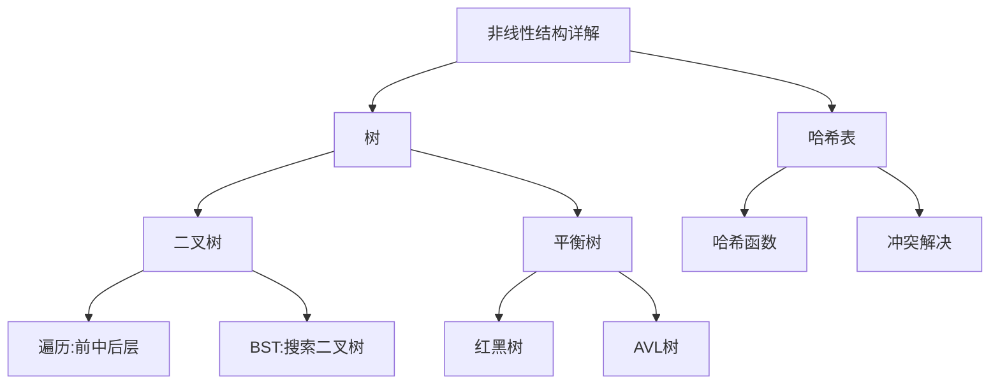

# 树哈希结构论·非线性结构详解的精髓

> 树是算法面试的"半壁江山"，哈希是空间换时间的典范。

---

## 📖 篇目

| # | 篇目 | 核心内容 |
|:--:|------|------|
| 08 | 二叉树的操作实践 | 前中后序遍历、层序遍历、递归与迭代 |
| 09 | 红黑树的操作实践 | 自平衡BST、五大性质、插入删除调整 |
| 10 | 递归常见操作实践 | 递归三要素、回溯、分治、尾递归优化 |
| 11 | Hash 常见操作实践 | 哈希函数设计、冲突解决、负载因子 |
| 12 | 散列常见操作实践 | 开放定址法、链地址法、再哈希 |

---

## 🎯 核心知识体系

---

## 🔗 配套刷题

- 树专题 → [11.二叉树算法题](../11.二叉树算法题)（20题）
- 哈希专题 → [10.哈希算法题](../10.哈希算法题)（9题）

> **核心技巧**：树的遍历是基础，递归思维是灵魂；哈希的本质是"用空间买时间"。
