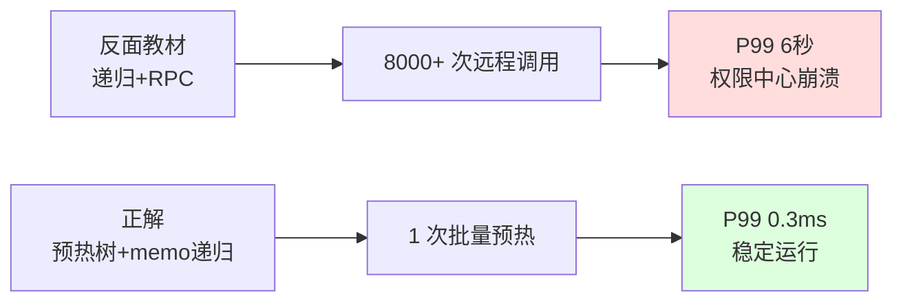
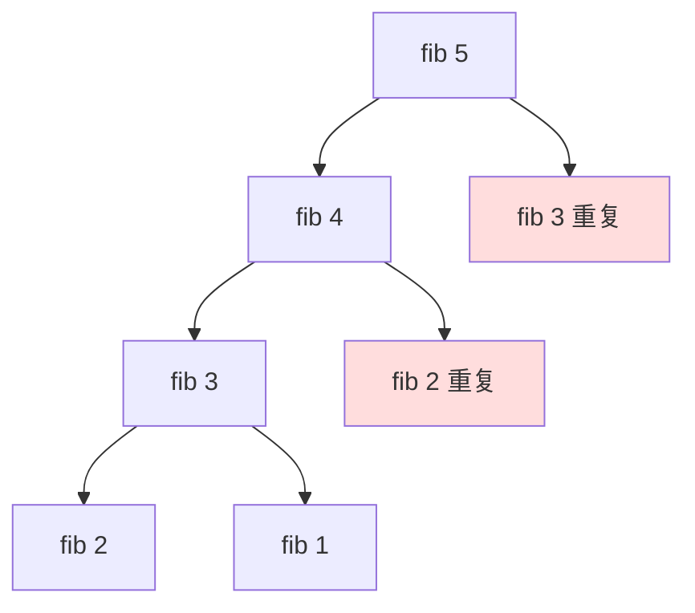

# 递归操作实践

## 目录指引与导读

> 阅读建议：本篇覆盖"递归三要素 → 调用栈边界 → 经典题 → 记忆化 / 尾递归 / 迭代化 → 树递归方法论"，层层递进；想速查直接跳锚点。

- [01. 从工作案例说起](#01-从工作案例说起)
- [02. 递归本质与三要素](#02-递归本质与三要素)
  - [2.1 递归一句话定义](#21-递归一句话定义)
  - [2.2 递归的三大要素](#22-递归的三大要素)
  - [2.3 递归等价循环栈](#23-递归等价循环栈)
- [03. 调用栈与栈溢出](#03-调用栈与栈溢出)
  - [3.1 调用栈工作方式](#31-调用栈工作方式)
  - [3.2 栈溢出真实边界](#32-栈溢出真实边界)
  - [3.3 空间等于递归深](#33-空间等于递归深)
- [04. 五种经典递归题](#04-五种经典递归题)
  - [4.1 阶乘线性递归](#41-阶乘线性递归)
  - [4.2 斐波那契反例](#42-斐波那契反例)
  - [4.3 汉诺塔思维代表](#43-汉诺塔思维代表)
  - [4.4 全排列回溯基础](#44-全排列回溯基础)
  - [4.5 归并排序分治典范](#45-归并排序分治典范)
- [05. 递归三大优化技巧](#05-递归三大优化技巧)
  - [5.1 记忆化缓存子解](#51-记忆化缓存子解)
  - [5.2 尾递归语言支持](#52-尾递归语言支持)
  - [5.3 递归转迭代栈](#53-递归转迭代栈)
  - [5.4 递归DP进化路径](#54-递归dp进化路径)
- [06. 树结构递归方法](#06-树结构递归方法)
- [07. 写递归的方法论](#07-写递归的方法论)
  - [7.1 写递归三步法](#71-写递归三步法)
  - [7.2 递归调试技巧](#72-递归调试技巧)
  - [7.3 四大陷阱清单](#73-四大陷阱清单)
  - [7.4 递归迭代选择](#74-递归迭代选择)
- [08. 本篇收获与回扣](#08-本篇收获与回扣)
- [09. 思考题深度练](#09-思考题深度练)
- [10. 课后作业实战](#10-课后作业实战)
- [11. 进阶专题与延伸](#11-进阶专题与延伸)


## 01. 从工作案例说起

去年接手一个组织树的权限服务，同事写的"判断某用户是否属于某部门"代码长这样：

```java
// 反面教材：递归扫描组织树，没有缓存
public boolean inDept(long userId, long deptId) {
    Dept dept = getDept(deptId);                 // 远程 RPC 查子部门列表
    if (dept.getUsers().contains(userId)) return true;
    for (long subId : dept.getChildren()) {
        if (inDept(userId, subId)) return true;
    }
    return false;
}
```

**线上炸点**：
- 组织树 7 层、约 1.8 万节点，一次权限校验平均触发 **8000+ 次 RPC**；
- 并发场景下，判断单次耗时 4~8 秒；
- 高峰期权限中心被打崩，整条业务线雪崩。

复盘后我改成两层递归 + memo：先一次性 DFS 把组织树加载进内存（一次调用 N 次 RPC），之后所有判断都是内存里 `O(深度)` 的递归，加上 memo 缓存，**单次耗时从 6s → 0.3ms**。



**这次事故教会我的事**：递归本身不慢，**慢的是重复子问题 + 副作用的嵌套**。这一篇就把递归的本质、陷阱、优化路径系统讲清。


## 02. 递归本质与三要素

### 2.1 递归一句话定义

**递归就是把大问题拆成"结构相同、规模更小"的子问题，直到最小规模能直接解答。**

数学上对应归纳法：基础 + 归纳步骤。代码上体现为函数调用自己。

```
阶乘的数学定义就是一段递归：
  0! = 1                    ← 基础情况
  n! = n × (n-1)!            ← 递归步骤
```

> **数学严谨化**：递归对应的是"数学归纳法"的直接代码化——基础情况证明 n=0 成立，递归步骤证明"假设 n=k 成立则 n=k+1 也成立"。**写递归如同做证明**：base case 就是归纳奠基，recursive step 就是归纳假设 → 结论。

### 2.2 递归的三大要素

| 要素 | 说明 | 缺失后果 |
|------|------|----------|
| **基础情况** Base Case | 最小子问题直接给出答案 | 无限递归 → 栈溢出 |
| **递归步骤** Recursive Step | 把问题拆解成同构的小问题 | 无法递进 |
| **收敛性** Convergence | 每次递归都逼近基础情况 | 无限递归 |

```java
public long factorial(int n) {
    if (n == 0) return 1;                  // 1. 基础情况
    return n * factorial(n - 1);           // 2. 递归步骤；3. n→n-1 收敛
}
```

### 2.3 递归等价循环栈

理论上递归和迭代计算能力完全等价 —— 所有递归都能用「显式栈 + 循环」模拟。

| 维度 | 递归 | 迭代 |
|------|------|------|
| 表达力 | 分治/树/图 特别清晰 | 简单线性问题直观 |
| 空间 | O(深度) 调用栈 | 通常 O(1) |
| 性能 | 函数调用有开销 | 稍快 |
| 栈溢出风险 | 有 | 无 |

记住一个原则：**当问题本身是"递归结构"（树、分治、回溯），用递归最清晰；当问题是"线性演进"，用迭代最高效。**

> **理论极限**：根据 Church-Turing 论题，递归计算和迭代计算的**表达能力完全等价**——都等价于图灵机。差别只在"写起来顺不顺、性能快不快"。所以选择递归 vs 迭代，本质是工程权衡，不是能力之争。


## 03. 调用栈与栈溢出

### 3.1 调用栈工作方式

每次函数调用都会压入一个**栈帧**（参数 + 局部变量 + 返回地址）。递归就是不断压栈—压栈—直到命中基础情况，再逐层弹栈。

```
factorial(4) 的栈演化：

压栈阶段：                  弹栈阶段：
┌──────────────┐
│ fact(0)=1    │ ← 栈顶    fact(0) → 1
├──────────────┤           fact(1) = 1×1 = 1
│ fact(1)      │           fact(2) = 2×1 = 2
├──────────────┤           fact(3) = 3×2 = 6
│ fact(2)      │           fact(4) = 4×6 = 24
├──────────────┤
│ fact(3)      │
├──────────────┤
│ fact(4)      │
├──────────────┤
│ main()       │ ← 栈底
└──────────────┘
```

### 3.2 栈溢出真实边界

操作系统给每个线程分配的栈空间是有限的：

| 平台 | 默认栈大小 | 可用递归深度（单栈帧约 100B） |
|------|-----------|-------------------------------|
| Linux 线程 | 8 MB | ~80000 |
| macOS 线程 | 8 MB | ~80000 |
| Windows 线程 | 1 MB | ~10000 |
| JVM 线程 | 512KB~1MB | ~5000~10000 |
| Python | 1000 层软限制 | 可调，但不建议 |
| Go goroutine | 初始 2KB 可增长 | 可到几十万 |

**实战经验**：写业务代码，**递归深度一旦接近 1 万就必须考虑改成迭代**。例如深组织树、JSON 深嵌套、语法树遍历等。

```java
// Java 查看和调整线程栈大小
// 命令行: java -Xss2m MyApp
// 代码中: new Thread(null, task, "name", 2 * 1024 * 1024).start();
Thread t = new Thread(null, () -> deepRecursion(), "deep", 4L * 1024 * 1024);
t.start();
```

> **工程提醒**：增加 `-Xss` 看似解决问题，其实治标不治本——每个线程都额外吃更多内存，Server 端大量线程下总内存暴涨；且栈帧变大并不能防"真正的无限递归"。**合适的做法永远是：评估最坏深度，超过 1 万就改迭代**。

### 3.3 空间等于递归深

**递归总调用次数 ≠ 空间复杂度**，空间只看**同时存在于栈上的最大深度**。

| 递归类型 | 总调用次数 | 最大深度 | 空间 |
|----------|-----------|----------|------|
| 线性递归 `fact(n)` | N | N | O(N) |
| 二叉递归 `fib(n)` | 2^N | N | O(N) |
| 平衡树遍历 | N | log N | O(log N) |
| 归并排序 | N log N | log N | O(log N) + O(N) 辅助数组 |
| 快排（最坏） | — | N | O(N) |


## 04. 五种经典递归题

### 4.1 阶乘线性递归

```java
public long factorial(int n) {
    return n == 0 ? 1 : n * factorial(n - 1);
}
```

执行轨迹：`5! = 5×4×3×2×1×1 = 120`。没有重复子问题，O(N) 时间、O(N) 空间。

### 4.2 斐波那契反例

```java
public long fib(int n) {
    if (n <= 1) return n;
    return fib(n - 1) + fib(n - 2);
}
```



`fib(40)` 就要跑约 10 亿次 —— **朴素递归的 O(2^N) 是病，不是特性**。解药在第 05 节。

> **数学严谨化**：朴素斐波那契的调用次数恰好就是 $F(n)$ 本身，所以时间复杂度为 $O(\varphi^n)$，$\varphi ≈ 1.618$ 是黄金比例。这解释了为什么 `fib(40)` 才跑 10 亿次，`fib(50)` 就直接跑不完。

### 4.3 汉诺塔思维代表

把 N 个盘子从 A 搬到 C：

```
1. 把上面 N-1 个先搬到 B（借助 C）    ← 递归子问题
2. 把最大一个搬到 C                    ← 一步操作
3. 把 N-1 个再从 B 搬到 C（借助 A）    ← 递归子问题
```

```java
public void hanoi(int n, char src, char aux, char dst) {
    if (n == 1) {
        System.out.println(src + " → " + dst);
        return;
    }
    hanoi(n - 1, src, dst, aux);
    System.out.println(src + " → " + dst);
    hanoi(n - 1, aux, src, dst);
}
```

移动次数 `T(N) = 2^N - 1`。64 个盘子需要 1.8×10¹⁹ 次，比宇宙年龄还长。**永远不要低估指数级的恐怖。**

### 4.4 全排列回溯基础

```java
public List<List<Integer>> permutations(int[] nums) {
    List<List<Integer>> res = new ArrayList<>();
    backtrack(nums, new ArrayList<>(), new boolean[nums.length], res);
    return res;
}

private void backtrack(int[] nums, List<Integer> path, boolean[] used, List<List<Integer>> res) {
    if (path.size() == nums.length) {
        res.add(new ArrayList<>(path));
        return;
    }
    for (int i = 0; i < nums.length; i++) {
        if (used[i]) continue;
        path.add(nums[i]); used[i] = true;
        backtrack(nums, path, used, res);
        path.remove(path.size() - 1); used[i] = false;     // 回溯
    }
}
```

"选一个 → 递归 → 撤销"三部曲，是 N 皇后、数独、子集等所有回溯问题的骨架。

### 4.5 归并排序分治典范

```java
public int[] mergeSort(int[] arr) {
    if (arr.length <= 1) return arr;
    int m = arr.length / 2;
    int[] left  = mergeSort(Arrays.copyOfRange(arr, 0, m));
    int[] right = mergeSort(Arrays.copyOfRange(arr, m, arr.length));
    return merge(left, right);
}

private int[] merge(int[] a, int[] b) {
    int[] res = new int[a.length + b.length];
    int i = 0, j = 0, k = 0;
    while (i < a.length && j < b.length) {
        res[k++] = a[i] <= b[j] ? a[i++] : b[j++];
    }
    while (i < a.length) res[k++] = a[i++];
    while (j < b.length) res[k++] = b[j++];
    return res;
}
```

分（Divide）→ 治（Conquer）→ 合（Combine）—— 分治三段式的教科书模板。`O(N log N)` 时间、稳定、适合链表。

> **主定理套用**：归并排序递推 $T(N) = 2T(N/2) + O(N)$，由 Master Theorem 第二情况得 $T(N) = O(N \log N)$。所有分治算法都可以用主定理快速判出复杂度——这是分析递归时间的"万能公式"。

---

## 05. 递归三大优化技巧

### 5.1 记忆化缓存子解

**核心思想**：把已算过的子问题结果缓存起来，下次直接查表。

```java
// Java 手写 memo
private final Map<Integer, Long> memo = new HashMap<>();
public long fib(int n) {
    if (n <= 1) return n;
    Long cached = memo.get(n);
    if (cached != null) return cached;
    long r = fib(n - 1) + fib(n - 2);
    memo.put(n, r);
    return r;
}
```

| 方法 | fib(40) | 时间 | 空间 |
|------|---------|------|------|
| 朴素递归 | ~60 秒 | O(2^N) | O(N) 栈 |
| 记忆化 | <1 ms | O(N) | O(N) 栈+缓存 |
| 迭代 DP | <1 ms | O(N) | **O(1)** |

### 5.2 尾递归语言支持

**尾递归**：递归调用是函数最后一个操作，后面再无计算。编译器可复用同一栈帧，空间从 O(N) 降到 O(1)。

```java
// 尾递归形态（但 Java 不做 TCO）
public long fact(int n, long acc) {
    if (n == 0) return acc;
    return fact(n - 1, n * acc);       // 尾位置，无后续计算
}
```

| 语言 | 是否支持 TCO |
|------|-------------|
| Scheme / Erlang / Haskell | **强制支持** |
| Kotlin（`tailrec` 关键字） | 支持 |
| C / C++（-O2） | 编译器可优化 |
| Java / Python | **不支持**（与堆栈调试信息绑定） |

所以在 Java/Python 写尾递归没有空间收益，改成迭代才是正解。

> **延伸知识**：Java 不做 TCO 的根本原因——JVM 栈帧用于 `Thread.getStackTrace()` 调试、`SecurityManager` 栈上下文检查等；一旦优化掉栈帧，调用链信息消失，调试 / 安全机制都不工作。这是"工程妥协"，不是技术不能。

### 5.3 递归转迭代栈

一个实用例子：二叉树前序遍历。

```java
public void preorder(TreeNode root) {
    if (root == null) return;
    Deque<TreeNode> stack = new ArrayDeque<>();
    stack.push(root);
    while (!stack.isEmpty()) {
        TreeNode n = stack.pop();
        System.out.println(n.val);
        if (n.right != null) stack.push(n.right);      // 先右后左
        if (n.left  != null) stack.push(n.left);
    }
}
```

### 5.4 递归DP进化路径

```
朴素递归 → 记忆化递归(自顶向下) → 动态规划(自底向上) → 滚动数组(空间优化)
O(2^N)      O(N) / O(N)            O(N) / O(N)         O(N) / O(1)
```

```java
public long fibDp(int n) {
    if (n <= 1) return n;
    long a = 0, b = 1;
    for (int i = 2; i <= n; i++) {
        long t = a + b; a = b; b = t;
    }
    return b;
}
```

**记住这个进化链**，面试里 80% 的递归/DP 题都能在这个框架里走通。


## 06. 树结构递归方法

树的定义本身就是递归的——"一棵树 = 根 + 若干子树"，所以它上面的几乎所有问题都能用递归优雅表达。

```
对树写递归的通用思路：
1. 在根节点上，问题的答案是什么？
2. 如果已知左子树、右子树的答案，能不能合成整棵树的答案？
3. 基础情况：空节点 / 叶子节点怎么处理？
```

### 6.1 最大深度

```java
public int maxDepth(TreeNode root) {
    if (root == null) return 0;
    return 1 + Math.max(maxDepth(root.left), maxDepth(root.right));
}
```

### 6.2 路径和

```java
public boolean hasPathSum(TreeNode root, int target) {
    if (root == null) return false;
    if (root.left == null && root.right == null) return root.val == target;
    int remain = target - root.val;
    return hasPathSum(root.left, remain) || hasPathSum(root.right, remain);
}
```

### 6.3 序列化 / 反序列化

```java
public String serialize(TreeNode root) {
    if (root == null) return "#";
    return root.val + "," + serialize(root.left) + "," + serialize(root.right);
}

public TreeNode deserialize(String data) {
    return build(new ArrayDeque<>(Arrays.asList(data.split(","))));
}

private TreeNode build(Deque<String> tokens) {
    String v = tokens.pollFirst();
    if ("#".equals(v)) return null;
    TreeNode node = new TreeNode(Integer.parseInt(v));
    node.left  = build(tokens);
    node.right = build(tokens);
    return node;
}
```

三道题的共同心法：**信任递归**——假设子函数已经正确处理了子树，你只管合并。

> **直觉构建**：写树递归时把子调用当作"已经对的黑盒"——"如果左子树的答案已经正确，右子树也是，怎么组合出当前节点的答案？"跳出"脑内跟栈"就能写得又快又对。

---

## 07. 写递归的方法论

### 7.1 写递归三步法

1. **先定义函数**：明确输入输出的含义，**不要纠结实现**；
2. **找基础情况**：最小规模直接返回；
3. **推导递推关系**：假设子问题已解决，怎么拼出当前解。

以反转链表为例：

```java
public ListNode reverse(ListNode head) {
    // 1. 定义：返回反转后的头
    // 2. 基础：0/1 个节点直接返回
    if (head == null || head.next == null) return head;
    // 3. 递推：假设后半已经反转好了
    ListNode newHead = reverse(head.next);
    head.next.next = head;                 // 把自己挂到末尾
    head.next = null;
    return newHead;
}
```

**心法：信任递归**——把它当黑盒用，别一层一层去"脑内跟踪"。

### 7.2 递归调试技巧

```java
public long fact(int n, int depth) {
    String pad = "  ".repeat(depth);
    System.out.println(pad + "enter fact(" + n + ")");
    if (n == 0) {
        System.out.println(pad + "return 1");
        return 1;
    }
    long r = n * fact(n - 1, depth + 1);
    System.out.println(pad + "return " + r);
    return r;
}
```

用缩进打印 enter/return，或者直接画递归树，是排查递归 bug 最快的办法。

### 7.3 四大陷阱清单

| 陷阱 | 典型症状 | 避免方式 |
|------|----------|---------|
| 忘了基础情况 | 无限递归，栈溢出 | 写函数时第一行先写 base case |
| 基础情况不完整 | 边界输入崩溃（负数、空指针） | 防御式编程，`<=` 代替 `==` |
| 参数不收敛 | 参数没改变，无限递归 | 每次必减少问题规模 |
| 重复子问题 | 指数级超时 | memo 或 DP |

### 7.4 递归迭代选择

| 场景 | 选递归 | 选迭代 |
|------|--------|--------|
| 简单累加遍历 | | ✓ |
| 树、图遍历 | ✓ | |
| 分治（归并/快排） | ✓ | |
| 回溯（N 皇后/全排列） | ✓ | |
| 可能很深（> 1 万层） | | ✓（用显式栈） |
| 重复子问题多 | 记忆化 | DP |
| 性能极致路径 | | ✓ |


## 08. 本篇收获与回扣

回到开头那个"组织树权限校验 P99 6s"的线上事故，它的问题同时命中了本篇的**两个递归坑**：

**坑 1：副作用的递归放大**
- 每次递归里都在调用远程 RPC（`get_dept`），本应是 O(N) 的树搜索变成了 "O(N) × 每次 RPC 开销"；
- 修复：**预热 + 分层**——先一次性 DFS 加载整棵树到本地（只在这里付一次网络代价），之后所有判断都是纯内存递归。

**坑 2：缺少 memo，大量子问题重复算**
- 同一个 `dept_id` 在并发请求里被重复查询；
- 修复：用 `ConcurrentHashMap<Long, Boolean>` 或 Guava `Cache` 把 `inDept(userId, deptId)` 结果缓存起来，同部门第二次判断就是 O(1)。

把这两条修上后，单次判断从 **6 秒 → 0.3 毫秒**，服务再没抖动过。

**更抽象的收获**：
- 递归的本质是"大问题 = 小问题 + 合并"，**不是函数调用自己这个表象**；
- 递归不会天然低效，**重复子问题才是慢的根**，解药是记忆化/DP；
- 递归的深度上限是硬约束（Java ~5000、Windows ~1 万），**业务里遇到可能很深的场景必须迭代化**；
- 树、图、分治、回溯这四类问题，递归写法几乎永远是最清晰的；
- 写递归的心法是**信任递归**——把子调用当黑盒，只关注"假设它对，怎么合并"。

这些思路，会在后面的 Hash、散列、List/Map/Set 三件套里反复出现——递归是数据结构这门课的"万能溶剂"。


## 09. 思考题深度练

> 建议先独立思考 15 分钟，再查资料或看答案。

**1. 重复子问题可视化**：画出 `fib(6)` 的完整递归调用树。标出被重复计算的子问题。记忆化后的调用树变成了什么形状？（提示：从树变成了 DAG）

**2. 尾递归与 JVM**：为什么 Java 故意不做尾递归优化？（提示：和 `Thread.getStackTrace()`、安全管理器的栈检查有关）换成 Kotlin 的 `tailrec` 关键字行不行？它是在什么层做优化的？

**3. 递归转迭代**：请把二叉树**中序遍历**的递归版改成用显式栈的迭代版，不超过 12 行。思考一个更深的问题：**后序遍历**为什么比前序、中序都难写成迭代？（提示：根节点访问时机）

**4. 自顶向下 vs 自底向上**：同样是 O(N) 时间，记忆化递归（自顶向下）和 DP 数组（自底向上）各有什么利弊？在哪种场景自顶向下反而更优？（提示：只需要计算部分状态时）

**5. 线上经验**：假设你要处理一个深度可能达到 100 万层的 JSON，纯递归解析肯定栈溢出。设计一个既能保持"递归结构的代码清晰度"、又不会溢出的方案。（关键词：**蹦床 Trampoline** / **显式工作栈** / **延续传递风格 CPS**）


## 10. 课后作业实战

### 作业 1：实现六种斐波那契

同一道题（求 `fib(n)`）用 6 种方式实现，分别测量 n = 30/40/50/100/1000 的耗时：

1. 朴素递归（n=50 超时合理）；
2. 记忆化递归（HashMap 手写）；
3. Guava `LoadingCache` 装饰；
4. 自底向上 DP 数组；
5. 滚动变量 O(1) 空间；
6. 矩阵快速幂 O(log N)（选做）。

用表格对比，加深"算法>实现方式"的体感。

### 作业 2：LeetCode 刷题清单

| 难度 | 题号 | 题目 | 核心考点 |
|------|------|------|---------|
| 简单 | 226 | 翻转二叉树 | 递归基础 |
| 简单 | 104 | 二叉树最大深度 | 分治递归 |
| 中等 | 46 | 全排列 | 回溯 |
| 中等 | 22 | 括号生成 | 回溯+剪枝 |
| 中等 | 78 | 子集 | 回溯 |
| 中等 | 95 | 不同的二叉搜索树 II | 分治+记忆化 |
| 中等 | 394 | 字符串解码 | 递归/栈 |
| 困难 | 51 | N 皇后 | 回溯经典 |
| 困难 | 124 | 二叉树最大路径和 | 后序+返回值设计 |

建议每道题都**先用递归实现 → 再尝试迭代改写 → 最后用 DP 优化**，感受三种思维的切换。

### 作业 3：实战重构一段递归（必做）

找到你工作代码里一段递归（目录扫描、嵌套 JSON 解析、依赖分析、组织树查询都可以）。按下面清单重构它：

- [ ] 明确写出基础情况、递归步骤、收敛性；
- [ ] 估计最大递归深度，评估是否可能栈溢出；
- [ ] 如果有 I/O 或 RPC 副作用，**把 I/O 从递归里剥离出来**；
- [ ] 如果存在重复子问题，加 memo 或改 DP；
- [ ] 写 5 个边界 case（空、单节点、深度极大、循环引用、超大规模）。

这套流程做完，你对递归的理解就从"知道"升级到"吃过亏"。

---

一句话收尾：

> **递归不是魔法，它是"相信自己能解决子问题"的信念。**
> 先定义、再基础、后递推；看到重复就 memo，看到很深就迭代化。

---

## 11. 进阶专题与延伸

### 11.1 主定理（Master Theorem）：分治复杂度的万能公式

分治算法的递推形式通常为：

$$T(N) = a \cdot T(N/b) + f(N)$$

其中 a≥1、b>1、f(N) 是"分 + 合"的工作量。主定理给出 3 种结果：

| 情况 | 条件 | 结论 |
|------|------|------|
| 1 | $f(N) = O(N^{\log_b a - \epsilon})$ | $T(N) = \Theta(N^{\log_b a})$ |
| 2 | $f(N) = \Theta(N^{\log_b a} \log^k N)$ | $T(N) = \Theta(N^{\log_b a} \log^{k+1} N)$ |
| 3 | $f(N) = \Omega(N^{\log_b a + \epsilon})$ 且满足正则性 | $T(N) = \Theta(f(N))$ |

**实战示例**：

| 算法 | 递推 | 主定理情况 | 复杂度 |
|------|------|-----------|--------|
| 二分查找 | T(N)=T(N/2)+O(1) | 情况 2，k=0 | O(log N) |
| 归并排序 | T(N)=2T(N/2)+O(N) | 情况 2，k=0 | O(N log N) |
| 快速排序（平均） | T(N)=2T(N/2)+O(N) | 情况 2，k=0 | O(N log N) |
| Strassen 矩阵乘 | T(N)=7T(N/2)+O(N²) | 情况 1（log₂7≈2.807） | O(N^2.807) |
| Karatsuba 大数乘 | T(N)=3T(N/2)+O(N) | 情况 1（log₂3≈1.585） | O(N^1.585) |

**主定理是面试时秒答分治复杂度的捷径**——记住三种情况的判定，查表即可。

### 11.2 Trampoline：用迭代模拟尾递归

Java/Python 不做 TCO，但可以用 **Trampoline 模式**——让递归函数返回一个"待执行的下一步"（thunk），用外层循环反复调用，避免栈增长：

```java
interface Trampoline<T> {
    T get();
    default boolean complete() { return true; }
    default Trampoline<T> bounce() { throw new RuntimeException(); }

    static <T> Trampoline<T> done(T value) {
        return new Trampoline<T>() {
            public T get() { return value; }
        };
    }
    static <T> Trampoline<T> more(Supplier<Trampoline<T>> next) {
        return new Trampoline<T>() {
            public boolean complete() { return false; }
            public Trampoline<T> bounce() { return next.get(); }
            public T get() {
                Trampoline<T> t = this;
                while (!t.complete()) t = t.bounce();    // 迭代执行
                return t.get();
            }
        };
    }
}

// 尾递归版阶乘
static Trampoline<Long> fact(long n, long acc) {
    return n == 0 ? Trampoline.done(acc)
                  : Trampoline.more(() -> fact(n - 1, n * acc));
}

// 调用
long result = fact(1_000_000, 1).get();   // 100 万深度也不溢出！
```

**原理**：把"函数调用"转成"返回下一个函数对象"，外层 while 循环驱动——这是 **CPS（Continuation-Passing Style）** 的工程简化版。Scala 的 `scala.util.control.TailCalls`、Clojure 的 `trampoline` 都是这种思路。

### 11.3 CPS（续延传递风格）：递归的终极表达

普通递归：
```java
int fact(int n) {
    return n == 0 ? 1 : n * fact(n - 1);   // 返回后要做 n * _，不是尾调用
}
```

CPS 改写——**把"返回后要做什么"显式当参数传下去**：
```java
void factCps(int n, int acc, Consumer<Integer> k) {
    if (n == 0) k.accept(acc);
    else factCps(n - 1, n * acc, k);        // 100% 尾调用
}
```

CPS 的核心价值：
- **所有函数调用都变成尾调用**——配合 TCO 零栈消耗；
- **控制流变成"一等公民"**——可以捕获、保存、恢复"当前要执行什么"；
- **实现 async/await、generator、coroutine 的理论基础**——`await` 本质是"把后面的代码打包成续延"。

JavaScript V8、Kotlin 协程、Python async 的底层实现都用 CPS 变换。这也是为什么理解 CPS 后再看异步代码会恍然大悟。

### 11.4 分治算法的经典代表

| 算法 | 问题 | 分治思路 | 复杂度 |
|------|------|---------|--------|
| 归并排序 | 排序 | 左右分开各自排再合并 | O(N log N) |
| 快速排序 | 排序 | 选 pivot，小/大分两半 | O(N log N) 平均 |
| 二分查找 | 有序查找 | 砍掉不可能的一半 | O(log N) |
| 平面最近点对 | 几何 | 按 x 分左右，再处理跨界 | O(N log N) |
| Karatsuba | 大数乘法 | 3 次小乘替代 4 次 | O(N^1.585) |
| FFT | 多项式乘法 | 奇偶分解 | O(N log N) |
| Strassen | 矩阵乘法 | 7 次 2x2 小乘替代 8 次 | O(N^2.807) |
| 棋盘覆盖 | 2^k×2^k 棋盘 | L 型骨牌四分 | O(4^k) |

**分治三要素**：
1. **分（Divide）**：子问题规模缩小（通常减半）；
2. **治（Conquer）**：递归解决子问题；
3. **合（Combine）**：把子解合并为原问题解——**合并代价决定总复杂度**。

归并的合是 O(N)、快排的合是 O(1)——这是它们常数差异的本质。

### 11.5 回溯与剪枝：指数问题的工程技巧

回溯在最坏情况下是 O(2^N) 或 O(N!) 的指数爆炸。**剪枝**是让它在实际数据上能跑起来的关键。

以 N 皇后为例：

```java
void solve(int row, int n, boolean[] col, boolean[] diag1, boolean[] diag2, List<List<String>> res) {
    if (row == n) { res.add(build()); return; }
    for (int c = 0; c < n; c++) {
        // 三大剪枝：列、正对角线、反对角线
        if (col[c] || diag1[row + c] || diag2[row - c + n - 1]) continue;
        col[c] = diag1[row + c] = diag2[row - c + n - 1] = true;
        solve(row + 1, n, col, diag1, diag2, res);
        col[c] = diag1[row + c] = diag2[row - c + n - 1] = false;
    }
}
```

**剪枝的四种常见套路**：
1. **可行性剪枝**：违反约束立即返回（如列冲突）；
2. **最优性剪枝**：当前解已经比已知最优差，放弃（Branch and Bound）；
3. **对称性剪枝**：相同子结构只算一次（N 皇后第一行只需搜一半）；
4. **启发式剪枝**：按"先试看起来最有可能的"排序，早发现早剪枝。

Knuth 的 *Dancing Links*（DLX）把"数独、N 皇后、精确覆盖问题"统一成一个算法，剪枝效率极高——这是最高级的回溯工程实现。

### 11.6 递归在函数式语言里的首要地位

在 Haskell、Scheme、Erlang 这些函数式语言里，**递归是唯一的循环方式**（没有 for/while）——因为 for 循环需要可变状态，违反函数式纯粹性。

```haskell
-- Haskell 的阶乘：5 个字符
fact 0 = 1
fact n = n * fact (n - 1)

-- 列表求和
sum' [] = 0
sum' (x:xs) = x + sum' xs

-- 快速排序：3 行
qsort [] = []
qsort (p:xs) = qsort [x | x <- xs, x < p] ++ [p] ++ qsort [x | x <- xs, x >= p]
```

**特点**：
- 模式匹配 + 递归替代 if/for；
- 所有函数都强制支持 TCO——深度无限；
- 通过 **fold / map / filter** 等高阶函数进一步抽象递归模式，日常代码里很少直接写递归。

Java Stream API、Kotlin 的 `fold`、Swift 的 `reduce` 本质都是这种"递归高阶化"的借鉴。

### 11.7 递归与图：DFS/BFS/拓扑排序

树是图的特例，所以树的递归也自然扩展到图：

```java
// 图的 DFS（注意防止访问已访问节点）
void dfs(int u, boolean[] visited, List<List<Integer>> graph) {
    if (visited[u]) return;
    visited[u] = true;
    process(u);
    for (int v : graph.get(u)) dfs(v, visited, graph);
}

// 拓扑排序（DFS 后序 + 反转）
List<Integer> topoSort(List<List<Integer>> graph) {
    int n = graph.size();
    boolean[] visited = new boolean[n];
    Deque<Integer> stack = new ArrayDeque<>();
    for (int i = 0; i < n; i++) {
        if (!visited[i]) topoDfs(i, visited, graph, stack);
    }
    return new ArrayList<>(stack);  // 栈输出即逆后序
}
```

**图 DFS 比树 DFS 多出的维度**：
- **环检测**：用"白/灰/黑"三色标记；遇到灰色节点 = 有环；
- **强连通分量**：Tarjan / Kosaraju 算法都基于 DFS 后序 + 递归栈；
- **二分图判定**：DFS 染色，相邻异色。

### 11.8 经典书与论文

- Cormen et al. 《算法导论》第 4 章：主定理、递归树、代入法
- Sedgewick & Wayne 《算法（第 4 版）》第 2 章：归并排序、快速排序的递归分析
- Abelson & Sussman 《计算机程序的构造和解释》（SICP）第 1 章：递归过程与迭代过程的等价；第 4 章：CPS 与元循环解释器
- Knuth 《计算机程序设计艺术 第 4 卷》——Dancing Links、回溯算法的极致
- Friedman & Wand 《Essentials of Programming Languages》——CPS 变换的权威教材
- Okasaki, C. 1999. *Purely Functional Data Structures*——函数式递归数据结构的经典
- Bird, R. 2010. *Pearls of Functional Algorithm Design*——递归算法推导的优雅之美

**经典面试题集**：
- LeetCode 分类"递归"、"回溯"、"分治"、"动态规划"四个 tag
- 《剑指 Offer》二叉树、字符串、数值章节
- 《程序员代码面试指南》（左程云）递归与动态规划专题

---

> 递归讲完，但它真正的威力要在后面几篇数据结构里继续展示。下一篇《11.Hash 常见操作实践》会切到**完全不同的思路**——不再依赖树或递归的分层结构，而是靠"**一个数学函数把 key 直接映射到位置**"，实现 O(1) 查找。这条路的优势和陷阱（冲突、扩容、分布不均），是所有高性能系统绕不开的话题。
