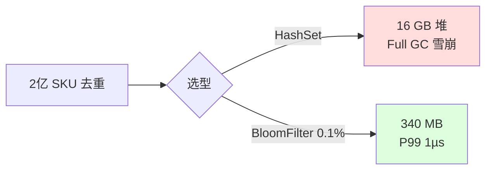
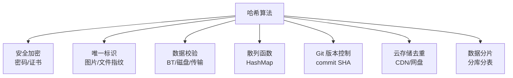
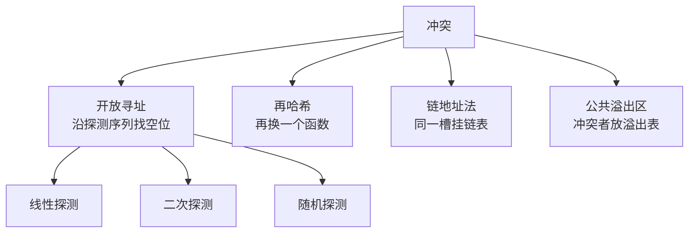
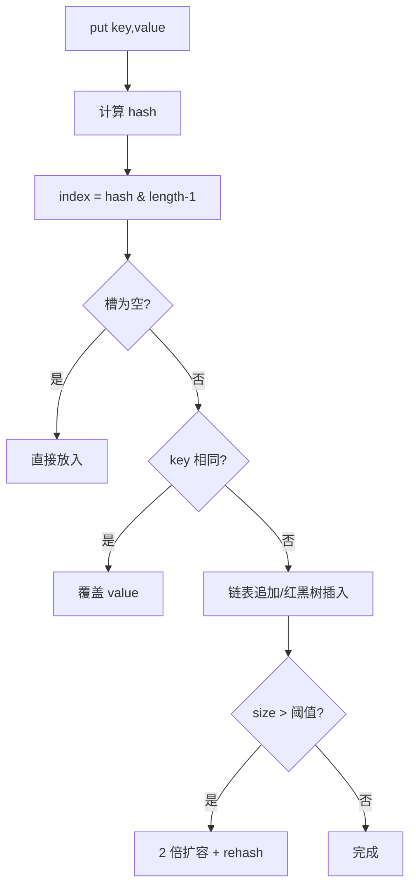
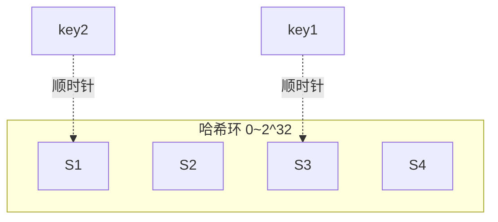
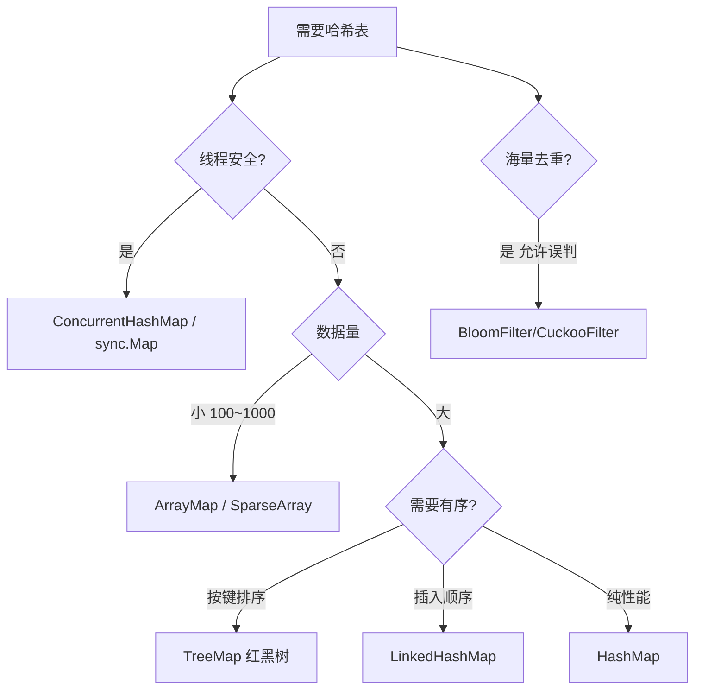

# 哈希操作实践

## 目录指引与导读

> 阅读建议：本篇从"2 亿 SKU 去重"真实案例切入，系统覆盖哈希本质、七大应用、函数设计、冲突解决、工业实现、一致性哈希、布隆过滤器。

- [01. 从工作案例说起](#01-从工作案例说起)
- [02. 哈希算法的本质](#02-哈希算法的本质)
  - [2.1 哈希一句话定义](#21-哈希一句话定义)
  - [2.2 哈希的四大特性](#22-哈希的四大特性)
  - [2.3 哈希的历史演进](#23-哈希的历史演进)
- [03. 哈希的七大场景](#03-哈希的七大场景)
  - [3.1 安全加密场景](#31-安全加密场景)
  - [3.2 唯一标识场景](#32-唯一标识场景)
  - [3.3 数据校验场景](#33-数据校验场景)
  - [3.4 散列函数场景](#34-散列函数场景)
  - [3.5 Git版本控制场景](#35-git版本控制场景)
  - [3.6 云存储秒传场景](#36-云存储秒传场景)
  - [3.7 数据分片场景](#37-数据分片场景)
  - [3.8 各语言调用速查](#38-各语言调用速查)
  - [3.9 哈希算法选型](#39-哈希算法选型)
- [04. 哈希函数设计原理](#04-哈希函数设计原理)
  - [4.1 好函数三大标准](#41-好函数三大标准)
  - [4.2 五种经典构造法](#42-五种经典构造法)
  - [4.3 HashMap扰动函数](#43-hashmap扰动函数)
  - [4.4 字符串哈希选31](#44-字符串哈希选31)
- [05. 哈希冲突与解法](#05-哈希冲突与解法)
  - [5.1 为什么必有冲突](#51-为什么必有冲突)
  - [5.2 四种冲突解决法](#52-四种冲突解决法)
  - [5.3 链表红黑树升级](#53-链表红黑树升级)
- [06. HashMap工业实现](#06-hashmap工业实现)
  - [6.1 HashCode的作用](#61-hashcode的作用)
  - [6.2 HashMap的put流程](#62-hashmap的put流程)
- [07. 一致性哈希分布式](#07-一致性哈希分布式)
  - [7.1 普通取模的死穴](#71-普通取模的死穴)
  - [7.2 一致性哈希思路](#72-一致性哈希思路)
  - [7.3 虚拟节点均匀化](#73-虚拟节点均匀化)
- [08. 布隆过滤器实战](#08-布隆过滤器实战)
  - [8.1 布隆过滤核心问](#81-布隆过滤核心问)
  - [8.2 布隆工作原理](#82-布隆工作原理)
  - [8.3 布隆参数设计](#83-布隆参数设计)
  - [8.4 Java最小实现](#84-java最小实现)
  - [8.5 布隆工业应用](#85-布隆工业应用)
  - [8.6 布隆局限进阶](#86-布隆局限进阶)
- [09. 跨平台哈希选型](#09-跨平台哈希选型)
- [10. 本篇收获与回扣](#10-本篇收获与回扣)
- [11. 思考题深度练](#11-思考题深度练)
- [12. 课后作业实战](#12-课后作业实战)
- [13. 进阶专题与延伸](#13-进阶专题与延伸)


## 01. 从工作案例说起

某次做商品搜索，SKU 已经上到 2 亿条。产品想加一个"一键去重"——同一个商品的不同版本只显示一条。

最初方案简单粗暴：`HashSet<String> seen = new HashSet<>()` 把商品指纹（`title + brand + specs` 拼起来再 MD5）丢进去。上线后开发环境一切正常，压到线上直接崩：

- 每个指纹 32 字节，Java HashSet 每个 Entry 至少 48 字节开销，2 亿条 ≈ **16 GB 堆内存**；
- 机器内存 32G，Full GC 每分钟一次，服务不可用。

改用**布隆过滤器**后：

```java
BloomFilter<String> bf = BloomFilter.create(
    Funnels.stringFunnel(UTF_8),
    200_000_000,          // 预期元素数
    0.001                 // 允许的误判率
);
```

- 内存占用降到 **340 MB**（节省 98%）；
- 每次判断 O(k) = O(10) 次哈希，耗时 < 1µs；
- 代价：0.1% 的"说有实则无"，但业务允许（再用 DB 复核一次即可）。



**这次教训我**：哈希不是"MD5、SHA 这几个函数"那么简单，它是**一整套把无限映射到有限、换空间/换速度/换准确度**的工程学。这篇从头到尾讲透。


## 02. 哈希算法的本质

### 2.1 一句话定义

**把任意长度的输入，通过确定性计算压缩成固定长度的输出。**

```
任意长度输入        哈希函数          固定长度输出
"hello"           ──────►          5d41402abc4b2a76b971...
一部 2GB 电影     ──────►          d41d8cd98f00b204e980...
```

### 2.2 四大特性

| 特性 | 含义 |
|------|------|
| **正向快速** | 输入 → 输出要快 |
| **逆向困难** | 输出 → 输入在多项式时间内不可行 |
| **输入敏感（雪崩）** | 1 bit 变化 → 输出约 50% bit 变化 |
| **抗碰撞** | 找到两个不同输入产生相同输出在概率上极难 |

**鸽巢原理**：输出是固定长度（如 MD5 的 128 bit，空间 2¹²⁸），输入是无穷——碰撞一定存在。**我们追求的不是"无碰撞"，是"找到碰撞的代价大到实际不可行"**。

### 2.3 历史演进

```
1953  Luhn 提出散列思想
1992  MD5（Rivest）          → 2004 被王小云团队攻破
1995  SHA-1（NSA）           → 2017 Google 做出碰撞 SHAttered
2001  SHA-256 / SHA-2
2015  SHA-3（Keccak）
1997  一致性哈希（Karger）    → 分布式基石
1970  布隆过滤器             → 海量去重
2014  布谷鸟过滤器           → 支持删除
```

每一代都是上一代在"安全/性能/分布式扩展"上撞墙后诞生的。


## 03. 哈希的七大应用场景

用一张图总结，后面逐一展开：



### 3.1 安全加密

密码存 DB 用 **bcrypt / Argon2**（故意算得慢，抗 GPU 爆破），不要裸 MD5/SHA1。

### 3.2 唯一标识

图库查重 —— 取文件的 MD5/SHA-256 作为"指纹"存散列表。避免逐字节比对几 MB 的二进制串。

### 3.3 数据校验

BT 下载、磁盘坏块检测、HTTPS 的证书指纹 —— 对每一块数据算哈希，收到后重算对比，1 bit 变化就能发现。

### 3.4 散列函数

**HashMap 的 key 用的哈希** —— 要的不是抗碰撞，是**分布均匀 + 计算快**，所以用简单的多项式哈希就够。

### 3.5 Git 版本控制

Git 的每个 commit/tree/blob 都由 SHA-1（新版本切到 SHA-256）标识。**内容一样 → 哈希一样 → 存储去重**，这是 Git 能把十几年历史压到几百 MB 的核心。

### 3.6 云存储去重（秒传）

网盘"秒传"= 先算文件 SHA-256，服务器端已有同哈希文件就直接建引用，连数据都不用传。

### 3.7 数据分片

分库分表 `shard = hash(user_id) % N`、Redis Cluster 的 CRC16 slot、Kafka 的分区路由——都是同一套"哈希取模"。

### 3.8 各语言哈希调用速查

**Java**：

```java
MessageDigest md = MessageDigest.getInstance("SHA-256");
byte[] digest = md.digest("hello".getBytes(StandardCharsets.UTF_8));
```

**Go**：

```go
import "crypto/sha256"
hash := sha256.Sum256([]byte("hello"))
```

**JavaScript (Node)**：

```javascript
const crypto = require('crypto');
const hex = crypto.createHash('sha256').update('hello').digest('hex');
```

**Swift (iOS 13+)**：

```swift
import CryptoKit
let hash = SHA256.hash(data: Data("hello".utf8))
```

### 3.9 选型对照

| 算法 | 输出位数 | 安全性 | 速度 | 用途 |
|------|---------|--------|------|------|
| MD5 | 128 | **已破解** | 最快 | **仅非安全校验** |
| SHA-1 | 160 | **已破解** | 快 | 不推荐新系统 |
| SHA-256 | 256 | 安全 | 中 | 数字签名、证书 |
| SHA-3 | 可变 | 安全 | 中 | 新系统推荐 |
| BLAKE3 | 256 | 安全 | **最快** | 高性能场景 |
| bcrypt | 192 | 安全 | **故意慢** | 密码存储 |


## 04. 哈希函数的设计原理

### 4.1 好哈希函数的三个标准

1. **均匀** — 输出应均匀撒在整个值域，不聚集；
2. **快** — 计算不能比后续查找还慢；
3. **确定** — 同输入必同输出。

**雪崩效应**是量化指标：输入变 1 bit，输出应有 ~50% 的 bit 变化。

```
好函数：hash("abc")=0x4E5F6A7B  hash("abd")=0xB1A09584  → 约 50% 不同
差函数：hash("abc")=0x00000061  hash("abd")=0x00000062  → 只差 1 bit，必然聚堆
```

### 4.2 五种经典构造法

| 方法 | 公式 | 特点 |
|------|------|------|
| 除留余数 | `h = k mod p`（p 取素数） | 最简单 |
| 乘法哈希 | `h = floor(m·frac(k·A))`，A 取黄金比例 | Knuth 推荐 |
| 平方取中 | 取 k² 的中间几位 | 位数多的键 |
| 折叠 | 分段相加取尾部 | 长串 |
| 位运算混合 | 移位、异或、乘法组合 | 现代工业实现 |

### 4.3 Java HashMap 的扰动函数

```java
static final int hash(Object key) {
    int h;
    return (key == null) ? 0 : (h = key.hashCode()) ^ (h >>> 16);
}
```

**为什么要 `^ (h >>> 16)`？**

HashMap 的桶数组长度是 2 的幂（如 16），桶定位是 `hash & (length-1)`，只用到**低几位**。如果两个 key 高位不同、低位相同，就会冲突。扰动把高 16 位混进低 16 位，让高位信息也参与定位。

```
原 hashCode:   1010 1100 0011 0111 | 0001 0101 0000 1010
                                    └── 只用这部分 ──┘
扰动后:        1010 1100 0011 0111 | 1011 1001 0011 1101
                                    └── 高低位混合 ──┘
```

### 4.4 字符串哈希：为什么是 31

```java
public int hashCode() {                    // String.hashCode
    int h = 0;
    for (int i = 0; i < value.length; i++)
        h = 31 * h + value[i];
    return h;
}
```

**选 31 的三个理由**：

1. 奇素数 → 乘积分布更均匀；
2. `31 = 2⁵ - 1`，编译器可优化为 `(h << 5) - h`，省乘法；
3. Joshua Bloch 在《Effective Java》中实测，对大量英文单词它的冲突率最低。

注：这不是唯一选择，FNV-1a 用 16777619，MurmurHash3 分布更好但计算更复杂。


## 05. 哈希冲突与解决方案

### 5.1 为什么一定有冲突

鸽巢原理 —— 有限输出容不下无限输入。我们能做的是让冲突尽量稀疏、处理尽量高效。

### 5.2 四种冲突解决方法



| 方法 | 代表系统 | 优缺点 |
|------|----------|--------|
| **链地址法** | Java HashMap、Go map | 实现简单，动态扩容容易；指针开销大 |
| **开放寻址** | Python dict、CPython set | 缓存友好，无指针；删除复杂，负载因子敏感 |
| **再哈希** | Cuckoo Filter | 查询稳定 O(k)；插入可能循环抖动 |
| **公共溢出区** | 早期 DB 索引 | 简单；溢出表本身可能退化 |

### 5.3 Java 8 HashMap 的"链表 → 红黑树"

当单桶链表长度 ≥ 8 且数组大小 ≥ 64，链表升级为红黑树；退化阈值为 6。这样在最坏场景下把 O(N) 查询压回 O(log N)，同时防范**哈希洪水攻击**（恶意构造同桶 key）。


## 06. HashCode 与 HashMap 的工业实现

### 6.1 HashCode 的作用

先用 hashCode 快速定位，只有命中同一桶才调用 equals 逐个比较——把 1000 次 equals 降到 ~1 次，这就是 hashCode 存在的全部意义。

黄金守则：**重写 equals 必须重写 hashCode**。两个 equals 相等的对象必须有相同的 hashCode；反之不成立。

### 6.2 HashMap 的完整 put 流程



常见性能雷区：

- 大量对象 `hashCode()` 始终返回同值 → 单桶退化；
- 频繁扩容 → 提前用 `new HashMap<>(expectedSize)` 给出初始容量；
- 并发使用 HashMap → 经典死循环（JDK7）或数据覆盖（JDK8）；高并发务必用 `ConcurrentHashMap`。


## 07. 一致性哈希与分布式

### 7.1 普通取模的死穴

分布式缓存 N 台机器，用 `hash(key) % N` 分配。**加一台机器从 3 变 4**，几乎所有 key 的落点都变了：

```
key=7 : 7%3=1 → 7%4=3   迁移
key=8 : 8%3=2 → 8%4=0   迁移
key=9 : 9%3=0 → 9%4=1   迁移
```

全量迁移 → 缓存全失效 → DB 被打爆 → **雪崩**。

### 7.2 一致性哈希的思路

1. 把哈希值空间组织成 0 ~ 2³²-1 的**环**；
2. 服务器散列后落到环上某一点；
3. key 沿环**顺时针**找到的第一个服务器就是它的归属；
4. **增删节点只影响相邻一段**，迁移量 ≈ 1/N。



### 7.3 虚拟节点

物理机少时环上分布不均，解决方案：**每个物理节点虚拟出 150~200 个点**散布在环上，数据分布显著更均匀。

```java
import java.nio.charset.StandardCharsets;
import java.security.MessageDigest;
import java.util.Map;
import java.util.SortedMap;
import java.util.TreeMap;

public class ConsistentHash {
    private final int virtualNodes;
    // 关键：TreeMap 本身有序，tailMap 能 O(log N) 找到"顺时针第一个大于等于 h 的键"
    private final SortedMap<Long, String> ring = new TreeMap<>();

    public ConsistentHash(int virtualNodes) {
        this.virtualNodes = virtualNodes;
    }

    /** 把一个物理节点展开成 virtualNodes 个虚拟点撒到环上 */
    public void addNode(String node) {
        for (int i = 0; i < virtualNodes; i++) {
            ring.put(hash(node + "#VN" + i), node);
        }
    }

    public void removeNode(String node) {
        for (int i = 0; i < virtualNodes; i++) {
            ring.remove(hash(node + "#VN" + i));
        }
    }

    /** 查询 key 归属：顺时针找第一个节点，末尾回绕到头 */
    public String getNode(String key) {
        if (ring.isEmpty()) return null;
        long h = hash(key);
        SortedMap<Long, String> tail = ring.tailMap(h);
        Long target = tail.isEmpty() ? ring.firstKey() : tail.firstKey();
        return ring.get(target);
    }

    /** 用 MD5 前 8 字节生成 64 位哈希，分布比 String.hashCode 均匀得多 */
    private long hash(String s) {
        try {
            MessageDigest md = MessageDigest.getInstance("MD5");
            byte[] d = md.digest(s.getBytes(StandardCharsets.UTF_8));
            long h = 0L;
            for (int i = 0; i < 8; i++) {
                h = (h << 8) | (d[i] & 0xffL);
            }
            return h;
        } catch (Exception e) {
            throw new IllegalStateException(e);
        }
    }
}
```

> **为什么 TreeMap 比数组+二分更合适**：TreeMap 底层红黑树，`tailMap(h).firstKey()` 天然就是"≥ h 的最小键"，节点动态增删时不用整体重排，摊还 O(log N)；数组方案虽然常数更小，但增删要整体移动。工业级 SDK（如 Ketama）常进一步把 64 位环换成 32 位 + 多副本抽样以降低内存。

**工业应用**：Memcached 客户端、Amazon Dynamo、Cassandra、Nginx upstream 一致性哈希、Redis Cluster 的 slot（变体）。


## 08. 布隆过滤器原理与实战

### 8.1 核心问题

**判断一个元素是否可能在一个亿级集合里**：
- HashSet → 内存撑爆；
- 数据库查询 → 太慢；
- **布隆过滤器 → 极小内存 + O(k) 判断，代价是少量假阳性**。

特性：
- 说「不在」 → **一定不在**；
- 说「在」 → **可能在**（假阳性）。

### 8.2 工作原理

- 准备 m 位 bit 数组，全 0；
- 准备 k 个独立哈希函数；
- 插入 x：置位 `h₁(x), h₂(x), ..., hₖ(x)` 对应的 bit；
- 查询 y：若 k 个位全为 1 → 可能在；任一为 0 → 一定不在。

```
插入 "apple"（k=3）：位 [2, 5, 9] 置 1
查询 "banana"  ：位 [2, 7, 9]
                   ↑  ↑  ↑
                   1  0 → 一定不在 ✓
```

### 8.3 参数设计公式

```
m = -n·ln(p) / (ln 2)²          位数
k = (m/n)·ln 2                   哈希函数数
p = (1 - e^(-kn/m))^k            实际假阳性率
```

常见配置参考：

| 元素数 n | 假阳率 p | 位数 m | k | 内存 |
|----------|---------|--------|---|------|
| 100 万 | 1% | 960 万 | 7 | 1.2 MB |
| 1 亿 | 1% | 9.6 亿 | 7 | 120 MB |
| 1 亿 | 0.1% | 14.4 亿 | 10 | 180 MB |
| 2 亿 | 0.1% | 28.8 亿 | 10 | **340 MB**（案例同款）|

对比：1 亿个 64 位整数用 HashSet ≈ 1.6 GB，布隆过滤器 120 MB，**节省 90%+**。

### 8.4 Java最小实现

```java
import java.nio.charset.StandardCharsets;
import java.util.BitSet;

public class BloomFilter {
    private final int m;          // 位数组大小
    private final int k;          // 哈希函数个数
    private final BitSet bits;

    public BloomFilter(long n, double p) {
        // m = -n·ln(p) / (ln2)^2
        this.m = (int) Math.ceil(-n * Math.log(p) / (Math.log(2) * Math.log(2)));
        // k = (m/n)·ln2
        this.k = Math.max(1, (int) Math.round((double) m / n * Math.log(2)));
        this.bits = new BitSet(m);
    }

    public void add(String item) {
        for (int i : hashes(item)) bits.set(i);
    }

    public boolean mightContain(String item) {
        for (int i : hashes(item)) {
            if (!bits.get(i)) return false;    // 任一位为 0 → 一定不在
        }
        return true;                            // 全为 1 → 可能在
    }

    /** 双哈希派生 k 个位置：h_i(x) = (h1 + i·h2) mod m，工业上常用技巧 */
    private int[] hashes(String item) {
        byte[] bytes = item.getBytes(StandardCharsets.UTF_8);
        int h1 = murmur3(bytes, 0);
        int h2 = murmur3(bytes, 0x9747b28c);
        int[] idx = new int[k];
        for (int i = 0; i < k; i++) {
            int combined = h1 + i * h2;
            idx[i] = Math.floorMod(combined, m);
        }
        return idx;
    }

    /** 简化版 MurmurHash3 32-bit，生产中建议直接用 Guava Hashing.murmur3_128() */
    private int murmur3(byte[] data, int seed) {
        int h = seed;
        int i = 0;
        for (; i + 4 <= data.length; i += 4) {
            int k = ((data[i] & 0xff)) | ((data[i+1] & 0xff) << 8)
                  | ((data[i+2] & 0xff) << 16) | ((data[i+3] & 0xff) << 24);
            k *= 0xcc9e2d51; k = Integer.rotateLeft(k, 15); k *= 0x1b873593;
            h ^= k; h = Integer.rotateLeft(h, 13); h = h * 5 + 0xe6546b64;
        }
        int tail = 0;
        for (int shift = 0; i < data.length; i++, shift += 8) {
            tail |= (data[i] & 0xff) << shift;
        }
        tail *= 0xcc9e2d51; tail = Integer.rotateLeft(tail, 15); tail *= 0x1b873593;
        h ^= tail;
        h ^= data.length;
        h ^= (h >>> 16); h *= 0x85ebca6b;
        h ^= (h >>> 13); h *= 0xc2b2ae35;
        h ^= (h >>> 16);
        return h;
    }
}
```

> **生产建议**：直接用 Guava 的 `BloomFilter.create(Funnels.stringFunnel(UTF_8), n, p)` 或 Redis RedisBloom 模块。自己写主要用来理解**双哈希派生**这个关键优化——Kirsch & Mitzenmacher 证明 `h1 + i·h2` 与独立 k 个哈希在假阳率上渐近等价，避免真的做 k 次完整哈希。

### 8.5 工业应用

| 场景 | 用途 | 代表系统 |
|------|------|---------|
| 缓存穿透防护 | 判断 key 是否在 DB | Redis + BloomFilter |
| LSM-Tree 读优化 | key 是否在某 SSTable | LevelDB / RocksDB / HBase |
| 爬虫 URL 去重 | URL 是否已抓取 | Scrapy |
| 垃圾邮件 | 发件人是否黑名单 | Gmail |
| 推荐去重 | 内容是否推荐过 | 头条 / 抖音 |

### 8.6 局限与进阶

**不支持删除** —— 多个元素可能共享同一 bit，清 bit 会误伤别人。

进阶方案：
- **计数布隆过滤器 (CBF)** —— bit 换成计数器，支持删除，空间代价 4~8x；
- **布谷鸟过滤器 (Cuckoo Filter, 2014)** —— 支持删除 + 空间更省 + 更好 CPU 缓存友好；
- **Count-Min Sketch** —— 不做"是否存在"而做"频率估计"，日志统计常用。


## 09. 跨平台哈希实践与选型

### 9.1 Android

```java
// LruCache 底层 LinkedHashMap
LruCache<String, Bitmap> cache = new LruCache<String, Bitmap>(cap) {
    protected int sizeOf(String k, Bitmap v) { return v.getByteCount(); }
};

// SparseArray —— int key 不装箱，小数据量省内存
SparseArray<String> sa = new SparseArray<>();
sa.put(1, "v");

// ArrayMap —— 双数组实现，适合 < 1000 条
ArrayMap<String, Object> am = new ArrayMap<>();
```

| 结构 | key 类型 | 查找 | 内存 | 适用数据量 |
|------|---------|------|------|-----------|
| HashMap | Object | O(1) 均摊 | 高 | 不限 |
| SparseArray | int（不装箱） | O(log N) 二分 | 低 | < 1000 |
| ArrayMap | Object | O(log N) 二分 | 中 | < 1000 |

### 9.2 iOS

```swift
// NSCache —— 内存紧张时自动清理，适合做缓存
let cache = NSCache<NSString, UIImage>()
cache.countLimit = 100
cache.totalCostLimit = 50 * 1024 * 1024

// 自定义类型做 key 需要 Hashable
struct Point: Hashable {
    let x, y: Int
    func hash(into hasher: inout Hasher) {
        hasher.combine(x); hasher.combine(y)
    }
}
```

### 9.3 Web 前端

```javascript
const m = new Map();          // 任意 key、O(1)、有序遍历
m.set({id: 1}, "v");

const s = new Set([1,2,3,2]); // 去重

const wm = new WeakMap();     // 弱引用，GC 可回收
let obj = {}; wm.set(obj, "cache");
obj = null;                   // wm 里的条目随之消失
```

### 9.4 选型决策矩阵



| 场景 | 推荐 | 原因 |
|------|------|------|
| 通用 key-value | HashMap | 均摊 O(1) |
| 按 key 有序/范围查询 | TreeMap | O(log N) 有序 |
| LRU 缓存 | LinkedHashMap(accessOrder) | 天然支持 |
| Android 小数据 | SparseArray / ArrayMap | 省内存不装箱 |
| 并发读多写少 | ConcurrentHashMap | 分段/CAS |
| 亿级去重/黑名单 | BloomFilter | 内存降两个数量级 |
| URL 路由 | Trie 前缀树 | 支持通配符 |


## 10. 本篇收获与案例回扣

回到开头"2 亿 SKU 去重"的案例，它同时踩了本篇的多个知识点：

**问题诊断**：
- 选错结构：HashSet 每条 48B 开销，2 亿 = 16GB 内存 → **空间复杂度完全高估**；
- 不需要"精确"：业务允许少量误判（后面还有 DB 复核）→ **浪费准确性换来的内存**。

**正解 BloomFilter**：
- 按公式 `m = -n·ln(p)/(ln2)²` 算，n=2e8、p=0.001，得 m≈28.8 亿位 ≈ **340MB**；
- k = (m/n)·ln2 ≈ 10 次 MurmurHash —— 单次 < 1µs；
- 假阳性 → DB 再查一次即可，0.1% × 亿级请求还是可控的。

**更抽象的收获**：
- 哈希不是"MD5/SHA 选哪个"，而是**"把无限映射到有限"的整套工程学**；
- 好哈希函数 = 均匀 + 快 + 确定，核心验收指标是**雪崩效应**；
- HashMap 的扰动函数、String 选 31、链表→红黑树的升级，都是**工业级对冲突的层层设防**；
- 分布式扩容必用**一致性哈希 + 虚拟节点**，这是基础设施的共识；
- 海量去重、缓存穿透、LSM 读优化 —— 凡是"空间不够又允许少量误判"的场景，**布隆过滤器是压箱底的利器**；
- 选型从来不是技术好坏，是**对业务容忍度的精准评估**。

以后再遇到"亿级 / 高频率 / 有去重查重需求"，你第一反应应该是：**容不容忍误判？容忍多少？** —— 这一问就能省你几个 TB 的内存。


## 11. 思考题深度练

> 由浅入深，建议先独立思考 10 分钟。

**1. 乘数为什么是 31**：Java String 的 hashCode 用 `31 * h + c`。如果乘数改成 2 会怎样？改成一个大素数 524287 又如何？"好乘数"要同时满足哪些条件？

**2. 安全性的"真实含义"**：MD5 已被找到碰撞，SHA-256 仍然安全。既然鸽巢原理说碰撞必存在，我们凭什么说 SHA-256 安全？请说清**"存在碰撞"** 和 **"能在可接受代价内找到碰撞"** 的区别。

**3. 一致性哈希均匀度**：3 个物理节点随机放到哈希环上，最大段和最小段的期望比值是多少？加 150 个虚拟节点后，方差能降到什么量级？（提示：用均匀分布的最大间隔期望）

**4. 布隆过滤器参数计算**：你要对 1 亿 URL 去重，允许 0.1% 误判。最优 m 和 k 是多少？如果内存只能给 100 MB，实际误判会是多少？

**5. 选型开放题**：手头有 Bloom Filter、Cuckoo Filter、Count-Min Sketch 三种概率型结构，分别对应"存在判断、存在判断+删除、频率估计"。举出你工作中遇到的 3 个实际场景，分别该用哪种？为什么？


## 12. 课后作业实战

### 作业 1：手写一个带扰动函数的 HashMap（必做）

用你熟悉的语言（Java/Go/Python）实现一个简化版 HashMap，支持：

- `put(k, v)` / `get(k)` / `remove(k)` / `size()`；
- 使用 **链地址法**解决冲突；
- 使用类似 JDK8 的**扰动函数** `h ^ (h >>> 16)`；
- 负载因子 > 0.75 时**两倍扩容 + rehash**；
- 单桶元素 ≥ 8 时**打印一个告警**（提示你已经"接近链表退化了"）。

测试：插入 100 万随机字符串，统计桶分布的标准差。

### 作业 2：LeetCode 刷题清单

| 难度 | 题号 | 题目 | 核心考点 |
|------|------|------|---------|
| 简单 | 1 | 两数之和 | HashMap 经典 |
| 简单 | 217 | 存在重复元素 | HashSet |
| 中等 | 49 | 字母异位词分组 | 哈希设计 |
| 中等 | 128 | 最长连续序列 | HashSet + O(N) |
| 中等 | 560 | 和为 K 的子数组 | 前缀和 + HashMap |
| 中等 | 187 | 重复 DNA 序列 | 滑窗 + HashSet |
| 中等 | 380 | O(1) 插入删除随机访问 | HashMap + 数组 |
| 困难 | 460 | LFU 缓存 | HashMap + 双链表 |

每道题建议：**先想清"用什么做 key、用什么做 value"**，再动手。

### 作业 3：工业实战 —— 给一个系统加上布隆过滤器（选做）

找一个你接触过的系统，识别出其中一个"**可能缓存穿透 / 可能海量去重 / 可能黑名单查询**"的场景，加上布隆过滤器。

交付清单：
- [ ] 估计元素规模 n 和可接受的误判率 p；
- [ ] 用公式算出 m 和 k，估算内存；
- [ ] 用 Guava `BloomFilter` 或 Redis `BF.ADD/BF.EXISTS` 接入；
- [ ] 压测接入前后的 DB 负载、P99 延迟变化；
- [ ] 观察误判率是否在预期范围内。

做完你会发现："节省 95% 内存 + 几乎零性能损耗"不是纸上谈兵，而是**一个公式加二十行代码的事**。

---

收尾一句话：

> **哈希的价值不在"算得有多复杂"，而在"你有没有勇气用有限去覆盖无限，并接受可控的不完美"。**

---

## 13. 进阶专题与延伸

### 13.1 开放寻址 vs 链地址：现代 HashMap 的选择

前面章节提到四种冲突解决方式，真实工业 HashMap 几乎只用其中两种：

| 实现 | 冲突方式 | 负载因子 | 特点 |
|------|---------|---------|------|
| Java HashMap | 链地址 + 链表/红黑树 | 0.75 | 链法简单，树化防 DoS |
| C++ std::unordered_map | 链地址 | 1.0 | 链法，一个桶平均 1 元素 |
| Python dict | 开放寻址（原 perturb，3.6+ compact） | 2/3 | 紧凑+保序 |
| Go map | 开放寻址（bucket chaining） | 6.5（每桶 8 slot） | 桶链混合 |
| Rust HashMap | 开放寻址（Robin Hood + SwissTable） | 7/8 | 超紧凑，SIMD 加速查找 |
| Redis dict | 链地址 + 渐进式 rehash | 1.0 | 避免一次性扩容卡顿 |

**Robin Hood Hashing** 是开放寻址最巧妙的变种：插入时"**让富人给穷人让路**"——如果新插入的探测距离比当前槽内元素的探测距离更长，交换两者位置，让探测距离更均匀。Rust HashMap（hashbrown 库）在此基础上再用 SIMD 一次比较 16 个槽的 metadata，查询速度是 JDK 的 2-3 倍。

**SwissTable**（Google Abseil）：每个槽 1 字节 metadata（存 7 位 hash + 1 位状态），用 SSE/AVX 指令并行比对。这是 2017 年后 C++ 和 Rust 哈希表性能质变的关键。

### 13.2 Cuckoo Filter：布隆过滤器的接替者

布隆过滤器三大缺点：
1. **无法删除**（删除可能误删其他元素）；
2. **无法获知元素**（只能回答 yes/no，不能列举）；
3. **假阳性率随填充增加**。

**Cuckoo Filter**（Fan et al. 2014）用"两个候选位置 + 指纹存储"解决前两个问题：

```
插入 x：
  h1 = hash1(x),  h2 = h1 XOR hash(fp(x))    ← 两个候选位置
  如果 bucket[h1] 有空位：存 fp(x)
  elif bucket[h2] 有空位：存 fp(x)
  else：踢出 h1 中随机一个 fp'，把 fp(x) 放入，被踢者去另一位置
        如此循环（最多 N 次），失败则扩容

删除 x：直接找到 fp(x) 所在桶删除即可
```

**优势**：
- **支持删除**；
- 空间比 Bloom 小 20%（相同误判率下）；
- 查询只访问 2 个内存位置（Bloom 要 k=10+ 个）——**缓存命中率高**。

Redis 的 RedisBloom 模块同时提供 `BF.*`（布隆）和 `CF.*`（布谷鸟）两套命令，新项目推荐后者。

### 13.3 HyperLogLog：亿级基数估计

"**统计一个集合的不重复元素个数**"这个需求（比如网站 UV），精确算法要 O(N) 内存存所有 key。**HyperLogLog**（Flajolet 2007）用概率近似把内存压到 **12KB** 就能估计 10 亿级基数，误差约 0.81%：

```
核心思想：
  用 hash(x) 的二进制表示，取首个 1 出现之前的 0 的个数 k
  k 值大 → 插入的元素多（越多元素越可能出现长前缀 0）
  把 hash 输出分成 m=16384 个桶，每桶记最大 k
  最终基数估计 = α·m²·(调和平均(2^k_i))
```

**Redis 的 `PFADD / PFCOUNT` 就是 HLL**，每 key 只占 12KB，可以合并（Redis 用 dense/sparse 两种存储模式进一步压缩）。

```bash
redis> PFADD visitors alice bob charlie
redis> PFCOUNT visitors
(integer) 3
redis> PFMERGE today yesterday      # 合并，结果仍是 HLL
```

数据库 Presto、ClickHouse、BigQuery 的 `APPROX_DISTINCT` 也都是 HLL 实现。

### 13.4 MinHash 与局部敏感哈希（LSH）

"**估计两个集合的 Jaccard 相似度**"——MinHash 在 Google 早期去重、LinkedIn 用户推荐里大量使用：

```
Jaccard(A, B) = |A ∩ B| / |A ∪ B|

MinHash 核心定理：
  对一组随机哈希函数 h1...hk，
  P(min h_i(A) == min h_i(B)) = Jaccard(A, B)

算法：
  对每个集合，用 128 个不同的哈希函数各求一个 min，得 128 个签名
  两集合的 Jaccard ≈ 两签名相等位置的比例
```

**LSH（Locality-Sensitive Hashing）** 进一步：对 MinHash 签名分段（band），同 band 完全相等就放进同一"桶"——**让相似项大概率落到同一桶**。1 亿文档找相似对从 O(N²) 降到 O(N)。

这是**向量检索**（Faiss、Milvus、Pinecone）的理论源头之一——只不过现代向量检索用 HNSW、IVF 等更强算法，但 LSH 的思想仍是大规模近似最近邻的起点。

### 13.5 加密哈希的前沿：SHA-3 与 BLAKE3

| 算法 | 设计 | 速度 | 安全性 | 场景 |
|------|------|------|--------|------|
| MD5 | 1992 | 极快 | 已破解（碰撞攻击）| 仅内部校验 |
| SHA-1 | 1995 | 快 | 已破解（Google 2017）| 禁用 |
| SHA-256 | 2001 | 中 | 目前安全 | 比特币、TLS |
| SHA-3 (Keccak) | 2015 | 中 | 海绵结构，抗 SHA-2 弱点 | 后备 |
| BLAKE2 | 2012 | 比 SHA-256 快 3x | 安全 | 日常 |
| BLAKE3 | 2020 | 比 SHA-256 快 **10x** | 安全 | **现代首选** |

**BLAKE3** 的三大亮点：
- **天然并行**：Merkle Tree 结构，多核可并发计算；
- **流式 + 随机访问**：既能流式 hash，又能像文件一样 seek；
- **一个算法多种用途**：hash、KDF、MAC、PRF、XOF 全都一个接口。

Rust/Go 的 BLAKE3 实现在普通 SSD 上能跑到 **6 GB/s**——比 SHA-256 快得让人怀疑人生。

### 13.6 SipHash：为什么 Python/Rust/Redis 都用它做 HashMap

普通的 hash 函数（FNV、Murmur）在**碰撞攻击**面前脆弱——攻击者构造大量同 hash 的 key 让 hashtable 退化成链表，CPU 100% 占满。2011-2012 年 Python、Ruby、PHP 都爆过这个漏洞（CVE-2011-4815 等）。

**SipHash**（Aumasson & Bernstein 2012）是**带 key 的伪随机哈希**——每个进程启动时随机生成一个 128-bit key，攻击者无法预测 hash 值：

```c
uint64_t siphash(const uint8_t *key, const uint8_t *msg, size_t len);
// key 是进程启动时的随机 128 bit
```

**现在的主流实现**：
- Python 3.4+ dict：SipHash-2-4（可通过 `PYTHONHASHSEED` 控制）；
- Rust HashMap：默认 SipHash 1-3；
- Redis dict：SipHash；
- Perl、Ruby、Rust、Haskell、OpenDNS：全部切到 SipHash。

**Java HashMap 没换**——因为 JVM 用"链表 → 红黑树"的树化在冲突严重时把退化限制在 O(log N)，达到同等 DoS 防御效果。

### 13.7 Merkle Tree：哈希的树化结构

比特币、Git、IPFS、LSM Tree 都用 **Merkle Tree（哈希树）**——叶子节点是数据的 hash，内部节点是两个子节点 hash 的 hash：

```
              root = H(H12, H34)
             /              \
          H12 = H(H1,H2)   H34 = H(H3,H4)
         /        \         /        \
       H1=H(d1) H2=H(d2) H3=H(d3) H4=H(d4)
```

**核心性质**：
- 验证任一数据只需 O(log N) 个 hash（Merkle Proof）；
- 修改任一数据会 rippling 改变 root——**篡改可检测**；
- 支持"不下载整棵树就能验证某叶存在"——SPV 钱包、Certificate Transparency。

**LSM Tree 里的 Merkle Tree**：RocksDB/LevelDB 的 SSTable 每段用 Merkle 验证完整性；分布式数据库用 Merkle 做跨节点数据对账（anti-entropy）。

### 13.8 Perfect Hashing 与 Minimal Perfect Hashing

"**如果 key 集合已知且不变，能否做到零冲突 + O(1) 查询**？"

**Minimal Perfect Hashing（MPHF）** 回答了这个问题：对静态集合 S，构造一个双射 `h: S → {0, 1, ..., |S|-1}`，查询就是数组下标。

经典算法：
- **CHD**（Belazzougui et al.）：构造 O(N)，每 key 约 2-4 比特描述；
- **BDZ**（Botelho）：基于随机图，每 key 约 2.5 比特；
- **CompressHash**（Google）：用于超大 static map，每 key < 2 比特。

应用场景：
- **编译器关键字表**（gperf 工具）；
- **Chrome URL 过滤表**；
- **Google Bigtable 的 SSTable 索引**。

Java 里 `jdk.internal.util.ImmutableCollections` 也用了类似思路优化不可变 Map。

### 13.9 经典书与论文

- Knuth 《计算机程序设计艺术 第 3 卷》第 6.4 节——哈希的权威数学分析
- Cormen et al. 《算法导论》第 11 章：哈希、全域哈希、完美哈希
- Mitzenmacher & Upfal 《Probability and Computing》——布隆、HLL、Cuckoo 等概率结构
- Broder, A. & Mitzenmacher, M. 2003. *Network Applications of Bloom Filters*
- Fan, B. et al. 2014. *Cuckoo Filter: Practically Better Than Bloom*
- Flajolet, P. et al. 2007. *HyperLogLog: the analysis of a near-optimal cardinality estimation algorithm*
- Aumasson & Bernstein 2012. *SipHash: a fast short-input PRF*
- Karger et al. 1997. *Consistent Hashing and Random Trees*——一致性哈希原论文
- O'Donnell, R. *Analysis of Boolean Functions*——哈希函数数学基础
- 《Designing Data-Intensive Applications》第 3-4 章：哈希索引、分片、一致性哈希

**工业代码**：
- Guava `BloomFilter`、`HashFunction`——Java 参考实现
- Google `Abseil` SwissTable（`absl::flat_hash_map`）
- Rust `hashbrown` crate
- Redis `src/dict.c`（链地址 + 渐进式 rehash）、`src/hyperloglog.c`
- Murmur3、xxHash、BLAKE3 官方仓库——非加密/加密 hash 的最佳实现参考

---

> 哈希讲完，下一篇《12.散列常见操作实践》会把"**散列结构的实现细节**"再往深挖一层——开放寻址、线性探测、二次探测、双重哈希的对比分析，以及怎么在面试题里快速选对冲突策略。这些是"写过 HashMap 源码"和"只会 `put/get`"两类工程师的分水岭。
